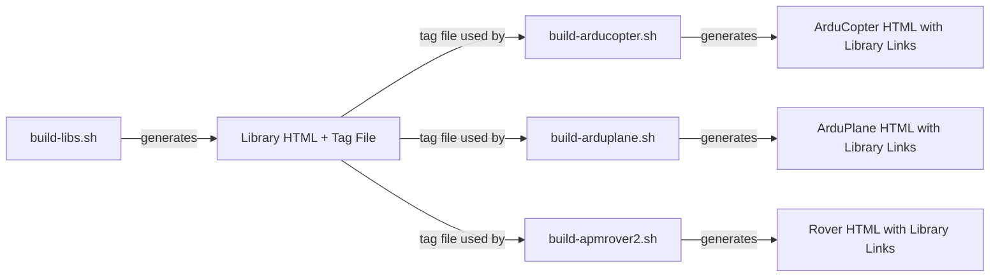
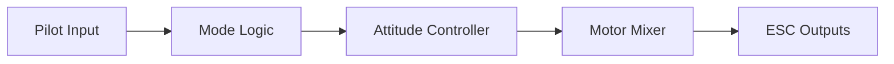
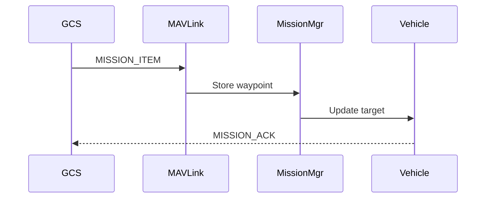
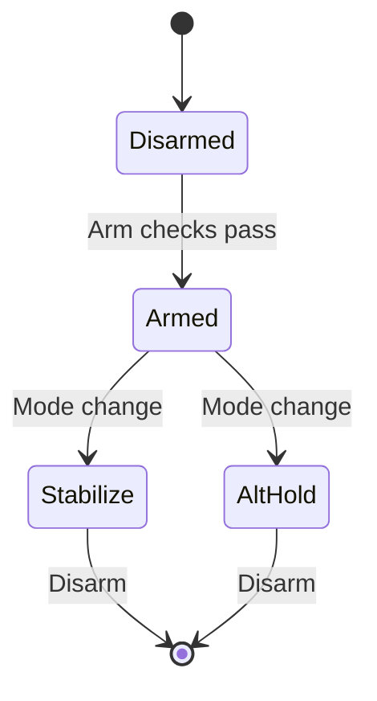

# ArduPilot Documentation Generation Guide

This guide explains how to generate, contribute to, and maintain ArduPilot's comprehensive code documentation.

## Overview

ArduPilot uses **Doxygen 1.9.8** to generate HTML API documentation from inline C++ comments and Markdown README files. The documentation system is modular, with separate builds for shared libraries and each vehicle type (ArduCopter, ArduPlane, Rover, ArduSub). This approach enables:

- **API Reference Documentation**: Automatically generated from inline Doxygen comments in source code
- **Module Architecture Guides**: README.md files explaining design patterns and integration approaches
- **Cross-Referenced Documentation**: Tag files link library documentation to vehicle-specific documentation
- **Visual Architecture Diagrams**: Mermaid diagrams embedded in Markdown for system visualization
- **Offline Browsable Docs**: Complete HTML documentation that works without internet connectivity

The documentation covers over 150 libraries, 6 vehicle implementations, hardware abstraction layers for multiple platforms, and development tools.

## Prerequisites

Before building documentation, ensure the following tools are installed:

### Required Tools

| Tool | Version | Purpose |
|------|---------|---------|
| **Doxygen** | 1.9.8+ | Primary API documentation generator - parses C++ code and generates HTML |
| **Graphviz** | 2.43+ | Graph visualization for class diagrams, inheritance trees, and call graphs |
| **Python 3** | 3.8+ | Required by documentation build scripts and utilities |
| **Bash** | 4.0+ | Shell environment for build scripts |

### Installation

**Ubuntu/Debian**:
```bash
sudo apt-get update
sudo apt-get install -y doxygen graphviz python3
```

**macOS** (using Homebrew):
```bash
brew install doxygen graphviz python3
```

**Verify Installation**:
```bash
doxygen --version    # Should show 1.9.8 or higher
dot -V               # Graphviz check
python3 --version    # Should show 3.8 or higher
```

### Optional Tools

- **markdownlint**: For Markdown syntax validation
- **grip**: For local GitHub-flavored Markdown preview
- **mermaid-cli**: For pre-rendering Mermaid diagrams (GitHub renders them natively)

## Building Documentation Locally

### Quick Start

The fastest way to generate all documentation:

```bash
# From ArduPilot repository root
./Tools/scripts/build_docs.sh
```

This master script builds documentation for all components (libraries and all vehicle types) and places output in `$HOME/build/ArduPilot-docs/` by default.

### Step-by-Step Build Process

For more control or to build specific components:

#### 1. Build Library Documentation (Required First)

Library documentation must be built first as it generates tag files used for cross-referencing:

```bash
cd /path/to/ardupilot
./docs/build-libs.sh
```

**Output**: 
- HTML documentation: `$HOME/build/ArduPilot-docs/libraries/html/`
- Tag file for cross-referencing: `$HOME/build/ArduPilot-docs/tags/libraries`

#### 2. Build Vehicle-Specific Documentation

After building library documentation, build vehicle-specific docs:

```bash
# ArduCopter (multicopter)
./docs/build-arducopter.sh

# ArduPlane (fixed-wing)
./docs/build-arduplane.sh

# Rover (ground vehicles)
./docs/build-apmrover2.sh

# ArduSub (underwater vehicles)
./docs/build-ardusub.sh
```

**Note**: Each vehicle build script checks for the library tag file. If missing, you'll see:
```
Must build libraries first
```

#### 3. Preview Generated Documentation

Open the generated HTML in your web browser:

```bash
# Library documentation
xdg-open $HOME/build/ArduPilot-docs/libraries/html/index.html

# Vehicle-specific documentation
xdg-open $HOME/build/ArduPilot-docs/arducopter/html/index.html
xdg-open $HOME/build/ArduPilot-docs/arduplane/html/index.html
xdg-open $HOME/build/ArduPilot-docs/apmrover2/html/index.html
xdg-open $HOME/build/ArduPilot-docs/ardusub/html/index.html
```

**macOS**: Replace `xdg-open` with `open`  
**Windows**: Use `start` or open files directly in File Explorer

### Configuring Output Location

By default, documentation builds to `$HOME/build/ArduPilot-docs/`. To change this:

```bash
# Set custom output directory
export DOCS_OUTPUT_BASE=/custom/path/to/docs
./Tools/scripts/build_docs.sh
```

The `DOCS_OUTPUT_BASE` environment variable is defined in `docs/setup.sh` and is sourced by all build scripts.

### Build Script Details

All documentation build scripts follow a standard pattern:

1. **Normalize to repository root**: Ensure consistent relative paths
2. **Source environment**: Load `docs/setup.sh` for `DOCS_OUTPUT_BASE` variable
3. **Check dependencies**: Vehicle scripts verify library tag file exists
4. **Invoke Doxygen**: Run `doxygen` with appropriate configuration file from `docs/config/`

Example script flow (`docs/build-arducopter.sh`):
```bash
#!/bin/bash
# Resolve script directory and change to repo root
cd "$(dirname "$0")/.."

# Load environment variables (DOCS_OUTPUT_BASE)
source docs/setup.sh

# Ensure library docs exist (for cross-referencing)
if [ ! -f "$DOCS_OUTPUT_BASE/tags/libraries" ]; then
    echo "Must build libraries first"
    exit 0
fi

# Generate ArduCopter documentation
doxygen docs/config/arducopter
```

### Incremental Builds

Documentation generation is time-consuming. For iterative documentation development:

- **Rebuild only changed component**: Run specific build script (e.g., `./docs/build-libs.sh`)
- **Full rebuild**: Delete `$DOCS_OUTPUT_BASE` and run `./Tools/scripts/build_docs.sh`
- **CI/CD**: Automated builds run on commits to update published documentation

## Documentation Structure

ArduPilot documentation is organized into four main categories:

### 1. Library Documentation

**Location**: `libraries/` (150+ directories)  
**Generated Output**: `$DOCS_OUTPUT_BASE/libraries/html/`

Covers all shared libraries used across vehicle types:

- **Hardware Abstraction Layer**: `AP_HAL/`, `AP_HAL_ChibiOS/`, `AP_HAL_Linux/`, `AP_HAL_ESP32/`, `AP_HAL_SITL/`
- **Sensors**: `AP_InertialSensor/`, `AP_Compass/`, `AP_Baro/`, `AP_GPS/`, `AP_RangeFinder/`, `AP_Airspeed/`, `AP_OpticalFlow/`
- **Navigation**: `AP_AHRS/`, `AP_NavEKF2/`, `AP_NavEKF3/`, `AP_InertialNav/`, `AP_Beacon/`, `AP_VisualOdom/`
- **Control**: `AC_AttitudeControl/`, `AC_PosControl/`, `AC_WPNav/`, `APM_Control/`, `AP_L1_Control/`, `AP_TECS/`
- **Communication**: `GCS_MAVLink/`, `AP_DroneCAN/`, `AP_DDS/`, `AP_RCProtocol/`, `AP_Frsky_Telem/`, `AP_MSP/`
- **Mission & Safety**: `AP_Mission/`, `AC_Fence/`, `AP_Rally/`, `AP_Arming/`, `AP_AdvancedFailsafe/`, `AP_SmartRTL/`
- **Motor Control**: `AP_Motors/`, `AR_Motors/`, `SRV_Channel/`, `AP_BLHeli/`
- **Logging**: `AP_Logger/`, `AP_Param/`, `StorageManager/`, `AP_Filesystem/`
- **Math & Utilities**: `AP_Math/`, `Filter/`, `PID/`, `AC_PID/`, `AP_Scheduler/`
- **Peripherals**: `AP_Camera/`, `AP_Mount/`, `AP_OSD/`, `AP_Scripting/`

Each library may contain:
- **README.md**: Architecture overview, usage patterns, integration guide
- **Doxygen headers**: Inline API documentation in source files
- **Example code**: In README files or `examples/` subdirectories

### 2. Vehicle-Specific Documentation

**Locations**: `ArduCopter/`, `ArduPlane/`, `Rover/`, `ArduSub/`, `Blimp/`, `AntennaTracker/`  
**Generated Output**: `$DOCS_OUTPUT_BASE/arducopter/html/`, etc.

Covers vehicle-specific implementations:

- **ArduCopter**: Multicopter flight modes, scheduler tasks, motor mixing, failsafe systems
- **ArduPlane**: Fixed-wing control, TECS energy management, L1 navigation, quadplane support
- **Rover**: Ground vehicle steering (Ackermann/skid), throttle control, waypoint navigation
- **ArduSub**: Underwater control, depth hold, joystick input, buoyancy management
- **Blimp**: Lighter-than-air vehicle control and fin management
- **AntennaTracker**: Antenna pointing algorithms and target tracking

Vehicle directories contain:
- **README.md**: Vehicle architecture, mode system, scheduler structure
- **Mode implementations**: `mode_*.cpp` files with flight mode logic
- **Parameter files**: `Parameters.h/cpp` with vehicle-specific parameters
- **GCS integration**: `GCS_*.cpp` with MAVLink message handling

### 3. Tools Documentation

**Location**: `Tools/`  
**Documentation**: README files in tool directories

Development and testing utilities:

- **autotest/**: SITL test framework and test scenarios
- **Replay/**: Log replay system for debugging and algorithm development
- **ros2/**: ROS2 integration and DDS configuration
- **environment_install/**: Development environment setup scripts
- **scripts/**: Build scripts, documentation generators, utilities
- **ardupilotwaf/**: WAF build system modules

### 4. Supporting Documentation

**Location**: `docs/`

- **glossary.md**: ArduPilot-specific terminology and acronyms
- **coordinate-frames.md**: NED frame, body frame, coordinate transformations
- **units.md**: Unit conventions (meters/centimeters, degrees/radians/centidegrees)
- **module-index.md**: Quick reference to all modules with descriptions

### Cross-Referencing Between Components

The modular build system uses **tag files** to enable cross-referencing:

1. Library build (`build-libs.sh`) generates `$DOCS_OUTPUT_BASE/tags/libraries`
2. Vehicle builds read this tag file to create links to library documentation
3. In generated HTML, clicking a library class in vehicle docs navigates to library docs



## Doxygen Configuration

ArduPilot's Doxygen configuration is modular and customizable.

### Configuration Files

| File | Purpose |
|------|---------|
| `Doxyfile.in` | Root configuration template (not directly used) |
| `docs/config/default` | Base Doxygen configuration (79KB) with all standard settings |
| `docs/config/libraries` | Configuration for building library documentation |
| `docs/config/arducopter` | ArduCopter-specific overrides and input paths |
| `docs/config/arduplane` | ArduPlane-specific overrides and input paths |
| `docs/config/apmrover2` | Rover-specific overrides and input paths |
| `docs/config/ardusub` | ArduSub-specific overrides and input paths |

### Key Configuration Settings

The following settings control documentation generation behavior:

#### Input Configuration

```
INPUT = . libraries ArduCopter ArduPlane Rover ArduSub
RECURSIVE = YES
FILE_PATTERNS = *.h *.hpp *.cpp *.c *.md
EXCLUDE_PATTERNS = */modules/* */build/* */.*/* */.git/*
```

- **INPUT**: Directories to scan for documentation
- **RECURSIVE**: Scan subdirectories
- **FILE_PATTERNS**: File types to process (C++, C, Markdown)
- **EXCLUDE_PATTERNS**: Skip external dependencies, build artifacts, hidden directories

#### Output Configuration

```
OUTPUT_DIRECTORY = $(DOCS_OUTPUT_BASE)/libraries
GENERATE_HTML = YES
GENERATE_LATEX = NO
HTML_OUTPUT = html
```

- **OUTPUT_DIRECTORY**: Where to place generated documentation
- **GENERATE_HTML**: Enable HTML output (primary format)
- **GENERATE_LATEX**: LaTeX/PDF generation (disabled for speed)

#### Documentation Extraction

```
EXTRACT_ALL = NO
EXTRACT_PRIVATE = NO
EXTRACT_STATIC = YES
EXTRACT_LOCAL_CLASSES = YES
```

- **EXTRACT_ALL = NO**: Only document items with Doxygen comments (encourages good documentation practices)
- **EXTRACT_PRIVATE = NO**: Skip private members (focus on public API)
- **EXTRACT_STATIC = YES**: Include static functions and variables

#### Source Code Browsing

```
SOURCE_BROWSER = YES
INLINE_SOURCES = NO
REFERENCED_BY_RELATION = YES
REFERENCES_RELATION = YES
```

- **SOURCE_BROWSER = YES**: Enable browsable source code with syntax highlighting
- **REFERENCED_BY_RELATION**: Show where functions are called from
- **REFERENCES_RELATION**: Show what functions call

#### Warning Configuration

```
WARNINGS = YES
WARN_IF_UNDOCUMENTED = YES
WARN_IF_DOC_ERROR = YES
WARN_NO_PARAMDOC = YES
```

- **WARN_IF_UNDOCUMENTED**: Flag public APIs without documentation
- **WARN_IF_DOC_ERROR**: Catch documentation syntax errors
- **WARN_NO_PARAMDOC**: Require @param documentation for all parameters

Target: **Zero warnings** in documentation builds.

#### Graphviz Integration

```
HAVE_DOT = YES
DOT_IMAGE_FORMAT = svg
CLASS_DIAGRAMS = YES
COLLABORATION_GRAPH = YES
INCLUDE_GRAPH = YES
CALL_GRAPH = NO
CALLER_GRAPH = NO
```

- **HAVE_DOT = YES**: Enable Graphviz for diagram generation
- **DOT_IMAGE_FORMAT = svg**: Use SVG for scalable diagrams
- **CLASS_DIAGRAMS**: Show class inheritance hierarchies
- **COLLABORATION_GRAPH**: Show class relationships
- **CALL_GRAPH / CALLER_GRAPH**: Disabled for performance (very slow on large codebases)

#### Markdown Support

```
MARKDOWN_SUPPORT = YES
AUTOLINK_SUPPORT = YES
```

- **MARKDOWN_SUPPORT**: Process Markdown files (README.md)
- **AUTOLINK_SUPPORT**: Automatically link class and function names

### Customizing Configuration

To modify documentation generation:

1. **For all builds**: Edit `docs/config/default`
2. **For libraries only**: Edit `docs/config/libraries`
3. **For specific vehicle**: Edit `docs/config/arducopter`, etc.

Common customizations:
- Enable call graphs (slow): Set `CALL_GRAPH = YES`
- Include private APIs: Set `EXTRACT_PRIVATE = YES`
- Change output location: Modify `OUTPUT_DIRECTORY`
- Add input directories: Append to `INPUT`

### Checking Configuration

Validate Doxygen configuration syntax:

```bash
doxygen -g test_config  # Generate default config for comparison
doxygen -d config docs/config/libraries  # Debug config parsing
```

## Documentation Standards

ArduPilot follows consistent documentation standards for clarity and maintainability.

### Doxygen Comment Style

#### File Headers

Every source and header file should begin with a file-level comment:

```cpp
/**
 * @file AP_ExampleClass.h
 * @brief Brief description of file purpose and main components
 * 
 * Detailed explanation of file's role in the system, key classes/functions,
 * and integration points with other modules.
 * 
 * @copyright Copyright (c) 2010-2025 ArduPilot.org
 */
```

#### Class Documentation

```cpp
/**
 * @class ExampleClass
 * @brief Brief one-line description of the class
 * 
 * @details Detailed multi-paragraph explanation of:
 * - Class purpose and responsibilities
 * - Usage patterns and lifecycle
 * - Thread-safety considerations
 * - Hardware dependencies if applicable
 * - Coordinate systems and unit conventions
 * 
 * @note Important usage notes or limitations
 * @warning Safety-critical considerations or constraints
 */
class ExampleClass {
    // ...
};
```

#### Method Documentation

```cpp
/**
 * @brief Calculate desired attitude from pilot input and current state
 * 
 * @details This function implements rate-controlled stabilize mode,
 *          converting pilot stick inputs to desired attitude quaternions
 *          while respecting configured limits and expo curves.
 *          
 *          Algorithm: Input scaling → Rate limiting → Attitude integration
 * 
 * @param[in]  pilot_roll_cd   Pilot roll input in centidegrees (-4500 to 4500)
 * @param[in]  pilot_pitch_cd  Pilot pitch input in centidegrees (-4500 to 4500)
 * @param[in]  pilot_yaw_rate  Pilot yaw rate in deg/s
 * @param[out] target_attitude Desired vehicle attitude quaternion (NED frame)
 * 
 * @return true if calculation successful, false if limits exceeded
 * 
 * @note This is called at main loop rate (typically 400Hz)
 * @warning Modifying rate limits can affect vehicle stability
 * 
 * @see AC_AttitudeControl::rate_controller()
 */
bool calculate_attitude(int32_t pilot_roll_cd, int32_t pilot_pitch_cd, 
                       float pilot_yaw_rate, Quaternion& target_attitude);
```

#### Required Doxygen Tags

| Tag | When Required | Example |
|-----|--------------|---------|
| `@brief` | All public classes, methods, functions | `@brief Calculate motor outputs` |
| `@details` | Complex methods (>10 lines) | `@details Algorithm explanation...` |
| `@param[in/out]` | All function parameters | `@param[in] speed_ms Velocity in m/s` |
| `@return` | All non-void functions | `@return true on success` |
| `@note` | Important usage information | `@note Called at 400Hz` |
| `@warning` | Safety-critical code | `@warning Affects flight stability` |
| `@see` | Related functions/classes | `@see AP_AHRS::get_rotation()` |

#### Safety-Critical Documentation

Flight-critical code requires enhanced documentation:

```cpp
/**
 * @brief Execute emergency failsafe procedure
 * 
 * @details Implements Radio Failsafe response when RC signal is lost.
 *          Sequence: Disarm check → Mode change → Descent initiation
 *          
 *          Safety: This function must complete within 100ms to prevent
 *          loss of vehicle control. No blocking operations permitted.
 * 
 * @param[in] failsafe_type Type of failsafe triggered (RC, GCS, Battery)
 * 
 * @return true if failsafe handled, false if already in failsafe
 * 
 * @warning SAFETY CRITICAL - Incorrect implementation can cause crashes
 * @warning Must not allocate memory or perform I/O operations
 * @note Tested in Tools/autotest/test_failsafe.py
 */
bool execute_failsafe(FailsafeType failsafe_type);
```

### Markdown README Structure

Every major module directory should contain a README.md following this template:

```markdown
# Module Name

## Overview
Brief 2-3 sentence description of module purpose and responsibilities.

## Architecture

[Mermaid diagram showing component relationships]

## Key Components
- **ComponentA**: Purpose and responsibility
- **ComponentB**: Purpose and responsibility

## Usage Patterns

### Common Operation
[Code example]

## Configuration Parameters

| Parameter | Description | Default | Range | Units |
|-----------|-------------|---------|-------|-------|

## Safety Considerations
- **Critical Path**: Description
- **Failsafe Behavior**: Failure response

## Testing

### SITL Testing
[Commands and procedures]

## References
- Source files: `libraries/ModuleName/*.cpp`
- Related modules: Links to related README files
```

### Mermaid Diagram Standards

Use Mermaid for architecture visualization in Markdown files:

#### Architecture Diagrams



#### Sequence Diagrams



#### State Diagrams



### Terminology Consistency

Always use consistent terminology from project standards:

- **Coordinate Frames**: Always specify (NED frame, body frame, earth frame) - never assume
- **Units**: Always explicit (m/s, cm/s, deg/s, centidegrees) - document all conversions
- **ArduPilot Terms**: Use official names (EKF3 not "Kalman filter", MAVLink not "telemetry")
- **Acronyms**: Define on first use or link to `docs/glossary.md`

Reference documents:
- `docs/glossary.md`: ArduPilot-specific terms and acronyms
- `docs/coordinate-frames.md`: Frame definitions and transformations
- `docs/units.md`: Unit conventions and conversion factors

### Code Examples

All code examples must:
- **Compile**: Test against current codebase
- **Be concise**: Keep under 20 lines when possible
- **Include context**: Show necessary headers and initialization
- **Follow style**: Match ArduPilot coding standards
- **Handle errors**: Show typical error checking patterns

Example:
```cpp
// Initialize attitude control
AC_AttitudeControl attitude_control(ahrs);
attitude_control.init();

// Set desired attitude (roll=0°, pitch=5°, yaw=90°)
attitude_control.input_euler_angle_roll_pitch_yaw(
    0.0f,              // roll in radians
    radians(5.0f),     // pitch in radians  
    radians(90.0f),    // yaw in radians
    true               // use yaw rate feed-forward
);
```

## Contributing Documentation

High-quality documentation is essential for ArduPilot's safety-critical mission. All contributors are expected to document their code.

### Documentation Requirements for Pull Requests

Every pull request must include appropriate documentation:

#### 1. New Public APIs

**Required**: Doxygen headers for all public classes, methods, and functions

```cpp
// ❌ UNACCEPTABLE - No documentation
void calculate_position(float dt);

// ✅ REQUIRED - Complete documentation
/**
 * @brief Update position estimate using inertial integration
 * 
 * @details Integrates accelerometer data over time to estimate position.
 *          Uses complementary filter with GPS corrections.
 * 
 * @param[in] dt Time step in seconds since last update
 * 
 * @note Call at consistent rate (typically 400Hz)
 */
void calculate_position(float dt);
```

#### 2. Complex Algorithms

**Required**: Inline comments explaining logic flow

```cpp
// ✅ Good example - Logic explained step-by-step
void update_navigation() {
    // Step 1: Get current position from EKF
    Vector3f position;
    if (!ahrs.get_position(position)) {
        // EKF not ready - maintain previous target
        return;
    }
    
    // Step 2: Calculate desired velocity toward waypoint
    Vector2f velocity_target = (waypoint - position.xy()) * speed_gain;
    
    // Step 3: Apply velocity limit (configured in parameters)
    velocity_target.limit_length(param_speed_max.get());
    
    // Step 4: Send to position controller
    pos_control.set_velocity_target_xy(velocity_target);
}
```

#### 3. New Modules or Major Features

**Required**: README.md in module directory

Contents must include:
- Module overview and purpose
- Architecture diagram (Mermaid)
- Key classes and their relationships
- Usage examples
- Configuration parameters
- Safety considerations
- Testing procedures

#### 4. Safety-Critical Code

**Required**: Enhanced documentation with @warning tags

```cpp
/**
 * @brief Disarm vehicle motors immediately
 * 
 * @warning SAFETY CRITICAL - Stops all motors instantly
 * @warning Only call when vehicle is on ground or in emergency
 * @warning No safety checks performed - assumes operator decision
 */
void force_disarm();
```

### Documentation Quality Checklist

Before submitting a pull request, verify:

- [ ] All new public APIs have `@brief` documentation
- [ ] All function parameters documented with `@param[in/out]`
- [ ] All non-void functions have `@return` documentation
- [ ] Complex algorithms (>20 lines) have inline explanatory comments
- [ ] Safety-critical code marked with `@warning` tags
- [ ] README.md updated if module architecture changed
- [ ] Code examples compile without errors
- [ ] Terminology consistent with project glossary
- [ ] Units explicitly specified (never ambiguous)
- [ ] Coordinate frames explicitly specified where relevant

### Building Documentation to Check for Warnings

Always build documentation before submitting to catch warnings:

```bash
# Build library documentation
./docs/build-libs.sh 2>&1 | grep -i warning

# Build vehicle documentation
./docs/build-arducopter.sh 2>&1 | grep -i warning
```

**Target**: Zero warnings

Common warnings to fix:
- `warning: no matching file member found`: Function documented but doesn't exist
- `warning: argument 'param_name' not found`: Parameter name mismatch
- `warning: return type of member X is not documented`: Missing @return
- `warning: no uniquely matching class member found`: Typo in @see reference

### Documentation Style Guidelines

#### Use Active Voice

```cpp
// ❌ Passive: "The attitude is calculated by this function"
// ✅ Active: "Calculate vehicle attitude from sensor data"
```

#### Be Specific About Units

```cpp
// ❌ Ambiguous
// @param speed Current speed

// ✅ Specific
// @param speed_ms Current ground speed in meters per second
```

#### Explain the "Why" Not Just the "What"

```cpp
// ❌ Only describes what
// Calculate the square root

// ✅ Explains purpose
// Calculate the square root to convert variance to standard deviation
// for sensor noise estimation in the EKF prediction step
```

#### Document Limitations and Edge Cases

```cpp
/**
 * @brief Convert GPS coordinates to local NED position
 * 
 * @note Accuracy degrades beyond 10km from home position due to
 *       Earth curvature approximation in flat-earth model
 * 
 * @warning Returns invalid position if home not set - check ahrs.home_is_set()
 */
```

### Reviewing Documentation in Pull Requests

When reviewing code, check documentation for:

1. **Completeness**: All required tags present (@brief, @param, @return)
2. **Accuracy**: Documentation matches actual implementation
3. **Clarity**: Explanations are understandable to new developers
4. **Safety**: Critical code properly marked with @warning
5. **Examples**: Complex APIs include usage examples
6. **Testing**: Examples compile and work as documented

### Maintaining Documentation

Documentation must stay synchronized with code:

- **Code changes**: Update affected documentation in same commit
- **API changes**: Update all references and examples
- **Parameter changes**: Update parameter tables in README files
- **Architecture changes**: Update diagrams and overview sections
- **Deprecation**: Mark deprecated APIs with `@deprecated` tag

### Documentation Resources

- **Doxygen Manual**: https://www.doxygen.nl/manual/
- **Mermaid Documentation**: https://mermaid.js.org/
- **ArduPilot Glossary**: `docs/glossary.md`
- **Coordinate Frames**: `docs/coordinate-frames.md`
- **Unit Conventions**: `docs/units.md`
- **Module Index**: `docs/module-index.md`

## CI/CD Integration

ArduPilot documentation is automatically built and validated through continuous integration.

### Automated Documentation Builds

Documentation generation runs automatically on:
- **Pull requests**: Validates documentation compiles without warnings
- **Commits to master**: Generates and publishes updated documentation
- **Release tags**: Creates versioned documentation snapshots

### Pull Request Documentation Checks

Each pull request triggers automated documentation validation:

1. **Build Validation**: Attempts to build affected documentation components
2. **Warning Check**: Fails if new Doxygen warnings introduced
3. **Markdown Validation**: Checks README syntax and formatting
4. **Example Compilation**: Verifies code examples compile

Workflow output shows:
```
✓ Documentation builds successfully
✓ Zero Doxygen warnings
✓ Markdown files valid
✓ Code examples compile
```

### Documentation Publishing

Generated documentation is published to:
- **Development Docs**: https://dev.ardupilot.org/docs/ (auto-updated from master)
- **Versioned Docs**: Tagged release documentation (stable versions)

Publishing workflow:
1. Build scripts generate HTML documentation
2. Output uploaded to web server
3. Search index updated
4. Documentation versioned by git tag

### Local Pre-Submission Validation

Before submitting pull requests, run local validation:

```bash
# Full documentation build
./Tools/scripts/build_docs.sh

# Check for warnings
./docs/build-libs.sh 2>&1 | tee doc-warnings.log
grep -i "warning:" doc-warnings.log && echo "⚠️ Warnings found" || echo "✓ No warnings"

# Validate Markdown (if markdownlint installed)
markdownlint 'libraries/**/*.md' 'ArduCopter/README.md' --ignore node_modules
```

### Documentation Quality Metrics

CI/CD tracks documentation quality metrics:
- **API Documentation Coverage**: Percentage of public APIs with Doxygen headers
- **Warning Count**: Total Doxygen warnings (target: 0)
- **README Coverage**: Percentage of modules with README files
- **Documentation Build Time**: Time to generate all documentation

### Continuous Improvement

Documentation quality improves through:
- **Periodic Audits**: Quarterly review of high-traffic modules
- **Contributor Guidelines**: Required documentation in PR process
- **Automated Enforcement**: CI checks prevent undocumented code merges
- **Community Feedback**: Documentation issues tracked and prioritized

## Module Index

For a comprehensive list of all ArduPilot modules with descriptions and links to their documentation, see:

**[docs/module-index.md](module-index.md)**

The module index provides:
- Complete list of vehicle implementations
- All library modules organized by category
- Brief descriptions of each module's purpose
- Links to README documentation where available
- Quick reference for finding specific functionality

## Troubleshooting

### Common Issues

#### 1. "Must build libraries first"

**Problem**: Vehicle documentation build fails with tag file check

**Solution**: Build library documentation first:
```bash
./docs/build-libs.sh
# Then retry vehicle build
./docs/build-arducopter.sh
```

#### 2. Doxygen Not Found

**Problem**: `bash: doxygen: command not found`

**Solution**: Install Doxygen:
```bash
sudo apt-get install doxygen graphviz
```

#### 3. Documentation Output Not Found

**Problem**: Can't find generated HTML files

**Solution**: Check `DOCS_OUTPUT_BASE` variable:
```bash
source docs/setup.sh
echo $DOCS_OUTPUT_BASE
ls -la $DOCS_OUTPUT_BASE
```

#### 4. Graphviz Diagrams Not Generated

**Problem**: Class diagrams missing from documentation

**Solution**: Install Graphviz:
```bash
sudo apt-get install graphviz
# Verify
dot -V
```

Then rebuild documentation.

#### 5. Mermaid Diagrams Not Rendering

**Problem**: Mermaid diagrams show as text in README

**Cause**: Viewing platform doesn't support Mermaid

**Solution**: 
- GitHub renders Mermaid natively (view on GitHub)
- Use https://mermaid.live for preview during editing
- Install Mermaid preview extension in your editor

#### 6. High Number of Warnings

**Problem**: Hundreds of Doxygen warnings

**Common Causes**:
- Undocumented public functions
- Parameter name mismatches in @param tags
- Invalid @see references
- Missing @return documentation

**Solution**: Fix systematically:
```bash
# Save warnings to file
./docs/build-libs.sh 2>&1 | grep "warning:" > warnings.txt

# Group by type
grep "no matching class member" warnings.txt
grep "argument.*not found" warnings.txt
grep "return type.*not documented" warnings.txt
```

### Performance Issues

#### Slow Documentation Builds

**Causes**:
- Large codebase (150+ libraries)
- Graphviz diagram generation
- Call graph generation (if enabled)

**Optimization**:
1. Build only changed components (not full rebuild)
2. Disable call graphs (very slow): Set `CALL_GRAPH = NO` in config
3. Use incremental builds during development
4. Use fast SSD for output directory

#### Out of Memory During Build

**Solution**: Increase system memory or:
```bash
# Reduce Doxygen memory usage
# Edit docs/config/libraries:
DOT_GRAPH_MAX_NODES = 50
MAX_DOT_GRAPH_DEPTH = 3
```

## Additional Resources

### Official Documentation

- **ArduPilot Developer Wiki**: https://ardupilot.org/dev/
- **Doxygen Manual**: https://www.doxygen.nl/manual/
- **Markdown Guide**: https://www.markdownguide.org/
- **Mermaid Documentation**: https://mermaid.js.org/

### ArduPilot Documentation Files

- **Glossary**: `docs/glossary.md` - ArduPilot terminology
- **Coordinate Frames**: `docs/coordinate-frames.md` - NED frame conventions
- **Unit Conventions**: `docs/units.md` - Measurement units
- **Module Index**: `docs/module-index.md` - Complete module listing
- **Build Guide**: `BUILD.md` - Firmware build instructions
- **Contributing**: `CONTRIBUTING.md` - Contribution guidelines

### Getting Help

- **Forum**: https://discuss.ardupilot.org/
- **Discord**: ArduPilot Discord server
- **GitHub Issues**: https://github.com/ArduPilot/ardupilot/issues
- **Developer Mailing List**: devel@ardupilot.org

---

**Last Updated**: 2025  
**Documentation Version**: Comprehensive Guide v1.0
