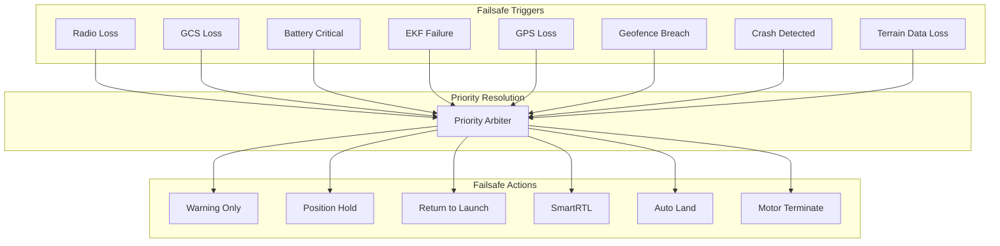
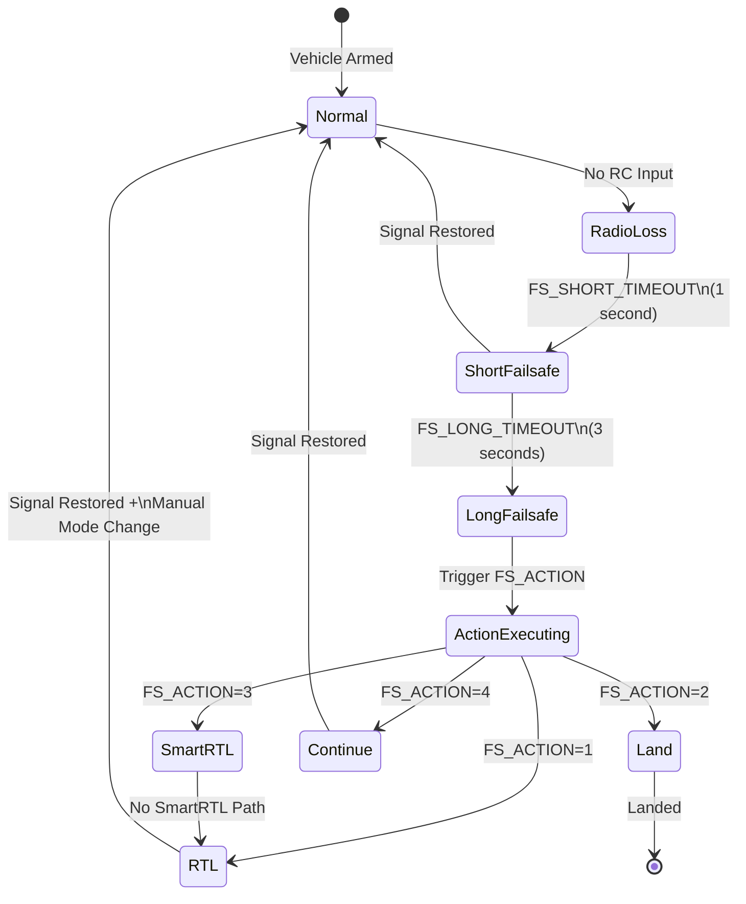
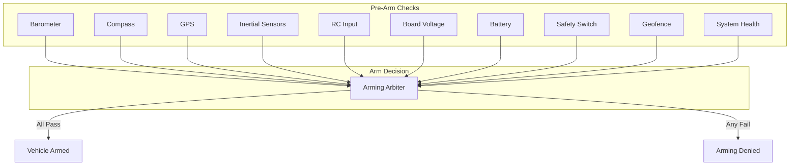
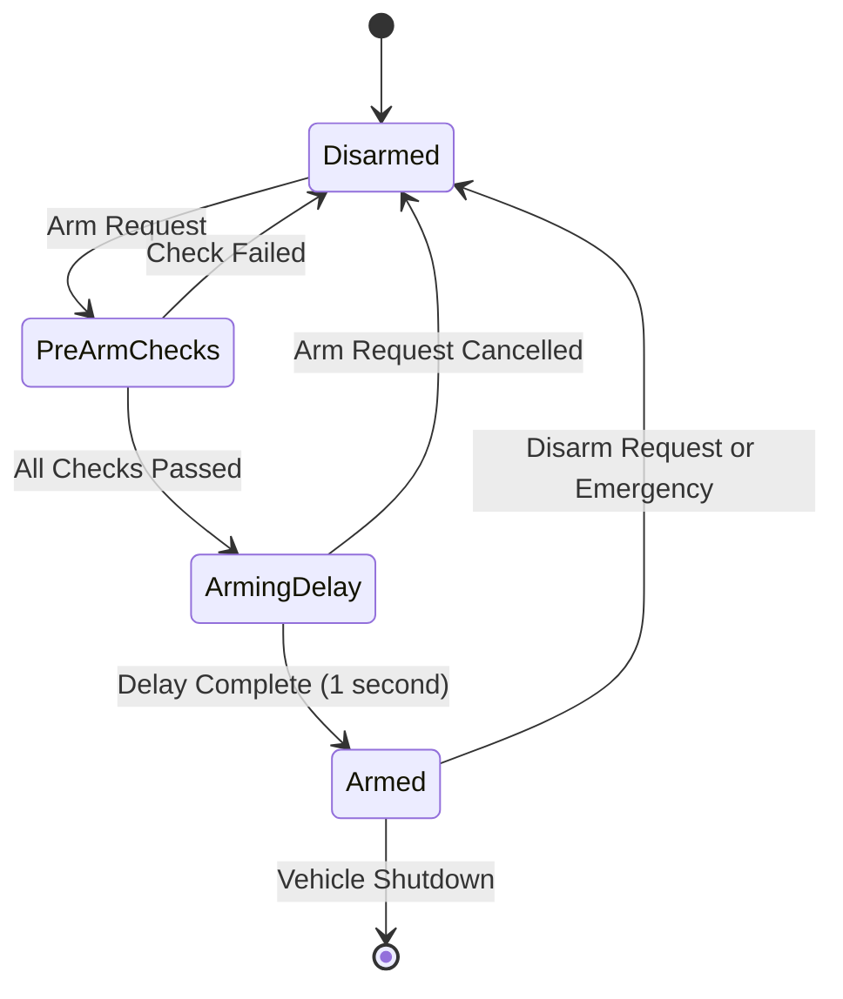
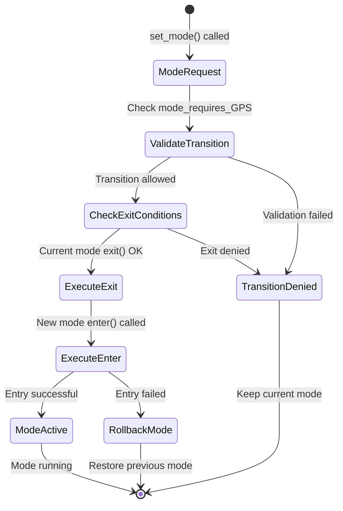
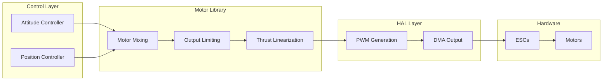
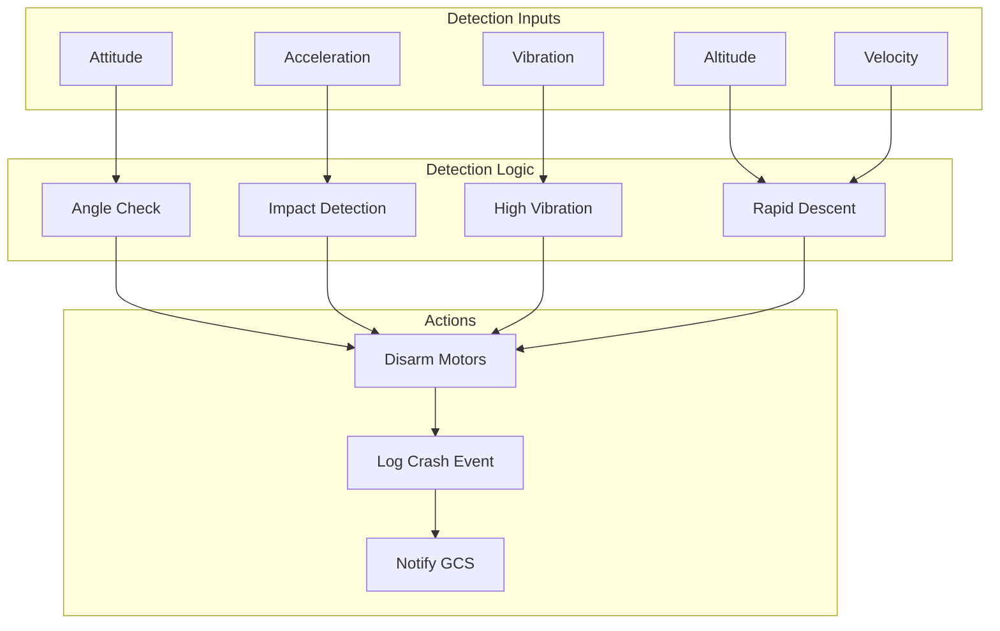

# ArduPilot Safety-Critical Code Paths


## Table of Contents

- [Overview](#overview)
- [Safety-Critical Code Path Identification](#safety-critical-code-path-identification)
- [Critical Code Path Documentation Standards](#critical-code-path-documentation-standards)
- [Failsafe Handler Critical Paths](#failsafe-handler-critical-paths)
- [Pre-Arm Check Critical Paths](#pre-arm-check-critical-paths)
- [Mode Transition Safety Validation](#mode-transition-safety-validation)
- [EKF Health Monitoring Critical Paths](#ekf-health-monitoring-critical-paths)
- [Motor Output Safety and Emergency Stops](#motor-output-safety-and-emergency-stops)
- [Crash Detection and Recovery](#crash-detection-and-recovery)
- [Geofence Violation Handling](#geofence-violation-handling)
- [Resource Constraints for Critical Paths](#resource-constraints-for-critical-paths)
- [Timing Requirements for Safety Operations](#timing-requirements-for-safety-operations)
- [Error Propagation in Critical Paths](#error-propagation-in-critical-paths)
- [Testing Requirements](#testing-requirements)
- [Code Review Requirements](#code-review-requirements)

---

## Overview

### Purpose

This document identifies and documents all safety-critical code paths within the ArduPilot autopilot software. Safety-critical code paths are sections of code where failures, incorrect behavior, or timing violations could result in:

- Loss of vehicle control
- Harm to persons or property
- Mission failure with safety implications
- Unrecoverable vehicle states
- Violation of regulatory requirements

### Scope

Safety-critical code paths span across multiple subsystems:

- **Vehicle Control**: All vehicle types (Copter, Plane, Rover, Sub, Blimp, AntennaTracker)
- **Core Libraries**: Sensor fusion, navigation, motor control, communication
- **Hardware Abstraction**: Real-time scheduling, interrupt handling, device drivers
- **Safety Systems**: Failsafes, arming checks, geofencing, crash detection

### Safety Assurance Approach

ArduPilot employs multiple layers of safety assurance:

1. **Defensive Programming**: Extensive validation, bounds checking, sanity tests
2. **Redundancy**: Multiple sensor sources, backup algorithms (DCM fallback for EKF)
3. **Failsafe Cascades**: Hierarchical failsafe responses with escalation
4. **Arming Interlocks**: Comprehensive pre-flight validation
5. **Real-Time Monitoring**: Continuous health checks of critical subsystems
6. **Emergency Procedures**: Motor stop, crash detection, parachute deployment

---

## Safety-Critical Code Path Identification

### Classification Criteria

Code paths are classified as safety-critical if they meet one or more of the following criteria:

#### 1. Direct Vehicle Control
- Code that generates motor, servo, or actuator commands
- Attitude, position, or velocity controllers
- Navigation and guidance algorithms
- Motor mixing and output limiting

**Identification Pattern**:
```cpp
// Safety-critical: Direct motor output
void AP_Motors::output()
void SRV_Channels::calc_pwm()
void AC_AttitudeControl::rate_controller_run()
```

#### 2. Safety System Implementation
- Failsafe detection and triggering logic
- Arming and disarming sequences
- Geofence boundary enforcement
- Crash detection and recovery
- Emergency stop mechanisms

**Identification Pattern**:
```cpp
// Safety-critical: Failsafe handling
void Copter::failsafe_radio_on_event()
void Plane::failsafe_battery_event()
bool AP_Arming_Copter::arm()
void Copter::set_mode(Mode &mode)
```

#### 3. State Estimation and Sensor Fusion
- EKF covariance updates and state propagation
- Sensor health monitoring and fallback logic
- IMU, GPS, and barometer data fusion
- Compass calibration and interference detection

**Identification Pattern**:
```cpp
// Safety-critical: Navigation estimation
void NavEKF3_core::UpdateFilter()
bool AP_AHRS_NavEKF::healthy()
void AP_InertialSensor::update()
void AP_GPS::update_instance()
```

#### 4. Interrupt and Real-Time Contexts
- Hardware interrupt handlers
- DMA completion callbacks
- High-priority scheduler tasks
- Time-critical data sampling

**Identification Pattern**:
```cpp
// Safety-critical: Interrupt context
void AP_HAL::panic()
__attribute__((interrupt)) void TIM1_IRQHandler()
void AP_InertialSensor_Backend::_notify_new_accel_sample()
```

#### 5. Memory and Resource Management
- Static memory allocation in critical paths
- DMA buffer management
- Stack usage in deep call chains
- Heap allocation in time-critical code (should be avoided)

**Identification Pattern**:
```cpp
// Safety-critical: Resource management
void *hal.util->malloc_type(size, AP_HAL::Util::MEM_DMA_SAFE)
WITH_SEMAPHORE(_rsem);  // Deadlock risk if not careful
```

### Critical Path Inventory

The following directories contain the highest concentration of safety-critical code:

#### Vehicle-Specific Critical Paths

| Vehicle | Critical Files | Primary Safety Concerns |
|---------|---------------|------------------------|
| **ArduCopter** | `failsafe.cpp`, `crash_check.cpp`, `ekf_check.cpp`, `motors.cpp`, `mode_*.cpp` | Loss of lift, uncontrolled descent, collision |
| **ArduPlane** | `failsafe.cpp`, `quadplane.cpp`, `transition.cpp`, `landing.cpp`, `mode_*.cpp` | Stall, loss of control authority, landing accidents |
| **Rover** | `failsafe.cpp`, `mode_*.cpp`, `fence.cpp`, `crash_check.cpp` | Runaway vehicle, fence violations, tip-over |
| **ArduSub** | `failsafe.cpp`, `motors.cpp`, `mode_*.cpp`, `leak_detector.cpp` | Loss of depth control, flooding, entanglement |

#### Library Critical Paths

| Library | Critical Components | Safety Function |
|---------|-------------------|----------------|
| **AP_Arming** | `AP_Arming.cpp`, `AP_Arming_Copter.cpp`, `AP_Arming_Plane.cpp` | Pre-flight validation, prevent unsafe arming |
| **AP_Motors** | `AP_Motors_Class.cpp`, `AP_MotorsMatrix.cpp`, `AP_MotorsHeli.cpp` | Motor output limiting, thrust linearization |
| **AC_AttitudeControl** | `AC_AttitudeControl.cpp`, `AC_AttitudeControl_Heli.cpp` | Stability maintenance, rate limiting |
| **AC_PosControl** | `AC_PosControl.cpp`, `AC_Circle.cpp`, `AC_Loiter.cpp` | Position hold, waypoint following |
| **AP_NavEKF3** | `AP_NavEKF3_core.cpp`, `AP_NavEKF3_Control.cpp` | State estimation accuracy, divergence detection |
| **AP_AHRS** | `AP_AHRS.cpp`, `AP_AHRS_NavEKF.cpp` | Attitude estimation, sensor fusion |
| **AP_InertialSensor** | `AP_InertialSensor.cpp`, backend drivers | Sensor sampling integrity, calibration |
| **GCS_MAVLink** | `GCS_Common.cpp`, `GCS_Fence.cpp` | Command validation, mission safety checks |
| **AP_HAL** | `Scheduler.cpp`, `Device.cpp`, interrupt handlers | Real-time task execution, hardware interface |

---

## Critical Code Path Documentation Standards

### Mandatory Documentation Tags

All safety-critical functions must include the following Doxygen tags:

#### @safety Tag
Indicates the safety criticality level and primary risks:

```cpp
/**
 * @safety CRITICAL: Controls motor output directly, affects flight stability
 * @safety LEVEL: High - Failure could result in loss of vehicle control
 */
```

Safety Levels:
- **CRITICAL**: Direct control authority, immediate safety impact
- **HIGH**: Significant safety impact, affects multiple systems
- **MEDIUM**: Indirect safety impact, cascading failure potential
- **LOW**: Minor safety impact, mitigated by other systems

#### @failsafe Tag
Documents failsafe triggers, actions, and priorities:

```cpp
/**
 * @failsafe Triggers: Radio loss timeout, GCS heartbeat loss
 * @failsafe Actions: RTL (primary), Land (fallback), Terminate (last resort)
 * @failsafe Priority: Radio loss overrides GCS failsafe
 * @failsafe Recovery: Automatic if signal restored within recovery window
 * @failsafe Timeout: 3 seconds radio loss, 5 seconds GCS loss
 */
```

#### @thread_safety Tag
Documents concurrency requirements and constraints:

```cpp
/**
 * @thread_safety This function is NOT thread-safe
 * @concurrency Must hold _backend_sem semaphore before calling
 * @interrupt Safe to call from interrupt context
 * @atomic Uses atomic operations for _sample_count access
 * @deadlock Risk: Do not call with scheduler lock held
 */
```

#### @timing Tag
Documents real-time constraints and performance requirements:

```cpp
/**
 * @timing Maximum execution time: 100 microseconds
 * @timing Called at: 400Hz (main loop rate)
 * @timing Deadline: Must complete before next IMU sample
 * @timing Jitter: ±5 microseconds acceptable
 * @cpu Target CPU usage: <10% per cycle
 */
```

#### @error_handling Tag
Documents error detection, propagation, and recovery:

```cpp
/**
 * @error_handling 
 * - Returns false on sensor communication failure
 * - Calls AP_HAL::panic() on memory corruption detected
 * - Logs error to DataFlash on CRC mismatch
 * - Falls back to secondary sensor if primary unhealthy
 * - Triggers failsafe on persistent errors (3+ cycles)
 * - No exceptions thrown (exceptions disabled in build)
 */
```

#### @resource Tag
Documents resource usage and constraints:

```cpp
/**
 * @resource Stack usage: 256 bytes (measured with CONFIG_HAL_DEBUG)
 * @resource Heap allocation: None (static buffers only)
 * @resource Memory: Allocates from DMA-safe region (CCM RAM)
 * @resource CPU: ~5000 cycles typical, ~8000 worst-case
 * @resource Semaphores: Acquires _backend_sem (50us typical hold time)
 */
```

### Documentation Template for Safety-Critical Functions

Complete example combining all required tags:

```cpp
/**
 * @brief Process radio failsafe condition and trigger appropriate response
 * 
 * @details Implements the radio failsafe state machine. Monitors radio link
 *          quality and triggers failsafe actions when signal is lost for more
 *          than FS_LONG_TIMEOUT (3 seconds). Implements hysteresis to prevent
 *          failsafe oscillation during marginal signal conditions.
 * 
 * @param[in] pwm_valid  True if valid PWM signal received this cycle
 * @param[in] rssi       Received signal strength indicator (0-100)
 * 
 * @return true if failsafe triggered, false otherwise
 * 
 * @safety CRITICAL: Loss of radio control can result in flyaway or crash
 * @safety LEVEL: Critical - Direct impact on vehicle control authority
 * 
 * @failsafe Triggers: Radio PWM loss, RSSI below threshold, control range exceeded
 * @failsafe Actions: 
 *   - Stage 1 (1s): Warning, begin position hold
 *   - Stage 2 (3s): Execute FS_ACTION (RTL/Land/SmartRTL)
 *   - Stage 3 (30s): Force land if RTL fails
 * @failsafe Priority: Overrides GCS failsafe, overridden by battery critical
 * @failsafe Recovery: Requires manual mode change after signal restoration
 * 
 * @thread_safety This function is thread-safe
 * @concurrency No locks required (called from main thread only)
 * @interrupt Must NOT be called from interrupt context
 * 
 * @timing Maximum execution time: 50 microseconds
 * @timing Called at: 50Hz (failsafe check rate)
 * @timing Deadline: Must complete within 20ms scheduler timeslice
 * 
 * @error_handling
 * - Validates pwm_valid against internal state consistency
 * - Logs failsafe trigger to DataFlash MSG_FAILSAFE
 * - Logs recovery to DataFlash MSG_FAILSAFE_RECOVER
 * - No error return - always takes best-effort action
 * 
 * @resource Stack usage: 128 bytes
 * @resource Heap allocation: None
 * @resource CPU: ~2000 cycles typical
 * 
 * @pre Vehicle must be armed for failsafe to trigger actions
 * @pre GPS must be available for RTL action
 * @post Vehicle mode may change if failsafe triggered
 * @post Failsafe state logged to DataFlash
 * 
 * @note Failsafe timing configurable via FS_LONG_TIMEOUT parameter
 * @warning Reducing FS_LONG_TIMEOUT below 2 seconds may cause false triggers
 * 
 * @see set_mode() for mode change implementation
 * @see do_RTL() for return-to-launch behavior
 * 
 * Source: /ArduCopter/failsafe.cpp:45
 */
bool Copter::failsafe_radio_on_event()
{
    // Implementation details...
}
```

### Class-Level Safety Documentation

Safety-critical classes require additional documentation:

```cpp
/**
 * @class AC_AttitudeControl
 * @brief Attitude controller for multicopter vehicles
 * 
 * @details Implements rate and angle PID controllers for roll, pitch, and yaw.
 *          Uses quaternion mathematics to avoid gimbal lock. Supports both
 *          earth-frame and body-frame angle inputs.
 * 
 * @safety CRITICAL: Direct control of vehicle attitude and angular rates
 * @safety Failure modes:
 *   - Excessive P gain: Oscillation, potential structural damage
 *   - Insufficient I gain: Drift, loss of position hold
 *   - Excessive D gain: High-frequency noise amplification
 *   - Rate limiting failure: Loss of control authority
 * 
 * @thread_safety All methods are thread-safe via internal semaphore
 * @realtime All update methods must complete within 2.5ms at 400Hz
 * 
 * @note Singleton access via plane.attitude_control or copter.attitude_control
 * @warning Tuning changes affect flight stability - test in SITL first
 * 
 * @example
 * @code
 * // Initialize attitude controller
 * attitude_control->set_throttle_out(0.5f, true, POSCONTROL_THROTTLE_CUTOFF_FREQ);
 * attitude_control->input_euler_angle_roll_pitch_euler_rate_yaw(
 *     roll_target_cd, pitch_target_cd, yaw_rate_target_cds);
 * attitude_control->rate_controller_run();
 * @endcode
 * 
 * Source: /libraries/AC_AttitudeControl/AC_AttitudeControl.h
 */
class AC_AttitudeControl {
    // Class implementation...
};
```

---

## Failsafe Handler Critical Paths

### Failsafe Architecture

ArduPilot implements a hierarchical failsafe system with multiple trigger sources and escalating responses:



### Failsafe Priority Hierarchy

Failsafes are prioritized to ensure the most critical conditions take precedence:

| Priority | Failsafe Type | Trigger Condition | Default Action | Override Capability |
|----------|--------------|-------------------|----------------|-------------------|
| 1 (Highest) | **Crash Detection** | Rapid deceleration, inverted attitude | Disarm motors | None - immediate action |
| 2 | **Battery Critical** | Voltage < BATT_CRT_VOLT | Land immediately | None - safety override |
| 3 | **EKF Failsafe** | EKF variance exceeds threshold | Land or RTL | Can be disabled (not recommended) |
| 4 | **Geofence Breach** | Position outside defined boundary | RTL or Land | Pilot override in some modes |
| 5 | **Radio Loss** | No RC input for FS_LONG_TIMEOUT | Configurable (RTL/Land/SmartRTL) | Requires mode change after recovery |
| 6 | **GCS Loss** | No MAVLink heartbeat | Configurable (RTL/Land/Continue) | Automatic recovery possible |
| 7 | **GPS Loss** | No GPS fix in GPS-dependent mode | Switch to non-GPS mode or Land | Automatic recovery on fix restore |
| 8 (Lowest) | **Terrain Data Loss** | No terrain data available | Altitude hold or RTL | Automatic recovery |

### Radio Failsafe Critical Path

**Source Files**:
- ArduCopter: `/ArduCopter/failsafe.cpp:failsafe_radio_on_event()`
- ArduPlane: `/ArduPlane/failsafe.cpp:failsafe_radio_on_event()`
- Rover: `/Rover/failsafe.cpp:failsafe_radio_on_event()`

**State Machine**:



**Critical Implementation Details**:

```cpp
/**
 * @safety CRITICAL: Radio failsafe - last line of defense against RC loss
 * @failsafe Triggers: fs.radio == true for > FS_LONG_TIMEOUT
 * @failsafe Actions: Based on FS_ACTION parameter
 */
void Copter::failsafe_radio_on_event()
{
    // Log failsafe trigger
    AP::logger().Write_Error(LogErrorSubsystem::FAILSAFE_RADIO, 
                             LogErrorCode::FAILSAFE_OCCURRED);
    
    // Trigger appropriate action based on FS_ACTION parameter
    switch (g.failsafe_action) {
        case FS_ACTION_RTL:
            if (!set_mode(Mode::Number::RTL, ModeReason::RADIO_FAILSAFE)) {
                // RTL failed, force land
                set_mode(Mode::Number::LAND, ModeReason::RADIO_FAILSAFE);
            }
            break;
            
        case FS_ACTION_LAND:
            set_mode(Mode::Number::LAND, ModeReason::RADIO_FAILSAFE);
            break;
            
        case FS_ACTION_SMART_RTL:
            if (!set_mode(Mode::Number::SMART_RTL, ModeReason::RADIO_FAILSAFE)) {
                // SmartRTL unavailable, fall back to regular RTL
                if (!set_mode(Mode::Number::RTL, ModeReason::RADIO_FAILSAFE)) {
                    set_mode(Mode::Number::LAND, ModeReason::RADIO_FAILSAFE);
                }
            }
            break;
            
        // Additional cases...
    }
    
    // Send telemetry notification
    gcs().send_text(MAV_SEVERITY_WARNING, "Radio failsafe activated");
}
```

**Safety-Critical Aspects**:
1. **No Heap Allocation**: All state stored in pre-allocated structures
2. **Guaranteed Progress**: Fallback chain ensures action taken (RTL→Land)
3. **Logging**: All transitions logged for post-flight analysis
4. **Recovery Mechanism**: Requires deliberate pilot action to prevent false recovery
5. **Timing Validation**: Uses millis() time checks with overflow protection

### Battery Failsafe Critical Path

**Source Files**:
- Core: `/libraries/AP_BattMonitor/AP_BattMonitor.cpp`
- Vehicle: `/ArduCopter/failsafe.cpp:failsafe_battery_event()`

**Trigger Conditions**:

| Failsafe Level | Trigger | Vehicle State | Action |
|---------------|---------|---------------|--------|
| **Low Battery** | Voltage < BATT_LOW_VOLT | Flying | RTL or Land (configurable) |
| **Critical Battery** | Voltage < BATT_CRT_VOLT | Flying | Force Land immediately |
| **Capacity Failsafe** | mAh used > BATT_CAPACITY * BATT_FS_MAH | Flying | RTL or Land |
| **Critical Capacity** | mAh used > BATT_CAPACITY * BATT_CRT_MAH | Flying | Force Land |

**Critical Implementation**:

```cpp
/**
 * @safety CRITICAL: Battery critical prevents power loss mid-flight
 * @failsafe Priority: Highest - overrides all except crash detection
 */
void Copter::failsafe_battery_event(void)
{
    // Check failsafe level
    AP_BattMonitor::BatteryFailsafe failsafe = battery.check_failsafe();
    
    if (failsafe == AP_BattMonitor::BatteryFailsafe::Critical) {
        // Critical battery - immediate action required
        AP::logger().Write_Error(LogErrorSubsystem::FAILSAFE_BATT,
                                LogErrorCode::FAILSAFE_CRITICAL);
        
        // Force land regardless of current mode
        if (control_mode != Mode::Number::LAND) {
            set_mode(Mode::Number::LAND, ModeReason::BATTERY_FAILSAFE);
        }
        
        // Notify via telemetry
        gcs().send_text(MAV_SEVERITY_CRITICAL, "Battery critical - landing");
        
    } else if (failsafe == AP_BattMonitor::BatteryFailsafe::Low) {
        // Low battery - configurable action
        AP::logger().Write_Error(LogErrorSubsystem::FAILSAFE_BATT,
                                LogErrorCode::FAILSAFE_OCCURRED);
        
        switch (g.failsafe_battery_action) {
            case FS_BATT_RTL:
                if (!set_mode(Mode::Number::RTL, ModeReason::BATTERY_FAILSAFE)) {
                    set_mode(Mode::Number::LAND, ModeReason::BATTERY_FAILSAFE);
                }
                break;
            case FS_BATT_LAND:
                set_mode(Mode::Number::LAND, ModeReason::BATTERY_FAILSAFE);
                break;
        }
        
        gcs().send_text(MAV_SEVERITY_WARNING, "Battery low - RTL");
    }
}
```

### EKF Failsafe Critical Path

**Source Files**:
- EKF: `/libraries/AP_NavEKF3/AP_NavEKF3_Control.cpp:checkLaneHealth()`
- Vehicle: `/ArduCopter/ekf_check.cpp:ekf_check()`

**Health Monitoring**:

The EKF failsafe monitors multiple health indicators:

1. **Variance Checks**: Position, velocity, attitude covariance
2. **Innovation Checks**: Sensor measurement residuals
3. **Timeout Checks**: Time since last GPS update
4. **Consistency Checks**: Agreement between multiple EKF lanes

**Critical Thresholds**:

```cpp
// From AP_NavEKF3_Control.cpp
#define EKF_POSITION_VARIANCE_THRESHOLD  250.0f  // meters squared
#define EKF_VELOCITY_VARIANCE_THRESHOLD   25.0f  // (m/s) squared
#define EKF_COMPASS_VARIANCE_THRESHOLD     0.5f  // radians squared
#define EKF_GPS_TIMEOUT_MS               1500    // milliseconds
```

**Failsafe Actions**:

```cpp
/**
 * @safety CRITICAL: EKF failure means position estimate unreliable
 * @failsafe Triggers: Variance exceeds threshold, GPS timeout, lane switch failure
 */
void Copter::ekf_check()
{
    // Get EKF health status
    nav_filter_status filt_status = inertial_nav.get_filter_status();
    
    if (!filt_status.flags.horiz_pos_abs && ekf_check_state.bad_compass) {
        // Position and compass both unhealthy - critical condition
        failsafe_ekf_event();
    }
    
    // Check for continuous EKF errors
    if (!filt_status.flags.attitude || 
        !filt_status.flags.horiz_vel ||
        !filt_status.flags.vert_vel) {
        
        ekf_check_state.fail_count++;
        
        if (ekf_check_state.fail_count >= EKF_CHECK_ITERATIONS_MAX) {
            // EKF consistently unhealthy - trigger failsafe
            AP::logger().Write_Error(LogErrorSubsystem::EKFCHECK_FAILURE,
                                    LogErrorCode::EKFCHECK_BAD_VARIANCE);
            failsafe_ekf_event();
        }
    } else {
        // EKF healthy - reset fail counter
        ekf_check_state.fail_count = 0;
    }
}

void Copter::failsafe_ekf_event()
{
    // Based on FS_EKF_ACTION parameter
    switch (g.fs_ekf_action) {
        case FS_EKF_ACTION_LAND:
            set_mode(Mode::Number::LAND, ModeReason::EKF_FAILSAFE);
            break;
        case FS_EKF_ACTION_ALT_HOLD:
            set_mode(Mode::Number::ALT_HOLD, ModeReason::EKF_FAILSAFE);
            break;
        // Additional actions...
    }
    
    gcs().send_text(MAV_SEVERITY_CRITICAL, "EKF failsafe activated");
}
```

### GCS Failsafe Critical Path

**Source Files**:
- `/ArduCopter/failsafe.cpp:failsafe_gcs_on_event()`
- `/libraries/GCS_MAVLink/GCS_Common.cpp:heartbeat_check()`

**Characteristics**:
- Lower priority than radio failsafe (pilot control preferred)
- Configurable action: Continue mission, RTL, Land
- Automatic recovery when heartbeat restored
- Typically 5-second timeout (FS_GCS_TIMEOUT)

### Geofence Failsafe Critical Path

**Source Files**:
- `/libraries/AC_Fence/AC_Fence.cpp:check()`
- `/ArduCopter/fence.cpp:fence_check()`

**Fence Types**:
1. **Circular Fence**: Maximum distance from home
2. **Altitude Fence**: Maximum and minimum altitude
3. **Polygon Fence**: Arbitrary boundary defined by waypoints
4. **Inclusion Fence**: Areas where flight is allowed
5. **Exclusion Fence**: No-fly zones

**Breach Actions**:
- RTL: Return to launch point
- Land: Land immediately at current location
- SmartRTL: Return via safest path
- Brake: Stop and hold position

---

## Pre-Arm Check Critical Paths

### Arming System Architecture

The arming system prevents vehicle operation when unsafe conditions are detected. Arming checks are organized into categories with escalating severity.

**Source Files**:
- Core: `/libraries/AP_Arming/AP_Arming.cpp`
- Copter: `/libraries/AP_Arming/AP_Arming_Copter.cpp`
- Plane: `/libraries/AP_Arming/AP_Arming_Plane.cpp`
- Rover: `/libraries/AP_Arming/AP_Arming_Rover.cpp`

### Arming Check Categories



### Mandatory Pre-Arm Checks

These checks cannot be disabled and represent critical safety validation:

#### 1. Accelerometer Calibration

```cpp
/**
 * @safety CRITICAL: Uncalibrated accelerometers cause incorrect attitude estimation
 * @pre Accelerometer must be calibrated within last 180 days
 */
bool AP_Arming_Copter::ins_checks(bool display_failure)
{
    // Check if calibration exists
    if (!AP::ins().accel_calibrated_ok_all()) {
        check_failed(ARMING_CHECK_INS, display_failure,
                    "Accelerometers not calibrated");
        return false;
    }
    
    // Check accelerometer consistency
    if (AP::ins().get_accel_error_count() > 0) {
        check_failed(ARMING_CHECK_INS, display_failure,
                    "Accelerometer inconsistency detected");
        return false;
    }
    
    // Check for excessive vibration
    Vector3f accel = AP::ins().get_accel();
    float vibration = AP::ins().get_vibration_level();
    if (vibration > AP::ins().get_acceptable_vibration_level()) {
        check_failed(ARMING_CHECK_INS, display_failure,
                    "High vibration detected");
        return false;
    }
    
    return true;
}
```

**Safety Rationale**: Incorrect accelerometer readings lead to:
- Wrong attitude estimation (potential flip/crash)
- Incorrect vibration compensation
- EKF divergence
- Position drift

#### 2. Compass Calibration and Health

```cpp
/**
 * @safety CRITICAL: Compass errors cause navigation failures and flyaways
 * @pre Compass calibration must show offsets within acceptable range
 * @pre Compass consistency check must pass (if multiple compasses)
 */
bool AP_Arming::compass_checks(bool display_failure)
{
    Compass &compass = AP::compass();
    
    // Check if compass is enabled
    if (!compass.enabled()) {
        // Compass optional for some vehicle types
        return true;
    }
    
    // Check calibration status
    if (!compass.healthy() || !compass.calibrated()) {
        check_failed(ARMING_CHECK_COMPASS, display_failure,
                    "Compass not calibrated or unhealthy");
        return false;
    }
    
    // Check for magnetic interference
    if (compass.get_interference_level() > compass.get_acceptable_interference()) {
        check_failed(ARMING_CHECK_COMPASS, display_failure,
                    "High compass interference detected");
        return false;
    }
    
    // Check compass consistency (if multiple compasses)
    if (compass.get_num_enabled() > 1) {
        float angle_diff = compass.get_consistency_angle();
        if (angle_diff > COMPASS_MAX_DIFF_ANGLE) {
            check_failed(ARMING_CHECK_COMPASS, display_failure,
                        "Compass inconsistency %d degrees", (int)angle_diff);
            return false;
        }
    }
    
    return true;
}
```

**Safety Rationale**: Compass failures cause:
- Incorrect heading estimation
- Toilet-bowling (circular flight pattern)
- Flyaways when attempting to navigate
- Loss of position during GPS-denied flight

#### 3. GPS Health and Accuracy

```cpp
/**
 * @safety CRITICAL: Poor GPS accuracy leads to position errors and crashes
 * @pre GPS must have 3D fix with HDOP < 2.0
 * @pre Minimum 6 satellites for arming, 8+ recommended
 */
bool AP_Arming::gps_checks(bool display_failure)
{
    const AP_GPS &gps = AP::gps();
    
    // Check GPS health
    if (!gps.is_healthy()) {
        check_failed(ARMING_CHECK_GPS, display_failure,
                    "GPS not healthy");
        return false;
    }
    
    // Check fix type
    if (gps.status() < AP_GPS::GPS_OK_FIX_3D) {
        check_failed(ARMING_CHECK_GPS, display_failure,
                    "GPS does not have 3D fix");
        return false;
    }
    
    // Check number of satellites
    if (gps.num_sats() < GPS_MIN_SATS) {
        check_failed(ARMING_CHECK_GPS, display_failure,
                    "GPS needs %d satellites (has %d)",
                    GPS_MIN_SATS, gps.num_sats());
        return false;
    }
    
    // Check horizontal dilution of precision
    float hdop = gps.get_hdop();
    if (hdop > GPS_MAX_HDOP) {
        check_failed(ARMING_CHECK_GPS, display_failure,
                    "GPS HDOP too high: %.1f", hdop);
        return false;
    }
    
    // Check GPS velocity for stationary vehicle
    Vector3f velocity = gps.velocity();
    if (velocity.length() > GPS_MAX_VELOCITY_BEFORE_ARM) {
        check_failed(ARMING_CHECK_GPS, display_failure,
                    "GPS velocity too high: %.1f m/s", velocity.length());
        return false;
    }
    
    return true;
}
```

**Safety Rationale**: GPS problems cause:
- Incorrect position estimates
- Waypoint navigation errors
- RTL failures (fly to wrong location)
- Geofence breaches

#### 4. Battery Voltage and Capacity

```cpp
/**
 * @safety CRITICAL: Low battery at arm-time prevents safe flight completion
 * @pre Battery voltage must be above minimum threshold
 * @pre Remaining capacity must support minimum flight time
 */
bool AP_Arming::battery_checks(bool display_failure)
{
    const AP_BattMonitor &battery = AP::battery();
    
    // Check if battery monitoring is enabled
    if (!battery.enabled()) {
        check_failed(ARMING_CHECK_BATTERY, display_failure,
                    "Battery monitoring disabled");
        return false;
    }
    
    // Check voltage
    float voltage = battery.voltage();
    if (voltage < g.arming_voltage_min) {
        check_failed(ARMING_CHECK_BATTERY, display_failure,
                    "Battery voltage %.2fV below minimum %.2fV",
                    voltage, g.arming_voltage_min);
        return false;
    }
    
    // Check remaining capacity
    float capacity_remaining = battery.capacity_remaining_pct();
    if (capacity_remaining < ARMING_MIN_BATTERY_PCT) {
        check_failed(ARMING_CHECK_BATTERY, display_failure,
                    "Battery capacity %.0f%% below minimum",
                    capacity_remaining);
        return false;
    }
    
    // Check for battery failsafe already triggered
    if (battery.check_failsafe() != AP_BattMonitor::BatteryFailsafe::None) {
        check_failed(ARMING_CHECK_BATTERY, display_failure,
                    "Battery failsafe active");
        return false;
    }
    
    return true;
}
```

### Conditional Pre-Arm Checks

These checks can be disabled via parameters but are strongly recommended:

#### 5. RC Calibration

```cpp
/**
 * @safety HIGH: Incorrect RC calibration causes unexpected control inputs
 * @warning Can be disabled with ARMING_CHECK bitmask (not recommended)
 */
bool AP_Arming::rc_calibration_checks(bool display_failure)
{
    const RC_Channels &rc = rc();
    
    // Check if RC calibration is required
    if (!(checks_to_perform & ARMING_CHECK_RC)) {
        return true;  // Check disabled
    }
    
    // Verify all channels calibrated
    for (uint8_t i = 0; i < RC_MAX_CHANNELS; i++) {
        const RC_Channel *channel = rc.channel(i);
        if (channel == nullptr) continue;
        
        // Check min/max ranges are set
        if (channel->get_radio_min() >= channel->get_radio_max()) {
            check_failed(ARMING_CHECK_RC, display_failure,
                        "RC channel %d not calibrated", i + 1);
            return false;
        }
        
        // Check for reasonable range
        uint16_t range = channel->get_radio_max() - channel->get_radio_min();
        if (range < RC_MIN_RANGE || range > RC_MAX_RANGE) {
            check_failed(ARMING_CHECK_RC, display_failure,
                        "RC channel %d range %d outside limits", i + 1, range);
            return false;
        }
    }
    
    return true;
}
```

#### 6. Parameter Validation

```cpp
/**
 * @safety MEDIUM: Invalid parameters can cause unexpected behavior
 * @warning Checks parameters critical for safe operation
 */
bool AP_Arming::parameter_checks(bool display_failure)
{
    // Check critical parameter values
    
    // Example: Verify PID gains are non-negative
    if (attitude_control->get_rate_roll_pid().kP() < 0 ||
        attitude_control->get_rate_pitch_pid().kP() < 0 ||
        attitude_control->get_rate_yaw_pid().kP() < 0) {
        check_failed(ARMING_CHECK_PARAMETERS, display_failure,
                    "Rate PID gains cannot be negative");
        return false;
    }
    
    // Check fence parameters if enabled
    if (fence->enabled()) {
        if (!fence->pre_arm_check(display_failure)) {
            return false;
        }
    }
    
    // Additional parameter validations...
    
    return true;
}
```

### Arming Sequence State Machine



**Arming Delay Purpose**: The 1-second delay between check completion and motor arming allows:
- Pilot to confirm intention (prevent accidental arming)
- Final sensor readings to stabilize
- Logging system to record arming event
- Ground station to receive arming notification

### Emergency Arming Override

```cpp
/**
 * @safety WARNING: Force arming bypasses critical safety checks
 * @warning Should only be used in emergency situations
 * @warning Requires ARMING_CHECK = 0 or specific bypass enabled
 */
bool AP_Arming::arm(AP_Arming::Method method, bool force)
{
    if (force) {
        // Log forced arming event
        AP::logger().Write_Event(LogEvent::ARMED_FORCE);
        gcs().send_text(MAV_SEVERITY_WARNING, 
                       "FORCED ARM - safety checks bypassed!");
        
        // Bypass normal checks but still verify critical hardware
        if (!hal.util->safety_switch_state()) {
            gcs().send_text(MAV_SEVERITY_CRITICAL,
                           "Cannot force arm - safety switch active");
            return false;
        }
        
        // Set armed state
        set_armed(true);
        return true;
    }
    
    // Normal arming path with full checks
    return arm_checks(method);
}
```

---

## Mode Transition Safety Validation

### Mode System Architecture

Flight modes define vehicle behavior and control authority distribution between pilot and autopilot.

**Core Components**:
- Base mode class: `/libraries/AP_Vehicle/Mode.h`
- Vehicle-specific modes: `/ArduCopter/mode.h`, `/ArduPlane/mode.h`
- Mode transition logic: `/ArduCopter/mode.cpp:set_mode()`

### Mode Transition State Machine



### Mode Transition Validation

```cpp
/**
 * @safety CRITICAL: Invalid mode transitions can cause loss of control
 * @failsafe Mode transitions implement multiple validation layers
 */
bool Copter::set_mode(Mode::Number mode_num, ModeReason reason)
{
    // Log mode change request
    AP::logger().Write_Mode(control_mode, mode_num, reason);
    
    // Get requested mode object
    Mode *new_mode = mode_from_mode_num(mode_num);
    if (new_mode == nullptr) {
        gcs().send_text(MAV_SEVERITY_WARNING, "Invalid mode %d", (int)mode_num);
        return false;
    }
    
    // Check if mode requires GPS
    if (new_mode->requires_GPS() && !GPS_ok()) {
        gcs().send_text(MAV_SEVERITY_WARNING, 
                       "Mode requires GPS - %d satellites", AP::gps().num_sats());
        
        // In failsafe context, force alternative mode
        if (reason == ModeReason::RADIO_FAILSAFE || 
            reason == ModeReason::BATTERY_FAILSAFE) {
            // Try ALT_HOLD as fallback
            return set_mode(Mode::Number::ALT_HOLD, reason);
        }
        
        return false;
    }
    
    // Check EKF health for position-control modes
    if (new_mode->requires_position() && !ekf_position_ok()) {
        gcs().send_text(MAV_SEVERITY_WARNING, "EKF not healthy for this mode");
        return false;
    }
    
    // Execute current mode exit
    control_mode->exit();
    
    // Switch to new mode
    Mode *old_mode = control_mode;
    control_mode = new_mode;
    control_mode_reason = reason;
    
    // Execute new mode entry
    if (!control_mode->enter()) {
        // Mode entry failed - roll back
        gcs().send_text(MAV_SEVERITY_CRITICAL, "Mode %d entry failed", (int)mode_num);
        control_mode = old_mode;
        control_mode->enter();  // Re-enter previous mode
        return false;
    }
    
    // Update LEDs and notifications
    AP_Notify::events.flight_mode_change = true;
    
    // Log successful mode change
    AP::logger().Write_Mode(old_mode->mode_number(), mode_num, reason);
    gcs().send_text(MAV_SEVERITY_INFO, "Mode changed to %s", 
                   control_mode->name());
    
    return true;
}
```

### Mode-Specific Safety Requirements

#### Stabilize Mode (Manual Flight)

```cpp
/**
 * @safety CRITICAL: Foundation mode - must always be available
 * @failsafe Used as fallback when other modes fail
 * @warning No GPS or position hold - pilot must maintain control
 */
class ModeStabilize : public Mode {
public:
    bool init(bool ignore_checks) override {
        // Stabilize has no prerequisites - always available
        return true;
    }
    
    void run() override {
        // Get pilot input
        float target_roll, target_pitch;
        float target_yaw_rate;
        get_pilot_desired_lean_angles(target_roll, target_pitch, 
                                     copter.aparm.angle_max);
        target_yaw_rate = get_pilot_desired_yaw_rate(
                         channel_yaw->norm_input_dz());
        
        // Safety limit: Constrain angle targets
        target_roll = constrain_float(target_roll, -angle_max, angle_max);
        target_pitch = constrain_float(target_pitch, -angle_max, angle_max);
        
        // Call attitude controller
        attitude_control->input_euler_angle_roll_pitch_euler_rate_yaw(
            target_roll, target_pitch, target_yaw_rate);
        
        // Run motors
        attitude_control->rate_controller_run();
        motors->output();
    }
};
```

**Safety Characteristics**:
- No dependencies on GPS, EKF, or external sensors (除了IMU)
- Direct pilot control authority
- Angle limiting prevents extreme attitudes
- Used as emergency fallback mode

#### RTL Mode (Return to Launch)

```cpp
/**
 * @safety HIGH: Automated return - must handle failures gracefully
 * @failsafe Used by multiple failsafe triggers
 * @pre Requires GPS, EKF health, home position set
 */
class ModeRTL : public Mode {
public:
    bool init(bool ignore_checks) override {
        // Cannot init without GPS
        if (!copter.GPS_ok() && !ignore_checks) {
            return false;
        }
        
        // Cannot init without home position
        if (!AP::ahrs().home_is_set()) {
            gcs().send_text(MAV_SEVERITY_WARNING, "RTL: Home not set");
            return false;
        }
        
        // Initialize RTL state machine
        _state = RTL_InitialClimb;
        _state_complete = false;
        
        // Set RTL altitude target
        rtl_path.climb_target = MAX(current_loc.alt, 
                                    home_loc.alt + rtl_alt_min);
        
        return true;
    }
    
    void run() override {
        switch (_state) {
            case RTL_InitialClimb:
                // Climb to safe altitude before returning
                climb_to_rtl_altitude();
                if (reached_target_altitude()) {
                    _state = RTL_ReturnHome;
                }
                break;
                
            case RTL_ReturnHome:
                // Navigate to home position
                fly_to_home_position();
                if (reached_home_position()) {
                    _state = RTL_LoiterAtHome;
                }
                break;
                
            case RTL_LoiterAtHome:
                // Loiter at home altitude
                loiter_at_home();
                // Transition to land after loiter time
                if (loiter_time_complete()) {
                    _state = RTL_FinalDescent;
                }
                break;
                
            case RTL_FinalDescent:
                // Land at home position
                land_at_home();
                if (copter.ap.land_complete) {
                    _state = RTL_Land;
                }
                break;
                
            case RTL_Land:
                // Disarm after landing
                copter.disarm_motors();
                break;
        }
    }
    
    void exit() override {
        // Clean up RTL state
        wp_nav->wp_and_spline_init();
    }
    
private:
    /**
     * @safety CRITICAL: Failsafe handling during RTL execution
     */
    void handle_rtl_failure() {
        // If GPS lost during RTL
        if (!copter.GPS_ok()) {
            gcs().send_text(MAV_SEVERITY_CRITICAL, "GPS lost during RTL");
            // Switch to altitude hold and drift to ground
            copter.set_mode(Mode::Number::ALT_HOLD, 
                          ModeReason::GPS_LOST_IN_RTL);
        }
        
        // If EKF fails during RTL
        if (!copter.ekf_position_ok()) {
            gcs().send_text(MAV_SEVERITY_CRITICAL, "EKF failed during RTL");
            copter.set_mode(Mode::Number::LAND, 
                          ModeReason::EKF_FAILSAFE);
        }
    }
};
```

**Safety Characteristics**:
- Multi-stage state machine with clear progression
- Handles intermediate failures (GPS loss, EKF failure)
- Climbs to safe altitude before horizontal movement
- Validates home position before navigation
- Falls back to landing if unable to complete RTL

### Mode Capability Matrix

| Mode | GPS Required | Position Hold | Altitude Hold | Pilot Override | Failsafe Safe |
|------|-------------|--------------|---------------|----------------|---------------|
| **Stabilize** | No | No | No | Full | Yes (fallback) |
| **AltHold** | No | No | Yes | Horizontal only | Yes |
| **Loiter** | Yes | Yes | Yes | Full | Yes |
| **RTL** | Yes | Waypoint | Yes | Limited | Yes (primary) |
| **Land** | No | Optional | Descending | Limited | Yes |
| **Auto** | Yes | Waypoint | Yes | Safety pilot | Conditional |
| **Guided** | Yes | Variable | Yes | GCS control | Conditional |
| **PosHold** | Yes | Yes | Yes | Resume on input | Yes |
| **Brake** | Yes | Yes | Yes | None | No (transitional) |
| **Circle** | Yes | Circular path | Yes | Override exits | Conditional |
| **Drift** | No | No | Yes | Drift response | No |
| **Sport** | No | No | Yes | Full, higher limits | No |
| **Flip** | No | No | Yes (recovery) | Initiates only | No |
| **AutoTune** | Yes | Yes | Yes | Abort | No |
| **SmartRTL** | Yes | Path following | Yes | Limited | Yes (preferred) |

### Mode Transition Safety Rules

1. **Always Allow Stabilize**: Stabilize mode must always be accessible as emergency fallback
2. **Validate GPS Modes**: Modes requiring GPS must check `GPS_ok()` before entry
3. **EKF Health Check**: Position modes must verify `ekf_position_ok()`
4. **Prevent Mode Loops**: Failsafe mode transitions must not create loops
5. **Pilot Override Priority**: Pilot mode requests override automation (except in critical failsafe)
6. **Graceful Degradation**: Failed mode entry should fall back to simpler mode
7. **State Preservation**: Mode exit should clean up resources and state

---

## EKF Health Monitoring Critical Paths

### Extended Kalman Filter Overview

The EKF is the primary state estimator in ArduPilot, fusing data from:
- IMU (accelerometers, gyroscopes)
- GPS (position, velocity)
- Barometer (altitude)
- Compass (heading)
- Airspeed sensor (fixed-wing)
- Optical flow (position backup)
- Range finders (terrain following)

**Source Files**:
- Core EKF: `/libraries/AP_NavEKF3/AP_NavEKF3_core.cpp`
- Health monitoring: `/libraries/AP_NavEKF3/AP_NavEKF3_Control.cpp`
- Vehicle integration: `/ArduCopter/ekf_check.cpp`

### EKF Health Indicators

The EKF provides multiple health status flags:

```cpp
/**
 * @brief Navigation filter status structure
 * @safety CRITICAL: Incorrect state estimation causes navigation failures
 */
struct nav_filter_status {
    uint16_t flags;  // Bitmask of status flags
    
    // Individual flag getters
    bool attitude : 1;           // Attitude estimate valid
    bool horiz_vel : 1;         // Horizontal velocity valid
    bool vert_vel : 1;          // Vertical velocity valid
    bool horiz_pos_rel : 1;     // Relative horizontal position valid
    bool horiz_pos_abs : 1;     // Absolute horizontal position valid
    bool vert_pos : 1;          // Vertical position valid
    bool terrain_alt : 1;       // Terrain altitude valid
    bool const_pos_mode : 1;    // Constant position mode active
    bool pred_horiz_pos_rel : 1; // Can predict relative position
    bool pred_horiz_pos_abs : 1; // Can predict absolute position
    bool takeoff_detected : 1;   // Takeoff detected
    bool takeoff_expected : 1;   // Takeoff expected
    bool gps_glitching : 1;      // GPS glitch detected
    bool gps_quality_good : 1;   // GPS quality acceptable
    bool initalized : 1;         // EKF initialized
    bool rejecting_airspeed : 1; // Airspeed data rejected
    bool dead_reckoning : 1;     // Dead reckoning mode
    bool using_gps : 1;          // GPS data being used
    bool gps_fusion_ok : 1;      // GPS fusion healthy
};
```

### EKF Lane Architecture

ArduPilot runs multiple parallel EKF instances ("lanes") for redundancy:

```cpp
#define MAX_EKF_LANES  6  // Maximum number of parallel EKFs

/**
 * @safety HIGH: Lane switching provides redundancy against sensor failures
 * @note Primary lane selected based on lowest innovation variance
 */
uint8_t NavEKF3::getPrimaryCoreIndex() const
{
    float best_score = 1.0e10f;
    uint8_t best_lane = 0;
    
    // Evaluate each active lane
    for (uint8_t i = 0; i < num_cores; i++) {
        if (!core[i].healthy()) {
            continue;  // Skip unhealthy lanes
        }
        
        // Calculate health score (lower is better)
        float score = core[i].get_innovation_test_ratio();
        
        // Add penalties for specific issues
        if (core[i].tasTimeout()) {
            score += 2.0f;  // GPS timeout penalty
        }
        if (core[i].filterDiverging()) {
            score += 5.0f;  // Divergence penalty
        }
        
        if (score < best_score) {
            best_score = score;
            best_lane = i;
        }
    }
    
    return best_lane;
}
```

### Variance Monitoring

The EKF tracks covariance for each state variable. Excessive variance indicates uncertainty:

```cpp
/**
 * @safety CRITICAL: High variance means state estimate unreliable
 * @timing Called at EKF update rate (typically 10-50Hz)
 */
bool NavEKF3_core::checkVarianceHealth()
{
    // Get position variance
    float posVar = P[7][7] + P[8][8];  // North + East position variance
    
    // Check against threshold
    if (posVar > sq(frontend->_gpsHorizPosErrLimit)) {
        // Position variance too high
        AP::logger().Write_Error(LogErrorSubsystem::EKFCHECK_FAILURE,
                                LogErrorCode::EKFCHECK_BAD_VARIANCE);
        return false;
    }
    
    // Get velocity variance
    float velVar = P[4][4] + P[5][5];  // North + East velocity variance
    
    if (velVar > sq(frontend->_gpsHorizVelErrLimit)) {
        // Velocity variance too high
        return false;
    }
    
    // Get altitude variance
    float altVar = P[9][9];
    
    if (altVar > sq(frontend->_gpsVertPosErrLimit)) {
        // Altitude variance too high
        return false;
    }
    
    return true;  // All variances within limits
}
```

### Innovation Test

Innovation is the difference between predicted and measured sensor values:

```cpp
/**
 * @safety CRITICAL: Large innovations indicate sensor errors or model mismatch
 * @details Innovation = Measurement - Prediction
 */
float NavEKF3_core::get_innovation_test_ratio() const
{
    float maxRatio = 0.0f;
    
    // GPS position innovation
    float posInnovRatio = (gps_innov.pos.x * gps_innov.pos.x + 
                          gps_innov.pos.y * gps_innov.pos.y) / 
                         (gps_innov_var.pos.x + gps_innov_var.pos.y);
    maxRatio = MAX(maxRatio, posInnovRatio);
    
    // GPS velocity innovation
    float velInnovRatio = (gps_innov.vel.x * gps_innov.vel.x + 
                          gps_innov.vel.y * gps_innov.vel.y) / 
                         (gps_innov_var.vel.x + gps_innov_var.vel.y);
    maxRatio = MAX(maxRatio, velInnovRatio);
    
    // Barometer innovation
    float baroInnovRatio = sq(baro_innov) / baro_innov_var;
    maxRatio = MAX(maxRatio, baroInnovRatio);
    
    return maxRatio;
}
```

### EKF Failsafe Integration

```cpp
/**
 * @safety CRITICAL: EKF failures trigger vehicle-level failsafes
 * @timing Called at 50Hz from main loop
 */
void Copter::ekf_check()
{
    // Get current EKF status
    nav_filter_status filt_status = inertial_nav.get_filter_status();
    
    // Critical: Check if we have any valid position estimate
    bool position_ok = filt_status.flags.horiz_pos_abs ||
                      filt_status.flags.horiz_pos_rel;
    
    if (!position_ok && ekf_has_ever_been_healthy) {
        // Position estimate lost - critical condition
        ekf_check_state.bad_compass = !filt_status.flags.horiz_pos_abs;
        
        if (ekf_check_state.fail_count == 0) {
            // First failure - log it
            AP::logger().Write_Error(LogErrorSubsystem::EKFCHECK_FAILURE,
                                    LogErrorCode::EKFCHECK_LOSS_OF_POSITION);
        }
        
        ekf_check_state.fail_count++;
        
        // Trigger failsafe after consistent failures
        if (ekf_check_state.fail_count >= EKF_CHECK_ITERATIONS_MAX) {
            failsafe_ekf_event();
        }
        
    } else if (!filt_status.flags.attitude) {
        // Attitude estimate lost - even more critical
        ekf_check_state.fail_count++;
        
        if (ekf_check_state.fail_count >= EKF_CHECK_ATTITUDE_MAX) {
            // Force land immediately - cannot maintain attitude control
            set_mode(Mode::Number::LAND, ModeReason::EKF_FAILSAFE);
            gcs().send_text(MAV_SEVERITY_CRITICAL, 
                           "EKF attitude failure - landing");
        }
        
    } else {
        // EKF healthy - reset fail counter
        ekf_check_state.fail_count = 0;
        ekf_has_ever_been_healthy = true;
    }
    
    // Check for lane switches
    uint8_t primary_core = AP::ahrs().get_primary_core_index();
    if (primary_core != ekf_check_state.last_primary_core) {
        // Lane switch occurred
        AP::logger().Write_Event(LogEvent::EKF_PRIMARY_CHANGED);
        gcs().send_text(MAV_SEVERITY_INFO, 
                       "EKF lane switched to %d", primary_core);
        ekf_check_state.last_primary_core = primary_core;
    }
}
```

### GPS Timeout Handling

```cpp
/**
 * @safety HIGH: GPS timeout forces EKF into dead reckoning mode
 * @timeout Default 1500ms (1.5 seconds)
 */
bool NavEKF3_core::calcGpsGoodToAlign()
{
    // Check time since last GPS update
    uint32_t gps_age_ms = AP_HAL::millis() - lastTimeGpsReceived_ms;
    
    if (gps_age_ms > frontend->_gpsMaxDelay_ms) {
        // GPS timeout - cannot use GPS data
        gpsNotAvailable = true;
        
        // If we were using GPS, switch to dead reckoning
        if (PV_AidingMode == AID_ABSOLUTE) {
            PV_AidingMode = AID_NONE;
            AP::logger().Write_Event(LogEvent::EKF_GPS_TIMEOUT);
        }
        
        return false;
    }
    
    gpsNotAvailable = false;
    return true;
}
```

### EKF Reset Events

```cpp
/**
 * @safety HIGH: EKF resets correct accumulated errors but cause position jumps
 * @warning Vehicle may "jump" to new position estimate after reset
 */
void NavEKF3_core::resetPosition()
{
    // Reset position states to GPS
    stateStruct.position.x = gps_hgt - hgtMea;
    stateStruct.position.y = 0.0f;
    
    // Reset position covariance
    zeroRows(P, 7, 8);
    zeroCols(P, 7, 8);
    
    P[7][7] = sq(frontend->_gpsHorizPosNoise);
    P[8][8] = sq(frontend->_gpsHorizPosNoise);
    
    // Log reset event
    AP::logger().Write_Event(LogEvent::EKF_POS_RESET);
    
    // Notify vehicle of position reset
    posResetNE.x = stateStruct.position.x;
    posResetNE.y = stateStruct.position.y;
    posResetTime_ms = imuSampleTime_ms;
}
```

---

## Motor Output Safety and Emergency Stops

### Motor Output Architecture

The motor output system is the final stage of the control chain, converting attitude/position controller outputs into physical actuator commands.

**Source Files**:
- Core: `/libraries/AP_Motors/AP_Motors_Class.cpp`
- Multicopter: `/libraries/AP_Motors/AP_MotorsMatrix.cpp`
- Helicopter: `/libraries/AP_Motors/AP_MotorsHeli.cpp`
- Output: `/libraries/SRV_Channel/SRV_Channel.cpp`

### Motor Output Pipeline



### Motor Output Safety Mechanisms

#### 1. Armed State Check

```cpp
/**
 * @safety CRITICAL: Prevents motor output when disarmed
 * @interlock Multiple layers verify armed state
 */
void AP_Motors::output()
{
    // First check: Global armed state
    if (!hal.util->get_soft_armed()) {
        // Vehicle disarmed - zero all outputs
        output_armed_zero_throttle();
        return;
    }
    
    // Second check: Motor interlock (controlled by pilot switch)
    if (!get_interlock()) {
        // Interlock disabled - motors spin at minimum
        output_armed_stabilizing();
        return;
    }
    
    // Third check: Emergency stop active
    if (_emergency_stop) {
        // Emergency stop - immediate motor cutoff
        output_emergency_stop();
        return;
    }
    
    // All safety checks passed - normal output
    output_armed_stabilizing();
}
```

#### 2. Thrust Limiting

```cpp
/**
 * @safety CRITICAL: Prevents thrust saturation and loss of control authority
 * @details Implements priority system: Yaw > Roll/Pitch > Throttle
 */
void AP_MotorsMatrix::output_armed_stabilizing()
{
    // Get desired roll, pitch, yaw, throttle from controller
    float roll_thrust = _roll_in;
    float pitch_thrust = _pitch_in;
    float yaw_thrust = _yaw_in;
    float throttle = _throttle_filter.apply(_throttle_in);
    
    // Apply thrust boost for aggressive maneuvers
    float thrust_boost = get_thrust_boost();
    throttle += thrust_boost;
    
    // Ensure throttle stays within limits
    throttle = constrain_float(throttle, 0.0f, 1.0f);
    
    // Calculate motor outputs
    for (uint8_t i = 0; i < AP_MOTORS_MAX_NUM_MOTORS; i++) {
        if (!motor_enabled[i]) {
            continue;
        }
        
        // Mix control inputs for this motor
        float motor_out = throttle + 
                         roll_thrust * _roll_factor[i] +
                         pitch_thrust * _pitch_factor[i] +
                         yaw_thrust * _yaw_factor[i];
        
        // Apply thrust curve linearization
        motor_out = thrust_to_pwm(motor_out);
        
        // Constrain to valid PWM range
        motor_out = constrain_float(motor_out, 
                                   get_pwm_output_min(),
                                   get_pwm_output_max());
        
        // Store for output
        _actuator_out[i] = motor_out;
    }
    
    // Check for saturation and adjust if needed
    if (check_saturation()) {
        apply_thrust_curve_and_volt_scaling();
        limit_thrust();
    }
    
    // Output to hardware
    output_to_motors();
}
```

#### 3. Saturation Handling

```cpp
/**
 * @safety CRITICAL: Saturation causes loss of control authority
 * @details Prioritizes attitude control over altitude
 */
bool AP_MotorsMatrix::check_saturation()
{
    bool saturated = false;
    
    for (uint8_t i = 0; i < AP_MOTORS_MAX_NUM_MOTORS; i++) {
        if (!motor_enabled[i]) {
            continue;
        }
        
        // Check if motor output exceeds limits
        if (_actuator_out[i] > 1.0f) {
            saturated = true;
            _throttle_limit = THROTTLE_LIMIT_UPPER;
        } else if (_actuator_out[i] < 0.0f) {
            saturated = true;
            _throttle_limit = THROTTLE_LIMIT_LOWER;
        }
    }
    
    return saturated;
}

void AP_MotorsMatrix::limit_thrust()
{
    // If saturated, reduce throttle while preserving attitude control
    if (_throttle_limit == THROTTLE_LIMIT_UPPER) {
        // Upper saturation - reduce collective thrust
        float max_output = 0.0f;
        for (uint8_t i = 0; i < AP_MOTORS_MAX_NUM_MOTORS; i++) {
            if (motor_enabled[i]) {
                max_output = MAX(max_output, _actuator_out[i]);
            }
        }
        
        // Scale all outputs down
        float scale = 1.0f / max_output;
        for (uint8_t i = 0; i < AP_MOTORS_MAX_NUM_MOTORS; i++) {
            if (motor_enabled[i]) {
                _actuator_out[i] *= scale;
            }
        }
        
    } else if (_throttle_limit == THROTTLE_LIMIT_LOWER) {
        // Lower saturation - increase collective thrust
        float min_output = 1.0f;
        for (uint8_t i = 0; i < AP_MOTORS_MAX_NUM_MOTORS; i++) {
            if (motor_enabled[i]) {
                min_output = MIN(min_output, _actuator_out[i]);
            }
        }
        
        // Shift all outputs up
        float offset = -min_output;
        for (uint8_t i = 0; i < AP_MOTORS_MAX_NUM_MOTORS; i++) {
            if (motor_enabled[i]) {
                _actuator_out[i] += offset;
            }
        }
    }
}
```

#### 4. Emergency Motor Stop

```cpp
/**
 * @safety CRITICAL: Emergency stop for immediate motor cutoff
 * @warning Use only in emergency - vehicle will fall
 */
void AP_Motors::emergency_stop()
{
    _emergency_stop = true;
    
    // Log emergency stop event
    AP::logger().Write_Event(LogEvent::MOTORS_EMERGENCY_STOPPED);
    
    // Immediate output of zero throttle
    output_emergency_stop();
}

void AP_Motors::output_emergency_stop()
{
    // Set all motors to minimum PWM (stopped)
    for (uint8_t i = 0; i < AP_MOTORS_MAX_NUM_MOTORS; i++) {
        rc_write(i, get_pwm_output_min());
    }
    
    // Notify via telemetry
    gcs().send_text(MAV_SEVERITY_CRITICAL, "EMERGENCY MOTOR STOP");
}
```

### Motor Safety Parameters

| Parameter | Description | Typical Value | Safety Impact |
|-----------|-------------|--------------|---------------|
| **MOT_SPIN_MIN** | Minimum throttle when armed | 0.10 (10%) | Too low: motors stop; Too high: hard landing |
| **MOT_SPIN_MAX** | Maximum throttle | 0.95 (95%) | Headroom for control authority |
| **MOT_SPIN_ARM** | Throttle when armed but not flying | 0.05 (5%) | Motor identification, prevents unexpected thrust |
| **MOT_THST_EXPO** | Thrust curve expo compensation | 0.55-0.65 | Linearizes motor response |
| **MOT_BAT_VOLT_MIN** | Minimum battery voltage | 3.3V/cell | Prevents motor cutout from low voltage |
| **MOT_PWM_MIN** | Minimum PWM output | 1000μs | ESC-specific |
| **MOT_PWM_MAX** | Maximum PWM output | 2000μs | ESC-specific |

### Motor Mixing for Common Configurations

#### Quadcopter X Configuration

```cpp
/**
 * @brief Motor mixing matrix for X-quad
 * @safety Motors must be in correct order for stable flight
 * 
 * Motor Layout:
 *    1(CW)    2(CCW)
 *       \    /
 *        \  /
 *         \/
 *         /\
 *        /  \
 *       /    \
 *    3(CCW)  4(CW)
 */
void AP_MotorsMatrix::setup_quad_x()
{
    // Motor 1: Front-right
    add_motor(AP_MOTORS_MOT_1, 45, 90, AP_MOTORS_MATRIX_YAW_FACTOR_CW);
    
    // Motor 2: Rear-left
    add_motor(AP_MOTORS_MOT_2, -135, 90, AP_MOTORS_MATRIX_YAW_FACTOR_CCW);
    
    // Motor 3: Front-left
    add_motor(AP_MOTORS_MOT_3, -45, 90, AP_MOTORS_MATRIX_YAW_FACTOR_CCW);
    
    // Motor 4: Rear-right
    add_motor(AP_MOTORS_MOT_4, 135, 90, AP_MOTORS_MATRIX_YAW_FACTOR_CW);
}
```

### PWM Output Safety

```cpp
/**
 * @safety CRITICAL: PWM output timing affects ESC behavior
 * @timing PWM frequency typically 400-490Hz
 * @realtime DMA-driven output for consistent timing
 */
void RCOutput::write(uint8_t chan, uint16_t period_us)
{
    // Validate channel number
    if (chan >= ARRAY_SIZE(_outputs)) {
        return;
    }
    
    // Safety limit PWM values
    if (period_us < RC_OUTPUT_MIN_PULSEWIDTH ||
        period_us > RC_OUTPUT_MAX_PULSEWIDTH) {
        // Log invalid PWM attempt
        AP::logger().Write_Error(LogErrorSubsystem::RC_OUT,
                                LogErrorCode::RC_OUT_RANGE);
        period_us = constrain_uint16(period_us,
                                     RC_OUTPUT_MIN_PULSEWIDTH,
                                     RC_OUTPUT_MAX_PULSEWIDTH);
    }
    
    // Store value for DMA output
    _outputs[chan] = period_us;
    
    // Mark channel as updated
    _output_mask |= (1U << chan);
}
```

---

## Crash Detection and Recovery

### Crash Detection System

Crash detection identifies unrecoverable flight conditions and disarms motors to prevent damage.

**Source Files**:
- ArduCopter: `/ArduCopter/crash_check.cpp`
- Library: `/libraries/AP_InertialSensor/AP_InertialSensor.cpp` (vibration)

### Crash Detection Methods



### Angle-Based Crash Detection

```cpp
/**
 * @safety CRITICAL: Detects vehicle flip/inversion
 * @failsafe Immediately disarms to prevent propeller damage
 */
void Copter::crash_check()
{
    // Only check when armed and not landing
    if (!motors->armed() || ap.land_complete) {
        crash_state.is_crashed = false;
        return;
    }
    
    // Get current attitude
    float roll_deg = degrees(ahrs.roll);
    float pitch_deg = degrees(ahrs.pitch);
    
    // Check if vehicle is inverted or severely tilted
    if (abs(roll_deg) > CRASH_CHECK_ANGLE_MAX ||
        abs(pitch_deg) > CRASH_CHECK_ANGLE_MAX) {
        
        crash_state.angle_exceed_count++;
        
        // Require consistent detection to avoid false triggers
        if (crash_state.angle_exceed_count > CRASH_CHECK_ANGLE_ITERATIONS) {
            // Vehicle tilted beyond recovery angle
            AP::logger().Write_Error(LogErrorSubsystem::CRASH_CHECK,
                                    LogErrorCode::CRASH_CHECK_ANGLE);
            
            do_user_takeoff_start(0.0f);  // Clear takeoff state
            crash_state.is_crashed = true;
            
            // Immediately disarm
            disarm_motors();
            
            gcs().send_text(MAV_SEVERITY_CRITICAL, 
                           "Crash: Angle %.0f degrees", 
                           MAX(abs(roll_deg), abs(pitch_deg)));
        }
    } else {
        // Angle within limits - reset counter
        crash_state.angle_exceed_count = 0;
    }
}
```

**Crash Angle Parameters**:
- `CRASH_CHECK_ANGLE_MAX`: Maximum tilt before crash declared (default: 30°)
- `CRASH_CHECK_ANGLE_ITERATIONS`: Consecutive checks required (default: 10, ~0.2s at 50Hz)

### Acceleration-Based Crash Detection

```cpp
/**
 * @safety HIGH: Detects hard impact via rapid deceleration
 * @details Monitors for sudden acceleration changes indicating collision
 */
bool Copter::crash_check_impact()
{
    // Get current acceleration
    Vector3f accel = ins.get_accel();
    float accel_magnitude = accel.length();
    
    // Calculate acceleration change
    float accel_delta = abs(accel_magnitude - crash_state.last_accel_magnitude);
    crash_state.last_accel_magnitude = accel_magnitude;
    
    // Check for sudden deceleration (impact)
    if (accel_delta > CRASH_CHECK_ACCEL_DELTA_MAX) {
        crash_state.impact_count++;
        
        if (crash_state.impact_count > CRASH_CHECK_IMPACT_ITERATIONS) {
            // Impact detected
            AP::logger().Write_Error(LogErrorSubsystem::CRASH_CHECK,
                                    LogErrorCode::CRASH_CHECK_IMPACT);
            return true;
        }
    } else {
        crash_state.impact_count = 0;
    }
    
    return false;
}
```

### Throttle-Based Crash Detection

```cpp
/**
 * @safety MEDIUM: Detects crash via abnormal throttle response
 * @details High throttle with low climb rate indicates loss of lift
 */
bool Copter::crash_check_throttle()
{
    // Only applies when attempting to climb
    if (control_mode != Mode::Number::ALT_HOLD &&
        control_mode != Mode::Number::LOITER &&
        control_mode != Mode::Number::POS_HOLD) {
        return false;
    }
    
    // Get current throttle output
    float throttle = motors->get_throttle();
    
    // Get climb rate
    float climb_rate = inertial_nav.get_velocity_z();
    
    // Check for high throttle with insufficient climb
    if (throttle > CRASH_CHECK_THROTTLE_MIN &&
        climb_rate < CRASH_CHECK_CLIMB_RATE_MIN) {
        
        crash_state.throttle_fail_count++;
        
        if (crash_state.throttle_fail_count > CRASH_CHECK_THROTTLE_ITERATIONS) {
            // Vehicle not responding to throttle - likely crashed
            AP::logger().Write_Error(LogErrorSubsystem::CRASH_CHECK,
                                    LogErrorCode::CRASH_CHECK_LOSS_OF_LIFT);
            return true;
        }
    } else {
        crash_state.throttle_fail_count = 0;
    }
    
    return false;
}
```

### Parachute Deployment

```cpp
/**
 * @safety CRITICAL: Last-resort recovery mechanism
 * @warning Parachute deployment is irreversible
 */
void Copter::parachute_deploy()
{
    // Check if parachute is enabled and available
    if (parachute.enabled() && !parachute.deployed()) {
        // Log deployment
        AP::logger().Write_Event(LogEvent::PARACHUTE_DEPLOYED);
        
        // Trigger parachute
        parachute.release();
        
        // Cut motors to prevent tangling
        motors->emergency_stop();
        
        // Notify
        gcs().send_text(MAV_SEVERITY_CRITICAL, "Parachute deployed");
    }
}
```

### Crash Recovery

After a detected crash and disarm:

1. **Logging**: Crash event logged with context (angle, acceleration, etc.)
2. **Motor Disarm**: Motors immediately stopped to prevent damage
3. **Persistent Flag**: Crash flag prevents re-arming until cleared
4. **Data Preservation**: Flight data preserved for post-flight analysis
5. **User Notification**: GCS and ground station notified

```cpp
/**
 * @safety Crash flag must be manually cleared before re-arming
 */
bool AP_Arming_Copter::pre_arm_checks(bool display_failure)
{
    // Check if crash flag is set
    if (copter.crash_state.is_crashed) {
        check_failed(ARMING_CHECK_CRASH, display_failure,
                    "Crash detected - clear crash flag to rearm");
        return false;
    }
    
    // Continue with other pre-arm checks...
    return true;
}
```

---

## Geofence Violation Handling

### Geofence System Overview

The geofence system creates virtual boundaries that trigger failsafe actions when breached.

**Source Files**:
- Core: `/libraries/AC_Fence/AC_Fence.cpp`
- Vehicle: `/ArduCopter/fence.cpp`

### Fence Types

#### 1. Circular Fence (Cylinder)

```cpp
/**
 * @brief Circular horizontal boundary around home position
 * @safety Prevents flyaways and ensures vehicle stays within radio range
 */
struct CircularFence {
    float radius_meters;        // Maximum distance from home
    bool enabled;
    
    /**
     * @return Distance to fence breach (negative if outside)
     */
    float get_distance_to_fence(const Location &current_loc) const {
        const Location &home = AP::ahrs().get_home();
        float distance = get_distance(current_loc, home);
        return radius_meters - distance;
    }
};
```

#### 2. Altitude Fence

```cpp
/**
 * @brief Maximum and minimum altitude limits
 * @safety Prevents altitude violations for regulatory compliance
 */
struct AltitudeFence {
    float max_altitude_meters;   // Maximum altitude AGL
    float min_altitude_meters;   // Minimum altitude (for fixed-wing)
    bool enabled_max;
    bool enabled_min;
    
    bool check_fence(float current_alt_agl) const {
        if (enabled_max && current_alt_agl > max_altitude_meters) {
            return false;  // Breach: too high
        }
        if (enabled_min && current_alt_agl < min_altitude_meters) {
            return false;  // Breach: too low
        }
        return true;  // Within limits
    }
};
```

#### 3. Polygon Fence

```cpp
/**
 * @brief Arbitrary boundary defined by waypoints
 * @safety Allows complex boundaries around obstacles and no-fly zones
 */
class PolygonFence {
public:
    /**
     * @safety CRITICAL: Polygon check uses ray-casting algorithm
     * @complexity O(n) where n is number of fence points
     */
    bool check_inclusion(const Location &current_loc) const {
        // Ray casting algorithm: count intersections with boundary
        int intersections = 0;
        
        for (uint16_t i = 0; i < num_points; i++) {
            uint16_t j = (i + 1) % num_points;
            
            // Check if ray from point crosses edge
            if (ray_intersects_segment(current_loc, points[i], points[j])) {
                intersections++;
            }
        }
        
        // Odd intersections = inside, even = outside
        return (intersections % 2) == 1;
    }
    
private:
    Location points[AC_FENCE_MAX_POLYGON_POINTS];
    uint16_t num_points;
};
```

### Fence Breach Detection

```cpp
/**
 * @safety CRITICAL: Fence breaches trigger immediate failsafe action
 * @timing Called at 10Hz from main loop
 */
void Copter::fence_check()
{
    const AC_Fence *fence = AP::fence();
    
    if (!fence->enabled()) {
        return;  // Fence disabled
    }
    
    // Get current position
    Location current_loc;
    if (!ahrs.get_location(current_loc)) {
        // Cannot determine position - cannot check fence
        return;
    }
    
    // Check all enabled fence types
    uint8_t breach_type = fence->check(true, false);
    
    if (breach_type != AC_FENCE_TYPE_NONE) {
        // Fence breach detected
        
        if (!fence->get_breaches()) {
            // First breach - take action
            fence_breach_event(breach_type);
        }
        
    } else {
        // Inside fence boundaries
        
        if (fence->get_breaches()) {
            // Was breached, now recovered
            fence_recovery_event();
        }
    }
}
```

### Fence Breach Actions

```cpp
/**
 * @safety HIGH: Fence breach actions prevent further violations
 * @failsafe Action based on FENCE_ACTION parameter
 */
void Copter::fence_breach_event(uint8_t breach_type)
{
    // Log fence breach
    AP::logger().Write_Error(LogErrorSubsystem::FENCE_BREACH,
                            static_cast<LogErrorCode>(breach_type));
    
    // Get configured action
    uint8_t fence_action = fence->get_action();
    
    switch (fence_action) {
        case AC_FENCE_ACTION_REPORT_ONLY:
            // Just notify, no action
            gcs().send_text(MAV_SEVERITY_WARNING, "Fence breach: type %d", breach_type);
            break;
            
        case AC_FENCE_ACTION_RTL_OR_LAND:
            // Return to launch if possible, otherwise land
            if (GPS_ok() && home_is_set()) {
                set_mode(Mode::Number::RTL, ModeReason::FENCE_BREACH);
                gcs().send_text(MAV_SEVERITY_WARNING, "Fence breach: RTL");
            } else {
                set_mode(Mode::Number::LAND, ModeReason::FENCE_BREACH);
                gcs().send_text(MAV_SEVERITY_WARNING, "Fence breach: Landing");
            }
            break;
            
        case AC_FENCE_ACTION_LAND:
            // Immediate landing
            set_mode(Mode::Number::LAND, ModeReason::FENCE_BREACH);
            gcs().send_text(MAV_SEVERITY_WARNING, "Fence breach: Landing");
            break;
            
        case AC_FENCE_ACTION_SMART_RTL_OR_LAND:
            // SmartRTL with fallback to RTL then Land
            if (!set_mode(Mode::Number::SMART_RTL, ModeReason::FENCE_BREACH)) {
                if (!set_mode(Mode::Number::RTL, ModeReason::FENCE_BREACH)) {
                    set_mode(Mode::Number::LAND, ModeReason::FENCE_BREACH);
                }
            }
            break;
            
        case AC_FENCE_ACTION_BRAKE:
            // Stop and hold position
            set_mode(Mode::Number::BRAKE, ModeReason::FENCE_BREACH);
            gcs().send_text(MAV_SEVERITY_WARNING, "Fence breach: Braking");
            break;
            
        case AC_FENCE_ACTION_SMART_RTL_OR_RTL:
            // SmartRTL with fallback to RTL (no land)
            if (!set_mode(Mode::Number::SMART_RTL, ModeReason::FENCE_BREACH)) {
                set_mode(Mode::Number::RTL, ModeReason::FENCE_BREACH);
            }
            break;
    }
    
    // Trigger fence breach flag
    fence->set_breached(true);
}
```

### Fence Margin and Floor

```cpp
/**
 * @safety Fence margin provides warning before actual breach
 * @details Allows vehicle to slow down before hitting boundary
 */
bool AC_Fence::check_margin(float margin_meters)
{
    // Check if vehicle is within margin of fence
    if (enabled(AC_FENCE_TYPE_CIRCLE)) {
        float distance_to_fence = circle.get_distance_to_fence(current_loc);
        if (distance_to_fence < margin_meters) {
            // Approaching fence boundary
            return true;
        }
    }
    
    // Additional margin checks for other fence types...
    
    return false;
}
```

### Geofence Parameters

| Parameter | Description | Default | Safety Impact |
|-----------|-------------|---------|---------------|
| **FENCE_ENABLE** | Master enable | 0 (disabled) | Global on/off |
| **FENCE_TYPE** | Fence type bitmask | 0 | Enables specific fence types |
| **FENCE_RADIUS** | Circular fence radius | 300m | Maximum distance from home |
| **FENCE_ALT_MAX** | Maximum altitude | 100m | Regulatory compliance |
| **FENCE_ALT_MIN** | Minimum altitude (plane) | -10m | Terrain avoidance |
| **FENCE_MARGIN** | Warning margin | 10m | Early warning distance |
| **FENCE_ACTION** | Breach action | RTL | Response to violation |
| **FENCE_RET_RALLY** | Return to rally point | 0 | Alternative to home |
| **FENCE_AUTOENABLE** | Auto-enable on arm | 0 | Automatic activation |

---

## Resource Constraints for Critical Paths

### Memory Constraints

#### Stack Usage

Safety-critical functions must limit stack usage to prevent overflow:

```cpp
/**
 * @resource Stack usage: 512 bytes maximum
 * @warning Deep call chains risk stack overflow
 * @note Measured with -fstack-usage compiler flag
 */
void deep_function_chain()
{
    // Minimize local variables
    // Avoid large arrays on stack
    // Prefer static or heap allocation for large buffers
}
```

**Stack Size by Thread**:
- Main thread: 8KB (ChibiOS), 16KB (Linux)
- Sensor threads: 4KB
- Interrupt context: 1KB

**Mitigation Strategies**:
1. Use `static` for large local buffers
2. Pass references instead of copying large structures
3. Avoid recursion in critical paths
4. Use stack analysis tools during development

#### Heap Usage

```cpp
/**
 * @resource Heap allocation: Avoided in real-time paths
 * @safety Dynamic allocation in flight risks fragmentation
 */
class SafetyDesign {
    // Good: Pre-allocated buffer
    static uint8_t buffer[MAX_SIZE];
    
    // Bad: Runtime allocation
    // uint8_t *buffer = new uint8_t[size];  // NEVER in flight code
};
```

**Heap Allocation Rules**:
- **Prohibited**: In fast loops (>50Hz), interrupt handlers, failsafe paths
- **Allowed**: During initialization, mode changes, mission upload
- **Preferred**: Static allocation, object pools, fixed-size buffers

#### DMA-Safe Memory

```cpp
/**
 * @resource Memory: Must be DMA-accessible
 * @safety DMA to wrong memory region causes bus faults
 */
class SPIDevice {
    // DMA-safe buffer allocation
    static uint8_t* allocate_dma_buffer(size_t size) {
        return (uint8_t*)hal.util->malloc_type(size, 
                                               AP_HAL::Util::MEM_DMA_SAFE);
    }
    
private:
    uint8_t *tx_buffer;  // Must be in DMA-safe region
    uint8_t *rx_buffer;  // Must be in DMA-safe region
};
```

**DMA-Safe Regions**:
- STM32F4/F7: CCM RAM not DMA-accessible, use main RAM
- STM32H7: SRAM1/SRAM2 DMA-accessible, DTCM not
- Linux: All malloc'd memory is DMA-safe

### CPU Usage Constraints

#### Scheduler Budget

```cpp
/**
 * @timing Tasks must complete within allocated timeslice
 * @cpu Overruns cause jitter and potential failsafes
 */
const AP_Scheduler::Task scheduler_tasks[] = {
    SCHED_TASK(read_radio,               50,  75,  1),  // 75us budget @ 50Hz
    SCHED_TASK(ahrs_update,             400, 400,  3),  // 400us budget @ 400Hz
    SCHED_TASK(read_rangefinder,         20,  50,  4),  // 50us budget @ 20Hz
    SCHED_TASK(update_altitude,         400, 100,  5),  // 100us budget @ 400Hz
    // ...
};
```

**CPU Budget Guidelines**:
- Fast loop (400Hz): <2.5ms total (1000us target)
- Medium loop (50Hz): <20ms total
- Slow loop (10Hz): <100ms total
- Background tasks: Use remaining CPU time

#### Performance Monitoring

```cpp
/**
 * @cpu Monitor task execution time for overruns
 * @warning Consistent overruns indicate optimization needed
 */
void AP_Scheduler::loop()
{
    // Measure task execution time
    uint32_t time_available = get_loop_period_us();
    
    for (uint8_t i = 0; i < _num_tasks; i++) {
        uint32_t start_time = AP_HAL::micros();
        
        // Run task
        _tasks[i].function();
        
        uint32_t elapsed = AP_HAL::micros() - start_time;
        
        // Check against budget
        if (elapsed > _tasks[i].max_time_micros) {
            // Task overrun - log it
            _task_overruns[i]++;
            
            if (_task_overruns[i] > OVERRUN_THRESHOLD) {
                AP::logger().Write_Error(LogErrorSubsystem::SCHEDULER,
                                        LogErrorCode::SCHEDULER_OVERRUN);
                gcs().send_text(MAV_SEVERITY_WARNING,
                               "Task %d overrun: %uus", i, elapsed);
            }
        }
    }
}
```

### Interrupt Latency

```cpp
/**
 * @interrupt Maximum latency: 10 microseconds
 * @safety High latency causes sample timing errors
 */
__attribute__((interrupt)) void TIM1_IRQHandler()
{
    // Minimize interrupt handler code
    // Just set flag and wake thread
    
    sample_ready = true;
    chSysLockFromISR();
    chEvtSignalI(sensor_thread, SAMPLE_EVENT);
    chSysUnlockFromISR();
    
    // Clear interrupt flag
    TIM1->SR = 0;
}
```

**Interrupt Design Rules**:
1. Keep handlers <10us
2. Defer processing to thread context
3. Use DMA to reduce interrupt frequency
4. Disable interrupts only when absolutely necessary

---

## Timing Requirements for Safety Operations

### Real-Time Deadlines

Safety-critical operations have strict timing requirements:

| Operation | Frequency | Deadline | Jitter Tolerance |
|-----------|-----------|----------|-----------------|
| **IMU Sampling** | 1kHz-8kHz | <10us | ±1us |
| **Attitude Update** | 400Hz | 2.5ms | ±50us |
| **Motor Output** | 400Hz | 2.5ms | ±25us |
| **EKF Update** | 50Hz | 20ms | ±1ms |
| **Failsafe Check** | 50Hz | 20ms | ±5ms |
| **RC Input** | 50Hz | 20ms | ±2ms |
| **GPS Update** | 5-10Hz | 100ms | ±10ms |
| **GCS Telemetry** | 1-10Hz | 1s | ±100ms |

### Loop Timing Architecture

```cpp
/**
 * @timing Main loop runs at 400Hz (2.5ms period)
 * @realtime Uses hardware timer for precise scheduling
 */
void Copter::fast_loop()
{
    // Read IMU at start of loop
    ins.wait_for_sample();  // Blocks until new IMU data
    
    // Update AHRS/EKF (attitude and position estimation)
    ahrs.update();  // ~400us
    
    // Read pilot input
    read_radio();  // ~75us
    
    // Run mode-specific controllers
    control_mode->run();  // ~500us
    
    // Update attitude controller
    attitude_control->rate_controller_run();  // ~300us
    
    // Output to motors
    motors->output();  // ~200us
    
    // Check loop timing
    uint32_t loop_time = AP_HAL::micros() - loop_start_time;
    if (loop_time > MAIN_LOOP_PERIOD_US) {
        // Loop overrun - log it
        perf_info.overruns++;
    }
}
```

### Timing Measurements

```cpp
/**
 * @timing Performance counters track execution time
 */
struct PerfInfo {
    uint32_t loop_count;
    uint32_t overruns;
    uint32_t max_loop_time_us;
    uint32_t min_loop_time_us;
    
    void update(uint32_t loop_time_us) {
        loop_count++;
        max_loop_time_us = MAX(max_loop_time_us, loop_time_us);
        min_loop_time_us = MIN(min_loop_time_us, loop_time_us);
        
        if (loop_time_us > MAIN_LOOP_PERIOD_US) {
            overruns++;
        }
    }
};
```

---

## Error Propagation in Critical Paths

### Error Handling Strategy

ArduPilot uses multiple error handling mechanisms:

1. **Return Codes**: Boolean or enum return values indicate success/failure
2. **Logging**: All errors logged to DataFlash for post-flight analysis
3. **Telemetry**: Critical errors sent to GCS immediately
4. **Failsafes**: Automatic recovery actions for critical errors
5. **Health Flags**: Subsystem health status tracked and monitored

### Error Propagation Example

```cpp
/**
 * @error_handling Complete error propagation chain
 */
bool Copter::set_mode(Mode::Number mode_num, ModeReason reason)
{
    // Level 1: Validate mode transition
    if (!validate_mode_transition(mode_num)) {
        // Error: Invalid transition
        AP::logger().Write_Error(LogErrorSubsystem::MODE,
                                LogErrorCode::MODE_INVALID_TRANSITION);
        gcs().send_text(MAV_SEVERITY_WARNING, 
                       "Cannot change to mode %d", (int)mode_num);
        return false;  // Propagate error to caller
    }
    
    // Level 2: Check mode prerequisites
    Mode *new_mode = mode_from_mode_num(mode_num);
    if (!new_mode->init(false)) {
        // Error: Mode initialization failed
        AP::logger().Write_Error(LogErrorSubsystem::MODE,
                                LogErrorCode::MODE_INIT_FAILED);
        gcs().send_text(MAV_SEVERITY_CRITICAL,
                       "Mode %d init failed", (int)mode_num);
        
        // Level 3: Attempt recovery (fallback mode)
        if (reason == ModeReason::RADIO_FAILSAFE) {
            // In failsafe, force alternative mode
            return set_mode(Mode::Number::ALT_HOLD, reason);
        }
        
        return false;  // Propagate error
    }
    
    // Success
    control_mode = new_mode;
    return true;
}
```

### Panic Conditions

```cpp
/**
 * @safety CRITICAL: hal.scheduler->panic() is last resort
 * @warning Calling panic() halts the system permanently
 */
void AP_HAL::panic(const char *errormsg, ...)
{
    // Disable interrupts
    __disable_irq();
    
    // Stop all outputs
    rcout->emergency_stop_all();
    
    // Log panic reason
    va_list args;
    va_start(args, errormsg);
    vprintf(errormsg, args);
    va_end(args);
    
    // Infinite loop - system halted
    while (true) {
        // Flash LEDs to indicate panic state
        toggle_led();
        delay_microseconds(100000);
    }
}
```

**Panic Triggers** (use sparingly):
- Memory corruption detected
- Critical hardware failure (IMU, gyro failure)
- Watchdog reset failed
- Stack overflow detected
- Unrecoverable software bug

---

## Testing Requirements

### Unit Testing

All safety-critical functions require unit tests:

```cpp
/**
 * @test Unit test for failsafe trigger logic
 */
TEST(FailsafeTest, RadioLoss)
{
    // Setup test vehicle
    Copter copter;
    copter.init();
    copter.arm();
    
    // Simulate radio loss
    copter.failsafe.radio = true;
    copter.failsafe.radio_counter = FS_LONG_TIMEOUT;
    
    // Trigger failsafe check
    copter.failsafe_radio_on_event();
    
    // Verify RTL mode activated
    EXPECT_EQ(copter.control_mode, Mode::Number::RTL);
}
```

### SITL Testing

Software-In-The-Loop testing validates safety systems:

```bash
# Test crash detection
sim_vehicle.py -v ArduCopter --console --map
arm throttle force
mode stabilize
rc 3 2000  # Full throttle
rc 1 2000  # Full roll - induce crash
# Verify auto-disarm occurs
```

### Hardware-In-The-Loop Testing

HIL testing validates timing and hardware integration:

```python
# Test failsafe timing
def test_radio_failsafe_timing():
    """Verify failsafe triggers after exact timeout"""
    vehicle.arm()
    vehicle.mode = VehicleMode("LOITER")
    
    # Stop RC updates
    stop_rc_override()
    start_time = time.time()
    
    # Wait for failsafe
    wait_for_mode("RTL", timeout=5)
    failsafe_time = time.time() - start_time
    
    # Verify timing within tolerance
    assert 2.9 < failsafe_time < 3.1, \
           f"Failsafe timing {failsafe_time}s not within 3s ±100ms"
```

### Safety Test Matrix

| Test Category | Required Coverage | Validation Method |
|--------------|------------------|-------------------|
| **Failsafes** | All trigger conditions | SITL + HIL |
| **Arming Checks** | All check failures | Unit tests |
| **Mode Transitions** | All valid and invalid transitions | SITL |
| **EKF Health** | Variance limits, GPS loss, lane switching | SITL replay |
| **Motor Output** | Saturation, limits, emergency stop | HIL |
| **Crash Detection** | Angle, impact, throttle failure | SITL physics |
| **Geofence** | All fence types and actions | SITL |

---

## Code Review Requirements

### Safety-Critical Code Review Checklist

All changes to safety-critical code paths require enhanced review:

#### 1. Mandatory Reviewers
- At least 2 reviewers with domain expertise
- 1 reviewer must have flight test experience
- Core maintainer approval required

#### 2. Review Criteria

**Functional Correctness**:
- [ ] Algorithm correctly implements specification
- [ ] All edge cases handled
- [ ] Error conditions properly managed
- [ ] Failsafe fallbacks in place

**Safety Analysis**:
- [ ] Failure modes identified and mitigated
- [ ] No single point of failure introduced
- [ ] Timing requirements validated
- [ ] Resource usage within limits

**Code Quality**:
- [ ] Safety documentation tags present
- [ ] Code follows project style guide
- [ ] No compiler warnings
- [ ] Static analysis clean

**Testing**:
- [ ] Unit tests cover all branches
- [ ] SITL tests demonstrate safety
- [ ] HIL tests validate timing
- [ ] Regression tests pass

#### 3. Flight Test Requirements

Safety-critical changes require flight testing:

1. **Controlled Environment**: Initial tests in SITL
2. **Ground Testing**: Hardware bench tests
3. **Tethered Flight**: Physical constraint for first flight
4. **Progressive Testing**: Gradual increase in test complexity
5. **Data Logging**: Full logging enabled
6. **Safety Pilot**: Experienced pilot ready to take over

### Example Review Comment Template

```markdown
## Safety-Critical Code Review

**File**: /ArduCopter/failsafe.cpp
**Function**: failsafe_battery_event()
**Severity**: CRITICAL

### Concerns:
1. Battery voltage check does not account for voltage sag under load
2. No hysteresis on critical threshold - may oscillate
3. Failsafe action not validated before execution

### Recommendations:
1. Add voltage filtering (moving average over 1s)
2. Implement 0.2V hysteresis on recovery
3. Validate Land mode prerequisites before switching

### Testing Required:
- [ ] SITL test with voltage profile
- [ ] Bench test with battery simulator
- [ ] Flight test with low battery
```

---

## Summary

This document provides comprehensive coverage of safety-critical code paths in ArduPilot. Key takeaways:

1. **Multi-Layer Safety**: Defense in depth with failsafes, arming checks, and monitoring
2. **Documentation Requirements**: All safety-critical code must have complete safety tags
3. **Testing Discipline**: Comprehensive testing from unit to flight test levels
4. **Resource Awareness**: Strict management of timing, memory, and CPU resources
5. **Review Rigor**: Enhanced review process for safety-critical changes

### Quick Reference Card

**When writing safety-critical code, always**:
- ✓ Add complete safety documentation tags
- ✓ Implement comprehensive error handling
- ✓ Validate all inputs and state
- ✓ Provide failsafe fallbacks
- ✓ Log all state changes and errors
- ✓ Test all failure modes
- ✓ Measure timing and resource usage
- ✓ Request thorough code review

**Never do this in safety-critical code**:
- ✗ Use dynamic memory allocation in fast loops
- ✗ Assume sensors are always healthy
- ✗ Skip validation of state transitions
- ✗ Ignore error return codes
- ✗ Use blocking operations in interrupt context
- ✗ Deploy without SITL and HIL testing
- ✗ Bypass safety checks for convenience

---

*This document is maintained as part of the ArduPilot project. Updates should be reviewed by core maintainers and flight test team.*

**Document Version**: 1.0  
**Last Updated**: 2024  
**Maintainers**: ArduPilot Dev Team  
**Contact**: https://ardupilot.org/dev/

