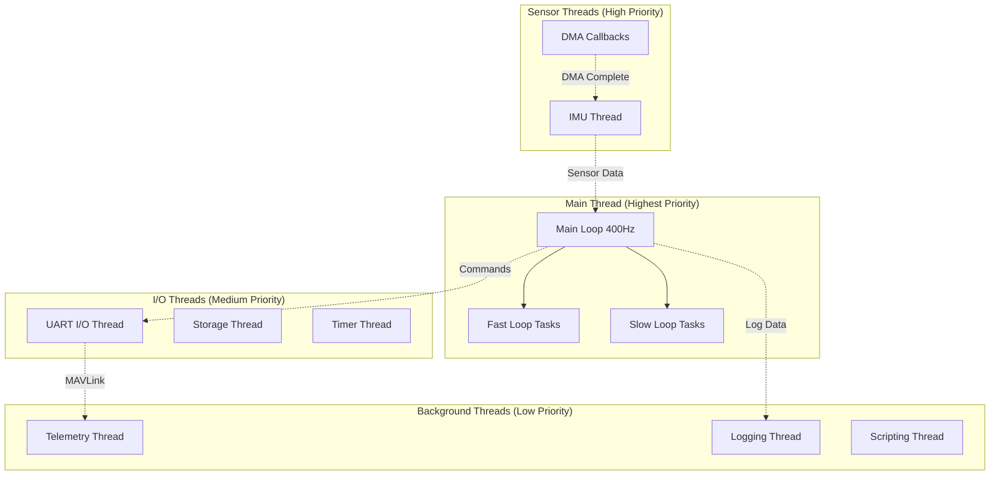
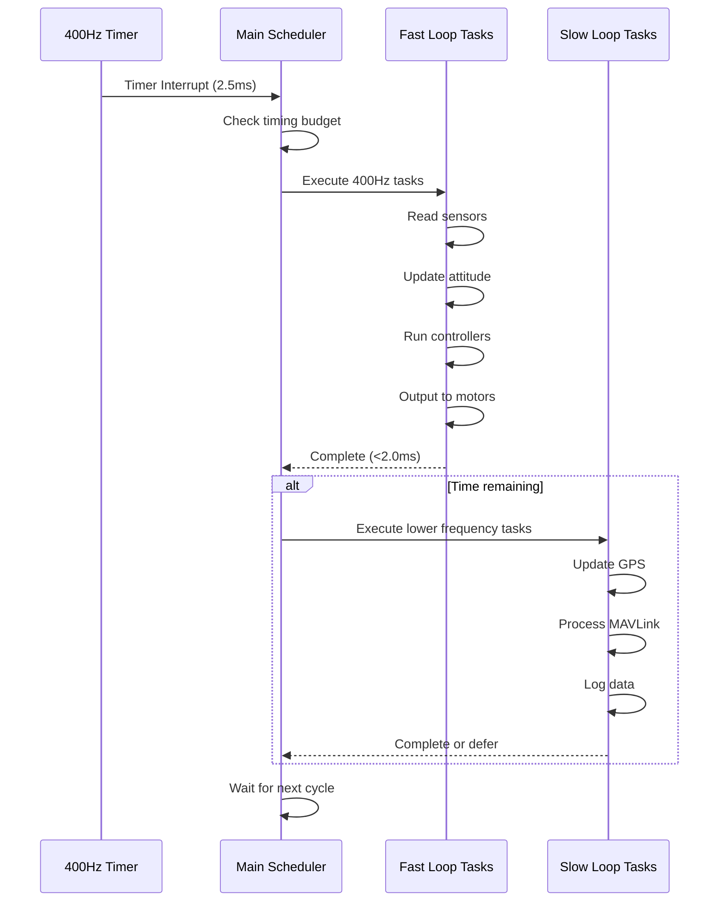
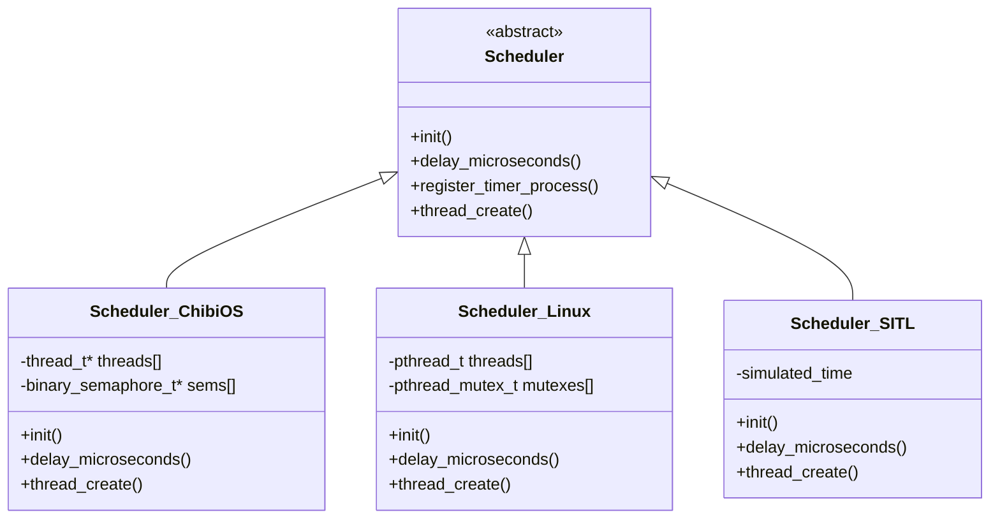

# ArduPilot Threading Model


## Table of Contents

- [Overview](#overview)
- [Threading Architecture](#threading-architecture)
- [Main Loop and Scheduler](#main-loop-and-scheduler)
- [Thread Priorities and Real-Time Constraints](#thread-priorities-and-real-time-constraints)
- [HAL Thread Abstraction](#hal-thread-abstraction)
- [Platform-Specific Threading](#platform-specific-threading)
- [Thread Safety Patterns](#thread-safety-patterns)
- [Synchronization Primitives](#synchronization-primitives)
- [Inter-Thread Communication](#inter-thread-communication)
- [Interrupt Context and DMA Callbacks](#interrupt-context-and-dma-callbacks)
- [Thread Stack Sizing and Monitoring](#thread-stack-sizing-and-monitoring)
- [Deadlock Prevention](#deadlock-prevention)
- [Performance Implications](#performance-implications)
- [Thread Safety Documentation Standards](#thread-safety-documentation-standards)
- [Common Pitfalls and Debugging](#common-pitfalls-and-debugging)

## Overview

ArduPilot implements a **hybrid threading model** that combines a cooperative main loop scheduler with platform-specific preemptive threading capabilities. This design balances the deterministic timing requirements of flight control with the flexibility needed for I/O operations, sensor processing, and communication protocols.

### Key Design Principles

1. **Deterministic Control Loop**: The main control loop runs at a fixed 400Hz rate for multicopters (varies by vehicle type) to ensure consistent attitude and position control
2. **Priority-Based Execution**: Critical flight control tasks execute at higher priorities than telemetry, logging, and auxiliary functions
3. **Thread Safety by Design**: Shared resources are protected using platform-appropriate synchronization primitives
4. **Minimal Latency**: Real-time tasks are designed to complete within their allocated time slices
5. **Platform Abstraction**: Threading primitives are abstracted through the HAL layer for portability across ChibiOS, NuttX, and Linux

### Threading Philosophy

ArduPilot's threading model evolved from a single-threaded cooperative scheduler to a hybrid approach that leverages multi-core processors while maintaining deterministic real-time behavior. The design prioritizes:

- **Safety**: Thread-safe access to flight-critical state
- **Predictability**: Bounded execution times for control loops
- **Efficiency**: Minimal context switching overhead
- **Portability**: Consistent behavior across hardware platforms

## Threading Architecture

ArduPilot's threading architecture consists of multiple execution contexts with well-defined responsibilities and priority levels. The system separates time-critical flight control from background processing tasks.

### System Architecture Diagram



### Thread Categories

ArduPilot organizes threads into distinct categories based on their timing requirements and criticality:

#### 1. Main Thread (Control Thread)
- **Priority**: Highest (realtime on Linux, highest scheduler priority on RTOS)
- **Frequency**: 400Hz for multicopters, 50-400Hz for other vehicle types
- **Responsibilities**:
  - Attitude estimation (AHRS/EKF updates)
  - Attitude and position control loops
  - Motor output computation
  - Flight mode logic execution
  - Failsafe monitoring
- **Source**: `/ArduCopter/Copter.cpp:scheduler_tasks[]`, `/ArduPlane/Plane.cpp:scheduler_tasks[]`
- **Timing Constraint**: Must complete within 2.5ms (400Hz) or appropriate cycle time

#### 2. IMU/Sensor Thread
- **Priority**: High (near real-time)
- **Frequency**: Sensor-dependent (1kHz-8kHz for modern IMUs)
- **Responsibilities**:
  - Raw sensor data collection
  - Initial filtering and calibration
  - FIFO management
  - Timestamp recording
- **Source**: `/libraries/AP_InertialSensor/AP_InertialSensor.cpp`
- **Timing Constraint**: Must service sensor FIFO before overflow

#### 3. Timer Thread
- **Priority**: High
- **Frequency**: 1kHz
- **Responsibilities**:
  - Microsecond-precision timing services
  - PWM input capture
  - Scheduler tick generation
- **Source**: `/libraries/AP_HAL/Scheduler.h`

#### 4. UART/I/O Thread
- **Priority**: Medium
- **Frequency**: Event-driven
- **Responsibilities**:
  - Serial port I/O (MAVLink, GPS, telemetry)
  - Non-blocking communication handling
  - Message parsing and queuing
- **Source**: `/libraries/AP_HAL/UARTDriver.h`
- **Timing Constraint**: Service within 10ms to avoid buffer overflow

#### 5. Storage Thread
- **Priority**: Medium-Low
- **Frequency**: On-demand
- **Responsibilities**:
  - Parameter storage/retrieval
  - Log writing to SD card
  - Configuration persistence
- **Source**: `/libraries/StorageManager/StorageManager.cpp`
- **Timing Constraint**: Non-critical, can be delayed during high load

#### 6. Scripting Thread
- **Priority**: Low
- **Frequency**: 10-100Hz (configurable)
- **Responsibilities**:
  - Lua script execution
  - Custom mission logic
  - User-defined behaviors
- **Source**: `/libraries/AP_Scripting/AP_Scripting.cpp`
- **Timing Constraint**: Can be throttled or suspended under load

### Execution Context Types

ArduPilot code executes in multiple contexts with different constraints:

| Context | Preemption | Blocking Allowed | Typical Use |
|---------|------------|------------------|-------------|
| **Main Loop** | Yes (by higher priority threads) | No | Control algorithms, state machines |
| **Thread** | Yes | Yes (with caution) | I/O operations, background tasks |
| **Interrupt** | Only by higher priority interrupts | No | DMA completion, GPIO events |
| **DMA Callback** | Only by interrupts | No | Sensor data ready notifications |
| **Timer Callback** | By interrupts | No | Precise timing events |

## Main Loop and Scheduler

The ArduPilot scheduler is the heart of the threading model, implementing a cooperative multitasking system within the main thread. It ensures deterministic execution of time-critical tasks while allowing lower-priority tasks to run when time permits.

### Scheduler Architecture



### Scheduler Task Structure

Each vehicle defines a scheduler task table that specifies functions to run at various rates:

```cpp
// Source: /ArduCopter/Copter.cpp:scheduler_tasks[]
const AP_Scheduler::Task Copter::scheduler_tasks[] = {
    SCHED_TASK(rc_loop,              100,     130,  3),  // 100Hz: RC input processing
    SCHED_TASK(throttle_loop,         50,      75,  6),  // 50Hz:  Throttle updates
    SCHED_TASK(update_GPS,            50,     200,  9),  // 50Hz:  GPS processing
    SCHED_TASK(update_batt_compass,   10,     120, 12),  // 10Hz:  Battery/compass
    SCHED_TASK(read_aux_switches,     10,      50, 15),  // 10Hz:  Auxiliary switches
    SCHED_TASK(arm_motors_check,      10,      50, 18),  // 10Hz:  Arming checks
    SCHED_TASK(update_altitude,       10,     100, 21),  // 10Hz:  Altitude estimation
};
```

**Task Parameters**:
- **Function**: The function to execute
- **Rate (Hz)**: How often the task should run
- **Max Time (µs)**: Maximum expected execution time
- **Priority**: Lower numbers run first when time budget is limited

### Main Loop Phases

#### Phase 1: Fast Loop (Every Cycle - 400Hz)

```cpp
/**
 * @brief Fast loop runs at main loop rate (400Hz for copter)
 * @timing Must complete within 2.0ms to leave time for slow tasks
 * @thread_safety Called from main thread only, not reentrant
 */
void Copter::fast_loop()
{
    // 1. Read IMU data from sensor thread (via DMA)
    ins.update();  // ~300µs
    
    // 2. Update attitude estimate (AHRS/EKF)
    ahrs.update();  // ~500µs
    
    // 3. Run attitude controller
    motors->set_desired_spool_state(AP_Motors::DesiredSpoolState::THROTTLE_UNLIMITED);
    attitude_control->rate_controller_run();  // ~400µs
    
    // 4. Output to motors/servos
    motors->output();  // ~200µs
    
    // Total: ~1.4ms, leaving 1.1ms for slow loop tasks
}
```

#### Phase 2: Slow Loop (Time-Permitting)

The scheduler runs slow loop tasks in priority order if time remains in the 2.5ms cycle:

```cpp
/**
 * @brief Execute one slow loop task per cycle based on priority and timing
 * @timing Yields if time budget exhausted (>2.3ms elapsed)
 * @thread_safety Called from main thread, may be preempted
 */
void AP_Scheduler::run(uint32_t time_available_us)
{
    for (uint8_t i = 0; i < _num_tasks; i++) {
        // Check if this task is due to run
        if (task_counter % task_interval != 0) {
            continue;
        }
        
        // Check time budget
        if (micros() - loop_start_us > time_available_us - task_max_time_us) {
            // Defer remaining tasks to next cycle
            break;
        }
        
        // Execute task
        tasks[i].function();
        
        // Monitor overruns
        uint32_t elapsed = micros() - task_start_us;
        if (elapsed > tasks[i].max_time_us) {
            log_overrun(i, elapsed);
        }
    }
}
```

### Loop Rate Variations by Vehicle

Different vehicle types have different control loop requirements:

| Vehicle Type | Main Loop Rate | Rationale | Source |
|--------------|----------------|-----------|--------|
| **Copter** | 400Hz | Fast attitude response needed for stability | `/ArduCopter/Copter.h` |
| **Plane** | 50-400Hz | Configurable, depends on airframe dynamics | `/ArduPlane/Plane.h` |
| **Rover** | 50Hz | Ground vehicles have slower dynamics | `/Rover/Rover.h` |
| **Sub** | 100Hz | Underwater dynamics slower than air | `/ArduSub/Sub.h` |
| **QuadPlane** | 400Hz (VTOL) / 50Hz (FW) | Switches based on flight mode | `/ArduPlane/quadplane.cpp` |

### Scheduler Performance Monitoring

ArduPilot provides real-time monitoring of scheduler performance:

```cpp
/**
 * @brief Get current loop rate and overrun statistics
 * @return Scheduler performance metrics
 * @note Logged via MAVLink SYSTEM_TIME message
 */
struct SchedulerStats {
    uint16_t loop_rate_hz;        // Actual achieved loop rate
    uint16_t loop_time_us_max;    // Maximum loop time in period
    uint16_t loop_time_us_avg;    // Average loop time
    uint8_t  overrun_count;       // Tasks that exceeded max_time_us
    uint8_t  slip_count;          // Cycles where loop rate dropped
};
```

**Performance Indicators**:
- **Loop Rate**: Should match target (400Hz) within 1%
- **Loop Time**: Should be <90% of cycle time (2.25ms for 400Hz)
- **Overruns**: Individual tasks exceeding max_time_us budget
- **Slips**: Cycles where main loop couldn't maintain rate

### Timing Budget Management

The scheduler uses several strategies to maintain loop rate:

1. **Priority-Based Execution**: Higher priority tasks run first
2. **Dynamic Deferral**: Low-priority tasks skipped when time is short
3. **Load Shedding**: Non-critical tasks suspended under high load
4. **Rate Reduction**: Some tasks automatically slow down (e.g., logging)

```cpp
/**
 * @brief Dynamically adjust task rates based on available CPU time
 * @warning Can impact non-critical functionality like logging
 */
void AP_Scheduler::adjust_for_load()
{
    if (get_loop_rate_hz() < target_rate_hz * 0.95f) {
        // Running slow, reduce non-critical task rates
        reduce_logging_rate();
        defer_scripting_tasks();
        throttle_telemetry_streams();
    }
}
```

## Thread Priorities and Real-Time Constraints

ArduPilot's thread priority system ensures that safety-critical flight control tasks always take precedence over auxiliary functions. The priority model is carefully designed to meet real-time constraints while maximizing system responsiveness.

### Priority Hierarchy


### Platform-Specific Priority Mappings

Priority values vary by platform RTOS implementation:

#### ChibiOS Priority Mapping (Default for Pixhawk/CubePilot)

```cpp
// Source: /libraries/AP_HAL_ChibiOS/Scheduler.cpp
#define APM_MAIN_PRIORITY       180  // Main control loop (high priority)
#define APM_TIMER_PRIORITY      181  // Timer callbacks (higher than main)
#define APM_RCIN_PRIORITY       177  // RC input (lower than main)
#define APM_IO_PRIORITY         58   // UART/I2C/SPI I/O (medium)
#define APM_STORAGE_PRIORITY    59   // Flash/SD storage (medium-low)
#define APM_SCRIPTING_PRIORITY  10   // Lua scripting (low)

/**
 * @note ChibiOS uses range 1-256, higher number = higher priority
 * @warning Priority inversion can occur if not carefully managed
 */
```

#### Linux Priority Mapping (Linux-based autopilots)

```cpp
// Source: /libraries/AP_HAL_Linux/Scheduler.cpp
#define APM_LINUX_MAIN_PRIORITY       12  // SCHED_FIFO priority
#define APM_LINUX_TIMER_PRIORITY      15  // Above main
#define APM_LINUX_IO_PRIORITY          2  // SCHED_OTHER (best effort)

/**
 * @note Linux requires CAP_SYS_NICE or root for SCHED_FIFO
 * @note Priorities 1-99 for SCHED_FIFO, higher = higher priority
 * @warning Improper RT priorities can starve system processes
 */
```

#### NuttX Priority Mapping

```cpp
// Source: /libraries/AP_HAL_NuttX/Scheduler.cpp (legacy)
#define SCHED_PRIORITY_MAX          255
#define APM_MAIN_PRIORITY           180
#define APM_TIMER_PRIORITY          181
#define APM_UART_PRIORITY           60
```

### Real-Time Constraints

Each thread and task has specific timing requirements that must be met for safe operation:

#### Critical Timing Constraints

| Component | Constraint | Consequence of Violation | Mitigation |
|-----------|------------|-------------------------|------------|
| **Main Loop (400Hz)** | Must maintain 400Hz ±1% | Attitude control degrades, oscillations | Load shedding, task deferral |
| **IMU Sampling** | Service FIFO within 1ms | Data loss, attitude errors | High thread priority, DMA |
| **Motor Output** | Update within 2.5ms | Control delay, instability | Fast loop guaranteed execution |
| **RC Input** | Process within 5ms | Pilot input lag | Dedicated thread, high priority |
| **GPS Updates** | Process within 50ms | Position lag (acceptable) | Medium priority |
| **Telemetry** | Send within 100ms | GCS display lag (acceptable) | Low priority, can defer |

#### Timing Analysis Example

```cpp
/**
 * @brief Verify task execution time meets real-time constraints
 * @timing This function itself must complete within 10µs
 * @thread_safety Read-only access to timing statistics
 */
void AP_Scheduler::check_timing_constraints()
{
    const uint32_t main_loop_us = get_loop_time_us();
    const uint32_t max_allowed_us = 1000000UL / _loop_rate_hz;
    
    if (main_loop_us > max_allowed_us) {
        // Main loop overrun - critical timing violation
        gcs().send_text(MAV_SEVERITY_CRITICAL, 
                       "Timing: main loop %u us > %u us limit",
                       main_loop_us, max_allowed_us);
        
        // Identify slowest task for diagnostics
        uint8_t slowest_task = get_slowest_task();
        gcs().send_text(MAV_SEVERITY_WARNING,
                       "Slowest task: %s (%u us)",
                       task_name(slowest_task),
                       task_time_us(slowest_task));
    }
}
```

### Priority Inversion Prevention

Priority inversion occurs when a high-priority thread waits for a resource held by a low-priority thread. ArduPilot uses several strategies to prevent this:

#### 1. Priority Inheritance Mutexes

```cpp
/**
 * @brief Mutex with priority inheritance to prevent inversion
 * @details When a high-priority thread blocks on a mutex held by
 *          a low-priority thread, the low-priority thread temporarily
 *          inherits the high priority until it releases the mutex
 */
class HAL_Semaphore {
    // Platform-specific implementation ensures priority inheritance
    bool take(uint32_t timeout_ms) override;
    bool give() override;
};
```

#### 2. Lock-Free Data Structures

```cpp
/**
 * @brief Lock-free ring buffer for inter-thread communication
 * @thread_safety Multiple producers, single consumer
 * @note Avoids priority inversion by eliminating locks
 */
template <typename T, uint16_t SIZE>
class ObjectBuffer {
    // Atomic operations ensure thread safety without locks
    bool push(const T& obj);
    bool pop(T& obj);
};
```

#### 3. Short Critical Sections

```cpp
/**
 * @brief Minimize time holding locks to reduce inversion risk
 * @timing Critical section must complete within 50µs
 */
void update_sensor_data()
{
    // Copy data outside the lock
    Vector3f local_accel = get_latest_accel();
    Quaternion local_attitude = get_latest_attitude();
    
    // Very short critical section
    WITH_SEMAPHORE(_state_sem);
    _accel = local_accel;
    _attitude = local_attitude;
    // Lock released automatically
}
```

### CPU Affinity (Multi-Core Systems)

On multi-core systems, ArduPilot can pin threads to specific CPU cores for optimal performance:

```cpp
/**
 * @brief Set thread CPU affinity for multi-core systems
 * @param thread_id Thread to configure
 * @param core_mask Bitmask of allowed CPU cores
 * @note Linux-specific, ignored on single-core systems
 */
void AP_HAL::Scheduler::set_cpu_affinity(uint8_t core_mask)
{
#if HAL_NUM_CPS > 1
    // Pin main control loop to core 0 (exclusive)
    set_thread_affinity(main_thread, 0x01);
    
    // Pin I/O threads to core 1
    set_thread_affinity(uart_thread, 0x02);
    set_thread_affinity(storage_thread, 0x02);
    
    // Allow background threads on any core
    set_thread_affinity(scripting_thread, 0xFF);
#endif
}
```

### Deadline Scheduling (Advanced)

Some platforms support deadline scheduling for guaranteed execution:

```cpp
/**
 * @brief Configure SCHED_DEADLINE for guaranteed real-time execution
 * @param runtime_us CPU time guaranteed per period
 * @param deadline_us Task must complete by this deadline
 * @param period_us Scheduling period
 * @warning Only available on Linux 3.14+ with appropriate permissions
 */
void configure_deadline_scheduler()
{
#ifdef SCHED_DEADLINE
    struct sched_attr attr = {
        .size = sizeof(attr),
        .sched_policy = SCHED_DEADLINE,
        .sched_runtime  = 2000000,   // 2ms guaranteed
        .sched_deadline = 2500000,   // 2.5ms deadline
        .sched_period   = 2500000,   // 400Hz (2.5ms period)
    };
    sched_setattr(0, &attr, 0);
#endif
}
```

## HAL Thread Abstraction

The Hardware Abstraction Layer (HAL) provides a platform-independent threading API that allows ArduPilot code to work across different operating systems and RTOSes without modification. This abstraction is critical for code portability and maintainability.

### HAL Scheduler Interface

```cpp
/**
 * @class AP_HAL::Scheduler
 * @brief Platform-independent scheduler and threading interface
 * 
 * @details Abstracts thread creation, synchronization primitives,
 *          and timing services across ChibiOS, NuttX, and Linux.
 * 
 * Source: /libraries/AP_HAL/Scheduler.h
 */
class AP_HAL::Scheduler {
public:
    /**
     * @brief Initialize the scheduler system
     * @pre Called once during HAL initialization
     */
    virtual void init() = 0;
    
    /**
     * @brief Delay execution for specified microseconds
     * @param us Microseconds to delay
     * @warning Blocks current thread, do not call from fast loop
     */
    virtual void delay_microseconds(uint16_t us) = 0;
    
    /**
     * @brief Register a timer process to run at specified rate
     * @param proc Function pointer to execute
     * @param freq_hz Frequency in Hz (1-1000)
     * @return true if registration successful
     * @thread_safety Timer callbacks run in timer thread context
     */
    virtual bool register_timer_process(AP_HAL::MemberProc proc, uint32_t freq_hz) = 0;
    
    /**
     * @brief Create a new thread
     * @param name Thread name for debugging
     * @param func Thread entry point
     * @param priority Platform-specific priority
     * @param stack_size Stack size in bytes
     * @param core CPU core affinity (multi-core systems)
     * @return true if thread created successfully
     */
    virtual bool thread_create(AP_HAL::MemberProc func, 
                              const char *name,
                              uint32_t stack_size, 
                              priority_base priority, 
                              int8_t core = -1) = 0;
};
```

### Platform Implementations

Each HAL implementation provides concrete implementations of the scheduler interface:



### Thread Creation Example

Application code creates threads using the HAL abstraction:

```cpp
/**
 * @brief Create background processing thread using HAL abstraction
 * @return true if thread created successfully
 * 
 * Example: /libraries/AP_Scripting/AP_Scripting.cpp
 */
bool AP_Scripting::init()
{
    // Create scripting thread with platform-independent API
    if (!hal.scheduler->thread_create(
            FUNCTOR_BIND_MEMBER(&AP_Scripting::thread_main, void),
            "scripting",
            8192,  // 8KB stack
            AP_HAL::Scheduler::PRIORITY_SCRIPTING,
            -1)) { // Any core
        
        gcs().send_text(MAV_SEVERITY_ERROR, "Scripting: thread create failed");
        return false;
    }
    
    return true;
}

/**
 * @brief Scripting thread main loop
 * @thread_safety Runs in separate thread context
 * @timing Yields periodically to avoid starving other threads
 */
void AP_Scripting::thread_main()
{
    // Thread initialization
    lua_State *L = lua_newstate(alloc_function, nullptr);
    
    while (!_stop_thread) {
        // Execute scripts
        run_scripts(L);
        
        // Yield to other threads (platform-independent)
        hal.scheduler->delay_microseconds(10000); // 10ms
    }
    
    // Cleanup
    lua_close(L);
}
```

### Semaphore Abstraction

```cpp
/**
 * @class AP_HAL::Semaphore
 * @brief Platform-independent mutual exclusion primitive
 * 
 * @details Provides RAII-style locking with priority inheritance
 *          support on platforms that provide it.
 * 
 * Source: /libraries/AP_HAL/Semaphores.h
 */
class AP_HAL::Semaphore {
public:
    /**
     * @brief Attempt to acquire the semaphore
     * @param timeout_ms Maximum time to wait (0 = no wait, UINT32_MAX = infinite)
     * @return true if acquired, false if timeout
     * @thread_safety Multiple threads may call simultaneously
     */
    virtual bool take(uint32_t timeout_ms) = 0;
    
    /**
     * @brief Release the semaphore
     * @return true if successful
     * @warning Must be called by the thread that acquired the lock
     */
    virtual bool give() = 0;
    
    /**
     * @brief Get current semaphore owner (for debugging)
     * @return Thread ID of owner, or 0 if not held
     */
    virtual uint32_t get_owner() const { return 0; }
};

/**
 * @brief RAII helper for automatic semaphore release
 * @note Preferred method for taking semaphores
 * 
 * Example usage:
 * @code
 * void update_state() {
 *     WITH_SEMAPHORE(_state_sem);
 *     _position = new_position;  // Protected access
 *     _velocity = new_velocity;
 * } // Semaphore automatically released
 * @endcode
 */
#define WITH_SEMAPHORE(sem) \
    WITH_SEMAPHORE_LINE(sem, __LINE__)
```

### Timer Callback Registration

Timer callbacks provide periodic execution without creating full threads:

```cpp
/**
 * @brief Register periodic callback using HAL timer system
 * @param rate_hz Desired callback frequency
 * 
 * Example: /libraries/AP_GPS/AP_GPS.cpp
 */
void AP_GPS::init()
{
    // Register 10Hz GPS update callback
    hal.scheduler->register_timer_process(
        FUNCTOR_BIND_MEMBER(&AP_GPS::timer_update, void),
        10  // 10Hz
    );
}

/**
 * @brief Timer callback for GPS processing
 * @timing Executes in timer thread context (high priority)
 * @timing Must complete within 100ms (10Hz rate)
 * @thread_safety Must not block or take locks held by main thread
 */
void AP_GPS::timer_update()
{
    // Process GPS data from all backends
    for (uint8_t i = 0; i < GPS_MAX_INSTANCES; i++) {
        if (drivers[i] != nullptr) {
            // Read and parse GPS data
            drivers[i]->read();
        }
    }
}
```

### Interrupt-Safe Operations

The HAL provides interrupt-safe timing and state query functions:

```cpp
/**
 * @brief Get microsecond timestamp (interrupt-safe)
 * @return Microseconds since boot
 * @interrupt Can be called from interrupt context
 * @atomic Read is atomic on 32-bit platforms
 */
uint64_t AP_HAL::micros64();

/**
 * @brief Get millisecond timestamp (interrupt-safe)
 * @return Milliseconds since boot
 * @interrupt Can be called from interrupt context
 */
uint32_t AP_HAL::millis();

/**
 * @brief Check if running in interrupt context
 * @return true if called from ISR
 * @note Used to prevent blocking calls from interrupts
 */
bool AP_HAL::in_interrupt();
```

### Cross-Platform Considerations

Different platforms have different capabilities and constraints:

| Feature | ChibiOS | Linux | SITL | Notes |
|---------|---------|-------|------|-------|
| **Thread Creation** | ✓ | ✓ | ✓ | All platforms support |
| **Priority Inheritance** | ✓ | ✓ (SCHED_FIFO) | ✗ | Linux requires RT privileges |
| **Real-Time Guarantees** | ✓ | Partial | ✗ | ChibiOS is hard real-time |
| **Multi-Core Support** | ✓ | ✓ | ✗ | CPU affinity available |
| **Microsecond Timing** | ✓ | ✓ | ✓ | All have µs resolution |
| **Stack Protection** | ✓ | ✓ | ✓ | Overflow detection varies |
| **Thread Naming** | ✓ | ✓ | ✓ | For debugging purposes |

## Platform-Specific Threading

While the HAL provides a unified interface, each platform has unique threading characteristics that impact performance and behavior. Understanding these differences is essential for debugging and optimization.

### ChibiOS Threading (Default for Pixhawk/CubePilot)

ChibiOS is a hard real-time operating system with deterministic scheduling and low overhead. It's the most common platform for ArduPilot autopilots.

#### ChibiOS Thread Model

```cpp
/**
 * @brief ChibiOS thread creation implementation
 * @details Uses ChibiOS native threads with static or dynamic allocation
 * 
 * Source: /libraries/AP_HAL_ChibiOS/Scheduler.cpp
 */
bool Scheduler::thread_create(AP_HAL::MemberProc proc,
                             const char *name,
                             uint32_t stack_size,
                             priority_base priority,
                             int8_t core)
{
    // ChibiOS thread structure
    thread_t *thread = chThdCreateFromHeap(
        NULL,                          // Default heap
        THD_WORKING_AREA_SIZE(stack_size),
        name,
        _priority_map[priority],       // Map HAL priority to ChibiOS
        thread_wrapper,                // Wrapper function
        (void*)proc                    // User function
    );
    
    if (thread == nullptr) {
        return false;
    }
    
    // Store thread handle for management
    _threads[_num_threads++] = thread;
    return true;
}

/**
 * @brief Thread wrapper to handle exceptions and cleanup
 * @param arg User function pointer
 * @thread_safety Runs in new thread context
 */
void Scheduler::thread_wrapper(void *arg)
{
    AP_HAL::MemberProc proc = (AP_HAL::MemberProc)arg;
    
    // Execute user function
    proc();
    
    // Thread terminates - cleanup handled by ChibiOS
}
```

#### ChibiOS Synchronization

```cpp
/**
 * @brief ChibiOS semaphore implementation with priority inheritance
 * 
 * Source: /libraries/AP_HAL_ChibiOS/Semaphores.cpp
 */
class ChibiOS::Semaphore : public AP_HAL::Semaphore {
    mutex_t _mtx;  // ChibiOS mutex with priority inheritance
    
public:
    bool take(uint32_t timeout_ms) override {
        if (timeout_ms == HAL_SEMAPHORE_BLOCK_FOREVER) {
            chMtxLock(&_mtx);
            return true;
        }
        
        systime_t timeout = TIME_MS2I(timeout_ms);
        return chMtxTryLockTimeout(&_mtx, timeout) == MSG_OK;
    }
    
    bool give() override {
        chMtxUnlock(&_mtx);
        return true;
    }
};
```

#### ChibiOS Performance Characteristics

- **Context Switch**: ~1-2µs on STM32H7
- **ISR Latency**: <1µs for high-priority interrupts
- **Semaphore Overhead**: ~0.5µs take/give pair
- **Stack Usage**: Monitored via `chThdGetUsedStack()`
- **Memory**: Static allocation preferred for determinism

### Linux Threading (BBBmini, NavIO, etc.)

Linux provides POSIX threads with optional real-time scheduling. Requires careful configuration for deterministic behavior.

#### Linux Thread Model

```cpp
/**
 * @brief Linux pthread implementation
 * @details Uses SCHED_FIFO for real-time threads when privileged
 * 
 * Source: /libraries/AP_HAL_Linux/Scheduler.cpp
 */
bool Scheduler::thread_create(AP_HAL::MemberProc proc,
                             const char *name,
                             uint32_t stack_size,
                             priority_base priority,
                             int8_t core)
{
    pthread_attr_t attr;
    pthread_attr_init(&attr);
    
    // Set stack size
    pthread_attr_setstacksize(&attr, stack_size);
    
    // Set scheduling policy and priority
    if (_use_realtime && priority >= PRIORITY_MAIN) {
        struct sched_param param;
        param.sched_priority = _priority_map[priority];
        pthread_attr_setschedpolicy(&attr, SCHED_FIFO);
        pthread_attr_setschedparam(&attr, &param);
        pthread_attr_setinheritsched(&attr, PTHREAD_EXPLICIT_SCHED);
    }
    
    // Set CPU affinity if requested
    if (core >= 0) {
        cpu_set_t cpuset;
        CPU_ZERO(&cpuset);
        CPU_SET(core, &cpuset);
        pthread_attr_setaffinity_np(&attr, sizeof(cpuset), &cpuset);
    }
    
    // Create thread
    pthread_t thread;
    int ret = pthread_create(&thread, &attr, thread_wrapper, (void*)proc);
    pthread_attr_destroy(&attr);
    
    if (ret != 0) {
        return false;
    }
    
    // Set thread name for debugging
    pthread_setname_np(thread, name);
    
    _threads[_num_threads++] = thread;
    return true;
}
```

#### Linux Real-Time Configuration

ArduPilot on Linux requires system configuration for real-time performance:

```bash
# /etc/security/limits.conf - Allow real-time scheduling
@realtime   -   rtprio      99
@realtime   -   nice       -20
@realtime   -   memlock    unlimited

# Disable CPU frequency scaling for deterministic timing
echo performance > /sys/devices/system/cpu/cpu0/cpufreq/scaling_governor

# Isolate CPU cores for ArduPilot (optional)
# Add to kernel command line: isolcpus=2,3

# Set real-time scheduling at startup
sudo chrt -f 12 ./arducopter
```

#### Linux Timing Considerations

```cpp
/**
 * @brief High-resolution timing on Linux
 * @details Uses clock_gettime(CLOCK_MONOTONIC) for microsecond precision
 * 
 * @note Linux timing can be affected by:
 *       - Frequency scaling (disable for consistent timing)
 *       - System load (use SCHED_FIFO to mitigate)
 *       - Thermal throttling (monitor CPU temperature)
 */
uint64_t micros64()
{
    struct timespec ts;
    clock_gettime(CLOCK_MONOTONIC, &ts);
    return ts.tv_sec * 1000000ULL + ts.tv_nsec / 1000ULL;
}
```

### SITL Threading (Software-In-The-Loop)

SITL uses simplified threading for simulation:

```cpp
/**
 * @brief SITL scheduler with simulated timing
 * @details Allows faster-than-realtime or slower simulation
 * 
 * Source: /libraries/AP_HAL_SITL/Scheduler.cpp
 */
class SITL::Scheduler : public AP_HAL::Scheduler {
    float _speedup;  // Simulation speedup factor (1.0 = realtime)
    
public:
    void delay_microseconds(uint16_t us) override {
        // Simulated delay - may run faster than realtime
        uint32_t sim_us = us / _speedup;
        usleep(sim_us);
        
        // Advance simulated time
        _simulated_time_us += us;
    }
    
    /**
     * @brief Set simulation speed multiplier
     * @param speedup 1.0 = realtime, 2.0 = 2x speed, 0.5 = half speed
     */
    void set_speedup(float speedup) {
        _speedup = constrain_float(speedup, 0.1f, 10.0f);
    }
};
```

### NuttX Threading (Legacy)

NuttX was used in early Pixhawk boards (PX4FMU v1/v2):

```cpp
/**
 * @brief NuttX threading implementation (legacy)
 * @note NuttX HAL is deprecated in favor of ChibiOS
 * 
 * Source: /libraries/AP_HAL_NuttX/Scheduler.cpp (archived)
 */
bool Scheduler::thread_create(AP_HAL::MemberProc proc,
                             const char *name,
                             uint32_t stack_size,
                             priority_base priority,
                             int8_t core)
{
    // NuttX task creation
    int pid = task_create(
        name,
        _priority_map[priority],
        stack_size,
        (main_t)thread_wrapper,
        (FAR char * const *)&proc
    );
    
    return pid > 0;
}
```

### Platform Comparison Summary

| Characteristic | ChibiOS | Linux | SITL | NuttX |
|----------------|---------|-------|------|-------|
| **Typical Hardware** | Pixhawk, CubePilot | BBBmini, NavIO, RPi | Simulation | Legacy PX4 |
| **Context Switch** | 1-2µs | 10-50µs | Variable | 2-5µs |
| **Determinism** | Hard RT | Soft RT | None | Hard RT |
| **Multi-Core** | Limited | Full | N/A | Limited |
| **Memory Overhead** | Low (20KB) | High (100s KB) | Variable | Medium |
| **Debugging Tools** | GDB, OpenOCD | GDB, perf, ftrace | Full | GDB |
| **Status** | Active | Active | Active | Deprecated |

## Thread Safety Patterns

ArduPilot employs several patterns to ensure thread-safe access to shared data. Proper use of these patterns is essential for system stability and safety.

### Pattern 1: Semaphore-Protected Critical Sections

The most common pattern for protecting shared state:

```cpp
/**
 * @class AP_AHRS
 * @brief Attitude and heading reference system with thread-safe state
 * 
 * Source: /libraries/AP_AHRS/AP_AHRS.h
 */
class AP_AHRS {
    // Shared state (accessed by multiple threads)
    Quaternion _attitude;
    Vector3f _gyro_estimate;
    uint32_t _last_update_ms;
    
    // Semaphore protecting shared state
    HAL_Semaphore _sem;
    
public:
    /**
     * @brief Get current attitude estimate
     * @param[out] attitude Current vehicle attitude
     * @return true if attitude is valid
     * @thread_safety Thread-safe, uses internal semaphore
     */
    bool get_attitude(Quaternion &attitude) const {
        // Acquire lock before reading shared state
        WITH_SEMAPHORE(_sem);
        
        // Check validity
        if (AP_HAL::millis() - _last_update_ms > 500) {
            return false;  // Stale data
        }
        
        // Copy data while holding lock
        attitude = _attitude;
        return true;
    }  // Lock automatically released here
    
    /**
     * @brief Update attitude estimate (called by EKF)
     * @param attitude New attitude quaternion
     * @thread_safety Thread-safe, uses internal semaphore
     * @timing Must not block for >100µs
     */
    void set_attitude(const Quaternion &attitude) {
        WITH_SEMAPHORE(_sem);
        _attitude = attitude;
        _last_update_ms = AP_HAL::millis();
    }
};
```

### Pattern 2: Lock-Free Single Writer, Multiple Reader

For high-frequency updates with minimal blocking:

```cpp
/**
 * @brief Lock-free state using atomic operations
 * @details Single writer (sensor thread), multiple readers (main thread, etc.)
 * 
 * Source: /libraries/AP_InertialSensor/AP_InertialSensor.cpp
 */
class AP_InertialSensor {
    // Double-buffered state for lock-free access
    struct ImuSample {
        Vector3f accel;
        Vector3f gyro;
        uint64_t timestamp_us;
    };
    
    ImuSample _samples[2];
    volatile uint8_t _current_sample;  // Atomic flag
    
public:
    /**
     * @brief Update sensor data (writer - sensor thread)
     * @thread_safety Single writer only
     * @atomic Uses atomic swap for lock-free publication
     */
    void update_sensor_data(const Vector3f &accel, const Vector3f &gyro) {
        uint8_t inactive = 1 - _current_sample;
        
        // Write to inactive buffer
        _samples[inactive].accel = accel;
        _samples[inactive].gyro = gyro;
        _samples[inactive].timestamp_us = AP_HAL::micros64();
        
        // Atomically publish new data
        __atomic_store_n(&_current_sample, inactive, __ATOMIC_RELEASE);
    }
    
    /**
     * @brief Read sensor data (reader - any thread)
     * @thread_safety Multiple readers safe
     * @atomic Uses atomic load for lock-free consumption
     */
    void get_sensor_data(Vector3f &accel, Vector3f &gyro) {
        // Atomically get current buffer index
        uint8_t current = __atomic_load_n(&_current_sample, __ATOMIC_ACQUIRE);
        
        // Read from stable buffer
        accel = _samples[current].accel;
        gyro = _samples[current].gyro;
    }
};
```

### Pattern 3: Ring Buffer for Inter-Thread Communication

Lock-free ring buffers for passing messages between threads:

```cpp
/**
 * @brief Lock-free ring buffer for MAVLink messages
 * @details Single producer, single consumer
 * 
 * Source: /libraries/GCS_MAVLink/GCS_Common.h
 */
template <typename T, uint16_t SIZE>
class ObjectBuffer {
    T _buffer[SIZE];
    volatile uint16_t _head;  // Written by producer
    volatile uint16_t _tail;  // Written by consumer
    
public:
    /**
     * @brief Push object (producer thread)
     * @return true if space available
     * @thread_safety Single producer only
     */
    bool push(const T& obj) {
        uint16_t next_head = (_head + 1) % SIZE;
        
        // Check if buffer full
        if (next_head == __atomic_load_n(&_tail, __ATOMIC_ACQUIRE)) {
            return false;  // Buffer full
        }
        
        // Write to buffer
        _buffer[_head] = obj;
        
        // Publish new head
        __atomic_store_n(&_head, next_head, __ATOMIC_RELEASE);
        return true;
    }
    
    /**
     * @brief Pop object (consumer thread)
     * @return true if data available
     * @thread_safety Single consumer only
     */
    bool pop(T& obj) {
        uint16_t current_tail = _tail;
        uint16_t current_head = __atomic_load_n(&_head, __ATOMIC_ACQUIRE);
        
        // Check if buffer empty
        if (current_tail == current_head) {
            return false;  // Buffer empty
        }
        
        // Read from buffer
        obj = _buffer[current_tail];
        
        // Update tail
        __atomic_store_n(&_tail, (current_tail + 1) % SIZE, __ATOMIC_RELEASE);
        return true;
    }
};
```

### Pattern 4: Thread-Local Storage

For thread-specific state without synchronization:

```cpp
/**
 * @brief Thread-local error state
 * @details Each thread has independent error tracking
 * 
 * Source: /libraries/AP_HAL/Util.h
 */
class AP_HAL::Util {
    // Thread-local storage for error context
    static __thread const char* _error_context;
    static __thread uint32_t _error_count;
    
public:
    /**
     * @brief Set error context for current thread
     * @thread_safety Each thread has independent storage
     */
    static void set_error_context(const char* context) {
        _error_context = context;
    }
    
    /**
     * @brief Log error with thread context
     * @thread_safety Thread-safe via thread-local storage
     */
    static void log_error(const char* msg) {
        _error_count++;
        printf("[%s] Error #%u: %s\n", _error_context, _error_count, msg);
    }
};
```

### Pattern 5: Copy-On-Read

For large structures that are infrequently updated:

```cpp
/**
 * @brief Parameter storage with copy-on-read semantics
 * @details Minimizes lock hold time by copying data
 * 
 * Source: /libraries/AP_Param/AP_Param.cpp
 */
class AP_Param {
    struct ParamData {
        char name[16];
        float value;
        uint16_t flags;
    };
    
    ParamData* _params;
    uint16_t _num_params;
    HAL_Semaphore _sem;
    
public:
    /**
     * @brief Get parameter by name
     * @param name Parameter name
     * @param value Output value
     * @return true if parameter found
     * @thread_safety Thread-safe with minimal lock time
     */
    bool get(const char* name, float &value) {
        // Search without lock (read-only operation on stable data)
        uint16_t index = find_index(name);
        if (index == UINT16_MAX) {
            return false;
        }
        
        // Very short lock to copy single value
        WITH_SEMAPHORE(_sem);
        value = _params[index].value;
        
        return true;
    }
};
```

### Anti-Patterns to Avoid

Common mistakes that lead to threading bugs:

#### ❌ Anti-Pattern 1: Naked Shared State

```cpp
// WRONG: Unprotected shared variable
class BadExample {
    float _altitude;  // Accessed by multiple threads
    
public:
    void set_altitude(float alt) {
        _altitude = alt;  // RACE CONDITION!
    }
    
    float get_altitude() {
        return _altitude;  // RACE CONDITION!
    }
};
```

#### ✓ Correct Pattern: Protected Access

```cpp
// CORRECT: Semaphore protection
class GoodExample {
    float _altitude;
    HAL_Semaphore _sem;
    
public:
    void set_altitude(float alt) {
        WITH_SEMAPHORE(_sem);
        _altitude = alt;  // Thread-safe
    }
    
    float get_altitude() {
        WITH_SEMAPHORE(_sem);
        return _altitude;  // Thread-safe
    }
};
```

#### ❌ Anti-Pattern 2: Long Critical Sections

```cpp
// WRONG: Holding lock during slow operations
void process_data() {
    WITH_SEMAPHORE(_data_sem);
    
    read_from_sensor();  // May take milliseconds!
    complex_calculations();
    write_to_storage();  // Blocks on I/O!
    
    // Lock held entire time - blocks other threads
}
```

#### ✓ Correct Pattern: Minimal Lock Time

```cpp
// CORRECT: Copy data, then process outside lock
void process_data() {
    // Copy data quickly under lock
    SensorData local_data;
    {
        WITH_SEMAPHORE(_data_sem);
        local_data = _sensor_data;  // Fast copy
    }
    
    // Process without holding lock
    Results results = complex_calculations(local_data);
    write_to_storage(results);
    
    // Update results briefly under lock
    {
        WITH_SEMAPHORE(_results_sem);
        _latest_results = results;
    }
}
```

#### ❌ Anti-Pattern 3: Blocking in Interrupt Context

```cpp
// WRONG: Blocking call in interrupt handler
void dma_complete_isr() {
    WITH_SEMAPHORE(_buffer_sem);  // MAY BLOCK - DEADLOCK RISK!
    process_buffer();
}
```

#### ✓ Correct Pattern: Defer to Thread Context

```cpp
// CORRECT: Minimal work in ISR, defer to thread
volatile bool _data_ready = false;

void dma_complete_isr() {
    // Minimal work in interrupt
    _data_ready = true;
    // Wake processing thread without blocking
}

void processing_thread() {
    while (true) {
        wait_for_data_ready();
        
        // Now safe to take locks and process
        WITH_SEMAPHORE(_buffer_sem);
        process_buffer();
        _data_ready = false;
    }
}
```

## Synchronization Primitives

ArduPilot provides several synchronization primitives through the HAL abstraction. Understanding when and how to use each is critical for correct concurrent programming.

### Semaphores (Mutexes)

The primary synchronization primitive for protecting shared resources:

```cpp
/**
 * @class HAL_Semaphore
 * @brief Binary semaphore (mutex) with priority inheritance
 * 
 * @details Primary mechanism for mutual exclusion. Supports:
 *          - Priority inheritance (platform-dependent)
 *          - Timeout-based acquisition
 *          - Recursive locking (use with caution)
 *          - Deadlock detection (debug builds)
 * 
 * Source: /libraries/AP_HAL/Semaphores.h
 */
class HAL_Semaphore {
public:
    /**
     * @brief Acquire semaphore with timeout
     * @param timeout_ms Timeout in milliseconds (0=trylock, UINT32_MAX=forever)
     * @return true if acquired
     * @warning Do not call from interrupt context
     * @warning Calling thread must eventually call give()
     */
    virtual bool take(uint32_t timeout_ms) = 0;
    
    /**
     * @brief Release semaphore
     * @return true if successful
     * @warning Must be called by same thread that called take()
     */
    virtual bool give() = 0;
    
    /**
     * @brief Non-blocking attempt to acquire
     * @return true if acquired
     * @note Equivalent to take(0)
     */
    bool try_take() {
        return take(0);
    }
    
    /**
     * @brief Check if current thread owns semaphore
     * @return true if current thread holds lock
     * @note Debug-only feature, may not be available on all platforms
     */
    virtual bool owned_by_current_thread() const { return false; }
};
```

#### WITH_SEMAPHORE Macro

The preferred way to use semaphores with RAII semantics:

```cpp
/**
 * @brief RAII wrapper for automatic semaphore management
 * @param sem Semaphore to acquire
 * 
 * @details Acquires semaphore at declaration, releases at scope exit.
 *          Automatically handles early returns and exceptions.
 * 
 * Example usage:
 */
void update_position(const Vector3f &pos) {
    WITH_SEMAPHORE(_position_sem);
    
    _position = pos;
    _position_timestamp = AP_HAL::millis();
    
    // Semaphore automatically released here
}

void complex_function() {
    WITH_SEMAPHORE(_state_sem);
    
    if (error_condition()) {
        return;  // Semaphore still released correctly
    }
    
    update_state();
    
    // Semaphore released even if exception thrown
}
```

### Binary Semaphores (Signaling)

For thread synchronization and event notification:

```cpp
/**
 * @class HAL_BinarySemaphore
 * @brief Binary semaphore for thread signaling
 * 
 * @details Used for wait/notify patterns. Unlike mutexes:
 *          - Can be signaled from interrupt context
 *          - No ownership (any thread can signal)
 *          - Counting behavior (multiple signals = single wake)
 * 
 * Source: /libraries/AP_HAL_ChibiOS/Semaphores.h
 */
class HAL_BinarySemaphore {
    binary_semaphore_t _sem;
    
public:
    /**
     * @brief Wait for semaphore signal
     * @param timeout_ms Maximum wait time
     * @return true if signaled, false if timeout
     * @thread_safety Thread-safe, multiple waiters allowed
     */
    bool wait(uint32_t timeout_ms) {
        if (timeout_ms == 0) {
            return chBSemWaitTimeout(&_sem, TIME_IMMEDIATE) == MSG_OK;
        }
        systime_t timeout = TIME_MS2I(timeout_ms);
        return chBSemWaitTimeout(&_sem, timeout) == MSG_OK;
    }
    
    /**
     * @brief Signal waiting thread
     * @interrupt Can be called from interrupt context
     */
    void signal() {
        chBSemSignal(&_sem);
    }
    
    /**
     * @brief Signal from ISR (optimized path)
     * @interrupt Must be called from interrupt context
     */
    void signal_ISR() {
        chBSemSignalI(&_sem);
    }
};

/**
 * @brief Example: Sensor data ready notification
 * 
 * Source: /libraries/AP_InertialSensor/AP_InertialSensor_Backend.cpp
 */
class IMU_Backend {
    HAL_BinarySemaphore _data_ready;
    
    /**
     * @brief DMA completion interrupt handler
     * @interrupt Runs in interrupt context
     */
    void dma_complete_isr() {
        _data_ready.signal_ISR();  // Wake processing thread
    }
    
    /**
     * @brief Processing thread waits for data
     * @thread_safety Runs in dedicated thread
     */
    void processing_thread() {
        while (true) {
            // Wait for data ready signal (blocks efficiently)
            if (_data_ready.wait(100)) {  // 100ms timeout
                process_sensor_data();
            } else {
                handle_timeout();
            }
        }
    }
};
```

### Atomic Operations

For lightweight synchronization without locks:

```cpp
/**
 * @brief Atomic primitives for lock-free programming
 * @note Uses GCC/Clang built-in atomics
 * 
 * Source: Various locations throughout codebase
 */

// Atomic load
uint32_t value = __atomic_load_n(&shared_counter, __ATOMIC_ACQUIRE);

// Atomic store
__atomic_store_n(&shared_flag, true, __ATOMIC_RELEASE);

// Atomic increment (returns new value)
uint32_t new_count = __atomic_add_fetch(&counter, 1, __ATOMIC_SEQ_CST);

// Atomic compare-and-swap
uint32_t expected = 0;
bool success = __atomic_compare_exchange_n(
    &lock_var,
    &expected,  // Expected value
    1,          // New value
    false,      // Strong
    __ATOMIC_ACQ_REL,
    __ATOMIC_ACQUIRE
);

/**
 * @brief Memory ordering guide:
 * - __ATOMIC_RELAXED: No ordering constraints (fastest)
 * - __ATOMIC_ACQUIRE: Prevents reordering of subsequent reads
 * - __ATOMIC_RELEASE: Prevents reordering of previous writes
 * - __ATOMIC_ACQ_REL: Both acquire and release
 * - __ATOMIC_SEQ_CST: Full sequential consistency (slowest)
 */
```

### Critical Sections (Interrupt Disable)

For very short critical sections with interrupt handlers:

```cpp
/**
 * @brief Disable interrupts for critical section
 * @warning Use sparingly - increases interrupt latency
 * @timing Keep critical section <10µs
 * 
 * Source: /libraries/AP_HAL/Scheduler.h
 */

// Disable interrupts
void *istate = hal.scheduler->disable_interrupts_save();

// Critical section - interrupts disabled
critical_operation();

// Restore interrupt state
hal.scheduler->restore_interrupts(istate);

/**
 * @brief RAII wrapper for interrupt critical sections
 */
#define CRITICAL_SECTION() \
    CriticalSectionGuard _cs_guard

class CriticalSectionGuard {
    void *_istate;
public:
    CriticalSectionGuard() {
        _istate = hal.scheduler->disable_interrupts_save();
    }
    ~CriticalSectionGuard() {
        hal.scheduler->restore_interrupts(_istate);
    }
};

/**
 * @brief Example: Updating shared timestamp from ISR and main thread
 */
volatile uint32_t _last_update_us;

void update_from_main_thread() {
    CRITICAL_SECTION();
    _last_update_us = AP_HAL::micros();
}

void update_from_isr() {
    // ISR already has interrupts disabled
    _last_update_us = AP_HAL::micros();
}
```

### Wait Queues

For complex synchronization scenarios:

```cpp
/**
 * @class HAL_EventHandle
 * @brief Event-based thread synchronization
 * 
 * @details Allows threads to wait for complex conditions without polling.
 *          More efficient than busy-waiting or repeated semaphore checks.
 * 
 * Source: /libraries/AP_HAL_ChibiOS/Scheduler.h
 */
class HAL_EventHandle {
public:
    /**
     * @brief Wait for event with timeout
     * @param mask Event flags to wait for
     * @param timeout_ms Maximum wait time
     * @return Received event flags, or 0 on timeout
     */
    virtual uint32_t wait(uint32_t mask, uint32_t timeout_ms) = 0;
    
    /**
     * @brief Signal event to waiting threads
     * @param flags Event flags to set
     */
    virtual void signal(uint32_t flags) = 0;
};

/**
 * @brief Example: Storage thread waiting for multiple conditions
 */
#define EVENT_PARAM_SAVE    (1<<0)
#define EVENT_LOG_WRITE     (1<<1)
#define EVENT_SHUTDOWN      (1<<2)

void storage_thread_main() {
    HAL_EventHandle events;
    
    while (true) {
        // Wait for any event, 1 second timeout
        uint32_t flags = events.wait(
            EVENT_PARAM_SAVE | EVENT_LOG_WRITE | EVENT_SHUTDOWN,
            1000
        );
        
        if (flags & EVENT_PARAM_SAVE) {
            save_parameters();
        }
        if (flags & EVENT_LOG_WRITE) {
            flush_logs();
        }
        if (flags & EVENT_SHUTDOWN) {
            cleanup_and_exit();
            break;
        }
    }
}
```

### Synchronization Primitive Comparison

| Primitive | Overhead | Use Case | Can Block? | ISR-Safe? |
|-----------|----------|----------|------------|-----------|
| **Semaphore** | Medium | Mutual exclusion | Yes | No |
| **Binary Semaphore** | Low | Event signaling | Yes | Signal only |
| **Atomic** | Minimal | Simple counters/flags | No | Yes |
| **Critical Section** | Low | Very short sections | No | Yes |
| **Event Handle** | Medium | Complex conditions | Yes | Signal only |

### Performance Considerations

```cpp
/**
 * @brief Benchmark: Synchronization primitive overhead (Cortex-M7 @ 480MHz)
 */
// Semaphore take/give pair: ~0.5µs
// Binary semaphore signal/wait: ~0.3µs
// Atomic increment: ~0.01µs
// Critical section: ~0.05µs (interrupt disable/enable)
// WITH_SEMAPHORE macro overhead: ~0.1µs additional (RAII)

/**
 * @note Choose primitives based on:
 * 1. Correctness (always priority #1)
 * 2. Granularity of protection needed
 * 3. Performance requirements
 * 4. ISR interaction requirements
 */
```

## Inter-Thread Communication

ArduPilot threads communicate through several mechanisms, each optimized for different data patterns and performance requirements.

### Message Passing via Ring Buffers

The most common pattern for streaming data between threads:

```cpp
/**
 * @brief MAVLink message queue between UART and telemetry threads
 * 
 * Source: /libraries/GCS_MAVLink/GCS_Common.cpp
 */
class GCS_MAVLINK {
    // Lock-free ring buffer for incoming messages
    ObjectBuffer<mavlink_message_t, 16> _incoming;
    
    /**
     * @brief UART thread: Receive and queue messages
     * @thread_safety Producer thread only
     */
    void uart_receive_thread() {
        mavlink_message_t msg;
        
        while (uart_has_data()) {
            if (mavlink_parse_char(channel, uart_read_byte(), &msg)) {
                if (!_incoming.push(msg)) {
                    // Buffer full - increment drop counter
                    _msg_drops++;
                }
            }
        }
    }
    
    /**
     * @brief Main thread: Process queued messages
     * @thread_safety Consumer thread only
     */
    void main_thread_update() {
        mavlink_message_t msg;
        
        // Process up to 10 messages per update
        for (uint8_t i = 0; i < 10; i++) {
            if (_incoming.pop(msg)) {
                handle_message(msg);
            } else {
                break;  // Queue empty
            }
        }
    }
};
```

### Shared State with Notifications

For state that changes infrequently but needs immediate notification:

```cpp
/**
 * @brief Flight mode change notification
 * 
 * Source: /ArduCopter/mode.cpp
 */
class Copter {
    Mode* _current_mode;
    HAL_Semaphore _mode_sem;
    HAL_BinarySemaphore _mode_changed;
    
    /**
     * @brief Set flight mode (called by main thread or GCS)
     * @param new_mode Desired flight mode
     * @return true if mode change successful
     */
    bool set_mode(Mode* new_mode) {
        WITH_SEMAPHORE(_mode_sem);
        
        if (!new_mode->init()) {
            return false;
        }
        
        _current_mode->exit();
        _current_mode = new_mode;
        
        // Notify monitoring threads
        _mode_changed.signal();
        
        return true;
    }
    
    /**
     * @brief Logging thread waits for mode changes
     * @thread_safety Separate logging thread
     */
    void logging_thread() {
        while (true) {
            // Wait for mode change notification
            _mode_changed.wait(1000);  // 1 second timeout
            
            WITH_SEMAPHORE(_mode_sem);
            log_mode_change(_current_mode);
        }
    }
};
```

### Callback Registration

For event-driven communication:

```cpp
/**
 * @brief Sensor data ready callback system
 * 
 * Source: /libraries/AP_InertialSensor/AP_InertialSensor.h
 */
class AP_InertialSensor {
public:
    // Callback function type
    typedef void (*DataReadyCallback)(void *arg);
    
    /**
     * @brief Register callback for sensor data ready
     * @param callback Function to call when data ready
     * @param arg User argument passed to callback
     * @thread_safety Must be registered before sensor init
     */
    void register_data_ready_callback(DataReadyCallback callback, void *arg) {
        _data_ready_callback = callback;
        _callback_arg = arg;
    }
    
private:
    DataReadyCallback _data_ready_callback;
    void *_callback_arg;
    
    /**
     * @brief Sensor thread: Invoke callback when data ready
     * @interrupt May be called from DMA interrupt
     */
    void notify_data_ready() {
        if (_data_ready_callback != nullptr) {
            _data_ready_callback(_callback_arg);
        }
    }
};

/**
 * @brief AHRS registers for IMU updates
 */
void AP_AHRS::init() {
    AP::ins().register_data_ready_callback(
        [](void *arg) {
            AP_AHRS *ahrs = (AP_AHRS*)arg;
            ahrs->update();
        },
        this
    );
}
```

### Mailbox Pattern

For request/response communication:

```cpp
/**
 * @brief Parameter request mailbox
 * 
 * Source: /libraries/AP_Param/AP_Param.cpp
 */
struct ParamRequest {
    const char *name;
    float *value_out;
    HAL_BinarySemaphore response;
    bool success;
};

class ParamServer {
    ObjectBuffer<ParamRequest*, 8> _requests;
    
    /**
     * @brief Request parameter from any thread
     * @param name Parameter name
     * @param value Output value
     * @return true if found
     * @thread_safety Thread-safe from any thread
     */
    bool get_param(const char *name, float &value) {
        ParamRequest req;
        req.name = name;
        req.value_out = &value;
        req.success = false;
        
        // Submit request
        if (!_requests.push(&req)) {
            return false;  // Queue full
        }
        
        // Wait for response (up to 100ms)
        if (!req.response.wait(100)) {
            return false;  // Timeout
        }
        
        return req.success;
    }
    
    /**
     * @brief Storage thread processes requests
     * @thread_safety Runs in storage thread
     */
    void storage_thread() {
        while (true) {
            ParamRequest *req;
            if (_requests.pop(req)) {
                // Process request
                req->success = lookup_param(req->name, req->value_out);
                
                // Send response
                req->response.signal();
            }
            hal.scheduler->delay_microseconds(1000);
        }
    }
};
```

### Performance Monitoring

Communication patterns should be monitored for bottlenecks:

```cpp
/**
 * @brief Track inter-thread communication metrics
 */
struct CommStats {
    uint32_t messages_sent;
    uint32_t messages_received;
    uint32_t queue_overruns;
    uint32_t max_latency_us;
    uint32_t avg_latency_us;
};

/**
 * @brief Monitor message latency
 */
void send_message_with_tracking(const Message &msg) {
    msg.timestamp_us = AP_HAL::micros64();
    if (!queue.push(msg)) {
        stats.queue_overruns++;
    } else {
        stats.messages_sent++;
    }
}

void receive_message_with_tracking(Message &msg) {
    if (queue.pop(msg)) {
        uint32_t latency = AP_HAL::micros() - msg.timestamp_us;
        stats.max_latency_us = MAX(stats.max_latency_us, latency);
        stats.avg_latency_us = (stats.avg_latency_us * 7 + latency) / 8;
        stats.messages_received++;
    }
}
```

## Interrupt Context and DMA Callbacks

Interrupt service routines (ISRs) and DMA callbacks have strict constraints and special handling requirements in ArduPilot.

### Interrupt Context Rules

```cpp
/**
 * @brief Rules for interrupt context execution
 * 
 * DO:
 * - Keep ISR execution time minimal (<10µs typical, <50µs maximum)
 * - Use ISR-safe functions only
 * - Signal threads via binary semaphores
 * - Set flags for deferred processing
 * - Use lock-free data structures
 * 
 * DO NOT:
 * - Take mutexes/semaphores (may block - deadlock risk)
 * - Allocate memory
 * - Call blocking functions
 * - Perform complex calculations
 * - Access file systems or storage
 */
```

### DMA Completion Handling

```cpp
/**
 * @brief IMU DMA completion interrupt handler
 * 
 * Source: /libraries/AP_HAL_ChibiOS/SPIDevice.cpp
 */
class SPIDevice {
    HAL_BinarySemaphore _completion;
    volatile bool _transfer_complete;
    
    /**
     * @brief DMA interrupt handler
     * @interrupt Runs in interrupt context
     * @timing Must complete within 1µs
     */
    static void dma_complete_isr(void *arg) {
        SPIDevice *dev = (SPIDevice*)arg;
        
        // Minimal work in ISR
        dev->_transfer_complete = true;
        
        // Wake waiting thread (ISR-safe)
        dev->_completion.signal_ISR();
        
        // Total ISR time: ~0.5µs
    }
    
    /**
     * @brief Wait for DMA transfer completion
     * @thread_safety Called from application thread
     * @param timeout_ms Maximum wait time
     * @return true if completed, false if timeout
     */
    bool wait_for_completion(uint32_t timeout_ms) {
        if (_completion.wait(timeout_ms)) {
            _transfer_complete = false;
            return true;
        }
        return false;
    }
};
```

### Deferred Interrupt Work Pattern

```cpp
/**
 * @brief RC input capture interrupt
 * 
 * Source: /libraries/AP_HAL_ChibiOS/RCInput.cpp
 */
class RCInput {
    struct PulseCapture {
        uint16_t channel;
        uint32_t timestamp_us;
        uint16_t pulse_width_us;
    };
    
    ObjectBuffer<PulseCapture, 32> _pulse_buffer;
    
    /**
     * @brief Timer capture interrupt handler
     * @interrupt Runs at each RC edge (2 edges per pulse per channel)
     * @timing Must complete within 2µs
     */
    static void timer_capture_isr() {
        uint32_t now = TIMER->CNT;  // Capture timestamp immediately
        uint16_t channel = get_current_channel();
        
        // Calculate pulse width
        uint32_t last = _last_capture[channel];
        uint16_t width = (now - last) / TIMER_TICKS_PER_US;
        
        // Queue for processing (lock-free)
        PulseCapture capture = {channel, now, width};
        _pulse_buffer.push(capture);  // May drop if full
        
        _last_capture[channel] = now;
        
        // Total ISR time: ~1µs
    }
    
    /**
     * @brief Process captured pulses in main thread
     * @thread_safety Called from RC input thread
     */
    void process_pulses() {
        PulseCapture capture;
        
        while (_pulse_buffer.pop(capture)) {
            // Validate and update RC input
            if (capture.pulse_width_us >= 900 && 
                capture.pulse_width_us <= 2100) {
                _rc_values[capture.channel] = capture.pulse_width_us;
                _last_update_ms = AP_HAL::millis();
            }
        }
    }
};
```

### Interrupt Priority Levels

```cpp
/**
 * @brief ChibiOS interrupt priority configuration
 * 
 * Source: /libraries/AP_HAL_ChibiOS/hwdef/common/stm32_util.c
 * 
 * @note Lower numbers = higher priority on Cortex-M
 * @note Priorities 0-5 cannot be masked by critical sections
 */

// Critical real-time interrupts (cannot be delayed)
#define IRQ_PRIO_TIMER_DMA      0  // Timer DMA (highest priority)
#define IRQ_PRIO_SPI_DMA        1  // Sensor SPI DMA
#define IRQ_PRIO_UART_DMA       2  // Serial port DMA

// Normal interrupts (can be briefly masked)
#define IRQ_PRIO_TIMER_CAPTURE  5  // RC input capture
#define IRQ_PRIO_GPIO           6  // GPIO events
#define IRQ_PRIO_UART           7  // UART interrupts

// Lower priority interrupts
#define IRQ_PRIO_USB            10  // USB interrupts
#define IRQ_PRIO_SD_CARD        12  // SD card interrupts

/**
 * @warning Priority 0-5 cannot be disabled by critical sections
 *          Use careful lock-free programming for shared data
 */
```

### Nested Interrupt Handling

```cpp
/**
 * @brief Handle nested interrupts correctly
 * 
 * Source: /libraries/AP_HAL_ChibiOS/Scheduler.cpp
 */

// Track interrupt nesting level
static volatile uint8_t interrupt_nesting = 0;

/**
 * @brief Enter interrupt context
 * @interrupt Called at start of every ISR
 */
void isr_enter() {
    interrupt_nesting++;
}

/**
 * @brief Exit interrupt context
 * @interrupt Called at end of every ISR
 */
void isr_exit() {
    if (--interrupt_nesting == 0) {
        // Last interrupt exiting, check for pending work
        check_pending_tasks();
    }
}

/**
 * @brief Check if in interrupt context
 * @return true if any ISR is active
 * @interrupt Safe to call from any context
 */
bool in_interrupt() {
    return interrupt_nesting > 0;
}
```

### Interrupt Latency Monitoring

```cpp
/**
 * @brief Monitor interrupt response times
 * 
 * Source: /libraries/AP_HAL_ChibiOS/Scheduler.cpp
 */
struct ISRStats {
    uint32_t count;
    uint32_t max_latency_us;
    uint32_t max_duration_us;
    uint32_t overruns;
};

ISRStats isr_stats[NUM_ISRS];

/**
 * @brief Measure ISR latency and duration
 */
void measured_isr() {
    uint32_t trigger_time = get_hw_trigger_timestamp();
    uint32_t entry_time = AP_HAL::micros();
    
    // Latency = time from HW event to ISR entry
    uint32_t latency = entry_time - trigger_time;
    
    // Execute ISR work
    handle_interrupt();
    
    // Duration = ISR execution time
    uint32_t duration = AP_HAL::micros() - entry_time;
    
    // Update statistics
    isr_stats[ISR_ID].count++;
    isr_stats[ISR_ID].max_latency_us = MAX(max_latency_us, latency);
    isr_stats[ISR_ID].max_duration_us = MAX(max_duration_us, duration);
    
    if (duration > ISR_WARNING_THRESHOLD_US) {
        isr_stats[ISR_ID].overruns++;
    }
}
```

## Thread Stack Sizing and Monitoring

Proper stack sizing is critical for system stability. Stack overflow can cause crashes, corruption, or unpredictable behavior in safety-critical systems.

### Stack Size Guidelines

```cpp
/**
 * @brief Recommended stack sizes by thread type
 * 
 * Source: /libraries/AP_HAL/Scheduler.h
 */

// Minimum stack sizes (bytes)
#define STACK_SIZE_MIN          512    // Absolute minimum
#define STACK_SIZE_SMALL        1024   // Simple threads
#define STACK_SIZE_MEDIUM       2048   // Typical I/O threads
#define STACK_SIZE_DEFAULT      4096   // Most threads
#define STACK_SIZE_LARGE        8192   // Complex processing (e.g., scripting)
#define STACK_SIZE_HUGE         16384  // Very large (e.g., MAVLink with large messages)

/**
 * @brief Stack sizing factors to consider:
 * - Function call depth (each call adds stack frame)
 * - Local variables (especially large arrays or structs)
 * - Interrupt stack usage (ISRs may use thread stack)
 * - Library functions (some use significant stack)
 * - Debug vs release builds (debug uses more stack)
 * - Safety margin (recommend 50% headroom minimum)
 */
```

### Platform-Specific Stack Monitoring

#### ChibiOS Stack Checking

```cpp
/**
 * @brief Monitor thread stack usage on ChibiOS
 * 
 * Source: /libraries/AP_HAL_ChibiOS/Scheduler.cpp
 */
void Scheduler::check_stack_usage() {
    for (uint8_t i = 0; i < _num_threads; i++) {
        thread_t *tp = _threads[i];
        
        // Get stack boundaries
        uint32_t stack_size = tp->wabase - (uint8_t*)tp;
        uint32_t stack_used = chThdGetUsedStack(tp);
        
        // Calculate usage percentage
        float usage_pct = (float)stack_used / stack_size * 100.0f;
        
        // Warn if >80% used
        if (usage_pct > 80.0f) {
            gcs().send_text(MAV_SEVERITY_WARNING,
                          "Thread %s: stack %u/%u bytes (%.1f%%)",
                          chRegGetThreadNameX(tp),
                          stack_used,
                          stack_size,
                          usage_pct);
        }
        
        // Record maximum usage
        _stack_max_usage[i] = MAX(_stack_max_usage[i], stack_used);
    }
}

/**
 * @brief Enable stack overflow detection
 * @note Uses "stack canary" or guard pages
 */
void enable_stack_checking() {
    // ChibiOS fills unused stack with 0x55 pattern
    // Corruption of pattern indicates overflow
    chThdSetStackOverflowGuard(TRUE);
}
```

#### Linux Stack Monitoring

```cpp
/**
 * @brief Monitor stack usage on Linux
 * 
 * Source: /libraries/AP_HAL_Linux/Scheduler.cpp
 */
void Scheduler::check_stack_usage() {
    pthread_attr_t attr;
    void *stack_addr;
    size_t stack_size;
    
    for (uint8_t i = 0; i < _num_threads; i++) {
        // Get thread stack attributes
        pthread_getattr_np(_threads[i], &attr);
        pthread_attr_getstack(&attr, &stack_addr, &stack_size);
        pthread_attr_destroy(&attr);
        
        // Linux doesn't provide used stack directly
        // Use /proc/self/task/[tid]/status instead
        char path[64];
        snprintf(path, sizeof(path), "/proc/self/task/%d/status", 
                gettid());
        
        FILE *f = fopen(path, "r");
        if (f) {
            char line[256];
            while (fgets(line, sizeof(line), f)) {
                if (strncmp(line, "VmStk:", 6) == 0) {
                    uint32_t stack_kb;
                    sscanf(line + 6, "%u", &stack_kb);
                    
                    float usage_pct = (float)(stack_kb * 1024) / stack_size * 100.0f;
                    if (usage_pct > 80.0f) {
                        printf("Thread stack warning: %.1f%% used\n", usage_pct);
                    }
                    break;
                }
            }
            fclose(f);
        }
    }
}
```

### Stack Overflow Detection

```cpp
/**
 * @brief Detect and handle stack overflow
 * 
 * Source: /libraries/AP_HAL_ChibiOS/system.cpp
 */

/**
 * @brief ChibiOS stack overflow hook
 * @warning Called from fault handler - system is unstable
 */
void stack_overflow_hook(thread_t *tp) {
    // Log error to emergency storage
    const char *name = chRegGetThreadNameX(tp);
    write_emergency_log("STACK_OVERFLOW: %s\n", name);
    
    // Disable interrupts
    hal.scheduler->disable_interrupts_save();
    
    // Flash LED error pattern
    while (1) {
        toggle_error_led();
        delay_us(100000);
    }
}

/**
 * @brief Linux stack overflow handler
 */
void stack_overflow_signal_handler(int sig, siginfo_t *si, void *unused) {
    // SIGSEGV on stack access indicates overflow
    if (sig == SIGSEGV) {
        void *fault_addr = si->si_addr;
        
        pthread_attr_t attr;
        void *stack_addr;
        size_t stack_size;
        pthread_getattr_np(pthread_self(), &attr);
        pthread_attr_getstack(&attr, &stack_addr, &stack_size);
        
        // Check if fault is in stack region
        if (fault_addr >= stack_addr && 
            fault_addr < stack_addr + stack_size) {
            
            fprintf(stderr, "FATAL: Stack overflow detected\n");
            fprintf(stderr, "Fault address: %p\n", fault_addr);
            fprintf(stderr, "Stack region: %p - %p\n", 
                   stack_addr, stack_addr + stack_size);
            
            // Dump backtrace
            print_backtrace();
            
            abort();
        }
    }
}
```

### Stack Usage Analysis

```cpp
/**
 * @brief Analyze stack usage patterns
 * 
 * Example output:
 * Thread Name        Stack Size    Used    Peak    Usage %
 * ----------------------------------------------------------------
 * main               4096         2048    2456    60%
 * IO_UART            2048          512     768    37%
 * scripting          8192         4096    5120    62%
 * storage            4096          768    1024    25%
 */
void print_stack_report() {
    gcs().send_text(MAV_SEVERITY_INFO, 
                   "Stack Report: (Size/Used/Peak/Percent)");
    
    for (uint8_t i = 0; i < _num_threads; i++) {
        gcs().send_text(MAV_SEVERITY_INFO,
                       "%-15s %5u %5u %5u %.1f%%",
                       _thread_names[i],
                       _stack_sizes[i],
                       _stack_current[i],
                       _stack_max_usage[i],
                       (float)_stack_max_usage[i] / _stack_sizes[i] * 100.0f);
    }
}

/**
 * @brief Log stack usage to dataflash
 * @note Useful for post-flight analysis
 */
void log_stack_usage() {
    struct PACKED log_Stack {
        LOG_PACKET_HEADER;
        uint64_t time_us;
        char name[16];
        uint32_t size;
        uint32_t used;
        uint8_t pct;
    };
    
    for (uint8_t i = 0; i < _num_threads; i++) {
        struct log_Stack pkt = {
            LOG_PACKET_HEADER_INIT(LOG_STACK_MSG),
            .time_us = AP_HAL::micros64(),
            .size = _stack_sizes[i],
            .used = _stack_current[i],
            .pct = (uint8_t)(_stack_current[i] * 100 / _stack_sizes[i])
        };
        strncpy(pkt.name, _thread_names[i], sizeof(pkt.name));
        
        AP::logger().WriteBlock(&pkt, sizeof(pkt));
    }
}
```

### Stack Optimization Techniques

```cpp
/**
 * @brief Reduce stack usage in functions
 */

// ❌ BAD: Large stack arrays
void bad_function() {
    uint8_t buffer[4096];  // 4KB on stack!
    float matrix[100][100];  // 40KB on stack!
    process_data(buffer, matrix);
}

// ✓ GOOD: Use static or dynamic allocation
void good_function() {
    static uint8_t buffer[4096];  // In .bss, not stack
    float *matrix = (float*)malloc(100 * 100 * sizeof(float));
    process_data(buffer, matrix);
    free(matrix);
}

// ✓ BETTER: Use class members
class DataProcessor {
    uint8_t _buffer[4096];  // Class member, not stack
    
    void process() {
        // _buffer doesn't consume stack
        do_processing(_buffer);
    }
};

/**
 * @brief Minimize recursion depth
 */
// ❌ BAD: Deep recursion
void recursive_bad(int depth) {
    if (depth == 0) return;
    char buffer[256];  // 256 bytes per level!
    process(buffer);
    recursive_bad(depth - 1);  // May use 25KB+ stack for depth=100
}

// ✓ GOOD: Iterative approach
void iterative_good(int iterations) {
    char buffer[256];  // Only 256 bytes total
    for (int i = 0; i < iterations; i++) {
        process(buffer);
    }
}
```

## Deadlock Prevention

Deadlocks can cause system hangs in flight-critical software. ArduPilot employs multiple strategies to prevent and detect deadlocks.

### Common Deadlock Patterns

#### Pattern 1: Lock Ordering Violation

```cpp
/**
 * @brief Classic deadlock scenario
 */

// Thread A:
void thread_a() {
    WITH_SEMAPHORE(sem_x);
    delay_ms(10);  // Simulate work
    WITH_SEMAPHORE(sem_y);  // DEADLOCK: waiting for sem_y
    // ...
}

// Thread B:
void thread_b() {
    WITH_SEMAPHORE(sem_y);
    delay_ms(10);  // Simulate work
    WITH_SEMAPHORE(sem_x);  // DEADLOCK: waiting for sem_x
    // ...
}

/**
 * @brief Solution: Consistent lock ordering
 */
// BOTH threads acquire in same order
void thread_a_fixed() {
    WITH_SEMAPHORE(sem_x);  // Always acquire X first
    WITH_SEMAPHORE(sem_y);  // Then Y
    // ...
}

void thread_b_fixed() {
    WITH_SEMAPHORE(sem_x);  // Always acquire X first
    WITH_SEMAPHORE(sem_y);  // Then Y
    // ...
}
```

### Lock Ordering Policy

```cpp
/**
 * @brief ArduPilot lock ordering hierarchy
 * @note Always acquire locks in this order to prevent deadlock
 * 
 * Source: /libraries/AP_Common/LOCK_ORDER.md
 */

// Lock ordering (acquire in numerical order):
// 1. Hardware registers (via critical sections)
// 2. Hardware device locks (SPI, I2C, UART)
// 3. Sensor data locks (IMU, GPS, Baro)
// 4. Estimation locks (AHRS, EKF)
// 5. Control state locks (attitude, position)
// 6. Mission/waypoint locks
// 7. Parameter storage locks
// 8. Logging locks

/**
 * @brief Example: Correct lock acquisition order
 */
void update_control_from_sensors() {
    Vector3f accel, gyro;
    Quaternion attitude;
    
    // 1. Acquire sensor lock (level 3)
    {
        WITH_SEMAPHORE(AP::ins()._sem);
        accel = AP::ins()._accel;
        gyro = AP::ins()._gyro;
    }
    
    // 2. Acquire estimation lock (level 4)
    {
        WITH_SEMAPHORE(AP::ahrs()._sem);
        attitude = AP::ahrs()._attitude;
    }
    
    // 3. Acquire control lock (level 5)
    {
        WITH_SEMAPHORE(_control_sem);
        update_attitude_controller(attitude, gyro);
    }
    
    // Never acquire locks in reverse order!
}
```

### Timeout-Based Deadlock Detection

```cpp
/**
 * @brief Detect potential deadlocks using timeouts
 * 
 * Source: /libraries/AP_HAL/Semaphores.cpp
 */
bool safe_take_semaphore(HAL_Semaphore &sem, uint32_t timeout_ms) {
    uint32_t start_ms = AP_HAL::millis();
    
    if (!sem.take(timeout_ms)) {
        // Timeout - possible deadlock
        uint32_t waited_ms = AP_HAL::millis() - start_ms;
        
        gcs().send_text(MAV_SEVERITY_ERROR,
                       "Semaphore timeout after %u ms - possible deadlock",
                       waited_ms);
        
        // Log which thread owns the lock
        uint32_t owner = sem.get_owner();
        gcs().send_text(MAV_SEVERITY_ERROR,
                       "Lock held by thread %u", owner);
        
        // Increment deadlock detection counter
        _deadlock_detections++;
        
        return false;
    }
    
    return true;
}

/**
 * @brief Use timeouts for all lock acquisitions in non-critical paths
 */
void telemetry_update() {
    // Use timeout to prevent blocking telemetry indefinitely
    if (!safe_take_semaphore(_state_sem, 100)) {  // 100ms timeout
        // Failed to acquire - skip this update
        _skipped_updates++;
        return;
    }
    
    send_telemetry_data();
    _state_sem.give();
}
```

### Lock-Free Alternatives

```cpp
/**
 * @brief Avoid locks entirely when possible
 */

// Instead of:
class WithLocks {
    HAL_Semaphore _sem;
    float _value;
    
    void set(float v) {
        WITH_SEMAPHORE(_sem);
        _value = v;  // Risk of deadlock
    }
};

// Use:
class LockFree {
    std::atomic<float> _value;
    
    void set(float v) {
        _value.store(v, std::memory_order_release);  // No locks!
    }
    
    float get() {
        return _value.load(std::memory_order_acquire);  // No locks!
    }
};
```

### Deadlock Detection Tools

```cpp
/**
 * @brief Runtime deadlock detection system
 * 
 * Source: /libraries/AP_HAL_ChibiOS/Scheduler.cpp
 */
class DeadlockDetector {
    struct LockInfo {
        HAL_Semaphore *sem;
        uint32_t owner_thread;
        uint32_t wait_time_ms;
        const char *location;
    };
    
    LockInfo _active_locks[MAX_LOCKS];
    uint8_t _num_locks;
    
public:
    /**
     * @brief Register lock acquisition attempt
     */
    void register_lock_attempt(HAL_Semaphore *sem, const char *file, int line) {
        uint32_t thread_id = get_thread_id();
        
        // Check if this thread already holds any locks
        for (uint8_t i = 0; i < _num_locks; i++) {
            if (_active_locks[i].owner_thread == thread_id) {
                // Thread acquiring second lock - verify ordering
                if (!check_lock_ordering(_active_locks[i].sem, sem)) {
                    report_ordering_violation(file, line);
                }
            }
        }
        
        // Check for circular wait (thread A waits for B, B waits for A)
        detect_circular_wait(sem, thread_id);
    }
    
    /**
     * @brief Detect circular wait conditions
     */
    void detect_circular_wait(HAL_Semaphore *sem, uint32_t thread_id) {
        uint32_t owner = sem->get_owner();
        if (owner == 0) return;  // Not held
        
        // Check if owner is waiting for a lock held by current thread
        for (uint8_t i = 0; i < _num_locks; i++) {
            if (_active_locks[i].owner_thread == thread_id) {
                // Current thread holds a lock
                for (uint8_t j = 0; j < _num_locks; j++) {
                    if (_active_locks[j].owner_thread == owner &&
                        _active_locks[j].sem == _active_locks[i].sem) {
                        // Circular wait detected!
                        report_deadlock(thread_id, owner);
                    }
                }
            }
        }
    }
};
```

### Watchdog Protection

```cpp
/**
 * @brief Watchdog timer to recover from deadlocks
 * 
 * Source: /libraries/AP_HAL_ChibiOS/Scheduler.cpp
 */
void watchdog_thread() {
    uint32_t last_main_loop_ms = 0;
    
    while (true) {
        hal.scheduler->delay_milliseconds(1000);  // Check every second
        
        uint32_t current_ms = AP_HAL::millis();
        uint32_t main_loop_ms = get_main_loop_timestamp();
        
        // Check if main loop is stuck
        if (main_loop_ms == last_main_loop_ms) {
            // Main loop hasn't run in 1 second - possible deadlock
            gcs().send_text(MAV_SEVERITY_CRITICAL,
                           "WATCHDOG: Main loop stuck for >1s");
            
            // Log thread states
            dump_thread_states();
            
            // After 5 seconds, force reboot
            static uint8_t stuck_count = 0;
            if (++stuck_count >= 5) {
                gcs().send_text(MAV_SEVERITY_EMERGENCY,
                               "WATCHDOG: Forcing reboot");
                hal.scheduler->reboot(false);
            }
        } else {
            stuck_count = 0;
        }
        
        last_main_loop_ms = main_loop_ms;
    }
}
```

## Performance Implications

Threading decisions have significant performance impacts on real-time flight control systems. Understanding these trade-offs is essential for optimization.

### Context Switching Overhead

```cpp
/**
 * @brief Context switch costs by platform
 * 
 * Measurements on typical ArduPilot hardware:
 */

// ChibiOS on STM32H7 (480MHz):
// - Context switch: 1-2µs
// - Semaphore take/give: 0.5µs
// - Thread creation: 50µs
// - ISR entry/exit: 0.5µs

// Linux on Raspberry Pi 4 (1.5GHz):
// - Context switch: 10-50µs (highly variable)
// - Mutex lock/unlock: 0.1-5µs (variable)
// - Thread creation: 100-500µs
// - ISR entry/exit: 5-20µs

/**
 * @brief Minimize context switches in critical paths
 */
void optimized_control_loop() {
    // BAD: Frequent context switches
    read_sensors();           // Context switch to sensor thread
    update_estimator();       // Context switch to estimator thread
    run_controller();         // Context switch to control thread
    output_motors();          // Context switch to output thread
    // Total: 4+ context switches = 4-8µs overhead on ChibiOS
    
    // GOOD: Keep control path in single thread
    Vector3f accel, gyro;
    sensors.get_latest_data(accel, gyro);  // Lock-free read
    attitude = estimator.update(accel, gyro);
    motor_output = controller.run(attitude);
    motors.output(motor_output);
    // Total: 0 context switches, <0.5µs lock overhead
}
```

### Cache Effects

```cpp
/**
 * @brief Thread affinity for cache optimization
 * 
 * Source: /libraries/AP_HAL_Linux/Scheduler.cpp
 */
void optimize_cache_usage() {
    // Pin control loop to dedicated core
    // Keeps hot data in L1 cache (access time: 1-4 cycles)
    set_thread_affinity(main_thread, CPU_CORE_0);
    
    // Pin I/O threads to separate core
    // Prevents cache thrashing from I/O operations
    set_thread_affinity(uart_thread, CPU_CORE_1);
    set_thread_affinity(storage_thread, CPU_CORE_1);
    
    /**
     * @note Cache miss cost:
     * - L1 hit: 1-4 cycles (~2ns @ 2GHz)
     * - L2 hit: 10-20 cycles (~10ns)
     * - L3 hit: 40-80 cycles (~40ns)
     * - RAM access: 200+ cycles (~100ns+)
     * 
     * For 400Hz control loop (2.5ms budget):
     * - L1 cache hits: Can do millions of operations
     * - RAM accesses: Budget for only ~25,000 accesses
     */
}

/**
 * @brief Data structure layout for cache efficiency
 */
// BAD: Poor cache locality
struct BadSensorData {
    Vector3f accel;      // 12 bytes
    uint8_t padding[52]; // Wasted space
    Vector3f gyro;       // 12 bytes (different cache line!)
    uint8_t padding2[52];
};

// GOOD: Compact layout
struct GoodSensorData {
    Vector3f accel;  // 12 bytes
    Vector3f gyro;   // 12 bytes
    // Both fit in single 64-byte cache line
} __attribute__((packed, aligned(64)));
```

### Lock Contention

```cpp
/**
 * @brief Measure and reduce lock contention
 * 
 * Source: /libraries/AP_HAL/Semaphores.cpp
 */
struct SemaphoreStats {
    uint32_t acquire_count;
    uint32_t contention_count;    // Times had to wait
    uint32_t max_wait_us;
    uint32_t total_wait_us;
};

class InstrumentedSemaphore : public HAL_Semaphore {
    SemaphoreStats _stats;
    
public:
    bool take(uint32_t timeout_ms) override {
        uint32_t start_us = AP_HAL::micros();
        
        // Try immediate acquisition first
        if (try_take()) {
            _stats.acquire_count++;
            return true;
        }
        
        // Had to wait - increment contention counter
        _stats.contention_count++;
        
        // Block waiting
        bool success = HAL_Semaphore::take(timeout_ms);
        
        if (success) {
            uint32_t wait_us = AP_HAL::micros() - start_us;
            _stats.total_wait_us += wait_us;
            _stats.max_wait_us = MAX(_stats.max_wait_us, wait_us);
            _stats.acquire_count++;
        }
        
        return success;
    }
    
    /**
     * @brief Calculate contention percentage
     * @return Percentage of acquisitions that had to wait
     */
    float get_contention_pct() const {
        if (_stats.acquire_count == 0) return 0;
        return 100.0f * _stats.contention_count / _stats.acquire_count;
    }
};

/**
 * @brief Optimize high-contention locks
 */
void reduce_lock_contention() {
    // Measure contention
    float contention = _state_sem.get_contention_pct();
    
    if (contention > 20.0f) {
        // High contention - consider:
        // 1. Reduce critical section size
        // 2. Use lock-free data structures
        // 3. Partition data with multiple locks
        // 4. Read-copy-update pattern
        
        gcs().send_text(MAV_SEVERITY_WARNING,
                       "High lock contention: %.1f%%", contention);
    }
}
```

### Memory Bandwidth

```cpp
/**
 * @brief Memory bandwidth considerations
 * 
 * Typical ArduPilot hardware memory bandwidth:
 * - STM32H7 RAM: ~1 GB/s
 * - Raspberry Pi 4 RAM: ~4 GB/s
 * - L1 cache: ~100 GB/s
 * 
 * For 400Hz control loop (2.5ms):
 * - Can transfer ~2.5 MB from RAM
 * - Should keep working set <32KB to fit in L1 cache
 */

/**
 * @brief Minimize memory traffic between threads
 */
// BAD: Copying large structures
struct LargeState {
    float data[1000];  // 4KB
};

void thread_a() {
    WITH_SEMAPHORE(_sem);
    LargeState local = _shared_state;  // 4KB copy under lock
}

// GOOD: Share pointers, copy only needed data
struct CompactState {
    Vector3f position;   // 12 bytes
    Quaternion attitude; // 16 bytes
    uint32_t timestamp;  // 4 bytes
    // Total: 32 bytes
};

void thread_a_optimized() {
    CompactState local;
    {
        WITH_SEMAPHORE(_sem);
        local = _shared_state;  // 32-byte copy
    }
    // Process local copy without holding lock
}
```

### Real-Time Performance Metrics

```cpp
/**
 * @brief Monitor real-time performance
 * 
 * Source: /libraries/AP_Scheduler/AP_Scheduler.cpp
 */
struct RTMetrics {
    // Timing
    uint32_t loop_rate_hz;
    uint32_t loop_time_us_avg;
    uint32_t loop_time_us_max;
    uint32_t loop_time_us_min;
    
    // Scheduler
    uint16_t tasks_run_per_loop;
    uint16_t tasks_skipped;
    uint32_t time_budget_us;
    uint32_t time_used_us;
    
    // Threading
    uint16_t context_switches;
    uint32_t semaphore_waits_us;
    uint16_t cache_misses_est;
    
    // Load
    float cpu_load_pct;
    float idle_time_pct;
};

/**
 * @brief Performance tuning targets
 */
const RTMetrics PERFORMANCE_TARGETS = {
    .loop_rate_hz = 400,           // Must maintain target rate
    .loop_time_us_max = 2300,      // <92% of budget (2.5ms)
    .tasks_skipped = 0,            // No skipped critical tasks
    .cpu_load_pct = 70.0f,         // <70% average load
    .idle_time_pct = 20.0f,        // >20% idle time for margin
};
```

## Thread Safety Documentation Standards

Proper documentation of thread safety properties is critical for maintaining correct concurrent code as the system evolves.

### Function-Level Annotations

```cpp
/**
 * @brief Read current attitude estimate
 * @param[out] attitude Current vehicle attitude quaternion
 * @return true if attitude valid
 * 
 * @thread_safety Thread-safe, uses internal semaphore
 * @concurrency Multiple threads may call simultaneously
 * @timing Worst-case: 50µs (includes lock acquisition)
 * @interrupt Must not be called from interrupt context
 * 
 * @see set_attitude() for updating attitude
 */
bool get_attitude(Quaternion &attitude);

/**
 * @brief Update sensor data (called by DMA callback)
 * @param data New sensor reading
 * 
 * @thread_safety Single writer only (sensor thread)
 * @concurrency Main thread may read concurrently
 * @atomic Uses lock-free atomic swap
 * @interrupt Safe to call from interrupt context
 * @timing Worst-case: 2µs (lock-free)
 */
void update_sensor_data(const SensorData &data);

/**
 * @brief Process mission command
 * @param cmd Mission command to execute
 * @return true if command accepted
 * 
 * @thread_safety NOT thread-safe
 * @concurrency Must be called from main thread only
 * @warning Calling from other threads will cause race conditions
 * @note Acquires multiple locks - deadlock risk if called incorrectly
 */
bool process_mission_cmd(const MissionCmd &cmd);
```

### Class-Level Thread Safety

```cpp
/**
 * @class AP_GPS
 * @brief GPS driver manager
 * 
 * @thread_safety Summary:
 * - Thread-safe public methods: get_location(), num_sensors(), status()
 * - Thread-unsafe methods: init(), update() (main thread only)
 * - Internal state protected by _sem
 * 
 * @concurrency:
 * - UART thread: Receives GPS data, calls backend->read()
 * - Timer thread: Runs periodic updates via timer callback
 * - Main thread: Queries GPS state, configures parameters
 * 
 * @locking:
 * - _sem: Protects _location, _status, _num_instances
 * - _backend_sem: Protects backend list
 * - Lock order: _backend_sem before _sem (if both needed)
 * 
 * Source: /libraries/AP_GPS/AP_GPS.h
 */
class AP_GPS {
    HAL_Semaphore _sem;
    HAL_Semaphore _backend_sem;
    
    // Thread-safe: Read from any thread
    bool get_location(Location &loc);
    
    // Thread-unsafe: Main thread only
    void update();
    void init();
};
```

### Shared Variable Documentation

```cpp
/**
 * @brief Shared state variable documentation
 */
class FlightController {
    /**
     * @var _armed
     * @brief Vehicle armed state
     * @thread_safety Protected by _arm_sem
     * @accessed_by Main thread (writer), telemetry thread (reader)
     * @note Always check armed state before motor output
     */
    bool _armed;
    HAL_Semaphore _arm_sem;
    
    /**
     * @var _imu_sample_count
     * @brief Number of IMU samples received
     * @thread_safety Atomic variable, no lock required
     * @accessed_by Sensor thread (writer), main thread (reader)
     * @atomic Uses __atomic_add_fetch for thread-safe increment
     */
    volatile uint32_t _imu_sample_count;
    
    /**
     * @var _log_buffer
     * @brief Ring buffer for log messages
     * @thread_safety Lock-free single producer, single consumer
     * @accessed_by Main thread (producer), logging thread (consumer)
     * @capacity 256 messages
     * @overflow Oldest messages dropped when full
     */
    ObjectBuffer<LogMsg, 256> _log_buffer;
};
```

### Lock Documentation

```cpp
/**
 * @brief Document lock purpose and usage
 */
class DataFusion {
    /**
     * @lock _sensor_sem
     * @brief Protects sensor fusion state
     * 
     * @protects:
     * - _accel_filtered
     * - _gyro_filtered
     * - _last_update_us
     * 
     * @held_by: Sensor thread during updates, main thread during reads
     * @max_hold_time: 20µs
     * @ordering: Level 3 (must acquire sensor locks before estimation locks)
     * 
     * @see LOCK_ORDER.md for complete ordering
     */
    HAL_Semaphore _sensor_sem;
};
```

### Threading Diagrams

```cpp
/**
 * @brief Include threading diagrams in documentation
 */

/**
 * @class GCS_MAVLink
 * @brief MAVLink ground control station interface
 * 
 * Threading model:
 * ```
 * UART RX Thread          Main Thread          UART TX Thread
 *      |                       |                       |
 *      |--[recv bytes]-------->|                       |
 *      |                       |                       |
 *      |                       |--[queue msg]--------->|
 *      |                       |                       |
 *      |                       |                       |--[send bytes]-->
 *      |<--[new data]----------|                       |
 *      |                       |                       |
 *      |--[parse msg]--------->|                       |
 *      |                       |--[handle cmd]         |
 * ```
 * 
 * Data flow:
 * - UART RX: Receives bytes, parses messages, queues for processing
 * - Main: Processes commands, generates responses
 * - UART TX: Serializes and transmits messages
 */
```

## Common Pitfalls and Debugging

Threading bugs are often subtle and difficult to reproduce. Understanding common pitfalls helps prevent and diagnose issues.

### Common Pitfalls

#### Pitfall 1: Forgetting to Lock Shared State

```cpp
// ❌ WRONG: Race condition
class BadExample {
    uint32_t _counter;  // Shared between threads
    
public:
    void increment() {
        _counter++;  // NOT atomic! Read-modify-write race
    }
    
    uint32_t get() {
        return _counter;  // May read partially updated value
    }
};

// ✓ CORRECT: Protected access
class GoodExample {
    uint32_t _counter;
    HAL_Semaphore _sem;
    
public:
    void increment() {
        WITH_SEMAPHORE(_sem);
        _counter++;
    }
    
    uint32_t get() {
        WITH_SEMAPHORE(_sem);
        return _counter;
    }
};
```

#### Pitfall 2: Holding Locks Too Long

```cpp
// ❌ WRONG: Blocks other threads for milliseconds
void bad_logging() {
    WITH_SEMAPHORE(_log_sem);
    
    // Lock held during slow I/O!
    write_to_sd_card();  // May take 10+ ms
    sync_filesystem();   // Blocks other logging
}

// ✓ CORRECT: Minimal lock time
void good_logging() {
    LogEntry entry;
    
    // Build log entry without lock
    prepare_log_entry(&entry);
    
    // Quick lock to queue
    {
        WITH_SEMAPHORE(_log_sem);
        _log_queue.push(entry);  // <1µs
    }
    
    // Separate thread handles I/O
}
```

#### Pitfall 3: Lock Inversion

```cpp
// ❌ WRONG: Lock ordering violation
void thread_a() {
    WITH_SEMAPHORE(_lock_a);
    WITH_SEMAPHORE(_lock_b);  // Order: A then B
}

void thread_b() {
    WITH_SEMAPHORE(_lock_b);
    WITH_SEMAPHORE(_lock_a);  // Order: B then A - DEADLOCK!
}

// ✓ CORRECT: Consistent ordering
void both_threads() {
    WITH_SEMAPHORE(_lock_a);  // Always A first
    WITH_SEMAPHORE(_lock_b);  // Then B
}
```

#### Pitfall 4: Blocking in Interrupt Context

```cpp
// ❌ WRONG: May deadlock
void isr_handler() {
    WITH_SEMAPHORE(_buffer_sem);  // Blocks in ISR!
    process_data();
}

// ✓ CORRECT: Defer to thread
volatile bool _data_ready = false;

void isr_handler() {
    _data_ready = true;  // Atomic flag
    _data_sem.signal_ISR();  // Wake thread (non-blocking)
}

void processing_thread() {
    _data_sem.wait(TIMEOUT);
    if (_data_ready) {
        WITH_SEMAPHORE(_buffer_sem);  // Safe in thread context
        process_data();
        _data_ready = false;
    }
}
```

### Debugging Techniques

#### Enable Thread Debugging

```cpp
/**
 * @brief Enable verbose thread debugging
 * 
 * Source: /libraries/AP_HAL_ChibiOS/Scheduler.cpp
 */
#define DEBUG_THREADS 1

#if DEBUG_THREADS
#define THREAD_DEBUG(fmt, ...) \
    printf("[Thread %s] " fmt "\n", get_thread_name(), ##__VA_ARGS__)
#else
#define THREAD_DEBUG(fmt, ...)
#endif

void critical_function() {
    THREAD_DEBUG("Entering critical_function");
    
    THREAD_DEBUG("Attempting to acquire lock");
    WITH_SEMAPHORE(_sem);
    THREAD_DEBUG("Lock acquired");
    
    do_work();
    
    THREAD_DEBUG("Releasing lock");
}
```

#### Detect Race Conditions

```cpp
/**
 * @brief Add runtime race detection
 */
class RaceDetector {
    uint32_t _last_access_thread;
    bool _currently_locked;
    
public:
    void check_access(uint32_t current_thread) {
        if (!_currently_locked && _last_access_thread != current_thread) {
            // Different thread accessing without lock!
            printf("RACE CONDITION: Thread %u accessing without lock\n",
                   current_thread);
            printf("Previous access by thread %u\n", _last_access_thread);
            print_backtrace();
            abort();
        }
        _last_access_thread = current_thread;
    }
};

// Instrument shared variables
#define CHECK_RACE(var) \
    var##_race_detector.check_access(get_thread_id())

float _shared_value;
RaceDetector _shared_value_race_detector;

void access_shared() {
    CHECK_RACE(_shared_value);
    float x = _shared_value;  // Will abort if race detected
}
```

#### Thread Sanitizer (Linux)

```bash
# Compile with Thread Sanitizer
$ ./waf configure --board linux --debug --tsan
$ ./waf build

# Run and detect threading issues
$ ./build/linux/bin/arducopter
# ThreadSanitizer will report:
# - Data races
# - Deadlocks
# - Lock order violations
# - Use-after-free in threads
```

#### Logging Thread Events

```cpp
/**
 * @brief Log thread events for post-analysis
 * 
 * Source: /libraries/AP_Logger/AP_Logger.cpp
 */
struct PACKED log_ThreadEvent {
    LOG_PACKET_HEADER;
    uint64_t time_us;
    uint8_t thread_id;
    uint8_t event_type;  // 0=created, 1=lock_wait, 2=lock_acquired, 3=lock_released
    uint32_t lock_id;
    uint32_t wait_time_us;
};

void log_lock_event(uint8_t event, uint32_t lock_id, uint32_t wait_time) {
    struct log_ThreadEvent pkt = {
        LOG_PACKET_HEADER_INIT(LOG_THREAD_EVENT_MSG),
        .time_us = AP_HAL::micros64(),
        .thread_id = get_thread_id(),
        .event_type = event,
        .lock_id = lock_id,
        .wait_time_us = wait_time
    };
    
    AP::logger().WriteBlock(&pkt, sizeof(pkt));
}
```

#### GDB Thread Debugging

```bash
# Attach GDB to running process
$ gdb ./arducopter <pid>

# List all threads
(gdb) info threads

# Switch to thread
(gdb) thread 3

# Show thread backtraces
(gdb) thread apply all bt

# Show lock holders
(gdb) print _sem->_owner

# Set breakpoint in specific thread
(gdb) break main.cpp:123 thread 3

# Detect deadlock
(gdb) thread apply all bt  # Look for threads waiting on locks
```

### Performance Profiling

```cpp
/**
 * @brief Profile threading performance
 * 
 * Tools:
 * - perf (Linux): CPU profiling, cache analysis
 * - valgrind (Linux): Memory profiling, race detection
 * - ChibiOS stats: Built-in thread statistics
 * - Custom instrumentation: Timing measurements
 */

// Example: perf profiling
// $ perf record -g ./arducopter
// $ perf report

// Example: Thread CPU usage (ChibiOS)
void print_thread_cpu_usage() {
    for (uint8_t i = 0; i < _num_threads; i++) {
        thread_t *tp = _threads[i];
        
        // Get thread statistics
        uint64_t ticks = chThdGetTicksX(tp);
        float cpu_pct = 100.0f * ticks / total_ticks;
        
        printf("Thread %s: %.2f%% CPU\n", 
               chRegGetThreadNameX(tp), cpu_pct);
    }
}
```

---

## Summary

ArduPilot's threading model balances real-time performance with system complexity. Key takeaways:

1. **Main Loop**: Cooperative scheduler at 400Hz for deterministic control
2. **Helper Threads**: Handle I/O, logging, and background tasks
3. **Thread Safety**: Use semaphores, atomics, and lock-free structures appropriately
4. **Performance**: Minimize lock contention and context switching
5. **Safety**: Prevent deadlocks through consistent lock ordering
6. **Documentation**: Annotate all thread safety properties clearly

For additional information, see:
- [HAL Documentation](/libraries/AP_HAL/README.md)
- [Scheduler Documentation](/libraries/AP_Scheduler/README.md)
- [Platform-Specific Guides](/libraries/AP_HAL_*/README.md)

**Version**: 4.6.0-dev  
**Last Updated**: 2024  
**Maintainers**: ArduPilot Dev Team


