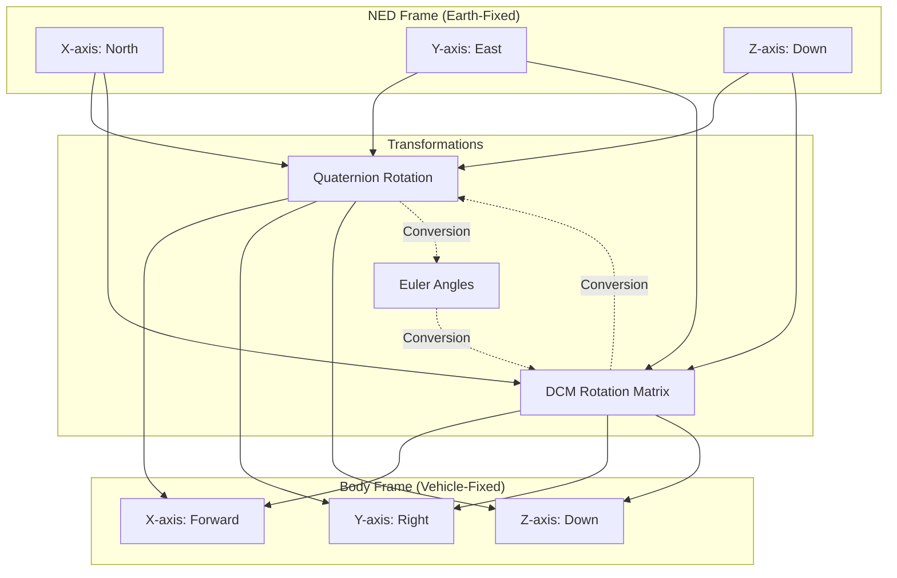

# ArduPilot Coordinate Frame Reference

## Overview

This document defines the coordinate frame conventions used throughout the ArduPilot autopilot system. Understanding these conventions is critical for working with navigation, attitude control, sensor fusion, and position estimation code.

ArduPilot uses multiple coordinate frames to represent vehicle position, orientation, and motion. Proper transformation between these frames is essential for accurate flight control and navigation.

## Primary Coordinate Frames

### NED Frame (North-East-Down)

The **NED frame** is the primary earth-fixed reference frame used throughout ArduPilot for navigation and position representation.

**Frame Definition**:
- **X-axis**: Points True North (aligned with Earth's rotational axis)
- **Y-axis**: Points East (perpendicular to North, rightward when facing North)
- **Z-axis**: Points Down (toward Earth's center, completes right-hand coordinate system)
- **Origin**: Typically set at vehicle home position or a mission datum point

**Why NED?**
- **Aeronautical Standard**: Consistent with aviation and aerospace industry conventions
- **Altitude Simplicity**: Altitude is represented as negative Z, making ground level approximately Z=0 and increasing altitude negative
- **Navigation Clarity**: North/East alignment simplifies waypoint navigation and heading calculations
- **Mathematical Consistency**: Right-hand coordinate system simplifies vector cross products and rotations

**Usage in ArduPilot**:
- All position estimates from EKF (Extended Kalman Filter) are in NED frame
- Waypoint coordinates are stored in NED frame relative to home
- Velocity vectors from navigation systems are in NED frame
- Wind estimates are in NED frame

**Code References**:
- `libraries/AP_AHRS/AP_AHRS.h` - AHRS interface provides NED position and velocity
- `libraries/AP_NavEKF3/AP_NavEKF3.h` - EKF3 state vector is in NED frame
- `libraries/AP_InertialNav/AP_InertialNav.h` - Inertial navigation in NED

### Body Frame

The **Body frame** is a vehicle-fixed reference frame that moves and rotates with the vehicle.

**Frame Definition**:
- **X-axis**: Points forward through vehicle nose (longitudinal axis)
- **Y-axis**: Points right toward starboard (lateral axis)
- **Z-axis**: Points down through vehicle belly (vertical axis, completes right-hand system)
- **Origin**: Typically at vehicle center of gravity (CG) or IMU location

**Frame Characteristics**:
- Right-hand coordinate system
- Fixed to vehicle structure
- Rotates with vehicle attitude
- Aligns with pilot's perspective (forward/right/down)

**Usage in ArduPilot**:
- IMU measurements (accelerometer, gyroscope) are in body frame
- Motor thrust vectors are defined in body frame
- Pilot stick inputs are interpreted in body frame
- Aerodynamic forces and moments are in body frame

**Vehicle-Specific Notes**:
- **Multicopter**: X-forward typically aligns with one motor arm or between arms depending on frame configuration
- **Fixed-Wing**: X-forward aligns with fuselage centerline pointing toward nose
- **Rover**: X-forward points in normal driving direction
- **Sub**: X-forward points toward front of vehicle

**Code References**:
- `libraries/AP_InertialSensor/AP_InertialSensor.h` - IMU data in body frame
- `libraries/AC_AttitudeControl/AC_AttitudeControl.h` - Attitude control in body frame
- `libraries/AP_Motors/AP_Motors.h` - Motor outputs defined in body frame

### Earth Frame

The **Earth frame** is a conceptual reference frame that can refer to either NED or ENU depending on context.

**ArduPilot Convention**: Unless explicitly stated otherwise, "earth frame" means NED frame in ArduPilot code and documentation.

**Alternative: ENU Frame (East-North-Up)**

Some external systems use **ENU (East-North-Up)** as their earth-fixed reference frame:

**ENU Frame Definition**:
- **X-axis**: Points East
- **Y-axis**: Points North  
- **Z-axis**: Points Up (away from Earth's center)
- **Origin**: Same as NED origin (typically home position)

**When ENU is Used**:
- ROS (Robot Operating System) uses ENU by default (REP-103 standard)
- Some GPS systems output velocity in ENU
- OpenGL and computer graphics often use ENU or similar "up is positive" conventions
- Academic papers may use ENU

**NED ↔ ENU Conversion**:

To convert a vector from NED to ENU:
```
X_enu = Y_ned    (East = East, same in both)
Y_enu = X_ned    (North = North, same in both)
Z_enu = -Z_ned   (Up = -Down, sign flip)
```

To convert a vector from ENU to NED:
```
X_ned = Y_enu    (North from ENU's North)
Y_ned = X_enu    (East from ENU's East)
Z_ned = -Z_enu   (Down = -Up, sign flip)
```

Matrix form for NED to ENU transformation:
```
    [ 0  1  0 ]
R = [ 1  0  0 ]
    [ 0  0 -1 ]
```

**Code References**:
- `libraries/AP_DDS/AP_DDS_Client.cpp` - ROS2/DDS integration handles ENU↔NED conversion
- `libraries/AP_GPS/AP_GPS.h` - Some GPS backends may use ENU velocity

## Attitude Representations

Vehicle attitude (orientation) relative to the NED frame can be represented in three mathematically equivalent ways. ArduPilot uses all three representations depending on the computational context.

### Quaternions (Preferred)

**Definition**: A quaternion is a 4-element representation: `q = [q0, q1, q2, q3]` or `q = [qw, qx, qy, qz]`

**ArduPilot Convention**: Uses `[q1, q2, q3, q4]` indexing in some contexts and `[w, x, y, z]` in others - always verify the specific code context.

**Standard Form**: 
```
q = q0 + q1*i + q2*j + q3*k
where q0 is the scalar (real) part
and q1, q2, q3 are the vector (imaginary) parts
```

**Unit Quaternion Constraint**: For representing rotations, quaternions must be normalized:
```
q0² + q1² + q2² + q3² = 1
```

**Advantages**:
- **No Gimbal Lock**: Valid for all possible orientations
- **Computational Efficiency**: Fewer operations than DCM for rotations
- **Numerical Stability**: Better numerical properties than Euler angles
- **Smooth Interpolation**: Easy to interpolate between orientations (SLERP)

**Disadvantages**:
- **Non-Intuitive**: Difficult for humans to interpret
- **Four Parameters**: Redundant representation (3 DOF with 4 parameters)

**Usage in ArduPilot**:
- EKF state estimation uses quaternions internally
- Attitude controllers often use quaternions for setpoints
- Attitude integration from gyroscopes uses quaternions

**Code References**:
- `libraries/AP_Math/quaternion.h` - Quaternion class implementation
- `libraries/AP_Math/quaternion.cpp` - Quaternion operations (multiplication, conjugate, rotation)
- `libraries/AP_NavEKF3/` - EKF3 uses quaternions for attitude state
- `libraries/AP_AHRS/AP_AHRS.h` - `get_quaternion()` method

### Euler Angles (Intuitive)

**Definition**: Three sequential rotations about specified axes, typically in roll-pitch-yaw order.

**ArduPilot Convention**:
- **Roll (φ)**: Rotation about X-axis (body frame), right wing down is positive
- **Pitch (θ)**: Rotation about Y-axis (body frame), nose up is positive  
- **Yaw (ψ)**: Rotation about Z-axis (body frame), nose right is positive

**Rotation Sequence**: ArduPilot uses **3-2-1 Euler sequence** (yaw-pitch-roll or Z-Y-X):
1. First rotate by yaw (ψ) about Z-axis
2. Then rotate by pitch (θ) about the new Y-axis
3. Finally rotate by roll (φ) about the new X-axis

**Angle Ranges**:
- Roll: -180° to +180° (-π to +π radians)
- Pitch: -90° to +90° (-π/2 to +π/2 radians)
- Yaw: -180° to +180° (-π to +π radians) or 0° to 360° depending on context

**Advantages**:
- **Intuitive**: Easy for humans to understand and visualize
- **Minimal Parameters**: Only 3 parameters for 3 DOF
- **Common Usage**: Standard in aviation (roll/pitch/heading)

**Disadvantages**:
- **Gimbal Lock**: Singularity at pitch = ±90° where roll and yaw become indistinguishable
- **Computational Cost**: Expensive to integrate gyroscope data
- **Ambiguity**: Multiple rotation sequences possible (3-2-1 vs others)

**Usage in ArduPilot**:
- User interfaces display attitude in Euler angles
- Pilot input interpretation uses roll/pitch/yaw concepts
- MAVLink telemetry transmits Euler angles
- Flight mode logic often uses Euler representation

**Code References**:
- `libraries/AP_Math/vector3.h` - Vector3f used for Euler angle storage
- `libraries/AP_AHRS/AP_AHRS.h` - `get_roll()`, `get_pitch()`, `get_yaw()` methods
- `libraries/AC_AttitudeControl/AC_AttitudeControl.h` - Uses Euler angles for target attitudes

### Direction Cosine Matrix (DCM)

**Definition**: A 3×3 orthogonal rotation matrix that transforms vectors from one frame to another.

**Matrix Form**:
```
    [ r11  r12  r13 ]
R = [ r21  r22  r23 ]
    [ r31  r32  r33 ]
```

**Properties**:
- **Orthogonal**: R^T = R^(-1) (transpose equals inverse)
- **Determinant**: det(R) = 1
- **Nine Elements**: Represents 3 DOF with 9 parameters (6 constraints)

**Body-to-NED Transformation**:
The DCM transforms a vector from body frame to NED frame:
```
V_ned = R * V_body
```

**NED-to-Body Transformation**:
The transpose transforms from NED to body frame:
```
V_body = R^T * V_ned
```

**Advantages**:
- **Direct Transformation**: Apply directly to vectors without conversion
- **No Gimbal Lock**: Valid for all orientations
- **Intuitive Columns**: Each column represents a body axis in NED frame

**Disadvantages**:
- **Memory**: Requires 9 elements storage
- **Computational Cost**: More operations than quaternions
- **Orthogonality Drift**: Numerical errors can violate orthogonality constraints

**Usage in ArduPilot**:
- Legacy DCM AHRS algorithm (libraries/AP_AHRS/AP_AHRS_DCM.cpp)
- Frame transformations in navigation code
- Sensor calibration calculations

**Code References**:
- `libraries/AP_Math/matrix3.h` - Matrix3f class for DCM
- `libraries/AP_Math/rotations.h` - Common rotation matrices
- `libraries/AP_AHRS/AP_AHRS_DCM.cpp` - DCM-based attitude estimation

## Frame Transformations

### Body Frame to NED Frame

**Using Quaternion**:
```cpp
// Rotate a vector from body frame to NED frame using quaternion
Vector3f vector_body(1.0f, 0.0f, 0.0f);  // 1m forward in body frame
Quaternion attitude = ahrs.get_quaternion();
Vector3f vector_ned;
attitude.earth_to_body(vector_ned, vector_body);  // Note: function name is inverse of operation
```

**Using DCM**:
```cpp
// Rotate a vector from body frame to NED frame using DCM
Vector3f vector_body(1.0f, 0.0f, 0.0f);
Matrix3f dcm = ahrs.get_DCM_rotation_body_to_ned();
Vector3f vector_ned = dcm * vector_body;
```

**Using Euler Angles** (less efficient, more complex):
```cpp
// Convert Euler angles to DCM, then transform
float roll = ahrs.get_roll();
float pitch = ahrs.get_pitch();
float yaw = ahrs.get_yaw();

// Build DCM from Euler angles (3-2-1 sequence)
Matrix3f dcm;
dcm.from_euler(roll, pitch, yaw);
Vector3f vector_ned = dcm * vector_body;
```

### NED Frame to Body Frame

**Using Quaternion**:
```cpp
// Rotate a vector from NED frame to body frame
Vector3f vector_ned(10.0f, 5.0f, -50.0f);  // 10m North, 5m East, 50m altitude
Quaternion attitude = ahrs.get_quaternion();
Vector3f vector_body;
attitude.body_to_earth(vector_body, vector_ned);  // Note: function name is inverse of operation
```

**Using DCM**:
```cpp
// Rotate a vector from NED frame to body frame
Vector3f vector_ned(10.0f, 5.0f, -50.0f);
Matrix3f dcm = ahrs.get_DCM_rotation_body_to_ned();
Vector3f vector_body = dcm.transposed() * vector_ned;  // Use transpose for inverse rotation
```

### Rotation Composition

**Quaternion Multiplication** (right-to-left order):
```cpp
// Combine two rotations: first rotate by q1, then by q2
Quaternion q1, q2;
Quaternion q_combined = q2 * q1;  // Note: right-to-left application
```

**DCM Multiplication** (left-to-right order):
```cpp
// Combine two rotations: first rotate by R1, then by R2
Matrix3f R1, R2;
Matrix3f R_combined = R2 * R1;
```

### Common Transformations

**Velocity Transformation**:
```cpp
// Transform velocity from NED to body frame for airspeed calculation
Vector3f velocity_ned = ahrs.get_velocity_NED();
Matrix3f dcm = ahrs.get_DCM_rotation_body_to_ned();
Vector3f velocity_body = dcm.transposed() * velocity_ned;

// Now velocity_body.x is forward airspeed, velocity_body.y is sideslip
```

**Acceleration Transformation**:
```cpp
// Transform IMU acceleration (body frame) to NED frame
Vector3f accel_body = ins.get_accel();  // Body frame acceleration
Matrix3f dcm = ahrs.get_DCM_rotation_body_to_ned();
Vector3f accel_ned = dcm * accel_body;
```

## Coordinate Conventions and Standards

### Rotation Direction Convention

ArduPilot uses the **right-hand rule** for all rotations:
- Point thumb in positive axis direction
- Fingers curl in positive rotation direction
- Positive roll: right wing down (clockwise looking forward)
- Positive pitch: nose up (clockwise looking right)
- Positive yaw: nose right (clockwise looking down)

### Angle Units

**Multiple Units in Use** (always verify in specific context):
- **Radians**: Preferred for internal calculations, range [-π, π] or [0, 2π]
- **Degrees**: Common in user interfaces and parameters, range [-180°, 180°] or [0°, 360°]
- **Centidegrees**: Used in some legacy code and MAVLink, range [-18000, 18000] or [0, 36000]

**Unit Conversion Functions**:
```cpp
// Defined in libraries/AP_Math/definitions.h
float radians_value = radians(degrees_value);
float degrees_value = degrees(radians_value);
int32_t centidegrees_value = degrees_value * 100;
```

### Angle Wrapping

**Wrapping to ±π or ±180°**:
```cpp
// Wrap angle to [-PI, PI]
float angle_wrapped = wrap_PI(angle_radians);

// Wrap angle to [-180, 180] degrees  
float angle_wrapped_deg = wrap_180(angle_degrees);

// Wrap angle to [0, 2*PI]
float angle_wrapped = wrap_2PI(angle_radians);

// Wrap angle to [0, 360] degrees
float angle_wrapped_deg = wrap_360(angle_degrees);
```

**Code Reference**: `libraries/AP_Math/definitions.h`

### Angular Rates

**Body Frame Angular Rates** (from gyroscopes):
- **p**: Roll rate (rad/s or deg/s about X-axis)
- **q**: Pitch rate (rad/s or deg/s about Y-axis)
- **r**: Yaw rate (rad/s or deg/s about Z-axis)

**Euler Angle Rates** (time derivatives of Euler angles):
- **φ̇**: Roll rate
- **θ̇**: Pitch rate
- **ψ̇**: Yaw rate

**Important**: Body angular rates (p,q,r) are NOT equal to Euler angle rates (φ̇,θ̇,ψ̇). The relationship is:
```
[ φ̇ ]   [ 1   sin(φ)tan(θ)   cos(φ)tan(θ) ] [ p ]
[ θ̇ ] = [ 0      cos(φ)         -sin(φ)    ] [ q ]
[ ψ̇ ]   [ 0   sin(φ)/cos(θ)   cos(φ)/cos(θ)] [ r ]
```

Note the singularity at θ = ±90° (gimbal lock).

## Coordinate Frame Diagram



## ArduPilot Math Library Reference

The `AP_Math` library provides comprehensive support for coordinate transformations and attitude representations.

### Key Classes

**Vector3f** - 3D vector:
```cpp
Vector3f v(x, y, z);
float length = v.length();
v.normalize();  // Convert to unit vector
float dot = v1.dot(v2);  // Dot product
Vector3f cross = v1.cross(v2);  // Cross product
```

**Quaternion** - Quaternion attitude representation:
```cpp
Quaternion q;
q.from_euler(roll, pitch, yaw);  // Convert from Euler angles
q.to_euler(roll, pitch, yaw);    // Convert to Euler angles
q.from_rotation_matrix(dcm);     // Convert from DCM
Matrix3f dcm = q.rotation_matrix();  // Convert to DCM
Vector3f v_rotated = q.rotate(v);    // Rotate a vector
```

**Matrix3f** - 3×3 matrix (used for DCM):
```cpp
Matrix3f m;
m.from_euler(roll, pitch, yaw);  // Create DCM from Euler angles
m.to_euler(roll, pitch, yaw);    // Extract Euler angles
Matrix3f m_inv = m.transposed();  // Transpose (inverse for rotation matrix)
Vector3f v_transformed = m * v;   // Matrix-vector multiplication
```

**Code Location**: `libraries/AP_Math/`

### Common Functions

**Rotation Utilities** (`libraries/AP_Math/rotations.h`):
- `rotate()` - Apply predefined rotations (e.g., ROTATION_YAW_90)
- Standard rotations for sensor mounting orientations

**Angle Utilities** (`libraries/AP_Math/definitions.h`):
- `wrap_PI()`, `wrap_180()` - Wrap angles to [-π, π] or [-180°, 180°]
- `wrap_2PI()`, `wrap_360()` - Wrap angles to [0, 2π] or [0°, 360°]
- `radians()`, `degrees()` - Unit conversions
- `is_equal()` - Floating-point comparison with tolerance

## Usage Examples

### Example 1: Transform Wind Vector to Body Frame

```cpp
// Get wind estimate in NED frame (from EKF)
Vector3f wind_ned = ahrs.wind_estimate();

// Get current attitude
Matrix3f dcm = ahrs.get_DCM_rotation_body_to_ned();

// Transform to body frame to calculate relative airspeed
Vector3f wind_body = dcm.transposed() * wind_ned;

// Calculate relative airspeed vector
Vector3f velocity_body = dcm.transposed() * ahrs.get_velocity_NED();
Vector3f airspeed_vector = velocity_body - wind_body;
```

### Example 2: Calculate Desired Attitude from Target Vector

```cpp
// Target vector in NED frame (e.g., point toward waypoint)
Vector3f target_ned(north_dist, east_dist, 0);
target_ned.normalize();

// Calculate desired yaw
float desired_yaw = atan2f(target_ned.y, target_ned.x);

// Keep current roll and pitch
float current_roll = ahrs.get_roll();
float current_pitch = ahrs.get_pitch();

// Create desired attitude quaternion
Quaternion desired_attitude;
desired_attitude.from_euler(current_roll, current_pitch, desired_yaw);
```

### Example 3: Integrate Gyroscope to Update Attitude

```cpp
// Get body frame angular rates from gyroscope
Vector3f gyro = ins.get_gyro();  // rad/s in body frame

// Get current attitude quaternion
Quaternion attitude = ahrs.get_quaternion();

// Create quaternion from angular velocity (small angle approximation)
float dt = 0.01f;  // Time step in seconds
Quaternion delta_q;
delta_q.from_axis_angle(gyro * dt);

// Update attitude
attitude = attitude * delta_q;
attitude.normalize();  // Maintain unit quaternion constraint
```

## Reference Documentation

### ArduPilot Source Code

**Primary References**:
- `libraries/AP_AHRS/AP_AHRS.h` - Attitude and heading reference system interface
- `libraries/AP_Math/vector3.h` - 3D vector implementation
- `libraries/AP_Math/quaternion.h` - Quaternion class
- `libraries/AP_Math/matrix3.h` - 3×3 matrix (DCM) class
- `libraries/AP_Math/definitions.h` - Mathematical constants and conversions
- `libraries/AP_Math/rotations.h` - Predefined rotation matrices
- `libraries/AP_NavEKF3/AP_NavEKF3_core.h` - EKF3 state vector documentation

**Related Documentation**:
- `libraries/AP_AHRS/README.md` - AHRS architecture and backend selection
- `libraries/AP_Math/README.md` - Math library comprehensive guide
- `docs/glossary.md` - ArduPilot terminology definitions

### External Standards

**Coordinate Frame Standards**:
- MIL-STD-1797A - Flying Qualities of Piloted Aircraft (defines body frame)
- ISO 1151 - Flight Dynamics Coordinate Systems
- REP-103 - ROS Standard Units of Measure and Coordinate Conventions (defines ENU)

**Attitude Representation**:
- Quaternion mathematics: Shoemake, K. "Animating Rotation with Quaternion Curves"
- Euler angles and gimbal lock: Kuipers, J. "Quaternions and Rotation Sequences"

### Glossary

- **AHRS**: Attitude and Heading Reference System
- **DCM**: Direction Cosine Matrix (rotation matrix)
- **EKF**: Extended Kalman Filter
- **ENU**: East-North-Up coordinate frame
- **Gimbal Lock**: Singularity in Euler angle representation at 90° pitch
- **IMU**: Inertial Measurement Unit (accelerometer + gyroscope)
- **NED**: North-East-Down coordinate frame
- **Quaternion**: 4-element attitude representation (no gimbal lock)
- **SLERP**: Spherical Linear Interpolation (smooth quaternion interpolation)

## Best Practices

### When to Use Each Representation

**Use Quaternions when**:
- Integrating gyroscope measurements over time
- Interpolating between attitudes
- Avoiding gimbal lock (e.g., aggressive aerobatics, vertical climbing)
- Performing repeated attitude updates in high-rate control loops

**Use Euler Angles when**:
- Displaying attitude to users (intuitive)
- Interpreting pilot inputs (roll/pitch/yaw commands)
- Implementing mode logic based on attitude (e.g., "if pitch > 45°")
- Telemetry and logging for human readability

**Use DCM when**:
- Directly transforming many vectors between frames
- Working with legacy code that uses DCM
- Implementing sensor calibration routines
- Needing to extract individual rotation components

### Avoiding Common Mistakes

1. **Frame Confusion**: Always explicitly state which frame a vector is in
2. **Unit Confusion**: Always specify units (radians vs degrees)
3. **Gimbal Lock**: Don't use Euler angles for aggressive maneuvers
4. **Quaternion Normalization**: Always normalize quaternions after arithmetic operations
5. **DCM Orthogonality**: Periodically re-orthogonalize DCM to correct numerical drift
6. **Rotation Order**: Remember quaternion multiplication is right-to-left
7. **Angle Wrapping**: Always wrap angles after arithmetic operations

### Performance Considerations

**Computational Cost** (approximate, platform-dependent):
- Quaternion rotation: ~30 multiplications + additions
- DCM rotation: ~9 multiplications + 6 additions  
- Euler angle construction: ~15 trigonometric functions (expensive)

**Memory Usage**:
- Quaternion: 4 floats (16 bytes)
- Euler angles: 3 floats (12 bytes)
- DCM: 9 floats (36 bytes)

**Recommendation**: Use quaternions for high-rate updates, convert to Euler only when needed for display.

## Validation and Testing

### Unit Tests

Coordinate transformation unit tests are located in:
- `libraries/AP_Math/tests/test_quaternion.cpp`
- `libraries/AP_Math/tests/test_matrix.cpp`
- `libraries/AP_Math/tests/test_vector3.cpp`

### SITL Verification

Verify coordinate transformations in Software-In-The-Loop simulation:

```bash
# Start SITL with attitude visualization
sim_vehicle.py -v Copter --console --map

# In MAVProxy console, monitor attitude
mode STABILIZE
arm throttle
rc 3 1500  # Hover throttle

# Observe attitude reported in different representations
# Euler angles displayed in HUD
# Quaternion in MAVLink ATTITUDE_QUATERNION message
```

### Hardware Testing

When testing on actual hardware:
1. Verify NED frame alignment with magnetic North
2. Check body frame axes match vehicle orientation (use SERVO_OUTPUT_RAW to verify)
3. Validate attitude estimates match IMU orientation
4. Test gimbal lock avoidance at extreme pitch angles
5. Verify coordinate transformations with known vectors (e.g., gravity should be [0,0,9.81] in NED when stationary)

## Notes and Warnings

**⚠️ WARNING - Safety Critical**: Incorrect coordinate transformations can cause:
- Navigation errors leading to flyaways
- Attitude control instability
- Incorrect sensor fusion causing position drift
- Erroneous waypoint navigation

**📝 NOTE - Frame Consistency**: Always verify that:
- Vectors are in the expected frame before operations
- Transformations use the correct direction (body-to-NED vs NED-to-body)
- Units are consistent throughout calculations
- Quaternions are normalized after updates

**📝 NOTE - Magnetic Declination**: NED frame uses True North, but magnetometers measure Magnetic North. ArduPilot automatically applies declination correction. See `libraries/AP_Compass/` for details.

**📝 NOTE - GPS Frame**: GPS systems typically output position in latitude/longitude/altitude (WGS-84 ellipsoid). ArduPilot converts this to local NED frame with origin at home position. See `libraries/AP_GPS/` for conversion details.

---

*Last Updated: 2025-01-XX*  
*This document is maintained as part of ArduPilot code documentation.*  
*For questions or corrections, please file an issue on the ArduPilot GitHub repository.*
