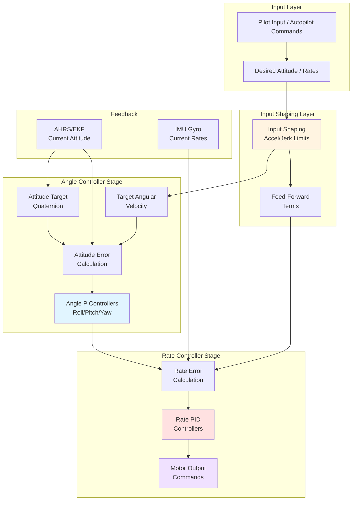
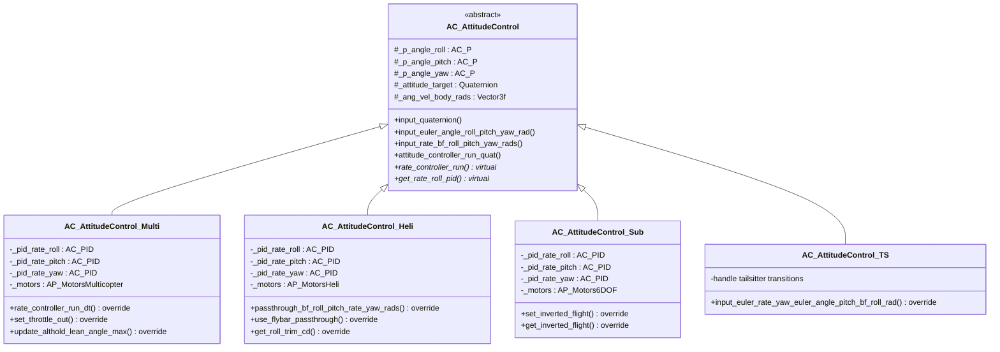
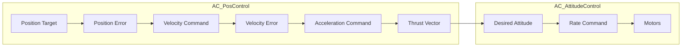

# AC_AttitudeControl Library


## Table of Contents
- [Overview](#overview)
- [Control Architecture](#control-architecture)
- [Core Components](#core-components)
- [Rate Controllers](#rate-controllers)
- [Angle Controllers](#angle-controllers)
- [Feed-Forward Terms](#feed-forward-terms)
- [Vehicle-Specific Implementations](#vehicle-specific-implementations)
- [Position Control Integration](#position-control-integration)
- [Control Theory Background](#control-theory-background)
- [PID Tuning Guide](#pid-tuning-guide)
- [Parameter Reference](#parameter-reference)
- [API Reference](#api-reference)
- [Integration Examples](#integration-examples)
- [Testing and Validation](#testing-and-validation)

## Overview

The AC_AttitudeControl library provides the core attitude control system for ArduPilot vehicles, implementing a cascaded control architecture that translates high-level attitude commands into motor outputs. This library is safety-critical and forms the foundation of vehicle stability and flight control.

**Source Files**: `/libraries/AC_AttitudeControl/`

### Key Features

- **Cascaded Control Loop**: Implements multi-stage control from desired attitude to motor commands
- **Quaternion-Based Control**: Uses quaternions for singularity-free attitude representation
- **Input Shaping**: Jerk-limited trajectory generation for smooth response
- **Vehicle Adaptation**: Specialized implementations for multicopters, helicopters, submarines, and tailsitters
- **Configurable Response**: Extensive parameter system for tuning control behavior

### Responsibilities

The AC_AttitudeControl library handles:

1. **Attitude Target Management**: Maintains and updates desired attitude quaternions from various input modes
2. **Angular Velocity Generation**: Computes body-frame angular velocity targets with input shaping
3. **Rate Control**: Implements PID-based rate controllers for roll, pitch, and yaw axes
4. **Thrust Vector Control**: Separates thrust direction control from heading control
5. **Throttle Mixing**: Balances attitude correction authority with vertical thrust requirements
6. **System Identification**: Provides interfaces for in-flight frequency response testing

### Safety-Critical Nature

**This library directly controls vehicle actuators and must meet the highest standards for:**
- Numerical stability under all attitude configurations
- Guaranteed bounded outputs to prevent actuator saturation issues
- Protection against gimbal lock through quaternion representation
- Real-time performance with deterministic execution times
- Fail-safe behavior during sensor anomalies or input discontinuities

## Control Architecture

The AC_AttitudeControl library implements a cascaded control structure with three primary stages:



### Control Loop Stages

#### Stage 1: Desired Attitude Input and Shaping

The first stage accepts attitude commands in multiple formats:
- Quaternion attitude with angular velocity
- Euler angles (roll/pitch/yaw)
- Euler angle rates (earth-frame angular velocities)
- Body-frame angular rates
- Thrust vector with heading

**Key Function**: `input_quaternion()`, `input_euler_angle_roll_pitch_yaw_rad()`, `input_rate_bf_roll_pitch_yaw_rads()`

Input shaping is applied using the `input_shaping_angle()` and `input_shaping_ang_vel()` functions, which implement a jerk-limited trajectory with configurable:
- Maximum acceleration (`ACCEL_R_MAX`, `ACCEL_P_MAX`, `ACCEL_Y_MAX`)
- Maximum angular velocity (`RATE_R_MAX`, `RATE_P_MAX`, `RATE_Y_MAX`)
- Time constant for exponential decay (`INPUT_TC`)

#### Stage 2: Angle Controller

The angle controller computes the angular velocity required to drive attitude error to zero. This stage uses proportional (P) control only:

```
angular_velocity_target = attitude_error * angle_P_gain
```

**Source**: `AC_AttitudeControl.cpp:attitude_controller_run_quat()`

The angle controller operates on the rotation vector representation of attitude error, computed using the `thrust_vector_rotation_angles()` method. This approach:
1. First corrects thrust vector (roll/pitch) errors
2. Then corrects heading (yaw) errors once thrust alignment is within limits
3. Prevents large yaw corrections when vehicle is tilted excessively

**Angle P Parameters**:
- `ANG_RLL_P`: Roll axis angle controller P gain (default: 4.5)
- `ANG_PIT_P`: Pitch axis angle controller P gain (default: 4.5)
- `ANG_YAW_P`: Yaw axis angle controller P gain (default: 4.5)

#### Stage 3: Rate Controller

The rate controller is the innermost loop, implementing full PID control on body-frame angular rates:

```
motor_output = rate_P * rate_error + rate_I * ∫(rate_error)dt + rate_D * d(rate_error)/dt
```

**Source**: `AC_AttitudeControl_Multi.cpp:rate_controller_run_dt()`

The rate controller runs at the highest frequency (typically 400Hz) with minimal latency between gyro sample and motor output. Key features:
- Low-pass filtering on D-term to reduce noise amplification
- I-term limiting to prevent windup
- Output saturation limiting
- Feed-forward paths for improved tracking

### Control Flow Sequence

**Source**: `AC_AttitudeControl.cpp:284-305` (comments describing control flow)

1. **Define Desired Attitude**: Input functions establish the desired attitude or attitude change
2. **Update Target Attitude**: Target attitude advances based on angular velocity and dt
3. **Compute Target Angular Velocity**: Input shaping generates smooth velocity profile
4. **Optional Feed-Forward Bypass**: When `RATE_FF_ENAB=0`, targets track desired directly without shaping
5. **Ensure State Consistency**: All target representations (quaternion, euler, angular velocity) remain synchronized
6. **Run Attitude Controller**: `attitude_controller_run_quat()` computes rate corrections from attitude error
7. **Run Rate Controller**: Motor commands generated from rate error and PID controllers

## Core Components

### Class Hierarchy



### AC_AttitudeControl (Base Class)

**Source**: `libraries/AC_AttitudeControl/AC_AttitudeControl.h`

The abstract base class defining the attitude control interface. It provides:
- Angle P controllers for roll, pitch, yaw axes
- Attitude target management (quaternion and euler representations)
- Angular velocity target computation
- Input shaping algorithms
- Virtual interface for rate controller implementation

**Key Members**:
- `_attitude_target`: Quaternion representing target attitude in NED frame
- `_euler_angle_target_rad`: 321-intrinsic Euler angle representation of target
- `_ang_vel_body_rads`: Body-frame angular velocity command to rate controller
- `_ang_vel_target_rads`: Angular velocity of target attitude (in target frame)
- `_p_angle_roll/pitch/yaw`: P controllers for angle-to-rate conversion

**Singleton Access**: `AC_AttitudeControl::get_singleton()`

### AC_AttitudeControl_Multi (Multicopter)

**Source**: `libraries/AC_AttitudeControl/AC_AttitudeControl_Multi.h/.cpp`

Implements attitude control for multicopter vehicles with thrust vectoring through differential motor speeds.

**Features**:
- Full PID rate controllers with D-term filtering
- Throttle-to-attitude mix for altitude stability
- Angle boost (thrust compensation during tilt)
- Altitude-hold lean angle limiting
- Notch filter support for harmonic rejection

**Default Rate PID Gains** (Source: `AC_AttitudeControl_Multi.h:10-39`):
- Roll/Pitch: P=0.135, I=0.135, D=0.0036, IMAX=0.5
- Yaw: P=0.180, I=0.018, D=0.0, IMAX=0.5

### AC_AttitudeControl_Heli (Helicopter)

**Source**: `libraries/AC_AttitudeControl/AC_AttitudeControl_Heli.h/.cpp`

Specialized for helicopters with swashplate and tail rotor control.

**Helicopter-Specific Features**:
- Flybar passthrough mode for mechanical stabilization
- Roll trim compensation for tail rotor thrust
- Leaky integrator mode for external stability augmentation
- Collective-to-attitude coordination
- Swashplate mixing integration

### AC_AttitudeControl_Sub (Submarine)

**Source**: `libraries/AC_AttitudeControl/AC_AttitudeControl_Sub.h/.cpp`

Adapted for underwater vehicles with 6-DOF thruster control.

**Submarine-Specific Features**:
- Inverted flight support for upside-down operation
- 6-DOF thruster allocation
- Buoyancy compensation integration
- Reduced gain requirements due to water damping

### AC_AttitudeControl_TS (Tailsitter)

**Source**: `libraries/AC_AttitudeControl/AC_AttitudeControl_TS.h/.cpp`

Handles attitude control for VTOL tailsitter aircraft during transitions.

**Tailsitter-Specific Features**:
- Body-frame roll with euler pitch/yaw rate control
- Automatic gain switching during transitions
- Coordinate frame transformations for vertical/horizontal flight
- Control surface vs thrust vectoring blending

### AC_PosControl (Position Controller)

**Source**: `libraries/AC_AttitudeControl/AC_PosControl.h/.cpp`

Provides 3D position control that commands the attitude controller. While technically separate, AC_PosControl is tightly integrated with attitude control.

**Position Control Stages**:
1. **Position Error → Velocity Command**: P control on position error
2. **Velocity Tracking**: PI or PID control on velocity error  
3. **Acceleration → Attitude Command**: Converts desired acceleration to thrust vector
4. **Attitude → Motor Output**: Passed to AC_AttitudeControl

**Key Integration**: AC_PosControl generates thrust vectors and desired attitudes that are fed into AC_AttitudeControl via `input_thrust_vector_heading_rad()` and related methods.

### AC_CommandModel

**Source**: `libraries/AC_AttitudeControl/AC_CommandModel.h/.cpp`

Encapsulates command model parameters for input shaping:
- `rate`: Maximum rate limit
- `rate_tc`: Rate time constant for shaping
- `expo`: Exponential shaping for pilot input sensitivity

Used by higher-level controllers to provide consistent input shaping across different flight modes.

### AC_WeatherVane

**Source**: `libraries/AC_AttitudeControl/AC_WeatherVane.h/.cpp`

Automatically adjusts yaw to point the vehicle into the wind during position-hold modes.

**Operation**:
- Monitors vehicle drift in position hold
- Infers wind direction from drift
- Commands yaw rotation to minimize drift
- Can align nose, tail, or side into wind

**Typical Use Cases**: Improves station-keeping in loiter, reduces position error in autonomous missions, and improves landing accuracy in wind.

## Rate Controllers

The rate controllers form the innermost control loop, translating body-frame angular velocity targets into motor commands. These run at the highest frequency and have the most direct impact on vehicle stability.

**Source**: `AC_AttitudeControl_Multi.cpp:rate_controller_run_dt()`

### PID Implementation

Each axis (roll, pitch, yaw) has an independent PID controller:

```
output = P * error + I * ∫error·dt + D * d(error)/dt
```

**Implementation Details** (Source: `AC_PID` library):

**P-Term (Proportional)**:
```cpp
p_term = rate_P * (target_rate - measured_rate)
```
- Responds instantly to rate errors
- Higher P → stiffer response, but can cause oscillation
- Typical range: 0.08 to 0.20 for multicopters

**I-Term (Integral)**:
```cpp
i_term += rate_I * rate_error * dt
i_term = constrain(i_term, -IMAX, IMAX)
```
- Eliminates steady-state errors
- Compensates for asymmetries and external disturbances
- Must be limited (IMAX) to prevent windup
- Typical range: 0.08 to 0.20 for multicopters

**D-Term (Derivative)**:
```cpp
error_rate_filtered = lpf(d(error)/dt, cutoff_freq)
d_term = rate_D * error_rate_filtered
```
- Provides damping and anticipates error changes
- Filtered to reduce noise amplification from gyro
- Higher D → more damping, but sensitive to noise
- Typical range: 0.001 to 0.008 for multicopters

### Rate Controller Execution

**Timing Considerations** (Source: `AC_AttitudeControl.cpp:196-220`):

The rate controller should run **before** the attitude controller in the scheduler to minimize latency between gyro sample and motor output. This counter-intuitive ordering provides:
- Minimum jitter in rate control
- Latest gyro data used for motor commands
- Reduced control loop delays

The `get_latest_gyro()` method handles cases where different execution orders exist (e.g., Plane's quadplane).

### Rate Controller Methods

#### `rate_controller_run()`

**Source**: `AC_AttitudeControl_Multi.cpp`

Main entry point for rate control. Calls `rate_controller_run_dt()` with current gyro and dt.

**Thread Safety Note**: This function may be called from a separate high-priority thread on some platforms for improved real-time performance.

#### `rate_controller_run_dt(const Vector3f& gyro_rads, float dt)`

**Source**: `AC_AttitudeControl_Multi.cpp`

Executes the rate controller with explicit gyro measurement and timestep:

```cpp
void AC_AttitudeControl_Multi::rate_controller_run_dt(const Vector3f& gyro_rads, float dt)
{
    Vector3f rate_target_rads = _ang_vel_body_rads + _sysid_ang_vel_body_rads;
    Vector3f rate_error = rate_target_rads - gyro_rads;
    
    // Apply PD scaling (for landed gain reduction, etc.)
    rate_error *= _pd_scale_used;
    
    // Run PID controllers
    _motors.set_roll(_pid_rate_roll.update_all(rate_error.x, dt, _motors.limit.roll) + _actuator_sysid.x);
    _motors.set_pitch(_pid_rate_pitch.update_all(rate_error.y, dt, _motors.limit.pitch) + _actuator_sysid.y);
    _motors.set_yaw(_pid_rate_yaw.update_all(rate_error.z, dt, _motors.limit.yaw) + _actuator_sysid.z);
}
```

**Key Elements**:
1. Combines base target with system identification offsets
2. Calculates rate error from gyro
3. Applies dynamic gain scaling
4. Executes PID update with anti-windup from motor limits
5. Adds system identification signals for in-flight testing
6. Sends outputs directly to motor library

### Rate Feedforward

**Parameter**: `RATE_FF_ENAB` (default: enabled)

When enabled, the attitude controller's output angular velocity is fed directly into the rate controller input, bypassing the angle controller. This creates a "rate feedforward" path that improves tracking performance.

**Benefits**:
- Reduced attitude lag during aggressive maneuvers
- Better disturbance rejection
- Improved attitude tracking in wind
- Enables larger angle P gains without instability

**When to Disable**: Some users prefer disabled feedforward for a "softer" feel or when tuning P-only angle controllers for autotuning.

### Rate Limiting and Saturation

**Output Limits** (Source: `AC_AttitudeControl.h:26-27`):
```cpp
#define AC_ATTITUDE_RATE_RP_CONTROLLER_OUT_MAX  1.0f  // roll-pitch
#define AC_ATTITUDE_RATE_YAW_CONTROLLER_OUT_MAX 1.0f  // yaw
```

Rate controller outputs are normalized to ±1.0 range before being passed to the motor mixer. The motor library applies further limiting based on:
- Throttle headroom
- Motor saturation
- Throttle-RPY mix setting

**Anti-Windup**: When motors saturate, the limit flags are passed back to the PID controllers to prevent integrator windup (Source: `_motors.limit.roll/pitch/yaw` in rate controller).

### Rate Controller Tuning Parameters

**Roll/Pitch Axis**:
- `ATC_RAT_RLL_P` / `ATC_RAT_PIT_P`: Rate proportional gain
- `ATC_RAT_RLL_I` / `ATC_RAT_PIT_I`: Rate integral gain
- `ATC_RAT_RLL_D` / `ATC_RAT_PIT_D`: Rate derivative gain
- `ATC_RAT_RLL_IMAX` / `ATC_RAT_PIT_IMAX`: I-term output limit (0-1)
- `ATC_RAT_RLL_FILT` / `ATC_RAT_PIT_FILT`: D-term filter frequency (Hz)

**Yaw Axis**:
- `ATC_RAT_YAW_P`: Rate proportional gain
- `ATC_RAT_YAW_I`: Rate integral gain  
- `ATC_RAT_YAW_D`: Rate derivative gain (usually 0)
- `ATC_RAT_YAW_IMAX`: I-term output limit (0-1)
- `ATC_RAT_YAW_FILT`: D-term filter frequency (Hz)

### Landed Gain Reduction

**Parameters**: `LAND_R_MULT`, `LAND_P_MULT`, `LAND_Y_MULT` (Source: `AC_AttitudeControl.cpp:155-174`)

When the vehicle is detected as landed, rate controller gains are reduced to suppress ground resonance and vibration feedback. The reduction is smoothly slewed based on `INPUT_TC`.

**Source**: `AC_AttitudeControl.cpp:landed_gain_reduction()`

```cpp
// Reduction applied via PD scale multiplier
Vector3f scale_mult = (1.0 - landed_ratio) + 
                      Vector3f(LAND_R_MULT, LAND_P_MULT, LAND_Y_MULT) * landed_ratio;
set_PD_scale_mult(scale_mult);
```

## Angle Controllers

The angle controllers form the middle stage of the cascaded control loop, converting attitude errors into angular velocity commands.

**Source**: `AC_AttitudeControl.cpp:attitude_controller_run_quat()`

### Proportional Control

The angle controllers use **P-only** control (no I or D terms):

```
angular_velocity_command = angle_P * attitude_error_rotation_vector
```

**Rationale for P-Only**:
- I-term handled by rate controller's integrator
- D-term would require differentiating noisy attitude estimates  
- P-only provides sufficient performance with proper input shaping
- Simplifies tuning (only one gain per axis)

### Quaternion-Based Error Calculation

**Source**: `AC_AttitudeControl.cpp:thrust_vector_rotation_angles()`

Attitude error is computed using quaternion mathematics to avoid gimbal lock:

```cpp
// Rotation from current attitude to target attitude
Quaternion attitude_error_quat = attitude_body.inverse() * attitude_target;

// Convert to rotation vector (axis-angle representation)
Vector3f attitude_error_rotation_vector;
attitude_error_quat.to_axis_angle(attitude_error_rotation_vector);
```

The rotation vector representation has magnitude equal to rotation angle and direction along the rotation axis. This provides a singularity-free error representation.

### Thrust Vector vs Heading Split

**Source**: `AC_AttitudeControl.cpp:473-477`

The attitude controller uses a sophisticated two-stage correction strategy:

**Stage 1 - Thrust Vector Correction**:
```cpp
// Compute thrust direction error (roll/pitch)
thrust_vector_correction = quaternion_rotation(current_thrust, desired_thrust);
```

The controller first corrects the thrust vector (vehicle's Z-axis direction) to match the desired thrust direction. This primarily affects roll and pitch.

**Stage 2 - Heading Correction**:
```cpp
// Only correct heading after thrust vector is aligned
if (thrust_error_angle < 2 * AC_ATTITUDE_THRUST_ERROR_ANGLE_RAD) {
    heading_correction = yaw_error * angle_yaw_P;
}
```

Once the thrust vector is within 60° of target (`AC_ATTITUDE_THRUST_ERROR_ANGLE_RAD = 30°`), heading (yaw) corrections are added.

**Benefits of This Approach**:
- Prevents large yaw corrections when vehicle is inverted or near gimbal lock
- Prioritizes recovering level flight orientation before refining heading
- More intuitive behavior during upset recovery
- Reduces coupling between thrust and yaw controls

### Square Root Controller

**Source**: `AC_AttitudeControl.cpp:326-328`, controlled by `use_sqrt_controller()`

When input shaping is enabled, the angle controller uses a square-root controller for the angular velocity command:

```cpp
// Square root controller for smooth deceleration
ang_vel_target = sqrt_controller(error, input_tc, accel_max, current_vel, desired_vel)
```

The square root controller computes angular velocity that will:
1. Accelerate toward the target with limited acceleration
2. Decelerate smoothly as target is approached
3. Arrive at target with zero velocity
4. Exponentially decay small errors with time constant `INPUT_TC`

This creates a critically-damped response without overshoot.

**Disable During Autotune**: The sqrt controller is disabled during autotune (`use_sqrt_controller(false)`) to isolate angle P gain effects without acceleration limiting.

### Angle P Tuning Parameters

**Source**: `AC_AttitudeControl.cpp:84-106`

- `ANG_RLL_P`: Roll angle controller P gain (range: 3.0-12.0, default: 4.5)
- `ANG_PIT_P`: Pitch angle controller P gain (range: 3.0-12.0, default: 4.5)  
- `ANG_YAW_P`: Yaw angle controller P gain (range: 3.0-12.0, default: 4.5)

**Tuning Guidelines**:
- Higher P → faster attitude response, but can cause oscillation if too high
- Lower P → softer, slower response
- Should be tuned after rate controllers are stable
- Typical starting point: 4.5 for all axes
- Increase until you see small oscillations, then reduce by 25%

### Angle P Scaling

**Source**: `AC_AttitudeControl.h:541-550`

The angle P gains can be dynamically scaled for special situations:

```cpp
// Set one-time scale (replaces previous)
void set_angle_P_scale(const Vector3f &angle_P_scale);

// Multiply by scale (accumulates with previous)
void set_angle_P_scale_mult(const Vector3f &angle_P_scale);
```

**Use Cases**:
- Reduce gains when landed (via `landed_gain_reduction()`)
- Coordinate with throttle changes (see `update_throttle_gain_boost()`)
- Reduce authority during transitions or special modes
- Adaptive gain scheduling based on flight conditions

The applied scale is recorded in `_angle_P_scale_used` for logging and debugging.

## Feed-Forward Terms

Feed-forward control improves tracking performance by anticipating required control outputs based on desired motion, rather than waiting for errors to develop.

### Angular Velocity Feedforward

**Parameter**: `RATE_FF_ENAB` (Source: `AC_AttitudeControl.cpp:48-53`)

When enabled (default), the target angular velocity computed by the attitude controller is passed directly to the rate controller as a feed-forward term:

```
rate_controller_input = attitude_controller_output + feedforward_angular_velocity
```

**Implementation** (Source: `AC_AttitudeControl.cpp:318-332`):

```cpp
if (_rate_bf_ff_enabled) {
    // Compute angular velocity to smoothly reach target
    _ang_vel_target_rads.x = input_shaping_angle(error.x, _input_tc, 
                                                  accel_max, _ang_vel_target_rads.x, 
                                                  desired_vel.x, vel_max, dt);
    // ... similar for y and z axes
} else {
    // Without feedforward, target jumps directly to desired
    _attitude_target = attitude_desired;
    _ang_vel_target_rads = desired_ang_vel;
}
```

**Benefits**:
- Reduced phase lag in attitude tracking
- Better disturbance rejection (e.g., wind gusts)
- Enables higher angle P gains without oscillation
- Smoother trajectory tracking in autonomous flight

**When to Disable**:
- Troubleshooting oscillations
- Very basic tuning procedures
- When softer, more damped response is preferred

### Acceleration Feedforward

The input shaping process naturally generates acceleration feed-forward through its jerk-limited trajectory planning.

**Acceleration Limits** (Source: `AC_AttitudeControl.cpp:55-73`):

- `ACCEL_R_MAX`: Maximum roll acceleration (centideg/s², default: 110000)
- `ACCEL_P_MAX`: Maximum pitch acceleration (centideg/s², default: 110000)  
- `ACCEL_Y_MAX`: Maximum yaw acceleration (centideg/s², default: 27000)

These limits shape the angular velocity commands to provide smooth, non-jerky motion.

**Mathematical Form**:

The `input_shaping_angle()` function implements a trajectory that produces angular acceleration feed-forward implicitly:

```
accel_ff = (target_vel - current_vel) / dt  [limited by accel_max]
position_correction = sqrt_controller(error, ...)
total_vel_cmd = position_correction + accel_ff
```

### Throttle Angle Boost

**Parameter**: `ANGLE_BOOST` (Source: `AC_AttitudeControl.cpp:77-82`)

When enabled (default), throttle is increased as the vehicle tilts to maintain vertical thrust:

```
throttle_boosted = throttle_in / cos(tilt_angle)
```

**Source**: `AC_AttitudeControl_Multi.cpp:get_throttle_boosted()`

**Benefits**:
- Maintains altitude during attitude changes
- Reduces altitude loss in aggressive maneuvers
- More predictable altitude hold performance

**Implementation Details**:
- Applied in `set_throttle_out()` when `apply_angle_boost` is true
- Limited to reasonable range to prevent excessive throttle
- Filtered to prevent rapid throttle changes

### Yaw Feed-Forward Scaling

**Source**: `AC_AttitudeControl.cpp:687-688`

During extreme roll/pitch attitudes, yaw control authority is reduced:

```cpp
// Reduce yaw feedforward when thrust error is large
_feedforward_scalar = constrain_float((AC_ATTITUDE_THRUST_ERROR_ANGLE_RAD - 
                                       _thrust_error_angle_rad) / 
                                      AC_ATTITUDE_THRUST_ERROR_ANGLE_RAD, 0.0f, 1.0f);
```

This prevents wasting yaw control effort when the vehicle is tilted excessively and yaw control would be ineffective or couple into roll/pitch.

## Vehicle-Specific Implementations

Each vehicle type has unique control characteristics requiring specialized implementations.

### Multicopter (AC_AttitudeControl_Multi)

**Source**: `libraries/AC_AttitudeControl/AC_AttitudeControl_Multi.h/.cpp`

**Characteristics**:
- Thrust vectoring through differential motor speeds
- Coupled roll/pitch/yaw/throttle control
- Fast dynamics requiring aggressive tuning
- Symmetrical control authority in all directions

**Key Features**:

**Throttle-RPY Mix** (Source: `AC_AttitudeControl_Multi.cpp:99-114`):
```cpp
void set_throttle_mix_min() { _throttle_rpy_mix_desired = _thr_mix_min; }
void set_throttle_mix_man() { _throttle_rpy_mix_desired = _thr_mix_man; }  
void set_throttle_mix_max() { _throttle_rpy_mix_desired = _thr_mix_max; }
```

The throttle mix controls priority between altitude and attitude:
- **Min Mix** (~0.1): Prioritize throttle response over attitude
- **Man Mix** (~0.1): Balanced for manual flight
- **Max Mix** (~0.5): Prioritize attitude over throttle

Set by flight modes based on whether aggressive attitude control or altitude accuracy is more important.

**Altitude-Hold Lean Angle Limiting** (Source: `AC_AttitudeControl_Multi.cpp:update_althold_lean_angle_max()`):

Reduces maximum lean angle when throttle is high to prevent altitude loss:

```cpp
float angle_max_rad = _aparm.angle_max * 0.01f;
if (throttle_in > ANGLE_LIMIT_THROTTLE_MAX) {
    // Reduce lean angle at high throttle
    angle_max_rad *= (1.0f - throttle_ratio) / (1.0f - ANGLE_LIMIT_THROTTLE_MAX);
}
_althold_lean_angle_max_rad = constrain_float(angle_max_rad, min_angle_rad, max_angle_rad);
```

**Throttle Gain Boost** (Source: `AC_AttitudeControl_Multi.cpp:update_throttle_gain_boost()`):

Temporarily increases angle P gains during rapid throttle changes to improve attitude response:

```cpp
// Boost angle P during high throttle slew rates
float throttle_slew = fabsf(throttle_in - _last_throttle) / dt;
if (throttle_slew > threshold) {
    float boost_factor = 1.0f + boost_gain * throttle_slew;
    set_angle_P_scale(Vector3f{boost_factor, boost_factor, 1.0f});
}
```

### Helicopter (AC_AttitudeControl_Heli)

**Source**: `libraries/AC_AttitudeControl/AC_AttitudeControl_Heli.h/.cpp`

**Characteristics**:
- Swashplate for roll/pitch control
- Tail rotor for yaw control
- Collective pitch for thrust control  
- Mechanical coupling between controls
- Slower dynamics than multicopters

**Helicopter-Specific Features**:

**Flybar Passthrough** (Source: `AC_AttitudeControl_Heli.cpp`):
```cpp
void use_flybar_passthrough(bool passthrough, bool tail_passthrough) override;
```

For helicopters with mechanical flybar stabilization, allows bypassing electronic rate controller and passing pilot input directly to servos. This prevents fighting with mechanical stabilization.

**Roll Trim Compensation** (Source: `AC_AttitudeControl_Heli.cpp:get_roll_trim_cd()`):

Helicopters require roll trim to counteract tail rotor thrust in hover:

```cpp
float get_roll_trim_cd() override {
    // Returns hover roll trim in centidegrees
    // Learned during hover or set manually
    return _hover_roll_trim_scalar * ROLL_TRIM_PARAM;
}
```

Applied automatically in attitude commands to center the hover attitude.

**Leaky Integrator** (Source: `AC_AttitudeControl_Heli.cpp`):
```cpp
void use_leaky_i(bool leaky_i) override;
```

When using external stabilization (e.g., Sparky flybarless controller), enables leaky I-term that decays over time rather than holding indefinitely. Prevents conflicts with external stabilization.

### Submarine (AC_AttitudeControl_Sub)

**Source**: `libraries/AC_AttitudeControl/AC_AttitudeControl_Sub.h/.cpp`

**Characteristics**:
- Heavy water damping (slower dynamics)
- 6-DOF control (lateral and vertical thrusters)
- Buoyancy forces instead of lift
- Can operate inverted

**Submarine-Specific Features**:

**Inverted Flight Support**:
```cpp
void set_inverted_flight(bool inverted) override;
bool get_inverted_flight() override;
```

Allows stable inverted (upside-down) operation by inverting control directions appropriately.

**Reduced Gain Requirements**:

Water damping provides natural stabilization, so PID gains are typically 5-10x lower than multicopters:
- Typical roll/pitch P: 0.02-0.05 (vs 0.135 for multicopter)
- Typical yaw P: 0.05-0.10 (vs 0.180 for multicopter)

### Tailsitter (AC_AttitudeControl_TS)

**Source**: `libraries/AC_AttitudeControl/AC_AttitudeControl_TS.h/.cpp`

**Characteristics**:
- Flies vertically for VTOL
- Transitions to horizontal for forward flight  
- Complex coordinate transformations during transition
- May use aircraft controls (ailerons, elevators) plus thrust vectoring

**Tailsitter-Specific Features**:

**Body-Frame Roll Control** (Source: `AC_AttitudeControl_TS.cpp`):
```cpp
void input_euler_rate_yaw_euler_angle_pitch_bf_roll_rad(
    bool plane_controls, 
    float euler_roll_angle_rad,
    float euler_pitch_angle_rad, 
    float euler_yaw_rate_rads) override;
```

Allows commanding:
- Roll angle in body frame (not earth frame)
- Pitch angle in earth frame  
- Yaw rate

This mixed representation matches pilot intuition during vertical flight and transition.

**Control Surface vs Thrust Vectoring**:

During transition, blends between:
- VTOL mode: Multicopter-style thrust vectoring
- Fixed-wing mode: Aerodynamic control surfaces
- Transition: Progressive blend based on airspeed

The `plane_controls` flag swaps roll/yaw behavior as pitch approaches 90° to maintain intuitive control.

## Position Control Integration

The AC_PosControl library sits above AC_AttitudeControl in the control hierarchy, commanding desired attitudes to achieve position goals.

**Source**: `libraries/AC_AttitudeControl/AC_PosControl.h/.cpp`

### Control Flow: Position → Attitude



### Position Control Stages

**Stage 1: Position P Controller** (Source: `AC_PosControl.cpp`):
```cpp
velocity_target = position_error * position_P_gain
```

Converts position error into desired velocity. Typical P gain: 1.0

**Stage 2: Velocity PI/PID Controller**:
```cpp
acceleration_target = velocity_error * velocity_P + ∫(velocity_error) * velocity_I
```

Converts velocity error into desired acceleration.

**Stage 3: Acceleration → Thrust Vector**:
```cpp
// Desired acceleration in earth frame (NE coordinates + Up)
Vector3f accel_ef_cms2 = accel_target + gravity_compensation;

// Convert to thrust vector (normalized)
Vector3f thrust_vector = accel_ef_cms2.normalized();

// Command attitude controller
attitude_control.input_thrust_vector_heading_rad(thrust_vector, desired_yaw);
```

The position controller computes the thrust direction (tilt angle/direction) needed to achieve the desired horizontal acceleration, plus heading control.

### Jerk-Limited Trajectory Generation

**Source**: `AC_PosControl.cpp:input_pos_NEU_m()`

AC_PosControl uses jerk-limited trajectories for smooth position transitions:

```cpp
// Update position with kinematic constraints
position_target += velocity_target * dt;
velocity_target += acceleration_target * dt;
acceleration_target += jerk_limited_change;
```

**Parameters**:
- `POSCONTROL_JERK_NE_MSSS`: Horizontal jerk limit (default: 5 m/s³)
- `POSCONTROL_JERK_U_MSSS`: Vertical jerk limit (default: 5 m/s³)

This creates smooth S-curve position profiles that are gentle on the attitude controller and prevent jerky motion.

### Vertical Control Integration

Vertical (altitude) control is handled separately but follows a similar cascade:

```
altitude_target → climb_rate_target → vertical_accel → throttle_adjustment
```

The vertical controller modifies throttle while the attitude controller maintains level flight or follows a thrust vector for combined vertical and horizontal motion.

### Key Interface Methods

**Setting Thrust Vector and Heading**:
```cpp
// Thrust vector defines tilt, heading is independent yaw
attitude_control.input_thrust_vector_heading_rad(thrust_vector, heading_rad, heading_rate_rads);
```

**Setting Position Target**:
```cpp
// AC_PosControl generates thrust vector from position error
pos_control.input_pos_NEU_m(target_pos_neu_m, terrain_alt_m, terrain_buffer_m);
```

## Control Theory Background

Understanding the theoretical foundations helps with tuning and troubleshooting.

### Cascaded Control Loops

The attitude control system implements cascaded (nested) control loops:

```
┌─────────────────────────────────────────────────────────┐
│ Outer Loop: Position Control (slowest, ~10 Hz)         │
│   Position Error → Velocity Command                     │
│   ┌───────────────────────────────────────────────────┐ │
│   │ Middle Loop: Attitude Control (~100-400 Hz)       │ │
│   │   Attitude Error → Angular Velocity Command       │ │
│   │   ┌─────────────────────────────────────────────┐ │ │
│   │   │ Inner Loop: Rate Control (fastest, ~400 Hz) │ │ │
│   │   │   Rate Error → Motor Command                 │ │ │
│   │   │   Latency: 2.5 ms typical                   │ │ │
│   │   └─────────────────────────────────────────────┘ │ │
│   │   Latency: ~10 ms with input shaping             │ │
│   └───────────────────────────────────────────────────┘ │
│   Latency: ~100-200 ms total                            │
└─────────────────────────────────────────────────────────┘
```

### Bandwidth Separation

For stable cascaded control, each loop must be significantly faster than the one above it:

**Rate Loop Bandwidth**: 20-50 Hz (typical)
- Determined by rate PID gains and motor response
- Limited by gyro noise and structural flexibility
- Should be >10x faster than attitude loop

**Attitude Loop Bandwidth**: 2-5 Hz (typical)  
- Determined by angle P gains
- Slower than rate loop to prevent interaction
- Should be >5x faster than position loop

**Position Loop Bandwidth**: 0.5-1 Hz (typical)
- Determined by position P gains  
- Slowest loop to maintain stability margin
- Fast enough for responsive flight

**Design Rule**: Each loop's crossover frequency should be at least 5-10x lower than the inner loop's bandwidth.

### Stability Margins

**Gain Margin**: How much gain can increase before instability
- Target: >6 dB (2x) for safety-critical systems
- Measured at phase crossover frequency
- Degraded by delays, filtering, and flexibility

**Phase Margin**: How much phase lag can increase before instability  
- Target: >45° for good damping
- >60° preferred for safety-critical applications
- Reduced by computation delays and filtering

**Practical Indicators of Stability Margins**:
- Good: Smooth response, no overshoot, quick settling
- Marginal: Slight oscillations that damp out quickly  
- Poor: Sustained oscillations, slow settling
- Unstable: Growing oscillations, divergent behavior

### Frequency Response

The attitude control system's frequency response determines how well it tracks commands at different rates:

**Low Frequency (< 0.5 Hz)**:
- Nearly perfect tracking
- Dominated by integral action
- Steady-state error near zero

**Mid Frequency (0.5-5 Hz)**:
- Good tracking with some phase lag
- Proportional and derivative terms active
- Typical operating region for manual flight

**High Frequency (> 10 Hz)**:
- Reduced gain (intentional for noise rejection)
- Increased phase lag
- Limited by filtering and sampling rate

**Resonances**:
- Structural modes (airframe flexibility): 10-50 Hz
- Propeller vibrations: 50-200 Hz
- Must be attenuated by filtering (D-term, notch filters)

### PID Control Theory

**Proportional (P) Term**:
- Immediate response to error
- Gain determines stiffness/responsiveness
- Too high → oscillation, too low → sluggish

**Integral (I) Term**:
- Eliminates steady-state errors
- Accumulates error over time
- Must be limited to prevent windup
- Makes system Type 1 (zero steady-state error to steps)

**Derivative (D) Term**:
- Provides damping
- Responds to rate of change
- Anticipates future error
- Sensitive to noise (must be filtered)

**Combined PID Response**:
```
          P: Instant response, proportional to error
          │
    ┌─────┼─────┐
    │     │     │  
  ──┴─────┴─────┴──  I: Slow buildup, eliminates offset
          ↑
          D: Quick spike, damps oscillations
```

### Input Shaping Theory

**Source**: `AC_AttitudeControl.cpp:input_shaping_angle()`

The input shaping algorithm implements a form of ZVD (Zero Vibration Derivative) shaping:

```cpp
// Compute velocity to reach target with limited acceleration
float vel_desired = sqrt(2.0f * accel_max * fabs(error)) * sign(error);

// Exponential approach for final positioning
if (fabs(error) < error_threshold) {
    vel_desired = error / input_tc;
}

// Limit velocity change by acceleration
float vel_delta = constrain_float(vel_desired - vel_current, 
                                  -accel_max * dt, accel_max * dt);
return vel_current + vel_delta;
```

**Properties**:
- Square-root velocity profile during large errors (time-optimal)
- Exponential decay for small errors (smooth approach)
- Acceleration limiting prevents jerky motion
- No overshoot with properly tuned parameters

### Effects of Delays

Control loop delays reduce stability margins:

**Sources of Delay**:
- Sensor sampling and filtering: 0.5-2 ms
- Computation time: 0.5-1 ms  
- Motor response: 1-3 ms (ESC + motor electrical constant)
- Structural dynamics: 5-20 ms (frame flexibility)

**Total Loop Delay**: Typically 5-15 ms for rate loop

**Impact on Stability**:
- Phase lag increases with frequency: `φ = -360° × f × delay`
- At 20 Hz with 10 ms delay: -72° phase lag
- Limits maximum achievable bandwidth
- Requires gain reduction for stability

**Mitigation Strategies**:
- Run rate controller at highest priority
- Minimize latency between gyro sample and motor output
- Use latest gyro data (not delayed by attitude computations)
- Optimize code for speed in critical paths

## PID Tuning Guide

Proper tuning is essential for stable, responsive flight. This section provides practical procedures.

### Prerequisites

Before tuning attitude controllers:
1. Mechanically sound vehicle (balanced props, secure components)
2. Vibration isolation working (check IMU Accel clipping)
3. Compass calibrated and motors producing expected thrust
4. ESC calibration completed
5. Safe test environment (experienced pilot, large open area)

### Tuning Order

**Critical**: Always tune in this order:

1. **Rate Controllers** (innermost loop first)
   - Roll rate PID
   - Pitch rate PID  
   - Yaw rate PID

2. **Angle Controllers** (after rate controllers are stable)
   - Roll angle P
   - Pitch angle P
   - Yaw angle P

3. **Input Shaping** (optional refinement)
   - INPUT_TC
   - Acceleration limits

### Rate Controller Tuning Procedure

**Manual Tuning Method**:

**Step 1: Start with Conservative Gains**

Use 50% of default gains:
```
ATC_RAT_RLL_P = 0.067
ATC_RAT_RLL_I = 0.067
ATC_RAT_RLL_D = 0.0018
ATC_RAT_RLL_FILT = 20
```

**Step 2: Tune Roll Rate P**

1. Fly in Stabilize mode (Copter) or QSTABILIZE (Plane)
2. Perform sharp roll stick inputs (small flips)
3. Observe response in logs or real-time telemetry
4. Increase `ATC_RAT_RLL_P` by 0.01-0.02
5. Repeat until you see small oscillations
6. Reduce P by 20-30%

**Indicators**:
- Too low: Sluggish response, doesn't track input
- Too high: High-frequency oscillations visible in motor outputs
- Correct: Crisp response, no oscillation, settles quickly

**Step 3: Tune Roll Rate D**

1. Increase `ATC_RAT_RLL_D` gradually (0.0005-0.001 steps)
2. D-term adds damping and allows higher P
3. Watch for motor noise from D-term amplification
4. Increase until you see slight increase in motor noise
5. Reduce D by 10-20%

**Typical D-to-P Ratio**: D ≈ P / 40 to P / 30

**Step 4: Tune Roll Rate I**

1. Set `ATC_RAT_RLL_I = ATC_RAT_RLL_P` as starting point
2. Perform steady slow rolls  
3. Check for steady-state error (desired rate not achieved)
4. If error exists, increase I slightly
5. If oscillations develop, reduce I

**Caution**: Excessive I-term causes low-frequency oscillations (bouncing). The I-term should be similar to P-term, not much larger.

**Step 5: Repeat for Pitch and Yaw**

- Pitch usually uses same gains as roll
- Yaw typically has higher P/I ratio (more P, less I)
- Yaw D is often zero (damping from aerodynamics)

### AutoTune

**Recommended**: Use AutoTune feature for initial tuning:

1. Fly to safe altitude (20-30m for Copter)
2. Switch to AutoTune mode
3. Hold vehicle steady, press AutoTune activation
4. AutoTune will perform test maneuvers automatically
5. When complete, land and save parameters

**Source**: AutoTune applies small steps and measures frequency response

**Benefits**:
- Faster than manual tuning
- Objective measurement of response
- Good starting point for further refinement

**Limitations**:
- May not account for all flight conditions  
- Sometimes needs manual adjustment after
- Requires stable hover and sufficient battery

### Angle Controller Tuning

**After rate controllers are stable:**

**Step 1: Start Conservative**

```
ANG_RLL_P = 3.5
ANG_PIT_P = 3.5  
ANG_YAW_P = 3.5
```

**Step 2: Increase Angle P**

1. Fly in Stabilize/Loiter mode
2. Make rapid stick inputs
3. Observe attitude tracking
4. Increase angle P by 0.5
5. Repeat until you see small oscillations  
6. Reduce by 20-30%

**Indicators**:
- Too low: Slow to reach commanded attitude, drifts
- Too high: Oscillations in attitude (1-2 Hz typically)
- Correct: Quickly reaches target, holds steady

**Typical Values**:
- Small copters (< 1kg): 6-9
- Medium copters (1-5kg): 4.5-6
- Large copters (> 5kg): 3-4.5

**Note**: Angle P can generally be higher than you might expect, often limited by rate controller bandwidth rather than stability.

### Input Shaping Tuning

**INPUT_TC Parameter** (Source: `AC_AttitudeControl.cpp:145-153`):

Controls response stiffness:
- Lower (0.05-0.1): Very crisp, sharp response
- Medium (0.15-0.2): Balanced
- Higher (0.3-0.5): Soft, gentle response

**Tuning Procedure**:

1. Start with default (0.15)
2. Fly and assess "feel"
3. Adjust by 0.05 increments
4. Consider use case:
   - Racing/acro: 0.05-0.1
   - Aerial photography: 0.2-0.3
   - Beginner pilots: 0.3-0.5

**Acceleration Limits**:

Rarely need adjustment from defaults, but can be modified for special cases:

```
ACCEL_R_MAX = 110000 cdeg/s² (default, ~1900°/s²)
ACCEL_P_MAX = 110000 cdeg/s² (default, ~1900°/s²)  
ACCEL_Y_MAX = 27000 cdeg/s² (default, ~470°/s²)
```

Lower values create gentler motion, higher values allow more aggressive maneuvering.

### Troubleshooting Common Issues

**Problem: High-Frequency Oscillation (>10 Hz)**

**Symptoms**: Buzzing sound, hot motors, excessive current

**Causes**:
- Rate P too high
- Rate D too high or D-filter too high
- Mechanical resonance (loose parts, soft frame)

**Solutions**:
- Reduce rate P by 20%
- Reduce rate D by 30-50%
- Lower D-term filter frequency (try 10-15 Hz)
- Check for loose screws, arms, or components

**Problem: Low-Frequency Oscillation (1-2 Hz)**

**Symptoms**: Slow bounce or rocking motion

**Causes**:
- Angle P too high
- Rate I too high
- Input shaping too aggressive

**Solutions**:
- Reduce angle P by 20%
- Reduce rate I (try I = 0.7 × P)
- Increase INPUT_TC for softer response

**Problem: Sluggish Response**

**Symptoms**: Slow to respond to pilot input, drifts

**Causes**:
- Rate P too low
- Angle P too low  
- Rate FF disabled

**Solutions**:
- Increase rate P gradually
- Increase angle P after rate tuning
- Enable RATE_FF_ENAB if disabled

**Problem: Toilet-Bowling (Spiral in Loiter)**

**Symptoms**: Circular drift in position hold modes

**Causes**:
- Usually not attitude control (GPS/compass issue)
- Rarely: Yaw P or I incorrect

**Solutions**:
- Check compass calibration and interference
- Verify GPS horizontal accuracy
- Check EKF health
- If attitude-related: tune yaw rate PID

**Problem: Oscillation When Landing**

**Symptoms**: Shaking when touching ground

**Causes**:
- Ground resonance
- Gains too high for landed condition

**Solutions**:
- Increase LAND_R_MULT, LAND_P_MULT (try 0.5-0.75)
- Check landing gear dampening
- Verify frame rigidity

### Log Analysis for Tuning

**Key Log Messages**:
- `RATE`: Rate controller targets, measured, and outputs  
- `ANG`: Angle targets and errors
- `PIQR/PIQP/PIQY`: PID component breakdowns (P, I, D terms)

**What to Look For**:

**Good Tuning**:
- Actual closely tracks desired
- P-term dominates, I and D are smaller contributors
- No sustained oscillations
- Rapid settling after disturbances

**Problems**:
- Large gap between desired and actual (gains too low)
- Oscillating desired and actual (gains too high)
- I-term growing continuously (trim problem or insufficient P)
- D-term very large (too much D or noise)

## Parameter Reference

Complete list of attitude control parameters with tuning guidance.

### Rate Controller Parameters

| Parameter | Default | Range | Units | Description |
|-----------|---------|-------|-------|-------------|
| `ATC_RAT_RLL_P` | 0.135 | 0.01-0.5 | - | Roll rate proportional gain |
| `ATC_RAT_RLL_I` | 0.135 | 0.01-0.5 | - | Roll rate integral gain |
| `ATC_RAT_RLL_D` | 0.0036 | 0.0-0.02 | - | Roll rate derivative gain |
| `ATC_RAT_RLL_IMAX` | 0.5 | 0.0-1.0 | - | Roll rate I-term limit |
| `ATC_RAT_RLL_FILT` | 20.0 | 1.0-100.0 | Hz | Roll rate D-term filter |
| `ATC_RAT_PIT_P` | 0.135 | 0.01-0.5 | - | Pitch rate proportional gain |
| `ATC_RAT_PIT_I` | 0.135 | 0.01-0.5 | - | Pitch rate integral gain |
| `ATC_RAT_PIT_D` | 0.0036 | 0.0-0.02 | - | Pitch rate derivative gain |
| `ATC_RAT_PIT_IMAX` | 0.5 | 0.0-1.0 | - | Pitch rate I-term limit |
| `ATC_RAT_PIT_FILT` | 20.0 | 1.0-100.0 | Hz | Pitch rate D-term filter |
| `ATC_RAT_YAW_P` | 0.180 | 0.01-1.0 | - | Yaw rate proportional gain |
| `ATC_RAT_YAW_I` | 0.018 | 0.0-0.5 | - | Yaw rate integral gain |
| `ATC_RAT_YAW_D` | 0.0 | 0.0-0.02 | - | Yaw rate derivative gain |
| `ATC_RAT_YAW_IMAX` | 0.5 | 0.0-1.0 | - | Yaw rate I-term limit |
| `ATC_RAT_YAW_FILT` | 2.5 | 1.0-50.0 | Hz | Yaw rate D-term filter |

### Angle Controller Parameters

| Parameter | Default | Range | Units | Description |
|-----------|---------|-------|-------|-------------|
| `ANG_RLL_P` | 4.5 | 3.0-12.0 | - | Roll angle proportional gain |
| `ANG_PIT_P` | 4.5 | 3.0-12.0 | - | Pitch angle proportional gain |
| `ANG_YAW_P` | 4.5 | 3.0-12.0 | - | Yaw angle proportional gain |

### Acceleration and Velocity Limits

| Parameter | Default | Range | Units | Description |
|-----------|---------|-------|-------|-------------|
| `ACCEL_R_MAX` | 110000 | 0-180000 | cdeg/s² | Roll acceleration limit |
| `ACCEL_P_MAX` | 110000 | 0-180000 | cdeg/s² | Pitch acceleration limit |
| `ACCEL_Y_MAX` | 27000 | 0-72000 | cdeg/s² | Yaw acceleration limit |
| `RATE_R_MAX` | 0 | 0-1080 | deg/s | Roll velocity limit (0=disabled) |
| `RATE_P_MAX` | 0 | 0-1080 | deg/s | Pitch velocity limit (0=disabled) |
| `RATE_Y_MAX` | 0 | 0-1080 | deg/s | Yaw velocity limit (0=disabled) |
| `SLEW_YAW` | 6000 | 500-18000 | cdeg/s | Yaw slew rate limit |

### Input Shaping Parameters

| Parameter | Default | Range | Units | Description |
|-----------|---------|-------|-------|-------------|
| `INPUT_TC` | 0.15 | 0.0-1.0 | s | Input smoothing time constant |
| `RATE_FF_ENAB` | 1 | 0-1 | - | Rate feedforward enable (0=off, 1=on) |

### Special Function Parameters

| Parameter | Default | Range | Units | Description |
|-----------|---------|-------|-------|-------------|
| `ANGLE_BOOST` | 1 | 0-1 | - | Throttle angle compensation (0=off, 1=on) |
| `ANG_LIM_TC` | 1.0 | 0.5-10.0 | s | Angle limit time constant |
| `LAND_R_MULT` | 1.0 | 0.25-1.0 | - | Roll gain reduction when landed |
| `LAND_P_MULT` | 1.0 | 0.25-1.0 | - | Pitch gain reduction when landed |
| `LAND_Y_MULT` | 1.0 | 0.25-1.0 | - | Yaw gain reduction when landed |

## API Reference

Key methods for integrating with the attitude controller.

### Initialization

```cpp
// Construct attitude controller (done by vehicle code)
AC_AttitudeControl_Multi attitude_control(ahrs, aparm, motors);

// Set controller timestep (called each loop)
attitude_control.set_dt_s(0.0025f);  // 400 Hz = 2.5ms
```

### Attitude Command Methods

**Quaternion Attitude**:
```cpp
// Most direct attitude control
void input_quaternion(Quaternion& attitude_desired_quat, 
                      Vector3f ang_vel_body_rads);
```

**Euler Angles**:
```cpp
// Roll, pitch, yaw angles (radians)
void input_euler_angle_roll_pitch_yaw_rad(float euler_roll_angle_rad,
                                           float euler_pitch_angle_rad,
                                           float euler_yaw_angle_rad,
                                           bool slew_yaw);

// Roll, pitch angles + yaw rate (radians/s)
void input_euler_angle_roll_pitch_euler_rate_yaw_rad(float euler_roll_angle_rad,
                                                      float euler_pitch_angle_rad,
                                                      float euler_yaw_rate_rads);
```

**Angular Rates**:
```cpp
// Earth-frame angular rates (radians/s)
void input_euler_rate_roll_pitch_yaw_rads(float euler_roll_rate_rads,
                                           float euler_pitch_rate_rads,
                                           float euler_yaw_rate_rads);

// Body-frame angular rates (radians/s)
void input_rate_bf_roll_pitch_yaw_rads(float roll_rate_bf_rads,
                                        float pitch_rate_bf_rads,
                                        float yaw_rate_bf_rads);
```

**Thrust Vector Control**:
```cpp
// Thrust vector + heading
void input_thrust_vector_heading_rad(const Vector3f& thrust_vector,
                                     float heading_angle_rad,
                                     float heading_rate_rads);
```

### Rate Controller Execution

```cpp
// Run rate controller with latest gyro
void rate_controller_run();

// Run with explicit gyro and dt (for separate thread)
void rate_controller_run_dt(const Vector3f& gyro_rads, float dt);
```

### State Management

```cpp
// Reset to current vehicle state (mode entry)
void reset_target_and_rate(bool reset_rate = true);

// Reset yaw only
void reset_yaw_target_and_rate(bool reset_rate = true);

// Relax all controllers to zero error
void relax_attitude_controllers();

// Reset rate controller integrators
void reset_rate_controller_I_terms();
void reset_rate_controller_I_terms_smoothly();
```

### Throttle Control

```cpp
// Set throttle with optional angle boost
void set_throttle_out(float throttle_in, 
                      bool apply_angle_boost, 
                      float filt_cutoff);

// Throttle mix control (multicopter)
void set_throttle_mix_min();
void set_throttle_mix_man();
void set_throttle_mix_max(float ratio);
```

### State Queries

```cpp
// Current attitude target
Quaternion get_attitude_target_quat() const;
Vector3f get_att_target_euler_rad() const;
Vector3f get_att_target_euler_cd() const;

// Angular velocity targets
Vector3f rate_bf_targets() const;
const Vector3f& get_rate_ef_targets() const;

// Attitude error
float get_att_error_angle_deg() const;

// Angle limits
float lean_angle_max_rad() const;
float get_althold_lean_angle_max_rad() const;
```

### PID Accessors

```cpp
// Access PID controllers for tuning/logging
AC_PID& get_rate_roll_pid();
AC_PID& get_rate_pitch_pid();
AC_PID& get_rate_yaw_pid();

AC_P& get_angle_roll_p();
AC_P& get_angle_pitch_p();
AC_P& get_angle_yaw_p();
```

## Integration Examples

Practical examples of using the attitude controller from vehicle code.

### Example 1: Stabilize Mode (Multicopter)

**Source**: Typical implementation in `ArduCopter/mode_stabilize.cpp`

```cpp
void ModeStabilize::run()
{
    float target_roll, target_pitch, target_yaw_rate;
    float throttle_out;
    
    // Get pilot input
    get_pilot_desired_lean_angles(target_roll, target_pitch, copter.aparm.angle_max);
    target_yaw_rate = get_pilot_desired_yaw_rate(channel_yaw->norm_input_dz());
    throttle_out = get_pilot_desired_throttle();
    
    // Set motor mix to manual
    attitude_control->set_throttle_mix_man();
    
    // Command attitude controller (angles in centidegrees)
    attitude_control->input_euler_angle_roll_pitch_euler_rate_yaw_cd(
        target_roll, target_pitch, target_yaw_rate);
    
    // Run attitude controller
    attitude_control->set_throttle_out(throttle_out, true, THROTTLE_CUTOFF_FREQ);
}
```

### Example 2: Loiter Mode (Position Hold)

**Source**: Typical implementation in `ArduCopter/mode_loiter.cpp`

```cpp
void ModeLoiter::run()
{
    // Update position controller
    pos_control->update_estimates();
    
    // Get pilot input as position adjustments
    float target_roll, target_pitch;
    loiter_nav->calc_desired_velocity(target_roll, target_pitch);
    
    // Position controller generates acceleration
    loiter_nav->update();
    
    // Position controller generates thrust vector
    // (internally calls attitude_control->input_thrust_vector_heading_rad())
    pos_control->update_xy_controller();
    
    // Set altitude target from throttle
    float pilot_climb_rate = get_pilot_desired_climb_rate();
    pos_control->set_vel_desired_z(pilot_climb_rate);
    pos_control->update_z_controller();
    
    // Attitude controller runs from position controller's thrust vector commands
}
```

### Example 3: Acro Mode (Rate Control Only)

**Source**: Typical implementation in `ArduCopter/mode_acro.cpp`

```cpp
void ModeAcro::run()
{
    float target_roll_rate, target_pitch_rate, target_yaw_rate;
    float throttle_out;
    
    // Get pilot desired rates
    target_roll_rate = get_pilot_desired_angle_rate(channel_roll->norm_input_dz());
    target_pitch_rate = get_pilot_desired_angle_rate(channel_pitch->norm_input_dz());
    target_yaw_rate = get_pilot_desired_angle_rate(channel_yaw->norm_input_dz());
    throttle_out = get_pilot_desired_throttle();
    
    // Use rate-only control (bypasses angle controller)
    // Method "2" is pure rate control with minimal smoothing
    attitude_control->input_rate_bf_roll_pitch_yaw_2_rads(
        radians(target_roll_rate),
        radians(target_pitch_rate),
        radians(target_yaw_rate));
    
    attitude_control->set_throttle_out(throttle_out, false, THROTTLE_CUTOFF_FREQ);
}
```

### Example 4: Auto Mission Waypoint Navigation

**Source**: Typical implementation in `ArduCopter/mode_auto.cpp`

```cpp
void ModeAuto::run_waypoint()
{
    // Update position controller state estimates
    pos_control->update_estimates();
    
    // Calculate navigation to waypoint
    Vector3f target_pos = wp_nav->get_target();
    wp_nav->update_wpnav();
    
    // Position controller generates acceleration commands
    pos_control->input_pos_NEU_m(target_pos, terrain_alt, terrain_buffer);
    
    // Position controller generates thrust vector and yaw
    // (calls attitude_control->input_thrust_vector_heading_rad() internally)
    pos_control->update_xy_controller();
    pos_control->update_z_controller();
    
    // All attitude/rate control handled automatically by pos_control
}
```

### Example 5: System Identification

**Source**: Used during autotune and frequency response testing

```cpp
// Inject system identification signals
float sysid_magnitude = 0.2f;  // 20% command
float frequency_hz = 5.0f;     // 5 Hz test
float sysid_signal = sysid_magnitude * sinf(2.0f * M_PI * frequency_hz * time_s);

// Add to rate command for axis under test
attitude_control->rate_bf_roll_sysid_rads(sysid_signal);

// Or add to actuator output directly (post-PID)
attitude_control->actuator_roll_sysid(sysid_signal);

// Run controller normally
attitude_control->rate_controller_run();

// Log results for frequency response analysis
```

## Testing and Validation

Comprehensive testing ensures safe and predictable vehicle behavior.

### Ground Testing

**Pre-Flight Checks**:

1. **Motor Test**: Verify correct motor order and spin direction
2. **RC Input Test**: Verify stick inputs produce expected attitude changes
3. **Sensor Check**: Verify IMU data is reasonable (level when level)
4. **Mode Test**: Verify mode transitions work correctly
5. **Throttle Check**: Verify throttle response and limits

**Manual Testing Without Props**:

```cpp
// Enable motor test (no props!)
motor_test.run(motor_num, throttle_type, throttle_value, timeout_sec);

// Check motor outputs respond to attitude commands
// Roll right → right motors increase, left decrease
// Pitch forward → front motors decrease, rear increase
```

### Hover Testing

**Initial Flight Tests** (after tuning):

1. **Hover Test**: Verify stable hover with minimal stick input
2. **Small Inputs**: Make small stick inputs, verify smooth response
3. **Attitude Hold**: Release sticks, verify vehicle holds attitude
4. **Yaw Test**: Verify yaw response without roll/pitch coupling

**Log Analysis**:
- Check RATE message for tracking performance
- Verify ANG message shows small attitude errors  
- Check motor outputs for oscillations
- Monitor vibration levels (IMU clipping)

### Flight Performance Testing

**Dynamic Response Tests**:

1. **Step Inputs**: Sharp stick inputs, verify quick response without overshoot
2. **Frequency Sweep**: Slow to fast stick movements, verify consistent response
3. **Sustained Maneuvers**: Rolls, flips, verify stable throughout
4. **Return to Hover**: Verify smooth transitions back to hover

**Disturbance Rejection**:

1. **Wind Gusts**: Fly in light wind, verify good position hold
2. **Payload Changes**: Test with different payloads, verify stability
3. **Battery Voltage**: Test throughout battery range, adjust for voltage sag

### SITL Testing

**Software-in-the-Loop Testing** (Source: `Tools/autotest/`):

```bash
# Launch SITL simulator
sim_vehicle.py -v ArduCopter --console --map

# Run automated tests
./autotest.py build.Copter test.Copter

# Test specific attitude modes
./autotest.py Copter.StabilizeMode
./autotest.py Copter.AcroMode
```

**SITL Benefits**:
- Test code changes without hardware
- Reproducible test scenarios
- Automated regression testing
- Safe environment for aggressive testing

### Log Analysis Tools

**MAVExplorer**:
```bash
# Launch MAVExplorer for detailed log analysis
MAVExplorer.py logfile.bin

# Plot rate controller performance
graph RATE.RDes RATE.R RATE.ROut
graph RATE.PDes RATE.P RATE.POut
```

**Key Metrics to Monitor**:
- **Tracking Error**: Desired vs actual (should be small)
- **Controller Output**: Should be smooth, not saturated
- **PID Components**: P should dominate, I and D smaller
- **Motor Outputs**: Should be smooth, not oscillating

### Automated Testing

**Autotune Validation**:
```cpp
// After autotune completes, verify:
// 1. All PIDs within reasonable ranges
// 2. P > I for rate controllers
// 3. D is small relative to P
// 4. IMAX is 0.5 or less
```

**Mission Testing**:
```cpp
// Create standard test mission
// - Takeoff
// - Waypoint navigation
// - Loiter
// - Return to launch
// - Land

// Verify smooth transitions between modes
// Check position tracking accuracy
// Monitor attitude stability throughout
```

### Safety Testing

**Failsafe Testing** (Source: Vehicle failsafe handlers):

1. **Radio Failsafe**: Verify RTL/Land on radio loss
2. **Battery Failsafe**: Verify RTL/Land on low battery  
3. **EKF Failsafe**: Verify Land on EKF failure
4. **Geofence**: Verify behavior on fence breach

**Recovery Testing**:

1. **Manual Recovery**: Verify pilot can take control in any mode
2. **Attitude Limits**: Verify vehicle recovers from extreme attitudes
3. **Motor Failure**: Test behavior with simulated motor failure (SITL)

### Performance Benchmarks

**Expected Performance** (multicopter, good tune):

- **Attitude Tracking Error**: < 5° in normal flight
- **Rate Tracking Error**: < 10°/s in normal flight  
- **Settling Time**: < 0.5s after step input
- **Position Hold**: < 2m radius in light wind
- **Hover Throttle Variation**: < 5% in calm conditions

**Indicators of Good Tune**:
- Crisp response without overshoot
- Smooth motor outputs (no oscillation)
- Good disturbance rejection (wind, gusts)
- Consistent performance across battery range
- Low pilot workload to maintain control

---

## Summary

The AC_AttitudeControl library provides a sophisticated, well-proven cascaded control architecture for ArduPilot vehicles. Key takeaways:

- **Cascaded Control**: Position → Attitude → Rate stages provide stable, predictable control
- **Quaternion Math**: Singularity-free attitude representation throughout
- **Input Shaping**: Jerk-limited trajectories for smooth, comfortable flight
- **Vehicle Adaptation**: Specialized implementations for different vehicle dynamics
- **Comprehensive Tuning**: Well-documented procedures for achieving optimal performance
- **Safety-Critical**: Extensively tested, deployed on thousands of vehicles worldwide

For additional resources, consult:
- ArduPilot wiki: https://ardupilot.org/copter/docs/common-tuning.html
- Discuss forum: https://discuss.ardupilot.org/
- Source code: https://github.com/ArduPilot/ardupilot

**Safety Note**: Always follow safe testing practices, including appropriate prop guards, test areas, and emergency procedures. Attitude control directly affects flight safety—understand the system thoroughly before deployment.


