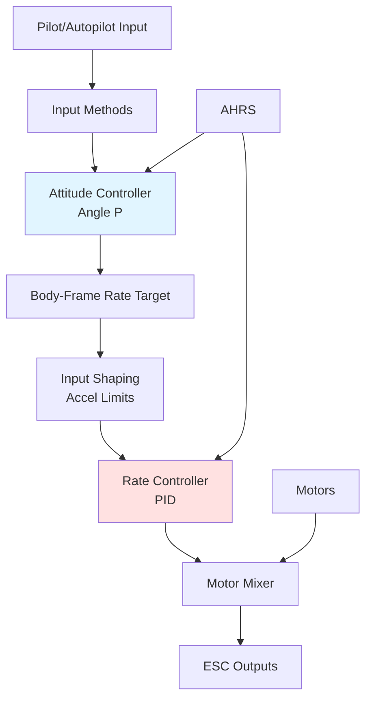
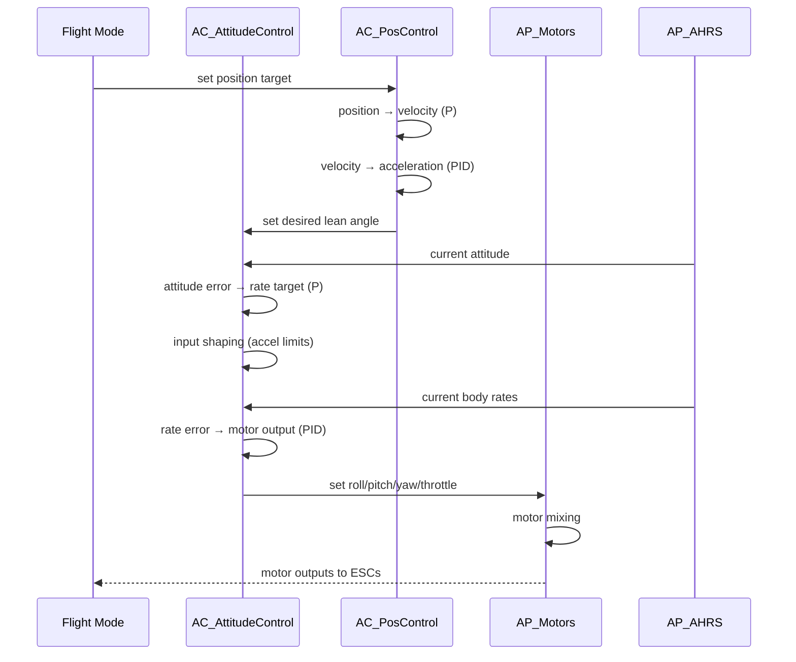

# AC_AttitudeControl

## Overview

The AC_AttitudeControl library provides attitude and rate control for ArduPilot multicopters, helicopters, submarines, and VTOL aircraft. It implements a dual-loop control architecture with an outer attitude loop (angle P controller) and inner rate loop (vehicle-specific PID controllers), along with advanced features like input shaping, acceleration limiting, throttle mixing, and the square root controller for improved transient response.

## Architecture



## Key Components

### AC_AttitudeControl (Base Class)
- **Purpose**: Abstract base class defining attitude control interface
- **Lifecycle**: Constructed by vehicle, singleton access via get_singleton()
- **Thread Safety**: _ang_vel_body_rads updated atomically to avoid race conditions
- **Coordinate Frames**: Quaternions in NED earth frame, rates in body frame

**Key Responsibilities:**
- Outer-loop attitude P controller (quaternion → body rates)
- Input shaping with acceleration limits
- Multiple input method overloads (Euler, quaternion, rate, thrust vector)
- Square root controller implementation
- Coordinate frame transformations
- EKF reset handling

### AC_AttitudeControl_Multi (Multicopter Specialization)
- **Purpose**: Multicopter-specific rate controller with PID loops
- **Key Features**: Roll/pitch/yaw rate PIDs, throttle mixing, angle boost
- **Default Gains**: P=0.135, I=0.135, D=0.0036 for roll/pitch (see AC_ATC_MULTI_RATE_* macros)

**Key Responsibilities:**
- Inner-loop rate PID controllers (body rates → motor outputs)
- Throttle vs attitude control prioritization
- Angle-based throttle boost (compensates for tilt)
- Motor saturation handling
- AutoTune parameter adjustment

### AC_AttitudeControl_Heli (Helicopter Specialization)
- **Purpose**: Traditional helicopter control with leaky integrators
- **Key Features**: Flybar passthrough, pirouette compensation, inverted flight, roll trim

### AC_AttitudeControl_Sub (Underwater Vehicle)
- **Purpose**: Attitude control for underwater vehicles
- **Key Features**: Tuned for water dynamics, different throttle mixing strategy

### AC_AttitudeControl_TS (Tailsitter)
- **Purpose**: Tailsitter VTOL aircraft
- **Key Features**: Roll/yaw mixing near vertical, optional pitch relax exclusion

### AC_AttitudeControl_Multi_6DoF (6DoF Extension)
- **Purpose**: Thrust-vectoring multicopters with scripting
- **Key Features**: Direct thrust vector commands, motor tilt control
- **Availability**: Only when AP_SCRIPTING_ENABLED

### AC_PosControl (Position Controller)
- **Purpose**: 3D position control with jerk-limited trajectory shaping
- **Architecture**: Cascaded loops (position → velocity → acceleration → attitude/throttle)
- **Key Features**: S-curve trajectories, terrain following, EKF reset handling

### AC_CommandModel (Input Shaping)
- **Purpose**: Pilot stick input shaping with rate, expo, and time constant
- **Usage**: Converts raw pilot inputs to smooth rate commands

### AC_WeatherVane (Yaw-into-Wind)
- **Purpose**: Automatic yaw correction to minimize wind drift
- **Usage**: Active in loiter/position modes when enabled and above thresholds

## Control Loop Architecture

### Dual-Loop Control Structure

The attitude controller implements a classic dual-loop architecture:

**Outer Loop (Angle P Controller):**
- Input: Desired attitude (quaternion or Euler angles)
- Output: Desired body-frame angular rates (rad/s)
- Control law: `desired_rate = kP_angle * attitude_error`
- Typical kP: 4.5 (ATC_ANG_*_P parameters)

**Inner Loop (Rate PID Controller):**
- Input: Desired body-frame rates (rad/s)  
- Output: Motor commands [0, 1]
- Control law: `output = kP*error + kI*∫error + kD*d(error)/dt + FF*target`
- Typical gains: P=0.135, I=0.135, D=0.0036 (ATC_RAT_*_P/I/D parameters)

**Loop Timing:**
- Copter: 400Hz typical main loop rate
- Slower platforms: 50Hz minimum

### Control Flow Example



## Advanced Features

### Square Root Controller

The square root controller provides non-linear P control for better transient response:

**Concept**: For large attitude errors, reduce effective P gain to prevent overshoot. For small errors, maintain high P gain for responsiveness.

**Implementation** (Source: libraries/AC_AttitudeControl/AC_AttitudeControl.cpp:700-750):
```
if (use_sqrt_controller && |error| > threshold):
    rate_output = sign(error) * sqrt(2 * accel_max * |error|)
else:
    rate_output = kP * error
```

**Benefits:**
- Faster convergence for large errors
- Reduced overshoot and oscillation
- Better disturbance rejection

**Tuning:**
- Enabled by default (`_use_sqrt_controller = true`)
- Disabled during AutoTune to isolate P term
- Acceleration limits (ATC_ACCEL_*_MAX) control corner frequency

### Input Shaping and Acceleration Limiting

All input methods apply acceleration limiting for smooth response:

**Horizontal (Roll/Pitch):**
- Default: 110,000 centideg/s² (AC_ATTITUDE_CONTROL_ACCEL_RP_MAX_DEFAULT_CDSS)
- Range: 40-720 deg/s² (configurable via ATC_ACCEL_R_MAX, ATC_ACCEL_P_MAX)
- Limits rate of change of desired angular rates

**Vertical (Yaw):**
- Default: 27,000 centideg/s² (AC_ATTITUDE_CONTROL_ACCEL_Y_MAX_DEFAULT_CDSS)
- Range: 10-120 deg/s² (configurable via ATC_ACCEL_Y_MAX)
- Prevents aggressive yaw during large angle corrections

**Slew Rate Limiting:**
- Yaw slew default: 6000 centideg/s (ATC_SLEW_YAW)
- Constrains yaw angle error during attitude corrections
- Reduces yaw-induced attitude disturbances

**Time Constant Smoothing:**
- Rate input TC: 0-1 seconds (ATC_INPUT_TC)
- First-order filter on rate commands
- Smooths pilot stick inputs in rate modes

### Throttle Mixing

Throttle mixing controls the priority between pilot throttle commands and attitude control authority:

**Mixing Ratio** (Source: libraries/AC_AttitudeControl/AC_AttitudeControl_Multi.cpp:400-450):
- **Min (Landing)**: 0.1 (default) - Prioritize throttle for gentle touchdowns
- **Man (Manual)**: 0.1 (default) - Prioritize throttle for pilot control
- **Max (Active)**: 0.5 (default) - Balance throttle and attitude for aggressive flight

**Calculation:**
```
if (throttle > hover_throttle):
    # Above hover - full attitude authority
    motor_output = attitude_correction
else:
    # Below hover - blend based on mixing ratio
    motor_output = mix * attitude_correction + (1 - mix) * throttle_command
```

**Usage:**
- `set_throttle_mix_min()`: Landing phase
- `set_throttle_mix_man()`: Manual flight
- `set_throttle_mix_max()`: Aggressive navigation
- `set_throttle_mix_value()`: Custom ratio

**Benefits:**
- Prevents motor saturation during low throttle
- Maintains attitude control during aggressive maneuvers
- Allows gentle landings without attitude oscillations

### Angle Boost (Throttle Compensation)

Angle boost compensates for reduced vertical thrust when the vehicle is tilted:

**Formula:**
```
throttle_out = throttle_in / cos(tilt_angle)
```

**Purpose:**
- Maintain altitude during leans
- Prevent altitude loss in position hold modes
- Automatic - applied by `set_throttle_out()`

**Limits:**
- Max lean angle calculated to avoid excessive throttle
- Constrained by ATC_ANGLE_LIM_TC and throttle headroom

### Feedforward Terms

**Rate Feedforward (ATC_RATE_FF_ENAB):**
- Adds desired rate directly to PID output
- Improves tracking performance for moving targets
- Default: enabled (1)

**Derivative Feedforward (ATC_RAT_*_D_FF):**
- Adds rate of change of target to PID output
- Further improves tracking for accelerating targets  
- Default: 0 (disabled)
- Typical range: 0-0.02

**Benefits:**
- Reduced tracking lag
- Better disturbance rejection
- Improved acro mode feel

## Usage Patterns

### Basic Attitude Control (Stabilize Mode)

```cpp
// Copter stabilize mode - hold desired lean angles from pilot
float target_roll_rad = pilot_roll;   // from pilot stick
float target_pitch_rad = pilot_pitch; // from pilot stick
float target_yaw_rate_rads = pilot_yaw_rate; // from pilot stick

// Set desired attitude with yaw rate
attitude_control->input_euler_angle_roll_pitch_euler_rate_yaw_rad(
    target_roll_rad,
    target_pitch_rad,
    target_yaw_rate_rads
);

// Run attitude controller (angle P)
attitude_control->attitude_controller_run_quat();

// Run rate controller (rate PID) - called at 400Hz
attitude_control->rate_controller_run();
```

### Position Hold Control Integration

```cpp
// Position controller generates lean angle commands
pos_control->update_xy_controller();  // horizontal
pos_control->update_z_controller();   // vertical

// Get commanded lean angles from position controller
float roll_target_cd = pos_control->get_roll_cd();
float pitch_target_cd = pos_control->get_pitch_cd();

// Attitude controller receives from position controller
// (position controller calls attitude_control methods internally)

// Rate controller runs at 400Hz
attitude_control->rate_controller_run();
```

### Acro Mode (Direct Rate Control)

```cpp
// Pilot commands body-frame rates directly
float roll_rate_rads = pilot_roll_stick * max_rate;
float pitch_rate_rads = pilot_pitch_stick * max_rate;
float yaw_rate_rads = pilot_yaw_stick * max_rate;

// Set body-frame rate targets (no attitude feedback)
attitude_control->input_rate_bf_roll_pitch_yaw_rads(
    roll_rate_rads,
    pitch_rate_rads,
    yaw_rate_rads
);

// Run rate controller only (no attitude controller)
attitude_control->rate_controller_run();
```

### AutoTune Mode Setup

```cpp
// Disable square root controller to isolate P term
attitude_control->use_sqrt_controller(false);

// Apply step input for system identification
float step_size = attitude_control->max_rate_step_bf_roll();
attitude_control->input_rate_step_bf_roll_pitch_yaw_rads(
    step_size, 0.0f, 0.0f
);

// Measure response, update gains
AC_PID& rate_pid = attitude_control->get_rate_roll_pid();
rate_pid.set_kP(new_p);
rate_pid.set_kI(new_i);
rate_pid.set_kD(new_d);
rate_pid.save_gains();  // Persist to EEPROM

// Re-enable square root controller
attitude_control->use_sqrt_controller(true);
```

### Mode Transitions

```cpp
// When switching to rate mode, prevent transient
attitude_control->relax_attitude_controllers();  // zero attitude errors
attitude_control->reset_rate_controller_I_terms_smoothly();  // decay integrators

// When switching to angle mode, set targets to current state
attitude_control->reset_target_and_rate(true);  // reset both attitude and rate
```

## Configuration Parameters

### Angle Controller Parameters

| Parameter | Description | Default | Range | Units |
|-----------|-------------|---------|-------|-------|
| ATC_ANG_RLL_P | Roll angle P gain | 4.5 | 3-12 | 1/s |
| ATC_ANG_PIT_P | Pitch angle P gain | 4.5 | 3-12 | 1/s |
| ATC_ANG_YAW_P | Yaw angle P gain | 4.5 | 3-12 | 1/s |
| ATC_ACCEL_R_MAX | Roll accel limit | 110000 | 0-180000 | cdeg/s² |
| ATC_ACCEL_P_MAX | Pitch accel limit | 110000 | 0-180000 | cdeg/s² |
| ATC_ACCEL_Y_MAX | Yaw accel limit | 27000 | 0-72000 | cdeg/s² |
| ATC_SLEW_YAW | Yaw slew rate limit | 6000 | 500-18000 | cdeg/s |
| ATC_INPUT_TC | Rate input time constant | 0.15 | 0-1 | seconds |
| ATC_RATE_FF_ENAB | Rate feedforward enable | 1 | 0-1 | boolean |

### Rate Controller Parameters (Multicopter)

| Parameter | Description | Default | Range | Units |
|-----------|-------------|---------|-------|-------|
| ATC_RAT_RLL_P | Roll rate P gain | 0.135 | 0.08-0.35 | dimensionless |
| ATC_RAT_RLL_I | Roll rate I gain | 0.135 | 0.01-0.6 | 1/s |
| ATC_RAT_RLL_D | Roll rate D gain | 0.0036 | 0.001-0.02 | seconds |
| ATC_RAT_RLL_FLTD | Roll D filter | 20 | 1-100 | Hz |
| ATC_RAT_RLL_FLTT | Roll target filter | 0 | 0-100 | Hz |
| ATC_RAT_RLL_FLTE | Roll error filter | 0 | 0-100 | Hz |
| ATC_RAT_RLL_SMAX | Roll slew max | 0 | 0-200 | output/s |
| ATC_RAT_RLL_D_FF | Roll D feedforward | 0 | 0-0.02 | dimensionless |
| ATC_RAT_PIT_* | Pitch rate params | (same) | (same) | (same) |
| ATC_RAT_YAW_P | Yaw rate P gain | 0.18 | 0.1-0.6 | dimensionless |
| ATC_RAT_YAW_I | Yaw rate I gain | 0.018 | 0.01-0.06 | 1/s |
| ATC_RAT_YAW_FLTE | Yaw error filter | 2.5 | 1-10 | Hz |

### Throttle Mix Parameters

| Parameter | Description | Default | Range | Units |
|-----------|-------------|---------|-------|-------|
| ATC_THR_MIX_MIN | Throttle mix minimum (landing) | 0.1 | 0.1-0.5 | ratio |
| ATC_THR_MIX_MAN | Throttle mix manual | 0.1 | 0.1-4.0 | ratio |
| ATC_THR_MIX_MAX | Throttle mix maximum (active) | 0.5 | 0.5-5.0 | ratio |

## Integration with AutoTune

AutoTune automatically determines optimal PID gains through system identification:

**Process:**
1. AutoTune disables square root controller
2. Applies step inputs to each axis
3. Measures frequency response and phase margins
4. Calculates optimal P, I, D gains
5. Saves gains to EEPROM
6. Re-enables square root controller

**Usage:**
```bash
# Enable AutoTune mode
mode AUTOTUNE

# Arm and climb to safe altitude (>10m)
# AutoTune will automatically twitch each axis
# Keep centered on sticks for best results

# When complete, land and disarm
# Gains are automatically saved
```

**Tuning Strategy:**
- Start with default gains
- Fly conservatively, evaluate feel
- Run AutoTune if:
  * Oscillations present
  * Sluggish response
  * Poor disturbance rejection
- Verify gains with flight test after AutoTune

**Manual Tuning (if needed):**
1. **P gain**: Increase until small oscillations appear, then reduce 20%
2. **D gain**: Increase to dampen oscillations, max ~5x P gain
3. **I gain**: Increase for steady-state tracking, typically P/10 to P
4. **Filter frequencies**: Reduce FLTD if noise present, increase for responsiveness

## Safety Considerations

**Critical Parameters:**
- **Rate Limits**: ATC_RAT_*_MAX should not exceed vehicle physical capability (~400-500 deg/s typical)
- **Angle Limits**: ATC_ANGLE_LIM controls max lean angle (45° typical, 80° maximum)
- **Gain Limits**: Excessive P causes oscillations, excessive I causes overshoot, excessive D amplifies noise
- **Throttle Mix**: Values too low (<0.05) can cause motor saturation and loss of control

**Flight-Critical Code Paths:**
- `rate_controller_run()`: Called at 400Hz, feeds motor outputs
- `attitude_controller_run_quat()`: Computes rate targets from attitude errors
- Motor mixer: Converts attitude commands to individual motor outputs

**Failure Modes:**
- **Rate PID saturation**: Integrator windup, loss of authority → reduce gains or increase IMAX
- **Motor saturation**: Excessive attitude commands, throttle too low → increase throttle mix or reduce aggression
- **EKF failure**: Attitude jumps, rate commands invalid → handled by inertial_frame_reset()
- **Sensor failure**: Gyro/accel dropout → failsafe triggers, switch to backup IMU

**Testing Requirements:**
- Pre-flight parameter sanity check: `parameter_sanity_check()`
- Gains within valid ranges
- Filter frequencies reasonable (1-100 Hz)
- No NaN or infinite values
- Ground test: small stick inputs produce smooth, damped response

## Testing

### SITL Testing

```bash
# Start ArduCopter SITL
sim_vehicle.py -v ArduCopter --console --map

# Enable attitude controller logging
param set LOG_BITMASK 524287  # Log everything

# Test stabilize mode
mode STABILIZE
arm throttle
rc 3 1500  # Hover throttle

# Commanded step input (monitor response)
rc 1 1700  # Roll right
rc 1 1500  # Center

# Test acro mode
mode ACRO
rc 1 1700  # Roll rate command

# Land and analyze logs
```

### Log Analysis for Tuning

**Key Log Messages:**
- **ATT**: Actual attitude (roll, pitch, yaw)
- **RATE**: Rate controller (desired vs actual rates, PID components)
- **PIDR/PIDP/PIDY**: Rate PID telemetry (P, I, D, FF, target, actual, error)
- **ANG**: Angle targets and error

**Analysis Procedure:**
1. Graph `RATE.RDes` vs `RATE.R` (desired vs actual roll rate)
2. Check tracking error and phase lag
3. Graph `PIDR.P`, `PIDR.I`, `PIDR.D` components
4. Look for:
   - **Oscillations**: Reduce P or D, increase FLTD filter
   - **Lag**: Increase P, check IMAX sufficient
   - **Overshoot**: Reduce I or increase D
   - **Noise**: Increase FLTD or FLTE filters
   - **Saturation**: Check PIDR.Limit flag, reduce aggression or increase IMAX

**Example Analysis:**
```python
# Using MAVExplorer
mavexplorer.py flight.bin

# Graph rate tracking
graph RATE.RDes RATE.R
graph PIDR.P PIDR.I PIDR.D PIDR.FF

# Check for saturation
graph PIDR.Limit

# Measure phase lag
graph RATE.RDes RATE.R --phase
```

### Hardware Testing Procedure

**Phase 1: Ground Test**
1. Power up, pre-arm checks pass
2. Arm in stabilize mode
3. Apply small stick inputs (< ±15°)
4. Verify smooth, damped response
5. Check for oscillations or resonances
6. Disarm

**Phase 2: Hover Test**
1. Arm and take off to 2m hover
2. Release sticks, observe stability
3. Small attitude perturbations (±10°)
4. Check return to level
5. Land immediately if oscillations

**Phase 3: Responsiveness Test**
1. Hover at 5m altitude
2. Larger attitude commands (±30°)
3. Rapid stick movements
4. Check for overshoot, oscillations
5. Evaluate tracking performance

**Phase 4: AutoTune (if needed)**
1. Fly in AutoTune mode at 10m+
2. Keep sticks centered
3. Wait for twitching to complete
4. Evaluate post-tune flight characteristics

### Performance Metrics

**Good Tuning Indicators:**
- Tracking error <5° steady-state, <10° transient
- Settling time <1 second for 45° step
- No overshoot or single <10% overshoot
- Phase margin >45° (from frequency response)
- Motor outputs smooth (no high-frequency content)

**Poor Tuning Indicators:**
- Persistent oscillations (reduce P or D)
- Sluggish response >2s settling (increase P)
- Overshoot >20% (reduce I or increase D)
- Motor outputs saturating (reduce aggression)
- High-frequency noise on motors (increase filters)

## Implementation Notes

### Coordinate Frame Conventions

**NED Earth Frame:**
- North: +X axis
- East: +Y axis
- Down: +Z axis (positive = down!)
- Yaw: 0° = North, positive = clockwise from above

**Body Frame:**
- Forward: +X axis
- Right: +Y axis  
- Down: +Z axis (positive = down!)
- Roll: +X rotation = right wing down
- Pitch: +Y rotation = nose up
- Yaw: +Z rotation = clockwise from above

**Quaternion Representation:**
- Attitude stored as quaternion (avoids gimbal lock)
- Rotation from NED to body frame
- Normalized: `q.w² + q.x² + q.y² + q.z² = 1`

**Euler Angle Conventions:**
- 3-2-1 intrinsic rotations (yaw-pitch-roll)
- Gimbal lock at pitch = ±90°
- Euler rates ≠ body rates (see `euler_rate_to_ang_vel()`)

### Thread Safety

**Concurrency Consideration** (Source: AC_AttitudeControl.h:197-204):

The rate controller may run on a different thread than the attitude controller. To avoid race conditions, `_ang_vel_body_rads` is updated atomically at the end of each input function:

```cpp
// DO NOT access _ang_vel_body_rads during calculations
Vector3f temp_rates;
temp_rates.x = calculate_roll_rate();
temp_rates.y = calculate_pitch_rate();
temp_rates.z = calculate_yaw_rate();

// Atomic update at end
_ang_vel_body_rads = temp_rates;
```

**Vehicle code** using attitude controller should use `WITH_SEMAPHORE` if calling from multiple threads.

### Square Root Controller Details

**Mathematical Basis:**

For a second-order system with acceleration limit `a_max`:

Optimal time-to-target with bang-bang control:
```
t_opt = 2 * sqrt(error / a_max)
```

Corresponding velocity:
```
v_opt = sqrt(2 * a_max * error)
```

**Implementation:**
```cpp
// Simplified pseudocode
float error = target_angle - current_angle;
float error_mag = fabsf(error);

if (use_sqrt_controller && error_mag > accel_max * dt²):
    // Large error: use sqrt controller
    float rate_target = copysignf(sqrtf(2.0f * accel_max * error_mag), error);
else:
    // Small error: use linear P controller  
    float rate_target = kP * error;
```

**Benefits:**
- Faster convergence for large errors (time-optimal)
- Smooth transition to linear region
- No overshoot if accel_max tuned correctly
- Better disturbance rejection

**Tuning:**
- Acceleration limits (ATC_ACCEL_*_MAX) control aggressiveness
- Higher accel = faster response but more overshoot risk
- Typical: 110,000 centideg/s² (305 deg/s²) roll/pitch

## Related Modules

- **AC_PID** (libraries/AC_PID/): Advanced PID controllers with filtering and slew limiting
- **AC_PosControl** (libraries/AC_AttitudeControl/AC_PosControl.h): Position controller commanding attitudes
- **AP_AHRS** (libraries/AP_AHRS/): Attitude and rate estimation
- **AP_Motors** (libraries/AP_Motors/): Motor mixing and output
- **AC_AutoTune** (libraries/AC_AutoTune/): Automated PID gain tuning
- **ArduCopter** (ArduCopter/): Vehicle code using attitude controller
- **AP_NavEKF3** (libraries/AP_NavEKF3/): Extended Kalman Filter for state estimation

## Further Reading

- **ArduPilot Wiki**: https://ardupilot.org/copter/docs/common-tuning.html
- **PID Tuning Guide**: https://ardupilot.org/copter/docs/tuning-process-instructions.html
- **AutoTune**: https://ardupilot.org/copter/docs/autotune.html
- **Log Analysis**: https://ardupilot.org/copter/docs/common-logs.html
- **Developer Docs**: https://ardupilot.org/dev/docs/apmcopter-programming-attitude-control-2.html

## Source Files

**Core Attitude Control:**
- AC_AttitudeControl.h/cpp: Abstract base class with angle P controller
- AC_AttitudeControl_Multi.h/cpp: Multicopter rate PID implementation
- AC_AttitudeControl_Heli.h/cpp: Helicopter specialization
- AC_AttitudeControl_Sub.h/cpp: Underwater vehicle specialization
- AC_AttitudeControl_TS.h/cpp: Tailsitter specialization
- AC_AttitudeControl_Multi_6DoF.h/cpp: 6DoF thrust-vectoring extension

**Position Control:**
- AC_PosControl.h/cpp: 3D position controller with trajectory shaping
- AC_PosControl_Logging.cpp: Position controller telemetry

**Helpers:**
- AC_CommandModel.h/cpp: Pilot input shaping
- AC_WeatherVane.h/cpp: Automatic yaw-into-wind

**Logging:**
- AC_AttitudeControl_Logging.cpp: Attitude controller telemetry
- LogStructure.h: Log message definitions

