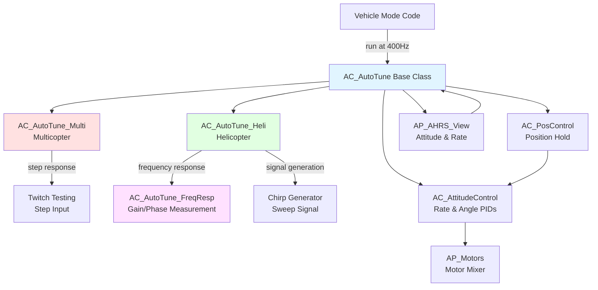
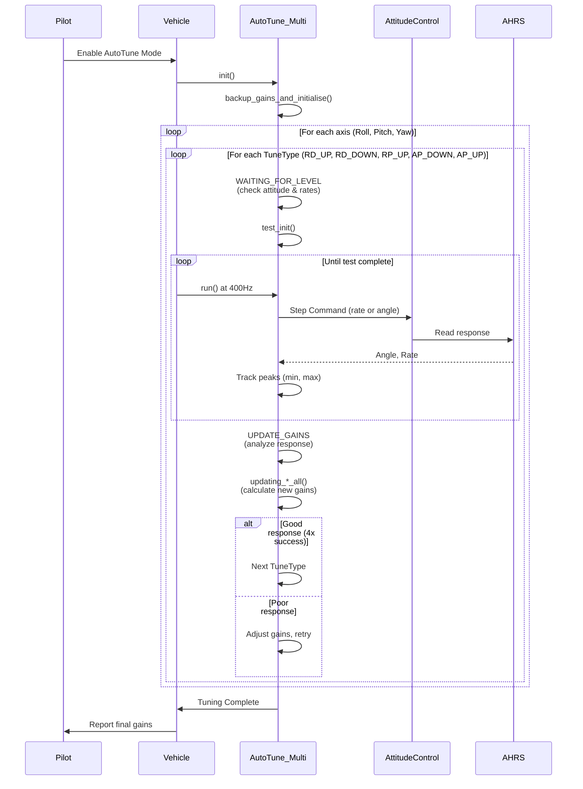
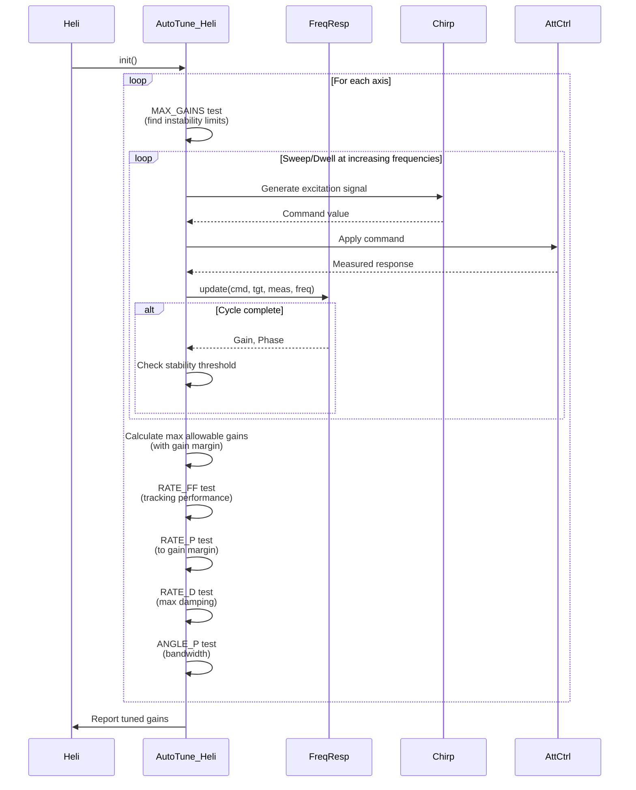
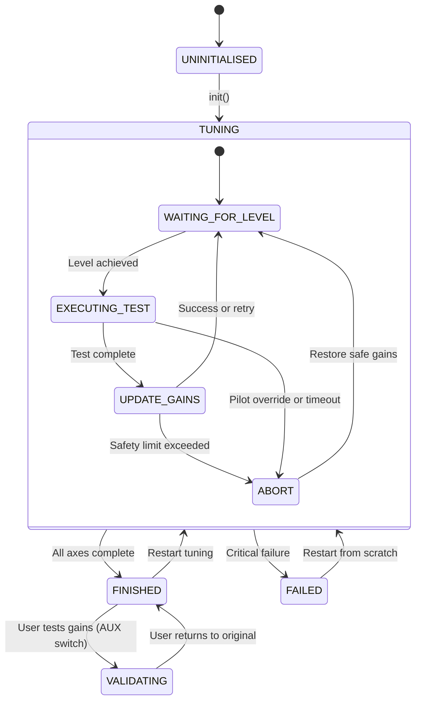

# AC_AutoTune - Automated PID Tuning System

## Overview

AC_AutoTune is ArduPilot's in-flight automated PID gain tuning system that performs system identification and calculates optimal PID gains for multicopter and helicopter attitude and rate control. The system executes controlled test maneuvers, measures vehicle response characteristics, and iteratively adjusts gains to achieve fast, stable, and responsive flight control.

**Key Features:**
- Automated in-flight PID tuning - no manual tuning required
- Multi-axis sequential tuning (roll, pitch, yaw)
- Two distinct methodologies: twitch-based step response (multirotors) and frequency response analysis (helicopters)
- Comprehensive safety mechanisms: pilot override, position hold, abort limits, parameter backup/restore
- Real-time progress reporting via MAVLink to ground station
- Parameter persistence - tuned gains saved to EEPROM on successful completion

**Primary Use Cases:**
- Initial PID tuning for new vehicle builds
- Re-tuning after hardware changes (motors, propellers, weight distribution)
- Optimizing control performance for specific flight characteristics
- Research and development of control algorithms

## Architecture



## Key Components

### AC_AutoTune (Base Class)
**Purpose:** Abstract base class defining the autotune framework, state machine, and gain management.

**Responsibilities:**
- High-level state machine (TuneMode): UNINITIALISED → TUNING → FINISHED/FAILED/VALIDATING
- Tuning sub-state machine (Step): WAITING_FOR_LEVEL → EXECUTING_TEST → UPDATE_GAINS → ABORT
- Gain type management: ORIGINAL, TEST, INTRA_TEST, TUNED
- Multi-axis sequential tuning coordination
- Safety framework: pilot override detection, level timeout, test abort
- Position hold integration for hands-off tuning
- Parameter backup and restore on start/completion/failure
- MAVLink progress reporting to ground station

**Source:** `AC_AutoTune.h`, `AC_AutoTune.cpp`

### AC_AutoTune_Multi (Multicopter)
**Purpose:** Multicopter-specific implementation using twitch-based step response testing.

**Responsibilities:**
- Step input ("twitch") test execution: apply step rate/angle command, measure transient response
- Heuristic gain adjustment: analyze peak, overshoot, settling characteristics
- Fixed tuning sequence: RATE_D_UP → RATE_D_DOWN → RATE_P_UP → ANGLE_P_DOWN → ANGLE_P_UP
- Aggressiveness parameter: controls target overshoot tolerance (0-10%)
- Response measurement: track rate/angle extremes, calculate acceleration
- Gain convergence logic: require 4 consecutive successful tests before accepting gains

**Tuning Algorithm:** Based on Leonard Hall's original ArduCopter autotune - time-tested on thousands of vehicles.

**Source:** `AC_AutoTune_Multi.h`, `AC_AutoTune_Multi.cpp`

### AC_AutoTune_Heli (Helicopter)
**Purpose:** Helicopter-specific implementation using frequency response analysis.

**Responsibilities:**
- Frequency response testing: chirp/sweep or dwell excitation for system identification
- Multi-stage tuning: MAX_GAINS → RATE_FF → RATE_P → RATE_D → ANGLE_P
- Two measurement paths: MOTOR (open-loop) and TARGET (closed-loop) for complete characterization
- Gain calculation from frequency response: gain margin, phase margin, bandwidth criteria
- Configurable test parameters: frequency range, sweep duration, dwell cycles
- Safety: gain margin testing to find instability boundaries before aggressive tuning

**Source:** `AC_AutoTune_Heli.h`, `AC_AutoTune_Heli.cpp`

### AC_AutoTune_FreqResp (Frequency Response Engine)
**Purpose:** Real-time frequency response measurement for system identification.

**Responsibilities:**
- Peak detection: track max/min of target command and measured response signals
- Half-cycle detection: identify peaks via zero-crossing, store in ring buffers
- Gain calculation: ratio of measured to target amplitudes
- Phase calculation: time shift between peaks converted to phase angle at test frequency
- Averaging: multi-cycle averaging (DWELL) or single-cycle measurement (SWEEP)
- Max acceleration estimation: for gain limit calculations

**Algorithm:** Time-domain peak detection (more efficient than FFT for embedded systems).

**Source:** `AC_AutoTune_FreqResp.h`, `AC_AutoTune_FreqResp.cpp`

## Component Interactions

### Multicopter Tuning Workflow



### Helicopter Frequency Response Workflow



## AutoTune System Architecture

### State Machine Hierarchy



### Tuning Sequence

**Multicopter Fixed Sequence:**
1. **RATE_D_UP**: Increase D until controlled overshoot appears (target: ~5% bounce-back)
2. **RATE_D_DOWN**: Reduce D if overshoot excessive
3. **RATE_P_UP**: Increase P for fast response, reduce D if needed to control bounce
4. **ANGLE_P_DOWN**: Reduce angle P to eliminate angle overshoot
5. **ANGLE_P_UP**: Increase angle P until target angle reached quickly

**Helicopter Configurable Sequence (typical):**
1. **MAX_GAINS**: Find maximum stable P and D gains via gain margin testing
2. **RATE_FF**: Adjust feedforward for tracking (gain = 1.0 at DC)
3. **RATE_P**: Set P to achieve specified gain margin below max (typical: 6dB margin)
4. **RATE_D**: Set D to minimize response gain (maximum damping)
5. **ANGLE_P**: Set angle P for desired bandwidth (typical: 2-5 Hz)

### Gain Type Management

**ORIGINAL Gains:**
- Backed up when autotune starts via `backup_gains_and_initialise()`
- Restored on: stop(), ABORT step, user AUX switch to LOW
- Permanent fallback - always available for safety

**TEST Gains:**
- Candidate gains under active evaluation during EXECUTING_TEST
- Applied immediately before test starts
- May be unstable - only active during controlled test

**INTRA_TEST Gains:**
- Conservative intermediate gains used during return-to-level between tests
- Slower I-term buildup for stable hover while waiting
- More conservative than TEST gains for safety

**TUNED Gains:**
- Final successful gains from completed tuning
- Applied on: completion, user AUX switch to HIGH
- Persisted to EEPROM on disarm if `testing_switch_used` flag set

## Multicopter Twitch Testing Methodology

### Step Response (Twitch) Concept

Multicopter autotune uses time-domain step response analysis:

1. **Apply step input**: Command sudden change in rate (typical: 180 deg/s roll/pitch, 90 deg/s yaw) or angle (typical: 20 deg roll/pitch, 45 deg yaw)
2. **Measure transient response**: Track peak rate/angle, overshoot (bounce-back), settling time
3. **Evaluate response quality**: Compare measured to target, check for oscillation
4. **Adjust gains heuristically**: Increase/decrease P/D based on response characteristics
5. **Iterate**: Repeat test with new gains until convergence (4 consecutive successes)

### Response Characteristics

**Underdamped (Insufficient D):**
- No bounce-back (overshoot in reverse direction)
- Sluggish response
- **Action**: Increase D

**Critically Damped (Optimal):**
- Small controlled bounce-back (~5% for aggressiveness=0.05)
- Fast response to target
- No oscillation
- **Action**: Accept gains

**Overdamped (Excessive D):**
- Large bounce-back (>10%)
- Noise sensitivity
- **Action**: Reduce D

**Insufficient P:**
- Slow response (doesn't reach target)
- **Action**: Increase P

**Excessive P:**
- Oscillation, overshoot
- **Action**: Reduce P or increase D

### Twitch Test Execution

Source: `AC_AutoTune_Multi.cpp:test_run()`

```cpp
// Rate twitch example (simplified)
void AC_AutoTune_Multi::test_run(AxisType axis, float dir_sign) {
    // Generate step command
    float target_rate = 180.0f * dir_sign;  // deg/s for roll/pitch
    attitude_control->input_rate_bf_roll_pitch_yaw(target_rate, 0, 0);
    
    // Read response
    float measured_rate = ahrs_view->get_gyro().x;  // rad/s
    float measured_angle = ahrs_view->roll;
    
    // Track extremes
    twitching_test_rate(angle, rate, target_rate,
                       test_rate_min, test_rate_max, test_angle_min);
    
    // Check completion (response settled or timeout)
    if (/* settled or timeout */) {
        // Proceed to UPDATE_GAINS step
        step = Step::UPDATE_GAINS;
    }
    
    // Safety abort check
    twitching_abort_rate(angle, rate, angle_abort, test_rate_min, test_angle_min);
}
```

### Gain Update Algorithms

#### Rate D Tuning (RATE_D_UP)

Source: `AC_AutoTune_Multi.cpp:updating_rate_d_up()`

**Goal**: Achieve controlled bounce-back equal to aggressiveness parameter (typically 5%).

**Algorithm**:
```
bounce_ratio = abs(meas_rate_min) / meas_rate_max

IF bounce_ratio < aggressiveness:
    # Insufficient damping
    D = D * (1 + D_step_ratio)  # Increase D by 20-40%
    P = P * adjustment_factor    # Adjust P to maintain response speed
ELSE IF bounce_ratio > 1.5 * aggressiveness:
    # Excessive damping
    D = D * (1 - D_step_ratio)  # Decrease D
ELSE:
    # Acceptable - increment success counter
    success_counter++
```

#### Rate P Tuning (RATE_P_UP)

Source: `AC_AutoTune_Multi.cpp:updating_rate_p_up_d_down()`

**Goal**: Fast response reaching target rate with minimal overshoot.

**Algorithm**:
```
IF meas_rate_max < 0.9 * rate_target:
    # Response too slow
    P = P * (1 + P_step_ratio)  # Increase P by 25-50%
    
    IF bounce_ratio > aggressiveness:
        D = D * (1 - D_step_ratio)  # Reduce D to control bounce
        
ELSE IF meas_rate_max >= rate_target:
    # Good response - check bounce
    IF bounce_ratio <= aggressiveness:
        success_counter++
    ELSE:
        D = D * (1 - D_step_ratio)  # Reduce D
```

#### Angle P Tuning (ANGLE_P_UP)

Source: `AC_AutoTune_Multi.cpp:updating_angle_p_up()`

**Goal**: Fast attitude response reaching target angle within timeout (~1s).

**Algorithm**:
```
IF meas_angle_max < 0.9 * angle_target:
    # Response too slow
    angle_P = angle_P * (1 + P_step_ratio)  # Increase by 25%
    
ELSE IF meas_angle_max >= angle_target:
    # Target reached
    success_counter++
```

## Helicopter Frequency Response Methodology

### System Identification Concept

Helicopter autotune uses frequency-domain analysis to characterize the complete control system:

1. **Inject known input**: Chirp (frequency-varying) or dwell (fixed-frequency) sinusoid
2. **Measure frequency response**: Gain and phase at each frequency
3. **Analyze characteristics**: Crossover frequency, gain margin, phase margin, resonances
4. **Calculate gains**: Based on classical control theory (gain margin, bandwidth, damping)
5. **Validate**: Frequency sweep with tuned gains (TUNE_CHECK step)

### Frequency Response Measurement

Source: `AC_AutoTune_FreqResp.cpp`

**Input Types:**
- **SWEEP (Chirp)**: Frequency-varying signal (0.5-20 Hz typically), 23-second fixed duration, single cycle per frequency
- **DWELL**: Fixed-frequency sinusoid, 5-10 cycles per frequency, better SNR but slower

**Response Types:**
- **RATE**: Measure angular rate response directly (rad/s or deg/s)
- **ANGLE**: Measure angle response, differentiate internally to get rate for gain/phase calculation

**Measurement Algorithm** (simplified):
```cpp
// Called at ~400Hz with command, target response, measured response, test frequency
void AC_AutoTune_FreqResp::update(float command, float tgt_resp, float meas_resp, float freq) {
    // Differentiate if ANGLE response type
    if (response == ANGLE) {
        target_rate = differentiate(tgt_resp);
        measured_rate = differentiate(meas_resp);
    }
    
    // Peak detection with noise filtering
    detect_peaks(target_rate, tgt_peak_buffer);
    detect_peaks(measured_rate, meas_peak_buffer);
    
    // When half-cycle complete (zero crossing detected)
    if (peak_pair_available()) {
        // Calculate gain and phase for this cycle
        float tgt_amplitude = (tgt_peak_max - tgt_peak_min) / 2.0f;
        float meas_amplitude = (meas_peak_max - meas_peak_min) / 2.0f;
        
        curr_test_gain = meas_amplitude / tgt_amplitude;
        
        float time_shift = meas_peak_time - tgt_peak_time;  // ms
        curr_test_phase = (time_shift / 1000.0f) * freq * 360.0f;  // degrees
        
        // Normalize phase to [-180, 180]
        curr_test_phase = wrap_180(curr_test_phase);
        
        cycle_complete = true;
    }
}
```

### Gain Calculation from Frequency Response

#### Max Gains Determination

Source: `AC_AutoTune_Heli.cpp:updating_max_gains()`

**Purpose**: Find instability boundaries via gain margin testing.

**Algorithm**:
```
Start with rate P (D=0):
    FOR frequency = freq_min TO freq_max:
        Run dwell test at frequency
        Measure response gain
        
        IF gain > stability_threshold (e.g., 2.0):
            # Approaching instability
            max_rate_P.gain = measured_gain
            max_rate_P.freq = frequency
            max_rate_P.phase = measured_phase
            max_rate_P.max_allowed = stability_threshold / gain_margin
            BREAK

Repeat with rate D (P=0):
    # Similar process to find max D
```

**Gain Margin**: Typically 6dB (factor of 2) for safety.

#### Rate P Tuning

Source: `AC_AutoTune_Heli.cpp:updating_rate_p_up()`

**Goal**: Set P to achieve specified gain margin below maximum.

**Algorithm**:
```
target_gain = max_rate_P.max_allowed / gain_margin

Search for P gain that produces target_gain at crossover frequency:
    FOR test_P in range:
        Run dwell tests across frequency range
        Measure response gain at each frequency
        
        IF gain at crossover_freq ≈ target_gain:
            tune_P = test_P
            BREAK
            
    Interpolate between test points if needed
```

#### Rate D Tuning

Source: `AC_AutoTune_Heli.cpp:updating_rate_d_up()`

**Goal**: Find D that minimizes response gain (maximum damping).

**Algorithm**:
```
Search for D gain that minimizes response gain:
    FOR test_D in range:
        Run dwell tests across frequency range
        Measure response gain at each frequency
        
        Find minimum gain in sweep:
            min_gain_freq = frequency where gain is minimum
            
    Select D that produces deepest notch (minimum gain)
    
# Minimum gain indicates maximum damping at notch frequency
```

#### Angle P Tuning

Source: `AC_AutoTune_Heli.cpp:updating_angle_p_up()`

**Goal**: Achieve specified bandwidth (e.g., 3 Hz).

**Algorithm**:
```
target_bandwidth = 3.0  # Hz (typical)

Search for angle P that produces target bandwidth:
    FOR test_angle_P in range:
        Run dwell tests measuring closed-loop angle response
        Measure gain at each frequency
        
        Find bandwidth frequency where gain = 0.707 (-3dB):
            bandwidth_freq = frequency where gain drops to 0.707
            
        IF bandwidth_freq ≈ target_bandwidth:
            tune_angle_P = test_angle_P
            BREAK
```

### Chirp Signal Generation

Source: `AP_Math/chirp.h`, used by `AC_AutoTune_Heli`

**Chirp Parameters:**
- Start frequency: `min_sweep_freq` parameter (typical: 0.5 Hz)
- Stop frequency: `max_sweep_freq` parameter (typical: 20 Hz)
- Duration: 23 seconds (fixed)
- Amplitude: Configurable, vehicle-dependent

**Generation**:
```cpp
Chirp chirp_input;
chirp_input.init(sweep_time_ms/1000.0f, start_freq, stop_freq, 0, 0);

// Each loop iteration:
float current_freq = chirp_input.get_frequency();
float command = amplitude * chirp_input.update(dt);  // Generates sweeping sine
```

## Safety Mechanisms

### Pilot Override Detection

Source: `AC_AutoTune.cpp:control_attitude()`

**Mechanism:**
- Continuously reads pilot stick inputs via `get_pilot_desired_rp_yrate_rad()`
- If pilot input exceeds deadband threshold:
  - Set `pilot_override = true`
  - Suspend tuning (EXECUTING_TEST paused)
  - Apply pilot commands normally (full manual control)
- When pilot returns sticks to center for `AUTOTUNE_PILOT_OVERRIDE_TIMEOUT_MS` (500ms):
  - Clear `pilot_override`
  - Resume tuning from current state

**Purpose**: Instant manual takeover for safety. Pilot always has priority.

**GCS Notification**: Warning message sent at 5-second intervals during override.

### Position Hold

Source: `AC_AutoTune.cpp:get_poshold_attitude_rad()`

**When Enabled** (`use_poshold = true`):
- Records initial position on mode entry (`start_position`)
- Each loop iteration:
  - Reads current position from EKF
  - Calculates position error (cm in NEU frame)
  - Generates attitude target via `AC_PosControl` to correct position error
  - Overrides test attitude commands with position hold attitude
- Altitude hold: Pilot throttle input controls climb rate via `AC_PosControl`

**Purpose**: Hands-off tuning - vehicle maintains station while tests execute.

**Requirements**:
- Good EKF position estimate (GPS or non-GPS navigation)
- Calm wind conditions (< 5 m/s recommended)
- Adequate altitude (> 5m)

**Disable Position Hold**: For vehicles without position estimate or manual position control preferred.

### Test Abort Conditions

Source: `AC_AutoTune.cpp:control_attitude()`, vehicle-specific abort checks

**Angle Abort Limits:**
- Defined by `angle_lim_max_rp_cd()` and `angle_lim_neg_rpy_cd()`
- Typical: ±90 degrees roll/pitch, ±180 degrees yaw
- If exceeded during test:
  - Abort test immediately
  - Set step = Step::ABORT
  - Restore safe gains (original or previous good)
  - Return to WAITING_FOR_LEVEL
  - GCS warning: "AutoTune: Angle limit exceeded"

**Rate Abort** (multicopter-specific):
- Monitor rate extremes during twitch
- Abort if rate indicates loss of control

**Timeout Abort:**
- Each test has timeout: `get_testing_step_timeout_ms()`
- Multicopter: 1000-2000ms per twitch
- Helicopter: 25+ seconds for sweep, variable for dwell
- If timeout exceeded:
  - Test considered failed
  - May retry with adjusted gains or move to next axis

### Level Check

Source: `AC_AutoTune.cpp:currently_level()`

**WAITING_FOR_LEVEL Step:**

Purpose: Ensure vehicle is stable before starting test. Prevents starting test while oscillating.

**Level Criteria:**
- Roll angle < `AUTOTUNE_LEVEL_ANGLE_CD` (2.5 deg copter, 5 deg plane)
- Pitch angle < `AUTOTUNE_LEVEL_ANGLE_CD`
- Roll rate < `AUTOTUNE_LEVEL_RATE_RP_CD` (5 deg/s copter, 10 deg/s plane)
- Pitch rate < `AUTOTUNE_LEVEL_RATE_RP_CD`
- Yaw rate < `AUTOTUNE_LEVEL_RATE_Y_CD` (7.5 deg/s)
- Must remain level for `AUTOTUNE_REQUIRED_LEVEL_TIME_MS` (250ms) continuously

**Timeout:**
- If not level within `AUTOTUNE_LEVEL_TIMEOUT_MS` (2000ms):
  - GCS warning: "AutoTune: Failed to level"
  - Retry or abort based on vehicle state

### Parameter Backup and Restore

Source: `AC_AutoTune.cpp:backup_gains_and_initialise()`

**On Tuning Start:**
```cpp
void AC_AutoTune::backup_gains_and_initialise() {
    // Backup original gains for each axis
    orig_roll_rp = attitude_control->get_rate_roll_pid().kP();
    orig_roll_ri = attitude_control->get_rate_roll_pid().kI();
    orig_roll_rd = attitude_control->get_rate_roll_pid().kD();
    // ... (all rate P/I/D/FF, angle P, filters, slew rate, accel limits)
    
    // Initialize state machine
    step = Step::WAITING_FOR_LEVEL;
    axes_completed = 0;
    success_counter = 0;
}
```

**On Abort/Failure:**
```cpp
void AC_AutoTune::load_gains(GainType::ORIGINAL) {
    // Restore all backed-up gains
    attitude_control->get_rate_roll_pid().kP(orig_roll_rp);
    // ... (all parameters restored)
}
```

**On Success:**
```cpp
void AC_AutoTune_Multi::save_tuning_gains() {
    // Persist tuned gains to EEPROM
    attitude_control->get_rate_roll_pid().save_gains();
    attitude_control->get_angle_p_roll().save_gains();
    // ... (all tuned parameters saved via AP_Param)
}
```

**Safety Guarantee**: Original gains ALWAYS available - even after power cycle, tuning failure, or crash during tuning.

## Configuration Parameters

### AC_AutoTune_Multi (Multicopter) Parameters

| Parameter | Description | Default | Range | Units |
|-----------|-------------|---------|-------|-------|
| AUTOTUNE_AXES | Axis enable bitmask (1=Roll, 2=Pitch, 4=Yaw) | 7 (all) | 0-7 | bitmask |
| AUTOTUNE_AGGR | Target overshoot ratio for D tuning | 0.05 (5%) | 0.0-0.1 | ratio |
| AUTOTUNE_MIN_D | Minimum allowed D gain | 0.001 | 0.001-0.006 | gain |

### AC_AutoTune_Heli (Helicopter) Parameters

| Parameter | Description | Default | Range | Units |
|-----------|-------------|---------|-------|-------|
| AUTOTUNE_AXES | Axis enable bitmask (1=Roll, 2=Pitch, 4=Yaw, 8=Yaw D) | 7 (R+P+Y) | 0-15 | bitmask |
| AUTOTUNE_SEQ | Tuning sequence bitmask (enables/disables tune steps) | All enabled | 0-255 | bitmask |
| AUTOTUNE_FRQ_MIN | Minimum sweep/dwell frequency | 0.5 | 0.1-5.0 | Hz |
| AUTOTUNE_FRQ_MAX | Maximum sweep/dwell frequency | 20.0 | 5.0-50.0 | Hz |
| AUTOTUNE_GN_MAX | Maximum response gain threshold for stability | 2.0 | 1.5-3.0 | gain |
| AUTOTUNE_VELXY_P | Position hold velocity controller P gain | 1.0 | 0.5-2.0 | 1/s |
| AUTOTUNE_ACC_MAX | Maximum angular acceleration limit | 110000 | 50000-200000 | cdss |
| AUTOTUNE_RATE_MAX | Maximum angular rate limit | 40 | 20-100 | deg/s |

**Note**: Helicopter parameters more extensive due to configurable test methodology.

## Test Phases and Progress Reporting

### Tuning Progression

**Multicopter Example (All Axes Enabled):**

1. **Roll Axis** (5-10 minutes):
   - RATE_D_UP: 5-10 tests (~30 sec each) → D gain converged
   - RATE_D_DOWN: 2-5 tests → D refined
   - RATE_P_UP: 5-10 tests → P gain converged
   - ANGLE_P_DOWN: 2-5 tests → Angle P refined
   - ANGLE_P_UP: 5-10 tests → Angle P converged

2. **Pitch Axis** (5-10 minutes): Same sequence as roll

3. **Yaw Axis** (5-10 minutes): Same sequence, different target rates/angles

**Total Time**: 15-30 minutes depending on vehicle response characteristics and convergence speed.

**Helicopter Example:**

1. **Roll Axis** (7-12 minutes):
   - MAX_GAINS: 2-5 minutes (sweep or multiple dwells)
   - RATE_FF: 1-2 minutes (low-frequency dwell)
   - RATE_P: 2-3 minutes (multiple frequency dwells)
   - RATE_D: 2-3 minutes (sweep for minimum gain)
   - ANGLE_P: 1-2 minutes (closed-loop dwell tests)

2. **Pitch Axis**: Similar duration

3. **Yaw Axis**: Often faster (simpler dynamics)

**Total Time**: 20-40 minutes (longer due to frequency response testing).

### MAVLink Status Messages

Source: `AC_AutoTune.cpp:update_gcs()`, `do_gcs_announcements()`

**High-Level Status** (`update_gcs(message_id)`):
- AUTOTUNE_MESSAGE_STARTED (0): "AutoTune: Started"
- AUTOTUNE_MESSAGE_STOPPED (1): "AutoTune: Stopped"
- AUTOTUNE_MESSAGE_SUCCESS (2): "AutoTune: Success on [axis]"
- AUTOTUNE_MESSAGE_FAILED (3): "AutoTune: Failed"
- AUTOTUNE_MESSAGE_SAVED_GAINS (4): "AutoTune: Saved gains for [axis]"
- AUTOTUNE_MESSAGE_TESTING (5): "AutoTune: Pilot testing"
- AUTOTUNE_MESSAGE_TESTING_END (6): "AutoTune: Pilot testing end"

**Periodic Updates** (`do_gcs_announcements()` at 2-second intervals):
- Current axis (Roll, Pitch, Yaw)
- Current tune step (RATE_D_UP, RATE_P_UP, etc.)
- Success counter (e.g., "3/4" indicates 3 of 4 required successes achieved)
- Estimated progress percentage
- Test-specific data (frequency, gain, phase for helicopter)

**Example Message Sequence (Multicopter Roll):**
```
AutoTune: Started
AutoTune: Roll RATE_D_UP 0/4
AutoTune: Roll RATE_D_UP 1/4
AutoTune: Roll RATE_D_UP 2/4
AutoTune: Roll RATE_D_UP 3/4
AutoTune: Roll RATE_D_UP 4/4
AutoTune: Roll RATE_D_DOWN 0/4
...
AutoTune: Success on Roll
AutoTune: Roll P:0.135 I:0.135 D:0.0036 FF:0 Angle P:4.5 Accel:110000
```

**Warnings:**
- "AutoTune: Pilot override - resume when sticks centered"
- "AutoTune: Failed to level - aborting"
- "AutoTune: Angle limit exceeded - test aborted"
- "AutoTune: Test timeout - retrying"

### Logging

Source: `AC_AutoTune.cpp`, vehicle-specific `Log_*` methods

**When HAL_LOGGING_ENABLED:**

**ATUN Log Message** (Summary):
- Written after each test completes
- Fields: axis, tune_step, measured characteristics, calculated gains
- Purpose: Track gain convergence over tuning session
- Multicopter: target, min, max, new P/D/angle P, accel
- Helicopter: dwell freq, measured gain/phase, new P/D/FF/angle P, accel

**ATDE Log Message** (Time History):
- Written at ~400Hz during EXECUTING_TEST
- Fields: angle, rate (multicopter); command, target rate, measured rate, target angle, measured angle (helicopter)
- Purpose: Detailed step response or frequency response visualization
- Large data volume - analyze in post-flight log review

**ATSW Log Message** (Sweep Data - Helicopter Only):
- Written during frequency sweep tests
- Fields: freq, gain, phase for both MOTOR and TARGET paths
- Purpose: Complete frequency response plot (Bode diagram)
- Enables manual gain calculation validation

**Log Analysis Tools:**
- MAVExplorer: Plot ATUN convergence, ATDE time series, ATSW frequency response
- Mission Planner: Graph tuning progression, compare original vs tuned gains
- Python pymavlink: Custom analysis scripts for detailed characterization

## Usage Patterns

### Multicopter AutoTune Workflow

#### Pre-Flight Checklist

- [ ] Original gains produce stable hover (mandatory - autotune cannot fix un-flyable vehicle)
- [ ] Adequate altitude available (>5m, preferably 10-20m)
- [ ] Clear airspace - no obstacles within 50m radius
- [ ] Calm wind conditions (<5 m/s recommended, <10 m/s maximum)
- [ ] Good EKF position estimate if using position hold (check EKF flags)
- [ ] Sufficient battery capacity (30+ minutes for all three axes)
- [ ] Ground station connected for progress monitoring
- [ ] Pilot proficient in manual recovery if needed

#### Execution Steps

1. **Configure Parameters:**
   ```
   AUTOTUNE_AXES = 7    # Roll + Pitch + Yaw (or subset: 3=R+P, 4=Yaw only)
   AUTOTUNE_AGGR = 0.05 # 5% target overshoot (conservative: 0.03, aggressive: 0.07)
   AUTOTUNE_MIN_D = 0.001  # Minimum D limit (adjust for vehicle size/mass)
   ```

2. **Take Off and Stabilize:**
   - Manual mode: Take off, climb to 10-20m
   - Loiter/AltHold: Ensure stable hover, position hold working
   - Check telemetry: EKF OK, GPS 3D fix (if using position hold)

3. **Enter AutoTune Mode:**
   - Switch to AutoTune flight mode
   - GCS message: "AutoTune: Started"
   - Vehicle enters WAITING_FOR_LEVEL
   - Position hold activates (if enabled) - vehicle maintains station

4. **Monitor Progression:**
   - Watch vehicle execute twitches (small rapid movements)
   - Check GCS messages for progress (e.g., "Roll RATE_D_UP 2/4")
   - Note increasing success counter (0/4 → 4/4 indicates convergence)
   - Be ready to override with stick input if vehicle behavior concerning
   - Typical axis completion: 5-10 minutes

5. **Axis Transition:**
   - GCS: "AutoTune: Success on Roll"
   - GCS: Final gains reported (P, I, D, Angle P)
   - Vehicle immediately starts pitch axis (or next enabled axis)
   - Continue monitoring

6. **Completion:**
   - GCS: "AutoTune: Success on [last axis]"
   - AutoTune mode automatically exits
   - Original gains restored (tuned gains available via AUX switch)
   - Land normally

7. **Test Tuned Gains:**
   - Configure AUX switch function: `RC7_OPTION = 87` (AutoTune toggle)
   - Take off with original gains
   - Toggle AUX switch HIGH → tuned gains applied
   - GCS: "AutoTune: Pilot testing"
   - Flight test: Hover, aggressive maneuvers, evaluate handling
   - Toggle AUX switch LOW → return to original gains for comparison
   - Toggle back to HIGH if tuned gains acceptable

8. **Save Tuned Gains (If Acceptable):**
   - Ensure tuned gains active (AUX switch HIGH)
   - Disarm vehicle
   - Tuned gains automatically saved to EEPROM
   - GCS: "AutoTune: Saved gains for Roll/Pitch/Yaw"
   - Next flight will use tuned gains by default

#### Example Flight Sequence

```
[00:00] Manual takeoff, climb to 15m
[00:30] Switch to AutoTune mode
[00:31] AutoTune: Started
[00:32] AutoTune: Roll RATE_D_UP 0/4
[01:00] AutoTune: Roll RATE_D_UP 1/4
[01:30] AutoTune: Roll RATE_D_UP 2/4
...
[05:00] AutoTune: Success on Roll (P:0.135 D:0.0036 Angle P:4.5)
[05:01] AutoTune: Pitch RATE_D_UP 0/4
...
[10:00] AutoTune: Success on Pitch
[10:01] AutoTune: Yaw RATE_D_UP 0/4
...
[15:00] AutoTune: Success on Yaw
[15:01] AutoTune mode exits, return to Loiter
[15:30] Land and disarm
[16:00] Take off for test flight
[16:30] Toggle AUX switch → test tuned gains
[17:00] Satisfied with tuned gains
[17:30] Land and disarm with tuned gains active
[17:31] AutoTune: Saved gains
```

### Helicopter AutoTune Workflow

#### Pre-Flight Checklist

- [ ] Original gains produce stable hover (mandatory)
- [ ] Adequate altitude (>10m, preferably 20-30m - helicopter tests more aggressive)
- [ ] Clear airspace - no obstacles within 100m radius
- [ ] Very calm conditions (<3 m/s wind - frequency response sensitive to disturbances)
- [ ] Excellent EKF position estimate (frequency testing requires stable platform)
- [ ] Extended battery capacity (40+ minutes for all axes with full sequence)
- [ ] Ground station with real-time telemetry for monitoring frequency response
- [ ] Experienced pilot - helicopter autotune more complex

#### Execution Steps

1. **Configure Parameters:**
   ```
   AUTOTUNE_AXES = 7     # Roll + Pitch + Yaw (or subset)
   AUTOTUNE_SEQ = 0xFF   # All tune steps enabled (or disable specific steps)
   AUTOTUNE_FRQ_MIN = 0.5   # Minimum test frequency (Hz)
   AUTOTUNE_FRQ_MAX = 20.0  # Maximum test frequency (Hz)
   AUTOTUNE_GN_MAX = 2.0    # Stability threshold for max gains test
   AUTOTUNE_ACC_MAX = 110000  # Maximum angular acceleration (cdss)
   AUTOTUNE_RATE_MAX = 40     # Maximum angular rate limit (deg/s)
   ```

2. **Take Off and Stabilize:**
   - Take off to 20-30m altitude
   - Ensure very stable hover with position hold active
   - Check EKF quality (variance < 0.5 recommended)

3. **Enter AutoTune Mode:**
   - Switch to AutoTune
   - GCS: "AutoTune: Started"
   - First test: MAX_GAINS (critical safety test)

4. **Monitor MAX_GAINS Test:**
   - Vehicle performs frequency sweep or dwells at increasing frequencies
   - Watch for increasing oscillation amplitude
   - Test aborts automatically when stability threshold reached
   - GCS: "AutoTune: Max P Gain: [value] at [freq]Hz"
   - GCS: "AutoTune: Max D Gain: [value] at [freq]Hz"
   - Typical duration: 2-5 minutes per axis

5. **Monitor Subsequent Tests:**
   - RATE_FF: Low-frequency dwell (< 5 Hz), 1-2 minutes
   - RATE_P: Multiple dwells across frequency range, 2-3 minutes
   - RATE_D: Frequency sweep or dwells finding minimum response, 2-3 minutes
   - ANGLE_P: Closed-loop bandwidth test, 1-2 minutes
   - GCS shows test frequency, measured gain, measured phase
   - Check for reasonable values (gain 0.5-2.0 typical, phase lag increasing with frequency)

6. **Axis Completion and Transition:**
   - GCS: "AutoTune: Success on Roll (P:[value] D:[value] FF:[value] Angle P:[value])"
   - Pitch axis starts immediately
   - Continue monitoring

7. **Completion:**
   - All axes complete
   - GCS reports final gains for each axis
   - AutoTune mode exits
   - Original gains restored

8. **Test Tuned Gains:**
   - Similar to multicopter: AUX switch to toggle gains
   - Flight test with tuned gains
   - Evaluate frequency response in various flight conditions
   - Compare handling to original gains

9. **Save If Acceptable:**
   - Disarm with tuned gains active
   - Gains automatically saved

#### Frequency Response Interpretation

**Good Frequency Response Characteristics:**
- Gain ≈ 1.0 at low frequencies (< 1 Hz) - good tracking
- Gain rolls off at higher frequencies - filtering effective
- Phase lag < -120° at crossover frequency (where gain = 1) - adequate phase margin
- No sharp resonances (gain spikes) - well-damped
- Minimum response gain at notch frequency (for Rate D test) - maximum damping

**Problem Indicators:**
- Gain >> 1 at low frequencies - excessive P gain or insufficient FF
- Gain spikes (resonances) - insufficient damping, structural modes
- Phase lag < -180° at crossover - instability risk, inadequate margin
- No clear gain roll-off - insufficient filtering, noise problems

**Post-Flight Log Analysis:**
Plot ATSW (sweep) data in MAVExplorer:
```python
# Example MAVExplorer commands
mavgraph.py flight.bin "ATSW.Freq_mtr" "ATSW.Gain_mtr"  # Bode magnitude plot
mavgraph.py flight.bin "ATSW.Freq_mtr" "ATSW.Phase_mtr" # Bode phase plot
```

## Testing AutoTune

### SITL (Software-In-The-Loop) Testing

**Setup:**

```bash
# Start copter SITL with realistic sim
sim_vehicle.py -v ArduCopter -f quad --console --map

# In MAVProxy console:
param set AUTOTUNE_AXES 7      # Enable all axes
param set AUTOTUNE_AGGR 0.05   # 5% target overshoot
mode autotune                  # Enter autotune mode

# Monitor progress
status                         # Check current state
watch                          # Enable parameter watching
```

**SITL Testing Procedure:**

1. **Arm and Takeoff:**
   ```
   arm throttle
   rc 3 1500  # Mid-throttle for takeoff
   rc 3 1600  # Climb
   # Wait for altitude
   rc 3 1500  # Hover
   ```

2. **Enter AutoTune:**
   ```
   mode autotune
   # Watch console for "AutoTune: Started"
   ```

3. **Observe Test Execution:**
   - SITL displays vehicle state in real-time
   - Map shows position hold working (if enabled)
   - Console shows GCS messages as tests progress
   - Typical SITL axis tuning: 3-5 minutes (faster than real vehicle)

4. **Complete Tuning:**
   - Wait for all axes to complete
   - Mode automatically exits to Loiter
   - Check final gains via `param show RATE_*`

5. **Test Tuned Gains:**
   ```
   # Set up AUX switch for gain toggling
   param set RC7_OPTION 87  # AutoTune toggle
   rc 7 2000  # Switch HIGH → load tuned gains
   
   # Fly test patterns
   mode stabilize
   # Perform aggressive roll/pitch/yaw inputs
   # Evaluate handling
   
   rc 7 1000  # Switch LOW → return to original gains
   # Compare handling
   ```

6. **Save Gains:**
   ```
   rc 7 2000  # Ensure tuned gains active
   disarm
   # SITL will report "AutoTune: Saved gains"
   ```

**SITL Limitations:**
- Perfect sensors (no noise) - D gains may tune higher than real vehicle
- Simplified physics - aerodynamic effects not fully modeled
- No wind disturbances - position hold easier than reality
- Instant motor response - real ESCs have latency
- Always validate tuned gains on real vehicle before trusting flight

**SITL Advantages:**
- Safe testing environment - no risk of crash
- Rapid iteration - test parameter changes quickly
- Reproducible conditions - same test conditions every time
- Log analysis - detailed logs without vehicle risk
- Algorithm development - test autotune code changes safely

### Physical Vehicle Testing

**Initial Test (Single Axis):**

Before committing to full three-axis autotune on new vehicle, test single axis first:

```
AUTOTUNE_AXES = 1  # Roll only
```

**Procedure:**
1. Take off to 15m with original flyable gains
2. Enter AutoTune
3. Monitor roll axis tuning closely
4. Evaluate tuned roll gains via AUX switch
5. If acceptable, proceed to full three-axis tuning

**Progressive Testing Strategy:**

1. **Roll Only** (AXES=1): Test basic twitch/frequency response on most responsive axis
2. **Roll + Pitch** (AXES=3): Add pitch once confident with roll results
3. **All Axes** (AXES=7): Complete tuning with yaw once R+P proven

**Common Issues and Solutions:**

**Issue**: Vehicle oscillates during test
- **Cause**: Original gains unstable, or excessive test amplitude
- **Solution**: Abort autotune (pilot override), tune original gains manually, retry
  
**Issue**: Autotune fails to converge (many retries)
- **Cause**: Vehicle characteristics incompatible with heuristics, or noisy sensors
- **Solution**: Adjust AGGR (multicopter) or freq range (helicopter), check sensor health

**Issue**: Tuned gains worse than original
- **Cause**: Disturbances during test (wind), or algorithm not suited for vehicle
- **Solution**: Retry in calmer conditions, consider manual tuning, check logs for anomalies

**Issue**: Position hold drifts during autotune
- **Cause**: Poor EKF position estimate, or excessive wind
- **Solution**: Improve GPS/non-GPS nav, wait for calmer conditions, disable position hold

**Issue**: Test aborts with "Angle limit exceeded"
- **Cause**: Test gains unstable, or P/D too aggressive
- **Solution**: Normal for MAX_GAINS test (helicopter), otherwise indicates problem with convergence

### Log Analysis

**Essential Log Messages:**
- **ATUN**: Track gain convergence over tuning session
- **ATDE**: Visualize step response or frequency response time history
- **PIDR/PIDP/PIDY**: Analyze rate PID performance with tuned gains
- **ATSW**: (Helicopter) Plot complete frequency response (Bode diagrams)

**MAVExplorer Analysis Examples:**

**Plot Gain Convergence (Multicopter):**
```python
mavgraph.py flight.bin "ATUN.RPGain" "ATUN.RDGain" "ATUN.SPGain" --legend RPGain,RDGain,SPGain
# Shows how P, D, Angle P evolve over tests
```

**Plot Step Response Time History:**
```python
mavgraph.py flight.bin "ATDE.Angle" "ATDE.Rate" --legend Angle,Rate
# Shows actual twitch response characteristics
```

**Plot Frequency Response (Helicopter):**
```python
# Bode magnitude plot
mavgraph.py flight.bin "ATSW.Freq_mtr" "ATSW.Gain_mtr" --legend "Motor Path Gain"

# Bode phase plot
mavgraph.py flight.bin "ATSW.Freq_mtr" "ATSW.Phase_mtr" --legend "Motor Path Phase"
```

**Compare PID Performance Before/After:**
```python
# Load two logs: before and after autotune
mavlogdump.py --type PIDR before.bin > before_pidr.txt
mavlogdump.py --type PIDR after.bin > after_pidr.txt
# Plot in Excel/Python: Compare P/I/D terms, tracking error, saturation
```

## Safety Considerations

### Pre-Flight Safety Checks

- **Original Gains Flyable**: AutoTune CANNOT fix un-flyable vehicle. Original gains must produce stable hover.
- **Adequate Altitude**: Minimum 5m, preferably 10-20m (copter) or 20-30m (heli). Allows abort recovery.
- **Clear Airspace**: 50m radius (copter) or 100m radius (heli) clear of obstacles, people, animals.
- **Wind Conditions**: < 5 m/s recommended for copter, < 3 m/s for helicopter. Wind disturbances affect test results.
- **Battery Capacity**: Minimum 30 minutes (copter) or 40 minutes (heli) for complete three-axis tuning.
- **Position Estimate**: If using position hold, verify EKF health, GPS 3D fix, low variance.
- **Pilot Proficiency**: Pilot must be capable of manual recovery if autotune produces bad gains.
- **Ground Station**: Connected and displaying telemetry for real-time monitoring.

### In-Flight Safety

- **Pilot Override**: Stick input INSTANTLY suspends tuning and gives full manual control. Pilot always has priority.
- **Monitor Progress**: Watch GCS messages, vehicle behavior. Abort if behavior concerning.
- **Test Abort**: If safety limits exceeded, test aborts automatically and restores safe gains.
- **Position Hold**: Reduces pilot workload but requires good EKF. Disable if position drifts.
- **Battery Monitor**: Abort tuning if battery voltage drops below safe threshold. Land immediately.
- **Abort Procedure**: Pilot override (stick input) → wait for vehicle to stabilize → exit autotune mode → land normally.

### Critical Warnings

- ⚠️ **Never run AutoTune with damaged propellers, loose screws, or mechanical problems**
- ⚠️ **Never run AutoTune in tight spaces, near obstacles, or over people**
- ⚠️ **Always have manual recovery plan** - be ready to take over and land immediately
- ⚠️ **Test tuned gains carefully** - aggressive flight test only after gentle hover test confirms stability
- ⚠️ **Wind gusts during test corrupt results** - abort and retry in calmer conditions
- ⚠️ **MAX_GAINS test (helicopter) intentionally excites instability** - be ready for aggressive oscillation and automatic abort
- ⚠️ **High aggressiveness parameter** (>0.1 for copter) can cause excessive D and noise sensitivity
- ⚠️ **Low MIN_D parameter** (<0.001 for copter) can cause insufficient damping
- ⚠️ **Do not save gains without flight testing** - tuned gains may be worse than original in some conditions

### Post-Tuning Validation

**Before Saving Gains:**

1. **Hover Test** (5 minutes):
   - Stable hover at various altitudes
   - No oscillation or jitter
   - Responsive to gentle stick inputs
   - No unusual motor sounds

2. **Gentle Maneuver Test** (5 minutes):
   - Slow forward/backward/left/right flight
   - Gentle climbs and descents  
   - Slow yaw rotations
   - Return to hover - check for overshoot

3. **Aggressive Maneuver Test** (5 minutes):
   - Full-stick rolls and flips (if vehicle capable)
   - Fast forward flight and stops
   - Rapid attitude changes
   - Aggressive yaw spins
   - Evaluate: Responsiveness, damping, overshoot

4. **Comparison Test**:
   - Toggle AUX switch: Compare tuned vs original gains
   - Original gains should feel "lazy" compared to tuned
   - Tuned gains should feel "crisp" without oscillation
   - If tuned gains feel "nervous" or "twitchy" → re-tune with lower AGGR

5. **Extended Flight Test** (10+ minutes):
   - Various flight modes (Loiter, AltHold, Position)
   - Different wind conditions
   - Battery voltage range (full to 30%)
   - Evaluate consistency across conditions

**Only save gains after complete validation.**

## Implementation Notes

### Design Decisions

**Why Two Methodologies?**
- **Multirotors**: Twitch-based step response is fast (15-30 min), simple, proven on thousands of vehicles
- **Helicopters**: Frequency response provides more complete system characterization, necessary for complex helicopter dynamics with TECS, mechanical governor, etc.

**Why Heuristic (Multicopter) vs Analytical (Helicopter)?**
- **Heuristic**: Faster convergence, less complex, works well for typical multicopter dynamics
- **Analytical**: More rigorous, handles complex transfer functions, provides frequency-domain insights for troubleshooting

**Why Position Hold Optional?**
- **Pros**: Hands-off tuning, pilot focuses on monitoring
- **Cons**: Requires good EKF, adds disturbances, may not work in all environments (indoor, non-GPS)
- **Trade-off**: Enable if available, but not mandatory

**Why Sequential Axis Tuning?**
- **Coupling**: Roll/pitch/yaw interact via motor mixer, gyroscopic effects
- **Simplification**: Tuning one axis at a time isolates effects, easier convergence
- **Safety**: Test each axis independently, validate before proceeding

### Algorithm Foundations

**Multicopter Twitch Algorithm:**
Based on Leonard Hall's original 2013 autotune for ArduCopter. Heuristic approach inspired by manual tuning process:
- Increase D until small bounce-back appears (damping in optimal range)
- Increase P until fast response achieved (minimize tracking error)
- Adjust angle P for desired attitude control speed

**Helicopter Frequency Response:**
Based on classical control theory frequency-domain design:
- Bode plots: Gain and phase vs frequency
- Gain margin: Distance from 0dB at phase = -180° (typical target: 6dB)
- Phase margin: Distance from -180° at gain = 0dB (typical target: 45°)
- Bandwidth: Frequency where closed-loop gain = -3dB (0.707)

**Mathematical References:**
- Leonard Hall original autotune: ArduCopter documentation archives
- Frequency response analysis: Franklin, Powell, Emami-Naeini, "Feedback Control of Dynamic Systems"
- Gain/phase margin: Ogata, "Modern Control Engineering"

### Known Limitations

**Multicopter Twitch:**
- **Heuristic convergence**: May not converge for unusual vehicle dynamics
- **Wind sensitivity**: Disturbances affect bounce-back measurement
- **Aggressiveness parameter**: Requires tuning for vehicle (typically 0.03-0.07)
- **No frequency-domain insight**: Can't identify resonances or structural modes

**Helicopter Frequency Response:**
- **Test duration**: 20-40 minutes (longer than multicopter)
- **Calm conditions required**: Wind disturbances corrupt frequency response
- **Complexity**: More parameters to configure (freq range, gain thresholds)
- **Computational load**: Frequency response measurement and peak detection at 400Hz

**Common Limitations (Both):**
- **Original gains must be flyable**: Cannot fix completely un-tuned vehicle
- **Altitude required**: Not suitable for indoor or low-altitude operation
- **Battery capacity**: Requires extended flight time
- **Sensor health**: Noisy sensors (vibration, EMI) corrupt measurements
- **Pilot skill**: Requires experienced pilot for safety monitoring

### Threading and Timing

**Execution Model:**
- **Single-threaded**: run() called from vehicle main loop (scheduler)
- **Call rate**: 400Hz preferred, >=100Hz required
- **Not thread-safe**: All access from main loop only
- **Timing critical**: dt calculations assume consistent call rate

**Scheduler Integration:**
```cpp
// Vehicle mode code (e.g., ArduCopter/mode_autotune.cpp)
void ModeAutoTune::run() {
    // Position hold, altitude hold
    pos_control->update_xy_controller();
    pos_control->update_z_controller();
    
    // AutoTune state machine
    autotune.run();  // Calls AC_AutoTune::run() at ~400Hz
    
    // Motor output
    attitude_control->rate_controller_run();
    motors->output();
}
```

**Timing Constraints:**
- **Level check**: 250ms stable level required before test
- **Pilot override**: 500ms with sticks centered to resume
- **Test timeout**: Vehicle-specific (1-2s copter, 25+s heli)
- **GCS announcements**: Rate-limited to 2-second intervals

## Related Modules

- **AC_AttitudeControl** (`libraries/AC_AttitudeControl/`): Rate and angle PID controllers being tuned by AutoTune
- **AC_PosControl** (`libraries/AC_AttitudeControl/AC_PosControl.h`): Position hold during tuning (optional)
- **AC_PID** (`libraries/AC_PID/`): Advanced PID controllers with filtering, slew limiting, used by attitude control
- **AP_AHRS** (`libraries/AP_AHRS/`): Attitude and Heading Reference System - provides attitude and rate feedback
- **AP_Motors** (`libraries/AP_Motors/`): Motor mixer - applies attitude controller outputs to motors
- **Filter** (`libraries/Filter/`): Low-pass filters, notch filters used in PID controllers
- **Chirp** (`libraries/AP_Math/chirp.h`): Chirp signal generator for helicopter frequency sweep tests

## Further Reading

### ArduPilot Documentation
- **AutoTune User Guide**: https://ardupilot.org/copter/docs/autotune.html
- **PID Tuning Fundamentals**: https://ardupilot.org/copter/docs/tuning.html
- **Attitude Control Architecture**: https://ardupilot.org/dev/docs/apmcopter-programming-attitude-control-2.html
- **Log Analysis Guide**: https://ardupilot.org/copter/docs/common-logs.html

### Control Theory References
- Franklin, Powell, Emami-Naeini: "Feedback Control of Dynamic Systems" (gain/phase margin, Bode plots)
- Ogata: "Modern Control Engineering" (PID tuning, frequency response)
- Åström, Hägglund: "PID Controllers: Theory, Design, and Tuning" (practical PID tuning)

### Original Autotune References
- Leonard Hall: Original ArduCopter autotune developer (2013)
- Andrew Tridgell: Converted to library architecture (2018)
- Bill Geyer: Helicopter frequency response implementation

### Community Resources
- **ArduPilot Forum**: https://discuss.ardupilot.org/ - Tuning help, troubleshooting
- **ArduPilot Discord**: https://ardupilot.org/discord - Real-time community support

## Source Files

- `AC_AutoTune.h` / `AC_AutoTune.cpp`: Abstract base class, state machine framework
- `AC_AutoTune_Multi.h` / `AC_AutoTune_Multi.cpp`: Multicopter twitch-based implementation
- `AC_AutoTune_Heli.h` / `AC_AutoTune_Heli.cpp`: Helicopter frequency response implementation  
- `AC_AutoTune_FreqResp.h` / `AC_AutoTune_FreqResp.cpp`: Frequency response measurement engine
- `AC_AutoTune_config.h`: Build-time feature configuration
