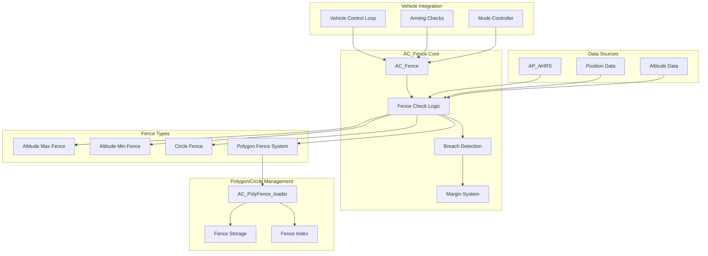
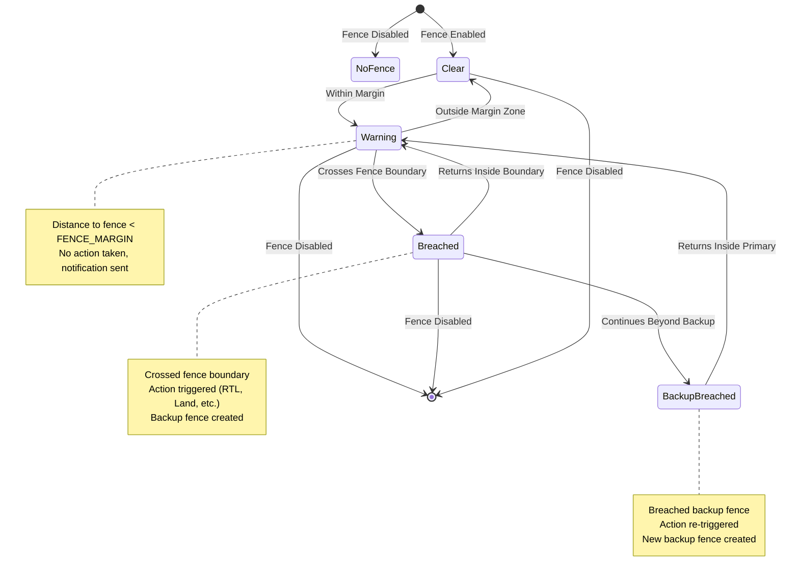
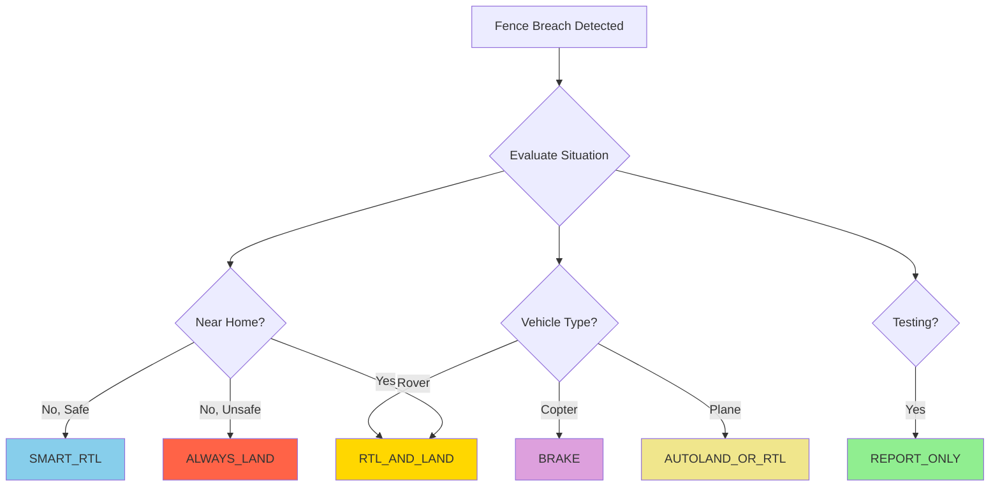
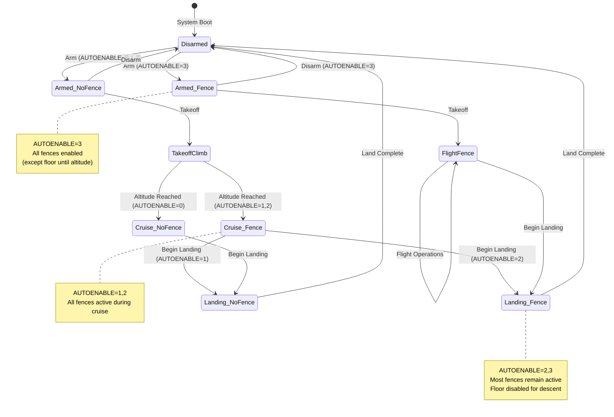
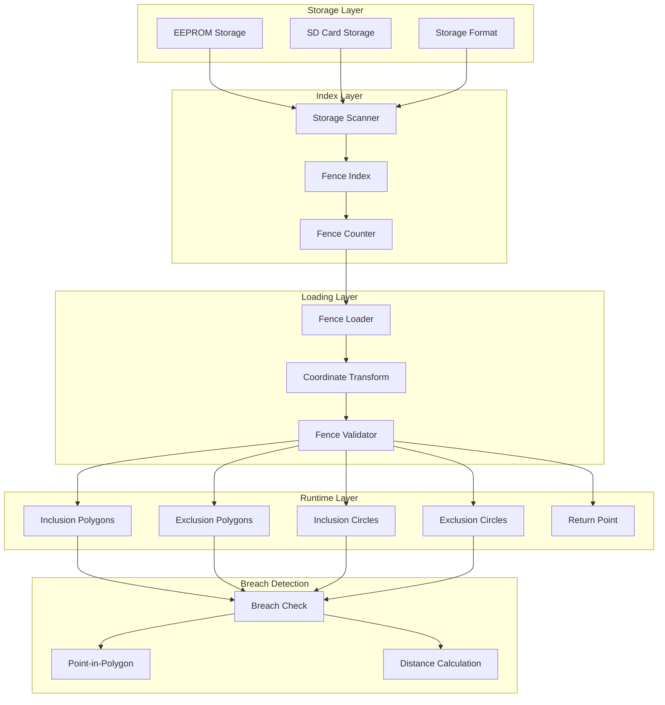

# AC_Fence Library


## Table of Contents
- [Overview](#overview)
- [Architecture](#architecture)
- [Fence Types](#fence-types)
- [Breach Detection System](#breach-detection-system)
- [Recovery Actions](#recovery-actions)
- [Auto-Enable Logic](#auto-enable-logic)
- [Polygon and Circle Fence System](#polygon-and-circle-fence-system)
- [Safety Implications](#safety-implications)
- [Configuration Guide](#configuration-guide)
- [Integration Examples](#integration-examples)
- [Testing](#testing)

## Overview

The AC_Fence library provides a comprehensive geofencing system for ArduPilot vehicles, enabling definition and enforcement of spatial boundaries to enhance flight safety. The library supports multiple fence types that can operate independently or in combination to create complex containment volumes.

**Source Files**: `/libraries/AC_Fence/`
- `AC_Fence.h` - Main fence interface and class definition
- `AC_Fence.cpp` - Core fence logic implementation
- `AC_PolyFence_loader.h` - Polygon and circle fence management
- `AC_Fence_config.h` - Compile-time configuration

**Key Capabilities**:
- Multiple fence types (altitude, circular, polygon)
- Configurable breach actions
- Auto-enable/disable on takeoff/landing
- Margin-based warning system
- Manual recovery support
- Inclusion and exclusion zones
- Pre-arm validation

**Supported Vehicles**: ArduCopter, ArduPlane, Rover, ArduSub

## Architecture

The AC_Fence system implements a layered architecture with clear separation between fence storage, runtime validation, and breach handling.

### System Architecture



### Class Hierarchy

Source: `/libraries/AC_Fence/AC_Fence.h:25-293`

**AC_Fence** - Primary class implementing the fence system
- Singleton pattern via `AC_Fence::get_singleton()` and `AP::fence()`
- Manages all fence types and coordinates breach detection
- Handles auto-enable/disable logic
- Provides pre-arm validation

**AC_PolyFence_loader** - Manages polygon and circle fences
- Loads fences from storage (EEPROM/SD card)
- Maintains runtime fence index
- Transforms lat/lon to NE offsets from origin
- Provides breach checking for polygon/circle geometries

### Key Enumerations

**Action** (Source: `AC_Fence.h:31-41`) - Breach recovery actions:
```cpp
enum class Action {
    REPORT_ONLY          = 0,  // Report breach without action
    RTL_AND_LAND         = 1,  // Return to launch, then land
    ALWAYS_LAND          = 2,  // Immediate landing
    SMART_RTL            = 3,  // SmartRTL → RTL → Land
    BRAKE                = 4,  // Brake → Land (Copter)
    SMART_RTL_OR_LAND    = 5,  // SmartRTL → Land
    GUIDED               = 6,  // Guided mode to return point
    GUIDED_THROTTLE_PASS = 7,  // Guided with manual throttle
    AUTOLAND_OR_RTL      = 8,  // Autoland → RTL (Plane)
};
```

**AutoEnable** (Source: `AC_Fence.h:43-49`) - Auto-enable modes:
```cpp
enum class AutoEnable : uint8_t {
    ALWAYS_DISABLED              = 0,  // Manual control only
    ENABLE_ON_AUTO_TAKEOFF       = 1,  // Enable after auto takeoff
    ENABLE_DISABLE_FLOOR_ONLY    = 2,  // Floor auto-disabled on landing
    ONLY_WHEN_ARMED              = 3   // Enable when armed
};
```

**OPTIONS** (Source: `AC_Fence.h:186-190`) - Behavioral options:
```cpp
enum class OPTIONS {
    DISABLE_MODE_CHANGE  = 1U << 0,  // Prevent mode change until cleared
    INCLUSION_UNION      = 1U << 1,  // Union vs intersection of zones
    NOTIFY_MARGIN_BREACH = 1U << 2,  // Alert on margin breaches
};
```

### Integration Points

**AHRS Integration**:
- `AP::ahrs().get_relative_position_D_home(alt)` - Altitude for vertical fences
- `AP::ahrs().get_relative_position_NE_home(pos)` - Horizontal position for circular/polygon fences
- `AP::ahrs().get_location(loc)` - Absolute location for fence checks

**Vehicle Integration**:
- Called from main vehicle loop at 10Hz via `update()`
- Pre-arm checks called during arming sequence
- Mode controller queries breach status
- Failsafe system triggers on breach actions

**Parameter System**:
- All fence parameters stored via `AP_Param`
- Parameters persist across reboots
- MAVLink parameter protocol support

## Fence Types

The AC_Fence library supports four primary fence types, each addressing different spatial constraints. Fences can be enabled independently or in combination via the `FENCE_TYPE` parameter bitmask.

### Fence Type Bitmask

Source: `AC_Fence.h:15-20`

```cpp
#define AC_FENCE_TYPE_ALT_MAX    1  // Maximum altitude fence
#define AC_FENCE_TYPE_CIRCLE     2  // Circular horizontal fence
#define AC_FENCE_TYPE_POLYGON    4  // Polygon horizontal fences
#define AC_FENCE_TYPE_ALT_MIN    8  // Minimum altitude fence (floor)
```

### 1. Maximum Altitude Fence (ALT_MAX)

**Purpose**: Prevents vehicle from exceeding a specified altitude above home

**Implementation**: `AC_Fence.cpp:537-583` (`check_fence_alt_max()`)

**Key Features**:
- Altitude measured relative to home position in meters
- Configurable via `FENCE_ALT_MAX` parameter (default: 100m)
- Uses backup fence mechanism to prevent repeated breach notifications
- Margin system warns before actual breach

**Breach Conditions**:
```cpp
// Breach occurs when:
current_altitude >= FENCE_ALT_MAX

// Margin breach (warning) occurs when:
current_altitude >= (FENCE_ALT_MAX - FENCE_MARGIN)
```

**Backup Fence Logic** (Source: `AC_Fence.cpp:562`):
When breached, a backup fence is created 20m higher. If the vehicle continues climbing and breaches the backup fence, a fresh breach is triggered to re-invoke the action.

```cpp
_alt_max_backup = _curr_alt + AC_FENCE_ALT_MAX_BACKUP_DISTANCE;  // 20m
```

**Vehicle-Specific Defaults**:
- ArduCopter: Enabled by default, 100m ceiling
- ArduPlane: Enabled by default, 100m ceiling
- Rover: Disabled by default

### 2. Minimum Altitude Fence (ALT_MIN)

**Purpose**: Prevents vehicle from descending below a specified altitude (fence floor)

**Implementation**: `AC_Fence.cpp:588-636` (`check_fence_alt_min()`)

**Key Features**:
- Altitude measured relative to home position in meters
- Configurable via `FENCE_ALT_MIN` parameter (default: -10m)
- Auto-enables when vehicle climbs above min altitude + margin
- Critical for preventing ground/water impacts

**Breach Conditions**:
```cpp
// Breach occurs when:
current_altitude <= FENCE_ALT_MIN

// Margin breach (warning) occurs when:
current_altitude <= (FENCE_ALT_MIN + FENCE_MARGIN)
```

**Auto-Enable Logic** (Source: `AC_Fence.cpp:640-664`):
The minimum altitude fence auto-enables once the vehicle climbs above the floor:

```cpp
if (_curr_alt >= _alt_min + _margin) {
    enable(true, AC_FENCE_TYPE_ALT_MIN, false);
    // "Min Alt fence enabled (auto enable)"
}
```

**Special Behavior**:
- Not enabled during initial arming (to allow takeoff)
- Auto-disables on landing (configurable via `FENCE_AUTOENABLE`)
- Can be manually enabled/disabled via MAVLink

### 3. Circle Fence

**Purpose**: Creates a circular horizontal boundary centered on home position

**Implementation**: `AC_Fence.cpp:705-749` (`check_fence_circle()`)

**Key Features**:
- Radius measured from home position in meters
- Configurable via `FENCE_RADIUS` parameter (default: 300m)
- Backup fence mechanism for continued violations
- Suitable for simple containment scenarios

**Breach Conditions**:
```cpp
// Breach occurs when:
distance_from_home >= FENCE_RADIUS

// Margin breach (warning) occurs when:
distance_from_home >= (FENCE_RADIUS - FENCE_MARGIN)
```

**Position Calculation** (Source: `AC_Fence.cpp:713-715`):
```cpp
Vector2f home;
AP::ahrs().get_relative_position_NE_home(home);
_home_distance = home.length();  // meters
```

**Backup Fence Logic** (Source: `AC_Fence.cpp:730`):
- Plane: Backup fence created 100m beyond breach point
- Other vehicles: Backup fence created 20m beyond breach point

### 4. Polygon Fence System

**Purpose**: Enables complex inclusion and exclusion zones using polygon boundaries

**Implementation**: `AC_Fence.cpp:669-699` (`check_fence_polygon()`)

**Key Features**:
- Multiple polygon inclusion zones (safe areas)
- Multiple polygon exclusion zones (forbidden areas)
- Circle inclusion zones (safe circular areas)
- Circle exclusion zones (forbidden circular areas)
- Return point definition for guided mode
- Storage in EEPROM or SD card

**Fence Item Types** (Source: `AC_PolyFence_loader.h:21-34`):
```cpp
enum class AC_PolyFenceType : uint8_t {
    POLYGON_INCLUSION     = 98,  // Safe polygon area
    POLYGON_EXCLUSION     = 97,  // Forbidden polygon area
    CIRCLE_EXCLUSION      = 93,  // Forbidden circle area
    CIRCLE_INCLUSION      = 92,  // Safe circle area
    RETURN_POINT          = 95,  // Return location for guided mode
    END_OF_STORAGE        = 99,  // Storage terminator
};
```

**Breach Logic** (Source: `AC_Fence.cpp:682`):
The polygon loader determines if a location breaches the fence:
```cpp
if (_poly_loader.breached(loc, _polygon_breach_distance)) {
    // Vehicle is outside inclusion zones or inside exclusion zones
    record_breach(AC_FENCE_TYPE_POLYGON);
}
```

**Union vs Intersection Mode** (Source: `AC_Fence.h:188`):
- `INCLUSION_UNION` option controls multiple inclusion zone behavior
- Intersection mode (default): Vehicle must be inside ALL inclusion zones
- Union mode: Vehicle must be inside AT LEAST ONE inclusion zone

## Breach Detection System

The fence system implements a sophisticated breach detection mechanism with margin warnings, backup fences, and breach state management.

### Breach Detection Flow



### Margin System

**Purpose**: Provides early warning before actual fence breach, allowing preemptive corrections

**Configuration**: `FENCE_MARGIN` parameter (default: 2.0m, range: 1-10m)

Source: `AC_Fence.cpp:94-99`

**Margin Breach Detection** (Source: `AC_Fence.cpp:568-572` for altitude example):
```cpp
// After confirming no hard breach:
if (_curr_alt >= _alt_max - _margin) {
    record_margin_breach(AC_FENCE_TYPE_ALT_MAX);
} else {
    clear_margin_breach(AC_FENCE_TYPE_ALT_MAX);
}
```

**Margin Notifications**:
- Controlled by `OPTIONS::NOTIFY_MARGIN_BREACH` flag (bit 2 of `FENCE_OPTIONS`)
- Frequency controlled by `FENCE_NTF_FREQ` parameter (default: 1Hz)
- Provides distance to fence in notification message

**Margin Notification Logic** (Source: `AC_Fence.cpp:937-944`):
```cpp
if (option_enabled(OPTIONS::NOTIFY_MARGIN_BREACH)) {
    if ((!is_zero(_notify_freq) && 
         timeout_expired(_last_margin_breach_notify_sent_ms, now,
                        uint32_t(1000.0f / _notify_freq)))
        || !(_breached_fence_margins & fence_type)) {
        notify_margin_breach = true;
    }
}
```

### Backup Fence Mechanism

**Purpose**: Prevents action fatigue from repeated breach triggers while vehicle remains outside fence

**Operation**: When a fence is breached, a backup fence is created further out. Only if the vehicle breaches this backup fence is a fresh breach recorded.

**Implementation Examples**:

**Altitude Max Backup** (Source: `AC_Fence.cpp:555-565`):
```cpp
if (!(_breached_fences & AC_FENCE_TYPE_ALT_MAX) ||
    (!is_zero(_alt_max_backup) && _curr_alt >= _alt_max_backup)) {
    record_breach(AC_FENCE_TYPE_ALT_MAX);
    _alt_max_backup = _curr_alt + AC_FENCE_ALT_MAX_BACKUP_DISTANCE;  // +20m
    return true;  // Fresh breach
}
return false;  // Old breach, no new action
```

**Circle Fence Backup** (Source: `AC_Fence.cpp:725-732`):
```cpp
if (!(_breached_fences & AC_FENCE_TYPE_CIRCLE) ||
    (!is_zero(_circle_radius_backup) && _home_distance >= _circle_radius_backup)) {
    record_breach(AC_FENCE_TYPE_CIRCLE);
    _circle_radius_backup = _home_distance + AC_FENCE_CIRCLE_RADIUS_BACKUP_DISTANCE;
    return true;  // Fresh breach
}
```

**Backup Distances** (Source: `AC_Fence.cpp:32-41`):
- Altitude: 20m beyond breach point
- Circle (Plane): 100m beyond breach point
- Circle (Other): 20m beyond breach point

### Breach Recording

**record_breach()** (Source: `AC_Fence.cpp:906-927`):
```cpp
void AC_Fence::record_breach(uint8_t fence_type)
{
    if (!_breached_fences) {
        _breach_time = AP_HAL::millis();  // First breach timestamp
        GCS_SEND_MESSAGE(MSG_FENCE_STATUS);  // Notify GCS
    }
    
    if (_breach_count < 65500) {
        _breach_count++;  // Increment total breach counter
    }
    
    _breached_fences |= fence_type;  // Update bitmask
}
```

**Breach State Variables**:
- `_breached_fences` - Bitmask of currently breached fence types
- `_breach_time` - System time (ms) of first breach
- `_breach_count` - Total number of breaches since boot
- `_breached_fence_margins` - Bitmask of fences in margin zone

### Main Check Function

**check()** (Source: `AC_Fence.cpp:753-863`):

Called from vehicle control loop to evaluate all enabled fences. Returns bitmask of newly breached fences.

```cpp
uint8_t AC_Fence::check(bool disable_auto_fences)
{
    // 1. Clear breaches for disabled/unconfigured fences
    clear_breach(~_configured_fences);
    clear_breach(disabled_fences);
    
    // 2. Temporarily disable auto-disable fences (e.g., during landing)
    enable(false, disabled_fences, false);
    
    // 3. Check each fence type
    if (check_fence_alt_max()) ret |= AC_FENCE_TYPE_ALT_MAX;
    if (check_fence_alt_min()) ret |= AC_FENCE_TYPE_ALT_MIN;
    if (check_fence_circle())  ret |= AC_FENCE_TYPE_CIRCLE;
    if (check_fence_polygon()) ret |= AC_FENCE_TYPE_POLYGON;
    
    // 4. Handle manual recovery period
    if (_manual_recovery_start_ms != 0) {
        if ((millis() - _manual_recovery_start_ms) < 10000) {
            return 0;  // Suppress breaches during recovery
        }
    }
    
    return ret;  // Bitmask of new breaches
}
```

**Manual Recovery Period** (Source: `AC_Fence.cpp:848-857`):

When pilot takes manual control after a breach, fence checks are suspended for 10 seconds:

```cpp
void AC_Fence::manual_recovery_start()
{
    if (!_breached_fences) return;  // No breach, ignore
    
    _manual_recovery_start_ms = AP_HAL::millis();
    GCS_SEND_TEXT(MAV_SEVERITY_INFO, "Manual recovery started");
}
```

This allows the pilot time to manually recover without the autopilot immediately re-triggering the fence action.

### Breach Distance Calculation

**get_breach_distance()** (Source: `AC_Fence.cpp:984-1002`):

Returns the maximum distance outside any breached fence (negative values indicate distance inside):

```cpp
float AC_Fence::get_breach_distance(uint8_t fence_type) const
{
    float max = -FLT_MAX;
    
    if (fence_type & AC_FENCE_TYPE_ALT_MAX) {
        max = MAX(_alt_max_breach_distance, max);  // meters above ceiling
    }
    if (fence_type & AC_FENCE_TYPE_ALT_MIN) {
        max = MAX(_alt_min_breach_distance, max);  // meters below floor
    }
    if (fence_type & AC_FENCE_TYPE_CIRCLE) {
        max = MAX(_circle_breach_distance, max);   // meters outside circle
    }
    if (fence_type & AC_FENCE_TYPE_POLYGON) {
        max = MAX(_polygon_breach_distance, max);  // meters outside polygon
    }
    
    return max;
}
```

## Recovery Actions

When a fence breach occurs, the vehicle automatically executes a configured recovery action to return to a safe state. The action is specified by the `FENCE_ACTION` parameter.

### Action Types

Source: `AC_Fence.h:31-41` and `AC_Fence.cpp:66-74`

#### REPORT_ONLY (0)

**Behavior**: Log the breach and notify ground station, but take no autonomous action

**Use Cases**:
- Testing fence configuration
- Training scenarios
- Advisory-only fencing

**Implementation**: Vehicle continues current flight mode, breach is logged to dataflash and reported via MAVLink

#### RTL_AND_LAND (1)

**Behavior**: Initiate Return to Launch (RTL) mode. If RTL fails, land immediately

**Use Cases**:
- Standard fence breach recovery
- Ensures vehicle returns to known safe location

**Fallback Chain**: RTL → Land

**Vehicle Specific**:
- Copter: Returns to home at `RTL_ALT`, then descends and lands
- Plane: Returns to home and performs landing sequence
- Rover: Returns to home and stops

#### ALWAYS_LAND (2)

**Behavior**: Immediately initiate landing at current location

**Use Cases**:
- Critical battery failsafe combined with fence
- Situations where immediate landing is safer than RTL
- Indoor or confined area operations

**Considerations**:
- Does not attempt to return home
- Landing occurs at breach location (may be unsafe)

#### SMART_RTL (3)

**Behavior**: Return via SmartRTL path. If unavailable, fall back to RTL. If RTL fails, land.

**Use Cases**:
- Complex flight paths where returning via same route is safer
- Operations near obstacles

**Fallback Chain**: SmartRTL → RTL → Land

**Requirements**:
- SmartRTL mode must be available
- SmartRTL path buffer must contain valid data

#### BRAKE (4)

**Behavior**: Apply brake mode to stop vehicle motion. If brake fails, land.

**Use Cases**:
- Copter operations where holding position is safest
- Preventing continued motion outside fence

**Fallback Chain**: Brake → Land

**Vehicle Specific**: ArduCopter only

#### SMART_RTL_OR_LAND (5)

**Behavior**: Return via SmartRTL path. If unavailable, land immediately.

**Use Cases**:
- Scenarios where RTL is more hazardous than landing at current position
- Operations where simple RTL may not be safe

**Fallback Chain**: SmartRTL → Land

#### GUIDED (6)

**Behavior**: Switch to Guided mode with target set to fence return point

**Use Cases**:
- Custom breach recovery via companion computer
- Operations requiring specific return paths

**Return Point**: 
- Defined via `RETURN_POINT` fence item (Source: `AC_PolyFence_loader.h:28`)
- If no return point defined, behavior is vehicle-specific

**Configuration**:
- `FENCE_RET_RALLY` (Plane): Choose between fence return point (0) or nearest rally point (1)
- `FENCE_RET_ALT` (Plane): Altitude for return transit in meters

#### GUIDED_THROTTLE_PASS (7)

**Behavior**: Switch to Guided mode, but pilot retains manual throttle control

**Use Cases**:
- Plane operations where pilot needs altitude control during return
- Mixed autonomous/manual recovery

**Vehicle Specific**: ArduPlane primarily

#### AUTOLAND_OR_RTL (8)

**Behavior**: If autoland is configured and available, execute autoland. Otherwise, perform RTL.

**Use Cases**:
- Plane operations with pre-configured landing approach
- Airports with defined landing patterns

**Fallback Chain**: AutoLand → RTL

**Requirements**:
- DO_LAND_START mission command must be present
- Suitable landing location must be within range

**Vehicle Specific**: ArduPlane

### Action Selection Guidelines



### Action Configuration Examples

**Conservative Configuration (Maximum Safety)**:
```
FENCE_ENABLE = 1
FENCE_TYPE = 15          // All fence types (1+2+4+8)
FENCE_ACTION = 1         // RTL_AND_LAND
FENCE_ALT_MAX = 120      // 120m ceiling
FENCE_ALT_MIN = 10       // 10m floor
FENCE_RADIUS = 500       // 500m radius
FENCE_MARGIN = 5         // 5m margin for early warning
```

**Aggressive Test Configuration**:
```
FENCE_ENABLE = 1
FENCE_TYPE = 7           // All except floor (1+2+4)
FENCE_ACTION = 0         // REPORT_ONLY (testing)
FENCE_MARGIN = 10        // Large margin for testing
```

**Smart Recovery Configuration (Copter)**:
```
FENCE_ENABLE = 1
FENCE_TYPE = 15
FENCE_ACTION = 3         // SMART_RTL (with fallback)
FENCE_OPTIONS = 1        // Disable mode change until cleared
```

### OPTIONS Parameter Effects

Source: `AC_Fence.h:186-196` and `AC_Fence.cpp:144-149`

**DISABLE_MODE_CHANGE (Bit 0)**:
- Prevents pilot from changing flight modes until breach is cleared
- Ensures recovery action completes
- Can be overridden with mode switch override (vehicle-specific)

**INCLUSION_UNION (Bit 1)**:
- Changes multiple inclusion zone logic from AND to OR
- Default (cleared): Vehicle must be inside ALL inclusion zones
- Set: Vehicle must be inside AT LEAST ONE inclusion zone

**NOTIFY_MARGIN_BREACH (Bit 2)**:
- Enables notifications when vehicle enters margin zone
- Frequency controlled by `FENCE_NTF_FREQ`
- Provides early warning to pilot

## Auto-Enable Logic

The fence system can automatically enable and disable fences based on flight phase, reducing pilot workload and preventing premature fence violations during takeoff and landing.

### Auto-Enable Modes

Source: `AC_Fence.h:43-49` and `AC_Fence.cpp:136-142`

#### ALWAYS_DISABLED (0)

**Behavior**: Fences are only enabled/disabled manually

**Characteristics**:
- Pilot or GCS must explicitly enable via `FENCE_ENABLE` parameter or MAVLink command
- No automatic enabling on takeoff
- No automatic disabling on landing
- Maximum pilot control, maximum workload

**Use Cases**:
- Manual test flights
- Training scenarios
- Operations where automatic control is undesirable

#### ENABLE_ON_AUTO_TAKEOFF (1)

**Behavior**: Auto-enable all configured fences after auto takeoff, auto-disable all fences before landing

**Implementation**: `AC_Fence.cpp:342-354` (`auto_enable_fence_after_takeoff()`)

```cpp
void AC_Fence::auto_enable_fence_after_takeoff(void)
{
    if (auto_enabled() != AutoEnable::ENABLE_ON_AUTO_TAKEOFF) {
        return;
    }
    
    _min_alt_state = MinAltState::DEFAULT;  // Reset floor state
    
    // Enable all fence types except min altitude
    const uint8_t fences = enable(true, AC_FENCE_ALL_FENCES, false);
    print_fence_message("auto-enabled", fences);
}
```

**Trigger Conditions**:
- Called by vehicle code when auto-takeoff completes
- Typically when vehicle reaches target altitude
- Copter: After `PILOT_TKOFF_ALT` reached
- Plane: After takeoff complete and at cruise altitude

**Landing Behavior**:
- ALL fences disabled when landing sequence begins
- Prevents fence triggering during descent
- Re-enabled on next auto takeoff

**Use Cases**:
- Automated missions
- Operations where fences only needed during cruise
- Preventing fence violations during takeoff climb

**Note**: Deprecated as of ArduPilot 4.6. Use `ONLY_WHEN_ARMED` instead. Will be removed in 4.7.

#### ENABLE_DISABLE_FLOOR_ONLY (2)

**Behavior**: Auto-enable all fences after takeoff, but only disable floor fence on landing

**Implementation**: `AC_Fence.cpp:357-375` (`get_auto_disable_fences()`)

```cpp
uint8_t AC_Fence::get_auto_disable_fences(void) const
{
    uint8_t auto_disable = 0;
    switch (auto_enabled()) {
        case AutoEnable::ENABLE_DISABLE_FLOOR_ONLY:
            auto_disable = AC_FENCE_TYPE_ALT_MIN;  // Only floor
            break;
        // ...
    }
    return auto_disable;
}
```

**Characteristics**:
- Ceiling, circle, and polygon fences remain active during landing
- Floor fence automatically disabled on landing approach
- Reduces nuisance floor violations during descent

**Use Cases**:
- Operations requiring horizontal containment during landing
- Preventing low altitude violations on approach
- Maintaining ceiling during go-around

**Note**: Deprecated as of ArduPilot 4.6. Use `ONLY_WHEN_ARMED` instead. Will be removed in 4.7.

#### ONLY_WHEN_ARMED (3) - **RECOMMENDED**

**Behavior**: Enable all configured fences when armed, disable all when disarmed

**Implementation**:
- `AC_Fence.cpp:312-324` (`auto_enable_fence_on_arming()`)
- `AC_Fence.cpp:329-337` (`auto_disable_fence_on_disarming()`)

```cpp
void AC_Fence::auto_enable_fence_on_arming(void)
{
    if (auto_enabled() != AutoEnable::ONLY_WHEN_ARMED) {
        return;
    }
    
    _min_alt_state = MinAltState::DEFAULT;
    
    // Enable all fences except ALT_MIN (it auto-enables at altitude)
    const uint8_t fences = enable(true, AC_FENCE_ARMING_FENCES, false);
    print_fence_message("auto-enabled", fences);
}

void AC_Fence::auto_disable_fence_on_disarming(void)
{
    if (auto_enabled() != AutoEnable::ONLY_WHEN_ARMED) {
        return;
    }
    
    const uint8_t fences = enable(false, AC_FENCE_ALL_FENCES, false);
    print_fence_message("auto-disabled", fences);
}
```

**Characteristics**:
- Fences enabled immediately on arming
- Fences disabled immediately on disarming
- Fence breaches IGNORED during breach recovery actions (including autoland)
- Floor fence still auto-enables when altitude reached

**Advantages**:
- Fences active throughout entire flight
- No risk of forgetting to enable fences
- Consistent behavior across flight phases
- Recommended for most operations

**Use Cases**:
- Standard operations
- Safety-critical missions
- Automated flights
- Any operation where fences should be continuously active

### Floor Fence Auto-Enable

Regardless of `FENCE_AUTOENABLE` setting, the minimum altitude (floor) fence has special auto-enable logic to prevent premature triggering during takeoff.

**Implementation**: `AC_Fence.cpp:640-664` (`auto_enable_fence_floor()`)

```cpp
bool AC_Fence::auto_enable_fence_floor()
{
    // Don't auto-enable if:
    // - Not configured
    // - Already enabled
    // - Manually disabled by pilot
    // - Auto-enable mode doesn't permit it
    
    if (!(_configured_fences & AC_FENCE_TYPE_ALT_MIN) ||
        (get_enabled_fences() & AC_FENCE_TYPE_ALT_MIN) ||
        _min_alt_state == MinAltState::MANUALLY_DISABLED) {
        return false;
    }
    
    float alt;
    AP::ahrs().get_relative_position_D_home(alt);
    const float _curr_alt = -alt;
    
    // Enable floor fence once above (ALT_MIN + MARGIN)
    if (!floor_enabled() && _curr_alt >= _alt_min + _margin) {
        enable(true, AC_FENCE_TYPE_ALT_MIN, false);
        GCS_SEND_TEXT(MAV_SEVERITY_NOTICE, "Min Alt fence enabled (auto enable)");
        return true;
    }
    
    return false;
}
```

**Key Points**:
- Floor fence auto-enables when vehicle climbs above `FENCE_ALT_MIN + FENCE_MARGIN`
- Prevents fence breach during initial climb
- Independent of other auto-enable settings
- Can be overridden by manual enable/disable

### Manual Enable State Tracking

Source: `AC_Fence.h:284-289` and `AC_Fence.cpp:262-265`

The system tracks whether the pilot has manually enabled or disabled the floor fence:

```cpp
enum class MinAltState {
    DEFAULT = 0,              // Following auto-enable rules
    MANUALLY_ENABLED,         // Pilot explicitly enabled
    MANUALLY_DISABLED         // Pilot explicitly disabled
};
```

**Behavior**:
- `MANUALLY_ENABLED`: Floor fence won't auto-disable on landing
- `MANUALLY_DISABLED`: Floor fence won't auto-enable at altitude
- `DEFAULT`: Normal auto-enable/disable behavior

### Auto-Enable State Machine



### Configuration Examples

**Recommended Configuration** (Always-On Protection):
```
FENCE_AUTOENABLE = 3     // ONLY_WHEN_ARMED
```
- Fences enabled from arming to disarming
- Maximum protection with minimal pilot workload
- Floor auto-enables at safe altitude

**Mission-Only Configuration** (Legacy):
```
FENCE_AUTOENABLE = 1     // ENABLE_ON_AUTO_TAKEOFF (deprecated)
```
- Fences only active during auto missions
- Manual flights unprotected
- Requires discipline to manually enable for manual flights

**Manual Control Configuration**:
```
FENCE_AUTOENABLE = 0     // ALWAYS_DISABLED
```
- Pilot responsible for all fence enabling
- Maximum flexibility
- Maximum workload and risk

## Polygon and Circle Fence System

The `AC_PolyFence_loader` class manages complex fence geometries including polygons and circles, with support for both inclusion (safe) and exclusion (forbidden) zones.

### Polygon/Circle Architecture

Source: `AC_PolyFence_loader.h:55-456`



### Fence Item Types

Source: `AC_PolyFence_loader.h:21-34`

```cpp
enum class AC_PolyFenceType : uint8_t {
    END_OF_STORAGE        = 99,  // Marks end of fence storage
    POLYGON_INCLUSION     = 98,  // Polygon inclusion zone
    POLYGON_EXCLUSION     = 97,  // Polygon exclusion zone
    CIRCLE_EXCLUSION      = 93,  // Circle exclusion zone
    CIRCLE_INCLUSION      = 92,  // Circle inclusion zone
    RETURN_POINT          = 95,  // Guided mode return point
};
```

**AC_PolyFenceItem Structure** (Source: `AC_PolyFence_loader.h:41-47`):
```cpp
class AC_PolyFenceItem {
public:
    AC_PolyFenceType type;      // Fence type
    Vector2l loc;               // Lat/Lon (for points/circle centers)
    uint8_t vertex_count;       // Number of vertices (polygons only)
    float radius;               // Radius in meters (circles only)
};
```

### Inclusion Zones (Safe Areas)

**Polygon Inclusion Zones**:
- Define areas where vehicle IS ALLOWED to fly
- Multiple inclusion polygons can be defined
- Vehicle must be inside at least one inclusion zone (union mode) or all inclusion zones (intersection mode)
- Minimum 3 vertices required

**Circle Inclusion Zones**:
- Circular safe areas defined by center point and radius
- Can be combined with polygon inclusion zones
- Simpler definition than polygons for circular areas

**Breach Logic**:
```cpp
// Vehicle breaches if OUTSIDE all inclusion zones (union mode)
// Vehicle breaches if OUTSIDE any inclusion zone (intersection mode - default)
```

**Use Cases**:
- Defining approved flight area
- Multiple non-contiguous safe zones
- Combining with exclusion zones for complex geometries

### Exclusion Zones (Forbidden Areas)

**Polygon Exclusion Zones**:
- Define areas where vehicle is NOT ALLOWED to fly
- Multiple exclusion polygons can be defined
- Vehicle breaches if inside any exclusion zone
- Can exist inside or outside inclusion zones

**Circle Exclusion Zones**:
- Circular forbidden areas defined by center point and radius
- Can represent obstacles, no-fly zones, or hazards
- Simpler than polygons for circular obstacles

**Breach Logic**:
```cpp
// Vehicle breaches if INSIDE any exclusion zone
```

**Use Cases**:
- Marking obstacles (towers, buildings)
- No-fly zones (airports, restricted airspace)
- Hazardous areas (power lines, populated areas)
- Privacy exclusion zones

### Combined Inclusion/Exclusion Example

```
+-------------------------------------------+
|  Inclusion Zone (Approved Flight Area)   |
|                                           |
|    +-------+         +-------+            |
|    | Excl. |         | Excl. |            |
|    | Zone  |         | Zone  |            |
|    | (No-  |         |(Tower)|            |
|    |  Fly) |         +-------+            |
|    +-------+                              |
|                                           |
|            +--------+                     |
|            |Circle  |                     |
|            |Exclusion                     |
|            +--------+                     |
|                                           |
+-------------------------------------------+

Result: Vehicle can fly anywhere in inclusion zone
        EXCEPT inside any of the exclusion zones
```

### Storage and Loading

**Storage Backend**:
- Primary: EEPROM (limited capacity, ~100 points typical)
- Secondary: SD Card (large capacity, thousands of points)
- Format: Binary with type markers and vertex counts

**Storage Format** (Source: `AC_PolyFence_loader.h:267`):
```
Magic Number: 235 (indicates new-style storage)
[Fence Item 1: Type + Data]
[Fence Item 2: Type + Data]
...
[END_OF_STORAGE marker]
```

**Loading Process** (Source: `AC_PolyFence_loader.h:184`):
1. **Index Storage**: Scan EEPROM/SD card and build index of all fences
2. **Allocate Memory**: Allocate arrays for transformed fence data
3. **Transform Coordinates**: Convert lat/lon to NE offsets from EKF origin
4. **Validate**: Check fence validity (minimum vertices, no self-intersection)
5. **Mark Loaded**: Set `_load_time_ms` to indicate successful load

**Coordinate Transformation** (Source: `AC_PolyFence_loader.h:364-366`):
```cpp
bool scale_latlon_from_origin(const Location &origin,
                              const Vector2l &point,
                              Vector2f &pos_cm) const;
```

Transforms latitude/longitude points to North-East offsets in centimeters from the EKF origin for efficient runtime calculations.

### Breach Detection Algorithm

Source: `AC_PolyFence_loader.h:146-155`

```cpp
bool breached() const;  // Check current vehicle position
bool breached(const Location& loc) const;  // Check specific location
bool breached(const Location& loc, float& distance_outside_fence) const;
```

**Breach Determination Logic**:

1. **Check Inclusion Zones**:
   - If no inclusion zones defined, assume entire area is included
   - If inclusion zones defined, vehicle must be inside at least one (union mode) or all (intersection mode)

2. **Check Exclusion Zones**:
   - Vehicle must NOT be inside any exclusion zones
   - Checked independently of inclusion zones

3. **Distance Calculation**:
   - For polygon fences: Minimum distance to any fence edge
   - For circle fences: Distance from circle perimeter
   - Negative distance = inside safe area
   - Positive distance = outside safe area

**Union vs Intersection Mode** (Source: `AC_Fence.h:188`):

```cpp
OPTIONS::INCLUSION_UNION = 1U << 1
```

**Intersection Mode (Default)**:
- Vehicle must be inside ALL inclusion zones
- Breach if outside any single inclusion zone
- More restrictive

**Union Mode (INCLUSION_UNION set)**:
- Vehicle must be inside AT LEAST ONE inclusion zone
- Breach only if outside all inclusion zones
- More permissive

### Return Point

Source: `AC_PolyFence_loader.h:28` and `AC_PolyFence_loader.h:197`

**Purpose**: Defines the target location for GUIDED and GUIDED_THROTTLE_PASS fence actions

**Configuration**:
- Single return point per fence configuration
- Defined as lat/lon coordinate
- Retrieved via `get_return_point(Vector2l &ret)`

**Usage**:
```cpp
Vector2l return_point_latlon;
if (_poly_loader.get_return_point(return_point_latlon)) {
    // Set guided mode target to return point
}
```

**Alternative** (ArduPlane): `FENCE_RET_RALLY` parameter can override to use nearest rally point instead

### Polygon Fence Limitations

**Vertex Count**:
- Minimum: 3 vertices (triangle)
- Maximum: Limited by storage capacity (typically 100-200 points in EEPROM, more with SD card)
- Recommended: 4-20 vertices for most applications

**Storage Capacity**:
- EEPROM: ~100 points total across all fences
- SD Card: Thousands of points possible

**Performance**:
- Point-in-polygon checks are O(n) where n = vertex count
- Multiple polygons checked sequentially
- Typically completes in < 1ms for reasonable polygon counts

**Geometry Constraints**:
- Polygons should be simple (non-self-intersecting)
- Vertices should be defined in order (clockwise or counter-clockwise)
- Validation performed on load

### Configuration via MAVLink

**Mission Item Protocol** (Source: `AC_PolyFence_loader.h:144`):
```cpp
void handle_msg(GCS_MAVLINK &link, const mavlink_message_t& msg);
```

Fences are uploaded from ground station using MAVLink mission item protocol:
- Uses separate fence mission item type
- Uploaded independently of waypoint missions
- Persisted to storage automatically

**Upload Process**:
1. Ground station sends fence count
2. Autopilot requests each fence item
3. Ground station sends fence items sequentially
4. Autopilot validates and stores to EEPROM/SD
5. Autopilot loads fences into runtime memory

### Pre-Arm Validation

Source: `AC_Fence.cpp:393-412` and `AC_Fence.cpp:414-427`

**Polygon Fence Checks**:
```cpp
bool AC_Fence::pre_arm_check_polygon(char *failure_msg, 
                                     const uint8_t failure_msg_len) const
{
    if (!(_configured_fences & AC_FENCE_TYPE_POLYGON)) {
        return true;  // Not enabled, pass
    }
    
    if (!_poly_loader.loaded()) {
        snprintf(failure_msg, failure_msg_len, "Polygon fence(s) invalid");
        return false;
    }
    
    if (!_poly_loader.check_inclusion_circle_margin(_margin)) {
        snprintf(failure_msg, failure_msg_len, 
                "Polygon fence margin is greater than inclusion circle radius");
        return false;
    }
    
    return true;
}
```

**Circle Fence Checks**:
```cpp
bool AC_Fence::pre_arm_check_circle(char *failure_msg,
                                    const uint8_t failure_msg_len) const
{
    if (_circle_radius < 0) {
        snprintf(failure_msg, failure_msg_len, "Invalid Circle FENCE_RADIUS value");
        return false;
    }
    if (_circle_radius < _margin) {
        snprintf(failure_msg, failure_msg_len, 
                "Circle FENCE_MARGIN is greater than FENCE_RADIUS");
        return false;
    }
    return true;
}
```

**Common Failure Modes**:
- Polygon fences not loaded from storage
- Circle radius smaller than margin
- Inclusion circle radius smaller than margin
- Vehicle starting position outside inclusion zones
- Invalid fence geometry

## Safety Implications

The fence system is a **safety-critical** component that directly affects vehicle behavior and can trigger autonomous actions. Proper configuration, testing, and operational procedures are essential.

### Critical Safety Considerations

#### 1. Fence Testing

**ALWAYS test fence configuration in controlled environments before operational use**:

- **SITL Testing**: Test fence configurations in Software-In-The-Loop simulation
- **Ground Testing**: Verify pre-arm checks and fence loading on the ground
- **Flight Testing**: Test with `FENCE_ACTION = 0` (REPORT_ONLY) initially
- **Incremental Testing**: Start with simple fences, add complexity gradually
- **Margin Testing**: Verify margin warnings trigger before hard breach

**Test Checklist**:
```
[ ] Fence loads successfully on boot
[ ] Pre-arm checks pass with valid configuration
[ ] Pre-arm checks FAIL with invalid configuration (test negative cases)
[ ] Margin warnings trigger at expected distance
[ ] Breach detection triggers at expected boundary
[ ] Recovery action executes correctly
[ ] Manual recovery period allows pilot intervention
[ ] Fence clears when vehicle returns inside boundary
```

#### 2. Margin Configuration

**Purpose**: The margin provides a safety buffer and early warning before hard breach

**Critical Guidelines**:
- **Minimum Margin**: Never set `FENCE_MARGIN < 2.0m`
- **Vehicle Speed**: Margin should account for vehicle speed and response time
  - Fast vehicles (planes, racing drones): 5-10m margin
  - Slow vehicles (copters, rovers): 2-5m margin
- **GPS Accuracy**: Margin should exceed 2x expected GPS position error
- **Validation**: Ensure `FENCE_ALT_MAX - FENCE_ALT_MIN > 2 * FENCE_MARGIN`

**Calculation Example**:
```
Vehicle cruise speed: 15 m/s
Response time: 2 seconds
Position uncertainty: 2m GPS error
Required margin: (15 m/s * 2s) + 2m = 32m

Recommended FENCE_MARGIN = 35m
```

#### 3. Action Selection

**Risk Assessment for Actions**:

| Action | Risk Level | Primary Hazard | Mitigation |
|--------|-----------|----------------|------------|
| REPORT_ONLY | High | No protection | Only for testing |
| ALWAYS_LAND | High | May land in unsafe location | Use only when RTL more dangerous |
| BRAKE | Medium | Holds position, may drift | Ensure position hold capability |
| RTL_AND_LAND | Low | Standard recovery | Verify home location safe |
| SMART_RTL | Low | Path-aware return | Requires SmartRTL buffer valid |
| GUIDED | Medium | Depends on return point | Verify return point safe |
| AUTOLAND | Low | Controlled landing | Requires DO_LAND_START defined |

**Action Selection Decision Tree**:
1. Is there a safe home/rally point? → Use RTL_AND_LAND or SMART_RTL
2. Is immediate landing safer than RTL? → Use ALWAYS_LAND
3. Is a specific return path required? → Use GUIDED with return point
4. Is path awareness critical? → Use SMART_RTL

#### 4. Altitude Fence Hazards

**Maximum Altitude Fence**:
- **Regulatory Compliance**: Set below maximum legal altitude for your jurisdiction
- **Obstacle Clearance**: Account for terrain variations and obstacles
- **Battery Reserve**: Ensure sufficient battery to descend from ceiling
- **Failsafe Interaction**: Consider interaction with battery failsafe

**Minimum Altitude Fence**:
- **Terrain Following**: Floor fence uses altitude above home, not AGL
- **Takeoff/Landing**: Auto-enables/disables to prevent premature triggering
- **Obstacle Avoidance**: Floor may force vehicle into obstacles if terrain rises
- **Water Operations**: Critical for boats/submarines to prevent diving too deep

**Combined Floor/Ceiling**:
```
Valid configuration:
FENCE_ALT_MIN = 10m
FENCE_MARGIN = 2m
FENCE_ALT_MAX = 120m

Flying envelope: 12m to 118m (margin zones: 10-12m and 118-120m)
Safe range: 12m to 118m
```

#### 5. Horizontal Fence Hazards

**Circle Fence**:
- **Home Location**: Circle centered on arming location (home)
- **Drift**: Home position does not move; wind drift can cause breach
- **Initial Position**: Vehicle may be outside circle at arming if home set elsewhere
- **Radius Limits**: Ensure radius accounts for mission requirements and wind

**Polygon Fence**:
- **Complexity**: More complex polygons increase computation time
- **GPS Dropout**: Fence checks require valid position; GPS loss may prevent checks
- **Coordinate Accuracy**: Fence vertices must be accurately surveyed
- **Validation**: Always validate polygon loads correctly before flight

**Inclusion Zone Hazards**:
- **Single Inclusion Zone**: Vehicle MUST stay inside; no exceptions
- **Multiple Inclusion Zones**: Understand union vs intersection mode
- **No Inclusion Zones**: If no inclusion zones defined, no horizontal limits (except exclusions)

**Exclusion Zone Hazards**:
- **Obstacle Marking**: Exclusion zones should be larger than actual obstacle (account for margin)
- **Mission Planning**: Ensure waypoints don't route through exclusion zones
- **Dynamic Obstacles**: Exclusion zones are static; cannot avoid moving obstacles

#### 6. Failsafe Interactions

**Fence + Battery Failsafe**:
- Both may trigger RTL/Land actions
- Battery failsafe typically takes precedence
- May cause mode conflicts if both trigger simultaneously

**Fence + Radio Failsafe**:
- Radio failsafe may trigger RTL
- If vehicle breaches fence during RTL, fence action may override
- `FENCE_OPTIONS` bit 0 can prevent mode changes during recovery

**Fence + EKF Failsafe**:
- EKF failure prevents position-based fence checks
- Altitude fences may still function with barometer
- EKF failsafe action may conflict with fence action

**Recommended Failsafe Priority**:
1. Critical hardware failure (EKF, IMU) - immediate action
2. Battery critical - immediate landing
3. Fence breach - controlled return
4. Radio loss - standard RTL

#### 7. Pre-Flight Procedures

**Standard Pre-Flight Fence Checklist**:
```
[ ] 1. Verify FENCE_ENABLE = 1 (or appropriate auto-enable mode)
[ ] 2. Confirm fence types configured: Check FENCE_TYPE parameter
[ ] 3. Verify altitude limits appropriate for flight area
[ ] 4. Confirm circle radius or polygon boundaries loaded
[ ] 5. Check margin setting appropriate for vehicle and conditions
[ ] 6. Verify action configured appropriately (not REPORT_ONLY)
[ ] 7. Confirm home location valid and safe for RTL
[ ] 8. Pre-arm checks pass (indicates fences loaded and valid)
[ ] 9. Review fence breach recovery action with crew
[ ] 10. Verify manual recovery procedure understood by pilot
```

#### 8. Common Configuration Errors

**Error: Margin Larger Than Fence**
```
FENCE_RADIUS = 50m
FENCE_MARGIN = 60m
Result: Pre-arm FAIL "Circle FENCE_MARGIN is greater than FENCE_RADIUS"
```

**Error: Floor Above Ceiling**
```
FENCE_ALT_MIN = 100m
FENCE_ALT_MAX = 50m
Result: Pre-arm FAIL "FENCE_ALT_MAX < FENCE_ALT_MIN"
```

**Error: Insufficient Vertical Range**
```
FENCE_ALT_MIN = 10m
FENCE_ALT_MAX = 15m
FENCE_MARGIN = 5m
Result: Pre-arm FAIL "FENCE_MARGIN too big"
Reason: (15 - 10) = 5m < 2 * 5m = 10m required
```

**Error: Vehicle Outside Inclusion Zone at Arming**
```
Inclusion polygon defined around point A
Vehicle armed at point B (outside polygon)
Result: Pre-arm FAIL "Vehicle breaching Polygon fence"
```

#### 9. Emergency Procedures

**Fence Breach During Flight**:
1. Vehicle will execute configured `FENCE_ACTION`
2. Monitor vehicle behavior; be ready to take manual control
3. If action inappropriate, switch to manual mode immediately
4. Manual recovery period (10 seconds) allows intervention without re-triggering

**Unexpected Fence Behavior**:
1. Switch to manual mode (may require mode switch override)
2. Manually fly to safe location
3. Land and investigate configuration
4. Check logs for fence breach events and distances

**Fence Preventing Arming**:
1. Check pre-arm failure message on GCS
2. Common causes: Invalid fence geometry, vehicle outside fence, margin too large
3. Fix configuration or move vehicle to valid location
4. Re-verify fence parameters

**Disabling Fence in Emergency**:
- MAVLink command: `FENCE_ENABLE = 0`
- RC channel fence enable (if configured)
- Parameter change persists after reboot; re-enable for next flight

### Best Practices

1. **Conservative Initial Configuration**: Start with large margins and permissive fences
2. **Layered Protection**: Use multiple fence types (altitude + horizontal)
3. **Test in Simulation**: Verify configuration in SITL before flight
4. **Document Configuration**: Maintain records of fence configurations per flight area
5. **Regular Validation**: Re-verify fence configuration before each flight
6. **Pilot Briefing**: Ensure all operators understand fence behavior and recovery
7. **Monitor During Flight**: Watch for margin warnings; adjust flight plan proactively
8. **Log Review**: Review fence breach events in logs after flights

## Configuration Guide

Complete parameter reference for configuring the AC_Fence system.

### Parameter Reference

Source: `AC_Fence.cpp:49-159`

#### FENCE_ENABLE

**Description**: Master enable/disable for fence functionality

**Type**: Boolean (0 or 1)

**Values**:
- `0`: Disabled - Fences inactive, can still be enabled via MAVLink or RC
- `1`: Enabled - Fences active according to configuration

**Default**: `0` (Disabled)

**Note**: Changes via MAVLink/RC are not persisted unless parameter is written

**Source**: `AC_Fence.cpp:51-56`

#### FENCE_TYPE

**Description**: Bitmask of fence types to enable

**Type**: Bitmask (0-15)

**Bits**:
- Bit 0 (1): Maximum altitude fence
- Bit 1 (2): Circle fence centered on home
- Bit 2 (4): Polygon inclusion/exclusion fences
- Bit 3 (8): Minimum altitude fence

**Vehicle-Specific Defaults**:
- Rover: `6` (Circle + Polygon)
- Plane: `4` (Polygon only)
- Copter/Sub: `7` (Max Alt + Circle + Polygon)

**Example Configurations**:
```
FENCE_TYPE = 1   // Altitude ceiling only
FENCE_TYPE = 3   // Ceiling + circle
FENCE_TYPE = 7   // Ceiling + circle + polygon (no floor)
FENCE_TYPE = 15  // All fence types (ceiling + circle + polygon + floor)
```

**Source**: `AC_Fence.cpp:58-64`

#### FENCE_ACTION

**Description**: Action to take when fence is breached

**Type**: Enumeration (0-8)

**Values**:
- `0`: Report Only
- `1`: RTL or Land (default)
- `2`: Always Land
- `3`: SmartRTL or RTL or Land
- `4`: Brake or Land (Copter only)
- `5`: SmartRTL or Land
- `6`: Guided mode to return point
- `7`: Guided mode with manual throttle (Plane)
- `8`: Autoland if available, else RTL (Plane)

**Default**: `1` (RTL or Land)

**Vehicle-Specific Options**: See Action Types section for per-vehicle availability

**Source**: `AC_Fence.cpp:66-74`

#### FENCE_ALT_MAX

**Description**: Maximum altitude fence in meters above home

**Type**: Float

**Range**: 10 to 1000 meters

**Increment**: 1 meter

**Units**: meters

**Default**: `100.0` meters

**Vehicle Support**: Copter, Plane, Sub

**Example**:
```
FENCE_ALT_MAX = 120  // 120m ceiling above home
```

**Source**: `AC_Fence.cpp:76-83`

#### FENCE_ALT_MIN

**Description**: Minimum altitude fence in meters above home

**Type**: Float

**Range**: -100 to 100 meters

**Increment**: 1 meter

**Units**: meters

**Default**: `-10.0` meters

**Vehicle Support**: Copter, Plane, Sub

**Note**: Negative values allow descending below home (useful for terrain)

**Example**:
```
FENCE_ALT_MIN = 10   // 10m floor above home
FENCE_ALT_MIN = -5   // 5m below home (boats, terrain following)
```

**Source**: `AC_Fence.cpp:108-115`

#### FENCE_RADIUS

**Description**: Circular fence radius in meters from home

**Type**: Float

**Range**: 30 to 10000 meters

**Units**: meters

**Default**: `300.0` meters

**Example**:
```
FENCE_RADIUS = 500   // 500m radius circle around home
```

**Source**: `AC_Fence.cpp:85-91`

#### FENCE_MARGIN

**Description**: Distance that autopilot should maintain from fence to avoid breach

**Type**: Float

**Range**: 1 to 10 meters

**Units**: meters

**Default**: `2.0` meters

**Purpose**: Provides early warning and safe buffer before hard breach

**Guidelines**:
- Minimum: 2m for slow vehicles
- Recommended: 5m for typical operations
- High-speed: 10m for fast vehicles

**Example**:
```
FENCE_MARGIN = 5     // 5m safety margin
```

**Source**: `AC_Fence.cpp:94-99`

#### FENCE_TOTAL

**Description**: Number of polygon points saved in EEPROM

**Type**: Integer

**Range**: 1 to 20

**Default**: `0`

**Note**: DO NOT UPDATE MANUALLY - Managed automatically by fence upload process

**Source**: `AC_Fence.cpp:101-106`

#### FENCE_AUTOENABLE

**Description**: Automatic enable/disable of fences based on flight phase

**Type**: Enumeration (0-3)

**Values**:
- `0`: AutoEnableOff - Manual control only
- `1`: AutoEnableOnTakeoff - Enable after auto takeoff (DEPRECATED - use 3)
- `2`: AutoEnableDisableFloorOnLanding - Enable on takeoff, disable floor only on landing (DEPRECATED - use 3)
- `3`: AutoEnableOnlyWhenArmed - Enable on arming, disable on disarming (RECOMMENDED)

**Default**: `0` (Off)

**Recommended**: `3` (OnlyWhenArmed) for most operations

**Vehicle Support**: Copter, Plane

**Deprecation Note**: Values 1 and 2 deprecated as of ArduPilot 4.6, will be removed in 4.7

**Example**:
```
FENCE_AUTOENABLE = 3  // Enable on arming (recommended)
```

**Source**: `AC_Fence.cpp:136-142`

#### FENCE_RET_RALLY

**Description**: Choose return destination on fence breach

**Type**: Boolean (0 or 1)

**Values**:
- `0`: Fence return point (from polygon fence system)
- `1`: Nearest rally point

**Default**: `0`

**Vehicle Support**: Plane

**Note**: Only applies to GUIDED and GUIDED_THROTTLE_PASS actions

**Source**: `AC_Fence.cpp:118-124`

#### FENCE_RET_ALT

**Description**: Altitude for fence return transit in meters

**Type**: Integer

**Range**: 0 to 32767 meters

**Increment**: 1 meter

**Units**: meters

**Default**: `0` (use current altitude or RTL altitude)

**Vehicle Support**: Plane

**Example**:
```
FENCE_RET_ALT = 100  // Return at 100m altitude
```

**Source**: `AC_Fence.cpp:126-133`

#### FENCE_OPTIONS

**Description**: Bitmask of fence behavioral options

**Type**: Bitmask (0-7)

**Bits**:
- Bit 0 (1): Disable mode change following fence action until breach cleared
- Bit 1 (2): Allow union of inclusion areas (instead of intersection)
- Bit 2 (4): Notify on margin breaches

**Default**:
- Plane: `1` (Disable mode change)
- Other vehicles: `0`

**Examples**:
```
FENCE_OPTIONS = 0    // Default behavior
FENCE_OPTIONS = 1    // Prevent mode change until fence cleared
FENCE_OPTIONS = 4    // Enable margin breach notifications
FENCE_OPTIONS = 5    // Prevent mode change + margin notifications (1+4)
```

**Source**: `AC_Fence.cpp:144-149`

#### FENCE_NTF_FREQ

**Description**: Frequency of margin breach notifications in Hz

**Type**: Float

**Range**: 0 to 10 Hz

**Units**: Hz

**Default**: `1.0` Hz

**Behavior**:
- `0`: Only notify on new margin breaches
- `> 0`: Continuous notifications at specified frequency while in margin

**Note**: Only active if `FENCE_OPTIONS` bit 2 is set

**Example**:
```
FENCE_NTF_FREQ = 2.0  // Margin warnings at 2Hz
FENCE_NTF_FREQ = 0    // Only warn on entering margin
```

**Source**: `AC_Fence.cpp:151-157`

### Configuration Examples

#### Example 1: Conservative Copter Configuration

**Use Case**: Standard multirotor operations in open area

```
FENCE_ENABLE = 1                  # Enable fences
FENCE_TYPE = 15                   # All fence types (1+2+4+8)
FENCE_ACTION = 1                  # RTL or Land
FENCE_ALT_MAX = 120               # 120m ceiling
FENCE_ALT_MIN = 10                # 10m floor
FENCE_RADIUS = 500                # 500m radius
FENCE_MARGIN = 5                  # 5m safety margin
FENCE_AUTOENABLE = 3              # Enable when armed
FENCE_OPTIONS = 4                 # Margin breach notifications
FENCE_NTF_FREQ = 1.0              # 1Hz margin warnings
```

**Characteristics**:
- Full 3D containment (floor, ceiling, horizontal)
- Conservative margins
- Automatic enable/disable
- Early warning system

#### Example 2: Fixed-Wing Long Range

**Use Case**: Long-range plane mission with polygon boundaries

```
FENCE_ENABLE = 1                  # Enable fences
FENCE_TYPE = 5                    # Ceiling + Polygon (1+4)
FENCE_ACTION = 8                  # Autoland or RTL
FENCE_ALT_MAX = 400               # 400m ceiling (below airspace limit)
FENCE_MARGIN = 50                 # 50m margin (high speed)
FENCE_AUTOENABLE = 3              # Enable when armed
FENCE_RET_RALLY = 1               # Return to nearest rally point
FENCE_RET_ALT = 150               # Return at 150m
FENCE_OPTIONS = 1                 # Prevent mode change until cleared
```

**Characteristics**:
- No circle fence (using polygon instead)
- No floor fence (terrain following)
- Large margin for high-speed vehicle
- Returns to rally points (multiple safe locations)

#### Example 3: Indoor/Confined Area

**Use Case**: Indoor flight or confined area with obstacle avoidance

```
FENCE_ENABLE = 1                  # Enable fences
FENCE_TYPE = 7                    # Ceiling + Circle + Polygon (1+2+4)
FENCE_ACTION = 4                  # Brake or Land (hold position)
FENCE_ALT_MAX = 15                # Low 15m ceiling
FENCE_RADIUS = 50                 # Small 50m radius
FENCE_MARGIN = 2                  # Small margin (slow speeds)
FENCE_AUTOENABLE = 3              # Enable when armed
FENCE_OPTIONS = 0                 # Allow mode changes
```

**Characteristics**:
- Tight boundaries for confined space
- Brake action (no RTL - may be unsafe indoors)
- No floor fence (ground operations)
- Small margins (slow, careful flight)

#### Example 4: Testing Configuration

**Use Case**: Testing new fence setup or flight area

```
FENCE_ENABLE = 1                  # Enable fences
FENCE_TYPE = 15                   # All fence types
FENCE_ACTION = 0                  # REPORT ONLY (testing)
FENCE_ALT_MAX = 100               # Standard ceiling
FENCE_ALT_MIN = 10                # Standard floor
FENCE_RADIUS = 300                # Standard radius
FENCE_MARGIN = 10                 # Large margin for testing
FENCE_AUTOENABLE = 3              # Enable when armed
FENCE_OPTIONS = 4                 # Margin notifications
FENCE_NTF_FREQ = 2.0              # Frequent warnings
```

**Characteristics**:
- Report only - no autonomous action
- Large margin for safety during testing
- Frequent notifications to verify fence behavior
- All fence types to test complete system

#### Example 5: Water Operations (Boat/Submarine)

**Use Case**: Surface or underwater vehicle with depth limiting

```
FENCE_ENABLE = 1                  # Enable fences
FENCE_TYPE = 14                   # Circle + Polygon + Floor (2+4+8)
FENCE_ACTION = 2                  # Always Land (surface)
FENCE_ALT_MIN = -20               # Maximum 20m depth
FENCE_RADIUS = 200                # 200m operating area
FENCE_MARGIN = 3                  # 3m margin
FENCE_AUTOENABLE = 3              # Enable when armed
```

**Characteristics**:
- No ceiling (surface vehicle)
- Negative floor for depth limiting
- Land action brings vehicle to surface
- Horizontal boundaries for operating area

## Integration Examples

### Vehicle Integration

The AC_Fence library integrates with vehicle code through well-defined interfaces. Below are examples of how vehicles integrate fence functionality.

#### Initialization

**Vehicle Setup** (typically in `setup()` function):

```cpp
// Initialize fence system
#if AP_FENCE_ENABLED
    fence.init();
#endif
```

Source pattern used in `/ArduCopter/Copter.cpp`, `/ArduPlane/Plane.cpp`

#### Main Loop Integration

**Fence Check in Main Loop** (typically at 10Hz):

```cpp
void Copter::update_fence()
{
#if AP_FENCE_ENABLED
    // Check for fence breaches
    uint8_t new_breaches = fence.check();
    
    if (new_breaches) {
        // Log the breach
        AP::logger().Write_Error(LogErrorSubsystem::FAILSAFE_FENCE,
                                 LogErrorCode(new_breaches));
        
        // Trigger fence action if not already in recovery
        if (!fence_breached) {
            fence_breached = true;
            handle_fence_breach();
        }
    } else if (fence_breached) {
        // Breach cleared
        fence_breached = false;
        GCS_SEND_TEXT(MAV_SEVERITY_INFO, "Fence breach cleared");
    }
#endif
}
```

#### Pre-Arm Integration

**Pre-Arm Checks**:

```cpp
bool Copter::pre_arm_fence_checks(char *failure_msg, uint8_t failure_msg_len)
{
#if AP_FENCE_ENABLED
    // Check fence system
    if (!fence.pre_arm_check(failure_msg, failure_msg_len)) {
        return false;
    }
#endif
    return true;
}
```

Source pattern: `/libraries/AP_Arming/AP_Arming.cpp`

#### Fence Breach Handling

**Vehicle-Specific Breach Handler**:

```cpp
void Copter::handle_fence_breach()
{
#if AP_FENCE_ENABLED
    // Log the breach event
    Log_Write_Error(LogErrorSubsystem::FAILSAFE_FENCE, 
                    LogErrorCode::FAILSAFE_OCCURRED);
    
    // Get configured action
    AC_Fence::Action action = fence.get_action();
    
    // Execute action based on configuration
    switch (action) {
        case AC_Fence::Action::REPORT_ONLY:
            // Already logged, no action
            break;
            
        case AC_Fence::Action::RTL_AND_LAND:
            // Set RTL mode
            if (!set_mode(Mode::Number::RTL, ModeReason::FENCE_BREACHED)) {
                // RTL failed, land instead
                set_mode(Mode::Number::LAND, ModeReason::FENCE_BREACHED);
            }
            break;
            
        case AC_Fence::Action::ALWAYS_LAND:
            set_mode(Mode::Number::LAND, ModeReason::FENCE_BREACHED);
            break;
            
        case AC_Fence::Action::SMART_RTL:
            if (!set_mode(Mode::Number::SMART_RTL, ModeReason::FENCE_BREACHED)) {
                if (!set_mode(Mode::Number::RTL, ModeReason::FENCE_BREACHED)) {
                    set_mode(Mode::Number::LAND, ModeReason::FENCE_BREACHED);
                }
            }
            break;
            
        case AC_Fence::Action::BRAKE:
            if (!set_mode(Mode::Number::BRAKE, ModeReason::FENCE_BREACHED)) {
                set_mode(Mode::Number::LAND, ModeReason::FENCE_BREACHED);
            }
            break;
            
        // Additional cases for other actions...
    }
    
    // Prevent mode changes if option set
    if (fence.option_enabled(AC_Fence::OPTIONS::DISABLE_MODE_CHANGE)) {
        fence_mode_change_disabled = true;
    }
#endif
}
```

#### Auto-Enable Integration

**Takeoff Sequence**:

```cpp
void Copter::takeoff_complete()
{
    // Vehicle has reached takeoff altitude
    
#if AP_FENCE_ENABLED
    // Auto-enable fences after takeoff
    fence.auto_enable_fence_after_takeoff();
#endif
    
    // Continue with mission/loiter/etc
}
```

**Arming Sequence**:

```cpp
void Copter::init_arm_motors()
{
    // Motor arming initialization
    
#if AP_FENCE_ENABLED
    // Auto-enable fences on arming (if configured)
    fence.auto_enable_fence_on_arming();
#endif
}
```

**Disarming Sequence**:

```cpp
void Copter::init_disarm_motors()
{
    // Motor disarming
    
#if AP_FENCE_ENABLED
    // Auto-disable fences on disarming (if configured)
    fence.auto_disable_fence_on_disarming();
#endif
}
```

#### Mode Change Integration

**Mode Change Request**:

```cpp
bool Copter::set_mode(Mode::Number mode, ModeReason reason)
{
#if AP_FENCE_ENABLED
    // Check if mode changes are disabled due to fence breach
    if (fence.option_enabled(AC_Fence::OPTIONS::DISABLE_MODE_CHANGE) &&
        fence.get_breaches() != 0 &&
        reason != ModeReason::FENCE_BREACHED) {
        // Deny mode change
        GCS_SEND_TEXT(MAV_SEVERITY_WARNING, 
                     "Mode change denied: clear fence breach first");
        return false;
    }
    
    // Start manual recovery if pilot switching to manual mode during breach
    if (fence.get_breaches() && 
        (mode == Mode::Number::STABILIZE || mode == Mode::Number::LOITER)) {
        fence.manual_recovery_start();
    }
#endif
    
    // Proceed with mode change
    return mode_manager.set_mode(mode, reason);
}
```

### MAVLink Integration

#### Fence Status Reporting

**SYS_STATUS Message**:

```cpp
// Source: GCS_Common.cpp
void GCS_MAVLINK::send_sys_status()
{
    uint32_t control_sensors_enabled = 0;
    uint32_t control_sensors_health = 0;
    
#if AP_FENCE_ENABLED
    const AC_Fence *fence = AP::fence();
    if (fence && fence->sys_status_present()) {
        control_sensors_enabled |= MAV_SYS_STATUS_GEOFENCE;
        
        if (fence->sys_status_enabled()) {
            control_sensors_enabled |= MAV_SYS_STATUS_GEOFENCE;
        }
        
        if (!fence->sys_status_failed()) {
            control_sensors_health |= MAV_SYS_STATUS_GEOFENCE;
        }
    }
#endif
    
    // Send message with sensor status
}
```

#### Parameter Protocol

**Fence parameters automatically available via MAVLink**:

```cpp
// Ground station can read/write any FENCE_* parameter
// Example MAVLink commands:
// PARAM_REQUEST_READ: Read FENCE_ENABLE
// PARAM_SET: Set FENCE_ACTION to 3
```

#### Mission Item Protocol

**Polygon/Circle fence upload via mission protocol**:

```cpp
// Fence items use separate mission type
// MAVLink mission_type: MAV_MISSION_TYPE_FENCE
// Ground station uploads fence items using standard mission protocol
// AC_Fence automatically handles storage and loading
```

### Singleton Access

**Global Access Pattern**:

```cpp
#include <AC_Fence/AC_Fence.h>

// Access fence singleton from any code
AC_Fence *fence = AP::fence();
if (fence != nullptr) {
    // Check if fences are enabled
    if (fence->enabled()) {
        // Get current breach status
        uint8_t breaches = fence->get_breaches();
        
        // Check if specific fence type breached
        if (breaches & AC_FENCE_TYPE_ALT_MAX) {
            // Altitude ceiling breached
        }
        
        // Get distance outside fence
        float breach_distance = fence->get_breach_distance(breaches);
    }
}
```

Source: `AC_Fence.h:295-297` and `AP_Vehicle/AP_Vehicle.h`

### Waypoint Validation

**Mission Planning Integration**:

```cpp
// Validate waypoint is within fence before accepting
bool Copter::verify_waypoint_within_fence(const Location &loc)
{
#if AP_FENCE_ENABLED
    AC_Fence *fence = AP::fence();
    if (fence && fence->enabled()) {
        if (!fence->check_destination_within_fence(loc)) {
            GCS_SEND_TEXT(MAV_SEVERITY_WARNING, 
                         "Waypoint outside fence boundary");
            return false;
        }
    }
#endif
    return true;
}
```

Source pattern: `AC_Fence.cpp:866-903` (`check_destination_within_fence()`)

## Testing

Comprehensive testing procedures for validating fence configuration and behavior.

### SITL Testing

**Software-In-The-Loop simulation provides safe testing environment**

#### Basic SITL Setup

```bash
# Navigate to ArduPilot directory
cd ardupilot

# Start SITL for Copter with default fences
sim_vehicle.py -v ArduCopter --console --map

# In MAVProxy console:
# Load fence parameters
param load tools/fence_test_params.parm

# Enable fences
param set FENCE_ENABLE 1
param set FENCE_TYPE 15
param set FENCE_ACTION 1

# Arm and takeoff
arm throttle
mode guided
takeoff 20

# Test fence by flying outside boundary
mode loiter
# Manually fly towards fence boundary
```

#### Automated SITL Test Script

```python
#!/usr/bin/env python3
# fence_test.py - Automated fence testing

from pymavlink import mavutil
import time

# Connect to SITL
master = mavutil.mavlink_connection('udp:127.0.0.1:14550')
master.wait_heartbeat()

def set_param(param_name, value):
    master.mav.param_set_send(
        master.target_system,
        master.target_component,
        param_name.encode('utf-8'),
        value,
        mavutil.mavlink.MAV_PARAM_TYPE_REAL32)
    
def test_altitude_fence():
    print("Testing altitude fence...")
    
    # Configure altitude fence
    set_param('FENCE_ENABLE', 1)
    set_param('FENCE_TYPE', 1)  # Alt max only
    set_param('FENCE_ALT_MAX', 50)
    set_param('FENCE_ACTION', 0)  # Report only for testing
    set_param('FENCE_MARGIN', 5)
    
    time.sleep(1)
    
    # Arm and takeoff
    master.arducopter_arm()
    master.mav.command_long_send(
        master.target_system, master.target_component,
        mavutil.mavlink.MAV_CMD_NAV_TAKEOFF,
        0, 0, 0, 0, 0, 0, 0, 60)  # Takeoff to 60m (above fence)
    
    # Monitor for fence breach
    breach_detected = False
    start_time = time.time()
    while time.time() - start_time < 30:
        msg = master.recv_match(type=['FENCE_STATUS', 'STATUSTEXT'], 
                               blocking=True, timeout=1)
        if msg:
            if msg.get_type() == 'FENCE_STATUS':
                if msg.breach_status != 0:
                    print(f"✓ Fence breach detected: {msg.breach_type}")
                    breach_detected = True
                    break
    
    if breach_detected:
        print("✓ Altitude fence test PASSED")
    else:
        print("✗ Altitude fence test FAILED - no breach detected")
    
    # Land and disarm
    master.mav.command_long_send(
        master.target_system, master.target_component,
        mavutil.mavlink.MAV_CMD_NAV_LAND,
        0, 0, 0, 0, 0, 0, 0, 0)

# Run tests
test_altitude_fence()
```

### Hardware Testing

**Ground-based hardware validation before flight**

#### Pre-Flight Ground Tests

```
Test 1: Parameter Validation
[ ] Load fence parameters
[ ] Verify FENCE_ENABLE = 1
[ ] Verify FENCE_TYPE configured correctly
[ ] Verify FENCE_ACTION appropriate (not REPORT_ONLY for flight)
[ ] Verify FENCE_MARGIN >= 2.0

Test 2: Pre-Arm Checks
[ ] Power on vehicle
[ ] Wait for GPS lock (3D fix)
[ ] Attempt to arm
[ ] Verify pre-arm checks pass
[ ] Check GCS shows "Fence enabled"

Test 3: Fence Loading
[ ] Check GCS fence display shows correct boundaries
[ ] For polygon fences: Verify all vertices display correctly
[ ] Verify vehicle position inside fence boundaries
[ ] Check fence count matches expected (FENCE_TOTAL)

Test 4: Manual Enable/Disable
[ ] Disable fence via GCS (FENCE_ENABLE = 0)
[ ] Verify GCS shows "Fence disabled"
[ ] Re-enable fence via GCS (FENCE_ENABLE = 1)
[ ] Verify GCS shows "Fence enabled"
```

#### Flight Test Procedures

**Test Flight 1: Report-Only Mode**

```
Objective: Validate fence detection without autonomous action

Configuration:
FENCE_ACTION = 0  # Report only
FENCE_MARGIN = 10 # Large margin for testing

Procedure:
1. Takeoff and climb to safe altitude (20m)
2. Fly towards fence boundary
3. Observe GCS for margin breach notification
4. Continue flying to hard breach
5. Observe GCS for fence breach notification
6. Verify vehicle does NOT execute autonomous action
7. Manually fly back inside fence
8. Verify breach cleared message
9. Land and review logs

Expected Results:
- Margin breach notification at FENCE_MARGIN distance
- Hard breach notification at fence boundary
- No autonomous mode change
- Breach cleared message when returning inside
```

**Test Flight 2: Controlled Breach Test**

```
Objective: Validate fence action execution

Configuration:
FENCE_ACTION = 1  # RTL or Land
FENCE_MARGIN = 5  # Normal margin

Procedure:
1. Takeoff and stabilize in loiter at 20m
2. Position vehicle near fence boundary (inside margin)
3. Observe margin breach warning
4. Continue towards fence
5. Allow fence breach to occur
6. Observe vehicle initiates RTL
7. Allow vehicle to return to home
8. Observe vehicle lands automatically
9. Review logs for fence breach event

Expected Results:
- Margin warning before breach
- Fence breach triggers RTL mode
- Vehicle returns to home autonomously
- Fence breach logged correctly
```

**Test Flight 3: Manual Recovery Test**

```
Objective: Validate manual recovery procedure

Configuration:
FENCE_ACTION = 1  # RTL or Land
FENCE_OPTIONS = 0 # Allow mode changes

Procedure:
1. Takeoff and intentionally breach fence
2. Wait for RTL to initiate
3. Immediately switch to manual mode (Loiter/Stabilize)
4. Observe 10-second manual recovery period begins
5. Manually fly back inside fence
6. Verify breach clears
7. Land manually

Expected Results:
- Manual mode change successful
- No immediate re-trigger of fence action
- 10-second recovery window observed
- Breach clears when returning inside fence
```

### Log Analysis

**Analyzing fence behavior from dataflash logs**

#### Key Log Messages

**FENCE Message**:
```
Fields:
- TimeUS: Timestamp
- Status: Fence status bitmask
- Breach: Breached fence types
- Action: Configured action
```

**ERR Message - Fence Events**:
```
Subsystem: FAILSAFE_FENCE
ErrorCode: Fence type that triggered
```

**MODE Message**:
```
Check for:
- Mode changes to RTL/LAND following fence breach
- ModeReason: FENCE_BREACHED
```

#### Log Analysis Checklist

```
[ ] Verify fence enabled at takeoff (FENCE message)
[ ] Check pre-arm checks passed (no fence-related ERR messages before arm)
[ ] Identify fence breach event (ERR message with FAILSAFE_FENCE)
[ ] Verify correct mode change after breach (MODE message)
[ ] Check breach distance (FENCE message breach_distance field)
[ ] Verify margin warnings preceded hard breach
[ ] Confirm fence cleared when vehicle returned inside (FENCE message)
[ ] Review recovery action execution success
```

### Automated Test Suite

Source: `/Tools/autotest/` directory contains automated fence tests

**Run ArduPilot Fence Tests**:

```bash
# Run all fence tests for Copter
./Tools/autotest/autotest.py --vehicle ArduCopter --test-only Fence

# Run specific fence test
./Tools/autotest/autotest.py --vehicle ArduCopter --test-only FenceAltitudeMax

# Available fence tests:
# - FenceAltitudeMax
# - FenceAltitudeMin  
# - FenceCircle
# - FencePolygon
# - FenceActions
# - FenceAutoEnable
```

### Common Test Failures and Resolutions

| Failure | Cause | Resolution |
|---------|-------|------------|
| Pre-arm: "Fences enabled, but none selected" | FENCE_ENABLE=1 but FENCE_TYPE=0 | Set FENCE_TYPE to desired fence bitmask |
| Pre-arm: "Polygon fence(s) invalid" | Polygon fences not loaded or invalid | Re-upload polygon fences via GCS |
| Pre-arm: "Circle FENCE_MARGIN is greater than FENCE_RADIUS" | Margin too large for circle radius | Reduce FENCE_MARGIN or increase FENCE_RADIUS |
| Pre-arm: "FENCE_MARGIN too big" | Margin >= (ALT_MAX - ALT_MIN)/2 | Reduce margin or increase altitude range |
| Pre-arm: "Vehicle breaching Polygon fence" | Vehicle outside fence at startup | Move vehicle inside fence or adjust fence |
| No breach detection | GPS not locked | Wait for 3D GPS fix before testing |
| Fence breach but no action | FENCE_ACTION = 0 (Report only) | Change to appropriate action for flight test |
| Unexpected mode change denied | FENCE_OPTIONS bit 0 set, breach not cleared | Clear breach by flying inside fence or disable option |

### Documentation and Validation Tools

**Fence Visualization**:
- Mission Planner: Fence display tab shows boundaries
- QGroundControl: Geofence display in plan view
- MAVProxy: `fence list` command shows loaded fences

**Parameter Validation**:
```python
# Python script to validate fence parameters
def validate_fence_params(params):
    errors = []
    
    if params['FENCE_ENABLE'] and params['FENCE_TYPE'] == 0:
        errors.append("Fences enabled but no types selected")
    
    if params['FENCE_MARGIN'] >= params['FENCE_RADIUS']:
        errors.append("Margin must be less than radius")
    
    alt_range = params['FENCE_ALT_MAX'] - params['FENCE_ALT_MIN']
    if alt_range <= 2 * params['FENCE_MARGIN']:
        errors.append("Altitude range too small for margin")
    
    return errors
```

---

## Summary

The AC_Fence library provides robust, configurable geofencing capabilities for ArduPilot vehicles. Key takeaways:

- **Multiple Fence Types**: Altitude (max/min), circular, and polygon boundaries can be combined
- **Flexible Actions**: Configurable recovery actions from reporting to autonomous return
- **Auto-Enable**: Reduces pilot workload with intelligent auto-enable/disable
- **Safety Features**: Margin warnings, backup fences, and manual recovery support
- **Complex Geometries**: Inclusion/exclusion zones with polygon and circle primitives

**Recommended Configuration**: Use `FENCE_AUTOENABLE = 3` (ONLY_WHEN_ARMED) with appropriate `FENCE_ACTION` for your vehicle and mission profile. Always test in SITL before flight testing.

**For More Information**:
- Parameter documentation: `/libraries/AC_Fence/AC_Fence.cpp:49-160`
- Source code: `/libraries/AC_Fence/`
- Autotest examples: `/Tools/autotest/`
- Wiki: https://ardupilot.org/copter/docs/common-ac2_simple_geofence.html

