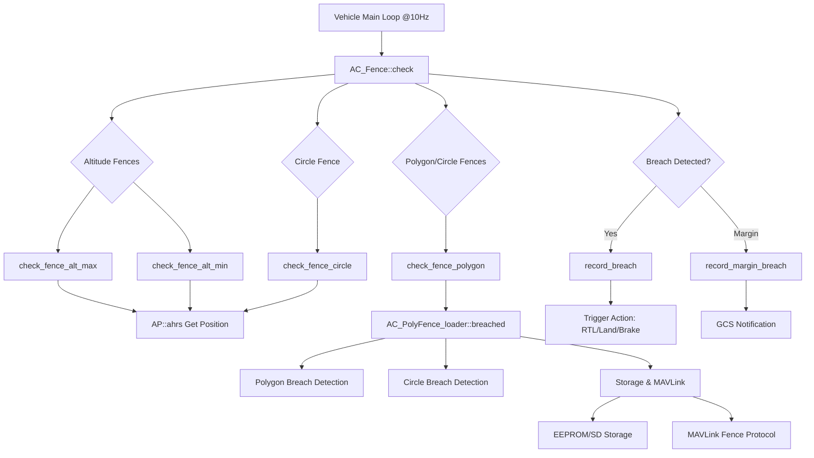

# AC_Fence - ArduPilot Geofencing System

## Overview

The AC_Fence library provides comprehensive geofencing functionality for ArduPilot autopilots, ensuring vehicles remain within safe operational boundaries. This safety-critical system prevents fly-aways, enforces regulatory compliance (such as altitude restrictions), and protects against entering prohibited zones. The library supports multiple fence types—altitude limits (min/max), circular boundaries, and complex polygon inclusion/exclusion zones—with configurable breach actions including RTL (Return to Launch), Land, Brake, and SmartRTL.

The geofencing system operates continuously during flight, checking vehicle position at approximately 10Hz against configured boundaries, implementing sophisticated breach detection with hysteresis to prevent oscillation, and triggering appropriate recovery actions when boundaries are violated.

## Architecture

The AC_Fence system consists of two primary classes working together to provide comprehensive boundary protection:



**Key Integration Points:**
- **AHRS Integration**: `AP::ahrs()` provides vehicle position (altitude relative to home, NE position offsets, GPS location)
- **Logger Integration**: Binary logging of fence state and breach events (LOG_FENCE_MSG)
- **MAVLink Integration**: `GCS_MAVLink` for fence upload/download and status messages
- **Vehicle Control**: Breach actions trigger vehicle mode changes (RTL, Land, Brake, etc.)

## Key Components

### AC_Fence Class

The `AC_Fence` class (defined in `AC_Fence.h`) serves as the main geofencing coordinator and manages all fence types except the detailed polygon/circle geometry handled by the loader.

**Responsibilities:**
- **Fence Enable/Disable Management**: Controls which fences are active based on configuration, arming state, and flight phase
- **Breach Detection Coordination**: Calls individual fence check methods and aggregates breach status
- **Breach Action Implementation**: Interfaces with vehicle control to trigger recovery actions
- **Parameter Management**: Exposes all fence configuration through `AP_Param` system
- **Pre-Arm Validation**: Ensures fence configuration is valid before allowing flight

**Lifecycle:**
1. **Initialization**: `init()` called during vehicle startup, initializes polygon fence loader
2. **Update**: `update()` called at 10Hz, checks for fence loading completion and fence state changes
3. **Pre-Arm Check**: `pre_arm_check()` validates configuration before arming is allowed
4. **Flight Monitoring**: `check()` called continuously during flight to detect breaches
5. **Manual Recovery**: `manual_recovery_start()` called when pilot regains manual control after breach

**Thread Safety**: Uses semaphore protection via `_poly_loader.get_loaded_fence_semaphore()` when accessing polygon fence data that may be reloaded asynchronously.

### AC_PolyFence_loader Class

The `AC_PolyFence_loader` class (defined in `AC_PolyFence_loader.h`) handles persistent storage, coordinate transformation, and geometric breach detection for polygon and circle fences.

**Responsibilities:**
- **Persistent Storage Management**: Reads/writes fence definitions to EEPROM or SD card with atomic updates
- **Coordinate Transformation**: Converts lat/lon coordinates to NE offsets (centimeters) from EKF origin at load time
- **Geometric Breach Detection**: Implements point-in-polygon tests and circle distance calculations
- **MAVLink Protocol Handling**: Processes FENCE_FETCH_POINT and FENCE_POINT messages for fence upload/download
- **Indexing**: Maintains an in-memory index of stored fences for efficient access

**Storage Format:**
- Magic number (235) indicates formatted storage
- Fences stored sequentially with type markers (see `AC_PolyFenceType` enum)
- Index created on load maps fence types to storage offsets
- Supports EEPROM and optionally SD card storage (`AP_SDCARD_STORAGE_ENABLED`)

**Coordinate Frames:**
- **Storage**: WGS84 lat/lon as int32 (degrees × 10^7)
- **Runtime**: NE offsets in centimeters from EKF origin (`Vector2f`)
- **Transformation**: Performed once at load time via `scale_latlon_from_origin()`

## Fence Types

### Altitude Fences

#### Maximum Altitude (AC_FENCE_TYPE_ALT_MAX)

Defines an upper altitude limit above which the vehicle should not fly, typically to comply with regulatory restrictions or mission requirements.

**Configuration:**
- Parameter: `FENCE_ALT_MAX` (default: 100.0m)
- Range: 10-1000m
- Reference: Altitude relative to home/arming position

**Breach Detection Algorithm** (Source: `AC_Fence.cpp:537-583`):
1. Get current altitude relative to home from AHRS: `AP::ahrs().get_relative_position_D_home(alt)`
2. Convert Down to Up coordinate: `_curr_alt = -alt`
3. Calculate breach distance: `_alt_max_breach_distance = _curr_alt - _alt_max`
4. Check hard breach: `if (_curr_alt >= _alt_max)`
5. Check margin breach: `if (_curr_alt >= _alt_max - _margin)`
6. On new breach: Create backup fence 20m higher to prevent immediate re-breach
7. Record breach and return true for new breaches only

**Hysteresis Mechanism:**
- **Backup Fence**: `_alt_max_backup = _curr_alt + 20m` (AC_FENCE_ALT_MAX_BACKUP_DISTANCE)
- **Purpose**: Prevents repeated breach notifications if vehicle continues climbing slightly
- **Clearing**: Backup fence cleared when vehicle descends below `_alt_max`

**Typical Usage:**
- Regulatory altitude restrictions (e.g., 120m/400ft AGL in many jurisdictions)
- Mission-specific ceiling requirements
- Battery range limitations

#### Minimum Altitude (AC_FENCE_TYPE_ALT_MIN)

Defines a lower altitude limit below which the vehicle should not descend, often used for terrain following or to prevent ground impacts during autonomous flight.

**Configuration:**
- Parameter: `FENCE_ALT_MIN` (default: -10.0m)
- Range: -100 to 100m
- Reference: Altitude relative to home/arming position
- Negative values allowed for below-home operations

**Breach Detection Algorithm** (Source: `AC_Fence.cpp:588-636`):
1. Get current altitude from AHRS (same as max altitude check)
2. Calculate breach distance: `_alt_min_breach_distance = _alt_min - _curr_alt`
3. Check hard breach: `if (_curr_alt <= _alt_min)`
4. Check margin breach: `if (_curr_alt <= _alt_min + _margin)`
5. On new breach: Create backup fence 20m lower
6. Record breach and return true for new breaches only

**Special Auto-Enable Logic** (Source: `AC_Fence.cpp:640-667`):
- Floor fence only enables **after** vehicle reaches minimum altitude
- Prevents false breaches during takeoff from elevated positions
- Controlled by `auto_enable_fence_floor()` method
- Manual enable/disable overrides: `enable_floor()`, `disable_floor()`
- State tracked via `_min_alt_state` (DEFAULT, MANUALLY_ENABLED, MANUALLY_DISABLED)

**Typical Usage:**
- Terrain following minimum clearance
- Sub-specific depth limits (negative altitude)
- Preventing ground strikes during low-altitude missions

### Circular Fence (AC_FENCE_TYPE_CIRCLE)

A simple circular boundary centered on the home/arming position, defining the maximum horizontal distance the vehicle may travel.

**Configuration:**
- Parameter: `FENCE_RADIUS` (default: 300.0m)
- Range: 30-10000m
- Center: Home position (captured at arming)

**Breach Detection Algorithm** (Source: `AC_Fence.cpp:705-749`):
1. Get NE position relative to home: `AP::ahrs().get_relative_position_NE_home(home)`
2. Calculate distance from home: `_home_distance = home.length()` (2D Euclidean distance)
3. Calculate breach distance: `_circle_breach_distance = _home_distance - _circle_radius`
4. Check hard breach: `if (_home_distance >= _circle_radius)`
5. Check margin breach: `if (_home_distance >= _circle_radius - _margin)`
6. On new breach: Create backup fence with increased radius
   - Copter/Rover: +20m (`AC_FENCE_CIRCLE_RADIUS_BACKUP_DISTANCE`)
   - Plane: +100m (larger due to higher speeds and turn radius)
7. Record breach and return true for new breaches only

**Hysteresis**: Backup fence prevents rapid breach/clear cycles when flying near the boundary.

**Typical Usage:**
- Simple maximum range restriction
- Emergency backup if polygon fences fail to load
- Testing and initial setup before defining complex polygon boundaries

### Polygon Fences (AC_FENCE_TYPE_POLYGON)

Complex polygon and circle boundaries that define inclusion zones (where vehicle must remain) and exclusion zones (no-fly areas within operating region).

#### Inclusion Polygons

Define areas where the vehicle **MUST** remain. Multiple inclusion zones can be configured with behavior controlled by `FENCE_OPTIONS` bit 1 (INCLUSION_UNION).

**Behavior Modes:**
- **Intersection Mode** (default, INCLUSION_UNION=0): Vehicle must be inside **ALL** inclusion zones simultaneously
- **Union Mode** (INCLUSION_UNION=1): Vehicle must be inside **AT LEAST ONE** inclusion zone

**Configuration:**
- Uploaded via MAVLink fence protocol
- Stored in EEPROM/SD card with type marker `POLYGON_INCLUSION` (98)
- Minimum 3 vertices required for valid polygon
- Vertices stored as lat/lon (int32), transformed to NE offsets at load time

**Use Cases:**
- Define operational area boundaries
- Multiple disconnected flight zones (union mode)
- Nested operational areas (intersection mode)

#### Exclusion Polygons

Define no-fly zones within the operational area. If the vehicle enters any exclusion polygon, an immediate breach occurs regardless of inclusion zone status.

**Priority**: Exclusion zones have **higher priority** than inclusion zones. If vehicle is inside an exclusion polygon, breach occurs even if within an inclusion polygon.

**Configuration:**
- Uploaded via MAVLink fence protocol
- Stored with type marker `POLYGON_EXCLUSION` (97)
- Minimum 3 vertices required

**Use Cases:**
- No-fly zones (airports, restricted areas)
- Obstacle avoidance zones
- Property boundaries to avoid
- Temporary flight restrictions

#### Circle Fences (via AC_PolyFence_loader)

Circular inclusion and exclusion zones defined by center point (lat/lon) and radius (meters), offering simpler geometry than polygons for round areas.

**Inclusion Circles:**
- Type marker: `CIRCLE_INCLUSION` (92)
- Vehicle must remain inside radius
- Center stored as lat/lon, radius in meters
- Multiple inclusion circles can be defined

**Exclusion Circles:**
- Type marker: `CIRCLE_EXCLUSION` (93)
- Vehicle must remain outside radius
- Immediate breach if vehicle enters
- Higher priority than inclusion zones

**Advantages over Circular Fence (AC_FENCE_TYPE_CIRCLE):**
- Multiple circles can be defined
- Circles can be centered anywhere (not just home)
- Inclusion and exclusion circles can coexist
- Part of polygon fence storage system

## Breach Detection Algorithms

### Altitude Breach Detection

**Algorithm Flow** (Source: `AC_Fence.cpp:537-636`):

**For Maximum Altitude:**
```
1. Get current altitude from AHRS
   - Call: AP::ahrs().get_relative_position_D_home(alt)
   - Convert: _curr_alt = -alt  (Down to Up coordinate conversion)

2. Calculate breach distance
   - _alt_max_breach_distance = _curr_alt - _alt_max
   - Positive value = above fence
   - Negative value = below fence

3. Check for hard breach
   - if (_curr_alt >= _alt_max):
     a. Check if new breach or backup fence breach
     b. If new: record_breach(AC_FENCE_TYPE_ALT_MAX)
     c. Create backup: _alt_max_backup = _curr_alt + 20m
     d. Return true (triggers breach action)

4. Check for margin breach
   - if (_curr_alt >= _alt_max - _margin):
     a. record_margin_breach(AC_FENCE_TYPE_ALT_MAX)
     b. Send notification if NOTIFY_MARGIN_BREACH enabled

5. Clear breach if back inside fence
   - if (_curr_alt < _alt_max) and was breached:
     a. clear_breach(AC_FENCE_TYPE_ALT_MAX)
     b. Reset backup fence: _alt_max_backup = 0.0
```

**Key Features:**
- **Coordinate Frame**: Altitude measured relative to home (arming position)
- **Units**: Meters (converted from Down coordinate in NED frame)
- **Frequency**: Called at ~10Hz from main vehicle loop
- **Backup Distance**: 20m above breach point (prevents immediate re-breach)

**Hysteresis Mechanism:**
The backup fence prevents oscillation when vehicle is near the boundary:
- First breach at 100m → backup fence created at current_alt + 20m
- If vehicle climbs to 105m → backup fence is now at 125m
- Vehicle must descend below 100m to clear the breach
- This prevents repeated breach notifications for small altitude variations

### Circle Breach Detection

**Algorithm Flow** (Source: `AC_Fence.cpp:705-749`):

```
1. Get horizontal position from AHRS
   - Call: AP::ahrs().get_relative_position_NE_home(home)
   - home is Vector2f with North/East offsets in meters

2. Calculate distance from home
   - _home_distance = home.length()
   - Euclidean distance: sqrt(N² + E²)

3. Calculate breach distance
   - _circle_breach_distance = _home_distance - _circle_radius
   - Positive value = outside fence
   - Negative value = inside fence

4. Check for hard breach
   - if (_home_distance >= _circle_radius):
     a. Check if new breach or backup fence breach
     b. If new: record_breach(AC_FENCE_TYPE_CIRCLE)
     c. Create backup:
        - Copter: _circle_radius_backup = _home_distance + 20m
        - Plane: _circle_radius_backup = _home_distance + 100m
     d. Return true (triggers breach action)

5. Check for margin breach
   - if (_home_distance >= _circle_radius - _margin):
     a. record_margin_breach(AC_FENCE_TYPE_CIRCLE)

6. Clear breach if back inside fence
   - if (_home_distance < _circle_radius) and was breached:
     a. clear_breach(AC_FENCE_TYPE_CIRCLE)
     b. Reset backup: _circle_radius_backup = 0.0
```

**Vehicle-Specific Backup Distances:**
- **Copter/Rover**: 20m (AC_FENCE_CIRCLE_RADIUS_BACKUP_DISTANCE)
  - Shorter distance appropriate for slower vehicles with tighter control
- **Plane**: 100m
  - Larger distance accounts for higher speeds and wider turn radius
  - Prevents re-breach during turn-back maneuver

### Polygon Breach Detection

**High-Level Algorithm** (Source: `AC_PolyFence_loader.cpp:232-332`):

```
1. Validate prerequisites
   - Check if fences loaded: if (!loaded()) return false
   - Check if any fences defined: if (total_fence_count() == 0) return false

2. Transform current position
   - Get current GPS location: AP::ahrs().get_location(loc)
   - Convert lat/lon to NE offsets from EKF origin
   - Call: scale_latlon_from_origin(loaded_origin, pos, scaled_pos)
   - Units: centimeters from origin

3. Check inclusion polygons
   - For each inclusion polygon:
     a. Point-in-polygon test: Polygon_outside(pos, boundary.points_lla, count)
     b. Distance calculation: Polygon_closest_distance_point(boundary.points, count, scaled_pos, distance)
     c. Track number of inclusions we're outside: num_inclusion_outside++
   
4. Check exclusion polygons (PRIORITY: checked first, immediate breach)
   - For each exclusion polygon:
     a. Point-in-polygon test: !Polygon_outside(pos, ...) means INSIDE exclusion
     b. If inside ANY exclusion: return true (immediate breach)
   
5. Check exclusion circles
   - For each exclusion circle:
     a. Calculate distance: loc.get_distance(circle_center)
     b. If distance < radius: return true (immediate breach)

6. Check inclusion circles
   - For each inclusion circle:
     a. Calculate distance from center
     b. If distance > radius: num_inclusion_outside++

7. Apply inclusion logic
   - If INCLUSION_UNION mode (OPTIONS bit 1):
     - Breach if: num_inclusion > 0 AND num_inclusion == num_inclusion_outside
     - (Outside ALL inclusions when at least one exists)
   - If intersection mode (default):
     - Breach if: num_inclusion_outside > 0
     - (Outside ANY inclusion)

8. Return breach status
```

**Geometric Algorithms Used:**

**Point-in-Polygon Test** (`Polygon_outside()` from AP_Math):
- **Algorithm**: Ray casting method
- **Implementation**: Counts intersections of horizontal ray from point to polygon edges
- **Result**: Odd intersections = inside, Even intersections = outside
- **Complexity**: O(n) where n = number of vertices

**Closest Distance to Polygon** (`Polygon_closest_distance_point()` from AP_Math):
- **Purpose**: Calculate shortest distance from point to nearest polygon edge
- **Method**: Iterates through all edges, finds perpendicular distance to each
- **Units**: Returns distance in same units as input (centimeters)
- **Sign Convention**:
  - Negative distance = inside polygon (distance to boundary)
  - Positive distance = outside polygon (distance to breach point)

**Circle Distance Calculation** (`Location::get_distance()`):
- **Method**: Haversine formula for great-circle distance
- **Accuracy**: Accounts for Earth's curvature
- **Units**: Returns meters
- **Conversion**: Multiplied by 100 for centimeter precision in comparisons

### Breach Hysteresis

The fence system implements multiple hysteresis mechanisms to prevent oscillation and repeated breach notifications when operating near boundaries.

#### Backup Fences

Created on initial breach to establish a new temporary boundary beyond the original fence:

**Purpose**: Prevent immediate re-breach if vehicle continues moving away from home/boundary after initial violation.

**Implementation by Fence Type:**

| Fence Type | Backup Distance | Notes |
|------------|----------------|-------|
| Altitude Max | +20m above current altitude | `AC_FENCE_ALT_MAX_BACKUP_DISTANCE` |
| Altitude Min | -20m below current altitude | `AC_FENCE_ALT_MIN_BACKUP_DISTANCE` |
| Circle (Copter/Rover) | +20m beyond current distance | `AC_FENCE_CIRCLE_RADIUS_BACKUP_DISTANCE` |
| Circle (Plane) | +100m beyond current distance | Accounts for wider turn radius |
| Polygon | Inherent via distance calculations | No explicit backup needed |

**Lifecycle:**
1. **Creation**: On first breach, backup fence = current_position + backup_distance
2. **Monitoring**: Subsequent checks compare against backup fence instead of original
3. **Clearing**: Backup fence removed when vehicle returns inside original fence boundary

**Example Scenario - Altitude Max:**
```
Original fence: 100m
Vehicle at: 95m → No breach
Vehicle at: 101m → BREACH! Backup fence created at 121m (101 + 20)
Vehicle at: 105m → Still breached, but no new notification (within backup)
Vehicle at: 99m → Breach cleared, backup fence removed
Vehicle at: 101m → BREACH again (backup was cleared)
```

#### Margin Breach Notifications

Provides early warning before hard breach occurs:

**Margin Parameter** (`FENCE_MARGIN`):
- Default: 2.0 meters
- Range: 1-10 meters
- Purpose: Distance to maintain from fence boundaries

**Behavior:**
- **Margin Breach**: Detected when within margin distance of boundary
- **Hard Breach**: Detected when boundary actually crossed
- **Separate Tracking**: `_breached_fence_margins` vs `_breached_fences` bitmasks
- **Notification Control**: `FENCE_OPTIONS` bit 2 (NOTIFY_MARGIN_BREACH) enables GCS notifications

**Notification Frequency** (`FENCE_NTF_FREQ`):
- Default: 1.0 Hz
- Range: 0-10 Hz
- Controls rate of margin breach notifications to GCS

**Use Cases:**
- Early warning system for pilot
- Allows corrective action before hard breach
- Prevents surprise fence actions
- Useful for tuning fence parameters

#### Manual Recovery Window

**Purpose**: Allow pilot to regain manual control without immediate autonomous action.

**Implementation** (Source: `AC_Fence.cpp:396-410`):
```
manual_recovery_start():
  - Called when pilot changes to manual flight mode
  - Sets: _manual_recovery_start_ms = current_time
  - Duration: 10 seconds (AC_FENCE_MANUAL_RECOVERY_TIME_MIN)
  - Effect: Suppresses autonomous breach actions during window
  - Expiry: After 10 seconds, autonomous actions resume
```

**Typical Workflow:**
1. Fence breach occurs → RTL action triggered
2. Pilot switches to STABILIZE mode
3. `manual_recovery_start()` called → 10 second window begins
4. Pilot corrects position manually
5. If back inside fence within 10s → breach cleared, no further action
6. If still outside after 10s → autonomous action resumes

**Safety Note**: Manual recovery window does NOT disable fence checking, only suppresses autonomous actions. Breach state remains active and logged.

#### Oscillation Prevention Summary

Multiple mechanisms work together to prevent rapid breach/clear cycles:

1. **Backup Fences**: Prevent re-breach notifications for same violation
2. **Margin Warnings**: Provide buffer zone for pilot correction
3. **Manual Recovery**: Allow pilot override without autonomous interference
4. **Separate Breach Tracking**: Margin breaches don't trigger actions, only notifications
5. **Notification Rate Limiting**: `_last_breach_notify_sent_ms` and `_last_margin_breach_notify_sent_ms` prevent notification spam

## Breach Actions

Configurable autonomous responses when fence boundaries are violated, controlled by `FENCE_ACTION` parameter.

### Action Types

#### REPORT_ONLY (0)

**Behavior**: Log breach to dataflash and notify GCS, but take no autonomous action.

**Use Cases:**
- Initial fence testing and validation
- Advisory mode for pilot awareness
- Development and debugging
- Situations where autonomous control is not desired

**Implementation**: Breach recorded and logged, but vehicle mode unchanged.

#### RTL_AND_LAND (1)

**Behavior**: Initiate Return to Launch (RTL) mode. If RTL fails or is unavailable, Land.

**Sequence:**
1. Attempt to switch to RTL mode
2. Vehicle returns to home/rally point at configured altitude
3. Land at home position
4. If RTL unavailable → immediate Land at current position

**Use Cases:**
- Default action for most vehicles and missions
- Provides safe return to known location
- Appropriate for most fence violations

**Default**: This is the default action for most vehicle types.

#### ALWAYS_LAND (2)

**Behavior**: Immediately land at current position, regardless of location.

**Use Cases:**
- Emergency situations where immediate landing is required
- Indoor operations where RTL is not feasible
- Battery failsafe coordination

**⚠️ WARNING**: Could strand vehicle in unsuitable location (water, trees, roads, remote areas). Use with caution and only when immediate landing is safer than attempting return.

#### SMART_RTL (3)

**Behavior**: Use SmartRTL path recording for safe return. Fallback to RTL if SmartRTL unavailable, then Land.

**Sequence:**
1. Attempt SmartRTL (follows recorded safe path home)
2. If SmartRTL path unavailable → RTL mode
3. If RTL unavailable → Land at current position

**Use Cases:**
- Complex environments with obstacles
- Missions through urban canyons or forests
- Situations where direct RTL path may be unsafe

**Requirements**: SmartRTL must be enabled and path must be recorded during flight.

#### BRAKE (4)

**Behavior**: Stop vehicle at current position (Copter only). Hold position, then Land if breach not cleared.

**Sequence:**
1. Switch to Brake mode (copter stops and holds position)
2. Wait for pilot intervention or manual recovery
3. If breach not cleared → fallback to Land

**Use Cases:**
- Copter operations where immediate stop is safer than return
- Allows pilot time to assess situation
- Prevents further boundary violations

**Vehicle Support**: Primarily for multicopters. Not applicable to fixed-wing (cannot hover).

#### SMART_RTL_OR_LAND (5)

**Behavior**: Attempt SmartRTL, otherwise immediate Land (no RTL fallback).

**Sequence:**
1. Attempt SmartRTL using recorded path
2. If SmartRTL unavailable → Land immediately at current position

**Use Cases:**
- Prefer recorded safe path over direct RTL
- Situations where direct RTL path may be dangerous
- Accept landing in place if safe path unavailable

**Difference from SMART_RTL (3)**: Skips the RTL fallback step.

#### GUIDED (6)

**Behavior**: Switch to Guided mode with target waypoint set to fence return point.

**Sequence:**
1. Switch to Guided mode
2. Set guided target to fence return point (if configured) or rally point
3. Vehicle navigates to target autonomously

**Configuration:**
- `FENCE_RET_RALLY` = 0: Return to fence return point
- `FENCE_RET_RALLY` = 1: Return to rally point or home
- `FENCE_RET_ALT`: Altitude for return in meters

**Use Cases:**
- Custom breach handling via companion computer
- Guided mode operations integrated with mission
- Allows external control during breach recovery

#### GUIDED_THROTTLE_PASS (7)

**Behavior**: Switch to Guided mode but pilot retains throttle control.

**Sequence:**
1. Switch to Guided mode
2. Set horizontal target to return point
3. Pilot controls vertical movement via throttle

**Use Cases:**
- Hybrid autonomous/manual recovery
- Situations where pilot needs altitude control
- Training scenarios

#### AUTOLAND_OR_RTL (8)

**Behavior**: Plane-specific. Attempt automatic landing if configured, otherwise RTL.

**Sequence:**
1. If autoland configured and suitable → initiate landing sequence
2. Otherwise → RTL mode
3. If RTL unavailable → Land (emergency)

**Use Cases:**
- Fixed-wing missions with pre-defined landing locations
- Airport/runway operations
- Automated landing capability

**Vehicle Support**: Primarily for ArduPlane with DO_LAND_START mission items.

### Vehicle-Specific Action Support

Not all actions are supported by all vehicle types. Action availability is defined in vehicle-specific `Parameters.cpp`:

**Generally Supported:**
- All vehicles: REPORT_ONLY, RTL_AND_LAND, ALWAYS_LAND
- Copter/Rover: BRAKE, SMART_RTL, SMART_RTL_OR_LAND
- Plane: AUTOLAND_OR_RTL

**Action Selection Guidance:**
- **Copter**: RTL_AND_LAND (default), SMART_RTL for complex environments, BRAKE for immediate stop
- **Plane**: RTL_AND_LAND (default), AUTOLAND_OR_RTL if landing sites configured
- **Rover**: RTL_AND_LAND or BRAKE
- **Testing**: REPORT_ONLY for validation without autonomous action

## Fence Enable/Disable Logic

### Manual Enable/Disable

**Primary Methods:**

```cpp
// Enable/disable specific fence types
uint8_t enable(bool value, uint8_t fence_types, bool update_auto_mask = true)

// Enable/disable all configured fences
uint8_t enable_configured(bool value)

// Floor-specific control (altitude minimum)
void enable_floor()
void disable_floor()
```

**Bitmask Control** (`fence_types` parameter):
- Bit 0 (1): `AC_FENCE_TYPE_ALT_MAX`
- Bit 1 (2): `AC_FENCE_TYPE_CIRCLE`
- Bit 2 (4): `AC_FENCE_TYPE_POLYGON`
- Bit 3 (8): `AC_FENCE_TYPE_ALT_MIN`

**Example Usage:**
```cpp
// Enable altitude max and circle fences
fence.enable(true, AC_FENCE_TYPE_ALT_MAX | AC_FENCE_TYPE_CIRCLE);

// Disable only polygon fences
fence.enable(false, AC_FENCE_TYPE_POLYGON);

// Enable all configured fences
fence.enable_configured(true);
```

**Return Value**: Bitmask of fences that were actually changed (for logging/notification).

### Auto-Enable Modes

Controlled by `FENCE_AUTOENABLE` parameter:

#### ALWAYS_DISABLED (0)

**Behavior**: Fences remain disabled unless manually enabled via GCS, RC switch, or MAVLink command.

**Use Cases:**
- Testing and development environments
- Manual control of fence activation
- Situations where automatic enabling is undesirable
- Initial setup and calibration

**Default**: This is the default setting for safety (prevents unexpected fence activation).

#### ENABLE_ON_AUTO_TAKEOFF (1)

**Behavior**: Fences automatically enable when vehicle completes autonomous takeoff.

**Trigger Conditions:**
- Autonomous takeoff in AUTO, GUIDED, or similar modes
- Takeoff altitude threshold reached (vehicle-specific)
- Called via: `auto_enable_fence_after_takeoff()`

**Use Cases:**
- Automated missions with minimal pilot intervention
- Ensures fences active before waypoint navigation begins
- Default for production autonomous operations

**Floor Fence Behavior**: Altitude minimum fence uses special logic (see floor enable below).

#### ENABLE_DISABLE_FLOOR_ONLY (2)

**Behavior**: Enable all fences on takeoff, but automatically disable floor fence (altitude minimum) on landing.

**Rationale**: Floor fence can interfere with landing if terrain is below home altitude or if landing at different elevation than takeoff.

**Sequence:**
1. On takeoff: All configured fences enabled (including floor if configured)
2. During flight: Floor fence active after reaching minimum altitude
3. On landing: Floor fence automatically disabled
4. Other fences: Remain enabled unless manually disabled

**Use Cases:**
- Terrain-following missions
- Missions with variable landing locations
- Operations where landing altitude may be below takeoff altitude

#### ONLY_WHEN_ARMED (3)

**Behavior**: All configured fences enable when vehicle arms, disable when vehicle disarms.

**Sequence:**
1. On arming: `auto_enable_fence_on_arming()` called → all configured fences enabled
2. During flight: Fences remain active
3. On disarm: `auto_disable_fence_on_disarming()` called → all fences disabled

**Use Cases:**
- Ensures fences active for entire flight
- Simple enable/disable logic tied to arm state
- Appropriate for manual and autonomous flights

**Safety Note**: Fences become active immediately on arming, before takeoff. Ensure vehicle is within boundaries before arming.

### Floor Fence Special Handling

The altitude minimum fence (floor) has unique auto-enable logic to prevent false breaches during takeoff:

**Problem**: If floor fence enabled during takeoff, vehicle may breach immediately if:
- Taking off from elevated position (above home altitude)
- Minimum altitude set higher than ground level
- Terrain below home altitude

**Solution** (Source: `AC_Fence.cpp:640-667`):

```cpp
bool auto_enable_fence_floor()
{
    // Only enable floor if:
    // 1. Not manually disabled
    // 2. Floor configured in FENCE_TYPE
    // 3. Vehicle has reached minimum altitude at least once
    
    if (_min_alt_state == MinAltState::MANUALLY_DISABLED) {
        return false;
    }
    
    if (!(_configured_fences & AC_FENCE_TYPE_ALT_MIN)) {
        return false;
    }
    
    // Get current altitude
    float curr_alt;
    AP::ahrs().get_relative_position_D_home(curr_alt);
    curr_alt = -curr_alt;  // Convert Down to Up
    
    // Enable floor once we've reached minimum altitude
    if (curr_alt >= _alt_min) {
        enable_floor();
        return true;
    }
    
    return false;
}
```

**State Machine** (`_min_alt_state`):
- **DEFAULT**: Normal auto-enable logic applies
- **MANUALLY_ENABLED**: Pilot has explicitly enabled floor (overrides auto logic)
- **MANUALLY_DISABLED**: Pilot has explicitly disabled floor (prevents auto-enable)

**Workflow:**
1. Vehicle takes off with floor fence disabled
2. Vehicle climbs to altitude >= `FENCE_ALT_MIN`
3. `auto_enable_fence_floor()` detects threshold crossed
4. Floor fence automatically enabled
5. Subsequent descents below minimum altitude will breach

**Manual Override Methods:**
- `enable_floor()`: Force enable (sets state to MANUALLY_ENABLED)
- `disable_floor()`: Force disable (sets state to MANUALLY_DISABLED)
- Note: Manual methods DO NOT update EEPROM, only runtime state

## Pre-Arm Checks

The `pre_arm_check()` method validates fence configuration before allowing the vehicle to arm, catching configuration errors that could lead to immediate breaches or unsafe behavior.

**Main Check Method** (Source: `AC_Fence.cpp:262-308`):

```cpp
bool pre_arm_check(char *failure_msg, const uint8_t failure_msg_len) const
```

**Returns**: 
- `true`: All checks passed, safe to arm
- `false`: Configuration error detected, message written to `failure_msg` buffer

**Called From**: Vehicle-specific arming check sequences (typically in `AP_Arming` class)

### Altitude Fence Checks

**Method**: `pre_arm_check_alt()` (Source: `AC_Fence.cpp:434-470`)

**Validations:**

1. **Min < Max Validation**:
   ```
   If both min and max altitude fences enabled:
     Check: _alt_min < _alt_max
     Failure: "Min Alt > Max Alt"
   ```

2. **Current Altitude Within Bounds**:
   ```
   Get current altitude from AHRS
   
   If max altitude fence enabled:
     Check: current_alt < _alt_max
     Failure: "Above fence alt"
   
   If min altitude fence enabled:
     Check: current_alt > _alt_min
     Failure: "Below fence alt"
   ```

3. **Margin Validation**:
   ```
   If max altitude fence enabled:
     Check: current_alt < (_alt_max - _margin)
     Failure: "Close to max alt"
   
   If min altitude fence enabled:
     Check: current_alt > (_alt_min + _margin)
     Failure: "Close to min alt"
   ```

**Rationale**: Ensures vehicle can arm and takeoff without immediately breaching altitude limits.

### Circle Fence Checks

**Method**: `pre_arm_check_circle()` (Source: `AC_Fence.cpp:378-410`)

**Validations:**

1. **Current Position Inside Circle**:
   ```
   Get NE position from AHRS: get_relative_position_NE_home(home)
   Calculate distance: home_distance = home.length()
   
   Check: home_distance < _circle_radius
   Failure: "vehicle outside circular fence"
   ```

2. **Margin Validation**:
   ```
   Check: home_distance < (_circle_radius - _margin)
   Failure: "vehicle close to fence"
   ```

3. **Radius vs Margin**:
   ```
   Check: _circle_radius >= _margin
   Failure: "margin is less than radius"
   ```

**Rationale**: Ensures vehicle is within fence boundary at arming time and has clearance for takeoff.

### Polygon Fence Checks

**Method**: `pre_arm_check_polygon()` (Source: `AC_Fence.cpp:413-432`)

**Validations:**

1. **Fences Loaded**:
   ```
   Check: _poly_loader.loaded()
   Failure: "Fences not loaded"
   ```
   Note: Fences load asynchronously; may take several seconds after boot.

2. **At Least One Fence Defined**:
   ```
   Check: _poly_loader.total_fence_count() > 0
   Failure: "No fences configured"
   ```

3. **Valid EKF Origin**:
   ```
   Check: AP::ahrs().get_origin(origin)
   Failure: "fence requires origin"
   ```
   Rationale: Polygon coordinates transformed relative to EKF origin; origin must be valid.

4. **Current Position Valid**:
   ```
   Check: !_poly_loader.breached(current_loc, distance)
   Failure: "vehicle outside fence"
   ```
   Ensures vehicle inside inclusion zones and outside exclusion zones.

5. **Margin Clearance**:
   ```
   If inside inclusion zones:
     Check: distance < -_margin (negative = inside, magnitude = distance to boundary)
     Failure: "vehicle within <dist>m of fence"
   ```

**Special Handling**: If vehicle outside fence at arming time, provides distance information for pilot.

### Pre-Arm Check Failure Messages

**Buffer Size**: Typically 50-100 characters (vehicle-specific)

**Message Format**: Concise, actionable descriptions:
- "Above fence alt" - clear indication of problem
- "vehicle outside circular fence" - specific fence type
- "vehicle within 1.5m of fence" - includes distance for situational awareness

**GCS Display**: Failure messages displayed to pilot via GCS (Mission Planner, QGroundControl, etc.)

### Common Pre-Arm Failures and Solutions

| Failure Message | Cause | Solution |
|----------------|-------|----------|
| "Min Alt > Max Alt" | Configuration error | Check FENCE_ALT_MIN < FENCE_ALT_MAX |
| "Above fence alt" | Vehicle above max altitude at arming | Lower FENCE_ALT_MAX or move to lower location |
| "vehicle outside circular fence" | Too far from home | Move closer to home/origin |
| "Fences not loaded" | Fence data still loading from storage | Wait a few seconds and retry |
| "fence requires origin" | EKF origin not set | Wait for GPS lock and EKF initialization |
| "vehicle outside fence" | Outside polygon inclusion zone | Move inside configured boundary |
| "margin is less than radius" | FENCE_MARGIN > FENCE_RADIUS | Reduce margin or increase radius |

## Polygon Fence Storage

The `AC_PolyFence_loader` class manages persistent storage of polygon and circle fence definitions in EEPROM or optionally on SD card.

### Storage Format

**Storage Layout**:
```
Offset 0: Magic number (235) - indicates formatted storage
Offset 1+: Fence items stored sequentially
  - Each item: type (uint8_t) + data (varies by type)
  - End marker: AC_PolyFenceType::END_OF_STORAGE (99)
```

**Magic Number Validation** (Source: `AC_PolyFence_loader.cpp:67-79`):
```cpp
bool formatted() const
{
    uint8_t val;
    if (!_total.storage_access().read_byte(0, val)) {
        return false;
    }
    return val == FENCE_STORAGE_MAGIC;  // 235
}
```

**Storage Backends**:
1. **EEPROM** (default): Uses `StorageManager` for persistent parameter storage
2. **SD Card** (optional): If `AP_SDCARD_STORAGE_ENABLED` defined, uses SD card files
   - Allows much larger fence definitions
   - Fallback to EEPROM if SD operations fail

### Fence Item Types

Defined in `AC_PolyFenceType` enum (Source: `AC_PolyFence_loader.h:21-29`):

| Type Value | Name | Purpose | Data Stored |
|------------|------|---------|-------------|
| 98 | POLYGON_INCLUSION | Vertex of inclusion polygon | Latitude (int32), Longitude (int32) |
| 97 | POLYGON_EXCLUSION | Vertex of exclusion polygon | Latitude (int32), Longitude (int32) |
| 93 | CIRCLE_EXCLUSION | Exclusion circle definition | Center lat/lon (int32), Radius (float, meters) |
| 92 | CIRCLE_INCLUSION | Inclusion circle definition | Center lat/lon (int32), Radius (float, meters) |
| 95 | RETURN_POINT | Guided mode return location | Latitude (int32), Longitude (int32) |
| 99 | END_OF_STORAGE | Marks end of fence data | No data |

**Coordinate Storage Format**:
- **Latitude/Longitude**: Stored as `int32_t` in degrees × 10^7
  - Example: 37.7749° = 377,749,000
  - Provides ~1.1cm precision at equator
- **Radius**: Stored as `float` in meters
- **Type Marker**: Single `uint8_t` byte preceding each item

**Sequential Storage**:
Fences stored as continuous sequence:
```
[Magic:235][Type:98][Lat][Lon][Type:98][Lat][Lon]...[Type:99]
```

Polygons defined by sequence of vertices:
- First vertex: Marks start of polygon
- Subsequent vertices: Define polygon boundary
- Next different type marker: Marks end of current polygon

### Storage Operations

#### Writing Fences

**Method**: `write_fence()` (Source: `AC_PolyFence_loader.cpp:434-523`)

**Atomic Update Process**:
```cpp
bool write_fence(const AC_PolyFenceItem *new_items, uint16_t count)
{
    // 1. Validate new fence data
    if (!validate_fence(new_items, count)) {
        return false;
    }
    
    // 2. Clear existing storage
    format();  // Write magic number, clear all fence data
    
    // 3. Write new items sequentially
    uint16_t offset = 1;  // After magic number
    for (uint16_t i = 0; i < count; i++) {
        write_item(offset, new_items[i]);
        offset += item_size(new_items[i].type);
    }
    
    // 4. Write end marker
    write_type(offset, AC_PolyFenceType::END_OF_STORAGE);
    
    // 5. Trigger reload
    _last_total_in_storage = -1;  // Force reload detection
    
    return true;
}
```

**Validation** (`validate_fence()`):
- Check polygon closure (first vertex == last vertex)
- Verify minimum vertices (3+ for polygons)
- Check for duplicate consecutive points
- Validate coordinate ranges
- Ensure storage capacity not exceeded

**Atomicity**: Write operation clears old fences before writing new ones. If power loss during write, storage reverts to unformatted state (magic number cleared first).

#### Loading Fences

**Method**: `load_from_storage()` (Source: `AC_PolyFence_loader.cpp:108-227`)

**Load Process**:
```cpp
void load_from_storage()
{
    // 1. Check if already loaded
    if (loaded()) {
        return;
    }
    
    // 2. Verify formatted storage
    if (!formatted()) {
        return;  // No fences stored
    }
    
    // 3. Get EKF origin for coordinate transformation
    if (!AP::ahrs().get_origin(_loaded_origin)) {
        return;  // Origin required for polygon fences
    }
    
    // 4. Read fence items from storage
    uint16_t offset = 1;
    while (offset < storage_size) {
        uint8_t type;
        read_type(offset, type);
        
        if (type == END_OF_STORAGE) {
            break;
        }
        
        // Read item based on type
        AC_PolyFenceItem item;
        read_item(offset, type, item);
        
        // 5. Transform coordinates to NE offsets
        if (is_polygon_type(type)) {
            scale_latlon_from_origin(_loaded_origin, item.loc, item.pos_cm);
        }
        
        // 6. Store in runtime array
        add_to_boundary(item);
        
        offset += item_size(type);
    }
    
    // 7. Build index for fast access
    index_eeprom();
    
    // 8. Mark as loaded
    _loaded = true;
}
```

**Asynchronous Loading**:
- Called from `update()` at 10Hz
- Non-blocking: returns immediately if origin not ready
- May take several seconds after boot to complete
- `loaded()` method returns `true` when complete

**Thread Safety**: Uses semaphore `_loaded_fence_sem` to protect fence data during reload:
```cpp
WITH_SEMAPHORE(_loaded_fence_sem);
```

#### Indexing

**Purpose**: Fast lookup of fence boundaries by type (inclusion/exclusion, polygon/circle).

**Method**: `index_eeprom()` (Source: `AC_PolyFence_loader.cpp:334-395`)

**Index Structure**:
```cpp
struct AC_PolyFence_Boundary {
    AC_PolyFenceType type;
    uint16_t vertex_count;
    Vector2f *points;        // NE offsets in cm (for polygons)
    Location_Class *points_lla;  // Lat/lon coordinates (for breach checks)
    
    // For circles
    Location_Class circle_center;
    float circle_radius_m;
};
```

**Index Arrays**:
- `_boundaries[]`: Array of all loaded boundaries
- `_inclusion_boundary_count`: Number of inclusion zones
- `_exclusion_boundary_count`: Number of exclusion zones

**Building the Index**:
1. Scan all stored items sequentially
2. Group consecutive vertices of same type into boundaries
3. Allocate memory for coordinate arrays
4. Store pointers to transformed NE offsets
5. Count inclusion vs exclusion fences

**Memory Management**:
- Dynamic allocation using `NEW_NOTHROW`
- Memory freed on reload: `clear_fence_data()`
- Handles allocation failures gracefully

### MAVLink Fence Protocol

The polygon fence loader implements the MAVLink fence protocol for uploading/downloading fences from ground control stations.

**Supported Messages**:

#### FENCE_FETCH_POINT (161)

**Purpose**: GCS requests a specific fence point by sequence number.

**Handler**: `handle_msg_fetch_fence_point()` (Source: `AC_PolyFence_loader.cpp:524-598`)

**Process**:
```
1. Receive FENCE_FETCH_POINT with sequence number
2. Validate sequence number < total_fence_count()
3. Read item from storage at sequence offset
4. Convert to FENCE_POINT message format
5. Send FENCE_POINT response to GCS
```

**Use Case**: GCS downloads current fence configuration for editing or verification.

#### FENCE_POINT (160)

**Purpose**: GCS uploads a fence point.

**Handler**: `handle_msg_fence_point()` (Source: `AC_PolyFence_loader.cpp:600-712`)

**Upload Sequence**:
```
1. GCS sends FENCE_POINT with idx=0, count=N (total points)
   - Signals start of fence upload
   - Previous fences cleared from temporary buffer

2. GCS sends FENCE_POINT idx=1..N-1
   - Each point added to temporary buffer
   - Validated: coordinate ranges, sequence order

3. GCS sends final point idx=N-1
   - Validate complete fence data
   - Atomic write to persistent storage via write_fence()
   - Send acknowledgment to GCS

4. If error at any step:
   - Abort upload, discard temporary buffer
   - Previous fences remain unchanged
```

**Validation During Upload**:
- Sequence numbers must be consecutive (0, 1, 2, ...)
- Total count must match initial announcement
- Coordinates must be valid (lat: -90 to +90, lon: -180 to +180)
- Polygon vertices must close (first == last)

**Error Handling**:
- Invalid sequence: Upload aborted, error sent to GCS
- Storage full: Upload aborted, error logged
- Validation failure: Upload aborted, previous fences retained

**Safety**: Atomic write ensures partially-uploaded fences are never active. Old fences remain active until complete new fence set validated and written.

### Coordinate Frame Transformations

Fences undergo coordinate transformations between storage and runtime for efficient breach checking.

#### Storage Coordinate Frame

**Format**: WGS84 Geodetic Coordinates
- **Latitude**: -90° to +90° (degrees)
- **Longitude**: -180° to +180° (degrees)
- **Storage**: `int32_t` as degrees × 10^7
- **Precision**: ~1.1 cm at equator, higher at poles

**Rationale**:
- Standard GPS coordinate system
- Compatible with GCS and mission planning tools
- Efficient storage (8 bytes per point vs 8+ bytes for NE offsets)

#### Runtime Coordinate Frame

**Format**: North-East Offsets from EKF Origin
- **North**: Meters (positive = north)
- **East**: Meters (positive = east)
- **Storage**: `Vector2f` in centimeters (for precision)
- **Origin**: EKF origin position (first GPS lock location typically)

**Rationale**:
- Flat-earth approximation valid for ~10km from origin
- Fast distance calculations (no trigonometry)
- Compatible with vehicle NE position from AHRS
- Efficient breach checking

#### Transformation Process

**Method**: `scale_latlon_from_origin()` (Source: `AC_PolyFence_loader.cpp:228-265`)

**Algorithm**:
```cpp
void scale_latlon_from_origin(const Location &origin, 
                              const Location &loc,
                              Vector2f &pos_cm)
{
    // 1. Calculate offset in cm using haversine-derived scaling
    Vector2l offset_cm;
    if (!origin.get_vector_xy_from_origin_NE(loc, offset_cm)) {
        // Fallback for large distances or invalid coordinates
        pos_cm.zero();
        return;
    }
    
    // 2. Convert int64 cm to float cm (Vector2f)
    pos_cm.x = offset_cm.x;  // North in cm
    pos_cm.y = offset_cm.y;  // East in cm
}
```

**EKF Origin**:
- **Source**: `AP::ahrs().get_origin(origin)`
- **Set When**: First GPS lock with sufficient accuracy (typically early in boot)
- **Persistence**: Origin remains fixed for flight; changes only on reboot or origin reset
- **Requirement**: Must be valid before polygon fences can load

**Transformation Timing**:
- **Load Time**: All fence coordinates transformed during `load_from_storage()`
- **Runtime**: No coordinate transformation needed during breach checks (pre-computed)
- **Efficiency**: Transformation overhead paid once at load, not every 10Hz check

#### Distance Calculations

**During Breach Checks**:
```cpp
// Get current vehicle position in NE frame
Vector2f current_pos_cm;
Location current_loc;
AP::ahrs().get_location(current_loc);
scale_latlon_from_origin(_loaded_origin, current_loc, current_pos_cm);

// Calculate distance to polygon boundary (already in NE frame)
Polygon_closest_distance_point(boundary.points, count, current_pos_cm, distance);
```

**For Circle Fences**:
```cpp
// Circle centers stored in both formats
float distance_m = current_loc.get_distance(boundary.circle_center);
bool breached = (distance_m < boundary.circle_radius_m);  // Inclusion
// or
bool breached = (distance_m < boundary.circle_radius_m);  // Exclusion
```

**Coordinate Frame Consistency**:
- Vehicle position: Always relative to same EKF origin
- Fence boundaries: Transformed relative to same EKF origin
- Distance calculations: All in same NE coordinate frame
- Units: Centimeters for precision, converted to meters for display

### Storage Capacity

**EEPROM Limitations**:
- Typical capacity: 4-16 KB (board-dependent)
- Shared with other parameters and data
- Limited to ~100-200 fence points maximum

**SD Card Storage** (if enabled):
- Capacity: Limited only by SD card size (typically GB)
- Supports thousands of fence points
- Fallback to EEPROM if SD operations fail

**Checking Capacity**:
```cpp
uint16_t max_items = storage_size / AVG_ITEM_SIZE;
if (fence_count > max_items) {
    // Storage full error
}
```

## Configuration Parameters

The AC_Fence library exposes all configuration through the `AP_Param` system, making parameters accessible via GCS, MAVLink, and scripting.

**Parameter Definition** (Source: `AC_Fence.cpp:47-144`):

| Parameter | Description | Default | Range | Units |
|-----------|-------------|---------|-------|-------|
| **FENCE_ENABLE** | Master enable/disable | 0 | 0-1 | boolean |
| **FENCE_TYPE** | Fence types bitmask | Vehicle-specific | 0-15 | bitmask |
| **FENCE_ACTION** | Breach action | RTL_AND_LAND (1) | 0-8 | enum |
| **FENCE_ALT_MAX** | Maximum altitude | 100.0 | 10-1000 | meters |
| **FENCE_ALT_MIN** | Minimum altitude | -10.0 | -100-100 | meters |
| **FENCE_RADIUS** | Circle fence radius | 300.0 | 30-10000 | meters |
| **FENCE_MARGIN** | Margin distance | 2.0 | 1-10 | meters |
| **FENCE_TOTAL** | Number of fence points (legacy) | 0 | 0-255 | count |
| **FENCE_RET_RALLY** | Return to rally vs fence point | 0 | 0-1 | boolean |
| **FENCE_RET_ALT** | Return altitude | 0 | 0-32767 | meters |
| **FENCE_AUTOENABLE** | Auto-enable mode | ALWAYS_DISABLED (0) | 0-3 | enum |
| **FENCE_OPTIONS** | Option flags | 0 | 0-7 | bitmask |
| **FENCE_NTF_FREQ** | Margin notification frequency | 1.0 | 0-10 | Hz |

### FENCE_TYPE Bitmask

Controls which fence types are configured (not necessarily enabled):

| Bit | Value | Fence Type | Description |
|-----|-------|------------|-------------|
| 0 | 1 | `AC_FENCE_TYPE_ALT_MAX` | Maximum altitude fence |
| 1 | 2 | `AC_FENCE_TYPE_CIRCLE` | Circle fence centered on home |
| 2 | 4 | `AC_FENCE_TYPE_POLYGON` | Polygon/circle inclusion/exclusion fences |
| 3 | 8 | `AC_FENCE_TYPE_ALT_MIN` | Minimum altitude fence (floor) |

**Example Values:**
- `FENCE_TYPE=1`: Only max altitude
- `FENCE_TYPE=3`: Max altitude + circle (1+2)
- `FENCE_TYPE=7`: Max altitude + circle + polygon (1+2+4)
- `FENCE_TYPE=15`: All fences (1+2+4+8)

**Default Values by Vehicle:**
- **Copter**: Typically 7 (alt_max + circle + polygon)
- **Plane**: Typically 7 (alt_max + circle + polygon)
- **Rover**: Typically 6 (circle + polygon, no altitude)
- **Sub**: Typically 0 (fences often disabled for underwater)

### FENCE_ACTION Enumeration

See "Breach Actions" section above for detailed descriptions. Values:

| Value | Action | Description |
|-------|--------|-------------|
| 0 | REPORT_ONLY | Log only, no action |
| 1 | RTL_AND_LAND | RTL, fallback to Land (default) |
| 2 | ALWAYS_LAND | Immediate land |
| 3 | SMART_RTL | SmartRTL → RTL → Land |
| 4 | BRAKE | Brake/stop → Land (copter) |
| 5 | SMART_RTL_OR_LAND | SmartRTL → Land |
| 6 | GUIDED | Guided mode to return point |
| 7 | GUIDED_THROTTLE_PASS | Guided with manual throttle |
| 8 | AUTOLAND_OR_RTL | Autoland → RTL (plane) |

### FENCE_AUTOENABLE Enumeration

See "Auto-Enable Modes" section above. Values:

| Value | Mode | Description |
|-------|------|-------------|
| 0 | ALWAYS_DISABLED | Manual enable only (default) |
| 1 | ENABLE_ON_AUTO_TAKEOFF | Enable after auto takeoff |
| 2 | ENABLE_DISABLE_FLOOR_ONLY | Enable on takeoff, disable floor on land |
| 3 | ONLY_WHEN_ARMED | Enable when armed |

### FENCE_OPTIONS Bitmask

Advanced options for fence behavior:

| Bit | Value | Option | Description |
|-----|-------|--------|-------------|
| 0 | 1 | DISABLE_MODE_CHANGE | Prevent manual mode changes during breach |
| 1 | 2 | INCLUSION_UNION | Use union of inclusion zones (vs intersection) |
| 2 | 4 | NOTIFY_MARGIN_BREACH | Send GCS notifications for margin breaches |

**DISABLE_MODE_CHANGE (bit 0)**:
- **Purpose**: Prevents pilot from switching out of breach recovery mode
- **Use Case**: Ensures autonomous recovery completes before manual control
- **Safety**: Can be overridden in emergencies via GCS commands

**INCLUSION_UNION (bit 1)**:
- **Purpose**: Changes inclusion polygon logic from intersection to union
- **Default**: Vehicle must be in ALL inclusion zones (intersection)
- **With bit set**: Vehicle must be in AT LEAST ONE inclusion zone (union)
- **Use Case**: Multiple disconnected flight areas

**NOTIFY_MARGIN_BREACH (bit 2)**:
- **Purpose**: Enables margin breach notifications to GCS
- **Default**: No notifications for margin breaches (only hard breaches)
- **With bit set**: Send notifications at FENCE_NTF_FREQ rate when within margin
- **Use Case**: Early warning system for pilots

### Parameter Access Methods

**Reading Parameters:**
```cpp
float alt_max = fence.get_safe_alt_max();  // Alt max minus margin
float alt_min = fence.get_safe_alt_min();  // Alt min plus margin
float radius = fence.get_radius();
float margin = fence.get_margin();
Action action = fence.get_action();
```

**Modifying Parameters:**
Parameters modified via GCS, MAVLink, or scripting. Direct code modification not recommended (use GCS for runtime changes).

**Parameter Persistence:**
- Stored in EEPROM via `AP_Param` system
- Persist across reboots
- Can be reset to defaults via GCS

## Integration Points

### AHRS Integration

The fence system relies heavily on AHRS (Attitude and Heading Reference System) for vehicle position:

**Position Methods Used:**

```cpp
// Altitude relative to home (Down coordinate, negative = up)
bool get_relative_position_D_home(float &posD)

// Horizontal position relative to home (North/East offsets in meters)
bool get_relative_position_NE_home(Vector2f &posNE)

// Current GPS location (lat/lon)
bool get_location(Location &loc)

// EKF origin (reference point for NE coordinate frame)
bool get_origin(Location &origin)
```

**Coordinate Frames:**
- **NED Frame**: North-East-Down (standard aviation)
  - Altitude: Down is positive (inverted to Up for fence logic)
  - Position: North and East offsets from origin
- **GPS Frame**: WGS84 lat/lon (for polygon storage and circle centers)

**Health Checking:**
Methods return `false` if position unavailable (GPS loss, EKF failure). Fence checks handle gracefully:
- Altitude checks: Continue using last known altitude
- Circle checks: Continue using last known position
- Polygon checks: May fail safe if position completely unavailable

### Logger Integration

**Binary Logging:**

**Log Message**: `FNCE` (defined in `LogStructure.h`)

```cpp
struct PACKED log_Fence {
    LOG_PACKET_HEADER;
    uint64_t time_us;          // Timestamp (microseconds)
    uint8_t  type;             // Fence item type
    int32_t  latitude;         // Latitude (degrees × 10^7)
    int32_t  longitude;        // Longitude (degrees × 10^7)
    float    radius;           // Radius (meters) for circles
};
```

**Logging Methods:**

```cpp
// Log fence breach event
AP::logger().Write_Event(LogEvent::FENCE_BREACH_ENTER);

// Log fence clear event  
AP::logger().Write_Event(LogEvent::FENCE_BREACH_EXIT);

// Log fence configuration
fence.polyfence().log_fence_points();
```

**Log Analysis:**
- Review breach timestamps: Correlate with flight events
- Verify fence configuration: Check logged fence points
- Analyze breach sequence: Multiple breaches, recovery attempts
- Performance tuning: Margin breach timing, recovery effectiveness

### MAVLink Integration

**Status Messages:**

**FENCE_STATUS (162)**:
Sent periodically to GCS with current fence state.

```cpp
struct mavlink_fence_status_t {
    uint32_t breach_time;      // Time of last breach (ms since boot)
    uint16_t breach_count;     // Total breach count
    uint8_t breach_status;     // Current breach status (0=clear, 1=breached)
    uint8_t breach_type;       // Bitmask of breached fence types
    float breach_distance;     // Distance outside fence (meters)
};
```

**GCS Notifications:**

```cpp
// Breach notification
GCS_SEND_TEXT(MAV_SEVERITY_CRITICAL, "Fence: <fence_types> breach");

// Margin breach warning
GCS_SEND_TEXT(MAV_SEVERITY_WARNING, "Fence: margin breach <fence_types>");

// Recovery notification
GCS_SEND_TEXT(MAV_SEVERITY_INFO, "Fence breach cleared");
```

**Fence Protocol Messages:**
- `FENCE_FETCH_POINT`: GCS requests fence point
- `FENCE_POINT`: Upload/download fence points
- `FENCE_STATUS`: Fence state telemetry

**Command Handling:**

**MAV_CMD_DO_FENCE_ENABLE (207)**:
```cpp
// Enable/disable fences via MAVLink command
// Param1: 0=disable, 1=enable, 2=disable floor only
```

### Vehicle Control Integration

**Pre-Arm Integration:**
Called from vehicle-specific arming checks (Source: Vehicle `AP_Arming` class):

```cpp
bool AP_Arming::fence_checks(char *failure_msg, uint8_t failure_msg_len)
{
    AC_Fence *fence = AP::fence();
    if (fence == nullptr) {
        return true;  // No fence configured
    }
    
    if (!fence->pre_arm_check(failure_msg, failure_msg_len)) {
        return false;  // Fence pre-arm check failed
    }
    
    return true;
}
```

**Breach Action Integration:**
Vehicle-specific code handles mode changes triggered by fence breaches:

```cpp
// In vehicle main loop
if (fence_breached) {
    switch (fence->get_action()) {
        case AC_Fence::Action::RTL_AND_LAND:
            set_mode(Mode::RTL);
            break;
        case AC_Fence::Action::ALWAYS_LAND:
            set_mode(Mode::LAND);
            break;
        // ... other actions
    }
}
```

**Waypoint Validation:**
Vehicle checks waypoints against fences before executing:

```cpp
bool check_waypoint_valid(const Location &loc)
{
    if (fence->enabled() && !fence->check_destination_within_fence(loc)) {
        GCS_SEND_TEXT(MAV_SEVERITY_WARNING, "Waypoint outside fence");
        return false;
    }
    return true;
}
```

**Periodic Checking:**
Fence `check()` method called at ~10Hz from vehicle main loop:

```cpp
void Copter::update_fence()
{
    // Check fences (returns bitmask of breached fences)
    uint8_t new_breaches = fence.check();
    
    if (new_breaches) {
        // Handle new breaches
        handle_fence_breach();
    }
}
```

### Singleton Access

Global access via `AP` namespace:

```cpp
AC_Fence *fence = AP::fence();
if (fence != nullptr) {
    if (fence->enabled()) {
        // Fences are active
    }
}
```

**Thread Safety**: Singleton access thread-safe. Internal state protected by semaphores where needed.

## Safety Considerations

The fence system is **safety-critical** code—errors can lead to vehicle crashes, fly-aways, or regulatory violations.

### Critical Paths

**Main Check Loop** (10Hz):
- **Path**: `vehicle_loop()` → `update_fence()` → `AC_Fence::check()` → individual fence checks
- **Timing**: Must complete within 100ms (10Hz loop)
- **Failures**: Position unavailable, EKF failure, AHRS errors
- **Mitigation**: Graceful degradation, use last known position

**Breach Action Execution**:
- **Path**: Breach detected → `record_breach()` → vehicle mode change → autonomous recovery
- **Timing**: Mode change should occur within 1-2 loop iterations
- **Failures**: Mode change blocked, vehicle unresponsive
- **Mitigation**: Multiple fallback actions (RTL → Land)

**Pre-Arm Checks**:
- **Path**: Arm request → `AP_Arming::fence_checks()` → `AC_Fence::pre_arm_check()`
- **Timing**: Must complete before arming allowed (<1s)
- **Failures**: Configuration errors, position unavailable
- **Mitigation**: Clear failure messages, prevent arming

### Failure Modes

| Failure Mode | Impact | Detection | Mitigation |
|--------------|--------|-----------|------------|
| **Invalid EKF origin** | Polygon fences non-functional | `get_origin()` returns false | Polygon fences disabled, altitude/circle continue |
| **Storage corruption** | Fences fail to load | Magic number mismatch | Pre-arm check fails, prevents flight |
| **AHRS position unavailable** | Fence checks may fail | Position methods return false | Use last known position, failsafe if prolonged |
| **Margin too small** | Fence oscillation | Repeated breach/clear cycles | Backup fences provide hysteresis |
| **Insufficient backup distance** | Rapid re-breach | Backup fence breached immediately | Adjust backup distances (20m/100m) |
| **GPS loss during breach** | Recovery action may fail | EKF degradation | Failsafe escalation (Land) |
| **Multiple simultaneous breaches** | Complex recovery scenario | Multiple fence types breached | Action priority: exclusion > inclusion > altitude |
| **Fence loading delay** | Pre-arm check fails | `!loaded()` at arming time | Wait for loading, retry after few seconds |
| **Memory allocation failure** | Polygon fences unavailable | Allocation returns nullptr | Pre-arm check fails, log error |

### Error Handling

**Graceful Degradation:**
```cpp
// Position unavailable - use last known or fail safe
if (!AP::ahrs().get_relative_position_D_home(alt)) {
    // Continue using last altitude or trigger failsafe
    if (position_lost_time > MAX_POSITION_LOSS) {
        trigger_gps_failsafe();
    }
}
```

**Pre-Arm Catch:**
Configuration errors caught before flight:
```cpp
if (!fence->pre_arm_check(failure_msg, failure_msg_len)) {
    // Cannot arm - display error to pilot
    // Prevents flight with misconfigured fences
}
```

**Semaphore Protection:**
Race conditions prevented during fence reload:
```cpp
WITH_SEMAPHORE(_poly_loader.get_loaded_fence_semaphore());
// Safely access fence data, even if reload in progress
```

**Validation Before Storage:**
Invalid fences rejected before storage write:
```cpp
if (!validate_fence(new_items, count)) {
    return false;  // Reject invalid fence upload
}
```

### Testing Requirements

**⚠️ CRITICAL**: Always test new fence configurations in SITL before hardware deployment.

**SITL Testing Workflow:**
```bash
# Start SITL
sim_vehicle.py -v ArduCopter --console --map

# Load test fence
fence load test_fence.txt

# Arm and takeoff
mode GUIDED
arm throttle
takeoff 20

# Intentionally trigger margin breach (NOT hard breach)
# Monitor notifications and behavior

# Verify recovery
# Test cleared when back inside boundary
```

**Hardware Testing Progression:**
1. **Bench Test**: Verify parameter configuration, pre-arm checks
2. **Ground Test**: Arm/disarm cycles, verify fences load correctly
3. **Conservative Limits**: Large margins, high backup distances
4. **Margin Breach Test**: Trigger margin breach, verify warning
5. **Controlled Breach**: In safe area, trigger hard breach, verify recovery
6. **Gradual Tightening**: Reduce margins as confidence increases

**Never Test:**
- Hard breaches with inadequate recovery space
- Fence configurations that could land vehicle in unsafe areas
- New fence actions without thorough SITL validation
- Multiple simultaneous breaches without escape path

### Configuration Warnings

**⚠️ Dangerous Configurations:**

**Exclusion with No Inclusion:**
```
Problem: Exclusion zones without inclusion zones could leave no valid flight area
Solution: Always define at least one inclusion zone if using exclusions
```

**ALWAYS_LAND Action:**
```
Problem: Could land in water, trees, roads, or remote locations
Solution: Use RTL_AND_LAND for safer return to known location
```

**Margin < Vehicle Control Accuracy:**
```
Problem: Position jitter causes fence oscillation
Solution: FENCE_MARGIN >= 2m for most vehicles, 5m+ for planes
```

**Min Altitude >= Max Altitude:**
```
Problem: No valid altitude range
Solution: Pre-arm check catches this, fix configuration
```

**Circle Radius < Margin:**
```
Problem: No valid interior space
Solution: FENCE_RADIUS must be significantly larger than FENCE_MARGIN
```

**Floor Fence Enabled at Takeoff:**
```
Problem: May breach immediately on takeoff from elevated position
Solution: Use auto-enable logic, not manual enable before flight
```

## Testing

### SITL Testing

**Location**: `Tools/autotest/test_fence.py`

Comprehensive autotest suite validates all fence types and breach scenarios.

**Starting SITL:**
```bash
# Basic Copter SITL with console and map
sim_vehicle.py -v ArduCopter --console --map

# Specify location (optional)
sim_vehicle.py -v ArduCopter --console --map -L CMAC

# With specific parameters
sim_vehicle.py -v ArduCopter --console --map --add-param-file=fence_test.parm
```

**Basic Fence Configuration:**
```bash
# Enable fences
param set FENCE_ENABLE 1
param set FENCE_TYPE 15     # All fence types (1+2+4+8)
param set FENCE_ACTION 1    # RTL_AND_LAND

# Configure limits
param set FENCE_RADIUS 100  # 100m circle
param set FENCE_ALT_MAX 50  # 50m max altitude
param set FENCE_ALT_MIN 5   # 5m min altitude (floor)
param set FENCE_MARGIN 5    # 5m margin

# Save and reboot for changes to take effect
param set FENCE_ENABLE 0    # Disable for safety during setup
```

**Altitude Fence Test:**
```bash
# Arm and takeoff
mode GUIDED
arm throttle
takeoff 20

# Test max altitude breach
position 0 0 60  # 60m altitude (above 50m limit)
# Expected: RTL triggered, vehicle returns to home

# Test min altitude breach (after climbing above min first)
takeoff 10
position 0 0 3   # 3m altitude (below 5m limit)
# Expected: RTL or climb action

# Recover
mode LOITER
```

**Circle Fence Test:**
```bash
# From home position
mode GUIDED
arm throttle
takeoff 20

# Fly outside circle (100m radius)
position 150 0 20  # 150m north of home
# Expected: RTL triggered, returns to home

# Test margin breach (warning only)
position 97 0 20   # 97m from home (within margin but not breached)
# Expected: Margin breach notification, no action

# Recover
position 50 0 20   # Back inside fence
mode LOITER
```

**Polygon Fence Upload and Test:**

Create `test_fence.txt`:
```
# Inclusion polygon (square 200m x 200m)
TYPE POLYGON_INCLUSION
LAT LON
-35.362938 149.165230
-35.364738 149.165230
-35.364738 149.167030
-35.362938 149.167030
-35.362938 149.165230  # Close polygon

# Exclusion circle (50m radius obstacle)
TYPE CIRCLE_EXCLUSION
LAT -35.363838 LON 149.166130 RADIUS 50.0
```

Upload and test:
```bash
# Upload fence
fence upload test_fence.txt
fence list  # Verify loaded correctly

# Test polygon breach
mode GUIDED
arm throttle
takeoff 20
position <outside_polygon> 20  # Move outside inclusion polygon
# Expected: RTL triggered

# Test exclusion circle
position <inside_exclusion> 20  # Move inside exclusion circle  
# Expected: Immediate RTL (exclusions have priority)

# Verify recovery
position <inside_inclusion_outside_exclusion> 20
# Expected: Breach cleared
```

**Auto-Enable Testing:**
```bash
# Test ENABLE_ON_AUTO_TAKEOFF
param set FENCE_AUTOENABLE 1
param set FENCE_ENABLE 0  # Start disabled

mode AUTO
wp load test_mission.txt
arm throttle
# Expected: Fences enable after takeoff complete

# Test ONLY_WHEN_ARMED
param set FENCE_AUTOENABLE 3
arm throttle
# Expected: Fences enable immediately on arming
disarm
# Expected: Fences disable on disarm
```

**Autotest Execution:**

Run full fence test suite:
```bash
# All fence tests
cd Tools/autotest
./autotest.py --vehicle ArduCopter test.Fence

# Specific test
./autotest.py --vehicle ArduCopter test.FenceAltMax

# With verbose output
./autotest.py --vehicle ArduCopter test.Fence --debug
```

**Available Autotest Scenarios:**
- `test.FenceAltMax`: Max altitude breach and recovery
- `test.FenceAltMin`: Min altitude (floor) breach
- `test.FenceCircle`: Circular fence breach
- `test.FencePolygon`: Polygon inclusion/exclusion
- `test.FenceRTL`: RTL action validation
- `test.FenceBreachLand`: Land action validation
- `test.FenceDisableEnableFloor`: Floor auto-enable logic
- `test.FenceUploadDownload`: MAVLink fence protocol

### Hardware Testing

**⚠️ WARNING**: Hardware fence testing carries risk. Follow safety procedures strictly.

**Pre-Flight Checklist:**
1. **SITL Validation**: Test identical configuration in SITL first
2. **Conservative Limits**: Use large margins (5-10m), generous boundaries
3. **Safe Location**: Open area, no obstacles, soft landing surface
4. **Visual Line of Sight**: Always maintain VLOS with vehicle
5. **Kill Switch**: Have RC failsafe configured and tested
6. **Battery**: Full battery for recovery maneuvers
7. **Backup Pilot**: Second pilot for RC takeover if needed

**Testing Sequence:**

**Phase 1: Ground Validation**
```bash
# Connect to vehicle
# Verify parameters loaded correctly
param show FENCE_*

# Check pre-arm status
# Verify fence configuration valid
# Confirm fences loaded (polygon)

# Attempt arm
# Verify pre-arm checks pass or show correct failures
```

**Phase 2: Margin Breach Test** (Safest)
```bash
# Arm and takeoff in LOITER or manual mode
# Fly toward fence boundary slowly
# Monitor GCS for margin breach warnings
# Stop before hard breach
# Verify warnings appear at correct distance
# Verify breach clears when moving away
```

**Phase 3: Controlled Hard Breach** (Advanced)
```bash
# Start well inside fence boundaries
# Switch to GUIDED or AUTO mode
# Command position/waypoint slightly outside fence (2-3m)
# Verify breach detection
# Verify recovery action triggers (RTL/Land/Brake)
# Monitor recovery sequence
# Be prepared for manual RC takeover
# Verify breach clears when back inside
```

**Phase 4: Auto-Enable Validation**
```bash
# Set FENCE_AUTOENABLE parameter
# Test enable trigger (arming, takeoff, etc.)
# Verify fences activate at correct time
# Test disable trigger (disarm, landing)
# Verify status messages to GCS
```

**Phase 5: Gradual Refinement**
```bash
# Reduce margins incrementally
# Tighten boundaries gradually
# Test with realistic mission profiles
# Monitor for false breaches
# Adjust as needed based on performance
```

**Emergency Procedures:**
- **Immediate Disarm**: If vehicle behavior unexpected
- **RC Takeover**: Switch to manual mode (STABILIZE/LOITER)
- **Kill Switch**: Use RC failsafe if loss of control
- **Stay Calm**: Fence actions designed to recover safely

**Data Collection:**
- Log all test flights
- Review logs for breach timing, distances, recovery effectiveness
- Check for margin oscillations
- Verify position accuracy during breaches
- Analyze recovery trajectories

### Common Test Scenarios

**Scenario: Fence Enable/Disable During Flight**
```bash
# Takeoff with fences disabled
mode LOITER
arm throttle
takeoff 20

# Enable fences mid-flight
param set FENCE_ENABLE 1
# Verify no immediate breach if inside boundaries

# Disable fences mid-flight
param set FENCE_ENABLE 0
# Verify breach cleared if active
```

**Scenario: Pre-Arm Check with Vehicle Outside Fence**
```bash
# Upload polygon fence that excludes current location
fence upload restrictive_fence.txt

# Attempt arm
arm throttle
# Expected: Pre-arm check fails with "vehicle outside fence" message

# Move inside fence or adjust fence
# Retry arm
```

**Scenario: Multiple Fence Type Simultaneous Breach**
```bash
# Configure tight boundaries
param set FENCE_RADIUS 50
param set FENCE_ALT_MAX 30

# Fly to corner of boundary
position 48 48 32  # Outside circle (68m), above alt max (32m)
# Expected: Both circle and alt_max breached
# Verify appropriate action triggered
# Verify both breaches logged
```

**Scenario: Manual Recovery After Breach**
```bash
# Trigger breach with RTL action
position <outside_fence> 20
# RTL triggered

# Immediately switch to manual mode
mode STABILIZE  # or LOITER
# Manual recovery window begins (10 seconds)

# Fly back inside fence manually
# Verify breach clears
# Verify no additional autonomous actions during recovery window
```

**Scenario: Floor Enable After Reaching Altitude**
```bash
# Configure floor fence
param set FENCE_TYPE 15  # All fences including floor
param set FENCE_ALT_MIN 10  # 10m floor
param set FENCE_AUTOENABLE 2  # Enable/disable floor only

# Takeoff (floor disabled initially)
mode GUIDED
arm throttle
takeoff 5  # Below floor altitude

# Climb above floor
position 0 0 15  # Above 10m floor
# Expected: Floor fence auto-enables

# Test floor breach
position 0 0 8  # Below 10m floor
# Expected: Breach detected, RTL triggered
```

## Common Modifications/Extensions

### Adding New Fence Types

To implement a custom fence type (e.g., 3D volumetric fence, time-based fence):

**Step 1: Define Type Bitmask** (`AC_Fence.h`):
```cpp
#define AC_FENCE_TYPE_CUSTOM   16  // Next available bit (2^4)
```

**Step 2: Add Check Method** (`AC_Fence.cpp`):
```cpp
bool AC_Fence::check_fence_custom()
{
    // Implement custom breach detection logic
    // Return true if newly breached
    
    // Get vehicle state
    Location current_loc;
    if (!AP::ahrs().get_location(current_loc)) {
        return false;
    }
    
    // Custom breach logic
    bool breached = custom_breach_check(current_loc);
    
    if (breached) {
        if (!(_breached_fences & AC_FENCE_TYPE_CUSTOM)) {
            // New breach
            record_breach(AC_FENCE_TYPE_CUSTOM);
            return true;
        }
    } else {
        // Clear breach
        if (_breached_fences & AC_FENCE_TYPE_CUSTOM) {
            clear_breach(AC_FENCE_TYPE_CUSTOM);
        }
    }
    
    return false;
}
```

**Step 3: Integrate into Main Check Loop** (`AC_Fence::check()`):
```cpp
uint8_t AC_Fence::check(bool disable_auto_fence)
{
    // ... existing fence checks ...
    
    // Add custom fence check
    if (_enabled_fences & AC_FENCE_TYPE_CUSTOM) {
        if (check_fence_custom()) {
            new_breaches |= AC_FENCE_TYPE_CUSTOM;
        }
    }
    
    return new_breaches;
}
```

**Step 4: Add Pre-Arm Validation** (`AC_Fence.cpp`):
```cpp
bool AC_Fence::pre_arm_check_custom(char *failure_msg, const uint8_t failure_msg_len) const
{
    // Validate custom fence configuration
    if (!custom_fence_valid()) {
        hal.util->snprintf(failure_msg, failure_msg_len, "Custom fence invalid");
        return false;
    }
    return true;
}

// Add to main pre_arm_check()
if (_configured_fences & AC_FENCE_TYPE_CUSTOM) {
    if (!pre_arm_check_custom(failure_msg, failure_msg_len)) {
        return false;
    }
}
```

**Step 5: Update Parameter Documentation**:
Add custom fence type to `FENCE_TYPE` parameter documentation.

### Custom Breach Actions

Vehicle-specific breach handling (implemented in vehicle code, not library):

**Example: Custom Smart Action** (in vehicle `fence.cpp`):
```cpp
void Copter::handle_fence_breach(uint8_t breached_fences)
{
    // Custom action logic based on breach type and flight state
    
    if (breached_fences & AC_FENCE_TYPE_POLYGON) {
        // Polygon breach - use SmartRTL if available
        if (mode_smartrtl.available()) {
            set_mode(Mode::SMART_RTL);
            return;
        }
    }
    
    if (breached_fences & AC_FENCE_TYPE_ALT_MAX) {
        // Altitude breach - immediate descent
        set_mode(Mode::LAND);
        return;
    }
    
    // Default action
    switch (fence.get_action()) {
        case AC_Fence::Action::RTL_AND_LAND:
            set_mode(Mode::RTL);
            break;
        // ... other actions
    }
}
```

### Alternative Storage Backend

To use custom storage (e.g., external flash, database):

**Step 1: Implement Storage Interface** (`AC_PolyFence_loader.cpp`):
```cpp
class CustomStorage {
public:
    bool read_byte(uint16_t offset, uint8_t &value);
    bool write_byte(uint16_t offset, uint8_t value);
    uint16_t size() const;
};

// Replace StorageAccess calls with CustomStorage calls
```

**Step 2: Modify Load/Write Methods**:
Replace `_total.storage_access().read_byte()` calls with custom storage API.

**Step 3: Maintain Compatibility**:
Keep same fence item format and magic number system for consistency.

### Integration with External Geofencing

**Dynamic Fence Updates via MAVLink:**

Implement listener for external geofence sources (e.g., ADS-B temporary flight restrictions):

```cpp
void update_dynamic_fences()
{
    // Receive external fence data
    ExternalFenceData ext_fence = get_external_fence();
    
    // Convert to AC_PolyFenceItem format
    AC_PolyFenceItem items[MAX_ITEMS];
    uint16_t count = convert_external_to_fence_items(ext_fence, items);
    
    // Validate and write
    if (fence.polyfence().write_fence(items, count)) {
        GCS_SEND_TEXT(MAV_SEVERITY_INFO, "External fences updated");
    }
}
```

**Time-Based Fence Activation:**

Implement scheduler for time-dependent fences:

```cpp
void check_time_based_fences()
{
    uint32_t current_time = AP_HAL::millis();
    
    // Check if fence should activate/deactivate
    if (current_time >= fence_activation_time) {
        fence.enable_configured(true);
    }
    
    if (current_time >= fence_deactivation_time) {
        fence.enable_configured(false);
    }
}
```

## References

### Source Files
- **Main Fence Coordinator**: `libraries/AC_Fence/AC_Fence.h`, `libraries/AC_Fence/AC_Fence.cpp`
- **Polygon/Circle Loader**: `libraries/AC_Fence/AC_PolyFence_loader.h`, `libraries/AC_Fence/AC_PolyFence_loader.cpp`
- **Configuration**: `libraries/AC_Fence/AC_Fence_config.h`
- **Logging**: `libraries/AC_Fence/LogStructure.h`

### Related Modules
- **Mission Management**: `libraries/AP_Mission/` - Waypoint validation against fences
- **Rally Points**: `libraries/AP_Rally/` - Alternative return points for fence breaches
- **AHRS**: `libraries/AP_AHRS/` - Position data source for fence checks
- **MAVLink**: `libraries/GCS_MAVLink/` - Fence protocol and status messages
- **Logger**: `libraries/AP_Logger/` - Binary logging of fence events
- **SmartRTL**: `libraries/AP_SmartRTL/` - Intelligent return path for fence breach recovery

### External Documentation
- **ArduPilot Wiki - Copter Fence**: https://ardupilot.org/copter/docs/fence.html
- **ArduPilot Wiki - Plane Fence**: https://ardupilot.org/plane/docs/fence.html
- **ArduPilot Wiki - Rover Fence**: https://ardupilot.org/rover/docs/fence.html
- **MAVLink Fence Protocol**: https://mavlink.io/en/services/fence.html
- **MAVLink Message Definitions**: https://mavlink.io/en/messages/common.html#FENCE_STATUS

### Key Algorithms
- **Point-in-Polygon Test**: `AP_Math/polygon.cpp` - Ray casting algorithm
- **Closest Distance to Polygon**: `AP_Math/polygon.cpp` - Perpendicular distance to edges
- **Haversine Distance**: `AP_Math/location.cpp` - Great-circle distance calculations
- **Coordinate Transformations**: `AP_Math/location.cpp` - Lat/lon to NE offset conversions

### Testing Resources
- **SITL Autotest**: `Tools/autotest/test_fence.py` - Comprehensive fence test suite
- **Simulation**: `Tools/autotest/sim_vehicle.py` - SITL vehicle simulator
- **Test Scenarios**: `Tools/autotest/fence_*.txt` - Example fence configurations

---

**Document Version**: 1.0  
**Last Updated**: 2025  
**Maintained By**: ArduPilot Development Team  
**License**: GPLv3

For questions, issues, or contributions related to the fence system, please visit:
- **GitHub**: https://github.com/ArduPilot/ardupilot
- **Discussion Forum**: https://discuss.ardupilot.org
- **Discord**: https://ardupilot.org/discord
