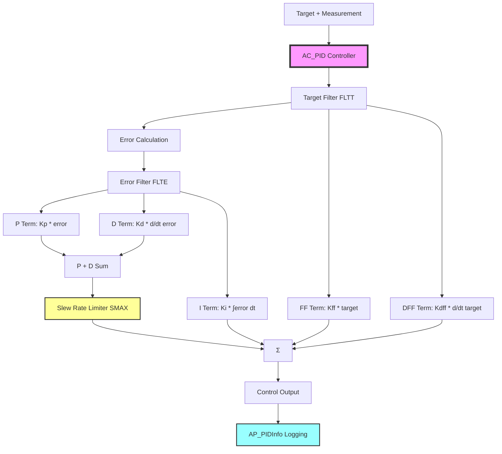

# AC_PID - Advanced PID Controllers for ArduPilot

## Overview

The AC_PID library provides advanced PID (Proportional-Integral-Derivative) controllers specifically designed for multicopter attitude and rate control in ArduPilot. This library extends beyond basic PID control with sophisticated features including input/error/derivative filtering, slew rate limiting, derivative feedforward, and optional notch filtering. AC_PID controllers are the primary control building blocks used in ArduCopter's attitude control system, position control, and various other feedback control loops throughout the ArduPilot autopilot.

The AC_PID family includes several variants optimized for different use cases: AC_PID (full-featured single-axis), AC_PID_2D (vectorized horizontal control), AC_PID_Basic (lightweight single-axis), and specialized controllers like AC_HELI_PID for helicopters. These controllers integrate seamlessly with ArduPilot's parameter system (AP_Param), logging infrastructure (AP_Logger), and AutoTune system for automated gain tuning.

## Architecture



## Key Components

### AC_PID (Full-Featured Controller)
- **Purpose**: General-purpose PID controller with all advanced features enabled
- **Location**: `libraries/AC_PID/AC_PID.h`, `AC_PID.cpp`
- **Typical Use**: Rate controllers (roll/pitch/yaw rates), velocity controllers, specialized control loops
- **Key Features**: Target filtering, error filtering, derivative filtering, slew rate limiting, optional notch filters, derivative feedforward, PD sum limiting, feedforward term

### AC_PID_2D (Vectorized 2D Controller)
- **Purpose**: 2D vectorized PID for horizontal position/velocity control
- **Location**: `libraries/AC_PID/AC_PID_2D.h`, `AC_PID_2D.cpp`
- **Typical Use**: Horizontal velocity control, horizontal position control
- **Key Features**: Vector-based control (Vector2f/Vector3f), directional integrator limiting, simultaneous X/Y axis control with coupled limiting

### AC_PID_Basic (Lightweight Controller)
- **Purpose**: Simplified PID without advanced features for less critical loops
- **Location**: `libraries/AC_PID/AC_PID_Basic.h`, `AC_PID_Basic.cpp`
- **Typical Use**: Secondary control loops, less demanding applications
- **Key Features**: Error and derivative filtering only, lower computational overhead, simplified parameter set

### AC_HELI_PID (Helicopter Variant)
- **Purpose**: Helicopter-specific PID with leaky integrator
- **Location**: `libraries/AC_PID/AC_HELI_PID.h`, `AC_HELI_PID.cpp`
- **Typical Use**: Traditional helicopter cyclic and collective control
- **Key Features**: Leaky integrator to prevent wind-up in aerodynamic control

### Simpler Controllers
- **AC_P / AC_PI**: Proportional-only and PI controllers without derivative term
- **AC_P_1D / AC_P_2D**: Position controllers with square root limiting (not PID, but related)
- **AC_PI_2D**: 2D vectorized PI controller

### AP_PIDInfo (Telemetry Structure)
- **Purpose**: Standardized structure for PID logging and telemetry
- **Location**: `libraries/AC_PID/AP_PIDInfo.h`
- **Contents**: Target, actual, error, P/I/D/FF/DFF terms, slew rate, limit flags, reset flags
- **Usage**: Logged to dataflash, sent via MAVLink for real-time monitoring

## ArduPilot-Specific Extensions

AC_PID extends standard PID control with several ArduPilot-specific innovations:

### 1. Advanced Multi-Stage Filtering

**Target Low-Pass Filter (FLTT)**
- Filters the input target before error calculation
- Reduces response to high-frequency target changes
- Smooths pilot inputs or guidance commands
- Parameter: `FLTT` (Hz), default 0 (disabled)
- Source: `libraries/AC_PID/AC_PID.cpp:242`

**Error Low-Pass Filter (FLTE)**
- Filters the error signal before P and I terms
- Reduces sensitivity to measurement noise
- Can add phase lag if set too low
- Parameter: `FLTE` (Hz), default 0 (disabled)
- Source: `libraries/AC_PID/AC_PID.cpp:250-252`

**Derivative Low-Pass Filter (FLTD)**
- Filters the derivative term to reduce noise amplification
- Critical for preventing derivative kick from measurement noise
- Parameter: `FLTD` (Hz), default 20 Hz
- Source: `libraries/AC_PID/AC_PID.cpp:264-266`

**Optional Notch Filters (when AP_FILTER_ENABLED)**
- Dynamically allocated notch filters for target and error signals
- Configured via `NTF` and `NEF` parameters (filter bank index 1-8)
- Attenuates specific frequency content (e.g., motor vibration, structural resonances)
- Uses AP_Filter API for centralized filter management
- Source: `libraries/AC_PID/AC_PID.cpp:158-191`

### 2. Slew Rate Limiting (SMAX)

The slew rate limiter is a unique ArduPilot innovation that dynamically reduces PD gain to respect output rate limits:

**Algorithm** (Source: `libraries/AC_PID/AC_PID.cpp:290-320`):
1. Compute raw P+D output
2. Calculate required slew rate for current output change
3. If slew rate exceeds SMAX, scale down PD gain
4. Minimum gain scaling: 10% of nominal (never reduces below this)
5. Apply scaled gain to respect slew limit

**Purpose**:
- Limits high-frequency control output changes
- Reduces oscillations from excessive gain
- Protects actuators from excessive rate demands
- Improves stability margins without sacrificing steady-state performance

**Configuration**:
- Parameter: `SMAX` (output units/second), default 0 (disabled)
- Related: `SRTAU` (time constant, not exposed in base AC_PID)
- Recommendation: Set SMAX ≤ 25% of actuator maximum slew rate

**Note**: Slew limiting affects only P+D terms, not the integrator or feedforward terms.

### 3. Derivative Feedforward (D_FF)

- Feedforward term proportional to rate of change of target
- Improves tracking performance for moving targets
- Anticipates required control action before error develops
- Parameter: `D_FF`, range 0-0.02, default 0
- Formula: `DFF_output = D_FF * d(target)/dt`
- Source: `libraries/AC_PID/AC_PID.cpp:229, 275-277`

**Use Cases**:
- Aggressive maneuver tracking
- Fast target following
- Reducing phase lag in tracking

### 4. PD Sum Limiting (PDMX)

- Maximum limit on combined P+D output (separate from integrator limit)
- Parameter: `PDMX`, default 0 (disabled)
- Prevents excessive combined P+D contribution
- Useful when P and D gains interact to create excessive output
- Independent from `IMAX` limiting
- Source: `libraries/AC_PID/AC_PID.cpp:334-337`

### 5. Directional Anti-Windup

AC_PID uses directional integrator limiting rather than simple clamping:

**Mechanism**:
- When `limit` flag is true, integrator can only shrink, not grow
- Integrator allowed to reduce even when saturated
- Prevents integrator wind-up during sustained saturation
- More sophisticated than simple clamping at IMAX
- Source: `libraries/AC_PID/AC_PID.cpp:406-421`

**Behavior**:
- `limit=false`: Integrator can grow and shrink normally, clamped to ±IMAX
- `limit=true`: Integrator can only move toward zero, helping to unwind during saturation

### 6. Square Root Controller (Note: Not in AC_PID itself)

**Important Clarification**: The square root controller is implemented in `AC_P_1D` and `AC_P_2D` position controllers, NOT in AC_PID rate/velocity controllers.

**Square Root Controller Characteristics** (AC_P_1D/AC_P_2D):
- Non-linear position controller that constrains output slope
- Enforces derivative and jerk limits through error clamping
- Used for position-to-velocity conversion
- NOT used in AC_PID rate controllers

AC_PID itself uses linear PID control. The square root limiting is a higher-level position control feature.

## Usage Patterns

### Basic AC_PID Usage

```cpp
#include <AC_PID/AC_PID.h>

// Initialize rate PID with gains (P, I, D, FF, IMAX, FLTT, FLTE, FLTD)
AC_PID rate_pid(1.0f,    // P gain
                0.01f,   // I gain
                0.2f,    // D gain
                0.0f,    // FF gain
                100.0f,  // IMAX
                0.0f,    // FLTT (disabled)
                0.0f,    // FLTE (disabled)
                20.0f);  // FLTD (20 Hz)

// Main control loop (e.g., 400Hz for copter)
void attitude_control_loop() {
    float target_rate = 30.0f;        // deg/s (from pilot or guidance)
    float actual_rate = gyro.rate();  // deg/s (from IMU)
    float dt = 0.0025f;               // seconds (400Hz = 2.5ms)
    
    // Compute PID output
    float output = rate_pid.update_all(target_rate, actual_rate, dt);
    
    // Apply to motors (output typically in -1 to +1 range or similar)
    motors.set_roll(output);
    
    // Access PID info for logging
    const AP_PIDInfo& info = rate_pid.get_pid_info();
    logger.log_pid(info);
}
```

### AC_PID with Slew Rate Limiting

```cpp
// Initialize with slew rate limiting enabled
AC_PID rate_pid(1.5f,    // P gain
                0.05f,   // I gain
                0.3f,    // D gain
                0.0f,    // FF gain
                150.0f,  // IMAX
                0.0f,    // FLTT
                0.0f,    // FLTE
                20.0f,   // FLTD
                50.0f);  // SMAX (slew rate limit, deg/s/s)

// Update call is identical - slew limiting applied internally
float output = rate_pid.update_all(target_rate, actual_rate, dt);

// Check actual slew rate applied
float slew = rate_pid.get_slew_rate();
```

### AC_PID_2D for Horizontal Control

```cpp
#include <AC_PID/AC_PID_2D.h>

// Initialize 2D velocity PID (P, I, D, FF, IMAX, FLTE, FLTD)
AC_PID_2D vel_pid(1.5f,   // P gain
                  0.5f,   // I gain
                  0.0f,   // D gain
                  0.0f,   // FF gain
                  100.0f, // IMAX
                  2.0f,   // FLTE (2 Hz)
                  5.0f);  // FLTD (5 Hz)

// Update in control loop
void horizontal_velocity_control() {
    Vector2f target_vel(2.0f, 1.0f);    // m/s (north, east)
    Vector2f actual_vel = inav.velocity_NE();  // m/s from EKF
    float dt = 0.01f;                    // seconds (100Hz)
    Vector2f limit(0.0f, 0.0f);         // no saturation currently
    
    // Compute 2D PID correction
    Vector2f accel_correction = vel_pid.update_all(target_vel, actual_vel, dt, limit);
    
    // Apply to attitude targets
    attitude_control.input_accel_NE(accel_correction);
    
    // Access separate X and Y PID info for logging
    const AP_PIDInfo& info_x = vel_pid.get_pid_info_x();
    const AP_PIDInfo& info_y = vel_pid.get_pid_info_y();
}
```

### Integrator Management

```cpp
// Full reset to zero (during mode changes)
rate_pid.reset_I();

// Set integrator directly (with IMAX clamping)
rate_pid.set_integrator(50.0f);  // Sets I term to 50.0, clamped to ±IMAX

// Gradually relax integrator toward target value
float target_integrator = 20.0f;
float time_constant = 0.5f;  // seconds
rate_pid.relax_integrator(target_integrator, dt, time_constant);

// Reset filters (on mode changes to avoid transients)
rate_pid.reset_filter();  // Resets on next update_all() call
```

### Integration with AutoTune

```cpp
// AutoTune workflow with AC_PID
class AutoTune {
    AC_PID* pid_ptr;
    
    void start_tuning() {
        // Save current gains before tuning
        pid_ptr->save_gains();
        
        // Begin tuning process...
    }
    
    void apply_new_gains(float new_p, float new_i, float new_d) {
        // Update gains during tuning
        pid_ptr->kP().set(new_p);
        pid_ptr->kI().set(new_i);
        pid_ptr->kD().set(new_d);
    }
    
    void finish_tuning() {
        // Gains automatically saved to EEPROM via AP_Param
        // No explicit save needed - parameters persist automatically
    }
};
```

## Configuration Parameters

AC_PID controllers expose the following parameters via AP_Param (accessible through ground control stations):

| Parameter | Description | Default | Range | Units | Notes |
|-----------|-------------|---------|-------|-------|-------|
| P | Proportional gain | varies | 0-10 | dimensionless or 1/s | Higher P increases response, can cause oscillations |
| I | Integral gain | varies | 0-1 | 1/s | Eliminates steady-state error, can cause overshoot |
| D | Derivative gain | varies | 0-1 | s | Dampens oscillations, sensitive to noise |
| FF | Feedforward gain | 0 | 0-1 | dimensionless | Improves tracking, bypasses PID loop |
| IMAX | Integrator maximum | varies | 0-10000 | output units | Prevents integrator wind-up |
| FLTT | Target filter frequency | 0 | 0-100 | Hz | 0 = disabled, smooths target input |
| FLTE | Error filter frequency | 0 | 0-100 | Hz | 0 = disabled, reduces noise sensitivity |
| FLTD | Derivative filter frequency | 20 | 0-100 | Hz | Critical for noise rejection on D term |
| SMAX | Slew rate maximum | 0 | 0-200 | output/s | 0 = disabled, limits output rate of change |
| PDMX | PD sum maximum | 0 | 0-10000 | output units | 0 = disabled, independent from IMAX |
| D_FF | Derivative feedforward | 0 | 0-0.02 | dimensionless | Advanced feature for aggressive tracking |
| NTF | Target notch filter index | 0 | 0-8 | - | 0 = disabled, requires AP_FILTER_ENABLED |
| NEF | Error notch filter index | 0 | 0-8 | - | 0 = disabled, requires AP_FILTER_ENABLED |

**Parameter Naming Convention**: In vehicle code, parameters are prefixed with the controller name, e.g., `ATC_RAT_RLL_P` for roll rate P gain.

## Differences from Basic PID Library

The AC_PID library provides significant enhancements over the legacy PID library (`libraries/PID/`):

| Feature | PID (libraries/PID) | AC_PID (libraries/AC_PID) |
|---------|---------------------|---------------------------|
| **Target filtering** | No | Yes (FLTT parameter) |
| **Error filtering** | Fixed 20Hz low-pass | Configurable (FLTE parameter) |
| **Derivative filtering** | Fixed 20Hz low-pass | Configurable (FLTD parameter) |
| **Slew rate limiting** | No | Yes (SMAX parameter with dynamic gain scaling) |
| **Notch filters** | No | Optional (NTF/NEF when AP_FILTER_ENABLED) |
| **Derivative feedforward** | No | Yes (D_FF parameter) |
| **PD sum limiting** | No | Yes (PDMX parameter) |
| **Feedforward term** | No | Yes (FF parameter) |
| **Directional anti-windup** | Simple clamping | Yes (directional integrator limiting) |
| **2D vectorized version** | No | Yes (AC_PID_2D) |
| **Modern AP_Param integration** | Basic | Full integration with defaults |
| **Logging structure** | AP_PIDInfo | Enhanced AP_PIDInfo with more fields |
| **Update API** | `get_pid(error, scaler)` | `update_all(target, measurement, dt)` |
| **Time handling** | Internal millis() sampling | External dt (more flexible) |
| **Typical use case** | Legacy fixed-wing | Modern multicopter and all vehicles |
| **Maintenance status** | Legacy | Actively maintained |

**Migration Note**: New development should use AC_PID family. The basic PID library is retained for backward compatibility but not recommended for new applications.

## Logging and Telemetry

### AP_PIDInfo Structure

AC_PID populates an `AP_PIDInfo` structure for comprehensive logging and real-time monitoring:

```cpp
struct AP_PIDInfo {
    float target;       // Desired value (input to PID)
    float actual;       // Measured value (input to PID)
    float error;        // target - actual (after filtering if FLTE>0)
    float P;            // Proportional term output
    float I;            // Integral term output (current integrator value)
    float D;            // Derivative term output
    float FF;           // Feedforward term output
    float DFF;          // Derivative feedforward output
    float Dmod;         // Derivative modification (e.g., from notch filter)
    float slew_rate;    // Current slew rate (if SMAX enabled)
    bool limit;         // Integrator limit active flag
    bool PD_limit;      // PD sum limit active flag (if PDMX enabled)
    bool reset;         // Filter reset occurred this iteration
    bool I_term_set;    // Integrator externally set flag
};
```

Source: `libraries/AC_PID/AP_PIDInfo.h`

### Accessing PID Info for Logging

```cpp
// Get PID info structure (single-axis)
const AP_PIDInfo& info = rate_pid.get_pid_info();

// Log to dataflash
logger.Write_PID(LOG_PIDR_MSG, info);

// For 2D controllers, access X and Y separately
const AP_PIDInfo& info_x = vel_pid.get_pid_info_x();
const AP_PIDInfo& info_y = vel_pid.get_pid_info_y();
```

### Dataflash Log Messages

AC_PID data is logged to ArduPilot binary logs in PID-specific messages:
- **PIDR**: Roll rate PID
- **PIDP**: Pitch rate PID
- **PIDY**: Yaw rate PID
- **PIDN**: North velocity PID (2D)
- **PIDE**: East velocity PID (2D)
- **PIDD**: Down velocity PID

Each message contains all AP_PIDInfo fields for post-flight analysis.

## Safety Considerations

### Main Loop Rate Requirements

**Critical**: AC_PID assumes accurate `dt` (delta time) parameter.

- **Typical Rates**: 400Hz for copter rate loops, 100Hz for position loops, 50Hz for slower loops
- **Consequences of Incorrect dt**: 
  - Integration errors in I term
  - Derivative calculation errors
  - Filter behavior changes
  - Slew rate miscalculation
- **Best Practice**: Pass actual measured dt from scheduler, not assumed values

Source: `libraries/AC_PID/AC_PID.cpp:196-201` (dt used throughout update_all)

### Slew Rate Limit Configuration

**Recommendation**: Set `SMAX ≤ 25% of actuator maximum slew rate`

**Reasoning**:
- Allows headroom for external loads and disturbances
- Prevents actuator saturation
- Maintains control authority for disturbance rejection
- Slew limiter will never reduce gain below 10% of nominal

**Warning**: Excessive slew rate limiting can reduce disturbance rejection capability.

### Gain Limit Safety

**High Gain Risks**:
- Excessive P gain → High-frequency oscillations, potential instability
- Excessive I gain → Overshoot, slow settling, integrator wind-up
- Excessive D gain → Noise amplification, high-frequency oscillations

**Tuning Best Practices**:
1. Use AutoTune for initial gains
2. Manual tuning: Increase P until slight oscillation, then back off 25%
3. Add D to dampen oscillations
4. Add I to eliminate steady-state error
5. Monitor PID log messages for saturation and oscillations

### Filter Frequency Guidelines

**Low Filter Frequencies Add Phase Lag**:
- Phase lag reduces stability margins
- Can cause oscillations even with moderate gains
- General guideline: Keep filter frequencies > 10Hz unless necessary

**Derivative Filter (FLTD)**:
- Default 20Hz is conservative and works well for most applications
- Lower values (10-15Hz) for very noisy sensors
- Higher values (30-40Hz) for clean sensors and aggressive tuning

### Integrator Limit (IMAX)

**Purpose**: Prevent excessive integrator buildup

**Setting IMAX**:
- Too small: Cannot correct steady-state errors
- Too large: Slow response to changing conditions, overshoot
- Typical: Set IMAX to produce 20-50% of maximum control output
- Monitor I term in logs to verify IMAX is appropriate

### Thread Safety

**Vehicle Code Pattern**:
```cpp
// AC_PID is NOT thread-safe by itself
// Vehicle code must use semaphores for protection

WITH_SEMAPHORE(control_semaphore);
float output = rate_pid.update_all(target, actual, dt);
```

AC_PID does not contain internal locking. Caller must ensure thread-safe access when used from multiple threads.

## Testing

### Unit Testing with Example Program

Build and run the AC_PID example:

```bash
# Configure for SITL
./waf configure --board sitl

# Build AC_PID test example
./waf build --target examples/AC_PID_test

# Run example
./build/sitl/examples/AC_PID_test
```

**Example Behavior**:
- Reads RC input channels
- Applies AC_PID to RC input
- Prints P/I/D component values to console
- Useful for understanding PID behavior interactively

Source: `libraries/AC_PID/examples/AC_PID_test/AC_PID_test.cpp`

### SITL Testing

Test AC_PID in Software-In-The-Loop simulation:

```bash
# Start Copter SITL with console and map
sim_vehicle.py -v ArduCopter --console --map

# Enable comprehensive PID logging
param set LOG_BITMASK 524287

# Arm and fly
mode guided
arm throttle
takeoff 10

# Perform test maneuvers
rc 1 1800  # Roll right
rc 2 1200  # Pitch forward

# Land and analyze logs
mode land
```

### Log Analysis for Tuning

#### Using MAVExplorer

```bash
# Open log in MAVExplorer
MAVExplorer.py flight.bin

# Graph roll rate PID components
graph PIDR.Des PIDR.P PIDR.I PIDR.D PIDR.FF PIDR.Act

# Check for issues:
# - Oscillations: P or D too high, increase FLTD
# - Tracking error: Increase P, check IMAX sufficient
# - I term saturation: Check PIDR.limit flag, adjust IMAX
# - Excessive slew: Check PIDR.slew_rate, adjust SMAX
```

#### Using Mission Planner

1. Load log file
2. Navigate to "Dataflash Log" screen
3. Graph PIDR/PIDP/PIDY messages
4. Check for:
   - **Oscillations**: Regular high-frequency variations in Act vs Des
   - **Tracking Error**: Consistent offset between Act and Des
   - **Integrator Wind-up**: I term at IMAX limit (`limit=true`)
   - **Saturation**: PD_limit flag true (PDMX limiting active)

#### Command-Line Analysis

```bash
# Extract PID data from log
mavlogdump.py --type PIDR flight.bin > pidr.txt

# Analyze in spreadsheet or custom scripts
# Look for patterns in P/I/D terms relative to error
```

### Performance Metrics

**Good PID Performance Indicators**:
- Actual tracks desired with minimal lag (<50ms for rate control)
- Minimal overshoot (<10%)
- Quick settling time (<0.5s for rate control)
- I term stays well below IMAX (except during sustained errors)
- Slew rate below SMAX limit (except during aggressive maneuvers)
- No sustained oscillations

**Problem Indicators**:
- Regular oscillations → Reduce P or D, increase FLTD
- Slow tracking → Increase P
- Steady-state error → Increase I, check IMAX
- Overshoot → Reduce I, add D
- Noisy output → Increase filter frequencies (FLTE, FLTD)

## Integration with Flight Controllers

### AC_AttitudeControl Integration

AC_AttitudeControl is the primary user of AC_PID for multicopter rate control:

```cpp
// From libraries/AC_AttitudeControl/AC_AttitudeControl.h
class AC_AttitudeControl {
protected:
    // Rate PIDs for each axis
    AC_PID _pid_rate_roll;
    AC_PID _pid_rate_pitch;
    AC_PID _pid_rate_yaw;
    
public:
    // Called from attitude_control_run() in main loop
    void rate_controller_run() {
        // Get desired rates from angle controllers or pilot input
        Vector3f rate_target = get_rate_target();
        
        // Get actual rates from IMU/AHRS
        Vector3f gyro_rate = _ahrs.get_gyro();
        
        // Update rate PIDs (typically 400Hz)
        float roll_output = _pid_rate_roll.update_all(
            rate_target.x, gyro_rate.x, _dt, 
            _motors.limit.roll);
            
        float pitch_output = _pid_rate_pitch.update_all(
            rate_target.y, gyro_rate.y, _dt,
            _motors.limit.pitch);
            
        float yaw_output = _pid_rate_yaw.update_all(
            rate_target.z, gyro_rate.z, _dt,
            _motors.limit.yaw);
        
        // Apply to motor mixing
        _motors.set_roll(roll_output);
        _motors.set_pitch(pitch_output);
        _motors.set_yaw(yaw_output);
    }
};
```

**Integration Pattern**:
- Rate PIDs updated at main loop rate (400Hz for copters)
- `limit` flag from motor library indicates saturation
- Prevents integrator wind-up when motors saturated
- Rate targets come from angle PIDs or direct pilot input

Source: Typical pattern from `libraries/AC_AttitudeControl/AC_AttitudeControl.cpp`

### AC_PosControl Integration

AC_PosControl uses AC_PID and AC_PID_2D for velocity control:

```cpp
// From libraries/AC_PosControl/AC_PosControl.h
class AC_PosControl {
protected:
    // Velocity PIDs
    AC_PID_2D _pid_vel_xy;  // Horizontal velocity (2D)
    AC_PID _pid_vel_z;      // Vertical velocity (1D)
    AC_PID _pid_accel_z;    // Vertical acceleration
    
public:
    // Velocity controller to acceleration
    void update_vel_controller_xy() {
        // Get velocity target and actual from EKF
        Vector2f vel_target, vel_actual;
        get_vel_target_and_actual(vel_target, vel_actual);
        
        // Determine saturation limits from attitude controller
        Vector2f accel_limit;
        get_lean_angle_limits(accel_limit);
        
        // Update 2D velocity PID
        Vector2f accel_target = _pid_vel_xy.update_all(
            vel_target, vel_actual, _dt, accel_limit);
        
        // Convert to attitude targets
        _attitude_control.input_thrust_vector_heading(
            accel_target, _yaw_target);
    }
};
```

**Integration Pattern**:
- Velocity PIDs updated at position loop rate (typically 100Hz)
- 2D PID outputs desired acceleration vector
- Integrator limiting based on available lean angle
- Feeds into attitude control system

Source: Typical pattern from `libraries/AC_PosControl/AC_PosControl.cpp`

### Parameter Integration

AC_PID parameters are stored via AP_Param and exposed in ground control stations:

```cpp
// In vehicle Parameters.cpp
// @Param: ATC_RAT_RLL_P
// @DisplayName: Roll axis rate controller P gain
// @Description: Roll axis rate controller P gain.  Converts the difference between desired roll rate and actual roll rate into a motor speed output
// @Range: 0.0 0.30
// @Increment: 0.005
// @User: Standard

// @Param: ATC_RAT_RLL_I  
// @DisplayName: Roll axis rate controller I gain
// @Description: Roll axis rate controller I gain.  Corrects long-term difference in desired roll rate vs actual roll rate
// @Range: 0.0 0.6
// @Increment: 0.01
// @User: Standard

// And so on for all PID parameters...
```

**Parameter Naming**: `<subsystem>_<axis>_<param>`, e.g., `ATC_RAT_RLL_P` for attitude control, rate, roll, P gain.

## Implementation Notes

### Filter Initialization and Reset

**Filter Reset Mechanism**:
- `reset_filter()` sets internal flag `_flags._reset_filter = true`
- Next call to `update_all()` reinitializes all filters with current input
- Prevents transients from stale filter state after mode changes

Source: `libraries/AC_PID/AC_PID.cpp:206-230`

```cpp
void some_mode_enter() {
    // Reset filters when entering new mode
    rate_pid.reset_filter();
    
    // Next update_all() will initialize filters with current values
}
```

**Filter State Initialization**:
- Target filter initialized to current target
- Error filter initialized to current error (target - measurement)
- Derivative initialized to zero to avoid spikes
- Notch filters reset if enabled

### Integrator Management Strategies

**1. Full Reset** - Mode changes, emergency stops:
```cpp
rate_pid.reset_I();  // Sets integrator to zero
```

**2. Direct Setting** - Known initial conditions:
```cpp
rate_pid.set_integrator(initial_value);  // Clamped to ±IMAX
```

**3. Gradual Relaxation** - Smooth transitions:
```cpp
// Gradually move integrator toward target over time constant
rate_pid.relax_integrator(target_integrator, dt, time_constant);
```

Source: `libraries/AC_PID/AC_PID.cpp:423-433`

**4. Directional Limiting** - During saturation:
```cpp
// Update with limit flag to prevent wind-up
float output = rate_pid.update_all(target, measurement, dt, 
                                    motors_saturated);  // limit=true
```

When `limit=true`, integrator can only shrink, preventing wind-up during sustained saturation.

Source: `libraries/AC_PID/AC_PID.cpp:406-421`

### Slew Limiter Operation Details

The slew limiter dynamically adjusts PD gain to respect output rate limits:

**Algorithm** (Source: `libraries/AC_PID/AC_PID.cpp:290-320`):

```cpp
// Pseudocode for slew limiting algorithm
float pd_output = P_term + D_term;
float output_change = pd_output - previous_output;
float required_slew_rate = abs(output_change / dt);

if (SMAX > 0 && required_slew_rate > SMAX) {
    // Calculate scale factor to respect slew limit
    float scale = SMAX / required_slew_rate;
    
    // Never scale below 10% of nominal
    scale = max(scale, 0.1f);
    
    // Apply scale to PD terms
    P_term *= scale;
    D_term *= scale;
    pd_output = P_term + D_term;
}

// Integrator and FF terms not affected by slew limiting
final_output = pd_output + I_term + FF_term + DFF_term;
```

**Key Points**:
- Only P and D terms are scaled
- Integrator (I) and feedforward (FF, DFF) terms unaffected
- Minimum 10% gain retained for low-frequency control
- Slew rate logged in AP_PIDInfo for analysis

### Notch Filter Setup and Operation

When `AP_FILTER_ENABLED` is defined, AC_PID supports optional notch filters:

**Setup Process** (Source: `libraries/AC_PID/AC_PID.cpp:158-191`):

```cpp
// Called during initialization with control loop sample rate
void AC_PID::set_notch_sample_rate(float sample_rate) {
    // If NTF parameter set (1-8), allocate target notch filter
    if (_notch_T_filter > 0) {
        _target_notch = NEW_NOTHROW NotchFilterFloat();
        
        // Lookup filter definition from global filter bank
        AP_Filter* filter = AP::filters().get_filter(_notch_T_filter);
        
        // Initialize with sample rate
        filter->setup_notch_filter(*_target_notch, sample_rate);
    }
    
    // Similar for error notch filter (NEF parameter)
}
```

**Application in update_all()** (Source: `libraries/AC_PID/AC_PID.cpp:212-226, 236-250`):
- Target notch applied before target low-pass filter
- Error notch applied before error low-pass filter
- Notch filters attenuate specific frequencies (e.g., motor vibration)
- Centrally configured via AP_Filter system

### AP_Param Integration

AC_PID uses AP_Param for persistent parameter storage:

**Parameter Table** (Source: `libraries/AC_PID/AC_PID.cpp:9-100`):
```cpp
const AP_Param::GroupInfo AC_PID::var_info[] = {
    AP_GROUPINFO_FLAGS_DEFAULT_POINTER("P", 0, AC_PID, _kp, default_kp),
    AP_GROUPINFO_FLAGS_DEFAULT_POINTER("I", 1, AC_PID, _ki, default_ki),
    // ... more parameters
    AP_GROUPEND
};
```

**Default Pointer Mechanism**:
- Constructor initializes `default_kp`, `default_ki`, etc.
- AP_Param uses these defaults if EEPROM value not set
- Allows code-specified defaults while supporting user overrides

## Design Decisions and Rationale

### Why Separate Target and Error Filters?

**Rationale**:
- Target filtering smooths command input (pilot or guidance)
- Error filtering reduces measurement noise sensitivity
- Different optimal frequencies for each
- Flexibility for various applications

### Why Slew Rate Limiting Instead of Output Limiting?

**Advantage of Slew Limiting**:
- Preserves low-frequency control authority
- Only reduces high-frequency gain causing problems
- Better than simple output clamping which affects all frequencies
- Maintains proportional control even when limited

**Output Limiting Problems**:
- Hard saturation creates non-linearities
- Loss of control authority at limit
- Integrator wind-up issues

### Why Directional Integrator Limiting?

**Simple Clamping Problem**:
- Integrator frozen at limit during saturation
- Cannot unwind even when should decrease
- Slow recovery from saturation

**Directional Limiting Advantage**:
- Integrator can shrink even when at limit
- Faster recovery from saturation
- Better handling of sustained errors

### Why External dt Instead of Internal Timing?

**Advantages**:
- Caller controls timing precision
- Works with variable-rate schedulers
- No hidden millis() calls
- More testable and deterministic
- Supports non-real-time simulation

**Legacy PID Issue**:
- Internal millis() sampling
- Hidden state and timing
- Difficult to test deterministically

## Known Limitations

### Computational Overhead

AC_PID is more computationally expensive than basic PID:
- Multiple filter operations per update
- Slew rate calculations
- Optional notch filters
- Use AC_PID_Basic for less critical loops if CPU constrained

### Filter Phase Lag

Low-pass filters add phase lag:
- Reduces stability margins
- Can limit achievable bandwidth
- Trade-off between noise rejection and performance
- Careful filter tuning required

### Slew Rate Limiting Interactions

Slew limiting can interact with tuning:
- May hide gain problems during slow maneuvers
- Can reduce disturbance rejection if set too aggressively
- Requires understanding for proper tuning
- Monitor slew_rate in logs during tuning

### No Built-in Anti-Aliasing

AC_PID assumes input signals are adequately filtered:
- High-frequency noise in measurement can alias
- Sensor drivers should provide appropriate filtering
- Consider increasing FLTE or FLTD if aliasing suspected

## Related Modules

- **AC_AttitudeControl** (`libraries/AC_AttitudeControl/`): Primary user of AC_PID for rate controllers
- **AC_PosControl** (`libraries/AC_PosControl/`): Uses AC_PID and AC_PID_2D for velocity controllers
- **AC_AutoTune** (`libraries/AC_AutoTune/`): Automated tuning system for AC_PID gains
- **PID** (`libraries/PID/`): Legacy basic PID library (not recommended for new code)
- **Filter** (`libraries/Filter/`): Low-pass, notch, and other filter implementations used by AC_PID
- **AP_Param** (`libraries/AP_Param/`): Parameter storage and management system
- **AP_Logger** (`libraries/AP_Logger/`): Logging system for PID telemetry
- **AP_Filter** (`libraries/AP_Filter/`): Centralized notch filter management (when AP_FILTER_ENABLED)
- **SlewLimiter** (`libraries/Filter/SlewLimiter.h`): Slew rate limiting implementation

## Further Reading

### ArduPilot Documentation
- **Attitude Control Architecture**: https://ardupilot.org/dev/docs/apmcopter-programming-attitude-control-2.html
- **PID Tuning Guide**: https://ardupilot.org/copter/docs/tuning.html
- **AutoTune Documentation**: https://ardupilot.org/copter/docs/autotune.html
- **Log Analysis Guide**: https://ardupilot.org/copter/docs/common-logs.html
- **Developer Wiki**: https://ardupilot.org/dev/

### Control Theory References
- **PID Control Wikipedia**: https://en.wikipedia.org/wiki/PID_controller
- **Digital Filter Design**: Understanding low-pass filter alpha calculation and phase lag
- **Anti-Windup Techniques**: Research on integrator management strategies

### Source Code References
- **AC_PID Implementation**: `libraries/AC_PID/AC_PID.cpp`
- **AC_PID_2D Implementation**: `libraries/AC_PID/AC_PID_2D.cpp`
- **Usage Examples**: `libraries/AC_AttitudeControl/`, `libraries/AC_PosControl/`
- **Test Example**: `libraries/AC_PID/examples/AC_PID_test/`

## Source Files

### Primary Implementation
- **AC_PID.h**: Main header with class definition, parameters, and interface
- **AC_PID.cpp**: Implementation of update algorithms, filtering, slew limiting
- **AC_PID_2D.h**: 2D vectorized PID header
- **AC_PID_2D.cpp**: 2D vectorized PID implementation
- **AC_PID_Basic.h**: Lightweight PID header
- **AC_PID_Basic.cpp**: Lightweight PID implementation

### Supporting Files
- **AP_PIDInfo.h**: Telemetry structure definition for logging
- **AC_HELI_PID.h/.cpp**: Helicopter-specific leaky integrator variant
- **AC_P.h/.cpp**: Proportional-only controller
- **AC_PI.h/.cpp**: Proportional-integral controller
- **AC_PI_2D.h/.cpp**: 2D vectorized PI controller
- **AC_P_1D.h/.cpp**: 1D position controller with square root limiting
- **AC_P_2D.h/.cpp**: 2D position controller with square root limiting

### Examples and Tests
- **examples/AC_PID_test/AC_PID_test.cpp**: Interactive test example with RC input

### File Locations
All files located in: `libraries/AC_PID/`

---

**Last Updated**: 2025 (based on ArduPilot master branch)

**Maintainers**: ArduPilot Development Team

**License**: GPLv3 (see LICENSE.txt in repository root)

**Contributing**: See CONTRIBUTING.md in repository root for contribution guidelines. All new PID controllers should follow AC_PID patterns and integrate with AP_Param for parameter storage.
