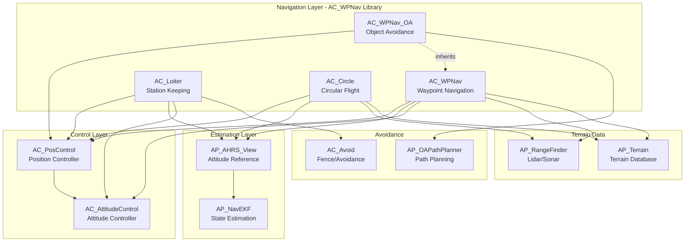
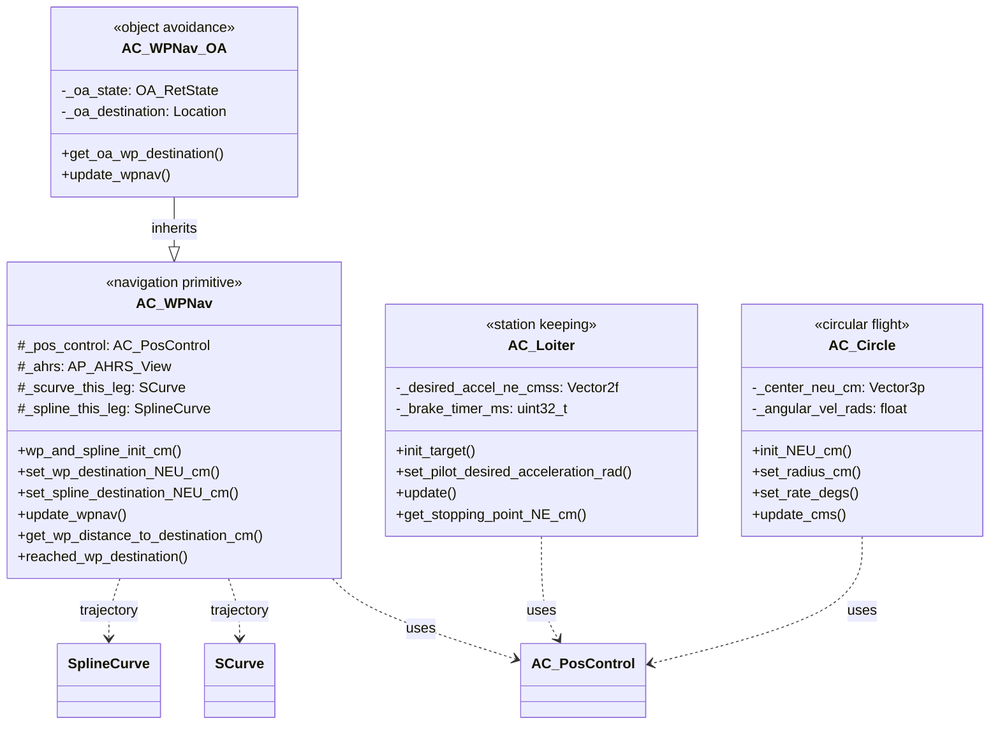
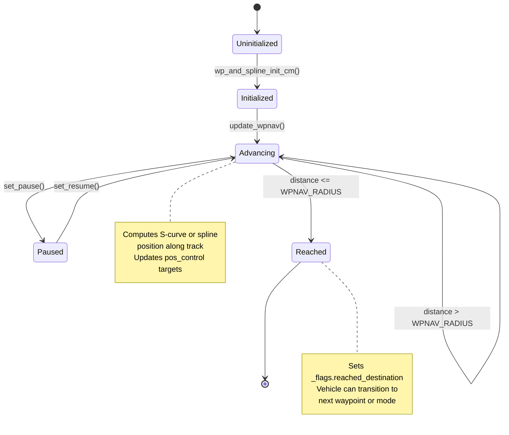
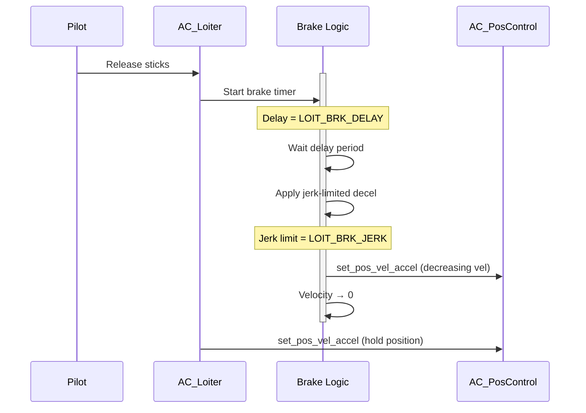
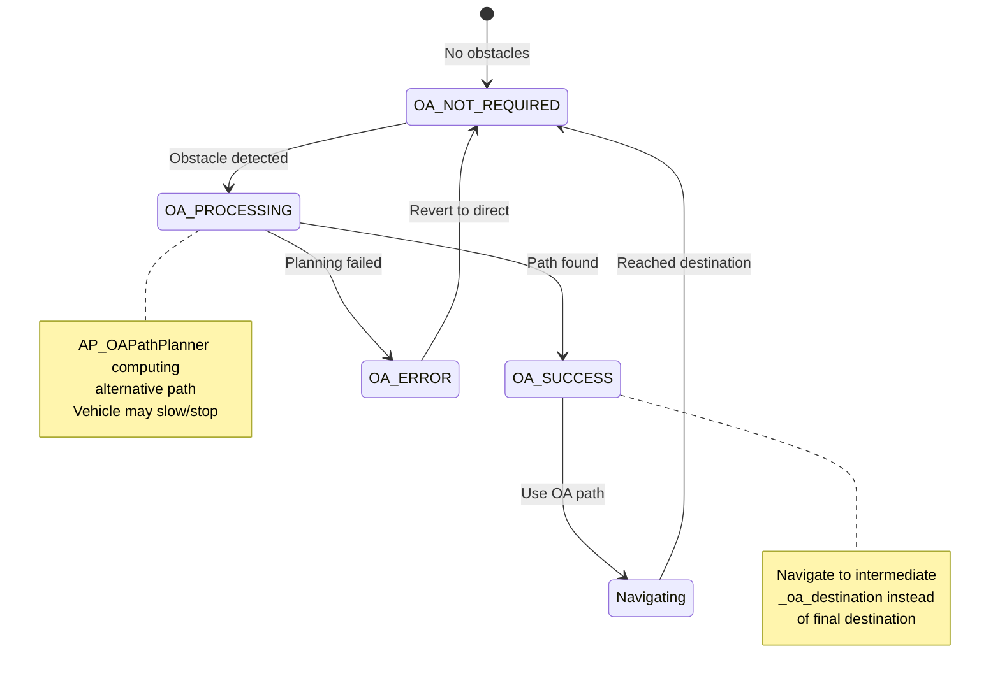
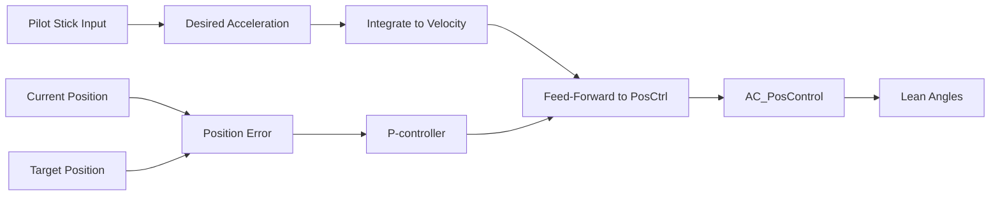

# AC_WPNav Library


## Table of Contents
- [Overview](#overview)
- [Architecture](#architecture)
- [Core Components](#core-components)
  - [AC_WPNav - Waypoint Navigation](#ac_wpnav---waypoint-navigation)
  - [AC_Loiter - Station Keeping](#ac_loiter---station-keeping)
  - [AC_Circle - Circular Flight](#ac_circle---circular-flight)
  - [AC_WPNav_OA - Object Avoidance](#ac_wpnav_oa---object-avoidance)
- [Position Controller Integration](#position-controller-integration)
- [Path Planning Algorithms](#path-planning-algorithms)
- [Speed Control](#speed-control)
- [Arrival Detection](#arrival-detection)
- [Loiter Patterns](#loiter-patterns)
- [API Reference](#api-reference)
- [Configuration Parameters](#configuration-parameters)
- [Tuning Guide](#tuning-guide)
- [Integration Examples](#integration-examples)
- [Testing](#testing)

## Overview

The AC_WPNav library provides high-level waypoint navigation and station-keeping primitives for ArduPilot autopilot systems. This safety-critical library implements smooth trajectory generation, loiter control, and circular flight patterns used across multiple vehicle types (Copter, Plane QuadPlane, Rover).

**Source Files**: `libraries/AC_WPNav/`

### Key Capabilities

- **Smooth Trajectory Generation**: S-curve and spline-based paths with jerk and snap limiting
- **Waypoint Navigation**: Point-to-point navigation with configurable speeds and acceleration limits
- **Station Keeping**: Precision loiter with predictive feed-forward and braking dynamics
- **Circular Flight**: Constant-radius orbits with configurable angular rates
- **Terrain Following**: Integration with rangefinder and terrain database for altitude-above-terrain navigation
- **Object Avoidance**: Optional integration with AP_OAPathPlanner for dynamic obstacle avoidance
- **Real-Time Performance**: Designed for execution at 100+ Hz update rates

### Design Philosophy

The AC_WPNav library transforms high-level navigation commands into continuous position/velocity/acceleration targets for the lower-level position controller (AC_PosControl). It sits between mission planning logic and attitude/position control:

```
Mission Commands → AC_WPNav → AC_PosControl → AC_AttitudeControl → Motors
```

All navigation primitives:
- Respect vehicle dynamics limits (speed, acceleration, jerk)
- Maintain real-time constraints (< 1ms per update cycle)
- Provide smooth, continuous setpoints without discontinuities
- Support terrain-relative and absolute altitude frames
- Include safety interlocks and error handling

## Architecture

### System Relationship Diagram



### Class Hierarchy



### Data Flow

The typical navigation cycle follows this sequence:

1. **Initialization**: Vehicle mode calls `init()` or `init_target()` on the navigation primitive
2. **Target Setting**: Mission logic sets destination via `set_wp_destination_*()` or `set_center_*()` methods
3. **Update Loop** (100-400 Hz):
   - Navigation primitive computes intermediate target position/velocity/acceleration
   - Calls `AC_PosControl::set_pos_vel_accel_NEU_cm()` with targets
   - Position controller converts to desired lean angles
   - Returns roll/pitch/yaw angles via getters
4. **Status Monitoring**: Vehicle checks `reached_destination()`, `get_distance_to_target()`, etc.

### Coordinate Systems

**Source**: `libraries/AC_WPNav/AC_WPNav.h:94-95`, `AC_Circle.h:35`

The library uses **NEU** (North-East-Up) coordinate frame with the EKF origin as reference:
- **Units**: Centimeters (cm, cm/s, cm/s²)
- **X-axis**: North from EKF origin
- **Y-axis**: East from EKF origin  
- **Z-axis**: Up from EKF origin OR altitude above terrain (when `is_terrain_alt = true`)

All public APIs use NEU coordinates. Helper functions provide conversion to/from:
- NED (North-East-Down) in meters for Location-based APIs
- Global Location (Lat/Lon/Alt)

## Core Components

### AC_WPNav - Waypoint Navigation

**Source**: `libraries/AC_WPNav/AC_WPNav.h`, `AC_WPNav.cpp`

The primary waypoint navigation controller generates smooth trajectories between origin and destination points.

#### Responsibilities

- **Point-to-Point Navigation**: Straight-line segments between waypoints
- **Spline Trajectories**: Smooth curves through sequential waypoints
- **S-Curve Velocity Profiles**: Jerk-limited acceleration with configurable snap
- **Terrain Following**: Maintain altitude above terrain using rangefinder or terrain database
- **Speed Management**: Enforce horizontal and vertical speed limits
- **Corner Blending**: Smooth transitions between consecutive waypoint legs

#### Key Algorithms

**S-Curve Trajectory Generation** (`libraries/AC_WPNav/AC_WPNav.cpp:calc_scurve_jerk_and_snap()`)

The S-curve algorithm produces jerk-limited trajectories that respect:
- Maximum velocity (WPNAV_SPEED)
- Maximum acceleration (WPNAV_ACCEL)
- Maximum jerk (WPNAV_JERK) - limits rate of acceleration change
- Maximum snap (derived from attitude slew rate) - limits rate of jerk change

Trajectory is computed using AP_Math::SCurve class which calculates position, velocity, and acceleration at each timestep.

**Spline Curve Generation** (`libraries/AC_WPNav/AC_WPNav.h:284`)

When multiple waypoints form a path, spline interpolation creates smooth curves:
- Uses AP_Math::SplineCurve for cubic spline computation
- Requires current waypoint, next waypoint, and lookahead waypoint
- Blends entry velocity from previous leg with exit velocity to next leg
- Eliminates sharp corners that would require vehicle to stop

**Terrain Following** (`libraries/AC_WPNav/AC_WPNav.cpp:get_terrain_offset_cm()`)

Priority order for terrain altitude sources:
1. Rangefinder (if `WPNAV_RFND_USE = 1` and sensor healthy)
2. AP_Terrain database (if compiled and terrain data available)
3. Altitude-above-EKF-origin (fallback)

When terrain altitude is unavailable and required, waypoint advancement pauses to prevent terrain collision.

#### State Management



**Source**: `libraries/AC_WPNav/AC_WPNav.h:244-248`

Flags structure tracks navigation state:
```cpp
struct wpnav_flags {
    uint8_t reached_destination : 1;  // Within WPNAV_RADIUS of target
    uint8_t fast_waypoint       : 1;  // Skip radius check, complete when intermediate target reaches waypoint
    uint8_t wp_yaw_set          : 1;  // Yaw target explicitly set
};
```

### AC_Loiter - Station Keeping

**Source**: `libraries/AC_WPNav/AC_Loiter.h`, `AC_Loiter.cpp`

Precision position hold with pilot input and intelligent braking.

#### Responsibilities

- **Position Hold**: Maintain GPS position with minimal drift
- **Pilot Input Translation**: Convert stick inputs to desired accelerations
- **Predictive Control**: Input shaping with feed-forward for responsive feel
- **Braking Dynamics**: Smooth deceleration when pilot releases sticks
- **Wind Compensation**: Integrates velocity feed-forward to counter wind
- **Obstacle Avoidance Integration**: Modifies desired position to avoid fences

#### Braking Algorithm

**Source**: `libraries/AC_WPNav/AC_Loiter.cpp:calc_desired_velocity()`

When pilot releases sticks, the braking sequence:

1. **Delay Phase** (LOIT_BRK_DELAY): Continue current velocity for configured delay
2. **Jerk-Limited Braking**: Apply deceleration with jerk limiting (LOIT_BRK_JERK)
3. **Position Lock**: Once velocity near zero, lock position with proportional correction

Braking acceleration is limited by LOIT_BRK_ACCEL and cannot exceed LOIT_ACC_MAX.



#### Input Shaping

**Source**: `libraries/AC_WPNav/AC_Loiter.cpp:set_pilot_desired_acceleration_rad()`

Pilot stick inputs are converted to desired accelerations in the NEU frame:

1. **Angle to Acceleration**: Euler roll/pitch angles converted to horizontal acceleration vectors
2. **Attitude Prediction**: Predicts vehicle attitude response using input_shaping_rate_predictor
3. **Feed-Forward**: Computed acceleration becomes velocity feed-forward for position controller
4. **Rate Limiting**: Acceleration changes slewed to respect jerk limits

This creates responsive, "direct" feel while maintaining smooth vehicle motion.

#### Obstacle Avoidance Integration

When `avoidance_on = true` in `update()`, AC_Avoid adjusts desired position:
- Proximity to fence boundaries modifies target position
- Allows "sliding" along fence rather than stopping
- Prevents position target from entering prohibited zones

### AC_Circle - Circular Flight

**Source**: `libraries/AC_WPNav/AC_Circle.h`, `AC_Circle.cpp`

Executes constant-radius circular flight patterns with configurable angular rates.

#### Responsibilities

- **Circular Orbits**: Maintain constant distance from center point
- **Rate Control**: Configurable angular velocity in deg/sec (clockwise or counter-clockwise)
- **Radius Management**: Fixed or pilot-adjustable radius
- **Panorama Mode**: Zero-radius "orbit" for 360° rotation in place
- **Terrain Following**: Center altitude can be absolute or terrain-relative
- **Yaw Control**: Face center, face direction of travel, or manual control

#### Circle Dynamics

**Source**: `libraries/AC_WPNav/AC_Circle.cpp:calc_velocities()`

Angular velocity is constrained by:
1. **Requested Rate**: CIRCLE_RATE parameter (deg/s)
2. **Centripetal Acceleration**: Tangential velocity produces inward acceleration `v²/r`
3. **Position Controller Limits**: Max horizontal speed and acceleration from AC_PosControl
4. **Minimum Angular Acceleration**: At least AC_CIRCLE_ANGULAR_ACCEL_MIN (2 deg/s²)

Calculation:
```
tangential_velocity = radius * angular_velocity
centripetal_accel = tangential_velocity² / radius
constrained_vel = min(tangential_velocity, pos_control.speed_limit)
actual_angular_vel = constrained_vel / radius
```

#### Circle Options

**Source**: `libraries/AC_WPNav/AC_Circle.h:137-142`

CIRCLE_OPTIONS bitmask configures behavior:
- **Bit 0 (MANUAL_CONTROL)**: Allow pilot to adjust radius and rate via sticks
- **Bit 1 (FACE_DIRECTION_OF_TRAVEL)**: Yaw tangent to circle
- **Bit 2 (INIT_AT_CENTER)**: Start circle at current position (vs. projecting ahead)
- **Bit 3 (ROI_AT_CENTER)**: Mount ROI points at circle center

#### Panorama Mode

When radius is zero or very small:
- Vehicle rotates in place at configured angular rate
- Position hold maintains current location
- Useful for 360° photography/scanning

**Source**: `libraries/AC_WPNav/AC_Circle.h:130`

### AC_WPNav_OA - Object Avoidance

**Source**: `libraries/AC_WPNav/AC_WPNav_OA.h`, `AC_WPNav_OA.cpp`

Extension of AC_WPNav that integrates real-time object avoidance path planning.

**Compilation**: Conditionally compiled via `AC_WPNAV_OA_ENABLED` (requires `AP_OAPATHPLANNER_ENABLED`)

#### Responsibilities

- **Path Replanning**: Request alternative paths from AP_OAPathPlanner when obstacles detected
- **Intermediate Waypoints**: Inject avoidance waypoints between origin and destination
- **Transparent Interface**: Vehicle code uses same API, avoidance automatic
- **Failsafe Handling**: Revert to direct path if planner fails
- **State Tracking**: Monitor planner state (PROCESSING, SUCCESS, ERROR)

#### Object Avoidance States

**Source**: `libraries/AC_WPNav/AC_WPNav_OA.cpp:update_wpnav()`



#### Integration with AP_OAPathPlanner

The object avoidance integration:

1. **Obstacle Detection**: AP_Proximity sensors or fence boundaries trigger planning
2. **Path Request**: `AC_WPNav_OA::set_wp_destination_NEU_cm()` calls planner
3. **Intermediate Target**: Planner returns safe waypoint(s) between current and final destination
4. **Navigation**: Base `AC_WPNav::update_wpnav()` navigates to intermediate point
5. **Progression**: Upon reaching intermediate point, request next segment
6. **Completion**: Final destination reached after avoiding all obstacles

**Backup Strategy**: Original destination stored in `_destination_oabak_neu_cm` so direct path can be restored if avoidance fails.

## Position Controller Integration

### Interface to AC_PosControl

All AC_WPNav navigation primitives generate position, velocity, and acceleration targets for the position controller:

**Primary Method**: `AC_PosControl::set_pos_vel_accel_NEU_cm(Vector3f pos, Vector3f vel, Vector3f accel)`

**Source**: `libraries/AC_WPNav/AC_WPNav.cpp:advance_wp_target_along_track()`

This method:
- Sets desired position in NEU frame (cm from EKF origin)
- Sets velocity feed-forward (cm/s) for smooth tracking
- Sets acceleration feed-forward (cm/s²) for responsive corrections

The position controller then:
1. Computes position error: `error = desired_pos - actual_pos`
2. Applies PID correction with feed-forward: `target_vel = vel_ff + Kp * error`
3. Converts velocity to desired lean angles using `AC_AttitudeControl`

### Update Rate Requirements

**Source**: `libraries/AC_WPNav/AC_WPNav.h:162`

```cpp
/// update_wpnav - run the wp controller - should be called at 100hz or higher
virtual bool update_wpnav();
```

Navigation updates must occur at ≥100 Hz to:
- Maintain smooth trajectory advancement
- Prevent position controller integrator wind-up
- Ensure terrain following safety margins
- Provide real-time response to dynamic obstacles

Typical update rates:
- **Copter**: 400 Hz (fast loop)
- **QuadPlane**: 100-400 Hz depending on mode
- **SITL**: Variable, typically 400 Hz

### Lean Angle Retrieval

Vehicle flight modes retrieve desired attitude from position controller:

```cpp
float roll_rad = wpnav.get_roll_rad();    // Via AC_PosControl
float pitch_rad = wpnav.get_pitch_rad();
float yaw_rad = wpnav.get_yaw_rad();
```

These are pass-through methods to the underlying `AC_PosControl` instance.

## Path Planning Algorithms

### S-Curve Trajectories

**Source**: `libraries/AC_WPNav/AC_WPNav.h:276-281`, `AP_Math/SCurve.h`

S-curve trajectories provide jerk-limited motion profiles for smooth, comfortable flight.

#### Mathematical Foundation

The S-curve is a 7-phase trajectory:
1. **Jerk-in**: Acceleration increases at maximum jerk
2. **Constant Acceleration**: Jerk = 0, acceleration at maximum
3. **Jerk-out**: Acceleration decreases to zero
4. **Constant Velocity**: Cruise at maximum speed
5. **Jerk-in (decel)**: Deceleration increases (negative jerk)
6. **Constant Deceleration**: Maximum deceleration
7. **Jerk-out (decel)**: Deceleration decreases to zero at destination

For short segments, some phases may be skipped (e.g., no cruise phase).

**Snap Limiting**: The rate of jerk change (snap) is also limited based on attitude controller slew rate to ensure vehicle can physically track the trajectory.

**Source**: `libraries/AC_WPNav/AC_WPNav.cpp:calc_scurve_jerk_and_snap()`

```cpp
// Snap is limited by attitude slew rate and gravity
_scurve_snap_max_mssss = GRAVITY_MSS * attitude_control.get_slew_yaw_rads() * 100.0f;
```

#### Leg Blending

**Source**: `libraries/AC_WPNav/AC_WPNav.h:277-279`

Three SCurve instances handle trajectory blending:
- `_scurve_prev_leg`: Previous waypoint leg for entry velocity calculation
- `_scurve_this_leg`: Current active trajectory
- `_scurve_next_leg`: Next waypoint leg for exit velocity planning

When approaching a waypoint with another waypoint following, exit velocity matches entry velocity of next leg, eliminating stops at intermediate waypoints.

### Spline Paths

**Source**: `libraries/AC_WPNav/AC_WPNav.h:283-285`, `AP_Math/SplineCurve.h`

Spline curves create smooth paths through multiple waypoints.

#### Cubic Spline Interpolation

Given waypoints P₀, P₁, P₂, P₃, a spline curve:
- Passes through P₁ and P₂ (current and next waypoint)
- Uses P₀ and P₃ to compute tangent directions at P₁ and P₂
- Creates a smooth cubic polynomial curve between P₁ and P₂

**Advantages over straight segments**:
- No sharp corners requiring deceleration
- More natural, flowing paths
- Shorter total flight time for complex paths
- Reduced position controller workload

#### Spline Speed Profiles

Unlike straight waypoint segments that use S-curve velocity profiles, splines:
- Compute velocity at each point based on curve radius (tighter curves = slower)
- Maintain constant centripetal acceleration limits
- Blend smoothly from entry to exit speed

**Cornering Acceleration**: WPNAV_ACCEL_C parameter limits lateral acceleration during spline curves (default: 2× WPNAV_ACCEL).

### Terrain Following

**Source**: `libraries/AC_WPNav/AC_WPNav.cpp:get_terrain_offset_cm()`

#### Altitude Frame Types

Waypoints can specify altitude as:
1. **Absolute (AMSL)**: Altitude above mean sea level
2. **Relative to Home**: Altitude above EKF origin
3. **Terrain-Relative**: Altitude above ground level

When `is_terrain_alt = true`, the library maintains constant height above terrain.

#### Terrain Data Sources

Priority order:

**1. Rangefinder** (Lidar/Sonar)
- **Enable**: WPNAV_RFND_USE = 1
- **Advantages**: Real-time, high update rate, accurate over all terrain
- **Limitations**: Limited range (typically <100m), requires clear line of sight

**2. AP_Terrain Database**
- **Source**: SRTM (Shuttle Radar Topography Mission) elevation data
- **Advantages**: Global coverage, works at any altitude
- **Limitations**: 30m-90m resolution, may be outdated, requires SD card/storage

**3. Fallback**
- If no terrain data available, altitude treated as relative to EKF origin
- Mission may be paused if terrain data becomes unavailable mid-flight

#### Terrain Safety Margin

**Source**: `libraries/AC_WPNav/AC_WPNav.h:44`

WPNAV_TER_MARGIN (default: 10m) creates safety buffer:
- If actual altitude deviates from target by more than margin, navigation pauses
- Prevents terrain collision if terrain data inaccurate or vehicle off-track
- Logged as terrain failsafe event

## Speed Control

### Horizontal Speed Management

**Source**: `libraries/AC_WPNav/AC_WPNav.h:260-261`

Three speed parameters control horizontal motion:

**WPNAV_SPEED** (default: 1000 cm/s = 10 m/s)
- Target horizontal speed between waypoints
- Used for both straight segments and spline curves
- Can be adjusted in-flight via `set_speed_NE_cms()`

**Dynamic Speed Reduction**:
The library automatically reduces speed when:
- Approaching final waypoint (deceleration phase of S-curve)
- Cornering between waypoints (limited by WPNAV_ACCEL_C)
- Terrain following requires rapid altitude changes
- Paused via `set_pause()` (gradual slowdown)

**EKF Speed Limits**:
```cpp
// Source: AC_WPNav.cpp
float ekf_speed_limit = _ahrs.get_ekf_speed_limit_cms();
_wp_desired_speed_ne_cms = MIN(_wp_desired_speed_ne_cms, ekf_speed_limit);
```

When EKF health degrades, speed automatically limited to maintain navigation accuracy.

### Vertical Speed Management

**Source**: `libraries/AC_WPNav/AC_WPNav.h:261-262`

Separate climb and descent rates:

**WPNAV_SPEED_UP** (default: 250 cm/s = 2.5 m/s)
- Maximum climb rate during missions
- Limited by vehicle thrust-to-weight ratio
- Conservative to maintain altitude control

**WPNAV_SPEED_DN** (default: 150 cm/s = 1.5 m/s)  
- Maximum descent rate during missions
- More conservative than climb to prevent hard landings
- Can be increased for racing/sport applications

**Asymmetric Rates**: Climb/descent rates typically different due to:
- Propeller efficiency (more thrust available going up)
- Safety (descending harder to recover from)
- Altitude sensor lag (barometer response time)

### Acceleration Limits

**Source**: `libraries/AC_WPNav/AC_WPNav.h:264-267`

**WPNAV_ACCEL** (default: 250 cm/s² = 2.5 m/s²)
- Horizontal acceleration for waypoint navigation
- Lower than loiter acceleration for predictable mission timing
- Limits how quickly speed changes along path

**WPNAV_ACCEL_Z** (default: 100 cm/s² = 1 m/s²)
- Vertical acceleration limit
- Controls rate of climb/descent speed changes
- Conservative for altitude stability

**WPNAV_ACCEL_C** (default: 0, auto-calculated as 2× WPNAV_ACCEL)
- Cornering acceleration for spline paths
- Higher value allows faster turns through waypoints
- Limited by centripetal force and vehicle lean angle

### Jerk Limiting

**Source**: `libraries/AC_WPNav/AC_WPNav.h:267`

**WPNAV_JERK** (default: 1.0 m/s³)
- Maximum rate of acceleration change
- Produces smooth S-curve velocity profiles
- Higher values = more aggressive acceleration, less smooth
- Lower values = gentler motion, longer total time

Jerk limiting prevents:
- Sudden changes in vehicle attitude
- Passenger/payload discomfort
- Mechanical stress on airframe
- Position controller saturation

## Arrival Detection

### Waypoint Radius

**Source**: `libraries/AC_WPNav/AC_WPNav.h:263`, `AC_WPNav.cpp:35`

**WPNAV_RADIUS** (default: 200 cm = 2m, range: 5-1000 cm)

Waypoint is considered "reached" when:
```cpp
horizontal_distance_to_destination < WPNAV_RADIUS
```

**Source**: `libraries/AC_WPNav/AC_WPNav.h:155-157`

#### Radius Sizing Considerations

**Too Small** (<50 cm):
- May never trigger due to GPS accuracy (±1-5m typical)
- Vehicle may circle waypoint indefinitely
- Excessive controller corrections

**Too Large** (>500 cm):
- Waypoint reached far from intended position
- Path "cuts corners" significantly
- Reduced mission accuracy

**Recommended**: 100-300 cm for GPS navigation, 50-100 cm for precision modes with RTK GPS

### Fast Waypoint Mode

**Source**: `libraries/AC_WPNav/AC_WPNav.h:246`

```cpp
uint8_t fast_waypoint : 1;  // Ignore radius check, complete when intermediate target reaches waypoint
```

When enabled via `force_stop_at_next_wp()`:
- Arrival detected when trajectory reaches waypoint, not when vehicle physically within radius
- Used with Dijkstra's object avoidance
- Prevents vehicle from overshooting if path from WP N to WP N+1 is blocked
- Ensures vehicle stops at each waypoint even if moving quickly

### Vertical Arrival

For waypoints with altitude change:
- Horizontal and vertical arrival checked independently
- `reached_destination` true only when both horizontal (within WPNAV_RADIUS) and vertical (within position controller tolerance) criteria met
- Prevents declaring "reached" while still climbing/descending

## Loiter Patterns

### Position Hold Dynamics

**Source**: `libraries/AC_WPNav/AC_Loiter.cpp`

AC_Loiter maintains GPS position using a proportional-derivative controller with feed-forward.

#### Control Loop



**Key Differences from Waypoint Navigation**:
- Loiter responds to pilot input in real-time
- No pre-computed trajectory, purely reactive
- Feed-forward based on predicted acceleration, not planned path

### Pilot Input Response

**Source**: `libraries/AC_WPNav/AC_Loiter.cpp:set_pilot_desired_acceleration_rad()`

Stick input conversion:
1. **Angle to Acceleration**: Pilot roll/pitch commands (±45°) mapped to acceleration vector
2. **Rotation to Earth Frame**: Body-frame acceleration rotated to NEU using vehicle yaw
3. **Prediction**: Attitude controller response predicted to compute actual vehicle acceleration
4. **Feed-Forward**: Predicted acceleration sent to position controller as velocity feed-forward

This creates a "rate controller" feel - stick position determines velocity, not position.

### Braking Performance

**Source**: `libraries/AC_WPNav/AC_Loiter.h:88-90`

Braking parameters tune stopping behavior:

**LOIT_BRK_DELAY** (default: 1.0 sec)
- Delay before braking starts after stick release
- Allows pilot to "bump" stick for small position adjustments without triggering brake
- Longer delay = more coasting, shorter = more aggressive stop

**LOIT_BRK_ACCEL** (default: 250 cm/s²)
- Maximum deceleration during braking
- Higher = shorter stopping distance, more aggressive
- Must be ≤ LOIT_ACC_MAX

**LOIT_BRK_JERK** (default: 500 cm/s³)
- Rate of deceleration increase
- Higher = faster engagement of braking, less smooth
- Lower = gentler brake application, longer stopping distance

#### Stopping Distance Calculation

**Source**: `libraries/AC_WPNav/AC_Loiter.cpp:get_stopping_point_NE_cm()`

```cpp
void AC_Loiter::get_stopping_point_NE_cm(Vector2f& stopping_point) const
{
    _pos_control.get_stopping_point_NE_cm(stopping_point);
}
```

Stopping point calculated from current velocity and configured braking performance. Used by:
- Obstacle avoidance to determine if vehicle can stop before fence
- Mode transitions to set initial loiter target
- Pilot situational awareness displays

## API Reference

### AC_WPNav Public Methods

#### Initialization

```cpp
/// @brief Initialize waypoint and spline navigation
/// @param speed_cms Desired max horizontal speed (cm/s), 0 = use default
/// @param stopping_point Optional starting point (cm NEU), default = current position
void wp_and_spline_init_cm(float speed_cms = 0.0f, Vector3f stopping_point = Vector3f{});
```
**Source**: `libraries/AC_WPNav/AC_WPNav.h:58`

Call once when entering waypoint navigation mode. Initializes position controller targets and resets internal state.

#### Waypoint Destination Setting

```cpp
/// @brief Set waypoint destination using Location (Lat/Lon/Alt)
/// @param destination Target waypoint
/// @return false if conversion to vector from EKF origin fails (bad GPS, no origin)
bool set_wp_destination_loc(const Location& destination);
```
**Source**: `libraries/AC_WPNav/AC_WPNav.h:106`

```cpp
/// @brief Set waypoint destination using NEU position vector
/// @param destination_neu_cm Target position in cm from EKF origin (North-East-Up)
/// @param is_terrain_alt true if destination.z is altitude above terrain
/// @return false on failure (terrain data unavailable when required)
virtual bool set_wp_destination_NEU_cm(const Vector3f& destination_neu_cm, bool is_terrain_alt = false);
```
**Source**: `libraries/AC_WPNav/AC_WPNav.h:119`

#### Spline Destination Setting

```cpp
/// @brief Set spline destination with lookahead for curve generation
/// @param destination Current segment destination
/// @param next_destination Following segment destination (for tangent calculation)
/// @param next_is_spline true if next segment also a spline
/// @return false if conversion fails
bool set_spline_destination_loc(const Location& destination, 
                                const Location& next_destination, 
                                bool next_is_spline);
```
**Source**: `libraries/AC_WPNav/AC_WPNav.h:181`

Requires next waypoint for spline curve computation. If next segment is also spline, creates smooth multi-segment path.

#### Speed Control

```cpp
/// @brief Set current horizontal speed during waypoint navigation
/// @param speed_cms Desired speed in cm/s (positive)
void set_speed_NE_cms(float speed_cms);

/// @brief Set climb rate during waypoint navigation  
/// @param speed_up_cms Climb speed in cm/s (positive)
void set_speed_up_cms(float speed_up_cms);

/// @brief Set descent rate during waypoint navigation
/// @param speed_down_cms Descent speed in cm/s (positive)
void set_speed_down_cms(float speed_down_cms);
```
**Source**: `libraries/AC_WPNav/AC_WPNav.h:61-72`

Dynamically adjust speeds mid-flight. Changes take effect on next trajectory recalculation.

#### Update and Control

```cpp
/// @brief Run waypoint controller - MUST be called at ≥100Hz
/// @return false on failure (terrain data unavailable when required)
virtual bool update_wpnav();
```
**Source**: `libraries/AC_WPNav/AC_WPNav.h:163`

Primary update loop. Advances trajectory, computes targets, updates position controller. **Must** be called every cycle.

```cpp
/// @brief Pause waypoint navigation (gradual slowdown)
void set_pause() { _paused = true; }

/// @brief Resume waypoint navigation from paused state
void set_resume() { _paused = false; }
```
**Source**: `libraries/AC_WPNav/AC_WPNav.h:64-65`

Pausing initiates smooth deceleration to hover. Resume continues trajectory from current position.

#### Status Queries

```cpp
/// @brief Check if waypoint reached
/// @return true when within WPNAV_RADIUS horizontally and vertically on target
virtual bool reached_wp_destination() const;

/// @brief Get horizontal distance to destination
/// @return Distance in cm
virtual float get_wp_distance_to_destination_cm() const;

/// @brief Get bearing to destination
/// @return Bearing in centi-degrees (0-36000, 0=North, 9000=East)
virtual int32_t get_wp_bearing_to_destination_cd() const;
```
**Source**: `libraries/AC_WPNav/AC_WPNav.h:143-149`

### AC_Loiter Public Methods

#### Initialization

```cpp
/// @brief Initialize loiter to a specific position
/// @param position_neu_cm Target position in cm NEU from EKF origin
void init_target_cm(const Vector2f& position_ne_cm);

/// @brief Initialize loiter at current position with current velocity feed-forward
void init_target();
```
**Source**: `libraries/AC_WPNav/AC_Loiter.h:18-22`

#### Pilot Input

```cpp
/// @brief Set pilot desired acceleration from stick input
/// @param euler_roll_angle_rad Roll stick angle in radians (±max_angle)
/// @param euler_pitch_angle_rad Pitch stick angle in radians (±max_angle)
void set_pilot_desired_acceleration_rad(float euler_roll_angle_rad, float euler_pitch_angle_rad);

/// @brief Clear pilot input (stick centered)
void clear_pilot_desired_acceleration();
```
**Source**: `libraries/AC_WPNav/AC_Loiter.h:29-40`

Typically called every update cycle with current pilot stick positions.

#### Update

```cpp
/// @brief Run loiter controller
/// @param avoidance_on Enable AC_Avoid integration (fence/object avoidance)
void update(bool avoidance_on = true);
```
**Source**: `libraries/AC_WPNav/AC_Loiter.h:56`

Computes position targets with pilot input and braking, updates position controller.

### AC_Circle Public Methods

#### Initialization

```cpp
/// @brief Initialize circle with explicit center
/// @param center_neu_cm Circle center position in cm NEU
/// @param is_terrain_alt true if center.z is altitude above terrain
/// @param rate_degs Angular rate in deg/s (positive = clockwise)
void init_NEU_cm(const Vector3p& center_neu_cm, bool is_terrain_alt, float rate_degs);

/// @brief Initialize circle projecting from current position/heading
void init();
```
**Source**: `libraries/AC_WPNav/AC_Circle.h:24-28`

#### Configuration

```cpp
/// @brief Set circle radius
/// @param radius_cm Radius in cm (limited by AC_CIRCLE_RADIUS_MAX = 200000cm = 2km)
void set_radius_cm(float radius_cm);

/// @brief Set angular rate
/// @param rate_degs Rate in deg/s (positive = CW, negative = CCW)
void set_rate_degs(float rate_degs);
```
**Source**: `libraries/AC_WPNav/AC_Circle.h:46-56`

#### Update

```cpp
/// @brief Run circle controller
/// @param climb_rate_cms Desired climb/descent rate in cm/s (optional)
/// @return false on terrain following failure
bool update_cms(float climb_rate_cms = 0.0f);
```
**Source**: `libraries/AC_WPNav/AC_Circle.h:63`

Returns false if terrain-relative center and terrain data unavailable - triggers terrain failsafe.

## Configuration Parameters

### Waypoint Navigation Parameters (WPNAV_*)

| Parameter | Units | Range | Default | Description |
|-----------|-------|-------|---------|-------------|
| **WPNAV_SPEED** | cm/s | 10-2000 | 1000 | Horizontal speed between waypoints |
| **WPNAV_RADIUS** | cm | 5-1000 | 200 | Waypoint arrival radius |
| **WPNAV_SPEED_UP** | cm/s | 10-1000 | 250 | Maximum climb rate |
| **WPNAV_SPEED_DN** | cm/s | 10-500 | 150 | Maximum descent rate |
| **WPNAV_ACCEL** | cm/s² | 50-500 | 250 | Horizontal acceleration |
| **WPNAV_ACCEL_Z** | cm/s² | 50-500 | 100 | Vertical acceleration |
| **WPNAV_ACCEL_C** | cm/s² | 0-500 | 0 (auto) | Cornering acceleration (0 = 2×ACCEL) |
| **WPNAV_JERK** | m/s³ | 1-20 | 1.0 | Jerk limit for S-curve |
| **WPNAV_RFND_USE** | boolean | 0-1 | 1 | Use rangefinder for terrain following |
| **WPNAV_TER_MARGIN** | m | 0.1-100 | 10.0 | Terrain following altitude margin |

**Source**: `libraries/AC_WPNav/AC_WPNav.cpp:15-104`

### Loiter Parameters (LOIT_*)

| Parameter | Units | Range | Default | Description |
|-----------|-------|-------|---------|-------------|
| **LOIT_SPEED** | cm/s | 20-3500 | 1250 | Maximum horizontal speed in loiter |
| **LOIT_ANG_MAX** | deg | 0-45 | 0 (auto) | Max pilot lean angle (0 = 2/3 of PSC_ANGLE_MAX) |
| **LOIT_ACC_MAX** | cm/s² | 100-981 | 500 | Maximum correction acceleration |
| **LOIT_BRK_ACCEL** | cm/s² | 25-250 | 250 | Braking deceleration |
| **LOIT_BRK_JERK** | cm/s³ | 500-5000 | 500 | Braking jerk limit |
| **LOIT_BRK_DELAY** | s | 0-2 | 1.0 | Delay before braking starts |

**Source**: `libraries/AC_WPNav/AC_Loiter.cpp:18-75`

### Circle Parameters (CIRCLE_*)

| Parameter | Units | Range | Default | Description |
|-----------|-------|-------|---------|-------------|
| **CIRCLE_RADIUS** | cm | 0-200000 | 1000 | Circle radius (0 = panorama mode) |
| **CIRCLE_RATE** | deg/s | -90 to 90 | 20 | Angular rate (+ = CW, - = CCW) |
| **CIRCLE_OPTIONS** | bitmask | 0-15 | 1 | Circle behavior options |

**Circle Options Bitmask**:
- Bit 0: Manual control (pilot can adjust radius/rate)
- Bit 1: Face direction of travel
- Bit 2: Start at center rather than perimeter
- Bit 3: Mount ROI at circle center

**Source**: `libraries/AC_WPNav/AC_Circle.cpp:10-36`

## Tuning Guide

### Waypoint Navigation Tuning

#### Speed vs. Smoothness Trade-off

**Aggressive (Fast) Tuning**:
```
WPNAV_SPEED = 1500      # 15 m/s
WPNAV_ACCEL = 400       # 4 m/s²
WPNAV_JERK = 5.0        # 5 m/s³
WPNAV_RADIUS = 300      # 3m acceptance
```
- Faster mission completion
- Sharper corners
- Less smooth, more aggressive vehicle motion
- Higher motor/battery load

**Conservative (Smooth) Tuning**:
```
WPNAV_SPEED = 700       # 7 m/s
WPNAV_ACCEL = 150       # 1.5 m/s²
WPNAV_JERK = 1.0        # 1 m/s³ (default)
WPNAV_RADIUS = 150      # 1.5m acceptance
```
- Gentler motion, comfortable for passengers/cargo
- Smoother video footage
- Lower risk of position controller saturation
- Longer mission time

#### Vertical Speed Tuning

**Climb Rate** (WPNAV_SPEED_UP):
1. Start at default (250 cm/s)
2. Increase by 50 cm/s increments
3. Test sustained climb - watch for altitude overshoot or oscillation
4. Limit to ~70% of maximum observed climb rate
5. Consider battery current limits (high climb rate = high throttle)

**Descent Rate** (WPNAV_SPEED_DN):
1. Start conservative (150 cm/s default)
2. Increase only if needed for mission time
3. **Warning**: Excessive descent rate can cause:
   - Barometer lag (reads high, vehicle descends below target)
   - Prop wash affecting sensors
   - Hard landing if waypoint near ground
4. Keep below 300 cm/s for safety

#### Waypoint Radius

**GPS Navigation** (non-RTK):
- Minimum recommended: 200 cm (default)
- GPS accuracy ±1-5m typical, smaller radius may cause missed waypoints
- Watch for vehicles circling waypoint without triggering completion

**RTK GPS Navigation**:
- Can reduce to 50-100 cm for precision applications
- Requires good RTK fix throughout flight
- Monitor for RTK dropouts causing reversion to standard GPS

### Loiter Tuning

#### Responsiveness vs. Stability

**Responsive Tuning** (FPV/Sport flying):
```
LOIT_SPEED = 2000         # 20 m/s max
LOIT_ACC_MAX = 700        # Aggressive corrections
LOIT_BRK_ACCEL = 250      # Strong braking
LOIT_BRK_DELAY = 0.3      # Quick brake engagement
```

**Stable Tuning** (Inspection/Photography):
```
LOIT_SPEED = 800          # 8 m/s max
LOIT_ACC_MAX = 350        # Gentle corrections
LOIT_BRK_ACCEL = 150      # Soft braking
LOIT_BRK_DELAY = 1.5      # Delayed braking
```

#### Wind Conditions

**High Wind Tuning**:
- Increase LOIT_ACC_MAX to counter wind gusts
- Decrease LOIT_BRK_DELAY (brake more aggressively)
- Increase LOIT_SPEED for faster wind compensation
- Monitor position error - if consistently > 5m, tune position controller P-gains

**Calm Conditions**:
- Decrease LOIT_ACC_MAX for smoother hold
- Increase LOIT_BRK_DELAY for gentler stops
- Lower LOIT_SPEED to reduce unnecessary corrections

### Circle Tuning

#### Radius and Rate Relationship

Angular velocity is constrained by centripetal acceleration:
```
centripetal_accel = velocity² / radius
velocity = radius × angular_rate
```

For large radius + high rate:
- May exceed position controller speed limits
- Circle will be slower than requested rate
- Solution: Increase PSC_VELNE_P or decrease CIRCLE_RATE

#### Smooth Circles

**Problem**: Jerky or oval-shaped circles

**Solutions**:
1. Check AHRS calibration (compass, gyro)
2. Reduce CIRCLE_RATE
3. Increase PSC position controller P-gains
4. Verify GPS velocity is healthy (low HDOP, good satellite count)

**Problem**: Vehicle oscillates radially (in/out from center)

**Solutions**:
1. Reduce PSC position controller I-gains
2. Increase PSC velocity controller D-term
3. Reduce CIRCLE_RATE for tighter control

## Integration Examples

### Example 1: Basic Waypoint Mission

```cpp
// Source: Vehicle mode initialization pattern
// Initialize waypoint navigation
wpnav.wp_and_spline_init_cm();

// Set first waypoint 50m North, 30m East, 20m Up from EKF origin
Vector3f wp1_NEU_cm(5000, 3000, 2000);  // cm
wpnav.set_wp_destination_NEU_cm(wp1_NEU_cm, false);  // is_terrain_alt = false

// Main control loop (e.g., 400 Hz in Copter)
void update() {
    // Update waypoint controller
    if (!wpnav.update_wpnav()) {
        // Handle error (terrain data unavailable, etc.)
        gcs().send_text(MAV_SEVERITY_WARNING, "WPNav update failed");
        return;
    }
    
    // Check if waypoint reached
    if (wpnav.reached_wp_destination()) {
        // Advance to next waypoint or complete mission
        gcs().send_text(MAV_SEVERITY_INFO, "Waypoint reached");
        // set_wp_destination_NEU_cm() for next waypoint...
    }
    
    // Attitude controller will use wpnav roll/pitch outputs
    // (retrieved via position controller inside wpnav.update_wpnav())
}
```

### Example 2: Terrain-Following Waypoint

```cpp
// Waypoint at GPS coordinates with terrain-relative altitude
Location wp_loc;
wp_loc.lat = -353632620;  // Canberra, Australia (degE7 format)
wp_loc.lon = 1491652320;
wp_loc.set_alt_cm(5000, Location::AltFrame::ABOVE_TERRAIN);  // 50m above ground

// Set waypoint
if (!wpnav.set_wp_destination_loc(wp_loc)) {
    gcs().send_text(MAV_SEVERITY_WARNING, "Terrain data unavailable");
    // Handle error - may need to switch to non-terrain mode
}

// Enable rangefinder for terrain following
wpnav.set_rangefinder_terrain_offset_cm(
    rangefinder.enabled(),
    rangefinder.healthy(),
    rangefinder.get_terrain_offset_cm()
);

// Update loop checks terrain margin
void update() {
    if (!wpnav.update_wpnav()) {
        // Terrain failsafe triggered
        // Vehicle will hold current position
        set_mode(Mode::LOITER);
        gcs().send_text(MAV_SEVERITY_CRITICAL, "Terrain failsafe");
    }
}
```

### Example 3: Loiter with Pilot Input

```cpp
// Initialize loiter at current position
loiter.init_target();

// Configure loiter speed
loiter.set_speed_max_NE_cms(1500);  // 15 m/s max

// Main control loop
void update() {
    // Get pilot stick inputs (from RC or GCS)
    float roll_angle_rad = channel_roll->get_control_in_rad();
    float pitch_angle_rad = channel_pitch->get_control_in_rad();
    
    // Pass to loiter controller
    loiter.set_pilot_desired_acceleration_rad(roll_angle_rad, pitch_angle_rad);
    
    // Update loiter with obstacle avoidance enabled
    loiter.update(true);  // avoidance_on = true
    
    // Position controller outputs retrieved by attitude controller
    // Motors driven by attitude controller
}
```

### Example 4: Circular Flight Pattern

```cpp
// Initialize circle at 50m radius, centered 100m North of current position
Vector3f current_pos = inertial_nav.get_position_NEU_cm();
Vector3p circle_center = current_pos.topostype();
circle_center.x += 10000;  // +100m North

circle.init_NEU_cm(circle_center, false, 15.0f);  // 15 deg/s clockwise

// Set circle options: manual control enabled, face direction of travel
circle.set_parameter(CIRCLE_OPTIONS, 
                    AC_Circle::MANUAL_CONTROL | AC_Circle::FACE_DIRECTION_OF_TRAVEL);

// Update loop
void update() {
    // Allow pilot to adjust radius/rate via sticks (if MANUAL_CONTROL option set)
    // This is handled internally by AC_Circle
    
    // Update circle with optional climb rate
    float climb_rate_cms = get_pilot_desired_climb_rate();
    if (!circle.update_cms(climb_rate_cms)) {
        // Terrain failsafe
        gcs().send_text(MAV_SEVERITY_CRITICAL, "Circle terrain failsafe");
        set_mode(Mode::LOITER);
    }
    
    // Get desired yaw for mount/vehicle pointing
    float yaw_rad = circle.get_yaw_rad();
    attitude_control->set_yaw_target_rad(yaw_rad);
}
```

### Example 5: Spline Path Through Waypoints

```cpp
// Create smooth spline path through 3 waypoints
Location wp1, wp2, wp3;
// ... set waypoint locations ...

// Initialize navigation
wpnav.wp_and_spline_init_cm();

// Set first spline segment (wp1 → wp2, with wp3 lookahead)
wpnav.set_spline_destination_loc(wp2, wp3, true);  // next_is_spline = true

// When wp2 reached, set next segment
if (wpnav.reached_wp_destination()) {
    // wp2 → wp3, no further waypoints
    Location wp_empty;
    wpnav.set_spline_destination_loc(wp3, wp_empty, false);
}

// Update as normal
wpnav.update_wpnav();
```

### Example 6: Object Avoidance Integration

```cpp
// Use AC_WPNav_OA instead of AC_WPNav (if compiled with AC_WPNAV_OA_ENABLED)
AC_WPNav_OA wpnav_oa(ahrs_view, pos_control, attitude_control);

// Set destination normally
wpnav_oa.set_wp_destination_NEU_cm(destination);

// Update loop
void update() {
    wpnav_oa.update_wpnav();
    
    // Get OA-adjusted destination for logging/display
    Location oa_dest;
    if (wpnav_oa.get_oa_wp_destination(oa_dest)) {
        // Vehicle is navigating to intermediate avoidance waypoint
        // oa_dest != original destination
    }
    
    // Distance/bearing getters still return values relative to FINAL destination
    float dist_cm = wpnav_oa.get_wp_distance_to_destination_cm();
    // (not distance to intermediate OA waypoint)
}
```

## Testing

### Unit Testing

**Source**: `libraries/AC_WPNav/tests/` (if present in development tree)

Unit tests verify:
- S-curve trajectory generation with various distance/speed/accel combinations
- Spline curve interpolation accuracy
- Coordinate frame conversions (NEU ↔ NED ↔ Location)
- Terrain altitude source prioritization
- Waypoint arrival detection edge cases

**Running Tests**:
```bash
./waf configure --board sitl
./waf tests
# Run AC_WPNav-specific tests
./build/sitl/tests/test_wpnav
```

### SITL Validation

**Source**: `Tools/autotest/arducopter.py`, `Tools/autotest/quadplane.py`

Autotest framework validates AC_WPNav in Software-In-The-Loop simulation:

**Waypoint Navigation Tests**:
```bash
# Run Copter waypoint mission tests
./Tools/autotest/autotest.py build.ArduCopter fly.ArduCopter.WaypointMissions

# Specific tests
./Tools/autotest/autotest.py fly.ArduCopter.WaypointSpeeds       # Speed parameter validation
./Tools/autotest/autotest.py fly.ArduCopter.Spline               # Spline path accuracy
./Tools/autotest/autotest.py fly.ArduCopter.TerrainMission       # Terrain following
```

**Loiter Tests**:
```bash
./Tools/autotest/autotest.py fly.ArduCopter.Loiter               # Basic position hold
./Tools/autotest/autotest.py fly.ArduCopter.LoiterWindCope       # Wind resistance
```

**Circle Tests**:
```bash
./Tools/autotest/autotest.py fly.ArduCopter.Circle               # Circular flight
./Tools/autotest/autotest.py fly.ArduCopter.Panorama             # Panorama mode
```

### Hardware Validation

#### Pre-Flight Checks

1. **Parameter Verification**:
   - Load parameters via Ground Control Station
   - Verify WPNAV_SPEED appropriate for vehicle size/weight
   - Check WPNAV_RADIUS not too small for GPS accuracy
   - Confirm WPNAV_ACCEL_Z compatible with vehicle thrust

2. **Sensor Health**:
   - GPS: HDOP < 2.0, satellite count > 8
   - Compass: Interference check, declination set
   - Rangefinder: Test detection range, no false returns
   - Terrain: If using terrain database, verify SD card data loaded

3. **Position Controller Tuning**:
   - AC_WPNav relies on well-tuned AC_PosControl
   - Verify position hold (Loiter mode) stable before waypoint missions
   - Check velocity controller doesn't oscillate

#### Flight Test Procedure

**Test 1: Basic Waypoint Navigation**
1. Take off and stabilize in Loiter
2. Switch to Auto with simple 4-waypoint square mission
3. Observe trajectory smoothness and waypoint arrival detection
4. Verify vehicle doesn't overshoot or oscillate at waypoints

**Test 2: Speed Changes**
1. Fly mission with varying WPNAV_SPEED values
2. Confirm speed changes take effect
3. Watch for excessive lean angles or position errors

**Test 3: Terrain Following** (if equipped with rangefinder or terrain database)
1. Create mission with terrain-relative waypoints
2. Fly over varying terrain
3. Monitor altitude above ground (should remain constant ± WPNAV_TER_MARGIN)
4. Verify terrain failsafe triggers if terrain data lost

**Test 4: Loiter Performance**
1. Stabilize in Loiter mode
2. Release sticks, observe braking behavior
3. Move sticks, confirm responsive control
4. Fly in various wind conditions
5. Check datalog for position error magnitude

**Test 5: Circle Mode**
1. Enter Circle mode
2. Verify constant radius from center
3. Check circle is smooth (not oval or jerky)
4. Test manual radius/rate adjustment if enabled

#### Dataflash Log Analysis

Key log messages for AC_WPNav debugging:

**PSCN (Position Controller North)**:
- PosD: Desired position (from AC_WPNav)
- Pos: Actual position
- Error: Position error

**PSCE (Position Controller East)**: Similar to PSCN for East axis

**PSCD (Position Controller Down/Up)**: Altitude control

**NTUN (Navigation Tuning)**:
- WPDst: Distance to waypoint
- WPAlt: Waypoint altitude
- CTot: Loiter controller total correction

**Indicators of Problems**:
- Large position errors (>5m sustained)
- Velocity oscillations
- Waypoint not triggering arrival detection
- Terrain altitude jumps or unavailable

### Safety Considerations

⚠️ **Safety-Critical Testing Requirements**:

1. **Failsafe Testing**:
   - Verify terrain failsafe triggers when terrain data unavailable
   - Test GPS failsafe during waypoint navigation (should transition to Land mode)
   - Confirm battery failsafe during mission (RTL or Land)

2. **Geofence Integration**:
   - Waypoint missions must respect fence boundaries
   - AC_Loiter with AC_Avoid prevents fence breaches
   - Test fence inclusion/exclusion zones

3. **Emergency Procedures**:
   - Pilot can override Auto mode at any time (mode switch)
   - Verify RC failsafe behavior during missions
   - Test manual recovery from waypoint navigation anomalies

4. **Envelope Protection**:
   - WPNAV speeds limited by EKF health
   - Position controller prevents excessive lean angles
   - Altitude limits (fence ceiling) enforced

5. **Mission Validation**:
   - Ground Control Station should check waypoint missions before flight
   - Verify waypoints within operational area
   - Check altitude values reasonable (no negative altitudes, etc.)
   - Confirm terrain clearance if using terrain-relative altitudes

---

## Contributing

Contributions to AC_WPNav are welcome! Key areas for enhancement:

- **Additional Trajectory Types**: Bezier curves, Dubins paths for fixed-wing
- **Dynamic Speed Adjustment**: Adapt to wind, vehicle state, mission priority
- **Advanced Obstacle Avoidance**: Tighter integration with AP_OAPathPlanner
- **Performance Optimization**: Reduce computation time for embedded targets

**Development Guidelines**:
- Maintain real-time performance constraints (<1ms per update)
- Ensure thread safety (AC_WPNav called from main thread only)
- Add comprehensive tests for new features
- Update this documentation with API changes

**Testing Requirements**:
- Unit tests for algorithmic changes
- SITL autotest coverage for new features
- Hardware validation on representative platforms

For questions or discussions, see:
- ArduPilot Discourse: https://discuss.ardupilot.org
- Discord: https://ardupilot.org/discord
- GitHub Issues: https://github.com/ArduPilot/ardupilot/issues

---

**Document Version**: 1.0  
**Last Updated**: 2024  
**Maintainer**: ArduPilot Development Team  
**Source Code**: https://github.com/ArduPilot/ardupilot/tree/master/libraries/AC_WPNav

