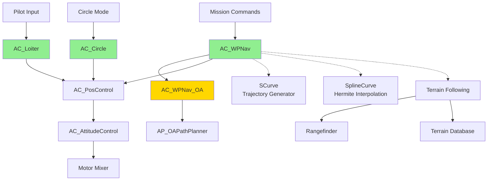
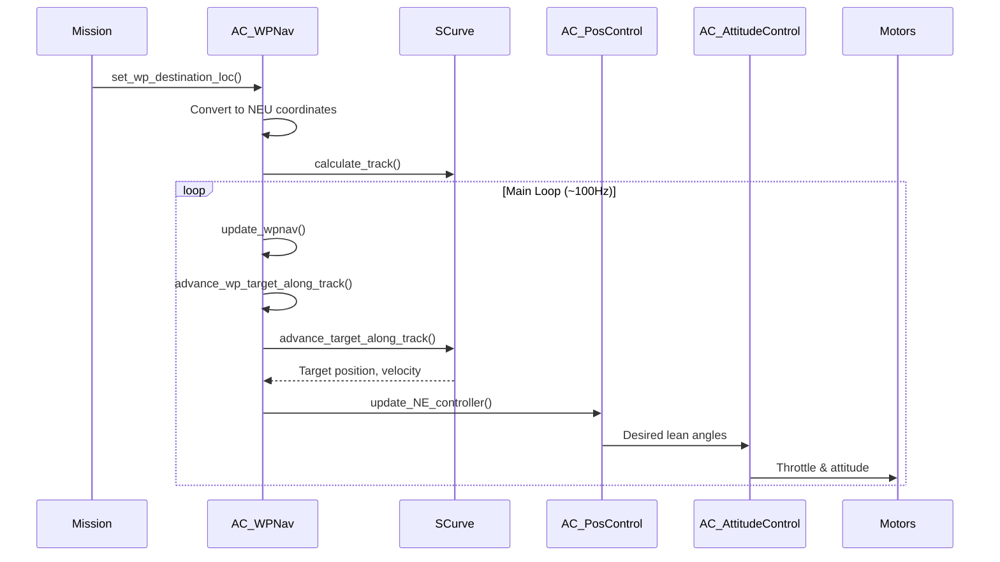
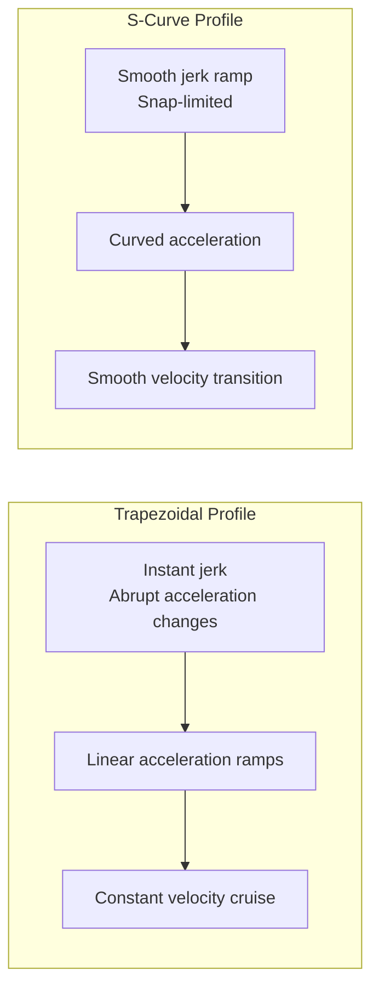
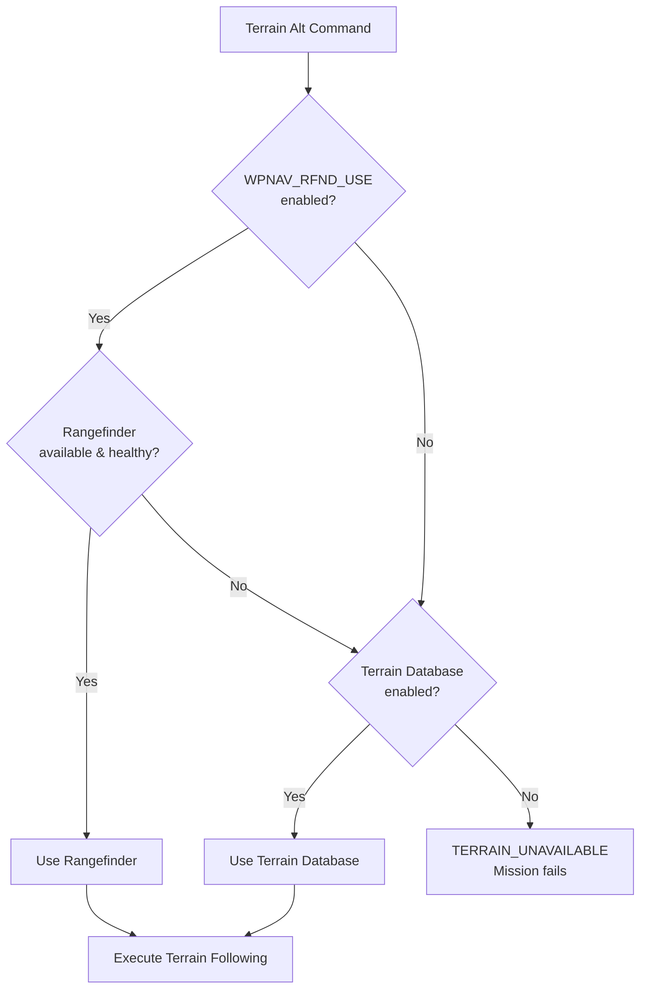

# AC_WPNav - Waypoint Navigation Library

## Overview

The AC_WPNav library provides sophisticated waypoint navigation, circular flight, and station-keeping (loiter) capabilities for multirotor vehicles in ArduPilot. This library implements smooth trajectory generation using S-curve acceleration profiles with jerk and snap limiting, supports curved spline paths between waypoints, and enables terrain following using rangefinder or terrain database sources.

AC_WPNav serves as the high-level navigation controller for autonomous flight modes (Auto, Guided, RTL) and integrates with AC_PosControl for position control and AC_AttitudeControl for attitude stabilization.

## Architecture

### Component Relationships



### Data Flow Pipeline



## Key Components

### AC_WPNav - Core Waypoint Navigation

**Purpose**: Primary class for waypoint-to-waypoint navigation with straight-line and spline trajectory generation.

**Key Responsibilities**:
- S-curve trajectory generation with configurable jerk and snap limits
- Spline path calculation using Hermite interpolation
- Terrain following with altitude margin enforcement
- Corner cutting with configurable cornering acceleration
- Multi-leg blending for smooth transitions between waypoints
- Speed and acceleration profile management

**Lifecycle**:
1. **Initialization**: `wp_and_spline_init_cm()` - Sets up position controller and initial speeds
2. **Destination Setting**: `set_wp_destination_loc()` or `set_spline_destination_loc()` - Defines target waypoint
3. **Update Loop**: `update_wpnav()` - Called at ~100Hz to advance along trajectory
4. **Completion**: `reached_wp_destination()` - Returns true when within WPNAV_RADIUS of target

**Thread Safety**: Must be called from main thread only. Uses position controller which maintains attitude controller state.

### AC_Circle - Circular Flight Mode

**Purpose**: Executes circular flight patterns with configurable radius and turn rate, commonly used for panorama photography and orbit modes.

**Key Responsibilities**:
- Circular path generation with centripetal acceleration limiting
- Angular velocity and acceleration control
- Terrain following in circular mode
- Heading control (toward center or direction of travel)
- Pilot-adjustable radius and rate (optional)

**Lifecycle**:
1. **Initialization**: `init()` or `init_NEU_cm()` - Sets circle center and initial rate
2. **Update Loop**: `update_cms()` - Called at ~100Hz with optional climb rate
3. **Parameter Adjustment**: `set_radius_cm()`, `set_rate_degs()` - Dynamic updates during flight

**Safety Considerations**: Angular acceleration is limited to prevent excessive lean angles. Minimum angular acceleration is 2 deg/s² to ensure controllability.

### AC_Loiter - Station-Keeping Control

**Purpose**: Maintains position at a specific location with smooth braking when pilot releases sticks, implementing predictive control for natural feel.

**Key Responsibilities**:
- Pilot input translation to acceleration commands
- Predictive feed-forward control for responsive feel
- Jerk-limited braking for smooth deceleration
- Configurable brake delay for intentional drift
- Maximum lean angle enforcement

**Lifecycle**:
1. **Initialization**: `init_target()` - Captures current position and velocity
2. **Pilot Input**: `set_pilot_desired_acceleration_cd()` - Pilot stick deflection
3. **Update Loop**: `update()` - Calculates desired velocity with braking
4. **Landing Mode**: `soften_for_landing()` - Reduces response for precision landing

**Control Algorithm**: Uses desired acceleration input with simulated wind resistance (drag term) to calculate velocity setpoint, enabling natural stick-proportional control feel.

### AC_WPNav_OA - Object Avoidance Extension

**Purpose**: Extends AC_WPNav with real-time object avoidance path planning, adjusting waypoint destinations to avoid detected obstacles.

**Key Responsibilities**:
- Integration with AP_OAPathPlanner for avoidance path calculation
- Backup and restore of original waypoint destinations
- Seamless transition between avoidance and direct paths
- Maintains reporting of original destination bearing/distance

**Configuration**: Enabled when `AC_WPNAV_OA_ENABLED` is true (depends on `AP_OAPATHPLANNER_ENABLED`).

## Trajectory Generation Algorithms

### S-Curve Acceleration Profiles

AC_WPNav uses S-curve trajectories to generate smooth paths with continuous acceleration and jerk. This provides more natural flight characteristics than trapezoidal velocity profiles.

**S-Curve vs Trapezoidal Comparison**:



**Algorithm**:
1. Calculate total distance from origin to destination
2. Determine maximum achievable velocity based on distance and acceleration limits
3. Apply jerk limits to smooth acceleration transitions (configured via WPNAV_JERK)
4. Apply snap limits for even smoother profiles (calculated internally)
5. Generate time-parameterized position, velocity, and acceleration profiles

**Benefits**:
- Reduces mechanical stress on airframe
- Smoother motor command transitions
- Better passenger comfort
- Reduced oscillations in position control

**Source**: `libraries/AC_WPNav/AC_WPNav.cpp:340-348` - S-curve calculation in `set_wp_destination_NEU_cm()`

### Spline Waypoint Support

Splines enable curved paths between waypoints, creating more natural flight trajectories for cinematography and efficient routing.

**Hermite Spline Interpolation**:
- Uses current and next destination for tangent calculation
- Blends position and velocity constraints at waypoint boundaries
- Supports mixed spline/straight segments in single mission

**Implementation**:
1. Convert waypoint locations to NEU position vectors
2. Calculate tangent vectors using next waypoint lookahead
3. Generate Hermite spline curve through destination
4. Sample spline at update rate for position setpoints

**Usage Pattern**:
```cpp
// Set spline destination with next waypoint for tangent calculation
Location dest, next_dest;
bool next_is_spline = true;
wpnav.set_spline_destination_loc(dest, next_dest, next_is_spline);
```

**Source**: `libraries/AC_WPNav/AC_WPNav.cpp:740-750` - Spline destination setup

### Corner Cutting and Multi-Leg Blending

When configured for "fast waypoints" (waypoint radius crossing without stopping), AC_WPNav blends velocity between consecutive legs for continuous motion.

**Cornering Acceleration**:
- Configurable via WPNAV_ACCEL_C parameter (defaults to 2× WPNAV_ACCEL)
- Limits maximum centripetal acceleration during turns
- Calculates required velocity reduction based on turn angle

**Blending Algorithm**:
1. Store current leg S-curve as `_scurve_this_leg`
2. Pre-calculate next leg S-curve as `_scurve_next_leg`
3. When waypoint radius crossed, transition to next leg with matched velocity
4. Apply cornering acceleration limits at waypoint boundary

**Source**: `libraries/AC_WPNav/AC_WPNav.cpp:337-348` - Fast waypoint transition logic

## Terrain Following

AC_WPNav supports altitude-above-terrain missions using two data sources: rangefinder sensors or pre-loaded terrain databases.

### TerrainSource Selection



### Rangefinder-Based Terrain Following

**Method**: Uses current rangefinder distance to calculate terrain offset from EKF origin.

**Advantages**:
- Real-time terrain data
- No pre-mission planning required
- Accurate over any terrain

**Limitations**:
- Limited by rangefinder maximum range
- Requires healthy rangefinder signal
- Cannot plan ahead for terrain changes

**Configuration**: Set `WPNAV_RFND_USE = 1` to enable rangefinder terrain following.

### Terrain Database Following

**Method**: Uses pre-loaded terrain elevation data (SRTM or similar) for altitude-above-terrain calculation.

**Advantages**:
- Works beyond rangefinder range
- Can plan altitude profile in advance
- No sensor dependency during flight

**Limitations**:
- Requires terrain data download before flight
- Resolution limited by database (typically 30m or 90m)
- May be outdated if terrain changed

**Configuration**: Enabled when `AP_TERRAIN_AVAILABLE` is defined and terrain database is loaded.

### Altitude Margin and Failsafe

**WPNAV_TER_MARGIN Parameter**: Defines maximum allowable deviation from target terrain altitude (default 10m).

**Failsafe Behavior**:
- If actual altitude error exceeds margin, waypoint navigation stops
- Vehicle enters altitude hold or failsafe mode
- Prevents terrain collision if data is inaccurate

**Source**: `libraries/AC_WPNav/AC_WPNav.cpp:654-682` - Terrain offset calculation with source selection

## Position Control Integration

AC_WPNav generates desired position, velocity, and acceleration targets and passes them to AC_PosControl for closed-loop control.

### Coordinate Frames

**NEU Frame**: North-East-Up coordinates in centimeters from EKF origin.
- N: North (positive north)
- E: East (positive east)  
- U: Up (positive up, altitude above EKF origin or terrain)

All AC_WPNav internal calculations use NEU frame. Conversions to/from Location (lat/lon/alt) and NED (North-East-Down) are handled by helper functions.

### Update Rate Requirements

**Recommended**: 100Hz (10ms update period)
**Minimum**: 50Hz
**Maximum**: 400Hz (limited by position controller)

AC_WPNav calls `_pos_control.update_NE_controller()` which must run fast enough for stable PID control.

### AC_PosControl Interface Usage

```cpp
// Typical update sequence in AC_WPNav::update_wpnav()
// 1. Advance target along trajectory
advance_wp_target_along_track(dt);

// 2. Position controller calculates required lean angles
_pos_control.update_NE_controller();

// 3. Retrieve desired attitudes for logging/GCS
float roll_cd = _pos_control.get_roll_cd();
float pitch_cd = _pos_control.get_pitch_cd();
```

**Position Controller Setpoints**:
- Position target (NEU cm)
- Velocity target (NEU cm/s)
- Acceleration feed-forward (NEU cm/s²)

**Source**: `libraries/AC_WPNav/AC_WPNav.cpp:612-623` - Main update loop in `update_wpnav()`

## Configuration Parameters

### WPNAV Parameters (Waypoint Navigation)

| Parameter | Description | Default | Range | Units |
|-----------|-------------|---------|-------|-------|
| WPNAV_SPEED | Horizontal speed target during missions | 1000 | 10-2000 | cm/s |
| WPNAV_SPEED_UP | Climb speed target during missions | 250 | 10-1000 | cm/s |
| WPNAV_SPEED_DN | Descent speed target during missions | 150 | 10-500 | cm/s |
| WPNAV_RADIUS | Waypoint completion radius | 200 | 5-1000 | cm |
| WPNAV_ACCEL | Horizontal acceleration during missions | 250 | 50-500 | cm/s² |
| WPNAV_ACCEL_Z | Vertical acceleration during missions | 100 | 50-500 | cm/s² |
| WPNAV_ACCEL_C | Cornering acceleration (0=2×ACCEL) | 0 | 0-500 | cm/s² |
| WPNAV_JERK | Horizontal jerk for S-curve smoothing | 1.0 | 1-20 | m/s³ |
| WPNAV_TER_MARGIN | Terrain following altitude margin | 10.0 | 0.1-100 | m |
| WPNAV_RFND_USE | Enable rangefinder for terrain following | 1 | 0-1 | boolean |

**Source**: `libraries/AC_WPNav/AC_WPNav.cpp:15-104` - Parameter definitions

### CIRCLE Parameters (Circular Flight)

| Parameter | Description | Default | Range | Units |
|-----------|-------------|---------|-------|-------|
| CIRCLE_RADIUS | Circle radius | 1000 | 0-200000 | cm |
| CIRCLE_RATE | Turn rate (positive=clockwise) | 20.0 | -90 to 90 | deg/s |
| CIRCLE_OPTIONS | Bitmask options | 0 | 0-15 | bitmask |

**CIRCLE_OPTIONS Bitmask**:
- Bit 0: Manual control (pilot can adjust radius/rate)
- Bit 1: Face direction of travel (instead of center)
- Bit 2: Initialize at center (instead of 1 radius ahead)
- Bit 3: Mount ROI at circle center

**Source**: `libraries/AC_WPNav/AC_Circle.h:9-12, 137-142`

### LOIT Parameters (Loiter/Station-Keeping)

| Parameter | Description | Default | Range | Units |
|-----------|-------------|---------|-------|-------|
| LOIT_SPEED | Maximum horizontal speed in loiter | 1250 | 10-2000 | cm/s |
| LOIT_ACC_MAX | Maximum acceleration | 500 | 50-1000 | cm/s² |
| LOIT_BRK_ACCEL | Maximum braking acceleration | 250 | 50-1000 | cm/s² |
| LOIT_BRK_JERK | Maximum braking jerk | 500 | 50-1000 | cm/s³ |
| LOIT_BRK_DELAY | Brake delay after stick release | 0.5 | 0-2 | seconds |
| LOIT_ANGLE_MAX | Maximum lean angle (0=use 2/3 ANGLE_MAX) | 0 | 0-45 | degrees |

**Source**: `libraries/AC_WPNav/AC_Loiter.h:85-90`

## Usage Patterns

### Basic Waypoint Navigation

```cpp
// Initialize waypoint navigation library
AC_WPNav wpnav(ahrs_view, pos_control, attitude_control);

// Set speeds before starting navigation
wpnav.wp_and_spline_init_cm(1000.0);  // 10 m/s horizontal

// Navigate to waypoint
Location destination;
destination.lat = -353632620;  // Canberra, Australia
destination.lng = 1491652360;
destination.set_alt_cm(10000, Location::AltFrame::ABOVE_HOME);

if (wpnav.set_wp_destination_loc(destination)) {
    // Update loop at 100Hz
    while (!wpnav.reached_wp_destination()) {
        wpnav.update_wpnav();
        // ... other main loop tasks
    }
}
```

### Spline Path Navigation

```cpp
// For smooth curved paths, use spline destinations
Location wp1, wp2, wp3;
// ... set waypoint coordinates

// Navigate with spline between wp1 and wp2
// Provide wp3 for tangent calculation
bool next_is_spline = true;
wpnav.set_spline_destination_loc(wp1, wp2, next_is_spline);

// When approaching wp1, set next spline segment
Location wp4;
wpnav.set_spline_destination_next_loc(wp2, wp3, true);

// Update as normal
while (!wpnav.reached_wp_destination()) {
    wpnav.update_wpnav();
}
```

### Circular Flight

```cpp
// Initialize circle mode
AC_Circle circle(ahrs_view, pos_control);

// Set circle center at current location, 15 deg/s clockwise
circle.init();  // Uses current position and heading
circle.set_radius_cm(2000);  // 20m radius
circle.set_rate_degs(15.0);  // 15 deg/s clockwise

// Update loop with optional climb rate
float climb_rate_cms = 0;  // Hold altitude
while (circle.get_angle_total_rad() < 2 * M_PI) {  // One full circle
    if (!circle.update_cms(climb_rate_cms)) {
        // Terrain failsafe triggered
        break;
    }
}
```

### Loiter with Pilot Input

```cpp
// Initialize loiter at current position
AC_Loiter loiter(ahrs_view, pos_control, attitude_control);
loiter.init_target();

// Main loop with pilot input
while (loiter_mode_active) {
    // Get pilot stick input (roll/pitch)
    float pilot_roll_cd = /* pilot input */;
    float pilot_pitch_cd = /* pilot input */;
    
    // Convert to desired acceleration
    loiter.set_pilot_desired_acceleration_cd(pilot_roll_cd, pilot_pitch_cd);
    
    // Update loiter controller
    loiter.update();
    
    // Retrieve attitude targets
    float roll = loiter.get_roll_cd();
    float pitch = loiter.get_pitch_cd();
}
```

### Terrain Following Missions

```cpp
// Set waypoint with terrain altitude
Location terrain_wp;
terrain_wp.lat = -353632620;
terrain_wp.lng = 1491652360;
terrain_wp.set_alt_cm(5000, Location::AltFrame::ABOVE_TERRAIN);  // 50m AGL

// Configure terrain following
wpnav.set_rangefinder_terrain_offset_cm(true, true, offset);

// Check terrain source availability
AC_WPNav::TerrainSource source = wpnav.get_terrain_source();
if (source == AC_WPNav::TerrainSource::TERRAIN_UNAVAILABLE) {
    // Cannot execute terrain following, use failsafe
    return false;
}

// Navigate to terrain waypoint
if (wpnav.set_wp_destination_loc(terrain_wp)) {
    while (!wpnav.reached_wp_destination()) {
        if (!wpnav.update_wpnav()) {
            // Terrain altitude error exceeded WPNAV_TER_MARGIN
            // Execute failsafe
            break;
        }
    }
}
```

### Dynamic Speed Adjustment

```cpp
// Slow down for precise approach
wpnav.set_speed_NE_cms(500);  // 5 m/s

// Reduce climb rate near ceiling
wpnav.set_speed_up_cms(100);  // 1 m/s climb

// Speed parameter changes in-flight are automatically detected
// and applied on next update_wpnav() call
```

## Safety Considerations

### Critical Code Paths

**Waypoint Radius Crossing**: When vehicle crosses WPNAV_RADIUS threshold, waypoint is marked complete and next waypoint becomes active. Ensure WPNAV_RADIUS is appropriate for vehicle dynamics and GPS accuracy.

**Terrain Following Failsafe**: If terrain altitude error exceeds WPNAV_TER_MARGIN, `update_wpnav()` returns false. Vehicle code must handle this by stopping horizontal navigation and entering altitude hold or RTL.

**S-Curve Trajectory Limits**: Jerk and snap limits prevent excessive acceleration changes, but do not guarantee lean angle limits. AC_PosControl enforces attitude limits, but aggressive WPNAV_JERK settings may cause oscillations.

### Failsafe Behaviors

**Terrain Data Loss**: 
- Returns false from `set_wp_destination_loc()` if terrain conversion fails
- Returns false from `update_wpnav()` if terrain tracking error exceeds margin
- Vehicle should stop navigation and enter failsafe mode

**Position Controller Saturation**:
- AC_PosControl limits lean angles to configured maximum
- Excessive speeds or accelerations will be automatically constrained
- Actual achieved trajectory may differ from commanded trajectory

**Rangefinder Health**:
- Terrain following switches to terrain database if rangefinder becomes unhealthy
- If neither source available, terrain failsafe triggers
- Check `rangefinder_used_and_healthy()` for status

### Error Handling

**Invalid Waypoint Destinations**:
- `set_wp_destination_loc()` returns false if location cannot be converted to NEU
- Common causes: EKF origin not set, terrain data unavailable
- Always check return value before assuming waypoint is set

**Update Rate Violations**:
- `is_active()` returns false if update_wpnav() not called within 200ms
- Stale navigation commands may cause position control issues
- Ensure consistent update rate in vehicle main loop

**Coordinate Frame Mismatches**:
- Mixing terrain-alt and origin-alt waypoints handled automatically
- Internal conversions use current terrain offset
- May return false if terrain data unavailable during conversion

### Testing Requirements

**SITL Validation**: All waypoint navigation features should be tested in SITL before flight.

**Parameter Limits**: Verify WPNAV parameters are within safe ranges for vehicle mass and motor authority.

**Terrain Following**: Test terrain missions in SITL with simulated terrain and rangefinder before attempting on real hardware.

**Failsafe Response**: Verify vehicle correctly handles terrain failsafe, position control saturation, and waypoint conversion failures.

## Testing

### SITL Setup

```bash
# Start ArduCopter SITL with default parameters
sim_vehicle.py -v ArduCopter --console --map

# Load standard waypoint mission
wp load missions/CMAC-circuit.txt

# Enable terrain following (requires terrain data)
param set WPNAV_RFND_USE 1
param set TERRAIN_ENABLE 1
```

### Waypoint Navigation Testing

```bash
# Test basic waypoint navigation
mode auto
arm throttle
# Monitor on map for waypoint tracking

# Check waypoint completion radius
param show WPNAV_RADIUS

# Test speed adjustments
param set WPNAV_SPEED 500    # Slow to 5 m/s
param set WPNAV_SPEED 2000   # Fast to 20 m/s

# Verify S-curve smoothing
param set WPNAV_JERK 10      # Very smooth
param set WPNAV_JERK 1       # Standard smoothing
```

### Circle Mode Testing

```bash
# Enter circle mode
mode circle

# Adjust circle parameters
param set CIRCLE_RADIUS 1500  # 15m radius
param set CIRCLE_RATE 30      # 30 deg/s

# Test facing modes
param set CIRCLE_OPTIONS 2    # Face direction of travel
param set CIRCLE_OPTIONS 0    # Face center (default)

# Monitor lean angles and verify smooth circular path
```

### Loiter Mode Testing

```bash
# Enter loiter mode
mode loiter

# Test braking response
param set LOIT_BRK_ACCEL 500  # Aggressive braking
param set LOIT_BRK_ACCEL 100  # Gentle braking

# Test brake delay
param set LOIT_BRK_DELAY 1.0  # 1 second coast before brake
param set LOIT_BRK_DELAY 0.0  # Immediate braking

# Verify position hold accuracy with stick inputs
```

### Terrain Following Testing

```bash
# Load terrain data (if using database)
# This downloads SRTM data for mission area
terrain_check

# Create mission with terrain waypoints
# MAVProxy example:
wp editor

# In mission editor, set waypoint frame to "Terrain"
# Or use MAVLink command with Location::AltFrame::ABOVE_TERRAIN

# Test rangefinder terrain following
param set WPNAV_RFND_USE 1
param set RNGFND1_TYPE 1      # Enable rangefinder
mode auto

# Monitor terrain altitude vs target in SITL console
```

### Safety Testing Procedures

**Hover Test**: Before waypoint navigation, verify stable hover in loiter mode to confirm position control is functioning correctly.

**Low-Speed Test**: Set WPNAV_SPEED to 500 cm/s (5 m/s) for initial waypoint tests to allow more reaction time.

**Altitude Margin**: Maintain significant altitude margin (50m+) during initial tests to prevent ground collision if terrain following fails.

**Emergency Stop**: Have RC transmitter ready to switch to loiter or stabilize mode at any time.

**Parameter Validation**: Use `param check` in MAVProxy to verify all parameters are within valid ranges before flight.

## Implementation Notes

### Design Decisions

**S-Curve vs Trapezoidal Profiles**: S-curve trajectories were chosen over simpler trapezoidal velocity profiles to reduce mechanical stress and improve passenger comfort. The additional computational overhead is minimal on modern flight controllers.

**NEU Coordinate Frame**: Using North-East-Up (positive up) instead of NED (positive down) simplifies altitude logic and matches human intuition (positive altitude = higher). Internal conversions handle NED interfaces.

**Lookahead for Splines**: Spline paths require knowledge of the next waypoint to calculate tangent vectors. Mission code must provide next destination when setting spline waypoints.

**Cornering Acceleration**: Separate WPNAV_ACCEL_C parameter allows tuning corner smoothness independently from straight-line acceleration. Defaulting to 2×ACCEL provides reasonable cornering without requiring parameter adjustment.

**Terrain Source Priority**: Rangefinder takes priority over terrain database when both available, as rangefinder provides real-time data and can detect obstacles not in database.

### Trade-Offs

**Memory vs Smoothness**: Storing previous, current, and next leg S-curves requires ~1KB of RAM but enables seamless multi-waypoint blending. This is acceptable for modern flight controllers.

**Computation vs Accuracy**: S-curve calculations are performed once per waypoint, not per update cycle, to minimize CPU usage. Trajectory is then sampled at update rate.

**Flexibility vs Simplicity**: Supporting both straight and spline waypoints in the same mission adds complexity but provides valuable flexibility for cinematography and survey missions.

### Known Limitations

**Terrain Database Resolution**: SRTM terrain data has 30m or 90m resolution and may be outdated. Critical low-altitude flights should use rangefinder terrain following.

**Waypoint Density**: Very closely-spaced waypoints (< 5m) may not achieve smooth S-curve profiles due to acceleration limits. Mission planning should maintain reasonable waypoint spacing.

**Altitude Frame Mixing**: While supported, frequently switching between terrain-alt and origin-alt waypoints requires terrain data lookups and may introduce small altitude discontinuities.

**Circle Mode at Low Altitude**: Circular flight with large radius and high rate may exceed lean angle limits. Angular acceleration limiting may reduce actual turn rate below configured CIRCLE_RATE.

**Loiter Brake Delay**: The LOIT_BRK_DELAY intentional coast period allows natural drift but may cause position error if winds are strong. Set to 0 for immediate braking in high-wind conditions.

### Future Enhancements

**Velocity Corridor**: Allow missions to specify velocity corridors along path rather than single speed limit.

**Altitude Optimization**: Automatic altitude adjustment to follow terrain contours while maintaining clearance.

**Dynamic Obstacle Avoidance**: Full integration with AP_OAPathPlanner for real-time avoidance in all navigation modes (currently only AC_WPNav_OA).

**Predictive Terrain Following**: Use terrain database to pre-plan altitude profile and adjust climb rates in advance of terrain changes.

## References

### Source Files

- `libraries/AC_WPNav/AC_WPNav.h` - Main waypoint navigation class definition
- `libraries/AC_WPNav/AC_WPNav.cpp` - Waypoint navigation implementation
- `libraries/AC_WPNav/AC_Circle.h` - Circular flight class definition
- `libraries/AC_WPNav/AC_Circle.cpp` - Circular flight implementation  
- `libraries/AC_WPNav/AC_Loiter.h` - Loiter/station-keeping class definition
- `libraries/AC_WPNav/AC_Loiter.cpp` - Loiter implementation
- `libraries/AC_WPNav/AC_WPNav_OA.h` - Object avoidance extension definition
- `libraries/AC_WPNav/AC_WPNav_OA.cpp` - Object avoidance implementation
- `libraries/AC_WPNav/AC_WPNav_config.h` - Compile-time configuration

### Related Modules

- [AC_PosControl](../AC_PosControl/README.md) - Position controller integration
- [AC_AttitudeControl](../AC_AttitudeControl/README.md) - Attitude stabilization
- [AP_Math](../AP_Math/README.md) - S-curve and spline curve generators
- [AP_Terrain](../AP_Terrain/README.md) - Terrain database support
- [AP_OAPathPlanner](../AC_Avoidance/README.md) - Object avoidance path planning

### External Documentation

- [ArduPilot Mission Command Reference](https://ardupilot.org/copter/docs/mission-command-list.html)
- [Terrain Following Guide](https://ardupilot.org/copter/docs/terrain-following.html)
- [Flight Modes Documentation](https://ardupilot.org/copter/docs/flight-modes.html)
- [MAVProxy Mission Planning](https://ardupilot.github.io/MAVProxy/html/getting_started/waypoints.html)

---

**Documentation Version**: 1.0  
**Last Updated**: 2025  
**Maintainer**: ArduPilot Development Team
