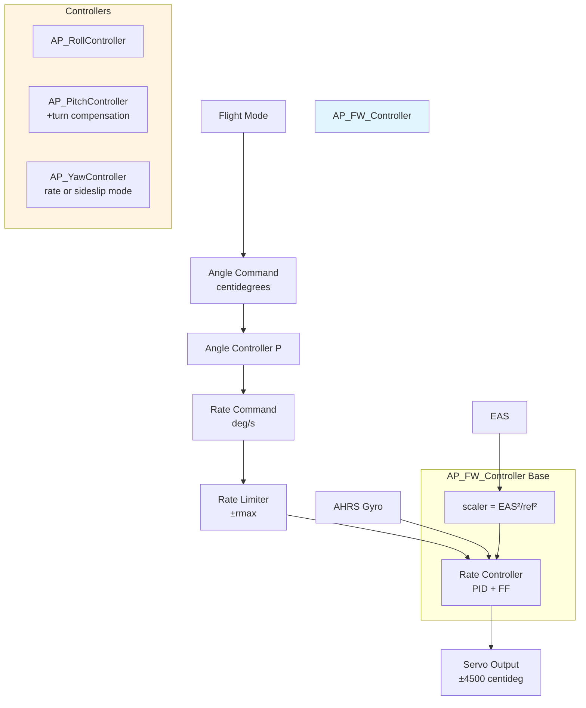
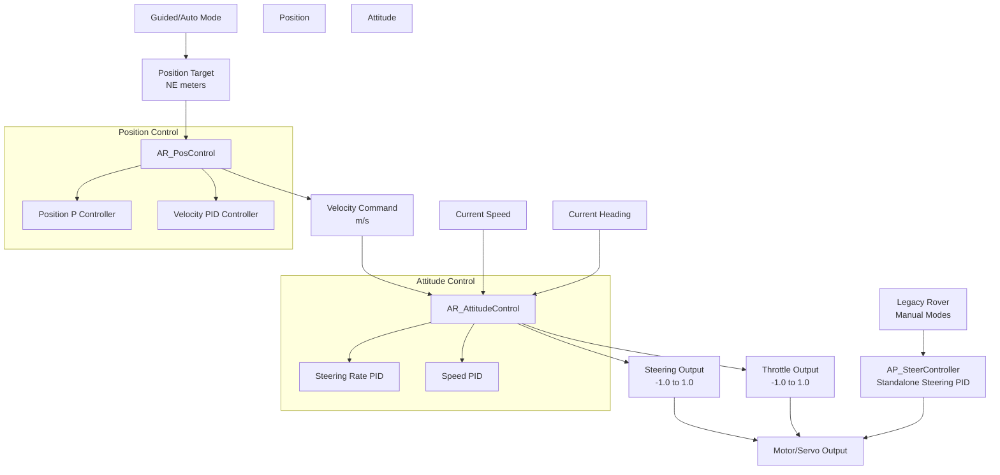
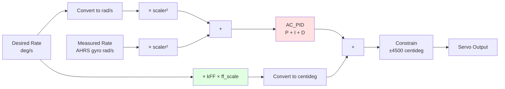
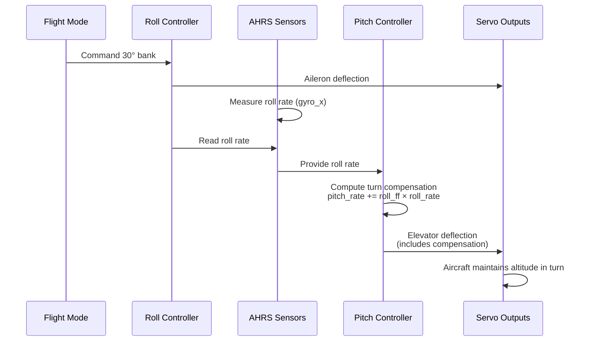
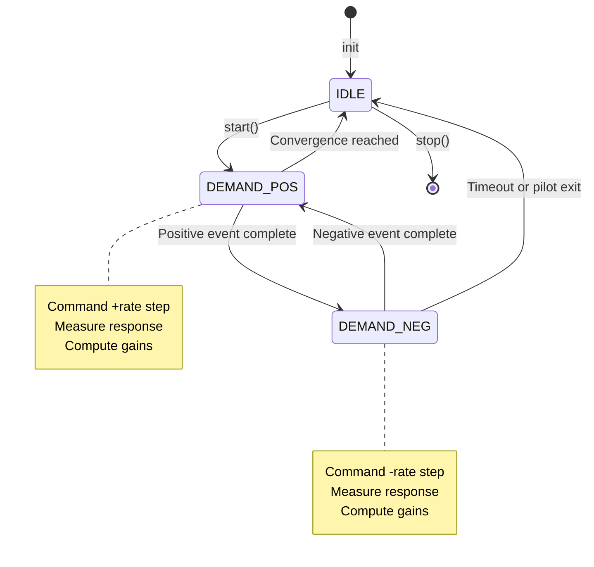

# APM_Control

## Overview

The APM_Control library provides attitude and position control for fixed-wing aircraft, ground vehicles, and marine vehicles in the ArduPilot autopilot system. This library implements:

- **Fixed-wing attitude controllers**: Roll, pitch, and yaw axis controllers with cascaded angle→rate control architecture
- **Ground/marine vehicle controllers**: Steering, attitude, and 2D position control with speed-adaptive gains
- **In-flight autotune system**: Automated PID tuning for fixed-wing aircraft

The library serves as the core control layer between high-level flight modes and low-level servo/motor outputs, implementing PID control with feedforward, airspeed-adaptive gain scaling, integrator management, and stall protection mechanisms.

**Primary Users**: ArduPlane (fixed-wing), Rover (ground vehicles), Boat (marine vehicles)

**Key Features**:
- Cascaded control: angle error → rate command → servo output
- Airspeed-adaptive gain scaling for fixed-wing (gains × scaler² where scaler = EAS/reference_airspeed)
- Integrator anti-windup and freeze conditions
- Rate feedforward for reduced phase lag
- Coordinated turn compensation for pitch axis
- Speed-adaptive steering for ground vehicles
- In-flight autotune with safety limits
- Specialized modes: balancebot pitch control, sailboat heel control

## Architecture

### Fixed-Wing Control Architecture



**Control Flow**:
1. Flight mode commands desired angle (e.g., 30° bank in FBWA mode)
2. Angle controller (P gain) converts angle error → desired rate
3. Rate limiter constrains to ±rmax (safety limit)
4. Rate controller (PID + FF) converts rate command → servo output
5. Airspeed scaling adjusts P/I gains by scaler²
6. Output constrained to ±4500 centidegrees (±45°)

**Key Classes**:
- `AP_FW_Controller`: Abstract base class providing common rate control implementation
- `AP_RollController`: Roll axis (aileron) controller, uses AHRS gyro_x
- `AP_PitchController`: Pitch axis (elevator) controller with coordinated turn compensation, uses AHRS gyro_y  
- `AP_YawController`: Yaw axis (rudder) controller with dual modes (rate control or sideslip damping)
- `AP_AutoTune`: In-flight PID tuner using event-driven state machine

### Ground/Marine Vehicle Architecture



**Control Flow**:
1. Position control: Target position → position error (P) → desired velocity
2. Velocity control: Velocity error (PID) → desired acceleration  
3. Attitude control: Converts acceleration → forward speed, lateral accel, turn rate
4. Output: Normalized steering/throttle [-1.0, 1.0] → motor commands

**Key Classes**:
- `AR_PosControl`: Singleton for 2D position control with input shaping (speed/accel/jerk limits)
- `AR_AttitudeControl`: Singleton for steering and throttle control with anti-windup
- `AP_SteerController`: Legacy standalone steering PID (used in manual modes)

**Special Modes**:
- Balancebot: Pitch-based throttle control for two-wheeled balance
- Sailboat: Heel angle controller for sail trimming

## Key Components

### AP_FW_Controller (Base Class)

**Purpose**: Abstract base class providing common rate control implementation for fixed-wing roll and pitch controllers.

**Responsibilities**:
- Core rate PID control using AC_PID
- Airspeed-adaptive gain scaling (P and I gains × scaler²)
- Integrator management (reset, decay, freeze conditions)
- Autotune integration via AP_AutoTune
- Output limiting to ±4500 centidegrees

**Lifecycle**:
1. Construction: Initialize with AP_FixedWing parameters, set defaults
2. Parameter loading: AP_Param loads persistent gains (P, I, D, FF, tau, rmax, IMAX)
3. Runtime: get_servo_out() called at main loop rate (typically 50Hz)
4. Autotune (optional): autotune_start() allocates AP_AutoTune, runs tuning cycles
5. Cleanup: autotune_restore() deallocates tuner, restores original gains

**Key Methods**:
- `get_servo_out(angle_err, scaler, disable_integrator, ground_mode)`: Pure virtual, implemented by derived classes
- `_get_rate_out(desired_rate, scaler, ...)`: Protected implementation of rate control
- `reset_I()`: Zero integrator (mode transitions)
- `decay_I()`: 95% integrator reduction over 2s (quadplane hover)
- `autotune_start()`, `autotune_restore()`: Autotune lifecycle

**Sensor Abstraction** (pure virtual hooks):
- `get_airspeed()`: Return equivalent airspeed from AHRS
- `is_underspeed(aspeed)`: Check if below stall threshold
- `get_measured_rate()`: Return body frame rate from AHRS gyro

**Integration**: Used by AP_RollController, AP_PitchController. Not used by AP_YawController (predates refactor).

### AP_RollController (Roll Axis)

**Purpose**: Fixed-wing roll axis controller converting bank angle error to aileron commands.

**Control Structure**:
- Outer loop: Angle error (centidegrees) × P → desired roll rate (deg/s)
- Rate limiter: Clamp to ±rmax
- Inner loop: Rate PID + FF → servo output (centidegrees)

**Sensor**: AHRS gyro_x (body frame roll rate, positive = right wing down)

**Parameters** (RLL2SRV_*):
- P: Angle→rate gain (typical 0.5-2.0 deg/s per deg)
- I: Rate integral gain (typical 0.1-0.5)
- D: Rate derivative gain (typical 0.01-0.1)
- FF: Feedforward gain (typical 0.2-0.8)
- tau: Derivative filter time constant (typical 0.05-0.2 s)
- rmax: Maximum roll rate (typical 30-180 deg/s)
- IMAX: Integrator limit (typical 20-45 centidegrees)

**Autotune Support**: Fully supported via AP_AutoTune integration from base class.

**Usage Example**:
```cpp
// In ArduPlane flight mode
int32_t roll_error_cd = desired_roll_cd - ahrs.roll_sensor;
float scaler = get_speed_scaler(); // (EAS/ref_speed)^2
float aileron_out = rollController.get_servo_out(roll_error_cd, scaler, 
                                                   false, // enable integrator
                                                   false); // not ground mode
SRV_Channels::set_output_scaled(SRV_Channel::k_aileron, aileron_out);
```

### AP_PitchController (Pitch Axis)

**Purpose**: Fixed-wing pitch axis controller converting pitch angle error to elevator commands, with coordinated turn compensation.

**Control Structure**:
- Outer loop: Angle error (centidegrees) × P → desired pitch rate (deg/s)
- Turn compensation: Add roll_ff × roll_rate × airspeed_scale
- Rate limiter: Clamp to ±rmax
- Inner loop: Rate PID + FF → servo output (centidegrees)

**Sensor**: AHRS gyro_y (body frame pitch rate, positive = nose up)

**Coordinated Turn Logic**: Adds pitch-up rate proportional to roll rate to maintain altitude during banked turns.
```
pitch_rate_correction = roll_ff × roll_rate × airspeed_scale
```

**Parameters** (PTCH2SRV_*):
- P, I, D, FF, tau, rmax, IMAX: Same as roll controller
- RLL (roll_ff): Turn compensation gain (typical 0.7-1.2)

**Autotune Support**: Fully supported via AP_AutoTune integration from base class.

**Usage Example**:
```cpp
int32_t pitch_error_cd = desired_pitch_cd - ahrs.pitch_sensor;
float scaler = get_speed_scaler();
float elevator_out = pitchController.get_servo_out(pitch_error_cd, scaler,
                                                     false, // enable integrator
                                                     false); // not ground mode
SRV_Channels::set_output_scaled(SRV_Channel::k_elevator, elevator_out);
```

### AP_YawController (Yaw Axis)

**Purpose**: Fixed-wing yaw/rudder controller with dual modes: modern rate control or legacy sideslip damping.

**Control Modes**:

**1. Rate Control Mode** (YAW2SRV_RLL_EN=1, modern):
- Direct yaw rate → rudder servo via rate PID
- Similar structure to roll/pitch but independent implementation
- Autotune support available
- Used for coordinated turns and yaw stability

**2. Sideslip Damping Mode** (YAW2SRV_RLL_EN=0, legacy):
- Estimates sideslip from lateral acceleration
- Sideslip integrator accumulates error
- High-pass filtered yaw damping reduces Dutch roll
- Manual tuning only (no autotune)

**Parameters**:
- Rate mode: YAW2SRV_RLL_* (P, I, D, FF, tau, rmax, IMAX)
- Sideslip mode: YAW2SRV_K_A, K_I, K_D, K_FF, IMAX

**Why Not AP_FW_Controller**: Predates controller refactoring, maintains backward compatibility with legacy sideslip mode.

**Recommendation**: Use rate control mode (RLL_EN=1) for new aircraft.

### AP_SteerController (Ground Vehicle Steering)

**Purpose**: Standalone steering PID controller for ground and marine vehicles with speed-adaptive gains.

**Control Modes**:
1. Lateral acceleration control: desired_accel (m/s²) → steering
2. Yaw rate control: desired_rate (deg/s) → steering
3. Angle error control: heading_error (centidegrees) → steering

**Speed Adaptation**: Gains divided by MAX(speed, minspeed) for stability across speed range.

**High-Speed Derating**: Reduces authority when speed > deratespeed to prevent oscillations.

**Parameters** (STEER2SRV_*):
- P: Proportional gain (typical 0.1-2.0)
- I: Integral gain (typical 0.0-0.5)
- D: Derivative gain (typical 0.0-0.2)
- FF: Feedforward gain (typical 0.0-1.0)
- IMAX: Integrator limit (typical 100-4500 centidegrees)
- MINSPD: Minimum speed for scaling (typical 0.5-2.0 m/s)
- DERATESPEED: High-speed derating threshold (m/s)
- DERATEFACTOR: Derating multiplier at high speed (0-1)

**Usage**: Legacy Rover manual modes (STEERING, HOLD). Modern Rover uses AR_AttitudeControl.

### AR_AttitudeControl (Ground/Marine Attitude)

**Purpose**: High-level singleton providing steering and throttle outputs for ground/marine vehicles.

**Steering Control Methods**:
- `get_steering_out_lat_accel()`: From desired lateral acceleration (m/s²)
- `get_steering_out_heading()`: From desired heading with rate limiting
- `get_steering_out_rate()`: From desired yaw rate (rad/s)

**Throttle Control Methods**:
- `get_throttle_out_speed()`: Speed tracking with cruise point
- `get_throttle_out_stop()`: Controlled braking to full stop
- `get_throttle_out_from_pitch()`: Pitch-based throttle for slope climbing

**Special Vehicle Support**:
- Balancebot: `get_throttle_out_from_pitch_balancebot()` maintains upright balance
- Sailboat: `get_sail_out_from_heel()` limits heel angle

**Internal Controllers**:
- Steering: AC_P (heading→rate) + AC_PID (rate→output)
- Throttle: AC_PID (speed→throttle)
- Pitch: AC_PID (pitch error→throttle adjustment)

**Anti-Windup**: Integrators frozen when motor_limit flags indicate saturation.

**Output Range**: Normalized [-1.0, 1.0] (can exceed for large errors), scaled to motor commands by vehicle code.

### AR_PosControl (Ground/Marine Position)

**Purpose**: Singleton for 2D position control with velocity/acceleration input shaping.

**Control Structure**:
- Position loop: AC_P_2D converts position error (meters) → desired velocity (m/s)
- Velocity loop: AC_PID_2D converts velocity error → desired acceleration (m/s²)
- Output stage: Converts NE acceleration → forward speed, lateral accel, turn rate

**Input Shaping**: Smoothly adjusts targets respecting kinematic limits:
- `set_limits(speed_max, accel_max, lat_accel_max, jerk_max)`
- Uses S-curve profiles for smooth motion

**EKF Integration**: Automatically handles EKF position resets via `handle_ekf_xy_reset()`.

**Outputs** (for AR_AttitudeControl):
- `get_desired_speed()`: Forward speed command (m/s)
- `get_desired_lat_accel()`: Lateral acceleration (m/s²)
- `get_desired_turn_rate_rads()`: Turn rate (rad/s)

**Optional Avoidance**: Can integrate AC_Avoid velocity adjustments.

**Coordinate Frame**: NE (North-East) 2D frame relative to EKF origin.

### AP_AutoTune (In-Flight Tuner)

**Purpose**: Automated in-flight PID tuning for fixed-wing roll, pitch, and yaw axes.

**Algorithm**:
1. **Excitation**: Commands step rate changes (positive and negative)
2. **Measurement**: Records actuator output and achieved rate response
3. **Estimation**: Computes FF from actuator→rate ratio
4. **Adaptation**: Iteratively adjusts P, I, D, IMAX with convergence checks

**State Machine**:
- IDLE → DEMAND_POS → DEMAND_NEG → repeat until convergence
- Conservative per-loop update limits (slew limiters)
- Oscillation detection via rate slew monitoring

**Safety Features**:
- User-controllable tuning level (0=conservative, 10=aggressive)
- Maximum/minimum gain bounds
- Pilot can exit anytime via mode switch
- Requires sufficient altitude (300m+ recommended)

**Integration**:
- Reads/writes AC_PID gains (ff, kP, kI, kD, kIMAX)
- Logs telemetry at 25Hz (ATRP messages)
- Saves gains to persistent storage on completion

**Usage**:
1. Set AUTOTUNE_LEVEL parameter (0-10)
2. Climb to safe altitude in FBWA mode
3. Switch to AUTOTUNE mode
4. Hold desired orientation (level flight for roll/pitch)
5. Monitor for oscillations, switch out if excessive
6. Wait for convergence (10-20 cycles, 2-5 minutes)
7. Land, verify saved gains

**Tuning Table**: Maps autotune_level to starting tau/rmax:
- Level 0: tau=0.7s, rmax=30 deg/s (trainers)
- Level 5: tau=0.5s, rmax=60 deg/s (sport)
- Level 10: tau=0.3s, rmax=90 deg/s (aerobatic)

## PID Control Structure

### Fixed-Wing Rate Control Transfer Function

The rate control implementation in AP_FW_Controller combines PID feedback with feedforward:

```
Rate PID Transfer Function:
  servo_out = P×(error) + I×∫(error)dt + D×d(error)/dt + FF×desired_rate

Where:
  error = (desired_rate - measured_rate) × scaler²
  measured_rate = AHRS body frame gyro (rad/s)
  
Gain Scaling (airspeed adaptation):
  P_effective = P_tuned × scaler²
  I_effective = I_tuned × scaler²
  D_effective = D_tuned (NO scaling)
  FF_effective = FF_tuned (NO scaling)
  
  scaler = (EAS / reference_airspeed)²
  EAS = Equivalent Airspeed from AHRS
```

**Rationale for Scaling**:
- Control surface effectiveness ∝ dynamic pressure ∝ ρ × V²
- At higher airspeed: same deflection → more force, need lower gains
- At lower airspeed: same deflection → less force, need higher gains
- P and I scale with error magnitude (affected by speed)
- D operates on rate of change (naturally compensated)
- FF is proportional to desired rate (already speed-dependent)



### Angle to Rate Conversion (Outer Loop)

The outer loop converts angle errors to rate commands:

```
For Roll/Pitch Controllers:
  angle_error_deg = (desired_angle - actual_angle) / 100  // Convert centideg to deg
  desired_rate = P_angle × angle_error_deg
  desired_rate = CLAMP(desired_rate, -rmax, +rmax)
  
For Pitch with Coordinated Turn Compensation:
  turn_compensation = roll_ff × roll_rate × airspeed_scale
  desired_rate += turn_compensation
  
  Where:
    roll_rate = AHRS body frame roll rate (deg/s)
    airspeed_scale = typical 0.01 to 0.05 (tuned for aircraft)
```

**P Gain Physical Meaning**:
- P_angle = 1.0 means 1 deg/s commanded rate per degree of angle error
- Higher P: faster angle correction, risk of overshoot
- Lower P: slower, more damped response

**Rate Limiting (rmax)**:
- Prevents excessive rates that could:
  - Exceed structural limits
  - Cause aerodynamic stall
  - Induce control surface flutter
- Typical values based on aircraft capability and safety margins

### Ground Vehicle Steering PID

The AP_SteerController implements speed-adaptive steering control:

```
Steering PID Transfer Function:
  error = desired_value - measured_value  // lat_accel, rate, or angle
  
  P_term = (kP × error) / MAX(speed, minspeed)
  I_term = (kI × ∫error dt) / MAX(speed, minspeed)
  D_term = kD × d(error)/dt
  FF_term = kFF × desired_rate
  
  servo_out = P_term + I_term + D_term + FF_term
  
High-Speed Derating (when speed > deratespeed):
  derate_factor = 1.0 - ((speed - deratespeed) / deratespeed) × (1.0 - deratefactor)
  servo_out × = derate_factor
```

**Speed Adaptation Rationale**:
- At high speed: less steering deflection needed for same turn rate
- At low speed: more steering deflection needed
- Division by speed provides natural adaptation
- minspeed prevents division by zero or excessive gains at very low speed

**High-Speed Derating**:
- Reduces controller authority at high speeds to prevent oscillations
- Linear interpolation between full authority and deratefactor
- Improves stability on high-speed runs

### AR_AttitudeControl PID Structure

Ground/marine attitude control uses AC_P and AC_PID controllers:

**Steering Control**:
```
Lateral Accel Mode:
  heading_error = wrap_PI(desired_heading - current_heading)
  desired_rate = AC_P.get_p(heading_error)  // Heading → rate
  desired_rate = CLAMP(desired_rate, -rate_max, +rate_max)
  steering_out = AC_PID.update_all(desired_rate, measured_rate, dt)  // Rate → output
  
Rate Mode:
  steering_out = AC_PID.update_all(desired_rate, measured_rate, dt)
  
Integrator anti-windup:
  limit_I = (motor_limit_left || motor_limit_right)
  AC_PID.update_all(..., limit_I)  // Freeze integrator when saturated
```

**Throttle/Speed Control**:
```
Speed PID:
  speed_error = desired_speed - current_speed
  throttle_out = AC_PID.update_all(speed_error, 0, dt)
  
  Feedforward (cruise point):
    throttle_out += (desired_speed / cruise_speed) × cruise_throttle
  
  Output limiting:
    throttle_out = CLAMP(throttle_out, -1.0, 1.0)
```

### AR_PosControl Control Structure

2D position control cascades through position → velocity → acceleration:

```
Position Loop (AC_P_2D):
  position_error = target_position - current_position  // NE meters
  desired_velocity = AC_P_2D.get_p(position_error)  // P controller
  desired_velocity = limit_vector(desired_velocity, speed_max)
  
Velocity Loop (AC_PID_2D):
  velocity_error = desired_velocity - current_velocity  // NE m/s
  desired_accel = AC_PID_2D.update_all(velocity_error, dt)
  desired_accel = limit_vector(desired_accel, accel_max)
  
Output Conversion (NE to body frame):
  forward_speed = desired_velocity · heading_unit_vector
  lateral_accel = perpendicular component of desired_accel
  turn_rate = atan2(desired_velocity.y, desired_velocity.x) → rate_pid
```

**Input Shaping**:
- Adjusts targets smoothly to respect speed, acceleration, and jerk limits
- Uses S-curve acceleration profiles for comfortable motion
- Prevents abrupt velocity changes that could destabilize vehicle

## Integrator Management and Anti-Windup

### Integrator Freeze Conditions

The integrator is frozen (stops accumulating error) when:

**1. Ground Mode** (ground_mode=true):
- During takeoff roll before liftoff
- During landing rollout after touchdown
- Prevents wind-up from control surface deflection with no effect

**2. Underspeed Condition** (is_underspeed() returns true):
- Airspeed below min_groundspeed threshold (typically 6-8 m/s)
- Approaching stall: control surfaces less effective
- Prevents excessive integrator accumulation that would cause overshoot in recovery

**3. Motor/Actuator Limits** (motor_limit flags):
- Servo or motor output saturated
- Cannot follow commanded output regardless of integrator value
- Prevents integrator wind-up when actuator physically limited

**4. Manual Override** (disable_integrator=true):
- Used in FBWA (Fly-By-Wire A) mode
- Pilot has direct rate control
- Integrator would fight pilot inputs

**5. Mode Transitions**:
- Switching between flight modes
- Entering failsafe conditions
- Prevents accumulated error from previous mode affecting new mode

### Integrator Decay (Quadplane Transitions)

The `decay_I()` method provides gradual integrator reduction:

```cpp
// In AP_FW_Controller::decay_I()
// Reduces integrator by 95% over 2 seconds
const float decay_rate = 0.95f;
const float decay_time = 2.0f;
float decay_factor = 1.0f - (dt / decay_time) * decay_rate;
rate_pid.set_integrator(rate_pid.get_i() * decay_factor);
```

**Use Case**: Quadplane transitions from fixed-wing to multicopter hover
- Fixed-wing integrator accumulated during forward flight
- Would fight multicopter attitude control during hover
- Decay prevents abrupt reset while allowing smooth transition

### Anti-Windup Implementation

Anti-windup prevents integrator accumulation when output is saturated:

```cpp
// In AP_FW_Controller::_get_rate_out()
bool limit_I = (fabsf(_last_out) >= 45.0f);  // Output saturated at ±45°

if (is_underspeed(aspeed)) {
    limit_I = true;  // Also freeze when approaching stall
}

// AC_PID stops integrating when limit_I=true
rate_pid.update_all(target_rate_rads, measured_rate_rads, dt, 
                    scaler, scaler,  // P and I scaling
                    limit_I);  // Integrator freeze flag
```

**In AR_AttitudeControl** (ground vehicles):
```cpp
// Steering controller
bool limit_I = (motor_limit_left || motor_limit_right);
float steering = _steer_rate_pid.update_all(rate_error, dt, limit_I);

// Speed controller  
bool limit_I = (motor_limit_low || motor_limit_high);
float throttle = _throttle_speed_pid.update_all(speed_error, dt, limit_I);
```

### Integrator Reset Points

**reset_I()** zeros the integrator completely:

**When Called**:
- Entering manual modes (MANUAL, ACRO, TRAINING)
- Significant mode changes (e.g., AUTO → LOITER → AUTO)
- After long periods without control (e.g., disarmed)
- Failsafe entry to ensure clean recovery state

**Why Reset**:
- Previous accumulated error is no longer relevant
- Prevents unexpected control authority from stale integrator
- Ensures predictable behavior in new mode

**relax_I()** in AR_AttitudeControl:
- Smoothly reduces integrator over several update cycles
- Less abrupt than complete reset
- Used for mode transitions where some continuity desired

### Integration with AC_PID

The AC_PID library (used by all controllers) implements anti-windup internally:

**Methods**:
- `update_all(..., limit)`: Updates P, I, D with integrator freeze flag
- `set_integrator(value)`: Direct integrator manipulation
- `get_i()`: Read current integrator value for logging/debugging

**AC_PID Internal Logic**:
```cpp
// Simplified AC_PID::update_all() logic
if (!limit) {
    _integrator += error * _ki * dt;
    _integrator = constrain(_integrator, -_kimax, _kimax);
}
// P and D computed regardless of limit flag
```

**Benefits**:
- Consistent anti-windup across all controllers
- Centralized implementation reduces code duplication
- Well-tested and validated over years of flight operations

## Feedforward from Demanded Rates

### Purpose of Feedforward

Feedforward (FF) provides immediate control response without waiting for error accumulation:

**Advantages**:
- **Reduces phase lag**: Output immediately proportional to command
- **Improves tracking**: Better follows rapidly changing rate commands
- **Reduces feedback reliance**: Less dependence on P/I/D terms
- **Lowers gains**: Can use lower P gain with higher FF, reducing oscillations
- **Better disturbance rejection**: Feedback terms handle disturbances, FF handles commands

**Control Theory**:
- Feedback (PID) reacts to errors (past/present)
- Feedforward anticipates required output (future)
- Combined: FF provides baseline, PID corrects for disturbances and modeling errors

### FF Calculation (Fixed-Wing)

```
FF_output = kFF × desired_rate × ff_scale

Units:
  kFF: dimensionless gain parameter
  desired_rate: deg/s
  ff_scale: temporary scaling factor (default 1.0)
  FF_output: centidegrees

Physical Meaning:
  kFF ≈ (servo_deflection_deg) / (rate_deg/s) at reference airspeed
  
  Example: If kFF = 0.5:
    - Desired rate = 60 deg/s
    - FF output = 0.5 × 60 = 30 deg = 3000 centideg
    - Servo immediately deflects 30° to produce expected roll rate
    
Typical Values:
  - Sport aircraft: kFF = 0.3 to 0.5
  - Well-tuned aircraft: kFF = 0.4 to 0.7
  - Aerobatic aircraft: kFF = 0.5 to 0.8
```

### FF Scaling Considerations

**Why FF is NOT Scaled by Airspeed**:
- FF term: `kFF × desired_rate`
- Desired rate already reflects required control authority
- At high speed: lower rate command for same maneuver → proportionally lower FF
- At low speed: higher rate command for same maneuver → proportionally higher FF
- Natural compensation through rate command itself

**Contrast with P/I Gains**:
- P/I operate on rate error (measured - desired)
- Error magnitude doesn't inherently scale with airspeed
- Require explicit scaler² multiplication for airspeed adaptation

**Temporary FF Scaling** (`set_ff_scale()`):
- Used for special flight modes or maneuvers
- Example: Reduced FF during aerobatic knife-edge flight
- Example: Increased FF during aggressive racing maneuvers
- Resets to 1.0 on next get_servo_out() call (single-loop duration)

### Autotune FF Estimation

AP_AutoTune computes FF from actuator→rate measurements:

```
Algorithm:
1. Command step rate change (e.g., +30 deg/s)
2. Measure actuator output (servo deflection in centideg)
3. Measure achieved rate response (deg/s from gyro)
4. Compute ratio: kFF = actuator_output / achieved_rate
5. Filter multiple measurements (LowPassFilter, ModeFilter)
6. Apply safety limits (min/max FF bounds)
7. Save to persistent parameter

Single-Event Estimation:
  kFF_estimate = servo_centideg / rate_deg_s
  
Multi-Event Filtering:
  kFF_final = ModeFilter(LowPassFilter(kFF_samples))
```

**Why Single-Event Works**:
- Step input excites system dynamics
- Steady-state ratio represents system gain
- Multiple events average out noise and disturbances
- More robust than frequency sweep methods

### FF vs P/I/D Tuning Strategy

**High FF, Low P Approach** (Recommended):
- Fast initial response from FF
- Small error accumulation
- Reduced feedback oscillations
- Better tracking of commands
- Lower P gain → more damped

**Low FF, High P Approach** (Legacy):
- Slower initial response
- Larger transient errors
- More feedback-dependent
- Potential overshoot and oscillations
- Higher P gain needed for responsiveness

**Tuning Recommendation**:
1. **Tune FF first** via autotune or manual adjustment
2. **Adjust P** for desired angle tracking (start low, increase until responsive)
3. **Tune I** to eliminate steady-state errors
4. **Tune D** for damping (reduce overshoot, prevent oscillations)
5. **Iterate** if needed, but FF should remain primary component

**Balance Example**:
```
Well-tuned aircraft:
  FF: 0.5 (provides 80% of control output)
  P: 0.3 (corrects for small errors)
  I: 0.2 (eliminates steady-state offsets)
  D: 0.04 (adds damping)
  
Poorly tuned (high P, low FF):
  FF: 0.1 (provides 20% of control output)
  P: 1.5 (compensates with aggressive feedback)
  I: 0.5 (fights oscillations from high P)
  D: 0.15 (attempts to damp oscillations)
  Result: oscillatory, poor tracking
```

## Control Surface Mixing and Coordination

### Roll-Pitch Coupling (Coordinated Turns)

Aircraft in banked turns naturally lose altitude unless pitch compensation is applied:

```
In AP_PitchController::_get_coordination_rate_offset():
  pitch_rate_correction = roll_ff × roll_rate × airspeed_scale
  
Where:
  roll_ff: PTCH2SRV_RLL parameter (typical 0.7 to 1.2)
  roll_rate: Current body frame roll rate from AHRS (deg/s)
  airspeed_scale: Typically 0.01 to 0.05, tuned for aircraft
  
Physical Explanation:
  - Banked turn: Lift vector tilted, vertical component reduced
  - Reduced vertical lift → altitude loss
  - Pitch-up compensation maintains altitude
  - Amount of pitch-up proportional to bank angle and roll rate
  
Typical roll_ff = 1.0:
  - 30° bank, 60 deg/s roll rate → ~6 deg/s pitch-up correction
  - Maintains altitude during coordinated turn
```

**Tuning roll_ff**:
1. Fly level at cruise speed
2. Command 30° bank and hold
3. Observe altitude trend:
   - **Losing altitude**: roll_ff too low (< 1.0), increase by 0.1
   - **Gaining altitude**: roll_ff too high (> 1.0), decrease by 0.1
   - **Maintaining altitude**: roll_ff correct (~1.0)

**Inverted Flight Compensation**:
```cpp
// Check for inverted flight (roll > 90°)
if (labs(ahrs.roll_sensor) > 9000) {
    inverted = true;
    pitch_rate_correction *= -1.0f;  // Reverse compensation
}
```

### Coordinated Turn Sequence



### Yaw-Roll Coupling (Adverse Yaw Compensation)

**Modern Approach** (Rate Control Mode):
- Flight mode commands coordinated yaw rate
- Yaw rate typically coupled to roll rate: `yaw_rate = roll_rate × coordination_factor`
- AP_YawController applies rate PID to achieve commanded yaw rate
- Automatically compensates for adverse yaw

**Legacy Approach** (Sideslip Damping Mode):
- Sideslip integrator estimates slip angle
- Rudder deflection reduces sideslip
- High-pass yaw damping reduces Dutch roll oscillations
- Manual tuning of damping gains required

**Coordination in Practice**:
```cpp
// In flight mode (e.g., FBWA, AUTO)
float desired_yaw_rate = 0.0f;  // Default: zero yaw rate

// Optional: Couple yaw to roll for coordinated turns
if (coordination_enabled) {
    float roll_rate = ahrs.get_gyro().x;  // rad/s
    desired_yaw_rate = roll_rate × COORD_FACTOR;  // Typically 0.0-0.3
}

// Apply yaw controller
float rudder_out = yawController.get_rate_out(desired_yaw_rate, scaler, false);
```

### Servo Mixing (Post-Controller)

**APM_Control Output**: Pure roll/pitch/yaw commands (centidegrees)

**SRV_Channel Mixing**: Converts to physical servo positions
- Elevon mixing: (roll + pitch) → left/right elevons
- V-tail mixing: (pitch ± yaw) → left/right V-tail surfaces
- Differential aileron: More up-aileron than down-aileron (reduces adverse yaw)
- Differential spoiler: Spoiler deployment for roll control
- Flaperon: Flaps + ailerons combined

**Separation of Concerns**:
- APM_Control: Control algorithms in "pure" axis space
- SRV_Channel: Hardware-specific mixing and output mapping
- Benefits: Same controller code works for all airframe configurations

## Airspeed Scaling and Dynamic Pressure Compensation

### Physical Basis

Control surface effectiveness depends on dynamic pressure:

```
Aerodynamic Force = ½ × ρ × V² × S × C_L
Where:
  ρ: Air density
  V: True Airspeed (TAS)
  S: Surface area
  C_L: Lift coefficient (function of deflection angle)
  
Dynamic Pressure: q = ½ × ρ × V²

Therefore: Force ∝ V²
```

**Control Implication**:
- Higher airspeed → same servo deflection produces more force/torque
- Lower airspeed → need larger deflection for same control moment
- To maintain consistent response: gains must scale with 1/V²

### Equivalent Airspeed (EAS)

```
TAS = V_true (actual speed through air)
EAS = TAS × √(ρ / ρ₀)  where ρ₀ = sea level standard density

Why EAS?
  - Dynamic pressure: q = ½ × ρ × TAS² = ½ × ρ₀ × EAS²
  - EAS directly represents dynamic pressure (control effectiveness)
  - Accounts for altitude/temperature effects on air density
  - Controller tuned at one EAS works at all altitudes
```

### Scaler Calculation

```
scaler = (EAS / reference_airspeed)²

Components:
  EAS: Current equivalent airspeed from AHRS (m/s)
  reference_airspeed: Tuning airspeed, typically cruise speed (m/s)
  
Example:
  Reference: 20 m/s (tuning point)
  Current EAS: 30 m/s (high speed)
  scaler = (30/20)² = 2.25
  
  Interpretation: At 30 m/s, control surfaces are 2.25× more effective
  Therefore: Reduce gains by factor of 2.25 to maintain same response
```

### Gain Scaling Application

```cpp
// In AP_FW_Controller::_get_rate_out()
float scaler = get_EAS2TAS();  // From AHRS
float target_rate_scaled = target_rate_rads * scaler * scaler;
float measured_rate_scaled = measured_rate_rads * scaler * scaler;

// AC_PID applies scaling to P and I gains internally
rate_pid.set_ff_scale(scaler * scaler);  // Scale P and I by scaler²
float pid_output = rate_pid.update_all(target_rate_scaled, 
                                        measured_rate_scaled, dt);

// FF term NOT scaled (applied separately)
float ff_output = degrees(target_rate_rads) * gains.FF * ff_scale;

// Total output
float output = pid_output + ff_output;
```

**Effective Gains**:
```
P_effective = P_tuned × scaler²
I_effective = I_tuned × scaler²
D_effective = D_tuned (NO scaling)
FF_effective = FF_tuned (NO scaling)
```

### Why Each Term is (or isn't) Scaled

**P Term - SCALED by scaler²**:
- Operates on rate error: (desired_rate - measured_rate)
- Error magnitude doesn't change with airspeed
- But control effectiveness does change with airspeed
- Must reduce gain proportionally: P × scaler²

**I Term - SCALED by scaler²**:
- Integral of rate error over time
- Same logic as P term
- Accumulated error needs same airspeed compensation
- Must scale: I × scaler²

**D Term - NOT SCALED**:
- Operates on derivative: d(error)/dt
- Rate of change of error naturally compensates for airspeed
- At high speed: faster dynamics, larger d(error)/dt
- At low speed: slower dynamics, smaller d(error)/dt
- Natural compensation → no explicit scaling needed

**FF Term - NOT SCALED**:
- Proportional to desired rate: FF × desired_rate
- desired_rate already reflects required control
- At high speed: smaller rate command for same maneuver
- At low speed: larger rate command for same maneuver
- Rate command inherently accounts for airspeed → no scaling

### Underspeed Protection

```cpp
bool AP_RollController::is_underspeed(float aspeed) const {
    return (aspeed < aparm.min_groundspeed);
}

// In _get_rate_out()
if (is_underspeed(aspeed)) {
    // Freeze integrator
    limit_I = true;
    
    // Optionally reduce rate PID authority
    // Prevent excessive deflections at slow speed / stall
}
```

**Underspeed Threshold**:
- Typical: min_groundspeed = 6-8 m/s
- Should be above stall speed (safety margin)
- When below threshold:
  - Controller enters "underspeed mode"
  - Integrator frozen to prevent wind-up
  - Reduces risk of deep stall from excessive control inputs

**Stall Scenario**:
1. Aircraft slows below underspeed threshold
2. Control effectiveness degraded
3. Without protection: PID commands large deflections
4. Large deflections at low speed → stall/spin risk
5. With protection: Integrator frozen, gentler control response

## Stall Prevention and Protection Mechanisms

### Underspeed Detection and Response

**Detection**:
```cpp
bool is_underspeed(float aspeed) const {
    return (aspeed < aparm.min_groundspeed);
}
```

**Threshold Setting** (`min_groundspeed` parameter):
- Typical range: 6-8 m/s (12-16 knots)
- Must be above aircraft stall speed with safety margin
- Recommendation: min_groundspeed = 1.2 × stall_speed
- Consider configuration: full flaps vs clean

**Controller Response When Underspeed**:
1. **Freeze integrator**: Prevent wind-up during low control authority
2. **Limit rate PID**: Reduce aggressive commands
3. **Continue attitude control**: Don't disengage completely
4. **Allow recovery**: When speed increases above threshold, resume normal operation

### Rate Limiting (rmax Parameter)

```
Purpose: Limit maximum commanded rate to safe/achievable values

Implementation:
  desired_rate = P_angle × angle_error
  desired_rate = CLAMP(desired_rate, -rmax, +rmax)
  
Protects Against:
  - Structural damage from excessive load factors
  - Aerodynamic stall from rapid maneuvers
  - Control surface flutter
  - Pilot-induced oscillations (PIO)
  - Excessive yaw in knife-edge or other unusual attitudes
```

**Typical rmax Values**:

| Aircraft Type | Roll rmax | Pitch rmax | Yaw rmax |
|---------------|-----------|------------|----------|
| Trainer/Glider | 45-60 deg/s | 30-45 deg/s | 20-30 deg/s |
| Sport/Cruiser | 60-90 deg/s | 45-60 deg/s | 30-45 deg/s |
| Aerobatic | 120-180 deg/s | 90-120 deg/s | 60-90 deg/s |
| Racing | 180-360 deg/s | 120-180 deg/s | 90-120 deg/s |

**Safety Considerations**:
- Start conservative, increase gradually during testing
- Consider structural limits (G-load, flutter speed)
- Account for CG position effects
- Test at various airspeeds and configurations
- Document maximum safe rates in aircraft manual

### Integrator Windup Prevention During Stall Recovery

**Problem**: Stall with large attitude error
- Large angle error accumulates in integrator
- Integrator commands large deflection
- During recovery: integrator causes overshoot → secondary stall

**Solution**: Freeze integrator when underspeed
```cpp
// In _get_rate_out()
bool limit_I = false;

if (is_underspeed(aspeed)) {
    limit_I = true;  // Stop integrator accumulation
}

if (fabsf(_last_out) >= 45.0f) {
    limit_I = true;  // Also freeze if output saturated
}

rate_pid.update_all(..., limit_I);
```

**Recovery Sequence**:
1. Aircraft enters stall (speed < min_groundspeed)
2. Integrator frozen, prevents further accumulation
3. Pilot/autopilot applies recovery (nose down, add power)
4. Airspeed increases above min_groundspeed
5. Integrator unfrozen with clean state
6. Normal control resumes without overshoot

### Pitch Angle Limits and Stall Prevention

**Implementation**: At flight mode level (before controller)
```cpp
// In ArduPlane modes
float pitch_limit_max = aparm.pitch_limit_max_cd / 100.0f;  // Max nose-up
float pitch_limit_min = aparm.pitch_limit_min_cd / 100.0f;  // Max nose-down

float nav_pitch = CLAMP(calculated_pitch, pitch_limit_min, pitch_limit_max);

// Pass limited pitch to controller
float elevator = pitchController.get_servo_out(nav_pitch - current_pitch, ...);
```

**Stall Prevention**:
- pitch_limit_max: Prevents excessive nose-up (typical: 20-30°)
- Excessive nose-up → high angle of attack → stall
- Limit enforced before pitch controller receives command
- Controller never asked to achieve dangerous attitudes

**Configuration Dependency**:
- Clean configuration: Lower pitch_limit_max (stall at higher AoA)
- Full flaps: Higher pitch_limit_max allowed (stall at lower AoA but higher pitch)
- Speed-dependent limits possible in advanced configurations

### Stall Warning Integration (Future Enhancement)

**Potential Integration Points**:
```cpp
// Hypothetical future implementation
if (stall_warning.approaching_stall()) {
    // Reduce rate limits
    float rmax_reduced = gains.rmax * 0.5f;
    
    // Increase P gain for faster recovery
    float P_increased = gains.P * 1.2f;
    
    // Prevent nose-up commands
    if (desired_pitch_rate > 0) {
        desired_pitch_rate *= 0.5f;
    }
}
```

**Current Status**: Not implemented in APM_Control
- Stall detection handled at higher level (flight modes)
- Controllers respond via underspeed detection
- Future: Direct integration possible for advanced aircraft

## Configuration Parameters

### AP_RollController Parameters

| Parameter | Description | Range | Units | Default | Typical |
|-----------|-------------|-------|-------|---------|---------|
| RLL2SRV_P | Angle→rate gain | 0.1-3.0 | (deg/s)/deg | 1.0 | 0.8-1.5 |
| RLL2SRV_I | Rate integral gain | 0.0-1.0 | - | 0.3 | 0.2-0.5 |
| RLL2SRV_D | Rate derivative gain | 0.0-0.2 | - | 0.08 | 0.04-0.1 |
| RLL2SRV_FF | Rate feedforward | 0.0-2.0 | - | 0.5 | 0.3-0.7 |
| RLL2SRV_IMAX | Integrator limit | 0-4500 | centideg | 3000 | 2000-4500 |
| RLL2SRV_RMAX | Max roll rate | 0-500 | deg/s | 90 | 60-180 |
| RLL2SRV_TAU | D filter time constant | 0.01-1.0 | s | 0.08 | 0.05-0.2 |

### AP_PitchController Parameters

| Parameter | Description | Range | Units | Default | Typical |
|-----------|-------------|-------|-------|---------|---------|
| PTCH2SRV_P | Angle→rate gain | 0.1-3.0 | (deg/s)/deg | 1.0 | 0.8-1.5 |
| PTCH2SRV_I | Rate integral gain | 0.0-1.0 | - | 0.3 | 0.2-0.5 |
| PTCH2SRV_D | Rate derivative gain | 0.0-0.2 | - | 0.08 | 0.04-0.1 |
| PTCH2SRV_FF | Rate feedforward | 0.0-2.0 | - | 0.5 | 0.3-0.7 |
| PTCH2SRV_IMAX | Integrator limit | 0-4500 | centideg | 3000 | 2000-4500 |
| PTCH2SRV_RMAX | Max pitch rate | 0-500 | deg/s | 60 | 45-90 |
| PTCH2SRV_TAU | D filter time constant | 0.01-1.0 | s | 0.08 | 0.05-0.2 |
| PTCH2SRV_RLL | Roll compensation FF | 0.0-3.0 | - | 1.0 | 0.7-1.3 |

### AP_YawController Parameters (Rate Mode)

| Parameter | Description | Range | Units | Default | Typical |
|-----------|-------------|-------|-------|---------|---------|
| YAW2SRV_RLL_EN | Enable rate control | 0-1 | boolean | 1 | 1 (modern) |
| YAW2SRV_RLL.P | Rate P gain | 0.1-3.0 | - | 1.0 | 0.5-1.5 |
| YAW2SRV_RLL.I | Rate I gain | 0.0-1.0 | - | 0.3 | 0.1-0.5 |
| YAW2SRV_RLL.D | Rate D gain | 0.0-0.2 | - | 0.08 | 0.04-0.1 |
| YAW2SRV_RLL.FF | Rate FF | 0.0-2.0 | - | 0.5 | 0.3-0.7 |
| YAW2SRV_RLL.IMAX | Integrator limit | 0-4500 | centideg | 3000 | 1500-3000 |
| YAW2SRV_RLL.RMAX | Max yaw rate | 0-500 | deg/s | 45 | 30-60 |

### AP_YawController Parameters (Sideslip Mode - Legacy)

| Parameter | Description | Range | Units | Default |
|-----------|-------------|-------|-------|---------|
| YAW2SRV_K_A | Sideslip error gain | 0-10 | - | 0.5 |
| YAW2SRV_K_I | Sideslip integrator | 0-10 | - | 0.5 |
| YAW2SRV_K_D | Yaw damping gain | 0-10 | - | 0.2 |
| YAW2SRV_K_FF | Rudder feedforward | 0-10 | - | 0.0 |
| YAW2SRV_IMAX | Integrator limit | 0-4500 | centideg | 1500 |

### AP_SteerController Parameters (Ground Vehicle)

| Parameter | Description | Range | Units | Default | Typical |
|-----------|-------------|-------|-------|---------|---------|
| STEER2SRV_P | Proportional gain | 0.1-5.0 | - | 1.0 | 0.5-2.0 |
| STEER2SRV_I | Integral gain | 0.0-1.0 | - | 0.2 | 0.1-0.5 |
| STEER2SRV_D | Derivative gain | 0.0-1.0 | - | 0.1 | 0.0-0.3 |
| STEER2SRV_FF | Feedforward gain | 0.0-2.0 | - | 0.5 | 0.2-1.0 |
| STEER2SRV_IMAX | Integrator limit | 0-4500 | centideg | 1500 | 1000-3000 |
| STEER2SRV_MINSPD | Min speed for scaling | 0.1-5.0 | m/s | 1.0 | 0.5-2.0 |
| STEER2SRV_TAU | D filter constant | 0.01-1.0 | s | 0.1 | 0.05-0.2 |
| STEER2SRV_DRATSPD | Derate start speed | 1-50 | m/s | 10.0 | 10-20 |
| STEER2SRV_DRATFCT | Derate factor | 0.0-1.0 | - | 0.5 | 0.3-0.7 |

### Parameter Tuning Notes

**General Principles**:
- **Start conservative**: Lower gains, work up
- **One parameter at a time**: Systematic tuning
- **Test incrementally**: Small changes, observe results
- **Document baseline**: Record working parameters
- **Consider conditions**: Wind, temperature, loading affect tuning

**IMAX Guidelines**:
- Should be 20-40% of full servo throw
- Too high: Integrator dominates, overshoot
- Too low: Can't correct sustained disturbances
- Typical: 2000-3000 centideg (20-30°)

**TAU (Derivative Filter)**:
- Filters high-frequency noise in D term
- Too low: D term too noisy, servo chatter
- Too high: D term too slow, doesn't prevent overshoot
- Typical: 0.05-0.1 seconds
- Increase if servo "buzzing", decrease if overshoot

## Autotune System (AP_AutoTune)

### Architecture and State Machine

AP_AutoTune implements event-driven in-flight PID tuning:

**State Machine**:


**Event Sequence**:
1. **DEMAND_POS**: Command positive rate step (e.g., +30 deg/s roll rate)
2. Measure actuator output (servo centidegrees)
3. Measure achieved rate (gyro deg/s)
4. Compute FF estimate: `FF = actuator_output / achieved_rate`
5. **DEMAND_NEG**: Command negative rate step (e.g., -30 deg/s)
6. Repeat measurement and estimation
7. Filter estimates (low-pass + mode filter)
8. Update P, I, D gains based on tuning rules
9. Check convergence: If gains stable, done. Else repeat.

### Gain Computation Algorithm

**FF Estimation** (Primary):
```cpp
// Single event
float ff_estimate = servo_centideg / rate_deg_s;

// Multi-event filtering
ff_lowpass.apply(ff_estimate);  // Remove transients
ff_samples.add(ff_lowpass.get());  // Collect samples
float ff_final = mode_filter(ff_samples);  // Robust average
```

**P Gain Adjustment**:
```cpp
// Based on FF and desired response characteristics
float new_P = current_P + delta_P;

// Delta_P based on:
// - FF magnitude (higher FF → potentially lower P)
// - Observed overshoot (overshoot → reduce P)
// - Convergence iteration (reduce step size as converging)

// Slew limiter: Prevent large jumps
new_P = constrain(new_P, current_P * 0.9, current_P * 1.1);
```

**I and D Gains**:
```cpp
// I typically set as fraction of P
float new_I = new_P * I_RATIO;  // Typical I_RATIO = 0.3

// D set for critical damping
float new_D = new_P * D_RATIO;  // Typical D_RATIO = 0.08-0.1

// IMAX scaled with gains
float new_IMAX = BASE_IMAX * (new_I / NOMINAL_I);
```

### Safety Features

**Conservative Update Limits**:
```cpp
// Per-loop slew limiters
const float MAX_P_CHANGE = 0.05;  // 5% per iteration
const float MAX_D_CHANGE = 0.01;  // 1% per iteration

new_P = constrain(new_P, current_P - MAX_P_CHANGE, current_P + MAX_P_CHANGE);
new_D = constrain(new_D, current_D - MAX_D_CHANGE, current_D + MAX_D_CHANGE);
```

**Oscillation Detection**:
```cpp
// Monitor rate slew rate (d²θ/dt²)
float rate_slew = (current_rate - last_rate) / dt;

if (fabsf(rate_slew) > OSCILLATION_THRESHOLD) {
    // Detected oscillation
    reduce_gains();  // Back off P and D
    GCS_SEND_TEXT(MAV_SEVERITY_WARNING, "Autotune: Oscillation detected");
}
```

**Gain Bounds**:
```cpp
// Absolute limits
const float MIN_P = 0.1, MAX_P = 3.0;
const float MIN_FF = 0.1, MAX_FF = 2.0;
const float MIN_I = 0.05, MAX_I = 1.0;
const float MIN_D = 0.01, MAX_D = 0.5;

// Enforce at every update
new_P = constrain(new_P, MIN_P, MAX_P);
```

**Pilot Exit**:
- Any mode switch immediately exits autotune
- Original gains restored if incomplete
- New gains saved only on successful convergence
- Allows pilot override if vehicle behavior unacceptable

### Autotune Usage Procedure

**Pre-Flight**:
1. Verify aircraft has manual-tuned baseline (flyable, stable)
2. Set `autotune_level` parameter (0=conservative, 10=aggressive)
3. Check `min_groundspeed` parameter appropriate for aircraft
4. Ensure sufficient battery for 5-10 minute autotune flight
5. Select calm weather conditions (wind < 10 knots)

**In-Flight Procedure**:
```bash
1. Takeoff in normal mode (FBWA, STABILIZE)
2. Climb to safe altitude (300m+ recommended, allows recovery)
3. Fly to open area away from obstacles
4. Trim aircraft for level flight at cruise speed
5. Switch to AUTOTUNE mode (RC switch or GCS command)
6. Hold sticks neutral (autopilot takes control)
7. Monitor for oscillations or unusual behavior
8. Autotune runs for 2-5 minutes (10-20 cycles typical)
9. Mode automatically exits when converged OR manually switch out
10. Return and land in normal mode
11. Check parameter list for updated gains
12. Test fly in FBWA/STABILIZE to verify improvement
```

**Post-Flight Verification**:
```bash
# Check autotune log messages
grep ATRP dataflash.bin

# Verify gains saved
param show RLL2SRV_FF
param show RLL2SRV_P
param show RLL2SRV_I
param show RLL2SRV_D

# Compare to original values
# New FF should be data-driven estimate
# P/I/D adjusted for response characteristics
```

### Tuning Level Table

Maps `autotune_level` parameter to initial tuning parameters:

| Level | Description | tau (s) | rmax (deg/s) | Use Case |
|-------|-------------|---------|--------------|----------|
| 0 | Very conservative | 0.7 | 30 | Heavy/slow trainers |
| 1-2 | Conservative | 0.6 | 40 | Trainers, gliders |
| 3-4 | Moderate-conservative | 0.5 | 50 | General sport |
| 5-6 | Moderate | 0.4 | 60-70 | Sport aircraft |
| 7-8 | Aggressive | 0.35 | 80-100 | Aerobatic |
| 9-10 | Very aggressive | 0.3 | 90-120 | Racing, 3D |

**Selection Guide**:
- Start at level matching aircraft type
- Can run multiple autotunes with increasing levels
- Higher levels: Faster response, less damping, higher risk
- Lower levels: Slower response, more damping, safer

Source: libraries/APM_Control/AP_AutoTune.cpp:tuning_table

## Tuning Guidelines for Fixed-Wing Aircraft

### Recommended Tuning Order

**Phase 1: Preparation**
1. Set reference airspeed (cruise speed where tuning performed)
2. Verify min_groundspeed parameter (1.2× stall speed minimum)
3. Set conservative rmax limits (structural/aerodynamic safe)
4. Baseline test flight to verify stable (even if poorly tuned)

**Phase 2: Feedforward Tuning** (Most Important)
1. **Option A - Autotune** (Recommended):
   - Run autotune at safe altitude
   - Use appropriate autotune_level for aircraft type
   - Verify FF estimate reasonable (0.3-0.7 typical)
   
2. **Option B - Manual FF Tuning**:
   - Enter FBWA mode (disables integrator)
   - Command small roll input (~20° bank)
   - Observe response:
     * Too high FF: Overshoots, oscillates around target
     * Too low FF: Sluggish, delayed response
     * Correct FF: Crisp arrival at target, minimal overshoot
   - Adjust RLL2SRV_FF by ±0.05 increments
   - Repeat for pitch axis (PTCH2SRV_FF)

**Phase 3: Angle→Rate P Gain**
1. Start with P = 0.5 (conservative)
2. Command larger bank angles (30-45°)
3. Observe tracking:
   - Too low P: Slow to reach angle, lags behind
   - Too high P: Oscillates around target (1-2 Hz phugoid)
   - Correct P: Quick convergence, minimal overshoot
4. Increase P until slight oscillation appears
5. Reduce by 20-30% for safety margin
6. Typical final values: 0.8-1.5

**Phase 4: Rate Integral (I Gain)**
1. Start with I = 0.3
2. Fly in wind, command fixed bank angle
3. Observe steady-state error:
   - Too low I: Persistent angle error in wind
   - Too high I: Slow oscillations (>5 second period)
   - Correct I: Holds angle accurately without oscillation
4. Typical final values: 0.2-0.5

**Phase 5: Rate Derivative (D Gain)**
1. Start with D = 0.04
2. Command step bank angle changes
3. Observe overshoot and damping:
   - Too low D: Overshoot, multiple oscillations before settling
   - Too high D: Servo chatter, high-frequency noise
   - Correct D: Crisp damping, minimal overshoot, smooth servos
4. If D causes noise: Increase TAU (filter constant)
5. Typical final values: 0.04-0.1

**Phase 6: Integrator Limit (IMAX)**
1. Set to 20-30% of full servo throw
2. Typical: 2000-3000 centidegrees (20-30°)
3. Test in sustained disturbance (wind, offset CG)
4. Verify integrator doesn't saturate frequently
5. If saturates: Either increase IMAX or improve P/I tuning

**Phase 7: Rate Limits (rmax)**
1. Set based on aircraft capability and intended use
2. Test progressively: 45 → 60 → 90 → 120 deg/s
3. Monitor for:
   - Structural stress (wing flex, G-loads)
   - Aerodynamic limits (stall in rapid pull-up)
   - Controllability (can pilot/autopilot command smoothly)
4. Set final value with 20% safety margin

**Phase 8: Cross-Axis Verification**
1. **Coordinated turn tuning** (PTCH2SRV_RLL):
   - Fly level, command 30° bank and hold
   - Observe altitude:
     * Losing altitude: roll_ff too low, increase
     * Gaining altitude: roll_ff too high, decrease
     * Maintaining altitude: roll_ff correct (~1.0)
   - Typical final values: 0.7-1.3

2. **Yaw coordination** (if using rate control):
   - Similar process to roll/pitch
   - Often less critical (can leave at autotune values)
   - Verify no adverse yaw in aggressive maneuvers

**Phase 9: Speed Envelope Verification**
1. Test at minimum speed (near min_groundspeed)
2. Test at cruise speed (tuning point)
3. Test at maximum speed
4. Verify stability and responsiveness across envelope
5. Check airspeed scaling working correctly

**Phase 10: Final Validation**
1. Full auto mission flight
2. Monitor tracking error in logs (PIDR, PIDP)
3. Check servo activity (not saturating, not chattering)
4. Verify acceptable performance in wind
5. Test emergency modes (RTL, failsafe)

### Manual Tuning Techniques

**FF Tuning in Detail**:

```
Method 1: Step Response (FBWA mode)
1. Enter FBWA, disable integrator
2. Command 20° roll input
3. Measure time to reach 20°:
   - <0.3s: FF too high (or P too high)
   - 0.3-0.5s: FF good
   - >0.5s: FF too low
4. Measure overshoot:
   - >5°: FF too high
   - <2°: FF optimal
5. Adjust and repeat

Method 2: Frequency Sweep (Advanced)
1. Command sinusoidal roll input: 0.1 Hz, 0.2 Hz, 0.5 Hz
2. Measure phase lag (command vs response)
3. Correct FF minimizes phase lag at all frequencies
4. Requires log analysis tools

Method 3: Autotune Verification
1. Run autotune, get FF estimate
2. Manually adjust ±20% from autotune value
3. Compare step responses
4. Select value giving best compromise
```

**P Gain Tuning in Detail**:

```
Test Scenario: Bank Angle Tracking
1. Fly level at cruise
2. Command 45° bank
3. Observe approach to 45°:
   
   P too low (e.g., 0.3):
     - Slow approach (2-3 seconds)
     - May not reach 45° exactly
     - Sluggish feel
   
   P optimal (e.g., 1.0):
     - Quick approach (0.5-1 second)
     - Reaches 45° accurately
     - Slight overshoot acceptable (<5°)
   
   P too high (e.g., 2.0):
     - Very quick initial approach
     - Oscillates around 45° (±10°)
     - Phugoid period 3-5 seconds
     - Uncomfortable, inefficient

Tuning Process:
  Start: P = 0.5
  Step: Increase by 0.1
  Test: Bank angle tracking
  Stop: When oscillation appears
  Final: Reduce by 20% from oscillation point
```

**I and D Tuning Together**:

```
Coupled Tuning Method:
1. Set I = 0.3, D = 0.04 (baseline)
2. Fly rectangular pattern (repeated 90° turns)
3. Log PIDR, PIDP messages
4. Analyze post-flight:
   
   Steady-state error (I tuning):
     - Large error in turns: Increase I by 0.05
     - Slow oscillations: Decrease I by 0.05
   
   Overshoot and damping (D tuning):
     - Overshoot >10°: Increase D by 0.01
     - Servo chatter: Decrease D by 0.01 or increase TAU
   
5. Repeat until both optimal

Interaction:
  - Higher I can cause oscillation (reduce D if needed)
  - Higher D can mask low I (increase I first, then D)
```

### Ground Vehicle Tuning (Rover)

**Differences from Fixed-Wing**:
- Speed-adaptive gains (P and I scaled by 1/speed)
- High-speed derating for stability
- Tighter coupling between steering and throttle
- Terrain effects (traction, slopes)

**Tuning Procedure**:
1. Tune at moderate speed (5-10 m/s)
2. Set MINSPD to avoid division by zero at low speed
3. Verify stable at low speed (<2 m/s)
4. Verify stable at high speed (>15 m/s)
5. If oscillation at high speed: Adjust DRATESPD and DRATFCT

**Speed-Adaptive Scaling**:
```
Effective P = P_param / MAX(speed, MINSPD)
Effective I = I_param / MAX(speed, MINSPD)

Example:
  STEER2SRV_P = 1.0
  STEER2SRV_MINSPD = 1.0 m/s
  
  At 1 m/s: P_eff = 1.0 / 1.0 = 1.0
  At 5 m/s: P_eff = 1.0 / 5.0 = 0.2
  At 10 m/s: P_eff = 1.0 / 10.0 = 0.1
  
Result: Lower gains at higher speeds (natural stability)
```

**High-Speed Derating**:
```
If speed > DRATESPD:
  scale_factor = DRATFCT
  output *= scale_factor
  
Example:
  DRATESPD = 10 m/s
  DRATFCT = 0.5
  
  At 15 m/s: Controller output multiplied by 0.5
  Prevents oscillations at high speed
```

### Common Tuning Problems and Solutions

**Problem: Roll/Pitch Oscillations (1-3 Hz)**

Symptoms:
- Continuous oscillation around commanded angle
- Visible in flight, uncomfortable
- PIDR/PIDP logs show oscillating .Act

Causes and Fixes:
- **P gain too high**: Reduce RLL2SRV_P by 20%
- **FF gain too high**: Reduce RLL2SRV_FF by 0.1
- **D gain too low**: Increase RLL2SRV_D by 0.02
- **Airspeed scaling wrong**: Verify EAS reading accurate

**Problem: Servo Chatter (High-Frequency Buzz)**

Symptoms:
- Audible servo noise
- Rapid small movements
- Frequency >5 Hz

Causes and Fixes:
- **D gain too high**: Reduce RLL2SRV_D by 0.02
- **TAU too low**: Increase RLL2SRV_TAU from 0.08 to 0.15
- **Sensor noise**: Check gyro health, vibration isolation
- **Notch filter**: Enable rate PID notch filter if available

**Problem: Sluggish Response**

Symptoms:
- Slow to reach commanded angle
- Lags behind rapid commands
- Feels "mushy"

Causes and Fixes:
- **FF too low**: Increase RLL2SRV_FF by 0.1
- **P gain too low**: Increase RLL2SRV_P by 0.2
- **rmax too low**: Increase RLL2SRV_RMAX (if safe)
- **Servo speed**: Check mechanical servo speed sufficient

**Problem: Overshoot**

Symptoms:
- Exceeds commanded angle before settling
- Oscillates 2-3 times before stable
- Inefficient, wastes energy

Causes and Fixes:
- **FF too high**: Reduce RLL2SRV_FF by 0.05
- **P gain too high**: Reduce RLL2SRV_P by 0.1
- **D gain too low**: Increase RLL2SRV_D by 0.02
- **I gain too high**: Reduce RLL2SRV_I by 0.05

**Problem: Steady-State Error in Wind**

Symptoms:
- Can't hold commanded angle in wind
- Persistent offset (e.g., 5° error)
- PIDR/PIDP shows steady error in .Tar - .Act

Causes and Fixes:
- **I gain too low**: Increase RLL2SRV_I by 0.05
- **IMAX too low**: Increase RLL2SRV_IMAX from 2000 to 3000
- **Integrator disabled**: Check disable_integrator flag

**Problem: Altitude Loss in Turns**

Symptoms:
- Level flight OK
- Loses altitude during 30-45° banks
- More pronounced in tighter turns

Causes and Fixes:
- **roll_ff too low**: Increase PTCH2SRV_RLL from 1.0 to 1.1-1.2
- **Insufficient pitch authority**: Check pitch_limit_max adequate
- **Airspeed too low**: Maintain higher speed in turns

**Problem: Control Reversal or Instability at Speed**

Symptoms:
- Stable at low speed
- Unstable/divergent at high speed
- May reverse control response

Causes and Fixes:
- **CG too far aft**: Check aircraft balance
- **Servo reversals**: Verify servo directions correct
- **Structural flexibility**: Check for wing twist, tail flutter
- **Airspeed scaling disabled**: Verify scaler calculation correct

## Testing Procedures

### Testing with Plane SITL

#### Setup SITL Environment

```bash
# Navigate to ArduPilot repository root
cd ArduPilot

# Start Plane SITL with console and map
sim_vehicle.py -v ArduPlane --console --map

# Wait for initialization
# Console should display "AP: EKF2 IMU0 initialised"
# Map window opens showing aircraft position

# Alternative: Start with specific parameters
sim_vehicle.py -v ArduPlane --console --map \
  -A "--defaults Tools/autotest/default_params/plane.parm"
```

#### Basic Control Surface Response Test

```bash
# In MAVProxy console:

# Enter manual flight mode with stabilization
mode FBWA

# Arm the vehicle
arm throttle

# Test roll controller (aileron response)
rc 3 1500              # Set neutral throttle
rc 1 1200              # Roll left (PWM 1200 = left stick)
# Observe: Aircraft should roll left
# Map shows banking left
# Console may show "Roll: -25.3 deg"

rc 1 1800              # Roll right (PWM 1800 = right stick)
# Observe: Aircraft should roll right

rc 1 1500              # Center roll stick
# Aircraft should return to level

# Test pitch controller (elevator response)
rc 2 1200              # Pitch down (PWM 1200 = forward stick)
# Observe: Aircraft nose down

rc 2 1800              # Pitch up (PWM 1800 = back stick)
# Observe: Aircraft nose up

rc 2 1500              # Center pitch stick
# Return to level

# Test yaw controller (rudder response)
rc 4 1200              # Yaw left
rc 4 1800              # Yaw right
rc 4 1500              # Center rudder

# Disarm when done
disarm
```

#### Controller Parameter Testing

```bash
# Test specific parameter changes

# Save current parameters
param save /tmp/baseline_params.parm

# Adjust roll P gain
param set RLL2SRV_P 1.5
# Or via file:
# param load /tmp/test_params.parm

# Test response
mode FBWA
arm throttle
rc 3 1600              # Add throttle for flight
rc 1 1700              # Command roll

# Observe response in console
# Watch for oscillations or sluggishness

# Restore baseline if needed
param load /tmp/baseline_params.parm

# Try different gain values systematically
param set RLL2SRV_P 0.8
# Test...
param set RLL2SRV_P 1.0
# Test...
param set RLL2SRV_P 1.2
# Test...
```

#### Autotune Test in SITL

```bash
# Start SITL
sim_vehicle.py -v ArduPlane --console --map

# Set autotune level
param set AUTOTUNE_LEVEL 5      # Moderate tuning

# Takeoff and climb
mode FBWA
arm throttle
rc 3 1700                        # Climb throttle

# Wait until altitude > 100m
# Check: "Alt: 125.3m" in console

# Enter autotune mode
mode AUTOTUNE

# Monitor progress
# Console shows:
# "Autotune: started"
# "Autotune: event 1/20"
# "Autotune: FF=0.512"
# ...
# "Autotune: converged"

# Wait 2-5 minutes for convergence
# Autotune automatically exits when done
# Or manually exit:
mode FBWA

# Check updated parameters
param show RLL2SRV_FF
param show RLL2SRV_P
param show RLL2SRV_I
param show RLL2SRV_D

# Save new parameters
param save /tmp/autotuned_params.parm

# Test tuned response
rc 1 1700              # Command roll
# Should be more responsive than baseline
```

#### Deterministic Controller Test (AP_FW_Controller_test)

```bash
# Build test harness
cd ArduPilot
./waf configure --board sitl
./waf build --target examples/AP_FW_Controller_test

# Run single test
./build/sitl/examples/AP_FW_Controller_test \
  --axis=roll \
  --roll=1.0 \
  --pitch=0.5 \
  --duration=10

# Output: CSV file with columns:
# time,desired_rate,actual_rate,error,P_out,I_out,D_out,FF_out,total_out

# Save baseline
./build/sitl/examples/AP_FW_Controller_test --axis=roll --roll=1.0 \
  > /tmp/baseline.csv

# Modify controller code (for development)
# ... edit libraries/APM_Control/AP_RollController.cpp ...

# Rebuild and retest
./waf build --target examples/AP_FW_Controller_test
./build/sitl/examples/AP_FW_Controller_test --axis=roll --roll=1.0 \
  > /tmp/modified.csv

# Compare (should be identical if deterministic)
diff /tmp/baseline.csv /tmp/modified.csv

# Run parameter sweep
cd libraries/APM_Control/examples/AP_FW_Controller_test
./TestMatrix.sh

# Results saved to FW_Controller_matrix/ directory
# Contains CSV files for various P/I/D/FF combinations

# Plot results (requires matplotlib)
python3 plot_results.py FW_Controller_matrix/test_001.csv
# Generates graphs of response characteristics
```

### Flight Data Analysis

#### Log Download and Extraction

```bash
# Download log from vehicle
# Option 1: SD card - copy .bin file
# Option 2: Telemetry log - download from GCS

# Extract log (if needed)
cd ArduPilot/Tools/autotest
./mavlogdump.py --format csv logfile.bin > logfile.csv

# Or use MAVExplorer for graphical analysis
./MAVExplorer.py logfile.bin
```

#### Controller Performance Analysis

```bash
# In MAVExplorer:

# Plot roll controller tracking
graph PIDR.Tar PIDR.Act
# Tar = Target (desired rate from angle controller)
# Act = Actual (measured rate from gyro)
# Good tracking: Act closely follows Tar

# Plot roll PID components
graph PIDR.P PIDR.I PIDR.D PIDR.FF
# Shows contribution of each term
# Well-tuned: FF dominant, P/I/D for correction

# Plot pitch controller
graph PIDP.Tar PIDP.Act
graph PIDP.P PIDP.I PIDP.D PIDP.FF

# Plot servo outputs
graph SERVO_OUTPUT_RAW.servo1_raw SERVO_OUTPUT_RAW.servo2_raw
# Check for saturation (min/max limits)
# Check for chatter (high-frequency oscillation)

# Plot attitude tracking
graph ATT.Roll ATT.DesRoll
graph ATT.Pitch ATT.DesPitch
# Overall angle tracking performance

# Plot airspeed scaling
graph ARSP.Airspeed
# Verify consistent airspeed during test
# Check for unrealistic values (sensor issues)
```

#### Key Performance Metrics

**Tracking Error**:
```
Error = Target - Actual
Good: Error < 10% of command magnitude
Acceptable: Error < 20%
Poor: Error > 20% or growing

Example:
  Target roll rate: 60 deg/s
  Actual roll rate: 54-62 deg/s
  Error: ±6 deg/s (10%)
  Assessment: Good tracking
```

**Settling Time**:
```
Definition: Time to reach and stay within ±5% of target
Good: < 0.5 seconds
Acceptable: 0.5-1.0 seconds
Poor: > 1.0 seconds

Measure from step input to stabilization
```

**Overshoot**:
```
Overshoot = (Peak - Target) / Target × 100%
Good: < 5%
Acceptable: 5-10%
Poor: > 10%

Zero overshoot: Critically damped (ideal)
Some overshoot: Underdamped (acceptable)
Large overshoot: Poorly tuned (reduce P or FF, increase D)
```

**Oscillation Frequency**:
```
Measure frequency of oscillations in Act signal
High frequency (>5 Hz): D gain too high, servo chatter
Medium frequency (1-3 Hz): P gain too high, phugoid
Low frequency (<1 Hz): I gain too high, slow divergence

Use FFT analysis for precise frequency identification
```

**Steady-State Error**:
```
After transient settles, measure persistent offset
Steady-state error = Target - Actual (after settling)
Good: < 2% of command
Acceptable: 2-5%
Poor: > 5%

Large steady-state error indicates insufficient I gain
```

#### Autotune Verification in Logs

```bash
# Search for autotune messages
grep ATRP logfile.bin | mavlogdump.py --format=csv \
  > autotune_log.csv

# Columns: time, axis, FF, P, I, D, state
# Verify convergence: gains stabilize over time

# Plot gain evolution
# In MAVExplorer:
graph ATRP.FF
graph ATRP.P
graph ATRP.I
graph ATRP.D

# Check final values reasonable:
# FF: 0.3-0.7 typical
# P: 0.8-1.5 typical
# I: 0.2-0.5 typical
# D: 0.04-0.1 typical

# Verify autotune completion message
grep "Autotune: converged" logfile.bin
```

### Common Test Scenarios

**Scenario 1: Step Response Test**
```
Purpose: Measure transient response characteristics
Procedure:
  1. Trim aircraft level flight
  2. Command rapid bank angle change (0° → 45°)
  3. Hold until settled
  4. Command return (45° → 0°)
  5. Repeat 5 times for statistics
Metrics:
  - Rise time (10%-90%)
  - Settling time (±5%)
  - Overshoot percentage
  - Steady-state error
```

**Scenario 2: Frequency Response Test**
```
Purpose: Identify resonances and gain/phase margins
Procedure:
  1. Command sinusoidal roll input
  2. Start at 0.1 Hz, 20° amplitude
  3. Increase frequency: 0.2, 0.5, 1.0, 2.0 Hz
  4. Record amplitude and phase at each frequency
Metrics:
  - Gain at each frequency
  - Phase lag at each frequency
  - Resonant peaks (instability indicators)
```

**Scenario 3: Disturbance Rejection Test**
```
Purpose: Test controller in realistic conditions
Procedure:
  1. Fly auto mission in moderate wind (10-15 knots)
  2. Include straight legs and 90° turns
  3. Monitor tracking error throughout
Metrics:
  - Maximum tracking error
  - RMS tracking error
  - Integrator activity (I term magnitude)
  - Servo activity (control effort)
```

**Scenario 4: Speed Envelope Test**
```
Purpose: Verify airspeed scaling across speed range
Procedure:
  1. Test at min_groundspeed + 2 m/s
  2. Test at cruise speed
  3. Test at maximum safe speed
  4. Same maneuver (e.g., 45° bank) at each speed
Metrics:
  - Response consistency across speeds
  - Gain scaling effectiveness
  - No instability at any speed
```

## Integration Guide

### Using APM_Control in Vehicle Code (Fixed-Wing)

**Header Includes**:
```cpp
// In vehicle header (e.g., Plane.h)
#include <APM_Control/APM_Control.h>  // Aggregator (includes all controllers)

// Or include individually:
#include <APM_Control/AP_RollController.h>
#include <APM_Control/AP_PitchController.h>
#include <APM_Control/AP_YawController.h>
```

**Controller Instantiation**:
```cpp
// In vehicle class (Plane.h)
class Plane {
public:
    // ... other members ...
    
    // Controller instances (one per axis)
    AP_RollController rollController{aparm};    // aparm = AP_FixedWing& parameters
    AP_PitchController pitchController{aparm};
    AP_YawController yawController{aparm};
    
private:
    AP_FixedWing aparm;  // Vehicle-specific parameters
};
```

**Flight Mode Integration** (Example: FBWA mode):
```cpp
// In mode_fbwa.cpp
void ModeFBWA::update() {
    // Get pilot input (RC stick positions)
    int16_t user_input_roll = channel_roll->get_control_in();  // ±4500 range
    int16_t user_input_pitch = channel_pitch->get_control_in();
    
    // Scale to commanded angles (centidegrees)
    int32_t nav_roll_cd = user_input_roll * aparm.roll_limit_cd / 4500;
    int32_t nav_pitch_cd = user_input_pitch * aparm.pitch_limit_max_cd / 4500;
    
    // Compute errors
    int32_t roll_error_cd = nav_roll_cd - ahrs.roll_sensor;
    int32_t pitch_error_cd = nav_pitch_cd - ahrs.pitch_sensor;
    
    // Get airspeed scaling
    float scaler = plane.get_speed_scaler();  // (EAS / reference_airspeed)^2
    
    // Call controllers
    float aileron_out = rollController.get_servo_out(
        roll_error_cd,      // Angle error (centidegrees)
        scaler,             // Airspeed scaling
        false,              // Don't disable integrator
        false               // Not in ground mode
    );
    
    float elevator_out = pitchController.get_servo_out(
        pitch_error_cd,
        scaler,
        false,
        false
    );
    
    // Yaw: typically zero rate command in FBWA (or pilot rudder input)
    float rudder_out = yawController.get_rate_out(
        0.0f,               // Desired yaw rate (deg/s)
        scaler,
        false
    );
    
    // Set servo outputs (SRV_Channel handles mixing)
    SRV_Channels::set_output_scaled(SRV_Channel::k_aileron, aileron_out);
    SRV_Channels::set_output_scaled(SRV_Channel::k_elevator, elevator_out);
    SRV_Channels::set_output_scaled(SRV_Channel::k_rudder, rudder_out);
}
```

**AUTO Mode Integration** (Waypoint Navigation):
```cpp
// In mode_auto.cpp
void ModeAuto::update() {
    // L1 controller computes desired roll angle for waypoint tracking
    nav_controller->update_waypoint(prev_WP, next_WP);
    int32_t nav_roll_cd = nav_controller->nav_roll_cd();  // From L1
    
    // TECS computes desired pitch for airspeed/altitude control
    int32_t nav_pitch_cd = TECS_controller.get_pitch_demand_cd();
    
    // Compute errors
    int32_t roll_error_cd = nav_roll_cd - ahrs.roll_sensor;
    int32_t pitch_error_cd = nav_pitch_cd - ahrs.pitch_sensor;
    
    float scaler = plane.get_speed_scaler();
    
    // Controllers same as FBWA
    float aileron_out = rollController.get_servo_out(roll_error_cd, scaler, 
                                                       false, false);
    float elevator_out = pitchController.get_servo_out(pitch_error_cd, scaler,
                                                         false, false);
    
    // Yaw: coordinate with roll
    float desired_yaw_rate = compute_coordinated_yaw_rate();  // Optional
    float rudder_out = yawController.get_rate_out(desired_yaw_rate, scaler, false);
    
    SRV_Channels::set_output_scaled(SRV_Channel::k_aileron, aileron_out);
    SRV_Channels::set_output_scaled(SRV_Channel::k_elevator, elevator_out);
    SRV_Channels::set_output_scaled(SRV_Channel::k_rudder, rudder_out);
}
```

**Ground Mode Handling** (Takeoff/Landing):
```cpp
// During ground roll
bool on_ground = !plane.is_flying();

float aileron_out = rollController.get_servo_out(
    roll_error_cd,
    scaler,
    false,      // Don't disable integrator
    on_ground   // TRUE: Freeze integrator on ground
);

// Prevents integrator wind-up from wind during takeoff roll
```

### Using APM_Control in Ground Vehicle (Rover)

**Header Includes**:
```cpp
// In Rover.h
#include <APM_Control/AR_AttitudeControl.h>
#include <APM_Control/AR_PosControl.h>
```

**Singleton Access** (Controllers pre-instantiated):
```cpp
// In mode code (e.g., mode_guided.cpp)
AR_AttitudeControl &attitude_control = *AR_AttitudeControl::get_singleton();
AR_PosControl &pos_control = *AR_PosControl::get_singleton();
```

**Position Control Usage**:
```cpp
// In Guided mode
void ModeGuided::update() {
    // Set target position (from GCS or mission)
    Vector2f target_pos_NE = get_target_position();  // Meters from EKF origin
    pos_control.input_pos_target(target_pos_NE, G_Dt);
    
    // Update position controller
    pos_control.update(G_Dt);
    
    // Get desired velocity and turn rate
    float desired_speed = pos_control.get_desired_speed();           // m/s
    float desired_lat_accel = pos_control.get_desired_lat_accel();   // m/s/s
    float desired_turn_rate = pos_control.get_desired_turn_rate_rads();  // rad/s
    
    // Pass to attitude controller (next stage)
    // ... (see below)
}
```

**Attitude Control Usage**:
```cpp
// Continuing from position control...
void ModeGuided::update() {
    // ... position control (above) ...
    
    // Get motor limit flags (for anti-windup)
    bool motor_limit_left = motors.limit & AP_MotorsUGV::LIMIT_STEER_LEFT;
    bool motor_limit_right = motors.limit & AP_MotorsUGV::LIMIT_STEER_RIGHT;
    bool motor_limit_low = motors.limit & AP_MotorsUGV::LIMIT_THROTTLE_LOWER;
    bool motor_limit_high = motors.limit & AP_MotorsUGV::LIMIT_THROTTLE_UPPER;
    
    // Get cruise parameters
    float cruise_speed = g.speed_cruise / 100.0f;        // From parameters
    float cruise_throttle = g.throttle_cruise / 100.0f;
    
    // Compute steering output
    float steering = attitude_control.get_steering_out_rate(
        desired_turn_rate,      // rad/s from pos_control
        motor_limit_left,       // Anti-windup flags
        motor_limit_right,
        G_Dt                    // Loop time step
    );  // Returns normalized [-1.0, 1.0]
    
    // Compute throttle output
    float throttle = attitude_control.get_throttle_out_speed(
        desired_speed,          // m/s from pos_control
        motor_limit_low,        // Anti-windup flags
        motor_limit_high,
        cruise_speed,           // Nominal speed
        cruise_throttle,        // Nominal throttle
        G_Dt
    );  // Returns normalized [-1.0, 1.0]
    
    // Set motor outputs (convert to hardware units)
    motors.set_steering(steering * 4500.0f);  // centidegrees
    motors.set_throttle(throttle * 100.0f);   // percentage
}
```

**Direct Steering Control** (Simpler Usage):
```cpp
// In Manual or simple modes
void ModeManual::update() {
    // Get pilot input
    float pilot_steering = channel_steer->norm_input();  // ±1.0
    float pilot_throttle = channel_throttle->get_control_in();
    
    // Direct passthrough to motors (no controller)
    motors.set_steering(pilot_steering * 4500.0f);
    motors.set_throttle(pilot_throttle);
}
```

### Adding a New Fixed-Wing Controller

**Step 1: Inherit from AP_FW_Controller**
```cpp
// In libraries/APM_Control/AP_NewAxisController.h
#pragma once

#include "AP_FW_Controller.h"

class AP_NewAxisController : public AP_FW_Controller {
public:
    // Constructor
    AP_NewAxisController(const AP_FixedWing &parms);
    
    // Main control method (angle → servo)
    float get_servo_out(int32_t angle_err, float scaler, 
                        bool disable_integrator, bool ground_mode) override;
    
    // Legacy parameter conversion (if migrating from old system)
    void convert_pid();
    
    // Parameter table
    static const struct AP_Param::GroupInfo var_info[];
    
protected:
    // Pure virtual implementations (required by base class)
    float get_airspeed() const override;
    bool is_underspeed(const float aspeed) const override;
    float get_measured_rate() const override;
};
```

**Step 2: Implement Required Methods**
```cpp
// In libraries/APM_Control/AP_NewAxisController.cpp
#include "AP_NewAxisController.h"

// Parameter defaults
#define NEW_AXIS_P_DEFAULT  1.0f
#define NEW_AXIS_I_DEFAULT  0.3f
#define NEW_AXIS_D_DEFAULT  0.08f
#define NEW_AXIS_FF_DEFAULT 0.5f

// Parameter table
const AP_Param::GroupInfo AP_NewAxisController::var_info[] = {
    // Angle→rate P gain
    AP_GROUPINFO("P", 0, AP_NewAxisController, gains.P, NEW_AXIS_P_DEFAULT),
    
    // Rate PID gains (inherited from ATGains structure)
    AP_GROUPINFO("I", 1, AP_NewAxisController, gains.I, NEW_AXIS_I_DEFAULT),
    AP_GROUPINFO("D", 2, AP_NewAxisController, gains.D, NEW_AXIS_D_DEFAULT),
    AP_GROUPINFO("FF", 3, AP_NewAxisController, gains.FF, NEW_AXIS_FF_DEFAULT),
    AP_GROUPINFO("IMAX", 4, AP_NewAxisController, gains.IMAX, 3000),
    AP_GROUPINFO("RMAX", 5, AP_NewAxisController, gains.rmax, 90),
    AP_GROUPINFO("TAU", 6, AP_NewAxisController, gains.tau, 0.08f),
    
    AP_GROUPEND
};

// Constructor
AP_NewAxisController::AP_NewAxisController(const AP_FixedWing &parms) :
    AP_FW_Controller(parms, defaults, AP_AutoTune::AUTOTUNE_NEW_AXIS)
{
}

// Main control method
float AP_NewAxisController::get_servo_out(int32_t angle_err, float scaler,
                                           bool disable_integrator, 
                                           bool ground_mode)
{
    // Angle loop: angle_error → desired_rate
    float desired_rate = gains.P * angle_err * 0.01f;  // Convert centideg → deg
    
    // Rate limit (rmax in deg/s)
    desired_rate = constrain_float(desired_rate, -gains.rmax, gains.rmax);
    
    // Call base class rate controller
    float aspeed = get_airspeed();
    return _get_rate_out(desired_rate, scaler, disable_integrator, 
                          aspeed, ground_mode);
}

// Sensor interface: Get equivalent airspeed
float AP_NewAxisController::get_airspeed() const {
    return AP::ahrs().get_EAS2TAS() * aparm.airspeed_cruise;
}

// Check if below minimum speed
bool AP_NewAxisController::is_underspeed(const float aspeed) const {
    return (aspeed < aparm.min_groundspeed);
}

// Get measured rate from appropriate gyro axis
float AP_NewAxisController::get_measured_rate() const {
    // Example: If controlling roll-like axis, use gyro_x
    return AP::ahrs().get_gyro().x;  // rad/s, body frame
}
```

**Step 3: Register in Vehicle Code**
```cpp
// In vehicle header (Plane.h)
#include <APM_Control/AP_NewAxisController.h>

class Plane {
public:
    AP_NewAxisController newAxisController{aparm};
    
    // Parameter table includes controller parameters
    static const struct AP_Param::GroupInfo var_info[];
};

// In vehicle parameter table (Parameters.cpp)
const AP_Param::GroupInfo Plane::var_info[] = {
    // ... other parameters ...
    
    // @Group: NEWAXIS2SRV_
    // @Path: ../libraries/APM_Control/AP_NewAxisController.cpp
    AP_SUBGROUPINFO(newAxisController, "NEWAXIS2SRV_", 50, Plane, 
                     AP_NewAxisController),
    
    AP_GROUPEND
};
```

**Step 4: Use in Flight Modes**
```cpp
// In flight mode
float servo_out = plane.newAxisController.get_servo_out(
    angle_error_cd,
    scaler,
    disable_integrator,
    ground_mode
);

SRV_Channels::set_output_scaled(SRV_Channel::k_new_axis_servo, servo_out);
```

## References

### Source Code

**Fixed-Wing Controllers**:
- libraries/APM_Control/AP_RollController.{h,cpp} - Roll axis control
- libraries/APM_Control/AP_PitchController.{h,cpp} - Pitch axis control  
- libraries/APM_Control/AP_YawController.{h,cpp} - Yaw axis control (dual mode)
- libraries/APM_Control/AP_FW_Controller.{h,cpp} - Base class for rate control

**Ground Vehicle Controllers**:
- libraries/APM_Control/AR_AttitudeControl.{h,cpp} - Steering and throttle control
- libraries/APM_Control/AR_PosControl.{h,cpp} - 2D position control
- libraries/APM_Control/AP_SteerController.{h,cpp} - Legacy steering PID

**Autotune**:
- libraries/APM_Control/AP_AutoTune.{h,cpp} - In-flight PID tuning

**Aggregator**:
- libraries/APM_Control/APM_Control.h - Convenience header (includes all controllers)

**Test Harness**:
- libraries/APM_Control/examples/AP_FW_Controller_test/ - Deterministic SITL test
  - AP_FW_Controller_test.cpp - C++ test harness
  - TestMatrix.sh - Parameter sweep script
  - plot_results.py - Python plotting utility

### Related Libraries

**Core Controllers**:
- libraries/AC_PID/ - PID controller implementation (used by all axis controllers)
- libraries/AC_P/ - Proportional controller (used by AR_AttitudeControl)
- libraries/AC_PID_2D/ - 2D PID controller (used by AR_PosControl)

**Sensors and State Estimation**:
- libraries/AP_AHRS/ - Attitude heading reference system (provides gyro rates, attitude)
- libraries/AP_NavEKF3/ - Extended Kalman Filter (provides position, velocity for ground vehicles)

**Servo Output**:
- libraries/SRV_Channel/ - Servo channel management and mixing

**Logging**:
- libraries/AP_Logger/ - Binary logging (PIDR, PIDP, PIDY, ATRP messages)

**Scheduler**:
- libraries/AP_Scheduler/ - Task scheduling (provides dt for controllers)

**Parameters**:
- libraries/AP_Param/ - Parameter storage and management

### External Documentation

**ArduPilot Wiki** (https://ardupilot.org/):
- [Tuning Fixed-Wing](https://ardupilot.org/plane/docs/tuning-quickstart.html) - Quick start guide
- [AUTOTUNE Mode](https://ardupilot.org/plane/docs/automatic-tuning-with-autotune.html) - In-flight tuning
- [Rover Tuning](https://ardupilot.org/rover/docs/rover-tuning-steering-rate.html) - Ground vehicle tuning
- [Parameter Reference](https://ardupilot.org/plane/docs/parameters.html) - Complete parameter list
  - Search: RLL2SRV_*, PTCH2SRV_*, YAW2SRV_*, STEER2SRV_*

**Control Theory References**:
- Franklin, Powell, Emami-Naeini: *Feedback Control of Dynamic Systems* (8th Ed., 2019)
  - Chapter 5: Root Locus Design
  - Chapter 7: State-Space Design
  - Chapter 10: Digital Control
- Åström, Murray: *Feedback Systems: An Introduction for Scientists and Engineers* (2008)
  - Online: https://fbswiki.org/
- Stevens, Lewis: *Aircraft Control and Simulation* (3rd Ed., 2015)
  - Chapter 6: Automatic Flight Control

**Aerodynamics References**:
- Anderson: *Fundamentals of Aerodynamics* (6th Ed., 2016)
- Nelson: *Flight Stability and Automatic Control* (2nd Ed., 1998)
  - Chapter 5: Automatic Flight Control

### Community Resources

**Forum Support**:
- [ArduPilot Discuss](https://discuss.ardupilot.org/) - Community forum
  - Category: Plane - Fixed-wing tuning discussions
  - Category: Rover - Ground vehicle tuning
  - Search historical tuning questions

**Development Resources**:
- [ArduPilot GitHub](https://github.com/ArduPilot/ardupilot) - Source code repository
- [Development Wiki](https://ardupilot.org/dev/) - Developer documentation
- [Discord](https://ardupilot.org/discord) - Real-time chat with developers

### Related Documentation

Within this repository:
- libraries/AP_AHRS/README.md - Attitude and state estimation
- libraries/AC_PID/README.md - Core PID implementation
- libraries/AP_Motors/README.md - Multicopter motor control
- libraries/SRV_Channel/README.md - Servo mixing and output

**Coordinate Frames and Conventions**:
- docs/coordinate-frames.md - NED, body frame definitions
- docs/units.md - Unit conventions throughout codebase

**Architecture Documentation**:
- docs/module-index.md - Complete module listing with descriptions

---

**Last Updated**: 2025-01 (Documentation reflects ArduPilot 4.5+ codebase)

**Maintainers**: ArduPilot development team  
**License**: GPLv3 (see LICENSE.txt in repository root)

