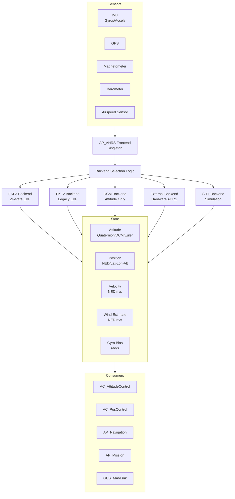

# AP_AHRS - Attitude and Heading Reference System

## Overview

The AP_AHRS library is the central attitude, heading, and position estimation system for ArduPilot. It provides a unified interface for accessing vehicle state information (attitude, position, velocity, wind) from multiple backend estimation algorithms. The library implements a singleton pattern accessed via `AP::ahrs()` and integrates seamlessly with all vehicle types including ArduCopter, ArduPlane, Rover, ArduSub, Blimp, and AntennaTracker.

AP_AHRS acts as a frontend that selects and manages multiple backend implementations:
- **EKF3 (NavEKF3)**: Primary 24-state Extended Kalman Filter with full sensor fusion
- **EKF2 (NavEKF2)**: Legacy EKF with similar capabilities
- **DCM (Direction Cosine Matrix)**: Lightweight attitude-only fallback
- **External**: Adapter for external AHRS hardware (VectorNav, Lord Microstrain)
- **SITL**: Perfect-knowledge simulation backend for testing

The backend selection prioritizes accuracy and availability, automatically failing over to more robust estimators when sensors become unavailable or unhealthy.

## Architecture



### Backend Selection Priority

The AHRS frontend automatically selects the best available backend based on health and configuration:

1. **EKF3** - Primary choice when `EKF_TYPE = 3` and EKF healthy
2. **EKF2** - Used when `EKF_TYPE = 2` and EKF healthy  
3. **DCM** - Fallback when `EKF_TYPE = 0` or EKF unhealthy
4. **External** - Used when external AHRS hardware configured
5. **SITL** - Simulation-only perfect backend

The selection logic runs in the `update()` method every loop iteration, monitoring backend health and switching if necessary to maintain vehicle safety.

## Key Components

### AP_AHRS (Frontend)

**Purpose**: Unified interface for attitude and navigation state

**Responsibilities**:
- Backend selection and health monitoring
- Sensor integration coordination
- Thread-safe state access via semaphore
- Parameter management (orientation, trim, GPS usage)
- Origin and home location tracking
- MAVLink telemetry reporting

**Lifecycle**: Init → Update (every loop) → Query state

**Thread Safety**: Must lock semaphore with `WITH_SEMAPHORE(ahrs.get_semaphore())` for concurrent access

**Hardware Dependencies**: Platform-independent, works with all HAL implementations

### AP_AHRS_Backend (Abstract Interface)

**Purpose**: Common interface for all estimation backends

**Key Methods**:
- `update()` - Pure virtual, called every loop to update state
- `get_results()` - Populates Estimates structure with current state
- `pre_arm_check()` - Validates backend health before arming
- `get_quaternion()` - Returns attitude as quaternion (NED to body frame)
- `get_velocity_NED()` - Returns velocity in meters/second
- `wind_estimate()` - Returns wind vector in NED frame

**Estimates Structure**: Contains roll/pitch/yaw (radians), DCM matrix, gyro estimate/drift (rad/s), acceleration (m/s²), location (lat/lon/alt)

### AP_AHRS_DCM (Direction Cosine Matrix Backend)

**Purpose**: Lightweight attitude estimation without requiring GPS position lock

**Algorithm**:
1. **Matrix Update**: Integrate gyro rates into 3x3 DCM matrix
2. **Normalization**: Maintain orthogonality and unit vectors
3. **Drift Correction**: PI controller adjusts gyro bias using:
   - Accelerometer (gravity vector alignment)
   - GPS velocity (when available)
   - Compass or GPS heading for yaw

**When to Use**:
- GPS-denied environments
- Simple applications not requiring cm-level position
- EKF failure fallback
- Reduced computational load

**Accuracy**: Attitude accurate to ~1 degree, position dead-reckoning from last GPS (meter-level)

**Tuning Parameters**:
- `kp`, `kp_yaw`: Proportional gains for drift correction
- `ki`, `ki_yaw`: Integral gains for gyro bias estimation
- `gps_gain`: GPS velocity correction strength
- `beta`: Renormalization  rate

Source: `libraries/AP_AHRS/AP_AHRS_DCM.cpp`

### AP_AHRS_View (Secondary Rotated View)

**Purpose**: Provides alternative attitude reference frame for unusual vehicle orientations

**Use Cases**:
- Tail-sitter multirotors (vertical takeoff, horizontal flight)
- Display systems needing different orientation
- Control systems with rotated reference frames

**Implementation**: Applies rotation matrix and pitch trim to parent AHRS attitude, passes through position/velocity unchanged

**Usage**: Created by AC_AttitudeControl for frame-specific control

Source: `libraries/AP_AHRS/AP_AHRS_View.h`

## Coordinate Frame Transformations

### Frame Definitions

**NED Frame** (North-East-Down):
- Earth-fixed reference frame
- Origin at EKF initialization point or home location
- +X = North, +Y = East, +Z = Down
- Right-handed coordinate system

**Body Frame** (Forward-Right-Down):
- Vehicle-fixed reference frame
- +X = Forward (nose direction)
- +Y = Right (starboard)
- +Z = Down
- Rotates with vehicle attitude

**Earth Frame**:
- NED-aligned frame for earth-referenced accelerations
- Used for gravity compensation and wind estimation

### Transformation Methods

```cpp
// Get rotation from NED to body frame as quaternion
Quaternion quat;
if (ahrs.get_quaternion(quat)) {
    // quat represents rotation: NED → Body
}

// Get rotation as Direction Cosine Matrix
Matrix3f dcm = ahrs.get_rotation_body_to_ned();
// dcm transforms body vectors to NED: v_ned = dcm * v_body

// 2D transformations (yaw-only rotation)
Vector2f ned_vector(1.0, 0.0);  // North
Vector2f body_vector = ahrs.earth_to_body2D(ned_vector);

Vector2f body_vec(1.0, 0.0);    // Forward
Vector2f ned_vec = ahrs.body_to_earth2D(body_vec);
```

### Unit Conventions

**Critical**: Always verify units to avoid control instability

- **Angles**: Radians (except lat/lon which are degrees in Location)
- **Angular Rates**: rad/s
- **Velocities**: m/s
- **Accelerations**: m/s²
- **Positions**: Meters (relative NED), degrees (lat/lon absolute)
- **Wind**: m/s in NED frame
- **Airspeed**: m/s (EAS or TAS explicitly specified)

## Attitude Estimation

### Sensor Fusion Process

1. **Gyro Integration**: Primary attitude source, integrated at high rate (400Hz+)
2. **Accelerometer Correction**: Gravity vector constrains roll/pitch drift
3. **Compass/GPS Yaw**: Magnetometer or GPS heading corrects yaw drift
4. **Bias Estimation**: Gyro drift estimated and compensated online

### DCM Algorithm

The Direction Cosine Matrix algorithm maintains a 3x3 rotation matrix representing vehicle attitude:

```
Update Cycle (400Hz typical):
1. matrix_update(): Integrate gyro rates
   DCM_new = DCM_old + (gyro × DCM_old) * dt
   
2. normalize(): Restore orthogonality
   - Gram-Schmidt orthogonalization
   - Renormalization to unit vectors
   
3. drift_correction(): PI controller
   - Roll/Pitch: Accelerometer vs DCM gravity vector
   - Yaw: Compass/GPS heading vs DCM heading
   - Accumulate integral term for gyro bias
```

Source: `libraries/AP_AHRS/AP_AHRS_DCM.cpp:matrix_update(), normalize(), drift_correction()`

### EKF Algorithm

Extended Kalman Filter provides full 6-DOF state estimation:

**State Vector** (24 states in EKF3):
- Position (3): North, East, Down
- Velocity (3): North, East, Down  
- Attitude (4): Quaternion components
- Gyro Bias (3): X, Y, Z
- Accel Bias (3): X, Y, Z
- Wind (2): North, East
- Compass Offsets (3): X, Y, Z
- Terrain Height (1)
- Body Frame Offsets (2)

**Measurement Updates**:
- GPS position and velocity
- Barometer altitude
- Compass heading
- Airspeed (when available)
- Range finder
- Optical flow
- Visual odometry

Source: `libraries/AP_NavEKF3/` for detailed EKF3 implementation

### Attitude Error Estimation

```cpp
// Get roll/pitch error estimate in radians
float rp_error = ahrs.get_error_rp();

// Get yaw error estimate in radians  
float yaw_error = ahrs.get_error_yaw();

// Check overall AHRS health
if (!ahrs.healthy()) {
    // AHRS unhealthy - take failsafe action
}
```

Error estimates come from EKF innovation monitoring or DCM observation residuals.

## Backend System Details

### EKF3 Backend (Primary)

**Capabilities**:
- cm-level position accuracy with good GPS
- Lane switching for multi-IMU redundancy
- Handles GPS glitches and sensor failures
- Optical flow and visual odometry fusion
- Terrain estimation for terrain following
- Supports external navigation sources

**Selection**: `EKF_TYPE = 3` parameter

**Pre-arm Checks**:
- EKF initialized and converged
- Innovation checks passing
- Sufficient GPS satellites (default 6+)
- Compass variance acceptable
- Position/velocity variance within limits

**Health Monitoring**: Continuous innovation monitoring, automatic lane switching if primary IMU fails

Source: `libraries/AP_NavEKF3/`

### EKF2 Backend (Legacy)

**Capabilities**: Similar to EKF3 but older implementation

**Selection**: `EKF_TYPE = 2` parameter

**Status**: Maintained for backwards compatibility, EKF3 recommended for new installations

Source: `libraries/AP_NavEKF2/`

### DCM Backend (Fallback)

**Capabilities**:
- Attitude-only estimation (no position EKF)
- Dead-reckoning from last GPS position
- Wind estimation from GPS/airspeed
- Lower computational load

**Selection**: `EKF_TYPE = 0` or automatic fallback when EKF unavailable

**Limitations**:
- Position accuracy degrades without GPS
- No innovation monitoring or redundancy
- Meter-level position accuracy vs cm-level for EKF

**Use Cases**: GPS-denied flight, failsafe fallback, simple applications

Source: `libraries/AP_AHRS/AP_AHRS_DCM.cpp`

### External Backend

**Purpose**: Interface to external AHRS hardware providing attitude/position

**Supported Hardware**:
- VectorNav VN-100/200/300
- Lord Microstrain 3DM series
- Other external AHRS via AP_ExternalAHRS interface

**Implementation**: Forwards queries to `AP::externalAHRS()`, converts external frame to ArduPilot NED frame

Source: `libraries/AP_AHRS/AP_AHRS_External.cpp`

### SITL Backend (Simulation)

**Purpose**: Perfect-knowledge backend for Software-In-The-Loop testing

**Data Source**: SITL::sitl_fdm simulation state

**Advantages**:
- No sensor noise or errors
- Known ground truth for algorithm validation
- Ideal EKF health for testing control algorithms

**Limitations**: Does not represent real sensor characteristics

Source: `libraries/AP_AHRS/AP_AHRS_SIM.cpp`

### Backend Switching Logic

The AHRS frontend monitors backend health every loop iteration:

```cpp
void AP_AHRS::update() {
    // Priority order for backend selection
    if (ekf3_available && ekf3_healthy) {
        active_backend = EKF3;
    } else if (ekf2_available && ekf2_healthy) {
        active_backend = EKF2;
    } else if (dcm_available) {
        active_backend = DCM;  // Always available as fallback
    }
    
    // Update active backend
    active_backend->update();
    active_backend->get_results(state);
}
```

**Failsafe Cascade**: EKF3 → EKF2 → DCM → Vehicle failsafe

**Impact**: Backend switching may cause momentary attitude discontinuities, but maintains vehicle control

Source: `libraries/AP_AHRS/AP_AHRS.cpp:update()`

## Position and Velocity Estimation

### Origin vs Home

**EKF Origin**:
- Point where EKF first gained absolute position reference (GPS lock)
- Used as reference for NED coordinate frame
- Set automatically by EKF or manually via `set_origin()`
- Remains fixed unless explicitly reset

**Home Location**:
- Arming location set by vehicle code
- Used for Return-To-Launch (RTL)
- May differ from EKF origin if vehicle moved before arming

### Position Methods

```cpp
// Absolute position (lat/lon/alt)
Location loc;
if (ahrs.get_location(loc)) {
    // loc.lat, loc.lng in degrees * 1e7
    // loc.alt in centimeters
}

// Position relative to EKF origin (meters, NED)
Vector3f pos_ned;
if (ahrs.get_relative_position_NED_origin(pos_ned)) {
    // pos_ned.x = North (m)
    // pos_ned.y = East (m)
    // pos_ned.z = Down (m, positive down)
}

// Position relative to home (meters, NED)
Vector3f pos_home;
if (ahrs.get_relative_position_NED_home(pos_home)) {
    // NED position relative to arming point
}

// 2D position only (North/East)
Vector2f pos_ne;
if (ahrs.get_relative_position_NE_origin(pos_ne)) {
    // Horizontal position only
}

// Altitude only (Down, positive down)
float pos_d;
ahrs.get_relative_position_D_home(pos_d);
```

### Velocity Estimation

```cpp
// 3D velocity in NED frame (m/s)
Vector3f vel_ned;
if (ahrs.get_velocity_NED(vel_ned)) {
    // vel_ned.x = North velocity (m/s)
    // vel_ned.y = East velocity (m/s)
    // vel_ned.z = Down velocity (m/s, positive down)
}

// Ground speed (horizontal velocity magnitude)
float groundspeed = ahrs.groundspeed();  // m/s

// Ground speed vector (North/East only)
Vector2f gs_vec = ahrs.groundspeed_vector();  // m/s
```

### Accuracy Considerations

| Backend | Position Accuracy | Velocity Accuracy | Update Rate |
|---------|-------------------|-------------------|-------------|
| EKF3    | cm-level with good GPS | dm/s-level | Async (GPS limited) |
| EKF2    | cm-level with good GPS | dm/s-level | Async (GPS limited) |
| DCM     | Meter-level dead-reckoning | m/s-level from GPS | GPS rate (5-10Hz) |
| External | Hardware dependent | Hardware dependent | Hardware rate |
| SITL    | Perfect (simulation) | Perfect (simulation) | Simulation rate |

## Wind Estimation

### Wind Estimation Algorithm

Wind is estimated by comparing GPS groundspeed with airspeed sensor (or synthetic airspeed):

```
Wind Vector = GPS Velocity - Airspeed Vector (body frame → NED)
```

Both DCM and EKF backends support wind estimation with different accuracy levels:
- **EKF**: Includes wind in state vector, optimal estimation with covariance
- **DCM**: Simple vector subtraction with complementary filtering

### Wind Methods

```cpp
// Enable wind estimation
ahrs.set_wind_estimation_enabled(true);

// Get wind estimate (NED frame, m/s)
Vector3f wind;
if (ahrs.wind_estimate(wind)) {
    // wind.x = Wind from North (m/s, positive = wind from north)
    // wind.y = Wind from East (m/s)
    // wind.z = Wind from Down (typically ~0)
}

// Get headwind component (negative = tailwind)
float headwind = ahrs.head_wind();  // m/s

// Get wind alignment (-1 = tailwind, 0 = crosswind, +1 = headwind)
float alignment = ahrs.wind_alignment(heading_deg);

// Trigger wind estimation update (DCM)
ahrs.estimate_wind();
```

### Configuration

- **AHRS_WIND_MAX**: Maximum expected wind speed (m/s), 0 = unlimited
- **AHRS_WIND_ESTIMATE**: Enable/disable wind estimation (plane only)

### Use Cases

- **Fixed-Wing**: Airspeed compensation, optimal climb/descent angles
- **Multirotor**: Attitude feedforward in high wind
- **Navigation**: Heading optimization for crosswind legs

Source: `libraries/AP_AHRS/AP_AHRS_DCM.cpp:estimate_wind()`

## Airspeed Integration

### Airspeed Sources

AHRS can provide airspeed estimates from multiple sources:

```cpp
enum AirspeedEstimateType {
    NO_NEW_ESTIMATE,    // No estimate available
    AIRSPEED_SENSOR,    // Physical pitot-static sensor
    DCM_SYNTHETIC,      // Synthesized from GPS/wind (DCM)
    EKF3_SYNTHETIC,     // Synthesized from EKF state
    SIM                 // SITL simulation
};
```

### Airspeed Methods

```cpp
// Get equivalent airspeed (EAS) estimate
float eas;
AirspeedEstimateType type;
if (ahrs.airspeed_estimate(eas, type)) {
    // eas in m/s
    // type indicates source
}

// Get true airspeed (TAS) - automatically applies EAS2TAS correction
float tas;
if (ahrs.airspeed_estimate_true(tas)) {
    // tas in m/s, altitude/temperature corrected
}

// Get airspeed vector in body frame
Vector3f airspeed_vec;
if (ahrs.airspeed_vector_true(airspeed_vec)) {
    // airspeed_vec.x = Forward airspeed (m/s)
    // airspeed_vec.y = Right airspeed (m/s) - typically small
    // airspeed_vec.z = Down airspeed (m/s) - typically small
}

// Check if physical sensor available
if (ahrs.airspeed_sensor_enabled()) {
    // Hardware sensor present and healthy
}

// Get synthetic airspeed (no physical sensor)
float synthetic_eas;
if (ahrs.synthetic_airspeed(synthetic_eas)) {
    // Estimate from GPS/wind when no sensor
}
```

### EAS vs TAS Conversion

```cpp
// Get conversion ratio
float eas2tas = ahrs.get_EAS2TAS();
float tas = eas * eas2tas;

// Get air density ratio
float density_ratio = ahrs.get_air_density_ratio();
// density_ratio = air_density / sea_level_density
// decreases with altitude
```

### Health Monitoring

```cpp
// Get airspeed innovation statistics
float innovation;        // m/s
float innovation_var;    // (m/s)²
uint32_t age_ms;
if (ahrs.airspeed_health_data(innovation, innovation_var, age_ms)) {
    // innovation = measured - predicted
    // Large innovation indicates sensor error or incorrect estimate
}
```

## Usage Patterns

### Basic Singleton Access

```cpp
// Get singleton instance
AP_AHRS &ahrs = AP::ahrs();

// Thread-safe access for concurrent reads
WITH_SEMAPHORE(ahrs.get_semaphore());

// Query current attitude
Quaternion quat;
if (ahrs.get_quaternion(quat)) {
    // Use quaternion
}
```

### Typical Vehicle Integration

```cpp
void Vehicle::update_ahrs() {
    // Update AHRS (called in main loop)
    ahrs.update();
    
    // Check health
    if (!ahrs.healthy()) {
        // Trigger failsafe
        handle_ahrs_failure();
    }
    
    // Get current state for control
    Vector3f gyro = ahrs.get_gyro();           // rad/s
    Vector3f vel_ned;
    ahrs.get_velocity_NED(vel_ned);            // m/s
    
    // Use state in controllers
    attitude_controller.update(gyro);
    position_controller.update(vel_ned);
}
```

### Pre-Arm Checks

```cpp
bool Vehicle::pre_arm_ahrs_checks() {
    char failure_msg[50];
    
    // Check if position required
    bool requires_position = (mode == AUTO || mode == GUIDED);
    
    // Run backend pre-arm check
    if (!ahrs.pre_arm_check(requires_position, failure_msg, sizeof(failure_msg))) {
        gcs().send_text(MAV_SEVERITY_CRITICAL, "PreArm: %s", failure_msg);
        return false;
    }
    
    // Check attitude error acceptable
    if (ahrs.get_error_rp() > 0.2f) {  // 0.2 radians ~11 degrees
        gcs().send_text(MAV_SEVERITY_CRITICAL, "PreArm: AHRS attitude error");
        return false;
    }
    
    return true;
}
```

### Frame Transformations

```cpp
// Transform body frame vector to NED
Vector3f body_vec(1.0, 0.0, 0.0);  // Forward in body frame
Matrix3f dcm = ahrs.get_rotation_body_to_ned();
Vector3f ned_vec = dcm * body_vec;

// 2D yaw-only transformation
Vector2f forward_body(1.0, 0.0);
Vector2f forward_ned = ahrs.body_to_earth2D(forward_body);

// Inverse transformation
Vector2f north_ned(1.0, 0.0);
Vector2f north_body = ahrs.earth_to_body2D(north_ned);
```

## Configuration Parameters

| Parameter | Description | Default | Units | Range |
|-----------|-------------|---------|-------|-------|
| **AHRS_ORIENTATION** | Board orientation | 0 | enum | 0-47 |
| **AHRS_TRIM_X** | Pitch trim | 0 | radians | ±0.1745 (±10°) |
| **AHRS_TRIM_Y** | Roll trim | 0 | radians | ±0.1745 (±10°) |
| **AHRS_GPS_USE** | GPS usage mode | 1 | enum | 0=Disable, 1=Enable, 2=EnableWithHeight |
| **AHRS_GPS_MINSATS** | Minimum satellites | 6 | count | 4-10 |
| **AHRS_YAW_P** | DCM yaw gain | 0.2 | gain | 0.05-0.4 |
| **AHRS_RP_P** | DCM roll/pitch gain | 0.2 | gain | 0.05-0.4 |
| **AHRS_WIND_MAX** | Maximum wind | 0 | m/s | 0-100 (0=unlimited) |
| **EKF_TYPE** | EKF selection | 3 | enum | 0=DCM, 2=EKF2, 3=EKF3 |

### Parameter Usage Notes

**AHRS_ORIENTATION**: Defines board mounting orientation
- 0 = No rotation (forward = vehicle forward)
- 1-47 = Various rotation combinations
- Custom rotations via AHRS_CUSTOM_ROLL/PITCH/YAW

**AHRS_TRIM_X/Y**: Compensates for permanent CG offset or sensor mounting error
- Positive TRIM_X = nose down compensation
- Positive TRIM_Y = right wing down compensation
- Should be small (<5°) - larger values indicate mechanical problem

**AHRS_GPS_USE**: Controls GPS integration
- 0 = Disable: Attitude only, no position (DCM forced)
- 1 = Enable: GPS position and velocity
- 2 = EnableWithHeight: GPS altitude fused with baro

**EKF_TYPE**: Primary backend selection
- 0 = DCM only (no EKF, attitude only)
- 2 = EKF2 (legacy, maintained for compatibility)
- 3 = EKF3 (recommended for new installations)

Source: `libraries/AP_AHRS/AP_AHRS.cpp:var_info[]`

## Testing with SITL

### Basic SITL Setup

```bash
# Start SITL with ArduCopter
cd ardupilot
sim_vehicle.py -v ArduCopter --console --map

# Start SITL with ArduPlane
sim_vehicle.py -v ArduPlane --console --map
```

### AHRS Health Checks

```bash
# Check AHRS status
status ahrs

# View active EKF type
param show EKF_TYPE

# Monitor AHRS parameters
watch "param show AHRS_*"
```

### Testing DCM Fallback

```bash
# Force DCM-only mode (disable EKF)
param set EKF_TYPE 0
# Vehicle will use DCM backend for attitude estimation

# Re-enable EKF3
param set EKF_TYPE 3
```

### Simulating Sensor Failures

```bash
# Simulate GPS failure
param set SIM_GPS_DISABLE 1
# AHRS should maintain attitude but lose position accuracy

# Restore GPS
param set SIM_GPS_DISABLE 0

# Simulate compass failure
param set SIM_MAG1_DISABLE 1
# Should trigger compass failsafe warnings

# Restore compass
param set SIM_MAG1_DISABLE 0

# Simulate IMU failure
param set SIM_ACC1_DISABLE 1
# EKF should switch to secondary IMU if available
```

### Monitoring Backend Health

```bash
# Enable EKF status reporting (10Hz)
# EKF_STATUS_REPORT MAVLink messages show:
# - Active backend
# - Innovation test status
# - Position/velocity variance
# - Gyro bias estimates

# View in MAVProxy console:
# AHRS messages logged automatically
```

### Testing Wind Estimation

```bash
# Enable simulated wind
param set SIM_WIND_SPD 10    # 10 m/s wind speed
param set SIM_WIND_DIR 270   # Wind from west

# Enable wind estimation
param set AHRS_WIND_MAX 50

# Monitor wind estimate in logs
# Look for WIND messages or EKF_STATUS_REPORT wind fields
```

### Log Analysis

```bash
# Download logs from SITL
# Logs stored in: logs/

# Analyze AHRS performance
# Key log messages:
# - AHRS: Roll, pitch, yaw, errors
# - ATT: Attitude quaternion
# - POS: Position NED
# - EKF*: EKF-specific status

# Use MAVExplorer or Mission Planner log analysis
```

## Common Integration Patterns

### Flight Controllers

**Update Frequency**:
- Copter: 400Hz main loop → AHRS update at 400Hz
- Plane: 50-400Hz main loop → AHRS update at loop rate
- Rover: 50Hz main loop → AHRS update at 50Hz

**Integration**:
```cpp
void Copter::update_ahrs() {
    ahrs.update();  // Called every main loop iteration
}

void Copter::fast_loop() {
    // Read latest gyro for control
    Vector3f gyro = ahrs.get_gyro();
    
    // Pass to attitude controller
    attitude_control->rate_controller_run();
}
```

Source: `ArduCopter/Copter.cpp`, `ArduPlane/Plane.cpp`

### Attitude Control

**Usage**: AC_AttitudeControl queries AHRS for current attitude and rates

```cpp
void AC_AttitudeControl::attitude_controller_run() {
    // Get current attitude
    Quaternion current_att;
    ahrs.get_quaternion(current_att);
    
    // Get current rates
    Vector3f gyro = ahrs.get_gyro();
    
    // Calculate attitude error
    Quaternion att_error = desired_att * current_att.inverse();
    
    // Attitude → rate command
    Vector3f rate_cmd = att_error_to_rate(att_error);
    
    // Rate controller
    rate_controller(rate_cmd, gyro);
}
```

Source: `libraries/AC_AttitudeControl/AC_AttitudeControl.cpp`

### Position Control

**Usage**: AC_PosControl uses AHRS for position and velocity feedback

```cpp
void AC_PosControl::update_xy_controller() {
    // Get current position
    Vector3f pos;
    if (!ahrs.get_relative_position_NED_home(pos)) {
        // Position not available - hold altitude only
        return;
    }
    
    // Get current velocity
    Vector3f vel;
    ahrs.get_velocity_NED(vel);
    
    // Position error → velocity command
    Vector2f vel_cmd = (pos_target.xy() - pos.xy()) * kP;
    
    // Velocity error → acceleration command
    Vector2f accel_cmd = (vel_cmd - vel.xy()) * kD;
}
```

Source: `libraries/AC_PosControl/AC_PosControl.cpp`

### Navigation

**Usage**: AP_Navigation uses AHRS for bearing, distance calculations

```cpp
void AP_Navigation::update_waypoint_tracking() {
    // Get current position
    Location current_loc;
    if (!ahrs.get_location(current_loc)) {
        return;
    }
    
    // Get groundspeed for ETA calculation
    float gs = ahrs.groundspeed();
    
    // Get wind for crosstrack correction
    Vector3f wind;
    ahrs.wind_estimate(wind);
    
    // Calculate bearing to waypoint
    float bearing = current_loc.get_bearing_to(waypoint);
    
    // Calculate crosstrack error
    float crosstrack = calculate_crosstrack(current_loc, waypoint);
}
```

### Mission Execution

**Usage**: AP_Mission queries AHRS for location, uses for waypoint navigation

```cpp
bool AP_Mission::reached_waypoint() {
    // Get current position
    Location current_loc;
    if (!ahrs.get_location(current_loc)) {
        return false;
    }
    
    // Calculate distance to waypoint
    float dist = current_loc.get_distance(waypoint);
    
    // Check if within acceptance radius
    return (dist < waypoint_radius_m);
}
```

Source: `libraries/AP_Mission/AP_Mission.cpp`

### Wind Compensation (Plane)

**Usage**: ArduPlane uses wind estimate for optimal climb/cruise

```cpp
void Plane::update_flight_mode() {
    // Get wind estimate for airspeed compensation
    Vector3f wind;
    if (ahrs.wind_estimate(wind)) {
        // Adjust throttle for headwind
        float headwind = ahrs.head_wind();
        throttle_compensated = throttle_base + (headwind * throttle_gain);
        
        // Adjust pitch for optimal angle
        pitch_target = calculate_optimal_pitch(wind);
    }
}
```

## Safety Considerations

### AHRS Health Monitoring

**Critical**: AHRS health directly affects vehicle safety. Always monitor `ahrs.healthy()` status.

```cpp
if (!ahrs.healthy()) {
    // AHRS unhealthy - immediate action required
    // Options:
    // 1. Switch to secondary attitude source (if available)
    // 2. Enter stabilize mode (attitude-only control)
    // 3. Land immediately
    // 4. Trigger failsafe RTL
}
```

### Backend Accuracy Comparison

| Backend | Position Accuracy | Failure Mode | Safety Level |
|---------|-------------------|--------------|--------------|
| **EKF3** | cm-level | Lane switching to backup IMU | High |
| **EKF2** | cm-level | Fallback to DCM | High |
| **DCM** | Meter-level dead-reckoning | Manual control only | Medium |
| **External** | Hardware-dependent | Fallback to internal backend | Varies |
| **SITL** | Perfect (simulation) | N/A | Test only |

### Pre-Arm Validation

**Critical**: Always run pre-arm checks before flight

```cpp
// Pre-arm AHRS checks validate:
// 1. Backend initialized and healthy
// 2. Attitude error within acceptable limits
// 3. Position available if required by flight mode
// 4. EKF variance within thresholds
// 5. Sufficient GPS satellites
// 6. Compass health acceptable

if (!pre_arm_ahrs_checks()) {
    // Do not allow arming
    // Display failure message to pilot
}
```

### Backend Failover Impact

**Warning**: Backend switching may cause momentary attitude discontinuities

When AHRS switches from EKF to DCM (e.g., GPS loss):
1. Attitude may jump by several degrees
2. Position estimate becomes dead-reckoning
3. Velocity accuracy degrades
4. Controllers should re-initialize

**Mitigation**:
- Use EKF lane switching (stays within EKF)
- Monitor innovation tests before switching
- Re-initialize controllers after switch
- Consider immediate landing if critical flight phase

### Thread Safety

**Critical**: AHRS accessed from multiple threads (main loop, scripting, telemetry)

```cpp
// Always use semaphore for thread-safe access
WITH_SEMAPHORE(ahrs.get_semaphore());

// Read AHRS state
Quaternion quat;
ahrs.get_quaternion(quat);

// Semaphore automatically released at scope exit
```

**Deadlock Prevention**: Never call AHRS methods while holding other semaphores that AHRS might need.

### Coordinate Frame Errors

**Warning**: Coordinate frame errors can cause control instability or crashes

**Common Mistakes**:
- Mixing NED and body frame vectors
- Forgetting Down is positive in NED
- Using degrees instead of radians
- Assuming vehicle frame == body frame (not true for tail-sitters)

**Validation**:
```cpp
// Always verify frame and units
Vector3f vel_ned;  // Explicitly named
ahrs.get_velocity_NED(vel_ned);  // NED frame, m/s

// Convert to body frame if needed
Matrix3f dcm = ahrs.get_rotation_body_to_ned();
Vector3f vel_body = dcm.transposed() * vel_ned;  // NED → body
```

### EKF vs DCM Accuracy

**Critical Decision**: Mode requirements must match backend capabilities

| Flight Mode | Minimum Backend | Reason |
|-------------|----------------|--------|
| **Stabilize** | DCM | Attitude-only, no position required |
| **AltHold** | DCM | Altitude from baro sufficient |
| **Loiter** | EKF | Requires cm-level position hold |
| **Auto Mission** | EKF | Requires waypoint navigation accuracy |
| **RTL** | EKF | Requires accurate position for return path |
| **Land** | DCM | Attitude sufficient for manual landing |
| **Guided** | EKF | External control requires position |

**Pre-Flight Check**: Verify EKF healthy before launching in modes requiring position.

## Implementation Notes

### Singleton Pattern

```cpp
// AHRS uses singleton pattern for global access
static AP_AHRS *_singleton;

// Accessed via macro
#define AP::ahrs() (*AP_AHRS::get_singleton())

// Usage
AP_AHRS &ahrs = AP::ahrs();
```

Source: `AP_AHRS.h:static AP_AHRS *_singleton`

### Update Loop Integration

```cpp
// Called in vehicle main loop (e.g., Copter::update_ahrs())
void AP_AHRS::update(bool skip_ins_update) {
    // Request IMU update (unless skipped)
    if (!skip_ins_update) {
        AP::ins().update();
    }
    
    // Lock semaphore for thread safety
    WITH_SEMAPHORE(_rsem);
    
    // Select best backend based on health/priority
    select_active_backend();
    
    // Update active backend
    active_backend->update();
    
    // Populate state structure
    active_backend->get_results(state);
    
    // Update views (if any)
    for (auto *view : views) {
        view->update();
    }
}
```

Source: `libraries/AP_AHRS/AP_AHRS.cpp:update()`

### Thread Safety

```cpp
// All AHRS state protected by semaphore
HAL_Semaphore _rsem;

// Accessors implicitly thread-safe (return copies)
Vector3f get_gyro() const { return state.gyro_estimate; }

// Methods requiring atomic reads use semaphore internally
bool get_velocity_NED(Vector3f &vec) const {
    WITH_SEMAPHORE(_rsem);
    if (!have_inertial_nav()) return false;
    vec = state.velocity_NED;
    return true;
}
```

### Logging Integration

```cpp
// AHRS logs via AP_Logger
void AP_AHRS::log_write() {
    // Log AHRS state
    AP::logger().WriteBlock(&pkt_ahrs, sizeof(pkt_ahrs));
    
    // Log attitude
    AP::logger().WriteBlock(&pkt_att, sizeof(pkt_att));
    
    // Log position
    AP::logger().WriteBlock(&pkt_pos, sizeof(pkt_pos));
}
```

**Log Messages**:
- **AHRS**: Roll, pitch, yaw, errors
- **ATT**: Attitude quaternion
- **POS**: Position NED
- **ORGN**: Origin location
- **AOA/SSA**: Angle of attack / sideslip (plane)

Source: `libraries/AP_AHRS/AP_AHRS_Logging.cpp`

### MAVLink Telemetry

```cpp
// AHRS sends telemetry via GCS_MAVLink
void AP_AHRS::send_mavlink(mavlink_channel_t chan) {
    // ATTITUDE message (quaternion)
    mavlink_msg_attitude_quaternion_send(...);
    
    // EKF_STATUS_REPORT (if EKF active)
    if (using_ekf) {
        active_backend->send_ekf_status_report(chan);
    }
}
```

**MAVLink Messages**:
- ATTITUDE / ATTITUDE_QUATERNION (high rate)
- LOCAL_POSITION_NED
- GLOBAL_POSITION_INT
- EKF_STATUS_REPORT (backend health)
- VFR_HUD (groundspeed, altitude)

Source: `libraries/GCS_MAVLink/GCS_Common.cpp`

### Compile-Time Configuration

```cpp
// AP_AHRS_config.h controls feature availability
#ifndef AP_AHRS_ENABLED
#define AP_AHRS_ENABLED 1  // AHRS always enabled on autopilot
#endif

#ifndef AP_AHRS_DCM_ENABLED
#define AP_AHRS_DCM_ENABLED 1  // DCM available as fallback
#endif

#ifndef HAL_NAVEKF3_AVAILABLE
#define HAL_NAVEKF3_AVAILABLE 1  // EKF3 available on most boards
#endif

// External and SITL conditionally compiled
#ifndef AP_AHRS_EXTERNAL_ENABLED
#define AP_AHRS_EXTERNAL_ENABLED BOARD_FLASH_SIZE > 1024
#endif

#ifndef AP_AHRS_SIM_ENABLED
#define AP_AHRS_SIM_ENABLED (CONFIG_HAL_BOARD == HAL_BOARD_SITL)
#endif
```

Source: `libraries/AP_AHRS/AP_AHRS_config.h`

## References

### Source Files

- **Frontend**: `libraries/AP_AHRS/AP_AHRS.{h,cpp}`
- **Backend Interface**: `libraries/AP_AHRS/AP_AHRS_Backend.{h,cpp}`
- **DCM Backend**: `libraries/AP_AHRS/AP_AHRS_DCM.{h,cpp}`
- **External Backend**: `libraries/AP_AHRS/AP_AHRS_External.{h,cpp}`
- **SITL Backend**: `libraries/AP_AHRS/AP_AHRS_SIM.{h,cpp}`
- **View Class**: `libraries/AP_AHRS/AP_AHRS_View.{h,cpp}`
- **Logging**: `libraries/AP_AHRS/AP_AHRS_Logging.cpp`
- **Configuration**: `libraries/AP_AHRS/AP_AHRS_config.h`
- **Log Structures**: `libraries/AP_AHRS/LogStructure.h`

### Related Libraries

- **EKF3**: `libraries/AP_NavEKF3/` - Primary Extended Kalman Filter implementation
- **EKF2**: `libraries/AP_NavEKF2/` - Legacy EKF implementation
- **InertialSensor**: `libraries/AP_InertialSensor/` - IMU data source
- **GPS**: `libraries/AP_GPS/` - Position data source
- **Compass**: `libraries/AP_Compass/` - Heading data source
- **Barometer**: `libraries/AP_Baro/` - Altitude data source
- **Airspeed**: `libraries/AP_Airspeed/` - Airspeed sensor data

### Vehicle Integration

- **ArduCopter**: `ArduCopter/Copter.cpp` - Multirotor integration
- **ArduPlane**: `ArduPlane/Plane.cpp` - Fixed-wing integration
- **Rover**: `Rover/Rover.cpp` - Ground vehicle integration
- **ArduSub**: `ArduSub/Sub.cpp` - Underwater vehicle integration

### Control Systems

- **Attitude Control**: `libraries/AC_AttitudeControl/` - Uses AHRS attitude/rates
- **Position Control**: `libraries/AC_PosControl/` - Uses AHRS position/velocity
- **Navigation**: `libraries/AP_Navigation/` - Uses AHRS for guidance

### Example Code

- **AHRS Test**: `libraries/AP_AHRS/examples/AHRS_Test/AHRS_Test.cpp`
- **Minimal vehicle harness** demonstrating AHRS initialization and update loop

### External Documentation

- **ArduPilot Wiki**: https://ardupilot.org/dev/docs/apmcopter-programming-attitude-control-2.html
- **EKF Theory**: https://ardupilot.org/dev/docs/extended-kalman-filter.html
- **DCM Tutorial**: http://www.starlino.com/dcm_tutorial.html
- **MAVLink Protocol**: https://mavlink.io/en/messages/common.html
