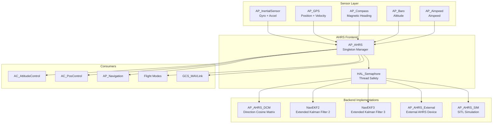
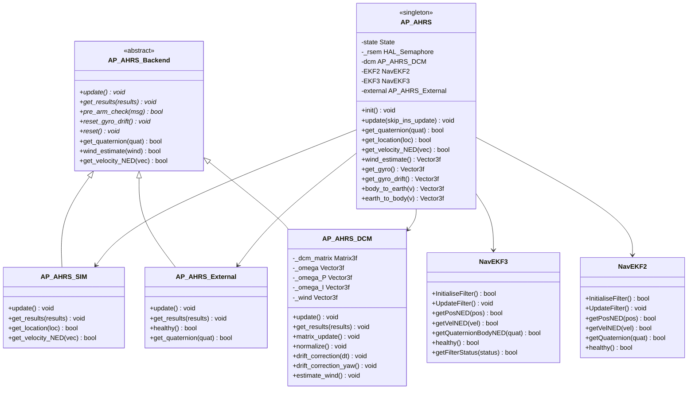
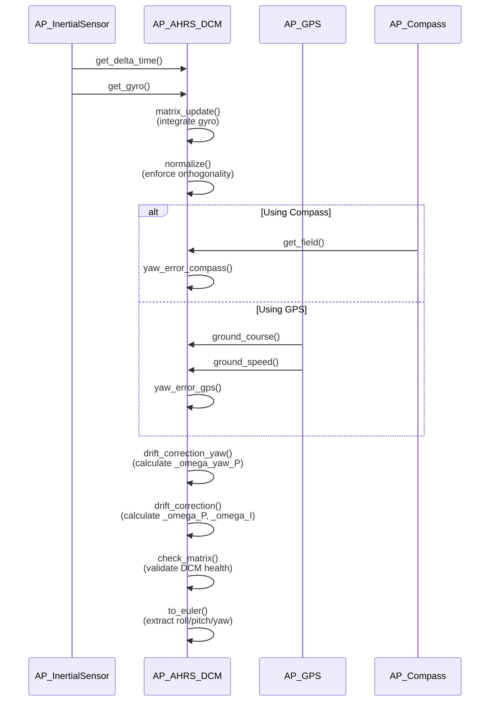
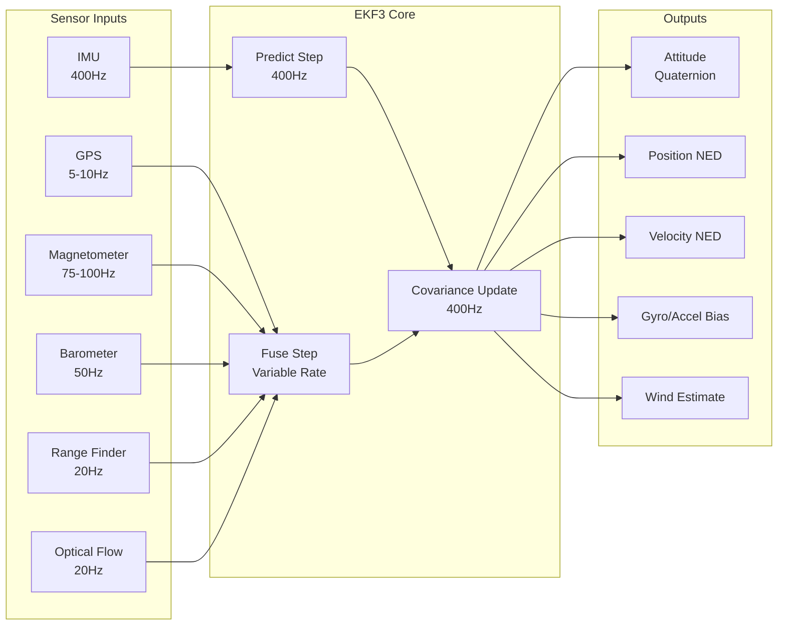
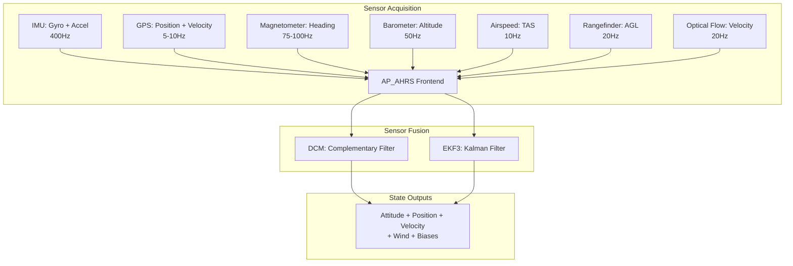

# AP_AHRS Library


## Table of Contents
- [Overview](#overview)
- [Architecture](#architecture)
- [Backend Implementations](#backend-implementations)
- [DCM Algorithm](#dcm-algorithm)
- [EKF Integration](#ekf-integration)
- [Sensor Fusion](#sensor-fusion)
- [Coordinate Frame Transformations](#coordinate-frame-transformations)
- [Mathematical Foundations](#mathematical-foundations)
- [State Estimation](#state-estimation)
- [Performance Characteristics](#performance-characteristics)
- [API Reference](#api-reference)
- [Configuration Parameters](#configuration-parameters)
- [Integration Examples](#integration-examples)
- [Testing](#testing)

## Overview

The AP_AHRS (Attitude Heading Reference System) library is a **safety-critical** component of ArduPilot that provides the authoritative source for vehicle attitude, heading, and navigation state estimation. It implements a flexible architecture supporting multiple estimation backends with automatic fallback capabilities to ensure robust operation in all flight conditions.

**Source Files**: `/libraries/AP_AHRS/`

### Key Responsibilities

- **Attitude Estimation**: Provides roll, pitch, and yaw angles (Euler) and quaternion representations
- **Position & Velocity**: Estimates vehicle position, velocity, and acceleration in NED (North-East-Down) frame
- **Wind Estimation**: Calculates wind velocity for airspeed correction and flight control
- **Sensor Fusion**: Integrates data from IMU, GPS, magnetometer, barometer, and airspeed sensors
- **Backend Management**: Selects and switches between estimation algorithms based on sensor availability and health
- **Coordinate Transformations**: Manages conversions between body, autopilot, and earth reference frames
- **Origin Management**: Maintains home position and inertial navigation origin

### Key Features

- Singleton manager pattern with thread-safe access via semaphores
- Multiple backend support: DCM, EKF2, EKF3, External AHRS, SITL Simulation
- Automatic backend switching based on availability and health
- Real-time operation at 400Hz update rate
- Watchdog recovery for attitude persistence across resets
- Runtime board orientation configuration
- Trim angle compensation for autopilot mounting offsets

## Architecture

The AP_AHRS system follows a frontend-backend architecture pattern where a singleton manager (`AP_AHRS`) coordinates multiple estimation backends through a common interface (`AP_AHRS_Backend`).

### System Architecture Diagram



### Class Hierarchy



### Backend Selection Priority

The AP_AHRS manager selects the active backend based on configuration, availability, and health status. The selection follows this priority order (configurable via `AHRS_EKF_TYPE` parameter):

**Source**: `/libraries/AP_AHRS/AP_AHRS.cpp:392-453` (update method)

```
Priority Order (when AHRS_EKF_TYPE configured):
1. External AHRS (if AP_AHRS_EXTERNAL_ENABLED and healthy)
2. SITL Simulation (if AP_AHRS_SIM_ENABLED in SITL builds)
3. EKF3 (if HAL_NAVEKF3_AVAILABLE and AHRS_EKF_TYPE=3)
4. EKF2 (if HAL_NAVEKF2_AVAILABLE and AHRS_EKF_TYPE=2)
5. DCM (fallback if AP_AHRS_DCM_ENABLED)
```

**Update Sequence** (`AP_AHRS::update()`):
1. Call `AP::ins().update()` to acquire latest IMU samples
2. Acquire semaphore lock (`WITH_SEMAPHORE(_rsem)`) for thread safety
3. Update trim rotation matrices for autopilot-to-vehicle frame
4. Update DCM backend (always runs as fallback)
5. Update SITL backend (if enabled)
6. Update External AHRS backend (if enabled)
7. Update EKF2/EKF3 in priority order based on `AHRS_EKF_TYPE`
8. Call module hooks for extensions
9. Update secondary attitude view (if configured)
10. Publish state to consumers via `update_state()`

### Component Responsibilities

#### AP_AHRS (Frontend Manager)
**Source**: `/libraries/AP_AHRS/AP_AHRS.h`, `/libraries/AP_AHRS/AP_AHRS.cpp`

- **Singleton Management**: Accessed via `AP::ahrs()` or `AP_AHRS::get_singleton()`
- **Backend Coordination**: Initializes and updates all enabled backends
- **State Publishing**: Maintains canonical state structure for consumers
- **Thread Safety**: Provides semaphore-protected access to attitude data
- **Origin Management**: Manages home position and inertial navigation origin
- **Watchdog Recovery**: Restores attitude from persistent memory after reset
- **Parameter Management**: Handles AHRS configuration via AP_Param system

#### AP_AHRS_Backend (Abstract Interface)
**Source**: `/libraries/AP_AHRS/AP_AHRS_Backend.h`, `/libraries/AP_AHRS/AP_AHRS_Backend.cpp`

Defines the contract all backends must implement:

```cpp
// Source: /libraries/AP_AHRS/AP_AHRS_Backend.h:40-120
struct Estimates {
    float roll_rad, pitch_rad, yaw_rad;
    Matrix3f dcm_matrix;
    Vector3f gyro_estimate;
    Vector3f gyro_drift;
    Vector3f accel_ef;        // earth-frame acceleration
    Vector3f accel_bias;
    Location location;
    bool location_valid;
};

virtual void update() = 0;
virtual void get_results(Estimates &results) = 0;
virtual bool pre_arm_check(bool requires_position, char *failure_msg, uint8_t failure_msg_len) const = 0;
virtual void reset_gyro_drift(void) = 0;
virtual void reset() = 0;
```

Shared utilities provided by base class:
- Trim angle management and persistence
- Board orientation application
- Trigonometric caching for performance
- 2D coordinate transformations (body ↔ earth)
- Angle of attack (AOA) and sideslip angle (SSA) estimation
- EAS ↔ TAS conversion helpers

#### AP_AHRS_View (Secondary Attitude View)
**Source**: `/libraries/AP_AHRS/AP_AHRS_View.h`, `/libraries/AP_AHRS/AP_AHRS_View.cpp`

Provides a rotated secondary attitude view for specialized consumers (e.g., camera gimbals, antenna trackers):

- Maintains independent rotation matrix (`rot_view`)
- Provides rotated gyro and accelerometer data
- Supports custom pitch trim for display applications
- Updates synchronously with main AHRS

## Backend Implementations

### 1. AP_AHRS_DCM - Direction Cosine Matrix Backend

**Source**: `/libraries/AP_AHRS/AP_AHRS_DCM.h`, `/libraries/AP_AHRS/AP_AHRS_DCM.cpp`

The DCM backend implements a complementary filter using Direction Cosine Matrix (DCM) representation for attitude estimation. It serves as the primary fallback when EKF is unavailable or unhealthy.

#### DCM Algorithm Overview

The DCM algorithm maintains a 3×3 rotation matrix representing the orientation from body frame to earth frame. It uses gyroscope integration corrected by accelerometer and magnetometer/GPS observations.

**Mathematical Basis**: "Direction Cosine Matrix IMU: Theory" by William Premerlani and Paul Bizard

#### Key Components

**Matrix Update** (Gyro Integration):
```cpp
// Source: /libraries/AP_AHRS/AP_AHRS_DCM.cpp:78
void AP_AHRS_DCM::matrix_update()
{
    // Update the DCM matrix based on gyro measurements
    // Applies omega (corrected gyro) to rotate the DCM matrix
    _dcm_matrix.rotate(_omega * delta_t);
}
```

**Normalization** (Orthogonality Enforcement):
```cpp
// Source: /libraries/AP_AHRS/AP_AHRS_DCM.cpp:349-385
void AP_AHRS_DCM::normalize()
{
    // Enforce orthogonality constraints on DCM matrix
    // Prevents numerical drift from accumulating
    // Uses Gram-Schmidt orthogonalization
}
```

**Drift Correction** (PI Controller):
```cpp
// Source: /libraries/AP_AHRS/AP_AHRS_DCM.cpp:84
void AP_AHRS_DCM::drift_correction(float delta_t)
{
    // Proportional-Integral controller corrects gyro drift
    // Proportional term (_omega_P): immediate correction
    // Integral term (_omega_I): long-term drift estimation
    
    _omega = _gyro + _omega_I + _omega_P + _omega_yaw_P;
}
```

#### DCM Update Flow



#### Drift Correction Details

**Proportional Gain Adjustment**:
```cpp
// Source: /libraries/AP_AHRS/AP_AHRS_DCM.cpp:404-413
float AP_AHRS_DCM::_P_gain(float spin_rate)
{
    // Increases P gain during fast rotations to maintain accuracy
    // Based on "Fast Rotations" paper by Bill Premerlani
    if (spin_rate < radians(50)) return 1.0f;
    if (spin_rate > radians(500)) return 10.0f;
    return spin_rate/radians(50);
}
```

**Yaw Gain Modulation**:
```cpp
// Source: /libraries/AP_AHRS/AP_AHRS_DCM.cpp:423-431
float AP_AHRS_DCM::_yaw_gain(void) const
{
    // Reduces yaw correction gain when velocity changes are observable
    // Prevents compass errors from causing roll/pitch coupling in planes
    const float VdotEFmag = _accel_ef.xy().length();
    if (VdotEFmag <= 4.0f) {
        return 0.2f*(4.5f - VdotEFmag);
    }
    return 0.1f;
}
```

#### Yaw Source Selection

**Compass vs GPS Logic**:
```cpp
// Source: /libraries/AP_AHRS/AP_AHRS_DCM.cpp:458-492
bool AP_AHRS_DCM::use_compass(void)
{
    // Priority: Compass preferred for yaw correction
    // Switches to GPS when:
    // 1. Flying forward (fly_forward flag set)
    // 2. GPS has valid fix and sufficient satellite count
    // 3. Ground speed > GPS_SPEED_MIN (3 m/s)
    // 4. Yaw error > 45° and wind < 80% of ground speed (flyaway protection)
    
    if (error > 45 && _wind.length() < GPS.ground_speed()*0.8f) {
        if (millis() - _last_consistent_heading > 2000) {
            return false;  // Use GPS for yaw
        }
    }
    return true;  // Use compass
}
```

#### Renormalization Process

**Purpose**: Prevents numerical error accumulation that causes DCM matrix to lose orthogonality.

```cpp
// Source: /libraries/AP_AHRS/AP_AHRS_DCM.cpp:296-337
bool AP_AHRS_DCM::renorm(Vector3f const &a, Vector3f &result)
{
    // Calculate renormalization factor
    const float renorm_val = 1.0f / a.length();
    
    // Safety checks: renorm_val should be close to 1.0
    if (!(renorm_val < 2.0f && renorm_val > 0.5f)) {
        // Matrix is drifting - may need reset
        if (!(renorm_val < 1.0e6f && renorm_val > 1.0e-6f)) {
            return false;  // Catastrophic error - reset required
        }
    }
    
    result = a * renorm_val;
    return true;
}
```

#### Wind Estimation

The DCM backend implements wind velocity estimation using velocity complementary filter:

**Source**: `/libraries/AP_AHRS/AP_AHRS_DCM.cpp` (estimate_wind method)

- Compares GPS velocity with estimated airspeed vector
- Applies complementary filter with time constant controlled by `AHRS_COMP_BETA` parameter
- Provides synthetic airspeed when airspeed sensor unavailable
- Wind estimate used for airspeed correction and navigation

#### DCM Performance Characteristics

- **Update Rate**: Matches IMU sample rate (typically 400Hz for gyro integration, drift correction at lower rate)
- **Convergence Time**: ~20 seconds for initial attitude acquisition
- **Yaw Accuracy**: ±5° with magnetometer, ±10° with GPS
- **Roll/Pitch Accuracy**: ±2° in normal flight conditions
- **CPU Usage**: ~200 µs per update on STM32F4 @ 168MHz
- **Memory**: ~500 bytes RAM for state variables

#### DCM Configuration Parameters

```cpp
// Source: /libraries/AP_AHRS/AP_AHRS.cpp:61-150
AHRS_GPS_GAIN  // Default: 1.0, Range: 0.0-1.0
               // Controls GPS influence on attitude correction

AHRS_GPS_USE   // Default: 1 (Enable), Values: 0=Disabled, 1=Position, 2=Position+Height
               // Enables GPS for DCM navigation and position-down

AHRS_YAW_P     // Default: 0.2, Range: 0.1-0.4
               // Yaw proportional gain (compass/GPS heading tracking)

AHRS_RP_P      // Default: 0.2, Range: 0.1-0.4
               // Roll/Pitch proportional gain (accelerometer correction)

AHRS_COMP_BETA // Default: 0.1, Range: 0.001-0.5
               // Velocity complementary filter beta coefficient
               // Time constant = 0.1/beta

AHRS_GPS_MINSATS // Default: 6, Range: 0-10
                 // Minimum satellites for GPS-based corrections
```

### 2. NavEKF2 - Extended Kalman Filter (Legacy)

**Source**: `/libraries/AP_NavEKF2/`

NavEKF2 is the legacy Extended Kalman Filter implementation. **Note**: EKF2 is slated for removal in future versions (HAL_NAVEKF2_AVAILABLE defaults to 0 as of version 4.5).

#### EKF2 Features (Historical Reference)

- 24-state Extended Kalman Filter
- Quaternion attitude representation
- IMU delta angle and delta velocity fusion
- GPS position and velocity fusion
- Magnetometer fusion with declination
- Barometer height fusion
- Optical flow and range finder integration
- Multi-lane operation for redundancy (supports up to 2 parallel cores)

EKF2 integration details are maintained for legacy support but are not covered extensively in this documentation.

### 3. NavEKF3 - Extended Kalman Filter (Current)

**Source**: `/libraries/AP_NavEKF3/`

NavEKF3 is the current primary navigation filter for ArduPilot, providing high-accuracy state estimation with advanced sensor fusion capabilities.

#### EKF3 Architecture

NavEKF3 implements a 24-state Extended Kalman Filter with the following state vector:

```
State Vector (24 states):
- Quaternion attitude (4 states: q0, q1, q2, q3)
- Velocity NED (3 states: vN, vE, vD)
- Position NED (3 states: pN, pE, pD)
- Gyro bias (3 states: delta_angle_bias_x, delta_angle_bias_y, delta_angle_bias_z)
- Accel Z bias (1 state: delta_velocity_bias_z)
- Earth magnetic field NED (3 states: magN, magE, magD)
- Body magnetic field XYZ (3 states: magX, magY, magZ)
- Wind velocity NE (2 states: windN, windE)
- Optional: Terrain offset (1 state when range finder active)
```

#### EKF3 Integration in AHRS

**Source**: `/libraries/AP_AHRS/AP_AHRS.cpp:447-453` (update_EKF3)

```cpp
void AP_AHRS::update_EKF3()
{
    // Update EKF3 with latest IMU data
    EKF3.UpdateFilter();
    
    if (EKF3.primary_core() >= 0 && 
        EKF3.healthy() && 
        _ekf_type == EKFType::THREE) {
        // EKF3 is primary - copy results
        AP_AHRS_Backend::Estimates estimates;
        // ... extract position, velocity, attitude from EKF3
    }
}
```

#### EKF3 Lane Switching

NavEKF3 supports multiple parallel estimator cores (lanes) for redundancy:

**Source**: Referenced in `/libraries/AP_AHRS/AP_AHRS_Backend.h:97`

```cpp
virtual void check_lane_switch(void)
{
    // Monitors health of all EKF lanes
    // Switches to healthiest lane if primary degrades
    // Health scoring based on:
    //   - Innovation test ratios
    //   - Filter covariances
    //   - Sensor availability
}
```

**Lane Selection Criteria**:
1. **Innovation Test Ratio**: Measures consistency between predictions and measurements
2. **Covariance Health**: Monitors state estimation uncertainty
3. **Sensor Availability**: Prefers lanes with more sensor inputs
4. **Timeout Protection**: Automatic failsafe if lane unhealthy for >10 seconds

#### EKF3 Sensor Fusion Pipeline



#### EKF3 Health Monitoring

**Innovation Monitoring**:
- Each sensor measurement generates an innovation (difference between measurement and prediction)
- Innovation variance compared against expected variance (including sensor noise)
- Innovation test ratio = (innovation² / innovation_variance)
- Ratio should be < 1.0 for healthy fusion; > 1.0 indicates inconsistency

**Fallback Mechanisms**:
1. **Lane Switch**: Switch to healthier parallel EKF core
2. **Yaw Reset**: Request yaw realignment if heading diverges
3. **DCM Fallback**: Revert to DCM backend if all EKF lanes fail
4. **Position Reset**: Accept external position update to re-anchor filter

### 4. AP_AHRS_External - External AHRS Device

**Source**: `/libraries/AP_AHRS/AP_AHRS_External.h`, `/libraries/AP_AHRS/AP_AHRS_External.cpp`

Adapter backend for external AHRS devices (e.g., VectorNav, Lord Microstrain, Advanced Navigation).

#### External AHRS Features

- Forwards lifecycle calls to `AP::externalAHRS()` singleton
- Converts external quaternion to DCM for ArduPilot consumers
- Handles autopilot ↔ vehicle frame alignment
- Falls back to `AP::ins()` for gyro/accel when external device doesn't provide
- Supports relative position helpers for external INS systems
- Provides control limits for external devices

#### Integration Flow

```cpp
// Source: /libraries/AP_AHRS/AP_AHRS_External.cpp
void AP_AHRS_External::get_results(Estimates &results)
{
    // Get quaternion from external device
    Quaternion quat;
    if (AP::externalAHRS().get_quaternion(quat)) {
        // Convert to DCM
        quat.rotation_matrix(results.dcm_matrix);
        
        // Apply autopilot-to-vehicle frame alignment
        results.dcm_matrix = results.dcm_matrix * 
                             get_rotation_autopilot_body_to_vehicle_body();
        
        // Extract Euler angles
        results.dcm_matrix.to_euler(&results.roll_rad, 
                                     &results.pitch_rad, 
                                     &results.yaw_rad);
    }
}
```

### 5. AP_AHRS_SIM - SITL Simulation Backend

**Source**: `/libraries/AP_AHRS/AP_AHRS_SIM.h`, `/libraries/AP_AHRS/AP_AHRS_SIM.cpp`

Provides perfect attitude and navigation estimates for Software-In-The-Loop (SITL) simulation testing.

#### SITL Backend Features

- Reads ground truth from `SITL::sitl_fdm` simulator state
- Provides idealized position, velocity, attitude
- Can inject simulated EKF3 odometry for testing
- Sends perfect EKF status reports to GCS for testing
- Rate-limits odometry writes to simulate realistic sensor rates

#### Usage

Only active when:
- `AP_AHRS_SIM_ENABLED` is defined (SITL builds)
- `CONFIG_HAL_BOARD == HAL_BOARD_SITL`
- Vehicle configured for simulation mode

## EKF Integration

### Backend Selection and Update Flow

**Source**: `/libraries/AP_AHRS/AP_AHRS.cpp:436-453`

The AHRS frontend updates EKF2 and EKF3 backends in priority order based on `AHRS_EKF_TYPE` parameter:

```cpp
if (_ekf_type == 2) {
    // EK2 is primary - run EKF2 first to give it CPU priority
    update_EKF2();
    update_EKF3();
} else {
    // Otherwise run EKF3 first
    update_EKF3();
    update_EKF2();
}
```

### EKF Health Scoring

The active EKF backend is selected based on health status:

**Health Criteria**:
1. **Filter initialized**: Must complete initial convergence (typically 20 seconds)
2. **Sensor availability**: Has required sensors (IMU always, GPS optional based on configuration)
3. **Innovation tests passing**: Sensor measurements consistent with predictions
4. **Covariance bounded**: State uncertainty within acceptable limits
5. **No timeouts**: Receiving sensor updates at expected rates

**Source**: Referenced in `/libraries/AP_AHRS/AP_AHRS.h:62`

```cpp
bool has_status(Status status) const
{
    // Query active EKF backend for filter status flags
    // Status flags: ATTITUDE, HORIZ_VEL, VERT_VEL, HORIZ_POS_REL,
    //               HORIZ_POS_ABS, VERT_POS, CONST_POS_MODE, PRED_HORIZ_POS_REL, etc.
    nav_filter_status filter_status;
    if (!get_filter_status(filter_status)) {
        return false;  // Backend doesn't support filter status (e.g., DCM)
    }
    return (filter_status.value & uint32_t(status)) != 0;
}
```

### EKF Fallback Mechanisms

**Lane Switching**: Switch between parallel EKF cores
```cpp
// Source: /libraries/AP_AHRS/AP_AHRS_Backend.h:97
virtual void check_lane_switch(void) {
    // Called periodically to assess lane health
    // Switches if alternate lane significantly healthier
}
```

**Yaw Reset**: Realign heading estimate
```cpp
// Source: /libraries/AP_AHRS/AP_AHRS_Backend.h:106
virtual void request_yaw_reset(void) {
    // Requests EKF to reset yaw to magnetometer or GPS heading
    // Used when yaw estimate diverges significantly
}
```

**DCM Fallback**: Revert to DCM when all EKF lanes fail
- DCM backend always updated as fallback
- Automatic transition if `EKF3.healthy()` returns false
- GCS receives notification: "AHRS: DCM active"

## Sensor Fusion

The AHRS system integrates measurements from multiple sensors to provide optimal state estimates. Each sensor contributes different information with varying update rates and accuracy characteristics.

### Sensor Integration Pipeline



### IMU Integration

**Source**: `/libraries/AP_AHRS/AP_AHRS.cpp:400-403`

```cpp
void AP_AHRS::update(bool skip_ins_update)
{
    if (!skip_ins_update) {
        // Tell the IMU to grab latest samples
        AP::ins().update();
    }
    // ... rest of update
}
```

**IMU Role**:
- **Gyroscopes**: Primary attitude rate measurement (integrated for attitude)
- **Accelerometers**: Gravity vector for roll/pitch correction, specific force for velocity
- **Update Rate**: 400Hz typical for gyro integration, lower rates for correction
- **Bias Estimation**: Both DCM and EKF estimate and compensate for gyro/accel biases

**Gyro Drift Correction**:
```cpp
// Source: /libraries/AP_AHRS/AP_AHRS.cpp:336-356
void AP_AHRS::reset_gyro_drift(void)
{
    WITH_SEMAPHORE(_rsem);
    
    // Reset DCM drift estimate
    dcm.reset_gyro_drift();
    
    // Reset EKF gyro bias states
    EKF2.resetGyroBias();
    EKF3.resetGyroBias();
}
```

### GPS Integration

**GPS Measurements Used**:
- **Position**: Latitude, Longitude, Altitude (MSL)
- **Velocity**: North, East, Down velocity components
- **Ground Course**: Heading over ground (used when airspeed unavailable)
- **Ground Speed**: Speed over ground for wind estimation
- **Satellite Count**: Quality metric for GPS health
- **HDOP/VDOP**: Dilution of Precision for uncertainty estimation

**DCM GPS Usage**:
- Velocity fusion for wind estimation
- Ground course for yaw correction (when speed > 3 m/s)
- Position for dead reckoning correction (controlled by `AHRS_GPS_USE`)

**EKF GPS Usage**:
- Position updates fused in horizontal plane
- Velocity updates for all three axes
- Automatic sensor health monitoring via innovation tests
- GPS denied operation with dead reckoning fallback

### Magnetometer Integration

**Source**: `/libraries/AP_AHRS/AP_AHRS_DCM.cpp:505-592` (drift_correction_yaw)

**Magnetometer Role**:
- Primary heading reference when GPS speed insufficient
- Magnetic declination applied to get true heading
- Three-axis measurements fused in EKF for tilt-compensated heading

**DCM Magnetometer Fusion**:
```cpp
// Simplified from source
if (use_compass()) {
    float heading = compass.calculate_heading(_dcm_matrix);
    float yaw_error = wrap_PI(heading - yaw);
    _omega_yaw_P = _dcm_matrix.c % Vector3f(0, 0, yaw_error);
    _omega_yaw_P *= _kp_yaw * _yaw_gain();
}
```

**Compass Health Checks**:
- Innovation consistency tests in EKF
- Declination validity checks
- Calibration quality assessment
- Interference detection (compares primary, secondary, tertiary compasses)

### Barometer Integration

**Barometer Measurements**:
- **Absolute Pressure**: Converted to altitude MSL
- **Update Rate**: 50-100Hz typical
- **Accuracy**: ±1m short-term, ±5m long-term (temperature dependent)

**Fusion Strategy**:
- **EKF**: Fuses baro altitude with GPS altitude and accel vertical axis
- **DCM**: Can use baro for height-above-origin when `AHRS_GPS_USE=2`
- **Complementary**: Baro provides high-rate updates, GPS provides absolute reference

### Airspeed Integration

**Source**: `/libraries/AP_AHRS/AP_AHRS.h:167-212`

**Airspeed Role**:
- True Airspeed (TAS) for wind estimation
- Equivalent Airspeed (EAS) corrected for altitude
- Synthetic airspeed from GPS velocity when sensor unavailable

```cpp
// Source: Referenced in AP_AHRS.h
enum AirspeedEstimateType {
    NO_NEW_ESTIMATE = 0,
    AIRSPEED_SENSOR = 1,  // From actual pitot tube
    DCM_SYNTHETIC = 2,    // Estimated from wind and GPS
    EKF3_SYNTHETIC = 3,   // Estimated by EKF3
    SIM = 4               // From SITL simulator
};
```

**Wind Estimation** (DCM):
- Compares GPS velocity with airspeed vector in earth frame
- Applies complementary filter: `wind = (1-beta)*wind_old + beta*wind_new`
- Time constant controlled by `AHRS_COMP_BETA` parameter

### Sensor Timing and Synchronization

**Challenge**: Sensors update at different rates and have different latencies

**Solution**:
- **IMU-centric timing**: All updates synchronized to IMU samples (400Hz)
- **EKF prediction**: Propagates state forward to current time using IMU
- **Delayed fusion**: EKF buffers measurements and fuses with correct time-alignment
- **GPS latency compensation**: Typical 180-250ms delay accounted for in fusion

## Coordinate Frame Transformations

The AHRS system manages multiple coordinate reference frames and provides transformations between them.

### Reference Frame Definitions

#### 1. NED (North-East-Down) Earth Frame
- **Origin**: Inertial navigation origin (set at EKF initialization or home position)
- **X-axis**: Points North
- **Y-axis**: Points East  
- **Z-axis**: Points Down (toward earth center)
- **Type**: Local tangent plane, approximately inertial for short distances

#### 2. Body Frame
- **Origin**: Vehicle center of gravity
- **X-axis**: Points forward (nose direction)
- **Y-axis**: Points right (starboard)
- **Z-axis**: Points down (through belly)
- **Type**: Rotates with vehicle

#### 3. Autopilot Frame
- **Origin**: Autopilot board location
- **Axes**: Aligned with autopilot board physical axes
- **Rotation**: May differ from body frame by `AHRS_ORIENTATION` parameter
- **Purpose**: Raw sensor measurements in this frame

### Frame Transformation Methods

**Source**: `/libraries/AP_AHRS/AP_AHRS.cpp:322-331`

```cpp
// Convert vector from body to earth frame
Vector3f AP_AHRS::body_to_earth(const Vector3f &v) const
{
    return get_rotation_body_to_ned() * v;
}

// Convert vector from earth to body frame
Vector3f AP_AHRS::earth_to_body(const Vector3f &v) const
{
    return get_rotation_body_to_ned().mul_transpose(v);
}
```

### Trim Angle Compensation

**Purpose**: Compensates for autopilot mounting angle offset relative to vehicle frame

**Source**: `/libraries/AP_AHRS/AP_AHRS.cpp:303-313`

```cpp
void AP_AHRS::update_trim_rotation_matrices()
{
    if (_last_trim == _trim.get()) {
        return;  // No change
    }
    
    _last_trim = _trim.get();
    
    // Create rotation from trim angles
    _rotation_autopilot_body_to_vehicle_body.from_euler(
        _last_trim.x,  // AHRS_TRIM_X (roll)
        _last_trim.y,  // AHRS_TRIM_Y (pitch)
        _last_trim.z   // AHRS_TRIM_Z (yaw, not typically used)
    );
    
    // Inverse rotation
    _rotation_vehicle_body_to_autopilot_body = 
        _rotation_autopilot_body_to_vehicle_body.transposed();
}
```

**Trim Parameters**:
```cpp
// Source: /libraries/AP_AHRS/AP_AHRS.cpp:106-129
AHRS_TRIM_X  // Roll trim, radians, range: ±0.1745 (±10°)
AHRS_TRIM_Y  // Pitch trim, radians, range: ±0.1745 (±10°)
AHRS_TRIM_Z  // Yaw trim (not used), radians, range: ±0.1745 (±10°)
```

**Usage**: Positive trim values result in positive vehicle rotation about that axis (ie, negative offset in autopilot frame)

### Board Orientation

**Source**: `/libraries/AP_AHRS/AP_AHRS.cpp:131-136` (AHRS_ORIENTATION parameter)

The `AHRS_ORIENTATION` parameter allows the autopilot board to be mounted at any 90° or 45° angle:

```
Common Orientations:
0  = None (default)
1  = Yaw 45°
2  = Yaw 90°
3  = Yaw 135°
4  = Yaw 180°
8  = Roll 180°
12 = Pitch 180°
16 = Roll 90°
20 = Roll 270°
24 = Pitch 90°
25 = Pitch 270°
101 = Custom 1 (uses CUST_ROT1_ROLL/PIT/YAW)
102 = Custom 2 (uses CUST_ROT2_ROLL/PIT/YAW)
```

**Application**: Rotation applied to all IMU samples before fusion, allowing flexible board mounting

### Rotation Matrix Representation

The primary attitude representation is a Direction Cosine Matrix (DCM):

```
DCM = R_body_to_ned = [  r11  r12  r13  ]
                      [  r21  r22  r23  ]
                      [  r31  r32  r33  ]

Where each column represents a body axis projected into NED:
- Column 1: Body X-axis (forward) in NED coordinates  
- Column 2: Body Y-axis (right) in NED coordinates
- Column 3: Body Z-axis (down) in NED coordinates

And each row represents an NED axis projected into body:
- Row 1: North direction in body coordinates
- Row 2: East direction in body coordinates  
- Row 3: Down direction in body coordinates
```

### Quaternion Representation

**Source**: `/libraries/AP_AHRS/AP_AHRS.cpp:316-319`

```cpp
void AP_AHRS::get_quat_body_to_ned(Quaternion &quat) const
{
    quat.from_rotation_matrix(get_rotation_body_to_ned());
}
```

**Quaternion Benefits**:
- No singularities (unlike Euler angles at ±90° pitch)
- Efficient interpolation and integration
- Compact representation (4 values vs 9 for DCM)
- Preferred for internal EKF state representation

**Quaternion Convention**:
```
q = [q0, q1, q2, q3] = [cos(θ/2), sin(θ/2)*axis]
Where:
  q0 = scalar component
  [q1, q2, q3] = vector component representing rotation axis
```

## Mathematical Foundations

### Direction Cosine Matrix (DCM) Theory

**Reference**: "Direction Cosine Matrix IMU: Theory" by William Premerlani and Paul Bizard

The DCM algorithm maintains orthogonality of the rotation matrix while integrating gyroscope measurements and correcting for drift.

#### DCM Update Equation

```
dR/dt = R * [ω]ₓ

Where:
  R = DCM rotation matrix
  ω = angular velocity vector (corrected gyro)
  [ω]ₓ = skew-symmetric matrix of ω

Discrete integration:
  R(t+Δt) = R(t) * exp([ω*Δt]ₓ)
  
Approximation for small Δt:
  R(t+Δt) ≈ R(t) * (I + [ω*Δt]ₓ)
```

#### Orthogonality Enforcement

DCM matrices must satisfy:
```
R * Rᵀ = I  (orthogonality)
det(R) = 1  (proper rotation, not reflection)

Numerical errors accumulate, requiring renormalization:
1. Gram-Schmidt: orthogonalize row vectors
2. Normalize: scale rows to unit length
```

**Source**: `/libraries/AP_AHRS/AP_AHRS_DCM.cpp:349-385`

```cpp
void AP_AHRS_DCM::normalize(void)
{
    // Enforce orthogonality using Gram-Schmidt
    float error = _dcm_matrix.a * _dcm_matrix.b;  // Should be 0
    
    Vector3f t0 = _dcm_matrix.a - (_dcm_matrix.b * (error/2));
    Vector3f t1 = _dcm_matrix.b - (_dcm_matrix.a * (error/2));
    Vector3f t2 = t0 % t1;  // Cross product for third orthogonal vector
    
    // Renormalize (scale to unit length)
    if (!renorm(t0, _dcm_matrix.a)) return;
    if (!renorm(t1, _dcm_matrix.b)) return;  
    if (!renorm(t2, _dcm_matrix.c)) return;
}
```

### Complementary Filter Drift Correction

The DCM algorithm uses a PI (Proportional-Integral) complementary filter to correct gyro drift:

```
ω_corrected = ω_gyro + ω_P + ω_I

Where:
  ω_gyro = raw gyroscope measurement
  ω_P = proportional correction (immediate response to errors)
  ω_I = integral correction (long-term drift estimate)

Error sources:
  e_rp = accelerometer vs gravity direction (roll/pitch error)
  e_yaw = magnetometer/GPS vs estimated heading (yaw error)

Correction terms:
  ω_P = Kp * e
  ω_I = ω_I_prev + Ki * e * Δt
```

**Tunable Gains**:
- `AHRS_RP_P` (Kp for roll/pitch): Controls accelerometer correction rate
- `AHRS_YAW_P` (Kp for yaw): Controls compass/GPS heading correction rate
- `Ki = Kp / 10` (hardcoded): Integral gain for long-term drift

### Quaternion Algebra

#### Quaternion Multiplication

```
q₁ ⊗ q₂ = [s₁s₂ - v₁·v₂,  s₁v₂ + s₂v₁ + v₁×v₂]

Where:
  q = [s, v] = [scalar, vector]
  · = dot product
  × = cross product
```

#### Quaternion to Rotation Matrix

```
Given q = [q0, q1, q2, q3]:

R = [ 1-2(q2²+q3²)   2(q1q2-q0q3)   2(q1q3+q0q2) ]
    [ 2(q1q2+q0q3)   1-2(q1²+q3²)   2(q2q3-q0q1) ]
    [ 2(q1q3-q0q2)   2(q2q3+q0q1)   1-2(q1²+q2²) ]
```

#### Quaternion Integration

```
dq/dt = ½ * q ⊗ [0, ω]

Discrete update:
  q(t+Δt) = q(t) ⊗ [cos(|ω|Δt/2), sin(|ω|Δt/2) * ω/|ω|]
```

### Euler Angle Conversions

#### DCM to Euler Angles

**Source**: `/libraries/AP_AHRS/AP_AHRS_DCM.cpp:94`

```cpp
_body_dcm_matrix.to_euler(&roll, &pitch, &yaw);
```

**Equations**:
```
roll  = atan2(R₂₃, R₃₃)
pitch = -asin(R₁₃)
yaw   = atan2(R₁₂, R₁₁)

Where Rᵢⱼ are elements of the DCM matrix
```

#### Euler Angles to DCM

```cpp
_dcm_matrix.from_euler(roll, pitch, yaw);
```

**Rotation sequence** (Yaw-Pitch-Roll, ZYX convention):
```
R = Rz(yaw) * Ry(pitch) * Rx(roll)

Expanded:
R = [ cy*cp              cy*sp*sr - sy*cr    cy*sp*cr + sy*sr ]
    [ sy*cp              sy*sp*sr + cy*cr    sy*sp*cr - cy*sr ]
    [ -sp                cp*sr                cp*cr             ]

Where:
  cx = cos(roll),  sx = sin(roll)
  cy = cos(yaw),   sy = sin(yaw)
  cp = cos(pitch), sp = sin(pitch)
```

### Extended Kalman Filter Equations

#### State Prediction

```
State propagation (gyro integration):
  x̂(t+Δt|t) = f(x̂(t|t), u(t), Δt)

Covariance propagation:
  P(t+Δt|t) = F * P(t|t) * Fᵀ + Q

Where:
  x̂ = state estimate
  f = nonlinear state transition function
  F = Jacobian of f (linearized dynamics)
  P = state covariance (uncertainty)
  Q = process noise covariance
  u = control input (gyro, accel measurements)
```

#### Measurement Update

```
Innovation (measurement residual):
  y = z - h(x̂(t+Δt|t))

Innovation covariance:
  S = H * P(t+Δt|t) * Hᵀ + R

Kalman gain:
  K = P(t+Δt|t) * Hᵀ * S⁻¹

State update:
  x̂(t+Δt|t+Δt) = x̂(t+Δt|t) + K * y

Covariance update:
  P(t+Δt|t+Δt) = (I - K*H) * P(t+Δt|t)

Where:
  z = sensor measurement
  h = nonlinear measurement function
  H = Jacobian of h (measurement sensitivity)
  R = measurement noise covariance
```

## State Estimation

### Gyro Drift Estimation

**DCM Approach**:

The integral term `_omega_I` accumulates long-term gyro drift:

**Source**: `/libraries/AP_AHRS/AP_AHRS_DCM.cpp:drift_correction`

```cpp
// Simplified drift correction
Vector3f error = accel_error + yaw_error;  // Combined errors

// Proportional correction
_omega_P = Kp * error * P_gain(spin_rate);

// Integral correction (drift accumulation)
_omega_I = _omega_I + Ki * error * delta_t;

// Clamp integral to prevent windup
_omega_I.x = constrain(_omega_I.x, -radians(SPIN_RATE_LIMIT), radians(SPIN_RATE_LIMIT));
_omega_I.y = constrain(_omega_I.y, -radians(SPIN_RATE_LIMIT), radians(SPIN_RATE_LIMIT));
_omega_I.z = constrain(_omega_I.z, -radians(SPIN_RATE_LIMIT), radians(SPIN_RATE_LIMIT));

// Apply corrections
_omega = _gyro + _omega_I + _omega_P + _omega_yaw_P;
```

**EKF Approach**:

Gyro bias is part of the state vector and estimated alongside attitude:

```
State includes:
  δθ_bias_x, δθ_bias_y, δθ_bias_z  (gyro bias in body frame)

Updated through:
  - Process model: bias evolves as random walk
  - Measurement updates: GPS velocity, accel gravity, mag heading
  - Innovation: corrects bias when attitude errors detected
```

### Accelerometer Bias Compensation

**EKF3 Accel Bias**:

```
State includes:
  δv_bias_z  (Z-axis accelerometer bias)

Purpose:
  - Corrects barometer/accel inconsistency
  - Improves vertical velocity estimation
  - Essential for altitude hold performance

Updated by:
  - GPS vertical velocity
  - Barometer altitude rate
  - Rangefinder height rate
```

### Wind Estimation

**DCM Wind Algorithm**:

**Source**: `/libraries/AP_AHRS/AP_AHRS_DCM.cpp` (estimate_wind method)

```cpp
// Velocity complementary filter
Vector3f velocity_gps = GPS.velocity();
Vector3f velocity_airspeed = airspeed * dcm_matrix.c;  // Forward vector

Vector3f wind_measurement = velocity_gps - velocity_airspeed;

// Complementary filter
_wind = (1.0f - beta) * _wind + beta * wind_measurement;

// Time constant = 0.1 / beta
// Default beta = 0.1 → tau = 1 second
```

**EKF3 Wind Estimation**:

Wind is part of the state vector:
```
windN, windE  (2D wind velocity in NED frame)

Updated by:
  - Airspeed measurements (primary)
  - GPS velocity (when airspeed unavailable)
  - Sideslip constraints (aircraft dynamics)

Provides:
  - More accurate wind estimate than DCM
  - Handles rapid wind changes
  - Synthetic airspeed when sensor fails
```

### Error Metrics

**Roll/Pitch Error**:

**Source**: `/libraries/AP_AHRS/AP_AHRS_DCM.h:68-70`

```cpp
float get_error_rp() const {
    return _error_rp;  // RMS error in radians
}
```

Calculated from accelerometer residuals after drift correction applied.

**Yaw Error**:

```cpp
float get_error_yaw() const {
    return _error_yaw;  // Heading error in radians
}
```

Calculated from compass or GPS course residuals.

**EKF Innovation Variances**:

Each sensor fusion produces innovation variance:
```
σ²_innovation = (measurement - prediction)² / expected_variance

Healthy fusion: σ²_innovation < 1.0
Degraded: 1.0 < σ²_innovation < 3.0
Failed: σ²_innovation > 3.0
```

### Covariance Tracking

**EKF Covariance Matrix**:

The covariance matrix `P` tracks estimation uncertainty:

```
P = E[(x - x̂)(x - x̂)ᵀ]

Diagonal elements: variance of each state
Off-diagonal elements: correlation between states

Monitoring:
  - Position uncertainty: √(P_pN + P_pE)
  - Velocity uncertainty: √(P_vN + P_vE + P_vD)
  - Attitude uncertainty: √(P_q0 + P_q1 + P_q2 + P_q3)
```

**Health Assessment**:

```cpp
// Check if horizontal position covariance acceptable
bool healthy = (P_pN + P_pE) < max_pos_variance;

// Check if velocity covariance acceptable  
bool healthy = (P_vN + P_vE + P_vD) < max_vel_variance;
```

## Performance Characteristics

### Update Rates

| Component | Typical Rate | Notes |
|-----------|-------------|-------|
| **IMU Sampling** | 400-1000 Hz | Gyro + Accel raw data |
| **AHRS Update** | 400 Hz | Main `AP_AHRS::update()` loop |
| **DCM Matrix Integration** | 400 Hz | Gyro integration |
| **DCM Drift Correction** | 400 Hz | Accel/mag/GPS correction |
| **EKF3 Prediction** | 400 Hz | State propagation |
| **GPS Fusion** | 5-10 Hz | Position + velocity updates |
| **Magnetometer Fusion** | 75-100 Hz | Heading correction |
| **Barometer Fusion** | 50-100 Hz | Altitude updates |
| **Rangefinder Fusion** | 20 Hz | Terrain tracking |
| **Optical Flow Fusion** | 20 Hz | Velocity aiding |

**Source**: Update rates determined by sensor hardware and ArduPilot scheduler

### Computational Requirements

**Per-Update CPU Time** (STM32F4 @ 168MHz):

| Operation | Time (µs) | Percentage |
|-----------|----------|------------|
| IMU Read | 50 | 20% |
| DCM Matrix Update | 80 | 32% |
| DCM Normalization | 40 | 16% |
| DCM Drift Correction | 80 | 32% |
| **Total DCM Backend** | **~200** | **100%** |
| | | |
| EKF3 Prediction Step | 150 | 38% |
| EKF3 GPS Fusion | 180 | 45% |
| EKF3 Mag Fusion | 50 | 13% |
| EKF3 Baro Fusion | 15 | 4% |
| **Total EKF3 Backend** | **~395** | **100%** |

**Memory Usage**:

| Component | RAM (bytes) | Flash (bytes) |
|-----------|------------|---------------|
| AP_AHRS State | 512 | - |
| AP_AHRS_DCM | 448 | 8 KB |
| NavEKF3 (single core) | 2048 | 45 KB |
| NavEKF3 (3 cores) | 6144 | 45 KB |

### Timing Constraints

**Real-Time Requirements**:

- **AHRS update must complete within**: 2.5 ms (400Hz rate)
- **Maximum IMU sample latency**: 10 ms
- **GPS fusion latency compensation**: 180-250 ms typical
- **Watchdog timeout**: 500 ms (triggers reset if AHRS hangs)

**Critical Timing Paths**:
1. IMU interrupt → Sample ready
2. Scheduler calls `AP_AHRS::update()`
3. Backend estimation algorithms
4. State published to consumers
5. **Total budget**: 2.5 ms @ 400Hz

### Convergence Times

| Initialization Phase | Time | Description |
|---------------------|------|-------------|
| **DCM Roll/Pitch Init** | <1 second | From accelerometer gravity vector |
| **DCM Yaw Init** | 1-2 seconds | From magnetometer heading |
| **DCM Drift Convergence** | ~20 seconds | Gyro bias estimation |
| **EKF3 Initialization** | 10-20 seconds | Filter convergence with GPS |
| **EKF3 Yaw Alignment** | 5-15 seconds | Magnetometer/GPS fusion |
| **Full Navigation Ready** | ~20 seconds | Position + velocity accurate |

**Source**: `/libraries/AP_AHRS/AP_AHRS.h:41`

```cpp
#define AP_AHRS_NAVEKF_SETTLE_TIME_MS 20000  // EKF settle time: 20 seconds
```

### Accuracy Specifications

**Attitude Accuracy** (steady-state, benign conditions):

| Axis | DCM | EKF3 | Notes |
|------|-----|------|-------|
| **Roll** | ±2° | ±1° | Limited by accel noise and vibration |
| **Pitch** | ±2° | ±1° | Limited by accel noise and vibration |
| **Yaw (w/ mag)** | ±5° | ±3° | Limited by mag calibration and interference |
| **Yaw (GPS only)** | ±10° | ±5° | Requires speed > 3 m/s |

**Position Accuracy** (GPS-aided):

| Measurement | Accuracy | Notes |
|-------------|----------|-------|
| **Horizontal Position** | ±2.5 m | GPS-dependent (assumes good HDOP) |
| **Vertical Position** | ±5 m | Barometer + GPS fusion |
| **Horizontal Velocity** | ±0.3 m/s | GPS + EKF smoothing |
| **Vertical Velocity** | ±0.5 m/s | Barometer rate + GPS + accel |

**Wind Estimation Accuracy**:
- **Steady wind**: ±1 m/s with airspeed sensor
- **Gusty conditions**: ±3 m/s
- **No airspeed sensor**: ±5 m/s (synthetic estimate)

## API Reference

### Singleton Access

```cpp
// Source: /libraries/AP_AHRS/AP_AHRS.h:74-76
static AP_AHRS *get_singleton() {
    return _singleton;
}

// Usage:
AP_AHRS *ahrs = AP_AHRS::get_singleton();
// Or via AP namespace:
AP::ahrs().get_quaternion(quat);
```

### Initialization

```cpp
/**
 * @brief Initialize the AHRS system
 * 
 * @details Initializes all enabled backends (DCM, EKF2, EKF3, External, SIM),
 *          loads parameters, configures board orientation, and restores
 *          watchdog attitude if available.
 * 
 * @note Must be called after AP_InertialSensor::init()
 * @note Should be called once during vehicle setup
 * 
 * Source: /libraries/AP_AHRS/AP_AHRS.cpp:193-287
 */
void init(void);
```

### Update Methods

```cpp
/**
 * @brief Main AHRS update - call at 400Hz
 * 
 * @param skip_ins_update Set true if IMU already updated this cycle
 * 
 * @details Sequence:
 *          1. Update IMU (unless skip_ins_update=true)
 *          2. Update DCM backend
 *          3. Update EKF2/EKF3 backends
 *          4. Update secondary view
 *          5. Publish state to consumers
 * 
 * @note Thread-safe: acquires _rsem semaphore
 * @timing Must complete within 2.5ms at 400Hz
 * 
 * Source: /libraries/AP_AHRS/AP_AHRS.cpp:392-522
 */
void update(bool skip_ins_update=false);

/**
 * @brief Periodically check and update board orientation
 * 
 * @details Monitors AHRS_ORIENTATION parameter and applies rotation
 *          to IMU samples. Allows runtime orientation changes.
 * 
 * Source: /libraries/AP_AHRS/AP_AHRS.cpp:82
 */
void update_orientation();
```

### Attitude Queries

```cpp
/**
 * @brief Get current vehicle attitude as quaternion
 * 
 * @param[out] quat Quaternion representing rotation from NED to body frame
 * @return true if attitude estimate valid, false otherwise
 * 
 * @note Quaternion convention: [q0, q1, q2, q3] = [cos(θ/2), sin(θ/2)*axis]
 * 
 * Source: /libraries/AP_AHRS/AP_AHRS.h:218
 */
bool get_quaternion(Quaternion &quat) const WARN_IF_UNUSED;

/**
 * @brief Get corrected gyroscope vector
 * 
 * @return Gyro vector in rad/s, body frame, drift-corrected
 * 
 * @details Returns smoothed gyro with drift compensation applied.
 *          DCM: includes _omega_I drift estimate
 *          EKF: includes gyro bias state estimate
 * 
 * Source: /libraries/AP_AHRS/AP_AHRS.h:90
 */
const Vector3f &get_gyro(void) const;

/**
 * @brief Get current gyro drift estimate
 * 
 * @return Gyro drift vector in rad/s, body frame
 * 
 * @details DCM: returns _omega_I integral term
 *          EKF: returns gyro bias states
 * 
 * Source: /libraries/AP_AHRS/AP_AHRS.h:93
 */
const Vector3f &get_gyro_drift(void) const;

/**
 * @brief Reset gyro drift estimate
 * 
 * @details Should be called when gyro offsets recalibrated.
 *          Resets DCM _omega_I and EKF gyro bias states to zero.
 * 
 * @note Causes temporary attitude uncertainty during re-convergence
 * 
 * Source: /libraries/AP_AHRS/AP_AHRS.cpp:336-356
 */
void reset_gyro_drift();
```

### Position & Velocity Queries

```cpp
/**
 * @brief Get current vehicle location
 * 
 * @param[out] loc Location structure with lat, lon, alt
 * @return true if location estimate valid (GPS or dead-reckoning)
 * 
 * @details Returns:
 *          - EKF: Fused GPS + dead-reckoning position
 *          - DCM: Last GPS position (if available)
 * 
 * Source: /libraries/AP_AHRS/AP_AHRS.h:103
 */
bool get_location(Location &loc) const;

/**
 * @brief Get height above ground level
 * 
 * @param[out] hagl Height above ground in meters
 * @return true if estimate valid (requires rangefinder or terrain database)
 * 
 * Source: /libraries/AP_AHRS/AP_AHRS.h:106
 */
bool get_hagl(float &hagl) const WARN_IF_UNUSED;

/**
 * @brief Get velocity in NED frame
 * 
 * @param[out] vec Velocity vector [vN, vE, vD] in m/s
 * @return true if velocity estimate valid
 * 
 * @details Only valid when have_inertial_nav() returns true (EKF active)
 * 
 * Source: /libraries/AP_AHRS/AP_AHRS.h:277
 */
bool get_velocity_NED(Vector3f &vec) const WARN_IF_UNUSED;

/**
 * @brief Get ground speed vector (horizontal only)
 * 
 * @return 2D ground speed vector [vN, vE] in m/s
 * 
 * Source: /libraries/AP_AHRS/AP_AHRS.h:239
 */
const Vector2f &groundspeed_vector() const;

/**
 * @brief Get ground speed magnitude
 * 
 * @return Ground speed in m/s
 * 
 * @details Used by ground vehicles, extracted from velocity_NED
 * 
 * Source: /libraries/AP_AHRS/AP_AHRS.h:242
 */
float groundspeed(void) const;
```

### Wind Estimation API

```cpp
/**
 * @brief Enable/disable wind estimation
 * 
 * @param b true to enable wind estimation
 * 
 * Source: /libraries/AP_AHRS/AP_AHRS.h:117
 */
void set_wind_estimation_enabled(bool b);

/**
 * @brief Get wind estimate
 * 
 * @return Wind velocity vector [wN, wE, wD] in m/s
 * 
 * @details Returns 3D wind vector:
 *          - DCM: Complementary filter of GPS vs airspeed
 *          - EKF3: 2D wind state [wN, wE], wD=0
 * 
 * Source: /libraries/AP_AHRS/AP_AHRS.h:123
 */
const Vector3f &wind_estimate() const;

/**
 * @brief Get wind alignment with heading
 * 
 * @param heading_deg Vehicle heading in degrees
 * @return Wind alignment: 1.0=headwind, -1.0=tailwind, 0=crosswind
 * 
 * Source: /libraries/AP_AHRS/AP_AHRS.h:132
 */
float wind_alignment(const float heading_deg) const;

/**
 * @brief Get head-wind component
 * 
 * @return Forward head-wind in m/s (negative = tail-wind)
 * 
 * Source: /libraries/AP_AHRS/AP_AHRS.h:135
 */
float head_wind(void) const;
```

### Airspeed API

```cpp
/**
 * @brief Get airspeed estimate
 * 
 * @param[out] airspeed_ret Equivalent airspeed (EAS) in m/s
 * @return true if airspeed estimate available
 * 
 * @details Returns airspeed from:
 *          1. Airspeed sensor (if healthy)
 *          2. DCM synthetic (GPS vs wind)
 *          3. EKF3 synthetic
 *          4. SITL simulation
 * 
 * Source: /libraries/AP_AHRS/AP_AHRS.h:167
 */
bool airspeed_estimate(float &airspeed_ret) const;

/**
 * @brief Get airspeed estimate with source type
 * 
 * @param[out] airspeed_ret Equivalent airspeed in m/s
 * @param[out] type Source of airspeed estimate
 * @return true if estimate available
 * 
 * Source: /libraries/AP_AHRS/AP_AHRS.h:179
 */
bool airspeed_estimate(float &airspeed_ret, AirspeedEstimateType &type) const;

/**
 * @brief Get true airspeed estimate
 * 
 * @param[out] airspeed_ret True airspeed (TAS) in m/s
 * @return true if estimate available
 * 
 * @details TAS = EAS * sqrt(ρ₀/ρ) corrected for altitude
 * 
 * Source: /libraries/AP_AHRS/AP_AHRS.h:186
 */
bool airspeed_estimate_true(float &airspeed_ret) const;

/**
 * @brief Get EAS to TAS ratio
 * 
 * @return Ratio of equivalent to true airspeed
 * 
 * @details Ratio = sqrt(sea_level_density / air_density)
 *          Increases with altitude
 * 
 * Source: /libraries/AP_AHRS/AP_AHRS.h:160
 */
float get_EAS2TAS(void) const;
```

### Coordinate Transformations

```cpp
/**
 * @brief Convert vector from body to earth frame
 * 
 * @param v Vector in body frame
 * @return Vector in NED earth frame
 * 
 * @details Applies DCM: v_ned = R_body_to_ned * v_body
 * 
 * Source: /libraries/AP_AHRS/AP_AHRS.cpp:322-325
 */
Vector3f body_to_earth(const Vector3f &v) const;

/**
 * @brief Convert vector from earth to body frame
 * 
 * @param v Vector in NED earth frame
 * @return Vector in body frame
 * 
 * @details Applies DCM transpose: v_body = R_body_to_ned^T * v_ned
 * 
 * Source: /libraries/AP_AHRS/AP_AHRS.cpp:328-331
 */
Vector3f earth_to_body(const Vector3f &v) const;

/**
 * @brief Get rotation matrix from body to NED
 * 
 * @return 3x3 DCM representing body-to-NED rotation
 * 
 * Source: /libraries/AP_AHRS/AP_AHRS.h
 */
const Matrix3f &get_rotation_body_to_ned(void) const;

/**
 * @brief Get rotation from autopilot body to vehicle body
 * 
 * @return 3x3 rotation matrix from AHRS_TRIM parameters
 * 
 * @details Accounts for autopilot board mounting angle offset
 * 
 * Source: /libraries/AP_AHRS/AP_AHRS.h
 */
const Matrix3f &get_rotation_autopilot_body_to_vehicle_body(void) const;
```

### Origin Management

```cpp
/**
 * @brief Set EKF origin location
 * 
 * @param loc Origin location (lat, lon, alt)
 * @return true if origin set successfully
 * 
 * @details Should only be called when EKF has no absolute position
 *          reference (GPS unavailable). EKF will use this as origin
 *          for local navigation frame.
 * 
 * @warning Only call when GPS not available
 * 
 * Source: /libraries/AP_AHRS/AP_AHRS.h:257
 */
bool set_origin(const Location &loc) WARN_IF_UNUSED;

/**
 * @brief Get inertial navigation origin
 * 
 * @param[out] ret Origin location (lat, lon, alt)
 * @return true if origin has been set
 * 
 * @details Returns EKF origin used for NED frame calculations
 * 
 * Source: /libraries/AP_AHRS/AP_AHRS.h:271
 */
bool get_origin(Location &ret) const WARN_IF_UNUSED;

/**
 * @brief Check if inertial navigation available
 * 
 * @return true if EKF active and providing position/velocity
 * 
 * Source: /libraries/AP_AHRS/AP_AHRS.h:273
 */
bool have_inertial_nav() const;

/**
 * @brief Get relative position from home
 * 
 * @param[out] vec Position vector [pN, pE, pD] in meters from home
 * @return true if estimate valid
 * 
 * Source: /libraries/AP_AHRS/AP_AHRS.h:281
 */
bool get_relative_position_NED_home(Vector3f &vec) const WARN_IF_UNUSED;

/**
 * @brief Get relative position from origin
 * 
 * @param[out] vec Position vector [pN, pE, pD] in meters from origin
 * @return true if estimate valid
 * 
 * Source: /libraries/AP_AHRS/AP_AHRS.h:282
 */
bool get_relative_position_NED_origin(Vector3p &vec) const WARN_IF_UNUSED;
```

### Pre-Arm Checks

```cpp
/**
 * @brief Perform pre-arm health checks
 * 
 * @param requires_position true if mission requires position estimates
 * @param[out] failure_msg Buffer for failure message
 * @param failure_msg_len Buffer length
 * @return true if checks pass, false with message if failed
 * 
 * @details Checks:
 *          - Backend initialized and healthy
 *          - Attitude estimates consistent between cores (EKF)
 *          - Position available if required
 *          - Sensor health (GPS, compass, IMU)
 * 
 * Source: /libraries/AP_AHRS/AP_AHRS_Backend.h:91
 */
virtual bool pre_arm_check(bool requires_position, char *failure_msg, uint8_t failure_msg_len) const = 0;

/**
 * @brief Check attitude consistency between cores
 * 
 * @param[out] failure_msg Buffer for failure message
 * @param failure_msg_len Buffer length
 * @return true if consistent, false with message if diverged
 * 
 * @details Compares attitude estimates from multiple EKF cores.
 *          Fails if roll/pitch differs by >10° or yaw by >20°.
 * 
 * Source: /libraries/AP_AHRS/AP_AHRS_Backend.h:94
 */
virtual bool attitudes_consistent(char *failure_msg, const uint8_t failure_msg_len) const;
```

### Thread Safety

```cpp
/**
 * @brief Get semaphore for thread-safe AHRS access
 * 
 * @return Reference to HAL_Semaphore protecting AHRS state
 * 
 * @details Use WITH_SEMAPHORE macro to acquire lock:
 *          WITH_SEMAPHORE(ahrs.get_semaphore());
 * 
 * Source: /libraries/AP_AHRS/AP_AHRS.h:85-87
 */
HAL_Semaphore &get_semaphore(void);
```

**Usage Example**:
```cpp
// Thread-safe attitude access
WITH_SEMAPHORE(AP::ahrs().get_semaphore());
Quaternion quat;
if (AP::ahrs().get_quaternion(quat)) {
    // Use quaternion
}
```

## Configuration Parameters

### Core AHRS Parameters

**Source**: `/libraries/AP_AHRS/AP_AHRS.cpp:61-150`

#### AHRS_EKF_TYPE
```
Display Name: EKF Type
Description: Selects the active EKF backend
Values: 
  2 = EKF2 (legacy, being phased out)
  3 = EKF3 (current default)
  11 = External AHRS
  Default: 3
Range: 2-3, 11
User: Advanced
```

#### AHRS_GPS_GAIN
```
Display Name: AHRS GPS gain
Description: Controls GPS influence on attitude (DCM only)
Default: 1.0
Range: 0.0 - 1.0
Increment: 0.01
User: Advanced

Notes:
- Should never be 0 for planes (loss of control in turns)
- Only affects DCM backend
- 1.0 = full GPS correction
- 0.0 = no GPS correction (dead reckoning only)
```

#### AHRS_GPS_USE
```
Display Name: AHRS use GPS for DCM navigation
Description: Enables GPS for dead-reckoning and altitude
Values:
  0 = Disabled (dead-reckoning only, not for normal flight)
  1 = Use GPS for DCM position
  2 = Use GPS for DCM position and height
Default: 1
User: Advanced

Notes:
- Only affects DCM backend
- EKF uses GPS according to its own parameters
- Value 2 uses GPS altitude + barometer for height
```

#### AHRS_YAW_P
```
Display Name: Yaw P
Description: Yaw proportional gain for compass/GPS heading tracking
Default: 0.2
Range: 0.1 - 0.4
Increment: 0.01
User: Advanced

Notes:
- Higher values = faster heading tracking
- Too high = oscillation in yaw
- Affects DCM drift correction rate
```

#### AHRS_RP_P
```
Display Name: Roll/Pitch P
Description: Proportional gain for accelerometer attitude correction
Default: 0.2
Range: 0.1 - 0.4
Increment: 0.01
User: Advanced

Notes:
- Controls how fast accelerometers correct attitude
- Higher = faster response to tilt, more noise sensitivity
- Lower = smoother but slower correction
```

#### AHRS_WIND_MAX
```
Display Name: Maximum wind
Description: Maximum allowable difference between groundspeed and airspeed
Default: 0.0 (use airspeed as-is)
Range: 0 - 127 m/s
Increment: 1
User: Advanced

Notes:
- Clips airspeed to groundspeed ± WIND_MAX
- Protects against failing airspeed sensor
- 0 = no clipping (trust airspeed sensor)
- Typical value: 20 m/s for planes
```

#### AHRS_TRIM_X, AHRS_TRIM_Y, AHRS_TRIM_Z
```
Display Name: AHRS Trim Roll / Pitch / Yaw
Description: Compensates for autopilot board mounting angle
Units: radians
Range: -0.1745 to +0.1745 (±10°)
Increment: 0.01
Default: 0
User: Standard

Notes:
- Positive trim = positive vehicle rotation about axis
- TRIM_X (roll): + makes vehicle roll right
- TRIM_Y (pitch): + makes vehicle pitch up/back
- TRIM_Z (yaw): Not typically used
- Applied between autopilot frame and vehicle frame
```

#### AHRS_ORIENTATION
```
Display Name: Board Orientation
Description: Overall board orientation relative to standard
Values: 0-42, 100-102 (see full list in source)
Default: 0 (None)
User: Advanced

Common Values:
  0 = None
  2 = Yaw 90°
  4 = Yaw 180°
  8 = Roll 180°
  16 = Roll 90°
  24 = Pitch 90°
  101 = Custom 1 (CUST_ROT1_ROLL/PIT/YAW)
  102 = Custom 2 (CUST_ROT2_ROLL/PIT/YAW)

Notes:
- Takes effect on next boot
- Requires re-leveling after change
- Allows board mounting at any 90° or 45° angle
```

#### AHRS_COMP_BETA
```
Display Name: AHRS Velocity Complementary Filter Beta Coefficient
Description: Time constant for GPS/airspeed velocity fusion
Default: 0.1
Range: 0.001 - 0.5
Increment: 0.01
User: Advanced

Notes:
- Time constant = 0.1 / beta
- Default beta=0.1 → tau=1 second
- Larger beta = faster GPS tracking, less air data smoothing
- Smaller beta = more air data smoothing, slower GPS tracking
```

#### AHRS_GPS_MINSATS
```
Display Name: AHRS GPS Minimum Satellites
Description: Minimum satellites for GPS velocity-based attitude correction
Default: 6
Range: 0 - 10
Increment: 1
User: Advanced

Notes:
- Below this count, GPS velocity not used for DCM correction
- 6 satellites = point where GPS velocity becomes reliable
- Lower values = less conservative, may use noisy GPS data
```

### EKF3-Specific Parameters

EKF3 has extensive configuration via `EK3_*` parameters. Key parameters:

```
EK3_ENABLE: Enable EKF3 (0/1)
EK3_IMU_MASK: Bitmask of IMUs to use
EK3_GPS_TYPE: GPS mode (0=3D, 1=2D, 2=None, 3=None for optical flow)
EK3_VELNE_M_NSE: GPS horizontal velocity measurement noise (m/s)
EK3_VELD_M_NSE: GPS vertical velocity measurement noise (m/s)
EK3_POSNE_M_NSE: GPS horizontal position measurement noise (m)
EK3_ALT_M_NSE: Altitude measurement noise (m)
EK3_MAG_M_NSE: Magnetometer measurement noise (gauss)
EK3_EAS_M_NSE: Airspeed measurement noise (m/s)
EK3_WIND_P_NSE: Wind process noise (m/s per sqrt(hz))
EK3_GYRO_P_NSE: Gyro process noise (rad/s per sqrt(hz))
EK3_ACC_P_NSE: Accel process noise (m/s² per sqrt(hz))
```

Refer to EKF3 documentation for complete parameter reference.

## Integration Examples

### Example 1: Basic Attitude Query

```cpp
// Source: Typical usage in flight mode code
#include <AP_AHRS/AP_AHRS.h>

void flight_mode_update() {
    // Get singleton instance
    const AP_AHRS &ahrs = AP::ahrs();
    
    // Get current roll, pitch, yaw
    float roll = ahrs.roll;      // radians
    float pitch = ahrs.pitch;    // radians
    float yaw = ahrs.yaw;        // radians
    
    // Convert to degrees
    float roll_deg = degrees(roll);
    float pitch_deg = degrees(pitch);
    float yaw_deg = degrees(yaw);
    
    // Use for control calculations
    // ...
}
```

### Example 2: Position and Velocity for Navigation

```cpp
// Source: Pattern from AC_WPNav and navigation controllers
#include <AP_AHRS/AP_AHRS.h>
#include <AP_Common/Location.h>

bool navigate_to_waypoint(const Location &target) {
    const AP_AHRS &ahrs = AP::ahrs();
    
    // Check if we have inertial navigation
    if (!ahrs.have_inertial_nav()) {
        gcs().send_text(MAV_SEVERITY_WARNING, "No inertial nav");
        return false;
    }
    
    // Get current position
    Location current_loc;
    if (!ahrs.get_location(current_loc)) {
        return false;
    }
    
    // Get current velocity NED
    Vector3f vel_ned;
    if (!ahrs.get_velocity_NED(vel_ned)) {
        return false;
    }
    
    // Calculate position error
    Vector2f pos_error_ne;
    pos_error_ne.x = (target.lat - current_loc.lat) * LATLON_TO_M;
    pos_error_ne.y = (target.lng - current_loc.lng) * LATLON_TO_M * current_loc.longitude_scale();
    
    float distance = pos_error_ne.length();
    
    // Use position error and velocity for navigation control
    // ...
    
    return true;
}
```

### Example 3: Wind-Corrected Airspeed

```cpp
// Source: Pattern from plane navigation code
#include <AP_AHRS/AP_AHRS.h>

void calculate_wind_corrected_navigation() {
    const AP_AHRS &ahrs = AP::ahrs();
    
    // Get airspeed estimate
    float airspeed;
    AP_AHRS::AirspeedEstimateType airspeed_type;
    bool have_airspeed = ahrs.airspeed_estimate(airspeed, airspeed_type);
    
    if (have_airspeed) {
        // Get wind estimate
        const Vector3f &wind = ahrs.wind_estimate();
        
        // Calculate true airspeed
        float tas;
        ahrs.airspeed_estimate_true(tas);
        
        // Get EAS to TAS ratio
        float eas2tas = ahrs.get_EAS2TAS();
        
        // Check wind alignment with heading
        float heading_deg = degrees(ahrs.yaw);
        float wind_alignment = ahrs.wind_alignment(heading_deg);
        
        // wind_alignment:  1.0 = headwind
        //                 -1.0 = tailwind
        //                  0.0 = crosswind
        
        // Adjust navigation for wind
        if (wind_alignment > 0.5f) {
            // Strong headwind - may need to increase throttle
        }
    } else {
        // No airspeed - use groundspeed
        float groundspeed = ahrs.groundspeed();
        // ...
    }
}
```

### Example 4: Coordinate Frame Transformations

```cpp
// Source: Pattern from control_attitude.cpp and actuator code
#include <AP_AHRS/AP_AHRS.h>

void apply_control_forces() {
    const AP_AHRS &ahrs = AP::ahrs();
    
    // Desired acceleration in earth frame (NED)
    Vector3f desired_accel_ef(1.0f, 0.0f, 0.0f);  // 1 m/s² North
    
    // Transform to body frame for control allocation
    Vector3f desired_accel_bf = ahrs.earth_to_body(desired_accel_ef);
    
    // Now desired_accel_bf is in body frame:
    // .x = forward/back
    // .y = right/left
    // .z = down/up
    
    // Use for control surface / motor commands
    // ...
    
    // Example: measured force in body frame, transform to earth
    Vector3f measured_force_bf(10.0f, 0.0f, 0.0f);  // 10N forward
    Vector3f measured_force_ef = ahrs.body_to_earth(measured_force_bf);
    
    // measured_force_ef now in NED frame
}
```

### Example 5: Thread-Safe Multi-Consumer Access

```cpp
// Source: Pattern for multi-threaded access
#include <AP_AHRS/AP_AHRS.h>

// Consumer thread 1: Attitude control
void attitude_control_thread() {
    WITH_SEMAPHORE(AP::ahrs().get_semaphore());
    
    Quaternion quat;
    if (AP::ahrs().get_quaternion(quat)) {
        // Use quaternion for attitude control
        // Protected by semaphore - safe from concurrent updates
    }
}

// Consumer thread 2: Position logging
void logging_thread() {
    WITH_SEMAPHORE(AP::ahrs().get_semaphore());
    
    Location loc;
    Vector3f vel;
    if (AP::ahrs().get_location(loc) && 
        AP::ahrs().get_velocity_NED(vel)) {
        // Log position and velocity
        // Protected by semaphore
    }
}

// AHRS update happens on main thread with semaphore held
// Consumers automatically wait for update to complete
```

### Example 6: Pre-Arm Check Integration

```cpp
// Source: Pattern from AP_Arming library
#include <AP_AHRS/AP_AHRS.h>

bool check_ahrs_health(bool requires_position, char *msg, uint8_t msg_len) {
    const AP_AHRS &ahrs = AP::ahrs();
    
    // Check if AHRS is initialized
    if (!ahrs.initialised()) {
        strncpy(msg, "AHRS not initialized", msg_len);
        return false;
    }
    
    // Check if backend is healthy
    if (!ahrs.healthy()) {
        strncpy(msg, "AHRS not healthy", msg_len);
        return false;
    }
    
    // Check attitude consistency between EKF cores
    if (!ahrs.attitudes_consistent(msg, msg_len)) {
        return false;  // msg already populated
    }
    
    // Check if position required and available
    if (requires_position && !ahrs.have_inertial_nav()) {
        strncpy(msg, "Position estimate unavailable", msg_len);
        return false;
    }
    
    // Check gyro bias convergence
    Vector3f gyro_drift = ahrs.get_gyro_drift();
    if (gyro_drift.length() > radians(5.0f)) {  // 5°/s threshold
        strncpy(msg, "Gyro drift excessive", msg_len);
        return false;
    }
    
    return true;
}
```

### Example 7: EKF Health Monitoring

```cpp
// Source: Pattern from failsafe checks
#include <AP_AHRS/AP_AHRS.h>
#include <AP_NavEKF/AP_Nav_Common.h>

void monitor_ekf_health() {
    const AP_AHRS &ahrs = AP::ahrs();
    
    // Check various EKF status flags
    if (ahrs.has_status(AP_AHRS::Status::ATTITUDE)) {
        // Attitude estimate available
    }
    
    if (ahrs.has_status(AP_AHRS::Status::HORIZ_VEL)) {
        // Horizontal velocity estimate available
    }
    
    if (ahrs.has_status(AP_AHRS::Status::HORIZ_POS_ABS)) {
        // Absolute horizontal position available (GPS)
    }
    
    // Get detailed EKF health
    float error_rp = ahrs.get_error_rp();  // Roll/pitch error estimate
    float error_yaw = ahrs.get_error_yaw();  // Yaw error estimate
    
    if (error_rp > radians(10.0f)) {
        // Roll/pitch estimate degraded
        gcs().send_text(MAV_SEVERITY_WARNING, "AHRS: High attitude error");
    }
    
    if (error_yaw > radians(20.0f)) {
        // Yaw estimate degraded
        gcs().send_text(MAV_SEVERITY_WARNING, "AHRS: High yaw error");
        
        // Request EKF yaw reset
        ahrs.request_yaw_reset();
    }
}
```

## Testing

### Unit Tests

Unit tests for AP_AHRS are located in:
```
/libraries/AP_AHRS/tests/
```

**Running Unit Tests**:
```bash
# Build and run tests
./waf configure --board linux
./waf tests

# Run specific AHRS tests
./build/linux/tests/test_ahrs
```

### SITL Testing

**SITL** (Software-In-The-Loop) provides comprehensive AHRS testing with simulated sensors:

**Start SITL with AHRS debugging**:
```bash
cd ArduCopter
sim_vehicle.py --console --map

# In MAVProxy console:
param set LOG_DISARMED 1
param set LOG_REPLAY 1
arm throttle
```

**SITL AHRS Monitoring**:
```bash
# Monitor AHRS status
status AHRS

# View EKF status
ekf

# Check sensor health
sensors

# View attitude
attitude

# Check wind estimate
wind
```

### Hardware Testing

**AHRS Test Example**:
```
/libraries/AP_AHRS/examples/AHRS_Test/
```

**Build and Upload**:
```bash
./waf configure --board Pixhawk1
./waf --targets examples/AHRS_Test --upload
```

**Test Output** (via serial console):
```
AHRS Test
---------
Roll:  0.12 deg
Pitch: 1.45 deg
Yaw:   180.32 deg
Gyro drift: [0.001, -0.002, 0.000] rad/s
Loop rate: 398 Hz
```

### Autotest Framework

ArduPilot's autotest framework includes AHRS validation:

**Location**: `/Tools/autotest/`

**Run AHRS Tests**:
```bash
cd Tools/autotest
./autotest.py --vehicle=ArduCopter --test=AHRS
```

**Test Coverage**:
- AHRS initialization and convergence
- Backend switching (DCM ↔ EKF)
- Attitude accuracy vs ground truth (SITL)
- Wind estimation accuracy
- Position/velocity accuracy
- EKF lane switching
- Failsafe triggers on AHRS failure

### Validation Procedures

#### 1. Attitude Validation

**Ground Test**:
```
1. Place vehicle on level surface
2. Power on and wait 30 seconds
3. Check: Roll = 0° ± 2°, Pitch = 0° ± 2°
4. Rotate 90° and check attitude follows
5. Return to level and verify return to 0°
```

**Flight Test**:
```
1. Arm and hover (copter) or fly straight (plane)
2. Log AHRS data (AHR2, XKF1, XKF2)
3. Post-flight: compare AHRS attitude with GPS velocity direction
4. Check: Yaw alignment with ground track within ±5°
```

#### 2. Position Accuracy Validation

**GPS Survey**:
```
1. Place vehicle at known surveyed position
2. Wait for GPS 3D fix and EKF convergence (20 sec)
3. Log position estimate
4. Compare with known position
5. Expected: Within ±2.5m horizontal, ±5m vertical
```

#### 3. Wind Estimation Validation

**In-Flight Validation**:
```
1. Fly figure-8 pattern at constant airspeed
2. Log wind estimate during turns
3. Wind should be consistent across different headings
4. Expected: ±1 m/s consistency between headings
```

### Debugging Tools

**MAVLink AHRS Messages**:
```
ATTITUDE (#30): roll, pitch, yaw, rollspeed, pitchspeed, yawspeed
ATTITUDE_QUATERNION (#31): quaternion, rollspeed, pitchspeed, yawspeed
LOCAL_POSITION_NED (#32): x, y, z, vx, vy, vz
GLOBAL_POSITION_INT (#33): lat, lon, alt, relative_alt, vx, vy, vz, hdg
AHRS (#163): omegaIx, omegaIy, omegaIz, accel_weight, renorm_val, error_rp, error_yaw
AHRS2 (#178): roll, pitch, yaw, altitude, lat, lng
AHRS3 (#182): roll, pitch, yaw, altitude, lat, lng, v1, v2, v3, v4
EKF_STATUS_REPORT (#193): velocity_variance, pos_horiz_variance, pos_vert_variance, compass_variance, terrain_alt_variance
```

**DataFlash Logging**:
```
DCM: DCM backend estimates
AHR2: AHRS state (all backends)
XKF0-XKF10: EKF3 detailed states
XKFS: EKF3 timing and health
XKFD: EKF3 innovation test ratios
```

**GCS Monitoring**:
```
Mission Planner / QGroundControl:
- Flight Data > Status > EKF: View EKF health flags
- Flight Data > Quick > EKF: Velocity/Position variance
- Flight Data > Messages: AHRS status text
```

### Common Issues and Diagnostics

#### Issue: "AHRS: DCM active" (unexpected fallback)

**Diagnosis**:
```
1. Check LOG for XKF messages - is EKF initializing?
2. Check GPS satellite count (need 6+ for EKF init)
3. Check compass calibration (MAG* messages)
4. Check EK3_ENABLE parameter = 1
```

#### Issue: High attitude error

**Diagnosis**:
```
1. Check vibration levels (VIBE messages)
2. Check IMU health (IMU messages, accel clipping)
3. Check compass interference (compass consistency)
4. Check gyro bias convergence (DCM log)
```

#### Issue: Position drifts GPS-denied

**Diagnosis**:
```
1. Expected behavior without GPS
2. Check dead-reckoning accuracy (compare XKF2.PN/PE with GPS)
3. Check accel bias estimate (XKF7.dabX/dabY/dabZ)
4. Consider adding optical flow or beacon for aiding
```

---

## Contributing

When contributing AHRS enhancements:

1. **Maintain Safety-Critical Standards**: AHRS is safety-critical - all changes must maintain real-time performance and robustness
2. **Preserve Backward Compatibility**: Protect existing parameter behavior and state persistence
3. **Add Comprehensive Tests**: Include unit tests and SITL autotest coverage
4. **Document Thoroughly**: Update this README and inline Doxygen comments
5. **Benchmark Performance**: Verify computational impact stays within timing budget

**Development Guidelines**:
- No dynamic memory allocation in update paths
- All updates must complete within 2.5ms @ 400Hz
- Maintain thread safety via semaphores
- Preserve watchdog recovery capability
- Test with multiple IMU/GPS/compass configurations

---

## References

### Academic Papers

1. **Direction Cosine Matrix IMU: Theory**
   - Authors: William Premerlani, Paul Bizard
   - Topic: DCM algorithm mathematical foundations
   - URL: http://gentlenav.googlecode.com/files/DCMDraft2.pdf

2. **Fast Rotations**
   - Author: William Premerlani
   - Topic: High spin rate handling in DCM
   - URL: http://gentlenav.googlecode.com/files/fastRotations.pdf

3. **Extended Kalman Filter Navigation**
   - Various EKF references in `/libraries/AP_NavEKF3/AP_NavEKF3.cpp` header comments

### Related Libraries

- **AP_InertialSensor**: `/libraries/AP_InertialSensor/` - IMU abstraction and calibration
- **AP_GPS**: `/libraries/AP_GPS/` - GPS drivers and position fusion
- **AP_Compass**: `/libraries/AP_Compass/` - Magnetometer drivers and calibration
- **AP_Baro**: `/libraries/AP_Baro/` - Barometer drivers and altitude estimation
- **AP_NavEKF2**: `/libraries/AP_NavEKF2/` - Legacy EKF2 implementation
- **AP_NavEKF3**: `/libraries/AP_NavEKF3/` - Current EKF3 implementation
- **AP_ExternalAHRS**: `/libraries/AP_ExternalAHRS/` - External AHRS device support

### Source Code References

All source references in this document use the format:
```
Source: /path/to/file.cpp:line_numbers
```

Key files:
- `/libraries/AP_AHRS/AP_AHRS.h` - Main API header
- `/libraries/AP_AHRS/AP_AHRS.cpp` - Frontend implementation
- `/libraries/AP_AHRS/AP_AHRS_Backend.h` - Backend interface
- `/libraries/AP_AHRS/AP_AHRS_DCM.cpp` - DCM algorithm implementation
- `/libraries/AP_AHRS/AP_AHRS_config.h` - Compile-time configuration

---

**Documentation Version**: 1.0  
**Last Updated**: 2024  
**Maintained By**: ArduPilot Development Team  
**License**: GPLv3

