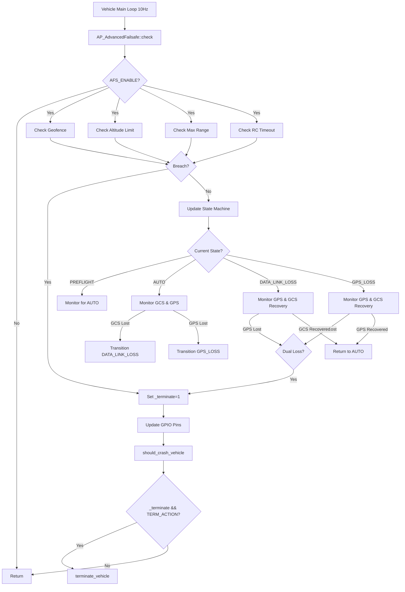
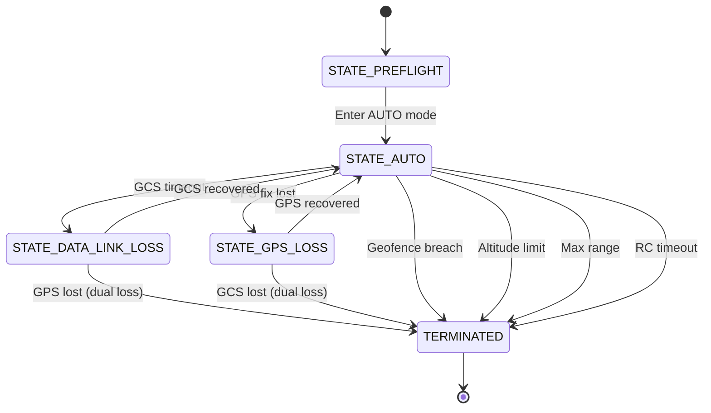

# AP_AdvancedFailsafe

## Overview

The **AP_AdvancedFailsafe** library implements a comprehensive catastrophic failure handling system for ArduPilot, originally designed to meet the safety requirements of the Outback Challenge UAV competition. Developed by Andrew Tridgell and CanberraUAV in 2012, this module provides multiple independent safety barriers that monitor critical system health (GPS, GCS datalink, RC, sensors) and trigger controlled termination when safety limits are exceeded.

This library integrates with external failsafe hardware via GPIO pins, providing redundant safety monitoring that can distinguish between autopilot software crashes and controlled termination events. It implements a finite state machine that tracks vehicle status through preflight, normal operation, datalink loss, and GPS loss states, with configurable actions for each failure scenario.

**Primary Responsibilities:**
- Monitor GPS lock status and enforce maximum loss event limits
- Track GCS datalink health and handle communication failures
- Enforce geofence boundaries with immediate termination on breach
- Monitor barometric and GPS altitude limits (AMSL - Above Mean Sea Level)
- Track maximum range from arming location
- Detect RC (remote control) failures in manual modes
- Implement dual-loss termination logic (simultaneous GPS and GCS failure)
- Generate heartbeat signals for external failsafe boards
- Execute configurable termination actions (immediate shutdown or controlled landing)

## Architecture

The Advanced Failsafe system implements a layered architecture with independent monitoring paths feeding into a central state machine that coordinates failsafe responses:



**State Machine Transitions:**



## Key Components

### AP_AdvancedFailsafe Class

The core class implementing the advanced failsafe system. It is an abstract base class using the singleton pattern to ensure only one instance exists system-wide.

- **Singleton Pattern**: Enforced via `CLASS_NO_COPY` macro and constructor panic if duplicate instantiation attempted
- **AP_Param Integration**: All configuration parameters persist across reboots via ArduPilot's parameter system
- **Abstract Base**: Requires vehicle-specific implementations of termination logic and mode mapping
- **10Hz Update Rate**: Must be called at 10Hz from vehicle main loop for proper operation

**Source:** `libraries/AP_AdvancedFailsafe/AP_AdvancedFailsafe.h:32-180`

### State Machine

Four-state finite state machine tracking vehicle operational status:

1. **STATE_PREFLIGHT** (0): Initial state, monitoring only, no failsafe actions
2. **STATE_AUTO** (1): Normal autonomous operation, full monitoring active
3. **STATE_DATA_LINK_LOSS** (2): GCS heartbeat lost, executing comms loss procedures
4. **STATE_GPS_LOSS** (3): GPS fix lost, executing GPS loss procedures

Transitions save current mission waypoint for restoration on recovery. Loss counters track events with 30-second debounce windows to prevent rapid state oscillation.

**Source:** `libraries/AP_AdvancedFailsafe/AP_AdvancedFailsafe.cpp:239-331`

### GPIO Interface

Three digital output pins communicate with external failsafe hardware:

- **Heartbeat Pin (AFS_HB_PIN)**: Toggles at 10Hz when system operational
- **Manual Mode Pin (AFS_MAN_PIN)**: High when pilot has direct control (MANUAL/STABILIZED modes)
- **Termination Pin (AFS_TERM_PIN)**: High when termination triggered

External failsafe boards monitor the heartbeat to detect autopilot crashes. If heartbeat stops but termination pin is low, the board assumes software failure and cuts motor power. If termination pin goes high with heartbeat continuing, the board recognizes controlled termination.

**Source:** `libraries/AP_AdvancedFailsafe/AP_AdvancedFailsafe.cpp:223-341`

### Termination Logic

Multiple independent triggers can activate termination:

- Geofence breach (immediate)
- Altitude limit exceeded (AMSL check with barometer or GPS)
- Maximum range from arming location exceeded
- RC failure timeout in manual modes
- Dual loss (simultaneous GPS and GCS failure)
- Manual termination command from GCS or parameter

Once termination is triggered, the configured action (immediate motor shutdown or controlled landing) executes via vehicle-specific `terminate_vehicle()` implementation.

**Source:** `libraries/AP_AdvancedFailsafe/AP_AdvancedFailsafe.cpp:192-218, 285-319`

### Vehicle Integration

Pure virtual methods require vehicle-specific implementations:

- `setup_IO_failsafe()`: Configure failsafe servo outputs for FMU crash scenarios
- `afs_mode()`: Map vehicle flight mode to AFS control_mode enum (MANUAL, STABILIZED, AUTO)
- `set_mode_auto()`: Force vehicle into autonomous mode on datalink loss
- `terminate_vehicle()`: Execute termination action (motor shutdown or landing sequence)

Singleton access via `AP::advancedfailsafe()` namespace accessor allows GCS and other modules to query termination status.

**Source:** `libraries/AP_AdvancedFailsafe/AP_AdvancedFailsafe.h:102-109`

## Termination Conditions

The Advanced Failsafe system monitors seven independent termination triggers. Any single trigger can activate termination if configured:

### 1. Geofence Breach

**Trigger:** AC_Fence reports any fence breach  
**Condition:** `AFS_GEOFENCE=1` and fence breach detected  
**Action:** Immediate termination  
**Source:** `libraries/AP_AdvancedFailsafe/AP_AdvancedFailsafe.cpp:192-202`

When enabled, any geofence violation (cylinder, polygon, or altitude fence) causes immediate termination. This integrates with the AC_Fence library for boundary enforcement. Geofence breach is checked every cycle regardless of state machine status.

### 2. Altitude Limit (AMSL)

**Trigger:** Pressure altitude exceeds configured AMSL limit  
**Condition:** `AFS_AMSL_LIMIT > 0` and `AFS_QNH_PRESSURE > 0`  
**Primary Source:** Barometer with QNH pressure reference  
**Fallback:** GPS altitude with error margin subtracted  
**Action:** Immediate termination  
**Source:** `libraries/AP_AdvancedFailsafe/AP_AdvancedFailsafe.cpp:384-418`

Altitude enforcement uses barometric pressure altitude referenced to QNH (altimeter setting). If the barometer becomes unresponsive (>5 seconds without update), the system falls back to GPS altitude with the configured error margin (`AFS_AMSL_ERR_GPS`) subtracted from the limit to provide safety buffer. Setting `AFS_AMSL_ERR_GPS=-1` forces immediate termination on barometer failure regardless of GPS altitude.

### 3. RC Failure

**Trigger:** RC input lost for configured duration  
**Condition:** `AFS_RC_FAIL_TIME > 0` and `AFS_RC=1`  
**Modes Affected:** MANUAL/STABILIZED (or all modes if `AFS_RC_MAN_ONLY=0`)  
**Action:** Immediate termination  
**Source:** `libraries/AP_AdvancedFailsafe/AP_AdvancedFailsafe.cpp:210-218`

Monitors time since last valid RC input. If RC is lost for longer than `AFS_RC_FAIL_TIME` seconds while in manual control modes (or any mode if `AFS_RC_MAN_ONLY=0`), termination is triggered. This prevents uncontrolled flight if the pilot loses command authority.

### 4. Dual Loss (Most Critical)

**Trigger:** Simultaneous GPS fix loss AND GCS datalink loss  
**Condition:** `AFS_DUAL_LOSS=1` and both GPS and GCS lost  
**Action:** Immediate termination  
**Source:** `libraries/AP_AdvancedFailsafe/AP_AdvancedFailsafe.cpp:285-293, 313-319`

The most critical failure scenario. If the vehicle loses both GPS lock and GCS communication simultaneously, it cannot navigate or be commanded remotely. Dual loss triggers immediate termination with no recovery option. This condition is checked in both DATA_LINK_LOSS and GPS_LOSS states.

### 5. Maximum Range

**Trigger:** Distance from first arming location exceeds limit  
**Condition:** `AFS_MAX_RANGE_KM > 0`  
**Reference:** GPS position at first arming  
**Action:** Immediate termination  
**Source:** `libraries/AP_AdvancedFailsafe/AP_AdvancedFailsafe.cpp:206, max_range_update()`

Enforces a maximum operating radius from the location where the vehicle was first armed. Uses GPS position to calculate distance. If the vehicle exceeds `AFS_MAX_RANGE_KM` kilometers from the arming point, termination is triggered. Requires GPS lock for enforcement.

### 6. Manual Termination

**Trigger:** GCS command or parameter set  
**Condition:** `AFS_TERMINATE=1` set via GCS or parameter  
**Action:** Immediate termination  
**Source:** `libraries/AP_AdvancedFailsafe/AP_AdvancedFailsafe.cpp:447-469 (gcs_terminate)`

Allows ground control station or direct parameter modification to trigger termination. The `gcs_terminate()` method provides controlled termination activation with reason logging. Once triggered, termination cannot be cancelled.

### 7. Barometer Failure (Altitude Monitoring)

**Trigger:** Barometer unresponsive for >5 seconds  
**Condition:** `AFS_AMSL_LIMIT > 0` and barometer timeout  
**Fallback Decision:** Based on `AFS_AMSL_ERR_GPS` setting  
**Action:** Immediate termination if GPS altitude check fails or margin=-1  
**Source:** `libraries/AP_AdvancedFailsafe/AP_AdvancedFailsafe.cpp:395-418`

If altitude limits are configured and the barometer fails (no updates for 5+ seconds), the system attempts to use GPS altitude. If GPS altitude plus error margin exceeds the limit, or if `AFS_AMSL_ERR_GPS=-1` (no GPS fallback allowed), termination is triggered immediately.

## Hardware Termination Pin Support

The Advanced Failsafe system provides three GPIO outputs for integration with external failsafe boards:

### Heartbeat Pin (AFS_HB_PIN)

- **Function:** Toggles at 10Hz when system operational
- **Behavior During Termination:** Continues toggling if separate TERM_PIN configured
- **Purpose:** Allows external board to detect autopilot software crash vs controlled termination
- **Configuration:** Set to GPIO pin number (e.g., 50 for AUXOUT1), -1 to disable
- **Source:** `libraries/AP_AdvancedFailsafe/AP_AdvancedFailsafe.cpp:346-360 (heartbeat)`

External failsafe boards monitor this pin. If the heartbeat stops, the board assumes the autopilot has crashed and should immediately cut motor power. If heartbeat continues but termination pin goes high, the board recognizes a controlled termination event.

### Manual Mode Pin (AFS_MAN_PIN)

- **Function:** Indicates pilot has direct control
- **High State:** MANUAL or STABILIZED modes
- **Low State:** Autonomous modes (AUTO, GUIDED, etc.)
- **Purpose:** Tells external board to pass through RC inputs directly
- **Configuration:** Set to GPIO pin number, -1 to disable
- **Source:** `libraries/AP_AdvancedFailsafe/AP_AdvancedFailsafe.cpp:220-226`

This pin signals when the pilot has direct command authority, allowing external hardware to modify signal routing or monitoring behavior based on control mode.

### Termination Pin (AFS_TERM_PIN)

- **Function:** Signals termination event
- **High State:** Termination triggered
- **Low State:** Normal operation
- **Purpose:** Explicit termination signal to external hardware
- **Configuration:** Set to GPIO pin number, -1 to disable
- **Source:** `libraries/AP_AdvancedFailsafe/AP_AdvancedFailsafe.cpp:337-341`

When any termination condition is met, this pin goes high. External failsafe boards can use this signal to immediately cut motor power, deploy parachutes, or execute other emergency procedures.

### Fail-Safe Design Philosophy

The hardware interface is designed with fail-safe operation in mind:

1. **Heartbeat Monitoring:** External board cuts power if heartbeat stops (autopilot crash)
2. **Dual Signals:** Separate heartbeat and termination pins allow distinction between crash and controlled termination
3. **Active High Termination:** Termination pin high = emergency, easy for external hardware to detect
4. **Continuous Operation:** Heartbeat continues during controlled termination if TERM_PIN configured separately

Recommended external board behavior:
- **Heartbeat stops:** Immediate power cut (assume software failure)
- **Termination pin high:** Execute configured termination action
- **Both conditions:** Immediate power cut with logging

## Failsafe Actions

Two termination actions are available via the `AFS_TERM_ACTION` parameter:

### TERMINATE_ACTION_TERMINATE (42)

**Most Aggressive Option**
- **Behavior:** Immediate motor shutdown
- **Implementation:** Calls vehicle-specific `terminate_vehicle()` method
- **Use Case:** Open areas where immediate stop is safest
- **Risk:** Vehicle will crash/fall from current position
- **Source:** `libraries/AP_AdvancedFailsafe/AP_AdvancedFailsafe.h:48-51`

This action provides immediate motor cutoff when termination is triggered. For fixed-wing vehicles, this results in a glide or dive to the ground. For multirotors, immediate uncontrolled descent. This is the most aggressive option suitable for situations where continuing flight is more dangerous than an immediate crash.

### TERMINATE_ACTION_LAND (43)

**Controlled Landing**
- **Behavior:** Executes controlled landing sequence
- **Implementation:** Vehicle-specific landing procedure via `terminate_vehicle()`
- **Use Case:** Populated areas where controlled descent is safer
- **Risk:** Takes longer, requires working control systems
- **Source:** `libraries/AP_AdvancedFailsafe/AP_AdvancedFailsafe.h:48-51`

This action initiates a controlled landing sequence when termination is triggered. The vehicle attempts to descend in a controlled manner using available sensors and control systems. Safer for populated areas but requires that flight control systems remain functional.

### Action Selection

**Parameter:** `AFS_TERM_ACTION`
- **0:** No action (monitoring only, relies on external hardware)
- **42:** Immediate termination (TERMINATE_ACTION_TERMINATE)
- **43:** Controlled landing (TERMINATE_ACTION_LAND)

**Vehicle-Specific Implementation:**

Each vehicle type implements `terminate_vehicle()` differently:
- **ArduPlane:** May disable motors, control surfaces to neutral, or execute landing flare
- **ArduCopter:** May cut motors immediately or descend at controlled rate
- **Rover:** May stop motors and engage brakes

The specific behavior depends on the vehicle's concrete implementation of the abstract `terminate_vehicle()` method.

**Source:** `libraries/AP_AdvancedFailsafe/AP_AdvancedFailsafe.cpp:420-443 (should_crash_vehicle)`

## State Machine Operation

The Advanced Failsafe system implements a four-state finite state machine that tracks operational status and coordinates recovery procedures:

### STATE_PREFLIGHT (0)

**Initial State**
- **Entry:** System boot
- **Monitoring:** Limited (parameters loaded, hardware initialized)
- **Failsafe Actions:** Termination triggers active but state transitions disabled
- **Exit:** First entry into autonomous AUTO mode
- **Purpose:** Prevents nuisance failsafes during ground operations

In preflight state, the system monitors for critical failures (geofence, altitude, range) but does not track GPS or GCS loss for state transitions. This allows system initialization, calibration, and ground testing without triggering datalink or GPS loss procedures.

**Source:** `libraries/AP_AdvancedFailsafe/AP_AdvancedFailsafe.cpp:240-247`

### STATE_AUTO (1)

**Normal Operation**
- **Entry:** From PREFLIGHT when vehicle enters AUTO mode, or from loss states on recovery
- **Monitoring:** Full monitoring of all systems (GPS, GCS, RC, sensors, limits)
- **Transitions:** To DATA_LINK_LOSS on GCS timeout, to GPS_LOSS on GPS fix loss
- **Actions:** All termination triggers active

This is the normal operational state during autonomous flight. The system monitors GPS lock (loss >3 seconds triggers transition), GCS heartbeat (configurable timeout), and all other termination conditions. Mission execution continues normally.

**Source:** `libraries/AP_AdvancedFailsafe/AP_AdvancedFailsafe.cpp:249-282`

### STATE_DATA_LINK_LOSS (2)

**GCS Heartbeat Lost**
- **Entry:** From AUTO when GCS heartbeat timeout exceeds `AFS_GCS_TIMEOUT` seconds
- **Actions:**
  - Saves current mission waypoint
  - Jumps to `AFS_WP_COMMS` waypoint if configured
  - Forces AUTO mode if `AFS_OPTIONS` bit 1 set
  - Increments loss counter (if >30s since last loss event)
- **Monitoring:** Watches for GPS loss (dual loss), GCS recovery
- **Dual Loss:** If GPS lock lost while in this state and `AFS_DUAL_LOSS=1`, immediate termination
- **Recovery:** Returns to AUTO state when GCS heartbeat restored, resumes mission if counters permit

In this state, the vehicle has lost communication with the ground control station but retains GPS lock. If a comms loss waypoint is configured, the vehicle navigates to that position (typically a holding pattern or return-to-launch point). Recovery is automatic when GCS communication is restored.

**Loss Counter Logic:**
- Events separated by >30 seconds increment counter
- Mission resume blocked if counter exceeds `AFS_MAX_COM_LOSS` (unless 0 = unlimited)
- Prevents infinite recovery attempts on persistent failures

**Source:** `libraries/AP_AdvancedFailsafe/AP_AdvancedFailsafe.cpp:251-266, 284-310`

### STATE_GPS_LOSS (3)

**GPS Fix Lost**
- **Entry:** From AUTO when GPS fix lost for >3 seconds
- **Actions:**
  - Saves current mission waypoint  
  - Jumps to `AFS_WP_GPS_LOSS` waypoint if configured
  - Increments loss counter (if >30s since last loss event)
- **Monitoring:** Watches for GCS loss (dual loss), GPS recovery
- **Dual Loss:** If GCS link lost while in this state and `AFS_DUAL_LOSS=1`, immediate termination
- **Recovery:** Returns to AUTO state when GPS fix restored, resumes mission if counters permit

In this state, the vehicle has lost GPS lock but retains GCS communication. If a GPS loss waypoint is configured, the vehicle attempts to navigate using dead reckoning or other available sensors. The configured waypoint might command the vehicle to hold position, loiter, or return along a known path.

**Loss Counter Logic:**
- Events separated by >30 seconds increment counter
- Mission resume blocked if counter exceeds `AFS_MAX_GPS_LOSS` (unless 0 = unlimited)
- Prevents infinite recovery attempts on persistent failures

**Source:** `libraries/AP_AdvancedFailsafe/AP_AdvancedFailsafe.cpp:268-282, 312-330`

### Mission Waypoint Management

**Saved Waypoint Behavior:**
- Current mission waypoint saved on entry to loss states
- Restored on recovery if loss counter limits not exceeded
- Disabled if `AFS_OPTIONS` bit 0 set (continue after recovery)
- 30-second debounce window prevents multiple events from single failure

This allows the vehicle to resume its mission from the point of failure rather than restarting from the beginning. The loss counters prevent infinite looping if communication or GPS is intermittently failing.

## Integration with Vehicle Systems

The Advanced Failsafe system integrates deeply with vehicle code and other ArduPilot subsystems:

### Main Loop Integration

**Calling Convention:**
```cpp
// From vehicle main loop at 10Hz
AP_AdvancedFailsafe *afs = AP::advancedfailsafe();
if (afs != nullptr && afs->enabled()) {
    afs->check(last_valid_rc_ms);
}
```

The `check()` method must be called at 10Hz from the vehicle's main loop, passing the timestamp of the last valid RC input. This 10Hz rate is critical for:
- Heartbeat pin toggle (10Hz square wave)
- Responsive state transitions
- Accurate timeout monitoring
- GPIO pin updates

**Source:** `libraries/AP_AdvancedFailsafe/AP_AdvancedFailsafe.cpp:183-342`

### Required Vehicle-Specific Implementations

Each vehicle type must implement four pure virtual methods:

#### setup_IO_failsafe()
```cpp
virtual void setup_IO_failsafe(void) = 0;
```

Configures failsafe servo outputs for scenarios where the FMU firmware stops running. This typically involves setting servo channels to safe values (e.g., throttle to idle, control surfaces to neutral) that take effect if the main processor crashes.

**Implementation Location:** Vehicle-specific (e.g., `ArduPlane/failsafe.cpp`)

#### afs_mode()
```cpp
virtual enum control_mode afs_mode(void) = 0;
```

Maps the vehicle's current flight mode to one of three AFS control modes:
- `AFS_MANUAL`: Pilot has direct stick-to-servo control
- `AFS_STABILIZED`: Pilot control with stabilization
- `AFS_AUTO`: Fully autonomous operation

**Purpose:** Determines whether RC failure termination applies (manual modes only if `AFS_RC_MAN_ONLY=1`)

#### set_mode_auto()
```cpp
virtual void set_mode_auto(void) = 0;
```

Forces the vehicle into autonomous AUTO mode. Called when datalink is lost and `AFS_OPTIONS` bit 1 is set, ensuring the vehicle continues autonomous operation even if the mode was changed via GCS.

#### terminate_vehicle()
```cpp
virtual void terminate_vehicle(void) = 0;
```

Executes the actual termination action:
- **TERMINATE_ACTION_TERMINATE (42):** Immediate motor shutdown
- **TERMINATE_ACTION_LAND (43):** Controlled landing sequence

**Implementation Details:** Vehicle-specific, must handle motor cutoff, control surface positioning, and state updates.

**Source:** `libraries/AP_AdvancedFailsafe/AP_AdvancedFailsafe.h:102-109`

### Singleton Access Pattern

**Namespace Accessor:**
```cpp
AP_AdvancedFailsafe *afs = AP::advancedfailsafe();
```

Other modules can query termination status:
```cpp
if (afs != nullptr && afs->should_crash_vehicle()) {
    // Vehicle is terminating
}

if (afs != nullptr && afs->terminating_vehicle_via_landing()) {
    // Controlled landing in progress
}
```

**GCS Termination Command:**
```cpp
bool success = afs->gcs_terminate(true, "Operator initiated termination");
```

**Source:** `libraries/AP_AdvancedFailsafe/AP_AdvancedFailsafe.h:182-184, 86-90`

### Integration with Other Libraries

**Dependencies:**
- **AP_GPS:** GPS fix status, position, altitude (for GPS loss detection and range enforcement)
- **AP_Baro:** Barometric pressure altitude (for AMSL limit enforcement)
- **GCS_MAVLink:** Ground station heartbeat monitoring, status messages
- **AP_Mission:** Mission waypoint save/restore on loss/recovery
- **AC_Fence:** Geofence breach detection for immediate termination
- **RC_Channel:** RC input timestamp for failure detection
- **AP_HAL:** GPIO control for heartbeat/manual/termination pins

The Advanced Failsafe acts as an additional safety layer that coordinates with standard ArduPilot failsafes but provides more aggressive termination options for competition or commercial applications where immediate action is required.

## Configuration Parameters

The following table documents all Advanced Failsafe configuration parameters:

| Parameter | Description | Default | Range | Units | Safety Impact |
|-----------|-------------|---------|-------|-------|---------------|
| **AFS_ENABLE** | Master enable switch | 0 | 0-1 | boolean | All other parameters inactive if 0 |
| **AFS_TERM_ACTION** | Termination action type | 0 | 0,42,43 | enum | 0=none, 42=terminate, 43=land |
| **AFS_TERMINATE** | Force immediate termination | 0 | 0-1 | boolean | Can be set in flight to trigger termination |
| **AFS_RC_FAIL_TIME** | RC failure timeout | 0 | 0-60 | seconds | Time before RC loss triggers termination (0=disabled) |
| **AFS_GCS_TIMEOUT** | GCS heartbeat timeout | 10 | 1-120 | seconds | Time before GCS loss triggers state change |
| **AFS_AMSL_LIMIT** | Maximum AMSL altitude | 0 | 0-10000 | meters | Pressure altitude limit, 0=disabled |
| **AFS_QNH_PRESSURE** | QNH pressure setting | 0 | 0-2000 | hectopascals | Reference pressure for AMSL calculation |
| **AFS_AMSL_ERR_GPS** | GPS altitude error margin | -1 | -1 to 1000 | meters | Safety margin for GPS fallback, -1=immediate term on baro fail |
| **AFS_MAX_RANGE_KM** | Maximum range limit | 0 | 0-1000 | kilometers | Max distance from arming location, 0=disabled |
| **AFS_WP_COMMS** | Comms loss waypoint | 0 | 0-255 | waypoint# | Mission item to jump to on GCS loss, 0=disabled |
| **AFS_WP_GPS_LOSS** | GPS loss waypoint | 0 | 0-255 | waypoint# | Mission item to jump to on GPS loss, 0=disabled |
| **AFS_MAX_GPS_LOSS** | Maximum GPS loss events | 0 | 0-255 | count | Stop mission resume after N GPS loss events, 0=unlimited |
| **AFS_MAX_COM_LOSS** | Maximum comms loss events | 0 | 0-255 | count | Stop mission resume after N comms loss events, 0=unlimited |
| **AFS_GEOFENCE** | Enable geofence failsafe | 1 | 0-1 | boolean | Integrate with AC_Fence for breach termination |
| **AFS_RC** | Enable RC failsafe | 1 | 0-1 | boolean | Monitor RC link for timeout |
| **AFS_RC_MAN_ONLY** | RC term in manual only | 1 | 0-1 | boolean | 1=RC timeout only in manual modes, 0=all modes |
| **AFS_DUAL_LOSS** | Enable dual loss termination | 1 | 0-1 | boolean | Terminate on simultaneous GPS+GCS loss |
| **AFS_HB_PIN** | Heartbeat GPIO pin | -1 | -1, 49-116 | pin# | GPIO for 10Hz heartbeat output, -1=disabled |
| **AFS_MAN_PIN** | Manual mode GPIO pin | -1 | -1, 49-116 | pin# | GPIO for manual mode indicator, -1=disabled |
| **AFS_TERM_PIN** | Termination GPIO pin | -1 | -1, 49-116 | pin# | GPIO for termination signal, -1=disabled |
| **AFS_OPTIONS** | Option bitmask | 0 | 0-3 | bitmask | Bit 0: continue after recovery, Bit 1: GCS FS in all auto modes |

**Parameter Details:**

**AFS_OPTIONS Bitmask:**
- **Bit 0 (value 1):** Continue mission after recovery (don't restore saved waypoint)
- **Bit 1 (value 2):** Apply GCS failsafe in all autonomous modes (not just AUTO)

**GPIO Pin Numbers:**
- Valid range typically 49-116 depending on board
- -1 disables the pin function
- Refer to board-specific documentation for available pins
- Commonly use AUXOUTx pins for external hardware

**Source:** `libraries/AP_AdvancedFailsafe/AP_AdvancedFailsafe.cpp:39-181`

## Safety Considerations

⚠️ **CRITICAL: Life-Safety System** ⚠️

The Advanced Failsafe system controls termination actions that result in vehicle crash or forced landing. Incorrect configuration can cause loss of vehicle and potential injury to persons or property.

### Configuration Safety

**Before Flight Checklist:**

1. **Verify AFS_ENABLE**: Ensure you intend to enable advanced failsafe (0=disabled, 1=enabled)
2. **Validate AFS_TERM_ACTION**: Confirm termination action appropriate for environment
   - Use 42 (immediate terminate) only in open areas
   - Use 43 (controlled landing) near populated areas
   - Consider 0 (no action) if relying solely on external hardware
3. **Check QNH Setting**: Verify `AFS_QNH_PRESSURE` matches current atmospheric pressure
   - Incorrect QNH can cause premature or delayed altitude termination
   - Update for significant weather changes or geographic moves
4. **Validate Altitude Limit**: Ensure `AFS_AMSL_LIMIT` appropriate for flight area
   - Consider terrain elevation
   - Account for GPS altitude error margin (`AFS_AMSL_ERR_GPS`)
5. **Confirm Range Limit**: Verify `AFS_MAX_RANGE_KM` allows planned mission
   - Vehicle will be armed at the range reference point
6. **Test Geofence**: Ensure geofence properly configured if `AFS_GEOFENCE=1`
   - Geofence breach causes immediate termination
   - Validate fence includes all planned waypoints
7. **Validate RC Timeout**: Set `AFS_RC_FAIL_TIME` appropriate for RF system
   - Too short causes nuisance terminations on brief link loss
   - Too long delays termination on genuine RC failure
8. **Check GPIO Pins**: If using external hardware, verify pin assignments don't conflict

### Testing Safety

**CRITICAL: Never Test With Live Motors**

All termination testing should be performed in simulation (SITL) or with motors disconnected:

1. **SITL Testing:** Test all termination conditions in Software-In-The-Loop simulation
2. **Benchtop Testing:** Verify GPIO pins with oscilloscope/LED, motors not connected
3. **Hardware Testing:** Progressive testing with propellers removed
4. **Never Test:** Do not test actual termination with motors powered and vehicle flyable

**Progressive Hardware Testing:**
1. Configure `AFS_TERM_ACTION=0` (no action)
2. Verify heartbeat pin toggles at 10Hz
3. Verify manual mode pin state changes with mode
4. Trigger termination, verify termination pin goes high (motors disconnected)
5. Only after all pin verification, test with `AFS_TERM_ACTION=42/43` and propellers removed

### Operational Safety

**Dual Loss (Most Critical):**
- Simultaneous GPS and GCS loss triggers immediate termination
- No recovery possible from dual loss state
- Ensure robust GCS link and GPS reception before flight

**Barometer Dependency:**
- Altitude limit relies on accurate barometric pressure
- Incorrect QNH setting can cause premature termination or limit violation
- Barometer failure with `AFS_AMSL_ERR_GPS=-1` causes immediate termination

**GPS Dependency:**
- Range limit and GPS altitude fallback require GPS lock
- GPS failures can trigger GPS_LOSS state transitions
- Consider redundant GPS if using advanced failsafe

**RC Timeout:**
- Set `AFS_RC_FAIL_TIME` based on your RC system characteristics
- Too aggressive settings cause nuisance terminations on brief link dropouts
- Test RC range before flights with advanced failsafe enabled

**Geofence Integration:**
- Geofence breach with `AFS_GEOFENCE=1` causes immediate termination
- Ensure fence properly configured and tested
- Account for GPS position error in fence margins

**External Failsafe Board:**
- Recommended for commercial operations
- Provides redundancy if autopilot software crashes
- Must monitor heartbeat pin to detect autopilot failures

**Parameter Changes:**
- Verify all parameter changes saved before flight
- Use `param fetch` or reboot to confirm parameters
- Never assume parameter changes are persistent without verification

**Vehicle-Specific Behavior:**
- Termination implementation varies by vehicle type
- Understand your vehicle's specific termination behavior
- Fixed-wing glides, multirotors drop, rovers stop

### Failure Mode Understanding

**No Recovery From Termination:**
- Once termination triggered, it cannot be cancelled
- This is by design for safety
- Vehicle will crash or execute landing sequence

**Termination Actions:**
- **TERMINATE (42):** Immediate motor shutdown = uncontrolled descent/crash
- **LAND (43):** Controlled landing = requires working control systems

**State Machine Transitions:**
- Loss states can recover if conditions improve
- Loss counters prevent infinite recovery attempts
- 30-second debounce prevents rapid oscillation

### Certification and Commercial Use

**DO-178C Compliance:**
- This module implements critical safety functions
- Requires rigorous testing for aerospace certification
- Document all failure modes and test procedures

**Failure Mode Analysis:**
- Single sensor failures: GPS, barometer, GCS
- Multiple failures: Dual loss (GPS+GCS)
- Software failures: Autopilot crash (detected by heartbeat)

**Redundancy:**
- External failsafe board provides hardware redundancy
- Recommended for commercial operations
- Can detect and respond to autopilot software crashes

**Traceability:**
- Parameters trace to safety requirements
- Originally designed for Outback Challenge competition rules
- Each termination condition maps to specific safety requirement

**Testing Requirements:**
- All termination conditions testable in SITL without hardware risk
- Progressive hardware testing with motors disabled
- Document test procedures and results for certification

## Testing Procedures

### SITL Testing (Safe - No Hardware Risk)

Software-In-The-Loop simulation allows comprehensive testing of all Advanced Failsafe features without risk to physical hardware:

```bash
# Start SITL for fixed-wing vehicle
sim_vehicle.py -v Plane --console --map

# Configure Advanced Failsafe parameters
param set AFS_ENABLE 1
param set AFS_TERM_ACTION 42          # Immediate termination
param set AFS_RC_FAIL_TIME 5          # 5 second RC timeout
param set AFS_GCS_TIMEOUT 10          # 10 second GCS timeout
param set AFS_DUAL_LOSS 1             # Enable dual loss
param set AFS_AMSL_LIMIT 1000         # 1000m altitude limit
param set AFS_QNH_PRESSURE 1013.25    # Standard atmosphere
param set AFS_MAX_RANGE_KM 5          # 5km max range
param fetch                            # Verify parameters saved

# Arm and takeoff
arm throttle
mode AUTO
# Execute mission

# Test RC Failure Termination
# Switch to MANUAL mode
mode MANUAL
# Wait 5 seconds without RC input
# Observe: Termination should trigger, motors cut

# Reset and test GCS Timeout
# In SITL, block MAVLink connection for >10 seconds
# Observe: State transition to DATA_LINK_LOSS
# Restore connection
# Observe: Return to AUTO state

# Test Dual Loss
# Block both GPS and GCS simultaneously in AUTO mode
# Observe: Immediate termination triggered

# Test Altitude Limit
param set AFS_AMSL_LIMIT 500
# Command climb above 500m AMSL
# Observe: Termination triggered when limit exceeded

# Test Maximum Range
param set AFS_MAX_RANGE_KM 2
# Fly mission >2km from arming location
# Observe: Termination triggered when range exceeded

# Test Geofence Integration
fence enable
fence list
# Configure fence with small radius
# Fly outside fence
# Observe: Immediate termination on breach

# Test GPS Loss
# In SITL, disable GPS updates
# Wait >3 seconds
# Observe: Transition to GPS_LOSS state
# Enable GPS
# Observe: Return to AUTO state

# Test Loss Counters
param set AFS_MAX_GPS_LOSS 2
# Trigger GPS loss 3 times (>30s apart)
# Observe: After 2nd recovery, mission doesn't resume

# Test Manual Termination
param set AFS_TERMINATE 1
# Observe: Immediate termination triggered
```

**SITL Testing Benefits:**
- Complete safety (no physical hardware at risk)
- Repeatable test scenarios
- Easy to trigger failure conditions
- Validate all state transitions
- Verify parameter interactions

### Hardware Testing (Extreme Caution Required)

**Phase 1: Parameter Configuration**

```bash
# Connect to flight controller
# Set AFS_ENABLE=1, AFS_TERM_ACTION=0 (no action)
param set AFS_ENABLE 1
param set AFS_TERM_ACTION 0            # Monitoring only, no termination
param fetch
# Reboot flight controller
# Verify parameters persistent after reboot
```

**Phase 2: Heartbeat Pin Verification**

```bash
# Configure heartbeat pin (example: AUXOUT1 = pin 50)
param set AFS_HB_PIN 50
param fetch

# Connect oscilloscope or LED to heartbeat pin
# Power on flight controller
# Verify: Pin toggles at 10Hz (50ms high, 50ms low)
# Test in all flight modes
# Verify: Heartbeat continues in all modes
```

**Phase 3: Manual Mode Pin Test**

```bash
# Configure manual mode pin (example: AUXOUT2 = pin 51)
param set AFS_MAN_PIN 51
param fetch

# Connect LED or multimeter to manual mode pin
# Switch to MANUAL mode
# Verify: Pin goes HIGH
# Switch to AUTO mode
# Verify: Pin goes LOW
# Test STABILIZED mode
# Verify: Pin goes HIGH (manual control mode)
```

**Phase 4: Termination Pin Test (Motors Disconnected)**

```bash
# CRITICAL: Disconnect all motor power before this test
# Configure termination pin (example: AUXOUT3 = pin 52)
param set AFS_TERM_PIN 52
param fetch

# Connect LED or multimeter to termination pin
# Verify pin is LOW in normal operation

# Trigger manual termination
param set AFS_TERMINATE 1

# Verify: Termination pin goes HIGH
# Verify: Heartbeat continues (if separate TERM_PIN configured)
# Reset termination
param set AFS_TERMINATE 0
# Verify: Pin returns to LOW
```

**Phase 5: External Failsafe Board Integration**

```bash
# With motors still disconnected:
# Connect heartbeat, manual, and termination pins to external failsafe board
# Power on system
# Verify external board detects heartbeat
# Switch modes, verify manual pin state detected
# Trigger termination, verify external board responds
# Power cycle autopilot, verify external board detects heartbeat loss
```

**Phase 6: Termination Action Test (Propellers Removed)**

```bash
# CRITICAL: Remove all propellers
# CRITICAL: Motors may spin
param set AFS_TERM_ACTION 42           # or 43 for controlled landing
param fetch

# Configure test scenario (e.g., short RC timeout)
param set AFS_RC_FAIL_TIME 5

# Arm vehicle (on bench, propellers removed)
arm throttle
mode MANUAL
# Wait 5 seconds without RC input
# Observe: Motors should cut (TERMINATE) or execute landing (LAND)
```

**Phase 7: Never Test (Prohibited)**

❌ **DO NOT TEST:**
- Actual termination with motors powered and vehicle flyable
- Termination with propellers installed and motors armed
- Any scenario where termination would cause vehicle to crash

**Testing Completed Successfully:**
- All GPIO pins verified with scope/LED
- External failsafe board integration confirmed
- Termination logic validated without flight risk
- Ready for flight operations with extreme caution

## Common Integration Patterns

### Basic Safety Configuration (OBC-Style)

This configuration follows the original Outback Challenge competition requirements with aggressive termination on any safety limit violation:

```bash
# Enable advanced failsafe with immediate termination
param set AFS_ENABLE 1
param set AFS_TERM_ACTION 42              # Immediate motor shutdown

# Geofence integration
param set AFS_GEOFENCE 1                  # Fence breach = immediate terminate

# Altitude limit (1500m AMSL)
param set AFS_AMSL_LIMIT 1500             # 1500m altitude limit
param set AFS_QNH_PRESSURE 1013.25        # Standard atmosphere (adjust for conditions)
param set AFS_AMSL_ERR_GPS 50             # 50m GPS fallback margin

# Dual loss termination
param set AFS_DUAL_LOSS 1                 # GPS+GCS loss = immediate terminate

# Maximum range from arming
param set AFS_MAX_RANGE_KM 10             # 10km maximum range

# RC failure in manual modes
param set AFS_RC_FAIL_TIME 10             # 10 second RC timeout
param set AFS_RC_MAN_ONLY 1               # Only in manual/stabilized modes

# External hardware integration
param set AFS_HB_PIN 50                   # AUXOUT1 for heartbeat
param set AFS_TERM_PIN 51                 # AUXOUT2 for termination signal

# GCS timeout
param set AFS_GCS_TIMEOUT 30              # 30 second GCS timeout

# Save parameters
param fetch
```

**Use Case:** Competition flying, open areas, aggressive safety enforcement

### Commercial UAV Configuration (Safer)

This configuration allows recovery from transient failures and uses controlled landing instead of immediate termination:

```bash
# Enable advanced failsafe with controlled landing
param set AFS_ENABLE 1
param set AFS_TERM_ACTION 43              # Controlled landing sequence

# Geofence integration
param set AFS_GEOFENCE 1

# Altitude limit (2000m AMSL)
param set AFS_AMSL_LIMIT 2000
param set AFS_QNH_PRESSURE 1013.25        # Update for local conditions
param set AFS_AMSL_ERR_GPS 100            # Conservative GPS margin

# Dual loss termination
param set AFS_DUAL_LOSS 1

# Recovery waypoints
param set AFS_WP_COMMS 1                  # Jump to waypoint 1 on GCS loss (RTL point)
param set AFS_WP_GPS_LOSS 1               # Jump to waypoint 1 on GPS loss
param set AFS_MAX_COM_LOSS 3              # Allow 3 GCS loss recoveries
param set AFS_MAX_GPS_LOSS 3              # Allow 3 GPS loss recoveries
param set AFS_OPTIONS 0                   # Resume mission after recovery

# Longer timeouts for commercial operations
param set AFS_GCS_TIMEOUT 60              # 60 second GCS timeout
param set AFS_RC_FAIL_TIME 15             # 15 second RC timeout

# External hardware (optional)
param set AFS_HB_PIN 50
param set AFS_TERM_PIN 51
param set AFS_MAN_PIN 52

# Save parameters
param fetch
```

**Use Case:** Commercial operations, populated areas, prioritize recovery over termination

### Research/Development Configuration (Monitoring Only)

This configuration enables Advanced Failsafe monitoring without automatic termination, relying on external failsafe hardware:

```bash
# Enable monitoring without automatic termination
param set AFS_ENABLE 1
param set AFS_TERM_ACTION 0               # No automatic action

# Enable all monitoring
param set AFS_GEOFENCE 1
param set AFS_RC 1
param set AFS_DUAL_LOSS 1

# Set limits for monitoring
param set AFS_AMSL_LIMIT 3000
param set AFS_QNH_PRESSURE 1013.25
param set AFS_MAX_RANGE_KM 20

# External hardware takes action
param set AFS_HB_PIN 50                   # External board monitors heartbeat
param set AFS_MAN_PIN 51                  # External board knows control mode
param set AFS_TERM_PIN 52                 # External board sees termination flag

# Longer timeouts for development
param set AFS_GCS_TIMEOUT 120
param set AFS_RC_FAIL_TIME 30

# Save parameters
param fetch
```

**Use Case:** Development, testing, external failsafe board provides actual termination

### Minimal Configuration (Dual Loss Only)

This configuration enables only the most critical failsafe: simultaneous GPS and GCS loss:

```bash
# Enable advanced failsafe
param set AFS_ENABLE 1
param set AFS_TERM_ACTION 42              # Immediate termination

# Enable only dual loss termination
param set AFS_DUAL_LOSS 1

# Disable other triggers
param set AFS_GEOFENCE 0
param set AFS_RC 0
param set AFS_AMSL_LIMIT 0                # No altitude limit
param set AFS_MAX_RANGE_KM 0              # No range limit

# GCS timeout still applies for state transitions
param set AFS_GCS_TIMEOUT 30

# Save parameters
param fetch
```

**Use Case:** Minimal safety net for critical dual-loss scenario only

## Certification Considerations

### DO-178C Compliance

The Advanced Failsafe module implements critical safety functions that may require certification under DO-178C (Software Considerations in Airborne Systems and Equipment Certification) for aerospace applications:

**Design Assurance Level:**
- **Level A (Catastrophic):** Functions whose failure would cause loss of aircraft
- **Level B (Hazardous):** Functions whose failure would have serious consequences
- Termination functions typically classified as Level A or B depending on operational context

**Software Life Cycle:**
- **Requirements Traceability:** Each parameter traces to specific safety requirement
- **Design Documentation:** This README provides architectural documentation
- **Code Reviews:** All changes must be reviewed for safety implications
- **Testing:** SITL testing provides repeatable verification without hardware risk

**Source:** Standards compliance requires comprehensive documentation of design decisions, testing procedures, and failure modes

### Failure Mode and Effects Analysis (FMEA)

**Single Sensor Failures:**

| Failure Mode | Detection | Effect | Mitigation |
|--------------|-----------|--------|------------|
| GPS loss | Fix status, >3s timeout | STATE_GPS_LOSS, navigate to GPS loss waypoint | GPS recovery, mission resume with counter |
| Barometer failure | >5s no update | Altitude limit uses GPS fallback | GPS altitude with error margin |
| GCS datalink loss | Heartbeat timeout | STATE_DATA_LINK_LOSS, navigate to comms waypoint | GCS recovery, mission resume with counter |
| RC loss | Input timeout | Termination in manual modes | `AFS_RC_MAN_ONLY` limits scope |

**Multiple Sensor Failures:**

| Failure Mode | Detection | Effect | Mitigation |
|--------------|-----------|--------|------------|
| Dual loss (GPS+GCS) | Simultaneous timeouts | Immediate termination | No automatic recovery (intentional) |
| Barometer+GPS altitude | Both unavailable | Immediate termination | Cannot verify altitude safety |

**Software Failures:**

| Failure Mode | Detection | Effect | Mitigation |
|--------------|-----------|--------|------------|
| Autopilot crash | Heartbeat stops | External board cuts power | Hardware-level redundancy |
| State machine corruption | (Not detected) | Undefined behavior | Code review, testing |
| Parameter corruption | Checksum validation | May use invalid values | Parameter validation, default values |

### Redundancy Strategy

**Hardware Redundancy:**
- **External Failsafe Board:** Monitors heartbeat pin, provides independent safety layer
- **Dual Signals:** Separate heartbeat and termination pins allow crash vs termination distinction
- **Fail-Safe GPIO:** Heartbeat stop = immediate power cut by external board

**Software Redundancy:**
- **Multiple Independent Triggers:** Geofence, altitude, range, dual loss all independent
- **State Machine:** Explicit states with defined transitions prevent ambiguous behavior
- **Loss Counters:** Prevent infinite recovery attempts on persistent failures

**Sensor Redundancy:**
- **Altitude:** Barometer primary, GPS fallback with error margin
- **Position:** GPS for range and position, geofence provides independent limit
- **Communication:** GCS and RC monitored separately

### Testability

**Simulation Testing:**
- All termination conditions fully testable in SITL
- No hardware risk during algorithm validation
- Repeatable test scenarios with deterministic behavior

**Hardware Testing:**
- GPIO pins verifiable without motors powered
- Progressive testing from monitoring to full functionality
- External board integration testable without flight risk

**In-Flight Testing:**
- ❌ Not recommended for termination functions
- ✓ Recovery paths testable with careful flight planning
- ✓ State transitions observable without triggering termination

### Requirements Traceability

**Safety Requirements → Parameters:**

| Requirement | Parameter | Rationale |
|-------------|-----------|-----------|
| Enforce maximum altitude (airspace violation prevention) | `AFS_AMSL_LIMIT` | Regulatory compliance |
| Enforce maximum range (line-of-sight requirement) | `AFS_MAX_RANGE_KM` | Regulatory compliance |
| Prevent uncontrolled flight on GPS loss | `AFS_DUAL_LOSS` | Safety of persons and property |
| Prevent flyaway on datalink loss | `AFS_WP_COMMS` | Controlled return procedure |
| Enforce geofence boundaries | `AFS_GEOFENCE` | Operating area restriction |
| Detect autopilot crash | `AFS_HB_PIN` | Hardware redundancy |
| Prevent continued flight on RC loss in manual mode | `AFS_RC_FAIL_TIME` | Pilot authority requirement |

**Original Design:** Outback Challenge UAV competition rules (2012)

### Safety Case

The Advanced Failsafe system provides multiple independent safety barriers:

1. **Geofence:** Physical boundary enforcement
2. **Altitude Limit:** Airspace compliance
3. **Range Limit:** Visual line-of-sight enforcement
4. **Dual Loss:** Critical failure response
5. **RC Timeout:** Manual control authority requirement
6. **External Hardware:** Independent crash detection

Each barrier operates independently. Failure of one does not compromise others. Multiple barriers increase overall system safety to acceptable levels for commercial operations.

## Implementation Notes

### Singleton Pattern Enforcement

**CLASS_NO_COPY Macro:**
```cpp
CLASS_NO_COPY(AP_AdvancedFailsafe);
```

Prevents copy construction and assignment, ensuring single instance. Constructor includes explicit panic check:

```cpp
if (_singleton != nullptr) {
    AP_HAL::panic("AP_AdvancedFailsafe must be singleton");
}
```

**Purpose:** Single point of control for termination decisions, prevents state divergence

**Source:** `libraries/AP_AdvancedFailsafe/AP_AdvancedFailsafe.h:32, AP_AdvancedFailsafe.cpp:183`

### 10Hz Update Rate Requirement

The `check()` method must be called at 10Hz from the vehicle main loop:

**Critical for:**
- **Heartbeat Pin:** Generates 10Hz square wave (50ms high, 50ms low)
- **State Transitions:** Responsive detection of GPS/GCS loss
- **Timeout Accuracy:** Accurate timing for RC and GCS timeouts
- **GPIO Updates:** Timely manual mode and termination pin updates

**Consequences of Wrong Rate:**
- <10Hz: Heartbeat frequency wrong, delayed failure detection
- >10Hz: Excessive CPU usage, parameter timing calibration incorrect

**Source:** `libraries/AP_AdvancedFailsafe/AP_AdvancedFailsafe.cpp:346-360 (heartbeat)`

### AP_Param Integration

All parameters persist across reboots via ArduPilot's AP_Param system:

**Parameter Definition:**
```cpp
const AP_Param::GroupInfo AP_AdvancedFailsafe::var_info[] = {
    AP_GROUPINFO("ENABLE",    0, AP_AdvancedFailsafe, _enable, 0),
    // ... more parameters
    AP_GROUPEND
};
```

**Initialization:**
```cpp
AP_Param::setup_object_defaults(this, var_info);
```

**Benefits:**
- Parameters saved to EEPROM/flash
- Ground station compatibility
- Parameter validation and ranges enforced
- Default values defined at compile time

**Source:** `libraries/AP_AdvancedFailsafe/AP_AdvancedFailsafe.cpp:39-181`

### Abstract Base Class Design

The AP_AdvancedFailsafe class cannot be instantiated directly. Vehicle-specific code must implement:

- `setup_IO_failsafe()`: FMU crash output configuration
- `afs_mode()`: Flight mode mapping
- `set_mode_auto()`: Force autonomous mode
- `terminate_vehicle()`: Execute termination

**Rationale:** Termination behavior is vehicle-specific:
- Fixed-wing: Motor cutoff + control surfaces neutral + glide
- Multirotor: Motor cutoff = immediate drop, or controlled descent
- Rover: Stop motors + engage brakes

**Source:** `libraries/AP_AdvancedFailsafe/AP_AdvancedFailsafe.h:102-109`

### Debounce Logic (30-Second Window)

Loss events must be separated by >30 seconds to increment counters:

```cpp
uint32_t now = AP_HAL::millis();
if (now - last_loss_time_ms > 30000) {
    loss_counter++;
    last_loss_time_ms = now;
}
```

**Purpose:** Prevent rapid state oscillation on intermittent failures

**Consequence:** Brief losses within 30 seconds don't increment counter

**Source:** `libraries/AP_AdvancedFailsafe/AP_AdvancedFailsafe.cpp:258, 275`

### Mission Waypoint Handling

On loss state entry:
1. Current mission waypoint saved to `_saved_wp`
2. If configured, jump to loss waypoint (`AFS_WP_COMMS` or `AFS_WP_GPS_LOSS`)
3. On recovery, restore saved waypoint if counters permit

**Options:**
- `AFS_OPTIONS` bit 0 set: Don't restore, continue from current position
- Loss counter exceeded: Don't restore (prevents infinite looping)

**Source:** `libraries/AP_AdvancedFailsafe/AP_AdvancedFailsafe.cpp:252-266, 269-282`

### GPS Fix Quality Requirements

**Normal Operation:** Requires 3D fix (GPS_FIX_TYPE_3D_FIX or better)

**Range Checking:** Accepts 2D fix (GPS_FIX_TYPE_2D_FIX or better)

**Rationale:** Range checking less critical than navigation, allowing 2D fix prevents nuisance terminations during GPS transitions or poor sky view

**Source:** `libraries/AP_AdvancedFailsafe/AP_AdvancedFailsafe.cpp:271, max_range_update()`

### Barometer Timeout and GPS Fallback

**Primary:** Barometer with QNH pressure for AMSL altitude

**Fallback Trigger:** Barometer unresponsive for >5 seconds

**Fallback Method:**
```cpp
if (baro_stale && gps_available) {
    altitude_amsl = gps_altitude - AFS_AMSL_ERR_GPS;
    if (altitude_amsl > AFS_AMSL_LIMIT) {
        terminate = true;
    }
}
```

**Special Case:** `AFS_AMSL_ERR_GPS = -1` forces immediate termination on barometer failure

**Source:** `libraries/AP_AdvancedFailsafe/AP_AdvancedFailsafe.cpp:384-418 (check_altlimit)`

### GPIO Pin Control

**Heartbeat Implementation:**
```cpp
void AP_AdvancedFailsafe::heartbeat(void) {
    if (_heartbeat_pin == -1) return;
    _heartbeat_pin_value = !_heartbeat_pin_value;
    hal.gpio->write(_heartbeat_pin, _heartbeat_pin_value);
}
```

**Called at 10Hz** from check() when not in sensor calibration

**Manual and Termination Pins:**
Updated in check() based on current mode and termination status

**Source:** `libraries/AP_AdvancedFailsafe/AP_AdvancedFailsafe.cpp:346-360, 223-226, 337-341`

## Known Limitations

### Vehicle Type Support

**Primary Support:** Fixed-wing (ArduPlane)
- Originally designed for Outback Challenge (fixed-wing competition)
- Full feature set tested and validated on planes

**Limited Support:** Other vehicle types
- Multirotors, rovers, submarines, blimps may have partial implementations
- Vehicle-specific `terminate_vehicle()` behavior varies
- Some parameters may not apply to all vehicle types

**Recommendation:** Verify Advanced Failsafe implementation for your specific vehicle type

### No Recovery From Termination

**By Design:** Once termination is triggered, it cannot be cancelled

**Rationale:** Safety-critical decision should not be reversible

**Consequence:** 
- `AFS_TERMINATE=1`: Cannot be unset to cancel termination
- GCS termination command: Irreversible
- Any termination trigger: Leads to motor shutdown or landing sequence

**Mitigation:** Use `AFS_TERM_ACTION=0` for monitoring without automatic action

### External Hardware Dependency

**Full Functionality:** Requires external failsafe board

**Without External Board:**
- No protection against autopilot software crash
- Heartbeat pin unused
- Single point of failure (autopilot firmware)

**Recommendation:** 
- Commercial operations: Deploy external failsafe board
- Development/testing: External board optional
- Competition (OBC): External board required by rules

### GPS Dependency

**Range Limit:** Requires GPS lock for enforcement
- GPS outage: Cannot detect range violations
- GPS jamming: Range checks fail
- GPS position error: False violations possible

**GPS Altitude Fallback:** Only with 3D fix
- 2D fix: Limited altitude information
- No fix: No altitude fallback

**Mitigation:** Rely on barometer as primary altitude source, geofence for position limits

### Single Barometer Altitude Check

**No Multi-Sensor Fusion:** Altitude limit based on single barometer

**Consequences:**
- Single point of failure for altitude monitoring
- No cross-check with other sensors
- Sensor fault can cause false termination or missed violation

**Mitigation:**
- GPS altitude fallback with error margin
- Regular barometer calibration and QNH updates
- Geofence altitude limits provide secondary check

### No Terrain Following for AMSL Limit

**AMSL Limit:** Absolute altitude above mean sea level

**Does Not Account For:**
- Terrain elevation changes
- Ground level variations
- Obstacles (towers, buildings)

**Consequence:** 
- Flying near high terrain: May violate AMSL limit while still above ground
- Low AMSL limit: May restrict operations in high-altitude areas

**Mitigation:**
- Geofence provides terrain-aware boundaries
- Set AMSL limit appropriate for operating area terrain
- Use geofence altitude limits for terrain following

## References

### Source Files

- **Primary Implementation:** `libraries/AP_AdvancedFailsafe/AP_AdvancedFailsafe.cpp`
- **Interface Definition:** `libraries/AP_AdvancedFailsafe/AP_AdvancedFailsafe.h`
- **Compile Configuration:** `libraries/AP_AdvancedFailsafe/AP_AdvancedFailsafe_config.h`

### Related Modules

- **Mission Management:** `libraries/AP_Mission/` - Mission waypoint save/restore integration
- **Geofencing:** `libraries/AC_Fence/` - Fence breach detection
- **GPS:** `libraries/AP_GPS/` - GPS fix status, position, altitude
- **Barometer:** `libraries/AP_Baro/` - Barometric altitude for AMSL enforcement
- **GCS Communication:** `libraries/GCS_MAVLink/` - Ground station heartbeat monitoring

### Vehicle Integration

- **ArduPlane:** Primary vehicle implementation in `ArduPlane/` directory
  - Termination logic: `ArduPlane/system.cpp` or `ArduPlane/failsafe.cpp`
  - Mode mapping: Vehicle-specific mode handling
- **Other Vehicles:** May have partial implementations, verify before use

### External Documentation

- **ArduPilot Wiki:** https://ardupilot.org/plane/docs/advanced-failsafe-configuration.html
- **Outback Challenge:** Original design requirements (2012 competition rules)
- **Development Forum:** https://discuss.ardupilot.org/ (for questions and discussions)

### Historical Context

**Original Authors:** Andrew Tridgell and CanberraUAV team (2012)

**Design Purpose:** Meet Outback Challenge UAV competition safety requirements:
- Enforce geofence boundaries
- Maximum altitude limits
- Dual-loss termination
- External hardware integration for redundancy

**Evolution:** Now used for commercial operations, research, and development beyond original competition context

### Additional Resources

- **Parameter Documentation:** Auto-generated from @Param tags in source code
- **Example Configurations:** See "Common Integration Patterns" section above
- **Testing Procedures:** See "Testing Procedures" section above
- **Safety Guidelines:** See "Safety Considerations" section above

---

**Document Version:** 1.0  
**Last Updated:** 2024  
**Maintained By:** ArduPilot Development Team  
**License:** GPLv3

