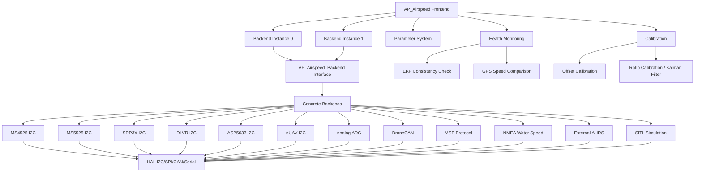
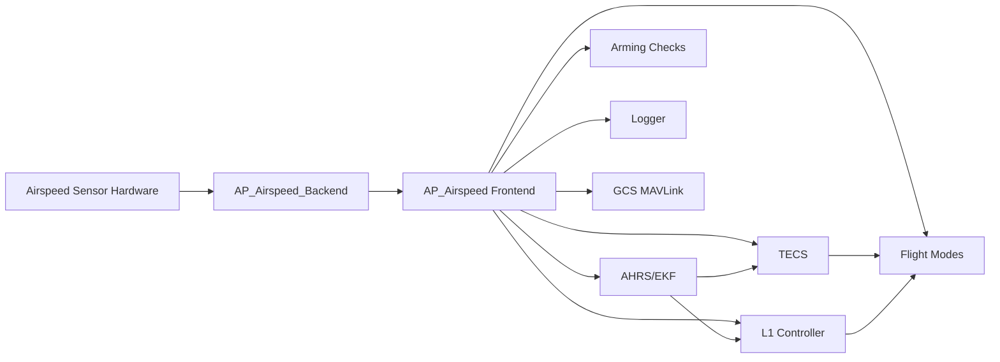

# AP_Airspeed

## Overview

The AP_Airspeed library provides differential pressure sensing and airspeed calculation for fixed-wing vehicles in ArduPilot. This subsystem is critical for stall prevention, energy management (TECS), and wind estimation. The library implements a frontend-backend architecture supporting multiple sensor types simultaneously, with comprehensive calibration, health monitoring, and automatic failure detection capabilities.

Airspeed measurement relies on pitot-static tubes that measure the difference between stagnation pressure (dynamic + static) and static pressure. This differential pressure is converted to airspeed using the Bernoulli equation with air density compensation. The library supports both I2C/SPI digital pressure sensors and analog voltage-based sensors, as well as DroneCAN, MSP, NMEA, and external AHRS airspeed sources.

## Architecture

The AP_Airspeed library follows a modular frontend-backend design pattern that allows abstraction of sensor hardware while providing a unified interface to vehicle code.



### Key Components

**AP_Airspeed (Frontend)**
- **Purpose**: Central manager for all airspeed sensors, providing unified interface to vehicle code
- **Responsibilities**: Backend lifecycle management (probe, init, allocate), parameter management via AP_Param, primary sensor selection and failover, health monitoring and failure detection, calibration coordination (offset and ratio), logging integration, arming checks
- **Singleton Access**: `AP::airspeed()` - accessible throughout the codebase
- **Multi-Sensor Support**: Manages up to AIRSPEED_MAX_SENSORS instances (typically 2)
- **Thread Safety**: Uses HAL_Semaphore for thread-safe data access

**AP_Airspeed_Backend (Interface)**
- **Purpose**: Abstract base class defining the contract for all sensor drivers
- **Key Methods**:
  - `init()` - Initialize sensor hardware and configuration
  - `get_differential_pressure(float &pressure)` - Read differential pressure in Pascals
  - `get_temperature(float &temperature)` - Read sensor temperature in °C
  - `get_airspeed(float &airspeed)` - Direct airspeed reading (optional, for sensors that calculate airspeed internally)
  - `get_hygrometer()` - Humidity measurement (optional, some sensors support this)
- **Device Management**: Handles HAL device interfaces (I2C, SPI, CAN, serial)
- **Bus ID Persistence**: Stores bus identifier for parameter association across reboots

**Concrete Backend Pattern**
Each sensor driver extends AP_Airspeed_Backend and implements:
1. **Probe Function**: Static method to detect sensor presence on specified bus
2. **Init Method**: Configure sensor registers, set measurement range, register periodic callback
3. **Timer Callback**: Orchestrate read/measurement cycle at appropriate rate (typically 10-100Hz)
4. **Data Processing**: Raw ADC/digital conversion to pressure, averaging, freshness tracking
5. **Device-Specific Logic**: Temperature compensation, non-linearity correction, CRC validation

**AP_Airspeed_Params**
- **Purpose**: Per-instance parameter storage
- **Parameters**: TYPE, USE, OFFSET, RATIO, PIN, BUS, PSI_RANGE, TUBE_ORDR, SKIP_CAL, AUTOCAL
- **Persistence**: Parameters saved to EEPROM/flash via AP_Param system
- **Per-Sensor Config**: Each backend instance has independent parameters

**Airspeed_Calibration**
- **Purpose**: Implements 3-state Extended Kalman Filter for in-flight ratio calibration
- **State Vector**: [wind_x, wind_y, 1/sqrt(ratio)]
- **Algorithm**: Fuses indicated airspeed with GPS ground speed vector to estimate scale factor and wind
- **Convergence**: Requires varied flight headings for observability
- **Update Rate**: Called once per second during calibration

## Supported Sensors

The library supports a wide variety of airspeed sensor hardware through compile-time configuration (AP_Airspeed_config.h) and runtime selection (ARSPD_TYPE parameter).

### Digital I2C/SPI Differential Pressure Sensors

| Sensor Type | ARSPD_TYPE | Description | Pressure Range |
|-------------|------------|-------------|----------------|
| MS4525D0 | 1 | TE Connectivity MS4525DO, I2C, 14-bit ADC | ±1 PSI |
| MS5525DSO | 3, 4, 5 | TE Connectivity MS5525, I2C addresses 0x76/0x77, 24-bit ADC | Configurable via PSI_RANGE |
| SDP3X | 6 | Sensirion SDP31/SDP32/SDP33, I2C, differential | ±500 Pa (SDP33) |
| DLVR | 7, 9, 10, 11, 12 | All Sensors DLVR series, I2C, multiple ranges | 5/10/20/30/60 inch H₂O |
| ASP5033 | 15 | TE Connectivity ASP5033, I2C, low-pressure | ±1 inch H₂O |
| AUAV | 17, 18, 19 | 3D Robotics AUAV, I2C | 5/10/30 inch H₂O |

### Analog Voltage Sensors

| Sensor Type | ARSPD_TYPE | Description | Configuration |
|-------------|------------|-------------|---------------|
| Analog | 2 | MPXV7002DP-compatible, differential pressure transducer | Requires ARSPD_PIN and PSI_RANGE configuration |

**Analog Sensor Notes**:
- Output voltage proportional to differential pressure
- Requires ADC pin configuration via ARSPD_PIN parameter
- Voltage-to-pressure conversion: P = (V - V_offset) * scale
- PSI_RANGE parameter sets expected sensor range
- Optional voltage correction for battery sag (disable with ARSPD_OPTIONS bit 2)

### Protocol-Based Airspeed Sources

| Source Type | ARSPD_TYPE | Description | Requirements |
|-------------|------------|-------------|--------------|
| DroneCAN/UAVCAN | 8 | CAN bus airspeed nodes (e.g., UAVCAN airspeed sensors) | Requires AP_DroneCAN enabled, CAN bus configured |
| NMEA Water Speed | 13 | NMEA 0183 VHW message for marine/underwater applications | Serial port configuration, primarily for ArduSub |
| MSP | 14 | MultiWii Serial Protocol airspeed data | MSP protocol enabled, used with MSP OSDs |
| External AHRS | 16 | Airspeed from external AHRS systems (e.g., VectorNav, LORD MicroStrain) | AP_ExternalAHRS configured |
| SITL | 100 | Software-in-the-loop simulation airspeed | Automatic in SITL builds |

### Sensor Selection

Sensor type is selected via the **ARSPD_TYPE** parameter:
- Set before boot to enable automatic probing
- Default TYPE_NONE (0) disables airspeed subsystem
- ArduPlane defaults to TYPE_I2C_MS4525 (1) on real hardware, TYPE_ANALOG (2) in SITL
- Multiple sensors: Configure ARSPD_TYPE and ARSPD2_TYPE independently
- Primary sensor selection via ARSPD_PRIMARY parameter (0 or 1)

## Airspeed Calculation

Airspeed is calculated from differential pressure using the Bernoulli equation with compressibility corrections and air density compensation.

### Bernoulli Equation

The fundamental relationship between differential pressure and airspeed:

```
V = sqrt(2 * ΔP / ρ)
```

Where:
- `V` = True Airspeed (TAS) in m/s
- `ΔP` = Differential pressure in Pascals (Pa)
- `ρ` = Air density in kg/m³

### Indicated Airspeed (IAS) vs True Airspeed (TAS)

The library first calculates **Equivalent Airspeed (EAS)** at sea-level standard density (ρ₀ = 1.225 kg/m³):

```
EAS = sqrt(2 * ΔP / ρ₀)
```

Then converts to **True Airspeed** using the EAS2TAS ratio from the AHRS/EKF:

```
TAS = EAS * EAS2TAS
```

The EAS2TAS ratio accounts for altitude and temperature effects on air density:

```
EAS2TAS = sqrt(ρ₀ / ρ) ≈ sqrt(1.225 / ρ)
```

### Air Density Compensation

Air density is calculated by the AHRS system using:
- Barometric altitude (from AP_Baro)
- Outside air temperature (from airspeed sensor or estimated)
- ISA (International Standard Atmosphere) model

This compensation is critical for accurate airspeed at altitude:
- At sea level: EAS ≈ TAS
- At 10,000 ft: TAS ≈ 1.2 × EAS
- At 30,000 ft: TAS ≈ 1.7 × EAS

### Pressure Correction and Filtering

The raw differential pressure undergoes several corrections:

1. **Offset Correction** (zero-point calibration):
   ```
   corrected_pressure = raw_pressure - ARSPD_OFFSET
   ```

2. **Tube Order Detection** (ARSPD_TUBE_ORDR):
   - Auto mode (2): Detects negative pressure, swaps tubes if needed
   - Normal (0): First port is stagnation pressure
   - Swapped (1): Second port is stagnation pressure

3. **Ratio Correction** (scale factor calibration):
   ```
   final_pressure = corrected_pressure * ARSPD_RATIO
   ```

4. **Low-Pass Filtering**:
   - Exponential moving average to reduce noise
   - Filter coefficient optimized for typical flight dynamics

### Code Reference

Source: `libraries/AP_Airspeed/AP_Airspeed.cpp:read()` method performs the calculation sequence:
1. Get raw differential pressure from backend
2. Apply offset correction
3. Apply tube order logic
4. Apply ratio scaling
5. Calculate EAS = sqrt(2 * corrected_pressure / ρ₀)
6. Get EAS2TAS from AHRS
7. Calculate TAS = EAS * EAS2TAS
8. Apply low-pass filter

## Calibration

The AP_Airspeed library implements a two-stage calibration process: **offset calibration** (zero-point) and **ratio calibration** (scale factor). Both are essential for accurate airspeed measurement.

### Offset Calibration (Zero-Point)

**Purpose**: Remove static pressure bias and sensor zero-point error

**Physical Meaning**: The offset represents the pressure reading when the vehicle is stationary (zero airspeed). This accounts for:
- Sensor zero-point offset (manufacturing variation)
- Static pressure bias in pitot tube installation
- Temperature-dependent sensor drift

**Calibration Procedure**:

**Boot Calibration** (default):
- Automatically performed on every boot
- Duration: ~5 seconds
- Requirements:
  - Vehicle must be stationary
  - Pitot tube uncovered (exposed to ambient air)
  - No wind blowing into pitot tube
  - Engine/propeller stopped
- Process: Accumulates ~50-100 pressure samples, calculates mean
- Result: Stored in ARSPD_OFFSET parameter

**Manual Calibration**:
- Triggered via MAVLink command or GCS button
- Useful for in-field recalibration
- Same requirements as boot calibration
- Command: MAVLink PREFLIGHT_CALIBRATION with airspeed=1

**Skip Calibration Options** (ARSPD_SKIP_CAL parameter):
- **0 (None)**: Always calibrate on boot (default, recommended)
- **1 (NoCalRequired)**: Skip boot calibration, use saved offset, no manual calibration required
- **2 (SkipBootCal)**: Skip boot calibration, require one manual calibration per boot

**Warning**: Incorrect offset calibration affects low-speed accuracy and can compromise stall prevention. Always calibrate with engine off and pitot tube uncovered.

### Ratio Calibration (Scale Factor)

**Purpose**: Correct for pitot tube installation effects and sensor scaling errors

**Physical Meaning**: The ratio parameter (ARSPD_RATIO) accounts for:
- Pitot tube aerodynamic efficiency (typically 0.95-1.0)
- Mounting location airflow effects (propwash, wing interference)
- Sensor pressure range calibration errors
- Tubing length and diameter effects (if using remote pitot)

**Default Value**: 2.0 (dimensionless)
**Typical Range**: 1.5 to 2.5
**Effect**: Higher ratio → higher indicated airspeed for same differential pressure

**Manual Ratio Calibration**:

1. **Prerequisites**:
   - Offset calibration completed
   - GPS 3D fix with good accuracy (<3m HDOP)
   - Calm wind conditions (<5 m/s preferable)
   - Steady, level flight at cruise speed

2. **Procedure**:
   - Fly steady straight flight at constant altitude
   - Note indicated airspeed (ARSP in HUD)
   - Note GPS ground speed (GSpd in HUD)
   - If wind is calm, these should match: `GPS_speed ≈ Indicated_airspeed`
   - Calculate new ratio: `new_ratio = (GPS_speed / indicated_airspeed) * current_ARSPD_RATIO`
   - Update ARSPD_RATIO parameter

3. **Validation**:
   - Fly multiple headings (N, E, S, W) at same altitude/throttle
   - Average GPS speeds should match indicated airspeed
   - Residual differences indicate wind presence

**Automatic Ratio Calibration** (Kalman Filter):

**Enabling**: Set ARSPD_AUTOCAL = 1

**Algorithm**: 3-state Extended Kalman Filter estimates:
- State[0]: Wind velocity X (East component) in m/s
- State[1]: Wind velocity Y (North component) in m/s  
- State[2]: 1/sqrt(ARSPD_RATIO)

**Mathematical Formulation**:
```
Predicted TAS = State[2] * norm(GPS_velocity - [State[0], State[1], 0])
Innovation = Measured_TAS - Predicted_TAS
Kalman Gain = P * H' / (H * P * H' + R)
State Update = State + Kalman_Gain * Innovation
Covariance Update = P - Kalman_Gain * H * P
```

**Process Noise**:
- Q0 = 0.01 for wind states (allows wind to change slowly)
- Q1 = 0.0000005 for ratio state (assumes ratio is nearly constant)

**Measurement Noise**: R = 1.0 m²/s² (assumes ±1 m/s airspeed measurement uncertainty)

**Convergence Requirements**:
- Flight on varied headings (provides observability for wind separation)
- Duration: Typically 10-30 minutes of varied flight
- GPS accuracy: <5m position error
- Airspeed validity: Healthy sensor readings throughout

**Auto-Save**: New ratio saved every 2 minutes if change >5% from last saved value

**Monitoring**: MAVLink AIRSPEED_AUTOCAL message provides real-time filter state

**Source**: `libraries/AP_Airspeed/Airspeed_Calibration.cpp` implements the Kalman filter update

**Warning**: Do not leave AUTOCAL enabled permanently. Disable after calibration converges. Continuous auto-calibration can slowly drift if GPS accuracy degrades or flight patterns become non-varied.

### Calibration Validation

After calibration, verify accuracy:
1. Check offset is small (typically -50 to +50 Pa)
2. Check ratio is reasonable (1.5 to 2.5 typical)
3. Fly figure-8 pattern at constant altitude
4. Indicated airspeed should be consistent across all headings (±2 m/s)
5. Average indicated airspeed should match GPS ground speed in calm wind

## Wind Estimation

The airspeed sensor enables wind estimation by comparing indicated airspeed (relative to air mass) with GPS ground speed (relative to ground). This wind estimate is critical for:
- Navigation accuracy (compensating for wind drift)
- Energy management (headwind/tailwind effects on climb performance)
- Mission planning (ETAs, fuel consumption)

### Wind Estimation Methods

**EKF-Integrated Wind Estimation** (primary method):
- The navigation EKF (AP_NavEKF2/AP_NavEKF3) fuses airspeed measurements with GPS velocity
- EKF state includes wind velocity vector (wind_x, wind_y)
- Measurement model: `GPS_velocity = TAS_vector + wind_vector`
- Benefits: Optimal fusion with other sensors, covariance-aware, handles turbulence
- Access: `AP::ahrs().wind_estimate()` provides 2D wind vector

**Airspeed Calibration Filter** (secondary, during AUTOCAL):
- Simple 3-state Kalman filter estimates wind while calibrating ratio
- Convergence requires flight on varied headings
- Provides real-time wind estimate during calibration
- Less sophisticated than EKF wind estimation

### Wind Vector Calculation

Basic wind estimation from airspeed and GPS:

```
wind_vector = GPS_velocity_vector - TAS_vector
```

Where:
- `GPS_velocity_vector` = [velocity_north, velocity_east, velocity_down] in m/s (NED frame)
- `TAS_vector` = airspeed * [cos(heading)*cos(pitch), sin(heading)*cos(pitch), -sin(pitch)]
- `wind_vector` = [wind_north, wind_east, wind_down] in m/s

**Note**: Vertical wind component is typically small and often ignored in 2D wind estimation.

### Coordinate Frames

Wind estimation uses **NED (North-East-Down)** coordinate frame:
- Positive North: Wind blowing toward north
- Positive East: Wind blowing toward east  
- Positive Down: Downdraft (rarely used)

Wind direction is reported as "wind from" angle:
- 0° = North wind (blowing FROM north toward south)
- 90° = East wind (blowing FROM east toward west)
- 180° = South wind
- 270° = West wind

### Integration with Vehicle Systems

**TECS (Total Energy Control System)**:
- Uses wind estimate for energy management
- Accounts for headwind/tailwind in climb performance
- Adjusts throttle for wind-compensated speed control

**L1 Navigation Controller**:
- Compensates for crosswind to maintain ground track
- Uses wind estimate for accurate waypoint navigation
- Lookahead distance adjusted for groundspeed vs airspeed

**Mission Planning**:
- ETA calculations account for wind effects
- Fuel consumption estimates include headwind penalties
- Approach and landing planning considers wind direction

### Logging and Monitoring

Wind estimates are logged in:
- **AHRS messages**: EKF wind estimate (primary)
- **ARSPD messages**: Includes differential pressure, calculated airspeed, temperature, ratio
- **AIRSPEED_AUTOCAL messages**: Real-time Kalman filter wind state during autocal

Access wind estimate in flight:
- GCS HUD: Wind speed and direction overlay
- MAVLink: WIND message provides 3D wind vector
- Telemetry: Wind data available in standard telemetry streams

## Health Monitoring and Failure Detection

The AP_Airspeed library implements sophisticated health monitoring to detect sensor failures and prevent unreliable airspeed data from affecting flight control. This is safety-critical for fixed-wing vehicles where airspeed is used for stall prevention.

### Health Monitoring Approaches

**1. GPS Speed Comparison (Legacy Method)**

Compares indicated airspeed to GPS ground speed:
```
speed_difference = |indicated_airspeed - GPS_ground_speed|
```

**Threshold**: ARSPD_WIND_MAX parameter (m/s)
- If speed_difference > ARSPD_WIND_MAX: Sensor marked unhealthy
- Accounts for wind by using reasonable threshold (e.g., 10-15 m/s)
- Warning issued if speed_difference > ARSPD_WIND_WARN (or ARSPD_WIND_MAX if WIND_WARN=0)

**Limitations**:
- Cannot distinguish between actual wind and sensor failure
- False positives in high wind conditions
- False negatives if wind happens to align with sensor error

**2. EKF Consistency Check (Modern Method)**

Uses navigation EKF innovation statistics for statistically rigorous health assessment:

```
test_ratio = |innovation| / sqrt(innovation_variance)
```

Where:
- `innovation` = measured_airspeed - EKF_predicted_airspeed
- `innovation_variance` = expected variance of innovation (from EKF covariance)
- `test_ratio` = normalized innovation (chi-squared test statistic)

**Threshold**: ARSPD_WIND_GATE parameter (dimensionless, typically 2.0-5.0)
- test_ratio > ARSPD_WIND_GATE indicates statistical inconsistency
- EKF prediction based on GPS velocity, accelerometers, and wind estimate
- Much more robust than simple GPS comparison

**Enabling**: Set ARSPD_OPTIONS bit 3 (USE_EKF_CONSISTENCY)
- Requires AHRS_EKF_TYPE = 3 (EKF3)
- EKF must have wind estimation enabled
- Provides innovation and innovation_variance via `AP::ahrs().airspeed_health_data()`

### Health Probability Metric

The library maintains a filtered health probability for each sensor:

**Update Logic** (checked every 200ms):
```cpp
if (data_is_inconsistent || data_is_implausible) {
    // Bad data: decay health fast
    health_probability = 0.90 * health_probability;
} else {
    // Good data: grow health slow
    health_probability = 0.98 * health_probability + 0.02 * 1.0;
}
```

**Thresholds**:
- **DISABLE_PROB_THRESH_CRIT** = 0.1 (10% health)
- **RE_ENABLE_PROB_THRESH_OK** = 0.95 (95% health)

**Time Constants**:
- Decay to 10% health: ~10 seconds of bad data
- Grow to 95% health: ~90 seconds of good data

**Asymmetric Filtering**: Fast decay, slow growth provides safety margin - sensor disabled quickly on failures, but only re-enabled after sustained good data.

### Automatic Failure Response

**Automatic Disable** (ARSPD_OPTIONS bit 0: ON_FAILURE_AHRS_WIND_MAX_DO_DISABLE):
- When enabled and health_probability < 0.1:
  - Automatically set ARSPD_USE = 0 (disable sensor)
  - GCS warning: "Airspeed sensor X failure. Disabling"
  - Backup of previous USE value stored for potential recovery
  - Vehicle switches to GPS-based speed estimation
  - Stall prevention disabled if airspeed was required

**Automatic Re-Enable** (ARSPD_OPTIONS bit 1: ON_FAILURE_AHRS_WIND_MAX_RECOVERY_DO_REENABLE):
- When enabled and health_probability > 0.95:
  - Automatically restore ARSPD_USE to previous value (re-enable sensor)
  - GCS notice: "Airspeed sensor X, Re-enabled"
  - Only if sensor was previously auto-disabled (not manually disabled)
  - Requires sustained good data before re-enabling (safety margin)

**GPS Fallback**:
- If GPS degrades during sensor disable:
  - Re-enable airspeed as fallback even if still unhealthy
  - GPS loss is more critical than questionable airspeed
  - GCS notice: "Airspeed sensor X, Re-enabled as GPS fall-back"

### Multi-Sensor Support and Redundancy

**Up to AIRSPEED_MAX_SENSORS** (typically 2) instances supported:
- Independent health monitoring per sensor
- Primary sensor selection via ARSPD_PRIMARY parameter (0 or 1)
- Automatic failover to secondary sensor if primary fails
- Each sensor has independent calibration (OFFSET, RATIO)

**Health Check Methods**:
- `healthy(i)` - Check health of specific sensor instance
- `all_healthy()` - True only if ALL enabled sensors are healthy
- Provides redundancy validation for critical applications

**Arming Checks**:
- Pre-arm checks verify airspeed sensor health if USE > 0
- Requires recent update (freshness check)
- Requires health_probability above threshold
- Calibration must be complete (offset calibration state)
- Prevents arming with failed sensors

### Configuration Options

**ARSPD_OPTIONS Bitmask**:
- **Bit 0**: Enable automatic disable on failure (recommended)
- **Bit 1**: Enable automatic re-enable on recovery (recommended)
- **Bit 2**: Disable voltage correction for analog sensors
- **Bit 3**: Use EKF consistency check instead of GPS comparison (recommended with EKF3)
- **Bit 4**: Report offset calibration to GCS

**Default**: Bits 0, 1, 3 enabled (auto-disable, auto-recover, EKF consistency)

### Monitoring Health in Flight

**Log Analysis**:
- ARSPD.Airspeed vs GPS.Spd: Should track with wind offset
- ARSPEED.HealthProb: Health probability metric (0.0 to 1.0)
- ARSPD.TestRatio: EKF consistency test ratio
- ARSPD.Healthy: Boolean health status

**GCS Warnings**:
- "Airspeed sensor X failure. Disabling" - Auto-disabled
- "Airspeed sensor X, Re-enabled" - Auto-recovered
- "Airspeed X unhealthy" - Health warning (WIND_WARN exceeded)

**MAVLink Messages**:
- VFR_HUD: Includes airspeed field
- WIND: Wind estimate (requires healthy airspeed)

**Source**: `libraries/AP_Airspeed/AP_Airspeed_Health.cpp` implements all health monitoring logic

## Stall Prevention Integration

Airspeed measurement is critical for fixed-wing stall prevention. The AP_Airspeed library provides low-speed warnings and enforces minimum airspeed limits to prevent stall conditions.

### Role in Stall Prevention

**Stall Physics**:
- Stall occurs when airspeed falls below minimum sustainable flight speed
- Stall speed depends on: wing loading, angle of attack, configuration (flaps/gear)
- GPS ground speed is **not** suitable for stall detection (wind effects)
- Only indicated airspeed (relative to air mass) can detect impending stall

**Critical Functions**:
1. **Minimum Airspeed Enforcement**: Vehicle code uses airspeed to limit pitch-up commands
2. **Low-Speed Warnings**: GCS alerts when approaching stall speed
3. **Mode Transitions**: Some modes require minimum airspeed (e.g., loiter entry)
4. **Flare Control**: Landing flare timing based on airspeed decay

### Integration with Flight Modes

**Fixed-Wing Mode Integration**:

**FBWA (Fly-By-Wire A)**:
- Airspeed-controlled pitch limits
- Prevents excessive pitch-up at low speed
- Source: `ArduPlane/mode_fbwa.cpp`

**CRUISE**:
- Maintains target airspeed via throttle and pitch
- Uses airspeed error for TECS energy management
- Source: `ArduPlane/mode_cruise.cpp`

**AUTO/GUIDED**:
- Mission waypoint navigation uses airspeed for speed control
- TECS manages throttle/pitch to maintain commanded airspeed
- Source: `libraries/AP_TECS/AP_TECS.cpp`

**LOITER**:
- Fixed-wing loiter requires minimum airspeed for turning flight
- Entry denied if airspeed too low
- Bank angle limited by available airspeed

**RTL (Return To Launch)**:
- Uses airspeed for climb segment energy management
- Approach speed management in final descent
- Source: `ArduPlane/mode_rtl.cpp`

### Minimum Airspeed Parameters

**Vehicle Parameters** (ArduPlane):
- **ARSPD_FBW_MIN**: Minimum airspeed for FBW modes (m/s)
- **ARSPD_FBW_MAX**: Maximum airspeed for FBW modes (m/s)
- **STALL_PREVENTION**: Enable stall prevention logic (0=disable, 1=enable)
- **PTCH_LIM_MIN_DEG**: Minimum pitch angle (limited by stall considerations)

**TECS Parameters**:
- **TECS_SPDWEIGHT**: Priority of speed vs altitude control (affects stall margin)
- **TECS_APPR_SMAX**: Maximum sink rate on approach (airspeed-dependent)

### Failure Mode Behavior

**Airspeed Sensor Failure During Flight**:

1. **Detection**: Health monitoring detects persistent inconsistency
2. **Auto-Disable**: If ARSPD_OPTIONS bit 0 set, sensor automatically disabled
3. **Fallback**: Vehicle switches to GPS-based speed estimation
4. **Stall Prevention Impact**:
   - Stall prevention logic **degraded or disabled**
   - Vehicle relies on minimum throttle limits instead of airspeed
   - Pilot must maintain adequate speed manually
   - Higher risk of stall in wind or maneuvering

**GCS Warnings**:
- "Airspeed sensor failure" - Immediate warning on detection
- "Stall prevention disabled" - If stall logic required airspeed

**Safe Flight Profile After Failure**:
- Maintain higher airspeeds (20% above normal stall speed)
- Avoid steep turns and high load factors
- Gentle maneuvering only
- Land as soon as practical

### EKF Consistency Check for Stall Detection

**Modern Approach** (EKF3 with ARSPD_OPTIONS bit 3):
- EKF consistency check distinguishes between:
  - Actual low airspeed (valid stall warning)
  - Sensor failure (invalid data)
- Innovation check compares measured vs predicted airspeed
- If sensor fails, EKF can still estimate airspeed from accelerometers + GPS
- Provides graceful degradation rather than complete loss

**Redundancy Benefit**:
- Dual airspeed sensors (ARSPD_PRIMARY selection)
- Automatic failover maintains stall prevention
- Critical for commercial or long-range operations

### Testing Stall Prevention

**SITL Testing**:
```bash
sim_vehicle.py -v Plane --console --map
# Throttle to zero in level flight
# Monitor airspeed decay
# Verify pitch limits prevent excessive pitch-up
# Verify GCS warnings at ARSPD_FBW_MIN threshold
```

**Safe Flight Testing**:
1. Gain adequate altitude (minimum 300m AGL)
2. Verify airspeed sensor healthy before test
3. Gradually reduce throttle in level flight
4. Monitor pitch attitude limits (should prevent stall)
5. Test at safe airspeed (well above actual stall speed)
6. Have recovery altitude reserve

**Warning**: **Never** intentionally stall a fixed-wing vehicle with autopilot engaged. Test only the approach to minimum airspeed limits, not actual stall.

## Parameter Reference

Complete parameter documentation for the AP_Airspeed library. All parameters support per-sensor configuration for multi-sensor installations (ARSPD_* for first sensor, ARSPD2_* for second sensor).

### Core Parameters

| Parameter | Type | Default | Range | Units | Description |
|-----------|------|---------|-------|-------|-------------|
| **ARSPD_TYPE** | INT8 | 0 | 0-100 | - | Airspeed sensor type: 0=None, 1=MS4525, 2=Analog, 3=MS5525, 6=SDP3X, 7=DLVR-5in, 8=DroneCAN, 100=SITL. See Supported Sensors section. |
| **ARSPD_USE** | INT8 | 0 | 0-2 | - | Enable airspeed use: 0=Display only, 1=Use for control, 2=Use only when throttle=0 (gliders) |
| **ARSPD_OFFSET** | FLOAT | 0.0 | -200 to 200 | Pa | Zero-point offset calibration. Automatically set during boot calibration. |
| **ARSPD_RATIO** | FLOAT | 2.0 | 1.0 to 4.0 | - | Airspeed scale factor. Accounts for pitot tube installation effects. Higher value = higher indicated airspeed. |
| **ARSPD_PIN** | INT8 | 0 | -1 to 16 | - | Analog sensor input pin. -1=Disabled. Board-specific pin numbers. |
| **ARSPD_AUTOCAL** | INT8 | 0 | 0-1 | - | Enable automatic ratio calibration via Kalman filter. 1=Enable during flight, 0=Disable. Do not leave enabled permanently. |
| **ARSPD_TUBE_ORDR** | INT8 | 2 | 0-2 | - | Pitot tube port order: 0=Normal (first port is stagnation), 1=Swapped (second port is stagnation), 2=Auto-detect |
| **ARSPD_SKIP_CAL** | INT8 | 0 | 0-2 | - | Skip boot calibration: 0=Always calibrate, 1=Use saved offset (no cal required), 2=Skip boot but require manual cal |
| **ARSPD_PSI_RANGE** | FLOAT | 1.0 | 0.05 to 4.0 | PSI | Sensor pressure range rating (for analog and some digital sensors) |
| **ARSPD_BUS** | INT8 | 1 | 0-4 | - | I2C/SPI bus number for sensor. 0=Internal, 1=External, etc. Board-specific. |
| **ARSPD_DEVID** | INT32 | 0 | - | - | Device ID for sensor matching (automatically set, do not manually configure) |

### Advanced Configuration

| Parameter | Type | Default | Range | Units | Description |
|-----------|------|---------|-------|-------|-------------|
| **ARSPD_PRIMARY** | INT8 | 0 | 0-1 | - | Primary airspeed sensor selection: 0=First sensor, 1=Second sensor |
| **ARSPD_OPTIONS** | BITMASK | 15 | 0-31 | - | Bitmask options: bit0=Auto-disable on failure, bit1=Auto-reenable on recovery, bit2=Disable voltage correction, bit3=Use EKF consistency, bit4=Report offset to GCS |
| **ARSPD_WIND_MAX** | FLOAT | 0.0 | 0 to 50 | m/s | Maximum airspeed/GPS speed difference for health check. 0=Disabled. Typical 10-15 m/s. |
| **ARSPD_WIND_WARN** | FLOAT | 0.0 | 0 to 50 | m/s | Airspeed/GPS speed difference warning threshold. 0=Use WIND_MAX value. |
| **ARSPD_WIND_GATE** | FLOAT | 0.0 | 0 to 10 | - | EKF consistency check gate size (sigma). Typical 2.0-5.0. Requires ARSPD_OPTIONS bit3=1. |

### Parameter Notes

**TYPE Selection**:
- Must match physically connected sensor
- Set before boot for automatic probing
- Changing TYPE requires reboot
- TYPE=0 completely disables airspeed subsystem

**USE Modes**:
- USE=0: Sensor data logged and displayed, but not used for flight control
- USE=1: Sensor used for speed control, stall prevention, energy management
- USE=2: Special glider mode - sensor only used when throttle is zero (avoids propwash interference)

**OFFSET**:
- Automatically populated during boot calibration (do not manually set)
- Typical values: -50 to +50 Pa
- Values outside ±200 Pa indicate sensor or installation problem
- Re-calibrate if ambient temperature changes significantly

**RATIO**:
- Default 2.0 is reasonable starting point
- Typical range 1.5-2.5 after calibration
- Ratio outside 1.0-4.0 indicates serious installation problem
- Higher ratio = higher indicated airspeed for same pressure
- Ratio < 1.5: Check for pitot tube blockage or leaks
- Ratio > 2.5: Check for static port blockage or incorrect pressure range

**TUBE_ORDR**:
- Auto-detect (2) recommended for most installations
- Manual setting (0 or 1) enables stall detection via negative pressure
- Swap tubes if airspeed shows negative during flight

**OPTIONS Bitmask**:
- Recommended default: 15 (bits 0,1,2,3 all enabled)
- Bit 0: Prevents flying with failed sensor
- Bit 1: Automatic recovery after sensor recovers
- Bit 2: Disable only if analog sensor has voltage sag issues
- Bit 3: Requires EKF3, much better failure detection than GPS comparison

**WIND_MAX and WIND_GATE**:
- Use **either** WIND_MAX (legacy GPS comparison) **or** WIND_GATE (modern EKF consistency)
- WIND_GATE recommended with EKF3 (ARSPD_OPTIONS bit3=1)
- WIND_MAX can cause false positives in high wind
- Set both to 0 to disable health monitoring (not recommended)

### Multi-Sensor Configuration Example

For dual airspeed sensor redundancy:

```
ARSPD_TYPE = 1       # First sensor: MS4525
ARSPD_USE = 1        # First sensor enabled
ARSPD_BUS = 1        # External I2C bus

ARSPD2_TYPE = 3      # Second sensor: MS5525
ARSPD2_USE = 1       # Second sensor enabled
ARSPD2_BUS = 0       # Internal I2C bus

ARSPD_PRIMARY = 0    # Use first sensor as primary
ARSPD_OPTIONS = 15   # Auto-failover enabled
```

**Source**: Parameter definitions in `libraries/AP_Airspeed/AP_Airspeed_Params.cpp` and `libraries/AP_Airspeed/AP_Airspeed.cpp`

## Testing Procedures

Comprehensive testing procedures for airspeed sensor installation, calibration validation, and health monitoring verification.

### Ground Testing

**1. Sensor Detection Test**

Verify sensor is detected during boot:

```
# Monitor boot messages on GCS or serial console
# Look for messages like:
"Airspeed sensor 0: MS4525 on I2C bus 1"
"Airspeed sensor 0: Offset calibration started"
"Airspeed sensor 0: Offset calibration complete: XX.XX Pa"
```

**Expected Results**:
- Sensor type and bus reported
- Offset calibration completes within 5 seconds
- Offset value typically -50 to +50 Pa

**Troubleshooting**:
- "Airspeed sensor not found": Check wiring, bus number, sensor power
- "Offset calibration failed": Check for wind, vibration, or sensor fault
- Large offset (>100 Pa): Check for pitot tube blockage

**2. Static Pressure Test**

Verify offset calibration with zero airspeed:

```
# With vehicle stationary, pitot tube uncovered
# Check airspeed reading in GCS HUD
# Should read 0.0 m/s (±0.5 m/s acceptable)
```

**3. Dynamic Pressure Test**

Verify positive airspeed response:

```
# Gently blow into pitot tube
# Observe airspeed increase in GCS HUD
# Stop blowing, verify return to ~0 m/s
```

**Expected**: Airspeed should increase smoothly with breath pressure, return to zero quickly.

**4. Tube Polarity Test**

Verify correct tube connection:

```
# ARSPD_TUBE_ORDR = 2 (auto-detect)
# Blow into pitot tube front opening (stagnation port)
# Airspeed should read POSITIVE value

# If airspeed reads negative:
#   - Either tubes are swapped on sensor, or
#   - TUBE_ORDR parameter is incorrect
#   - Fix: Physically swap tubes or set TUBE_ORDR=1
```

**5. Temperature Sensor Test** (if available)

```
# Check ARSPD.Temp log field or GCS display
# Should read ambient temperature (±5°C acceptable)
# Some sensors don't have temperature output (will read 0 or NaN)
```

### SITL (Software-In-The-Loop) Testing

Test airspeed functionality without hardware:

```bash
# Launch SITL with Plane vehicle
sim_vehicle.py -v Plane --console --map

# Configure SITL airspeed sensor
param set ARSPD_TYPE 100  # SITL sensor type
param set ARSPD_USE 1     # Enable for control
param fetch

# Restart to apply parameters
reboot

# After restart, verify airspeed:
# - Airspeed should read 0 on ground
# - Takeoff and observe airspeed increase with forward flight
# - In flight, airspeed should track with GPS speed (accounting for wind)

# Test with simulated wind:
param set SIM_WIND_SPD 10   # 10 m/s wind speed
param set SIM_WIND_DIR 45   # 45° wind direction

# Fly multiple headings, verify:
# - Airspeed relatively constant across headings
# - GPS ground speed varies with headings (wind effect)
# - Wind estimate reported by EKF matches SIM_WIND parameters
```

**SITL Test Scenarios**:
1. **Normal Flight**: Verify airspeed responds correctly to throttle and attitude
2. **Stall Approach**: Throttle to idle, verify pitch limits prevent stall
3. **High Wind**: Test with SIM_WIND_SPD=15, verify health monitoring doesn't false-trigger
4. **Sensor Failure**: Set ARSPD_USE=0 mid-flight, verify fallback behavior

### Flight Testing

**Pre-Flight Checklist**:
- [ ] Offset calibration completed successfully on ground
- [ ] Pitot tube clear of obstructions (insects, water, ice)
- [ ] Static ports clear and uncovered
- [ ] Airspeed reading 0 m/s on ground (±1 m/s)
- [ ] GPS 3D fix with good accuracy (<5m)
- [ ] ARSPD_TYPE and ARSPD_USE parameters correct
- [ ] Pre-arm checks passed (airspeed health verified)

**Flight Test 1: Calibration Validation**

**Conditions**: Calm wind (<5 m/s), clear visibility, safe altitude (>100m AGL)

**Procedure**:
1. Takeoff and climb to cruise altitude
2. Establish steady, level flight at cruise power
3. Note indicated airspeed (ARSP in HUD)
4. Note GPS ground speed (GSpd in HUD)
5. If significant difference (>3 m/s):
   - Wind present: Ignore for now, continue to next step
   - No wind expected: ARSPD_RATIO may need adjustment
6. Fly steady straight legs on 4 cardinal headings (N, E, S, W)
7. Record indicated airspeed and GPS speed for each heading
8. Calculate average GPS speed: `avg_GPS = mean(GPS_N, GPS_E, GPS_S, GPS_W)`
9. Calculate average indicated airspeed: `avg_ARSP = mean(ARSP_N, ARSP_E, ARSP_S, ARSP_W)`
10. If calm wind, avg_GPS should equal avg_ARSP (±2 m/s)
11. If not: Calculate new ratio:
    ```
    new_ARSPD_RATIO = (avg_GPS / avg_ARSP) * current_ARSPD_RATIO
    ```
12. Land, set new ARSPD_RATIO, repeat test flight to verify

**Expected Results**:
- Indicated airspeed consistent across all headings (±2 m/s)
- In no-wind conditions: indicated airspeed = GPS ground speed
- In wind: GPS speeds vary by heading, indicated airspeed does not

**Flight Test 2: Automatic Calibration**

**Enable Autocal**:
```
param set ARSPD_AUTOCAL 1
```

**Procedure**:
1. Fly for 10-30 minutes with varied headings
2. Include straight legs on N, E, S, W headings (minimum 30 sec each)
3. Maintain relatively constant altitude and throttle
4. Monitor AIRSPEED_AUTOCAL MAVLink messages for convergence
5. After flight, check ARSPD_RATIO parameter
6. If ratio changed significantly (>10%), repeat flight to verify stability
7. Disable autocal after convergence:
   ```
   param set ARSPD_AUTOCAL 0
   ```

**Convergence Indicators**:
- ARSPD_RATIO stabilizes (changes <1% over 5 minutes)
- Wind estimate stable and reasonable for weather conditions
- Kalman filter covariance (P matrix diagonals) decreasing

**Flight Test 3: Health Monitoring**

**Test Failure Detection** (advanced, requires backup pilot):

**Setup**:
```
param set ARSPD_OPTIONS 15     # Enable auto-disable/reenable
param set ARSPD_WIND_GATE 2.0  # Reasonable gate size
```

**Procedure**:
1. Fly steady cruise flight
2. Monitor ARSPD.HealthProb and ARSPD.TestRatio in logs
3. Verify health_probability remains near 1.0 in normal flight
4. If available, temporarily cover pitot tube entrance (creates failure)
5. Verify health_probability decays rapidly
6. Verify auto-disable message: "Airspeed sensor X failure. Disabling"
7. Verify vehicle continues flying with GPS-based speed estimation
8. Uncover pitot tube
9. Verify health_probability recovers over ~90 seconds
10. Verify auto-reenable message: "Airspeed sensor X, Re-enabled"

**Warning**: Pitot tube blockage test is **advanced** and **potentially dangerous**. Only perform with:
- Experienced pilot
- Safe altitude (>300m AGL)
- Good weather conditions
- Ready to switch to manual control
- Understanding that stall prevention will be degraded during test

### Post-Flight Log Analysis

**Key Log Messages**:

**ARSPD (Airspeed)**:
- `ARSPD.Airspeed`: Calculated airspeed (m/s)
- `ARSPD.DiffPress`: Differential pressure (Pa)
- `ARSPD.Temp`: Sensor temperature (°C, if available)
- `ARSPD.HealthProb`: Health probability (0.0 to 1.0)
- `ARSPD.TestRatio`: EKF consistency test ratio
- `ARSPD.Healthy`: Boolean health status
- `ARSPD.Ratio`: Current ARSPD_RATIO value

**GPS**:
- `GPS.Spd`: GPS ground speed (m/s) - compare to ARSPD.Airspeed

**AHRS**:
- `AHR2.WN`, `AHR2.WE`: Wind North/East components (m/s)

**Analysis Checks**:
1. **ARSPD.Airspeed vs GPS.Spd**: Should differ by wind magnitude
2. **ARSPD.HealthProb**: Should stay near 1.0 in normal flight
3. **ARSPD.TestRatio**: Should stay below ARSPD_WIND_GATE value
4. **ARSPD.Ratio**: Should be stable (not drifting) if AUTOCAL disabled
5. **Wind consistency**: AHR2 wind estimate should be reasonable for conditions

**Common Issues**:
- **Airspeed jumpy**: Increase pressure filtering, check for vibration
- **Airspeed drifts in flight**: Temperature-dependent offset, recalibrate
- **Health failures**: Check ratio calibration, verify pitot tube installation
- **Negative airspeed spikes**: Turbulence or improper tube order, check TUBE_ORDR

### Hardware Testing

**Sensor Bench Test** (before installation):

1. **Power Test**: Apply sensor voltage, verify current draw within spec
2. **I2C Communication**: Use I2C scanner tool, verify sensor responds at correct address
3. **Pressure Response**: Use calibrated pressure source, verify sensor output
4. **Temperature Response**: Measure at different temperatures, verify compensation

**Installation Validation**:

1. **Pitot Tube Position**: 
   - Mounted ahead of propeller (or behind for special glider configurations)
   - Aligned with relative wind in cruise flight
   - Static ports perpendicular to airflow, not in propwash
   
2. **Tubing** (if remote pitot):
   - Shortest practical length (<1m preferred)
   - No kinks or sharp bends
   - Secure connections (no leaks)
   - Protected from prop blast and heat

3. **Electrical**:
   - Secure I2C/SPI connections
   - Verify pull-up resistors present (I2C external sensors)
   - Check for electrical noise (route away from motor wires)

**Source**: Testing procedures based on standard practices documented throughout `libraries/AP_Airspeed/` and common ArduPilot test methodology

## Architecture Implementation Details

Detailed implementation architecture for developers extending or modifying the AP_Airspeed library.

### Frontend Responsibilities (AP_Airspeed class)

**Singleton Pattern**:
```cpp
// Global access via AP:: namespace
AP_Airspeed *airspeed_ptr = AP::airspeed();
```

**Core Methods**:

**init()** - Initialize airspeed subsystem
- Probes for configured sensor types
- Allocates backend instances for detected sensors
- Initializes parameter system
- Sets up logging hooks
- Called during vehicle initialization sequence
- Source: `libraries/AP_Airspeed/AP_Airspeed.cpp:init()`

**allocate()** - Backend instance allocation
- Called for each enabled ARSPD_TYPE
- Creates appropriate backend based on TYPE parameter
- Invokes backend-specific probe function
- Registers backend in sensor array
- Handles multi-sensor configuration
- Source: `libraries/AP_Airspeed/AP_Airspeed.cpp:allocate()`

**update()** - Main update loop
- Called from vehicle scheduler (typically 10-50 Hz)
- Reads pressure from all backends via `read(i)`
- Applies calibration corrections (offset, ratio)
- Calculates airspeed from corrected pressure
- Updates health monitoring
- Performs in-flight calibration if enabled
- Logs data if logging enabled
- Source: `libraries/AP_Airspeed/AP_Airspeed.cpp:update()`

**calibrate(bool in_startup)** - Offset calibration
- Accumulates pressure samples over ~5 seconds
- Calculates mean pressure (offset)
- Stores offset in ARSPD_OFFSET parameter
- in_startup=true: Boot calibration
- in_startup=false: Manual calibration
- Source: `libraries/AP_Airspeed/AP_Airspeed.cpp:calibrate()`

**Parameter Management**:
- Per-instance parameters via `AP_Airspeed_Params param[AIRSPEED_MAX_SENSORS]`
- Parameter table defined in `var_info[]`
- AP_Param system handles persistence and MAVLink access
- Default values set in parameter definitions

**Primary Sensor Selection**:
```cpp
uint8_t primary;  // Current primary sensor index
AP_Int8 primary_sensor;  // User-configured primary preference

// Automatic failover logic:
if (!healthy(primary)) {
    // Switch to first healthy sensor
    for (uint8_t i=0; i<num_sensors; i++) {
        if (healthy(i)) {
            primary = i;
            break;
        }
    }
}
```

**Health Monitoring**:
- Implemented in `check_sensor_failures()` called from `update()`
- Per-sensor health probability tracking
- Automatic disable/reenable logic
- EKF consistency check integration
- Source: `libraries/AP_Airspeed/AP_Airspeed_Health.cpp`

**Logging Integration**:
```cpp
void Log_Airspeed() {
    // Logs ARSPD message for each enabled sensor
    // Fields: TimeUS, Airspeed, DiffPress, Temp, RawPress, Offset, 
    //         Ratio, Healthy, Health_prob, Primary
}
```

**Arming Checks**:
```cpp
bool arming_checks(size_t buflen, char *buffer) const {
    // Verify enabled sensors are healthy
    // Check offset calibration complete
    // Check recent update (freshness)
    // Populate buffer with failure reason if checks fail
}
```

### Backend Interface (AP_Airspeed_Backend class)

**Pure Virtual Methods** (must be implemented by concrete backends):

```cpp
virtual bool init(void) = 0;
// Initialize sensor hardware
// Configure registers, measurement range
// Register periodic timer callback
// Return: true if init successful

virtual bool get_differential_pressure(float &pressure) = 0;
// Read current differential pressure
// Parameter: pressure - output in Pascals
// Return: true if valid reading available

virtual bool get_temperature(float &temperature) = 0;
// Read sensor temperature
// Parameter: temperature - output in °C
// Return: true if temperature available
```

**Optional Virtual Methods**:

```cpp
virtual bool has_airspeed() { return false; }
// Override if sensor calculates airspeed directly (rare)

virtual bool get_airspeed(float &airspeed) { return false; }
// For sensors that provide direct airspeed (e.g., ultrasonic)

virtual bool get_hygrometer(uint32_t &last_sample_ms, 
                            float &temperature, 
                            float &humidity) { return false; }
// For sensors with integrated humidity measurement (e.g., SDP3X)
```

**Protected Helper Methods**:

```cpp
int8_t get_pin(void) const;
// Returns ARSPD_PIN parameter for this instance

float get_psi_range(void) const;
// Returns ARSPD_PSI_RANGE parameter

uint8_t get_bus(void) const;
// Returns ARSPD_BUS parameter

AP_Airspeed::pitot_tube_order get_tube_order(void) const;
// Returns ARSPD_TUBE_ORDR parameter

float get_airspeed_ratio(void) const;
// Returns ARSPD_RATIO parameter

void set_bus_id(uint32_t id);
// Sets ARSPD_DEVID for persistent device matching

void set_use_zero_offset(void);
// Marks sensor as not requiring offset calibration
```

**Thread Safety**:
```cpp
HAL_Semaphore sem;  // Protects shared frontend state
// Use WITH_SEMAPHORE(sem) when accessing frontend data
```

### Concrete Backend Pattern

**Example Implementation Structure** (simplified MS4525 backend):

```cpp
class AP_Airspeed_MS4525 : public AP_Airspeed_Backend
{
public:
    // Constructor
    AP_Airspeed_MS4525(AP_Airspeed &frontend, uint8_t instance)
        : AP_Airspeed_Backend(frontend, instance) {}

    // Static probe function
    static AP_Airspeed_Backend *probe(AP_Airspeed &frontend, uint8_t instance);

    // Implement required interface
    bool init() override;
    bool get_differential_pressure(float &pressure) override;
    bool get_temperature(float &temperature) override;

private:
    // Hardware interface
    AP_HAL::OwnPtr<AP_HAL::I2CDevice> dev;

    // Data accumulation
    struct {
        float sum_pressure;
        float sum_temperature;
        uint32_t count;
        uint32_t last_sample_ms;
    } state;

    // Timer callback (runs at IRQ priority)
    void timer();

    // Device-specific constants
    static constexpr uint8_t I2C_ADDR = 0x28;
    static constexpr uint32_t CONVERSION_INTERVAL_US = 10000; // 100Hz
};
```

**Probe Function Pattern**:
```cpp
AP_Airspeed_Backend *AP_Airspeed_MS4525::probe(AP_Airspeed &frontend, 
                                                uint8_t instance)
{
    // Get bus number from parameters
    uint8_t bus = frontend.get_bus(instance);
    
    // Try to get I2C device
    AP_HAL::OwnPtr<AP_HAL::I2CDevice> dev = 
        hal.i2c_mgr->get_device(bus, I2C_ADDR);
    if (!dev) {
        return nullptr;  // Device not found on bus
    }

    // Attempt to communicate with sensor
    uint8_t whoami;
    if (!dev->read_registers(REG_WHOAMI, &whoami, 1)) {
        return nullptr;  // Communication failed
    }

    // Verify sensor identity
    if (whoami != EXPECTED_WHOAMI) {
        return nullptr;  // Wrong sensor type
    }

    // Create backend instance
    AP_Airspeed_MS4525 *sensor = new AP_Airspeed_MS4525(frontend, instance);
    if (sensor == nullptr) {
        return nullptr;  // Allocation failed
    }

    // Transfer device ownership to backend
    sensor->dev = std::move(dev);

    return sensor;
}
```

**Init Function Pattern**:
```cpp
bool AP_Airspeed_MS4525::init()
{
    if (!dev) {
        return false;  // Device not probed successfully
    }

    // Configure sensor registers
    if (!dev->write_register(REG_CONFIG, config_value)) {
        return false;  // Configuration failed
    }

    // Set bus ID for parameter persistence
    set_bus_id(AP_HAL::Device::make_bus_id(AP_HAL::Device::BUS_TYPE_I2C,
                                             get_bus(), 
                                             I2C_ADDR, 
                                             0));

    // Sensors that don't need offset calibration
    // set_use_zero_offset();

    // Register periodic timer callback (IRQ context)
    dev->register_periodic_callback(CONVERSION_INTERVAL_US,
                                     FUNCTOR_BIND_MEMBER(&AP_Airspeed_MS4525::timer, void));

    return true;
}
```

**Timer Callback Pattern** (IRQ context):
```cpp
void AP_Airspeed_MS4525::timer()
{
    // Read sensor data (I2C transaction)
    uint8_t data[4];
    if (!dev->read(data, sizeof(data))) {
        // Communication error, increment error count
        return;
    }

    // Parse raw ADC values
    uint16_t pressure_raw = (data[0] << 8) | data[1];
    uint16_t temperature_raw = (data[2] << 8) | data[3];

    // Convert to physical units
    float pressure_pa = convert_pressure(pressure_raw);  // Pascals
    float temperature_c = convert_temperature(temperature_raw);  // °C

    // Accumulate for averaging (reduces noise)
    {
        WITH_SEMAPHORE(sem);  // Protect shared state
        state.sum_pressure += pressure_pa;
        state.sum_temperature += temperature_c;
        state.count++;
        state.last_sample_ms = AP_HAL::millis();
    }
}
```

**Getter Pattern**:
```cpp
bool AP_Airspeed_MS4525::get_differential_pressure(float &pressure)
{
    WITH_SEMAPHORE(sem);  // Thread-safe access

    if (state.count == 0) {
        return false;  // No data accumulated
    }

    // Check data freshness (timeout 100ms)
    if ((AP_HAL::millis() - state.last_sample_ms) > 100) {
        return false;  // Stale data
    }

    // Return averaged pressure
    pressure = state.sum_pressure / state.count;

    // Reset accumulator
    state.sum_pressure = 0;
    state.count = 0;

    return true;
}

bool AP_Airspeed_MS4525::get_temperature(float &temperature)
{
    WITH_SEMAPHORE(sem);

    if (state.count_temperature == 0) {
        return false;
    }

    temperature = state.sum_temperature / state.count_temperature;
    
    // Note: Temperature accumulator managed separately in some implementations
    
    return true;
}
```

### Device Type Enumeration

Backend types for bus ID encoding:
```cpp
enum class DevType {
    SITL     = 0x01,
    MS4525   = 0x02,
    MS5525   = 0x03,
    DLVR     = 0x04,
    MSP      = 0x05,
    SDP3X    = 0x06,
    UAVCAN   = 0x07,
    ANALOG   = 0x08,
    NMEA     = 0x09,
    ASP5033  = 0x0A,
    AUAV     = 0x0B,
};
```

Used in `set_bus_id()` for persistent device matching across reboots.

### Scheduler Integration

**Vehicle Scheduler Task**:
```cpp
// In vehicle scheduler (e.g., ArduPlane/Plane.cpp)
const AP_Scheduler::Task scheduler_tasks[] = {
    // ...
    SCHED_TASK(read_airspeed,     10,    100),  // 10Hz, 100μs budget
    // ...
};

void Plane::read_airspeed(void)
{
    // Read all airspeed sensors
    airspeed.update();
}
```

**Update Rate**: Typically 10-50 Hz depending on vehicle type and sensor capabilities

**Timing Budget**: Airspeed update typically allocated 100-200 μs per call

**IRQ Priority**: Backend timer callbacks run at HAL timer IRQ priority (higher than main loop)

### Memory Management

**Static Allocation** (preferred):
- `AP_Airspeed_Backend *sensor[AIRSPEED_MAX_SENSORS]` - Fixed array
- AIRSPEED_MAX_SENSORS typically 2
- No dynamic resizing

**Dynamic Allocation** (backend instances):
- Backends allocated in `allocate()` using `new`
- Allocated once during `init()`, never freed during flight
- Probing failures return nullptr, do not allocate

**HAL Device Ownership**:
- `AP_HAL::OwnPtr<AP_HAL::I2CDevice> dev` - Smart pointer
- Automatic cleanup on backend destruction
- Move semantics transfer ownership from probe to backend

### Compile-Time Configuration

**Feature Flags** (AP_Airspeed_config.h):
```cpp
#ifndef AP_AIRSPEED_ENABLED
#define AP_AIRSPEED_ENABLED 1  // Enable entire subsystem
#endif

#ifndef AP_AIRSPEED_AUTOCAL_ENABLE
#define AP_AIRSPEED_AUTOCAL_ENABLE 1  // Enable in-flight calibration
#endif

#ifndef AP_AIRSPEED_MS4525_ENABLED
#define AP_AIRSPEED_MS4525_ENABLED AP_AIRSPEED_ENABLED
#endif

// ... similar for each backend type
```

**Board-Specific Defaults**:
- `HAL_AIRSPEED_TYPE_DEFAULT` - Default sensor type for board
- `HAL_AIRSPEED_BUS_DEFAULT` - Default I2C/SPI bus
- `HAL_DEFAULT_AIRSPEED_PIN` - Default analog pin

**Code Size Optimization**:
- Unused backends can be disabled to save flash
- `AP_AIRSPEED_DUMMY_METHODS_ENABLED` for vehicles not using airspeed

**Source**: Complete architecture details in `libraries/AP_Airspeed/AP_Airspeed.{h,cpp}` and `libraries/AP_Airspeed/AP_Airspeed_Backend.{h,cpp}`

## Safety Considerations

Airspeed measurement is safety-critical for fixed-wing flight. Improper installation, calibration, or configuration can lead to stall, loss of control, or vehicle damage.

### Critical Safety Points

**1. Calibration Accuracy is Safety-Critical**

**Offset Calibration**:
- **Always** calibrate with engine/propeller stopped
- **Never** calibrate with wind blowing into pitot tube
- Cover pitot tube or perform in calm indoor environment
- Incorrect offset affects low-speed accuracy → compromises stall prevention

**Ratio Calibration**:
- Incorrect ratio affects indicated airspeed throughout flight envelope
- Under-estimated ratio (too low): Vehicle flies faster than indicated → may exceed structural limits
- Over-estimated ratio (too high): Vehicle flies slower than indicated → **stall risk**
- Always verify ratio in calm wind conditions on multiple headings

**Stall Speed Impact**:
```
True_Stall_Speed = Indicated_Stall_Speed * sqrt(actual_ratio / configured_ratio)
```
If ARSPD_RATIO is set too high (over-estimates airspeed):
- Vehicle displays 15 m/s but actual airspeed is only 12 m/s
- Pilot or autopilot believes safe margin above 10 m/s stall speed
- **Actual margin is dangerously low** - stall risk

**2. Sensor Failures Degrade Stall Protection**

**Failure Modes**:
- Pitot tube blockage (ice, insects, water, debris)
- Static port blockage
- Sensor hardware failure
- Wiring disconnect or intermittent connection
- Tubing leaks (if remote pitot)

**Consequences**:
- Incorrect airspeed indication
- Autopilot may not enforce minimum airspeed limits
- Stall prevention disabled or ineffective
- Pilot must manually maintain safe speeds

**Mitigation**:
- Enable automatic failure detection (ARSPD_OPTIONS bits 0,1,3)
- Use EKF consistency check (ARSPD_OPTIONS bit 3, ARSPD_WIND_GATE)
- Consider dual airspeed sensors for critical applications
- Pre-flight pitot tube inspection **mandatory**
- Have emergency procedures for sensor failure

**3. Testing Must Not Risk Vehicle**

**Ground Testing Only**:
- Offset calibration
- Sensor detection and communication
- Basic pressure response (blow test)

**SITL Testing First**:
- **Always** test parameter changes in SITL before flight
- Verify behavior with sim_vehicle.py before risking hardware
- Test failure modes and recovery logic in simulation

**Flight Testing Requirements**:
- Adequate altitude (minimum 300m AGL for tests)
- Good weather (calm wind, visibility)
- Experienced pilot or observer
- Emergency procedures briefed
- Never intentionally stall vehicle with autopilot engaged

**4. Pitot Tube Installation Quality**

**Critical Installation Factors**:
- **Location**: Must be in clean, undisturbed airflow
- **Alignment**: Parallel to longitudinal axis (aligned with relative wind in cruise)
- **Propwash**: Ahead of propeller for powered aircraft (behind only for special glider configurations)
- **Static Ports**: Perpendicular to airflow, not in propwash or wake
- **Mounting**: Rigidly mounted, no vibration
- **Protection**: Inspection access, removable cover for ground ops

**Poor Installation Symptoms**:
- ARSPD_RATIO outside 1.5-2.5 range
- Airspeed varies with throttle setting (propwash interference)
- Inconsistent readings across flight envelope
- Negative airspeed spikes (tube order issues or turbulence)

**5. Environmental Hazards**

**Icing**:
- Ice blockage of pitot tube or static ports is **extremely dangerous**
- ArduPilot does not support pitot heat control
- **Do not fly in icing conditions** without pitot heat
- Check for ice accumulation before and after flight in cold weather

**Water**:
- Water in pitot tube or tubing causes erroneous readings
- Drain holes in pitot tube must be clear
- Check after rain or high humidity operations
- Inverted flight or steep descents can introduce water

**Insects**:
- Spider webs or insect nests can block pitot tube
- **Always** inspect and clear pitot tube before flight
- Use pitot tube cover when vehicle parked

**6. Parameter Change Caution**

**High-Risk Parameter Changes**:
- ARSPD_RATIO: Directly affects indicated airspeed, **test thoroughly**
- ARSPD_OFFSET: Affects zero-point, **recalibrate** rather than manually changing
- ARSPD_USE: Disabling can compromise stall protection
- ARSPD_TYPE: Wrong type can cause no reading or incorrect scaling

**Safe Parameter Change Procedure**:
1. Test change in SITL first
2. Make change on ground, verify sensor still detected
3. Perform ground tests (blow test, zero reading)
4. First flight: Safe altitude, good weather, experienced pilot
5. Verify airspeed readings reasonable throughout flight envelope
6. Log analysis post-flight to confirm correct behavior

**7. Multi-Sensor Redundancy**

**Safety Benefit**:
- Automatic failover maintains stall protection if primary sensor fails
- Cross-checking between sensors detects failures quickly
- Critical for long-range or commercial operations

**Configuration**:
```
ARSPD_TYPE = 1           # Primary sensor
ARSPD_USE = 1

ARSPD2_TYPE = 3          # Secondary sensor (different type recommended)
ARSPD2_USE = 1

ARSPD_PRIMARY = 0        # Primary selection
ARSPD_OPTIONS = 15       # Auto-failover enabled
```

**Testing**:
- Verify both sensors healthy before flight
- Test failover by temporarily disabling primary (ground test only)
- Log analysis: Check both sensors track closely

**8. Failure Recovery Procedures**

**In-Flight Sensor Failure**:
1. Autopilot detects failure, auto-disables sensor (if ARSPD_OPTIONS bit 0 set)
2. GCS warning: "Airspeed sensor failure"
3. Vehicle continues flying with GPS-based speed estimation
4. **Pilot action required**:
   - Maintain higher airspeeds (20% above normal stall)
   - Gentle maneuvering only (bank angle <30°)
   - Avoid steep climbs or descents
   - Land as soon as practical at nearest suitable location
5. **Do not** rely on autopilot stall prevention with failed airspeed

**Emergency Airspeed-Off Landing**:
- Fly normal pattern but higher speeds
- Use throttle to control descent rate (not pitch)
- Shallow approach angle
- Expect normal or higher landing speed

**9. Regulatory and Certification**

**Experimental Aircraft**:
- ArduPilot is experimental autopilot software
- Not certified for commercial passenger operations
- Airworthiness responsibility lies with operator

**Safety Reporting**:
- Report safety-critical bugs via ArduPilot Discuss forum or GitHub
- Include log files for analysis
- Share lessons learned with community

**Testing Documentation**:
- Maintain test records for your installation
- Document calibration procedures and results
- Track ratio drift over time (environmental effects)

### Pre-Flight Checklist (Safety)

Essential pre-flight checks for airspeed system:

- [ ] Pitot tube visually inspected, clear of obstructions
- [ ] Static ports clear and uncovered
- [ ] Pitot tube cover removed (if used on ground)
- [ ] Airspeed reads 0 m/s on ground (±1 m/s)
- [ ] Blow test: Airspeed increases with breath pressure
- [ ] Pre-arm checks passed (airspeed health verified)
- [ ] ARSPD_RATIO and ARSPD_OFFSET values reasonable
- [ ] GPS 3D fix with good accuracy
- [ ] Weather conditions suitable (no icing risk)
- [ ] Emergency procedures reviewed

**Remember**: Airspeed sensor failure can be subtle and dangerous. Always maintain awareness of actual flight conditions and have procedures ready for sensor-off flight.

## Integration with Vehicle Systems

The AP_Airspeed library provides critical data to multiple vehicle subsystems. Understanding these integrations is essential for debugging and extending functionality.

### Integration with Navigation (AHRS/EKF)

**EKF Airspeed Fusion**:

The navigation Extended Kalman Filter (AP_NavEKF2/AP_NavEKF3) fuses airspeed measurements to improve state estimation:

**Measurement Model**:
```
GPS_velocity = TAS_vector + wind_vector
```

Where:
- `GPS_velocity` = [v_north, v_east, v_down] from GPS
- `TAS_vector` = True Airspeed * [direction_vector] from AHRS attitude
- `wind_vector` = [wind_north, wind_east, 0] estimated by EKF

**Innovation Calculation**:
```
predicted_TAS = norm(GPS_velocity - wind_estimate)
innovation = measured_TAS - predicted_TAS
```

**Benefits of EKF Fusion**:
- Improved wind estimation (combines multiple headings)
- Better velocity estimate in GPS-poor conditions
- Statistical consistency check for airspeed health monitoring
- Covariance-aware fusion (accounts for uncertainty)

**EKF Parameters**:
- `EK3_ARSP_THR`: Airspeed measurement noise (m/s)
- `EK3_WIND_P_NSE`: Wind process noise
- `EK3_WIND_PSCALE`: Wind velocity scaling

**Access from Airspeed Library**:
```cpp
// Get EKF wind estimate
Vector3f wind = AP::ahrs().wind_estimate();  // NED frame, m/s

// Get EAS to TAS ratio for density compensation
float eas2tas = AP::ahrs().get_EAS2TAS();

// Get airspeed consistency check data
uint32_t age_ms;
float innovation, innovation_variance;
if (AP::ahrs().airspeed_health_data(innovation, innovation_variance, age_ms)) {
    float test_ratio = fabsf(innovation) / sqrtf(innovation_variance);
    // Use for health monitoring
}
```

**Source**: `libraries/AP_AHRS/AP_AHRS.h` and `libraries/AP_NavEKF3/`

### Integration with Energy Management (TECS)

**Total Energy Control System** (AP_TECS) uses airspeed for coupled pitch/throttle control:

**Energy Equations**:
```
Specific_Total_Energy = (V²/2g) + h
Specific_Energy_Balance = (V²/2g) - h
```

Where:
- `V` = True Airspeed (from AP_Airspeed)
- `h` = Altitude (from barometer)
- `g` = Gravitational acceleration

**TECS Control Laws**:
- **Throttle**: Controls total energy (airspeed + altitude)
- **Pitch**: Controls energy balance (trades airspeed for altitude)

**Airspeed Error Feedback**:
```
V_error = V_target - V_actual
throttle_demand += K_thr * V_error
pitch_demand += K_pitch * (V_error - altitude_error)
```

**Integration Points**:
```cpp
// TECS gets airspeed from frontend
float current_airspeed = AP::airspeed()->get_airspeed();

// TECS uses target airspeed from mission or mode
float target_airspeed = plane.target_airspeed_cm / 100.0f;  // cm/s to m/s

// TECS update called from vehicle control loop
tecs.update_pitch_throttle(target_airspeed, current_airspeed, ...);
```

**Airspeed-Dependent Behaviors**:
- Climb rate optimization (maximize climb at best climb speed)
- Descent profile (manage energy for landing)
- Speed transitions (coordinate throttle and pitch)
- Wind compensation (adjust for headwind/tailwind effects)

**TECS Parameters**:
- `TECS_SPDWEIGHT`: Priority of speed control vs altitude control (0.0-2.0)
- `TECS_CLMB_MAX`: Maximum climb rate (limited by airspeed margins)
- `TECS_SINK_MAX`: Maximum sink rate (airspeed-dependent for safety)

**Source**: `libraries/AP_TECS/AP_TECS.cpp` and `ArduPlane/` mode implementations

### Integration with Guidance (L1 Controller)

**L1 Navigation Controller** (AP_L1_Control) uses airspeed for waypoint navigation:

**L1 Guidance Law**:
```
lateral_acceleration = 2 * V² / L1_distance * sin(eta)
```

Where:
- `V` = True Airspeed
- `L1_distance` = Lookahead distance (function of airspeed)
- `eta` = Angle between heading and desired track

**Airspeed-Dependent Lookahead**:
```
L1_distance = L1_period * V / (2 * π)
```

Higher airspeed → larger lookahead → smoother turns

**Integration Points**:
```cpp
// L1 controller gets airspeed for guidance calculations
float groundspeed = AP::ahrs().groundspeed();
float airspeed = AP::airspeed()->get_airspeed();

// L1 uses TAS for turn radius calculation
float turn_radius = (airspeed * airspeed) / (GRAVITY_MSS * tanf(bank_angle));

// Crosswind compensation uses wind estimate (from airspeed+GPS)
Vector2f wind = AP::ahrs().wind_estimate();
```

**L1 Parameters**:
- `NAVL1_PERIOD`: Time constant for path following (scales with airspeed)
- `NAVL1_DAMPING`: Damping ratio for path convergence

**Source**: `libraries/AP_L1_Control/AP_L1_Control.cpp` and `ArduPlane/mode_auto.cpp`

### Integration with Flight Modes (ArduPlane)

**Mode-Specific Airspeed Usage**:

**FBWA (Fly-By-Wire A)**:
- Maintains target airspeed via elevator (pitch control)
- Limits pitch based on airspeed margins
- Airspeed error drives pitch demand
- Source: `ArduPlane/mode_fbwa.cpp`

**FBWB (Fly-By-Wire B)**:
- Altitude hold with airspeed control
- Uses TECS for coupled altitude/speed control
- Source: `ArduPlane/mode_fbwb.cpp`

**CRUISE**:
- Maintains heading and airspeed
- TECS manages throttle for target airspeed
- Ground track following with crosswind compensation
- Source: `ArduPlane/mode_cruise.cpp`

**AUTO**:
- Mission airspeed commands (DO_CHANGE_SPEED)
- TECS maintains commanded airspeed between waypoints
- Airspeed-dependent turn radius for waypoint tracking
- Source: `ArduPlane/mode_auto.cpp`

**LOITER**:
- Circular loiter at constant airspeed
- Bank angle limited by available airspeed
- Minimum airspeed enforced for safe turning
- Source: `ArduPlane/mode_loiter.cpp`

**MANUAL/STABILIZE**:
- Airspeed logged but not used for control
- Pilot has full responsibility for speed management
- Stall prevention **not active** in these modes

**Common Access Pattern**:
```cpp
// In mode update() function
AP_Airspeed *airspeed = AP::airspeed();

if (airspeed->use()) {
    // Airspeed is enabled and healthy
    float current_airspeed = airspeed->get_airspeed();  // m/s
    float target_airspeed = get_target_airspeed();
    
    // Use for control laws
    control_airspeed(current_airspeed, target_airspeed);
} else {
    // Airspeed not available, use GPS-based control
    float groundspeed = AP::ahrs().groundspeed();
    control_groundspeed(groundspeed, target_groundspeed);
}
```

### Integration with Logging (AP_Logger)

**Airspeed Log Messages**:

**ARSPD Message Structure**:
```cpp
struct PACKED log_ARSPD {
    LOG_PACKET_HEADER;
    uint64_t time_us;         // Timestamp (microseconds)
    float    airspeed;        // Calculated airspeed (m/s)
    float    diffpressure;    // Differential pressure (Pa)
    float    temperature;     // Sensor temperature (°C)
    float    rawpressure;     // Raw pressure before corrections (Pa)
    float    offset;          // Current offset value (Pa)
    float    ratio;           // Current ratio value
    float    health_prob;     // Health probability (0.0-1.0)
    float    test_ratio;      // EKF consistency test ratio
    uint8_t  healthy;         // Boolean health status
    uint8_t  primary;         // Primary sensor indicator
};
```

**Logging Trigger**:
```cpp
// Logged when LOG_BITMASK bit set for airspeed
if (should_log(_log_bit)) {
    Log_Airspeed();  // Writes ARSPD message for each sensor
}
```

**Log Analysis**:
- Compare ARSPD.Airspeed to GPS.Spd (should differ by wind)
- Monitor ARSPD.HealthProb over time (should stay near 1.0)
- Check ARSPD.Ratio for drift (indicates calibration issues)
- Verify ARSPD.Offset stable (large changes indicate environmental issues)

**AIRSPEED_AUTOCAL Message** (during in-flight calibration):
```cpp
struct mavlink_airspeed_autocal {
    float vx, vy, vz;           // GPS velocity vector (m/s)
    float diff_pressure;        // Differential pressure (Pa)
    float EAS2TAS;              // Air density ratio
    float ratio;                // Current ratio estimate
    float state_x, state_y;     // Kalman filter wind states (m/s)
    float state_z;              // Kalman filter ratio state
    float Pax, Pby, Pcz;        // Kalman covariance diagonals
};
```

**Source**: `libraries/AP_Airspeed/AP_Airspeed.cpp:Log_Airspeed()` and `libraries/AP_Logger/`

### Integration with Ground Control Station (GCS)

**MAVLink Messages**:

**VFR_HUD** (sent to all GCS):
```cpp
mavlink_msg_vfr_hud_send(chan,
    groundspeed,         // GPS ground speed (m/s)
    airspeed,            // Indicated airspeed (m/s) ← from AP_Airspeed
    heading,             // Heading (degrees)
    throttle,            // Throttle (%)
    altitude_msl,        // Altitude MSL (m)
    climb_rate);         // Climb rate (m/s)
```

**WIND** (when wind estimate available):
```cpp
Vector3f wind = AP::ahrs().wind_estimate();  // Requires valid airspeed
mavlink_msg_wind_send(chan,
    wind.xy().angle(),   // Wind direction (degrees, "from")
    wind.xy().length(),  // Wind speed (m/s)
    wind.z);             // Vertical wind (m/s)
```

**Parameter Access**:
- All ARSPD_* parameters accessible via MAVLink parameter protocol
- Real-time parameter changes take effect immediately (use with caution)
- Parameter fetch/set supported by all GCS (Mission Planner, QGC, etc.)

**Calibration Commands**:
```cpp
// MAVLink PREFLIGHT_CALIBRATION command
// airspeed=1 triggers manual offset calibration
handle_preflight_calibration(airspeed=1) {
    calibrate(false);  // in_startup=false
}
```

**Health Status**:
- Pre-arm checks report airspeed health to GCS
- Text messages for sensor failures/recoveries
- HUD indicators for airspeed validity

**Source**: `libraries/GCS_MAVLink/GCS_Common.cpp` and vehicle-specific GCS implementations

### Integration with Arming System (AP_Arming)

**Pre-Arm Checks**:

```cpp
bool AP_Airspeed::arming_checks(size_t buflen, char *buffer) const
{
    // Check each enabled sensor
    for (uint8_t i=0; i<num_sensors; i++) {
        if (!enabled(i)) {
            continue;  // Sensor not enabled, skip
        }

        // Check calibration complete
        if (state[i].cal.state != CalibrationState::SUCCESS &&
            state[i].cal.state != CalibrationState::NOT_REQUIRED_ZERO_OFFSET) {
            snprintf(buffer, buflen, "Airspeed %d not calibrated", i+1);
            return false;
        }

        // Check health
        if (!healthy(i)) {
            snprintf(buffer, buflen, "Airspeed %d unhealthy", i+1);
            return false;
        }

        // Check freshness (data received recently)
        if ((AP_HAL::millis() - last_update_ms(i)) > 1000) {
            snprintf(buffer, buflen, "Airspeed %d no data", i+1);
            return false;
        }
    }

    return true;  // All checks passed
}
```

**Arming Prevention**:
- Vehicle will not arm if airspeed checks fail and ARSPD_USE=1
- Allows arming with ARSPD_USE=0 (display-only mode)
- Forces calibration and health verification before flight

**Source**: `libraries/AP_Airspeed/AP_Airspeed.cpp:arming_checks()` called from `libraries/AP_Arming/AP_Arming.cpp`

### Data Flow Summary



**Update Sequence** (typical vehicle loop):
1. Scheduler calls `airspeed.update()` (10-50 Hz)
2. Frontend reads all backends
3. Applies calibration corrections
4. Updates health monitoring
5. AHRS fuses airspeed in EKF
6. Flight mode control laws use airspeed
7. TECS manages energy with airspeed feedback
8. L1 guidance uses airspeed for path following
9. Logger records ARSPD message
10. GCS receives VFR_HUD with airspeed

This tight integration ensures airspeed data is available and consistent across all vehicle subsystems.

## Common Modifications and Extensions

Guidance for developers adding new sensor support or modifying airspeed behavior.

### Adding a New Sensor Backend

**Step-by-Step Guide**:

**1. Create Backend Files**

Create `libraries/AP_Airspeed/AP_Airspeed_NewSensor.h`:
```cpp
#pragma once

#include "AP_Airspeed_Backend.h"

#if AP_AIRSPEED_NEWSENSOR_ENABLED

class AP_Airspeed_NewSensor : public AP_Airspeed_Backend
{
public:
    AP_Airspeed_NewSensor(AP_Airspeed &frontend, uint8_t instance);

    // Static probe function
    static AP_Airspeed_Backend *probe(AP_Airspeed &frontend, uint8_t instance);

    // Implement required interface
    bool init() override;
    bool get_differential_pressure(float &pressure) override;
    bool get_temperature(float &temperature) override;

private:
    // Hardware interface
    AP_HAL::OwnPtr<AP_HAL::I2CDevice> dev;  // or SPIDevice, etc.

    // Data state
    struct {
        float sum_pressure;
        float sum_temperature;
        uint32_t count;
        uint32_t last_sample_ms;
    } state;

    // Timer callback
    void timer();

    // Device-specific constants
    static constexpr uint8_t I2C_ADDR = 0xXX;
    static constexpr uint32_t SAMPLE_RATE_HZ = 100;
};

#endif  // AP_AIRSPEED_NEWSENSOR_ENABLED
```

Create `libraries/AP_Airspeed/AP_Airspeed_NewSensor.cpp` with implementation.

**2. Add Compile Guard**

Edit `libraries/AP_Airspeed/AP_Airspeed_config.h`:
```cpp
#ifndef AP_AIRSPEED_NEWSENSOR_ENABLED
#define AP_AIRSPEED_NEWSENSOR_ENABLED AP_AIRSPEED_ENABLED
#endif
```

**3. Add TYPE Enum**

Edit `libraries/AP_Airspeed/AP_Airspeed.h`:
```cpp
enum airspeed_type {
    TYPE_NONE=0,
    // ... existing types ...
    TYPE_NEWSENSOR=20,  // Choose next available number
};
```

**4. Add to Allocation Logic**

Edit `libraries/AP_Airspeed/AP_Airspeed.cpp:allocate()`:
```cpp
#if AP_AIRSPEED_NEWSENSOR_ENABLED
    case TYPE_NEWSENSOR:
        backend = AP_Airspeed_NewSensor::probe(*this, instance);
        break;
#endif
```

**5. Update Parameter Description**

Edit parameter documentation in `libraries/AP_Airspeed/AP_Airspeed_Params.cpp`:
```cpp
// @Values: ..., 20:NewSensor
```

**6. Implement Probe Function**

```cpp
AP_Airspeed_Backend *AP_Airspeed_NewSensor::probe(AP_Airspeed &frontend, 
                                                    uint8_t instance)
{
    // Get bus from parameters
    uint8_t bus = frontend.get_bus(instance);

    // Attempt to get device handle
    AP_HAL::OwnPtr<AP_HAL::I2CDevice> dev = 
        hal.i2c_mgr->get_device(bus, I2C_ADDR);
    if (!dev) {
        return nullptr;
    }

    // Attempt communication
    uint8_t id_reg;
    if (!dev->read_registers(REG_ID, &id_reg, 1)) {
        return nullptr;
    }

    // Verify sensor identity
    if (id_reg != EXPECTED_ID) {
        return nullptr;
    }

    // Allocate backend
    AP_Airspeed_NewSensor *sensor = new AP_Airspeed_NewSensor(frontend, instance);
    if (!sensor) {
        return nullptr;
    }

    // Transfer device ownership
    sensor->dev = std::move(dev);

    return sensor;
}
```

**7. Implement Init Function**

```cpp
bool AP_Airspeed_NewSensor::init()
{
    if (!dev) {
        return false;
    }

    // Configure sensor
    if (!dev->write_register(REG_CONFIG, CONFIG_VALUE)) {
        return false;
    }

    // Set bus ID for persistence
    set_bus_id(AP_HAL::Device::make_bus_id(
        AP_HAL::Device::BUS_TYPE_I2C,
        get_bus(),
        I2C_ADDR,
        static_cast<uint8_t>(DevType::NEWSENSOR)));  // Add DevType enum

    // Register periodic callback
    dev->register_periodic_callback(1000000 / SAMPLE_RATE_HZ,
                                     FUNCTOR_BIND_MEMBER(&AP_Airspeed_NewSensor::timer, void));

    return true;
}
```

**8. Implement Timer Callback**

```cpp
void AP_Airspeed_NewSensor::timer()
{
    // Read sensor data
    uint8_t data[DATA_SIZE];
    if (!dev->read(data, sizeof(data))) {
        return;  // Communication error
    }

    // Parse and convert to physical units
    float pressure_pa = convert_to_pressure(data);  // Device-specific
    float temperature_c = convert_to_temperature(data);  // Device-specific

    // Accumulate for averaging
    WITH_SEMAPHORE(sem);
    state.sum_pressure += pressure_pa;
    state.sum_temperature += temperature_c;
    state.count++;
    state.last_sample_ms = AP_HAL::millis();
}
```

**9. Implement Getter Methods**

```cpp
bool AP_Airspeed_NewSensor::get_differential_pressure(float &pressure)
{
    WITH_SEMAPHORE(sem);

    if (state.count == 0) {
        return false;
    }

    // Check freshness
    if ((AP_HAL::millis() - state.last_sample_ms) > 100) {
        return false;
    }

    // Return average
    pressure = state.sum_pressure / state.count;
    state.sum_pressure = 0;
    state.count = 0;

    return true;
}

bool AP_Airspeed_NewSensor::get_temperature(float &temperature)
{
    // Similar to pressure getter
    WITH_SEMAPHORE(sem);
    // ... implementation
    return true;
}
```

**10. Testing**

Test new backend:
1. **SITL First**: Test with simulated sensor if possible
2. **Hardware Bench Test**: Verify communication before installation
3. **Ground Test**: Verify detection, calibration, blow test
4. **Flight Test**: Verify accuracy throughout flight envelope

### Tuning Ratio for Pitot Installation

**When to Tune**:
- After initial installation
- After any change to pitot tube or static port location
- After hardware configuration changes (adding fairings, etc.)
- If airspeed readings don't match GPS ground speed in calm wind

**Manual Tuning Procedure**:

1. **Calm Wind Flight**:
   - Wait for calm conditions (<5 m/s wind preferable)
   - Fly at constant altitude, cruise power
   - Fly legs on cardinal headings (N, E, S, W)
   - Each leg: 30+ seconds straight and level

2. **Data Collection**:
   ```
   Heading   Indicated Airspeed   GPS Ground Speed
   -------   ------------------   ----------------
   North     15.2 m/s             14.8 m/s
   East      15.0 m/s             15.1 m/s
   South     15.3 m/s             15.4 m/s
   West      15.1 m/s             14.7 m/s
   ```

3. **Calculate Averages**:
   ```
   avg_indicated = (15.2 + 15.0 + 15.3 + 15.1) / 4 = 15.15 m/s
   avg_gps = (14.8 + 15.1 + 15.4 + 14.7) / 4 = 15.0 m/s
   ```

4. **Calculate New Ratio**:
   ```
   current_ratio = 2.0  (example)
   correction_factor = avg_gps / avg_indicated = 15.0 / 15.15 = 0.99
   new_ratio = current_ratio * correction_factor = 2.0 * 0.99 = 1.98
   ```

5. **Apply and Validate**:
   - Set ARSPD_RATIO = 1.98
   - Repeat calibration flight
   - Verify indicated airspeed now matches GPS speed (±1 m/s)

**Automatic Tuning**:
- Enable ARSPD_AUTOCAL = 1
- Fly varied headings for 10-30 minutes
- Monitor AIRSPEED_AUTOCAL messages for convergence
- Disable AUTOCAL after convergence
- Verify ratio is stable (±5% over multiple flights)

**Typical Ratio Values**:
- **1.5-1.8**: Pitot tube in very efficient location (minimal installation losses)
- **1.8-2.2**: Normal range for most installations
- **2.2-2.5**: Some installation losses (sub-optimal location or tubing effects)
- **<1.5 or >2.5**: Indicates installation problem - investigate before flight

**Installation Issues Indicated by Ratio**:
- Ratio < 1.5: Pitot tube blockage, leak in tubing, or incorrect pressure range
- Ratio > 2.5: Static port blockage, tube misalignment, or propwash interference

### Modifying Calibration Behavior

**Custom Offset Calibration**:

Some applications need different calibration behavior:

```cpp
// Skip offset calibration entirely (use saved value)
param set ARSPD_SKIP_CAL 1

// Or implement custom calibration trigger in vehicle code:
void custom_calibrate_airspeed() {
    AP_Airspeed *airspeed = AP::airspeed();
    airspeed->calibrate(false);  // Manual calibration
}
```

**Zero-Offset Sensors**:

For sensors that don't require offset calibration (e.g., directly measure airspeed):

```cpp
// In backend init():
set_use_zero_offset();  // Marks calibration as not required
```

**Custom Calibration Duration**:

Modify calibration time or sample count (edit `AP_Airspeed.cpp:calibrate()`):

```cpp
// Default: 5 seconds, ~50 samples
// For faster boot, reduce duration (less accurate):
static constexpr uint32_t CAL_DURATION_MS = 3000;  // 3 seconds
static constexpr uint16_t CAL_MIN_SAMPLES = 30;
```

### Adding Hygrometer Support

Some airspeed sensors include humidity measurement (e.g., Sensirion SDP3X):

**Backend Implementation**:
```cpp
#if AP_AIRSPEED_HYGROMETER_ENABLE
bool AP_Airspeed_NewSensor::get_hygrometer(uint32_t &last_sample_ms,
                                            float &temperature,
                                            float &humidity)
{
    WITH_SEMAPHORE(sem);

    if (state.hygrometer_count == 0) {
        return false;
    }

    last_sample_ms = state.last_hygrometer_ms;
    temperature = state.hygrometer_temperature / state.hygrometer_count;
    humidity = state.hygrometer_humidity / state.hygrometer_count;

    state.hygrometer_count = 0;

    return true;
}
#endif
```

**Frontend Access**:
```cpp
#if AP_AIRSPEED_HYGROMETER_ENABLE
uint32_t last_sample_ms;
float temperature, humidity;
if (airspeed->get_hygrometer(0, last_sample_ms, temperature, humidity)) {
    // Use humidity data
}
#endif
```

### Custom Health Monitoring

Implement custom health checks for specific applications:

```cpp
// Add application-specific health check
bool custom_airspeed_health_check() {
    AP_Airspeed *airspeed = AP::airspeed();

    // Check basic health
    if (!airspeed->healthy()) {
        return false;
    }

    // Check airspeed is in expected range for current flight phase
    float current_airspeed = airspeed->get_airspeed();
    if (current_airspeed < min_expected || current_airspeed > max_expected) {
        return false;  // Out of range
    }

    // Check update rate is adequate
    if ((AP_HAL::millis() - airspeed->last_update_ms()) > max_age_ms) {
        return false;  // Stale data
    }

    return true;
}
```

### Sensor Fusion (Multiple Airspeed Sensors)

For critical applications, fuse multiple airspeed sensors:

```cpp
// Custom sensor fusion logic
float fused_airspeed() {
    AP_Airspeed *airspeed = AP::airspeed();

    uint8_t num_healthy = 0;
    float sum_airspeed = 0;

    for (uint8_t i = 0; i < airspeed->get_num_sensors(); i++) {
        if (airspeed->healthy(i)) {
            sum_airspeed += airspeed->get_airspeed(i);
            num_healthy++;
        }
    }

    if (num_healthy == 0) {
        return 0.0f;  // No healthy sensors
    }

    return sum_airspeed / num_healthy;  // Average of healthy sensors
}
```

**Note**: The frontend already implements primary/failover logic. Custom fusion is only needed for advanced applications.

### Performance Optimization

**Reduce Update Rate** (if CPU-limited):

Edit vehicle scheduler task (e.g., `ArduPlane/Plane.cpp`):
```cpp
// Change from 10Hz to 5Hz:
SCHED_TASK(read_airspeed,     5,    100),  // 5Hz instead of 10Hz
```

**Reduce Logging Rate**:

Only log airspeed on specific conditions:
```cpp
// Log only when airspeed changes significantly
static float last_logged_airspeed = 0;
float current_airspeed = airspeed->get_airspeed();
if (fabsf(current_airspeed - last_logged_airspeed) > 1.0f) {
    airspeed->Log_Airspeed();
    last_logged_airspeed = current_airspeed;
}
```

## References

### Source Files

**Core Library**:
- `libraries/AP_Airspeed/AP_Airspeed.h` - Frontend class definition, enums, parameters
- `libraries/AP_Airspeed/AP_Airspeed.cpp` - Frontend implementation, backend allocation, update loop
- `libraries/AP_Airspeed/AP_Airspeed_Backend.h` - Backend interface definition
- `libraries/AP_Airspeed/AP_Airspeed_Backend.cpp` - Backend base class implementation
- `libraries/AP_Airspeed/AP_Airspeed_Params.cpp` - Parameter definitions and documentation
- `libraries/AP_Airspeed/Airspeed_Calibration.cpp` - Kalman filter ratio calibration
- `libraries/AP_Airspeed/AP_Airspeed_Health.cpp` - Health monitoring and failure detection
- `libraries/AP_Airspeed/AP_Airspeed_config.h` - Compile-time configuration and feature flags

**Sensor Backends**:
- `libraries/AP_Airspeed/AP_Airspeed_MS4525.{h,cpp}` - TE Connectivity MS4525 I2C sensor
- `libraries/AP_Airspeed/AP_Airspeed_MS5525.{h,cpp}` - TE Connectivity MS5525 I2C sensor
- `libraries/AP_Airspeed/AP_Airspeed_SDP3X.{h,cpp}` - Sensirion SDP3X I2C sensor
- `libraries/AP_Airspeed/AP_Airspeed_DLVR.{h,cpp}` - All Sensors DLVR I2C sensor
- `libraries/AP_Airspeed/AP_Airspeed_ASP5033.{h,cpp}` - TE Connectivity ASP5033 I2C sensor
- `libraries/AP_Airspeed/AP_Airspeed_AUAV.{h,cpp}` - 3D Robotics AUAV I2C sensor
- `libraries/AP_Airspeed/AP_Airspeed_analog.{h,cpp}` - Analog voltage sensor
- `libraries/AP_Airspeed/AP_Airspeed_DroneCAN.{h,cpp}` - DroneCAN/UAVCAN airspeed nodes
- `libraries/AP_Airspeed/AP_Airspeed_MSP.{h,cpp}` - MSP protocol airspeed
- `libraries/AP_Airspeed/AP_Airspeed_NMEA.{h,cpp}` - NMEA water speed sensor
- `libraries/AP_Airspeed/AP_Airspeed_External.{h,cpp}` - External AHRS airspeed
- `libraries/AP_Airspeed/AP_Airspeed_SITL.{h,cpp}` - Simulation airspeed sensor

### Related ArduPilot Libraries

**Navigation and State Estimation**:
- `libraries/AP_AHRS/` - Attitude and Heading Reference System, wind estimation, EAS2TAS ratio
- `libraries/AP_NavEKF2/` - Extended Kalman Filter 2, airspeed fusion
- `libraries/AP_NavEKF3/` - Extended Kalman Filter 3, airspeed consistency check, wind estimation

**Control Systems**:
- `libraries/AP_TECS/` - Total Energy Control System, energy management using airspeed
- `libraries/AP_L1_Control/` - L1 guidance controller, airspeed-dependent path following
- `libraries/AC_AttitudeControl/` - Attitude control, pitch limits based on airspeed

**Sensors and HAL**:
- `libraries/AP_Baro/` - Barometric pressure sensors, air density calculation
- `libraries/AP_GPS/` - GPS receivers, ground speed for calibration and health checks
- `libraries/AP_HAL/` - Hardware Abstraction Layer, I2C/SPI device interfaces

**Logging and Communication**:
- `libraries/AP_Logger/` - Binary logging system, ARSPD message structure
- `libraries/GCS_MAVLink/` - MAVLink protocol, VFR_HUD and WIND messages

**Vehicle Integration**:
- `ArduPlane/mode*.cpp` - Flight mode implementations using airspeed
- `ArduPlane/Plane.cpp` - Main vehicle code, scheduler integration
- `ArduPlane/commands_logic.cpp` - Mission command handling with airspeed
- `libraries/AP_Arming/` - Arming checks including airspeed health

### External Documentation

**ArduPilot Wiki**:
- https://ardupilot.org/plane/docs/airspeed.html - User-level airspeed sensor documentation
- https://ardupilot.org/plane/docs/calibrating-an-airspeed-sensor.html - Calibration procedures
- https://ardupilot.org/plane/docs/apms-failsafe-function.html - Failsafe integration
- https://ardupilot.org/dev/docs/learning-ardupilot-introduction.html - Developer introduction

**Sensor Datasheets**:
- TE Connectivity MS4525DO: Pressure range, I2C protocol, accuracy specifications
- TE Connectivity MS5525DSO: 24-bit ADC, temperature compensation, I2C addressing
- Sensirion SDP3X: Differential pressure, humidity measurement, calibration
- All Sensors DLVR: Multiple pressure ranges, I2C interface, application notes
- TE Connectivity ASP5033: Low-pressure applications, sensitivity specifications

**Standards and Theory**:
- Bernoulli's Equation: Fundamental relationship between pressure and velocity
- International Standard Atmosphere (ISA): Air density model for altitude/temperature correction
- Pitot-Static System: Aeronautical engineering principles for airspeed measurement
- Kalman Filtering: Optimal state estimation theory for sensor fusion

### Community Resources

**ArduPilot Discussion Forums**:
- https://discuss.ardupilot.org/ - General support and troubleshooting
- Search "airspeed" for historical discussions and known issues

**GitHub Repository**:
- https://github.com/ArduPilot/ardupilot - Source code repository
- Issue tracker for bug reports and feature requests

**Development Guide**:
- https://ardupilot.org/dev/ - Complete developer documentation
- Build system, coding standards, contribution guidelines

### Academic References

**Airspeed Calibration Algorithm** (Kalman Filter):
- Algorithm by Paul Riseborough (documented in `Airspeed_Calibration.cpp`)
- 3-state Extended Kalman Filter for wind and ratio estimation
- Innovation-based consistency checks

**EKF Airspeed Fusion**:
- NavEKF3 airspeed measurement model
- Wind estimation via multi-heading flight
- Statistical consistency testing (chi-squared)

---

**Last Updated**: 2025

**Maintainers**: ArduPilot Development Team

**License**: GNU General Public License v3.0 or later

**Contributing**: See https://ardupilot.org/dev/docs/contributing.html for contribution guidelines

For questions or issues with the AP_Airspeed library, please use the ArduPilot discussion forum or GitHub issue tracker.
