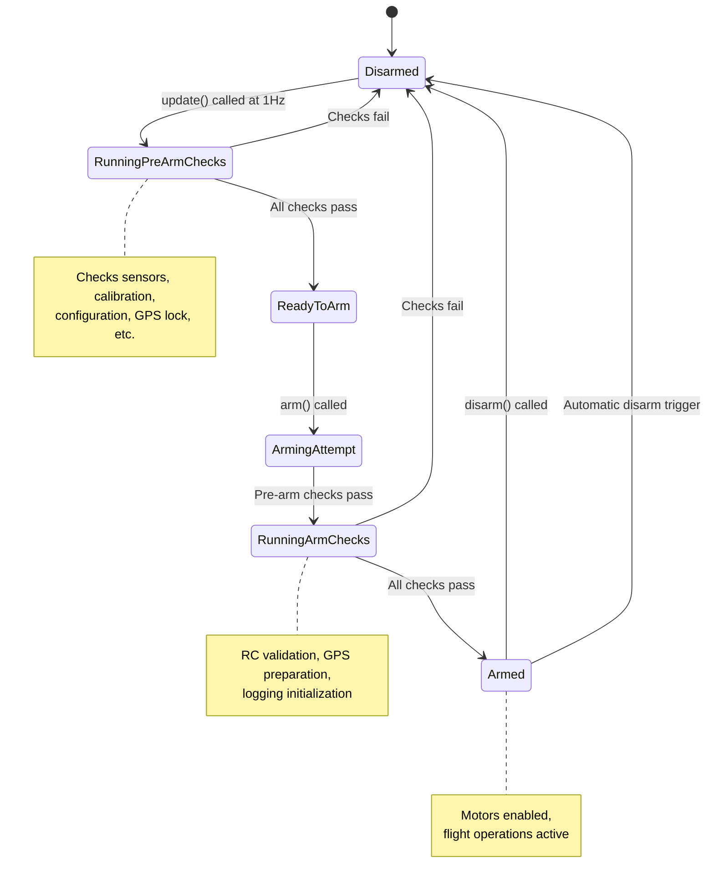
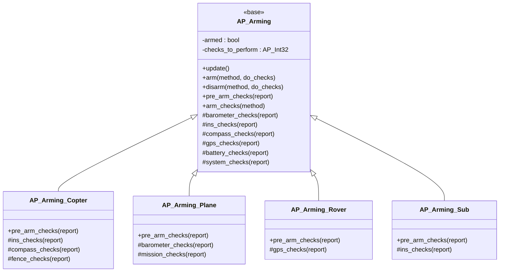
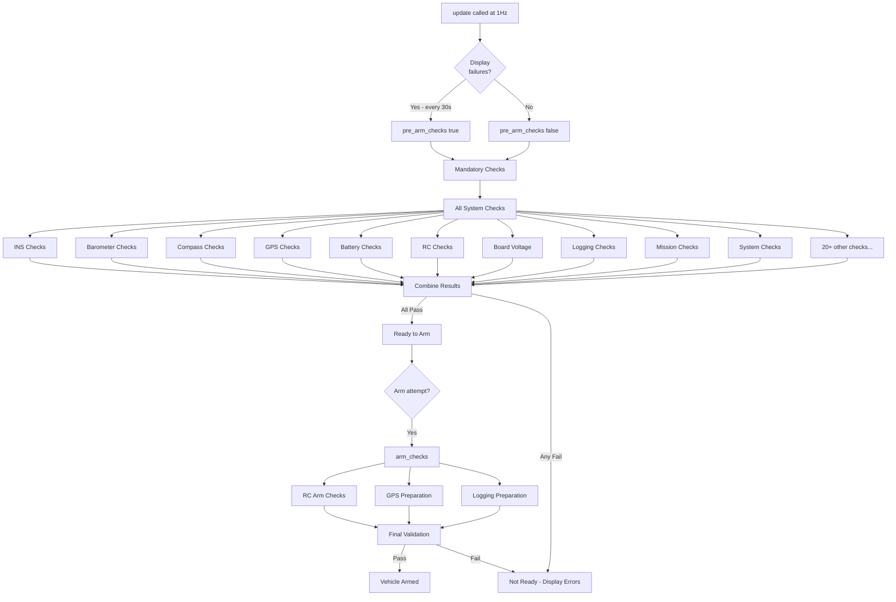
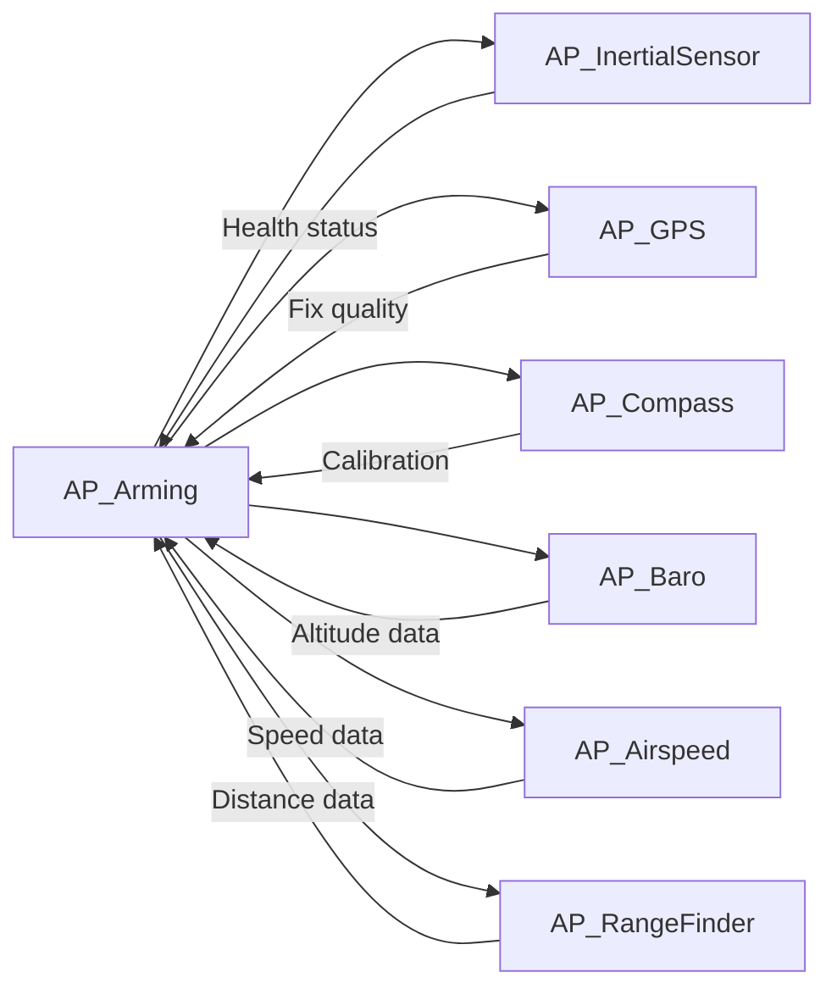
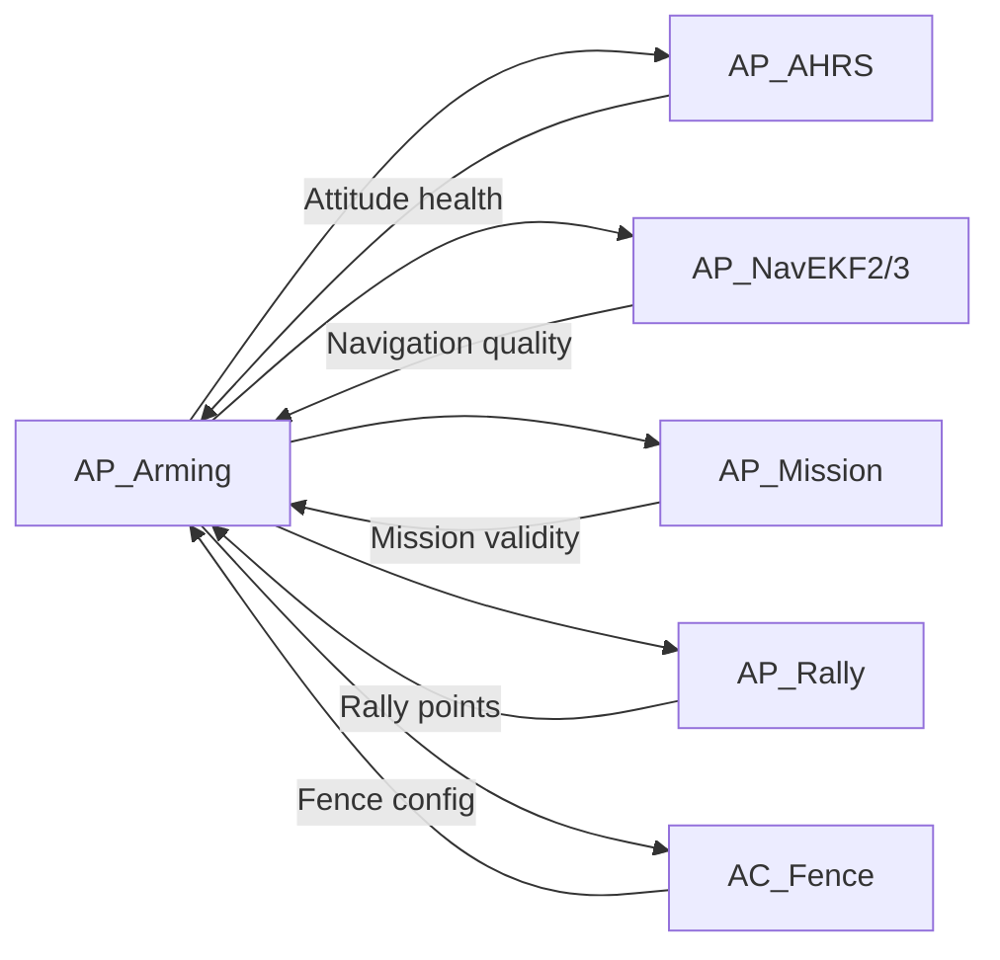
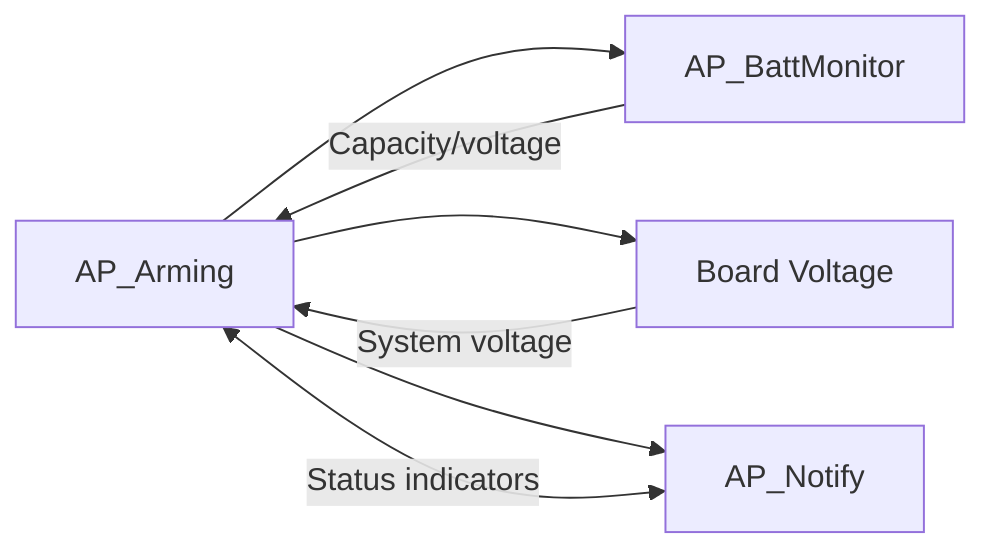
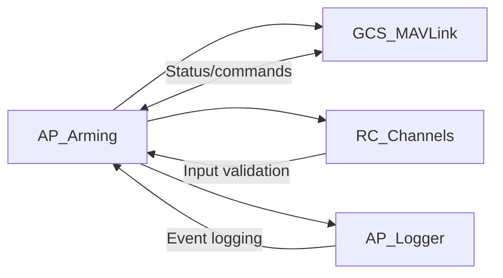

# AP_Arming Library


## Table of Contents
- [Overview](#overview)
- [Architecture](#architecture)
- [Pre-Arm Check Categories](#pre-arm-check-categories)
- [Check Implementation](#check-implementation)
- [Arming Methods](#arming-methods)
- [Disarming Logic](#disarming-logic)
- [Configuration Parameters](#configuration-parameters)
- [Vehicle-Specific Implementations](#vehicle-specific-implementations)
- [Forcing and Bypassing Checks](#forcing-and-bypassing-checks)
- [Safety Implications](#safety-implications)
- [Integration with Other Subsystems](#integration-with-other-subsystems)
- [Troubleshooting Guide](#troubleshooting-guide)
- [API Reference](#api-reference)

## Overview

The AP_Arming library provides a comprehensive safety system that performs critical pre-flight checks before allowing vehicle arming. This library is safety-critical and ensures that all essential systems are functioning correctly before motor output is enabled.

**Source Files**: `/libraries/AP_Arming/`
- `AP_Arming.h` - Core arming interface and check definitions
- `AP_Arming.cpp` - Base implementation of arming checks
- `AP_Arming_config.h` - Feature configuration flags

**Key Responsibilities**:
- Execute pre-arm safety checks across all vehicle subsystems
- Validate sensor health and calibration status
- Enforce safety interlocks and configuration requirements
- Manage arming/disarming state transitions
- Log arming events and failures for analysis
- Provide feedback to ground control stations and pilots

**Singleton Access**: `AP::arming()`

> **Safety Note**: The arming system is the final safety gate before motors can produce thrust. All checks must pass before flight operations begin. Disabling arming checks significantly increases crash risk and should only be done in controlled test environments.

## Architecture

### System Design

The AP_Arming library implements a comprehensive safety check framework that is called at 1Hz by the vehicle's main loop. The architecture consists of three check stages:

1. **Pre-Arm Checks** - Performed continuously before arming, can be displayed to user
2. **Arm Checks** - Performed only during arming attempts, may have side effects
3. **Mandatory Checks** - Always performed regardless of ARMING_CHECK parameter



### Class Hierarchy

The AP_Arming class serves as a base implementation that can be extended by vehicle-specific subclasses:



**Source**: `AP_Arming.h:13-350`, vehicle-specific implementations in respective vehicle directories

### Check Flow Architecture



**Source**: `AP_Arming.cpp:224-248` (update function), `AP_Arming.cpp:1798-1871` (arm function)

## Pre-Arm Check Categories

The arming system performs checks across 21 distinct categories, each validating critical vehicle subsystems. These checks are controlled by the `ARMING_CHECK` bitmask parameter.

**Source**: `AP_Arming.h:24-46` (Check enum definition)

### Check Categories Overview

| Check Category | Bitmask | Purpose | Typical Failures |
|---------------|---------|---------|------------------|
| **ALL** | (1<<0) | Enable all checks | N/A - meta flag |
| **BARO** | (1<<1) | Barometer health | Sensor not detected, unhealthy readings |
| **COMPASS** | (1<<2) | Magnetometer calibration | Poor calibration, magnetic interference |
| **GPS** | (1<<3) | GPS lock and accuracy | No fix, poor HDOP, insufficient satellites |
| **INS** | (1<<4) | Inertial sensor health | Accel/gyro inconsistency, calibration failure |
| **PARAMETERS** | (1<<5) | Parameter validation | Invalid values, missing required parameters |
| **RC** | (1<<6) | RC input validation | Not calibrated, no signal, failsafe active |
| **VOLTAGE** | (1<<7) | Board voltage | Under/over voltage conditions |
| **BATTERY** | (1<<8) | Battery level | Low capacity, voltage sag, failsafe armed |
| **AIRSPEED** | (1<<9) | Airspeed sensor (Plane) | Sensor failure, poor calibration |
| **LOGGING** | (1<<10) | Logging availability | SD card full, logging not started |
| **SWITCH** | (1<<11) | Hardware safety switch | Safety switch not disarmed |
| **GPS_CONFIG** | (1<<12) | GPS configuration | GPS not properly configured for flight |
| **SYSTEM** | (1<<13) | System health | CPU load, internal errors, board config |
| **MISSION** | (1<<14) | Mission validation | Required mission items missing |
| **RANGEFINDER** | (1<<15) | Rangefinder health | Sensor failure (if required for mode) |
| **CAMERA** | (1<<16) | Camera system | Camera initialization failure |
| **AUX_AUTH** | (1<<17) | Auxiliary authorization | External auth system not approved |
| **VISION** | (1<<18) | Visual odometry | Vision system failure or timeout |
| **FFT** | (1<<19) | Gyro FFT analysis | Harmonic notch filter issues |
| **OSD** | (1<<20) | On-screen display | OSD initialization failure |

**Configuration**: Set `ARMING_CHECK` parameter to enable/disable specific checks
- `ARMING_CHECK = 1` (default): All checks enabled
- `ARMING_CHECK = 0`: Only mandatory checks (high risk)
- `ARMING_CHECK = 72`: Only GPS (8) and Battery (64) checks

### Detailed Check Descriptions

#### 1. Barometer Checks (BARO)

**Purpose**: Validates barometer sensor health for altitude estimation

```cpp
/**
 * @brief Validate barometer functionality
 * Source: AP_Arming.cpp:347-368
 */
```

**Checks Performed**:
- At least one barometer detected and healthy
- All configured barometers reporting valid data
- Barometer readings within acceptable ranges
- No recent sensor failures or timeouts

**Common Failure Modes**:
- "Baro: Not found" - No barometer detected on I2C/SPI bus
- "Baro: unhealthy" - Sensor timeout or checksum errors

#### 2. Compass Checks (COMPASS)

**Purpose**: Validates magnetometer calibration and magnetic field strength

```cpp
/**
 * @brief Validate compass calibration and health
 * Source: AP_Arming.cpp:586-719
 */
```

**Checks Performed**:
- At least one compass enabled and healthy
- Compass offsets within acceptable limits
- Magnetic field strength matches expected Earth field (530±345 mGauss)
- Compass consistent with other sensors (if multiple)
- No significant magnetic interference detected
- Compass variance within thresholds

**Configuration**:
- `ARMING_MAGTHRESH`: Field strength error threshold (default: 100 mGauss)
- Expected field: 530 mGauss (AP_ARMING_COMPASS_MAGFIELD_EXPECTED)
- Valid range: 185-875 mGauss

**Source**: `AP_Arming.cpp:74-76` (thresholds), `AP_Arming.h:125` (compass_magfield_expected)

**Common Failure Modes**:
- "Compass: not healthy" - Sensor timeout or communication failure
- "Compass: offsets too high" - Poor calibration quality
- "Compass: field too low/high" - Wrong location data or interference

#### 3. GPS Checks (GPS)

**Purpose**: Ensures adequate GPS lock quality for navigation

```cpp
/**
 * @brief Validate GPS lock and accuracy
 * Source: AP_Arming.cpp:721-891
 */
```

**Checks Performed**:
- GPS lock achieved (2D or 3D fix)
- Sufficient satellite count (typically ≥6)
- Horizontal dilution of precision (HDOP) acceptable
- GPS velocity accuracy within limits
- GPS position matches AHRS position (within 10m)
- GPS configuration correct for flight
- RTK status (if applicable)

**Configuration**:
- `ARMING_NEED_LOC`: Require absolute position before arming (Copter/Rover)
- Max AHRS/GPS difference: 10m (AP_ARMING_AHRS_GPS_ERROR_MAX)

**Source**: `AP_Arming.cpp:80` (error threshold), `AP_Arming.h:184` (require_location parameter)

**Common Failure Modes**:
- "GPS: No 3D fix" - Insufficient satellite visibility
- "GPS: High HDOP" - Poor satellite geometry
- "GPS: Speed error" - GPS velocity estimate unreliable

#### 4. INS (Inertial Sensor) Checks (INS)

**Purpose**: Validates accelerometer and gyroscope health and consistency

```cpp
/**
 * @brief Validate inertial sensors
 * Source: AP_Arming.cpp:370-478
 */
```

**Checks Performed**:
- At least one IMU healthy and calibrated
- Accelerometers consistent across multiple IMUs
- Gyroscopes consistent across multiple IMUs
- Sensor samples arriving at expected rate
- No recent calibration failures
- Accelerometer and gyro offsets reasonable
- IMU temperature within operating range (if heated IMU)

**Configuration**:
- `ARMING_ACCTHRESH`: Accel error threshold (default: 0.75 m/s/s)

**Source**: `AP_Arming.h:179` (accel_error_threshold), `AP_Arming.cpp:78` (default value)

**Consistency Checks**:
```cpp
// Source: AP_Arming.cpp:2097-2141 (ins_accels_consistent)
// Compares primary accelerometer to all other IMUs
// Checks: last_accel_pass_ms timestamp for rate validation
```

**Common Failure Modes**:
- "INS: not calibrated" - Accelerometer calibration not performed
- "INS: gyros inconsistent" - Hardware failure or poor calibration
- "INS: accels inconsistent" - Vibration or sensor failure

#### 5. RC (Radio Control) Checks (RC)

**Purpose**: Validates radio control input configuration and signal quality

```cpp
/**
 * @brief Validate RC input
 * Source: AP_Arming.cpp:1105-1187 (calibration), 1306-1329 (arm checks)
 */
```

**Checks Performed**:
- RC calibration completed (min/max PWM values set)
- RC signal present (no failsafe)
- Throttle channel at minimum for arming
- RC channels within expected ranges
- No RC failsafe condition active

**Source**: Vehicle-specific RC checks in `AP_Arming.cpp:1957-1984` (rc_checks_copter_sub)

**PWM Calibration Limits**:
- Min PWM must be ≤ 1300 (RC_CALIB_MIN_LIMIT_PWM)
- Max PWM must be ≥ 1700 (RC_CALIB_MAX_LIMIT_PWM)

**Common Failure Modes**:
- "RC: not calibrated" - RC_CALIBRATE not run
- "RC: Roll/Pitch/Yaw radio min too high" - Incomplete calibration
- "RC: failsafe" - Signal loss detected

#### 6. Battery Checks (BATTERY)

**Purpose**: Ensures sufficient battery capacity for safe flight

```cpp
/**
 * @brief Validate battery status
 * Source: AP_Arming.cpp:1009-1057
 */
```

**Checks Performed**:
- Battery monitor configured and healthy
- Remaining capacity above minimum threshold
- Battery voltage above failsafe level
- No battery failsafe conditions armed
- Current sensor functioning (if configured)

**Integration**: Uses `AP_BattMonitor` singleton for battery state

**Common Failure Modes**:
- "Battery: low capacity" - Insufficient mAh remaining
- "Battery: low voltage" - Voltage below failsafe threshold
- "Battery: unhealthy" - Communication failure with battery monitor

#### 7. Board Voltage Checks (VOLTAGE)

**Purpose**: Validates autopilot board power supply voltage

```cpp
/**
 * @brief Check board voltage
 * Source: AP_Arming.cpp:1271-1287
 */
```

**Checks Performed**:
- Board voltage within safe operating range
- Voltage stable (not fluctuating)
- No brownout conditions detected

**Voltage Limits**:
- Maximum: 5.8V (AP_ARMING_BOARD_VOLTAGE_MAX)

**Source**: `AP_Arming.cpp:77`

**Common Failure Modes**:
- "Board voltage: too high" - Overvoltage condition
- "Board voltage: too low" - Insufficient power supply

#### 8. Logging Checks (LOGGING)

**Purpose**: Ensures flight data logging is available

```cpp
/**
 * @brief Validate logging system
 * Source: AP_Arming.cpp:480-511, 1733-1744 (arm checks)
 */
```

**Checks Performed**:
- SD card present and writable
- Sufficient free space for logging
- Logger initialized successfully
- Logging started before arming

**Integration**: Calls `AP_Logger::PrepForArming()` during arm checks

**Common Failure Modes**:
- "Logging: not available" - SD card missing or full
- "Logging: not started" - Logger initialization failed

#### 9. Mission Checks (MISSION)

**Purpose**: Validates mission contains required items for AUTO mode

```cpp
/**
 * @brief Check mission requirements
 * Source: AP_Arming.cpp:1189-1270
 */
```

**Checks Performed**:
- Mission uploaded if required
- Mission contains required items (land, takeoff, rally, RTL)
- Mission commands valid for vehicle type
- Geofence compatible with mission

**Configuration**:
- `ARMING_MIS_ITEMS`: Bitmask of required mission items

**Source**: `AP_Arming.h:181` (_required_mission_items parameter)

**Required Item Bitmask** (`AP_Arming.cpp:297-306`):
- Bit 0: LAND command
- Bit 1: VTOL_LAND command
- Bit 2: DO_LAND_START command
- Bit 3: TAKEOFF command
- Bit 4: VTOL_TAKEOFF command
- Bit 5: Rally point
- Bit 6: RETURN_TO_LAUNCH command

**Common Failure Modes**:
- "Mission: missing land command" - AUTO missions should include landing
- "Mission: missing rally point" - Rally points required for failsafe

#### 10. System Checks (SYSTEM)

**Purpose**: Validates overall system health and configuration

```cpp
/**
 * @brief System health checks
 * Source: AP_Arming.cpp:1523-1619
 */
```

**Checks Performed**:
- No internal errors detected
- CPU load acceptable
- Memory allocation healthy
- Board configuration valid
- Sensor subsystem initialized
- Scheduler running normally

**Integration**: Checks `AP_InternalError` for software faults

**Common Failure Modes**:
- "System: internal error" - Software fault detected
- "System: high CPU load" - Scheduler overrun
- "System: bad configuration" - Hardware setup invalid

### Additional Check Categories

#### Hardware Safety Switch (SWITCH)

Validates that hardware safety switch is disarmed before allowing arming.

**Source**: `AP_Arming.cpp:985-1007` (hardware_safety_check)

#### Rangefinder Checks (RANGEFINDER)

Validates rangefinder health if required for flight mode.

**Source**: `AP_Arming.cpp:1399-1434` (rangefinder_checks)

#### Auxiliary Authorization (AUX_AUTH)

External authorization system (typically via scripting).

**Source**: `AP_Arming.cpp:1457-1491` (aux_auth_checks), enabled by `AP_ARMING_AUX_AUTH_ENABLED`

#### Visual Odometry (VISION)

Validates visual positioning system health.

**Source**: `AP_Arming.cpp:1987-2007` (visodom_checks)

#### Gyro FFT (FFT)

Validates harmonic notch filter configuration.

**Source**: Referenced in system checks

#### Camera Checks (CAMERA)

Validates camera system initialization (RunCam integration).

**Source**: `AP_Arming.cpp:1436-1455` (camera_checks)

#### OSD Checks (OSD)

Validates on-screen display initialization.

**Source**: `AP_Arming.cpp:2009-2030` (osd_checks)

## Check Implementation

### Check Execution Model

The arming check system uses a three-tiered execution model to balance safety, performance, and user experience:

#### 1. Pre-Arm Checks (Continuous)

```cpp
/**
 * @brief Continuously executed checks at 1Hz
 * Source: AP_Arming.cpp:224-248 (update), 1621-1707 (pre_arm_checks)
 * 
 * @details Called by vehicle main loop at 1Hz rate.
 *          Results displayed to user every 30 seconds.
 *          Can be disabled with ARMING_OPTIONS bit 0.
 * 
 * @param[in] report Display failures to ground station
 * @return true if all enabled checks pass
 */
bool AP_Arming::pre_arm_checks(bool report);
```

**Execution Flow**:
1. Called at 1Hz by `AP_Arming::update()`
2. Display failures every 30 seconds (PREARM_DISPLAY_PERIOD)
3. Display immediately when check transitions from pass to fail
4. All checks combined with logical AND (all must pass)

**Source**: `AP_Arming.cpp:108-110` (PREARM_DISPLAY_PERIOD default), `AP_Arming.cpp:233-247` (display timing)

#### 2. Arm Checks (On Arming Attempt)

```cpp
/**
 * @brief Checks with side effects, only run during arming
 * Source: AP_Arming.cpp:1709-1747
 * 
 * @details These checks may modify system state:
 *          - Prepare GPS for navigation
 *          - Initialize logging system
 *          - Validate RC input for arming gesture
 * 
 * @param[in] method Arming method being used
 * @return true if arm-time checks pass
 */
bool AP_Arming::arm_checks(AP_Arming::Method method);
```

**Checks Performed**:
- RC arm validation (throttle at zero, no failsafe)
- GPS driver preparation (`AP::gps().prepare_for_arming()`)
- Logging system initialization (`AP_Logger::PrepForArming()`)

**Source**: `AP_Arming.cpp:1709-1747`

#### 3. Mandatory Checks (Always Enforced)

```cpp
/**
 * @brief Checks that cannot be bypassed
 * Source: AP_Arming.cpp:1786-1795
 * 
 * @details These checks run even when ARMING_CHECK=0:
 *          - OpenDroneID compliance (if enabled)
 *          - RC calibration validation
 *          - Serial protocol configuration
 * 
 * @return true if mandatory checks pass
 */
bool AP_Arming::mandatory_checks(bool report);
```

**Purpose**: Safety-critical checks that must pass regardless of configuration

### Check Implementation Pattern

All check functions follow a consistent pattern:

```cpp
bool AP_Arming::example_checks(bool report)
{
    // Early exit if check disabled
    if (!check_enabled(Check::EXAMPLE)) {
        return true;
    }
    
    // Perform validation
    if (condition_failed) {
        check_failed(Check::EXAMPLE, report, "Error message");
        return false;
    }
    
    // Additional checks...
    
    return true;  // All checks passed
}
```

**Key Functions**:

```cpp
/**
 * @brief Check if specific check is enabled
 * Source: AP_Arming.cpp:286-292
 */
bool check_enabled(const AP_Arming::Check check) const;

/**
 * @brief Report check failure to GCS
 * Source: AP_Arming.cpp:294-321
 */
void check_failed(const AP_Arming::Check check, bool report, const char *fmt, ...) const;
```

### Vehicle-Specific Check Overrides

Vehicle subclasses can override base checks to add vehicle-specific requirements:

```cpp
// Example: Copter-specific INS checks
// Source: ArduCopter/AP_Arming_Copter.cpp
class AP_Arming_Copter : public AP_Arming {
    bool ins_checks(bool report) override {
        // Call base implementation
        if (!AP_Arming::ins_checks(report)) {
            return false;
        }
        
        // Add copter-specific checks
        // - Check vibration levels
        // - Validate motor calibration
        // - Verify attitude control initialization
        
        return true;
    }
};
```

## Arming Methods

The arming system supports multiple arming methods, each with specific requirements and use cases.

**Source**: `AP_Arming.h:48-89` (Method enum)

### Available Arming Methods

```cpp
/**
 * @brief Arming method enumeration
 * Source: AP_Arming.h:48-89
 */
enum class Method {
    RUDDER = 0,           // Rudder stick gesture
    MAVLINK = 1,          // MAVLink command
    AUXSWITCH = 2,        // RC auxiliary switch
    MOTORTEST = 3,        // Motor test feature
    SCRIPTING = 4,        // Lua scripting
    BLACKBOX = 34,        // Black box flight data recorder
    DDS = 35,             // DDS/ROS2 interface
    AUTO_ARM_ONCE = 36,   // Automatic arming after checks
    TURTLE_MODE = 37,     // Turtle mode recovery
    TOYMODE = 38,         // Toy mode operation
    UNKNOWN = 100         // Unknown/invalid method
};
```

### Method Descriptions

#### RUDDER (Stick Arming)

**Configuration**: `ARMING_RUDDER` parameter

```cpp
enum class RudderArming {
    IS_DISABLED = 0,   // Rudder arming disabled
    ARMONLY = 1,       // Arm only (not disarm)
    ARMDISARM = 2      // Arm and disarm
};
```

**Source**: `AP_Arming.h:128-132`, `AP_Arming.cpp:82-86` (default per vehicle)

**Requirements**:
- Throttle at zero ± deadzone
- Right rudder input for >1 second to arm
- Left rudder input for >1 second to disarm (if ARMDISARM enabled)
- Not available in certain flight modes (AUTO, GUIDED)

**Default Configuration**:
- Plane: ARMONLY (safety - prevents accidental disarm in flight)
- Copter/Rover: ARMDISARM (convenience)

#### MAVLINK (Ground Control Station)

**Protocol**: MAVLink `COMMAND_LONG` with `MAV_CMD_COMPONENT_ARM_DISARM`

**Advantages**:
- Can arm from any flight mode
- Provides clear feedback via status messages
- Can force-arm with parameter (bypasses non-mandatory checks)

**Integration**: Handled by `GCS_MAVLink` message processing

#### AUXSWITCH (RC Switch)

**Configuration**: Assign RC channel function to "Arm/Disarm"

**Usage**:
- Toggle switch position to arm/disarm
- Useful for quick rearm after landing
- Switch must be in correct position for ≥1 second

#### SCRIPTING (Lua Scripts)

**Purpose**: Allow custom arming logic via Lua scripts

**Security**: Scripts must explicitly request arming capability

**Source**: Enabled when `AP_SCRIPTING_ENABLED`

#### AUTO_ARM_ONCE

**Configuration**: `ARMING_REQUIRE = 3` (Rover only)

**Behavior**:
- Automatically arms once all pre-arm checks pass
- Only arms once per boot
- Subsequent arming requires manual action

**Source**: `AP_Arming.cpp:116-125` (REQUIRE parameter description)

### Arming Function

```cpp
/**
 * @brief Attempt to arm the vehicle
 * Source: AP_Arming.cpp:1798-1871
 * 
 * @param[in] method Arming method being used
 * @param[in] do_arming_checks Perform safety checks (false = force arm)
 * 
 * @return true if arming successful
 * 
 * @details Arming sequence:
 *          1. Validate arming method allowed
 *          2. Run pre-arm checks (if do_arming_checks=true)
 *          3. Run arm checks (if do_arming_checks=true)
 *          4. Run mandatory checks (always)
 *          5. Set armed state
 *          6. Initialize subsystems for flight
 *          7. Log arming event
 * 
 * @warning Force arming (do_arming_checks=false) bypasses safety checks!
 */
bool AP_Arming::arm(AP_Arming::Method method, bool do_arming_checks=true);
```

**Arming Sequence Operations**:

1. **Validation** (`AP_Arming.cpp:1800-1813`):
   - Check not already armed
   - Validate method allowed (e.g., rudder arming enabled)

2. **Safety Checks** (`AP_Arming.cpp:1817`):
   - Pre-arm checks (sensor health, calibration, GPS)
   - Arm checks (RC validation, GPS preparation, logging)
   - Mandatory checks (always enforced)

3. **State Change** (`AP_Arming.cpp:1818-1821`):
   - Set `armed = true`
   - Record arm time (`last_arm_time_us`)
   - Record arm method (`_last_arm_method`)

4. **Subsystem Initialization** (`AP_Arming.cpp:1840-1869`):
   - Initialize gyro FFT (if enabled)
   - Set terrain reference location
   - Auto-enable geofence (if configured)
   - Assert ARM GPIO pin (if configured)

5. **Logging** (`AP_Arming.cpp:1824`):
   ```cpp
   Log_Write_Arm(!do_arming_checks, method);
   ```

**Force Arming**:

```cpp
/**
 * @brief Force arm bypassing safety checks
 * Source: AP_Arming.h:104
 * 
 * @warning This bypasses all non-mandatory safety checks!
 *          Use only in controlled test environments.
 */
bool arm_force(AP_Arming::Method method) { 
    return arm(method, false); 
}
```

### Arming Status Query

```cpp
/**
 * @brief Check if vehicle is armed
 * Source: AP_Arming.cpp:268-271
 * 
 * @return true if armed OR arming not required
 */
bool is_armed() const;

/**
 * @brief Check if armed with safety off
 * Source: AP_Arming.cpp:276-279
 * 
 * @return true if armed AND hardware safety disarmed
 */
bool is_armed_and_safety_off() const;

/**
 * @brief Get time since arming
 * Source: AP_Arming.h:110
 * 
 * @return Microseconds since arm, or 0 if disarmed
 */
uint64_t arm_time_us() const;
```

## Disarming Logic

The disarming system provides controlled motor shutdown with proper system state management and logging.

### Disarm Function

```cpp
/**
 * @brief Disarm the vehicle
 * Source: AP_Arming.cpp:1874-1924
 * 
 * @param[in] method Disarm method/trigger
 * @param[in] do_disarm_checks Perform disarm validation
 * 
 * @return true if disarm successful
 * 
 * @details Disarm sequence:
 *          1. Validate not already disarmed
 *          2. Check disarm method requirements
 *          3. Set disarmed state
 *          4. Log disarm event
 *          5. Update subsystems
 *          6. Handle forced logging continuation
 * 
 * @note Unlike arming, disarming checks are typically minimal
 */
bool AP_Arming::disarm(AP_Arming::Method method, bool do_disarm_checks=true);
```

### Disarm Methods and Triggers

The Method enum includes numerous automatic disarm triggers:

**Manual Disarm Methods**:
- `RUDDER`: Left rudder stick (if enabled)
- `MAVLINK`: GCS disarm command
- `AUXSWITCH`: RC auxiliary switch
- `SCRIPTING`: Lua script disarm

**Automatic Disarm Triggers** (Source: `AP_Arming.h:54-82`):

| Trigger | Purpose | Vehicle |
|---------|---------|---------|
| **TERMINATION** | Flight termination system activated | All |
| **CPUFAILSAFE** | CPU overload/watchdog | All |
| **BATTERYFAILSAFE** | Critical battery level | All |
| **CRASH** | Crash detected | Copter |
| **LANDED** | Vehicle has landed | Copter |
| **RADIOFAILSAFE** | Radio control signal loss | All |
| **GCSFAILSAFE** | Ground station connection loss | All |
| **EKFFAILSAFE** | EKF navigation failure | All |
| **FENCEBREACH** | Geofence breach action | All |
| **PARACHUTE_RELEASE** | Parachute deployed | Copter |
| **AFS** | Advanced Failsafe triggered | Plane |
| **ADSBCOLLISIONACTION** | ADSB collision avoidance | All |
| **TERRRAINFAILSAFE** | Terrain data unavailable | All |
| **FAILSAFE_ACTION_TERMINATE** | Failsafe termination action | All |
| **DISARMDELAY** | Automatic disarm timer | All |
| **MISSIONEXIT** | Mission completed | All |
| **AUTOLANDED** | Auto landing completed | All |
| **PILOT_INPUT_FAILSAFE** | Pilot input timeout | Copter |
| **DEADRECKON_FAILSAFE** | GPS dead reckoning limit | All |
| **TAKEOFFTIMEOUT** | Takeoff did not complete | Copter |
| **LANDING** | Landing sequence | All |

### Disarm Sequence Operations

**Source**: `AP_Arming.cpp:1874-1924`

1. **Validation** (`AP_Arming.cpp:1876-1889`):
   ```cpp
   // Check not already disarmed
   if (!armed) {
       return false;
   }
   
   // For rudder disarm, validate requirements
   if (method == Method::RUDDER) {
       // Throttle must be at zero
       // ARMING_RUDDER must allow disarm
   }
   ```

2. **State Change** (`AP_Arming.cpp:1890-1891`):
   ```cpp
   armed = false;
   _last_disarm_method = method;
   ```

3. **Logging** (`AP_Arming.cpp:1894-1896`):
   ```cpp
   Log_Write_Disarm(!do_disarm_checks, method);
   check_forced_logging(method);  // Keep logging for analysis
   ```

4. **Subsystem Updates** (`AP_Arming.cpp:1899-1922`):
   - Force safety switch ON (if configured)
   - Save gyro FFT tuning parameters
   - Auto-disable geofence
   - Clear ARM GPIO pin

### Automatic Disarm Conditions

#### Time-Based Disarm (DISARMDELAY)

Configured per vehicle type based on `ARMING_REQUIRE` parameter:
- Automatic disarm after landing (Copter)
- Disarm after inactivity timeout (Rover)

#### Failsafe Disarms

Most failsafe conditions trigger disarm through specific method codes:

```cpp
// Example: Battery failsafe triggers disarm
// Source: Vehicle-specific failsafe.cpp
void Copter::failsafe_battery_event(void)
{
    if (failsafe.battery_low) {
        // Execute battery failsafe action
        if (action == ACTION_LAND_DISARM) {
            arming.disarm(AP_Arming::Method::BATTERYFAILSAFE, true);
        }
    }
}
```

### Disarm State Logging

```cpp
/**
 * @brief Get last disarm method
 * Source: AP_Arming.h:148
 * 
 * @return Method used for last disarm
 * @note Invalid unless vehicle has been disarmed at least once
 */
Method last_disarm_method() const;

/**
 * @brief Get last arm method
 * Source: AP_Arming.h:152
 * 
 * @return Method used for last arm
 * @note Invalid unless vehicle has been armed at least once
 */
Method last_arm_method() const;
```

### Forced Logging After Disarm

```cpp
/**
 * @brief Determine if logging should continue after disarm
 * Source: AP_Arming.cpp:2222-2245
 * 
 * @details For certain disarm triggers (crashes, failsafes),
 *          logging continues to capture post-event data
 */
void check_forced_logging(const AP_Arming::Method method);
```

**Forced Logging Triggers**:
- Crash disarm
- Failsafe disarms
- Termination events
- Parachute deployment

## Configuration Parameters

The AP_Arming library exposes several key parameters for configuration.

**Source**: `AP_Arming.cpp:114-201` (var_info array)

### ARMING_REQUIRE

**Type**: Enumeration  
**Default**: Platform-dependent

```cpp
/**
 * @brief Arming requirement level
 * Source: AP_Arming.h:91-97
 */
enum class Required {
    NO = 0,                      // No arming required
    YES_MIN_PWM = 1,            // Require arming, min PWM when disarmed
    YES_ZERO_PWM = 2,           // Require arming, zero PWM when disarmed
    YES_AUTO_ARM_MIN_PWM = 3,   // Auto-arm once after checks (Rover)
    YES_AUTO_ARM_ZERO_PWM = 4   // Auto-arm once, zero PWM (Rover)
};
```

**Platform Defaults**:
- Plane: `YES_MIN_PWM`
- Rover: `YES_MIN_PWM`
- Copter: Managed by motors library (not this parameter)

**Source**: `AP_Arming.cpp:123-125` (parameter definition)

**Behavior**:
- `NO (0)`: Motors immediately active, no arming required (test use only)
- `YES_MIN_PWM (1)`: Standard arming, minimum throttle output when disarmed
- `YES_ZERO_PWM (2)`: Standard arming, zero throttle output when disarmed
- `YES_AUTO_ARM_MIN_PWM (3)`: Automatically arms once checks pass, min PWM disarmed
- `YES_AUTO_ARM_ZERO_PWM (4)`: Automatically arms once checks pass, zero PWM disarmed

> **Warning**: `ARMING_REQUIRE=0` removes critical safety interlocks. Motors will spin immediately on power-up!

### ARMING_CHECK

**Type**: Bitmask (32-bit)  
**Default**: 1 (all checks enabled)

```cpp
/**
 * @brief Enable/disable specific arming checks
 * Source: AP_Arming.cpp:159-165
 * 
 * Bitmask values correspond to Check enum (AP_Arming.h:24-46)
 */
AP_Int32 checks_to_perform;
```

**Configuration Examples**:
```
ARMING_CHECK = 1      # All checks enabled (recommended)
ARMING_CHECK = 0      # Only mandatory checks (high risk)
ARMING_CHECK = 14     # GPS(8) + INS(4) + BARO(2) only
ARMING_CHECK = 72     # Battery(64) + GPS(8) only
```

**Calculation**: Sum the bit values for desired checks
- ALL = 1 (enables all checks)
- BARO = 2
- COMPASS = 4
- GPS = 8
- INS = 16
- PARAMETERS = 32
- RC = 64
- VOLTAGE = 128
- BATTERY = 256
- ...and more (see Check Categories table)

### ARMING_ACCTHRESH

**Type**: Float  
**Units**: m/s²  
**Range**: 0.25 to 3.0  
**Default**: 0.75

```cpp
/**
 * @brief Accelerometer consistency threshold
 * Source: AP_Arming.cpp:129-135
 * 
 * @details Maximum allowable difference between accelerometers
 *          for multi-IMU systems. Lower values = stricter checking.
 */
AP_Float accel_error_threshold;
```

**Tuning Guidance**:
- **0.25 m/s²**: Very strict - may reject good calibrations
- **0.75 m/s²**: Default - good balance of safety and reliability
- **1.5 m/s²**: Relaxed - use only if calibration proves difficult
- **3.0 m/s²**: Maximum - essentially disables accel consistency check

**Source**: `AP_Arming.cpp:78` (default value), `AP_Arming.h:179` (parameter definition)

### ARMING_RUDDER

**Type**: Enumeration  
**Values**: 0=Disabled, 1=ArmOnly, 2=ArmOrDisarm  
**Default**: Platform-dependent

```cpp
/**
 * @brief Rudder stick arming configuration
 * Source: AP_Arming.cpp:140-150
 */
AP_Int8 _rudder_arming;
```

**Platform Defaults** (Source: `AP_Arming.cpp:82-86`):
- Plane: ARMONLY (prevents accidental in-flight disarm)
- Copter/Rover/Sub: ARMDISARM (full control)

**Usage**:
- `0 (Disabled)`: Rudder arming completely disabled
- `1 (ArmOnly)`: Right rudder arms, left rudder does nothing
- `2 (ArmOrDisarm)`: Right rudder arms, left rudder disarms

### ARMING_MIS_ITEMS

**Type**: Bitmask  
**Default**: 0 (no requirements)

```cpp
/**
 * @brief Required mission items for arming
 * Source: AP_Arming.cpp:152-157
 * 
 * @details Enforces mission contains specific command types
 */
AP_Int32 _required_mission_items;
```

**Bitmask Values** (Source: `AP_Arming.cpp:297-306`):
- Bit 0 (1): LAND command required
- Bit 1 (2): VTOL_LAND command required
- Bit 2 (4): DO_LAND_START command required
- Bit 3 (8): TAKEOFF command required
- Bit 4 (16): VTOL_TAKEOFF command required
- Bit 5 (32): Rally point required
- Bit 6 (64): RTL (Return to Launch) command required

**Example Configuration**:
```
ARMING_MIS_ITEMS = 33   # Require LAND (1) and Rally (32)
ARMING_MIS_ITEMS = 73   # Require LAND (1), TAKEOFF (8), RTL (64)
```

### ARMING_OPTIONS

**Type**: Bitmask  
**Default**: 0

```cpp
/**
 * @brief Arming system behavior options
 * Source: AP_Arming.cpp:167-172
 */
AP_Int32 _arming_options;
```

**Available Options** (Source: `AP_Arming.h:155-158`):
- Bit 0 (1): `DISABLE_PREARM_DISPLAY` - Suppress pre-arm failure messages
- Bit 1 (2): `DISABLE_STATUSTEXT_ON_STATE_CHANGE` - No "Armed"/"Disarmed" messages

**Use Cases**:
- Option 0: Reduce ground station message clutter during testing
- Option 1: Minimize telemetry during autonomous operations

### ARMING_MAGTHRESH

**Type**: Integer  
**Units**: mGauss (milliGauss)  
**Range**: 0 to 500  
**Default**: 100

```cpp
/**
 * @brief Compass field strength error threshold
 * Source: AP_Arming.cpp:174-180
 * 
 * @details Maximum deviation from expected Earth magnetic field.
 *          Set to 0 to disable field strength check.
 */
AP_Int16 magfield_error_threshold;
```

**Magnetic Field Reference**:
- Expected field: 530 mGauss (varies by location)
- Valid range: 185-875 mGauss (0.35x to 1.65x expected)

**Source**: `AP_Arming.cpp:74-76`

**Tuning**:
- **0**: Disable field strength check (not recommended)
- **50**: Very strict - may fail in areas with local anomalies
- **100**: Default - good global coverage
- **200**: Relaxed - use if frequent false positives occur

### ARMING_NEED_LOC

**Type**: Boolean (0 or 1)  
**Default**: 0 (location not required)  
**Availability**: Copter and Rover only

```cpp
/**
 * @brief Require GPS position before arming
 * Source: AP_Arming.cpp:191-198
 * 
 * @details Ensures vehicle has absolute position for RTL capability
 */
AP_Enum<RequireLocation> require_location;
```

**Configuration**:
- `0`: GPS position not required for arming
- `1`: Absolute GPS position required before arming

**Purpose**: Ensures Return-To-Launch (RTL) failsafe can function properly

**Source**: `AP_Arming.h:184`, enabled by `AP_ARMING_NEED_LOC_PARAMETER_ENABLED`

### ARMING_CRSDP_IGN

**Type**: Boolean (0 or 1)  
**Default**: 0 (crash dump check active)  
**Availability**: When `AP_ARMING_CRASHDUMP_ACK_ENABLED`

```cpp
/**
 * @brief Acknowledge crash dump and allow arming
 * Source: AP_Arming.cpp:182-189
 * 
 * @warning Setting this to 1 acknowledges a software crash occurred.
 *          The vehicle may be unsafe to fly until issue is resolved.
 */
```

**Purpose**: Prevents arming after software crash until user acknowledges

**Safety Implications**:
- Crash dump indicates critical software failure
- Setting to 1 allows bypass but risk remains
- Contact ArduPilot support before bypassing this check

## Vehicle-Specific Implementations

Each vehicle type extends the base AP_Arming class with vehicle-specific safety checks.

### Class Inheritance Model

```cpp
// Base implementation
class AP_Arming { /* Common checks */ };

// Vehicle-specific extensions
class AP_Arming_Copter : public AP_Arming { /* Copter requirements */ };
class AP_Arming_Plane : public AP_Arming { /* Plane requirements */ };
class AP_Arming_Rover : public AP_Arming { /* Rover requirements */ };
class AP_Arming_Sub : public AP_Arming { /* Sub requirements */ };
```

### Copter-Specific Checks

**Source Files**: `/ArduCopter/AP_Arming.cpp`, `/ArduCopter/AP_Arming.h`

**Additional Checks**:
- **Motor Configuration**: Verify motor mixing matrix valid for frame type
- **Vibration Levels**: Check accelerometer vibration within acceptable limits
- **Altitude Source**: Validate barometer or rangefinder available for altitude hold
- **Mode Requirements**: Ensure current mode is armable (e.g., not in FLIP mode)
- **Rotor Speed**: Validate rotor speed controller initialized (traditional heli)
- **Landing Gear**: Check landing gear state consistent
- **Pilot Throttle**: Verify throttle at zero for manual arming

**Overridden Functions**:
```cpp
bool pre_arm_checks(bool report) override;
bool ins_checks(bool report) override;
bool compass_checks(bool report) override;
bool fence_checks(bool report) override;
```

### Plane-Specific Checks

**Source Files**: `/ArduPlane/AP_Arming.cpp`, `/ArduPlane/AP_Arming.h`

**Additional Checks**:
- **Airspeed Sensor**: Validate airspeed sensor health and calibration (if enabled)
- **Minimum Throttle**: Verify throttle minimum configured correctly
- **Q_ASSIST**: Check QuadPlane assist parameters valid
- **Takeoff Altitude**: Ensure terrain/altitude parameters set for auto takeoff
- **Stall Prevention**: Validate stall prevention parameters configured
- **Reverse Thrust**: Check reverse thrust configuration (if applicable)

**Overridden Functions**:
```cpp
bool pre_arm_checks(bool report) override;
bool barometer_checks(bool report) override;
bool mission_checks(bool report) override;
```

### Rover-Specific Checks

**Source Files**: `/Rover/AP_Arming.cpp`, `/Rover/AP_Arming.h`

**Additional Checks**:
- **Steering Configuration**: Validate steering servo configured
- **Throttle Configuration**: Verify throttle servo configured
- **Mode Compatibility**: Ensure mode is compatible with current configuration
- **Speed Limits**: Check speed parameters reasonable

**Overridden Functions**:
```cpp
bool pre_arm_checks(bool report) override;
bool gps_checks(bool report) override;
```

### Sub-Specific Checks

**Source Files**: `/ArduSub/AP_Arming.cpp`, `/ArduSub/AP_Arming.h`

**Additional Checks**:
- **Motor Configuration**: Verify motor layout valid for frame
- **Depth Sensor**: Validate pressure sensor (acts as depth sensor)
- **Leak Detector**: Check leak detectors if configured
- **Buoyancy**: Verify frame has appropriate buoyancy configuration

**Overridden Functions**:
```cpp
bool pre_arm_checks(bool report) override;
bool ins_checks(bool report) override;
```

### Vehicle-Specific Parameters

Each vehicle may have additional arming-related parameters:

**Copter**:
- `ARMING_RUDDER`: Affects in-air restarts
- Motor configuration affects pre-arm checks

**Plane**:
- Airspeed sensor integration
- QuadPlane transition parameters

**Rover**:
- Steering/throttle servo configuration
- Speed limit validation

## Forcing and Bypassing Checks

### Force Arm Function

```cpp
/**
 * @brief Force arm without safety checks
 * Source: AP_Arming.h:104
 * 
 * @param method Arming method
 * @return true if arming successful
 * 
 * @warning Bypasses all non-mandatory checks!
 * @safety_critical Use only in controlled test environments
 */
virtual bool arm_force(AP_Arming::Method method) {
    return arm(method, false);  // do_arming_checks = false
}
```

**What Gets Bypassed**:
- Pre-arm checks (sensor health, GPS, calibration)
- Arm checks (RC validation, logging initialization)

**What Still Runs** (Source: `AP_Arming.cpp:1817`):
- Mandatory checks (OpenDroneID, RC calibration, serial protocols)

**Access Methods**:
1. **MAVLink**: `COMMAND_LONG` with force parameter set
2. **Scripting**: Lua scripts can call with force flag
3. **Code**: Direct call to `arm_force(method)`

### Selective Check Disabling

```cpp
/**
 * @brief Disable specific checks via ARMING_CHECK parameter
 * 
 * Example: Disable compass and GPS checks
 * ARMING_CHECK = 0xFFFFFF - 4 - 8 = 0xFFFFE3
 * Or calculate: enable only INS + Baro = 16 + 2 = 18
 */
```

**Common Disable Scenarios**:

| Scenario | Configuration | Risks |
|----------|--------------|-------|
| **Indoor testing** | Disable GPS(8) + Compass(4) | No outdoor position validation |
| **Bench testing** | Disable Battery(256) + Voltage(128) | No power system validation |
| **Development** | Disable all except INS(16) | Minimal safety protection |
| **SITL testing** | Various combinations | Simulation-specific needs |

### ARMING_CHECK = 0 (Bypass Almost All)

**Configuration**: Set `ARMING_CHECK = 0`

**Effect**: Disables all configurable checks, runs only mandatory checks

**Mandatory Checks That Still Run** (Source: `AP_Arming.cpp:1786-1795`):
- OpenDroneID compliance (if enabled)
- RC input calibration
- Serial protocol configuration

**Use Cases**:
- Emergency recovery operations
- Extreme testing scenarios
- Hardware bring-up

> **Danger**: `ARMING_CHECK=0` removes nearly all safety protections. Vehicle may arm with:
> - No GPS lock
> - Uncalibrated sensors
> - Low battery
> - System errors
> 
> **Crash risk is extremely high!**

### Check Enable/Disable at Runtime

The check system evaluates `ARMING_CHECK` parameter at runtime:

```cpp
/**
 * @brief Check if specific check enabled
 * Source: AP_Arming.cpp:286-292
 */
bool AP_Arming::check_enabled(const AP_Arming::Check check) const
{
    if (checks_to_perform & uint32_t(Check::ALL)) {
        return true;  // ALL flag enables everything
    }
    return (checks_to_perform & uint32_t(check));
}
```

**Dynamic Behavior**:
- Parameter changes take effect immediately
- Can modify `ARMING_CHECK` via GCS without reboot
- Useful for progressive testing workflows

### Auxiliary Authorization System

```cpp
/**
 * @brief External authorization system
 * Source: AP_Arming.h:136-142, AP_Arming.cpp:1457-1491
 * 
 * @details Allows external systems (scripts, companion computers)
 *          to add custom arming approval logic
 * 
 * Enabled by: AP_ARMING_AUX_AUTH_ENABLED (requires AP_SCRIPTING_ENABLED)
 */

// Request authorization check
bool get_aux_auth_id(uint8_t& auth_id);

// Report authorization result
void set_aux_auth_passed(uint8_t auth_id);
void set_aux_auth_failed(uint8_t auth_id, const char* fail_msg);

// Reset all authorizations
void reset_all_aux_auths();
```

**Use Cases**:
- Custom safety interlocks via Lua scripting
- Companion computer approval required
- External sensor validation
- Multi-step arming procedures

**Implementation**:
- Up to 3 auxiliary authorizers supported
- Thread-safe via semaphore protection
- Failure messages passed to GCS

**Source**: `AP_Arming_config.h:9-11` (feature flag), `AP_Arming.h:308-322` (state machine)

## Safety Implications

### Safety-Critical Nature

The AP_Arming system is the **final safety gate** before motor output is enabled. Improper configuration or bypass can result in:

- Uncontrolled motor startup
- Flight with uncalibrated sensors
- Operation without failsafe protection
- Loss of vehicle control
- Property damage or injury

### Safety Design Principles

1. **Defense in Depth**: Multiple independent checks validate different aspects
2. **Fail-Safe Defaults**: Default configuration enables all checks
3. **Mandatory Checks**: Some checks cannot be bypassed
4. **Audit Trail**: All arming attempts logged for analysis
5. **User Feedback**: Clear messages explain failures

### Risk Assessment by Configuration

| Configuration | Risk Level | Appropriate Use |
|--------------|------------|-----------------|
| `ARMING_CHECK=1` (all) | **Low** | Normal flight operations |
| Selective disables | **Medium** | Controlled testing environments |
| `ARMING_CHECK=0` | **Very High** | Emergency/development only |
| Force arm | **Extreme** | Code development/bring-up only |

### Pre-Flight Safety Checklist

Before disabling any arming checks:

- [ ] Understand what safety protection is being removed
- [ ] Assess risk to vehicle and surroundings
- [ ] Ensure controlled environment (test stand, empty area)
- [ ] Have emergency stop procedure ready
- [ ] Log configuration for post-flight analysis
- [ ] Plan to re-enable checks after testing

### Crash Dump Safety Interlock

**Source**: `AP_Arming.cpp:1762-1783` (crashdump_checks)

If the autopilot crashed and rebooted:
- Crash dump data is preserved in memory
- `ARMING_CRSDP_IGN` check prevents arming
- User must acknowledge crash before flight

**Safety Rationale**:
- Software crash indicates potential instability
- Flying with known crash risk is dangerous
- Forces investigation before resuming operations

**Proper Response**:
1. Download crash dump data via MAVFtp or SD card
2. Report to ArduPilot support forums
3. Identify root cause
4. Apply fix (parameter change, firmware update, hardware)
5. Set `ARMING_CRSDP_IGN=1` only if risk understood

### OpenDroneID Mandatory Enforcement

**Source**: `AP_Arming.cpp:1946-1954` (arming_required override)

When OpenDroneID is enabled:
- `ARMING_REQUIRE` cannot be set to NO
- Arming is always required for regulatory compliance
- Prevents accidental operation without remote ID

### Hardware Safety Switch Integration

**Source**: `AP_Arming.cpp:985-1007` (hardware_safety_check)

Many autopilots include a hardware safety button:
- Must be pressed before arming allowed
- Prevents accidental arming during setup
- Automatically re-enabled on disarm (if configured)

**Configuration**: `BRD_SAFETY_OPTIONS` (AP_BoardConfig)

### Best Practices

1. **Never disable checks in flight-critical phases**
   - Always use full checks for actual flights
   - Testing exceptions should be documented

2. **Understand each check's purpose**
   - Don't disable checks due to nuisance alerts
   - Fix underlying issues instead

3. **Use selective disables, not global bypass**
   - Disable only specific problematic checks
   - Keep other safety protections active

4. **Document test configurations**
   - Log why checks were disabled
   - Restore normal config after testing

5. **Monitor arming logs**
   - Review `ARM` log messages in post-flight analysis
   - Identify patterns in arming failures

## Integration with Other Subsystems

The AP_Arming system integrates with numerous ArduPilot subsystems to perform comprehensive safety validation.

### Sensor Subsystems



**Integration Points**:

#### AP_InertialSensor (IMU)
**Source**: `AP_Arming.cpp:370-478`
- Query healthy IMU count
- Check accelerometer consistency
- Validate gyroscope consistency
- Verify calibration status

**Functions Called**:
```cpp
AP::ins().get_accel_health_all()
AP::ins().get_gyro_health_all()
AP::ins().calibrating()
```

#### AP_GPS
**Source**: `AP_Arming.cpp:721-891`, `AP_Arming.cpp:1720-1724`
- Validate fix quality and satellite count
- Check HDOP within limits
- Prepare GPS for arming (configure ports, enable features)

**Functions Called**:
```cpp
AP::gps().status()
AP::gps().num_sats()
AP::gps().prepare_for_arming()
```

#### AP_Compass (Magnetometer)
**Source**: `AP_Arming.cpp:586-719`
- Check compass health
- Validate field strength vs. expected
- Verify calibration quality

**Functions Called**:
```cpp
AP::compass().healthy()
AP::compass().get_offsets()
AP::compass().get_field()
```

#### AP_Baro (Barometer)
**Source**: `AP_Arming.cpp:347-368`
- Validate barometer detection
- Check health status

**Functions Called**:
```cpp
AP::baro().num_instances()
AP::baro().healthy()
```

### Navigation and Control Subsystems



#### AP_AHRS (Attitude Heading Reference System)
- Validates attitude estimation health
- Checks GPS/AHRS position agreement

#### AP_NavEKF2/EKF3 (Extended Kalman Filter)
- EKF health and variance checks (in vehicle-specific implementations)

#### AP_Mission
**Source**: `AP_Arming.cpp:1189-1270`
- Validates mission uploaded
- Checks for required mission items

**Functions Called**:
```cpp
AP::mission().num_commands()
AP::mission().get_command()
```

#### AC_Fence (Geofence)
**Source**: `AP_Arming.cpp:1371-1397`
- Validates fence configuration
- Checks vehicle inside fence boundaries
- Auto-enables fence on arming (if configured)

**Functions Called**:
```cpp
AP::fence().check_fence_is_ready()
AP::fence().auto_enable_fence_on_arming()  // called on arm
```

### Power and Monitoring Subsystems



#### AP_BattMonitor
**Source**: `AP_Arming.cpp:1009-1057`
- Checks battery capacity remaining
- Validates voltage levels
- Ensures no failsafe armed

**Functions Called**:
```cpp
AP::battery().num_instances()
AP::battery().healthy()
AP::battery().capacity_remaining_pct()
AP::battery().has_failsafed()
```

#### AP_BoardConfig
- Board voltage monitoring
- Safety switch configuration

#### AP_Notify
- LED indicators for arming state
- Buzzer patterns for arming status

### Communication Subsystems



#### GCS_MAVLink
**Source**: Throughout AP_Arming.cpp via `check_failed()` function
- Sends status messages about arming state
- Receives arm/disarm commands
- Reports check failures

**Functions Called**:
```cpp
gcs().send_text(severity, format, ...)
GCS_SEND_TEXT(severity, format, ...)
```

#### RC_Channels
**Source**: `AP_Arming.cpp:1105-1187` (calibration), `AP_Arming.cpp:1306-1329` (arm checks)
- Validates RC calibration
- Checks RC failsafe status
- Verifies throttle position for arming

**Functions Called**:
```cpp
rc().get_radio_in()
rc().has_valid_input()
rc().get_throttle_channel()
```

#### AP_Logger
**Source**: `AP_Arming.cpp:480-511` (checks), `AP_Arming.cpp:1733-1744` (preparation)
- Validates logging available
- Prepares logger for flight
- Logs arming events

**Functions Called**:
```cpp
AP_Logger::get_singleton()->logging_present()
AP_Logger::get_singleton()->PrepForArming()
AP_Logger::get_singleton()->logging_started()
```

**Log Messages**:
```cpp
// Source: AP_Arming.cpp:2177-2220
Log_Write_Arm(forced, method);      // ARM message
Log_Write_Disarm(forced, method);   // DISARM message
```

### Vehicle Mode Integration

Arming interacts with flight mode system:

**Mode Restrictions**:
- Some modes cannot be armed into (vehicle-specific)
- Mode transitions may trigger disarm
- Auto-disarm behavior varies by mode

**Integration**:
- Vehicle classes coordinate arming with mode manager
- Mode pre-conditions checked during arming
- Mode-specific arming requirements enforced

### Subsystem Initialization on Arm

**Source**: `AP_Arming.cpp:1840-1869`

When arming succeeds, several subsystems are notified:

```cpp
// Gyro FFT for harmonic notch
AP::fft()->prepare_for_arming();

// Terrain system sets reference location
AP::terrain()->set_reference_location();

// Geofence auto-enable
AP::fence()->auto_enable_fence_on_arming();

// GPIO pin output
hal.gpio->write(HAL_ARM_GPIO_PIN, armed);
```

### Thread Safety Considerations

**Semaphore Protection** (Source: `AP_Arming.h:321`):
```cpp
HAL_Semaphore aux_auth_sem;  // Protects auxiliary auth state
```

**Singleton Access** (Source: `AP_Arming.h:20`, `AP_Arming.cpp:213-221`):
```cpp
static AP_Arming *_singleton;  // Protected during construction
```

**Concurrency Notes**:
- `update()` called from main thread at 1Hz
- Arming requests may come from multiple sources
- Check functions access shared sensor state (inherently thread-safe via AP_HAL)

## Troubleshooting Guide

### Common Arming Failures and Solutions

#### "PreArm: GPS: No 3D fix"

**Cause**: Insufficient GPS satellite visibility or poor signal quality

**Solutions**:
1. Wait for GPS to acquire more satellites (typically need 6+)
2. Move to location with clear sky view
3. Check antenna not obstructed or damaged
4. Verify GPS configuration correct for hardware
5. Check GPS LED indicates 3D fix

**Bypass** (testing only): Set `ARMING_CHECK` to exclude GPS (remove bit 3)

**Diagnostic**:
```
GPS_RAW_INT: num_sats < 6
GPS_RAW_INT: fix_type < 3 (3D fix)
```

---

#### "PreArm: Compass: not healthy"

**Cause**: Magnetometer communication failure or timeout

**Solutions**:
1. Check compass is enabled (`COMPASS_USE` parameters)
2. Verify I2C/SPI connection to compass
3. Reboot autopilot to reinitialize sensors
4. Check for hardware failure (try external compass)
5. Verify correct compass for board type selected

**Bypass** (testing only): Set `ARMING_CHECK` to exclude compass (remove bit 2)

**Diagnostic**:
```
MAG: health flag = false
I2C errors in logs
```

---

#### "PreArm: Compass: offsets too high"

**Cause**: Poor compass calibration or magnetic interference

**Solutions**:
1. Perform compass calibration (accel cal or onboard cal)
2. Move away from magnetic interference sources
3. Check for steel components near compass
4. Verify compass orientation correct
5. Try different compass (external GPS/compass module)

**Parameters to Check**:
- `COMPASS_OFS_X/Y/Z`: Should be < 600 typically
- `COMPASS_DIA_X/Y/Z`: Should be near 1.0

---

#### "PreArm: INS: gyros inconsistent"

**Cause**: Multiple IMUs disagree, indicating hardware failure or poor calibration

**Solutions**:
1. Perform accelerometer calibration
2. Check for vibration issues (prop balance, soft mounts)
3. Verify IMU temperature stable (heated IMU may be warming up)
4. Check for hardware failure (compare multiple IMUs)
5. Disable bad IMU if one is faulty

**Parameters to Adjust**:
- `ARMING_ACCTHRESH`: Increase if cal is actually good (0.75 → 1.5)
- `INS_USE/2/3`: Disable failing IMU

**Diagnostic**:
```
IMU: check accelerometer/gyro messages
VIBE: check vibration levels (should be < 30 m/s²)
```

---

#### "PreArm: RC: not calibrated"

**Cause**: RC input min/max values not set properly

**Solutions**:
1. Perform RC calibration in ground station
2. Move all sticks/switches to extremes during calibration
3. Verify RCx_MIN < 1300 and RCx_MAX > 1700
4. Check RC receiver bound and providing signal
5. Verify correct channel mapping

**Parameters to Check**:
- `RC1_MIN`, `RC1_MAX` (and RC2-RC4)
- Values should span roughly 1000-2000 µs

---

#### "PreArm: Battery: low voltage"

**Cause**: Battery voltage below failsafe threshold

**Solutions**:
1. Charge or replace battery
2. Check battery monitor configuration
3. Verify voltage sensor reading accurately
4. Adjust failsafe threshold if reading is accurate but conservative

**Parameters to Check**:
- `BATT_LOW_VOLT`: Failsafe voltage threshold
- `BATT_VOLT_PIN`: Correct ADC pin
- `BATT_VOLT_MULT`: Voltage multiplier calibrated

**Diagnostic**:
```
BATT: check voltage reading matches actual
```

---

#### "PreArm: Need 3D Fix"

**Cause**: Copter/Rover configured to require GPS position before arming

**Solutions**:
1. Wait for GPS 3D fix
2. If testing indoors, disable requirement
3. Ensure GPS antenna has sky view

**Parameters to Adjust**:
- `ARMING_NEED_LOC = 0`: Disable position requirement (Copter/Rover)

---

#### "PreArm: Logging: not available"

**Cause**: SD card missing, full, or failed to initialize

**Solutions**:
1. Insert formatted SD card (FAT32)
2. Check SD card not full (need several MB free)
3. Try different SD card (some are incompatible)
4. Verify SD card properly seated in slot
5. Check LOG_BACKEND_TYPE configured correctly

**Bypass** (testing only): Set `ARMING_CHECK` to exclude logging (remove bit 10)

---

#### "PreArm: Mission: missing land command"

**Cause**: AUTO mission missing required commands (configured via `ARMING_MIS_ITEMS`)

**Solutions**:
1. Add required mission commands
2. Upload complete mission plan
3. Disable requirement if not needed

**Parameters to Adjust**:
- `ARMING_MIS_ITEMS`: Remove requirement bits
- Example: Set to 0 to disable all mission requirements

---

#### "PreArm: Hardware safety switch"

**Cause**: Hardware safety button not pressed

**Solutions**:
1. Press and hold safety button until LED changes
2. Verify safety switch LED indicates disarmed state
3. Disable safety switch in parameters if not present

**Parameters to Adjust**:
- `BRD_SAFETY_DEFLT`: Disable safety switch
- `BRD_SAFETY_ENABLE`: Force safety off

**Note**: Only disable if hardware doesn't have safety switch

---

#### "PreArm: System: internal error"

**Cause**: Software detected an internal fault or inconsistency

**Solutions**:
1. Reboot autopilot
2. Check for crash dump data
3. Update to latest firmware
4. Report to ArduPilot developers with logs
5. Check for parameter corruption

**Diagnostic**:
```
Check ERR messages in logs
Review crash dump if present
```

---

#### "Arm: Logging: not started"

**Cause**: Logger failed to start during arming (arm check, not pre-arm)

**Solutions**:
1. Check SD card has sufficient free space
2. Verify logging system initialized
3. Check `LOG_BACKEND_TYPE` configured
4. Try reformatting SD card

---

### Systematic Troubleshooting Approach

#### Step 1: Identify Failed Check Category

Pre-arm messages follow format: `"PreArm: <Category>: <specific failure>"`

Match category to Check enum:
- BARO → Barometer checks
- COMPASS → Compass checks
- GPS → GPS checks
- INS → Inertial sensor checks
- RC → Radio control checks
- Battery → Battery monitoring
- etc.

#### Step 2: Review Check Implementation

Locate relevant check function in source:
```
AP_Arming.cpp:<category>_checks()
```

Example: `compass_checks()` at line 586-719

#### Step 3: Examine Diagnostic Data

Use ground station to view relevant data:
- Sensor health flags
- Actual sensor values
- Parameter settings
- Log messages

#### Step 4: Apply Targeted Fix

- Recalibrate sensors
- Adjust parameters
- Fix hardware issues
- Update configuration

#### Step 5: Verify Fix

Watch for check to change from fail to pass:
- Pre-arm messages disappear
- Status text shows "Arming checks: All passed"
- Vehicle arms successfully

### Diagnostic Tools

#### MAVLink Messages to Monitor

```
STATUSTEXT: Pre-arm/arm failure messages
SYS_STATUS: System health flags
GPS_RAW_INT: GPS status and satellite count
BATTERY_STATUS: Battery health and capacity
VIBRATION: Vibration levels for IMU health
```

#### Log Messages to Review

```
ARM/DISARM: Arming events and methods
ERR: Internal errors
GPS: GPS status
IMU: Inertial sensor data
BARO: Barometer readings
MAG: Compass data
BATT: Battery monitoring
```

#### Parameter Review

Check these key parameters:
```
ARMING_CHECK: Enabled check bitmask
ARMING_REQUIRE: Arming requirement level
ARMING_ACCTHRESH: IMU consistency threshold
ARMING_MAGTHRESH: Compass field threshold
ARMING_RUDDER: Rudder arming config
ARMING_MIS_ITEMS: Required mission items
```

### Advanced Diagnostics

#### Enable Check Message Logging

All check failures can be reviewed in logs:

```cpp
// Source: AP_Arming.cpp:294-321
// check_failed() sends MAVLink STATUSTEXT and logs via GCS
```

#### Custom Arming Scripts

Use Lua scripting for custom diagnostics:

```lua
-- Example: Monitor specific arming check
local arming = AP_Arming()

function update()
    if not arming:is_armed() then
        -- Query specific subsystem health
        gcs:send_text(0, "Checking arming status...")
    end
    return update, 1000  -- Run every 1 second
end

return update()
```

## API Reference

### Core Functions

#### Initialization

```cpp
/**
 * @brief Initialize arming subsystem
 * Source: AP_Arming.cpp:2271-2273
 * 
 * @details Call once during vehicle startup to initialize
 *          arming parameters and state
 */
void init(void);
```

#### State Management

```cpp
/**
 * @brief Update arming checks
 * Source: AP_Arming.cpp:224-248
 * 
 * @details Called at 1Hz by vehicle main loop.
 *          Performs pre-arm checks and displays failures periodically.
 * 
 * @note This is the main entry point for continuous check execution
 */
void update(void);

/**
 * @brief Attempt to arm vehicle
 * Source: AP_Arming.cpp:1798-1871
 * 
 * @param[in] method Arming method being used
 * @param[in] do_arming_checks Perform safety checks (true) or force (false)
 * 
 * @return true if arming successful
 * 
 * @pre Vehicle must be disarmed
 * @post If successful, vehicle is armed and motors enabled
 * 
 * @warning Setting do_arming_checks=false bypasses safety checks!
 */
virtual bool arm(AP_Arming::Method method, bool do_arming_checks=true);

/**
 * @brief Force arm without safety checks
 * Source: AP_Arming.h:104
 * 
 * @param[in] method Arming method
 * @return true if arming successful
 * 
 * @warning Bypasses all non-mandatory checks - use only for testing!
 */
virtual bool arm_force(AP_Arming::Method method);

/**
 * @brief Disarm vehicle
 * Source: AP_Arming.cpp:1874-1924
 * 
 * @param[in] method Disarm method/trigger
 * @param[in] do_disarm_checks Perform disarm validation (rarely used)
 * 
 * @return true if disarm successful
 * 
 * @pre Vehicle must be armed
 * @post Vehicle is disarmed and motors disabled
 */
virtual bool disarm(AP_Arming::Method method, bool do_disarm_checks=true);
```

#### State Query

```cpp
/**
 * @brief Check if vehicle is armed
 * Source: AP_Arming.cpp:268-271
 * 
 * @return true if armed OR arming not required
 * 
 * @note Returns true if ARMING_REQUIRE=0 regardless of actual state
 */
bool is_armed() const;

/**
 * @brief Check if armed with safety off
 * Source: AP_Arming.cpp:276-279
 * 
 * @return true if armed AND hardware safety switch disarmed
 */
bool is_armed_and_safety_off() const;

/**
 * @brief Get time since arming
 * Source: AP_Arming.h:110
 * 
 * @return Microseconds since arm event, or 0 if disarmed
 */
uint64_t arm_time_us() const;

/**
 * @brief Get arming requirement configuration
 * Source: AP_Arming.cpp:1943-1954
 * 
 * @return Required enum value indicating arming requirement level
 * 
 * @note May override user setting for OpenDroneID compliance
 */
AP_Arming::Required arming_required() const;

/**
 * @brief Get last arming method used
 * Source: AP_Arming.h:152
 * 
 * @return Method enum value
 * @note Invalid unless vehicle armed at least once
 */
Method last_arm_method() const;

/**
 * @brief Get last disarm method used
 * Source: AP_Arming.h:148
 * 
 * @return Method enum value  
 * @note Invalid unless vehicle disarmed at least once
 */
Method last_disarm_method() const;
```

#### Check Execution

```cpp
/**
 * @brief Perform pre-arm safety checks
 * Source: AP_Arming.cpp:1621-1707
 * 
 * @param[in] report Send failure messages to GCS
 * 
 * @return true if all enabled checks pass
 * 
 * @details Calls all check functions based on ARMING_CHECK bitmask.
 *          Virtual function - vehicles override to add specific checks.
 */
virtual bool pre_arm_checks(bool report);

/**
 * @brief Perform arm-time checks with side effects
 * Source: AP_Arming.cpp:1709-1747
 * 
 * @param[in] method Arming method being used
 * 
 * @return true if arm checks pass
 * 
 * @details Checks that may modify state:
 *          - RC validation
 *          - GPS preparation  
 *          - Logging initialization
 */
virtual bool arm_checks(AP_Arming::Method method);

/**
 * @brief Get result of last pre-arm check execution
 * Source: AP_Arming.h:117
 * 
 * @return true if last pre_arm_checks() call passed
 */
bool get_last_prearm_checks_result() const;

/**
 * @brief Get enabled checks bitmask
 * Source: AP_Arming.cpp:281-284
 * 
 * @return 32-bit bitmask of enabled checks
 */
uint32_t get_enabled_checks() const;
```

### Check Functions (Protected/Virtual)

Vehicle subclasses override these to customize behavior:

```cpp
/**
 * @brief Barometer health checks
 * Source: AP_Arming.cpp:347-368
 */
virtual bool barometer_checks(bool report);

/**
 * @brief Inertial sensor health and consistency
 * Source: AP_Arming.cpp:370-478
 */
virtual bool ins_checks(bool report);

/**
 * @brief Compass calibration and health
 * Source: AP_Arming.cpp:586-719
 */
bool compass_checks(bool report);

/**
 * @brief GPS lock quality and configuration
 * Source: AP_Arming.cpp:721-891
 */
virtual bool gps_checks(bool report);

/**
 * @brief Battery capacity and voltage
 * Source: AP_Arming.cpp:1009-1057
 */
bool battery_checks(bool report);

/**
 * @brief Board voltage levels
 * Source: AP_Arming.cpp:1271-1287
 */
virtual bool board_voltage_checks(bool report);

/**
 * @brief RC calibration and input
 * Source: AP_Arming.cpp:1105-1187
 */
virtual bool rc_calibration_checks(bool report);

/**
 * @brief Mission validation
 * Source: AP_Arming.cpp:1189-1270
 */
virtual bool mission_checks(bool report);

/**
 * @brief System health
 * Source: AP_Arming.cpp:1523-1619
 */
virtual bool system_checks(bool report);

/**
 * @brief Logging availability
 * Source: AP_Arming.cpp:480-511
 */
bool logging_checks(bool report);

/**
 * @brief Hardware safety switch
 * Source: AP_Arming.cpp:985-1007
 */
bool hardware_safety_check(bool report);

/**
 * @brief Mandatory checks (always enforced)
 * Source: AP_Arming.cpp:1786-1795
 * 
 * @details Cannot be bypassed even with ARMING_CHECK=0
 */
virtual bool mandatory_checks(bool report);
```

### Auxiliary Authorization API

```cpp
/**
 * @brief Request auxiliary authorization ID
 * Source: AP_Arming.h:138
 * 
 * @param[out] auth_id Assigned authorization ID
 * @return true if ID assigned
 * 
 * @note Enabled by AP_ARMING_AUX_AUTH_ENABLED
 */
bool get_aux_auth_id(uint8_t& auth_id);

/**
 * @brief Report authorization success
 * Source: AP_Arming.h:139
 * 
 * @param[in] auth_id Authorization ID from get_aux_auth_id()
 */
void set_aux_auth_passed(uint8_t auth_id);

/**
 * @brief Report authorization failure
 * Source: AP_Arming.h:140
 * 
 * @param[in] auth_id Authorization ID
 * @param[in] fail_msg Error message (max 42 chars)
 */
void set_aux_auth_failed(uint8_t auth_id, const char* fail_msg);

/**
 * @brief Reset all auxiliary authorizations
 * Source: AP_Arming.h:141
 */
void reset_all_aux_auths();
```

### Utility Functions

```cpp
/**
 * @brief Get expected magnetic field strength
 * Source: AP_Arming.h:125, AP_Arming.cpp:263-266
 * 
 * @return Expected field in milliGauss (530)
 */
uint16_t compass_magfield_expected() const;

/**
 * @brief Get rudder arming configuration
 * Source: AP_Arming.h:134
 * 
 * @return RudderArming enum value
 */
RudderArming get_rudder_arming_type() const;

/**
 * @brief Check if arming option enabled
 * Source: AP_Arming.h:159-161
 * 
 * @param[in] option Option enum value
 * @return true if option bit set in ARMING_OPTIONS
 */
bool option_enabled(Option option) const;

/**
 * @brief Check if arming method is GCS-initiated
 * Source: AP_Arming.h:165-167
 * 
 * @param[in] method Method to check
 * @return true if MAVLINK or DDS
 * 
 * @note Static function, no instance required
 */
static bool method_is_GCS(Method method);

/**
 * @brief Send arm/disarm status message
 * Source: AP_Arming.cpp:1935-1941
 * 
 * @param[in] str Status text to send
 * 
 * @note Respects ARMING_OPTIONS disable flags
 */
void send_arm_disarm_statustext(const char *str) const;
```

### Singleton Access

```cpp
/**
 * @brief Get AP_Arming singleton instance
 * Source: AP_Arming.h:20, namespace AP
 * 
 * @return Reference to singleton
 * 
 * @note Preferred access method: AP::arming()
 */
static AP_Arming *get_singleton();

// Or via namespace:
namespace AP {
    AP_Arming &arming();
}
```

### Enumerations

#### Check Categories

```cpp
/**
 * @brief Arming check category bitmask
 * Source: AP_Arming.h:24-46
 */
enum class Check : uint32_t {
    ALL         = (1U << 0),   ///< Enable all checks
    BARO        = (1U << 1),   ///< Barometer
    COMPASS     = (1U << 2),   ///< Magnetometer
    GPS         = (1U << 3),   ///< GPS lock
    INS         = (1U << 4),   ///< Inertial sensors
    PARAMETERS  = (1U << 5),   ///< Parameter validation
    RC          = (1U << 6),   ///< RC input
    VOLTAGE     = (1U << 7),   ///< Board voltage
    BATTERY     = (1U << 8),   ///< Battery level
    AIRSPEED    = (1U << 9),   ///< Airspeed sensor
    LOGGING     = (1U << 10),  ///< Logging available
    SWITCH      = (1U << 11),  ///< Safety switch
    GPS_CONFIG  = (1U << 12),  ///< GPS configuration
    SYSTEM      = (1U << 13),  ///< System health
    MISSION     = (1U << 14),  ///< Mission validity
    RANGEFINDER = (1U << 15),  ///< Rangefinder
    CAMERA      = (1U << 16),  ///< Camera system
    AUX_AUTH    = (1U << 17),  ///< Auxiliary auth
    VISION      = (1U << 18),  ///< Visual odometry
    FFT         = (1U << 19),  ///< Gyro FFT
    OSD         = (1U << 20),  ///< On-screen display
};
```

#### Arming Methods

```cpp
/**
 * @brief Arming method enumeration
 * Source: AP_Arming.h:48-89
 */
enum class Method {
    RUDDER = 0,            ///< Rudder stick gesture
    MAVLINK = 1,           ///< MAVLink command
    AUXSWITCH = 2,         ///< RC auxiliary switch
    MOTORTEST = 3,         ///< Motor test feature
    SCRIPTING = 4,         ///< Lua scripting
    TERMINATION = 5,       ///< Disarm only - termination
    CPUFAILSAFE = 6,       ///< Disarm only - CPU failsafe
    BATTERYFAILSAFE = 7,   ///< Disarm only - battery
    // ... (see full list in Arming Methods section)
    UNKNOWN = 100          ///< Unknown method
};
```

#### Arming Requirements

```cpp
/**
 * @brief Arming requirement levels
 * Source: AP_Arming.h:91-97
 */
enum class Required {
    NO = 0,                      ///< No arming required
    YES_MIN_PWM = 1,            ///< Arming required, min PWM disarmed
    YES_ZERO_PWM = 2,           ///< Arming required, zero PWM disarmed
    YES_AUTO_ARM_MIN_PWM = 3,   ///< Auto-arm once, min PWM
    YES_AUTO_ARM_ZERO_PWM = 4   ///< Auto-arm once, zero PWM
};
```

#### Rudder Arming Configuration

```cpp
/**
 * @brief Rudder arming behavior
 * Source: AP_Arming.h:128-132
 */
enum class RudderArming {
    IS_DISABLED = 0,   ///< Rudder arming disabled
    ARMONLY = 1,       ///< Arm only (not disarm)
    ARMDISARM = 2      ///< Both arm and disarm
};
```

#### Arming Options

```cpp
/**
 * @brief Arming behavior options bitmask
 * Source: AP_Arming.h:155-158
 */
enum class Option : int32_t {
    DISABLE_PREARM_DISPLAY = (1U << 0),              ///< No pre-arm messages
    DISABLE_STATUSTEXT_ON_STATE_CHANGE = (1U << 1),  ///< No arm/disarm messages
};
```

---

## Summary

The AP_Arming library is a safety-critical component that serves as the final gate before motor output is enabled. It provides:

- **Comprehensive Safety Checks**: 20+ check categories covering all critical systems
- **Flexible Configuration**: Bitmask-based enable/disable of individual checks
- **Multiple Arming Methods**: Support for various user interfaces and automation
- **Extensive Integration**: Deep hooks into all vehicle subsystems
- **Clear Feedback**: Detailed status messages for troubleshooting
- **Audit Trail**: Complete logging of arming events and failures

**Key Takeaways**:
1. Always use default configuration (`ARMING_CHECK=1`) for flight operations
2. Understand each check's purpose before disabling
3. Mandatory checks cannot be bypassed for critical safety
4. Vehicle-specific subclasses add platform-specific requirements
5. Proper sensor calibration prevents most arming failures

**For Developers**:
- Extend via vehicle-specific subclasses
- Override check functions to add requirements
- Use auxiliary authorization for custom safety logic
- Leverage logging for post-flight analysis

**For Users**:
- Treat arming failures as safety warnings, not nuisances
- Fix underlying issues rather than bypassing checks
- Document any check disables for testing scenarios
- Review arming logs to identify patterns

---

**Documentation Version**: 1.0  
**Last Updated**: 2024  
**Maintainer**: ArduPilot Development Team  
**License**: GPLv3

