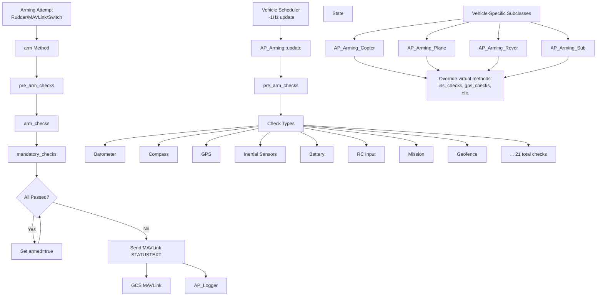
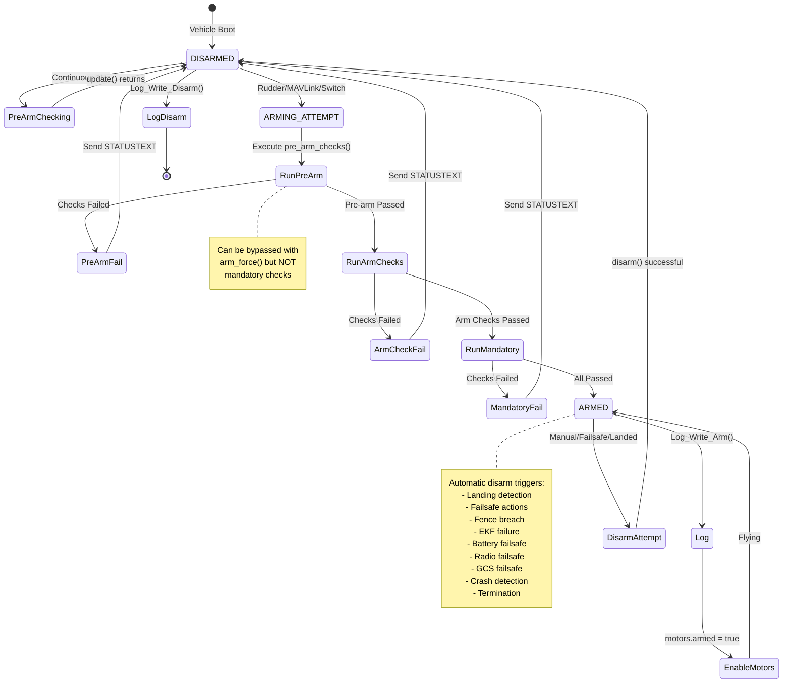

# AP_Arming

## Overview

The AP_Arming library serves as ArduPilot's pre-flight safety gate, preventing vehicle operation until critical safety requirements are met. It implements a comprehensive two-stage check architecture that validates sensor calibration, hardware health, parameter configuration, and operational readiness before allowing the vehicle to arm. The arming system runs continuously at ~1Hz via the scheduler, providing real-time status feedback to ground control stations and preventing unsafe flight conditions.

This library is safety-critical—failures in arming checks can prevent loss of vehicle, injury, or property damage by catching configuration errors, hardware failures, and unsafe conditions before motors can spin.

## Architecture



The arming system integrates with the vehicle scheduler, MAVLink communication, parameter system, and logging subsystem. Vehicle-specific implementations override base class methods to add platform-specific checks (e.g., motor configuration for Copter, airspeed for Plane).

## Key Components

### AP_Arming Base Class
**Purpose**: Provides common arming check framework and parameter system for all vehicles

**Responsibilities**:
- Orchestrate pre-arm, arm, and mandatory check sequences
- Manage arming state (armed/disarmed) and arming methods
- Provide parameter system for check configuration (ARMING_CHECK, ARMING_ACCTHRESH, etc.)
- Report failures via MAVLink STATUSTEXT messages
- Log arming events and failures
- Implement common checks: barometer, compass, GPS, INS, battery, RC, logging, mission, fence, etc.
- Provide singleton access pattern via AP::arming()

**Source**: libraries/AP_Arming/AP_Arming.h, libraries/AP_Arming/AP_Arming.cpp

### AP_Arming_Copter
**Purpose**: Multicopter-specific arming checks

**Additional Checks**:
- Motor configuration validation (frame type, motor count)
- Mode-specific arming restrictions (some modes prevent arming)
- Stability patch checks
- Altitude checks for indoor flight
- Object avoidance system validation
- Winch system checks
- GCS failsafe state validation
- Proximity sensor checks

**Source**: ArduCopter/AP_Arming_Copter.h, ArduCopter/AP_Arming_Copter.cpp

### AP_Arming_Plane
**Purpose**: Fixed-wing aircraft arming checks

**Additional Checks**:
- Airspeed sensor health and calibration (for airspeed-dependent modes)
- TECS (Total Energy Control System) initialization
- L1 controller validation
- Quadplane-specific checks (if quadplane enabled)
- Mission item validation (takeoff, landing)
- RC receiver requirement checks

**Source**: ArduPlane/AP_Arming_Plane.h, ArduPlane/AP_Arming_Plane.cpp

### AP_Arming_Rover
**Purpose**: Ground vehicle arming checks

**Additional Checks**:
- Steering servo calibration
- Mode-specific arming rules
- Wheel encoder health (if used)

**Source**: Rover/AP_Arming_Rover.h, Rover/AP_Arming_Rover.cpp

### AP_Arming_Sub
**Purpose**: Underwater vehicle arming checks

**Additional Checks**:
- Depth sensor health
- Joystick configuration validation
- Failsafe adaptations for underwater environment
- Leak detector checks

**Source**: ArduSub/AP_Arming_Sub.h, ArduSub/AP_Arming_Sub.cpp

## Arming Check Stages

The arming system implements a three-stage architecture to balance continuous monitoring with checks that have side-effects or require specific state:

### Pre-Arm Checks
**Timing**: Run continuously at ~1Hz via scheduler, and again during arming attempt

**Purpose**: Monitor ongoing vehicle health and configuration, providing continuous feedback without side effects

**Characteristics**:
- Can be displayed without initiating an arming attempt
- Should be idempotent (no state changes)
- Provide early warning of issues (displayed every 30 seconds by default)
- Filtered by PREARM_DISPLAY_PERIOD to avoid message spam

**Implemented in**: `pre_arm_checks(bool report)` virtual method

### Arm Checks
**Timing**: Run only during actual arming attempt (after pre-arm checks pass)

**Purpose**: Perform checks that may have side-effects or require arming context

**Characteristics**:
- Only execute when vehicle is attempting to arm
- May initialize subsystems or allocate resources
- Can check transient conditions (e.g., mode appropriateness)
- RC-related checks (stick positions, failsafe state)

**Implemented in**: `arm_checks(AP_Arming::Method method)` virtual method

### Mandatory Checks
**Timing**: Run during arming attempt if ARMING_CHECK=0 or arming forced via arm_force()

**Purpose**: Absolute safety requirements that cannot be bypassed under any circumstances

**Characteristics**:
- **Cannot be disabled** even with ARMING_CHECK=0
- **Cannot be bypassed** even with arm_force()
- Represent critical safety requirements
- Typically includes subset of INS checks, system checks, crash dump acknowledgment

**Implemented in**: `mandatory_checks(bool report)` virtual method

**WARNING**: Bypassing non-mandatory checks with ARMING_CHECK=0 or arm_force() can result in vehicle loss, injury, or property damage. Use only in controlled testing environments where risks are fully understood.

## Pre-Flight Validation Requirements

The AP_Arming library performs comprehensive checks across all vehicle subsystems. Each check type can be enabled/disabled via the ARMING_CHECK bitmask parameter (except mandatory checks).

### Barometer Checks (BARO - Check bit 1)
**Purpose**: Validate barometric pressure sensors for altitude estimation

**Checks Performed**:
- All configured barometers report healthy status
- Barometer readings are within reasonable range
- Barometer calibration is not obviously incorrect
- Primary barometer is producing valid data

**Failure Messages**:
- "PreArm: Baro not healthy"
- "PreArm: Baro [N] not healthy"

**Source**: libraries/AP_Arming/AP_Arming.cpp - barometer_checks() method

### Compass Checks (COMPASS - Check bit 2)
**Purpose**: Validate magnetometer sensors for heading estimation

**Checks Performed**:
- All enabled compasses are calibrated (offsets non-zero, fitness values reasonable)
- Compasses report healthy status
- Compass readings are consistent between multiple compasses (if multiple enabled)
- Magnetic field strength matches earth magnetic model within ARMING_MAGTHRESH (default 100 mGauss for X/Y, 200 mGauss for Z axis)
- Compass not currently being calibrated
- Large compass offsets warning (> 600)
- Compass priority table is consistent

**Failure Messages**:
- "PreArm: Compass not calibrated"
- "PreArm: Compass [N] inconsistent with Compass [M]"
- "PreArm: Compass field [X] too high/low: expected [Y]"
- "PreArm: Compass offsets too high"

**Parameters**: ARMING_MAGTHRESH (default 100 mGauss)

**Source**: libraries/AP_Arming/AP_Arming.cpp - compass_checks() method

### GPS Checks (GPS - Check bit 3)
**Purpose**: Validate GPS receiver for position estimation

**Checks Performed**:
- GPS has 3D fix (minimum requirement, some modes require better)
- Sufficient satellite count (typically 6+ satellites)
- Horizontal dilution of precision (HDOP) < 2.5 or accuracy better than 5m
- GPS time is valid (year > 2000)
- GPS configuration is consistent (all GPS receivers reporting similar position)
- Vertical and horizontal accuracy within reasonable limits
- GPS lag is reasonable
- EKF/AHRS and GPS position agreement (within AP_ARMING_AHRS_GPS_ERROR_MAX = 10m)

**Failure Messages**:
- "PreArm: GPS: No GPS" or "GPS not connected"
- "PreArm: GPS: Bad Position" or "Insufficient satellite count"
- "PreArm: GPS [N] divergent from GPS [M]"
- "PreArm: GPS vertical speed error too large"
- "PreArm: GPS speed error too large"
- "PreArm: GPS HDOP error too large"
- "PreArm: EKF waiting for GPS" or "GPS quality too low"

**Source**: libraries/AP_Arming/AP_Arming.cpp - gps_checks() method, vehicle-specific overrides

### Inertial Sensor Checks (INS - Check bit 4)
**Purpose**: Validate gyroscopes and accelerometers for attitude and acceleration estimation

**Checks Performed**:
- All configured IMUs are healthy and producing data
- Gyroscope calibration is complete (gyro offsets reasonable, not currently calibrating)
- Accelerometer calibration is complete (accel offsets non-zero)
- Gyros are consistent between multiple IMUs (error checked over 10-second window)
- Accels are consistent between multiple IMUs (error < ARMING_ACCTHRESH, default 0.75 m/s²)
- Gyros are not observing excessive vibration or clipping
- Vehicle has been still during boot for gyro calibration (10 second window)
- No internal IMU errors

**Failure Messages**:
- "PreArm: Gyros not calibrated"
- "PreArm: Gyros inconsistent"
- "PreArm: Accels inconsistent"
- "PreArm: Accels not healthy"
- "PreArm: Gyros not healthy"
- "PreArm: Gyros still settling"

**Parameters**: ARMING_ACCTHRESH (default 0.75 m/s/s, range 0.25-3.0)

**Source**: libraries/AP_Arming/AP_Arming.cpp - ins_checks() method (lines ~750-850), vehicle-specific overrides

### Parameter Checks (PARAMETERS - Check bit 5)
**Purpose**: Validate critical parameter values and combinations

**Checks Performed**:
- No parameters failed to load from storage
- Vehicle-specific parameter validation (e.g., Copter checks motor output ranges, failsafe settings)
- Critical parameters are set to safe values
- Parameter combinations are valid (e.g., fence and RTL configured consistently)

**Failure Messages**:
- "PreArm: Check FS_THR_ENABLE range" (Copter)
- "PreArm: Set ANGLE_MAX > [value]" (Copter)
- Various vehicle-specific parameter errors

**Source**: Vehicle-specific implementations (e.g., ArduCopter/AP_Arming_Copter.cpp - parameter_checks())

### RC Checks (RC - Check bit 6)
**Purpose**: Validate radio control transmitter connection and calibration

**Checks Performed**:
- RC transmitter is connected and producing valid data
- RC channels are calibrated (min/max/trim values set)
- RC failsafe is not currently active
- Transmitter mode switch is in valid position
- Stick positions are neutral (for rudder arming)
- No ongoing RC calibration

**Failure Messages**:
- "PreArm: RC not calibrated"
- "PreArm: RC failsafe on"
- "PreArm: RC transmitter not available"

**Source**: libraries/AP_Arming/AP_Arming.cpp - rc_calibration_checks(), rc_arm_checks() methods

### Board Voltage Checks (VOLTAGE - Check bit 7)
**Purpose**: Validate autopilot board power supply voltage

**Checks Performed**:
- Board voltage (Vcc) is within safe operating range
- Typical check: Vcc < AP_ARMING_BOARD_VOLTAGE_MAX (5.8V default for 5V boards)
- Prevents arming with overvoltage that could damage components

**Failure Messages**:
- "PreArm: Check board voltage: [X]V > [Y]V"

**Source**: libraries/AP_Arming/AP_Arming.cpp - board_voltage_checks() method

### Battery Level Checks (BATTERY - Check bit 8)
**Purpose**: Validate battery charge and health

**Checks Performed**:
- Battery voltage above BATT_LOW_VOLT threshold
- Remaining battery capacity above BATT_LOW_MAH threshold
- Battery monitor is healthy and reporting valid data
- All configured batteries meet requirements
- Battery failsafe is not currently active

**Failure Messages**:
- "PreArm: Check Battery"
- "PreArm: Battery [N] low voltage"
- "PreArm: Battery [N] low capacity"
- "PreArm: Battery [N] not healthy"

**Parameters**: BATT_LOW_VOLT, BATT_LOW_MAH, BATT_ARM_VOLT, BATT_ARM_MAH

**Source**: libraries/AP_Arming/AP_Arming.cpp - battery_checks() method

### Airspeed Checks (AIRSPEED - Check bit 9, Plane only)
**Purpose**: Validate pitot-static airspeed sensor (fixed-wing only)

**Checks Performed**:
- Airspeed sensor is healthy and producing valid data
- Airspeed sensor is calibrated (if required by flight mode)
- Sensor is not reporting obviously incorrect readings

**Failure Messages**:
- "PreArm: Airspeed not healthy"
- "PreArm: Airspeed not calibrated"

**Source**: libraries/AP_Arming/AP_Arming.cpp - airspeed_checks() method

### Logging Checks (LOGGING - Check bit 10)
**Purpose**: Validate data logging is available

**Checks Performed**:
- SD card is present and mounted (if logging to SD card)
- Sufficient free space on logging media
- Not currently downloading logs via MAVLink
- Logger is healthy and can write data

**Failure Messages**:
- "PreArm: Logging not available"
- "PreArm: No SD card"
- "PreArm: Log download in progress"

**Source**: libraries/AP_Arming/AP_Arming.cpp - logging_checks() method

### Hardware Safety Switch Checks (SWITCH - Check bit 11)
**Purpose**: Validate hardware safety button/switch state

**Checks Performed**:
- Hardware safety switch (if present) has been pressed/disengaged
- Safety switch LED is not indicating safe state

**Failure Messages**:
- "PreArm: Hardware safety switch"

**Source**: libraries/AP_Arming/AP_Arming.cpp - hardware_safety_check() method

### GPS Configuration Checks (GPS_CONFIG - Check bit 12)
**Purpose**: Validate GPS receiver configuration

**Checks Performed**:
- GPS receivers configured consistently
- RTK GPS (if used) has valid corrections
- GPS blending (if enabled) is configured correctly
- GPS auto-switching checks

**Failure Messages**:
- "PreArm: GPS [N] configuration inconsistent with GPS [M]"
- "PreArm: GPS blending requires [requirement]"

**Source**: libraries/AP_Arming/AP_Arming.cpp - gps_checks() method

### System Checks (SYSTEM - Check bit 13)
**Purpose**: Validate internal system health

**Checks Performed**:
- No internal errors flagged (via AP_InternalError)
- Scheduler load is reasonable
- Filesystem is healthy
- Critical subsystems initialized
- No watchdog resets pending
- Board type is supported

**Failure Messages**:
- "PreArm: Internal error [error type]"
- "PreArm: [subsystem] not running"

**Source**: libraries/AP_Arming/AP_Arming.cpp - system_checks() method

### Mission Checks (MISSION - Check bit 14)
**Purpose**: Validate mission is properly configured for auto modes

**Checks Performed**:
- Mission contains required items (controlled by ARMING_MIS_ITEMS bitmask):
  - Bit 0: LAND command
  - Bit 1: VTOL_LAND command
  - Bit 2: DO_LAND_START command
  - Bit 3: TAKEOFF command
  - Bit 4: VTOL_TAKEOFF command
  - Bit 5: Rally points defined
  - Bit 6: RTL (Return to Launch) is configured
- Mission is valid and can be executed
- Mission does not contain invalid commands

**Failure Messages**:
- "PreArm: Missing mission item: [item type]"
- "PreArm: Bad mission item [N]"

**Parameters**: ARMING_MIS_ITEMS (bitmask of required mission items)

**Source**: libraries/AP_Arming/AP_Arming.cpp - mission_checks() method (lines ~1350-1420)

### Rangefinder Checks (RANGEFINDER - Check bit 15)
**Purpose**: Validate distance/altitude sensors when required

**Checks Performed**:
- Rangefinder is healthy if required by flight mode
- Rangefinder is producing valid range readings
- Rangefinder is within operational range

**Failure Messages**:
- "PreArm: Rangefinder [N] not healthy"
- "PreArm: Rangefinder not connected"

**Source**: libraries/AP_Arming/AP_Arming.cpp - rangefinder_checks() method

### Camera Checks (CAMERA - Check bit 16)
**Purpose**: Validate camera and gimbal peripherals

**Checks Performed**:
- Camera/gimbal connections are valid
- RunCam device (if configured) is connected

**Failure Messages**:
- "PreArm: Camera [issue]"

**Source**: libraries/AP_Arming/AP_Arming.cpp - camera_checks() method

### Auxiliary Authorization Checks (AUX_AUTH - Check bit 17)
**Purpose**: Validate external authorization systems (typically via Lua scripting)

**Checks Performed**:
- External systems (up to 3) have provided authorization
- All registered auxiliary authorizers have responded with PASSED status
- No authorizer has reported FAILED status

**Failure Messages**:
- "PreArm: Waiting for auxiliary authorisation"
- "PreArm: [custom failure message from authorizer]"

**Source**: libraries/AP_Arming/AP_Arming.cpp - aux_auth_checks() method

**API**: get_aux_auth_id(), set_aux_auth_passed(), set_aux_auth_failed(), reset_all_aux_auths()

### Visual Odometry Checks (VISION - Check bit 18)
**Purpose**: Validate camera-based position estimation systems

**Checks Performed**:
- Visual odometry system (e.g., Intel RealSense T265) is healthy
- Visual odometry is producing valid pose estimates
- Visual odometry fusion with EKF is working

**Failure Messages**:
- "PreArm: Visual odometry not healthy"

**Source**: libraries/AP_Arming/AP_Arming.cpp - visodom_checks() method

### FFT Checks (FFT - Check bit 19)
**Purpose**: Validate gyro FFT analysis for notch filter setup

**Checks Performed**:
- Gyro FFT subsystem is initialized if required
- FFT analysis has completed initial frequency detection
- Notch filters are properly configured

**Failure Messages**:
- "PreArm: FFT not initialized"

**Source**: Checked in arm() method via AP_GyroFFT

### OSD Checks (OSD - Check bit 20)
**Purpose**: Validate on-screen display configuration

**Checks Performed**:
- OSD configuration is valid
- OSD backend is healthy

**Failure Messages**:
- "PreArm: OSD [configuration issue]"

**Source**: libraries/AP_Arming/AP_Arming.cpp - osd_checks() method

### Additional Checks (Not Individually Controllable)

#### Fence Checks
**Purpose**: Validate geofence configuration if enabled

**Checks Performed**:
- If fence is enabled, it is properly configured
- Fence boundaries are valid
- Vehicle is currently inside fence

**Failure Messages**:
- "PreArm: Fence invalid"
- "PreArm: Vehicle outside fence"

**Source**: libraries/AP_Arming/AP_Arming.cpp - fence_checks() method

#### Terrain Checks
**Purpose**: Validate terrain database if required

**Checks Performed**:
- Terrain data is available for current location (if mode requires terrain following)
- Terrain database is healthy

**Failure Messages**:
- "PreArm: Terrain data not available"

**Source**: libraries/AP_Arming/AP_Arming.cpp - terrain_checks() method

#### Crash Dump Checks (Mandatory if enabled)
**Purpose**: Ensure previous firmware crashes are acknowledged

**Checks Performed**:
- If crash dump data exists, ARMING_CRSDP_IGN parameter must equal 1
- This is a MANDATORY check that cannot be bypassed

**Failure Messages**:
- "PreArm: Crash dump present: review logs, then set ARMING_CRSDP_IGN to arm"

**WARNING**: **NEVER** ignore crash dump failures without investigating. Crash dumps indicate serious firmware failures that make the vehicle unsafe to fly. Download logs, contact ArduPilot support, and understand the root cause before setting ARMING_CRSDP_IGN=1.

**Source**: libraries/AP_Arming/AP_Arming.cpp - crashdump_checks() method (lines 250-265)

## Safety Checks Detail

### Parameter Validation
The arming system validates that critical parameters are set to safe values and that parameter combinations are coherent. Vehicle-specific implementations check parameters relevant to their platform.

**Examples** (Copter):
- FS_THR_ENABLE range is valid
- ANGLE_MAX is reasonable (typically > 1000 centidegrees = 10 degrees)
- Motor output ranges (MOT_PWM_MIN, MOT_PWM_MAX) are properly configured
- Failsafe actions are valid

### Battery Level
Battery checks prevent arming with insufficient charge to complete the mission safely.

**Thresholds**:
- BATT_LOW_VOLT: Voltage threshold that triggers low battery warnings
- BATT_LOW_MAH: Capacity threshold that triggers low capacity warnings
- BATT_ARM_VOLT: Minimum voltage to allow arming
- BATT_ARM_MAH: Minimum remaining capacity to allow arming

**Multi-Battery**: All configured batteries must meet thresholds.

### Geofence Status
If geofencing is enabled (AC_Fence), the arming system validates:
- Fence boundaries are properly configured (valid polygon points, valid radius)
- Vehicle's current position is inside the fence
- Fence altitude limits are configured if altitude fence is enabled

**Fence Types**:
- Circular fence (maximum distance from home)
- Polygon fence (complex boundary shape)
- Altitude fence (minimum and maximum altitude)
- Inclusion zones (must be inside)
- Exclusion zones (must be outside)

### Mode Appropriateness
Certain flight modes prevent arming for safety reasons:

**Examples**:
- Auto mode may prevent arming if no mission is loaded
- RTL mode typically prevents arming (use after takeoff)
- Guided mode may prevent arming in some vehicles
- Land mode prevents arming in most vehicles

Each vehicle implements mode-specific arming rules in their mode classes.

### Hardware Safety Switch
Physical safety switch (typically on GPS module or external safety button) must be pressed/disengaged before arming is allowed. This prevents accidental arming during transport or handling.

LED indicators on safety switch:
- Solid red: Safety engaged, cannot arm
- Flashing: Safety disengaged, arming allowed
- Varies by hardware

### Board Voltage
Autopilot board voltage (Vcc) must be within safe operating range. Typical check: Vcc < 5.8V for 5V boards. Overvoltage can damage sensitive components.

### Crash Dump Acknowledgment
If the firmware crashed previously, the crash dump file contains diagnostic information. The arming system REQUIRES acknowledging the crash dump before allowing flight.

**Procedure**:
1. Download logs and crash dump data
2. Analyze crash dump or contact ArduPilot support
3. Understand the root cause
4. Fix the issue (firmware update, hardware replacement, configuration change)
5. Only after fixing the issue, set ARMING_CRSDP_IGN=1 to allow arming
6. Parameter automatically resets to 0 on next boot with no crash dump

**WARNING**: Setting ARMING_CRSDP_IGN=1 without understanding the crash cause can result in repeating the same failure in flight, potentially causing a crash.

## Arming State Machine



### State Descriptions

#### DISARMED State
- Initial state after boot
- Pre-arm checks run continuously at 1Hz (update() method)
- Failures displayed every PREARM_DISPLAY_PERIOD seconds (default 30s)
- Motors are disabled
- Safe to handle vehicle

#### ARMING ATTEMPT
- Triggered by arming method (rudder, MAVLink, aux switch, scripting, DDS)
- running_arming_checks flag set to true (changes "PreArm:" to "Arm:" in messages)
- Executes pre_arm_checks → arm_checks → mandatory_checks sequence
- Any failure aborts arming and sends MAVLink STATUSTEXT

#### ARMED State
- Vehicle is armed and motors can spin
- Flight control active
- Arming time recorded in last_arm_time_us
- Disarm triggers are monitored (landing, failsafe, manual, etc.)
- Typically triggers logging subsystem to start logging at higher rate

## Arming Methods

The Method enum defines how arming/disarming was initiated. Source: libraries/AP_Arming/AP_Arming.h lines 48-89

### Arming Methods (Can Arm Vehicle)

| Method | Value | Description | Usage |
|--------|-------|-------------|-------|
| RUDDER | 0 | Right rudder stick at zero throttle | Traditional stick arming, enabled by ARMING_RUDDER parameter |
| MAVLINK | 1 | GCS command via MAV_CMD_COMPONENT_ARM_DISARM | Ground control station arming via MAVLink |
| AUXSWITCH | 2 | Dedicated RC channel switch | RC channel configured as arming switch |
| MOTORTEST | 3 | Arming for motor testing only | Used by motor test subsystem, limited functionality |
| SCRIPTING | 4 | Lua script arming | Programmatic arming via Lua scripting |
| BLACKBOX | 34 | BlackBox flight recorder arming | Special purpose (Plane only) |
| DDS | 35 | ROS2 DDS interface arming | Arming via ROS2 integration |
| AUTO_ARM_ONCE | 36 | Automatic arming after checks pass | Single auto-arm after boot (if ARMING_REQUIRE=3) |
| TURTLE_MODE | 37 | Arming for turtle mode (flip recovery) | Special mode for crashed multirotors |
| TOYMODE | 38 | Toy mode arming | Simplified control mode |

### Disarming Methods (Disarm Only)

These Method values are only used for disarming and indicate the reason for disarm:

| Method | Value | Description |
|--------|-------|-------------|
| TERMINATION | 5 | Flight termination triggered |
| CPUFAILSAFE | 6 | CPU overload failsafe |
| BATTERYFAILSAFE | 7 | Battery voltage/capacity failsafe |
| SOLOPAUSEWHENLANDED | 8 | Solo vehicle pause when landed |
| AFS | 9 | Advanced Failsafe System triggered |
| ADSBCOLLISIONACTION | 10 | ADSB collision avoidance |
| PARACHUTE_RELEASE | 11 | Parachute deployment |
| CRASH | 12 | Crash detection |
| LANDED | 13 | Landing detection |
| MISSIONEXIT | 14 | Mission completion |
| FENCEBREACH | 15 | Geofence breach |
| RADIOFAILSAFE | 16 | RC radio signal loss |
| DISARMDELAY | 17 | Automatic disarm delay expired |
| GCSFAILSAFE | 18 | Ground control station signal loss |
| TERRAINFAILSAFE | 21 | Terrain database failure |
| MOTORDETECTDONE | 22 | Motor direction detection complete |
| BADFLOWOFCONTROL | 23 | Internal software error |
| EKFFAILSAFE | 24 | Extended Kalman Filter failure |
| GCS_FAILSAFE_SURFACEFAILED | 25 | Sub: surface operation failed |
| GCS_FAILSAFE_HOLDFAILED | 26 | Sub: hold operation failed |
| TAKEOFFTIMEOUT | 27 | Takeoff did not complete in time |
| AUTOLANDED | 28 | Automatic landing completed |
| PILOT_INPUT_FAILSAFE | 29 | Pilot input failsafe triggered |
| LANDING | 32 | Landing mode active |
| DEADRECKON_FAILSAFE | 33 | Dead reckoning navigation failure |
| UNKNOWN | 100 | Unknown/undefined method |

## Arming Override Mechanisms

### arm_force() Method
**Purpose**: Bypass arm checks and mandatory pre-arm checks for controlled testing

**Usage**:
```cpp
AP::arming().arm_force(Method::MAVLINK);  // Force arm via MAVLink method
```

**Behavior**:
- Skips pre_arm_checks()
- Skips arm_checks()
- **Still executes mandatory_checks()** - these CANNOT be bypassed
- Sets armed=true if mandatory checks pass
- Logs forced arming event

**Source**: libraries/AP_Arming/AP_Arming.h line 104

### ARMING_CHECK Parameter Bitmask
**Purpose**: Selectively disable specific check types

**Parameter**: ARMING_CHECK (default: 1 = all checks enabled)

**Usage**:
- Set to 0: Disable all non-mandatory checks (WARNING: extremely dangerous)
- Set to bitmask sum: Enable only specific checks
- Example: ARMING_CHECK=72 enables only GPS (8) and Board Voltage (64) checks

**Bitmask Values**:
| Check Type | Bit | Decimal Value |
|------------|-----|---------------|
| All | 0 | 1 |
| Barometer | 1 | 2 |
| Compass | 2 | 4 |
| GPS | 3 | 8 |
| INS | 4 | 16 |
| Parameters | 5 | 32 |
| RC | 6 | 64 |
| Board Voltage | 7 | 128 |
| Battery Level | 8 | 256 |
| Airspeed (Plane) | 9 | 512 |
| Logging | 10 | 1024 |
| Safety Switch | 11 | 2048 |
| GPS Config | 12 | 4096 |
| System | 13 | 8192 |
| Mission | 14 | 16384 |
| Rangefinder | 15 | 32768 |
| Camera | 16 | 65536 |
| AuxAuth | 17 | 131072 |
| Vision | 18 | 262144 |
| FFT | 19 | 524288 |
| OSD | 20 | 1048576 |

**Source**: libraries/AP_Arming/AP_Arming.cpp lines 159-165

### Safety Implications

**⚠️ CRITICAL WARNING**: Disabling arming checks or force arming can result in:
- Vehicle loss due to undetected sensor failures
- Injury to bystanders or operator
- Property damage from crashes
- Violation of aviation regulations
- Insurance claims denial

**Recommended Only For**:
- ✅ Controlled ground testing in safe environment
- ✅ Hardware bench testing with propellers removed
- ✅ Sensor integration testing in SITL simulation
- ✅ Advanced users who fully understand the risks

**NEVER Disable in Production**:
- ❌ INS checks (accelerometer/gyro health)
- ❌ GPS checks (position estimation)
- ❌ Battery checks (power availability)
- ❌ Compass checks (heading accuracy)
- ❌ Mandatory checks (always enforced)

**Best Practice**: If you need to disable checks for testing, re-enable them before actual flight. Consider using SITL simulation instead of disabling checks on real hardware.

## Failure Reporting

### MAVLink STATUSTEXT Messages
Arming failures are reported to ground control stations via MAVLink STATUSTEXT messages with appropriate severity levels.

**Message Format**:
- Pre-arm failures: `"PreArm: [check name] [failure reason]"`
- Arm failures: `"Arm: [check name] [failure reason]"`
- Successful arm: `"Armed (method)"`
- Successful disarm: `"Disarmed (method)"`

**Example Messages**:
```
PreArm: Gyros not calibrated
PreArm: GPS: Bad Position
PreArm: Compass not calibrated
Arm: Mode not armable
Armed (MAVLINK)
Disarmed (LANDED)
```

**Severity Levels**:
- MAV_SEVERITY_CRITICAL: Arm/disarm failures preventing operation
- MAV_SEVERITY_WARNING: Warnings during arming process
- MAV_SEVERITY_INFO: Informational messages (successful arm/disarm)

**Source**: libraries/AP_Arming/AP_Arming.cpp - check_failed() methods (lines 279-280)

### Display Throttling
To prevent message spam, pre-arm failures are only displayed periodically:

**Throttling Mechanism**:
- PREARM_DISPLAY_PERIOD: Default 30 seconds between repeated failure messages
- Immediate display: When check state changes from passing to failing (report_immediately flag)
- Arm attempts: Always display failures immediately
- Option to disable: ARMING_OPTIONS bit 0 = DISABLE_PREARM_DISPLAY

**Source**: libraries/AP_Arming/AP_Arming.cpp - update() method (lines 224-248)

### Binary Logging
All arming/disarming events are logged to the binary dataflash log for post-flight analysis:

**Logged Events**:
- ARM event: Logs arming time, method, forced flag
- DISARM event: Logs disarming time, method, forced flag
- Arming failure: Logged via AP::logger().arming_failure()

**Log Analysis**: Use MAVExplorer or Mission Planner log viewer to analyze arming events and correlate with sensor data.

**Source**: libraries/AP_Arming/AP_Arming.cpp - Log_Write_Arm() (line 282), Log_Write_Disarm() (line 283)

### Option Flags
ARMING_OPTIONS parameter controls reporting behavior:

| Option | Bit | Decimal | Description |
|--------|-----|---------|-------------|
| DISABLE_PREARM_DISPLAY | 0 | 1 | Don't display pre-arm check failures periodically |
| DISABLE_STATUSTEXT_ON_STATE_CHANGE | 1 | 2 | Don't send "Armed" / "Disarmed" status text messages |

**Source**: libraries/AP_Arming/AP_Arming.h lines 155-161

## Configuration Parameters

The AP_Arming library provides comprehensive parameter configuration for arming behavior. All parameters have the prefix `ARMING_`.

### Parameter Reference Table

| Parameter | Type | Default | Range | Units | Description |
|-----------|------|---------|-------|-------|-------------|
| ARMING_REQUIRE | Enum | 1 | 0-4 | - | Arming requirement mode:<br/>0=Disabled (arm immediately)<br/>1=Yes (min PWM when disarmed)<br/>2=Yes (0 PWM when disarmed)<br/>3=AutoArmOnce (Rover)<br/>4=AutoArm zero PWM (Rover) |
| ARMING_CHECK | Bitmask | 1 (all) | 0-2097151 | - | Bitmask of enabled arming checks. 0=mandatory only, 1=all checks, or sum of individual check bits. See bitmask table above. |
| ARMING_ACCTHRESH | Float | 0.75 | 0.25-3.0 | m/s/s | Accelerometer error threshold for consistency checking. Lower values are stricter. |
| ARMING_RUDDER | Enum | 2 (1 for Plane) | 0-2 | - | Rudder arming enable:<br/>0=Disabled<br/>1=ArmingOnly (right rudder arms, left rudder does not disarm)<br/>2=ArmOrDisarm (both arm and disarm) |
| ARMING_MIS_ITEMS | Bitmask | 0 | 0-127 | - | Required mission items bitmask:<br/>Bit 0=Land, 1=VTOL Land, 2=DO_LAND_START,<br/>3=Takeoff, 4=VTOL Takeoff, 5=Rally, 6=RTL |
| ARMING_OPTIONS | Bitmask | 0 | 0-3 | - | Arming behavior options:<br/>Bit 0=Disable prearm display<br/>Bit 1=No statustext on state change |
| ARMING_MAGTHRESH | Int16 | 100 | 0-500 | mGauss | Compass magnetic field strength error threshold vs earth model. X/Y axes use this value, Z axis uses 2x this value. 0=disable check. |
| ARMING_CRSDP_IGN | Int8 | 0 | 0-1 | - | **DANGEROUS**: Disable crash dump arming check. Must be 1 to arm if crash dump present. See crash dump section for critical warnings. |
| ARMING_NEED_LOC | Enum | 0 | 0-1 | - | Require absolute position before arming (Copter/Rover only):<br/>0=Do not require location<br/>1=Require location for RTL capability |

**Source**: libraries/AP_Arming/AP_Arming.cpp lines 114-201 (parameter definitions in var_info[] array)

### Parameter Usage Examples

**Disable all non-mandatory checks** (testing only):
```
param set ARMING_CHECK 0
```

**Enable only GPS and compass checks**:
```
param set ARMING_CHECK 12   # 8 (GPS) + 4 (Compass)
```

**Require takeoff and land mission items**:
```
param set ARMING_MIS_ITEMS 9   # 1 (Land) + 8 (Takeoff)
```

**Disable pre-arm status messages**:
```
param set ARMING_OPTIONS 1   # Bit 0 = DISABLE_PREARM_DISPLAY
```

**Set stricter accelerometer consistency threshold**:
```
param set ARMING_ACCTHRESH 0.5   # Tighter than default 0.75 m/s/s
```

**Disable rudder arming**:
```
param set ARMING_RUDDER 0
```

## Vehicle-Specific Implementations

Each vehicle type extends AP_Arming with platform-specific checks and requirements.

### Copter (AP_Arming_Copter)

**Additional Methods**:
- mode_allows_arming(): Checks if current flight mode permits arming
- parameter_checks(): Validates copter-specific parameters
- oa_checks(): Object avoidance system validation
- alt_checks(): Altitude-based checks for indoor flight
- winch_checks(): Winch system validation
- gcs_failsafe_check(): GCS failsafe state validation
- rc_throttle_failsafe_checks(): RC throttle failsafe state

**Overridden Checks**:
- ins_checks(): Adds copter-specific IMU requirements
- gps_checks(): Adds mandatory GPS checks for GPS-dependent modes
- barometer_checks(): Adds altitude estimation requirements
- board_voltage_checks(): Copter-specific voltage limits
- pre_arm_checks(): Orchestrates all copter pre-arm checks
- arm_checks(): Mode-specific arming validation
- mandatory_checks(): Copter mandatory requirements

**Key Behavior**:
- Motor configuration must be valid for frame type
- Some modes (e.g., AUTO, GUIDED) require GPS lock
- Stability patch checks for older firmware
- Proximity sensor integration

**Source**: ArduCopter/AP_Arming_Copter.h, ArduCopter/AP_Arming_Copter.cpp

### Plane (AP_Arming_Plane)

**Additional Methods**:
- quadplane_checks(): Validates quadplane-specific configuration
- update_soft_armed(): Manages throttle output when disarmed
- rc_received_if_enabled_check(): Validates RC receiver if required
- get_delay_arming(): Returns arming delay state for quadplane

**Overridden Checks**:
- ins_checks(): Plane-specific IMU validation
- mission_checks(): Validates required mission items for auto modes
- terrain_database_required(): Determines if terrain data needed
- pre_arm_checks(): Orchestrates plane pre-arm checks
- arm_checks(): Airspeed and TECS initialization validation
- mandatory_checks(): Plane mandatory requirements

**Key Behavior**:
- Airspeed sensor required for certain modes
- TECS (Total Energy Control System) initialization
- Quadplane-specific checks if Q_ENABLE > 0
- Delay arming option for controlled spool-up
- BlackBox logging support

**Additional Parameters**:
- Plane has additional vehicle-specific arming parameters

**Source**: ArduPlane/AP_Arming_Plane.h, ArduPlane/AP_Arming_Plane.cpp

### Rover (AP_Arming_Rover)

**Key Behavior**:
- Steering servo calibration validation
- Mode-specific arming restrictions
- Wheel encoder health checks (if used)
- Simpler arming requirements than aerial vehicles

**Source**: Rover/AP_Arming_Rover.h, Rover/AP_Arming_Rover.cpp

### Sub (AP_Arming_Sub)

**Key Behavior**:
- Depth sensor health validation
- Joystick configuration checks
- Failsafe adaptations for underwater environment
- Leak detector validation
- Different battery requirements (sealed enclosure)

**Source**: ArduSub/AP_Arming_Sub.h, ArduSub/AP_Arming_Sub.cpp

### Override Pattern

Vehicle-specific implementations follow this pattern:

```cpp
// Vehicle subclass overrides virtual methods from AP_Arming base class
class AP_Arming_Copter : public AP_Arming {
    bool pre_arm_checks(bool display_failure) override {
        // Call base class checks first (optional)
        bool ret = AP_Arming::pre_arm_checks(display_failure);
        
        // Add vehicle-specific checks
        ret &= parameter_checks(display_failure);
        ret &= oa_checks(display_failure);
        ret &= alt_checks(display_failure);
        
        return ret;
    }
    
    // Override other check methods as needed
    bool ins_checks(bool display_failure) override {
        // Call base class IMU checks
        if (!AP_Arming::ins_checks(display_failure)) {
            return false;
        }
        
        // Add copter-specific IMU requirements
        // ...
        
        return true;
    }
};
```

This pattern allows code reuse while enabling vehicle-specific customization.

## Usage Examples

### Checking If Vehicle Is Armed

```cpp
// Access singleton instance
if (AP::arming().is_armed()) {
    // Vehicle is armed, motors can spin
    hal.console->printf("Vehicle is armed\n");
}

// Check if armed and safety switch is disengaged
if (AP::arming().is_armed_and_safety_off()) {
    // Safe to spin motors
}
```

### Getting Arm Time

```cpp
// Get time armed in microseconds (0 if disarmed)
uint64_t armed_time_us = AP::arming().arm_time_us();

if (armed_time_us > 0) {
    uint64_t armed_duration_ms = (AP_HAL::micros64() - armed_time_us) / 1000;
    hal.console->printf("Armed for %llu ms\n", armed_duration_ms);
}
```

### Programmatic Arming

```cpp
// Arm via MAVLink method with all checks
bool armed = AP::arming().arm(AP_Arming::Method::MAVLINK, true);
if (!armed) {
    hal.console->printf("Arming failed, check GCS messages\n");
}

// Arm via scripting without running arm checks (but mandatory checks still run)
bool force_armed = AP::arming().arm_force(AP_Arming::Method::SCRIPTING);
```

### Programmatic Disarming

```cpp
// Normal disarm with checks
bool disarmed = AP::arming().disarm(AP_Arming::Method::MAVLINK, true);

// Force disarm (emergency)
bool force_disarmed = AP::arming().disarm(AP_Arming::Method::GCSFAILSAFE, false);
```

### Check If Specific Check Is Enabled

```cpp
// Check if GPS checks are enabled
if (AP::arming().check_enabled(AP_Arming::Check::GPS)) {
    hal.console->printf("GPS checks are enabled\n");
}

// Get full bitmask of enabled checks
uint32_t enabled_checks = AP::arming().get_enabled_checks();
```

### Last Arm/Disarm Method

```cpp
// Get the method used for last arm/disarm
AP_Arming::Method last_arm = AP::arming().last_arm_method();
AP_Arming::Method last_disarm = AP::arming().last_disarm_method();

// Check if disarmed due to failsafe
if (last_disarm == AP_Arming::Method::RADIOFAILSAFE) {
    hal.console->printf("Disarmed due to radio failsafe\n");
}
```

### Auxiliary Authorization (Advanced)

```cpp
// Lua scripting or external system requesting authorization
uint8_t auth_id;
if (AP::arming().get_aux_auth_id(auth_id)) {
    // Perform custom authorization checks
    bool authorized = my_custom_check();
    
    if (authorized) {
        AP::arming().set_aux_auth_passed(auth_id);
    } else {
        AP::arming().set_aux_auth_failed(auth_id, "Custom check failed: reason");
    }
}
```

## Testing with SITL

Software-In-The-Loop simulation allows safe testing of arming sequences without physical hardware.

### Launch SITL

```bash
# Launch Copter simulation
sim_vehicle.py -v Copter --console --map

# Launch Plane simulation
sim_vehicle.py -v Plane --console --map

# Launch Rover simulation
sim_vehicle.py -v Rover --console --map

# Launch Sub simulation
sim_vehicle.py -v Sub --console --map
```

### Test Pre-Arm Checks

```bash
# In MAVProxy console, attempt to arm
arm throttle
```

Expected initial response (with default SITL startup):
```
PreArm: EKF still initializing
PreArm: GPS not yet acquired
```

Wait for EKF and GPS initialization (10-30 seconds in SITL), then retry:
```
arm throttle
```

Should succeed once all checks pass.

### View Check Failures

Pre-arm check failures are displayed in the MAVProxy messages window. Watch for:
```
PreArm: [check name] [failure reason]
```

### Test Arming Methods

**Rudder Arming** (if enabled):
```bash
# Not directly testable in SITL without RC input simulation
# Use MAVLink arming instead in SITL
```

**MAVLink Arming**:
```bash
# Arm via MAVLink command
arm throttle

# Disarm via MAVLink command
disarm
```

**Aux Switch Arming**:
```bash
# Set RC channel 7 as arm/disarm switch
param set RC7_OPTION 153   # 153 = Arm/Disarm

# Toggle RC7 to arm/disarm
rc 7 2000   # Arm
rc 7 1000   # Disarm
```

### Disable Specific Checks

Test with individual checks disabled:

```bash
# Disable all checks (testing only!)
param set ARMING_CHECK 0
arm throttle

# Re-enable all checks
param set ARMING_CHECK 1

# Enable only GPS and compass checks
param set ARMING_CHECK 12   # 8 (GPS) + 4 (Compass)
```

### Force Specific Failures

Simulate sensor failures to test check behavior:

**GPS Failure**:
```bash
# Inject GPS glitch
param set SIM_GPS_GLITCH_X 100   # 100m offset
param set SIM_GPS_GLITCH_Y 100
param set SIM_GPS_GLITCH_Z 100

# Attempt to arm - should fail GPS checks
arm throttle
# Expected: PreArm: GPS: Bad Position

# Clear glitch
param set SIM_GPS_GLITCH_X 0
param set SIM_GPS_GLITCH_Y 0
param set SIM_GPS_GLITCH_Z 0
```

**Compass Failure**:
```bash
# Disable compass
param set SIM_MAG1_ENABLE 0

# Attempt to arm
arm throttle
# Expected: PreArm: Compass not calibrated or not healthy

# Re-enable
param set SIM_MAG1_ENABLE 1
```

**Battery Low Voltage**:
```bash
# Set low battery voltage
param set BATT_LOW_VOLT 11.5
param set SIM_BATT_VOLTAGE 11.0   # Below threshold

# Attempt to arm
arm throttle
# Expected: PreArm: Check Battery

# Reset
param set SIM_BATT_VOLTAGE 12.6
```

### Test Vehicle-Specific Checks

Each vehicle type has specific checks. Load the appropriate vehicle:

**Copter-Specific**:
```bash
sim_vehicle.py -v Copter --console --map

# Test mode-specific arming (e.g., AUTO mode may require mission)
mode auto
arm throttle
# Expected: PreArm: Mission [requirement] or Arm: Mode not armable
```

**Plane-Specific**:
```bash
sim_vehicle.py -v Plane --console --map

# Airspeed sensor check (if ARMING_CHECK includes airspeed bit)
# Plane will check for airspeed calibration
```

### Automated Testing

ArduPilot's autotest suite includes comprehensive arming check tests:

```bash
# Run copter autotest including arming tests
cd Tools/autotest
./autotest.py --vehicle ArduCopter --test ArmFeatures

# Run all arming-related tests
./autotest.py --vehicle ArduCopter --test Arming
```

**Test Scenarios** (in Tools/autotest/arducopter.py):
- test_arming_checks(): Tests all check types
- test_arming_aux_switches(): Tests aux switch arming
- test_arming_interlock(): Tests motor interlock functionality
- test_battery_failsafe(): Tests battery failsafe disarming

## Safety Considerations

### Critical Path: THE Safety Gate

The arming system is THE final safety gate before flight. It is the last line of defense against:
- Uncalibrated sensors causing incorrect attitude/position estimation
- Hardware failures that could cause loss of control
- Configuration errors that violate safety margins
- Insufficient battery charge to complete the mission
- Invalid mission plans or fence configurations

**Never bypass arming checks in production environments.**

### Checks You Should Never Skip

Even in testing scenarios, these checks should remain enabled:

1. **INS Calibration** (Check bit 4)
   - Ensures gyroscopes and accelerometers are calibrated
   - Prevents unstable flight from incorrect IMU data
   - Detects IMU hardware failures

2. **GPS Lock** (Check bit 3) - For GPS-dependent modes
   - Ensures position estimation is available for navigation
   - Prevents flyaways from invalid position data
   - Critical for return-to-launch (RTL) capability

3. **Battery Voltage** (Check bit 8)
   - Prevents arming with insufficient power
   - Avoids mid-flight power loss
   - Critical for safe return and landing

4. **Compass Calibration** (Check bit 2)
   - Ensures heading estimation is accurate
   - Prevents navigation errors and flyaways
   - Critical for GPS navigation modes

5. **Mandatory Checks**
   - Always enforced, cannot be disabled
   - Represent absolute minimum safety requirements
   - Typically includes subset of INS checks, crash dump acknowledgment

### Testing Procedures

**Safe Testing Workflow**:

1. **Bench Testing** (propellers OFF):
   - Test arming sequences with propellers removed
   - Validate parameter changes
   - Verify sensor calibration

2. **SITL Simulation**:
   - Test complex scenarios in simulation first
   - Validate mission plans
   - Practice failure recovery

3. **Ground Testing** (propellers ON, held down):
   - Verify motor directions
   - Check for vibration issues
   - Validate control response

4. **First Flight** (open area, experienced pilot):
   - Have experienced pilot ready to take manual control
   - Start with simple stabilize/manual mode
   - Gradually test autonomous modes

**Pre-Flight Checklist**:
- ✅ All pre-arm checks passing
- ✅ GPS lock with 10+ satellites
- ✅ Compass heading matches reality
- ✅ Battery fully charged
- ✅ RC transmitter connected with strong signal
- ✅ Geofence configured if used
- ✅ Mission validated in SITL
- ✅ Return-to-launch tested
- ✅ Failsafe actions configured

### Known Limitations

**Environmental False Positives**:

1. **Compass Issues in Metal Structures**:
   - Compass checks may fail near large metal objects, rebar, vehicles
   - Magnetic field distortion can cause consistency failures
   - **Solution**: Arm in open area away from metal, or recalibrate compass

2. **GPS Multipath Near Buildings**:
   - GPS accuracy degrades near tall buildings or cliffs
   - Reflected GPS signals cause position errors
   - **Solution**: Arm in open area with clear sky view

3. **High EMI Environments**:
   - Power lines, radio towers, or industrial equipment can cause sensor issues
   - May cause INS or compass failures
   - **Solution**: Move to area with lower electromagnetic interference

4. **Barometer in Wind**:
   - Strong wind can cause barometer errors if not properly shielded
   - May cause barometer health failures
   - **Solution**: Shield barometer ports, use foam protection

### Crash Dump Critical Warning

**NEVER ignore crash dump arming failures.**

A crash dump indicates:
- The firmware experienced a critical software failure
- The autopilot immediately rebooted to prevent further damage
- The crash dump file contains diagnostic information
- **The vehicle is likely unsafe to fly**

**Proper Procedure**:
1. Download dataflash logs and crash dump
2. Analyze crash dump or contact ArduPilot support forum
3. Identify root cause (firmware bug, hardware issue, configuration error)
4. Fix the underlying problem:
   - Update firmware if bug is fixed in newer version
   - Replace hardware if component failure
   - Fix configuration if parameter-related
5. **Only after fixing**, set ARMING_CRSDP_IGN=1 to arm
6. Test thoroughly in SITL and ground testing before flight
7. Parameter resets to 0 on next boot without crash dump

**Setting ARMING_CRSDP_IGN=1 without understanding the crash is extremely dangerous.**

### Regulatory Considerations

Many jurisdictions require:
- Documented pre-flight checklists
- Safety system validation before flight
- Pilot training on failure modes
- Insurance requirements for commercial operations

The arming system provides objective verification that safety requirements are met. Keep logs demonstrating due diligence in safety practices.

## Common Arming Failures and Solutions

| Failure Message | Cause | Solution |
|-----------------|-------|----------|
| PreArm: Gyros not calibrated | Vehicle was not stationary during boot | Reboot vehicle and keep completely still for 10+ seconds |
| PreArm: Accels inconsistent | Multiple accelerometers disagree or high vibration | Recalibrate accelerometers, check for loose mounting, reduce vibration |
| PreArm: Compass not calibrated | Compass has not been calibrated | Run compass calibration procedure in GCS |
| PreArm: Compass inconsistent | Multiple compasses disagree significantly | Check for magnetic interference, recalibrate, disable unhealthy compass |
| PreArm: Compass field too high/low | Magnetic field strength doesn't match earth model | Check for magnetic interference, verify location is set correctly, increase ARMING_MAGTHRESH if environment has known interference |
| PreArm: GPS: No GPS | GPS receiver not connected or not detected | Check GPS cable connection, verify GPS type in parameters, check GPS LED |
| PreArm: GPS: Bad Position | GPS does not have sufficient fix quality | Wait for better GPS lock, check antenna placement, verify clear sky view, check for GPS jamming |
| PreArm: Need 3D Fix | GPS does not have 3D fix yet | Wait for GPS to acquire satellites, may take 1-5 minutes on first boot |
| PreArm: EKF still initializing | Extended Kalman Filter has not completed initialization | Wait 10-30 seconds after GPS lock, keep vehicle still |
| PreArm: Check Battery | Battery voltage or capacity below threshold | Charge battery, check BATT_LOW_VOLT and BATT_LOW_MAH settings |
| PreArm: RC not calibrated | RC transmitter channels not calibrated | Run radio calibration procedure in GCS |
| PreArm: RC failsafe on | RC failsafe is currently active | Check RC transmitter is on and transmitting, verify receiver connection |
| PreArm: Mode not armable | Current flight mode does not allow arming | Switch to appropriate mode (e.g., Stabilize for Copter, Manual for Plane) |
| PreArm: Hardware safety switch | Safety switch has not been pressed | Press hardware safety button until LED blinks rapidly or turns solid |
| PreArm: Logging not available | SD card missing or failed | Insert SD card, check card is formatted correctly (FAT32), verify card health |
| PreArm: Check board voltage | Autopilot board voltage too high | Check power module output, verify 5V regulator, reduce input voltage |
| Arm: Mode not armable | Flight mode changed after pre-arm checks passed | Ensure mode is stable before arming |
| PreArm: Missing mission item: [type] | Required mission item not in mission plan | Add required item (land, takeoff, etc.) to mission or change ARMING_MIS_ITEMS |
| PreArm: Crash dump present | Previous firmware crash detected | Download logs, analyze crash dump, fix underlying issue, only then set ARMING_CRSDP_IGN=1 |
| PreArm: Waiting for auxiliary authorisation | External authorization system has not approved | Check Lua script or external system, verify auth_check() calls set_aux_auth_passed() |

## Integration Notes

### Scheduler Integration
The AP_Arming update() method is registered as a scheduler task at 1Hz frequency:

```cpp
// Registered in vehicle scheduler
SCHED_TASK(update_arming,       1,    50),   // 1Hz, 50μs max execution time
```

This provides continuous pre-arm check monitoring without blocking other tasks.

**Source**: Vehicle-specific Scheduler tables (e.g., ArduCopter/Copter.cpp)

### Parameter System Integration
AP_Arming uses AP_Param::GroupInfo for parameter persistence:

```cpp
const AP_Param::GroupInfo AP_Arming::var_info[] = {
    AP_GROUPINFO("REQUIRE", 0, AP_Arming, require, float(Required::YES_MIN_PWM)),
    AP_GROUPINFO("CHECK", 8, AP_Arming, checks_to_perform, float(Check::ALL)),
    // ... more parameters
    AP_GROUPEND
};
```

Parameters are stored in EEPROM and loaded on boot via AP_Param system.

**Source**: libraries/AP_Arming/AP_Arming.cpp lines 114-201

### MAVLink Integration
Arming failures and status are communicated via MAVLink:

**Messages Sent**:
- STATUSTEXT: Pre-arm and arm failure messages with severity
- COMMAND_ACK: Response to MAV_CMD_COMPONENT_ARM_DISARM commands
- HEARTBEAT: System status includes armed bit

**Commands Handled**:
- MAV_CMD_COMPONENT_ARM_DISARM: Arm/disarm request from GCS

**Implementation**:
```cpp
// check_failed() sends STATUSTEXT
void AP_Arming::check_failed(bool report, const char *fmt, ...) const {
    if (report) {
        // Format message and send via GCS::send_statustext()
    }
}
```

**Source**: Integration in GCS_MAVLink library (GCS_Common.cpp) and libraries/AP_Arming/AP_Arming.cpp

### Logging Integration
Arming events are logged via AP_Logger:

```cpp
void AP_Arming::Log_Write_Arm(bool forced, AP_Arming::Method method) {
    // Logs ARM event with timestamp, method, forced flag
}

void AP_Arming::Log_Write_Disarm(bool forced, AP_Arming::Method method) {
    // Logs DISARM event with timestamp, method, forced flag
}
```

Log messages: ARM, DISARM, ARMING_FAILURE

**Source**: libraries/AP_Arming/AP_Arming.cpp lines 282-283, integration with AP_Logger

### Singleton Access Pattern
AP_Arming uses the singleton pattern for global access:

```cpp
// Header declaration
namespace AP {
    AP_Arming &arming();
};

// Usage
if (AP::arming().is_armed()) {
    // Vehicle is armed
}
```

**Source**: libraries/AP_Arming/AP_Arming.h lines 352-354, AP_Arming.cpp lines 213-221

### Thread Safety
Auxiliary authorization uses HAL_Semaphore for thread-safe state management:

```cpp
HAL_Semaphore aux_auth_sem;  // Protects aux_auth_state and aux_auth_fail_msg

// Usage
WITH_SEMAPHORE(aux_auth_sem);
// Access aux_auth_state safely
```

This prevents race conditions when Lua scripts or external systems update authorization state from different contexts.

**Source**: libraries/AP_Arming/AP_Arming.h lines 321, aux_auth methods in AP_Arming.cpp

## References

### Source Files
- **Main Implementation**: libraries/AP_Arming/AP_Arming.h, libraries/AP_Arming/AP_Arming.cpp
- **Copter**: ArduCopter/AP_Arming_Copter.h, ArduCopter/AP_Arming_Copter.cpp
- **Plane**: ArduPlane/AP_Arming_Plane.h, ArduPlane/AP_Arming_Plane.cpp
- **Rover**: Rover/AP_Arming_Rover.h, Rover/AP_Arming_Rover.cpp
- **Sub**: ArduSub/AP_Arming_Sub.h, ArduSub/AP_Arming_Sub.cpp
- **Configuration**: libraries/AP_Arming/AP_Arming_config.h

### Related Modules
- **Scheduler**: libraries/AP_Scheduler/ - Task scheduling framework
- **MAVLink**: libraries/GCS_MAVLink/ - Ground control station communication
- **Logger**: libraries/AP_Logger/ - Binary dataflash logging
- **Parameters**: libraries/AP_Param/ - Parameter storage and management
- **INS**: libraries/AP_InertialSensor/ - Inertial sensor management
- **GPS**: libraries/AP_GPS/ - GPS receiver management
- **Compass**: libraries/AP_Compass/ - Magnetometer management
- **Battery**: libraries/AP_BattMonitor/ - Battery monitoring
- **EKF**: libraries/AP_NavEKF3/ - Extended Kalman Filter
- **Mission**: libraries/AP_Mission/ - Mission management
- **Fence**: libraries/AC_Fence/ - Geofencing
- **Failsafe**: Vehicle-specific failsafe implementations

### External Documentation
- **ArduPilot Wiki**: https://ardupilot.org/copter/docs/arming-the-motors.html
- **Parameter Reference**: https://ardupilot.org/copter/docs/parameters.html#arming-parameters
- **Developer Documentation**: https://ardupilot.org/dev/docs/learning-ardupilot-the-example-sketches.html

### Test Infrastructure
- **Autotest**: Tools/autotest/arducopter.py - Automated arming test scenarios
- **SITL**: Tools/autotest/pysim/ - Software-in-the-loop simulation
- **Unit Tests**: Tests for arming logic (if present in Tools/tests/)

---

**Document Version**: 1.0  
**Last Updated**: 2025  
**Maintainer**: ArduPilot Development Team
