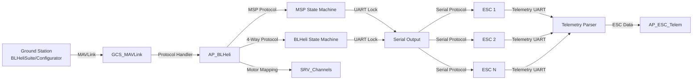
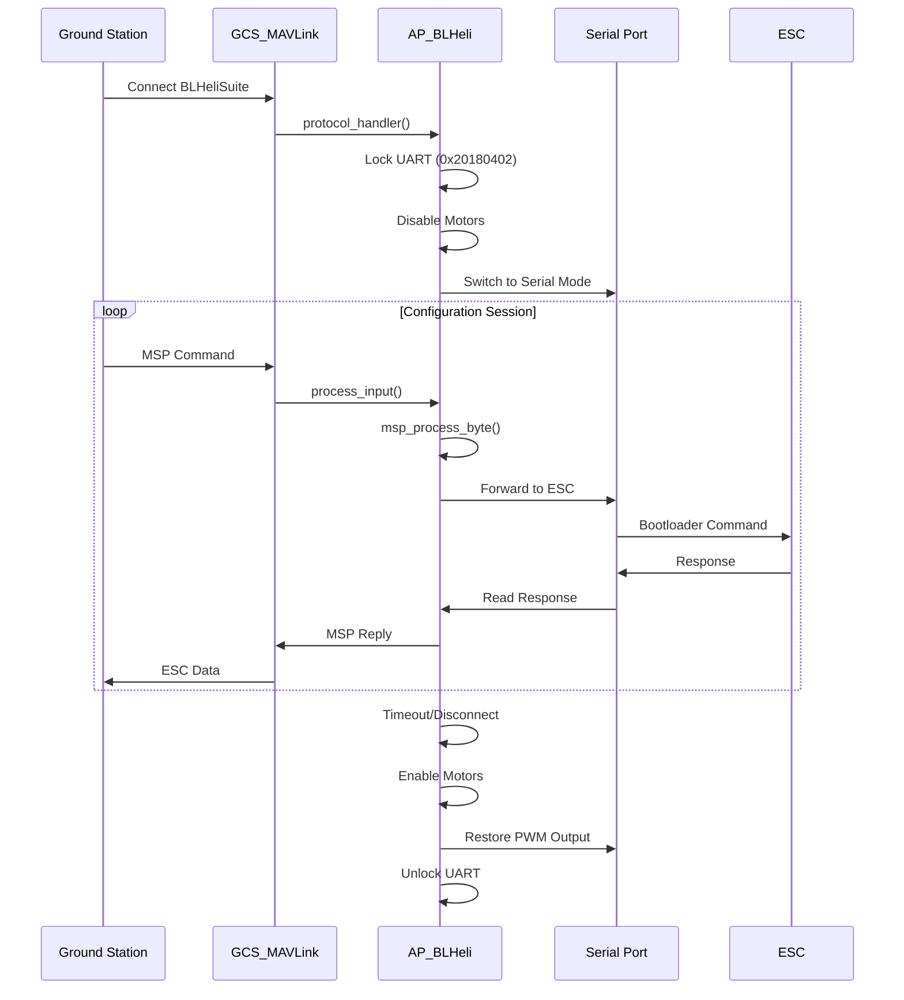

# AP_BLHeli

## Overview

The AP_BLHeli library provides BLHeli ESC (Electronic Speed Controller) pass-through protocol support, enabling ESC configuration and firmware updates through the ArduPilot autopilot. This eliminates the need to disconnect ESCs from the flight controller to configure or flash them, streamlining development and maintenance workflows. The library implements both MSP (MultiWii Serial Protocol) and BLHeli 4-way interface protocols for communication with BLHeliSuite and BLHeli Configurator ground station tools.

The implementation is based on the betaflight/cleanflight reference implementation and supports BLHeli_S (8-bit), BLHeli_32 (32-bit ARM), and AM32 ESC firmware variants.

## Architecture



### Key Components

- **AP_BLHeli**: Main class managing protocol handling, ESC communication, and telemetry collection
- **MSP State Machine**: Processes MultiWii Serial Protocol for ESC identification and control
- **BLHeli 4-Way State Machine**: Handles direct ESC bootloader communication for firmware operations
- **UART Locking**: Exclusive UART access mechanism (key: 0x20180402) prevents protocol corruption
- **Motor Mapping**: Translates between BLHeli motor numbers and RC output channels
- **Telemetry Backend**: Integrates with AP_ESC_Telem_Backend for system-wide telemetry distribution

### Component Interactions

The AP_BLHeli system operates through a protocol handler hook in the MAVLink subsystem. When BLHeliSuite or BLHeli Configurator connects through a MAVLink channel, the library takes exclusive control of the selected UART using a locking mechanism. Motor outputs are automatically disabled during pass-through operations for safety.



## BLHeli Pass-Through Protocol

### MSP (MultiWii Serial Protocol)

The MSP protocol is used for ESC identification, control commands, and initiating the BLHeli 4-way interface. Messages follow the format:

```
$M<SIZE><CMD>[DATA]<CHECKSUM>
```

Where:
- `$M<` = MSP command header
- `SIZE` = Data payload size (0-192 bytes)
- `CMD` = Command identifier
- `DATA` = Optional command parameters
- `CHECKSUM` = XOR checksum of SIZE, CMD, and DATA bytes

The MSP state machine (Source: libraries/AP_BLHeli/AP_BLHeli.cpp:195-245) processes incoming bytes and validates checksums before executing commands.

### BLHeli 4-Way Protocol

The BLHeli 4-way protocol enables direct ESC bootloader communication for flash operations. Wire framing format:

```
<ESC> + <CMD> + <ADDR_HI> + <ADDR_LO> + <PARAM_LEN> + [PARAMS] + <CRC16_Hi> + <CRC16_Lo>
```

Components:
- `ESC` (cmd_Local_Escape = 0x2F): Frame start delimiter
- `CMD`: Command identifier (see command types below)
- `ADDR_HI/LO`: 16-bit memory address (big-endian)
- `PARAM_LEN`: Parameter length (0 = 256 bytes)
- `PARAMS`: Command-specific data
- `CRC16`: XMODEM CRC-16 checksum

### Protocol State Machines

**MSP States** (Source: libraries/AP_BLHeli/AP_BLHeli.h:82-90):
- `MSP_IDLE`: Waiting for '$' start character
- `MSP_HEADER_START`: Expecting 'M'
- `MSP_HEADER_M`: Expecting '<' or '>'
- `MSP_HEADER_ARROW`: Reading size byte
- `MSP_HEADER_SIZE`: Reading command byte
- `MSP_HEADER_CMD`: Reading data payload
- `MSP_COMMAND_RECEIVED`: Complete packet ready for processing

**BLHeli 4-Way States** (Source: libraries/AP_BLHeli/AP_BLHeli.h:164-174):
- `BLHELI_IDLE`: Waiting for cmd_Local_Escape (0x2F)
- `BLHELI_HEADER_START`: Reading command byte
- `BLHELI_HEADER_CMD`: Reading address high byte
- `BLHELI_HEADER_ADDR_HIGH`: Reading address low byte
- `BLHELI_HEADER_ADDR_LOW`: Reading parameter length
- `BLHELI_HEADER_LEN`: Reading parameter data
- `BLHELI_CRC1`: Reading CRC high byte
- `BLHELI_CRC2`: Validating CRC and preparing to process

Timeout handling: If no packets are received within MOTOR_ACTIVE_TIMEOUT (1000ms), the connection is automatically terminated and normal operation resumes.

## BLHeliSuite/Configurator Integration

### Connection Procedure

1. **Configure ArduPilot Parameters**:
   ```
   param set SERVO_BLH_MASK <channel_bitmask>    # Or use SERVO_BLH_AUTO for multicopters
   param set SERVO_BLH_PORT <mavlink_channel>    # 0=Console, 1-5=Serial ports
   param set SERVO_BLH_DEBUG 1                    # Optional: enable debug output
   ```

2. **Connect Ground Station**: Ensure MAVLink connection to autopilot is active

3. **Launch BLHeliSuite/Configurator**: 
   - Select "BLHeli32 Bootloader (Betaflight/Cleanflight)" interface
   - Choose the correct COM port (same as MAVLink connection)
   - Click "Connect"

4. **Verify Connection**: BLHeliSuite should detect ESCs and display firmware versions

5. **Configure/Flash ESCs**: Perform desired configuration or firmware update operations

6. **Disconnect**: Close BLHeliSuite or wait for timeout (SERVO_BLH_TMOUT parameter)

### Parameter Configuration

**SERVO_BLH_MASK**: 32-bit bitmask selecting which output channels support BLHeli pass-through. Bit 0 = Channel 1, Bit 1 = Channel 2, etc. Example: 0x0F (15 decimal) enables channels 1-4.

**SERVO_BLH_AUTO**: When set to 1, automatically enables BLHeli support for all multicopter motor outputs. This is the recommended setting for standard multicopter configurations.

**SERVO_BLH_PORT**: Selects which MAVLink channel to use for pass-through:
- 0 = Console (USB connection)
- 1-5 = Telemetry serial ports in order configured for MAVLink

**Example for Quadcopter**:
```
param set SERVO_BLH_AUTO 1        # Auto-detect motors 1-4
param set SERVO_BLH_PORT 0        # Use USB console
param set SERVO_BLH_TRATE 10      # 10 Hz telemetry per ESC
```

## 4-Way Interface Protocol

### Supported Bootloader Types

The library supports multiple ESC bootloader types (Source: libraries/AP_BLHeli/AP_BLHeli.h:97-106):

| Protocol | Value | Description | Interface Mode |
|----------|-------|-------------|----------------|
| PROTOCOL_SIMONK | 0 | SimonK bootloader | imSK (3) |
| PROTOCOL_BLHELI | 1 | BLHeli bootloader (8-bit) | imSIL_BLB (1) |
| PROTOCOL_KISS | 2 | KISS ESC | N/A |
| PROTOCOL_KISSALL | 3 | KISS ESC (all channels) | N/A |
| PROTOCOL_CASTLE | 4 | Castle Creations ESC | N/A |
| PROTOCOL_4WAY | 0xFF | Generic 4-way interface | imARM_BLB (4) for BLHeli_32 |

### Interface Modes

Interface modes specify the communication method with the ESC bootloader (Source: libraries/AP_BLHeli/blheli_4way_protocol.h:166-172):

- **imC2 (0)**: C2 interface (Silicon Labs 8-bit)
- **imSIL_BLB (1)**: SiLabs bootloader (BLHeli_S)
- **imATM_BLB (2)**: Atmel bootloader
- **imSK (3)**: SimonK bootloader
- **imARM_BLB (4)**: ARM bootloader (BLHeli_32)

### Flash Operations

**cmd_DeviceRead (0x3A)**: Read from ESC flash memory
- PARAM: ADDR_HI + ADDR_LO + BuffLen[0..255]
- RETURN: ADDR_HI + ADDR_LO + BuffLen + Buffer[0..255] + ACK
- Used to read firmware, configuration, or verify flash contents

**cmd_DeviceWrite (0x3B)**: Write to ESC flash memory
- PARAM: ADDR_HI + ADDR_LO + BuffLen + Buffer[0..255]
- RETURN: ACK
- Used for firmware updates and configuration changes

**cmd_DevicePageErase (0x39)**: Erase single flash page
- PARAM: PageNumber
- RETURN: ACK
- Must be called before writing to ensure clean flash

**cmd_DeviceVerify (0x40)**: Verify flash contents
- PARAM: ADDR_HI + ADDR_LO + BuffLen + Buffer[0..255]
- RETURN: ACK or ACK_I_VERIFY_ERROR
- Confirms write operations completed successfully

### CRC16 Validation

All 4-way protocol packets include XMODEM CRC-16 checksums for data integrity (Source: libraries/AP_BLHeli/AP_BLHeli.cpp:250-253). The CRC is calculated over the entire packet from ESC byte through parameters, with the 16-bit result appended as two bytes (high, then low).

ACK codes returned by ESC (Source: libraries/AP_BLHeli/blheli_4way_protocol.h:158-165):
- `ACK_OK (0x00)`: Command successful
- `ACK_I_INVALID_CMD (0x02)`: Unknown command
- `ACK_I_INVALID_CRC (0x03)`: CRC check failed
- `ACK_I_VERIFY_ERROR (0x04)`: Flash verification failed
- `ACK_I_INVALID_CHANNEL (0x08)`: Invalid motor channel
- `ACK_I_INVALID_PARAM (0x09)`: Invalid parameter value
- `ACK_D_GENERAL_ERROR (0x0F)`: General ESC error

### Connection Test Procedure

The BL_ConnectEx() function performs a multi-try connection test (Source: libraries/AP_BLHeli/AP_BLHeli.cpp:1301-1345):

1. Set interface mode based on ESC type
2. Send boot header read command (multiple attempts)
3. Read device info to identify MCU type
4. Store connection state and interface mode
5. Return success/failure status

This procedure is executed automatically during SERVO_BLH_TEST operations and when BLHeliSuite connects.

## ESC Telemetry Support

### Standard Telemetry via UART

BLHeli ESCs can provide telemetry data over a dedicated UART connection. The telemetry packet is 10 bytes with the following structure (Source: libraries/AP_BLHeli/AP_BLHeli.cpp:1523-1580):

| Byte | Field | Units | Conversion |
|------|-------|-------|------------|
| 0 | Temperature | °C | Value * 100 = centi-degrees C |
| 1-2 | Voltage | V | ((Byte1<<8) \| Byte2) * 0.01 |
| 3-4 | Current | A | ((Byte3<<8) \| Byte4) * 0.01 |
| 5-6 | Consumption | mAh | ((Byte5<<8) \| Byte6) |
| 7-8 | eRPM | eRPM | ((Byte7<<8) \| Byte8) |
| 9 | CRC8 | - | CRC8-DVB checksum |

**eRPM to RPM Conversion**: `RPM = eRPM * 200 / motor_poles`

The default motor pole count is 14 (configurable via SERVO_BLH_POLES parameter). For a motor with 14 poles and eRPM reading of 1000:
```
RPM = 1000 * 200 / 14 = 14,285 RPM
```

### CRC8 Validation

Telemetry packets use CRC8-DVB (polynomial 0x07) for error detection. All bytes except the last (CRC byte) are included in the calculation. Invalid CRC results in packet rejection.

### Bidirectional DShot Telemetry

When bidirectional DShot is enabled (HAL_WITH_BIDIR_DSHOT), ESCs can return RPM data embedded in the DShot protocol without requiring a separate telemetry UART (Source: libraries/AP_BLHeli/AP_BLHeli.h:52-54). This provides:

- **Fast RPM Feedback**: Typ ically 1-2ms response time vs 10-100ms for UART telemetry
- **Harmonic Notch Support**: Rapid RPM updates enable dynamic notch filtering for improved flight performance
- **Simplified Wiring**: No additional telemetry wires required

The SERVO_BLH_BDMASK parameter specifies which channels use bidirectional DShot. Note that bidirectional DShot and standard UART telemetry are mutually exclusive on the same ESC.

### Telemetry Rate Configuration

SERVO_BLH_TRATE parameter (default 10 Hz) sets the telemetry request rate **per ESC**. Requests are distributed across ESCs to avoid bus saturation. For 4 ESCs at 10 Hz each, total bus utilization is 40 Hz.

Telemetry UART configuration is handled through AP_SerialManager. The library searches for a serial port configured with the appropriate protocol and baud rate (typically 115200).

### Integration with AP_ESC_Telem

All telemetry data is fed into the AP_ESC_Telem system (Source: libraries/AP_BLHeli/AP_BLHeli.cpp:1557-1561), making it available to:
- **Logging**: Recorded in dataflash logs for post-flight analysis
- **MAVLink**: ESC_TELEMETRY messages sent to ground station
- **In-Flight Monitoring**: Real-time ESC health monitoring and failsafe triggers
- **Harmonic Notch**: RPM-based dynamic filtering

## Supported BLHeli Variants

### BLHeli_S (8-bit ESCs)

- **MCU**: Silicon Labs EFM8 or Atmel ATmega
- **Interface Mode**: imSIL_BLB (1) or imATM_BLB (2)
- **Bootloader Support**: Full 4-way interface support
- **Telemetry**: Standard 10-byte UART protocol
- **Firmware Update**: Supported via BLHeliSuite

### BLHeli_32 (32-bit ARM ESCs)

- **MCU**: ARM Cortex-M (STM32F051, STM32G071, etc.)
- **Interface Mode**: imARM_BLB (4)
- **Bootloader Support**: Full 4-way interface support
- **Telemetry**: Standard 10-byte UART protocol + Extended telemetry
- **Firmware Update**: Supported via BLHeli_32 Configurator
- **Additional Features**: 
  - PWM frequency up to 48 kHz
  - Extended configuration options
  - DShot commands support

### AM32 (Open-Source Firmware)

- **MCU**: ARM Cortex-M (STM32F051, AT32F421, etc.)
- **Interface Mode**: imARM_BLB (4)
- **Special Feature**: 3D mode support (reversible motors)
- **Configuration**: SERVO_BLH_3DMASK enables bidirectional operation
- **Compatibility**: Uses same 4-way protocol as BLHeli_32

### Protocol Version

The implementation supports protocol version 20.0.05 (protocol ID 107) as defined in blheli_4way_protocol.h:119-124. This version is compatible with:
- BLHeliSuite 16.7 and later
- BLHeli_32 Configurator 32.7 and later
- BLHeli_32 firmware 32.7 and later

## UART/Timer Channel Selection

### Manual Channel Selection (SERVO_BLH_MASK)

The SERVO_BLH_MASK parameter is a 32-bit bitmask specifying which output channels support BLHeli pass-through. Each bit represents one channel:

```
Bit 0 (0x00000001) = Channel 1
Bit 1 (0x00000002) = Channel 2
Bit 2 (0x00000004) = Channel 3
Bit 3 (0x00000008) = Channel 4
...
Bit 31 (0x80000000) = Channel 32
```

Example configurations:
```
SERVO_BLH_MASK = 15 (0x0F)     # Channels 1-4 (typical quadcopter)
SERVO_BLH_MASK = 63 (0x3F)     # Channels 1-6 (hexacopter)
SERVO_BLH_MASK = 255 (0xFF)    # Channels 1-8 (octocopter)
```

### Automatic Multicopter Motor Detection (SERVO_BLH_AUTO)

When SERVO_BLH_AUTO is set to 1, the library automatically detects multicopter motors based on SRV_Channel motor function assignments. This is the recommended approach for standard multicopter configurations as it eliminates manual bitmask calculation.

Automatic detection works with:
- ArduCopter: Motors 1-8 (Quad, Hex, Octo, etc.)
- Quadplane: VTOL motors (separate from fixed-wing motors)
- Rover: Not applicable (use manual SERVO_BLH_MASK)

Source: libraries/AP_BLHeli/AP_BLHeli.cpp:180-190

### MAVLink Channel Selection (SERVO_BLH_PORT)

SERVO_BLH_PORT determines which MAVLink channel handles BLHeli pass-through communication:

| Value | Channel | Typical Connection |
|-------|---------|-------------------|
| 0 | Console | USB port (direct computer connection) |
| 1 | Mavlink Serial Channel 1 | First telemetry port (SERIAL1) |
| 2 | Mavlink Serial Channel 2 | Second telemetry port (SERIAL2) |
| 3 | Mavlink Serial Channel 3 | Additional telemetry (SERIAL3) |
| 4 | Mavlink Serial Channel 4 | Additional telemetry (SERIAL4) |
| 5 | Mavlink Serial Channel 5 | Additional telemetry (SERIAL5) |

**Important**: The channel number corresponds to the order of serial ports configured for MAVLink protocol, not the physical SERIAL port number. Console (USB) is always channel 0.

### Serial Output Protocol Requirements

BLHeli pass-through requires HAL_SUPPORT_RCOUT_SERIAL, which enables serial protocol output on motor channels. This feature allows the autopilot to temporarily switch motor outputs from PWM/DShot to serial UART mode for ESC communication.

Platform support (Source: libraries/AP_BLHeli/AP_BLHeli.h:27):
- ✅ ChibiOS (most flight controllers)
- ✅ Linux boards with serial-capable outputs
- ✅ ESP32-based boards
- ✅ SITL (simulation)
- ❌ Not available on all platforms (check board documentation)

### Telemetry UART Configuration

Telemetry requires a separate UART configured through AP_SerialManager. Typical setup:
```
SERIAL3_PROTOCOL = 16     # ESC Telemetry
SERIAL3_BAUD = 115         # 115200 baud
```

The library automatically searches for the configured telemetry UART and begins requesting data at the rate specified by SERVO_BLH_TRATE.

### Output Type Override (SERVO_BLH_OTYPE)

SERVO_BLH_OTYPE allows forcing specific output protocols on channels specified by SERVO_BLH_MASK, enabling DShot on non-motor channels:

| Value | Output Type | Use Case |
|-------|-------------|----------|
| 0 | None | Use default output type |
| 1 | OneShot | Legacy high-speed PWM |
| 2 | OneShot125 | 125µs pulse width range |
| 3 | Brushed | Brushed motor PWM |
| 4 | DShot150 | 150kbit/s digital protocol |
| 5 | DShot300 | 300kbit/s digital protocol |
| 6 | DShot600 | 600kbit/s digital protocol (recommended) |
| 7 | DShot1200 | 1200kbit/s digital protocol |

## Configuration Parameters

| Parameter | Description | Default | Range | Units |
|-----------|-------------|---------|-------|-------|
| SERVO_BLH_MASK | Channel bitmask for BLHeli support | 0 | 0-4294967295 | bitmask |
| SERVO_BLH_AUTO | Auto-enable for multicopter motors | 0 | 0-1 | boolean |
| SERVO_BLH_TEST | Internal interface test (motor number) | 0 | 0-8 | motor index |
| SERVO_BLH_TMOUT | Protocol timeout | 0 | 0-300 | seconds |
| SERVO_BLH_TRATE | Telemetry rate (per ESC) | 10 | 0-500 | Hz |
| SERVO_BLH_DEBUG | Debug level | 0 | 0-1 | boolean |
| SERVO_BLH_OTYPE | Output type override | 0 | 0-7 | enum |
| SERVO_BLH_PORT | Control MAVLink port | 0 | 0-5 | port index |
| SERVO_BLH_POLES | Motor pole count | 14 | 1-127 | poles |
| SERVO_BLH_3DMASK | 3D/reversible channels bitmask | 0 | 0-4294967295 | bitmask |
| SERVO_BLH_BDMASK | Bidirectional DShot bitmask | 0 | 0-4294967295 | bitmask |
| SERVO_BLH_RVMASK | Reversed motor bitmask | 0 | 0-4294967295 | bitmask |

**Parameter Sources**: libraries/AP_BLHeli/AP_BLHeli.cpp:63-162

## Safety Considerations

### ⚠️ CRITICAL SAFETY WARNINGS

**ALWAYS REMOVE PROPELLERS** before initiating ESC configuration or firmware updates. Motor outputs may activate unexpectedly during protocol operations, and propellers pose serious injury risk.

### Operational Safety Mechanisms

**Automatic Motor Disable**: The system automatically disables motor outputs when pass-through mode is active (motors_disabled flag set). This prevents inadvertent motor activation during configuration.

**UART Exclusive Locking**: UART locking with key 0x20180402 prevents other subsystems from corrupting protocol communications. Only one protocol session can be active at a time.

**Connection Timeout**: The MOTOR_ACTIVE_TIMEOUT (1000ms) automatically disconnects inactive sessions and restores normal operation. SERVO_BLH_TMOUT parameter provides additional timeout protection (0 = no timeout).

**Protocol State Validation**: Both MSP and BLHeli state machines validate CRC/checksums before processing commands, rejecting corrupted packets.

**Armed Vehicle Protection**: Pass-through mode is blocked when the vehicle is armed (Source: libraries/AP_BLHeli/AP_BLHeli.cpp:1290-1293). ESC configuration must be performed with vehicle disarmed.

### ESC Configuration Safety

**Propeller Removal**: Physical propeller removal is the only acceptable safety measure. Do not rely solely on software disabling.

**Power Supply Stability**: Ensure stable power during firmware updates. Power loss during flash write can brick ESCs.

**Backup ESC Settings**: Some ESC configurators support saving/loading settings. Create backups before making changes.

**Test After Configuration**: After configuration changes:
1. Verify motor direction (with propellers OFF)
2. Check motor numbering matches vehicle configuration
3. Test throttle response at low values
4. Perform controlled test flight in safe area

**Firmware Update Risks**: Failed firmware updates can render ESCs unusable:
- Verify firmware file compatibility before flashing
- Do not interrupt update process
- Have recovery method available (dedicated BLHeli programmer)

### Serial Communication Safety

**PWM Output Restored**: When serial_end() is called, safe PWM outputs are restored automatically.

**Interference Prevention**: UART locking ensures:
- No logging interference
- No GCS telemetry corruption
- No parameter save corruption
- No other UART operations during pass-through

## Testing Procedures

### Internal Connection Test (SERVO_BLH_TEST)

The internal connection test verifies ESC communication without external tools (Source: libraries/AP_BLHeli/AP_BLHeli.cpp:1301-1345):

```bash
# Test ESC on motor 1
param set SERVO_BLH_TEST 1
# Debug output appears on USB console
```

**Test Procedure**:
1. Sets interface mode based on ESC type detection
2. Attempts BL_ConnectEx() with multiple retries (up to 5 attempts)
3. Reads boot header to identify MCU type
4. Reads flash memory block to verify bootloader communication
5. For ARM ESCs, reads ESC status structure at address 0xEB00
6. Reports success/failure to console

**Expected Output** (with SERVO_BLH_DEBUG=1):
```
ESC: Running test on channel 0
ESC: Connected to ESC
ESC: Interface mode: 4 (ARM bootloader)
ESC: Device info: XX YY ZZ WW
ESC: Test PASSED
```

**Test automatically resets** SERVO_BLH_TEST to 0 after completion.

### BLHeliSuite Connection Test

**Prerequisites**:
```
param set SERVO_BLH_MASK 15       # Or SERVO_BLH_AUTO 1
param set SERVO_BLH_PORT 0        # USB console
param set SERVO_BLH_DEBUG 1       # Enable debug
```

**Connection Steps**:
1. Connect flight controller via USB
2. Ensure MAVLink communication active (QGroundControl, Mission Planner, etc.)
3. Launch BLHeliSuite or BLHeli_32 Configurator
4. Select COM port (same as MAVLink connection)
5. Select "BLHeli32 Bootloader (Betaflight/Cleanflight)" interface
6. Click "Connect"
7. Verify ESCs detected and firmware versions displayed

**Successful Connection Indicators**:
- ESCs appear in configurator with correct numbering
- Firmware version displayed for each ESC
- No timeout errors
- Motor numbering matches vehicle configuration (1-8)

### Telemetry Verification

```bash
# Enable telemetry at 10 Hz per ESC
param set SERVO_BLH_TRATE 10

# Configure telemetry UART (if not already set)
param set SERIAL3_PROTOCOL 16     # ESC Telemetry
param set SERIAL3_BAUD 115         # 115200 baud

# Enable debug output
param set SERVO_BLH_DEBUG 2       # Level 2 includes telemetry data

# Verify configuration
param show SERVO_BLH
```

**Monitor Telemetry** (console or MAVLink messages):
- Check ESC_TELEMETRY MAVLink messages in ground station
- Verify RPM values are reasonable (not 0xFFFF or 65535)
- Confirm voltage/current values match expectations
- Monitor temperature readings (typical range 20-80°C)

**Debug Output Example** (SERVO_BLH_DEBUG=2):
```
ESC[0] T=3500 V=12.45 C=5.32 con=234.5 RPM=14285 e=0.2 t=12345
ESC[1] T=3600 V=12.43 C=5.41 con=235.1 RPM=14320 e=0.1 t=12445
```

Fields:
- T = Temperature (centi-degrees C)
- V = Voltage (volts)
- C = Current (amps)
- con = Consumption (mAh)
- RPM = Motor RPM (converted from eRPM)
- e = Error rate (for bidirectional DShot)
- t = Timestamp (milliseconds)

## Troubleshooting Common Issues

### ESC Not Detected

**Symptom**: BLHeliSuite reports "No ESCs found" or timeout errors

**Diagnosis Steps**:
1. **Verify SERVO_BLH_MASK configuration**:
   ```
   param show SERVO_BLH_MASK
   ```
   Ensure bitmask includes the motor channel (e.g., 15 for channels 1-4)

2. **Check RC output serial protocol support**:
   - Verify board supports HAL_SUPPORT_RCOUT_SERIAL
   - Check board documentation for serial output compatibility
   - Some older boards may not support this feature

3. **Verify ESC bootloader compatibility**:
   - Not all ESCs support BLHeli bootloader interface
   - Check ESC documentation for pass-through support
   - Some proprietary ESCs (DJI, some Castle) not supported

4. **Run internal connection test**:
   ```
   param set SERVO_BLH_DEBUG 1
   param set SERVO_BLH_TEST 1
   ```
   Check console output for detailed error messages

5. **Check hardware connections**:
   - Verify ESC signal wires connected to correct motor outputs
   - Ensure ESC powered (battery connected)
   - Check for damaged signal wires

**Common Causes**:
- Incorrect SERVO_BLH_MASK value (channels 1-4 = 15, not 0-3)
- ESC does not support bootloader interface
- Hardware incompatibility (check board capabilities)
- Damaged ESC or communication hardware

### Connection Timeout

**Symptom**: BLHeliSuite connects briefly then times out, or "Communication lost" errors

**Diagnosis Steps**:
1. **Ensure ESC powered**:
   - Battery connected with sufficient voltage
   - ESC power LED illuminated
   - ESC not in thermal shutdown

2. **Verify correct baud rate**:
   - Boot loader typically uses 19200 baud
   - Some ESCs may require different rates
   - Check ESC documentation

3. **Check for electrical noise**:
   - Long signal wires can introduce noise
   - Poor grounding can cause communication errors
   - Try shorter cables for testing

4. **Increase timeout parameter**:
   ```
   param set SERVO_BLH_TMOUT 60      # 60 second timeout
   ```

5. **Check for UART conflicts**:
   - Verify no other protocols using same UART
   - Confirm UART lock acquired successfully
   - Check debug output for lock failures

**Resolution**:
- Use high-quality power supply during configuration
- Minimize signal wire length
- Ensure solid ground connection between ESC and flight controller
- Consider using shielded cables in noisy environments

### Telemetry Not Received

**Symptom**: No ESC telemetry data in logs or MAVLink messages

**Diagnosis Steps**:
1. **Verify telemetry UART configured**:
   ```
   param show SERIAL3_PROTOCOL      # Should be 16 (ESC Telemetry)
   param show SERIAL3_BAUD          # Should be 115 (115200)
   ```

2. **Check telemetry rate not too high**:
   ```
   param set SERVO_BLH_TRATE 5      # Reduce to 5 Hz
   ```
   High rates can saturate UART, causing packet loss

3. **Ensure ESC firmware supports telemetry**:
   - Check ESC specifications
   - Verify telemetry wire connected (separate from signal wire)
   - Some ESC firmware versions don't support telemetry

4. **Verify motor pole count**:
   ```
   param show SERVO_BLH_POLES       # Should match actual motor
   ```
   Incorrect pole count causes wrong RPM calculation but doesn't prevent telemetry

5. **Check for bidirectional DShot conflicts**:
   - Bidirectional DShot and UART telemetry mutually exclusive
   - If SERVO_BLH_BDMASK set, UART telemetry disabled on those channels
   ```
   param show SERVO_BLH_BDMASK
   ```

6. **Monitor CRC errors**:
   ```
   param set SERVO_BLH_DEBUG 1
   ```
   "Bad CRC" messages indicate communication problems

**Resolution**:
- Verify physical telemetry wire connections (TX on ESC to RX on FC)
- Reduce telemetry rate to avoid bus saturation
- Update ESC firmware to version supporting telemetry
- Check for damaged telemetry wires
- Verify correct serial port configuration

### Firmware Update Fails

**Symptom**: Flash write errors, verification failures, or bricked ESC

**Diagnosis Steps**:
1. **Verify ESC bootloader compatibility**:
   - Check ESC supports firmware updates via pass-through
   - Confirm firmware file matches ESC hardware

2. **Check stable power supply**:
   - Use bench power supply if possible
   - Battery voltage should not fluctuate during update
   - Minimum 11V for 3S, 14.8V for 4S recommended

3. **Ensure complete firmware file loaded**:
   - Verify .hex file not corrupted
   - Check file size matches expected firmware size
   - Download firmware again if uncertain

4. **Try slower communication speed**:
   - Some ESCs more reliable at lower baud rates
   - Check BLHeliSuite interface settings

5. **Verify flash erase completed**:
   - Flash must be erased before writing
   - Incomplete erase causes verification failures
   - ESC may require full erase before programming

**Recovery Procedure** (if ESC bricked):
1. Disconnect ESC from flight controller
2. Use dedicated BLHeli programmer hardware
3. Manually reflash bootloader if necessary
4. Contact ESC manufacturer for support

**Prevention**:
- Always backup ESC settings before firmware update
- Use stable power supply
- Don't interrupt update process
- Verify firmware compatibility before flashing
- Test on one ESC before updating all

### Protocol State Machine Issues

**Symptom**: Commands not processed, stuck in configuration mode, motors don't restart

**Diagnosis Steps**:
1. **Check protocol state**:
   ```
   param set SERVO_BLH_DEBUG 1
   ```
   Look for state machine transition messages

2. **Verify UART lock status**:
   - If UART stuck locked, other operations blocked
   - Check for timeout parameter:
   ```
   param show SERVO_BLH_TMOUT
   ```

3. **Check CRC errors**:
   - Corrupted packets cause state machine to reset
   - Frequent CRC errors indicate hardware problems
   - Monitor debug output for CRC failure messages

4. **Verify command compatibility**:
   - BLHeliSuite version must match protocol version (107)
   - Older BLHeliSuite versions may send incompatible commands
   - Update to latest BLHeliSuite/Configurator

**Resolution**:
- **Power cycle vehicle** to reset state machines
- **Close and reopen** BLHeliSuite to restart protocol
- **Check wiring** for noise/interference causing CRC errors
- **Update BLHeliSuite** to latest version
- **Verify MAVLink connection** stable during configuration

**Emergency Recovery**:
If system stuck in pass-through mode:
```
# Reboot flight controller
reboot

# Or set parameters to disable
param set SERVO_BLH_MASK 0
param set SERVO_BLH_AUTO 0
reboot
```

## Implementation Notes

### Design Decisions

**MAVLink Protocol Handler Hook**: The implementation uses the MAVLink protocol handler hook mechanism rather than creating a new protocol. This approach:
- Leverages existing MAVLink infrastructure
- Avoids adding new serial protocol
- Maintains compatibility with ground stations
- Simplifies deployment (no ground station software changes)

**UART Locking Mechanism**: Exclusive UART lock (key 0x20180402) prevents concurrent writes that would corrupt protocol frames. Lock is held for entire configuration session and automatically released on timeout.

**Separate MSP and BLHeli State Machines**: Using separate state machines for MSP and BLHeli protocols allows automatic protocol detection:
- MSP used for initial ESC identification
- BLHeli 4-way used for bootloader operations
- Seamless transition between protocols
- No manual protocol selection required

**Distributed Telemetry Requests**: Telemetry requests are distributed across ESCs over time to avoid bus saturation. With 4 ESCs and 10 Hz rate per ESC, requests are spaced 25ms apart (total 40 Hz system rate).

**Bidirectional DShot Integration**: Fast RPM feedback via bidirectional DShot enables:
- Harmonic notch filtering for improved flight performance
- Reduced latency compared to UART telemetry (1-2ms vs 10-100ms)
- Simplified wiring (no separate telemetry connections)

Source: libraries/AP_BLHeli/AP_BLHeli.h:52-54

### Known Limitations

**Maximum ESC Count**: Limited to 8 ESCs (AP_BLHELI_MAX_ESCS = 8). This covers most multicopter configurations but restricts use on larger vehicles.

**Fixed Telemetry Packet Size**: 10-byte packet size is fixed by protocol specification. Extended telemetry data available on BLHeli_32 may not be fully accessible.

**Cannot Configure While Armed**: Safety restriction prevents ESC configuration during flight or when vehicle armed. All configuration must be done on the ground.

**Protocol Timeout Restrictions**: SERVO_BLH_TMOUT prevents extended operations. For lengthy firmware updates, set timeout to appropriate value (60-300 seconds).

**ESC Variant Compatibility**: Not all ESCs support bootloader interface:
- Some proprietary ESCs (DJI, some Castle) not supported
- KISS ESCs have limited support
- Older SimonK ESCs may have compatibility issues

**Bidirectional DShot Exclusivity**: Bidirectional DShot and standard UART telemetry are mutually exclusive on the same ESC. Choose one method per ESC based on requirements:
- Bidirectional DShot: Fast RPM for notch filtering
- UART telemetry: Complete data (voltage, current, temperature)

### Performance Characteristics

**Bootloader Communication**: Typically 19200 baud, limiting data transfer rate. Firmware updates can take 30-60 seconds per ESC depending on flash size.

**Telemetry UART**: 115200 baud provides sufficient bandwidth for 10 Hz updates on multiple ESCs. Packet overhead is minimal (10 bytes per ESC per sample).

**Protocol Processing**: Byte-oriented state machines have low CPU overhead. Processing occurs in main thread update() cycle without dedicated task.

**CRC Validation**: XMODEM CRC-16 for 4-way protocol and CRC8-DVB for telemetry provide robust error detection with minimal computation.

**Scheduler-Driven Delays**: Timing-critical operations use scheduler delays to ensure ESC bootloader timing requirements are met.

### Integration with Other Modules

**SRV_Channels**: Motor channel mapping and output control
- Maps BLHeli motor numbers to RC output channels
- Provides motor function assignments for automatic detection
- Source: libraries/AP_BLHeli/AP_BLHeli.cpp:180-190

**AP_SerialManager**: Telemetry UART allocation
- Finds serial port configured for ESC telemetry protocol
- Manages UART resource allocation
- Sets baud rate and serial parameters

**AP_ESC_Telem**: System-wide telemetry distribution
- Provides TelemetryData structure and update methods
- Distributes data to logging, MAVLink, and monitoring systems
- Inherits from AP_ESC_Telem_Backend
- Source: libraries/AP_BLHeli/AP_BLHeli.h:40

**GCS_MAVLink**: Pass-through protocol handler and status messages
- protocol_handler() hook intercepts pass-through commands
- Sends ESC_TELEMETRY MAVLink messages
- Provides status and debug messages to ground station
- Source: libraries/AP_BLHeli/AP_BLHeli.cpp:1290-1295

**AP_Param**: Parameter registration and storage
- Registers all SERVO_BLH_* parameters
- Provides var_info table for parameter system
- Source: libraries/AP_BLHeli/AP_BLHeli.cpp:63-162

**AP_HAL::RCOutput**: Serial output protocol and bidirectional DShot
- Switches motor outputs between PWM/DShot and serial UART mode
- Provides bidirectional DShot RPM feedback
- Implements get_erpm() for bidirectional telemetry
- Manages output protocol selection

## References

**Source Files**:
- `libraries/AP_BLHeli/AP_BLHeli.h` - Main class declaration and protocol structures
- `libraries/AP_BLHeli/AP_BLHeli.cpp` - Implementation of MSP, BLHeli 4-way, and telemetry
- `libraries/AP_BLHeli/blheli_4way_protocol.h` - Protocol command and constant definitions

**Related Modules**:
- `libraries/AP_ESC_Telem/` - ESC telemetry backend interface
- `libraries/SRV_Channel/` - Servo output channel management
- `libraries/GCS_MAVLink/` - MAVLink protocol handling
- `libraries/AP_SerialManager/` - Serial port management
- `libraries/AP_HAL/` - Hardware abstraction layer (UART, RCOutput)

**External Documentation**:
- ArduPilot Wiki: https://ardupilot.org/copter/docs/common-blheli32-passthru.html
- BLHeli Firmware: https://github.com/bitdump/BLHeli
- BLHeli_32 Firmware: https://github.com/bitdump/BLHeli/tree/master/BLHeli_32%20ARM
- Betaflight Reference: https://github.com/betaflight/betaflight (serial_4way.c)
- AM32 Firmware: https://github.com/AlkaMotors/AM32-MultiRotor-ESC-firmware

**Protocol Specifications**:
- MSP Protocol: MultiWii Serial Protocol (community documentation)
- BLHeli 4-Way Interface: Defined in betaflight serial_4way implementation
- Protocol Version: 20.0.05 (ID 107)

**Key Source Code References**:
- Connection Test: libraries/AP_BLHeli/AP_BLHeli.cpp:1298-1320
- Telemetry Parsing: libraries/AP_BLHeli/AP_BLHeli.cpp:1521-1580
- MSP State Machine: libraries/AP_BLHeli/AP_BLHeli.cpp:195-245
- BLHeli State Machine: libraries/AP_BLHeli/AP_BLHeli.cpp:258-303
- Protocol Commands: libraries/AP_BLHeli/blheli_4way_protocol.h:23-115
