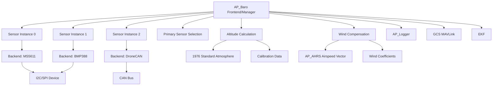
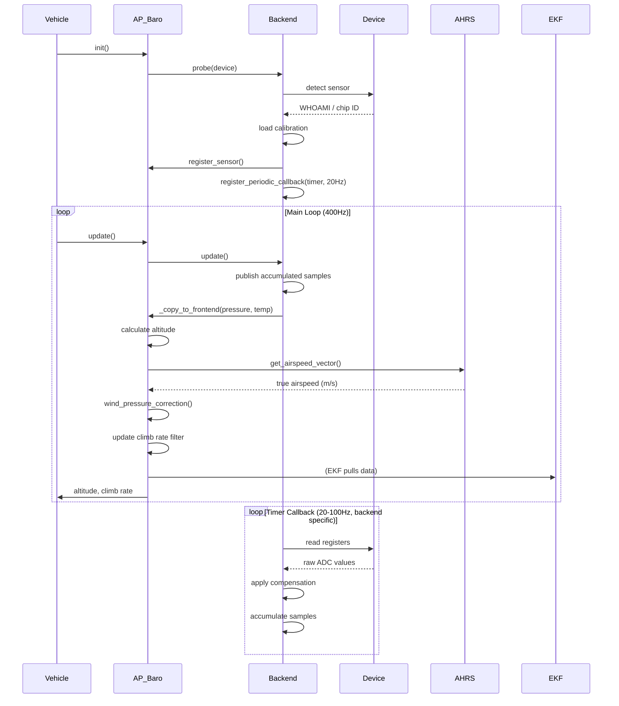

# AP_Baro - Barometer Subsystem

## Overview

The AP_Baro library provides the barometer subsystem for ArduPilot, managing pressure sensors that measure atmospheric or underwater pressure for altitude estimation, vertical velocity calculation, and airspeed-based altitude corrections. The library implements a manager-backend architecture supporting up to 3 simultaneous barometer instances with automatic health monitoring, primary sensor selection, and sensor fusion. It includes a comprehensive 1976 U.S. Standard Atmosphere model for pressure-to-altitude conversion, wind compensation algorithms for correcting pressure errors during flight, and extensive support for I2C, SPI, CAN, and protocol-based sensor backends.

## Architecture

The AP_Baro subsystem uses a frontend-backend pattern where the AP_Baro singleton manages sensor instances and provides a unified API, while AP_Baro_Backend-derived drivers handle hardware-specific communication and data acquisition.



## Key Components

### AP_Baro (Frontend/Manager)
- **Purpose**: Singleton manager coordinating multiple barometer instances, implementing sensor health monitoring, primary sensor selection, and providing unified altitude/pressure API
- **Responsibilities**: Backend driver initialization and probing, sensor registration, calibration management, altitude calculation using atmospheric models, climb rate filtering, wind/thrust pressure corrections, logging, and MAVLink telemetry
- **Thread Safety**: All public APIs protected by HAL_Semaphore (`_rsem`) for safe concurrent access from different threads
- **Sensor Limits**: Supports up to 3 barometer instances (BARO_MAX_INSTANCES=3) managed by up to 3 backend drivers (BARO_MAX_DRIVERS=3)

### AP_Baro_Backend (Base Class)
- **Purpose**: Abstract base class defining the contract for all barometer drivers
- **Lifecycle**: probe() → init() → register_sensor() → register_periodic_callback() → timer callback → update()
- **Driver Responsibilities**: Hardware-specific communication (I2C/SPI/CAN), calibration coefficient loading, raw ADC reading, temperature/pressure compensation, sample accumulation, and data publication via _copy_to_frontend()
- **Health Monitoring**: Implements pressure_ok() mean filter for outlier rejection and tracks error counts for reliability metrics

### Atmospheric Model
- **Purpose**: Convert between pressure and altitude using physical atmosphere models
- **Simple Model**: Tropospheric approximation valid to ~11km AMSL, implements exact calculation within ±2.5m of standard atmosphere tables
- **Extended Model**: Full 1976 U.S. Standard Atmosphere from -5km to 84.852km with geopotential altitude corrections and layered temperature gradients
- **Functions**: Pressure↔altitude conversion, sea-level pressure calculation, EAS↔TAS conversion, air density ratio, temperature lookup
- **Source**: libraries/AP_Baro/AP_Baro_atmosphere.cpp

### Wind Compensation
- **Purpose**: Correct static pressure errors caused by airflow around the barometer sensor during flight
- **Algorithm**: Computes dynamic pressure correction using true airspeed vector from AP_AHRS and per-axis wind coefficients (FWD, BCK, RGT, LFT, UP, DN)
- **Calculation**: corrected_pressure = raw_pressure + Σ(coefficient_i × dynamic_pressure_i) where dynamic_pressure = 0.5 × ρ × v²
- **Requirements**: Requires valid airspeed vector from EKF3 and tuned drag coefficients (EK3_DRAG_BCOEF_X/Y for multirotors)
- **Source**: libraries/AP_Baro/AP_Baro_Wind.cpp

### Sensor Health Monitoring
- **Health Criteria**: Sensor marked unhealthy if no update for BARO_TIMEOUT_MS (500ms) or no data change for BARO_DATA_CHANGE_TIMEOUT_MS (2000ms)
- **Primary Selection**: User-specified primary (BARO_PRIMARY parameter) with automatic fallback to first healthy sensor if user selection fails
- **Outlier Rejection**: Backend pressure_ok() filter rejects samples deviating >FILTER_RANGE from running mean
- **Arming Checks**: Validates all configured barometers are healthy before arming, prevents flight with failed sensors

## Component Interactions

The barometer subsystem follows a periodic sampling and update pattern:



### Data Flow

1. **Initialization**: AP_Baro::init() probes I2C/SPI buses for supported sensors, each detected backend calls register_sensor() to claim instance slot
2. **Periodic Sampling**: Backend timer callbacks (20-100Hz) read raw ADC, apply calibration coefficients, accumulate pressure/temperature samples
3. **Frontend Update**: Vehicle main loop calls AP_Baro::update() (~400Hz), backends average accumulated samples and call _copy_to_frontend()
4. **Altitude Calculation**: Frontend converts pressure to altitude using ground_pressure calibration reference and atmospheric model
5. **Wind Correction**: If enabled, corrects pressure using AP_AHRS airspeed vector and per-axis wind coefficients
6. **Climb Rate**: DerivativeFilterFloat_Size7 differentiates altitude to produce smoothed vertical velocity
7. **Data Publication**: Altitude/pressure available to EKF, altitude hold controllers, GCS telemetry, and logging

## Supported Sensors

### Bosch Sensortec Family
- **BMP085 / BMP180**: Legacy I2C barometer (0x77), 10-bit temperature + 16-19 bit pressure, state machine with EOC polling
- **BMP280**: Modern I2C/SPI (0x76, 0x77), 20-bit pressure, 9 calibration coefficients, continuous sampling
- **BMP388 / BMP390**: High-precision I2C/SPI (0x76, 0x77), 24-bit pressure, 11 pressure + 3 temperature coefficients
- **BMP581**: Next-generation ultra-high-precision barometer

### TE Connectivity MS56XX Family
- **MS5611**: High-resolution I2C/SPI, 24-bit ADC, PROM calibration with CRC, 2nd-order temperature compensation
- **MS5607**: Low-power variant of MS5611, option to treat as MS5607 via BARO_OPTIONS
- **MS5637 / MS5837**: Miniature I2C sensors (MS5837 supports water pressure mode for underwater ROVs)

### Infineon / TDK InvenSense
- **DPS280 / DPS310**: I2C/SPI, packed calibration coefficients, polynomial compensation, robust boot sequence
- **ICP-101XX**: Low-power, high-accuracy I2C sensor
- **ICP-201XX**: Next-generation ICP series
- **ICM-20789**: Combo IMU+barometer, OTP calibration via IMU bridge, LUT-based conversion

### STMicroelectronics LPS Family
- **LPS25H / LPS22H / LPS22HB / LPS22HH**: MEMS pressure sensors, FIFO support, I2C/SPI

### Other Sensors
- **SPL06 / SPA06** (Goertek): I2C, device-specific register sequences, FIFO burst sampling
- **FBM320** (Formosa Microsystems): I2C pressure sensor
- **Keller LD Series**: Industrial-grade I2C pressure transducers

### Protocol / Virtual Backends
- **DroneCAN / UAVCAN**: Subscribes to UAVCAN static pressure messages, supports remote CAN-bus barometers
- **MSP**: Consumes MSP barometer packets from external flight controllers or OSD devices
- **ExternalAHRS**: Integrates barometer data from external navigation systems (VectorNav, LORD Microstrain)
- **SITL**: Software-in-the-loop simulation with configurable drift, delay, and noise
- **HIL**: Hardware-in-the-loop simulation backend
- **Dummy**: Returns static values for board bringup and testing

Source: libraries/AP_Baro/AP_Baro*.{h,cpp} driver files

## Altitude Calculation

### Calibration Reference

The barometer subsystem calculates altitude relative to a calibration point set by the `calibrate()` call:

- **Ground Pressure**: Stored in `sensors[].ground_pressure` parameter (Pa)
- **Ground Temperature**: Stored in `_guessed_ground_temperature` (°C)
- **Calibration Timing**: Must be called on ground before using altitude functions
- **Incremental Update**: `update_calibration()` adjusts reference to current conditions for preflight updates

### Simple Atmosphere Model (Default)

Valid for troposphere (up to ~11km AMSL), provides exact calculation within ±2.5m of standard atmosphere:

```
altitude (m) = 153.8462 × T_ground (K) × [1 - exp(0.190259 × ln(P / P_ground))]
```

Where:
- `T_ground`: Ground temperature in Kelvin (from calibration)
- `P`: Current pressure (Pa)
- `P_ground`: Ground pressure (Pa)

**Accuracy**: ±2.5m compared to standard atmosphere tables in troposphere

Source: libraries/AP_Baro/AP_Baro_atmosphere.cpp:54-65

### Extended 1976 Standard Atmosphere Model

Enabled by `AP_BARO_1976_STANDARD_ATMOSPHERE_ENABLED`, provides full atmosphere model from -5km to 84.852km with layered temperature gradients:

**Atmospheric Layers**:
| Altitude (m) | Temperature (K) | Lapse Rate (K/m) | Description |
|--------------|-----------------|------------------|-------------|
| -5000 to 0   | 320.65 → 288.15 | -6.5×10⁻³ | Extended troposphere |
| 0 to 11000   | 288.15 → 216.65 | -6.5×10⁻³ | Troposphere |
| 11000 to 20000 | 216.65 | 0 | Tropopause (isothermal) |
| 20000 to 32000 | 216.65 → 228.65 | +1.0×10⁻³ | Lower stratosphere |
| 32000 to 47000 | 228.65 → 270.65 | +2.8×10⁻³ | Stratosphere |
| 47000 to 51000 | 270.65 | 0 | Stratopause (isothermal) |
| 51000 to 71000 | 270.65 → 214.65 | -2.8×10⁻³ | Mesosphere |
| 71000 to 84852 | 214.65 → 186.95 | -2.0×10⁻³ | Upper mesosphere |

**Geopotential Altitude Correction**: Accounts for Earth radius (6356.766 km) and gravity variation with altitude

Source: libraries/AP_Baro/AP_Baro_atmosphere.cpp:67-366, based on NASA Technical Report 1976 U.S. Standard Atmosphere

### Altitude Above Mean Sea Level (AMSL)

```cpp
altitude_AMSL = get_altitude(instance) + field_elevation
```

- **Field Elevation**: Set by `BARO_ALT_OFFSET` parameter or from terrain database
- **Usage**: Provides absolute altitude for terrain following, geofencing, airspace compliance

### Sea-Level Pressure Calculation

Iterative algorithm to compute sea-level pressure from current pressure and altitude:

```cpp
float sea_level_pressure = get_sealevel_pressure(current_pressure, current_altitude);
```

Used for weather reporting and altimeter setting (QNH).

## Temperature Compensation

All barometer sensors require temperature compensation because pressure sensors are temperature-sensitive:

### Sensor-Specific Compensation

Each backend driver implements manufacturer-specified compensation algorithms:

1. **BMP280/388 Family**: Temperature compensation via `t_fine` intermediate value:
   - Read raw temperature ADC → Apply `t1, t2, t3` coefficients → Calculate `t_fine`
   - Read raw pressure ADC → Apply `p1-p9` coefficients using `t_fine` → Compensated pressure

2. **MS56XX Family**: 2nd-order temperature compensation:
   - 1st order: Linear compensation using PROM coefficients `C1-C6`
   - 2nd order: Polynomial correction for temperature extremes (<20°C or >20°C)

3. **DPS280**: Polynomial compensation with packed coefficients decoded from device registers

4. **ICM-20789**: Look-up table (LUT) based conversion using OTP calibration constants

Source: Individual backend driver .cpp files in libraries/AP_Baro/

### External Temperature Source

```cpp
baro.set_external_temperature(temperature_celsius);
```

Allows using temperature from external sensors (e.g., digital airspeed sensor) for improved accuracy. Temperature used for EAS↔TAS conversion and altitude calculation.

## Multi-Barometer Management

### Sensor Registration

Backend drivers register sensors during initialization:

```cpp
uint8_t instance = _frontend.register_sensor();
```

- **Limit**: Maximum 3 instances (BARO_MAX_INSTANCES)
- **Panic**: System panics if attempting to register more than max instances
- **Bus ID**: Each instance stores bus identifier (BARO_DEVID parameter) for user visibility

### Primary Sensor Selection

Algorithm for selecting primary barometer:

1. **User Override**: If `BARO_PRIMARY` parameter is set (1-3) and that sensor is healthy, use it
2. **Automatic Selection**: If user selection unavailable or unhealthy, use first healthy sensor (instance 0 preferred)
3. **Failover**: Continuously monitors health; switches primary if current primary becomes unhealthy

### Health Criteria

Sensor marked unhealthy if:
- No update received for **BARO_TIMEOUT_MS (500ms)**
- No data change for **BARO_DATA_CHANGE_TIMEOUT_MS (2000ms)** (indicates stuck sensor)
- Backend reports unhealthy via health flag
- Pressure value outside filter range (mean ± FILTER_RANGE)

### Sensor Data Structure

Each sensor instance maintains:

```cpp
struct sensor {
    uint32_t last_update_ms;        // Last update timestamp
    uint32_t last_change_ms;        // Last data change timestamp
    float pressure;                 // Pressure in Pascals
    float temperature;              // Temperature in °C
    float altitude;                 // Calculated altitude in meters
    AP_Float ground_pressure;       // Calibration reference (Pa)
    float p_correction;             // Pressure correction (Pa)
    baro_type_t type;               // BARO_TYPE_AIR or BARO_TYPE_WATER
    bool healthy;                   // Sensor health status
    bool alt_ok;                    // Altitude calculation valid
    bool calibrated;                // Calibration completed
    AP_Int32 bus_id;                // Device identification
    // Wind compensation data (if enabled)
    // Thrust compensation data (if enabled)
};
```

Source: libraries/AP_Baro/AP_Baro.h:289-312

## Calibration Procedures

### Ground-Level Calibration

**Purpose**: Establish pressure/temperature reference for relative altitude calculation

**Procedure**:
```cpp
// On ground before flight:
baro.calibrate(true);  // Calibrate and save to EEPROM
```

**Actions**:
1. Reads current pressure and temperature from all healthy sensors
2. Stores ground_pressure for each instance
3. Stores ground_temperature for altitude calculation
4. Optionally saves ground_pressure to EEPROM (parameter database)
5. Resets altitude offset to zero

**Safety**: **Must be called on ground before using altitude-based functions**. Calibrating in-flight will cause incorrect altitude reference.

### Incremental Calibration Update

**Purpose**: Adjust calibration during preflight for pressure changes (weather fronts)

**Procedure**:
```cpp
// During preflight, vehicle still on ground:
baro.update_calibration();  // Update to current pressure without saving
```

**Usage**: Called during pre-arm sequence to account for pressure drift since last calibration, without writing to EEPROM on every update.

### Water Pressure Mode (Underwater ROVs)

**Purpose**: Handle underwater pressure measurement with specific gravity correction

**Configuration**:
```cpp
baro.set_type(instance, AP_Baro::BARO_TYPE_WATER);
```

**Parameters**:
- `BARO_SPEC_GRAV`: Specific gravity of water (1.0 freshwater, 1.024 saltwater)
- Used by MS5837 sensors for depth calculation in underwater vehicles (ArduSub)

Source: libraries/AP_Baro/AP_Baro.cpp calibration functions

## Wind Effect Compensation

### Physical Cause

Static pressure ports experience measurement errors during flight due to:
- **Position Error**: Airflow around fuselage/mounting location creates pressure gradients
- **Dynamic Pressure**: Kinetic energy of airflow (0.5 × ρ × v²) affects static port reading
- **Direction Dependence**: Error magnitude varies with airflow direction (forward/back/left/right/up/down)

### Compensation Algorithm

**Enabled**: `HAL_BARO_WIND_COMP_ENABLED` compile flag
**Requirements**: EKF3 with tuned drag coefficients (EK3_DRAG_BCOEF_X, EK3_DRAG_BCOEF_Y)

**Calculation**:
```
corrected_pressure = raw_pressure + pressure_correction

pressure_correction = Σ (coefficient × dynamic_pressure)

dynamic_pressure_x = 0.5 × ρ × vx² × sign(vx)
dynamic_pressure_y = 0.5 × ρ × vy² × sign(vy)
dynamic_pressure_z = 0.5 × ρ × vz² × sign(vz)

where:
  ρ = air_density (kg/m³)
  vx, vy, vz = true airspeed components in body frame (m/s)
```

**Per-Axis Coefficients** (BARO_WCF parameters):
- `ENABLE`: Enable wind compensation (0=disabled, 1=enabled)
- `FWD`: Forward pressure error coefficient (typically -0.05 to +0.05)
- `BCK`: Backward pressure error coefficient
- `RGT`: Right pressure error coefficient  
- `LFT`: Left pressure error coefficient
- `UP`: Upward pressure error coefficient
- `DN`: Downward pressure error coefficient

**Tuning**: Coefficients determined empirically by comparing barometer altitude to GPS/GNSS altitude during sustained flight in different directions.

Source: libraries/AP_Baro/AP_Baro_Wind.cpp

### Thrust Compensation (Optional)

Enabled by `AP_BARO_THST_COMP_ENABLED`, compensates for pressure errors caused by propeller downwash or rotor wake:

```
corrected_pressure = raw_pressure + (motor_scale × thrust_factor)
```

Used primarily on multirotors where motor thrust creates pressure disturbances.

## Climb Rate Calculation

### Filtering

Climb rate derived by differentiating altitude using 7-point derivative filter:

```cpp
DerivativeFilterFloat_Size7 _climb_rate_filter;
```

- **Filter Type**: Digital derivative filter with 7-sample history
- **Purpose**: Smooths altitude noise while maintaining responsiveness
- **Update Rate**: Calculated every frontend update (~400Hz vehicle main loop)
- **Units**: Meters per second (m/s), positive = ascending, negative = descending

### Usage

```cpp
float climb_rate = baro.get_climb_rate();  // m/s
```

- **Consumers**: Altitude hold controllers, vertical velocity display, TECS (fixed-wing energy management)
- **Altitude Source**: Uses primary barometer altitude
- **Initialization**: Requires valid altitude history (several samples after calibration)

Source: libraries/AP_Baro/AP_Baro.cpp:get_climb_rate()

## Configuration Parameters

### Global Parameters

| Parameter | Type | Description | Default | Range | Units |
|-----------|------|-------------|---------|-------|-------|
| BARO_PRIMARY | INT8 | Primary barometer selection (0=auto, 1-3=specific instance) | 0 | 0-3 | - |
| BARO_EXT_BUS | INT8 | I2C bus number for external barometer | -1 | -1-3 | - |
| BARO_ALT_OFFSET | FLOAT | Altitude offset for baro drift compensation | 0.0 | -500 to 500 | m |
| BARO_FIELD_ELEV | FLOAT | Field elevation AMSL | 0.0 | -500 to 500 | m |
| BARO_SPEC_GRAV | FLOAT | Specific gravity for water pressure | 1.0 | 0.9-1.1 | - |
| BARO_GND_TEMP | FLOAT | User override ground temperature for EAS2TAS | 0.0 | -50 to 50 | °C |
| BARO_FILTER_RANGE | INT8 | Valid value range from mean (reject outliers) | 5 | 0-127 | - |
| BARO_PROBE_EXT | BITMASK | External I2C barometer probing enable bitmask | 0 | 0-32767 | - |
| BARO_OPTIONS | BITMASK | Barometer option flags | 0 | - | - |
| BARO_ALT_ERROR_MAX | FLOAT | Maximum altitude error before arming check fails | 5.0 | 0-50 | m |

### Per-Instance Parameters (N = 1, 2, 3)

| Parameter | Type | Description | Default | Units |
|-----------|------|-------------|---------|-------|
| BAROGND_PRESS | FLOAT | Ground pressure (set by calibration) | 101325 | Pa |
| BARO_DEVID | INT32 | Device ID (bus type, bus number, address, devtype) | 0 | - |

### Wind Compensation Parameters (Per-Instance, if enabled)

| Parameter | Type | Description | Default | Range |
|-----------|------|-------------|---------|-------|
| BARO_WCF_ENABLE | INT8 | Enable wind compensation | 0 | 0-1 |
| BARO_WCF_FWD | FLOAT | Forward pressure error coefficient | 0.0 | -1.0 to 1.0 |
| BARO_WCF_BCK | FLOAT | Backward pressure error coefficient | 0.0 | -1.0 to 1.0 |
| BARO_WCF_RGT | FLOAT | Right pressure error coefficient | 0.0 | -1.0 to 1.0 |
| BARO_WCF_LFT | FLOAT | Left pressure error coefficient | 0.0 | -1.0 to 1.0 |
| BARO_WCF_UP | FLOAT | Upward pressure error coefficient | 0.0 | -1.0 to 1.0 |
| BARO_WCF_DN | FLOAT | Downward pressure error coefficient | 0.0 | -1.0 to 1.0 |

### Thrust Compensation Parameters (Per-Instance, if enabled)

| Parameter | Type | Description | Default | Range |
|-----------|------|-------------|---------|-------|
| BARO_MOT_SCALE | FLOAT | Thrust-based pressure scaling factor | 0.0 | -1.0 to 1.0 |

Source: libraries/AP_Baro/AP_Baro.cpp var_info[] and libraries/AP_Baro/AP_Baro_Wind.cpp

## Safety Considerations

### Flight-Critical Dependency

**Warning**: Barometer is a safety-critical sensor for:
- **Altitude Hold**: Maintains desired altitude using barometer feedback
- **Terrain Following**: Follows ground profile using barometer + rangefinder
- **Geofencing**: Altitude limits enforced using barometer altitude
- **Failsafe Actions**: RTL and land modes depend on altitude estimation
- **TECS**: Fixed-wing energy management uses barometer for altitude control

### Calibration Safety

**Critical**: `calibrate()` must be called **on the ground** before flight:
- Calibrating in-flight resets altitude reference to current altitude (dangerous)
- Incorrect calibration causes wrong altitude estimation → altitude hold failures
- Arming checks validate calibration was performed on ground

### Sensor Redundancy

**Best Practice**: Use multiple barometer instances for redundancy:
- Automatic failover if primary sensor fails mid-flight
- EKF can fuse multiple barometer sources
- Inconsistent altitude between sensors triggers EKF innovation failures

### Health Monitoring

**Arming Prevention**: System refuses to arm if:
- All configured barometers unhealthy
- Altitude error exceeds `BARO_ALT_ERROR_MAX` parameter
- Sensor hasn't provided data for >2 seconds

### Wind Compensation Risks

**Warning**: Incorrect wind compensation coefficients can:
- Introduce altitude errors instead of correcting them
- Cause oscillations in altitude hold
- Require EKF3 with properly tuned drag coefficients

**Validation**: Test wind compensation in SITL and verify altitude tracking against GPS before real flights.

### Pressure Port Placement

**Hardware Consideration**: Static pressure port location affects measurement accuracy:
- Mount away from propeller wash (multirotors)
- Avoid direct rotor downwash
- Protect from precipitation and icing
- Fixed-wing: carefully position on fuselage to minimize position error

## Testing

### SITL (Software-In-The-Loop) Testing

**Basic Barometer Test**:
```bash
# Start SITL with default parameters
sim_vehicle.py -v Copter --console --map

# In MAVProxy console:
module load graph
graph BARO.Alt BARO.Press BARO.Temp

# Arm and takeoff to test altitude tracking:
arm throttle
mode guided
takeoff 10

# Observe barometer altitude tracking GPS altitude
# Check climb rate during ascent/descent
```

**Wind Compensation Testing**:
```bash
# Enable wind compensation in parameters:
param set BARO_WCF_ENABLE 1
param set BARO_WCF_FWD -0.05   # Example coefficient

# Fly in different directions and compare:
graph BARO.Alt GPS.Alt

# Tune coefficients to minimize altitude error
```

**Multi-Barometer Testing**:
```bash
# Configure multiple SITL barometers:
param set SIM_BARO_COUNT 3
param set SIM_BARO_DRIFT 0.1  # Add drift to test failover

# Observe primary sensor selection:
graph BARO[0].Alt BARO[1].Alt BARO[2].Alt
```

### Unit Testing

Atmospheric model unit tests using AP_GTest framework:

**Location**: `libraries/AP_Baro/tests/test_baro_atmosphere.cpp`

**Tests**:
- Pressure-to-altitude conversion accuracy
- Altitude-to-pressure conversion accuracy
- Geopotential altitude corrections
- Temperature lookup by altitude
- EAS-to-TAS conversion factors

**Running Tests**:
```bash
cd ArduPilot
./waf configure --board linux
./waf tests
./build/linux/tests/test_baro_atmosphere
```

### Hardware Testing

**Basic Sensor Detection**:
```bash
# Build and upload firmware
./waf configure --board <your_board>
./waf copter --upload

# Connect via MAVProxy/Mission Planner
# Check barometer detection in messages:
# "Found barometer 0: BMP388 on I2C bus 0 address 0x76"

# Check BARO_DEVID parameters populated
# Check BARO messages in telemetry
```

**Calibration Validation**:
```bash
# On ground, perform calibration:
1. Ensure vehicle stationary on level ground
2. Send MAVLink PREFLIGHT_CALIBRATION command (pressure=1)
3. Verify ground pressure stored: check BAROGND_PRESS parameter
4. Verify altitude reads ~0m after calibration

# Move to different altitude and verify relative altitude correct
```

**Sensor Health Monitoring**:
```bash
# Induce sensor failure (disconnect I2C, cover port, etc.)
# Observe:
# - Sensor marked unhealthy after BARO_TIMEOUT_MS
# - Primary sensor switches to healthy backup (if available)
# - GCS displays "Barometer unhealthy" warning
# - Arming prevented if all sensors fail
```

**Climb Rate Validation**:
```bash
# Record log during vertical flight:
# 1. Hover at 10m
# 2. Climb at 2 m/s to 20m
# 3. Descend at -1 m/s to 10m

# Analyze log:
# - Plot BARO.CRt (climb rate)
# - Compare to GPS vertical velocity (GPS.VZ)
# - Verify climb rate filter reduces noise while tracking trends
```

### Log Analysis

**Barometer Log Messages**:

**BARO**: Main barometer data
- `Alt`: Relative altitude (m)
- `AltAMSL`: Altitude above mean sea level (m)
- `Press`: Pressure (Pa)
- `Temp`: Temperature (centi-°C, divide by 100)
- `CRt`: Climb rate (m/s)
- `H`: Healthy flag (1=healthy, 0=unhealthy)
- `CPress`: Corrected pressure with wind/thrust compensation (Pa)

**BARD**: Dynamic pressure data (wind compensation enabled)
- `DynPrX/Y/Z`: Dynamic pressure in body frame X/Y/Z axes (Pa)

**Analysis**:
```bash
# Extract barometer data from log:
mavlogdump.py --types BARO flight.bin > baro_data.txt

# Plot altitude tracking:
# Compare BARO.Alt vs. GPS.Alt (relative to takeoff)
# Check for drift, noise, outliers

# Identify sensor failures:
# Gaps in BARO.H (healthy flag transitions to 0)
# Large deviations between BARO[0] and BARO[1]
```

## Usage Examples

### Basic Initialization and Usage

```cpp
// In vehicle setup code:
#include <AP_Baro/AP_Baro.h>

// Get barometer singleton
AP_Baro &baro = AP::baro();

void setup() {
    // Initialize barometer subsystem (probes and loads backends)
    baro.init();
    
    // Calibrate on ground before flight
    baro.calibrate(true);  // true = save to EEPROM
}

void loop() {
    // Update barometer (call every main loop iteration)
    baro.update();
    
    // Get altitude relative to calibration point
    float altitude_m = baro.get_altitude();  // Primary sensor
    
    // Get altitude above mean sea level
    float altitude_amsl = baro.get_altitude_AMSL();
    
    // Get climb rate
    float climb_rate_ms = baro.get_climb_rate();
    
    // Get pressure and temperature
    float pressure_pa = baro.get_pressure();
    float temperature_c = baro.get_temperature();
    
    // Check sensor health
    if (!baro.healthy()) {
        // Handle barometer failure
    }
}
```

### Multi-Sensor Access

```cpp
// Get number of barometer instances
uint8_t num_baros = baro.num_instances();

// Access specific sensor instance
for (uint8_t i = 0; i < num_baros; i++) {
    if (baro.healthy(i)) {
        float altitude = baro.get_altitude(i);
        float pressure = baro.get_pressure(i);
        float temperature = baro.get_temperature(i);
        uint32_t last_update = baro.get_last_update(i);
        
        // Process sensor data...
    }
}

// Get primary sensor index
uint8_t primary = baro.get_primary();
```

### Altitude Conversions

```cpp
// Calculate sea-level pressure (for weather reporting)
float current_pressure_pa = baro.get_pressure();
float current_altitude_m = baro.get_altitude();
float sea_level_pressure_pa = baro.get_sealevel_pressure(current_pressure_pa, current_altitude_m);

// Calculate altitude from arbitrary pressure
float arbitrary_pressure_pa = 95000.0f;  // Example: 950 mb
float altitude_m = baro.get_altitude_from_pressure(arbitrary_pressure_pa);

// Get altitude difference between two pressure readings
float base_pressure = 101325.0f;  // Sea level standard
float current_pressure = baro.get_pressure();
float altitude_diff = baro.get_altitude_difference(base_pressure, current_pressure);

// Get EAS to TAS conversion factor
float altitude_amsl = baro.get_altitude_AMSL();
float eas2tas_factor = baro.get_EAS2TAS_for_alt_amsl(altitude_amsl);
float true_airspeed = equivalent_airspeed * eas2tas_factor;
```

### External Temperature Source

```cpp
// Use temperature from digital airspeed sensor for better accuracy
AP_Airspeed &airspeed = AP::airspeed();
if (airspeed.healthy()) {
    float airspeed_temp = airspeed.get_temperature();
    baro.set_external_temperature(airspeed_temp);
}
```

### Wind Compensation Configuration

```cpp
// Enable wind compensation for instance 0
baro.sensors[0].wind_coeff.enable.set_and_save(1);

// Set forward coefficient (determined from flight testing)
baro.sensors[0].wind_coeff.xp.set_and_save(-0.05f);

// During flight, get corrected pressure
float corrected_pressure = baro.get_corrected_pressure(0);
```

### Thread-Safe Access

```cpp
// Access barometer data from different thread
HAL_Semaphore &sem = baro.get_semaphore();

// Use WITH_SEMAPHORE macro for scoped locking
WITH_SEMAPHORE(sem);
float altitude = baro.get_altitude();
float pressure = baro.get_pressure();
// Semaphore automatically released at scope exit
```

### Arming Checks

```cpp
// Pre-arm validation (called during arming sequence)
char failure_msg[50];
if (!baro.arming_checks(sizeof(failure_msg), failure_msg)) {
    gcs().send_text(MAV_SEVERITY_CRITICAL, "Arming rejected: %s", failure_msg);
    // Arming blocked due to barometer issue
}
```

## Integration Guide: Adding a New Barometer Driver

### Driver Structure

Create two files:
- `AP_Baro_NEWSENSOR.h`: Header with class declaration
- `AP_Baro_NEWSENSOR.cpp`: Implementation

### Step 1: Header File Template

```cpp
// AP_Baro_NEWSENSOR.h
#pragma once

#include "AP_Baro_Backend.h"

class AP_Baro_NEWSENSOR : public AP_Baro_Backend
{
public:
    AP_Baro_NEWSENSOR(AP_Baro &baro, AP_HAL::OwnPtr<AP_HAL::Device> dev);
    
    // Static probe function for device detection
    static AP_Baro_Backend *probe(AP_Baro &baro, AP_HAL::OwnPtr<AP_HAL::Device> dev);
    
    // Override update to publish accumulated data
    void update() override;

private:
    // Device-specific methods
    bool _init();
    void _timer();  // Periodic callback
    bool _read_calibration();
    void _calculate();
    
    // Device handle
    AP_HAL::OwnPtr<AP_HAL::Device> _dev;
    
    // Sensor instance
    uint8_t _instance;
    
    // Calibration coefficients
    struct calibration_data {
        // Device-specific calibration values
    } _cal;
    
    // Accumulators for averaging
    float _pressure_sum;
    float _temperature_sum;
    uint32_t _sample_count;
};
```

### Step 2: Implementation File Template

```cpp
// AP_Baro_NEWSENSOR.cpp
#include "AP_Baro_NEWSENSOR.h"

#include <AP_HAL/I2CDevice.h>
#include <utility>

// I2C address (example)
#define NEWSENSOR_I2C_ADDR 0x76

// Register definitions
#define NEWSENSOR_REG_WHOAMI 0x00
#define NEWSENSOR_REG_DATA   0x01
// ... more registers

// Constructor
AP_Baro_NEWSENSOR::AP_Baro_NEWSENSOR(AP_Baro &baro, AP_HAL::OwnPtr<AP_HAL::Device> dev)
    : AP_Baro_Backend(baro)
    , _dev(std::move(dev))
{
}

// Probe function - detects sensor and creates backend instance
AP_Baro_Backend *AP_Baro_NEWSENSOR::probe(AP_Baro &baro, AP_HAL::OwnPtr<AP_HAL::Device> dev)
{
    if (!dev) {
        return nullptr;
    }
    
    AP_Baro_NEWSENSOR *sensor = NEW_NOTHROW AP_Baro_NEWSENSOR(baro, std::move(dev));
    if (!sensor) {
        return nullptr;
    }
    
    if (!sensor->_init()) {
        delete sensor;
        return nullptr;
    }
    
    return sensor;
}

// Initialize sensor
bool AP_Baro_NEWSENSOR::_init()
{
    // Get device semaphore
    if (!_dev->get_semaphore()->take(HAL_SEMAPHORE_BLOCK_FOREVER)) {
        return false;
    }
    
    // Set bus speed
    _dev->set_speed(AP_HAL::Device::SPEED_HIGH);
    
    // Read and verify WHOAMI register
    uint8_t whoami;
    if (!_dev->read_registers(NEWSENSOR_REG_WHOAMI, &whoami, 1)) {
        _dev->get_semaphore()->give();
        return false;
    }
    
    if (whoami != EXPECTED_WHOAMI_VALUE) {
        _dev->get_semaphore()->give();
        return false;
    }
    
    // Read calibration data
    if (!_read_calibration()) {
        _dev->get_semaphore()->give();
        return false;
    }
    
    // Configure sensor (mode, oversampling, etc.)
    // ... device-specific configuration
    
    _dev->get_semaphore()->give();
    
    // Register sensor instance with frontend
    _instance = _frontend.register_sensor();
    
    // Set device type for BARO_DEVID parameter
    set_bus_id(_instance, _dev->get_bus_id());
    
    // Register periodic callback (example: 50Hz = 20ms)
    _dev->register_periodic_callback(20000, FUNCTOR_BIND_MEMBER(&AP_Baro_NEWSENSOR::_timer, void));
    
    return true;
}

// Read calibration data from sensor
bool AP_Baro_NEWSENSOR::_read_calibration()
{
    // Read device-specific calibration coefficients
    // Example:
    uint8_t data[24];
    if (!_dev->read_registers(NEWSENSOR_REG_CALIB, data, sizeof(data))) {
        return false;
    }
    
    // Parse and store calibration values in _cal structure
    // ... device-specific parsing
    
    return true;
}

// Timer callback - reads raw data and accumulates samples
void AP_Baro_NEWSENSOR::_timer()
{
    // Read raw pressure and temperature from sensor
    uint8_t data[6];
    if (!_dev->read_registers(NEWSENSOR_REG_DATA, data, sizeof(data))) {
        return;
    }
    
    // Parse raw values (device-specific)
    int32_t raw_pressure = (data[0] << 16) | (data[1] << 8) | data[2];
    int32_t raw_temperature = (data[3] << 16) | (data[4] << 8) | data[5];
    
    // Apply calibration and compensation (device-specific)
    float temperature = /* compensation formula */;
    float pressure = /* compensation formula */;
    
    // Validate pressure range
    if (!pressure_ok(pressure)) {
        return;
    }
    
    // Accumulate samples for averaging
    WITH_SEMAPHORE(_sem);
    _pressure_sum += pressure;
    _temperature_sum += temperature;
    _sample_count++;
}

// Update function - averages accumulated samples and publishes to frontend
void AP_Baro_NEWSENSOR::update()
{
    WITH_SEMAPHORE(_sem);
    
    if (_sample_count == 0) {
        return;  // No new samples
    }
    
    // Calculate averages
    float pressure = _pressure_sum / _sample_count;
    float temperature = _temperature_sum / _sample_count;
    
    // Reset accumulators
    _pressure_sum = 0.0f;
    _temperature_sum = 0.0f;
    _sample_count = 0;
    
    // Copy data to frontend
    _copy_to_frontend(_instance, pressure, temperature);
    
    // Update health flag
    backend_update(_instance);
}
```

### Step 3: Register Driver in AP_Baro.cpp

Add probe call in `AP_Baro::init()` or `AP_Baro::_probe_i2c_barometers()`:

```cpp
// In AP_Baro.cpp _probe_i2c_barometers():

#if AP_BARO_NEWSENSOR_ENABLED
if (_baro_probe_ext.get() & PROBE_NEWSENSOR) {
    ADD_BACKEND(AP_Baro_NEWSENSOR::probe(*this, 
        hal.i2c_mgr->get_device(bus, NEWSENSOR_I2C_ADDR)));
}
#endif
```

### Step 4: Add Compile-Time Configuration

In `AP_Baro_config.h`:

```cpp
#ifndef AP_BARO_NEWSENSOR_ENABLED
#define AP_BARO_NEWSENSOR_ENABLED AP_BARO_BACKEND_DEFAULT_ENABLED
#endif
```

### Step 5: Add Device Type Enum

In `AP_Baro_Backend.h` DevTypes enum:

```cpp
enum DevTypes {
    // ... existing entries
    DEVTYPE_BARO_NEWSENSOR = 0x19,  // Next available ID
};
```

### Step 6: Testing

```bash
# Build and test:
./waf configure --board <your_board>
./waf copter

# Flash and connect
# Check detection message:
# "Found barometer 0: NEWSENSOR on I2C bus 0 address 0x76"

# Verify in MAVProxy:
param show BARO_DEVID
# Should show non-zero device ID

# Monitor telemetry:
graph BARO.Press BARO.Temp BARO.Alt
```

### Driver Best Practices

1. **Calibration Validation**: Verify calibration CRC if available (e.g., MS5611 PROM CRC)
2. **Error Handling**: Return early on communication failures, don't publish invalid data
3. **Accumulation**: Average multiple samples between update() calls for noise reduction
4. **Semaphore Usage**: Use `WITH_SEMAPHORE(_sem)` when accessing accumulators
5. **Health Monitoring**: Use `pressure_ok()` filter to reject outliers
6. **Register Retries**: Configure `_dev->set_retries(3)` for robust communication
7. **Timing**: Choose callback period appropriate for sensor (20-50Hz typical)

## Implementation Notes

### Design Decisions

**Frontend-Backend Pattern**:
- **Rationale**: Separates platform-agnostic API (frontend) from hardware-specific drivers (backends)
- **Benefits**: Simplifies vehicle code (single AP_Baro interface), allows hot-swapping sensors, supports multiple simultaneous instances
- **Trade-off**: Slight overhead from virtual functions and frontend state management

**Periodic Sampling via Timer Callbacks**:
- **Rationale**: Decouples sensor sampling rate (20-100Hz) from vehicle update rate (400Hz)
- **Benefits**: Reduces CPU overhead, allows different sampling rates per sensor, averages multiple samples for noise reduction
- **Implementation**: Backend `register_periodic_callback()` creates scheduler task

**Accumulator Pattern**:
- **Rationale**: Average multiple samples per update cycle to reduce barometer noise
- **Benefits**: Improves altitude hold stability, smooths climb rate, reduces EKF innovation noise
- **Trade-off**: Introduces ~1 sample period latency (~10-50ms)

**Two Atmospheric Models**:
- **Simple Model**: Fast, accurate to ±2.5m in troposphere (99% of flights)
- **Extended Model**: Full 1976 standard atmosphere for simulation and high-altitude applications
- **Trade-off**: Extended model adds 1KB flash and minimal runtime cost, gated by compile flag

**Primary Sensor Selection**:
- **Rationale**: Allow user override while providing automatic failover
- **Benefits**: Supports specific sensor preference (calibration, mounting), automatic redundancy
- **Safety**: Continuous health monitoring prevents using failed sensor

### Known Limitations

**Altitude Drift**:
- Barometer altitude drifts with weather changes (pressure fronts)
- Mitigation: EKF fuses GPS altitude for long-term reference, barometer for short-term precision
- Workaround: `update_calibration()` during preflight, `BARO_ALT_OFFSET` for manual correction

**Temperature Sensitivity**:
- Pressure sensors affected by temperature changes
- Mitigation: All drivers implement temperature compensation per datasheet
- Improvement: Use external temperature source (airspeed sensor) via `set_external_temperature()`

**Dynamic Pressure Errors**:
- Airflow around sensor port causes position errors
- Mitigation: Wind compensation with tuned coefficients
- Hardware: Careful port placement, use foam protection on multirotors

**Water Pressure Mode Limitations**:
- Only MS5837 sensor fully supports water pressure (underwater ROVs)
- Other sensors may not handle water pressure range or require specific gravity correction

### Performance Considerations

**CPU Overhead**:
- Backend timer callbacks: 20-100Hz per sensor (~0.1ms per sample on STM32F4)
- Frontend update: ~400Hz (< 0.05ms typical)
- Atmospheric model: Simple calculation ~0.01ms, extended model ~0.02ms

**Memory Usage**:
- Frontend state: ~500 bytes (3 sensor instances)
- Backend driver: 100-300 bytes per instance
- Atmospheric table: ~1KB if extended model enabled
- Total: ~2-3KB for typical 2-sensor configuration

**I2C/SPI Bus Contention**:
- Barometers share buses with other sensors (IMU, compass, etc.)
- Mitigation: Register periodic callbacks with staggered timing
- Best practice: Use SPI for high-speed sensors (IMU), I2C for slower sensors (baro)

## References

### Source Files

**Core Manager**:
- `libraries/AP_Baro/AP_Baro.h` - Frontend API and manager class
- `libraries/AP_Baro/AP_Baro.cpp` - Manager implementation, initialization, parameter definitions

**Atmospheric Model**:
- `libraries/AP_Baro/AP_Baro_atmosphere.cpp` - Pressure↔altitude conversions, 1976 standard atmosphere

**Wind Compensation**:
- `libraries/AP_Baro/AP_Baro_Wind.cpp` - Dynamic pressure corrections using airspeed vector

**Backend Base Class**:
- `libraries/AP_Baro/AP_Baro_Backend.h` - Abstract base class for drivers
- `libraries/AP_Baro/AP_Baro_Backend.cpp` - Common backend functionality

**Logging**:
- `libraries/AP_Baro/LogStructure.h` - Binary log message formats (BARO, BARD)
- `libraries/AP_Baro/AP_Baro_Logging.cpp` - Log writing functions

**Driver Implementations**:
- `libraries/AP_Baro/AP_Baro_BMP*.{h,cpp}` - Bosch BMP family (085, 280, 388, 581)
- `libraries/AP_Baro/AP_Baro_MS5611.{h,cpp}` - TE Connectivity MS56XX family
- `libraries/AP_Baro/AP_Baro_DPS280.{h,cpp}` - Infineon DPS280/DPS310
- `libraries/AP_Baro/AP_Baro_ICM20789.{h,cpp}` - InvenSense IMU+baro combo
- `libraries/AP_Baro/AP_Baro_ICP*.{h,cpp}` - TDK ICP-101XX/201XX
- `libraries/AP_Baro/AP_Baro_LPS2XH.{h,cpp}` - STMicro LPS family
- `libraries/AP_Baro/AP_Baro_SPL06.{h,cpp}` - Goertek SPL06/SPA06
- `libraries/AP_Baro/AP_Baro_FBM320.{h,cpp}` - Formosa FBM320
- `libraries/AP_Baro/AP_Baro_KellerLD.{h,cpp}` - Keller LD series
- `libraries/AP_Baro/AP_Baro_DroneCAN.{h,cpp}` - CAN bus backend
- `libraries/AP_Baro/AP_Baro_MSP.{h,cpp}` - MSP protocol backend
- `libraries/AP_Baro/AP_Baro_ExternalAHRS.{h,cpp}` - External AHRS integration
- `libraries/AP_Baro/AP_Baro_SITL.{h,cpp}` - Simulation backend
- `libraries/AP_Baro/AP_Baro_Dummy.{h,cpp}` - Dummy backend for testing

**Configuration**:
- `libraries/AP_Baro/AP_Baro_config.h` - Compile-time feature flags

**Testing**:
- `libraries/AP_Baro/tests/test_baro_atmosphere.cpp` - Unit tests for atmospheric model
- `libraries/AP_Baro/examples/BARO_generic/` - Example usage code

### External References

**1976 U.S. Standard Atmosphere**:
- NASA Technical Report: https://ntrs.nasa.gov/api/citations/19770009539/downloads/19770009539.pdf
- Defines atmospheric properties from -5km to 1000km altitude

**Sensor Datasheets**:
- Bosch BMP280: Pressure sensor with ±1m altitude accuracy
- Bosch BMP388: High-precision barometer with ±0.5m altitude accuracy  
- TE Connectivity MS5611: Industry-standard 24-bit barometer
- Infineon DPS280: Low-power barometer with digital interface

**Related ArduPilot Modules**:
- `libraries/AP_AHRS/` - Provides airspeed vector for wind compensation
- `libraries/AP_EKF3/` - Fuses barometer with GPS, accelerometers for state estimation
- `libraries/AP_Logger/` - Logs barometer data for analysis
- `libraries/AP_HAL/` - Hardware abstraction for I2C/SPI device access
- `libraries/GCS_MAVLink/` - Sends barometer data to ground control station

**ArduPilot Wiki**:
- Barometer Configuration: https://ardupilot.org/copter/docs/common-barometer.html
- Altitude Hold Tuning: https://ardupilot.org/copter/docs/altholdmode.html
- EKF3 Setup: https://ardupilot.org/copter/docs/common-apm-navigation-extended-kalman-filter-overview.html
