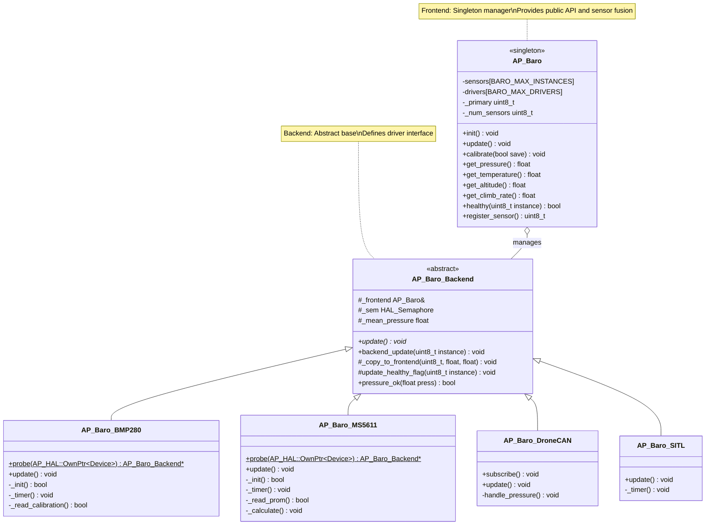
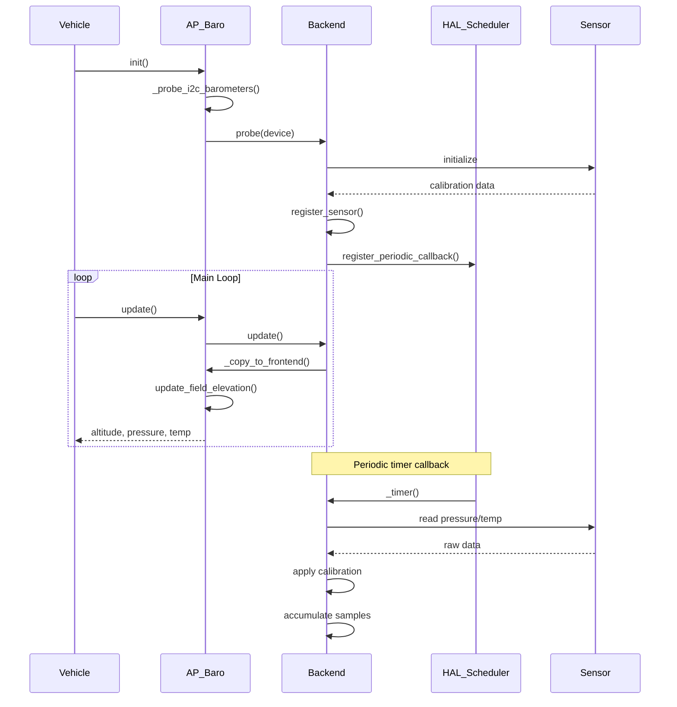
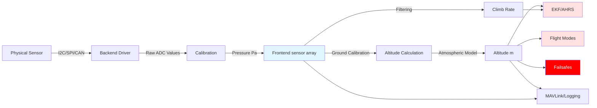
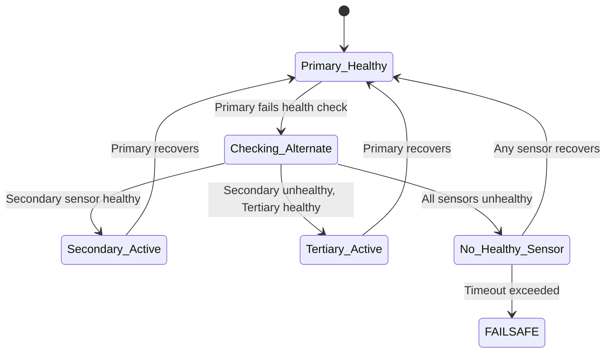

# AP_Baro - Barometer Subsystem


## Table of Contents
- [Overview](#overview)
- [Architecture](#architecture)
- [Supported Sensors](#supported-sensors)
- [Altitude Calculation Methods](#altitude-calculation-methods)
- [Temperature Compensation](#temperature-compensation)
- [Calibration Procedures](#calibration-procedures)
- [Multiple Sensor Handling](#multiple-sensor-handling)
- [Backend Driver Development](#backend-driver-development)
- [Configuration Parameters](#configuration-parameters)
- [Integration Examples](#integration-examples)
- [Testing and Validation](#testing-and-validation)

## Overview

The AP_Baro library provides a unified interface for barometric pressure sensor management across all ArduPilot vehicle types. This subsystem is **safety-critical** as it provides primary altitude and climb rate measurements essential for flight control, failsafe triggers, and navigation algorithms.

**Source Files**: `/libraries/AP_Baro/`

### Key Responsibilities

- **Sensor Management**: Detection, initialization, and lifecycle management of multiple barometer sensors
- **Pressure/Temperature Measurement**: High-frequency sampling and filtering of barometric data
- **Altitude Calculation**: Conversion of pressure to geometric altitude using atmospheric models
- **Calibration**: Ground-level pressure calibration and sea-level pressure reference
- **Climb Rate Estimation**: Derivative filtering for vertical velocity estimation
- **Health Monitoring**: Sensor timeout detection and failover logic
- **Atmospheric Modeling**: 1976 U.S. Standard Atmosphere implementation for accurate altitude calculations
- **Wind/Thrust Compensation**: Dynamic pressure corrections for improved accuracy in flight

### Key Features

- Supports up to **3 independent barometer instances** (`BARO_MAX_INSTANCES`)
- Automatic primary sensor selection with health-based failover
- Ground pressure calibration with field elevation support
- Thread-safe operation with HAL semaphore protection
- Integration with Extended Kalman Filter (EKF) for sensor fusion
- Configurable sampling rates and filter parameters
- Data logging and MAVLink telemetry streaming
- Support for air and water pressure measurement (for underwater vehicles)

### Design Principles

The AP_Baro subsystem follows ArduPilot's frontend-backend architecture pattern:

- **Frontend** (`AP_Baro` class): Singleton manager providing the public API, sensor selection, calibration, and data fusion
- **Backend** (`AP_Baro_Backend` derived classes): Hardware-specific drivers implementing sensor communication protocols

This separation enables:
- Clean abstraction of hardware differences
- Easy addition of new sensor support
- Centralized health monitoring and failover logic
- Consistent parameter and logging interfaces

## Architecture

The AP_Baro library implements a frontend-backend architecture that separates the public API from hardware-specific implementations.



### Component Interaction



### Data Flow



### Thread Safety

The AP_Baro subsystem ensures thread-safe operation through:

- **Frontend Semaphore** (`_rsem`): Protects access to sensor array from multiple threads
- **Backend Semaphore** (`_sem`): Protects backend-specific state during updates
- **Atomic Operations**: Sensor registration and primary selection use atomic operations
- **Callback Synchronization**: Timer callbacks execute in HAL scheduler thread context

**Usage Pattern**:
```cpp
// Thread-safe access from external threads
{
    WITH_SEMAPHORE(baro.get_semaphore());
    float altitude = baro.get_altitude();
    float pressure = baro.get_pressure();
}
```

> **Warning**: Always acquire the semaphore when accessing barometer data from threads other than the main vehicle thread.

## Supported Sensors

The AP_Baro library includes backend drivers for a comprehensive range of barometric pressure sensors across different communication protocols and manufacturers.

### Bosch Sensortec BMP Series

| Sensor Model | Interface | Pressure Range | Resolution | Accuracy | Temperature Range | Driver Source |
|-------------|-----------|----------------|------------|----------|-------------------|---------------|
| **BMP085** | I2C | 300-1100 hPa | 0.01 hPa | ±1 hPa | -40 to +85°C | `AP_Baro_BMP085.cpp` |
| **BMP280** | I2C/SPI | 300-1100 hPa | 0.0016 hPa | ±1 hPa | -40 to +85°C | `AP_Baro_BMP280.cpp` |
| **BMP388** | I2C/SPI | 300-1250 hPa | 0.016 Pa | ±0.5 hPa | -40 to +85°C | `AP_Baro_BMP388.cpp` |
| **BMP390** | I2C/SPI | 300-1250 hPa | 0.016 Pa | ±0.5 hPa | -40 to +85°C | `AP_Baro_BMP388.cpp` |
| **BMP581** | I2C/SPI | 300-1250 hPa | 0.0002 hPa | ±0.5 hPa | -40 to +85°C | `AP_Baro_BMP581.cpp` |

**Features**: Industry-standard sensors with excellent temperature stability and low power consumption. Widely used in consumer and professional autopilots.

### TE Connectivity MS56XX Series

| Sensor Model | Interface | Pressure Range | Resolution | Accuracy | Application | Driver Source |
|-------------|-----------|----------------|------------|----------|-------------|---------------|
| **MS5611** | I2C/SPI | 10-1200 mbar | 0.012 mbar | ±1.5 mbar | Air pressure | `AP_Baro_MS5611.cpp` |
| **MS5607** | I2C/SPI | 10-1200 mbar | 0.016 mbar | ±2.5 mbar | Air pressure | `AP_Baro_MS5611.cpp` |
| **MS5637** | I2C | 300-1200 mbar | 0.011 mbar | ±2.0 mbar | Air pressure | `AP_Baro_MS5611.cpp` |
| **MS5837-30BA** | I2C | 0-30 bar | 0.2 mbar | ±20 mbar | Water pressure (300m) | `AP_Baro_MS5611.cpp` |
| **MS5837-02BA** | I2C | 0-2 bar | 0.016 mbar | ±2 mbar | Water pressure (20m) | `AP_Baro_MS5611.cpp` |

**Features**: High-resolution sensors with factory-calibrated coefficients stored in PROM. The MS5837 variants are specifically designed for underwater vehicles (ROVs/AUVs) with high-pressure ranges.

**Special Handling**:
- MS5837 sensors automatically set `baro_type_t::BARO_TYPE_WATER`
- Underwater altitude calculations use specific gravity parameter (`BARO_SPEC_GRAV`)
- Second-order temperature compensation for extreme environments

### Infineon DPS Series

| Sensor Model | Interface | Pressure Range | Resolution | Accuracy | Special Features | Driver Source |
|-------------|-----------|----------------|------------|----------|------------------|---------------|
| **DPS280** | I2C/SPI | 300-1200 hPa | 0.002 Pa | ±0.5 hPa | Temperature compensation | `AP_Baro_DPS280.cpp` |
| **DPS310** | I2C/SPI | 300-1200 hPa | 0.002 Pa | ±1 hPa | Enhanced accuracy | `AP_Baro_DPS280.cpp` |

**Features**: Advanced temperature compensation with factory-calibrated coefficients. Robust against vibration and mechanical stress.

### Goertek SPL Series

| Sensor Model | Interface | Pressure Range | Resolution | Accuracy | Driver Source |
|-------------|-----------|----------------|------------|----------|---------------|
| **SPL06-001** | I2C/SPI | 300-1200 hPa | 0.5 Pa | ±1 hPa | `AP_Baro_SPL06.cpp` |
| **SPL06-007** | I2C/SPI | 300-1200 hPa | 0.5 Pa | ±1 hPa | `AP_Baro_SPL06.cpp` |
| **SPA06** | I2C/SPI | 300-1200 hPa | 0.5 Pa | ±1 hPa | `AP_Baro_SPL06.cpp` |

**Features**: Cost-effective sensors with good performance characteristics. Widely used in commercial autopilots.

### TDK InvenSense

| Sensor Model | Interface | Pressure Range | Special Features | Driver Source |
|-------------|-----------|----------------|------------------|---------------|
| **ICM-20789** | SPI (via IMU) | 300-1100 hPa | Integrated 6-axis IMU + Baro | `AP_Baro_ICM20789.cpp` |

**Features**: Unique sensor combining IMU and barometer in a single package. Accessed through the IMU's auxiliary I2C interface. Requires special initialization sequence and OTP calibration lookup table.

### TDK ICP Series

| Sensor Model | Interface | Pressure Range | Resolution | Accuracy | Driver Source |
|-------------|-----------|----------------|------------|----------|---------------|
| **ICP-101XX** | I2C | 300-1200 hPa | 0.005 Pa | ±1 hPa | `AP_Baro_ICP101XX.cpp` |
| **ICP-201XX** | I2C/SPI | 300-1200 hPa | 0.005 Pa | ±0.4 hPa | `AP_Baro_ICP201XX.cpp` |

**Features**: High-accuracy sensors with excellent long-term stability. ICP-201XX offers industry-leading precision.

### STMicroelectronics LPS Series

| Sensor Model | Interface | Pressure Range | Resolution | Driver Source |
|-------------|-----------|----------------|------------|---------------|
| **LPS22HB** | I2C/SPI | 260-1260 hPa | 0.0024 hPa | `AP_Baro_LPS2XH.cpp` |
| **LPS25H** | I2C/SPI | 260-1260 hPa | 0.0024 hPa | `AP_Baro_LPS2XH.cpp` |

**Features**: MEMS-based sensors with integrated temperature sensor and FIFO buffer.

### Formosa FBM320

| Sensor Model | Interface | Pressure Range | Resolution | Driver Source |
|-------------|-----------|----------------|------------|---------------|
| **FBM320** | I2C | 300-1100 hPa | 0.01 hPa | `AP_Baro_FBM320.cpp` |

**Features**: Low-cost sensor with reasonable accuracy for non-critical applications.

### KELLER Series

| Sensor Model | Interface | Pressure Range | Application | Driver Source |
|-------------|-----------|----------------|-------------|---------------|
| **KELLER LD** | I2C | Configurable | Liquid depth measurement | `AP_Baro_KellerLD.cpp` |

**Features**: Industrial-grade pressure transducer designed for underwater depth measurement. Used primarily in submarine and ROV applications.

### Protocol-Based Backends

| Backend Type | Protocol | Description | Driver Source |
|-------------|----------|-------------|---------------|
| **DroneCAN** | CAN bus | UAVCAN/DroneCAN barometer messages | `AP_Baro_DroneCAN.cpp` |
| **MSP** | MSP protocol | MultiWii Serial Protocol barometer data | `AP_Baro_MSP.cpp` |
| **ExternalAHRS** | Serial | External AHRS barometer messages | `AP_Baro_ExternalAHRS.cpp` |
| **AUAV** | Custom | AUAV proprietary protocol | `AP_Baro_AUAV.cpp` |

**Features**: These backends receive pre-processed barometer data from external systems rather than reading raw sensor values.

### Simulation and Testing

| Backend Type | Purpose | Driver Source |
|-------------|---------|---------------|
| **SITL** | Software-in-the-loop simulation with configurable drift, delay, and noise | `AP_Baro_SITL.cpp` |
| **Dummy** | Static test values for hardware bringup | `AP_Baro_Dummy.cpp` |
| **HIL** | Hardware-in-the-loop simulation receiving external data | `AP_Baro_HIL.cpp` |

### Sensor Probing and Detection

The AP_Baro frontend automatically probes for supported sensors during initialization:

**Source**: `/libraries/AP_Baro/AP_Baro.cpp:init()`

1. **Internal Sensors**: Detected via board-specific HAL definitions
2. **External I2C Sensors**: Probed on configured external bus (`BARO_EXT_BUS` parameter)
3. **CAN Sensors**: Auto-discovered via DroneCAN node enumeration
4. **Protocol Sensors**: Registered when messages are received

**Probe Bitmask** (`BARO_PROBE_EXT` parameter):
```cpp
enum {
    PROBE_BMP085  = (1<<0),   // 0x0001
    PROBE_BMP280  = (1<<1),   // 0x0002
    PROBE_MS5611  = (1<<2),   // 0x0004
    PROBE_MS5607  = (1<<3),   // 0x0008
    PROBE_MS5637  = (1<<4),   // 0x0010
    PROBE_FBM320  = (1<<5),   // 0x0020
    PROBE_DPS280  = (1<<6),   // 0x0040
    PROBE_LPS25H  = (1<<7),   // 0x0080
    PROBE_KELLER  = (1<<8),   // 0x0100
    PROBE_MS5837  = (1<<9),   // 0x0200
    PROBE_BMP388  = (1<<10),  // 0x0400
    PROBE_SPL06   = (1<<11),  // 0x0800
    PROBE_MSP     = (1<<12),  // 0x1000
    PROBE_BMP581  = (1<<13),  // 0x2000
    PROBE_AUAV    = (1<<14),  // 0x4000
};
```

> **Note**: Set `BARO_PROBE_EXT` to enable specific sensors on external I2C buses. A value of 0 disables external probing.

## Altitude Calculation Methods

The AP_Baro library implements two atmospheric models for converting barometric pressure to geometric altitude, selected at compile time.

### Simple Tropospheric Model (Default for embedded systems)

**Source**: `/libraries/AP_Baro/AP_Baro_atmosphere.cpp:get_altitude_difference_simple()`

This model provides accurate altitude calculations up to 11 km AMSL (troposphere) using a simplified exponential formula:

**Mathematical Formula**:
```
altitude = 153.8462 × T_ground × (1 - exp(0.190259 × ln(P / P_base)))
```

Where:
- `T_ground` = ground temperature in Kelvin
- `P` = current pressure in Pascal
- `P_base` = reference pressure (typically ground pressure)

**Characteristics**:
- **Accuracy**: ±2.5 meters within troposphere (0-11 km)
- **Performance**: Fast computation using single exponential/logarithm
- **Memory**: Minimal memory footprint
- **Use Case**: Default for flight controllers with limited resources

**Implementation**:
```cpp
float AP_Baro::get_altitude_difference_simple(float base_pressure, float pressure) const
{
    float ret;
    float temp_K = C_TO_KELVIN(get_ground_temperature());
    float scaling = pressure / base_pressure;

    // Exact calculation within ±2.5m of standard atmosphere tables
    ret = 153.8462f * temp_K * (1.0f - expf(0.190259f * logf(scaling)));

    return ret;
}
```

### Extended 1976 U.S. Standard Atmosphere Model

**Source**: `/libraries/AP_Baro/AP_Baro_atmosphere.cpp` (enabled with `AP_BARO_1976_STANDARD_ATMOSPHERE_ENABLED`)

This model implements the complete 1976 U.S. Standard Atmosphere up to 84.852 km, using piecewise atmospheric layers with different temperature gradients.

**Atmospheric Layer Table**:

| Layer | Altitude Range | Base Temp (K) | Base Pressure (Pa) | Temp Lapse Rate (K/m) | Layer Type |
|-------|----------------|---------------|--------------------|-----------------------|------------|
| 0 | -5,000 to 11,000 m | 320.65 → 216.65 | 177,687 → 22,632 | -6.5×10⁻³ | Gradient |
| 1 | 11,000 to 20,000 m | 216.65 | 22,632 → 5,475 | 0 | Isothermal |
| 2 | 20,000 to 32,000 m | 216.65 → 228.65 | 5,475 → 868 | +1.0×10⁻³ | Gradient |
| 3 | 32,000 to 47,000 m | 228.65 → 270.65 | 868 → 111 | +2.8×10⁻³ | Gradient |
| 4 | 47,000 to 51,000 m | 270.65 | 111 → 67 | 0 | Isothermal |
| 5 | 51,000 to 71,000 m | 270.65 → 214.65 | 67 → 3.96 | -2.8×10⁻³ | Gradient |
| 6 | 71,000 to 84,852 m | 214.65 → 186.95 | 3.96 → 0.37 | -2.0×10⁻³ | Gradient |

**Physical Constants** (1976 Model):
```cpp
static const float radius_earth = 6356.766E3;  // Earth's radius (m)
static const float R_specific = 287.053072;    // Air gas constant (J⋅kg⁻¹⋅K⁻¹)
static const float g0 = 9.80665;               // Standard gravity (m/s²)
```

**Pressure Calculation for Gradient Layers**:
```
P = P_base × (T / T_base)^(-g / (L × R))
```

Where:
- `L` = temperature lapse rate (K/m)
- `R` = specific gas constant
- `g` = gravitational acceleration

**Pressure Calculation for Isothermal Layers**:
```
P = P_base × exp(-g × (h - h_base) / (R × T))
```

**Altitude from Pressure (Gradient Layer)**:
```cpp
float AP_Baro::get_altitude_from_pressure(float pressure) const
{
    const uint8_t idx = find_atmosphere_layer_by_pressure(pressure);
    const float pressure_ratio = pressure / atmospheric_1976_consts[idx].pressure_Pa;
    
    const float temp_slope = atmospheric_1976_consts[idx].temp_lapse;
    if (is_zero(temp_slope)) {  // Isothermal layer
        const float fac = -(atmospheric_1976_consts[idx].temp_K * R_specific) / GRAVITY_MSS;
        alt = atmospheric_1976_consts[idx].amsl_m + fac * logf(pressure_ratio);
    } else {  // Gradient temperature layer
        const float fac = -(temp_slope * R_specific) / GRAVITY_MSS;
        alt = atmospheric_1976_consts[idx].amsl_m + 
              (atmospheric_1976_consts[idx].temp_K / temp_slope) * 
              (powf(pressure_ratio, fac) - 1);
    }
    
    return geopotential_alt_to_geometric(alt);
}
```

**Characteristics**:
- **Accuracy**: Sub-meter accuracy at all altitudes
- **Range**: Valid from -5,000 m to 84,852 m
- **Performance**: Requires table lookup and power functions
- **Use Case**: High-altitude flights, precise altitude requirements

### Geopotential vs Geometric Altitude

The extended model accounts for the difference between geopotential altitude (used in atmospheric models) and geometric altitude (actual height above sea level).

**Conversion Formulas**:

```cpp
// Geometric to Geopotential
h' = (R₀ × h) / (R₀ + h)

// Geopotential to Geometric  
h = (R₀ × h') / (R₀ - h')
```

Where:
- `h` = geometric altitude (actual height)
- `h'` = geopotential altitude (for atmospheric calculations)
- `R₀` = Earth's radius (6,356,766 m)

**Impact**: The difference becomes significant above 10 km:
- At 10,000 m: ~16 m difference
- At 20,000 m: ~65 m difference
- At 50,000 m: ~390 m difference

### Equivalent Airspeed to True Airspeed (EAS2TAS)

The barometer provides air density information essential for airspeed corrections:

```cpp
EAS2TAS = sqrt(ρ_SSL / ρ_altitude)
```

Where:
- `ρ_SSL` = sea-level air density (1.225 kg/m³)
- `ρ_altitude` = air density at current altitude

**Implementation**:
```cpp
// Source: AP_Baro_atmosphere.cpp:get_EAS2TAS_extended()
float AP_Baro::get_EAS2TAS_for_alt_amsl(float alt_amsl)
{
    const float density = get_air_density_for_alt_amsl(alt_amsl);
    return sqrtf(SSL_AIR_DENSITY / MAX(0.00001, density));
}
```

> **Note**: EAS2TAS increases with altitude. At 3,000 m AMSL, EAS2TAS ≈ 1.14 (14% correction).

### Sea Level Pressure Calibration

During ground calibration, the system computes the equivalent sea-level pressure using an iterative numerical method:

**Source**: `/libraries/AP_Baro/AP_Baro_atmosphere.cpp:get_sealevel_pressure()`

```cpp
float AP_Baro::get_sealevel_pressure(float pressure, float altitude) const
{
    float p0 = pressure;
    uint16_t count = 20;  // Maximum iterations
    
    while (count--) {
        const float delta = 0.1;
        const float err1 = get_altitude_difference(p0, pressure) - altitude;
        const float err2 = get_altitude_difference(p0 + delta, pressure) - altitude;
        const float dalt = err2 - err1;
        
        if (fabsf(err1) < 0.01) {  // Converged to 1 cm accuracy
            break;
        }
        
        p0 -= err1 * delta / dalt;  // Gradient descent step
        p0 = constrain_float(p0, 0.01, 1e6);
    }
    
    return p0;
}
```

This iterative approach:
- Converges in typically 5 iterations
- Achieves 1 cm altitude accuracy
- Works with both simple and extended atmospheric models
- Handles any altitude within valid sensor range

### Underwater Depth Calculation

For underwater vehicles (ArduSub), the barometer measures water pressure to determine depth:

**Source**: `/libraries/AP_Baro/AP_Baro.cpp:SimpleUnderWaterAtmosphere()`

```cpp
// Simplified underwater model
void AP_Baro::SimpleUnderWaterAtmosphere(float alt, float &rho, 
                                          float &delta, float &theta)
{
    // Water density depends on specific gravity parameter
    float rho_water = _specific_gravity * 1000.0f;  // kg/m³
    
    // Pressure increases by ~1 bar per 10 m depth in water
    // P_total = P_atm + ρ_water × g × depth
}
```

**Parameters**:
- `BARO_SPEC_GRAV`: Specific gravity (1.0 for freshwater, 1.024 for seawater)

> **Safety Note**: Underwater depth calculations are critical for ROV depth hold and bottom-tracking modes.

## Temperature Compensation

Accurate barometer readings require compensation for temperature effects on both the sensor and the atmosphere.

### Sensor-Level Temperature Compensation

Each barometer backend applies manufacturer-specific temperature compensation algorithms to raw ADC readings.

**Example: MS5611 Second-Order Temperature Compensation**

**Source**: `/libraries/AP_Baro/AP_Baro_MS5611.cpp:_calculate()`

```cpp
void AP_Baro_MS5611::_calculate()
{
    // First-order temperature calculation
    int32_t dT = D2_pres - ((uint32_t)C5_Tref << 8);
    int64_t TEMP = 2000 + (((int64_t)dT * C6_Tcoeff) >> 23);
    
    // First-order pressure calculation  
    int64_t OFF = ((int64_t)C2_pressOffset << 16) + 
                  (((int64_t)C4_TCO * dT) >> 7);
    int64_t SENS = ((int64_t)C1_pressSens << 15) + 
                   (((int64_t)C3_TCS * dT) >> 8);
    
    // Second-order compensation for low temperatures (< 20°C)
    if (TEMP < 2000) {
        int64_t T2 = (dT * dT) >> 31;
        int64_t TEMPM = TEMP - 2000;
        int64_t OFF2 = (5 * TEMPM * TEMPM) >> 1;
        int64_t SENS2 = (5 * TEMPM * TEMPM) >> 2;
        
        // Additional compensation for very low temperatures (< -15°C)
        if (TEMP < -1500) {
            int64_t TEMPP = TEMP + 1500;
            OFF2 = OFF2 + 7 * TEMPP * TEMPP;
            SENS2 = SENS2 + ((11 * TEMPP * TEMPP) >> 1);
        }
        
        TEMP -= T2;
        OFF -= OFF2;
        SENS -= SENS2;
    }
    
    int32_t P = (((D1_pres * SENS) >> 21) - OFF) >> 15;
    
    _copy_to_frontend(_instance, (float)P, (float)TEMP * 0.01f);
}
```

**Key Points**:
- Factory calibration coefficients stored in sensor PROM
- Polynomial compensation for temperature effects on pressure reading
- Enhanced accuracy at temperature extremes
- All arithmetic performed in fixed-point to avoid floating-point overhead

**Example: BMP388 Temperature Compensation**

**Source**: `/libraries/AP_Baro/AP_Baro_BMP388.cpp`

```cpp
// BMP388 uses cubic polynomial for pressure compensation
float t_lin = (float)calib.T1 + (float)uncomp_temp * (float)calib.T2;
float t_sqrt = t_lin * t_lin + (float)uncomp_temp * (float)calib.T3;

float p_lin = (float)calib.P1 + t_lin * (float)calib.P2;
float p_sqrt = p_lin * p_lin + t_sqrt * (float)calib.P3;
float p_cubic = p_sqrt * p_sqrt + (float)uncomp_pres * (float)calib.P4;

pressure_Pa = p_cubic + (float)uncomp_pres * uncomp_pres * (float)calib.P5;
```

**Characteristics**:
- More complex polynomial for higher accuracy
- Compensates for non-linear temperature-pressure coupling
- Typical accuracy: ±0.5 hPa across full temperature range

### Atmospheric Temperature Modeling

The altitude calculation requires an estimate of atmospheric temperature profile.

**Ground Temperature Sources** (in priority order):

1. **User-Provided Ground Temperature** (`BARO_GND_TEMP` parameter)
   - Highest priority when set (non-zero)
   - Allows manual input from weather station or ground crew
   - Reset to 0 on every boot (volatile parameter)

2. **External Temperature Sensor** (`set_external_temperature()`)
   - From digital airspeed sensor (e.g., MS4525DO)
   - From external AHRS system
   - Updated dynamically during flight
   - Timeout: 2 seconds since last update

3. **Barometer Internal Temperature**
   - Default fallback source
   - Limited accuracy as sensor heats during operation
   - Clamped to realistic values

**Source**: `/libraries/AP_Baro/AP_Baro.cpp:get_ground_temperature()`

```cpp
float AP_Baro::get_ground_temperature(void) const
{
    // User override has highest priority
    if (!is_zero(_user_ground_temperature)) {
        return _user_ground_temperature;
    }
    
    // External sensor if recently updated
    if (AP_HAL::millis() - _last_external_temperature_ms < 2000) {
        return _external_temperature;
    }
    
    // Fallback to barometer's internal temperature estimate
    return _guessed_ground_temperature;
}
```

**Internal Temperature Clamping**:
```cpp
#define INTERNAL_TEMPERATURE_CLAMP 35.0f

// Limit internal sensor temperature to realistic ambient values
float clamped_temp = MIN(get_temperature(), INTERNAL_TEMPERATURE_CLAMP);
```

> **Note**: Internal barometer temperature sensors can read 10-20°C higher than ambient due to board heating.

### Wind Compensation

**Source**: `/libraries/AP_Baro/AP_Baro_Wind.cpp` (enabled with `HAL_BARO_WIND_COMP_ENABLED`)

Static ports on aircraft are affected by dynamic pressure during flight, causing altitude errors. Wind compensation corrects for this using airspeed vector and calibrated coefficients.

**Compensation Formula**:
```
P_corrected = P_static + ΔP_dynamic

ΔP_dynamic = (WX_FWD × V_x²) + (WY_RIGHT × V_y²) + (WZ_UP × V_z²)
```

Where:
- `V_x, V_y, V_z` = true airspeed components in body frame (m/s)
- `WX_FWD, WY_RIGHT, WZ_UP` = wind compensation coefficients

**Implementation**:
```cpp
// Source: AP_Baro_Wind.cpp:wind_pressure_correction()
float AP_Baro::wind_pressure_correction(uint8_t instance)
{
    // Get true airspeed vector in body frame
    Vector3f airspeed_vec = AP::ahrs().get_true_airspeed_vector();
    
    // Get wind coefficients for this barometer instance
    const auto &wc = sensors[instance].wind_coeff;
    
    if (!wc.enable) {
        return 0;
    }
    
    // Apply direction-dependent coefficients
    float correction = 0;
    correction += (airspeed_vec.x > 0) ? 
                  wc.xp * sq(airspeed_vec.x) : wc.xn * sq(airspeed_vec.x);
    correction += (airspeed_vec.y > 0) ? 
                  wc.yp * sq(airspeed_vec.y) : wc.yn * sq(airspeed_vec.y);
    correction += (airspeed_vec.z > 0) ? 
                  wc.zp * sq(airspeed_vec.z) : wc.zn * sq(airspeed_vec.z);
    
    return correction;
}
```

**Calibration Parameters** (per-instance):
- `BARO[n]_WCF_ENABLE`: Enable wind compensation (0 or 1)
- `BARO[n]_WCF_FWD`: Forward coefficient (typically 0.01-0.05)
- `BARO[n]_WCF_BCK`: Backward coefficient
- `BARO[n]_WCF_RGT`: Right coefficient
- `BARO[n]_WCF_LFT`: Left coefficient
- `BARO[n]_WCF_UP`: Up coefficient
- `BARO[n]_WCF_DN`: Down coefficient

**Typical Coefficient Values**:
- Small multicopters: 0.0 (minimal effect)
- Fixed-wing aircraft: 0.01-0.03 (moderate effect)
- High-speed aircraft: 0.03-0.10 (significant effect)

**Calibration Procedure**:
1. Fly steady, straight flight at known altitude (GPS or surveyed waypoint)
2. Log `BARO` messages with uncorrected altitude error
3. Perform linear regression of altitude error vs. airspeed²
4. Set `BARO_WCF_FWD` coefficient to regression slope
5. Verify correction in subsequent flights

> **Warning**: Incorrect wind compensation coefficients can cause significant altitude errors and affect flight stability.

### Thrust Compensation

**Source**: `AP_Baro.cpp` (enabled with `AP_BARO_THST_COMP_ENABLED`)

Motor thrust creates pressure disturbances near static ports, especially on multicopters. Thrust compensation corrects using motor output levels.

**Compensation Formula**:
```
P_corrected = P_static - (BARO_MOT_SCALE × throttle_normalized)
```

**Configuration**:
- `BARO[n]_MOT_SCALE`: Thrust compensation coefficient (Pa per unit throttle)

**Typical Values**:
- Small quadcopters: 50-200 Pa
- Large octocopters: 200-500 Pa

> **Note**: Thrust compensation is most critical during vertical flight and altitude hold modes.

## Calibration Procedures

The AP_Baro subsystem requires calibration to establish the ground reference pressure, which is essential for relative altitude calculations.

### Ground Pressure Calibration

**Source**: `/libraries/AP_Baro/AP_Baro.cpp:calibrate()`

The `calibrate()` function establishes the ground-level pressure reference used for all subsequent altitude calculations.

```cpp
/**
 * @brief Calibrate the barometer ground pressure
 * 
 * @details Accumulates barometer samples over multiple cycles and averages them
 *          to establish a stable ground pressure reference. This must be called
 *          before altitude/climb_rate interfaces are used.
 * 
 * @param[in] save  If true, save calibrated values to persistent storage
 * 
 * @note This is called at CRITICAL: This is called during startup and before arming
 * @warning Vehicle must be stationary during calibration
 */
void AP_Baro::calibrate(bool save)
{
    // Reset altitude offset
    _alt_offset.set_and_save(0);
    _alt_offset_active = 0;
    
    // Accumulate samples for stable average
    const uint8_t num_samples = 10;
    float pressure_sum[BARO_MAX_INSTANCES] {};
    float temperature_sum[BARO_MAX_INSTANCES] {};
    uint8_t count[BARO_MAX_INSTANCES] {};
    
    for (uint8_t j = 0; j < num_samples; j++) {
        update();
        
        for (uint8_t i = 0; i < _num_sensors; i++) {
            if (healthy(i)) {
                pressure_sum[i] += sensors[i].pressure;
                temperature_sum[i] += sensors[i].temperature;
                count[i]++;
            }
        }
        
        hal.scheduler->delay(10);  // 10 ms between samples
    }
    
    // Store calibrated ground pressure for each sensor
    for (uint8_t i = 0; i < _num_sensors; i++) {
        if (count[i] > 0) {
            float ground_pressure = pressure_sum[i] / count[i];
            float ground_temperature = temperature_sum[i] / count[i];
            
            sensors[i].ground_pressure.set_and_save(ground_pressure);
            sensors[i].calibrated = true;
            
            // Update temperature estimate
            _guessed_ground_temperature = ground_temperature;
        }
    }
    
    // Notify ground station
    gcs().send_text(MAV_SEVERITY_INFO, "Barometer calibration complete");
}
```

**Calibration Characteristics**:
- **Sample Count**: 10 samples over 100 ms
- **Settling Time**: Allows transient pressures to stabilize
- **Multi-Sensor**: Calibrates all healthy sensors simultaneously
- **Persistence**: Ground pressure saved to parameter storage if `save=true`

**When Calibration Occurs**:

1. **System Boot** - Automatic calibration on every startup
2. **Preflight Calibration** - Ground station command or switch trigger
3. **Manual Calibration** - Via MAVLink command `MAV_CMD_PREFLIGHT_CALIBRATION`

**Example Calibration Sequence**:
```cpp
// Typical vehicle startup sequence
void Copter::init_ardupilot()
{
    // ... hardware initialization ...
    
    // Calibrate barometer with persistent storage
    barometer.calibrate(true);
    
    // ... continue startup ...
}
```

### Incremental Calibration Update

**Source**: `/libraries/AP_Baro/AP_Baro.cpp:update_calibration()`

For incremental preflight updates without full recalibration:

```cpp
/**
 * @brief Update barometer calibration to current pressure
 * 
 * @details Adjusts ground pressure to current reading without
 *          full recalibration cycle. Useful for preflight updates
 *          when environmental pressure has changed.
 * 
 * @note Does not save to persistent storage
 * @warning Only use when vehicle is stationary on ground
 */
void AP_Baro::update_calibration(void)
{
    const uint32_t now = AP_HAL::millis();
    
    for (uint8_t i = 0; i < _num_sensors; i++) {
        if (healthy(i)) {
            float ground_pressure = sensors[i].pressure;
            sensors[i].ground_pressure.set(ground_pressure);
            sensors[i].calibrated = true;
        }
    }
    
    _last_notify_ms = now;
    gcs().send_text(MAV_SEVERITY_INFO, "Barometer updated");
}
```

**Use Cases**:
- Preflight pressure update after weather change
- Calibration reset after transport to new elevation
- Quick recalibration without full reboot

### Field Elevation Configuration

**Source**: `/libraries/AP_Baro/AP_Baro.cpp:update_field_elevation()`

The field elevation parameter allows the system to report altitude Above Mean Sea Level (AMSL) in addition to relative altitude.

**Parameter**: `BARO_ALT_OFFSET` - Field elevation in meters AMSL

```cpp
void AP_Baro::update_field_elevation()
{
    // Only update periodically to avoid excessive GPS polling
    const uint32_t now = AP_HAL::millis();
    if (now - _field_elevation_last_ms < 5000) {
        return;
    }
    _field_elevation_last_ms = now;
    
    // Use GPS altitude as field elevation if available
    const AP_GPS &gps = AP::gps();
    if (gps.status() >= AP_GPS::GPS_OK_FIX_3D) {
        Location loc;
        if (AP::ahrs().get_location(loc)) {
            _field_elevation_active = _field_elevation + (loc.alt * 0.01f);
        }
    } else {
        _field_elevation_active = _field_elevation;
    }
}
```

**Altitude Reporting**:
```cpp
// Relative altitude (from calibration point)
float altitude_rel = baro.get_altitude();

// Altitude above mean sea level
float altitude_amsl = baro.get_altitude_AMSL();  
// = altitude_rel + field_elevation
```

### Arming Checks

**Source**: `/libraries/AP_Baro/AP_Baro.cpp:arming_checks()`

Before arming, the barometer subsystem validates that sensors are healthy and calibrated:

```cpp
/**
 * @brief Perform pre-arm checks on barometer subsystem
 * 
 * @param[in]  buflen  Size of error message buffer
 * @param[out] buffer  Error message buffer
 * 
 * @return true if all checks pass, false otherwise
 * 
 * @safety CRITICAL: Prevents arming with unhealthy altitude sensors
 */
bool AP_Baro::arming_checks(size_t buflen, char *buffer) const
{
    // Check primary sensor is healthy
    if (!healthy(_primary)) {
        hal.util->snprintf(buffer, buflen, "Baro primary unhealthy");
        return false;
    }
    
    // Check primary sensor is calibrated
    if (!sensors[_primary].calibrated) {
        hal.util->snprintf(buffer, buflen, "Baro not calibrated");
        return false;
    }
    
    // Check for altitude inconsistency between sensors
    if (_num_sensors > 1) {
        float alt_primary = get_altitude(_primary);
        for (uint8_t i = 0; i < _num_sensors; i++) {
            if (i == _primary || !healthy(i)) {
                continue;
            }
            
            float alt_diff = fabsf(alt_primary - get_altitude(i));
            if (alt_diff > _alt_error_max) {
                hal.util->snprintf(buffer, buflen, 
                    "Baro sensors differ %.1fm", alt_diff);
                return false;
            }
        }
    }
    
    return true;
}
```

**Arming Check Failures**:

| Condition | Error Message | Resolution |
|-----------|---------------|------------|
| Primary sensor unhealthy | "Baro primary unhealthy" | Check sensor connection, restart autopilot |
| Not calibrated | "Baro not calibrated" | Wait for automatic calibration or trigger manual |
| Sensor inconsistency | "Baro sensors differ X.Xm" | Check for blocked static ports, sensor failure |
| Invalid altitude | "Baro altitude invalid" | Recalibrate, check for environmental issues |

**Configuration**:
- `BARO_ALT_ERROR_MAX`: Maximum allowed altitude difference between sensors (default: 100m)

> **Safety Critical**: The arming check prevents takeoff with unreliable altitude data, which could cause crashes during altitude hold or autonomous flight modes.

### Calibration Best Practices

**Pre-Calibration Checklist**:
- [ ] Ensure vehicle is stationary on level ground
- [ ] Wait 30 seconds after power-on for sensor thermal stabilization
- [ ] Verify static ports are clean and unobstructed
- [ ] Close vehicle enclosure (if used) to avoid pressure differential
- [ ] Shield from direct sunlight to avoid temperature transients
- [ ] Avoid windy conditions that create pressure fluctuations

**Recalibration Triggers**:
- Significant altitude change (>100m elevation difference)
- Major weather system change (>10 hPa pressure change)
- After long transport or storage
- After autopilot crash or power cycle during flight
- Before critical missions requiring precise altitude control

**Validation After Calibration**:
```cpp
// Check calibration quality
float ground_pressure = baro.get_ground_pressure();
float current_pressure = baro.get_pressure();
float pressure_diff = fabsf(ground_pressure - current_pressure);

if (pressure_diff > 50) {  // 50 Pa ~ 0.4 meters
    // Excessive pressure variation - recalibrate or wait for stabilization
}
```

### Altitude Offset Adjustment

**Source**: `/libraries/AP_Baro/AP_Baro.cpp:set_baro_drift_altitude()`

The altitude offset mechanism allows for runtime adjustment of the altitude datum without recalibration:

```cpp
// Adjust altitude by +10 meters (e.g., from ground station)
baro.set_baro_drift_altitude(10.0f);

// Reported altitude will increase by 10m
float offset_altitude = baro.get_altitude();  // Includes offset
float raw_altitude = offset_altitude - baro.get_baro_drift_offset();
```

**Use Cases**:
- Ground station altitude correction based on known survey data
- QNH (altimeter setting) adjustments from air traffic control
- Compensation for slow pressure drift during long flights
- Temporary altitude adjustments for mission planning

**Reset Behavior**:
- Altitude offset is reset to 0 on every `calibrate()` call
- Not saved to persistent storage
- Applied dynamically to all altitude readings

> **Note**: `BARO_ALT_OFFSET` is automatically reset to 0 on boot.

## Multiple Sensor Handling

The AP_Baro subsystem supports up to 3 simultaneous barometer instances with automatic health monitoring and failover.

### Sensor Registration

**Source**: `/libraries/AP_Baro/AP_Baro.cpp:register_sensor()`

Each backend driver registers sensor instances during initialization:

```cpp
/**
 * @brief Register a new barometer sensor instance
 * 
 * @details Allocates a sensor slot from the frontend's sensor array.
 *          Panics if BARO_MAX_INSTANCES exceeded.
 * 
 * @return Sensor instance index (0 to BARO_MAX_INSTANCES-1)
 * 
 * @note Called by backend drivers during probe/initialization
 * @warning Will trigger AP_HAL::panic() if no slots available
 */
uint8_t AP_Baro::register_sensor(void)
{
    if (_num_sensors >= BARO_MAX_INSTANCES) {
        AP_HAL::panic("Too many barometer sensors");
    }
    
    uint8_t instance = _num_sensors;
    _num_sensors++;
    
    // Initialize sensor state
    sensors[instance].healthy = false;
    sensors[instance].alt_ok = false;
    sensors[instance].calibrated = false;
    sensors[instance].type = BARO_TYPE_AIR;
    sensors[instance].last_update_ms = 0;
    sensors[instance].last_change_ms = 0;
    sensors[instance].pressure = 0;
    sensors[instance].temperature = 0;
    sensors[instance].altitude = 0;
    sensors[instance].p_correction = 0;
    
    return instance;
}
```

### Primary Sensor Selection

The primary barometer is selected using a hierarchical approach:

**Selection Priority** (from highest to lowest):

1. **User-Configured Primary** (`BARO_PRIMARY` parameter)
   - Explicit sensor index (0, 1, or 2)
   - Overrides automatic selection
   - Honors user preference

2. **Automatic Selection Criteria**:
   - First healthy sensor during initialization
   - Sensors are probed in detection order
   - Internal sensors typically detected before external

**Source**: `/libraries/AP_Baro/AP_Baro.cpp:update()`

```cpp
void AP_Baro::update(void)
{
    // Call backend update for all drivers
    for (uint8_t i = 0; i < _num_drivers; i++) {
        drivers[i]->update();
    }
    
    // Select primary sensor
    uint8_t old_primary = _primary;
    
    // User-specified primary (if valid and healthy)
    if (_primary_baro >= 0 && _primary_baro < _num_sensors) {
        if (healthy(_primary_baro)) {
            _primary = _primary_baro;
        }
    }
    
    // Fallback to first healthy sensor
    if (!healthy(_primary)) {
        for (uint8_t i = 0; i < _num_sensors; i++) {
            if (healthy(i)) {
                _primary = i;
                break;
            }
        }
    }
    
    // Notify on primary change
    if (_primary != old_primary) {
        gcs().send_text(MAV_SEVERITY_INFO, 
            "Baro primary changed to instance %u", (unsigned)_primary);
    }
    
    // Update altitude, climb rate, etc.
    update_field_elevation();
    // ...
}
```

### Health Monitoring

**Source**: `/libraries/AP_Baro/AP_Baro.cpp:healthy()`

Sensor health is determined by multiple criteria:

```cpp
/**
 * @brief Check if barometer instance is healthy
 * 
 * @param[in] instance  Sensor instance to check
 * 
 * @return true if sensor is healthy and providing valid data
 * 
 * @note Health determination based on:
 *       - Recent data updates (within BARO_TIMEOUT_MS)
 *       - Data change detection (within BARO_DATA_CHANGE_TIMEOUT_MS)
 *       - Calculated altitude validity
 */
bool AP_Baro::healthy(uint8_t instance) const
{
    if (instance >= _num_sensors) {
        return false;
    }
    
    return sensors[instance].healthy && sensors[instance].alt_ok;
}
```

**Backend Health Update** (`AP_Baro_Backend.cpp`):

```cpp
void AP_Baro_Backend::backend_update(uint8_t instance)
{
    const uint32_t now = AP_HAL::millis();
    
    // Check for recent updates
    bool recent_update = (now - _frontend.sensors[instance].last_update_ms) 
                         < BARO_TIMEOUT_MS;  // 500 ms
    
    // Check for changing data (not stuck)
    bool data_changing = (now - _frontend.sensors[instance].last_change_ms) 
                         < BARO_DATA_CHANGE_TIMEOUT_MS;  // 2000 ms
    
    // Update healthy flag
    _frontend.sensors[instance].healthy = recent_update && data_changing;
    
    // Calculate altitude and validate
    float altitude = _frontend.get_altitude_difference(
        _frontend.sensors[instance].ground_pressure,
        _frontend.sensors[instance].pressure
    );
    
    _frontend.sensors[instance].altitude = altitude;
    _frontend.sensors[instance].alt_ok = isnan(altitude) ? false : true;
}
```

**Health Criteria**:

| Criterion | Threshold | Purpose |
|-----------|-----------|---------|
| **Update Timeout** | 500 ms | Detect sensor communication failure |
| **Data Change Timeout** | 2000 ms | Detect stuck/frozen readings |
| **Altitude Validity** | Non-NaN | Detect calculation failures |
| **Pressure Range** | 10-1200 hPa | Detect invalid measurements |

### Sensor Failover

**Automatic Failover Behavior**:



**Failsafe Trigger**:

When no healthy barometer is available, the system triggers altitude estimation failsafe:

```cpp
// Vehicle-level failsafe check
if (!baro.all_healthy()) {
    // Trigger altitude source failover (GPS, rangefinder, etc.)
    // May trigger RTL or Land depending on failsafe configuration
}
```

### Sensor Consistency Checking

**Source**: `/libraries/AP_Baro/AP_Baro.cpp:arming_checks()`

The system validates that multiple sensors agree within configurable limits:

```cpp
// Check altitude consistency between all healthy sensors
float alt_primary = get_altitude(_primary);

for (uint8_t i = 0; i < _num_sensors; i++) {
    if (i == _primary || !healthy(i)) {
        continue;
    }
    
    float alt_diff = fabsf(alt_primary - get_altitude(i));
    
    if (alt_diff > _alt_error_max) {
        // Sensors disagree - may indicate sensor failure or blocked static port
        return false;
    }
}
```

**Configuration**:
- `BARO_ALT_ERROR_MAX`: Maximum altitude difference (default: 100m)

**Typical Disagreement Causes**:
- Blocked or contaminated static port
- Sensor hardware failure
- Temperature compensation error
- Different calibration states
- Mounting location pressure differential

### Per-Instance Configuration

Each sensor instance supports independent configuration:

**Per-Instance Parameters**:

```cpp
// Ground pressure (auto-set during calibration)
BARO1_GND_PRESS  // Sensor 0 ground pressure (Pa)
BARO2_GND_PRESS  // Sensor 1 ground pressure (Pa)
BARO3_GND_PRESS  // Sensor 2 ground pressure (Pa)

// Bus ID (auto-detected, read-only)
BARO1_DEVID      // Sensor 0 device ID
BARO2_DEVID      // Sensor 1 device ID  
BARO3_DEVID      // Sensor 2 device ID
```

**Wind Compensation Coefficients** (if enabled):
```cpp
BARO1_WCF_ENABLE, BARO1_WCF_FWD, BARO1_WCF_BCK, ...
BARO2_WCF_ENABLE, BARO2_WCF_FWD, BARO2_WCF_BCK, ...
BARO3_WCF_ENABLE, BARO3_WCF_FWD, BARO3_WCF_BCK, ...
```

**Motor Thrust Compensation** (if enabled):
```cpp
BARO1_MOT_SCALE  // Thrust compensation for sensor 0
BARO2_MOT_SCALE  // Thrust compensation for sensor 1
BARO3_MOT_SCALE  // Thrust compensation for sensor 2
```

### Data Logging

**Source**: `/libraries/AP_Baro/AP_Baro_Logging.cpp`

All sensor instances are logged to provide redundancy analysis:

```cpp
// Log message structure (binary format)
struct PACKED log_BARO {
    LOG_PACKET_HEADER;
    uint64_t time_us;       // Timestamp (microseconds)
    uint8_t  instance;      // Sensor instance (0-2)
    float    altitude;      // Relative altitude (m)
    float    altitude_AMSL; // Altitude above mean sea level (m)
    float    pressure;      // Pressure (Pa)
    int16_t  temperature;   // Temperature (centi-degrees C)
    float    climbrate;     // Climb rate (m/s)
    uint32_t sample_time_ms;// Sample timestamp (ms)
    float    drift_offset;  // Altitude drift offset (m)
    float    ground_temp;   // Ground temperature (°C)
    uint8_t  healthy;       // Health flag (0 or 1)
    float    corrected_pressure;  // Wind/thrust corrected (Pa)
};
```

**Log Analysis**:
- Compare altitude trends across instances
- Identify sensor divergence over time
- Detect temperature-induced drift
- Validate wind compensation effectiveness

> **Tip**: Enable barometer logging with `LOG_BITMASK` bit for altitude analysis.

## Backend Driver Development

This section provides a comprehensive guide for implementing new barometer backend drivers.

### Backend Architecture Pattern

All barometer backends follow a consistent probe-init-timer-update pattern.

**Required Components**:

1. **Header File** (`AP_Baro_NewSensor.h`)
2. **Implementation File** (`AP_Baro_NewSensor.cpp`)
3. **Probe Function** (static factory method)
4. **Initialization** (sensor configuration)
5. **Timer Callback** (periodic sampling)
6. **Update Method** (data publication)

### Minimal Backend Template

**Header File**: `AP_Baro_NewSensor.h`

```cpp
#pragma once

#include "AP_Baro_Backend.h"

#ifndef HAL_BARO_NEWSENSOR_ENABLED
#define HAL_BARO_NEWSENSOR_ENABLED 1
#endif

#if HAL_BARO_NEWSENSOR_ENABLED

class AP_Baro_NewSensor : public AP_Baro_Backend
{
public:
    /**
     * @brief Probe for sensor on given device
     * 
     * @param[in] baro     Reference to frontend
     * @param[in] dev      HAL device (I2C or SPI)
     * 
     * @return Pointer to backend instance or nullptr if probe failed
     */
    static AP_Baro_Backend *probe(AP_Baro &baro,
                                   AP_HAL::OwnPtr<AP_HAL::Device> dev);
    
    /**
     * @brief Update frontend with accumulated data
     * 
     * @details Called from main vehicle loop to publish sensor data
     */
    void update() override;

private:
    /**
     * @brief Constructor (private - use probe() factory)
     */
    AP_Baro_NewSensor(AP_Baro &baro, AP_HAL::OwnPtr<AP_HAL::Device> dev);
    
    /**
     * @brief Initialize sensor hardware
     * 
     * @return true if initialization successful
     */
    bool _init();
    
    /**
     * @brief Read sensor calibration data
     * 
     * @return true if calibration read successful
     */
    bool _read_calibration();
    
    /**
     * @brief Periodic timer callback for sensor sampling
     * 
     * @note Executes in scheduler thread context
     * @timing Target rate: 25-100 Hz typical
     */
    void _timer();
    
    /**
     * @brief Apply sensor-specific calibration/compensation
     * 
     * @param[in] raw_pressure     Raw ADC pressure value
     * @param[in] raw_temperature  Raw ADC temperature value
     * @param[out] pressure_Pa     Calibrated pressure (Pascal)
     * @param[out] temperature_C   Calibrated temperature (Celsius)
     */
    void _calculate(uint32_t raw_pressure, uint32_t raw_temperature,
                   float &pressure_Pa, float &temperature_C);
    
    // HAL device handle (I2C or SPI)
    AP_HAL::OwnPtr<AP_HAL::Device> _dev;
    
    // Sensor instance index (from register_sensor())
    uint8_t _instance;
    
    // Factory calibration coefficients
    struct {
        uint16_t C1, C2, C3, C4, C5, C6;
    } _calibration;
    
    // Accumulator for averaging samples
    struct {
        float pressure_sum;
        float temperature_sum;
        uint32_t count;
    } _accum;
};

#endif // HAL_BARO_NEWSENSOR_ENABLED
```

**Implementation File**: `AP_Baro_NewSensor.cpp`

```cpp
#include "AP_Baro_NewSensor.h"

#if HAL_BARO_NEWSENSOR_ENABLED

#include <utility>
#include <AP_Math/AP_Math.h>
#include <AP_HAL/AP_HAL.h>

extern const AP_HAL::HAL &hal;

// Sensor I2C address
#define NEWSENSOR_I2C_ADDR        0x76

// Register definitions
#define NEWSENSOR_REG_CHIPID      0x00
#define NEWSENSOR_REG_RESET       0xE0
#define NEWSENSOR_REG_CTRL        0xF4
#define NEWSENSOR_REG_CONFIG      0xF5
#define NEWSENSOR_REG_DATA        0xF7

// Expected chip ID
#define NEWSENSOR_CHIPID          0x58

/**
 * @brief Probe for NewSensor on given device
 */
AP_Baro_Backend *AP_Baro_NewSensor::probe(AP_Baro &baro,
                                           AP_HAL::OwnPtr<AP_HAL::Device> dev)
{
    if (!dev) {
        return nullptr;
    }
    
    AP_Baro_NewSensor *sensor = new AP_Baro_NewSensor(baro, std::move(dev));
    
    if (!sensor || !sensor->_init()) {
        delete sensor;
        return nullptr;
    }
    
    return sensor;
}

/**
 * @brief Constructor
 */
AP_Baro_NewSensor::AP_Baro_NewSensor(AP_Baro &baro, 
                                      AP_HAL::OwnPtr<AP_HAL::Device> dev)
    : AP_Baro_Backend(baro)
    , _dev(std::move(dev))
{
}

/**
 * @brief Initialize sensor hardware
 */
bool AP_Baro_NewSensor::_init()
{
    // Lock device for exclusive access during init
    WITH_SEMAPHORE(_dev->get_semaphore());
    
    // Configure device settings
    _dev->set_speed(AP_HAL::Device::SPEED_HIGH);
    _dev->set_retries(3);
    
    // Read and verify chip ID
    uint8_t chip_id;
    if (!_dev->read_registers(NEWSENSOR_REG_CHIPID, &chip_id, 1)) {
        return false;
    }
    
    if (chip_id != NEWSENSOR_CHIPID) {
        return false;
    }
    
    // Soft reset
    _dev->write_register(NEWSENSOR_REG_RESET, 0xB6);
    hal.scheduler->delay(10);
    
    // Read calibration coefficients
    if (!_read_calibration()) {
        return false;
    }
    
    // Configure sensor (mode, oversampling, filter)
    _dev->write_register(NEWSENSOR_REG_CONFIG, 0x10);  // Filter settings
    _dev->write_register(NEWSENSOR_REG_CTRL, 0x57);    // Normal mode, x16 oversampling
    
    // Register sensor instance with frontend
    _instance = _frontend.register_sensor();
    
    // Set device ID for parameter storage
    set_bus_id(_instance, _dev->get_bus_id());
    
    // Register periodic timer callback (e.g., 50 Hz)
    _dev->register_periodic_callback(20000, FUNCTOR_BIND_MEMBER(&AP_Baro_NewSensor::_timer, void));
    
    return true;
}

/**
 * @brief Read factory calibration from sensor
 */
bool AP_Baro_NewSensor::_read_calibration()
{
    uint8_t data[12];
    
    if (!_dev->read_registers(0x88, data, sizeof(data))) {
        return false;
    }
    
    // Parse calibration coefficients (sensor-specific format)
    _calibration.C1 = (data[0] << 8) | data[1];
    _calibration.C2 = (data[2] << 8) | data[3];
    _calibration.C3 = (data[4] << 8) | data[5];
    _calibration.C4 = (data[6] << 8) | data[7];
    _calibration.C5 = (data[8] << 8) | data[9];
    _calibration.C6 = (data[10] << 8) | data[11];
    
    return true;
}

/**
 * @brief Periodic timer callback - reads sensor and accumulates data
 * 
 * @note Executes in scheduler thread - minimize execution time
 */
void AP_Baro_NewSensor::_timer()
{
    // Read raw sensor data (typically 6 bytes: pressure MSB/LSB/XLSB, temp MSB/LSB/XLSB)
    uint8_t data[6];
    if (!_dev->read_registers(NEWSENSOR_REG_DATA, data, sizeof(data))) {
        return;
    }
    
    // Parse raw ADC values
    uint32_t raw_pressure = (data[0] << 16) | (data[1] << 8) | data[2];
    uint32_t raw_temperature = (data[3] << 16) | (data[4] << 8) | data[5];
    
    // Apply calibration and calculate physical values
    float pressure_Pa, temperature_C;
    _calculate(raw_pressure, raw_temperature, pressure_Pa, temperature_C);
    
    // Validate reading using mean filter
    if (!pressure_ok(pressure_Pa)) {
        return;
    }
    
    // Accumulate samples (thread-safe with backend semaphore)
    WITH_SEMAPHORE(_sem);
    _accum.pressure_sum += pressure_Pa;
    _accum.temperature_sum += temperature_C;
    _accum.count++;
}

/**
 * @brief Apply sensor calibration (example implementation)
 */
void AP_Baro_NewSensor::_calculate(uint32_t raw_pressure, uint32_t raw_temperature,
                                    float &pressure_Pa, float &temperature_C)
{
    // Example: typical two-stage temperature compensation
    
    // First-order temperature calculation
    int32_t dT = raw_temperature - ((int32_t)_calibration.C5 << 8);
    int32_t TEMP = 2000 + (((int64_t)dT * _calibration.C6) >> 23);
    
    // First-order pressure calculation
    int64_t OFF = ((int64_t)_calibration.C2 << 16) + 
                  (((int64_t)_calibration.C4 * dT) >> 7);
    int64_t SENS = ((int64_t)_calibration.C1 << 15) + 
                   (((int64_t)_calibration.C3 * dT) >> 8);
    
    // Apply second-order compensation for improved accuracy at temperature extremes
    if (TEMP < 2000) {
        int32_t T2 = (dT * dT) >> 31;
        int64_t TEMPM = TEMP - 2000;
        int64_t OFF2 = (5 * TEMPM * TEMPM) >> 1;
        int64_t SENS2 = (5 * TEMPM * TEMPM) >> 2;
        
        TEMP -= T2;
        OFF -= OFF2;
        SENS -= SENS2;
    }
    
    // Final calculations
    int32_t P = (((raw_pressure * SENS) >> 21) - OFF) >> 15;
    
    // Convert to physical units
    pressure_Pa = (float)P;
    temperature_C = (float)TEMP * 0.01f;
}

/**
 * @brief Update frontend with averaged data
 * 
 * @note Called from main vehicle thread
 */
void AP_Baro_NewSensor::update()
{
    WITH_SEMAPHORE(_sem);
    
    if (_accum.count == 0) {
        return;
    }
    
    // Calculate averages
    float pressure = _accum.pressure_sum / _accum.count;
    float temperature = _accum.temperature_sum / _accum.count;
    
    // Reset accumulator
    _accum.pressure_sum = 0;
    _accum.temperature_sum = 0;
    _accum.count = 0;
    
    // Publish to frontend
    _copy_to_frontend(_instance, pressure, temperature);
    
    // Update health flag
    backend_update(_instance);
}

#endif // HAL_BARO_NEWSENSOR_ENABLED
```

### Registering the New Driver

**Source**: `/libraries/AP_Baro/AP_Baro.cpp`

Add probe call in `AP_Baro::init()`:

```cpp
void AP_Baro::init(void)
{
    // ... existing probes ...
    
    #if HAL_BARO_NEWSENSOR_ENABLED
    // Probe for NewSensor on external I2C bus
    if (_ext_bus >= 0) {
        _probe_i2c_baro(AP_Baro_NewSensor::probe, "NewSensor", _ext_bus, NEWSENSOR_I2C_ADDR);
    }
    #endif
    
    // ... remaining initialization ...
}
```

### Device Type Registration

**Source**: `/libraries/AP_Baro/AP_Baro_Backend.h`

Add device type to `DevTypes` enum:

```cpp
enum DevTypes {
    // ... existing types ...
    DEVTYPE_BARO_NEWSENSOR = 0x19,
};
```

### Best Practices

**Performance Optimization**:
```cpp
// ✓ GOOD: Sample at reasonable rate (25-100 Hz)
_dev->register_periodic_callback(20000, ...);  // 50 Hz

// ✗ BAD: Excessive sampling wastes CPU
_dev->register_periodic_callback(1000, ...);   // 1000 Hz - too fast!
```

**Thread Safety**:
```cpp
// ✓ GOOD: Protect shared state with semaphore
void AP_Baro_NewSensor::_timer()
{
    // ... read sensor ...
    
    WITH_SEMAPHORE(_sem);
    _accum.count++;
}

// ✗ BAD: Race condition between timer and update()
_accum.count++;  // Unprotected!
```

**Error Handling**:
```cpp
// ✓ GOOD: Validate all sensor reads
if (!_dev->read_registers(reg, data, len)) {
    return;  // Silent failure - health monitoring will detect
}

// ✗ BAD: Assume all reads succeed
_dev->read_registers(reg, data, len);
// Use data without checking success
```

**Calibration Validation**:
```cpp
// ✓ GOOD: Validate calibration coefficients
if (_calibration.C1 == 0 || _calibration.C1 == 0xFFFF) {
    // Invalid calibration - sensor may be counterfeit or damaged
    return false;
}

// ✗ BAD: Use calibration without validation
// May cause divide-by-zero or overflow
```

### Testing Checklist

**Hardware Testing**:
- [ ] Probe succeeds on target hardware
- [ ] Sensor reports reasonable pressure (900-1100 hPa at sea level)
- [ ] Temperature in expected range (-40°C to +85°C)
- [ ] Altitude calculation produces valid results
- [ ] Health monitoring detects disconnection
- [ ] Multiple instances work simultaneously (if applicable)

**Environmental Testing**:
- [ ] Altitude accuracy verified against GPS
- [ ] Temperature compensation validated across range
- [ ] No excessive drift over time (< 1m per hour)
- [ ] Vibration resistance (no outliers or dropouts)
- [ ] Thermal shock recovery (cold-start scenarios)

**Integration Testing**:
- [ ] Logging produces valid BARO messages
- [ ] MAVLink telemetry reports correct altitude
- [ ] EKF uses barometer data appropriately
- [ ] Arming checks pass with new sensor
- [ ] Calibration saves/restores correctly

### Common Pitfalls

**Issue**: Sensor readings are noisy or erratic
- **Cause**: Insufficient averaging or incorrect filter configuration
- **Solution**: Increase accumulator sample count or enable sensor's internal filter

**Issue**: Altitude drifts significantly during flight
- **Cause**: Temperature compensation errors or poor sensor placement
- **Solution**: Verify temperature coefficients, shield sensor from airflow/sunlight

**Issue**: Health monitoring constantly fails
- **Cause**: Timer callback execution time too long
- **Solution**: Move heavy calculations out of timer, use lazy evaluation

**Issue**: Probe fails intermittently
- **Cause**: Insufficient reset/startup delay
- **Solution**: Add longer delays after reset, verify voltage stabilization

**Issue**: Multiple sensors interfere
- **Cause**: I2C address conflicts or bus contention
- **Solution**: Verify unique addresses, check bus speed compatibility

## Configuration Parameters

The AP_Baro subsystem exposes a comprehensive set of configurable parameters for tuning and customization.

### Global Parameters

**Source**: `/libraries/AP_Baro/AP_Baro.cpp:var_info[]`

| Parameter | Type | Default | Range | Units | Description |
|-----------|------|---------|-------|-------|-------------|
| `BARO_GND_TEMP` | Float | 0 | -40 to 85 | °C | User-provided ambient ground temperature. Improves altitude calculation accuracy. Non-persistent (resets to 0 on boot). |
| `BARO_ALT_OFFSET` | Float | 0 | -1000 to 1000 | m | Altitude offset added to barometric altitude. Automatically reset to 0 on calibration. Used for runtime datum adjustments. |
| `BARO_PRIMARY` | Int8 | 0 | 0-2 | - | Primary barometer selection. 0=First, 1=Second, 2=Third. System falls back to first healthy if specified sensor fails. |
| `BARO_EXT_BUS` | Int8 | -1 | -1 to 6 | - | External I2C bus for barometer probing. -1=Disabled (probe all), 0-6=Specific bus number. |
| `BARO_PROBE_EXT` | Bitmask | 0 | 0 to 32767 | - | Bitmask of sensors to probe on external bus. See [Sensor Probing](#sensor-probing-and-detection) section. |
| `BARO_SPEC_GRAV` | Float | 1.0 | 0.9 to 1.1 | - | Specific gravity of fluid for underwater vehicles. 1.0=Freshwater, 1.024=Seawater. ArduSub only. |
| `BARO_ALT_ERROR_MAX` | Float | 100 | 0 to 1000 | m | Maximum allowed altitude difference between sensors for arming. 0=Disabled. |
| `BARO_OPTIONS` | Bitmask | 0 | 0 to 65535 | - | Option flags. Bit 0: Treat MS5611 as MS5607 (different 2nd-order compensation). |
| `BARO_FILTER_RANGE` | Int8 | 0 | 0 to 10 | hPa | Valid pressure range from mean value for filtering. 0=Disabled. Rejects outlier readings. |

**Example Configuration**:

```ini
# Manual ground temperature for improved altitude accuracy
BARO_GND_TEMP 15.0

# Use second barometer as primary
BARO_PRIMARY 1

# Probe for BMP280, MS5611, and DPS280 on external bus 1
BARO_EXT_BUS 1
BARO_PROBE_EXT 14  # (1<<1) | (1<<2) | (1<<3) = 0x0E

# Enable sensor consistency checking with 50m threshold
BARO_ALT_ERROR_MAX 50.0

# Enable mean filter with 2 hPa range
BARO_FILTER_RANGE 2
```

### Per-Instance Parameters

Each sensor instance has its own parameter group:

**Ground Pressure** (Auto-calibrated):
```ini
BARO1_GND_PRESS  # Sensor 0 ground pressure (Pa)
BARO2_GND_PRESS  # Sensor 1 ground pressure (Pa)
BARO3_GND_PRESS  # Sensor 2 ground pressure (Pa)
```

**Device ID** (Auto-detected, Read-Only):
```ini
BARO1_DEVID      # Sensor 0 bus and device identification
BARO2_DEVID      # Sensor 1 bus and device identification
BARO3_DEVID      # Sensor 2 bus and device identification
```

**Wind Compensation** (if `HAL_BARO_WIND_COMP_ENABLED`):
```ini
# Sensor 0 wind compensation
BARO1_WCF_ENABLE 1       # Enable (0 or 1)
BARO1_WCF_FWD    0.025   # Forward coefficient
BARO1_WCF_BCK    0.020   # Backward coefficient
BARO1_WCF_RGT    0.015   # Right coefficient
BARO1_WCF_LFT    0.015   # Left coefficient
BARO1_WCF_UP     0.010   # Up coefficient
BARO1_WCF_DN     0.010   # Down coefficient

# Similar parameters for BARO2_WCF_* and BARO3_WCF_*
```

**Thrust Compensation** (if `AP_BARO_THST_COMP_ENABLED`):
```ini
BARO1_MOT_SCALE  150.0   # Thrust compensation (Pa)
BARO2_MOT_SCALE  150.0
BARO3_MOT_SCALE  150.0
```

### Parameter Interactions

**Temperature Source Priority**:
```
1. BARO_GND_TEMP (if non-zero)
2. External temperature sensor (if updated within 2 seconds)
3. Barometer internal temperature (clamped to 35°C)
```

**Primary Sensor Selection Logic**:
```
1. BARO_PRIMARY (if healthy)
2. First healthy sensor in detection order
3. No healthy sensor → altitude failsafe
```

**Altitude Calculation Path**:
```
Raw Pressure
  → Wind Compensation (if BARO[n]_WCF_ENABLE)
  → Thrust Compensation (if BARO[n]_MOT_SCALE != 0)
  → Pressure Correction (from AP_TempCalibration)
  → Atmospheric Model (simple or 1976 extended)
  → Relative Altitude
  → Add BARO_ALT_OFFSET
  → Add Field Elevation → AMSL Altitude
```

## Integration Examples

This section demonstrates common integration patterns for using the AP_Baro subsystem.

### Basic Initialization and Reading

```cpp
// Source: Typical vehicle startup sequence

#include <AP_Baro/AP_Baro.h>

// Access singleton instance
AP_Baro &baro = AP::baro();

void vehicle_init()
{
    // Initialize barometer subsystem
    baro.init();
    
    // Perform ground calibration
    baro.calibrate(true);  // true = save to persistent storage
    
    // Wait for calibration to settle
    hal.scheduler->delay(100);
}

void main_loop()
{
    // Update barometer (reads backends, updates primary selection)
    baro.update();
    
    // Read primary sensor
    if (baro.healthy()) {
        float altitude_m = baro.get_altitude();          // Relative altitude
        float altitude_amsl = baro.get_altitude_AMSL();  // Above mean sea level
        float pressure_pa = baro.get_pressure();         // Pressure in Pascal
        float temperature_c = baro.get_temperature();    // Temperature in Celsius
        float climb_rate_ms = baro.get_climb_rate();     // Climb rate in m/s
        
        // Use data...
    } else {
        // Barometer unhealthy - trigger failsafe or use alternate source
        handle_baro_failure();
    }
}
```

### Multi-Sensor Monitoring

```cpp
// Access all sensor instances for redundancy analysis

void check_baro_redundancy()
{
    uint8_t num_sensors = baro.num_instances();
    uint8_t primary = baro.get_primary();
    
    gcs().send_text(MAV_SEVERITY_INFO, "Barometers: %u detected, primary=%u", 
                    num_sensors, primary);
    
    for (uint8_t i = 0; i < num_sensors; i++) {
        bool healthy = baro.healthy(i);
        float altitude = baro.get_altitude(i);
        float pressure = baro.get_pressure(i);
        float temperature = baro.get_temperature(i);
        uint32_t last_update_ms = baro.get_last_update(i);
        
        gcs().send_text(MAV_SEVERITY_INFO, 
            "Baro[%u]: %s alt=%.1fm press=%.0fPa temp=%.1fC", 
            i, healthy ? "OK" : "FAIL", altitude, pressure, temperature);
    }
}
```

### External Temperature Integration

```cpp
// Provide external temperature from airspeed sensor for improved accuracy

#include <AP_Airspeed/AP_Airspeed.h>

void update_baro_temperature()
{
    // Get temperature from digital airspeed sensor (e.g., MS4525DO)
    const AP_Airspeed *airspeed = AP_Airspeed::get_singleton();
    
    if (airspeed && airspeed->healthy()) {
        float external_temp_c = airspeed->get_temperature();
        
        // Validate temperature is reasonable
        if (external_temp_c > -40 && external_temp_c < 85) {
            baro.set_external_temperature(external_temp_c);
        }
    }
}
```

### Custom Altitude Datum Adjustment

```cpp
// Adjust altitude reference during flight (e.g., ATC altimeter setting)

void set_qnh_altitude(float qnh_mbar)
{
    // Get current pressure
    float current_pressure = baro.get_pressure();
    
    // Calculate sea-level pressure for given QNH
    float current_altitude = baro.get_altitude();
    float sea_level_pressure = baro.get_sealevel_pressure(current_pressure, 
                                                           current_altitude);
    
    // Calculate altitude offset to match QNH
    float qnh_pressure = qnh_mbar * 100.0f;  // Convert mbar to Pa
    float altitude_correction = baro.get_altitude_difference(sea_level_pressure, 
                                                              qnh_pressure);
    
    // Apply offset
    baro.set_baro_drift_altitude(altitude_correction);
    
    gcs().send_text(MAV_SEVERITY_INFO, "QNH set to %.1f mbar (offset %.1fm)", 
                    qnh_mbar, altitude_correction);
}
```

### Pre-Arm Health Verification

```cpp
// Implement comprehensive barometer health checks before arming

bool check_baro_arming_state(char *failure_msg, uint8_t failure_msg_len)
{
    // Built-in arming checks
    if (!baro.arming_checks(failure_msg_len, failure_msg)) {
        return false;
    }
    
    // Additional custom checks
    
    // Check altitude is reasonable
    float altitude = baro.get_altitude();
    if (fabsf(altitude) > 10.0f) {  // More than 10m from calibration point
        snprintf(failure_msg, failure_msg_len, 
                 "Baro altitude %.1fm - recalibrate", altitude);
        return false;
    }
    
    // Check for recent calibration
    float ground_pressure = baro.get_ground_pressure();
    if (ground_pressure < 10000 || ground_pressure > 120000) {  // Unrealistic
        snprintf(failure_msg, failure_msg_len, "Baro not calibrated");
        return false;
    }
    
    // Check climb rate is stable
    float climb_rate = baro.get_climb_rate();
    if (fabsf(climb_rate) > 1.0f) {  // More than 1 m/s while stationary
        snprintf(failure_msg, failure_msg_len, 
                 "Baro climb rate unstable: %.2f m/s", climb_rate);
        return false;
    }
    
    return true;
}
```

### EKF Integration Example

```cpp
// Provide barometer data to Extended Kalman Filter

void update_ekf_with_baro()
{
    // Check if barometer is healthy
    if (!baro.healthy()) {
        return;
    }
    
    // Get barometer data
    float altitude = baro.get_altitude();
    float climb_rate = baro.get_climb_rate();
    uint32_t sample_time_ms = baro.get_last_update();
    
    // Estimate measurement noise (sensor-dependent)
    float altitude_variance = 1.0f;  // 1 m² variance typical
    
    // Provide to EKF for sensor fusion
    AP::ahrs().get_NavEKF3().writeBaroAlt(altitude, 
                                          altitude_variance, 
                                          sample_time_ms);
}
```

### Underwater Depth Measurement

```cpp
// ArduSub depth measurement using water pressure sensor

void read_underwater_depth()
{
    // Ensure sensor is configured for water pressure
    baro.set_type(0, AP_Baro::BARO_TYPE_WATER);
    
    // Get depth (negative altitude)
    float depth_m = -baro.get_altitude();
    
    // Get absolute pressure
    float pressure_pa = baro.get_pressure();
    
    // Calculate water column height
    float specific_gravity = 1.024f;  // Seawater
    float rho_water = specific_gravity * 1000.0f;  // kg/m³
    float g = 9.80665f;
    
    // P_water = P_atm + rho × g × depth
    float atmospheric_pressure = 101325.0f;  // Pa at sea level
    float water_pressure = pressure_pa - atmospheric_pressure;
    float calculated_depth = water_pressure / (rho_water * g);
    
    gcs().send_text(MAV_SEVERITY_INFO, 
                    "Depth: %.2fm Pressure: %.0f kPa", 
                    depth_m, pressure_pa / 1000.0f);
}
```

## Testing and Validation

### Unit Testing

**Source**: `/libraries/AP_Baro/tests/test_baro_atmosphere.cpp`

The AP_Baro library includes unit tests for atmospheric model validation:

```cpp
// Run unit tests with:
// ./waf configure --board=linux
// ./waf build --target=tests/test_baro_atmosphere

#include <AP_gtest.h>
#include <AP_Baro/AP_Baro.h>

TEST(AP_Baro, AltitudeFromPressure)
{
    AP_Baro baro;
    
    // Test sea level
    float alt = baro.get_altitude_from_pressure(101325.0f);
    EXPECT_NEAR(alt, 0.0f, 1.0f);  // Within 1 meter
    
    // Test 1000m altitude
    float pressure_1000m = baro.get_pressure_for_alt_amsl(1000.0f);
    alt = baro.get_altitude_from_pressure(pressure_1000m);
    EXPECT_NEAR(alt, 1000.0f, 1.0f);
    
    // Test 10000m altitude
    float pressure_10000m = baro.get_pressure_for_alt_amsl(10000.0f);
    alt = baro.get_altitude_from_pressure(pressure_10000m);
    EXPECT_NEAR(alt, 10000.0f, 5.0f);  // Within 5 meters
}

TEST(AP_Baro, EAS2TASScaling)
{
    // At sea level, EAS = TAS
    float eas2tas = AP_Baro::get_EAS2TAS_for_alt_amsl(0.0f);
    EXPECT_NEAR(eas2tas, 1.0f, 0.01f);
    
    // At 3000m, approximately 1.14x scaling
    eas2tas = AP_Baro::get_EAS2TAS_for_alt_amsl(3000.0f);
    EXPECT_NEAR(eas2tas, 1.14f, 0.02f);
}
```

**Run Tests**:
```bash
./waf configure --board=linux
./waf build --target=tests/test_baro_atmosphere
./build/linux/tests/test_baro_atmosphere
```

### SITL Testing

**Software-in-the-Loop** simulation allows comprehensive barometer testing:

```bash
# Start SITL with default barometer simulation
sim_vehicle.py -v ArduCopter --console --map

# In MAVProxy console:
# Monitor barometer data
status BARO

# Check sensor health
baro

# View altitude
watch altitude

# Perform preflight calibration
mode STABILIZE
arm throttle

# Monitor during simulated flight
takeoff 10
# Observe altitude tracking and climb rate

# Test wind compensation effects (if enabled)
param set BARO1_WCF_ENABLE 1
param set BARO1_WCF_FWD 0.025
# Fly forward and observe altitude correction

# Test sensor failure scenario
param set SIM_BARO_DISABLE 1
# Verify failsafe triggers appropriately
```

### Hardware Testing Procedures

**1. Bench Test - Static Validation**

```
Procedure:
1. Power on autopilot and wait 60 seconds for thermal stabilization
2. Verify sensor detection in ground station (check BARO_DEVID parameters)
3. Monitor altitude reading - should be near 0 m (±2 m)
4. Monitor pressure - should be reasonable for location (e.g., 950-1050 hPa)
5. Monitor temperature - should match ambient (±5°C)
6. Perform calibration and verify altitude resets to near 0 m
7. Leave powered for 30 minutes and check for drift (should be < 5 m)

Pass Criteria:
- All sensors detected and healthy
- Altitude stable within ±2 m over 30 minutes
- Pressure readings reasonable and consistent
- Temperature readings plausible
```

**2. Altitude Validation Test**

```
Procedure:
1. Calibrate barometer at known elevation (use GPS or surveyed location)
2. Ascend to higher known elevation (e.g., climb stairs, drive uphill)
3. Record barometer altitude and GPS altitude
4. Compare readings

Pass Criteria:
- Barometer altitude within ±5 m of GPS altitude
- Altitude change matches physical elevation change
- No excessive noise or oscillations
```

**3. Dynamic Flight Test**

```
Procedure:
1. Perform preflight calibration
2. Takeoff in stabilize mode to 10m hover
3. Switch to AltHold mode - verify stable hover
4. Command altitude changes via ground station
5. Monitor altitude tracking error
6. Perform landing

Log Analysis:
- Plot BARO.Alt vs GPS.Alt over time
- Check for altitude tracking lag or offset
- Verify climb rate correlation with actual vertical speed
- Analyze sensor health flags throughout flight

Pass Criteria:
- AltHold maintains altitude within ±50 cm
- Climb rate tracks GPS vertical velocity within ±0.5 m/s
- No sensor timeouts or health failures
- Altitude errors do not accumulate over time
```

**4. Environmental Stress Test**

```
Temperature Cycling:
1. Power on in cold environment (e.g., freezer at -10°C)
2. Monitor sensor startup and calibration
3. Gradually warm to room temperature
4. Verify altitude compensation tracks temperature change
5. Repeat with warm-to-cold transition

Vibration Test:
1. Mount autopilot on vibration table or motor test stand
2. Power on and calibrate
3. Apply vibration (10-100 Hz, 1-2g)
4. Monitor altitude noise and dropout rate
5. Verify mean filter rejects outliers

Pressure Shock Test:
1. Calibrate in sealed enclosure
2. Rapidly open/close lid to create pressure pulse
3. Verify sensor recovers within 2 seconds
4. Check for no permanent altitude offset
```

### Logging and Analysis

**Enable Barometer Logging**:

```ini
# Set LOG_BITMASK to include barometer data
LOG_BITMASK 131071  # Enable all logging including BARO
```

**Log Message Fields**:

```
BARO.TimeUS      - Timestamp (microseconds)
BARO.I           - Instance number (0-2)
BARO.Alt         - Relative altitude (m)
BARO.Alt_AMSL    - Altitude above mean sea level (m)
BARO.Press       - Pressure (Pa)
BARO.Temp        - Temperature (0.01°C)
BARO.CRt         - Climb rate (m/s)
BARO.SMS         - Sample time (ms)
BARO.Offset      - Altitude offset (m)
BARO.GndTemp     - Ground temperature (°C)
BARO.H           - Healthy flag (0 or 1)
BARO.CorrPress   - Corrected pressure (Pa) - includes wind/thrust compensation
```

**Analysis Scripts** (MAVExplorer):

```python
# Compare barometer altitude with GPS altitude
graph BARO.Alt GPS.Alt

# Plot climb rate from barometer vs GPS vertical velocity
graph BARO.CRt GPS.VZ

# Analyze temperature drift
graph BARO.Temp BARO.Alt

# Check sensor health over flight
graph BARO.H

# Compare multiple barometer instances
graph BARO[0].Alt BARO[1].Alt BARO[2].Alt

# Analyze wind compensation effect
graph BARO.Press BARO.CorrPress
```

### Common Issues and Diagnostics

| Symptom | Possible Cause | Diagnostic Steps | Resolution |
|---------|----------------|------------------|------------|
| Sensor not detected | Wiring, address conflict, wrong probe bitmask | Check `BARO_PROBE_EXT`, verify I2C scan | Fix wiring, set correct address/bitmask |
| Altitude drifts continuously | Temperature compensation error, air leak | Log BARO.Temp vs BARO.Alt correlation | Seal enclosure, check temp sensor |
| Altitude jumps/spikes | Vibration, EMI, loose connection | Check for dropouts in logs, vibration analysis | Dampen mounting, shield wiring |
| AltHold oscillates | Noisy sensor, wrong PID tuning | Plot BARO.CRt noise spectrum | Increase filtering, tune altitude controller |
| Inconsistent sensors | Blocked port, different mounting locations | Compare BARO[0].Press vs BARO[1].Press | Clear ports, relocate sensors |
| Slow response time | Over-filtering, low sample rate | Check backend timer rate, filter settings | Increase sample rate, reduce filtering |

### Performance Benchmarks

**Expected Performance Metrics**:

| Metric | Typical Value | Excellent Value | Failure Threshold |
|--------|---------------|-----------------|-------------------|
| **Altitude Noise** | ±0.3 m | ±0.1 m | > ±1.0 m |
| **Altitude Drift** | 2 m/hour | < 0.5 m/hour | > 10 m/hour |
| **Climb Rate Noise** | ±0.2 m/s | ±0.05 m/s | > ±0.5 m/s |
| **Update Rate** | 25-50 Hz | 100 Hz | < 10 Hz |
| **Startup Time** | 2 seconds | 1 second | > 5 seconds |
| **Temperature Drift** | 0.2 m/°C | 0.05 m/°C | > 1 m/°C |
| **Pressure Accuracy** | ±1 hPa | ±0.5 hPa | > ±5 hPa |

---

## Contributing

When adding new barometer drivers or enhancing existing functionality:

1. Follow the [Backend Driver Development](#backend-driver-development) pattern
2. Include comprehensive Doxygen documentation for all public APIs
3. Add unit tests for atmospheric calculations or new algorithms
4. Test with SITL before hardware validation
5. Document any new parameters in `var_info[]` arrays with `@Param` tags
6. Update this README.md with new sensor information
7. Submit hardware test results with pull request

## References

- **1976 U.S. Standard Atmosphere**: [NOAA/NASA/USAF Technical Report](https://ntrs.nasa.gov/api/citations/19770009539/downloads/19770009539.pdf)
- **ArduPilot Documentation**: https://ardupilot.org/copter/docs/common-baro.html
- **MAVLink Barometer Messages**: https://mavlink.io/en/messages/common.html#SCALED_PRESSURE
- **Sensor Datasheets**: Available from respective manufacturer websites

---

**Last Updated**: 2024
**Maintained By**: ArduPilot Development Team
**License**: GPLv3
