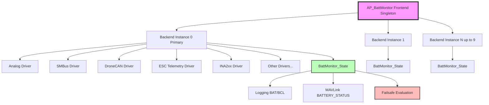

# AP_BattMonitor - Battery Monitoring Subsystem

## Overview

AP_BattMonitor is ArduPilot's centralized battery monitoring subsystem that provides real-time voltage, current, and capacity tracking across multiple battery types and monitoring methods. The library implements a frontend-backend architecture managing up to 9 simultaneous battery instances with type-specific drivers for various sensing hardware.

The battery monitor is critical for:
- Flight time estimation and mission planning
- Battery failsafe triggers (low voltage, low capacity, critical conditions)
- Power consumption tracking and logging
- Pre-arm safety checks
- Multi-battery system management
- Integration with ground control stations via MAVLink

## Architecture

The AP_BattMonitor library follows a frontend-backend design pattern where a singleton frontend (`AP_BattMonitor`) manages multiple backend instances, each representing a specific battery monitoring method:



### Key Architecture Components

**Frontend (AP_BattMonitor)**:
- Singleton accessible via `AP::battery()`
- Manages array of backend drivers and state structures
- Periodic `read()` called at ~10Hz by vehicle code
- Evaluates failsafe conditions across all instances
- Generates MAVLink telemetry messages
- Writes binary log messages (BAT, BCL)
- Primary instance concept (instance 0) for vehicle control decisions

**Backend Interface (AP_BattMonitor_Backend)**:
- Abstract base class defining driver contract
- Pure virtual methods: `read()`, `has_current()`
- Optional capabilities: cell voltages, temperature, cycle count, time remaining
- Shared algorithms: capacity remaining percentage, resistance estimation
- Failsafe helper methods and state updates

**Battery State (BattMonitor_State)**:
- Voltage, current, consumed mAh/Wh
- Cell voltages array (up to 12-14 cells depending on build)
- Temperature, resistance estimates
- Resting voltage estimate (sag-compensated)
- Failsafe level and health status
- Time remaining and state of health percentage

## Key Components

### Frontend (AP_BattMonitor)

The frontend manages multiple battery monitor instances and provides a unified interface to vehicle code.

**Primary Responsibilities**:
- Instance Management: Allocate and initialize up to 9 battery backends
- Periodic Updates: Call `read()` on all backends at ~10Hz
- Failsafe Coordination: Evaluate voltage/capacity thresholds and trigger appropriate actions
- Telemetry Generation: Create MAVLink BATTERY_STATUS messages for all instances
- Logging: Write BAT (battery) and BCL (battery cells) binary log messages
- Multi-Battery Logic: Implement primary instance concept and aggregate monitoring

**Key Methods**:
- `init()`: Detect and initialize all configured battery monitors
- `read()`: Update all battery states (called at 10Hz)
- `voltage(instance)`: Get current voltage for a battery instance
- `current_amps(current, instance)`: Get instantaneous current draw
- `consumed_mah(mah, instance)`: Get total consumed capacity
- `capacity_remaining_pct(percentage, instance)`: Get remaining capacity percentage
- `healthy(instance)`: Check if monitor is functioning correctly
- `check_failsafes()`: Evaluate and trigger battery failsafe actions

**Primary Instance Concept**:
Instance 0 is designated as the primary battery and is used for:
- Vehicle control decisions and flight time estimation
- Pre-arm battery checks
- Primary BATTERY_STATUS MAVLink message
- Default values when instance parameter is omitted

Source: `libraries/AP_BattMonitor/AP_BattMonitor.h`, `libraries/AP_BattMonitor/AP_BattMonitor.cpp`

### Backend Interface (AP_BattMonitor_Backend)

Abstract base class that all battery monitor drivers must implement.

**Mandatory Interface Methods**:
- `read()`: Pure virtual - read latest voltage/current from hardware
- `has_current()`: Pure virtual - return true if current measurement available

**Optional Capability Methods**:
- `has_cell_voltages()`: Return true if individual cell voltages available
- `has_temperature()`: Return true if temperature measurement available
- `get_temperature(temperature)`: Retrieve battery temperature
- `has_time_remaining()`: Return true if backend can estimate remaining flight time
- `has_consumed_energy()`: Return true if watt-hour tracking available
- `get_cycle_count(cycles)`: Retrieve battery charge cycle count (smart batteries)

**Shared Algorithm Methods**:
- `capacity_remaining_pct(percentage)`: Calculate remaining capacity percentage from consumed mAh and pack capacity
- `voltage_resting_estimate()`: Estimate voltage with current-induced sag removed using resistance model
- `update_resistance_estimate()`: Update internal resistance estimate by comparing loaded vs resting voltage
- `update_failsafes()`: Check voltage/capacity against thresholds and return failsafe level

**Helper Methods**:
- `calculate_mah(amps, dt_us)`: Convert current and time delta to milliamp-hours
- `Log_Write_BAT()`: Write battery log message
- `Log_Write_BCL()`: Write battery cells log message
- `arming_checks()`: Verify battery state meets arming requirements

Source: `libraries/AP_BattMonitor/AP_BattMonitor_Backend.h`, `libraries/AP_BattMonitor/AP_BattMonitor_Backend.cpp`

### Battery State (BattMonitor_State)

Structure containing all monitored battery parameters and health status.

**Electrical Measurements**:
- `voltage`: Battery pack voltage in volts
- `current_amps`: Instantaneous current draw in amperes
- `consumed_mah`: Total current drawn since startup in milliamp-hours
- `consumed_wh`: Total energy consumed since startup in watt-hours
- `cell_voltages`: Array of individual cell voltages in millivolts (up to 12-14 cells)

**Derived Estimates**:
- `voltage_resting_estimate`: Voltage with current-induced sag removed (volts)
- `resistance`: Internal battery resistance in ohms
- `time_remaining`: Estimated remaining battery time in seconds
- `state_of_health_pct`: Battery state of health as percentage (0-100)

**Status and Health**:
- `healthy`: True if monitor is communicating correctly
- `last_healthy_ms`: Timestamp when monitor was last healthy
- `failsafe`: Current failsafe severity level (None/Unhealthy/Low/Critical)
- `low_voltage_start_ms`: Timer for low voltage failsafe delay
- `critical_voltage_start_ms`: Timer for critical voltage failsafe

**Metadata**:
- `temperature`: Battery temperature in degrees Celsius
- `instance`: Backend instance number (0-8)
- `type`: Allocated monitor type (Analog, SMBus, DroneCAN, etc.)
- `last_time_micros`: Timestamp of last measurement update

Source: `libraries/AP_BattMonitor/AP_BattMonitor.h:105-134`

## Voltage and Current Sensing Methods

AP_BattMonitor supports numerous hardware interfaces for battery monitoring, each implemented as a backend driver.

### 1. Analog Sensing (AP_BattMonitor_Analog)

**Method**: Direct analog-to-digital conversion of voltage divider and current shunt signals.

**Hardware Configuration**:
- Voltage measurement: Voltage divider network → ADC pin
- Current measurement: Hall effect sensor or shunt resistor → current amplifier → ADC pin
- Low-pass filtering applied for noise reduction

**Measurement Equations**:
```
Measured Voltage (V) = ADC Reading × BATT_VOLT_MULT
Measured Current (A) = (ADC Reading - BATT_AMP_OFFSET) × BATT_AMP_PERVOLT
```

**Required Parameters**:
- `BATT_VOLT_PIN`: ADC pin number for voltage measurement
- `BATT_VOLT_MULT`: Voltage divider scaling factor
- `BATT_CURR_PIN`: ADC pin number for current measurement
- `BATT_AMP_PERVOLT`: Current sensor gain (amps per volt)
- `BATT_AMP_OFFSET`: Current sensor zero-current offset voltage

**Calibration Procedure**:
1. Measure actual battery voltage with calibrated multimeter
2. Compare with reported voltage in ground control station
3. Calculate: `new_BATT_VOLT_MULT = old_BATT_VOLT_MULT × (actual_voltage / reported_voltage)`
4. For current: Apply known load, measure actual current, adjust BATT_AMP_PERVOLT
5. For current offset: With no load, adjust BATT_AMP_OFFSET until current reads 0.0A

**Use Cases**: Simple analog power modules, AttoPilot high-current sensors, DIY voltage/current sensing boards

**Type Parameter Values**:
- Type 3: `ANALOG_VOLTAGE_ONLY` - Voltage measurement only, no current
- Type 4: `ANALOG_VOLTAGE_AND_CURRENT` - Both voltage and current
- Type 31: `ANALOG_CURRENT_ONLY` - Current measurement only (unusual configuration)

Source: `libraries/AP_BattMonitor/AP_BattMonitor_Analog.h`, `libraries/AP_BattMonitor/AP_BattMonitor_Analog.cpp`

### 2. Synthetic Current (AP_BattMonitor_Synthetic_Current)

**Method**: Estimate current from voltage sag and throttle when no current sensor is present.

**Algorithm**:
- Derives from Analog backend (voltage measurement required)
- Synthesizes current based on: voltage drop from resting, throttle percentage, battery characteristics
- Uses empirical model: `Current ≈ f(voltage_drop, throttle_percent, max_voltage, load_characteristics)`

**Use Cases**: 
- Voltage-only power modules where current sensing is unavailable
- Approximate current estimation for capacity tracking
- Emergency fallback when current sensor fails

**Limitations**:
- Accuracy depends on vehicle load characteristics and battery internal resistance
- Not suitable for precision power analysis or accurate failsafe triggers
- Requires voltage measurement and throttle input

**Type Parameter**: Type 25: `Analog_Volt_Synthetic_Current`

Source: `libraries/AP_BattMonitor/AP_BattMonitor_Synthetic_Current.h`, `libraries/AP_BattMonitor/AP_BattMonitor_Synthetic_Current.cpp`

### 3. I2C/SMBus Smart Batteries

#### Generic SMBus (AP_BattMonitor_SMBus_Generic)

**Protocol**: Smart Battery Data Specification (SBS) Rev 1.1 via SMBus/I2C

**Standard Register Reads**:
- `0x09`: Voltage (mV)
- `0x0A`: Current (mA, signed - negative = charging)
- `0x0E`: RelativeStateOfCharge (%)
- `0x0F`: RemainingCapacity (mAh)
- `0x10`: FullChargeCapacity (mAh)
- `0x08`: Temperature (0.1K units)
- `0x17`: CycleCount
- `0x1C-0x1F`: Cell1-Cell4 voltages (mV)

**Advanced Features**:
- Packet Error Code (PEC/CRC-8) auto-detection and validation
- Automatic cell count detection (supports 2S to 12S/14S depending on build)
- 5-second communication timeout for health monitoring
- State of Health (SoH) calculation from FullChargeCapacity vs DesignCapacity

**I2C Configuration**:
- Default address: 0x0B (7-bit)
- Configurable via `BATT_I2C_BUS` and `BATT_I2C_ADDR` parameters
- Standard SMBus timing (100kHz or 400kHz I2C clock)

**Type Parameter**: Type 7: `SMBus_Generic`

Source: `libraries/AP_BattMonitor/AP_BattMonitor_SMBus.h`, `libraries/AP_BattMonitor/AP_BattMonitor_SMBus_Generic.cpp`

#### Vendor-Specific SMBus Variants

**Maxell (Type 16)**:
- 2× capacity scaling factor applied to all capacity readings
- Otherwise compatible with generic SMBus protocol

**Rotoye Batmon (Type 19)**:
- Dual temperature sensors (internal and external)
- Extended register set for advanced battery management
- SOH and cycle count support

**3DR Solo (Type 5)**:
- Extended register set specific to 3DR Solo smart battery
- Button press detection for power-on/power-off sequences
- Custom status registers

**SUI 3-cell/6-cell (Types 13, 14)**:
- Fixed cell count (3S or 6S)
- No PEC/CRC-8 error checking
- Simplified register set

**NeoDesign (Type 15)**:
- Support for up to 10 cells
- Custom register layout
- Extended telemetry capabilities

Source: Various files in `libraries/AP_BattMonitor/AP_BattMonitor_SMBus_*.cpp`

### 4. Precision I2C Power Monitors

#### INA2xx Family (AP_BattMonitor_INA2XX)

**Supported Devices**: INA226, INA228, INA238, INA231

**Measurement Method**: High-precision shunt resistor current sensing with integrated voltage measurement

**Features**:
- 16-bit or higher ADC resolution
- Auto-detection across multiple I2C addresses (0x40-0x4F)
- Configurable shunt resistor value
- Programmable current range and averaging
- Continuous monitoring mode

**Calibration**:
```
Current_LSB = Max_Expected_Current_A / 32768
Power_LSB = 25 × Current_LSB
Calibration_Register = 0.00512 / (Current_LSB × Shunt_Resistance_Ohms)
```

**Configuration Parameters**:
- `BATT_INA2XX_ADDR`: I2C address (0x40-0x4F)
- `BATT_INA2XX_RSHUNT`: Shunt resistor value in ohms (e.g., 0.0005 for 0.5mΩ)
- `BATT_INA2XX_MAX_A`: Maximum expected current in amperes (for range configuration)

**Voltage Range**: Up to 36V bus voltage (device-dependent)

**Type Parameter**: Type 21: `INA2XX`

Source: `libraries/AP_BattMonitor/AP_BattMonitor_INA2XX.h`, `libraries/AP_BattMonitor/AP_BattMonitor_INA2XX.cpp`

#### INA239 SPI (AP_BattMonitor_INA239)

**Interface**: SPI instead of I2C (higher speed, lower latency)

**Features**:
- Similar measurement capabilities to INA2xx
- SPI communication for faster updates
- Must be configured in board hwdef.dat file
- Lower CPU overhead than I2C polling

**Configuration**: Hardware-specific, defined in board definition files

**Type Parameter**: Type 26: `INA239_SPI`

Source: `libraries/AP_BattMonitor/AP_BattMonitor_INA239.h`, `libraries/AP_BattMonitor/AP_BattMonitor_INA239.cpp`

#### INA3221 Triple-Channel Monitor (AP_BattMonitor_INA3221)

**Features**:
- 3-channel simultaneous monitoring
- Shared device across multiple battery instances
- Sequential channel measurement
- I2C interface

**Use Case**: Monitor multiple batteries or power domains with single sensor IC

**Type Parameter**: Type 30: `INA3221`

Source: `libraries/AP_BattMonitor/AP_BattMonitor_INA3221.h`, `libraries/AP_BattMonitor/AP_BattMonitor_INA3221.cpp`

#### LTC2946 (AP_BattMonitor_LTC2946)

**Device**: Linear Technology wide-range power monitor

**Features**:
- I2C interface with charge accumulation
- High-voltage capability
- Integrated charge/energy accumulation registers

**Type Parameter**: Type 22: `LTC2946`

Source: `libraries/AP_BattMonitor/AP_BattMonitor_LTC2946.h`, `libraries/AP_BattMonitor/AP_BattMonitor_LTC2946.cpp`

#### AD7091R5 ADC Extender (AP_BattMonitor_AD7091R5)

**Device**: 4-channel I2C ADC

**Use Case**: Expand analog input capability for monitoring multiple analog batteries

**Features**:
- 12-bit resolution
- 4 differential or single-ended channels
- I2C interface

**Type Parameter**: Type 28: `AD7091R5`

Source: `libraries/AP_BattMonitor/AP_BattMonitor_AD7091R5.h`, `libraries/AP_BattMonitor/AP_BattMonitor_AD7091R5.cpp`

### 5. DroneCAN/UAVCAN (AP_BattMonitor_DroneCAN)

**Protocol**: DroneCAN (formerly UAVCAN) BatteryInfo and BatteryInfoAux messages over CAN bus

**Message Types**:
- `uavcan.equipment.power.BatteryInfo`: Primary battery data
  - Voltage, current, temperature
  - State of Charge (SoC), State of Health (SoH)
  - Status flags (charging, charged, hot, cold)
- `ardupilot.equipment.power.BatteryInfoAux`: Extended data
  - Individual cell voltages
  - Cycle count
  - Over-temperature, over-current flags
  - Nominal voltage rating

**Advanced Features**:
- MPPT (Maximum Power Point Tracking) solar charge controller support
- Enable/disable power control via CAN RPC (Remote Procedure Call)
- Fault flag reporting (over-voltage, over-current, over-temperature, under-temperature)
- Hot-swappable battery detection with dynamic node ID updates (if enabled via options)

**Communication**:
- 5-second message timeout triggers "Unhealthy" failsafe
- Multiple batteries on same CAN bus supported via node IDs
- Priority-based CAN message arbitration

**MPPT Control Options** (via BATT_OPTIONS parameter):
- Use input voltage/current (solar panel) instead of output (battery)
- Power off at disarm, power on at arm
- Power off/on at boot

**Type Parameter**: Type 8: `UAVCAN_BatteryInfo` (legacy name, also called DroneCAN)

Source: `libraries/AP_BattMonitor/AP_BattMonitor_DroneCAN.h`, `libraries/AP_BattMonitor/AP_BattMonitor_DroneCAN.cpp`

### 6. ESC Telemetry Aggregation (AP_BattMonitor_ESC)

**Method**: Aggregate voltage, current, temperature from multiple Electronic Speed Controllers

**Data Sources**:
- BLHeli_32 / BLHeli_S ESC telemetry (via serial passthrough)
- DroneCAN ESC telemetry
- Custom ESC telemetry protocols

**Aggregation Algorithm**:
- **Voltage**: Average across all selected ESCs
- **Current**: Sum across all selected ESCs
- **Temperature**: Maximum temperature across all ESCs (worst-case)
- **Consumed mAh**: Cumulative sum from ESC internal counters

**ESC Selection**:
- `BATT_ESC_MASK` parameter: Bitmask selecting which ESCs to include
  - Bit 0 (value 1): ESC 1
  - Bit 1 (value 2): ESC 2
  - Bit 2 (value 4): ESC 3
  - Bit 3 (value 8): ESC 4
  - Example: BATT_ESC_MASK = 15 (0b1111) = ESCs 1-4

**Use Cases**:
- Multi-rotor systems where ESCs provide integrated power monitoring
- Eliminates need for separate power module
- Provides per-motor current visibility (in ESC telemetry, not battery monitor)

**Limitations**:
- Requires ESCs with telemetry capability
- Voltage measurement may have noise from PWM switching
- Current accuracy depends on ESC calibration

**Type Parameter**: Type 9: `BLHeliESC`

Source: `libraries/AP_BattMonitor/AP_BattMonitor_ESC.h`, `libraries/AP_BattMonitor/AP_BattMonitor_ESC.cpp`

### 7. Platform-Specific Implementations

#### Bebop/Disco (AP_BattMonitor_Bebop)

**Platform**: Parrot Bebop and Parrot Disco fixed-wing

**Method**: Integration with BLDC motor telemetry system

**Features**:
- Voltage compensation based on motor RPM
- Platform-specific calibration
- Direct hardware integration

**Type Parameter**: Type 6: `BEBOP`

Source: `libraries/AP_BattMonitor/AP_BattMonitor_Bebop.h`, `libraries/AP_BattMonitor/AP_BattMonitor_Bebop.cpp`

#### Torqeedo (AP_BattMonitor_Torqeedo)

**Platform**: Torqeedo electric outboard motors for marine vehicles

**Method**: Integration with Torqeedo battery and motor management system via AP_Torqeedo library

**Features**:
- Marine-grade battery monitoring
- Motor and battery thermal management
- Propulsion system integration

**Type Parameter**: Type 23: `Torqeedo`

Source: `libraries/AP_BattMonitor/AP_BattMonitor_Torqeedo.h`, `libraries/AP_BattMonitor/AP_BattMonitor_Torqeedo.cpp`

### 8. Fuel Monitoring

#### Fuel Flow (AP_BattMonitor_FuelFlow)

**Method**: PWM pulse counting from fuel flow sensor via GPIO interrupt

**Measurement**:
- Count pulses per unit time
- Convert to flow rate (pulses per second → liters per hour)
- Integrate flow rate to calculate consumed volume
- Map consumed volume to capacity percentage

**Calibration**: `pulses_per_liter` parameter

**Use Cases**: Internal combustion engine (ICE) fuel monitoring, generator fuel tracking

**Type Parameter**: Type 11: `FuelFlow`

Source: `libraries/AP_BattMonitor/AP_BattMonitor_FuelFlow.h`, `libraries/AP_BattMonitor/AP_BattMonitor_FuelFlow.cpp`

#### Fuel Level Analog (AP_BattMonitor_FuelLevel_Analog)

**Method**: Analog resistive fuel level sensor reading

**Features**:
- Polynomial curve fitting for non-linear tank geometry
- Low-pass filtering for fuel slosh compensation
- Configurable sensor resistance range

**Calibration**: Multi-point curve fitting to match tank shape

**Type Parameter**: Type 24: `FuelLevel_Analog`

Source: `libraries/AP_BattMonitor/AP_BattMonitor_FuelLevel_Analog.h`, `libraries/AP_BattMonitor/AP_BattMonitor_FuelLevel_Analog.cpp`

#### Fuel Level PWM (AP_BattMonitor_FuelLevel_PWM)

**Method**: PWM-encoded fuel level sensor

**Measurement**: Decode PWM duty cycle or frequency to fuel level percentage

**Type Parameter**: Type 12: `FuelLevel_PWM`

Source: `libraries/AP_BattMonitor/AP_BattMonitor_FuelLevel_PWM.h`, `libraries/AP_BattMonitor/AP_BattMonitor_FuelLevel_PWM.cpp`

### 9. System Integration

#### Generator Integration (AP_BattMonitor_Generator)

**Method**: Monitor generator electrical output and fuel consumption via AP_Generator library

**Monitoring**:
- Electrical output (voltage/current) - Type 17: `GENERATOR_ELEC`
- Fuel level/consumption - Type 18: `GENERATOR_FUEL`

**Use Cases**: Hybrid power systems, long-endurance applications

Source: `libraries/AP_BattMonitor/AP_BattMonitor_Generator.h`, `libraries/AP_BattMonitor/AP_BattMonitor_Generator.cpp`

#### EFI Integration (AP_BattMonitor_EFI)

**Method**: Fuel consumption tracking from Electronic Fuel Injection system

**Features**:
- Maps EFI fuel usage to battery-style capacity metrics
- Integration with AP_EFI library

**Use Cases**: ICE-powered vehicles with EFI systems

**Type Parameter**: Type 27: `EFI`

Source: `libraries/AP_BattMonitor/AP_BattMonitor_EFI.h`, `libraries/AP_BattMonitor/AP_BattMonitor_EFI.cpp`

### 10. Scripting Interface (AP_BattMonitor_Scripting)

**Method**: Lua scripting API for custom battery driver implementation

**Capabilities**:
- Custom battery drivers without C++ code changes
- Script provides: voltage, current, cell voltages, temperature, SoC, consumed mAh
- Asynchronous updates via `handle_scripting()` method

**Use Cases**:
- Prototype custom battery integration
- Support unusual battery monitoring hardware
- Research and development

**Type Parameter**: Type 29: `Scripting`

Source: `libraries/AP_BattMonitor/AP_BattMonitor_Scripting.h`, `libraries/AP_BattMonitor/AP_BattMonitor_Scripting.cpp`

### 11. Sum/Aggregate (AP_BattMonitor_Sum)

**Method**: Combine multiple battery monitor instances into aggregate view

**Aggregation Rules**:
- **Voltage**: Minimum across selected batteries (conservative safety measure)
  - Or average if `BATT_OPTIONS` bit 9 cleared
- **Current**: Sum across selected batteries (total system draw)
- **Capacity**: Sum across selected batteries (parallel pack capacity)
- **Consumed mAh**: Sum across selected batteries

**Configuration**:
- `BATT_SUM_MASK` parameter: Bitmask selecting which battery instances to aggregate
  - Bit 0 (value 1): Instance 0
  - Bit 1 (value 2): Instance 1
  - Example: BATT_SUM_MASK = 3 (0b11) = Instances 0 and 1

**Use Cases**:
- Parallel battery pack configurations
- Multi-battery redundancy monitoring
- Total system power consumption view

**Type Parameter**: Type 10: `Sum`

Source: `libraries/AP_BattMonitor/AP_BattMonitor_Sum.h`, `libraries/AP_BattMonitor/AP_BattMonitor_Sum.cpp`

## Capacity Estimation and Consumed mAh Tracking

Accurate capacity tracking is essential for flight time estimation and capacity-based failsafes.

### Capacity Integration Algorithm

The battery monitor continuously integrates current over time to calculate consumed capacity.

**Core Integration Method** (in `update_consumed` helper):

```cpp
consumed_mah += calculate_mah(current_amps, dt_us)
consumed_wh += current_amps * voltage * dt_us / 3600.0 / 1e6
```

Where:
- `calculate_mah(amps, dt_us) = amps × dt_us × 0.0000002778`
- `dt_us` = time since last update in microseconds
- Constant `0.0000002778 = 1 / 3600 / 1000000` converts ampere-microseconds to milliamp-hours
- Update rate: typically 10Hz (100ms between updates)

**Mathematical Foundation**:
```
Energy (mAh) = ∫ Current(t) dt
            = Current_avg × Time_hours × 1000
            = Current_amps × Time_microseconds × (1/3600) × (1/1000000) × 1000
            = Current_amps × Time_microseconds × 0.0000002778
```

**Capacity Remaining Calculation**:

```cpp
capacity_remaining_mah = pack_capacity_mah - consumed_mah
capacity_remaining_pct = 100.0 * capacity_remaining_mah / pack_capacity_mah
```

Where:
- `pack_capacity_mah` = BATT_CAPACITY parameter (user-configured)
- Result clamped to 0-100% range

**Time Remaining Estimate**:

```cpp
if (current_amps > 0.0) {
    time_remaining_seconds = (capacity_remaining_mah / (current_amps * 1000.0)) * 3600.0
}
```

Simplified: `time_remaining = remaining_mAh / (current_A × 1000) × 3600`

**Limitations**:
- Assumes constant current draw (actual varies with flight mode, wind, etc.)
- Does not account for battery voltage sag reducing usable capacity
- No Peukert effect compensation (capacity reduction at high discharge rates)

Source: `libraries/AP_BattMonitor/AP_BattMonitor_Backend.cpp:update_consumed()`

### Internal Resistance Estimation

The backend continuously estimates battery internal resistance by comparing loaded voltage with resting voltage estimate.

**Resistance Calculation**:

```cpp
resistance = (voltage_resting - voltage_loaded) / current_amps
```

Where:
- `voltage_loaded` = measured voltage under current draw
- `voltage_resting` = estimated open-circuit voltage (no load)
- `current_amps` = instantaneous current draw

**Resting Voltage Estimation**:

Uses two-time-constant complementary filter to estimate voltage without load:

```cpp
voltage_resting_estimate = voltage_loaded + current_amps * resistance
```

**Filter Time Constants**:
- TC1 = 0.5 seconds (fast response, tracks recent changes)
- TC2 = 0.1 seconds (slow/stable baseline)
- Defined as `AP_BATT_MONITOR_RES_EST_TC_1` and `AP_BATT_MONITOR_RES_EST_TC_2`

**Purpose**:
- Compensate voltage sag for more accurate low-voltage failsafe detection
- Provide resting voltage estimate to GCS for better state-of-charge indication
- Estimate battery age and health (resistance increases with age)

**Typical Resistance Values**:
- New LiPo batteries: 5-15 mΩ depending on capacity and C-rating
- Aged batteries: 20-50+ mΩ
- High resistance indicates battery degradation or poor connections

Source: `libraries/AP_BattMonitor/AP_BattMonitor_Backend.cpp:update_resistance_estimate()`

### Consumed Capacity Reset

Capacity can be manually reset during flight (e.g., battery hot-swap, manual correction).

**Reset Method**:
```cpp
bool reset_remaining(uint8_t instance, float percentage)
```

**Calculation**:
```cpp
consumed_mah = pack_capacity_mah * (1.0 - percentage / 100.0)
consumed_wh = consumed_mah * voltage / 1000.0
```

**Use Cases**:
- Battery replacement mid-mission
- Manual correction if capacity estimate drifts
- Ground control station override

## Failsafe Triggers

Battery failsafes protect the vehicle by triggering safe actions when battery state becomes critical.

### Failsafe Severity Levels

The `Failsafe` enum defines escalating severity levels:

```cpp
enum class Failsafe : uint8_t {
    None = 0,        // Normal operation
    Unhealthy,       // Communication lost or invalid data
    Low,             // Low voltage or low capacity
    Critical         // Critical voltage or critical capacity
};
```

**Escalation-Only Rule**: Failsafe severity can only increase, never decrease during a flight. Once a Critical failsafe is triggered, the system remains in Critical state even if conditions improve.

**Rationale**: Prevents oscillation between failsafe states and ensures conservative safety decisions. A battery showing critical voltage once is considered unreliable for the remainder of the flight.

Source: `libraries/AP_BattMonitor/AP_BattMonitor.h:78-83`

### Voltage-Based Failsafes

#### Low Voltage Failsafe

**Trigger Conditions**:
- Measured voltage < `BATT_LOW_VOLT` threshold
- Condition persists for `BATT_LOW_TIMEOUT` seconds (default 10 seconds)
- Voltage source selected by `BATT_LOW_TYPE` parameter

**Voltage Source Options** (`BATT_LOW_TYPE`):
- **0 = Raw Voltage**: Use measured voltage directly
  - Pros: Simple, no calculation required
  - Cons: Triggers prematurely under high current draw due to voltage sag
- **1 = Sag-Compensated Voltage**: Use resistance-compensated resting voltage estimate
  - Pros: More accurate indication of true battery state
  - Cons: Requires stable resistance estimate, may delay failsafe

**Configuration Parameters**:
- `BATT_LOW_VOLT`: Voltage threshold in volts (e.g., 14.0V for 4S LiPo)
- `BATT_LOW_TIMEOUT`: Delay in seconds before triggering (0-120 seconds, default 10)
- `BATT_LOW_TYPE`: Voltage measurement source (0=Raw, 1=Sag-Compensated)
- `BATT_FS_LOW_ACT`: Action to perform (see Failsafe Actions below)

**Hysteresis**: Once triggered, requires voltage recovery above threshold plus small margin before clearing (prevents oscillation).

**Typical Values** (4S LiPo, 3.5V/cell low threshold):
- `BATT_LOW_VOLT = 14.0` (4 × 3.5V)
- `BATT_LOW_TIMEOUT = 10` (10-second delay reduces false triggers)
- `BATT_LOW_TYPE = 1` (use sag-compensated for accuracy)

#### Critical Voltage Failsafe

**Trigger Conditions**:
- Measured voltage < `BATT_CRT_VOLT` threshold
- **Immediately triggered** (no timeout delay)
- Always uses raw measured voltage (no sag compensation option)

**Configuration Parameters**:
- `BATT_CRT_VOLT`: Critical voltage threshold in volts (e.g., 12.8V for 4S LiPo)
- `BATT_FS_CRT_ACT`: Action to perform (typically Land or Terminate)

**Rationale for Immediate Trigger**: Critical voltage indicates battery is at the edge of damage or complete power loss. Immediate action required to protect vehicle and battery.

**Typical Values** (4S LiPo, 3.2V/cell critical threshold):
- `BATT_CRT_VOLT = 12.8` (4 × 3.2V)
- Below this voltage: risk of battery damage, voltage collapse, or sudden power loss

**LiPo Battery Voltage Guidelines**:
- Fully Charged: 4.2V/cell (16.8V for 4S)
- Nominal: 3.7V/cell (14.8V for 4S)
- Low: 3.5V/cell (14.0V for 4S) - Land soon
- Critical: 3.2V/cell (12.8V for 4S) - Land immediately
- Damage Threshold: 3.0V/cell (12.0V for 4S) - Battery damage occurs below this

Source: `libraries/AP_BattMonitor/AP_BattMonitor_Backend.cpp:update_failsafes()`

### Capacity-Based Failsafes

#### Low Capacity Failsafe

**Trigger Conditions**:
- `capacity_remaining_pct < (BATT_LOW_MAH / BATT_CAPACITY) × 100`
- Equivalently: `consumed_mah > (BATT_CAPACITY - BATT_LOW_MAH)`

**Configuration Parameters**:
- `BATT_LOW_MAH`: Remaining capacity in mAh to trigger low failsafe
- `BATT_CAPACITY`: Total pack capacity in mAh
- `BATT_FS_LOW_ACT`: Action to perform

**Example**:
- `BATT_CAPACITY = 5000` mAh (5Ah battery)
- `BATT_LOW_MAH = 1000` mAh (trigger when 1Ah remains)
- Failsafe triggers when: consumed_mah ≥ 4000 mAh (80% consumed)

#### Critical Capacity Failsafe

**Trigger Conditions**:
- `capacity_remaining_pct < (BATT_CRT_MAH / BATT_CAPACITY) × 100`
- Typically set to reserve capacity (e.g., 500mAh minimum to land safely)

**Configuration Parameters**:
- `BATT_CRT_MAH`: Remaining capacity in mAh to trigger critical failsafe
- `BATT_FS_CRT_ACT`: Action to perform (typically Land)

**Reserve Capacity Planning**:
- Calculate landing time at hover (e.g., 2 minutes)
- Calculate landing current draw (e.g., 15A at hover)
- Reserve = landing_time × landing_current = 2 min × 15A = 0.5Ah = 500mAh
- Set `BATT_CRT_MAH = 500`

### Failsafe Actions

Configured via `BATT_FS_LOW_ACT` and `BATT_FS_CRT_ACT` parameters:

| Value | Action | Description |
|-------|--------|-------------|
| 0 | None | Warning only - GCS notification, no vehicle action |
| 1 | Land | Initiate landing at current location |
| 2 | RTL | Return to Launch point, then land |
| 3 | SmartRTL | Return via recorded path, fallback to RTL if path unavailable |
| 4 | Terminate | **Motor cutoff** - use with extreme caution, vehicle will fall |

**Failsafe Action Priority**: If multiple batteries trigger different failsafe levels, the highest severity action is executed. Priority array passed to AP_BattMonitor during initialization determines action precedence.

**Vehicle-Specific Failsafe Handler**:

The vehicle implements a callback to execute failsafe actions:

```cpp
void vehicle::failsafe_battery_event(const char* type_str, const int8_t action) {
    // type_str: "Low" or "Critical"
    // action: configured failsafe action value
    // Vehicle executes mode change, landing sequence, etc.
}
```

Source: `libraries/AP_BattMonitor/AP_BattMonitor.cpp:check_failsafes()`

### Unhealthy Failsafe

**Trigger Conditions**:
- Communication timeout (no data received for 5 seconds)
- Invalid data detected (CRC errors, out-of-range values)
- Backend-specific health checks fail

**Behavior**:
- Marks instance as unhealthy
- May trigger failsafe action depending on vehicle configuration
- Logs error messages for troubleshooting

### Pre-Arm Checks

Battery monitors perform pre-arm safety checks:

**Voltage Check**:
- `voltage >= BATT_ARM_VOLT` (if configured, 0 = disabled)
- Ensures sufficient voltage to safely arm and takeoff

**Capacity Check**:
- `capacity_remaining_mah >= BATT_ARM_MAH` (if configured, 0 = disabled)
- Ensures sufficient capacity for flight

**Health Check**:
- Battery monitor must be healthy (communicating, valid data)
- No pre-existing failsafe condition

**Configuration Parameters**:
- `BATT_ARM_VOLT`: Minimum voltage required to arm (0 = disabled)
- `BATT_ARM_MAH`: Minimum remaining capacity required to arm (0 = disabled)

**Arming Prevention**: If checks fail, vehicle refuses to arm and displays error message to pilot.

## Multi-Battery Support

AP_BattMonitor supports monitoring up to 9 independent battery instances simultaneously.

### Instance Management

**Maximum Instances**: `AP_BATT_MONITOR_MAX_INSTANCES = 9` (instances 0-8)

**Instance Allocation**:
- Each instance has independent backend driver
- Each instance has independent BattMonitor_State
- Each instance has independent parameter set (BATT, BATT2, ..., BATT9)
- Instances are numbered 0-8 internally, displayed as 1-9 to users

**Backend Selection Per Instance**:
```
Instance 0: BATT_MONITOR parameter selects type
Instance 1: BATT2_MONITOR parameter selects type  
Instance 2: BATT3_MONITOR parameter selects type
...
Instance 8: BATT9_MONITOR parameter selects type
```

### Primary Instance Concept

**Instance 0 = Primary Battery**: Special designation for vehicle control decisions

**Primary Instance Used For**:
- Flight time estimation and mission planning
- Battery failsafe evaluation for vehicle-level actions
- Pre-arm battery checks
- Default values when instance parameter omitted from API calls
- Primary MAVLink BATTERY_STATUS message (id=0)

**API Design**:
```cpp
// Explicit instance:
float voltage_battery_2 = AP::battery().voltage(1);  // Instance 1 (BATT2)

// Implicit primary (instance 0):
float voltage_primary = AP::battery().voltage();     // Defaults to instance 0
```

**Rationale**: Vehicles need a single authoritative battery for critical flight decisions, while secondary batteries provide additional monitoring.

### Secondary Instances

**Use Cases**:
- Payload power monitoring (camera, gimbal, etc.)
- Redundant battery systems (separate backup battery)
- Parallel battery packs (monitor each pack independently, use Sum backend for aggregate)
- Multi-battery vehicles (e.g., VTOL with separate lift and cruise batteries)

**Failsafe Evaluation**:
- Each instance evaluated independently
- Failsafes can be configured per instance
- Vehicle receives failsafe notification for any instance
- Highest severity failsafe across all instances determines vehicle action

### Per-Instance Configuration

Each battery instance has a complete parameter set:

**Instance 0 Parameters**: `BATT_*`
**Instance 1 Parameters**: `BATT2_*`
**Instance 2 Parameters**: `BATT3_*`
...
**Instance 8 Parameters**: `BATT9_*`

**Example Multi-Battery Configuration**:
```
# Primary battery: Analog voltage+current
BATT_MONITOR = 4               # Analog Voltage and Current
BATT_CAPACITY = 5000           # 5000mAh
BATT_VOLT_PIN = 2              # Analog pin 2
BATT_CURR_PIN = 3              # Analog pin 3

# Secondary battery: SMBus smart battery
BATT2_MONITOR = 7              # SMBus Generic
BATT2_CAPACITY = 10000         # 10000mAh  
BATT2_I2C_BUS = 1              # External I2C bus
BATT2_I2C_ADDR = 11            # Address 0x0B

# Aggregate view: Sum of both batteries
BATT3_MONITOR = 10             # Sum
BATT3_SUM_MASK = 3             # Bits 0+1 = instances 0 and 1
```

### MAVLink Multi-Battery Telemetry

**BATTERY_STATUS Messages**:
- Separate message sent for each battery instance
- Message `id` field = instance number (0-8)
- Ground control station displays all batteries
- Update rate: typically 2Hz per instance

**SYS_STATUS Message**:
- Contains primary battery (instance 0) only
- Provides quick vehicle status overview
- `voltage_battery`, `current_battery`, `battery_remaining` fields

## Battery Parameter Configuration

Comprehensive parameter guide for configuring AP_BattMonitor.

### Essential Parameters

#### Type Selection

**BATT_MONITOR** (and BATT2_MONITOR, BATT3_MONITOR, ...):
- **Purpose**: Select battery monitor backend type
- **Default**: 0 (Disabled)
- **Common Values**:
  - 0 = Disabled
  - 3 = Analog Voltage Only
  - 4 = Analog Voltage and Current (most common analog)
  - 7 = SMBus Generic (smart batteries)
  - 8 = DroneCAN/UAVCAN
  - 9 = BLHeli ESC telemetry
  - 21 = INA2XX precision monitor
  - See AP_BattMonitor_Params.h for complete list

#### Capacity Configuration

**BATT_CAPACITY** (mAh):
- **Purpose**: Battery pack capacity in milliamp-hours
- **Critical**: Must account for reserve capacity not to be used
- **Example**: 5000 for 5Ah battery
- **Impact**: Affects capacity remaining percentage, time remaining estimate, capacity failsafes
- **Incorrect Value Symptoms**:
  - Percentage drops too quickly or slowly
  - Inaccurate time remaining estimates
  - Premature or delayed capacity failsafes

**Capacity Setting Strategy**:
- Option 1: Use full rated capacity, rely on voltage failsafes
- Option 2: Use reduced capacity (e.g., 80% of rated) to force capacity failsafe before voltage drops critically
- Recommendation: Set to usable capacity, not absolute maximum

#### Voltage Thresholds

**BATT_LOW_VOLT** (volts):
- **Purpose**: Low battery voltage threshold
- **Typical**: 3.5V/cell for LiPo (14.0V for 4S, 21.0V for 6S)
- **Action**: Triggers configured low failsafe action after timeout

**BATT_CRT_VOLT** (volts):
- **Purpose**: Critical battery voltage threshold  
- **Typical**: 3.2V/cell for LiPo (12.8V for 4S, 19.2V for 6S)
- **Action**: Immediately triggers critical failsafe action

**BATT_ARM_VOLT** (volts):
- **Purpose**: Minimum voltage required to arm
- **Typical**: 3.8V/cell for LiPo (15.2V for 4S, 22.8V for 6S)
- **Default**: 0 (disabled)
- **Safety**: Prevents arming with depleted battery

**Battery Chemistry Guidelines**:

| Chemistry | Nominal V/cell | Low V/cell | Critical V/cell | Full V/cell |
|-----------|----------------|------------|-----------------|-------------|
| LiPo      | 3.7V          | 3.5V       | 3.2V            | 4.2V        |
| LiFe      | 3.3V          | 3.0V       | 2.8V            | 3.6V        |
| Li-Ion    | 3.6V          | 3.3V       | 3.0V            | 4.1V        |

#### Capacity Thresholds

**BATT_LOW_MAH** (mAh):
- **Purpose**: Remaining capacity to trigger low failsafe
- **Example**: 1000 (trigger when 1000mAh remains)
- **Calculation**: If BATT_CAPACITY=5000 and BATT_LOW_MAH=1000, triggers at 80% consumed

**BATT_CRT_MAH** (mAh):
- **Purpose**: Remaining capacity to trigger critical failsafe
- **Example**: 500 (reserve for safe landing)
- **Calculation**: Reserve = landing_time_minutes × landing_current_amps × 60 / 1000

**BATT_ARM_MAH** (mAh):
- **Purpose**: Minimum remaining capacity required to arm
- **Example**: 4500 (require 90% capacity to takeoff)
- **Default**: 0 (disabled)

#### Failsafe Configuration

**BATT_LOW_TIMEOUT** (seconds):
- **Purpose**: Delay before triggering low voltage failsafe
- **Range**: 0-120 seconds
- **Default**: 10 seconds
- **Rationale**: Filters brief voltage sags during aggressive maneuvers
- **Setting**: Higher values reduce false positives, lower values provide earlier warning

**BATT_LOW_TYPE**:
- **Purpose**: Voltage source for low voltage detection
- **Values**:
  - 0 = Raw measured voltage
  - 1 = Sag-compensated resting voltage estimate (recommended)
- **Recommendation**: Use 1 for more accurate failsafe detection

**BATT_FS_LOW_ACT**:
- **Purpose**: Action when low battery failsafe triggers
- **Values**: 0=None, 1=Land, 2=RTL, 3=SmartRTL, 4=Terminate
- **Typical**: 2 (RTL - return home while battery sufficient)

**BATT_FS_CRT_ACT**:
- **Purpose**: Action when critical battery failsafe triggers
- **Values**: 0=None, 1=Land, 2=RTL, 3=SmartRTL, 4=Terminate
- **Typical**: 1 (Land - immediate landing, no time to return home)

### Analog-Specific Parameters

**BATT_VOLT_PIN**:
- **Purpose**: ADC pin number for voltage measurement
- **Typical**: 2, 10, 13 (board-dependent)
- **Special**: -1 = auto-detect, 0 = disabled

**BATT_VOLT_MULT**:
- **Purpose**: Voltage divider multiplier
- **Calculation**: `actual_voltage = adc_voltage × BATT_VOLT_MULT`
- **Typical**: 10.0-18.0 depending on voltage divider ratio
- **Calibration**: See Analog Calibration Procedure below

**BATT_CURR_PIN**:
- **Purpose**: ADC pin number for current measurement
- **Typical**: 3, 11, 14 (board-dependent)
- **Special**: -1 = no current sensor

**BATT_AMP_PERVOLT**:
- **Purpose**: Current sensor scaling factor (amps per volt)
- **Calculation**: `current_amps = (adc_voltage - offset) × BATT_AMP_PERVOLT`
- **Typical**: 17.0, 39.8, 90.0 (sensor-dependent)
- **Example**: AttoPilot 50A sensor = 37.8871, AttoPilot 90A = 39.8, AttoPilot 180A = 90.0

**BATT_AMP_OFFSET**:
- **Purpose**: Current sensor zero-current voltage offset
- **Typical**: 0.0-0.5V
- **Calibration**: With no current flow, adjust until current reads 0.0A

#### Analog Calibration Procedure

**Voltage Calibration**:
1. Connect fully charged battery
2. Measure actual voltage with calibrated multimeter at power module output
3. Note reported voltage in ground control station
4. Calculate: `new_BATT_VOLT_MULT = old_BATT_VOLT_MULT × (actual_voltage / reported_voltage)`
5. Set parameter and verify accuracy
6. Repeat if necessary

**Current Calibration** (Zero Offset):
1. Disconnect all loads (ensure zero current draw)
2. Power system with battery
3. Note reported current in ground control station
4. Adjust `BATT_AMP_OFFSET` until current reads 0.0A ± 0.1A
5. Typical adjustment: if reading +0.5A, increase offset by 0.5V / BATT_AMP_PERVOLT

**Current Calibration** (Scale Factor):
1. Connect calibrated load (e.g., 10A resistor or measured motor current)
2. Measure actual current with clamp meter
3. Note reported current in ground control station
4. Calculate: `new_BATT_AMP_PERVOLT = old_BATT_AMP_PERVOLT × (actual_current / reported_current)`
5. Set parameter and verify with different loads

### SMBus-Specific Parameters

**BATT_I2C_BUS**:
- **Purpose**: I2C bus number for SMBus battery
- **Values**: 0=Internal, 1=External, 2+=Additional buses (board-dependent)
- **Default**: 0

**BATT_I2C_ADDR**:
- **Purpose**: I2C address of smart battery
- **Default**: 11 (0x0B in hex)
- **Range**: 8-119 (valid I2C 7-bit addresses)

### INA2xx-Specific Parameters

**BATT_INA2XX_ADDR**:
- **Purpose**: I2C address of INA2xx device
- **Range**: 64-79 (0x40-0x4F in hex)
- **Default**: Auto-detect across range
- **Note**: Address determined by A0/A1 pins on INA2xx chip

**BATT_INA2XX_RSHUNT** (ohms):
- **Purpose**: Shunt resistor value
- **Typical**: 0.0001 to 0.01 ohms
- **Example**: 0.0005 (0.5 milliohm shunt)
- **Trade-off**: Lower resistance = less power loss, less voltage drop for measurement

**BATT_INA2XX_MAX_A** (amperes):
- **Purpose**: Maximum expected current (for ADC range configuration)
- **Typical**: 50, 90, 120, 200
- **Impact**: Determines resolution and accuracy of current measurement

### Advanced Options (BATT_OPTIONS Bitmask)

**BATT_OPTIONS** parameter is a bitmask enabling special features:

| Bit | Value | Option | Description |
|-----|-------|--------|-------------|
| 0 | 1 | Ignore_UAVCAN_SoC | Ignore State-of-Charge from DroneCAN, use internal calculation |
| 1 | 2 | MPPT_Use_Input_Value | MPPT reports input (solar) voltage/current instead of output (battery) |
| 2 | 4 | MPPT_Power_Off_At_Disarm | Disable MPPT when vehicle disarmed |
| 3 | 8 | MPPT_Power_On_At_Arm | Enable MPPT when vehicle armed |
| 4 | 16 | MPPT_Power_Off_At_Boot | Disable MPPT at startup |
| 5 | 32 | MPPT_Power_On_At_Boot | Enable MPPT at startup |
| 6 | 64 | GCS_Resting_Voltage | Send resistance-compensated resting voltage to GCS instead of raw |
| 7 | 128 | AllowSplitAuxInfo | Allow different DroneCAN node for auxiliary battery info |
| 8 | 256 | InternalUseOnly | Battery for internal use, not sent via MAVLink BATTERY_STATUS |
| 9 | 512 | Minimum_Voltage | Sum monitor uses minimum voltage instead of average (safer) |
| 10 | 1024 | AllowDynamicNodeUpdate | Allow hot-swap with dynamic DroneCAN node ID update |

**Example**:
- `BATT_OPTIONS = 576` (512 + 64) enables Minimum_Voltage and GCS_Resting_Voltage

### ESC Telemetry-Specific Parameters

**BATT_ESC_MASK** (bitmask):
- **Purpose**: Select which ESCs to aggregate for battery monitoring
- **Bit Values**: Bit 0=ESC1, Bit 1=ESC2, Bit 2=ESC3, Bit 3=ESC4, etc.
- **Example**: 15 (0b1111) = ESCs 1-4
- **Example**: 255 (0b11111111) = ESCs 1-8

### Sum Monitor-Specific Parameters

**BATT_SUM_MASK** (bitmask):
- **Purpose**: Select which battery instances to aggregate
- **Bit Values**: Bit 0=Instance0, Bit 1=Instance1, etc.
- **Example**: 3 (0b11) = Instances 0 and 1
- **Example**: 7 (0b111) = Instances 0, 1, and 2

### Serial Number

**BATT_SERIAL_NUM**:
- **Purpose**: Unique identifier for battery pack
- **Default**: -1 (not set)
- **Use Cases**: Fleet management, battery rotation tracking, matching telemetry to specific pack

## Logging and Telemetry

AP_BattMonitor provides comprehensive logging and telemetry for flight analysis and ground control station monitoring.

### Binary Log Messages

#### BAT Message

Logged every ~100ms (10Hz) for each battery instance.

**Message Fields**:
```
TimeUS   : Timestamp in microseconds
Inst     : Battery instance number (0-8)
Volt     : Battery voltage in volts
VoltR    : Resting voltage estimate in volts (sag-compensated)
Curr     : Current in amperes
CurrTot  : Consumed capacity in ampere-hours (Ah)
EnrgTot  : Consumed energy in watt-hours (Wh)
Temp     : Temperature in centidegrees Celsius (°C × 100)
Res      : Internal resistance estimate in ohms
RemPct   : Remaining capacity percentage (0-100%)
H        : Healthy flag (0=unhealthy, 1=healthy)
SH       : State of health percentage (0-100%, if available)
```

**Analysis Usage**:
- Voltage profile: Identify battery sag characteristics
- Current draw: Analyze power consumption by flight phase
- Resistance trending: Monitor battery aging (increasing resistance)
- Temperature monitoring: Detect overheating conditions
- Capacity tracking: Verify consumed mAh matches expected

**Log Analysis Example**:
```python
# MAVExplorer command to plot voltage and current
graph BAT.Inst==0.Volt BAT.Inst==0.Curr

# Plot resistance over time to identify aging
graph BAT.Inst==0.Res

# Compare consumed vs remaining
graph BAT.Inst==0.CurrTot BAT.Inst==0.RemPct
```

Source: `libraries/AP_BattMonitor/AP_BattMonitor_Logging.cpp`, `libraries/AP_BattMonitor/LogStructure.h`

#### BCL Message (Battery Cells)

Logged when individual cell voltages are available (SMBus, DroneCAN smart batteries).

**Message Fields**:
```
TimeUS   : Timestamp in microseconds
Instance : Battery instance number
Volt     : Total pack voltage in volts
V1-V12   : Individual cell voltages in millivolts (0 if not present)
```

**BCL2 Message**: Extended message for batteries with >12 cells (up to 14 cells depending on build configuration).

**Analysis Usage**:
- Cell balance monitoring: Identify weak or imbalanced cells
- Early failure detection: Single weak cell indicates pack degradation
- Charging verification: Ensure balanced charging

**Healthy Cell Balance**:
- LiPo: All cells within 10-20mV at rest
- Imbalanced: >50mV difference between cells indicates issue
- Failed cell: >200mV difference or cell <3.0V

Source: `libraries/AP_BattMonitor/LogStructure.h`

### MAVLink Telemetry

#### BATTERY_STATUS Message (ID 147)

Sent at 2Hz for each configured battery instance.

**Key Fields**:
- `id`: Battery instance (0-8)
- `battery_function`: 0=Unknown, 1=All, 2=Propulsion, 3=Avionics, 4=Payload
- `type`: Battery chemistry (0=Unknown, 1=LiPo, 2=LiFe, 3=Li-Ion, etc.)
- `temperature`: Temperature in centidegrees Celsius (UINT16_MAX if unavailable)
- `voltages[10]`: Cell voltages in millivolts (UINT16_MAX if unavailable)
- `current_battery`: Current in centi-amperes (10mA units, -1 if unavailable)
- `current_consumed`: Consumed capacity in mAh (-1 if unavailable)
- `energy_consumed`: Consumed energy in hecto-joules (100mJ units, -1 if unavailable)
- `battery_remaining`: Percentage remaining (0-100%, -1 if unavailable)
- `time_remaining`: Seconds remaining (0 if unknown)
- `charge_state`: MAV_BATTERY_CHARGE_STATE enum
- `voltages_ext[4]`: Extended cell voltages for cells 11-14
- `mode`: MAV_BATTERY_MODE enum
- `fault_bitmask`: MAV_BATTERY_FAULT flags

**MAVLink Charge States**:
- `MAV_BATTERY_CHARGE_STATE_UNDEFINED = 0`
- `MAV_BATTERY_CHARGE_STATE_OK = 1`
- `MAV_BATTERY_CHARGE_STATE_LOW = 2`
- `MAV_BATTERY_CHARGE_STATE_CRITICAL = 3`
- `MAV_BATTERY_CHARGE_STATE_EMERGENCY = 4`
- `MAV_BATTERY_CHARGE_STATE_FAILED = 5`
- `MAV_BATTERY_CHARGE_STATE_UNHEALTHY = 6`
- `MAV_BATTERY_CHARGE_STATE_CHARGING = 7`

**MAVLink Fault Flags** (bitmask):
- Bit 0: Deep discharge detected
- Bit 1: Spikes detected (voltage/current anomalies)
- Bit 2: Cell fail
- Bit 3: Current out of range
- Bit 4: Battery unhealthy
- Bit 5: Battery over temperature
- Bit 6: Battery under temperature
- Bit 7: Incompatible voltage detected
- Bit 8: Incompatible firmware
- Bit 9: Incompatible cells configuration

Source: MAVLink common.xml message definitions

#### SYS_STATUS Message (ID 1)

Includes primary battery (instance 0) status in vehicle system status message.

**Battery Fields**:
- `voltage_battery`: Voltage in millivolts
- `current_battery`: Current in centi-amperes (10mA units, -1 if unavailable)
- `battery_remaining`: Percentage remaining (0-100%, -1 if unavailable)

**Purpose**: Provide quick battery status in vehicle overview message sent at 1-2Hz.

### GCS Integration

**Ground Control Station Display**:
- Battery voltage, current, percentage
- Time remaining estimate
- Cell voltages (if available)
- Temperature (if available)
- Visual/audible low battery warnings
- Pre-arm battery check status

**Battery Failsafe Notifications**:
- Text message: "Battery 1 low voltage: 13.5V"
- Text message: "Battery 1 critical capacity: 400mAh remaining"
- Mode change announcements: "RTL: Battery failsafe"

## Testing Battery Monitoring and Failsafe Triggers

Comprehensive testing procedures for verifying battery monitor configuration and failsafe behavior.

### SITL (Software In The Loop) Testing

SITL provides safe simulation environment for testing battery monitoring without physical hardware.

#### Basic Battery Simulation Setup

```bash
# Start SITL with default simulated battery
sim_vehicle.py -v Copter --console --map

# In MAVProxy console, configure battery parameters:
param set BATT_CAPACITY 5000         # 5Ah battery
param set BATT_LOW_VOLT 14.0         # Low voltage threshold
param set BATT_CRT_VOLT 12.8         # Critical voltage threshold
param set BATT_LOW_MAH 1000          # Low capacity threshold
param set BATT_CRT_MAH 500           # Critical capacity threshold
param fetch
```

#### Simulate Battery Drain

```bash
# Set simulated battery parameters
param set SIM_BATT_CAP_AH 5.0        # 5Ah capacity
param set SIM_BATT_VOLTAGE 16.8      # 4S fully charged (4.2V/cell)

# Fly to consume battery naturally, or accelerate drain:
param set SIM_BATT_CURRENT 30.0      # Simulate 30A constant draw

# Monitor battery status:
# In MAVProxy: watch BATTERY_STATUS
# Or use: status
# Shows: Battery: 14.2V 25.5A 1250mAh 75%
```

#### Test Low Voltage Failsafe

```bash
# Arm and takeoff
arm throttle
mode guided
takeoff 50

# Wait for stable hover, then trigger low voltage:
param set SIM_BATT_VOLTAGE 13.8      # Below BATT_LOW_VOLT (14.0V)

# Observe:
# - Text message: "Battery 1 low voltage"
# - Wait BATT_LOW_TIMEOUT seconds (default 10s)
# - Configured failsafe action executes (e.g., RTL mode)
# - Mode announcement: "RTL: Battery failsafe"

# Verify failsafe persists even if voltage recovers:
param set SIM_BATT_VOLTAGE 15.0      # Above threshold
# Failsafe should NOT clear (escalation-only rule)
```

#### Test Critical Voltage Failsafe

```bash
# From hover:
param set SIM_BATT_VOLTAGE 12.5      # Below BATT_CRT_VOLT (12.8V)

# Observe:
# - IMMEDIATE failsafe trigger (no timeout)
# - Text message: "Battery 1 critical voltage"
# - Configured critical action executes (typically Land)
# - Mode change: "Land: Battery critical"
```

#### Test Capacity Failsafe

```bash
# Method 1: Simulate high capacity consumption
param set SIM_BATT_VOLTAGE 15.5      # Voltage still okay
param set SIM_BATT_CURRENT 20.0      # 20A draw

# Fly until consumed_mah reaches threshold
# Monitor: consumed_mah increases, remaining percentage decreases

# Method 2: Directly set consumed capacity (if SITL supports)
# When consumed_mah >= (BATT_CAPACITY - BATT_LOW_MAH):
# Low capacity failsafe triggers

# When consumed_mah >= (BATT_CAPACITY - BATT_CRT_MAH):
# Critical capacity failsafe triggers
```

#### Test Multiple Failsafe Actions

```bash
# Configure different actions for testing:

# Test: None (warning only)
param set BATT_FS_LOW_ACT 0
param set SIM_BATT_VOLTAGE 13.8
# Observe: Warning message, but no mode change

# Test: Land
param set BATT_FS_CRT_ACT 1
param set SIM_BATT_VOLTAGE 12.5
# Observe: Immediate land mode activation

# Test: RTL
param set BATT_FS_LOW_ACT 2
param set SIM_BATT_VOLTAGE 13.8
# Observe: Return to launch after timeout

# Test: SmartRTL
param set BATT_FS_LOW_ACT 3
# Observe: SmartRTL mode (return via recorded path)

# WARNING: Do NOT test Terminate (action 4) without understanding consequences
# Terminate immediately cuts motors (vehicle will fall)
```

#### Test Pre-Arm Checks

```bash
# Set minimum arming voltage
param set BATT_ARM_VOLT 15.0

# Attempt to arm with low voltage
param set SIM_BATT_VOLTAGE 14.5      # Below arm threshold
arm throttle
# Observe: Arming prevented, error message: "PreArm: Battery 1 voltage 14.5 < 15.0"

# Increase voltage and retry
param set SIM_BATT_VOLTAGE 15.5
arm throttle
# Observe: Arming succeeds

# Test minimum arming capacity
param set BATT_ARM_MAH 4500
# Consume capacity, then attempt arm
# Arming prevented if remaining < 4500mAh
```

### Hardware Testing

Testing on actual flight hardware with real batteries. **Safety First**: Remove propellers for bench testing.

#### Analog Sensor Calibration (Bench Test)

**Voltage Calibration Procedure**:
1. Connect battery to power module
2. Measure voltage at power module output with calibrated multimeter
   - Example: Multimeter reads 16.45V
3. Check reported voltage in GCS
   - Example: GCS shows 16.12V
4. Calculate correction factor:
   ```
   new_BATT_VOLT_MULT = current_BATT_VOLT_MULT × (multimeter_voltage / gcs_voltage)
   new_BATT_VOLT_MULT = 10.50 × (16.45 / 16.12) = 10.71
   ```
5. Set parameter: `param set BATT_VOLT_MULT 10.71`
6. Verify: GCS should now display 16.45V ± 0.05V
7. Repeat with different battery voltages to verify linearity

**Current Zero-Offset Calibration**:
1. Disconnect all loads (propellers off, no servos moving)
2. Power system with battery
3. Wait 10 seconds for stabilization
4. Check reported current in GCS
   - Example: GCS shows 0.35A (should be ~0A)
5. Calculate offset adjustment:
   ```
   voltage_offset = current_error / BATT_AMP_PERVOLT
   new_BATT_AMP_OFFSET = current_BATT_AMP_OFFSET + voltage_offset
   # If BATT_AMP_PERVOLT=39.8 and showing 0.35A:
   offset_adjustment = 0.35 / 39.8 = 0.0088V
   new_BATT_AMP_OFFSET = 0.00 + 0.0088 = 0.0088
   ```
6. Set parameter: `param set BATT_AMP_OFFSET 0.0088`
7. Verify: Current should read 0.0A ± 0.1A

**Current Scale Calibration**:
1. Connect calibrated load or measure motor current with clamp meter
   - Example: 10.0A load
2. Power system and measure actual current with clamp meter: 10.0A
3. Check reported current in GCS: 9.5A
4. Calculate correction:
   ```
   new_BATT_AMP_PERVOLT = current_BATT_AMP_PERVOLT × (actual_current / reported_current)
   new_BATT_AMP_PERVOLT = 39.8 × (10.0 / 9.5) = 41.89
   ```
5. Set parameter and verify with different load levels

#### SMBus Smart Battery Testing

```bash
# Configure for SMBus battery
param set BATT_MONITOR 7             # SMBus Generic
param set BATT_I2C_BUS 0             # Internal I2C (or 1 for external)
param set BATT_I2C_ADDR 11           # Address 0x0B (default)
param set BATT_CAPACITY 0            # Let smart battery report capacity

# Reboot flight controller to initialize I2C communication
reboot

# After reboot, check logs for detection messages:
# Look for: "BattMonitor: SMBus found at address 0x0B"
# Look for: "BattMonitor: SMBus cell count: 4"

# Verify cell voltages in GCS BATTERY_STATUS message
# All cells should be visible and reading reasonable values

# Test communication timeout (disconnect battery, wait 5 seconds)
# Should see: "Battery 1 unhealthy"
```

#### ESC Telemetry Testing

```bash
# Configure ESC telemetry battery monitor
param set BATT2_MONITOR 9            # BLHeli ESC
param set BATT2_ESC_MASK 15          # ESCs 1-4 (bitmask 0b1111)
param set BATT2_CAPACITY 5000

# Arm and slowly increase throttle (props off or on test stand)
arm throttle
rc 3 1200    # Increase throttle slightly

# Monitor BAT log messages for instance 1 (BATT2)
# Verify:
# - Voltage is average of ESC voltages
# - Current is sum of ESC currents
# - Temperature is maximum of ESC temperatures

# Spin motors at different speeds
rc 3 1400
# Verify current increases appropriately

# Check consumed capacity increments correctly
# After 1 minute at 10A: consumed should be ~167mAh
```

#### Flight Test Validation

**Pre-Flight Checks**:
1. Verify battery parameters are correctly set
2. Confirm failsafe thresholds appropriate for battery
3. Check failsafe actions are configured safely (Land or RTL, not Terminate)
4. Verify pre-arm checks pass with fresh battery
5. Confirm GCS displays all battery parameters correctly

**In-Flight Monitoring**:
1. Takeoff and hover - verify current draw matches expectations
2. Perform various maneuvers - monitor voltage sag and recovery
3. Note consumed capacity increases - verify rate is reasonable
4. Monitor temperature (if available) - should stay below 50°C for LiPo
5. Check resistance estimate - should be stable and within expected range

**Post-Flight Analysis**:
1. Download and analyze logs
2. Plot BAT.Volt, BAT.Curr, BAT.CurrTot over time
3. Check maximum current draw during aggressive maneuvers
4. Verify consumed capacity matches expected for flight duration
5. Examine voltage sag characteristics - excessive sag indicates high resistance or weak battery
6. Review resistance estimate trend - increasing resistance over multiple flights indicates aging

#### Failsafe Testing (PROPS OFF - BENCH ONLY)

**WARNING**: Never test failsafes in flight on first attempt. Always bench test first.

**Low Voltage Bench Test**:
1. Remove propellers
2. Set BATT_LOW_VOLT slightly above current battery voltage
   - Example: Battery at 15.0V, set BATT_LOW_VOLT = 15.2V
3. Arm vehicle
4. Observe:
   - After BATT_LOW_TIMEOUT seconds: Failsafe triggers
   - Text message appears in GCS
   - Mode changes to configured action
   - Disarm automatically (in Land mode)
5. Reset BATT_LOW_VOLT to correct value before flight

**Capacity Test**:
1. Perform timed bench run with known current
   - Example: 3 minutes at 15A hover = 750mAh consumed
2. Compare consumed_mah in log with calculated value
3. Adjust BATT_CAPACITY if significant error (>10%)
4. Formula: `actual_capacity = BATT_CAPACITY × (expected_mAh / measured_mAh)`

### Troubleshooting Common Issues

#### Issue: No Battery Detected

**Symptoms**: GCS shows "Battery: ---" or "N/A"

**Checks**:
1. Verify BATT_MONITOR parameter is not 0 (Disabled)
2. Check physical wiring connections
3. For I2C/SMBus: Use I2C scanner tool to detect device address
4. Review boot logs for backend initialization messages
5. Check BATT_VOLT_PIN and BATT_CURR_PIN match board schematic
6. Verify power module is receiving power

**Commands**:
```bash
param show BATT_MONITOR         # Should not be 0
param show BATT_VOLT_PIN        # Should match board
param show BATT_CURR_PIN        # Should match board or -1
```

#### Issue: Inaccurate Voltage Reading

**Symptoms**: Voltage consistently too high or too low

**Solution**: Calibrate BATT_VOLT_MULT parameter (see calibration procedure above)

**Common Causes**:
- Incorrect voltage divider ratio
- Voltage drop in wiring (measure at autopilot input, not battery terminals)
- Wrong analog reference voltage
- Damaged voltage divider resistors

#### Issue: Inaccurate Current Reading

**Symptoms**: Current reading offset, scaled incorrectly, or backwards

**Solutions**:
1. **Offset Error**: Calibrate BATT_AMP_OFFSET (zero with no load)
2. **Scale Error**: Calibrate BATT_AMP_PERVOLT (verify with known load)
3. **Reverse Current**: Check current sensor orientation/wiring
4. **For INA2xx**: Verify BATT_INA2XX_RSHUNT matches actual shunt resistor value

#### Issue: Premature Low Voltage Failsafe

**Symptoms**: Failsafe triggers when battery still has capacity

**Solutions**:
1. Lower BATT_LOW_VOLT threshold
2. Increase BATT_LOW_TIMEOUT to filter voltage sags
3. Use sag-compensated voltage: Set BATT_LOW_TYPE = 1
4. Check battery health - high internal resistance causes excessive sag
5. Replace aged battery with high resistance

**Diagnosis**:
- Check BAT log: compare Volt vs VoltR (resting voltage)
- If Volt sags significantly but VoltR stays high: Use BATT_LOW_TYPE=1
- If VoltR also sags: Battery is weak, lower threshold or replace battery

#### Issue: Capacity Remaining Percentage Incorrect

**Symptoms**: Percentage reaches 0% too early or too late

**Root Cause**: Incorrect BATT_CAPACITY parameter

**Solution**:
1. Measure actual usable capacity through controlled discharge test
2. Formula: `usable_capacity = current_avg × flight_time_hours × 1000`
3. Set BATT_CAPACITY to measured usable capacity
4. Alternative: Use capacity reported by smart battery (BATT_CAPACITY=0)

**Example**:
- Flight time: 15 minutes = 0.25 hours
- Average current: 20A
- Usable capacity = 20A × 0.25h × 1000 = 5000mAh
- Set BATT_CAPACITY = 5000

#### Issue: Time Remaining Wildly Inaccurate

**Symptoms**: Time remaining jumps erratically or is unrealistic

**Causes**:
1. Inaccurate current measurement (fix current calibration first)
2. Highly variable current draw (expected - time estimate is based on current instantaneous draw)
3. Incorrect BATT_CAPACITY setting

**Mitigation**:
- Time remaining is estimate only, not guaranteed
- Works best for steady cruise flight
- Less accurate for aggressive maneuvering or varying flight modes

#### Issue: Cell Voltage Imbalance Detected

**Symptoms**: BCL log shows cells with >50mV difference

**Actions**:
1. Balance charge the battery before next flight
2. If imbalance persists after balance charging: Battery is degraded, retire from service
3. Never fly with >100mV imbalance - risk of cell failure in flight

**Safety Rule**: Retire any battery with persistent cell imbalance or any cell below 3.5V at rest

## Source Code Structure

Overview of AP_BattMonitor library file organization.

### Core Frontend Files

**AP_BattMonitor.h / AP_BattMonitor.cpp**:
- Frontend singleton class managing multiple battery instances
- Public API for vehicle code
- Instance allocation and backend driver management
- Failsafe evaluation and coordination
- MAVLink telemetry message generation
- Pre-arm checks and arming prevention logic

**AP_BattMonitor_Backend.h / AP_BattMonitor_Backend.cpp**:
- Abstract base class for all backend drivers
- Pure virtual interface: `read()`, `has_current()`
- Shared algorithm implementations: capacity calculation, resistance estimation
- Helper methods: `calculate_mah()`, failsafe evaluation
- State update and logging helpers

**AP_BattMonitor_Params.h / AP_BattMonitor_Params.cpp**:
- Parameter definitions for all battery monitor configuration
- `Type` enum listing all supported backend types (30+ values)
- `Options` enum for advanced feature flags
- Per-instance parameter structure
- Parameter metadata (units, ranges, defaults)

**AP_BattMonitor_config.h**:
- Compile-time feature gating and configuration
- Platform-specific settings
- Enable/disable specific backend drivers
- Maximum instance count configuration

**AP_BattMonitor_Logging.cpp**:
- Binary log message generation (BAT, BCL)
- Logging helper methods called by backends
- Log message formatting and structure

**LogStructure.h**:
- Binary log message structure definitions
- BAT message format: voltage, current, consumed mAh/Wh, temperature, resistance, health
- BCL message format: individual cell voltages

Source: `libraries/AP_BattMonitor/`

### Backend Driver Implementations

**Analog Sensing**:
- `AP_BattMonitor_Analog.h/.cpp` - Voltage divider and current shunt sensing
- `AP_BattMonitor_Synthetic_Current.h/.cpp` - Current synthesis from voltage sag

**SMBus Smart Batteries**:
- `AP_BattMonitor_SMBus.h/.cpp` - Base class for SMBus protocol
- `AP_BattMonitor_SMBus_Generic.h/.cpp` - Auto-detecting generic SMBus
- `AP_BattMonitor_SMBus_Maxell.h` - Maxell battery variant
- `AP_BattMonitor_SMBus_Solo.h/.cpp` - 3DR Solo smart battery
- `AP_BattMonitor_SMBus_SUI.h/.cpp` - SUI 3-cell/6-cell batteries
- `AP_BattMonitor_SMBus_NeoDesign.h/.cpp` - NeoDesign batteries
- `AP_BattMonitor_SMBus_Rotoye.h/.cpp` - Rotoye Batmon with dual temperature sensors

**Precision I2C/SPI Monitors**:
- `AP_BattMonitor_INA2xx.h/.cpp` - INA226/228/238/231 family
- `AP_BattMonitor_INA239.h/.cpp` - INA239 SPI variant
- `AP_BattMonitor_INA3221.h/.cpp` - INA3221 3-channel monitor
- `AP_BattMonitor_LTC2946.h/.cpp` - Linear Technology wide-range monitor
- `AP_BattMonitor_AD7091R5.h/.cpp` - ADI 4-channel ADC extender

**CAN Bus Protocols**:
- `AP_BattMonitor_DroneCAN.h/.cpp` - DroneCAN/UAVCAN BatteryInfo messages

**System Integration**:
- `AP_BattMonitor_ESC.h/.cpp` - ESC telemetry aggregation (BLHeli, DroneCAN ESCs)
- `AP_BattMonitor_Sum.h/.cpp` - Multi-battery aggregation
- `AP_BattMonitor_Generator.h/.cpp` - Generator monitoring
- `AP_BattMonitor_EFI.h/.cpp` - EFI fuel consumption
- `AP_BattMonitor_Scripting.h/.cpp` - Lua scripting interface

**Platform-Specific**:
- `AP_BattMonitor_Bebop.h/.cpp` - Parrot Bebop/Disco integration
- `AP_BattMonitor_Torqeedo.h/.cpp` - Torqeedo electric outboard motors

**Fuel Monitoring**:
- `AP_BattMonitor_FuelFlow.h/.cpp` - Fuel flow sensor (PWM pulse counting)
- `AP_BattMonitor_FuelLevel_Analog.h/.cpp` - Analog resistive fuel level sensor
- `AP_BattMonitor_FuelLevel_PWM.h/.cpp` - PWM-encoded fuel level sensor

### Test Files

**tests/test_calculate_mah.cpp**:
- Unit tests for mAh calculation algorithm
- Verifies integration accuracy across different time intervals and currents

### Integration Points

**Vehicle Code Integration**:
- Initialization: Vehicle calls `AP::battery().init()` during setup
- Periodic Update: Vehicle calls `AP::battery().read()` at ~10Hz in main loop
- State Queries: Vehicle queries voltage, current, capacity via public API
- Failsafe Callback: Vehicle implements `failsafe_battery_event()` to handle failsafe triggers

**Singleton Access Pattern**:
```cpp
// In vehicle code:
float voltage = AP::battery().voltage();              // Primary battery
float current;
if (AP::battery().current_amps(current)) {
    // Current measurement available
}

// Multi-instance:
float voltage_secondary = AP::battery().voltage(1);   // Secondary battery
```

**Dependencies**:
- `AP_HAL`: Hardware abstraction for ADC, I2C, SPI, CAN interfaces
- `AP_Param`: Parameter storage and management
- `AP_Math`: Vector math and filtering
- `GCS_MAVLink`: Telemetry message generation
- `AP_Logger`: Binary logging system
- `AP_TemperatureSensor`: External temperature sensor integration (optional)
- Vehicle-specific: Failsafe handler function passed during construction

## Integration with Vehicle Code

How vehicles use AP_BattMonitor for battery monitoring and failsafe handling.

### Initialization Sequence

**Vehicle Setup Phase**:
```cpp
// In Copter class (or Plane, Rover, etc.):
void Copter::setup() {
    // ... other initialization ...
    
    // Initialize battery monitor
    AP::battery().init();
    
    // Battery monitor auto-detects and initializes configured backends
    // Each backend probes hardware and registers periodic callbacks
}
```

**Backend Initialization**:
1. Frontend reads BATT_MONITOR, BATT2_MONITOR, etc. parameters
2. For each non-zero type, allocates appropriate backend driver
3. Backend probes hardware (I2C detection, ADC pin configuration, etc.)
4. Backend registers with HAL scheduler for periodic updates
5. Frontend stores backend pointer and initializes state structure

### Main Loop Integration

**Periodic Read (10Hz)**:
```cpp
void Copter::loop() {
    // Main loop runs at fast rate (e.g., 400Hz)
    
    // Battery read runs at scheduler-controlled rate (~10Hz)
    scheduler.run(SCHED_BATTERY, 
                  FUNCTOR_BIND_MEMBER(&AP::battery(), &AP_BattMonitor::read));
    
    // Internally, read() calls:
    // - Each backend's read() method
    // - Failsafe evaluation for all instances  
    // - MAVLink message generation
    // - Log message writing
}
```

**Backend Read Sequence**:
1. Backend reads voltage/current from hardware
2. Backend updates consumed mAh/Wh via integration
3. Backend updates resistance estimate
4. Backend updates state health flags
5. Backend writes BAT/BCL log messages (if configured)
6. Frontend evaluates failsafes across all instances
7. Frontend generates MAVLink BATTERY_STATUS messages

### Battery State Queries

**Voltage and Current**:
```cpp
// In flight mode or control code:
float battery_voltage = AP::battery().voltage();
float current_amps;
bool has_current = AP::battery().current_amps(current_amps);

// Multi-battery systems:
for (uint8_t i = 0; i < AP::battery().num_instances(); i++) {
    if (AP::battery().healthy(i)) {
        float v = AP::battery().voltage(i);
        // Process each battery
    }
}
```

**Capacity and Remaining**:
```cpp
// Check remaining capacity
uint8_t remaining_pct;
if (AP::battery().capacity_remaining_pct(remaining_pct)) {
    if (remaining_pct < 20) {
        // Low battery, adjust flight plan
    }
}

// Check time remaining
uint32_t seconds_remaining;
if (AP::battery().time_remaining(seconds_remaining)) {
    // Use for mission planning
    float minutes_remaining = seconds_remaining / 60.0f;
}
```

**Pre-Arm Checks**:
```cpp
bool Copter::pre_arm_checks(bool display_failure) {
    // ... other checks ...
    
    // Battery pre-arm checks
    char buffer[MAVLINK_MSG_STATUSTEXT_FIELD_TEXT_LEN+1];
    if (!AP::battery().arming_checks(sizeof(buffer), buffer)) {
        if (display_failure) {
            gcs().send_text(MAV_SEVERITY_CRITICAL, "PreArm: %s", buffer);
        }
        return false;
    }
    
    return true;
}
```

### Failsafe Handler Implementation

**Vehicle Callback**:
```cpp
// Vehicle implements battery failsafe handler
void Copter::failsafe_battery_event(const char* type_str, const int8_t action) {
    // type_str: "Low" or "Critical"
    // action: Configured failsafe action value
    
    // Log the event
    logger.Write_Error(LogErrorSubsystem::FAILSAFE_BATT,
                       LogErrorCode::FAILSAFE_OCCURRED);
    
    // Execute failsafe action based on action parameter
    switch (action) {
        case 0:  // None - warning only
            // Already logged, no action
            break;
            
        case 1:  // Land
            set_mode(Mode::Number::LAND, ModeReason::BATTERY_FAILSAFE);
            break;
            
        case 2:  // RTL
            set_mode(Mode::Number::RTL, ModeReason::BATTERY_FAILSAFE);
            break;
            
        case 3:  // SmartRTL or RTL
            if (!set_mode(Mode::Number::SMART_RTL, ModeReason::BATTERY_FAILSAFE)) {
                // SmartRTL not available, fallback to RTL
                set_mode(Mode::Number::RTL, ModeReason::BATTERY_FAILSAFE);
            }
            break;
            
        case 4:  // Terminate
            // Motor cutoff - EXTREME CAUTION
            arming.disarm(AP_Arming::Method::BATTERYFAILSAFE);
            break;
    }
    
    // Notify ground control station
    gcs().send_text(MAV_SEVERITY_WARNING, "Battery %s", type_str);
}
```

**Failsafe Priority Handling**:
```cpp
// Multiple batteries may trigger different failsafe levels
// Vehicle passes priority array to battery monitor:
const int8_t battery_failsafe_priorities[] = {
    4,  // Terminate (highest priority)
    3,  // SmartRTL
    2,  // RTL
    1,  // Land
    0,  // None
    -1  // End of list marker
};

// Battery monitor constructor in vehicle:
AP_BattMonitor battery{
    LOG_BATT_BIT,
    FUNCTOR_BIND_MEMBER(&Copter::failsafe_battery_event, void, const char*, const int8_t),
    battery_failsafe_priorities
};
```

## References and Resources

### Specifications and Standards

**Smart Battery Data Specification (SBS)**:
- Smart Battery Data Specification Revision 1.1
- Defines SMBus protocol for smart battery communication
- Register addresses and data formats
- Available from: Smart Battery System Implementers Forum

**MAVLink Protocol**:
- BATTERY_STATUS message (ID 147): https://mavlink.io/en/messages/common.html#BATTERY_STATUS
- SYS_STATUS message (ID 1): https://mavlink.io/en/messages/common.html#SYS_STATUS
- MAV_BATTERY_CHARGE_STATE enum
- MAV_BATTERY_FAULT flags

**Texas Instruments Datasheets**:
- INA226: High-Side/Low-Side Measurement, Bi-Directional Current/Power Monitor
- INA228/INA238: High-Precision Current, Voltage, and Power Monitor
- INA3221: Triple-Channel, High-Side Current and Bus Voltage Monitor
- Available from: https://www.ti.com/

**DroneCAN/UAVCAN Specifications**:
- uavcan.equipment.power.BatteryInfo message
- ardupilot.equipment.power.BatteryInfoAux message
- Available from: https://dronecan.github.io/

### ArduPilot Documentation

**User Documentation**:
- Battery Monitoring: https://ardupilot.org/copter/docs/common-powermodule-landingpage.html
- Battery Failsafe: https://ardupilot.org/copter/docs/failsafe-battery.html
- Power Module Setup: https://ardupilot.org/copter/docs/common-3dr-power-module.html
- Smart Batteries: https://ardupilot.org/copter/docs/common-smart-battery.html

**Developer Documentation**:
- ArduPilot Developer Portal: https://ardupilot.org/dev/
- Battery Monitor Library Overview: https://ardupilot.org/dev/docs/apmcopter-code-overview.html#ap-battmonitor

### Community Support

**Discussion Forums**:
- ArduPilot Discuss: https://discuss.ardupilot.org/
- Battery Monitoring Category: https://discuss.ardupilot.org/c/copter/battery-monitors/

**Source Code**:
- GitHub Repository: https://github.com/ArduPilot/ardupilot
- AP_BattMonitor Library: https://github.com/ArduPilot/ardupilot/tree/master/libraries/AP_BattMonitor

**Issue Tracking**:
- GitHub Issues: https://github.com/ArduPilot/ardupilot/issues
- Search "battery monitor" for related issues

### Reporting Battery Monitor Issues

When reporting battery monitoring problems, include:

**Configuration Information**:
- All BATT* parameters: `param show BATT*`
- Vehicle type and version: Copter/Plane/Rover + firmware version
- Hardware: Flight controller board, power module model
- Battery specifications: Chemistry, capacity, cell count

**Log Data**:
- Binary log file (.bin) containing BAT and BCL messages
- Relevant time range of issue
- Pre-flight and in-flight phases

**Issue Description**:
- Symptoms: Inaccurate voltage, premature failsafe, etc.
- Reproducibility: Consistent or intermittent
- Recent changes: New battery, parameter changes, firmware update

**Hardware Details**:
- Wiring configuration and connections
- Power module specifications and calibration state
- For I2C/SMBus: Bus and address configuration
- For ESC telemetry: ESC models and firmware versions

### Contributing to AP_BattMonitor

**Adding New Backend Driver**:
1. Create header and implementation files: `AP_BattMonitor_NewDriver.h/.cpp`
2. Inherit from `AP_BattMonitor_Backend`
3. Implement mandatory interface: `read()`, `has_current()`
4. Add optional capabilities as appropriate
5. Add new type value to `AP_BattMonitor_Params::Type` enum
6. Register driver in `AP_BattMonitor::init()` allocation code
7. Add configuration parameters if needed
8. Test thoroughly in SITL and hardware
9. Submit pull request with documentation

**Code Style**:
- Follow existing ArduPilot coding conventions
- Add comprehensive Doxygen comments for public methods
- Include units in variable names or comments
- Test on multiple platforms (Linux, ChibiOS, SITL)

**Testing Requirements**:
- SITL simulation testing
- Hardware-in-the-loop testing
- Bench testing with actual hardware
- Flight testing (if safe and appropriate)

---

**License**: GPLv3 or later (consistent with ArduPilot project)

**Maintainers**: ArduPilot Development Team

**Last Updated**: 2025 (Documentation created as part of comprehensive ArduPilot documentation initiative)

