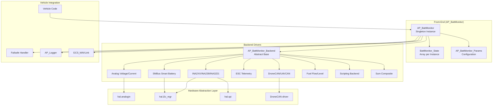
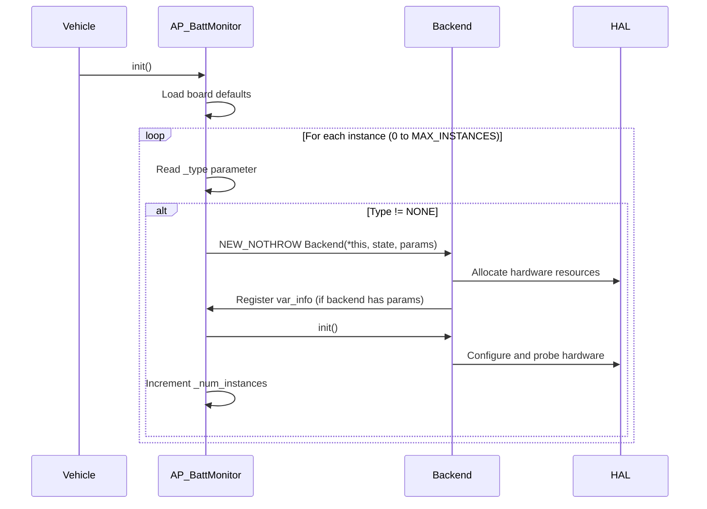

# AP_BattMonitor Library


## Table of Contents
- [Overview](#overview)
- [Architecture](#architecture)
- [Supported Monitor Types](#supported-monitor-types)
- [Voltage and Current Sensing](#voltage-and-current-sensing)
- [Capacity Estimation](#capacity-estimation)
- [Failsafe Integration](#failsafe-integration)
- [Multiple Battery Support](#multiple-battery-support)
- [Calibration Procedures](#calibration-procedures)
- [Configuration](#configuration)
- [API Reference](#api-reference)
- [Integration Examples](#integration-examples)
- [Safety Considerations](#safety-considerations)
- [Testing](#testing)

## Overview

The AP_BattMonitor library provides ArduPilot's centralized battery monitoring subsystem, enabling real-time measurement of voltage, current, consumed capacity, and battery health across diverse hardware platforms. This library is **safety-critical** as it provides the foundation for battery failsafe systems that protect vehicles from power-related failures.

**Source Files**: `libraries/AP_BattMonitor/`

### Key Features

- **Multi-instance Support**: Monitor up to 16 independent battery packs simultaneously
- **Diverse Hardware Backends**: Supports analog sensors, smart batteries (SMBus/I2C), DroneCAN/UAVCAN, ESC telemetry, fuel sensors, and custom scripting
- **Capacity Estimation**: Advanced coulomb counting with resistance-compensated voltage estimation
- **Failsafe Integration**: Configurable voltage and capacity thresholds with multi-level failsafe actions
- **State of Health**: Battery aging and health monitoring for supported smart batteries
- **Cell-level Monitoring**: Individual cell voltage reporting for multi-cell battery packs
- **Temperature Monitoring**: Battery temperature sensing for thermal management
- **Power Limiting**: Watt-based power limiting to protect battery from over-current damage

### Primary Responsibilities

1. **Hardware Abstraction**: Unified API for diverse battery monitoring hardware
2. **Data Acquisition**: Periodic voltage, current, and auxiliary parameter sampling
3. **State Estimation**: Capacity remaining, time remaining, and resting voltage calculation
4. **Failsafe Detection**: Real-time monitoring against configurable safety thresholds
5. **Logging and Telemetry**: MAVLink reporting and onboard data logging
6. **Arming Checks**: Pre-flight validation of battery status and capacity

## Architecture

The AP_BattMonitor library implements a **front-end/backend** design pattern that separates the public API from hardware-specific driver implementations.

### System Architecture Diagram



### Core Components

**Source**: `libraries/AP_BattMonitor/AP_BattMonitor.h`, lines 49-289

#### AP_BattMonitor (Front-End)

The front-end singleton class manages multiple battery monitor instances and provides the public API.

**Key Responsibilities:**
- Instance lifecycle management (initialization, allocation, destruction)
- Periodic `read()` orchestration at 10Hz
- Parameter storage and persistence via AP_Param
- Failsafe threshold evaluation and callback dispatch
- Aggregate status queries (healthy, voltage, current, capacity)
- MAVLink message generation and logging coordination

**Singleton Access:**
```cpp
AP_BattMonitor &battery = AP::battery();
```

**State Storage:** Each monitor instance maintains a `BattMonitor_State` structure (lines 105-134) containing:
- Real-time voltage and current measurements
- Integrated consumed capacity (mAh and Wh)
- Cell voltages array (up to 14 cells)
- Temperature (internal or external sensor)
- Resistance estimate and resting voltage
- Failsafe state and health flags
- Timing and timeout tracking

#### AP_BattMonitor_Backend (Abstract Base)

**Source**: `libraries/AP_BattMonitor/AP_BattMonitor_Backend.h`, lines 25-128

The backend base class defines the contract for all hardware-specific drivers.

**Pure Virtual Methods:**
```cpp
virtual void read() = 0;              // Periodic data acquisition
virtual bool has_current() const = 0; // Current sensing capability
```

**Shared Algorithm Implementation:**
- `capacity_remaining_pct()`: Coulomb counting with pack capacity normalization
- `voltage_resting_estimate()`: Sag-compensated voltage calculation
- `update_resistance_estimate()`: Kalman-filter-style resistance tracking
- `update_failsafes()`: Threshold checking and timeout management
- `arming_checks()`: Pre-flight validation logic
- `update_consumed()`: Milliamp-hour and watt-hour integration

#### AP_BattMonitor_Params

**Source**: `libraries/AP_BattMonitor/AP_BattMonitor_Params.h`, lines 6-89

Parameter container for per-instance configuration:

**Critical Parameters:**
- `_type` (AP_Enum): Backend type selection
- `_pack_capacity` (AP_Int32): Full pack capacity in mAh
- `_low_voltage` / `_critical_voltage` (AP_Float): Failsafe voltage thresholds
- `_low_capacity` / `_critical_capacity` (AP_Float): Failsafe capacity thresholds (%)
- `_arming_minimum_voltage` / `_arming_minimum_capacity`: Pre-flight requirements
- `_options` (AP_Int32): Behavior flags (e.g., ignore DroneCAN SoC, MPPT control)
- `_serial_number` (AP_Int32): Battery identification for smart batteries

### Initialization Sequence

**Source**: `libraries/AP_BattMonitor/AP_BattMonitor.cpp`, lines 557-735



**Initialization Steps:**

1. **Parameter Defaults** (lines 567-572): Apply board-specific defaults (e.g., `HAL_BATT_MONITOR_DEFAULT`)
2. **Instance Allocation** (lines 575-713): For each configured instance:
   - Clear cell voltage array to 0xFF (invalid marker)
   - Instantiate backend driver based on `_type` parameter
   - Register backend-specific parameters in global tree
   - Call backend `init()` for hardware setup
3. **Instance Counting** (lines 729-733): Track number of active instances for iteration

### Main Loop Integration

**Source**: `libraries/AP_BattMonitor/AP_BattMonitor.cpp`, `read()` method

```cpp
// Typical vehicle scheduler integration
void Copter::ten_hz_logging_loop()
{
    battery.read();  // Update all battery monitors at 10Hz
}
```

**Read Cycle:**
1. Iterate all active instances (`_num_instances`)
2. Call `drivers[i]->read()` for each backend
3. Backend updates voltage, current in `state[i]`
4. Backend calls `update_consumed(state[i], dt_us)` to integrate capacity
5. Backend calls `update_resistance_estimate()` for voltage sag calculation
6. Front-end calls `check_failsafes()` after all backends read
7. Front-end invokes failsafe handler callback if thresholds crossed

## Supported Monitor Types

**Source**: `libraries/AP_BattMonitor/AP_BattMonitor_Params.h`, lines 15-46

The library supports 30+ monitor types through the `BATT_MONITOR` parameter (or `BATT2_MONITOR`, `BATT3_MONITOR`, etc. for additional instances).

### Analog Voltage and Current Monitors

**Type IDs**: 3 (Voltage Only), 4 (Voltage and Current), 31 (Current Only)
**Backend**: `AP_BattMonitor_Analog`
**Source**: `libraries/AP_BattMonitor/AP_BattMonitor_Analog.cpp`

Reads battery voltage and current from analog pins using voltage dividers and current shunts.

**Hardware Configuration:**
- Voltage divider (e.g., 10.1:1 for 4S LiPo)
- Hall-effect current sensor or shunt resistor
- Analog pins configured via `BATT_VOLT_PIN` and `BATT_CURR_PIN`

**Parameters:**
- `BATT_VOLT_PIN`: ADC pin for voltage measurement
- `BATT_CURR_PIN`: ADC pin for current measurement
- `BATT_VOLT_MULT`: Voltage divider multiplier (default: 10.1)
- `BATT_AMP_PERVLT`: Amps per volt from current sensor (default: 17.0 for 90A sensor)
- `BATT_AMP_OFFSET`: Current sensor zero-current offset voltage

**Example Use Case:** Standard autopilot boards with analog current sensors (e.g., Pixhawk power module)

### SMBus Smart Battery (I2C)

**Type IDs**: 7 (Generic), 5 (Solo), 13/14 (SUI), 16 (Maxell), 19 (Rotoye), 15 (NeoDesign)
**Backend**: `AP_BattMonitor_SMBus_*`
**Source**: `libraries/AP_BattMonitor/AP_BattMonitor_SMBus.cpp` and subclasses

Communicates with smart batteries implementing the SMBus/I2C Smart Battery Data Specification.

**Features:**
- Automatic cell count detection
- Built-in capacity and SoC reporting
- Temperature and cycle count
- Packet Error Code (PEC) CRC-8 validation (Generic variant)
- Serial number and manufacturer info

**Parameters:**
- `BATT_I2C_BUS`: I2C bus number (default: 0)
- `BATT_I2C_ADDR`: I2C device address (default: 0x0B, 7-bit address)

**Vendor-Specific Variants:**
- **Solo** (Type 5): 3DR Solo smart battery with custom capacity scaling
- **SUI3/SUI6** (Types 13/14): Smart Battery Systems SUI packs (3 or 6 cell)
- **Maxell** (Type 16): Maxell batteries with vendor-specific capacity multiplier
- **Rotoye** (Type 19): Rotoye Batmon with enhanced diagnostics
- **NeoDesign** (Type 15): NeoDesign BMS integration

**Example Use Case:** High-end multirotor platforms with integrated smart battery management systems

### DroneCAN / UAVCAN Battery

**Type ID**: 8 (UAVCAN_BatteryInfo)
**Backend**: `AP_BattMonitor_DroneCAN`
**Source**: `libraries/AP_BattMonitor/AP_BattMonitor_DroneCAN.cpp`

Receives battery telemetry via DroneCAN protocol (formerly UAVCAN) with support for BatteryInfo and BatteryInfoAux messages.

**Features:**
- Multi-node support with dynamic node allocation
- Cell voltage arrays (up to 255 cells theoretically)
- State of Charge (SoC) and State of Health (SoH)
- Hot-swap support with dynamic node ID updates (via option flag)
- MPPT solar controller integration (mppt.Stream and mppt.OutputEnable)
- Separate nodes for voltage/current vs auxiliary info (via AllowSplitAuxInfo option)

**Parameters:**
- `BATT_OPTIONS`: Bit flags for DroneCAN-specific behaviors
  - Bit 0: Ignore SoC from device, use internal calculation
  - Bit 7: Allow split auxiliary info from different nodes
  - Bit 10: Allow dynamic node update during hot-swap

**MPPT Solar Integration:**
- Subscribe to `mppt.Stream` for solar panel voltage, current, and output state
- Control MPPT enabled state via `mppt.OutputEnable` RPC
- Automatically enable/disable based on arm state (via option flags)

**Example Use Case:** High-power commercial drones with CAN-based smart battery systems or solar-powered long-endurance platforms

### ESC Telemetry Aggregation

**Type ID**: 9 (BLHeliESC)
**Backend**: `AP_BattMonitor_ESC`
**Source**: `libraries/AP_BattMonitor/AP_BattMonitor_ESC.cpp`

Aggregates battery voltage, current, and temperature from ESC telemetry (BLHeli_32, BLHeli_S, or Dshot telemetry).

**Aggregation Method:**
- Voltage: Average across all ESCs
- Current: Sum of all ESC currents
- Temperature: Highest temperature among all ESCs
- Consumed mAh: Integrated from summed current

**Parameters:**
- `BATT_ESC_INDEX`: Bitmask of ESCs to include (e.g., 15 = ESCs 0-3)

**Advantages:**
- No additional current sensor required
- Per-ESC current monitoring for diagnostics
- Temperature monitoring at the power delivery point

**Limitations:**
- ESC telemetry update rate varies (typically 10-100Hz)
- Accuracy depends on ESC calibration
- Not all ESC firmware provides complete telemetry

**Example Use Case:** Multicopters with BLHeli_32 ESCs, eliminating dedicated current sensor

### INA Current/Power Monitors

**Type IDs**: 21 (INA2XX I2C), 26 (INA239 SPI), 30 (INA3221 3-channel)
**Backend**: `AP_BattMonitor_INA2xx`, `AP_BattMonitor_INA239`, `AP_BattMonitor_INA3221`
**Source**: `libraries/AP_BattMonitor/AP_BattMonitor_INA2xx.cpp`, etc.

High-precision current/power monitors using Texas Instruments INA-series chips.

**Supported Devices:**
- **INA226**: 36V max, 16-bit ADC, I2C
- **INA228**: 85V max, 20-bit ADC, I2C
- **INA238**: 85V max, 16-bit ADC, I2C, temperature sensing
- **INA231**: 36V max, 16-bit ADC, I2C
- **INA239**: 85V max, 16-bit ADC, SPI
- **INA3221**: 3-channel, 26V/channel, I2C (monitor multiple batteries)

**Features:**
- High-side current sensing
- Calibrated shunt voltage measurement
- Integrated power calculation (V × I)
- Alert pin support for over-current protection
- Temperature compensation (INA238)

**Parameters (INA2XX/INA239):**
- `BATT_I2C_BUS` / `BATT_SPI_BUS`: Communication bus
- `BATT_I2C_ADDR`: I2C address (0x40-0x4F)
- Automatic device type detection via register probing

**Parameters (INA3221):**
- `BATT_I2C_BUS`: I2C bus number
- `BATT_I2C_ADDR`: Base address (supports multiple devices)
- Supports monitoring 3 independent channels per chip

**Example Use Case:** High-voltage systems (12S+ LiPo) or applications requiring precision better than 1% accuracy

### Fuel Flow and Fuel Level Sensors

**Type IDs**: 11 (FuelFlow), 12 (FuelLevel_PWM), 24 (FuelLevel_Analog), 27 (EFI)
**Backend**: `AP_BattMonitor_FuelFlow`, `AP_BattMonitor_FuelLevel_*`, `AP_BattMonitor_EFI`

Maps fuel consumption to battery capacity model for IC engine-powered vehicles.

**FuelFlow (Type 11):**
- Integrates fuel flow rate sensor output to track consumed fuel
- Maps fuel volume to "mAh" for consistent failsafe interface
- Requires calibration of sensor output to actual flow rate

**FuelLevel_PWM (Type 12):**
- Reads PWM signal from fuel level sender
- Maps PWM duty cycle to tank percentage
- Supports automotive-style resistive fuel senders via PWM converter

**FuelLevel_Analog (Type 24):**
- Direct analog voltage input from fuel level sensor
- Configurable voltage-to-percentage curve
- Parameters: `BATT_VOLT_PIN`, `BATT_VOLT_MULT`

**EFI (Type 27):**
- Integrates with Electronic Fuel Injection systems (AP_EFI library)
- Automatic fuel consumption tracking from EFI telemetry
- No additional sensors required

**Example Use Case:** Fixed-wing gas/diesel aircraft, hybrid power systems, range-extended multicopters

### Generator Integration

**Type IDs**: 17 (GENERATOR_ELEC), 18 (GENERATOR_FUEL)
**Backend**: `AP_BattMonitor_Generator`
**Source**: `libraries/AP_BattMonitor/AP_BattMonitor_Generator.cpp`

Monitors generator output for hybrid power systems.

**GENERATOR_ELEC (Type 17):**
- Monitors electrical output of generator (voltage, current, power)
- Tracks generator runtime and energy production
- Integrates with AP_Generator library for generator control

**GENERATOR_FUEL (Type 18):**
- Monitors fuel tank level for generator fuel
- Combined with GENERATOR_ELEC for complete hybrid system monitoring
- Fuel remaining reported as battery percentage

**Example Use Case:** Long-endurance VTOL aircraft with onboard generator, hybrid power systems

### Scripting Backend

**Type ID**: 29 (Scripting)
**Backend**: `AP_BattMonitor_Scripting`
**Source**: `libraries/AP_BattMonitor/AP_BattMonitor_Scripting.cpp`

Allows Lua scripts to provide battery telemetry from custom hardware or algorithms.

**Features:**
- Script supplies `BattMonitorScript_State` structure
- Supports voltage, current, consumed mAh/Wh, cell voltages, temperature
- Optional automatic current integration if script provides only voltage
- Cycle count and SoH reporting

**Script API:**
```lua
-- Example script usage
local battery_idx = 0  -- Monitor instance
local state = {}
state.voltage = 14.8
state.current_amps = 5.2
state.healthy = true
battery:handle_scripting(battery_idx, state)
```

**Example Use Case:** Custom BMS integration, experimental battery chemistries, research platforms

### Sum Composite Monitor

**Type ID**: 10 (Sum)
**Backend**: `AP_BattMonitor_Sum`
**Source**: `libraries/AP_BattMonitor/AP_BattMonitor_Sum.cpp`

Aggregates readings from multiple other battery monitor instances.

**Aggregation Rules:**
- Voltage: Average, minimum, or user-selected mode (via options)
- Current: Sum of all selected instances
- Consumed capacity: Sum of all selected instances
- Temperature: Average or maximum

**Parameters:**
- `BATT_SUM_MASK`: Bitmask selecting which instances to aggregate (e.g., 0x03 = instances 0 and 1)
- `BATT_OPTIONS`, bit 9: Use minimum voltage instead of average

**Example Use Case:** Dual-battery systems requiring total system capacity, parallel battery packs

### Specialty and Platform-Specific Monitors

**Additional Types:**
- **LTC2946** (Type 22): High-voltage (100V) precision power monitor, I2C
- **Torqeedo** (Type 23): Torqeedo electric outboard motor battery integration
- **Bebop** (Type 6): Parrot Bebop/Disco embedded battery monitoring
- **AD7091R5** (Type 28): 4-channel I2C ADC for multi-battery analog monitoring
- **Synthetic_Current** (Type 25): Estimates current from voltage and throttle when no sensor available

## Voltage and Current Sensing

### Analog Voltage Measurement

**Source**: `libraries/AP_BattMonitor/AP_BattMonitor_Analog.cpp`, `read_voltage()` method

Analog voltage sensing uses the HAL analog input subsystem with low-pass filtering.

**Measurement Chain:**
```
Battery --> Voltage Divider --> ADC Pin --> HAL AnalogIn --> Low-Pass Filter --> Scaled Voltage
```

**Voltage Divider Calculation:**
```
V_battery = V_adc × BATT_VOLT_MULT
```

**Default Multiplier (BATT_VOLT_MULT = 10.1):**
- R1 = 10kΩ (to battery)
- R2 = 1kΩ (to ground)
- Ratio = (R1 + R2) / R2 = 11 / 1.1 ≈ 10.1

**Low-Pass Filter:**
- Cutoff frequency: ~2Hz
- Implementation: Exponential moving average
- Reduces ADC noise and electrical interference

**Calibration Procedure:**
1. Measure actual battery voltage with precision multimeter: V_actual
2. Read reported voltage from GCS: V_reported
3. Calculate new multiplier: `BATT_VOLT_MULT_new = BATT_VOLT_MULT_old × (V_actual / V_reported)`
4. Set parameter and reboot

### Analog Current Measurement

**Source**: `libraries/AP_BattMonitor/AP_BattMonitor_Analog.cpp`, `read_current()` method

Current sensing uses Hall-effect sensors or shunt resistors with amplifiers.

**Sensor Output Characteristics:**
- Linear voltage output proportional to current
- Offset voltage at zero current (typically 0.5V, 1.65V, or 2.5V)
- Scale factor in amps per volt (e.g., 17.0 A/V for 90A sensor)

**Current Calculation:**
```
I_battery = (V_adc - BATT_AMP_OFFSET) × BATT_AMP_PERVLT
```

**Common Sensor Examples:**

| Sensor Type | Max Current | Output Range | BATT_AMP_PERVLT | BATT_AMP_OFFSET |
|-------------|-------------|--------------|-----------------|-----------------|
| ACS758-50B  | 50A         | 0.6V - 4.4V  | 13.16 A/V       | 2.5V            |
| ACS758-100B | 100A        | 0.6V - 4.4V  | 26.32 A/V       | 2.5V            |
| AttoPilot 90A | 90A       | 0V - 3.3V    | 27.32 A/V       | 0.33V           |
| AttoPilot 180A | 180A     | 0V - 3.3V    | 54.64 A/V       | 0.33V           |

**Calibration Procedure:**
1. **Zero-Current Offset:**
   - Power autopilot with battery disconnected from motors/ESCs
   - Read current value from GCS (should be ~0A)
   - If non-zero, adjust `BATT_AMP_OFFSET`: offset_new = offset_old + (I_reported / BATT_AMP_PERVLT)

2. **Scale Factor:**
   - Run motors at known current (use separate current meter for reference)
   - Compare reported vs actual current
   - Adjust `BATT_AMP_PERVLT`: scale_new = scale_old × (I_actual / I_reported)

### Digital Protocol Sensing

**SMBus/I2C Smart Batteries:**
- Voltage: Direct read from `0x09 VOLTAGE` register (mV)
- Current: Direct read from `0x0A CURRENT` register (mA, signed)
- Capacity: Read from `0x0F REMAINING_CAPACITY` and `0x10 FULL_CHARGE_CAPACITY` registers
- No calibration required (factory calibrated by battery manufacturer)

**DroneCAN Batteries:**
- Receives `uavcan.equipment.power.BatteryInfo` messages
- Voltage and current from CAN message fields
- Update rate: Typically 1-10Hz depending on device configuration

**INA-Series Monitors:**
- Shunt voltage measured across precision resistor (typical: 0.001Ω to 0.01Ω)
- Bus voltage measured via high-impedance input
- Current = Shunt_Voltage / Shunt_Resistance
- Internal calibration register programmed during initialization

## Capacity Estimation

**Source**: `libraries/AP_BattMonitor/AP_BattMonitor_Backend.cpp`, lines 60-85

The AP_BattMonitor library uses multiple methods to estimate remaining battery capacity, ranging from simple coulomb counting to resistance-compensated algorithms.

### Coulomb Counting (Consumed Capacity)

**Algorithm**: Integration of current over time to track energy removed from battery.

**Implementation** (`update_consumed()` method):

```cpp
// Source: AP_BattMonitor_Backend.cpp, update_consumed()
float mah_consumed = calculate_mah(state.current_amps, dt_us);
state.consumed_mah += mah_consumed;
state.consumed_wh += state.current_amps * state.voltage * (dt_us * 1.0e-6f);
```

**Calculation:**
```
Consumed_mAh = ∫ I(t) dt × (1000 / 3600)
Consumed_Wh = ∫ V(t) × I(t) dt / 3600
```

Where:
- `I(t)`: Instantaneous current in amperes
- `V(t)`: Instantaneous voltage in volts
- Integration period: dt_us microseconds

**Accumulation:**
- Called every `read()` cycle (~10Hz)
- Cumulative from power-on (does not persist across reboots)
- Always positive (discharge direction)

**Accuracy Factors:**
- Current sensor accuracy (±1-5% typical for analog, ±0.5% for INA-series)
- Update rate (10Hz sufficient for typical discharge profiles)
- Temperature effects on current sensor calibration
- Peukert effect (capacity reduction at high discharge rates, not modeled)

### Capacity Remaining Percentage

**Source**: `AP_BattMonitor_Backend.cpp`, `capacity_remaining_pct()`, lines 60-85

**Algorithm:**
```
Capacity_Remaining_% = 100 × (1 - Consumed_mAh / Pack_Capacity_mAh)
```

**Requirements:**
- Valid `BATT_CAPACITY` parameter (pack_capacity_mah > 0)
- Current sensing available (`has_current() == true`)
- Monitor healthy and communicating

**Smart Battery Override:**
- SMBus batteries report State of Charge (SoC) directly
- DroneCAN batteries can report SoC via BatteryInfo message
- Option flag `Ignore_UAVCAN_SoC` forces internal calculation even if device provides SoC

**Percentage Scaling:**
- 100% = Full pack capacity
- 0% = Fully depleted
- Values can exceed 100% if consumed capacity is reset or pack capacity is underestimated
- Negative values clamped to 0% in reporting

### Time Remaining Estimation

**Source**: `AP_BattMonitor_Backend.h`, lines 41-42

Time remaining calculation requires smart batteries that provide the metric directly.

**Supported Backends:**
- SMBus smart batteries (read from `0x13 TIME_TO_EMPTY` register, minutes)
- DroneCAN batteries (from BatteryInfo.hours_to_full or time_to_empty fields)

**Algorithm (for backends without native support):**
```
Time_Remaining_seconds = (Capacity_Remaining_mAh / Current_Amps) × 3600

// With smoothing:
Predicted_Current = exponential_filter(Current_Amps, time_constant=10s)
Time_Remaining = (Capacity_Remaining / Predicted_Current) × 3600
```

**Limitations:**
- Assumes constant discharge rate (inaccurate for variable flight profiles)
- Does not account for voltage cutoff limits
- Peukert effect and temperature dependencies ignored

**Availability Check:**
```cpp
uint32_t time_remaining_s;
if (battery.time_remaining(instance, time_remaining_s)) {
    // Time remaining is valid
}
```

### Voltage Resting Estimate (Sag Compensation)

**Source**: `AP_BattMonitor_Backend.cpp`, `voltage_resting_estimate()` and `update_resistance_estimate()`

Estimates battery voltage without load-induced sag to provide more accurate capacity indication.

**Physical Model:**
```
V_resting = V_measured + (I_discharge × R_internal)
```

Where:
- `V_measured`: Terminal voltage under load
- `I_discharge`: Current draw (positive for discharge)
- `R_internal`: Battery internal resistance (dynamically estimated)

**Resistance Estimation Algorithm:**

The backend continuously estimates internal resistance using a dual time-constant Kalman-filter-like approach:

```cpp
// Source: AP_BattMonitor_Backend.cpp, update_resistance_estimate()
// Fast time constant (0.5s) for voltage tracking
_voltage_filt += (voltage - _voltage_filt) * (dt / (dt + AP_BATT_MONITOR_RES_EST_TC_1));

// Slow time constant (0.1s) for current tracking
_current_filt_amps += (current - _current_filt_amps) * (dt / (dt + AP_BATT_MONITOR_RES_EST_TC_2));

// Update resistance when current exceeds threshold
if (_current_filt_amps > 1.0f) {
    float resistance_estimate = (_voltage_filt - _voltage_resting_estimate) / _current_filt_amps;
    state.resistance = constrain_float(resistance_estimate, 0.0f, max_resistance);
}
```

**Time Constants:**
- `AP_BATT_MONITOR_RES_EST_TC_1 = 0.5s`: Voltage filter (tracks fast sag dynamics)
- `AP_BATT_MONITOR_RES_EST_TC_2 = 0.1s`: Current filter (smooths noise)

**Usage in GCS Reporting:**
- `gcs_voltage()`: Can return resting voltage estimate if option flag `GCS_Resting_Voltage` (bit 6) is set
- Provides more stable voltage reading during high-current transients
- Useful for capacity estimation based on voltage (though coulomb counting is more accurate)

**Typical Resistance Values:**
- 3S 2200mAh LiPo: 0.010 - 0.030 Ω (new)
- 6S 16000mAh LiPo: 0.002 - 0.008 Ω (new)
- Resistance increases with age, cycle count, and low temperature
- High resistance indicates cell damage or aging (use for health monitoring)

### State of Health (SoH)

**Source**: `AP_BattMonitor.h`, lines 129-130 (state field); Backend determines availability

State of Health represents battery aging and degradation as a percentage (100% = new, 0% = end of life).

**Supported Backends:**
- SMBus smart batteries with SoH register support
- DroneCAN batteries reporting `state_of_health_pct`

**Access API:**
```cpp
uint8_t soh_pct;
if (battery.get_state_of_health_pct(instance, soh_pct)) {
    // SoH is available from smart battery
    // Typical: >80% = healthy, <60% = consider replacement
}
```

**Degradation Indicators:**
- Capacity fade: Measured full capacity vs nameplate capacity
- Impedance rise: Increased internal resistance
- Cycle count: Total charge/discharge cycles (separate metric)

## Failsafe Integration

**Source**: `AP_BattMonitor.cpp`, `check_failsafes()` and `check_failsafe()` methods

The battery monitor system provides multi-level failsafe detection integrated with vehicle-wide failsafe handling.

### Failsafe Severity Levels

**Source**: `AP_BattMonitor.h`, lines 78-83

```cpp
enum class Failsafe : uint8_t {
    None = 0,       // No failsafe triggered
    Unhealthy,      // Communication lost or sensor fault
    Low,            // Low voltage or low capacity threshold crossed
    Critical        // Critical voltage or critical capacity threshold crossed
};
```

**Escalation Priority:**
- Failsafes escalate upward (None → Unhealthy → Low → Critical)
- Once a higher level is triggered, system does not de-escalate
- Prevents failsafe oscillation during voltage recovery under reduced load

### Failsafe Trigger Conditions

#### Unhealthy Failsafe

**Trigger Conditions:**
```cpp
// Backend reports healthy = false
// OR
// No valid data received for AP_BATT_MONITOR_TIMEOUT (5000ms)
```

**Common Causes:**
- I2C/SMBus communication failure
- DroneCAN node offline
- Analog sensor disconnected or out of range
- ESC telemetry timeout

**Vehicle Response:**
- Typically: Log warning, continue operation
- May prevent arming if unhealthy at startup

#### Low Battery Failsafe

**Voltage-Based Trigger:**
```
V_measured < BATT_LOW_VOLT (e.g., 10.5V for 3S LiPo)
AND
Low voltage persists for BATT_LOW_TIMER seconds (default: 10s)
```

**Capacity-Based Trigger:**
```
Capacity_Remaining_% < BATT_LOW_MAH (e.g., 20%)
```

**Configuration:**
- `BATT_LOW_VOLT`: Voltage threshold (volts)
- `BATT_LOW_MAH`: Capacity threshold (percentage, 0-100)
- `BATT_LOW_TIMER`: Persistence time before trigger (seconds, default: 10)
- `BATT_FS_LOW_ACT`: Failsafe action (0=None, 1=Land, 2=RTL, 3=SmartRTL, 4=SmartRTL or Land, 5=Terminate)

**Voltage Source Selection:**
- `BATT_FS_VOLTSRC = 0`: Use raw measured voltage
- `BATT_FS_VOLTSRC = 1`: Use sag-compensated (resting) voltage estimate

**Purpose:**
- Early warning to pilot to return and land safely
- Reserves capacity for controlled landing

#### Critical Battery Failsafe

**Voltage-Based Trigger:**
```
V_measured < BATT_CRT_VOLT (e.g., 9.8V for 3S LiPo)
```

**Capacity-Based Trigger:**
```
Capacity_Remaining_% < BATT_CRT_MAH (e.g., 10%)
```

**Configuration:**
- `BATT_CRT_VOLT`: Critical voltage threshold (volts)
- `BATT_CRT_MAH`: Critical capacity threshold (percentage, 0-100)
- `BATT_FS_CRT_ACT`: Failsafe action (same codes as LOW_ACT)

**No Timeout:**
- Critical failsafe triggers immediately (no delay timer)
- Immediate response required to prevent battery damage or crash

**Purpose:**
- Emergency landing to prevent deep discharge damage
- Absolute minimum reserve for landing

### Failsafe Threshold Recommendations

**LiPo Battery (3.0V - 4.2V per cell):**

| Cell Count | Low Voltage | Critical Voltage | Low Capacity | Critical Capacity |
|------------|-------------|------------------|--------------|-------------------|
| 3S         | 10.5V (3.5V/cell) | 9.9V (3.3V/cell) | 25% | 15% |
| 4S         | 14.0V (3.5V/cell) | 13.2V (3.3V/cell) | 25% | 15% |
| 6S         | 21.0V (3.5V/cell) | 19.8V (3.3V/cell) | 25% | 15% |

**Notes:**
- Never discharge below 3.0V/cell to prevent permanent damage
- 3.3V/cell critical threshold provides ~1-2 minutes reserve
- Capacity thresholds assume accurate `BATT_CAPACITY` calibration

**Li-Ion Battery (2.5V - 4.1V per cell):**
- Low: 3.3V/cell, Critical: 2.9V/cell
- Capacity: Same as LiPo (25% / 15%)

### Failsafe Callback Mechanism

**Source**: `AP_BattMonitor.cpp`, constructor and `check_failsafes()`

The vehicle code registers a failsafe handler callback during battery monitor construction:

```cpp
// Vehicle code (e.g., Copter.cpp)
void Copter::handle_battery_failsafe(const char* type_str, const int8_t action) {
    // Execute failsafe action: RTL, Land, etc.
    set_mode_battery_failsafe(Mode::Number(action));
}

// Battery monitor initialization
battery(log_bitmask, FUNCTOR_BIND_MEMBER(&Copter::handle_battery_failsafe, void, const char*, const int8_t), 
        battery_failsafe_priorities)
```

**Failsafe Priority System:**
- Vehicle provides array of failsafe priorities (e.g., `[-1, -1, CRITICAL, LOW]`)
- Higher array index = higher severity
- Once triggered at a priority level, lower-priority failsafes cannot override
- Prevents oscillation between LOW and NONE states

### Arming Checks

**Source**: `AP_BattMonitor_Backend.cpp`, `arming_checks()`, lines 79-85

Pre-flight validation prevents arming with insufficient battery capacity or unhealthy monitors.

**Check Conditions:**
```cpp
bool AP_BattMonitor::arming_checks(size_t buflen, char *buffer) const
{
    for (each configured instance) {
        // Fail if unhealthy
        if (!healthy(instance)) {
            return false;  // "Battery N unhealthy"
        }
        
        // Fail if below minimum voltage
        if (voltage(instance) < _params[instance]._arming_minimum_voltage) {
            return false;  // "Battery N voltage too low"
        }
        
        // Fail if below minimum capacity
        uint8_t capacity_pct;
        if (capacity_remaining_pct(capacity_pct, instance)) {
            if (capacity_pct < _params[instance]._arming_minimum_capacity) {
                return false;  // "Battery N capacity too low"
            }
        }
    }
    return true;  // All checks passed
}
```

**Configuration:**
- `BATT_ARM_VOLT`: Minimum voltage to arm (0 = disable check)
- `BATT_ARM_MAH`: Minimum capacity percentage to arm (0 = disable check)

**Typical Settings:**
- `BATT_ARM_VOLT`: 0 (disabled, or set to fully charged voltage if strict)
- `BATT_ARM_MAH`: 90-95% (ensure sufficient capacity for full mission)

## Multiple Battery Support

**Source**: `AP_BattMonitor.h`, lines 139, 269-274 (instance arrays)

ArduPilot supports monitoring up to 16 independent battery packs simultaneously.

### Instance Configuration

Each battery monitor instance has independent configuration:

```
BATT_MONITOR    = 4  (Analog V+I)      # Primary battery
BATT2_MONITOR   = 7  (SMBus Generic)   # Secondary smart battery
BATT3_MONITOR   = 10 (Sum)             # Aggregate of 1+2
BATT4_MONITOR   = 0  (Disabled)
...
```

**Instance Numbering:**
- Instance 0 (BATT_*): Primary battery, used for failsafe evaluation
- Instance 1 (BATT2_*): Secondary battery
- Instance N (BATT[N+1]_*): Additional batteries

**Parameter Prefixes:**
- Instance 0: `BATT_`
- Instance 1: `BATT2_`
- Instance 2: `BATT3_`
- Instance 3: `BATT4_`
- Instances 9+: `BATTA_`, `BATTB_`, `BATTC_`, etc.

### Primary Battery Selection

**Source**: `AP_BattMonitor.h`, line 15

```cpp
#define AP_BATT_PRIMARY_INSTANCE  0
```

The primary battery (instance 0) is used for:
- Failsafe threshold evaluation
- Default voltage/current reporting to GCS
- Flight time estimation
- Single-battery API calls (e.g., `voltage()` without instance parameter)

**API Examples:**
```cpp
float v_primary = battery.voltage();  // Instance 0
float v_secondary = battery.voltage(1);  // Instance 1

// Check all batteries healthy
bool all_healthy = battery.healthy();  // Checks all configured instances
```

### Use Cases

**Dual Battery Configuration:**
- **Purpose**: Redundancy and extended flight time
- **Typical Setup:**
  - `BATT_MONITOR = 4`: Primary battery (analog sensor)
  - `BATT2_MONITOR = 4`: Secondary battery (separate analog sensor)
  - `BATT3_MONITOR = 10`: Sum aggregate (reports total system capacity)
  - `BATT3_SUM_MASK = 3` (binary 0b0011 = instances 0 and 1)

**Failsafe Behavior:**
- Failsafes evaluate primary battery (instance 0) only by default
- Configure vehicle failsafe priorities to monitor multiple instances
- If either battery critical → trigger immediate landing

**Hybrid Power System:**
- **Configuration:**
  - `BATT_MONITOR = 4`: Main flight battery
  - `BATT2_MONITOR = 17`: Generator electrical output
  - `BATT3_MONITOR = 18`: Generator fuel level
- **Monitoring:**
  - Track flight battery depletion (instance 0)
  - Monitor generator output (instance 1)
  - Monitor generator fuel remaining (instance 2)

**Multi-ESC Systems:**
- **Configuration:**
  - `BATT_MONITOR = 9`: ESC telemetry aggregate
  - `BATT2_MONITOR = 30`: INA3221 per-battery monitoring (3 channels)
- **Benefits:**
  - ESC telemetry provides system-wide current
  - INA3221 monitors individual battery cells for balancing validation

### MAVLink Reporting

All configured battery instances are reported via MAVLink `BATTERY_STATUS` messages.

**Message Fields:**
- `id`: Instance number (0-15)
- `voltages[10]`: Cell voltages in mV (unused cells = UINT16_MAX)
- `current_battery`: Current in cA (centiamps, -1 = not available)
- `current_consumed`: Consumed capacity in mAh
- `energy_consumed`: Consumed energy in hJ (hectojoules, 1 hJ = 100J = 0.0278 Wh)
- `battery_remaining`: Capacity remaining percentage (0-100, -1 = not available)
- `time_remaining`: Seconds remaining (0 = not available)
- `charge_state`: MAV_BATTERY_CHARGE_STATE enum
- `fault_bitmask`: MAV_BATTERY_FAULT flags

## Calibration Procedures

### Voltage Calibration

**Objective**: Correct voltage divider scaling errors to match measured voltage.

**Required Equipment:**
- Precision multimeter (±0.1% accuracy or better)
- Fully charged battery (improves signal-to-noise ratio)

**Procedure:**

1. **Connect Battery:**
   - Connect battery to autopilot power input
   - Power on autopilot and connect to GCS
   - Ensure stable power (no motors spinning)

2. **Measure Reference Voltage:**
   - Use multimeter to measure battery voltage at power connector
   - Record value: `V_actual` (e.g., 12.58V)

3. **Read Reported Voltage:**
   - Open GCS (Mission Planner, QGroundControl, etc.)
   - Navigate to battery monitoring page
   - Record reported voltage: `V_reported` (e.g., 12.34V)

4. **Calculate Correction Factor:**
   ```
   Correction_Factor = V_actual / V_reported
   Example: 12.58 / 12.34 = 1.0194
   ```

5. **Update Parameter:**
   ```
   BATT_VOLT_MULT_new = BATT_VOLT_MULT_old × Correction_Factor
   
   Example: 
   Old value: 10.1
   New value: 10.1 × 1.0194 = 10.296
   ```

6. **Verify:**
   - Set `BATT_VOLT_MULT` to new value
   - Reboot autopilot
   - Confirm reported voltage matches multimeter reading

**Tolerance:**
- Target accuracy: ±0.1V absolute, ±1% relative
- If error persists after calibration, check for:
  - Faulty voltage divider resistors
  - ADC reference voltage drift
  - Loose connections

### Current Sensor Calibration

Current sensor calibration requires two steps: zero-current offset and scale factor.

#### Step 1: Zero-Current Offset Calibration

**Objective**: Remove voltage offset when no current is flowing.

**Procedure:**

1. **Zero-Current Condition:**
   - Power autopilot from battery
   - Disconnect ALL motor/ESC power (remove ESC power lead or motor wires)
   - Ensure no current flowing from battery except autopilot itself (~100-500mA)

2. **Read Zero-Current Output:**
   - Connect to GCS
   - Read reported current: `I_zero` (should be ~0A, but may show offset)
   - Example: Reports 2.3A when actually 0A

3. **Calculate Offset Voltage:**
   ```
   V_offset_error = I_zero / BATT_AMP_PERVLT
   Example: 2.3A / 17.0 A/V = 0.135V
   ```

4. **Update Offset Parameter:**
   ```
   BATT_AMP_OFFSET_new = BATT_AMP_OFFSET_old + V_offset_error
   
   Example:
   Old value: 0.0V
   New value: 0.0 + 0.135 = 0.135V
   ```

5. **Verify:**
   - Set `BATT_AMP_OFFSET` to new value
   - Reboot or re-initialize battery monitor
   - Confirm reported current is ~0A in zero-current condition

#### Step 2: Scale Factor Calibration

**Objective**: Correct amps-per-volt scaling to match actual current.

**Required Equipment:**
- Inline current meter (clamp meter or inline shunt meter)
- Test load (motors, resistive load, or power supply)

**Procedure:**

1. **Establish Known Current:**
   - Connect inline current meter in series with battery
   - Run motors at moderate throttle (~50%)
   - Record actual current from reference meter: `I_actual` (e.g., 22.5A)

2. **Read Reported Current:**
   - Read current from GCS: `I_reported` (e.g., 20.8A)

3. **Calculate Correction Factor:**
   ```
   Correction_Factor = I_actual / I_reported
   Example: 22.5 / 20.8 = 1.0817
   ```

4. **Update Scale Parameter:**
   ```
   BATT_AMP_PERVLT_new = BATT_AMP_PERVLT_old × Correction_Factor
   
   Example:
   Old value: 17.0 A/V
   New value: 17.0 × 1.0817 = 18.39 A/V
   ```

5. **Verify:**
   - Set `BATT_AMP_PERVLT` to new value
   - Reboot
   - Run motors at various throttle levels
   - Confirm reported current matches reference meter across range

**Calibration Tips:**
- Calibrate at multiple current levels (low, mid, high) if sensor is non-linear
- Temperature affects sensor output; recalibrate for operating temperature range
- Vibration can cause noise; average readings over 5-10 seconds

### Capacity Calibration

**Objective**: Set accurate pack capacity for capacity remaining percentage calculation.

**Method 1: Nameplate Capacity**
- Use battery manufacturer's rated capacity
- Example: 5000mAh battery → `BATT_CAPACITY = 5000`
- **Limitation**: Actual usable capacity may be less due to aging or discharge rate

**Method 2: Measured Flight Capacity**
1. Fully charge battery
2. Fly until low voltage failsafe triggers
3. Check consumed capacity from logs (BAT.CurrTot or BATT.CurrTot)
4. Set `BATT_CAPACITY` to consumed value
5. Provides capacity to first failsafe threshold (not full capacity to empty)

**Method 3: Lab Discharge Test**
1. Fully charge battery
2. Discharge at typical flight current using resistive load or battery analyzer
3. Measure capacity delivered until cutoff voltage (e.g., 3.3V/cell)
4. Set `BATT_CAPACITY` to measured value
5. Most accurate but requires specialized equipment

**Recommendation:**
- Start with nameplate capacity
- Adjust based on observed flight behavior
- Conservative (lower) capacity value → failsafe triggers earlier → safer

### SMBus/Smart Battery Calibration

Smart batteries with SMBus interface typically do not require calibration:
- Voltage and current factory-calibrated by manufacturer
- Capacity learned automatically by battery BMS through charge/discharge cycles
- No user parameters to adjust

**Exception**: Capacity scaling for vendor-specific implementations (e.g., Maxell backend applies vendor-specific multiplier)

## Configuration

### Essential Parameters

**Source**: `AP_BattMonitor_Params.cpp`, parameter definitions

#### Monitor Type Selection

```
BATT_MONITOR = 4     # Analog voltage and current
```

**Common Values:**
- `0`: Disabled
- `3`: Analog voltage only
- `4`: Analog voltage and current (most common for standard autopilots)
- `7`: SMBus generic smart battery
- `8`: DroneCAN/UAVCAN battery
- `9`: ESC telemetry
- `10`: Sum aggregate

#### Capacity and Voltage Settings

```
BATT_CAPACITY = 5000      # Battery capacity in mAh
BATT_LOW_VOLT = 14.0      # Low battery voltage (4S: 3.5V/cell)
BATT_CRT_VOLT = 13.2      # Critical battery voltage (4S: 3.3V/cell)
BATT_LOW_MAH = 20         # Low battery at 20% remaining
BATT_CRT_MAH = 10         # Critical battery at 10% remaining
```

#### Analog Sensor Configuration

```
BATT_VOLT_PIN = 2         # ADC pin for voltage (2 = default on most boards)
BATT_CURR_PIN = 3         # ADC pin for current (3 = default)
BATT_VOLT_MULT = 10.1     # Voltage divider multiplier
BATT_AMP_PERVLT = 17.0    # Current sensor scale (amps per volt)
BATT_AMP_OFFSET = 0.0     # Current sensor zero offset (volts)
```

#### Arming Requirements

```
BATT_ARM_VOLT = 0.0       # Minimum voltage to arm (0 = disabled)
BATT_ARM_MAH = 0          # Minimum capacity % to arm (0 = disabled)
```

**Recommendations:**
- Set `BATT_ARM_VOLT` to near-full-charge voltage to prevent arming with depleted battery
- Set `BATT_ARM_MAH = 90` to ensure 90%+ capacity for full mission

#### Failsafe Actions

```
BATT_FS_LOW_ACT = 2       # Action on low battery (0=None, 1=Land, 2=RTL, 3=SmartRTL, 4=SmartRTL_Land, 5=Terminate)
BATT_FS_CRT_ACT = 1       # Action on critical battery
BATT_LOW_TIMER = 10       # Delay before low failsafe triggers (seconds)
BATT_FS_VOLTSRC = 0       # Use raw voltage (0) or sag-compensated (1)
```

#### I2C/SMBus Configuration

```
BATT_I2C_BUS = 0          # I2C bus number
BATT_I2C_ADDR = 11        # I2C address (0x0B = 11 decimal, common for SMBus)
```

#### Options Flags

```
BATT_OPTIONS = 0          # Bitmask of behavior options
```

**Option Bits:**
- Bit 0 (1): Ignore DroneCAN State of Charge, use internal calculation
- Bit 1 (2): MPPT reports input (solar panel) instead of output
- Bit 2 (4): MPPT power off when disarmed
- Bit 3 (8): MPPT power on when armed
- Bit 4 (16): MPPT power off at boot
- Bit 5 (32): MPPT power on at boot
- Bit 6 (64): Report sag-compensated voltage to GCS
- Bit 7 (128): Allow split auxiliary info (DroneCAN)
- Bit 9 (512): Sum monitor uses minimum voltage instead of average
- Bit 10 (1024): Allow DroneCAN dynamic node update during hot-swap

**Example:**
```
BATT_OPTIONS = 64    # Report resting voltage to GCS (bit 6)
```

### Configuration Examples

#### Standard Copter with Analog Sensor (Power Module)

```
BATT_MONITOR = 4
BATT_VOLT_PIN = 2
BATT_CURR_PIN = 3
BATT_VOLT_MULT = 10.1
BATT_AMP_PERVLT = 17.0
BATT_AMP_OFFSET = 0.0
BATT_CAPACITY = 5000
BATT_LOW_VOLT = 14.0
BATT_CRT_VOLT = 13.2
BATT_FS_LOW_ACT = 2       # RTL on low battery
BATT_FS_CRT_ACT = 1       # Land on critical
```

#### SMBus Smart Battery

```
BATT_MONITOR = 7          # SMBus Generic
BATT_I2C_BUS = 0
BATT_I2C_ADDR = 11
BATT_CAPACITY = 0         # Read from battery (or override if needed)
BATT_LOW_MAH = 20
BATT_CRT_MAH = 10
BATT_FS_LOW_ACT = 2
BATT_FS_CRT_ACT = 1
```

#### Dual Battery with Sum Aggregate

```
# Primary battery (analog)
BATT_MONITOR = 4
BATT_CAPACITY = 5000
BATT_VOLT_PIN = 2
BATT_CURR_PIN = 3

# Secondary battery (analog on different pins - requires custom hwdef)
BATT2_MONITOR = 4
BATT2_CAPACITY = 5000
BATT2_VOLT_PIN = 14
BATT2_CURR_PIN = 15

# Aggregate monitor (sum)
BATT3_MONITOR = 10
BATT3_SUM_MASK = 3        # Binary 0b0011 = instances 0 and 1
BATT3_CAPACITY = 10000    # Total capacity
```

#### DroneCAN Battery with MPPT Solar

```
BATT_MONITOR = 8          # DroneCAN BatteryInfo
BATT_OPTIONS = 12         # Bits 2+3: MPPT off at disarm, on at arm
BATT_CAPACITY = 20000
BATT_LOW_MAH = 30
BATT_CRT_MAH = 15
```

## API Reference

**Source**: `libraries/AP_BattMonitor/AP_BattMonitor.h`, lines 75-289

### Singleton Access

```cpp
// Global singleton accessor
AP_BattMonitor &battery_mon = AP::battery();

// Direct singleton pointer (for advanced use)
AP_BattMonitor *battery_ptr = AP_BattMonitor::get_singleton();
```

### Initialization

```cpp
/**
 * @brief Initialize all configured battery monitor instances
 * @details Allocates backend drivers, registers parameters, probes hardware
 * @note Call once during vehicle startup, typically in setup()
 * @warning Calling multiple times has no effect (guarded by _num_instances check)
 */
void init();
```

### Periodic Update

```cpp
/**
 * @brief Read latest data from all battery monitor backends
 * @details Calls backend read(), updates state, checks failsafes
 * @note Should be called at 10Hz from vehicle scheduler
 * @timing Execution time: 50-500μs depending on number of instances and hardware
 */
void read();
```

### Health Status

```cpp
/**
 * @brief Check if a specific battery monitor instance is healthy
 * @param instance Battery instance number (0 to num_instances-1)
 * @return true if monitor is communicating and providing valid data
 * @note Returns false if instance not configured or communication timeout
 */
bool healthy(uint8_t instance) const;

/**
 * @brief Check if all configured battery monitors are healthy
 * @return true if all instances report healthy, false if any unhealthy or none configured
 */
bool healthy() const;
```

### Voltage Measurement

```cpp
/**
 * @brief Get battery terminal voltage under load
 * @param instance Battery instance number (default: 0 = primary)
 * @return Voltage in volts, 0.0 if instance invalid or unhealthy
 * @note Returns instantaneous voltage including sag from load current
 */
float voltage(uint8_t instance = AP_BATT_PRIMARY_INSTANCE) const;

/**
 * @brief Get voltage for GCS reporting (may be resistance-compensated)
 * @param instance Battery instance number
 * @return Voltage in volts (raw or resting depending on BATT_OPTIONS bit 6)
 * @see option GCS_Resting_Voltage for resistance compensation
 */
float gcs_voltage(uint8_t instance = AP_BATT_PRIMARY_INSTANCE) const;

/**
 * @brief Get estimated resting voltage (load sag removed)
 * @param instance Battery instance number
 * @return Voltage in volts with internal resistance drop added back
 * @note Calculated as: V_resting = V_measured + (I × R_internal)
 * @see update_resistance_estimate() for resistance calculation
 */
float voltage_resting_estimate(uint8_t instance = AP_BATT_PRIMARY_INSTANCE) const;
```

### Current Measurement

```cpp
/**
 * @brief Get instantaneous current draw
 * @param[out] current Current in amperes (positive = discharge)
 * @param instance Battery instance number (default: 0)
 * @return true if current available and valid, false if no current sensing
 * @note Must check return value before using current parameter
 */
bool current_amps(float &current, const uint8_t instance = AP_BATT_PRIMARY_INSTANCE) const WARN_IF_UNUSED;
```

### Consumed Capacity

```cpp
/**
 * @brief Get total consumed capacity since boot
 * @param[out] mah Consumed capacity in milliamp-hours
 * @param instance Battery instance number (default: 0)
 * @return true if value available, false if no current sensing
 * @note Resets to zero on reboot; does not persist across power cycles
 * @see reset_remaining() to reset consumed capacity to simulate battery swap
 */
bool consumed_mah(float &mah, const uint8_t instance = AP_BATT_PRIMARY_INSTANCE) const WARN_IF_UNUSED;

/**
 * @brief Get total consumed energy since boot
 * @param[out] wh Consumed energy in watt-hours
 * @param instance Battery instance number (default: 0)
 * @return true if value available, false if no current sensing
 */
bool consumed_wh(float &wh, const uint8_t instance = AP_BATT_PRIMARY_INSTANCE) const WARN_IF_UNUSED;
```

### Capacity Remaining

```cpp
/**
 * @brief Get remaining battery capacity as percentage
 * @param[out] percentage Remaining capacity (0-100%, may exceed 100)
 * @param instance Battery instance number (default: 0)
 * @return true if percentage valid, false if no current sensing or capacity not configured
 * @pre Requires BATT_CAPACITY parameter set to valid pack capacity
 * @note Calculation: percentage = 100 × (1 - consumed_mah / pack_capacity)
 */
bool capacity_remaining_pct(uint8_t &percentage, uint8_t instance = AP_BATT_PRIMARY_INSTANCE) const WARN_IF_UNUSED;

/**
 * @brief Get estimated time remaining until battery depleted
 * @param[out] seconds Time remaining in seconds
 * @param instance Battery instance number (default: 0)
 * @return true if time estimate available (smart batteries only)
 * @note Only supported by SMBus smart batteries and DroneCAN batteries with time_to_empty field
 */
bool time_remaining(uint32_t &seconds, const uint8_t instance = AP_BATT_PRIMARY_INSTANCE) const WARN_IF_UNUSED;
```

### Pack Capacity

```cpp
/**
 * @brief Get configured full pack capacity
 * @param instance Battery instance number (default: 0)
 * @return Pack capacity in mAh, or -1 if not configured
 * @note Returns value of BATT_CAPACITY parameter
 */
int32_t pack_capacity_mah(uint8_t instance = AP_BATT_PRIMARY_INSTANCE) const;
```

### Cell Voltages

```cpp
/**
 * @brief Check if individual cell voltages are available
 * @param instance Battery instance number (default: 0)
 * @return true if backend provides cell-level voltages
 * @note Supported by SMBus smart batteries, DroneCAN batteries, scripting backend
 */
bool has_cell_voltages(const uint8_t instance = AP_BATT_PRIMARY_INSTANCE) const;

/**
 * @brief Get array of cell voltages
 * @param instance Battery instance number (default: 0)
 * @return Reference to cells structure containing cell voltages in mV
 * @note Unused cells marked with 0xFFFF (UINT16_MAX)
 * @pre Check has_cell_voltages() before calling
 */
const cells &get_cell_voltages(const uint8_t instance = AP_BATT_PRIMARY_INSTANCE) const;

/**
 * @brief Get single cell voltage (scripting interface)
 * @param instance Battery instance number
 * @param cell Cell index (0-based)
 * @param[out] voltage Cell voltage in volts
 * @return true if cell voltage available, false if cell index invalid
 */
bool get_cell_voltage(uint8_t instance, uint8_t cell, float &voltage) const;
```

### Temperature

```cpp
/**
 * @brief Get battery temperature
 * @param[out] temperature Temperature in degrees Celsius
 * @param instance Battery instance number (default: 0)
 * @return true if temperature available, false if not supported
 * @note Supported by SMBus batteries, INA238, DroneCAN, external temperature sensors
 */
bool get_temperature(float &temperature, const uint8_t instance = AP_BATT_PRIMARY_INSTANCE) const;

#if AP_TEMPERATURE_SENSOR_ENABLED
/**
 * @brief Set battery temperature from external sensor
 * @param temperature Temperature in degrees Celsius
 * @param instance Battery instance number
 * @return true if temperature set successfully
 * @note Allows external temperature sensor (e.g., thermocouple) to override battery-reported temperature
 */
bool set_temperature(const float temperature, const uint8_t instance);
#endif
```

### Failsafe Status

```cpp
/**
 * @brief Check if any battery failsafe has ever triggered
 * @return true if failsafe has been triggered at least once since boot
 * @note Flag persists even if battery voltage recovers
 */
bool has_failsafed(void) const;

/**
 * @brief Get highest failsafe priority level triggered
 * @return Highest failsafe action priority (from _failsafe_priorities array)
 * @note Used by vehicle to prevent de-escalation (e.g., from CRITICAL back to LOW)
 */
int8_t get_highest_failsafe_priority(void) const;
```

### Configuration Queries

```cpp
/**
 * @brief Get configured monitor type from parameters
 * @param instance Battery instance number
 * @return Monitor type enum (e.g., Type::ANALOG_VOLTAGE_AND_CURRENT)
 * @note Returns configured type even if backend allocation failed
 */
Type configured_type(uint8_t instance) const;

/**
 * @brief Get actually allocated monitor type
 * @param instance Battery instance number
 * @return Monitor type enum, or Type::NONE if not allocated
 * @note May differ from configured_type if backend allocation failed
 */
Type allocated_type(uint8_t instance) const;

/**
 * @brief Get battery serial number
 * @param instance Battery instance number (default: 0)
 * @return Serial number, or AP_BATT_SERIAL_NUMBER_DEFAULT (-1) if not available
 * @note Automatically populated by SMBus smart batteries
 */
int32_t get_serial_number(uint8_t instance = AP_BATT_PRIMARY_INSTANCE) const;
```

### Power Limiting

```cpp
/**
 * @brief Check if power draw exceeds configured limit
 * @param instance Battery instance number (default: all instances)
 * @return true if (voltage × current) > BATT_WATT_MAX
 * @note Used by motor mixing to reduce throttle and protect battery
 * @see BATT_WATT_MAX parameter
 */
bool overpower_detected(uint8_t instance = AP_BATT_PRIMARY_INSTANCE) const;
```

### Arming Validation

```cpp
/**
 * @brief Perform pre-arm safety checks
 * @param buflen Size of error message buffer
 * @param[out] buffer Error message if checks fail
 * @return true if all checks passed, false with error message if any check failed
 * @pre Call during arming sequence
 * @note Checks: healthy status, voltage above BATT_ARM_VOLT, capacity above BATT_ARM_MAH
 */
bool arming_checks(size_t buflen, char *buffer) const;
```

### Capacity Reset

```cpp
/**
 * @brief Reset remaining capacity (simulate battery swap)
 * @param battery_mask Bitmask of instances to reset (bit N = instance N)
 * @param percentage New capacity percentage (0-100)
 * @return true if reset successful
 * @note Sets consumed_mah to match new percentage
 * @warning Use only when physically swapping batteries or resetting for testing
 */
bool reset_remaining_mask(uint16_t battery_mask, float percentage);

/**
 * @brief Reset single instance remaining capacity
 * @param instance Battery instance number
 * @param percentage New capacity percentage (0-100)
 * @return true if reset successful
 */
bool reset_remaining(uint8_t instance, float percentage);
```

### Advanced Functions

```cpp
/**
 * @brief Get resistance estimate
 * @param instance Battery instance number (default: 0)
 * @return Internal resistance in ohms
 * @note Dynamically estimated during flight; initial value may be inaccurate
 * @see update_resistance_estimate() for algorithm details
 */
float get_resistance(uint8_t instance = AP_BATT_PRIMARY_INSTANCE) const;

/**
 * @brief Get battery cycle count
 * @param instance Battery instance number
 * @param[out] cycles Number of charge/discharge cycles
 * @return true if cycle count available (smart batteries only)
 */
bool get_cycle_count(uint8_t instance, uint16_t &cycles) const;

/**
 * @brief Get State of Health percentage
 * @param instance Battery instance number
 * @param[out] soh_pct State of health (100% = new, 0% = end of life)
 * @return true if SoH available (smart batteries only)
 */
bool get_state_of_health_pct(uint8_t instance, uint8_t &soh_pct) const;

/**
 * @brief Get MAVLink charge state enum
 * @param instance Battery instance number
 * @return MAV_BATTERY_CHARGE_STATE value (UNDEFINED, OK, LOW, CRITICAL, EMERGENCY, FAILED, UNHEALTHY, CHARGING)
 */
MAV_BATTERY_CHARGE_STATE get_mavlink_charge_state(const uint8_t instance) const;

/**
 * @brief Get MAVLink fault bitmask
 * @param instance Battery instance number
 * @return Bitmask of MAV_BATTERY_FAULT flags (deep_discharge, spikes, cell_fail, short_circuit, etc.)
 */
uint32_t get_mavlink_fault_bitmask(const uint8_t instance) const;
```

## Integration Examples

### Basic Voltage and Current Monitoring

```cpp
// Source: Vehicle main loop (e.g., ArduCopter/Copter.cpp)

void Copter::ten_hz_logging_loop()
{
    // Update all battery monitors
    battery.read();
    
    // Get primary battery voltage
    float voltage_V = battery.voltage();  // Instance 0 (primary)
    
    // Get primary battery current
    float current_A;
    if (battery.current_amps(current_A)) {
        // Current sensing available
        gcs().send_text(MAV_SEVERITY_INFO, "Battery: %.1fV, %.1fA", voltage_V, current_A);
    } else {
        // No current sensor
        gcs().send_text(MAV_SEVERITY_INFO, "Battery: %.1fV (no current sensor)", voltage_V);
    }
    
    // Get consumed capacity
    float consumed_mAh;
    if (battery.consumed_mah(consumed_mAh)) {
        gcs().send_text(MAV_SEVERITY_INFO, "Consumed: %.0f mAh", consumed_mAh);
    }
    
    // Get remaining percentage
    uint8_t remaining_pct;
    if (battery.capacity_remaining_pct(remaining_pct)) {
        gcs().send_text(MAV_SEVERITY_INFO, "Remaining: %u%%", remaining_pct);
    }
}
```

### Pre-Arm Check Integration

```cpp
// Source: Vehicle arming checks (e.g., ArduCopter/AP_Arming.cpp)

bool AP_Arming_Copter::battery_checks(bool display_failure)
{
    char buffer[50];
    
    // Perform battery arming checks
    if (!AP::battery().arming_checks(sizeof(buffer), buffer)) {
        check_failed(display_failure, buffer);
        return false;
    }
    
    // Additional vehicle-specific checks
    uint8_t capacity_pct;
    if (AP::battery().capacity_remaining_pct(capacity_pct)) {
        if (capacity_pct < 30) {
            check_failed(display_failure, "Battery below 30%%, charge before flight");
            return false;
        }
    }
    
    return true;
}
```

### Failsafe Handler

```cpp
// Source: Vehicle failsafe system (e.g., ArduCopter/failsafe.cpp)

void Copter::handle_battery_failsafe(const char* type_str, const int8_t action)
{
    // Log failsafe event
    LOGGER_WRITE_ERROR(LogErrorSubsystem::FAILSAFE_BATT, LogErrorCode(action));
    
    // Announce to pilot
    gcs().send_text(MAV_SEVERITY_WARNING, "Battery Failsafe: %s", type_str);
    
    // Execute failsafe action
    switch (action) {
        case 0:  // None
            break;
        case 1:  // Land
            set_mode(Mode::Number::LAND, ModeReason::BATTERY_FAILSAFE);
            break;
        case 2:  // RTL
            set_mode(Mode::Number::RTL, ModeReason::BATTERY_FAILSAFE);
            break;
        case 3:  // SmartRTL
            if (!set_mode(Mode::Number::SMART_RTL, ModeReason::BATTERY_FAILSAFE)) {
                // Fallback to RTL if SmartRTL unavailable
                set_mode(Mode::Number::RTL, ModeReason::BATTERY_FAILSAFE);
            }
            break;
        case 4:  // SmartRTL or Land
            if (!set_mode(Mode::Number::SMART_RTL, ModeReason::BATTERY_FAILSAFE)) {
                set_mode(Mode::Number::LAND, ModeReason::BATTERY_FAILSAFE);
            }
            break;
        case 5:  // Terminate (emergency motor cutoff)
            arming.disarm(AP_Arming::Method::BATTERYFAILSAFE);
            break;
    }
}
```

### Multi-Instance Monitoring

```cpp
// Monitor all configured batteries

void display_all_battery_status()
{
    uint8_t num_instances = AP::battery().num_instances();
    
    for (uint8_t i = 0; i < num_instances; i++) {
        if (AP::battery().healthy(i)) {
            float voltage = AP::battery().voltage(i);
            float current;
            uint8_t capacity_pct;
            
            char status_str[100];
            int len = hal.util->snprintf(status_str, sizeof(status_str),
                                        "Battery %u: %.1fV", i, voltage);
            
            if (AP::battery().current_amps(current, i)) {
                len += hal.util->snprintf(status_str + len, sizeof(status_str) - len,
                                         ", %.1fA", current);
            }
            
            if (AP::battery().capacity_remaining_pct(capacity_pct, i)) {
                len += hal.util->snprintf(status_str + len, sizeof(status_str) - len,
                                         ", %u%% remaining", capacity_pct);
            }
            
            gcs().send_text(MAV_SEVERITY_INFO, "%s", status_str);
        } else {
            gcs().send_text(MAV_SEVERITY_WARNING, "Battery %u: UNHEALTHY", i);
        }
    }
}
```

### Scripting Backend Integration

```lua
-- Lua script example: Custom battery monitor
-- Source: Custom battery hardware integration

local battery_idx = 0  -- Use instance 0
local SCRIPT_UPDATE_RATE_HZ = 10
local last_update_ms = 0

function update_battery()
    local now_ms = millis()
    
    if (now_ms - last_update_ms) < (1000 / SCRIPT_UPDATE_RATE_HZ) then
        return update_battery, 10  -- Reschedule
    end
    
    last_update_ms = now_ms
    
    -- Create battery state structure
    local state = {}
    
    -- Read voltage from custom hardware (example: ADC, serial port, etc.)
    state.voltage = read_custom_voltage()  -- Your custom function
    
    -- Read current (or set to NaN for auto-integration)
    state.current_amps = read_custom_current()
    
    -- Optional: Set consumed capacity (or leave as NaN for auto-integration)
    state.consumed_mah = math.nan
    state.consumed_wh = math.nan
    
    -- Optional: Cell voltages (up to 32 cells)
    state.cell_count = 4
    state.cell_voltages = {3700, 3720, 3710, 3705}  -- In millivolts
    
    -- Optional: Temperature
    state.temperature = read_custom_temperature()
    
    -- Optional: Health flag
    state.healthy = true
    
    -- Send to AP_BattMonitor
    battery:handle_scripting(battery_idx, state)
    
    return update_battery, 100  -- Reschedule in 100ms (10Hz)
end

return update_battery()  -- Start the loop
```

## Safety Considerations

### Critical Safety Requirements

**Source**: Based on system safety analysis

#### Battery Selection and Configuration

1. **Capacity Sizing:**
   - Size battery for maximum mission duration plus 30% reserve
   - Account for aging: Capacity degrades 20% after 200-300 cycles (LiPo)
   - Cold weather: Capacity reduces 10-30% at 0°C

2. **Voltage Matching:**
   - Ensure autopilot voltage range compatible with battery (e.g., 2S-6S for most 5V boards)
   - Use voltage regulators for high-voltage systems (>26V)

3. **Current Rating:**
   - Battery discharge rating (C-rating) must exceed peak current
   - Example: 100A peak × 1.5 safety factor = 150A, requires 5000mAh × 30C = 150A battery

#### Failsafe Configuration Best Practices

**Voltage Thresholds:**
- **Low**: 3.5V/cell (provides 2-3 minutes reserve for controlled RTL)
- **Critical**: 3.3V/cell (provides ~1 minute for emergency landing)
- **Never fly below**: 3.0V/cell (permanent damage occurs below 3.0V)

**Capacity Thresholds:**
- **Low**: 20-25% (triggers before voltage sag becomes severe)
- **Critical**: 10-15% (emergency reserve)

**Timeout Settings:**
- `BATT_LOW_TIMER = 10s`: Prevents nuisance failsafes from momentary voltage sag
- Reduce to 5s for racing or high-current applications
- Critical failsafe has no timeout (immediate action)

**Action Selection:**
- **Low Battery**: RTL (Mode 2) recommended for most applications
- **Critical Battery**: Land (Mode 1) for immediate emergency landing
- **Never use Terminate** (Mode 5) except for safety testing or emergency abort

#### Arming Check Configuration

```
BATT_ARM_VOLT = 0.0      # Disabled (or set to full charge voltage)
BATT_ARM_MAH = 90        # Require 90% capacity to arm
```

**Rationale:**
- Voltage-based arm checks can be unreliable (voltage rebounds after load)
- Capacity-based checks ensure sufficient energy for full mission
- 90% threshold allows for voltage measurement error and capacity estimation uncertainty

### Pre-Flight Inspection Checklist

**Before Every Flight:**
1. **Verify Battery Health:**
   - Check GCS battery status: Voltage, current (if available), capacity remaining
   - Confirm all instances report "Healthy"
   - For smart batteries: Check cycle count and SoH (should be >80%)

2. **Validate Voltage:**
   - Compare GCS voltage vs multimeter reading (±0.1V tolerance)
   - Fully charged LiPo: 4.2V/cell (e.g., 4S = 16.8V)
   - Storage charged LiPo: 3.8V/cell (e.g., 4S = 15.2V)

3. **Confirm Failsafe Configuration:**
   - Review `BATT_FS_LOW_ACT` and `BATT_FS_CRT_ACT` parameters
   - Verify low and critical thresholds match battery chemistry
   - Test failsafe trigger (bench test: discharge battery below threshold, confirm failsafe action)

4. **Check Cell Balance:**
   - If cell voltages available: Ensure all cells within 0.05V of each other
   - Imbalanced cells (>0.1V difference) indicate aging or damage → replace battery

5. **Inspect Physical Condition:**
   - No swelling (puffy packs indicate gas generation → fire hazard)
   - No physical damage to wires or connectors
   - Connectors secure (vibration can cause intermittent disconnection)

### In-Flight Monitoring

**Pilot Awareness:**
- Monitor battery percentage and voltage continuously via telemetry
- Plan RTL when capacity reaches 30-40% (varies by mission and wind)
- Do not ignore low battery warnings (failsafe exists for safety)

**Telemetry Alarms:**
- Configure GCS audio/visual alerts at:
  - 50% capacity: Begin considering return
  - 30% capacity: Return now warning
  - Low voltage threshold: Failsafe imminent

**Post-Low-Battery Procedure:**
- If low battery failsafe triggers: Allow vehicle to execute RTL or Land
- Do not override failsafe to continue mission (risk of crash or fire)
- Land immediately even if failsafe does not trigger

### Emergency Procedures

**Unexpected Low Voltage:**
- **Cause**: Damaged cells, high current draw, cold temperature
- **Action**: Land immediately at nearest safe location
- **Do Not**: Attempt RTL if far from home (may not have sufficient capacity)

**Unhealthy Battery Status:**
- **Cause**: Communication loss, sensor failure
- **Action**: Land immediately if arming; abort takeoff if on ground
- **Do Not**: Fly with unhealthy battery indication (data may be invalid)

**Battery Overheat (Temperature >60°C):**
- **Cause**: High discharge rate, short circuit, internal fault
- **Action**: Land immediately, allow battery to cool before handling
- **Do Not**: Disconnect battery immediately (arcing risk); land first, then disconnect

**Smoke or Swelling During Flight:**
- **Immediate Action**: Cut power via emergency motor stop (if safe altitude)
- **If on ground**: Disconnect battery, move to fireproof location
- **Do Not**: Attempt to extinguish lithium battery fire with water (use sand or Class D extinguisher)

### Long-Term Maintenance

**Battery Care:**
- Store LiPo batteries at 3.8V/cell (storage charge) for >1 week storage
- Avoid full discharge (<3.3V/cell) to prevent permanent damage
- Avoid overcharge (>4.25V/cell) to prevent fire risk
- Cycle batteries (charge/discharge) every 3 months during storage

**Calibration Schedule:**
- Recalibrate voltage/current sensors: Every 6 months or after hardware changes
- Verify capacity setting: Every 50 flight hours or 100 cycles
- Check failsafe thresholds: After every firmware update

**Retirement Criteria:**
- Cycle count >300 (LiPo) or >500 (Li-Ion)
- Capacity degraded >20% from nameplate
- Internal resistance increased >50% from new
- Any cell imbalance >0.1V after charging
- Physical swelling or damage

## Testing

**Source**: `libraries/AP_BattMonitor/tests/`

### Unit Tests

The AP_BattMonitor library includes unit tests for critical algorithms.

**Test Coverage:**
- `test_calculate_mah.cpp`: Validates milliamp-hour integration math
  - Verifies conversion factor: amps × microseconds → milliamp-hours
  - Tests edge cases: zero current, maximum current, timestamp rollover

**Running Unit Tests:**
```bash
# Build and run unit tests
cd ardupilot
./waf configure --board linux
./waf tests

# Run specific battery monitor tests
./build/linux/tests/test_battmonitor
```

### SITL Testing

Software-In-The-Loop simulation provides full system testing without hardware.

**Basic SITL Battery Simulation:**
```bash
# Start SITL with simulated battery
sim_vehicle.py -v ArduCopter --console --map

# Battery simulation models:
# - Voltage sag under load (IR drop)
# - Capacity depletion
# - Failsafe triggering

# Monitor battery status:
BATTERY> status
```

**Failsafe Testing in SITL:**
```python
# Inject low battery condition
self.set_parameter("BATT_CAPACITY", 5000)
self.set_parameter("BATT_LOW_MAH", 80)  # Trigger at 80% consumed (20% remaining)

# Consume capacity quickly
self.set_parameter("SIM_BATT_CAP_AH", 1.0)  # Simulate small battery

# Monitor for failsafe trigger
self.wait_mode("RTL", timeout=120)  # Wait for RTL failsafe action
```

### Hardware Testing

**Bench Testing Procedure:**

1. **Voltage Accuracy:**
   - Connect known voltage source (precision power supply or calibrated battery)
   - Compare reported voltage vs reference: Tolerance ±0.1V or ±1%

2. **Current Accuracy:**
   - Connect resistive load with inline ammeter
   - Vary load current from 0A to maximum expected
   - Compare reported vs measured current: Tolerance ±2% or ±0.5A

3. **Capacity Integration:**
   - Discharge battery at known constant current (e.g., 10A)
   - Record time to low voltage cutoff
   - Calculate expected consumed: I × t = mAh
   - Compare with reported consumed_mah: Tolerance ±5%

4. **Failsafe Trigger:**
   - Configure low voltage threshold (e.g., 14.0V for 4S)
   - Discharge battery slowly while monitoring voltage
   - Verify failsafe triggers at threshold voltage + timeout
   - Confirm correct failsafe action executes (RTL, Land, etc.)

**Flight Testing:**

1. **Pre-Flight:**
   - Full battery, verify 100% capacity reported
   - Arm and takeoff, monitor voltage drop under load

2. **During Flight:**
   - Monitor consumed capacity increase
   - Monitor voltage sag during high throttle
   - Check capacity remaining percentage decreases linearly with time

3. **Failsafe Validation:**
   - Fly until low battery failsafe triggers naturally (test flight only!)
   - Verify RTL or Land action executes correctly
   - Land and check final consumed capacity vs pack capacity

4. **Post-Flight:**
   - Record consumed capacity from logs
   - Recharge battery with charger that reports charged capacity
   - Compare consumed (from logs) vs recharged (from charger): Should match within 10%

### Logging and Analysis

**Dataflash Log Messages:**
- **BAT**: Battery status (voltage, current, consumed, failsafe state)
  - Rate: 10Hz
  - Fields: Volt, Curr, CurrTot, EnrgTot, Temp, Res
- **BCL**: Battery cell voltages (for multi-cell batteries)
  - Rate: 1Hz
  - Fields: Cell1-Cell14 (in millivolts)

**Log Analysis:**
```python
# Example: Analyze battery performance from log

import pymavlink.mavutil as mavutil

mlog = mavutil.mavlink_connection("flight.bin")

voltages = []
currents = []
consumed = []

while True:
    msg = mlog.recv_match(type='BAT')
    if msg is None:
        break
    voltages.append(msg.Volt)
    currents.append(msg.Curr)
    consumed.append(msg.CurrTot)

# Plot voltage vs consumed capacity to validate capacity estimate
import matplotlib.pyplot as plt
plt.plot(consumed, voltages)
plt.xlabel('Consumed Capacity (mAh)')
plt.ylabel('Voltage (V)')
plt.title('Battery Discharge Curve')
plt.show()
```

### Continuous Integration

**Automated Testing:**
- Unit tests run on every commit via GitHub Actions
- SITL regression tests validate failsafe behavior
- Hardware-in-the-loop (HITL) tests on selected autopilot boards

**Test Coverage Goals:**
- Line coverage: >80% for core front-end and backend base class
- Branch coverage: >70% for failsafe logic
- Integration tests: All supported monitor types

---

## Conclusion

The AP_BattMonitor library provides a robust, safety-critical foundation for battery monitoring across ArduPilot vehicles. Proper configuration, calibration, and testing ensure reliable power management and failsafe protection.

**Key Takeaways:**

1. **Select appropriate monitor type** for your hardware (analog, SMBus, DroneCAN, ESC telemetry)
2. **Calibrate voltage and current sensors** to ensure accurate capacity estimation
3. **Configure failsafe thresholds** conservatively to prevent deep discharge
4. **Enable arming checks** to prevent takeoff with insufficient capacity
5. **Monitor battery health** regularly through cycle count, SoH, and resistance estimation
6. **Test failsafes** in SITL and controlled flight tests before relying on them

For additional support:
- **Documentation**: https://ardupilot.org/copter/docs/common-powermodule-landingpage.html
- **Forum**: https://discuss.ardupilot.org/c/copter
- **Code Repository**: https://github.com/ArduPilot/ardupilot/tree/master/libraries/AP_BattMonitor

---

**Document Version**: 1.0
**Last Updated**: 2025-01-XX
**Maintained By**: ArduPilot Development Team
