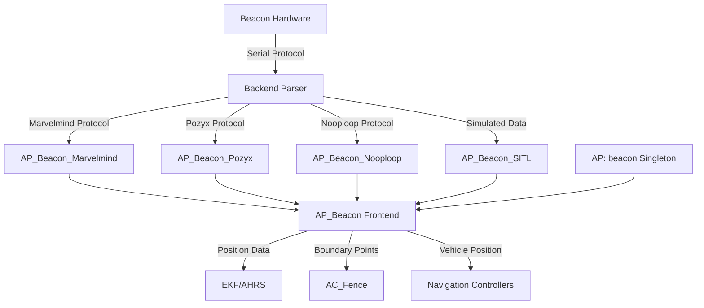

# AP_Beacon

## Overview

The AP_Beacon library provides beacon-based positioning for GPS-denied navigation in ArduPilot. This subsystem enables indoor flight, underground operations, and positioning in environments where GPS signals are unavailable or degraded. The library supports multiple beacon hardware systems including Marvelmind indoor GPS, Pozyx UWB positioning, Nooploop LinkTrack, and includes a SITL simulation backend for testing.

**Key Capabilities:**
- Alternative positioning source when GPS is unavailable or degraded
- Integration with Extended Kalman Filter (EKF) for sensor fusion
- Automatic fence boundary generation from beacon anchor positions
- Support for multiple commercial beacon systems
- Health monitoring and staleness detection
- Indoor and GPS-denied autonomous flight support

**Primary Use Cases:**
- Indoor flight where GPS signals cannot penetrate
- Underground operations (caves, mines, tunnels)
- Urban canyon navigation with poor GPS visibility
- Research and development in controlled indoor environments
- Backup positioning when GPS is jammed or spoofed

## Architecture

The AP_Beacon subsystem uses a frontend/backend architecture where the frontend manages state and provides a unified API, while protocol-specific backends handle communication with different beacon hardware systems.



**Data Flow:**
1. Beacon hardware calculates position using triangulation from anchors
2. Backend parser receives serial protocol data and validates checksums
3. Backend converts coordinates from beacon system frame to NED frame
4. Frontend caches position, beacon states, and accuracy estimates
5. EKF consumes position via `get_vehicle_position_ned()` for navigation
6. Fence system uses beacon positions to generate safety boundaries

## Key Components

### AP_Beacon Frontend

The frontend class (`AP_Beacon`) provides the public API and manages system state.

**Responsibilities:**
- Backend selection and initialization based on BCN_TYPE parameter
- Beacon state management (up to 4 beacons via AP_BEACON_MAX_BEACONS)
- Vehicle position caching with timestamp and accuracy tracking
- Fence boundary computation using iterative hull algorithm
- Health monitoring with 300ms timeout (AP_BEACON_TIMEOUT_MS)
- Structured logging of beacon data for analysis

**Lifecycle:**
1. Construction: Singleton initialization via `AP::beacon()`
2. `init()`: Backend allocation using NEW_NOTHROW
3. `update()`: Called at main loop rate, delegates to backend
4. Backend updates position and beacon distances
5. Frontend validates timestamps and updates boundary

**Thread Safety:** Uses singleton pattern; called from main thread only

**Source:** `libraries/AP_Beacon/AP_Beacon.h`, `libraries/AP_Beacon/AP_Beacon.cpp`

### AP_Beacon_Backend Abstract Interface

The backend base class (`AP_Beacon_Backend`) defines the contract for beacon system implementations.

**Required Methods:**
- `healthy()`: Returns true if receiving valid data from beacon hardware
- `update()`: Called at main loop rate to read and parse serial data

**Protected Setters:** Backends use these to update frontend state:
- `set_vehicle_position(pos, accuracy)`: Reports vehicle position in NED meters from origin
- `set_beacon_distance(instance, distance)`: Reports distance to beacon in meters
- `set_beacon_position(instance, pos)`: Reports beacon anchor position in NED meters

**Coordinate Transformation:** Includes yaw correction cache and `correct_for_orient_yaw()` helper for rotating beacon coordinate system relative to true north.

**Source:** `libraries/AP_Beacon/AP_Beacon_Backend.h`, `libraries/AP_Beacon/AP_Beacon_Backend.cpp`

### BeaconState Structure

Per-beacon state tracked by the frontend:

```cpp
struct BeaconState {
    uint16_t id;                    // Unique beacon/anchor ID from hardware
    bool healthy;                   // True if updated within AP_BEACON_TIMEOUT_MS (300ms)
    float distance;                 // Distance from vehicle to beacon (meters)
    uint32_t distance_update_ms;    // Timestamp of last distance update
    Vector3f position;              // Beacon position as NED offset from origin (meters)
};
```

The frontend maintains an array of up to `AP_BEACON_MAX_BEACONS` (default 4) beacon states.

## Supported Beacon Systems

### Marvelmind Indoor GPS

**Technology:** Ultrasonic time-of-flight positioning with stationary beacons and mobile hedge.

**Serial Protocol:**
- Header bytes: `0xFF 0x47`
- Modbus CRC-16 validation for data integrity
- Multiple datagram types: low-resolution position, high-resolution position, stationary beacon positions, beacon distances
- Finite-state parser with RECV_HDR and RECV_DGRAM states

**Coordinate System:** ENU (East-North-Up) internally, converted to NED by backend

**Unit Conversions:** Millimeters/centimeters from protocol converted to meters for ArduPilot

**Configuration:**
- Configure beacon map using Marvelmind Dashboard software
- Upload map to mobile hedge (device mounted on vehicle)
- Set BCN_TYPE = 2 for Marvelmind backend

**Baud Rate:** Typically 9600 or 115200 bps (configure SERIAL port to match)

**Accuracy:** Sub-centimeter to few centimeters depending on beacon geometry

**More Information:** https://marvelmind.com, https://github.com/MarvelmindRobotics/marvelmind.c

**Source:** `libraries/AP_Beacon/AP_Beacon_Marvelmind.h`, `libraries/AP_Beacon/AP_Beacon_Marvelmind.cpp`

### Pozyx UWB Positioning

**Technology:** Ultra-wideband (UWB) radio positioning with Arduino shield integration.

**Serial Protocol:**
- Header byte: `0x01`
- Message IDs: `0x02` (beacon config), `0x03` (beacon distance), `0x04` (vehicle position)
- XOR checksum validation
- Maximum message length: 20 bytes (AP_BEACON_POZYX_MSG_LEN_MAX)
- Parse state machine: WaitingForHeader → WaitingForMsgId → WaitingForLen → WaitingForContents

**Distance Sanity Check:** Maximum beacon distance of 200m (AP_BEACON_DISTANCE_MAX), measurements beyond this rejected

**Configuration:**
- Configure Pozyx anchors using Arduino IDE and Pozyx library
- Connect Pozyx shield/tag to ArduPilot via serial
- Set BCN_TYPE = 1 for Pozyx backend

**Baud Rate:** Typically 115200 bps

**Accuracy:** Decimeter-level depending on environment and anchor placement

**More Information:** https://www.pozyx.io

**Source:** `libraries/AP_Beacon/AP_Beacon_Pozyx.h`, `libraries/AP_Beacon/AP_Beacon_Pozyx.cpp`

### Nooploop LinkTrack UWB

**Technology:** Ultra-wideband ranging system with tag/anchor terminology.

**Serial Protocol:**
- Dual header system: `0x55` (NODE_FRAME2 for distances/positions), `0x54` (SETTING_FRAME0 for anchor config)
- Robust byte-level state machine with separate parsers for each frame type
- 24-bit signed coordinate reconstruction from protocol bytes
- Message buffer: 256 bytes (NOOPLOOP_MSG_BUF_MAX)
- Checksum validation via CRC

**Coordinate System:** ENU internally, converted to NED by backend

**Anchor Position Request:** Tag requests anchor configuration via `request_setting()` mechanism, throttled to avoid flooding tag

**Parse States:** HEADER → H55_FUNCTION_MARK/H54_FUNCTION_MARK → LEN_L/LEN_H → NF2_PAYLOAD/SF0_PAYLOAD

**Configuration:**
- Configure LinkTrack anchors using Nooploop tools
- Connect tag to ArduPilot via serial
- Tag automatically requests anchor positions on startup
- Set BCN_TYPE = 3 for Nooploop backend

**Baud Rate:** Typically 921600 bps (high speed)

**Accuracy:** Decimeter-level UWB ranging

**More Information:** https://www.nooploop.com/en-linktrack

**Source:** `libraries/AP_Beacon/AP_Beacon_Nooploop.h`, `libraries/AP_Beacon/AP_Beacon_Nooploop.cpp`

### SITL Simulation Backend

**Purpose:** Testing beacon positioning algorithms without physical hardware.

**Simulated Configuration:**
- 4 beacons in rectangular pattern around vehicle
- Beacon positions: `(-5,-5,0)`, `(-5,5,0)`, `(5,5,0)`, `(5,-5,0)` meters from origin
- Beacon IDs: 0, 1, 2, 3

**Data Source:** Reads vehicle state from `AP::sitl()` singleton

**Update Behavior:**
- Throttled to minimum 10ms between updates
- Computes distances from simulated vehicle to each beacon
- Reports health based on AP_BEACON_TIMEOUT_MS

**Configuration:**
- Set BCN_TYPE = 10 for SITL backend
- No serial configuration needed
- Automatically enabled in SITL builds via AP_BEACON_SITL_ENABLED

**Use Cases:**
- Algorithm development and testing
- EKF integration verification
- Fence boundary algorithm testing
- GPS-denied simulation scenarios

**Source:** `libraries/AP_Beacon/AP_Beacon_SITL.h`, `libraries/AP_Beacon/AP_Beacon_SITL.cpp`

## Position Calculation and Triangulation

**Important:** The beacon hardware systems perform the triangulation calculations, not ArduPilot. Each system uses proprietary algorithms to calculate vehicle position from beacon anchor positions and measured distances.

**ArduPilot's Role:**
- Receives pre-calculated position from beacon hardware via serial protocol
- Validates position data (checksum, timestamp freshness)
- Converts coordinates from beacon system frame to NED frame
- Provides position to EKF with accuracy estimate for sensor fusion

**Positioning Requirements:**
- Minimum 3 beacons for 2D positioning (X, Y)
- Minimum 4 beacons for 3D positioning (X, Y, Z)
- Beacon geometry affects accuracy (avoid collinear or coplanar arrangements)

**Coordinate Frame Transformations:**
1. Beacon hardware calculates position in its local frame (often ENU)
2. Backend applies yaw rotation via `correct_for_orient_yaw()` if BCN_ORIENT_YAW ≠ 0
3. Backend converts ENU → NED if required (Marvelmind, Nooploop)
4. Position reported in NED frame relative to configured origin

## Configuration Parameters

Configure beacon positioning via these MAVLink parameters:

| Parameter | Description | Values | Units | Default |
|-----------|-------------|--------|-------|---------|
| BCN_TYPE | Beacon system type | 0=None, 1=Pozyx, 2=Marvelmind, 3=Nooploop, 10=SITL | - | 0 |
| BCN_LATITUDE | Beacon system origin latitude | -90 to 90 | degrees | 0 |
| BCN_LONGITUDE | Beacon system origin longitude | -180 to 180 | degrees | 0 |
| BCN_ALT | Beacon system origin altitude above sea level | 0 to 10000 | meters | 0 |
| BCN_ORIENT_YAW | Beacon system rotation from true north | -180 to 180 | degrees | 0 |

**Serial Port Configuration:**

Configure a UART port for beacon communication:
- `SERIALx_PROTOCOL`: Set to Beacon (protocol number varies by HAL, typically 13)
- `SERIALx_BAUD`: Match beacon system baud rate
  - Marvelmind: 9600 or 115200
  - Pozyx: 115200
  - Nooploop: 921600
  - SITL: N/A (no serial required)

**Origin Configuration:**

The beacon system origin (BCN_LATITUDE/LONGITUDE/ALT) defines the global coordinates of the beacon coordinate system's origin point. This allows the EKF to relate beacon positions to GPS coordinates.

- Set origin to a known location within or near the beacon coverage area
- Typically set to the location of one beacon anchor
- Must be configured for `get_origin()` to return valid Location

**Yaw Orientation:**

BCN_ORIENT_YAW rotates the beacon coordinate system relative to true north:
- 0°: Beacon "north" aligns with true north
- 90°: Beacon coordinate system rotated 90° clockwise
- Use when beacon system cannot be aligned with true north
- Applied via `correct_for_orient_yaw()` in backend

## Beacon Anchor Configuration

Each beacon system requires proper anchor placement and configuration before use.

### Marvelmind Setup

1. **Anchor Placement:**
   - Mount stationary beacons at known positions around operating area
   - Elevate beacons above obstacles for clear line-of-sight
   - Avoid reflective surfaces that cause multipath errors
   - Typical anchor height: 1-3 meters

2. **Map Configuration:**
   - Use Marvelmind Dashboard software to configure beacon map
   - Define anchor positions in beacon coordinate system
   - Upload map to mobile hedge (device on vehicle)

3. **Mobile Hedge:**
   - Connect hedge to ArduPilot UART
   - Hedge outputs position data via serial
   - Position calculated by hedge firmware, not anchors

### Pozyx Setup

1. **Anchor Placement:**
   - Position 3+ anchors around operating area
   - Mount at known locations with clear UWB line-of-sight
   - Avoid metal obstacles between tag and anchors

2. **Anchor Configuration:**
   - Use Arduino IDE with Pozyx library to configure each anchor
   - Set anchor positions in coordinate system
   - Configure ranging protocol and update rates

3. **Tag Configuration:**
   - Connect Pozyx tag/shield to ArduPilot
   - Tag performs positioning calculations
   - Outputs position, beacon distances via serial

### Nooploop LinkTrack Setup

1. **Anchor Placement:**
   - Deploy 3+ LinkTrack anchors around area
   - Mount with clear UWB line-of-sight to tag
   - Record anchor positions

2. **Anchor Configuration:**
   - Configure anchors using Nooploop software
   - Set anchor IDs and positions
   - Configure ranging parameters

3. **Tag Integration:**
   - Connect LinkTrack tag to ArduPilot UART
   - Tag requests anchor positions automatically via `request_setting()`
   - Tag calculates position and reports via serial

### General Anchor Placement Guidelines

**Coverage:** Ensure anchors surround the operating area for consistent positioning.

**Geometry:** 
- Avoid collinear beacon arrangements (all in a line)
- Avoid coplanar arrangements for 3D positioning
- Optimal: Anchors at different heights and horizontal positions
- Larger anchor spacing generally improves accuracy

**Height:**
- Elevate anchors 1-3 meters above vehicle operating height
- Provides better angle diversity for triangulation

**Obstructions:**
- Maintain line-of-sight between vehicle and anchors
- Ultrasonic systems (Marvelmind) require clear acoustic path
- UWB systems (Pozyx, Nooploop) can penetrate some materials but avoid metal

**Minimum Beacons:**
- 3 beacons: 2D positioning (X, Y) only
- 4 beacons: Full 3D positioning (X, Y, Z)
- More beacons: Improved accuracy and redundancy

## EKF Integration

The AP_Beacon library integrates with ArduPilot's Extended Kalman Filter (EKF) to provide position estimates in GPS-denied environments.

**Position Source:** The EKF queries beacon position via `get_vehicle_position_ned()`, which returns:
- Vehicle position in NED frame (meters) relative to beacon origin
- Accuracy estimate (meters) for sensor fusion weighting
- Boolean indicating if data is valid and fresh

**Fusion Weighting:** The EKF uses the accuracy estimate to weight beacon position against other sensors (GPS, optical flow, visual odometry). Lower accuracy values indicate higher confidence.

**GPS Fallback:** When GPS is unavailable or degraded:
- EKF switches to beacon position as primary position source
- Enables position hold, loiter, and auto missions indoors
- Maintains navigation continuity in GPS-denied areas

**Altitude Source:** Beacon systems can provide 3D positioning (X, Y, Z), but:
- Barometric altitude often preferred for Z axis
- Beacon Z used when barometer unavailable or unreliable
- EKF fuses beacon altitude with barometer for improved accuracy

**Origin Synchronization:** The beacon origin (BCN_LATITUDE/LONGITUDE/ALT) allows EKF to relate beacon positions to global coordinates, enabling GPS↔beacon transitions.

**Staleness Detection:** `get_vehicle_position_ned()` returns false if position not updated within AP_BEACON_TIMEOUT_MS (300ms), preventing EKF from using stale data.

**Related Modules:** AP_AHRS (AHRS interface), AP_NavEKF2 (EKF2 implementation), AP_NavEKF3 (EKF3 implementation)

**Source:** `libraries/AP_Beacon/AP_Beacon.cpp:174-190`

## Indoor Navigation and GPS-Denied Flight

**Primary Application:** Indoor flight where GPS signals cannot penetrate buildings.

**Supported Flight Modes:** With beacon positioning, vehicles can execute:
- **Stabilize/AltHold:** Manual flight with altitude/attitude stabilization
- **Loiter:** Position hold at current location
- **Auto:** Execute waypoint missions in beacon coordinate system
- **Guided:** Navigate to commanded positions
- **RTL/Land:** Return to launch and land

**Position Control:** Beacon positioning enables full position controller operation:
- AC_PosControl uses beacon-derived position for horizontal control
- Velocity and position hold loops function normally
- Waypoint navigation operates in beacon local frame

**Altitude Control:**
- Barometer typically provides altitude reference
- Beacon Z-axis used if available and reliable
- Rangefinder can supplement for terrain following

**Mission Planning:**
- Waypoints defined relative to beacon origin
- Mission must stay within beacon coverage area
- Verify beacon health before mission execution

**Failsafe Considerations:**
- Loss of beacon position triggers failsafe (similar to GPS loss)
- Configure RTL to land if beacon lost
- Consider beacon coverage area in failsafe planning

**Performance Requirements:**
- Update rate: Beacon systems should provide 1-10 Hz updates
- Latency: Total latency (beacon calc + serial + processing) should be <100ms
- Accuracy: Sub-meter accuracy recommended for safe navigation

## Fence Boundary Generation

The AP_Beacon subsystem automatically generates a fence boundary polygon from detected beacon positions, providing a safety perimeter for indoor flight.

**Algorithm:** Iterative convex hull construction using angular sweep

**Implementation:** `update_boundary_points()` method in AP_Beacon frontend

**Process:**
1. Collect 2D positions (X, Y) of all healthy beacons
2. Require minimum of AP_BEACON_MINIMUM_FENCE_BEACONS (typically 3)
3. Select starting beacon (arbitrary)
4. Iteratively find next boundary point using `get_next_boundary_point()`:
   - Compute angle to each candidate beacon using `atan2f()`
   - Select beacon with smallest clockwise angle from previous edge
   - Handle angle wraparound with `wrap_2PI()`
5. Detect closure when next point equals starting point
6. Store polygon in `boundary[]` array in centimeters
7. Prune interior points (only hull vertices retained)

**Output Format:**
- Array of `Vector2f` points in centimeters (X, Y)
- Maximum points: AP_BEACON_MAX_BEACONS + 1
- Accessed via `get_boundary_points(num_points)`

**Integration with AC_Fence:**
- Fence module can query boundary points for inclusion/exclusion zones
- Polygon defines safe operating area based on beacon coverage
- Vehicle kept within beacon position accuracy range

**Limitations:**
- 2D boundary only (X, Y plane)
- Convex hull (concave areas not captured)
- Updates dynamically as beacons detected/lost

**Source:** `libraries/AP_Beacon/AP_Beacon.cpp:257-339`

## Health Monitoring

The beacon subsystem provides comprehensive health monitoring to ensure position data reliability.

**System Health:** `healthy()` method returns true if:
- Backend is initialized (`device_ready()`)
- Backend reports `healthy()`
- At least one beacon is healthy

**Per-Beacon Health:** Each beacon tracked independently via `BeaconState.healthy`:
- Updated when distance or position received from hardware
- Marked unhealthy if not updated within AP_BEACON_TIMEOUT_MS (300ms)
- Individual beacon health accessible via `beacon_healthy(instance)`

**Position Staleness:** Vehicle position marked stale if:
- No update within AP_BEACON_TIMEOUT_MS (300ms)
- `get_vehicle_position_ned()` returns false for stale position
- Prevents EKF from using old data

**Distance Validity:** `beacon_distance()` returns 0.0 if:
- Beacon instance out of range
- Beacon not healthy
- Distance not recently updated

**Diagnostic Methods:**
- `count()`: Number of detected beacons (should match anchor count)
- `beacon_last_update_ms(instance)`: Timestamp of last update
- `get_beacon_data(instance, state)`: Complete beacon state retrieval

**Health Indicators:**
- All beacons healthy: Optimal positioning accuracy
- Some beacons unhealthy: Degraded accuracy, positioning may continue
- All beacons unhealthy: No position available, failsafe triggered
- Beacon count mismatch: Possible configuration or hardware issue

**Troubleshooting:**
- Check `count()` matches expected anchor count
- Verify all `beacon_healthy()` return true
- Monitor `beacon_last_update_ms()` for update frequency
- Check serial baud rate and protocol configuration
- Verify line-of-sight between vehicle and anchors

## Coordinate Systems

**NED Frame (North-East-Down):** All positions in AP_Beacon use NED frame:
- **North (X):** Positive north, negative south
- **East (Y):** Positive east, negative west
- **Down (Z):** Positive down (below origin), negative up (above origin)

**Origin Point:** Defined by BCN_LATITUDE, BCN_LONGITUDE, BCN_ALT:
- All beacon and vehicle positions measured as NED offsets from this point
- Origin typically set to location of one beacon anchor
- Must be configured for `get_origin()` to return valid Location

**Beacon System Frames:** Hardware systems may use different internal frames:
- **Marvelmind:** Uses ENU (East-North-Up) internally, converted to NED by backend
- **Nooploop:** Uses ENU internally, converted to NED by backend
- **Pozyx:** Coordinate system configurable, backend handles transformation
- **SITL:** Directly generates NED positions

**Coordinate Transformations:**

1. **Beacon System Frame → Backend Frame:**
   - Hardware-specific transformation in backend
   - Example (Marvelmind): `(x_enu, y_enu, z_enu) → (y_enu, x_enu, -z_enu)` = `(x_ned, y_ned, z_ned)`

2. **Yaw Rotation (BCN_ORIENT_YAW):**
   - Applied via `correct_for_orient_yaw()` helper
   - Rotates beacon coordinate system around Z-axis
   - Allows beacon system alignment independent of true north
   - Transformation: `x_rotated = x*cos(yaw) - y*sin(yaw)`, `y_rotated = x*sin(yaw) + y*cos(yaw)`

3. **Backend Frame → Frontend NED:**
   - Backend calls `set_vehicle_position(pos)` with NED coordinates
   - Frontend caches position for EKF consumption

**Units:** All positions and distances in **meters** throughout AP_Beacon. Beacon hardware protocols may use millimeters or centimeters, converted by backends.

**Frame Consistency:** Backends are responsible for ensuring all positions reported to frontend are in NED frame, regardless of beacon hardware coordinate system.

## Testing with Hardware

**Hardware Connection:**

1. **Physical Connection:**
   - Connect beacon receiver/tag to ArduPilot UART port
   - Use appropriate voltage level (3.3V or 5V) for hardware
   - TX from beacon → RX on ArduPilot
   - RX on beacon ← TX on ArduPilot
   - Common ground between beacon and ArduPilot

2. **Serial Port Configuration:**
   ```
   SERIALx_PROTOCOL = 13 (Beacon)  # Protocol number may vary by HAL
   SERIALx_BAUD = <match beacon system>
     Marvelmind: 9600 or 115200
     Pozyx: 115200
     Nooploop: 921600
   ```

3. **Beacon System Configuration:**
   ```
   BCN_TYPE = <match hardware>
     1 = Pozyx
     2 = Marvelmind
     3 = Nooploop
   BCN_LATITUDE = <origin latitude in degrees>
   BCN_LONGITUDE = <origin longitude in degrees>
   BCN_ALT = <origin altitude in meters>
   BCN_ORIENT_YAW = <rotation from north in degrees>
   ```

**Verification Procedure:**

1. **Check Beacon Detection:**
   ```
   # Via MAVLink or ground station
   beacon.count()  # Should return number of configured anchors
   ```
   If count is 0, check serial connection and baud rate.

2. **Verify System Health:**
   ```
   beacon.healthy()  # Should return true
   ```
   If false, check that beacons are powered and transmitting.

3. **Check Individual Beacon Health:**
   ```
   for i in range(beacon.count()):
       beacon.beacon_healthy(i)  # Each should return true
   ```

4. **Monitor Beacon Distances:**
   ```
   for i in range(beacon.count()):
       distance = beacon.beacon_distance(i)  # Should show reasonable values
   ```
   Distances should match approximate vehicle-to-anchor distances.

5. **Verify Position Calculation:**
   ```
   pos, accuracy = beacon.get_vehicle_position_ned()
   # pos should show reasonable X, Y, Z values in meters
   # accuracy should be < 1.0 for good positioning
   ```

6. **Check Update Rate:**
   ```
   for i in range(beacon.count()):
       timestamp = beacon.beacon_last_update_ms(i)
       # Should update continuously, check timestamps advancing
   ```

**Common Issues:**

- **Count returns 0:** Serial not connected, wrong baud rate, wrong protocol
- **healthy() false:** Beacons not transmitting, serial errors, obstruction
- **Distance shows 0:** Beacon not detected by hardware, line-of-sight blocked
- **Position not updating:** Vehicle outside beacon coverage area
- **Erratic position:** Poor beacon geometry, multipath errors, interference

## Testing with SITL

Software-in-the-loop (SITL) simulation provides beacon testing without physical hardware.

**SITL Configuration:**

```bash
# Start SITL with Copter
sim_vehicle.py -v ArduCopter --console --map

# Configure beacon system
param set BCN_TYPE 10        # 10 = SITL backend
param set BCN_LATITUDE -35.363261
param set BCN_LONGITUDE 149.165230
param set BCN_ALT 584
param set BCN_ORIENT_YAW 0
```

**Simulated Beacon Pattern:**

SITL creates 4 beacons in rectangular pattern:
- Beacon 0: (-5, -5, 0) meters from origin
- Beacon 1: (-5, +5, 0) meters from origin
- Beacon 2: (+5, +5, 0) meters from origin
- Beacon 3: (+5, -5, 0) meters from origin

Pattern forms 10m x 10m square centered on origin.

**Verification:**

```python
# Check beacon detection
beacon.count()  # Should return 4

# Check health
beacon.healthy()  # Should return true

# View beacon distances (from vehicle position)
for i in range(4):
    print(f"Beacon {i}: {beacon.beacon_distance(i):.2f} m")

# Get vehicle position
pos, acc = beacon.get_vehicle_position_ned()
print(f"Position NED: ({pos.x:.2f}, {pos.y:.2f}, {pos.z:.2f}) m")
print(f"Accuracy: {acc:.2f} m")
```

**Testing EKF Integration:**

```bash
# Disable GPS to force beacon usage
param set SIM_GPS_DISABLE 1

# Arm and takeoff
mode guided
arm throttle
takeoff 2

# Test loiter (should hold position using beacons)
mode loiter

# Test auto mission (waypoints relative to beacon origin)
# Create mission with waypoints within ±5m of origin
```

**SITL Use Cases:**
- Algorithm development without hardware
- EKF integration testing
- Fence boundary algorithm verification
- GPS-denied flight mode testing
- Continuous integration testing

**Limitations:**
- Simplified simulation (no signal degradation, perfect accuracy)
- Fixed rectangular beacon pattern
- No realistic errors or noise
- Always reports healthy beacons

## Logging

Beacon data is logged to onboard storage when `HAL_LOGGING_ENABLED` is defined.

**Log Structure:** `log_Beacon` format

```cpp
struct PACKED log_Beacon {
    LOG_PACKET_HEADER;              // Standard log header
    uint64_t time_us;               // Timestamp (microseconds since boot)
    uint8_t health;                 // System health: 0=unhealthy, 1=healthy
    uint8_t count;                  // Number of detected beacons
    float dist0;                    // Distance to beacon 0 (meters)
    float dist1;                    // Distance to beacon 1 (meters)
    float dist2;                    // Distance to beacon 2 (meters)
    float dist3;                    // Distance to beacon 3 (meters)
    float posx;                     // Vehicle position X/North (meters)
    float posy;                     // Vehicle position Y/East (meters)
    float posz;                     // Vehicle position Z/Down (meters)
};
```

**Log Message ID:** `BCN` in dataflash logs

**Logging Trigger:** `log()` method called from vehicle main loop when enabled

**Analysis:**
- Use Mission Planner or MAVExplorer to extract BCN messages
- Plot position (posx, posy, posz) to visualize vehicle track
- Compare beacon position with GPS position (if available)
- Monitor distance values to check beacon detection
- Health and count indicate system status over time

**Log Replay:**
- Beacon logs can be replayed using Replay tool
- Useful for offline EKF tuning and algorithm development
- Beacon positions reconstructed from log data

**Performance Debugging:**
- Check logging rate (should match update rate)
- Verify distances show expected values
- Identify periods of beacon loss (count drops)
- Analyze position jumps or drift

**Source:** `libraries/AP_Beacon/LogStructure.h`, `libraries/AP_Beacon/AP_Beacon.cpp:441-457`

## Implementation Notes

**Maximum Beacons:** AP_BEACON_MAX_BEACONS = 4 (configurable in `AP_Beacon_config.h`)
- Frontend maintains array of 4 beacon states
- Backends allocate beacons dynamically as detected
- Increasing limit requires more memory and processing

**Timeout Configuration:** AP_BEACON_TIMEOUT_MS = 300ms
- Beacons marked unhealthy if not updated within timeout
- Position marked stale if not updated within timeout
- Adjustable in `AP_Beacon_config.h` if different timeout needed

**Backend Allocation:** Backends allocated with NEW_NOTHROW during `init()`
- Prevents out-of-memory panics on constrained boards
- Check for nullptr after allocation (handled in init)
- Backends deleted automatically when AP_Beacon destroyed

**Serial Protocol Parsing:** All backends implement stateful parsers:
- Byte-by-byte processing in `update()` loop
- Checksum validation (CRC, XOR, Modbus) before accepting data
- State machines handle partial packets and resynchronization
- Buffer sizes dimensioned for maximum packet length

**Coordinate Caching:** Frontend caches position and beacon states:
- Avoids repeated backend queries
- Timestamps enable staleness detection
- Mutex not required (single-threaded access)

**Boundary Update:** `update_boundary_points()` called from `update()`:
- Recomputes fence boundary each update cycle
- Low computational cost (simple atan2 comparisons)
- Could be optimized to update only when beacons change

**Parameter Storage:** Uses AP_Param for persistent parameter storage:
- Parameters saved to EEPROM/flash
- Loaded automatically on boot
- Editable via MAVLink or ground station

**Build-Time Configuration:** Feature flags in `AP_Beacon_config.h`:
- `AP_BEACON_ENABLED`: Master enable (default: boards >2MB flash)
- `AP_BEACON_MARVELMIND_ENABLED`: Marvelmind backend
- `AP_BEACON_POZYX_ENABLED`: Pozyx backend
- `AP_BEACON_NOOPLOOP_ENABLED`: Nooploop backend
- `AP_BEACON_SITL_ENABLED`: SITL backend (SITL builds only)

**Singleton Pattern:** Accessed via `AP::beacon()` namespace function:
- Single instance per vehicle
- Construction enforced in SITL builds (asserts if multiple instances)
- Stored in `_singleton` static member

## Safety Considerations

**Position Accuracy:** Beacon positioning accuracy depends heavily on anchor geometry and environment.

- **Good Geometry:** Anchors surrounding vehicle at different heights and positions
- **Poor Geometry:** Collinear anchors, coplanar arrangements, all anchors on one side
- **Verify Accuracy:** Check accuracy estimate returned by `get_vehicle_position_ned()`
- **EKF Tuning:** Adjust EKF parameters to reflect actual beacon accuracy

**Anchor Placement:** Poor anchor placement significantly degrades position quality.

- Avoid placing all anchors at same height (reduces Z accuracy)
- Ensure anchors surround operating area
- Maintain line-of-sight between vehicle and anchors
- Test positioning throughout operating area before flight

**Health Monitoring:** Always verify `healthy()` before trusting beacon position.

- Monitor individual beacon health via `beacon_healthy()`
- Check beacon count matches expected anchor count
- Verify position update timestamps advancing
- Configure failsafe to land if beacon unhealthy

**Coverage Area:** Vehicle must remain within beacon system coverage.

- Typical range: 10-30 meters depending on system
- Position degrades near coverage boundary
- Configure fence to keep vehicle within coverage
- Plan missions to stay well within beacon range

**Indoor Hazards:** Indoor flight introduces unique safety risks.

- **Prop Guards:** Mandatory for indoor flight
- **Collision Avoidance:** No GPS-based ADS-B, limited sensors
- **Emergency Landing:** Ensure safe landing area available
- **Failsafe:** Configure to land immediately on beacon loss
- **Obstacle Detection:** Consider rangefinders or vision systems

**Failsafe Configuration:** Configure appropriate failsafe for beacon loss.

```
FS_EKF_ACTION = 1 (Land)        # Land if EKF unhealthy
FS_EKF_THRESH = 0.8             # EKF threshold
```

**Testing:** Thoroughly test beacon positioning before flight.

- Verify position accuracy on ground at multiple locations
- Check all beacon distances reasonable
- Test failsafe triggers (disconnect beacon, move out of range)
- Start with stabilize mode, progress to position modes
- Fly low and slow initially

**Multipath and Interference:** Indoor environments cause signal reflections.

- Marvelmind: Reflective surfaces cause ultrasonic multipath
- Pozyx/Nooploop: Metal objects interfere with UWB signals
- Test in actual operating environment
- Identify and mitigate sources of interference

**Backup Systems:** Consider redundant positioning sources.

- Optical flow for velocity backup
- Visual odometry for position backup
- Rangefinder for altitude backup
- Dead reckoning for brief beacon outages

## References

**Source Code:**
- Frontend: `libraries/AP_Beacon/AP_Beacon.h`, `libraries/AP_Beacon/AP_Beacon.cpp`
- Backend Interface: `libraries/AP_Beacon/AP_Beacon_Backend.h`, `libraries/AP_Beacon/AP_Beacon_Backend.cpp`
- Marvelmind: `libraries/AP_Beacon/AP_Beacon_Marvelmind.h`, `libraries/AP_Beacon/AP_Beacon_Marvelmind.cpp`
- Pozyx: `libraries/AP_Beacon/AP_Beacon_Pozyx.h`, `libraries/AP_Beacon/AP_Beacon_Pozyx.cpp`
- Nooploop: `libraries/AP_Beacon/AP_Beacon_Nooploop.h`, `libraries/AP_Beacon/AP_Beacon_Nooploop.cpp`
- SITL: `libraries/AP_Beacon/AP_Beacon_SITL.h`, `libraries/AP_Beacon/AP_Beacon_SITL.cpp`
- Configuration: `libraries/AP_Beacon/AP_Beacon_config.h`
- Logging: `libraries/AP_Beacon/LogStructure.h`

**Related ArduPilot Modules:**
- AP_AHRS: Attitude and Heading Reference System, EKF interface
- AP_NavEKF2: Extended Kalman Filter 2 implementation
- AP_NavEKF3: Extended Kalman Filter 3 implementation  
- AC_Fence: Geofencing system (uses beacon boundary)
- AC_PosControl: Position controller (uses beacon position)
- AP_SerialManager: Serial port management for beacon communication

**Hardware Vendor Information:**
- Marvelmind Indoor GPS: https://marvelmind.com
- Marvelmind Protocol Reference: https://github.com/MarvelmindRobotics/marvelmind.c
- Pozyx UWB Positioning: https://www.pozyx.io
- Nooploop LinkTrack: https://www.nooploop.com/en-linktrack

**ArduPilot Documentation:**
- Developer Documentation: https://ardupilot.org/dev/
- Indoor Flying Guide: https://ardupilot.org/copter/docs/indoor-flying.html
- Non-GPS Navigation: https://ardupilot.org/copter/docs/common-non-gps-navigation.html

**Technical Standards:**
- Ultra-Wideband (UWB): IEEE 802.15.4a/z
- MAVLink Protocol: https://mavlink.io/
