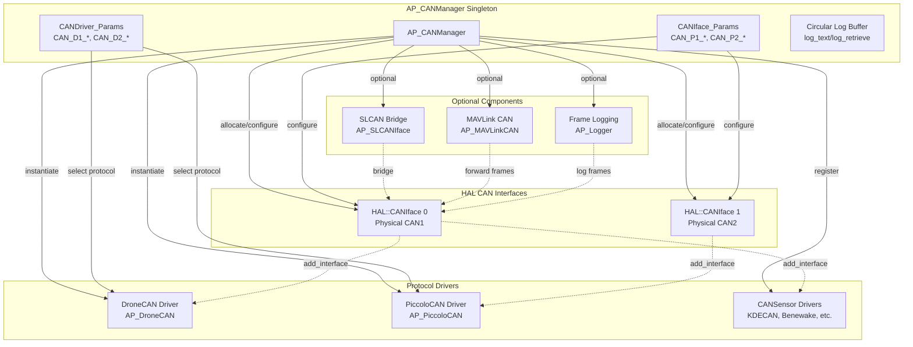
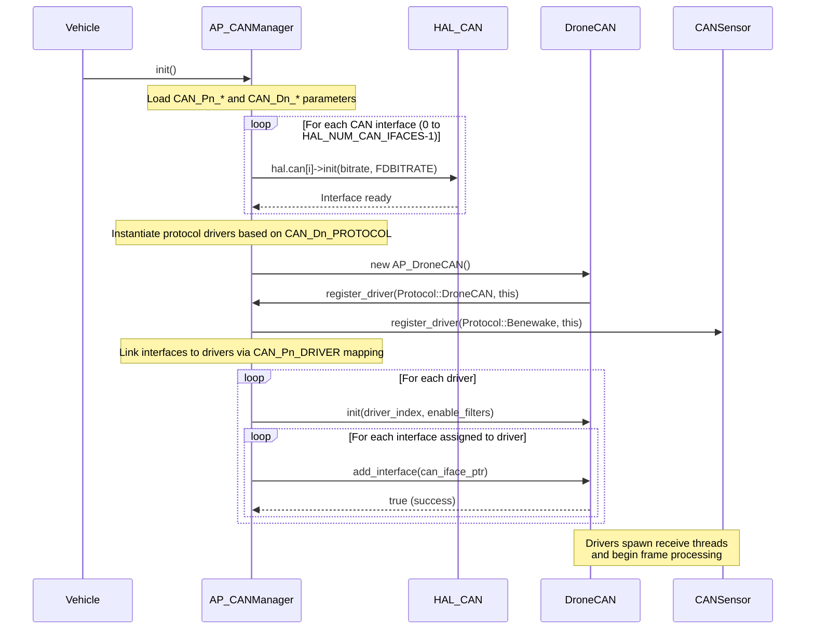

# AP_CANManager

## Overview

AP_CANManager is the singleton coordinator for the ArduPilot CAN subsystem, managing multiple physical CAN interfaces and protocol drivers across the entire vehicle. It provides centralized control over CAN bus configuration, protocol driver instantiation, interface-to-driver routing, frame logging, and debugging capabilities.

**Key Responsibilities:**
- Manage up to `HAL_NUM_CAN_IFACES` physical CAN interfaces (typically 2 for redundancy)
- Coordinate up to `HAL_MAX_CAN_PROTOCOL_DRIVERS` protocol driver instances (typically 2-6 depending on board)
- Allocate and configure HAL CAN interfaces with bitrate settings from parameters
- Instantiate protocol drivers (DroneCAN, PiccoloCAN, KDECAN, etc.) based on `CAN_Dn_PROTOCOL` parameters
- Route CAN interfaces to protocol drivers via `CAN_Pn_DRIVER` parameter mapping
- Provide circular text logging buffer for CAN subsystem debug messages
- Integrate SLCAN serial-to-CAN bridge for debugging (when `AP_CAN_SLCAN_ENABLED`)
- Forward CAN frames via MAVLink for ground station analysis (when `HAL_GCS_ENABLED`)
- Log CAN frames to dataflash/SD card (when `AP_CAN_LOGGING_ENABLED`)

**Supported CAN Protocols:**
- **DroneCAN** (Protocol 1): Primary ArduPilot CAN protocol for GPS, compass, airspeed, rangefinder, ESCs, servos
- **PiccoloCAN** (Protocol 4): Currawong ECUs and actuators for fuel injection and generator control
- **KDECAN** (Protocol 8): KDE Direct high-power brushless ESCs with telemetry
- **EFI_NWPMU** (Protocol 6): Northwest UAV electronic fuel injection controllers
- **USD1** (Protocol 7): Vendor-specific protocol
- **Scripting/Scripting2** (Protocols 10, 12): Lua scripting CAN interfaces for custom protocols
- **Benewake** (Protocol 11): TF series LiDAR rangefinders
- **TOFSenseP** (Protocol 13): Laser rangefinder protocol
- **RadarCAN** (Protocol 14): NanoRadar and Hexsoon radar sensors

## Architecture

### Component Structure



### Driver Registration and Initialization Flow



### SLCAN Bridge and MAVLink Integration

AP_CANManager integrates optional debugging and bridging components:

- **SLCAN Serial Bridge** (`AP_SLCANIface`): Exposes CAN bus via serial port using SLCAN protocol, enabling connection to PC-based CAN analyzers (CANable, PCAN-USB). Configured via `CAN_SLCAN_*` parameters.

- **MAVLink CAN Forwarding** (`AP_MAVLinkCAN`): Bidirectional MAVLink↔CAN bridge allowing ground control stations to inject/monitor CAN frames remotely. Supports `MAV_CMD_CAN_FORWARD`, `CAN_FRAME`, `CANFD_FRAME`, and `CAN_FILTER_MODIFY` messages.

- **Frame Logging** (`AP_Logger` integration): Logs CAN frames to dataflash/SD card when `CAN_Pn_OPTIONS` bit 0 (LOG_ALL_FRAMES) is set. Generates `CAN` and `CAFD` log messages for post-flight analysis.

## Platform Support

### CAN Driver Availability by Platform

| Platform | HAL_NUM_CAN_IFACES | HAL_MAX_CAN_PROTOCOL_DRIVERS | CAN-FD Support | Notes |
|----------|-------------------|------------------------------|----------------|-------|
| **ChibiOS/ARM** | 0-2 (board-specific) | 0-6 (board-specific) | Yes (STM32G4, STM32H7) | Most flight controllers, hwdef configures |
| **Linux** | 0-2 (SocketCAN) | 0-6 | No | Navio, BBBmini, requires kernel drivers |
| **ESP32** | 0-1 | 0-2 | No | ESP32 TWAI peripheral |
| **SITL** | 0-2 (simulated) | 0-6 | Yes (simulated) | Software-in-the-loop testing |
| **QURT** | 0 | 0 | No | Qualcomm Hexagon DSP, no CAN |

**Board Configuration**: CAN support is defined in board hwdef files (e.g., `libraries/AP_HAL_ChibiOS/hwdef/*/hwdef.dat`). Boards without CAN transceivers set `HAL_MAX_CAN_PROTOCOL_DRIVERS 0` to disable the entire subsystem and save flash space (~50KB).

### Compile-Time Feature Flags

- `HAL_CANMANAGER_ENABLED`: Master enable for entire CAN subsystem (default: `HAL_MAX_CAN_PROTOCOL_DRIVERS > 0`)
- `HAL_CANFD_SUPPORTED`: Enable CAN-FD support on capable hardware (STM32G4/H7)
- `HAL_ENABLE_DRONECAN_DRIVERS`: Compile DroneCAN protocol driver (default: enabled)
- `HAL_PICCOLO_CAN_ENABLE`: Compile PiccoloCAN protocol driver (default: board-specific)
- `AP_CAN_SLCAN_ENABLED`: Compile SLCAN serial bridge (default: enabled if CAN enabled)
- `AP_CAN_LOGGING_ENABLED`: Compile frame logging to dataflash (default: enabled if CAN + logging enabled)
- `HAL_GCS_ENABLED`: Enables MAVLink CAN forwarding (default: enabled on main firmware)

## Interface Configuration

### CAN Interface Parameters (CAN_Pn_*)

Each physical CAN interface (n = 1 to `HAL_NUM_CAN_IFACES`) is configured via parameter group `CAN_Pn_*`:

#### CAN_Pn_DRIVER - Interface-to-Driver Mapping

Maps physical CAN interface to protocol driver index.

| Value | Meaning | Notes |
|-------|---------|-------|
| 0 | Disabled (default) | Interface not used |
| 1 | First driver (CAN_D1_*) | Most common configuration |
| 2 | Second driver (CAN_D2_*) | Enables multiple protocols simultaneously |
| 3+ | Third/fourth/etc. driver | Depends on `HAL_MAX_CAN_PROTOCOL_DRIVERS` |

**Example Configuration:**
- `CAN_P1_DRIVER = 1` → Physical CAN1 uses first driver (e.g., DroneCAN)
- `CAN_P2_DRIVER = 1` → Physical CAN2 also uses first driver (redundancy)
- `CAN_P1_DRIVER = 1`, `CAN_P2_DRIVER = 2` → CAN1 uses driver 1, CAN2 uses driver 2 (multiple protocols)

#### CAN_Pn_BITRATE - Communication Speed

Bitrate in bits per second for CAN 2.0 arbitration phase (and CAN-FD arbitration phase).

| Range | Typical Values | Trade-offs |
|-------|---------------|------------|
| 10,000 - 1,000,000 | 125k, 250k, 500k, 1000k | Higher bitrate = more throughput but shorter cable length |
| **Default: 1,000,000** | 1 Mbps | Standard for DroneCAN, maximum ~40m cable |

**Bitrate vs Cable Length Guidelines:**
- **1 Mbps**: ≤40 meters
- **500 kbps**: ≤100 meters
- **250 kbps**: ≤200 meters
- **125 kbps**: ≤500 meters
- **50 kbps**: ≤1000 meters

All devices on the bus **must** use the same bitrate. Mismatch causes communication failure.

#### CAN_Pn_FDBITRATE - CAN-FD Data Phase Bitrate

**Only available when `HAL_CANFD_SUPPORTED` (STM32G4/H7 boards)**

Data phase bitrate for CAN-FD frames in bits per second. Arbitration phase uses `CAN_Pn_BITRATE`.

| Range | Typical Values | Notes |
|-------|---------------|-------|
| CAN_Pn_BITRATE - 8,000,000 | 2M, 4M, 5M | Must be ≥ arbitration bitrate |
| **Default: 4,000,000** | 4 Mbps | Provides 4x throughput improvement |

**Note**: All CAN-FD devices on bus must support the same data phase bitrate. Classic CAN 2.0 devices will ignore CAN-FD frames.

#### CAN_Pn_OPTIONS - Bitmask Options

| Bit | Option | Description | Performance Impact |
|-----|--------|-------------|-------------------|
| 0 | LOG_ALL_FRAMES | Log every CAN frame to dataflash/SD card | **HIGH** - fills logs quickly, impacts scheduler |

**Usage**: Set `CAN_P1_OPTIONS = 1` to enable frame logging on interface 1.

**Warning**: Logging all frames on a busy bus (>1000 frames/sec) significantly impacts system performance and fills dataflash rapidly. Use only for targeted debugging.

## Protocol Driver Configuration

### CAN Driver Parameters (CAN_Dn_*)

Each protocol driver slot (n = 1 to `HAL_MAX_CAN_PROTOCOL_DRIVERS`) is configured via parameter group `CAN_Dn_*`:

#### CAN_Dn_PROTOCOL - Primary Protocol Selection

Selects which protocol driver to instantiate for this driver slot.

| Value | Protocol | Driver Class | Notes |
|-------|----------|--------------|-------|
| 0 | None (default) | - | Driver slot disabled |
| 1 | DroneCAN | AP_DroneCAN | Primary ArduPilot CAN protocol |
| 4 | PiccoloCAN | AP_PiccoloCAN | Currawong ECU/actuator protocol |
| 6 | EFI_NWPMU | CANSensor | Northwest UAV fuel injection |
| 7 | USD1 | CANSensor | Vendor-specific protocol |
| 8 | KDECAN | CANSensor | KDE Direct ESC protocol |
| 10 | Scripting | CANSensor | Lua scripting CAN interface (primary) |
| 11 | Benewake | CANSensor | TF series LiDAR rangefinders |
| 12 | Scripting2 | CANSensor | Lua scripting CAN interface (secondary) |
| 13 | TOFSenseP | CANSensor | Laser rangefinder protocol |
| 14 | RadarCAN | CANSensor | NanoRadar/Hexsoon radar sensors |

**Deprecated Values** (do not reuse):
- 2: Was KDECAN (now protocol 8)
- 3: Was ToshibaCAN
- 5: Was CANTester
- 9: Was MPPT_PacketDigital

**Example Configuration:**
- `CAN_D1_PROTOCOL = 1` → First driver is DroneCAN
- `CAN_D2_PROTOCOL = 8` → Second driver is KDECAN (allows DroneCAN + KDECAN simultaneously)

#### CAN_Dn_PROTOCOL2 - 11-bit Auxiliary Protocol

**Optional**: Secondary protocol using 11-bit CAN addressing, coexisting with primary 29-bit protocol.

Supported by drivers implementing `add_11bit_driver()` (e.g., DroneCAN can host 11-bit rangefinders).

| Value | Protocol | Notes |
|-------|----------|-------|
| 0 | None (default) | No auxiliary protocol |
| 11 | Benewake | 11-bit TF series rangefinder alongside DroneCAN |
| 13 | TOFSenseP | 11-bit laser rangefinder alongside DroneCAN |

**Example**: `CAN_D1_PROTOCOL = 1`, `CAN_D1_PROTOCOL2 = 11` → DroneCAN + Benewake 11-bit on same interface

### Driver-Specific Subparameters

Some protocol drivers register additional parameter subgroups:

- **DroneCAN**: `CAN_D1_UC_*` parameters for UAVCAN configuration (node ID, firmware update, dynamic node allocation)
- **PiccoloCAN**: `CAN_D1_PC_*` parameters for Piccolo-specific configuration

Refer to protocol-specific documentation (e.g., `libraries/AP_DroneCAN/README.md`) for details.

## Logging Configuration

### CAN_LOGLEVEL - Debug Logging Verbosity

Controls verbosity of CAN subsystem text logging to internal circular buffer (retrieved via `log_retrieve()` or GCS).

| Value | Level | Messages Logged |
|-------|-------|----------------|
| 0 | None | No logging (minimal CPU overhead) |
| 1 | Error | Critical errors only (initialization failures, bus-off) |
| 2 | Warning | Errors + warnings (malformed frames, timeout warnings) |
| 3 | Info | Warnings + informational (driver init, interface allocation) |
| 4 | Debug | All messages including verbose protocol details |

**Default**: Typically level 2 (Warning) for production use

**Usage**: Set `CAN_LOGLEVEL = 4` for maximum debug output when troubleshooting CAN issues.

**Note**: Higher log levels increase CPU usage. Debug level generates significant text output on busy CAN buses.

## Driver Initialization Sequence

The AP_CANManager initialization workflow coordinates HAL interface allocation, protocol driver instantiation, and interface-to-driver linking:

1. **Parameter Loading**: `init()` reads all `CAN_Pn_*` and `CAN_Dn_*` parameters from persistent storage (EEPROM/flash)

2. **HAL Interface Allocation**: For each physical interface (0 to `HAL_NUM_CAN_IFACES-1`):
   - Call `hal.can[i]->init(bitrate_scaled, fdbitrate_scaled)` with bitrates converted to HAL units
   - HAL configures hardware registers, transceivers, interrupt handlers
   - Interface enters ready state for driver attachment

3. **Protocol Driver Instantiation**: Based on `CAN_Dn_PROTOCOL` values:
   - If `CAN_D1_PROTOCOL = 1`: Instantiate `AP_DroneCAN` driver via conditional compilation
   - If `CAN_D2_PROTOCOL = 4`: Instantiate `AP_PiccoloCAN` driver
   - Drivers call `register_driver(dtype, this)` to register with manager

4. **Interface-to-Driver Linking**: For each driver:
   - Call `driver->init(driver_index, enable_filters)` to prepare driver
   - For each interface where `CAN_Pn_DRIVER == driver_index`:
     - Call `driver->add_interface(hal.can[p])` to link interface to driver
     - Driver stores interface pointer and begins monitoring

5. **Auxiliary Driver Registration**: If `CAN_Dn_PROTOCOL2` is set:
   - Create `CANSensor` subclass for auxiliary protocol
   - Call `register_11bit_driver(dtype, sensor, driver_index)`
   - Primary driver calls `add_11bit_driver(sensor)` to enable coexistence

6. **Optional Component Initialization**:
   - Initialize SLCAN bridge if `AP_CAN_SLCAN_ENABLED`
   - Initialize MAVLink CAN forwarding if `HAL_GCS_ENABLED`
   - Register frame logging callbacks if `AP_CAN_LOGGING_ENABLED` and `CAN_Pn_OPTIONS` bit 0 set

**Thread Execution**: After initialization, protocol drivers spawn dedicated receive threads (via scheduler) that continuously poll interfaces for incoming frames and dispatch to `handle_frame()` implementations.

## Hardware Setup Guide

### CAN Transceiver Requirements

ArduPilot flight controllers provide only the CAN protocol logic (via STM32 CAN/FDCAN peripherals). **External CAN transceivers are required** to convert logic-level signals to differential CAN_H/CAN_L bus signals.

**Common Transceivers**:
- **TJA1051/TJA1057**: General-purpose, 1Mbps, 3.3V/5V tolerant
- **SN65HVD230**: 3.3V, 1Mbps, common on CAN breakout boards
- **MCP2551**: 5V, 1Mbps (requires level shifters for 3.3V MCUs)

Most flight controllers have transceivers integrated on-board (check schematic). Custom boards must add transceivers between CAN peripheral pins and external connectors.

### Pin Assignment (Board-Specific)

CAN pin assignments are defined in board hwdef files (`libraries/AP_HAL_ChibiOS/hwdef/<board>/hwdef.dat`):

```
# Example hwdef snippet
PD0 CAN1_RX CAN1
PD1 CAN1_TX CAN1
```

Consult your board's documentation or hwdef file to identify:
- Physical connector pinout (CAN_H, CAN_L, GND, sometimes VCC)
- Pin names (varies by board: "CAN1", "CANBUS", "DRONECAN", etc.)
- Voltage levels (typically 5V for CAN bus power, 3.3V for logic)

### Termination Resistors

**CAN bus requires 120Ω termination resistors at both physical ends of the bus**. This prevents signal reflections that cause communication errors.

**Termination Rules**:
- **Two terminators required**: One at each physical end of the bus
- **Resistance**: 120Ω ±10% (standard value for CAN 2.0 and CAN-FD)
- **Placement**: Between CAN_H and CAN_L at cable endpoints
- **Not required**: On middle nodes (most devices have optional/disabled terminators)

**Common Mistakes**:
- ✗ No termination → Reflections, unreliable communication
- ✗ Only one terminator → Partial reflections, intermittent errors
- ✗ Terminators on every device → Bus overdamped, signal attenuation
- ✓ Exactly two terminators at cable ends → Reliable communication

**Built-in Terminators**: Many CAN devices have switchable or solder-jumper terminators. Enable on the two endpoint devices only.

### Common Wiring Mistakes and Detection

| Symptom | Likely Cause | Verification |
|---------|-------------|--------------|
| No CAN activity at all | Bitrate mismatch, wiring reversed | Check `CAN_Pn_BITRATE` consistency, verify CAN_H/CAN_L polarity |
| Intermittent errors, high error counters | Missing/incorrect termination, EMI | Measure 60Ω resistance between CAN_H/CAN_L when unpowered |
| Bus-off state (recovers after reboot) | Persistent errors, faulty device | Check error logs, disconnect devices one-by-one |
| Some devices work, others don't | Stub length too long, voltage drop | Measure stub lengths (<30cm), check bus voltage (should be ~2.5V differential) |
| Works at low bitrate, fails at high | Cable too long for bitrate, poor quality cable | Reduce bitrate or cable length, use twisted pair cable |

**Bus Health Monitoring**: Most CAN peripherals provide error counters (TX/RX error count) accessible via driver debug output. Increasing counters indicate physical layer issues.

## CAN Bus Topology Considerations

### Cable Length vs Bitrate

CAN bus maximum cable length inversely relates to bitrate due to signal propagation delay:

| Bitrate | Maximum Cable Length | Typical Use Case |
|---------|---------------------|------------------|
| 1 Mbps | 40 meters | Standard for DroneCAN on small-medium vehicles |
| 800 kbps | 50 meters | - |
| 500 kbps | 100 meters | Larger vehicles or longer cable runs |
| 250 kbps | 200 meters | Very large vehicles (agricultural, industrial) |
| 125 kbps | 500 meters | Industrial CAN applications |
| 50 kbps | 1000 meters | Maximum range applications |

**Note**: These are theoretical maximums assuming high-quality shielded twisted-pair cable. Real-world limits may be shorter due to EMI, cable quality, and transceiver specifications.

### Node Count Limitations

CAN 2.0 specification allows 110 nodes per bus, but practical limits depend on:
- **Transceiver drive strength**: Typical transceivers support 32-64 nodes
- **Bus capacitance**: Each node adds capacitance, limiting bus speed
- **Protocol overhead**: More nodes = more message traffic = potential bandwidth saturation

**ArduPilot Typical Configurations**:
- **Small vehicle (quadcopter)**: 3-8 nodes (GPS, compass, ESCs)
- **Medium vehicle (plane/VTOL)**: 10-20 nodes (add airspeed, servos, fuel injection)
- **Large vehicle (helicopter/ag-spray)**: 20-40 nodes (extensive sensors and actuators)

### Stub Length Requirements

**Stub**: Short cable branch from main bus to individual node.

**Stub Length Guidelines**:
- **Ideal**: <10 cm (direct connector on main bus)
- **Acceptable**: <30 cm for bitrates ≥500 kbps
- **Maximum**: <100 cm at 125 kbps (degraded reliability)

**Why Short Stubs Matter**: Long stubs act as antennas, reflecting signals and causing ringing. This corrupts frames and increases error rates, especially at high bitrates.

### Star vs Daisy-Chain Topology

**Daisy-Chain (Recommended)**:
```
[Flight Controller] --- [GPS] --- [Compass] --- [ESC] --- [Terminator]
```
- ✓ Minimal stub lengths (nodes in series)
- ✓ Easy to add terminators at endpoints
- ✓ Best signal integrity
- ✗ Requires routing cable through vehicle

**Star (Avoid if Possible)**:
```
                [GPS]
                  |
[Flight Controller] --- [Compass]
                  |
                [ESC]
```
- ✗ Long stubs to each device
- ✗ Signal reflections degrade reliability
- ✓ Easier physical installation
- ✓ Acceptable at low bitrates (<250 kbps)

**Recommendation**: Use daisy-chain topology for critical sensors (GPS, compass, IMU) and high-bitrate applications. Star topology acceptable for low-priority devices or low-bitrate buses.

### Ground Plane and Noise Immunity

**Shielded Twisted-Pair Cable**: Highly recommended for CAN buses to minimize EMI:
- **Twisted pair**: Differential CAN_H/CAN_L signals cancel common-mode noise
- **Shield**: Connect to ground at **one end only** (prevents ground loops)
- **Ground conductor**: Include GND wire in cable for reference potential

**EMI Sources to Avoid**:
- High-power motor wires (ESC phase wires)
- Switching regulators without proper filtering
- RF transmitters (telemetry radios, video transmitters)
- Ignition systems (combustion engines)

**Best Practices**:
- Route CAN cable away from motor wires (>5 cm separation)
- Use shielded cable for runs >20 cm
- Filter power supplies feeding CAN devices
- Ground shield to vehicle frame at one point (flight controller chassis ground)

## Troubleshooting Guide

### No CAN Activity

**Symptoms**: No devices detected, no CAN frames logged, protocol drivers report no peripherals.

**Troubleshooting Steps**:
1. **Verify Configuration**:
   - Check `CAN_P1_DRIVER` is not 0 (disabled)
   - Check `CAN_D1_PROTOCOL` is not 0 (None)
   - Verify driver index matches: if `CAN_P1_DRIVER = 1`, then `CAN_D1_PROTOCOL` must be set
   
2. **Check Bitrate Consistency**:
   - All devices on bus must use same bitrate
   - Verify `CAN_P1_BITRATE` matches peripheral device configuration
   - Try reducing bitrate to 500000 or 250000 to rule out signal integrity issues
   
3. **Verify Wiring**:
   - CAN_H and CAN_L must not be swapped (some protocols auto-detect, but not all)
   - Check continuity from flight controller CAN pins to peripheral connectors
   - Verify GND connection between devices
   
4. **Check Termination**:
   - Measure resistance between CAN_H and CAN_L with bus unpowered: should be ~60Ω (two 120Ω resistors in parallel)
   - If >60Ω: Missing terminator or poor connection
   - If <60Ω: Too many terminators (remove extras)
   
5. **Enable Debug Logging**:
   - Set `CAN_LOGLEVEL = 4` for maximum verbosity
   - Check GCS messages or log_retrieve() for initialization errors
   - Look for "CANManager: Interface X init failed" or similar messages

### Intermittent Errors

**Symptoms**: Devices detected but intermittent dropouts, high error counters, occasional bus-off states.

**Troubleshooting Steps**:
1. **Measure Error Counters**:
   - Enable `CAN_P1_OPTIONS = 1` to log all frames
   - Review log for error flags (ERROR, BUSOFF)
   - If TX error count increasing: Flight controller struggling to transmit (bus saturation or faulty device)
   - If RX error count increasing: Flight controller receiving corrupted frames (EMI, poor signal integrity)
   
2. **Check for EMI Sources**:
   - Move CAN cable away from motor wires, ESC power wires, RF transmitters
   - Add ferrite cores to CAN cable if EMI suspected
   - Use shielded twisted-pair cable
   
3. **Verify Stub Lengths**:
   - Measure stub length to each device: should be <30 cm
   - Long stubs cause reflections visible as intermittent frame corruption
   - Reduce stub lengths or lower bitrate
   
4. **Reduce Bitrate**:
   - Lower `CAN_P1_BITRATE` to 500000 or 250000
   - If errors disappear, signal integrity is marginal at higher rates
   - Check cable quality, length, termination
   
5. **Isolate Faulty Device**:
   - Disconnect devices one-by-one to identify problematic node
   - Faulty device may transmit malformed frames, corrupt bus state
   - Replace or repair faulty device

### Bus-Off State Recovery

**Symptom**: CAN peripheral enters "bus-off" state after excessive errors, stops communicating until reset.

**CAN Error Escalation**:
1. **Error-Active**: Normal operation, device transmits/receives normally
2. **Error-Passive**: 96+ errors accumulated, device limits error signaling to avoid disrupting bus
3. **Bus-Off**: 128+ TX errors, device disconnects from bus to protect other nodes

**Recovery Mechanism**: ArduPilot HAL implementations automatically attempt bus-off recovery by resetting CAN peripheral after timeout (typically 1 second). Device rejoins bus and resumes communication.

**Root Cause Resolution**:
- Bus-off indicates persistent physical layer issues
- Follow intermittent error troubleshooting above
- If single device repeatedly causes bus-off, disconnect and inspect/replace

### Protocol Detection Issues

**Symptom**: Protocol driver loads but doesn't detect peripherals (e.g., DroneCAN driver active but no GPS/compass found).

**Troubleshooting Steps**:
1. **Verify Protocol Match**:
   - Peripheral device must support selected protocol
   - Example: DroneCAN device won't respond to KDECAN protocol
   - Check device documentation for supported protocols
   
2. **Check Device Configuration**:
   - Many CAN devices require bitrate configuration via GUI tool before first use
   - DroneCAN devices may need node ID assignment (0 = dynamic allocation)
   - PiccoloCAN devices require hardware address switches
   
3. **Enable Protocol Debug Logging**:
   - Set `CAN_LOGLEVEL = 4` for CAN manager debug
   - Check protocol-specific debug output (e.g., DroneCAN discovery messages)
   - Look for "received node info" or similar protocol handshake messages
   
4. **Monitor Bus Traffic**:
   - Enable `CAN_P1_OPTIONS = 1` to log all frames
   - Review dataflash log for CAN messages
   - Verify device is transmitting frames (non-zero CAN ID in logs)
   - If no frames from device: power issue, device fault, or bitrate mismatch
   
5. **Test with Known-Good Device**:
   - Connect a verified working CAN device to rule out flight controller CAN issues
   - If known-good device works, suspect peripheral device configuration/fault

### Common Log Messages

| Log Message | Meaning | Action Required |
|-------------|---------|----------------|
| `CANManager: Interface X init failed` | HAL failed to initialize CAN peripheral | Check hwdef, hardware fault, or board lacks CAN support |
| `CANManager: Allocated interface X to driver Y` | Successful interface-to-driver linking | Normal operation |
| `CANManager: Driver X init failed` | Protocol driver initialization failure | Check driver-specific parameters, enable debug logging |
| `CANManager: Bitrate mismatch` | `CAN_Pn_BITRATE` exceeds hardware capability | Reduce bitrate to ≤1000000 for CAN 2.0 |
| `DroneCAN: Node X discovery timeout` | DroneCAN device not responding | Check device power, bitrate, termination |

## Testing And Debugging

### Testing under SITL

A wide range of DroneCAN peripherals are supported in the SITL simulation system, enabling comprehensive CAN subsystem testing without physical hardware.

**Starting SITL with CAN Enabled**:

For a quadplane: 
```bash
sim_vehicle.py -f quadplane-can
```

For a quadcopter: 
```bash
sim_vehicle.py -f quad-can
```

**SITL CAN Simulation Features**:
- Simulated CAN interfaces (up to 2) with configurable bitrate
- Virtual DroneCAN peripherals: GPS, compass, airspeed, rangefinder, barometer
- Frame-level simulation with realistic timing
- Support for dynamic node allocation
- CAN-FD simulation on platforms with FDCAN support

**Advanced SITL CAN Testing**:

1. **Multiple Protocol Testing**:
   ```bash
   # Enable DroneCAN on driver 1, KDECAN on driver 2
   param set CAN_D1_PROTOCOL 1
   param set CAN_D2_PROTOCOL 8
   param set CAN_P1_DRIVER 1
   param set CAN_P2_DRIVER 2
   param fetch
   ```

2. **Frame Logging**:
   ```bash
   param set CAN_P1_OPTIONS 1  # Enable frame logging
   param set CAN_LOGLEVEL 4     # Maximum debug output
   ```

3. **SLCAN Bridge Testing** (when compiled with `AP_CAN_SLCAN_ENABLED`):
   - SITL can expose CAN bus via SLCAN on serial port
   - Connect PC-based CAN analyzer tools (CANable, Wireshark with SocketCAN)

**Interpreting SITL CAN Output**:
- MAVProxy console shows CAN initialization messages
- GCS messages display protocol driver status
- Dataflash logs contain CAN frames when logging enabled

### Hardware Testing with CAN Analyzers

**Supported CAN Analyzer Tools**:
- **CANable** (USB-CAN adapter, ~$30): Linux SocketCAN compatible, supports SLCAN
- **PCAN-USB** (Peak Systems, ~$150): Professional-grade, Windows/Linux drivers
- **Kvaser Leaf** (~$300): High-performance, comprehensive software
- **Bus Pirate** (v4, experimental): Low-cost option with CAN sniffer mode

**Connecting CAN Analyzer**:
1. Connect analyzer CAN_H/CAN_L/GND to vehicle CAN bus (parallel connection, not in series)
2. Ensure analyzer bitrate matches `CAN_P1_BITRATE`
3. Add termination resistor if analyzer is at bus endpoint (otherwise leave unterminated)

**Analysis Software**:
- **Linux**: `candump`, `cansniffer` (SocketCAN utilities)
- **Windows**: PCAN-View, Kvaser CANking
- **Cross-platform**: Wireshark with SocketCAN plugin, CANalyzer

**What to Look For**:
- Frame rate: Healthy DroneCAN bus typically 50-200 frames/sec
- Error frames: Should be zero or very rare (<0.1%)
- Bitrate: Verify analyzer reports correct bitrate (mismatch shows as garbage)
- Node IDs: DroneCAN nodes should appear with consistent IDs

### SLCAN Adapter Testing

**SLCAN (Serial Line CAN)**: Protocol for bridging CAN bus over serial port, enabling PC-based tools.

**Enabling SLCAN in ArduPilot** (requires `AP_CAN_SLCAN_ENABLED`):
1. Set `CAN_SLCAN_CPORT` to serial port number (e.g., 2 for Serial2)
2. Set `CAN_SLCAN_SERNUM` to interface index (0-based, 0 for first CAN interface)
3. Set `CAN_SLCAN_TIMOUT` to passthrough timeout in seconds
4. Configure serial port for 115200 baud (or higher if supported)

**Connecting PC to SLCAN**:
```bash
# Linux with slcand utility
sudo slcand -o -s6 -t hw -S 115200 /dev/ttyUSB0 slcan0
sudo ip link set up slcan0

# Monitor CAN frames
candump slcan0
```

**SLCAN Command Set**: ArduPilot SLCAN implementation supports standard SLCAN commands (O=open, C=close, S=bitrate, t=transmit standard frame, T=transmit extended frame, etc.). See `AP_SLCANIface.cpp` for complete command reference.

**Use Cases**:
- Debugging CAN communication without dedicated hardware analyzer
- Injecting test frames from PC scripts
- Logging CAN traffic to PC for post-flight analysis
- Firmware updates over CAN (DroneCAN bootloader)

### Frame Logging and Log Analysis

**Enabling Frame Logging**:
```bash
param set CAN_P1_OPTIONS 1  # Bit 0 = LOG_ALL_FRAMES
```

**Warning**: Logging all frames on a busy bus (>500 frames/sec) generates large log files and impacts scheduler performance. Enable selectively for short test flights only.

**Log Message Format**:
- **LOG_CAN**: Classic CAN 2.0 frames (ID, DLC, 8 data bytes, flags)
- **LOG_CAFD**: CAN-FD frames (ID, DLC, up to 64 data bytes, FD flags)

**Analyzing Logs** (using MAVExplorer or custom scripts):
1. Extract CAN/CAFD messages from dataflash log
2. Plot frame rate over time to identify traffic patterns
3. Filter by CAN ID to isolate specific device communication
4. Decode protocol-specific payloads (DroneCAN, PiccoloCAN, etc.)
5. Identify missing frames, error flags, or anomalous data

**Example**: Analyzing DroneCAN GPS communication
- Filter CAN messages with ID range 0x100-0x1FF (DroneCAN service calls)
- Look for node health broadcasts (every 1 second)
- Verify GPS position messages (10-20 Hz)
- Check for error indicators in health status

### MAVLink CAN Forwarding

**When `HAL_GCS_ENABLED`**, AP_CANManager integrates with MAVLink to enable remote CAN monitoring and injection from ground control stations.

**Supported MAVLink Messages**:
- **MAV_CMD_CAN_FORWARD**: Enable/disable CAN frame forwarding to GCS
- **CAN_FRAME**: Standard CAN 2.0 frame (11/29-bit ID, up to 8 data bytes)
- **CANFD_FRAME**: CAN-FD frame (29-bit ID, up to 64 data bytes)
- **CAN_FILTER_MODIFY**: Add/remove CAN ID filters to reduce forwarding bandwidth

**Enabling CAN Forwarding**:
1. Send `MAV_CMD_CAN_FORWARD` command with param1 = bus index, param2 = 1 (enable)
2. GCS begins receiving `CAN_FRAME`/`CANFD_FRAME` messages for all frames on bus
3. Optional: Send `CAN_FILTER_MODIFY` to whitelist specific CAN IDs (reduces telemetry bandwidth)

**Injecting CAN Frames from GCS**:
1. Construct `CAN_FRAME` or `CANFD_FRAME` message with target bus, CAN ID, DLC, data bytes
2. Send message to vehicle via MAVLink
3. AP_MAVLinkCAN queues frame for transmission with 2000 µs timeout
4. Frame appears on physical CAN bus

**Use Cases**:
- Real-time CAN monitoring during flight test
- Remote diagnosis of CAN issues without physical access
- Automated testing by injecting frames from GCS scripts
- Firmware updates over CAN via MAVLink relay

**Performance Considerations**:
- CAN frame forwarding consumes telemetry bandwidth (each frame ~30-70 bytes MAVLink overhead)
- High CAN frame rates (>100 Hz) can saturate low-bandwidth telemetry links
- Use CAN ID filters to forward only relevant frames

## Developer Integration Guide

### Implementing Custom Protocol Drivers

To add support for a new CAN protocol:

1. **Define Protocol Enum Value** in `AP_CAN.h`:
   ```cpp
   enum class Protocol : uint8_t {
       // ... existing protocols
       MyNewProtocol = 15,  // Next available number
   };
   ```

2. **Create Driver Class** subclassing `AP_CANDriver` or `CANSensor`:
   ```cpp
   // MyProtocol.h
   #include <AP_CANManager/AP_CANSensor.h>
   
   class MyProtocolDriver : public CANSensor {
   public:
       MyProtocolDriver();
       
       void handle_frame(AP_HAL::CANFrame &frame) override;
       
   private:
       // Protocol-specific state
   };
   ```

3. **Implement Driver Registration**:
   ```cpp
   // MyProtocol.cpp
   MyProtocolDriver::MyProtocolDriver()
       : CANSensor("MyProtocol", 2048)  // Name and stack size
   {
       register_driver(AP_CAN::Protocol::MyNewProtocol);
   }
   ```

4. **Add Protocol Parsing** in `handle_frame()`:
   ```cpp
   void MyProtocolDriver::handle_frame(AP_HAL::CANFrame &frame) {
       // Parse frame.id, frame.dlc, frame.data[]
       // Update internal state
       // Publish to frontend (sensor libraries, etc.)
   }
   ```

5. **Conditionally Compile in AP_CANManager.cpp**:
   ```cpp
   #if HAL_MY_NEW_PROTOCOL_ENABLE
   #include <MyProtocol/MyProtocolDriver.h>
   #endif
   
   // In AP_CANManager::init():
   case AP_CAN::Protocol::MyNewProtocol:
   #if HAL_MY_NEW_PROTOCOL_ENABLE
       _drivers[i] = new MyProtocolDriver();
   #endif
       break;
   ```

6. **Update GCS Parameter Metadata**: Add new protocol to `CAN_Dn_PROTOCOL` dropdown in parameter documentation generator.

**Thread Considerations**: `CANSensor` automatically spawns a dedicated thread running `handle_frame()` loop. Ensure thread-safe access to shared state (use `HAL_Semaphore` or atomic operations).

### Driver Registration Workflow

Protocol drivers register with AP_CANManager during construction or initialization:

```cpp
// During driver construction:
MyProtocolDriver::MyProtocolDriver() {
    // Auto-register with manager
    AP_CANManager::get_singleton()->register_driver(
        AP_CAN::Protocol::MyProtocol, 
        this
    );
}
```

**Registration Workflow**:
1. Driver calls `register_driver(dtype, this)`
2. AP_CANManager stores driver pointer in `_drivers[]` array
3. AP_CANManager caches protocol type in `_driver_type_cache[]`
4. Later during `init()`, manager calls `driver->init(index, enable_filters)`
5. Manager calls `driver->add_interface()` for each assigned interface

**11-bit Auxiliary Registration**:
```cpp
CANSensor *sensor = new Benewake11BitDriver();
uint8_t driver_index;
bool success = AP_CANManager::get_singleton()->register_11bit_driver(
    AP_CAN::Protocol::Benewake, 
    sensor, 
    driver_index
);
```

### Frame Filtering for Performance

CAN receive filtering reduces CPU overhead by hardware-filtering irrelevant frames before software processing.

**Enabling Filters** (passed to `driver->init()`):
- `enable_filters = true`: Driver should configure hardware filters for specific CAN IDs
- `enable_filters = false`: Promiscuous mode, all frames delivered to driver

**Implementing Filters** (HAL-specific):
```cpp
void MyProtocolDriver::init(uint8_t driver_index, bool enable_filters) {
    _driver_index = driver_index;
    
    if (enable_filters) {
        // Configure acceptance filters for protocol-specific CAN IDs
        // Example: DroneCAN uses ID range 0x100-0x17F for certain message types
        // Implementation depends on HAL platform
    }
}
```

**Filter Types**:
- **Exact match**: Accept only specific CAN ID (e.g., 0x123)
- **Range**: Accept IDs within range (e.g., 0x100-0x1FF)
- **Mask**: Accept IDs matching bitmask pattern

**Note**: Filter availability and configuration varies by HAL platform (STM32 has hardware acceptance filters, SITL/Linux may use software filtering).

### Thread-Safe Frame Transmission

`CANSensor::write_frame()` provides thread-safe CAN transmission with timeout:

```cpp
AP_HAL::CANFrame frame;
frame.id = 0x123 | AP_HAL::CANFrame::FlagEFF;  // Extended frame
frame.dlc = 8;
frame.data[0] = 0xAA;
// ... fill remaining data

bool success = write_frame(frame, 1000);  // 1000 µs timeout
if (!success) {
    // Timeout or bus error
}
```

**Transmission Best Practices**:
- **Use Timeouts**: Always specify timeout to prevent indefinite blocking if bus saturated
- **Typical Timeout**: 1000-5000 µs for non-critical messages, 10000 µs for critical
- **Check Return Value**: `false` indicates timeout or error, retry or report failure
- **Rate Limiting**: Avoid saturating bus (CAN 2.0 @ 1Mbps max ~8000 short frames/sec theoretical, ~2000 practical)
- **Priority**: CAN arbitration favors lower IDs, assign critical messages lower IDs

**Select-Based Transmission** (advanced):
```cpp
// Manual select for fine-grained control
uint64_t timeout_us = 5000;
bool success = _can_iface->select(false, true, &timeout_us);
if (success) {
    _can_iface->send(frame, 0);  // 0 = non-blocking after select
}
```

### Parameter Group Integration

Protocol drivers can register parameter groups for protocol-specific configuration:

**Defining Parameters**:
```cpp
// MyProtocolDriver.h
class MyProtocolDriver : public CANSensor {
    // ...
private:
    AP_Int8 _my_param1;
    AP_Int16 _my_param2;
    
    static const AP_Param::GroupInfo var_info[];
};

// MyProtocolDriver.cpp
const AP_Param::GroupInfo MyProtocolDriver::var_info[] = {
    AP_GROUPINFO("PARAM1", 1, MyProtocolDriver, _my_param1, 0),
    AP_GROUPINFO("PARAM2", 2, MyProtocolDriver, _my_param2, 1000),
    AP_GROUPEND
};
```

**Linking to CAN_Dn_* Group**:
```cpp
// In AP_CANManager_CANDriver_Params.cpp, add subgroup pointer:
AP_SUBGROUPPTR(_drivers[i], "MY_", 10, AP_CANManager::CANDriver_Params, _driver),
```

**Result**: Parameters exposed as `CAN_D1_MY_PARAM1`, `CAN_D1_MY_PARAM2`, etc. (when `CAN_D1_PROTOCOL = MyProtocol`)

**Best Practices**:
- Use meaningful parameter names (avoid generic names like "PARAM1")
- Provide sensible defaults for most common use case
- Document parameter units, ranges, and effects
- Use `@Param` tags for auto-generation of parameter documentation

## Safety Considerations

### CAN Bus as Single Point of Failure

CAN bus carries critical sensor data (GPS, compass, airspeed) and control commands (ESC throttle, servo positions). **Bus failure can cause loss of vehicle control**.

**Failure Modes**:
- **Physical Layer Failure**: Cable damage, connector disconnection, transceiver failure
- **Protocol Layer Failure**: Corrupted frames, protocol bugs, driver crashes
- **Saturation**: Bus bandwidth exhaustion prevents critical messages

**Mitigation Strategies**:
1. **Redundant Interfaces**: Configure `CAN_P1_DRIVER = 1` and `CAN_P2_DRIVER = 1` (both interfaces to same driver) for physical redundancy
2. **Mixed Sensor Sources**: Use non-CAN GPS/compass as fallback (I2C, SPI, UART)
3. **Failsafe Triggers**: Configure `FS_OPTIONS` to detect CAN sensor loss and trigger RTL/Land
4. **Bus Monitoring**: Enable error logging, monitor error counters in flight, trigger warnings on increasing errors
5. **Periodic Health Checks**: DroneCAN health broadcasts, timeout detection on critical messages

### Redundant Interface Configuration

**Example: DroneCAN Redundancy**
```
CAN_P1_DRIVER = 1    # Physical CAN1 → Driver 1 (DroneCAN)
CAN_P2_DRIVER = 1    # Physical CAN2 → Driver 1 (DroneCAN)
CAN_D1_PROTOCOL = 1  # Driver 1 is DroneCAN
```

**Result**: Both physical buses carry DroneCAN traffic. GPS/compass publish on both buses. EKF fuses data from both, tolerates single bus failure.

**Topology Requirement**: Devices must support dual-interface operation (most DroneCAN peripherals have two CAN connectors for daisy-chaining, effectively dual-interface).

**Failover Behavior**: DroneCAN driver receives data from both interfaces, uses most recent message regardless of source. If one interface fails (cable cut, transceiver fault), communication continues via remaining interface.

### Bus Error Monitoring and Failsafe Triggers

**Error Escalation** (handled by HAL CAN implementation):
1. **Error-Active**: Normal operation, TX/RX error counters <96
2. **Error-Warning**: 96 ≤ error count <128, device remains operational but errors accumulating
3. **Error-Passive**: TX error count ≥128, device limits error signaling
4. **Bus-Off**: TX error count ≥255, device disconnects to protect bus (auto-recovery after timeout)

**Monitoring**:
- Set `CAN_LOGLEVEL = 2` (Warning) to log error-passive and bus-off events
- Review logs for "bus-off" or "error-passive" messages
- Enable frame logging (`CAN_P1_OPTIONS = 1`) to capture error frames

**Failsafe Integration**:
- GPS failsafe: Triggers if GPS health drops due to CAN communication loss
- Compass failsafe: Triggers if compass inconsistent or unavailable
- Battery failsafe: Triggers if SMBus battery monitor on CAN stops responding
- Custom scripting: Monitor `CAN_LOGLEVEL` messages, trigger custom failsafe actions

**Recommendation**: Configure `FS_OPTIONS` to enable sensor-specific failsafes (GPS, compass, battery), ensuring CAN sensor loss triggers appropriate recovery action (RTL, Land, or continue with degraded performance).

### Critical vs Non-Critical Protocol Separation

**Design Pattern**: Separate safety-critical and non-critical protocols onto different driver slots to prevent non-critical traffic from interfering with critical sensors.

**Example Configuration**:
```
# Critical: GPS, compass, airspeed on DroneCAN
CAN_P1_DRIVER = 1
CAN_D1_PROTOCOL = 1  # DroneCAN

# Non-Critical: Camera gimbal, lights on PiccoloCAN
CAN_P2_DRIVER = 2
CAN_D2_PROTOCOL = 4  # PiccoloCAN
```

**Rationale**: If non-critical device malfunctions and saturates bus, critical sensors remain unaffected on separate physical bus.

**Alternative**: Use single physical bus with multiple protocol drivers, relying on CAN arbitration for priority (lower CAN IDs have higher priority). Configure critical message IDs below non-critical IDs.

**Example IDs** (DroneCAN convention):
- **High Priority** (IDs <256): Node heartbeats, emergency commands
- **Medium Priority** (IDs 256-1024): Sensor data, ESC commands
- **Low Priority** (IDs >1024): Configuration messages, debugging

Ensure critical messages use appropriate priority IDs to guarantee timely delivery even under high traffic.

## Source Code References

### Core AP_CANManager Files

- **AP_CANManager.h / AP_CANManager.cpp**: Singleton manager class, interface allocation, driver instantiation, parameter handling, circular log buffer
  - Source: `libraries/AP_CANManager/AP_CANManager.h`
  - Source: `libraries/AP_CANManager/AP_CANManager.cpp`

- **AP_CANDriver.h**: Abstract protocol driver interface contract (pure virtual `init()` and `add_interface()`)
  - Source: `libraries/AP_CANManager/AP_CANDriver.h`

- **AP_CAN.h**: Protocol type enumeration (`AP_CAN::Protocol`) with explicit numeric assignments for parameter stability
  - Source: `libraries/AP_CANManager/AP_CAN.h`

- **AP_CANSensor.h / AP_CANSensor.cpp**: Base class for simple protocol drivers with threaded receive loop, write_frame(), and MultiCAN support
  - Source: `libraries/AP_CANManager/AP_CANSensor.h`
  - Source: `libraries/AP_CANManager/AP_CANSensor.cpp`

### Parameter Configuration Files

- **AP_CANIfaceParams.cpp**: Defines `CANIface_Params` parameter group (`CAN_Pn_DRIVER`, `CAN_Pn_BITRATE`, `CAN_Pn_FDBITRATE`, `CAN_Pn_OPTIONS`)
  - Source: `libraries/AP_CANManager/AP_CANIfaceParams.cpp`

- **AP_CANManager_CANDriver_Params.cpp**: Defines `CANDriver_Params` parameter group (`CAN_Dn_PROTOCOL`, `CAN_Dn_PROTOCOL2`, driver-specific subgroups)
  - Source: `libraries/AP_CANManager/AP_CANManager_CANDriver_Params.cpp`

### Optional Integration Components

- **AP_SLCANIface.h / AP_SLCANIface.cpp**: SLCAN serial-to-CAN bridge implementing `AP_HAL::CANIface` for PC debugging tools
  - Source: `libraries/AP_CANManager/AP_SLCANIface.h`
  - Source: `libraries/AP_CANManager/AP_SLCANIface.cpp`

- **AP_MAVLinkCAN.h / AP_MAVLinkCAN.cpp**: MAVLink CAN frame forwarding and injection (`MAV_CMD_CAN_FORWARD`, `CAN_FRAME`, `CAN_FILTER_MODIFY`)
  - Source: `libraries/AP_CANManager/AP_MAVLinkCAN.h`
  - Source: `libraries/AP_CANManager/AP_MAVLinkCAN.cpp`

- **LogStructure.h**: Binary log message definitions (`log_CANF` for CAN 2.0, `log_CAFD` for CAN-FD)
  - Source: `libraries/AP_CANManager/LogStructure.h`

### Configuration and Build Files

- **AP_CANManager_config.h**: Compile-time feature flags (`AP_CAN_SLCAN_ENABLED`, `AP_CAN_LOGGING_ENABLED`)
  - Source: `libraries/AP_CANManager/AP_CANManager_config.h`

### Related Modules

- **AP_DroneCAN**: DroneCAN/UAVCAN protocol implementation (primary ArduPilot CAN protocol)
  - Location: `libraries/AP_DroneCAN/`

- **AP_PiccoloCAN**: Piccolo CAN protocol for Currawong ECUs and actuators
  - Location: `libraries/AP_PiccoloCAN/`

- **HAL CAN Implementations**: Platform-specific CAN peripheral drivers
  - ChibiOS/ARM: `libraries/AP_HAL_ChibiOS/CANIface.cpp`
  - Linux SocketCAN: `libraries/AP_HAL_Linux/CANSocketIface.cpp`
  - ESP32 TWAI: `libraries/AP_HAL_ESP32/CANIface.cpp`
  - SITL simulation: `libraries/AP_HAL_SITL/CANSocketIface.cpp`

### Parameter Documentation

Complete parameter reference available in ground control station parameter editors (Mission Planner, QGroundControl) or via MAVLink parameter protocol. Search for parameters beginning with `CAN_P` (interface configuration) and `CAN_D` (driver configuration).

---

**For Further Information**:
- ArduPilot Developer Wiki: https://ardupilot.org/dev/docs/canbus-setup.html
- DroneCAN Specification: https://dronecan.github.io/
- CAN 2.0 Specification (ISO 11898-1): Industry standard for CAN protocol
- Hardware board schematics: Check board manufacturer documentation for CAN pin assignments and transceiver specifications
