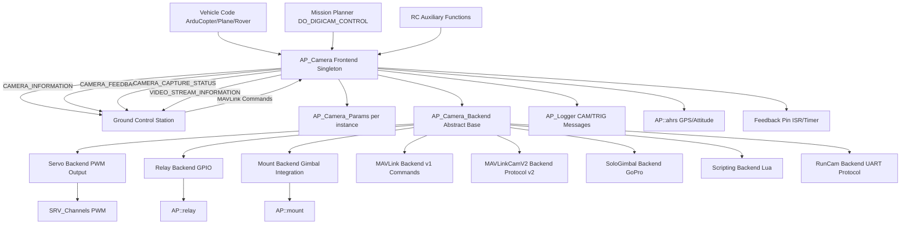

# AP_Camera Library

## Overview

The AP_Camera library provides comprehensive camera trigger and control functionality for ArduPilot autopilots. It enables automatic photo capture during mapping missions, video recording control, and advanced camera features like zoom, focus, and tracking through multiple backend implementations. The library integrates tightly with the MAVLink Camera Protocol v2 for ground control station (GCS) communication and includes geotagging functionality that links each camera trigger to precise GPS position, altitude, and vehicle attitude for photogrammetry and survey applications.

Key capabilities include time-interval triggering, distance-based triggering for surveying, manual control via MAVLink commands or RC inputs, mission integration through DO_DIGICAM_CONTROL and DO_SET_CAM_TRIGG_DIST commands, and comprehensive logging of camera events with full geolocation data in CAM and TRIG messages.

## Architecture

The AP_Camera library uses a frontend-backend architecture where the AP_Camera singleton frontend manages parameters, handles MAVLink communication, and coordinates multiple camera backends that implement hardware-specific trigger mechanisms.



## Key Components

### AP_Camera (Frontend Manager)

**Purpose**: Singleton camera manager that provides the public API, manages parameters, instantiates backends, and handles MAVLink communication.

**Lifecycle**:
1. Construction with logging bit from LOG_BITMASK parameter
2. `init()` - Detects and instantiates backends based on CAM1_TYPE and CAM2_TYPE parameters
3. `update()` - Called at 50Hz from vehicle scheduler to process triggers and handle periodic tasks
4. Backend method dispatch for camera operations

**Key Responsibilities**:
- Parameter registration via AP_Param system (CAM1_*, CAM2_* parameters)
- Backend instantiation based on TYPE parameter (compile-time feature flags)
- MAVLink command handling (DO_DIGICAM_CONTROL, IMAGE_START_CAPTURE, etc.)
- MAVLink message generation (CAMERA_INFORMATION, CAMERA_FEEDBACK, etc.)
- Distance-based triggering enforcement using GPS/AHRS data
- Thread-safety via HAL_Semaphore `_rsem`
- Legacy parameter conversion for migration compatibility

**Thread Safety**: All public methods use `WITH_SEMAPHORE(_rsem)` for multi-threaded access protection. The feedback pin ISR operates at interrupt context.

Source: `libraries/AP_Camera/AP_Camera.h`, `libraries/AP_Camera/AP_Camera.cpp`

### AP_Camera_Backend (Abstract Base Class)

**Purpose**: Defines the contract for camera backend implementations and provides shared functionality for triggering, geotagging, and MAVLink message generation.

**Pure Virtual Methods**:
- `trigger_pic()` - Backend-specific camera trigger implementation (must be overridden)

**Virtual Methods** (optional override):
- `record_video(bool start_recording)` - Video recording control
- `set_zoom(ZoomType, float)` - Zoom control
- `set_focus(FocusType, float)` - Focus control
- `set_tracking(TrackingType, p1, p2)` - Object tracking
- `configure(...)` - Camera configuration
- `control(...)` - Legacy DIGICAM_CONTROL handling

**Shared Functionality**:
- Time-interval triggering: Enforces `time_interval_ms` and `num_remaining` countdown
- Distance-based triggering: Calculates distance from last trigger using GPS position
- Feedback pin handling: ISR-based or 1kHz timer fallback for accurate trigger detection
- Geotagging: Captures GPS position, altitude, and vehicle attitude at trigger time
- Logging: Writes CAM and TRIG messages with full geolocation data
- MAVLink telemetry: Generates CAMERA_FEEDBACK, CAMERA_INFORMATION, CAMERA_SETTINGS, CAMERA_CAPTURE_STATUS messages
- Trigger constraints: Respects `interval_min`, `_max_roll`, and `_auto_mode_only` settings

Source: `libraries/AP_Camera/AP_Camera_Backend.h`, `libraries/AP_Camera/AP_Camera_Backend.cpp`

### AP_Camera_Params (Parameter Storage)

**Purpose**: Encapsulates per-instance camera parameters with AP_Param persistence.

**Key Parameters**:
- `type` (AP_Int8) - Backend selection (see CameraType enum)
- `trigger_duration` (AP_Float) - Shutter duration in seconds
- `servo_on_pwm` / `servo_off_pwm` (AP_Int16) - Servo backend PWM values
- `trigg_dist` (AP_Float) - Distance between triggers in meters
- `relay_on` (AP_Int8) - Relay backend configuration
- `feedback_pin` / `feedback_polarity` (AP_Int8) - Feedback pin configuration
- `interval_min` (AP_Float) - Minimum time between shots in seconds
- `mount_instance` (AP_Int8) - Associated gimbal mount
- `hfov` / `vfov` (AP_Float) - Field of view in degrees
- `options` (AP_Int8) - Bit flags (RecordWhileArmed)

Source: `libraries/AP_Camera/AP_Camera_Params.h`, `libraries/AP_Camera/AP_Camera_Params.cpp`

### LogStructure (CAM/TRIG Messages)

**Purpose**: Defines binary log message format for camera events with complete geotagging data.

**Message Fields** (both CAM and TRIG messages):
- `TimeUS` (uint64_t) - Microseconds since system boot
- `I` (uint8_t) - Camera instance number (0-1)
- `Img` (uint16_t) - Image sequence number
- `GPSTime` (uint32_t) - Milliseconds since start of GPS week
- `GPSWeek` (uint16_t) - GPS week number (weeks since Jan 5, 1980)
- `Lat` / `Lng` (int32_t) - Latitude/longitude in degrees * 10^7
- `Alt` (int32_t) - Altitude MSL in centimeters
- `RelAlt` (int32_t) - Altitude relative to home in centimeters
- `GPSAlt` (int32_t) - GPS-reported altitude in centimeters
- `R` / `P` (int16_t) - Roll/pitch in centidegrees
- `Y` (uint16_t) - Yaw in decidegrees

**TRIG Message**: Identical structure to CAM for backwards compatibility with legacy log analysis tools.

Source: `libraries/AP_Camera/LogStructure.h`

## Camera Trigger Modes

The AP_Camera library supports multiple trigger modes that can be used independently or combined:

### Time-Interval Triggering

Captures photos at fixed time intervals specified in milliseconds.

**API**: `take_multiple_pictures(uint32_t time_interval_ms, int16_t total_num)`

**Parameters**:
- `time_interval_ms` - Milliseconds between consecutive pictures (must be positive)
- `total_num` - Number of pictures to capture, or -1 for continuous/unlimited

**Use Cases**:
- Time-lapse photography
- Periodic monitoring during flight
- Continuous video frame extraction

**Safety**: The `interval_min` parameter enforces a minimum interval to protect camera hardware from excessive trigger rates.

**Example**:
```cpp
// Take 100 pictures at 5-second intervals
AP::camera()->take_multiple_pictures(5000, 100);

// Continuous capture every 2 seconds until stopped
AP::camera()->take_multiple_pictures(2000, -1);

// Stop any ongoing capture sequence
AP::camera()->stop_capture();
```

### Distance-Based Triggering

Automatically captures photos when the vehicle travels a specified distance, ideal for mapping and surveying missions.

**API**: `set_trigger_distance(float distance_m)`

**Parameters**:
- `distance_m` - Distance in meters between trigger points

**Implementation**: The backend calculates distance traveled using GPS position and dead-reckoning from AP::ahrs(). Distance is accumulated continuously and triggers occur when the threshold is exceeded.

**Constraints**:
- **AUTO Mode Gate**: If `AUTO_MODE_ONLY` parameter is set to 1, distance triggering only operates in AUTO flight mode
- **Roll Angle Limit**: Triggering is inhibited when vehicle roll exceeds `MAX_ROLL` parameter (default protects image quality during banking turns)
- **GPS Requirement**: Requires valid GPS position for distance calculation

**Mission Integration**: The `DO_SET_CAM_TRIGG_DIST` mission command sets the trigger distance for automatic survey capture.

**Example**:
```cpp
// Trigger every 50 meters for aerial mapping
AP::camera()->set_trigger_distance(50.0f);

// Disable distance triggering
AP::camera()->set_trigger_distance(0.0f);
```

### Manual Triggering

Single photo capture on demand via MAVLink command, RC switch, or programmatic call.

**API**: `take_picture()` or `take_picture(uint8_t instance)`

**Trigger Sources**:
- MAVLink `MAV_CMD_DO_DIGICAM_CONTROL` command from GCS
- RC auxiliary function mapped to camera trigger
- Scripting or vehicle code calling API directly
- Mission waypoint with `DO_DIGICAM_CONTROL` command

**Returns**: `true` if at least one camera backend successfully triggered

**Example**:
```cpp
// Trigger all cameras
if (AP::camera()->take_picture()) {
    // At least one camera triggered successfully
}

// Trigger specific camera instance
AP::camera()->take_picture(0);  // Camera 1
```

### Mission-Based Triggering

Camera control integrated into waypoint missions using MAVLink mission commands.

**Supported Commands**:
- `DO_DIGICAM_CONTROL` - Take single picture or start/stop recording
- `DO_DIGICAM_CONFIGURE` - Configure camera settings (mode, shutter, aperture, ISO)
- `DO_SET_CAM_TRIGG_DIST` - Set distance-based triggering for survey legs
- `IMAGE_START_CAPTURE` - Start time-interval or total-count capture sequence
- `IMAGE_STOP_CAPTURE` - Stop ongoing capture sequence
- `VIDEO_START_RECORDING` / `VIDEO_STOP_RECORDING` - Video control

**Mission Pattern Example** (grid survey):
1. `DO_SET_CAM_TRIGG_DIST` - Set 30m trigger distance
2. Waypoint flight legs over survey area
3. `DO_SET_CAM_TRIGG_DIST 0` - Disable triggering after survey
4. Return to home

### Continuous Capture Mode

Special case of time-interval triggering with `total_num = -1` for unlimited photos until explicitly stopped.

**Use Cases**:
- Video surveillance missions
- Extended monitoring flights
- Time-lapse over long duration

**Storage Consideration**: Ensure sufficient SD card space as this mode will fill storage continuously.

## MAVLink Camera Protocol

AP_Camera implements the MAVLink Camera Protocol v2 for comprehensive camera control and telemetry with ground control stations.

### Command Handling

The library handles the following MAVLink commands via `handle_command()`:

#### MAV_CMD_DO_DIGICAM_CONTROL (Legacy)
Controls camera shutter and recording using param5 (shooting_cmd):
- `1` - Take picture
- `0` - Stop capture
- `-1` - Start video recording  
- `-2` - Stop video recording

Additional parameters: session, zoom_pos, zoom_step, focus_lock, cmd_id

#### MAV_CMD_DO_DIGICAM_CONFIGURE (Legacy)
Configures camera settings:
- param1 - shooting_mode (single, burst, survey, video)
- param2 - shutter_speed (seconds)
- param3 - aperture (f-stop)
- param4 - ISO
- param5 - exposure_type (auto, manual)
- param6 - cmd_id
- param7 - engine_cutoff_time (seconds)

#### MAV_CMD_IMAGE_START_CAPTURE
Starts image capture with interval and count:
- param2 - time_interval (seconds, 0 for single shot)
- param3 - total_num (number of images, 0 for single, -1 for unlimited)
- param4 - sequence_number

#### MAV_CMD_IMAGE_STOP_CAPTURE
Stops ongoing image capture sequence.

#### MAV_CMD_VIDEO_START_RECORDING / MAV_CMD_VIDEO_STOP_RECORDING
Controls video recording on supported backends.

#### MAV_CMD_SET_CAMERA_ZOOM
Sets camera zoom:
- param1 - zoom_type (1=rate -100 to 100, 2=percentage 0 to 100)
- param2 - zoom_value

#### MAV_CMD_SET_CAMERA_FOCUS
Sets camera focus:
- param1 - focus_type (1=rate -100 to 100, 2=percentage 0 to 100, 4=auto)
- param2 - focus_value

#### MAV_CMD_SET_CAMERA_MODE
Switches between photo and video modes:
- param2 - camera_mode (0=photo, 1=video)

#### MAV_CMD_SET_CAMERA_SOURCE
Selects camera sensor on multi-sensor gimbals:
- param1 - primary_source (0=default, 1=RGB, 2=IR, 3=NDVI, 4=RGB_WIDEANGLE)
- param2 - secondary_source (same enum)

### MAVLink Messages (Telemetry to GCS)

#### CAMERA_INFORMATION
Sent periodically and on request. Contains:
- Camera capabilities flags (CAPTURE_IMAGE, RECORD_VIDEO, etc.)
- Sensor resolution and field of view
- Firmware version
- Camera definition URI

**Streaming**: Sent when GCS requests camera information or during periodic updates.

#### CAMERA_SETTINGS
Current camera operational settings:
- Camera mode (photo/video/survey)
- Zoom level
- Focus level

**Streaming**: Sent on mode changes or when settings are modified.

#### CAMERA_CAPTURE_STATUS
Realtime capture status:
- Recording time elapsed (seconds)
- Available storage capacity (MB)
- Image capture interval if active
- Recording status flags

**Streaming**: Sent periodically at 1Hz when GCS subscribes to camera status.

#### CAMERA_FEEDBACK (After Each Trigger)
Precise geotagging data for each photo:
- Image index / sequence number
- GPS time (week number and milliseconds)
- Latitude / longitude (degrees * 10^7)
- Altitude MSL and relative (meters)
- Vehicle attitude (roll/pitch/yaw in degrees)
- Target location if available
- Camera flags

**Purpose**: Enables GCS to geotag images and build photogrammetry models.

**Timing**: Sent immediately after trigger, using either feedback pin timestamp (most accurate) or estimated trigger time.

#### VIDEO_STREAM_INFORMATION
Video streaming configuration:
- Stream URI (RTSP/UDP endpoint)
- Resolution and framerate
- Bitrate
- Rotation
- Field of view

**Use Case**: Enables GCS to discover and display live video streams.

#### CAMERA_FOV_STATUS (Optional)
Current camera field of view quaternion for gimbal-stabilized cameras. Enables GCS to show camera footprint on map.

#### CAMERA_THERMAL_RANGE (Optional)
Thermal camera temperature range for IR sensors.

### Message Streaming Rates

Message streaming is controlled by the GCS via `REQUEST_DATA_STREAM` or individual message rate requests:

- **CAMERA_INFORMATION**: On demand or 0.2 Hz periodic
- **CAMERA_SETTINGS**: On changes or 0.5 Hz
- **CAMERA_CAPTURE_STATUS**: 1 Hz when active
- **CAMERA_FEEDBACK**: Immediate after each trigger
- **VIDEO_STREAM_INFORMATION**: On demand
- **CAMERA_FOV_STATUS**: 1 Hz when gimbal active

## Geotagging Functionality

The AP_Camera library provides high-precision geotagging by linking each camera trigger to GPS position, altitude, and vehicle attitude. This data is essential for photogrammetry, mapping, and survey applications.

### Geotagging Data Collection

When a camera triggers, the backend captures:

**GPS Position**:
- Latitude / Longitude in degrees (stored as degrees * 10^7 in logs)
- GPS week number and time-of-week in milliseconds
- Requires valid GPS fix (horizontal accuracy < threshold)

**Altitude**:
- Altitude MSL (mean sea level) from barometer/GPS fusion in centimeters
- Altitude relative to home location in centimeters
- Raw GPS altitude in centimeters

**Vehicle Attitude**:
- Roll angle in centidegrees (vehicle bank angle)
- Pitch angle in centidegrees (vehicle nose up/down)
- Yaw angle in decidegrees (vehicle heading, 0-360°)

**Metadata**:
- System timestamp in microseconds since boot
- Camera instance number (0-1 for CAM1/CAM2)
- Image sequence number (increments with each photo)

### Trigger Timing Accuracy

**Feedback Pin Method (Most Accurate)**:
- Configure `CAM1_FEEDBACK_PIN` to a GPIO connected to camera hotshoe
- Set `CAM1_FEEDBACK_POL` to match camera output (0 or 1)
- ISR captures exact trigger timestamp at hardware interrupt
- Typical accuracy: <1 millisecond
- Geotag data captured at exact trigger moment

**Timer-Based Method (Fallback)**:
- If no feedback pin configured, uses 1kHz timer polling
- Checks pin state every millisecond
- Typical accuracy: 1-2 milliseconds
- Still provides good geotag accuracy for most applications

**Estimated Timing (No Feedback Pin)**:
- Uses scheduled trigger time if no feedback available
- Accounts for trigger_duration parameter
- Less accurate but sufficient for non-precision applications

### CAMERA_FEEDBACK Message

Sent via MAVLink immediately after each trigger with complete geotagging data:

**Message Contents**:
```
time_usec:      System time in microseconds
image_index:    Photo sequence number  
capture_result: 1=success, 0=failure
lat:            Latitude * 10^7 (degrees)
lng:            Longitude * 10^7 (degrees)
alt_msl:        Altitude MSL (meters)
alt_rel:        Altitude relative (meters)
roll:           Roll angle (degrees)
pitch:          Pitch angle (degrees)
yaw:            Yaw angle (degrees)
time_gps_usec:  GPS time microseconds since epoch
```

**Purpose**: Enables ground stations to immediately geotag images without post-processing logs. QGroundControl and Mission Planner use this to create geotagged photo databases.

### Logging to CAM and TRIG Messages

All geotagging data is also logged to onboard storage for post-flight analysis:

**CAM Message** (primary):
- Written via `AP::logger().WriteCriticalBlock()` for guaranteed persistence
- Contains all geotag fields from CAMERA_FEEDBACK
- Logged only if `LOG_BITMASK` includes camera bit

**TRIG Message** (backwards compatibility):
- Identical structure to CAM message
- Maintained for legacy log analysis tools
- Some tools expect TRIG instead of CAM

**Log Analysis Workflow**:
1. Download log file after flight
2. Extract CAM/TRIG messages using MAVExplorer or mission_planner
3. Match image filenames to sequence numbers
4. Generate geotagged images or KML files
5. Import to photogrammetry software (Pix4D, Agisoft Metashape)

### Coordinate Frame Conventions

**GPS Coordinates**: WGS84 datum, latitude/longitude in decimal degrees

**Altitude References**:
- **MSL (Mean Sea Level)**: Altitude above sea level from barometer + GPS fusion
- **Relative**: Altitude above arming location (home position)
- **GPS Altitude**: Raw GPS-reported altitude (may differ from MSL)

**Attitude Frame**: Vehicle body frame, NED (North-East-Down) convention
- Roll: Right wing down is positive
- Pitch: Nose up is positive  
- Yaw: North=0°, East=90°, South=180°, West=270°

### Accuracy Considerations

**Best Geotag Accuracy Achieved When**:
- GPS HDOP < 1.5 (good satellite geometry)
- EKF healthy and converged
- Feedback pin connected to camera for exact timing
- Vehicle flying straight and level (minimal roll/pitch)
- Barometer calibrated and healthy

**Factors Reducing Accuracy**:
- Poor GPS signal (urban canyons, tree cover)
- High vehicle dynamics during trigger
- No feedback pin (timing uncertainty)
- Camera shutter delay/rolling shutter effects
- Gimbal pointing not accounted for (use mount logging)

## Supported Camera Backends

The AP_Camera library uses a pluggable backend architecture supporting multiple camera control methods. Backend selection is via the `CAM1_TYPE` / `CAM2_TYPE` parameter.

| Backend Name | TYPE Value | Trigger Mechanism | take_picture | record_video | zoom | focus | tracking | Typical Use Case |
|--------------|-----------|-------------------|--------------|--------------|------|-------|----------|------------------|
| **NONE** | 0 | Disabled | No | No | No | No | No | Camera disabled |
| **Servo** | 1 | PWM output via SRV_Channels | Yes | No | No | No | No | Mechanical shutter trigger, servo-actuated cameras |
| **Relay** | 2 | GPIO relay activation | Yes | No | No | No | No | Electronic trigger via relay, legacy compatibility |
| **SoloGimbal** | 3 | MAVLink GOPRO commands | Yes | Yes | No | No | No | GoPro camera in 3DR Solo gimbal |
| **Mount** | 4 | Forwards to AP::mount() | Yes | Yes | Yes | Yes | Yes | Gimbal-integrated cameras (Storm32, etc.) |
| **MAVLink** | 5 | MAVLink command_long to component | Yes | Yes | Maybe | Maybe | No | MAVLink v1 camera components |
| **MAVLinkCamV2** | 6 | Camera Protocol v2 per-camera commands | Yes | Yes | Yes | Yes | Yes | Full Camera Protocol v2 devices |
| **Scripting** | 7 | Lua script integration | Yes | Yes | Yes | Yes | Yes | Custom camera control via Lua scripts |
| **RunCam** | 8 | UART RunCam protocol | Yes | Yes | No | No | No | RunCam camera OSD control |

**Note**: Backend availability is compile-time gated by feature flags (e.g., `AP_CAMERA_SERVO_ENABLED`). Check firmware capabilities if a backend is not available.

## Backend-Specific Details

### Servo Backend (TYPE=1)

**Mechanism**: Generates PWM output on a servo channel to actuate a mechanical camera trigger or control servo-operated camera shutter.

**Configuration Parameters**:
- `CAM1_SERVO_ON` - PWM value (μs) when shutter activated (default 1900)
- `CAM1_SERVO_OFF` - PWM value (μs) when shutter deactivated (default 1100)
- `CAM1_DURATION` - How long to hold shutter activated in seconds (default 0.1)

**Implementation**:
- Uses `SRV_Channels::set_output_scaled()` to drive PWM output
- Servo function assigned via `SRVx_FUNCTION` parameter (e.g., function 10 = Camera Trigger)
- At trigger, sets PWM to `SERVO_ON` value for `DURATION` seconds, then returns to `SERVO_OFF`
- 50Hz update loop manages trigger timing via tick counter

**Typical Wiring**:
- Connect servo signal wire to autopilot servo output (e.g., AUX1-AUX6)
- Set `SERVO9_FUNCTION=10` (assuming using SERVO9 for camera)
- Ground and power as needed for servo

**Use Cases**:
- Mechanical shutter release for DSLRs/mirrorless cameras
- Servo-actuated trigger mechanism
- Legacy camera systems with servo interface

Source: `libraries/AP_Camera/AP_Camera_Servo.h`, `libraries/AP_Camera/AP_Camera_Servo.cpp`

### Relay Backend (TYPE=2)

**Mechanism**: Activates a GPIO relay to trigger camera electronically via relay contact closure.

**Configuration Parameters**:
- `CAM1_RELAY_ON` - Relay number to activate (e.g., 0 for RELAY1)
- `CAM1_DURATION` - Relay activation duration in seconds

**Implementation**:
- Uses `AP::relay()->on()` / `AP::relay()->off()` for relay control
- Maps relay number to GPIO via relay configuration
- 50Hz update loop manages relay timing via trigger_counter

**Typical Wiring**:
- Connect camera trigger input to relay normally-open (NO) contacts
- Configure relay GPIO via `RELAY_PIN` parameter
- Relay activation closes circuit to trigger camera

**Use Cases**:
- Electronic shutter release via relay
- Legacy camera trigger systems
- Simple on/off trigger interface
- Compatibility with older ArduPilot configurations

**Legacy Note**: Provides `get_legacy_relay_index()` for conversion to new relay function system.

Source: `libraries/AP_Camera/AP_Camera_Relay.h`, `libraries/AP_Camera/AP_Camera_Relay.cpp`

### Mount Backend (TYPE=4)

**Mechanism**: Forwards all camera control commands to the gimbal mount system (`AP::mount()`).

**Purpose**: For cameras integrated into gimbals that handle both pointing and camera control (Storm32, Gremsy, etc.).

**Implementation**:
- `take_picture()` → `AP::mount()->take_picture()`
- `record_video()` → `AP::mount()->record_video()`
- `set_zoom()` → `AP::mount()->set_zoom()`
- `set_focus()` → `AP::mount()->set_focus()`
- `set_tracking()` → `AP::mount()->set_tracking()`

**Configuration**:
- Set `CAM1_MNT_INST` to specify which mount instance (0-based)
- Mount must support camera control features
- Check mount backend capabilities

**Advantages**:
- Unified control of gimbal and camera
- Camera Protocol v2 support if mount backend implements it
- Coordinated gimbal/camera operations

Source: `libraries/AP_Camera/AP_Camera_Mount.h`, `libraries/AP_Camera/AP_Camera_Mount.cpp`

### MAVLink Backend (TYPE=5)

**Mechanism**: Sends MAVLink v1 camera commands (`DO_DIGICAM_CONTROL`, `DO_DIGICAM_CONFIGURE`) to a MAVLink component.

**Implementation**:
- Constructs `mavlink_command_long_t` messages
- Sends via `GCS_MAVLINK::send_to_components()`
- Routes to camera component ID on appropriate MAVLink channel

**Limitations**:
- Legacy MAVLink camera commands only
- No Camera Protocol v2 features
- Limited to basic trigger and configuration
- Zoom/focus support depends on remote implementation

**Use Cases**:
- Simple MAVLink camera modules
- Legacy camera systems expecting DIGICAM commands
- Custom hardware with basic MAVLink implementation

**Migration Path**: Consider upgrading to MAVLinkCamV2 backend for full Camera Protocol v2 support.

Source: `libraries/AP_Camera/AP_Camera_MAVLink.h`, `libraries/AP_Camera/AP_Camera_MAVLink.cpp`

### MAVLinkCamV2 Backend (TYPE=6)

**Mechanism**: Full implementation of MAVLink Camera Protocol v2 with component discovery and per-camera commands.

**Features**:
- Automatic camera discovery via `GCS_MAVLINK::find_by_mavtype_and_compid()`
- Sends `COMMAND_INT` to specific camera component
- Polls `CAMERA_INFORMATION` to discover capabilities
- Supports all Camera Protocol v2 commands (zoom, focus, tracking, mode, source)
- Receives and processes camera telemetry messages

**Discovery Process**:
1. Searches for `MAV_TYPE_CAMERA` or `MAV_COMP_ID_CAMERA` components
2. Sends `request_camera_information()` to query capabilities
3. Parses `CAMERA_INFORMATION` response
4. Enables features based on capability flags

**Command Mapping**:
- `take_picture()` → `MAV_CMD_IMAGE_START_CAPTURE` with count=1
- `take_multiple_pictures()` → `MAV_CMD_IMAGE_START_CAPTURE` with interval and count
- `record_video()` → `MAV_CMD_VIDEO_START/STOP_RECORDING`
- `set_zoom()` → `MAV_CMD_SET_CAMERA_ZOOM`
- `set_focus()` → `MAV_CMD_SET_CAMERA_FOCUS`
- `set_tracking()` → `MAV_CMD_CAMERA_TRACK_POINT` or `CAMERA_TRACK_RECTANGLE`

**Use Cases**:
- Modern gimbals with Camera Protocol v2 (DJI, Siyi, etc.)
- Advanced camera systems with full feature support
- Multi-sensor gimbals with source selection
- Thermal cameras with temperature ranging

Source: `libraries/AP_Camera/AP_Camera_MAVLinkCamV2.h`, `libraries/AP_Camera/AP_Camera_MAVLinkCamV2.cpp`

### SoloGimbal Backend (TYPE=3)

**Mechanism**: Controls GoPro camera in 3DR Solo gimbal via MAVLink `GOPRO_` messages.

**Features**:
- Sends `GOPRO_COMMAND` for picture/video control
- Processes `GOPRO_HEARTBEAT` for camera status
- Specific to Solo gimbal architecture

**Commands**:
- Take picture
- Start/stop video recording
- Query camera status

**Use Cases**:
- 3DR Solo drone with factory gimbal
- Legacy GoPro integration
- Specific to Solo ecosystem

Source: `libraries/AP_Camera/AP_Camera_SoloGimbal.h`, `libraries/AP_Camera/AP_Camera_SoloGimbal.cpp`

### Scripting Backend (TYPE=7)

**Mechanism**: Exposes camera control state to Lua scripts for custom camera implementations.

**API Provided to Scripts**:
- `get_state(instance)` - Returns `camera_state_t` structure with current control requests
- `change_setting(instance, setting, value)` - Allows scripts to read camera settings

**camera_state_t Structure**:
```lua
{
    take_pic_incr:    -- Increments when photo requested
    recording_video:  -- true when video recording active
    zoom_type:        -- 1=rate, 2=percentage
    zoom_value:       -- Zoom control value
    focus_type:       -- 1=rate, 2=percentage, 4=auto
    focus_value:      -- Focus control value
    tracking_type:    -- 0=none, 1=point, 2=rectangle
    tracking_p1:      -- Tracking point 1 (x, y in 0-1 range)
    tracking_p2:      -- Tracking point 2 (x, y in 0-1 range)
}
```

**Script Responsibilities**:
- Poll `get_state()` periodically (e.g., 10Hz)
- Detect changes in `take_pic_incr` to trigger camera
- Implement hardware-specific camera control protocol
- Optionally provide `CAMERA_INFORMATION` via `set_camera_information()`

**Use Cases**:
- Custom camera hardware with unique protocols
- Experimental camera integrations
- Rapid prototyping without C++ recompilation
- Educational demonstrations

Source: `libraries/AP_Camera/AP_Camera_Scripting.h`, `libraries/AP_Camera/AP_Camera_Scripting.cpp`

### RunCam Backend (TYPE=8)

**Mechanism**: UART-based RunCam camera protocol with OSD simulation for menu navigation.

**Features**:
- Full RunCam protocol implementation with CRC8 validation
- Menu simulation (2-key and 5-key variants)
- OSD menu navigation
- Camera model detection and capabilities
- Settings persistence

**Configuration**:
- Requires serial port configured via `AP_SerialManager`
- RunCam-specific parameters in separate parameter group
- Camera baud rate and protocol settings

**Commands Supported**:
- Take picture / start-stop recording
- Enter/exit OSD menu
- Navigate menu (up/down/left/right/enter)
- Read/write settings

**Use Cases**:
- RunCam action cameras (Split, Hybrid, Phoenix, etc.)
- FPV cameras with RunCam protocol
- OSD-based camera configuration

Source: `libraries/AP_Camera/AP_RunCam.h`, `libraries/AP_Camera/AP_RunCam.cpp`

## Video Streaming Integration

The AP_Camera library integrates with video streaming systems to provide GCS with live video feed information.

### VIDEO_STREAM_INFORMATION Message

Backends can provide video stream configuration to GCS via the `VIDEO_STREAM_INFORMATION` MAVLink message.

**Message Contents**:
- `stream_id` - Unique stream identifier (0-255)
- `count` - Total number of available streams
- `type` - Stream type (RTSP, TCP, UDP, MPEG-TS, etc.)
- `flags` - Capabilities (running, thermal, etc.)
- `framerate` - Frames per second
- `resolution_h` / `resolution_v` - Horizontal/vertical resolution
- `bitrate` - Stream bitrate in bits/sec
- `rotation` - Video rotation (0, 90, 180, 270 degrees)
- `hfov` - Horizontal field of view (degrees)
- `uri` - RTSP/UDP stream URI (e.g., "rtsp://192.168.1.100:8554/video")

**Purpose**: Enables ground stations like QGroundControl to automatically discover and display live video feeds without manual configuration.

### Camera Source Selection

For gimbals with multiple sensors (RGB, thermal, NDVI, wide-angle), the `set_camera_source()` API allows selecting active sensors:

**API**: `set_camera_source(uint8_t instance, CameraSource primary_source, CameraSource secondary_source)`

**CameraSource Enum**:
- `DEFAULT` (0) - Camera default sensor
- `RGB` (1) - RGB visible light sensor
- `IR` (2) - Infrared/thermal sensor
- `NDVI` (3) - Normalized Difference Vegetation Index sensor
- `RGB_WIDEANGLE` (4) - Wide-angle RGB sensor

**MAVLink Command**: `MAV_CMD_SET_CAMERA_SOURCE` with param1=primary, param2=secondary

**Use Cases**:
- Switching between RGB and thermal views
- Agriculture missions using NDVI sensors
- Simultaneous dual-sensor capture
- Multi-spectral imaging

### Stream Configuration

Video stream parameters are typically configured in the camera/gimbal firmware:
- RTSP server port and path
- UDP destination address and port
- Video codec and encoding parameters
- Resolution and framerate
- Bitrate and quality settings

**GCS Integration**: Once `VIDEO_STREAM_INFORMATION` is received, GCS can:
- Display stream URI in video widget
- Auto-connect to RTSP/UDP stream
- Show resolution and framerate
- Indicate thermal vs RGB stream type

## Mission Integration Patterns

The AP_Camera library integrates seamlessly with ArduPilot mission planning for automated survey and mapping workflows.

### DO_SET_CAM_TRIGG_DIST Command

**Purpose**: Enables/disables distance-based triggering for survey grid legs.

**Parameters**:
- param1: Distance in meters between triggers (0 to disable)
- param2: Shutter speed (optional, backend-specific)
- param3: Always trigger (1) or only when above min altitude (0)

**Mission Usage Pattern**:
```
1. TAKEOFF to survey altitude
2. DO_SET_CAM_TRIGG_DIST 50    # Start triggering every 50m
3. WAYPOINT (grid survey legs)
4. WAYPOINT ...
5. DO_SET_CAM_TRIGG_DIST 0     # Stop triggering
6. RTL
```

**Constraints**:
- Respects `AUTO_MODE_ONLY` parameter (may require AUTO mode)
- Respects `MAX_ROLL` parameter (no trigger during steep banks)
- Requires valid GPS position

### DO_DIGICAM_CONTROL Command

**Purpose**: Takes single photo at specific waypoint or mission event.

**Parameters**:
- param5 (shooting_cmd): 1=take picture, 0=stop, -1=start video, -2=stop video

**Mission Usage Pattern**:
```
1. WAYPOINT (photo location)
2. DO_DIGICAM_CONTROL 0 0 0 0 1  # Take picture at this waypoint
3. WAYPOINT (next location)
```

**Use Cases**:
- Point of interest photography
- Building inspection at specific angles
- Landmark documentation
- Timed survey checkpoints

### DO_DIGICAM_CONFIGURE Command

**Purpose**: Changes camera settings during mission.

**Parameters**:
- param1: shooting_mode
- param2: shutter_speed (seconds)
- param3: aperture (f-stop)
- param4: ISO
- param5: exposure_type
- param6: cmd_id
- param7: engine_cutoff_time

**Use Cases**:
- Adjusting exposure for different lighting conditions
- Switching between survey and video modes
- Optimizing settings for different terrain types

### IMAGE_START_CAPTURE / IMAGE_STOP_CAPTURE Commands

**Purpose**: Modern Camera Protocol v2 commands for interval/count-based capture.

**IMAGE_START_CAPTURE Parameters**:
- param2: interval (seconds between photos, 0=single shot)
- param3: total_count (number of photos, 0=single, -1=unlimited)
- param4: sequence_number (for identifying capture session)

**Mission Pattern for Time-Lapse**:
```
1. WAYPOINT (loiter location)
2. IMAGE_START_CAPTURE 0 2 100  # 100 photos at 2-second intervals
3. DELAY 200000  # Wait for capture to complete
4. IMAGE_STOP_CAPTURE
5. RTL
```

### Combining with DO_MOUNT_CONTROL

**Purpose**: Coordinate camera triggering with gimbal pointing for oblique imagery.

**Pattern for Building Inspection**:
```
1. WAYPOINT (building corner)
2. DO_MOUNT_CONTROL -30 0 45 0  # Point gimbal down 30°, yaw 45°
3. DO_DIGICAM_CONTROL 0 0 0 0 1  # Take photo
4. WAYPOINT (next corner)
5. DO_MOUNT_CONTROL -30 0 135 0  # Point gimbal 135°
6. DO_DIGICAM_CONTROL 0 0 0 0 1  # Take photo
```

### Grid Survey Workflow

**Typical mapping mission structure**:

1. **Takeoff Phase**:
   - Climb to survey altitude
   - Allow EKF to fully converge
   - Verify GPS accuracy

2. **Survey Phase**:
   - `DO_SET_CAM_TRIGG_DIST` with calculated overlap distance
   - Fly parallel grid legs with appropriate spacing
   - Maintain constant altitude and speed for consistency
   - Camera triggers automatically based on distance traveled

3. **Landing Phase**:
   - `DO_SET_CAM_TRIGG_DIST 0` to disable triggering
   - Return to launch or landing site
   - Download photos and logs

**Distance Calculation** for 80% overlap at 100m altitude:
```
Image width = 2 * altitude * tan(HFOV/2)
Trigger distance = Image width * (1 - overlap%)
Example: 2 * 100 * tan(30°) * 0.20 = 23 meters
```

### Corridor/Linear Survey

For roads, pipelines, powerlines:
```
1. DO_SET_CAM_TRIGG_DIST 30
2. WAYPOINT (corridor start)
3. WAYPOINT (corridor waypoints...)
4. WAYPOINT (corridor end)
5. DO_SET_CAM_TRIGG_DIST 0
```

**Advantages**:
- Automatic trigger spacing regardless of wind/speed variations
- Consistent image overlap
- Efficient coverage without manual triggering

## RC Control Integration

The AP_Camera library supports direct RC control for manual camera operation during flight.

### Camera Mode Toggle

**Function**: `cam_mode_toggle()` switches camera between photo and video modes.

**RC Mapping**:
- Map RC auxiliary channel to "Camera Mode Toggle" function
- Momentary switch action toggles mode
- Typically mapped to 3-position switch center position

**Implementation**:
- Calls backend `set_camera_mode()` or equivalent
- Toggles internal mode state
- Backend-dependent functionality

### Manual Picture Trigger

**Function**: `take_picture()` triggered by RC switch.

**RC Mapping**:
- Map RC auxiliary channel to "Camera Trigger" function
- Switch high position = take picture
- Momentary or maintained switch
- Can use RC passthrough or auxiliary function

**Example Configuration**:
```
RCx_OPTION = 9  # Camera Trigger
```

**Use Cases**:
- Manual photo capture during flight
- Operator-controlled point of interest photography
- Supplementing automatic survey with manual shots

### Video Recording Control

**Function**: `record_video(true/false)` triggered by RC switch.

**RC Mapping**:
- Map RC auxiliary channel to "Camera Video Record" function
- Switch logic: high=start, low=stop
- Toggle mode or maintained state

**Example Configuration**:
```
RCx_OPTION = 166  # Camera Video Record (varies by ArduPilot version)
```

**Use Cases**:
- Starting/stopping video recording on demand
- Manual control during autonomous missions
- Event-based recording trigger

### Auxiliary Function Integration

RC camera control integrates with the ArduPilot auxiliary function system:

**Available Functions**:
- Camera Trigger (single shot)
- Camera Mode Toggle (photo/video switch)
- Camera Video Record (start/stop)
- Camera Manual Focus (if supported)
- Camera Zoom In/Out (if supported)

**Configuration Process**:
1. Identify available RC input channel (e.g., RC9)
2. Set `RC9_OPTION` to desired camera function number
3. Verify function response in flight logs
4. Test in safe environment before mission use

## Configuration Parameters

Complete reference for AP_Camera configuration parameters. All parameters shown with `CAM1_` prefix; `CAM2_` available for second camera instance.

| Parameter | Type | Description | Units | Default | Range | 
|-----------|------|-------------|-------|---------|-------|
| **CAM1_TYPE** | INT8 | Backend selection: 0=None, 1=Servo, 2=Relay, 3=SoloGimbal, 4=Mount, 5=MAVLink, 6=MAVLinkCamV2, 7=Scripting, 8=RunCam | - | 0 | 0-8 |
| **CAM1_DURATION** | FLOAT | Shutter activation duration (servo hold time or relay closed time) | seconds | 0.1 | 0-10 |
| **CAM1_SERVO_ON** | INT16 | PWM value when shutter activated (Servo backend) | μs | 1900 | 800-2200 |
| **CAM1_SERVO_OFF** | INT16 | PWM value when shutter deactivated (Servo backend) | μs | 1100 | 800-2200 |
| **CAM1_TRIGG_DIST** | FLOAT | Distance between triggers for survey mode (0=disabled) | meters | 0 | 0-1000 |
| **CAM1_RELAY_ON** | INT8 | Relay number to activate (Relay backend, 0=Relay1, 1=Relay2, etc.) | - | 0 | 0-5 |
| **CAM1_FEEDBACK_PIN** | INT8 | GPIO pin for camera feedback signal (-1=disabled) | - | -1 | -1 to 50 |
| **CAM1_FEEDBACK_POL** | INT8 | Feedback pin polarity (0=active low, 1=active high) | - | 1 | 0-1 |
| **CAM1_INTERVAL_MIN** | FLOAT | Minimum time between shots to protect camera hardware | seconds | 0 | 0-10 |
| **CAM1_MNT_INST** | INT8 | Mount instance number for Mount backend (0=mount1, 1=mount2) | - | 0 | 0-2 |
| **CAM1_HFOV** | FLOAT | Horizontal field of view for footprint calculation | degrees | 0 | 0-360 |
| **CAM1_VFOV** | FLOAT | Vertical field of view for footprint calculation | degrees | 0 | 0-360 |
| **CAM1_OPTIONS** | BITMASK | Options: bit0=RecordWhileArmed (auto-record video when armed) | - | 0 | 0-1 |
| **AUTO_MODE_ONLY** | INT8 | Restrict distance triggering to AUTO mode only (0=all modes, 1=AUTO only) | - | 0 | 0-1 |
| **MAX_ROLL** | INT16 | Maximum vehicle roll angle for distance triggering (prevents triggers during steep banks) | degrees | 0 | 0-90 |

### Parameter Notes

**CAM1_TYPE Selection**:
- Check firmware build configuration for available backends
- Backends may be disabled via compile-time flags
- TYPE=0 disables camera completely

**CAM1_DURATION Tuning**:
- Must be long enough for camera to register trigger
- Too long may cause buffer overruns in rapid triggering
- Typical mechanical shutters: 0.1-0.3s
- Electronic triggers: 0.05-0.1s

**CAM1_FEEDBACK_PIN Configuration**:
- Connect to camera hotshoe or trigger output
- Provides accurate trigger timestamp for geotagging
- Check autopilot board documentation for available pins
- ISR-capable pins recommended for best accuracy

**CAM1_INTERVAL_MIN Protection**:
- Prevents camera damage from excessive trigger rate
- Should be set to camera's rated shutter cycle time
- Does not affect distance-based triggering spacing
- Acts as a minimum guard regardless of commanded interval

**CAM1_TRIGG_DIST for Surveys**:
- Calculate based on altitude, field of view, and desired overlap
- Typical values: 20-80 meters depending on mission
- Set via mission command or parameter
- Zero disables distance triggering

**AUTO_MODE_ONLY Safety**:
- When enabled, prevents accidental survey triggering in MANUAL/STABILIZE
- Recommended for safety in mixed-mode missions
- Disable if distance triggering needed in GUIDED mode

**MAX_ROLL Threshold**:
- Prevents triggers during aggressive maneuvering
- Protects image quality by avoiding blurred/skewed photos
- Typical setting: 30-45 degrees
- Zero disables roll check (always allow triggering)

## Trigger Distance Management

Distance-based triggering calculates vehicle travel distance and automatically triggers the camera at configured intervals for survey missions.

### set_trigger_distance() API

**Function Signature**:
```cpp
void set_trigger_distance(float distance_m);
void set_trigger_distance(uint8_t instance, float distance_m);
```

**Parameters**:
- `distance_m` - Distance in meters between triggers (0 to disable)

**Behavior**:
- Sets the `trigg_dist` parameter for specified instance (or all instances)
- Resets distance accumulator to start fresh measurement
- Takes effect immediately
- Can be called from mission commands, GCS, or vehicle code

### Distance Calculation Method

The backend accumulates distance traveled using two sources:

**GPS-Based Distance** (primary method when GPS healthy):
- Stores last trigger GPS position (lat, lon)
- On each update (50Hz), calculates distance to current GPS position
- Uses `location_diff(last_pos, current_pos)` for accurate geodetic distance
- Accounts for Earth curvature over long distances
- Requires GPS fix quality with HDOP < threshold

**Dead Reckoning** (fallback when GPS quality degraded):
- Uses `AP::ahrs()->get_velocity_NED()` for velocity vector
- Integrates velocity over time delta to estimate distance
- Less accurate but maintains triggering during brief GPS dropouts
- Returns to GPS-based when fix quality improves

**Distance Accumulation**:
```cpp
// Simplified logic from backend update()
distance_traveled += location_diff(last_trigger_location, current_location);
if (distance_traveled >= trigg_dist) {
    trigger_pic();
    distance_traveled = 0;
    last_trigger_location = current_location;
}
```

### AUTO Mode Gate

The `_auto_mode_only` parameter restricts distance triggering to AUTO flight mode:

**When _auto_mode_only = 1**:
- Distance triggers only in AUTO mode
- Prevents unwanted triggers in MANUAL, STABILIZE, LOITER, etc.
- Mission `DO_SET_CAM_TRIGG_DIST` commands still set distance but wait for AUTO
- GUIDED mode typically excluded (check vehicle implementation)

**When _auto_mode_only = 0**:
- Distance triggers in any flight mode
- Useful for manual mapping flights
- Operator must manage trigger distance settings

**Mode Check**:
```cpp
bool vehicle_mode_ok_for_trigg_dist() const { 
    return (_auto_mode_only == 0) || _is_in_auto_mode; 
}
```

### MAX_ROLL Threshold

The `_max_roll` parameter prevents triggering when vehicle is banking excessively:

**Purpose**:
- Protects image quality during steep turns
- Prevents skewed/unusable survey photos
- Maintains nadir (straight-down) viewing angle

**Implementation**:
- Reads current roll angle from `AP::ahrs()->roll_deg()`
- Compares absolute roll angle to `_max_roll` threshold
- Inhibits trigger if `abs(roll) > _max_roll`
- Resumes triggering when roll returns below threshold

**Typical Settings**:
- Aerial mapping: 30-40 degrees (moderate bank limit)
- Agricultural surveying: 20-30 degrees (strict nadir requirement)
- Corridor mapping: 45 degrees (more tolerant)
- Disabled: 0 degrees (no roll check)

**Roll Check Logic**:
```cpp
if (_max_roll > 0 && abs(AP::ahrs()->roll_deg()) > _max_roll) {
    return;  // Skip trigger this cycle
}
```

### Mission Command Integration

**DO_SET_CAM_TRIGG_DIST** mission command maps directly to `set_trigger_distance()`:

**Command Parameters**:
- param1: distance_m
- param2: (reserved, typically 0)
- param3: (reserved, typically 0)

**Mission Planner Integration**:
- Mission Planner "Camera" tab generates DO_SET_CAM_TRIGG_DIST commands
- Calculates distance based on altitude, FOV, and overlap settings
- Automatically inserts at start of survey grid

**QGroundControl Integration**:
- Survey pattern generator includes camera trigger distance
- Auto-calculates based on camera sensor specs
- Generates mission with appropriate trigger commands

### Distance Trigger Reset

Distance accumulator resets on:
- Explicit call to `set_trigger_distance()` with new value
- Arming/disarming cycle
- Mode change if `_auto_mode_only` enabled
- Backend reinitialization

**Implication**: After mode changes or parameter updates, the first trigger may occur sooner or later than expected as distance reaccumulates from zero.

## Logging and Data Persistence

The AP_Camera library logs all camera events with full geotagging data to onboard storage for post-flight analysis and image processing.

### CAM Message Format

**Message Type**: CAM (camera trigger event)

**Structure Definition** (from LogStructure.h):
```cpp
{LOG_CAM_MSG, sizeof(log_Camera),
 "CAM", "QBHIHLLeeccC", "TimeUS,I,Img,GPSTime,GPSWeek,Lat,Lng,Alt,RelAlt,GPSAlt,R,P,Y",
 "s#-sS-DUmmmddd", "F--C-------BBB", true}
```

**Fields**:
- `TimeUS` (Q, uint64_t) - Microseconds since system boot
- `I` (B, uint8_t) - Camera instance (0=CAM1, 1=CAM2)
- `Img` (H, uint16_t) - Image sequence number (increments per photo)
- `GPSTime` (I, uint32_t) - GPS time of week in milliseconds
- `GPSWeek` (H, uint16_t) - GPS week number since Jan 5, 1980
- `Lat` (L, int32_t) - Latitude in degrees * 10^7
- `Lng` (L, int32_t) - Longitude in degrees * 10^7
- `Alt` (e, int32_t) - Altitude MSL in centimeters
- `RelAlt` (e, int32_t) - Altitude relative to home in centimeters
- `GPSAlt` (c, int32_t) - GPS-reported altitude in centimeters
- `R` (c, int16_t) - Roll angle in centidegrees
- `P` (c, int16_t) - Pitch angle in centidegrees
- `Y` (C, uint16_t) - Yaw angle in decidegrees (0-3599)

### TRIG Message Format

**Purpose**: Backwards compatibility with legacy log analysis tools.

**Structure**: Identical to CAM message, different message type ID.

**Reason**: Historical tools expected "TRIG" message type. Modern tools support both CAM and TRIG.

### AP_Logger Integration

**Write Function**:
```cpp
void write_camera_log() {
    AP::logger().WriteCriticalBlock(&pkt_cam, sizeof(pkt_cam));
}
```

**WriteCriticalBlock()**: Ensures log message is written even if log buffer is full. Camera events are considered high-priority for post-flight photo geotagging.

**Logger Gating**:
- Only writes if `AP::logger().should_log(log_camera_bit)` returns true
- `log_camera_bit` set from LOG_BITMASK parameter
- Typically bit 19 (CAMERA) in LOG_BITMASK

**Configuration**:
```
LOG_BITMASK bit 19 = Camera logging
Default: Usually enabled in standard firmware builds
```

### Logging Trigger Points

Messages logged at:
1. **Scheduled trigger** - Timer or distance-based trigger fires
2. **Feedback pin trigger** - ISR detects camera feedback signal
3. **Manual trigger** - `take_picture()` API call
4. **Mission command trigger** - DO_DIGICAM_CONTROL execution

**Timestamp Source Priority**:
1. Feedback pin ISR timestamp (most accurate, <1ms)
2. Timer callback timestamp (1ms accuracy)
3. Estimated trigger time based on command receipt (least accurate)

### Post-Flight Log Analysis

**Extract Camera Events**:
```bash
# Using MAVExplorer
mavlogdump.py --type CAM flight.bin

# Using Mission Planner
Load log → "CAM" tab → Export to CSV
```

**Generate Geotagged Photos**:
1. Extract CAM messages with image numbers
2. Match image numbers to photo filenames (IMG_0001.JPG → Img=1)
3. Apply geotag EXIF data:
   - GPS latitude/longitude
   - GPS altitude
   - GPS timestamp
   - Camera roll/pitch/yaw

**Tools**:
- **exiftool**: Command-line EXIF manipulation
- **Mission Planner**: "Geo ref images" function
- **Python scripts**: Custom geotagging workflows
- **Photogrammetry software**: Direct log import (Pix4D, Metashape)

### Storage Considerations

**Log Size**:
- Each CAM message: ~44 bytes
- Typical survey: 500-1000 photos
- Log overhead: 22-44 KB per mission
- Negligible compared to full log files (typically 10-100 MB)

**SD Card Requirements**:
- CAM logs are lightweight
- Ensure LOG_BITMASK includes camera bit
- Verify logging enabled before critical missions
- Download logs promptly after survey flights

## Thread Safety

The AP_Camera library is accessed from multiple threads and interrupt contexts, requiring careful synchronization.

### Semaphore Protection

**Main Semaphore**: `HAL_Semaphore _rsem`

**Protected by _rsem**:
- Parameter access and modification
- Backend state changes
- Trigger counter updates
- Distance accumulator access
- Image sequence number increments

**Usage Pattern**:
```cpp
bool AP_Camera::take_picture() {
    WITH_SEMAPHORE(_rsem);
    // Protected operations
    return backend->trigger_pic();
}
```

**WITH_SEMAPHORE Macro**:
- Automatically acquires semaphore at entry
- Releases semaphore at function exit (RAII pattern)
- Handles early returns safely
- Prevents deadlocks via timeout

### Interrupt Context Handling

**Feedback Pin ISR**:
- Runs at interrupt priority
- Minimal processing: capture timestamp only
- Sets flag for main thread processing
- No semaphore acquisition in ISR (would deadlock)
- Deferred processing in 50Hz update loop

**ISR Implementation Pattern**:
```cpp
void feedback_pin_isr() {
    // Interrupt context - minimal work only
    feedback_timestamp_us = AP_HAL::micros64();
    feedback_trigger_logged = false;
}

void update() {
    // Main thread context - can use semaphores
    if (!feedback_trigger_logged) {
        WITH_SEMAPHORE(_rsem);
        log_camera_event(feedback_timestamp_us);
        feedback_trigger_logged = true;
    }
}
```

### Scheduler Callbacks

**Registration**:
```cpp
AP::scheduler().register_io_process(FUNCTOR_BIND_MEMBER(&AP_Camera::update, void));
```

**Update Loop** (50Hz from main vehicle scheduler):
- Checks trigger conditions
- Processes distance accumulation
- Handles timing for servo/relay backends
- Polls for feedback pin state changes
- Safe for semaphore use (not interrupt context)

### Multi-Instance Coordination

**Concurrent Backend Access**:
- Each backend has independent state
- Frontend serializes access to individual backends
- No inter-backend locking required
- Parallel triggering of multiple cameras supported

**Example** (triggering both cameras):
```cpp
// Frontend handles iteration and synchronization
bool AP_Camera::take_picture() {
    WITH_SEMAPHORE(_rsem);
    bool success = false;
    for (uint8_t i = 0; i < AP_CAMERA_MAX_INSTANCES; i++) {
        if (_backends[i]) {
            success |= _backends[i]->trigger_pic();
        }
    }
    return success;
}
```

### AHRS/GPS Access

**Read-Only Access**:
- Reads GPS position via `AP::ahrs()->get_position()`
- Reads attitude via `AP::ahrs()->get_roll/pitch/yaw_deg()`
- No locking required (AHRS handles internal synchronization)
- Data consistency guaranteed by AHRS for single reads

**Access Pattern**:
```cpp
// Safe: single atomic reads from AHRS
float roll = AP::ahrs()->roll_deg();
Location current_loc;
if (AP::ahrs()->get_position(current_loc)) {
    // Use current_loc
}
```

## Usage Patterns

Common code examples for integrating AP_Camera functionality in vehicle code and scripts.

### Taking a Single Picture

```cpp
// Trigger all configured cameras
if (AP::camera()->take_picture()) {
    gcs().send_text(MAV_SEVERITY_INFO, "Camera triggered");
} else {
    gcs().send_text(MAV_SEVERITY_WARNING, "Camera trigger failed");
}

// Trigger specific camera instance
AP::camera()->take_picture(0);  // Camera 1 (CAM1_*)
AP::camera()->take_picture(1);  // Camera 2 (CAM2_*)
```

### Taking Multiple Pictures with Time Interval

```cpp
// Take 100 photos at 5-second intervals
uint32_t interval_ms = 5000;
int16_t count = 100;
if (AP::camera()->take_multiple_pictures(interval_ms, count)) {
    gcs().send_text(MAV_SEVERITY_INFO, "Starting time-lapse");
}

// Continuous capture (unlimited photos)
AP::camera()->take_multiple_pictures(2000, -1);

// Stop ongoing capture
AP::camera()->stop_capture();
```

### Recording Video

```cpp
// Start video recording on all cameras
AP::camera()->record_video(true);

// Stop video recording
AP::camera()->record_video(false);

// Control specific camera
AP::camera()->record_video(0, true);   // Start CAM1 recording
AP::camera()->record_video(0, false);  // Stop CAM1 recording
```

### Setting Trigger Distance for Survey

```cpp
// Enable distance triggering at 50 meters
AP::camera()->set_trigger_distance(50.0f);

// Disable distance triggering
AP::camera()->set_trigger_distance(0.0f);

// Set for specific camera
AP::camera()->set_trigger_distance(0, 30.0f);  // CAM1: 30m
AP::camera()->set_trigger_distance(1, 60.0f);  // CAM2: 60m
```

### Zoom Control

```cpp
// Zoom by rate (-100 to +100, negative=zoom out, positive=zoom in)
AP::camera()->set_zoom(ZoomType::RATE, 50.0f);

// Zoom to percentage (0-100%)
AP::camera()->set_zoom(ZoomType::PCT, 75.0f);

// Zoom specific camera
AP::camera()->set_zoom(0, ZoomType::RATE, -30.0f);
```

### Focus Control

```cpp
// Focus by rate (-100 to +100)
SetFocusResult result = AP::camera()->set_focus(FocusType::RATE, 20.0f);

// Focus to percentage (0=near, 100=far)
AP::camera()->set_focus(FocusType::PCT, 50.0f);

// Auto focus
AP::camera()->set_focus(FocusType::AUTO, 0.0f);
```

### Tracking Control

```cpp
// Track point at center of image
Vector2f center(0.5f, 0.5f);
AP::camera()->set_tracking(TrackingType::POINT, center, center);

// Track rectangle (top-left to bottom-right)
Vector2f top_left(0.3f, 0.3f);
Vector2f bottom_right(0.7f, 0.7f);
AP::camera()->set_tracking(TrackingType::RECTANGLE, top_left, bottom_right);

// Disable tracking
Vector2f none(0.0f, 0.0f);
AP::camera()->set_tracking(TrackingType::NONE, none, none);
```

### Camera Mode Toggle

```cpp
// Toggle between photo and video mode
AP::camera()->cam_mode_toggle();

// Toggle specific camera
AP::camera()->cam_mode_toggle(0);
```

### Camera Source Selection (Multi-Sensor Gimbals)

```cpp
// Switch to thermal camera
AP::camera()->set_camera_source(0, 
    AP_Camera::CameraSource::IR, 
    AP_Camera::CameraSource::DEFAULT);

// Switch to RGB camera
AP::camera()->set_camera_source(0,
    AP_Camera::CameraSource::RGB,
    AP_Camera::CameraSource::DEFAULT);

// Dual-sensor: RGB primary, thermal secondary
AP::camera()->set_camera_source(0,
    AP_Camera::CameraSource::RGB,
    AP_Camera::CameraSource::IR);
```

### Checking Camera Availability

```cpp
// Get singleton (returns nullptr if camera not available)
AP_Camera *camera = AP::camera();
if (camera == nullptr) {
    // Camera library not compiled or not initialized
    return;
}

// Check if specific instance configured
AP_Camera_Backend *backend = camera->get_instance(0);
if (backend == nullptr) {
    // CAM1_TYPE = 0 or backend failed to initialize
    return;
}
```

## Testing Procedures

Comprehensive testing procedures for validating camera control functionality in simulation and with physical hardware.

### SITL (Software-In-The-Loop) Testing

**Simulator Setup**:
```bash
# Start SITL with Copter
cd ArduPilot
sim_vehicle.py -v Copter --console --map

# Alternative: Start with specific location
sim_vehicle.py -v Copter --console --map -L CMAC
```

**Load Camera Module in MAVProxy**:
```
module load camera
```

**Configure Camera Parameters**:
```
param set CAM1_TYPE 1        # Servo backend for testing
param set CAM1_DURATION 0.2  # 200ms trigger
param set CAM1_SERVO_ON 1900
param set CAM1_SERVO_OFF 1100
param set LOG_BITMASK 524288 # Enable camera logging (bit 19)
param write
```

**Manual Trigger Testing**:
```
# Single picture
camera trigger

# Take 10 pictures at 2-second intervals
camera set time 2 10

# Start continuous capture
camera set time 1 -1

# Stop capture
camera stop

# Check status
camera status
```

**Distance-Based Trigger Testing**:
```
# Set trigger distance to 50 meters
param set CAM1_TRIGG_DIST 50

# Fly autonomous mission
mode AUTO
arm throttle
wp load survey_mission.txt
```

**Verify Geotagging in Logs**:
```
# After flight, download log
log list
log download latest

# Analyze CAM messages
mavlogdump.py --type CAM arducopter.bin | head -20
```

**Expected CAM Message Output**:
```
CAM, TimeUS, I, Img, GPSTime, GPSWeek, Lat, Lng, Alt, RelAlt, GPSAlt, R, P, Y
CAM, 125430000, 0, 1, 487234000, 2250, 123456789, -987654321, 10000, 5000, 10050, 10, -5, 900
```

### Testing with QGroundControl

**Camera Discovery**:
1. Connect QGroundControl to SITL or real vehicle
2. Navigate to Vehicle Setup → Camera
3. Verify camera appears in device list
4. Check CAMERA_INFORMATION reception

**Trigger Testing**:
1. Open camera control widget
2. Click "Trigger Camera" button
3. Verify CAM message in log
4. Check CAMERA_FEEDBACK message in MAVLink inspector

**Video Control Testing**:
1. Click "Start Recording" button
2. Verify backend receives command
3. Click "Stop Recording"
4. Check video backend status

### Testing with Physical Cameras

#### Servo Camera Setup

**Hardware Connection**:
1. Connect servo signal wire to autopilot servo output (e.g., AUX1)
2. Connect servo power (5V) and ground
3. Mechanically link servo to camera shutter button

**Parameter Configuration**:
```
SERVO9_FUNCTION = 10  # Camera trigger (adjust servo number as needed)
CAM1_TYPE = 1         # Servo backend
CAM1_SERVO_ON = 1900  # PWM value to press shutter
CAM1_SERVO_OFF = 1100 # PWM value to release shutter
CAM1_DURATION = 0.3   # Hold time in seconds
```

**Bench Testing**:
1. Power on autopilot
2. Use MAVProxy or GCS to trigger camera
3. Observe servo movement
4. Verify camera shutter activates
5. Adjust SERVO_ON/OFF values if needed

**Flight Testing**:
1. Install camera on vehicle
2. Test single trigger in STABILIZE mode
3. Test time-interval mode in LOITER
4. Test distance triggering in AUTO mission
5. Verify photos captured at expected intervals

#### Relay Camera Setup

**Hardware Connection**:
1. Connect relay control signal to autopilot relay pin
2. Wire relay contacts to camera remote trigger input
3. Verify camera trigger input voltage compatibility

**Parameter Configuration**:
```
RELAY1_PIN = 54      # GPIO pin for relay (board-specific)
RELAY1_DEFAULT = 0   # Relay off by default
CAM1_TYPE = 2        # Relay backend
CAM1_RELAY_ON = 0    # Use RELAY1 (0-indexed)
CAM1_DURATION = 0.1  # Relay closed time
```

**Testing**:
1. Bench test relay actuation with multimeter
2. Verify camera triggers when relay closes
3. Test single shot and interval modes
4. Validate feedback pin if wired

#### Feedback Pin Configuration

**Purpose**: Provides accurate trigger timestamp from camera hotshoe.

**Hardware Setup**:
1. Connect camera hotshoe signal to autopilot GPIO
2. Add pull-up/pull-down resistor if needed (typically 10kΩ)
3. Verify voltage levels compatible with autopilot (3.3V or 5V)
4. Check camera hotshoe polarity (active high or low)

**Parameter Configuration**:
```
CAM1_FEEDBACK_PIN = 50  # GPIO pin number (board-specific)
CAM1_FEEDBACK_POL = 1   # 0=active low, 1=active high
```

**Validation**:
1. Trigger camera manually
2. Check CAM log message timestamp accuracy
3. Compare with expected trigger time
4. Verify <1ms timing jitter

**Oscilloscope Verification** (advanced):
1. Connect scope to feedback pin
2. Connect scope to servo output or relay signal
3. Trigger camera
4. Measure delay between trigger command and feedback
5. Typical servo delay: 10-50ms
6. Typical electronic trigger: 1-5ms

### Testing Distance-Based Triggering

**Ground Test** (vehicle on ground):
```
# Enable distance triggering
param set CAM1_TRIGG_DIST 10  # 10 meters for ground test
param set AUTO_MODE_ONLY 0    # Allow in any mode

# Walk vehicle around
# Monitor CAM messages in log
# Verify triggers every ~10 meters
```

**Flight Test**:
1. Create survey mission with appropriate trigger distance
2. Fly mission in calm conditions
3. Download log after flight
4. Extract CAM messages
5. Plot trigger locations on map
6. Verify spacing consistency
7. Check for missed triggers during turns (if MAX_ROLL set)

**Trigger Spacing Analysis**:
```python
# Python script to analyze trigger spacing
import pandas as pd

# Load CAM messages from log
cam_data = load_log_messages('arducopter.bin', 'CAM')

# Calculate distances between consecutive triggers
for i in range(1, len(cam_data)):
    lat1, lon1 = cam_data.iloc[i-1][['Lat', 'Lng']] / 1e7
    lat2, lon2 = cam_data.iloc[i][['Lat', 'Lng']] / 1e7
    distance = calculate_distance(lat1, lon1, lat2, lon2)
    print(f"Trigger {i}: {distance:.2f} m")
```

### MAVLink Camera Protocol v2 Testing

**Discovery Testing**:
1. Connect MAVLinkCamV2 backend camera
2. Power on system
3. Monitor MAVLink messages for CAMERA_INFORMATION
4. Verify camera capabilities reported correctly

**Command Testing**:
```
# Via MAVProxy command line
camera trigger           # IMAGE_START_CAPTURE
camera set zoom 50       # SET_CAMERA_ZOOM
camera set focus auto    # SET_CAMERA_FOCUS
camera mode video        # SET_CAMERA_MODE
```

**Telemetry Validation**:
- Monitor CAMERA_SETTINGS messages
- Check CAMERA_CAPTURE_STATUS updates
- Verify VIDEO_STREAM_INFORMATION for video feeds
- Validate CAMERA_FEEDBACK after each trigger

### Automated Test Suite

**Unit Tests** (if available):
```bash
cd ArduPilot/libraries/AP_Camera
./waf tests
```

**Integration Tests**:
```bash
# Run autotest camera tests
cd ArduPilot/Tools/autotest
./autotest.py run.Copter.Camera
```

## Coordinate Frames and Units

Precise documentation of coordinate systems and unit conventions used throughout the AP_Camera library.

### Coordinate Systems

**GPS Coordinates**:
- **Datum**: WGS84 (World Geodetic System 1984)
- **Format**: Decimal degrees
- **Storage**: Degrees * 10^7 (int32_t for efficiency)
- **Range**: Latitude: -900000000 to 900000000 (±90°), Longitude: -1800000000 to 1800000000 (±180°)
- **Precision**: ~1.1 cm at equator with 10^7 scaling

**Altitude References**:
- **MSL (Mean Sea Level)**: Altitude above sea level from barometer/GPS fusion
- **Relative**: Altitude above home/arming location (zero at takeoff)
- **GPS Altitude**: Raw GPS-reported altitude (may include geoid separation)
- **Units**: Stored in centimeters (cm) in logs, displayed in meters

**Vehicle Attitude Frame** (NED Convention):
- **Origin**: Vehicle center of gravity
- **X-axis (North)**: Vehicle nose direction in level flight
- **Y-axis (East)**: Vehicle right wing direction
- **Z-axis (Down)**: Perpendicular to X-Y plane, pointing down
- **Right-handed coordinate system**

**Attitude Angles**:
- **Roll**: Rotation about X-axis (nose), positive = right wing down
- **Pitch**: Rotation about Y-axis (right wing), positive = nose up
- **Yaw**: Rotation about Z-axis (down), clockwise positive from North
  - 0° = North
  - 90° = East
  - 180° = South
  - 270° = West

### Unit Conventions

| Quantity | Display Unit | Storage Unit | Conversion | Range |
|----------|--------------|--------------|------------|-------|
| **Latitude** | degrees | degrees * 10^7 | `lat_deg = lat_int32 / 1e7` | -90 to +90° |
| **Longitude** | degrees | degrees * 10^7 | `lon_deg = lon_int32 / 1e7` | -180 to +180° |
| **Altitude** | meters | centimeters | `alt_m = alt_cm / 100` | -1000 to +100000 m |
| **Roll** | degrees | centidegrees | `roll_deg = roll_cd / 100` | -180 to +180° |
| **Pitch** | degrees | centidegrees | `pitch_deg = pitch_cd / 100` | -90 to +90° |
| **Yaw** | degrees | decidegrees | `yaw_deg = yaw_dd / 10` | 0 to 360° |
| **Time (system)** | seconds | microseconds | `time_s = time_us / 1e6` | 0 to 2^64 μs |
| **GPS Time** | seconds | milliseconds | `time_s = time_ms / 1000` | 0 to 604800000 ms |
| **GPS Week** | weeks | weeks since 1980 | Direct | 0 to 65535 |
| **Trigger Interval** | seconds | milliseconds | `interval_s = interval_ms / 1000` | 1 to 4294967295 ms |
| **Trigger Distance** | meters | meters | Direct | 0 to 1000 m |
| **Duration** | seconds | seconds | Direct | 0 to 10 s |
| **PWM** | microseconds | microseconds | Direct | 800 to 2200 μs |
| **Field of View** | degrees | degrees | Direct | 0 to 360° |

### GPS Time Representation

**GPS Week**:
- Weeks since GPS epoch (January 5, 1980, 23:59:47 UTC)
- Rolls over every 1024 weeks (~19.6 years)
- Current GPS week (as of 2025): ~2250

**GPS Time of Week**:
- Milliseconds since start of current GPS week
- Range: 0 to 604,800,000 ms (7 days)
- Resets to 0 at start of each GPS week (Sunday 00:00:00 UTC)

**Conversion to Unix Time**:
```cpp
// GPS epoch: January 5, 1980, 23:59:47 UTC (315964800 seconds before Unix epoch)
uint64_t gps_epoch_unix = 315964800;
uint64_t gps_time_sec = gps_week * 7 * 24 * 3600 + gps_time_ms / 1000;
uint64_t unix_time = gps_epoch_unix + gps_time_sec - 18;  // 18 = current leap seconds
```

### Log Message Time Stamps

**TimeUS Field**:
- Microseconds since autopilot boot
- Monotonic, never decreases
- Wraps after ~584,000 years (not a concern)
- Used for relative timing and event sequencing

**GPS Time Fields**:
- Absolute time reference for photo geotagging
- Independent of autopilot boot time
- Allows correlation with external time sources
- Essential for multi-vehicle synchronization

### Field of View Conventions

**HFOV (Horizontal Field of View)**:
- Angle in degrees from left to right edge of image
- Measured across image diagonal or sensor width
- Example: 60° = wide angle, 30° = normal lens

**VFOV (Vertical Field of View)**:
- Angle in degrees from top to bottom edge of image
- Related to HFOV by sensor aspect ratio
- Example: For 4:3 sensor, VFOV ≈ HFOV * 0.75

**Footprint Calculation**:
```
Ground width = 2 * altitude * tan(HFOV / 2)
Ground height = 2 * altitude * tan(VFOV / 2)
```

## Safety Considerations

Critical safety considerations for camera triggering systems in flight operations.

### Roll Angle Limiting

**Purpose**: Prevents camera triggering during aggressive maneuvers that could produce unusable images.

**Parameter**: `MAX_ROLL` (degrees)

**Behavior**:
- When vehicle roll exceeds `MAX_ROLL`, distance triggering is inhibited
- Prevents skewed imagery during steep banking turns
- Resumes automatically when roll returns below threshold
- Does NOT affect manual triggering or time-interval modes (only distance-based)

**Recommended Settings**:
- **Aerial mapping**: 30-40° (protects nadir alignment)
- **Infrastructure inspection**: 45° (allows oblique shots)
- **Agricultural surveying**: 20-30° (strict nadir requirement for NDVI accuracy)

**Safety Rationale**: Capturing photos during high bank angles wastes storage and produces images unsuitable for photogrammetry. May also indicate vehicle instability requiring operator attention.

### Minimum Interval Enforcement

**Purpose**: Protects camera hardware from excessive trigger rates that could cause mechanical failure or buffer overflow.

**Parameter**: `CAM1_INTERVAL_MIN` (seconds)

**Behavior**:
- Enforces minimum time between any two triggers regardless of requested interval
- Acts as hardware protection even if commanded interval is shorter
- Applies to all trigger modes (time, distance, manual)
- Backend refuses to trigger if minimum interval not elapsed

**Typical Settings**:
- **Mechanical shutters**: 0.5-1.0 seconds (mechanical wear protection)
- **Electronic shutters**: 0.1-0.3 seconds (buffer management)
- **Video cameras**: 0.05-0.1 seconds (minimal constraint)

**Safety Rationale**: Camera manufacturers specify maximum continuous shooting rates. Exceeding these rates can:
- Overheat camera sensors
- Fill camera buffers causing missed shots
- Wear out mechanical shutter mechanisms
- Reduce camera lifespan

### AUTO Mode Restriction

**Purpose**: Prevents unintended survey triggering during manual flight modes.

**Parameter**: `AUTO_MODE_ONLY` (0=disabled, 1=enabled)

**Behavior When Enabled**:
- Distance-based triggering only active in AUTO flight mode
- Prevents accidental triggering in STABILIZE, LOITER, GUIDED, etc.
- Manual triggers still work in any mode
- Mission commands that set trigger distance are accepted but wait for AUTO mode

**Safety Rationale**:
- Operator may forget to disable distance triggering after survey
- Vehicle flying in LOITER or MANUAL could waste hundreds of photos
- Prevents SD card filling during non-mission operations
- Reduces post-flight photo management burden

**Recommendation**: Enable for vehicles used for both surveying and recreational flight.

### RecordWhileArmed Option

**Purpose**: Automatically starts video recording when vehicle is armed.

**Parameter**: `CAM1_OPTIONS` bit 0 (RecordWhileArmed)

**Behavior**:
- When bit 0 set: Starts video recording on arm, stops on disarm
- Ensures complete flight video capture without operator action
- Overrides manual record commands
- Survives mode changes

**Use Cases**:
- Flight logging and incident review
- Training and instruction
- Regulatory compliance (some jurisdictions require flight recording)
- FPV flight documentation

**Safety Consideration**: Ensure sufficient storage capacity for full flight duration. Running out of storage mid-flight can cause camera backend errors.

### Feedback Pin Polarity

**Purpose**: Correct polarity setting is essential for accurate trigger detection.

**Parameter**: `CAM1_FEEDBACK_POL` (0=active low, 1=active high)

**Behavior**:
- Incorrect polarity may cause ISR to trigger on wrong edge
- Can result in doubled triggers or missed triggers
- Effects geotagging accuracy if incorrect

**Validation**:
1. Configure feedback pin and polarity
2. Manually trigger camera once
3. Check log for single CAM message
4. If two messages or zero messages, polarity is wrong
5. Toggle `FEEDBACK_POL` and retest

**Safety Rationale**: Incorrect feedback detection can cause:
- Geotagging errors (photos assigned wrong locations)
- Photogrammetry failures
- Survey data corruption

### Flight Planning Safety

**Pre-Flight Checklist**:
- [ ] Camera parameters configured and tested
- [ ] Trigger distance appropriate for altitude and FOV
- [ ] Sufficient storage capacity for planned photos
- [ ] Battery capacity adequate for mission + camera power draw
- [ ] Feedback pin validated (if used)
- [ ] Camera log enabled in LOG_BITMASK
- [ ] Backup camera control method available

**In-Flight Monitoring**:
- Monitor trigger count vs expected (GCS telemetry)
- Check CAMERA_CAPTURE_STATUS for errors
- Verify GPS accuracy remains adequate
- Watch for roll angle trigger inhibition
- Monitor storage remaining

**Failsafe Behavior**:
- Camera triggering continues through most failsafes
- Distance triggering may pause during RTL depending on mode restrictions
- Manual trigger capability maintained for redundancy

## Troubleshooting

Common issues and diagnostic procedures for AP_Camera library problems.

### Camera Not Triggering

**Symptoms**: No CAM messages in log, no physical camera actuation, no GCS feedback.

**Diagnostic Steps**:

1. **Verify Backend Enabled**:
   ```
   param show CAM1_TYPE
   # Should be non-zero (1-8 depending on desired backend)
   ```

2. **Check Backend Initialization**:
   - Review boot messages in MAVLink console
   - Look for "Camera: Init backend" or error messages
   - Verify compile-time flags include desired backend

3. **Validate Trigger Conditions**:
   - Distance triggering: Check `AUTO_MODE_ONLY` and current flight mode
   - Roll limiting: Verify roll angle below `MAX_ROLL`
   - Minimum interval: Ensure sufficient time elapsed since last trigger
   - GPS health: Confirm GPS has valid fix for distance triggering

4. **Test Manual Trigger**:
   ```
   # Via MAVProxy or GCS
   camera trigger
   ```
   - If manual works but distance doesn't → check mode/roll restrictions
   - If manual fails → backend configuration issue

5. **Check Servo/Relay Configuration** (backend-specific):
   - Servo backend: Verify `SERVOx_FUNCTION = 10` for camera trigger
   - Relay backend: Confirm `RELAYx_PIN` configured correctly
   - Use oscilloscope or multimeter to verify output signals

**Common Causes**:
- `CAM1_TYPE = 0` (camera disabled)
- Backend failed to initialize (hardware unavailable)
- `AUTO_MODE_ONLY = 1` but vehicle not in AUTO mode
- Roll angle exceeds `MAX_ROLL` during attempted trigger
- Minimum interval not elapsed
- Poor GPS fix quality

### Incorrect Geotagging

**Symptoms**: Photos have wrong location, altitude, or attitude in metadata.

**Diagnostic Steps**:

1. **Verify GPS Fix Quality**:
   ```
   # Check GPS status in log
   mavlogdump.py --type GPS flight.bin | tail -20
   ```
   - Ensure `NSats >= 10` and `HDop < 1.5`
   - Confirm `Status >= 3` (3D fix)

2. **Check AHRS Health**:
   - Review EKF status during flight
   - Look for EKF failsafe or unhealthy messages
   - Verify compass calibration current

3. **Validate Feedback Pin Timing**:
   - Compare CAM message `TimeUS` with GPS time
   - Check for consistent delays
   - Verify feedback pin ISR is firing (add debug logging)

4. **Confirm Logger Enabled**:
   ```
   param show LOG_BITMASK
   # Bit 19 (value 524288) should be set
   ```

5. **Check Coordinate Frame Consistency**:
   - Verify attitude values are reasonable (-180 to +180°)
   - Check altitude is MSL, not AGL
   - Confirm yaw is 0-360° compass heading

**Common Causes**:
- GPS HDOP too high (poor satellite geometry)
- EKF not converged at time of trigger
- Feedback pin not connected (estimated timing used)
- Feedback pin polarity incorrect
- Vehicle dynamics too high (rapid maneuvering)
- Magnetic interference affecting compass

### Feedback Pin Issues

**Symptoms**: CAM messages have inconsistent timing, doubled triggers, or missing triggers.

**Diagnostic Steps**:

1. **Verify Pin Configuration**:
   ```
   param show CAM1_FEEDBACK_PIN
   param show CAM1_FEEDBACK_POL
   ```
   - Ensure pin number matches autopilot wiring
   - Confirm polarity matches camera hotshoe output

2. **Check Electrical Connection**:
   - Use multimeter to measure hotshoe voltage
   - Verify voltage levels compatible with autopilot (3.3V or 5V)
   - Check for loose connections or corroded contacts
   - Confirm pull-up/pull-down resistor if required

3. **Validate GPIO Configuration**:
   - Some pins may be shared with other functions
   - Check autopilot board documentation for pin capabilities
   - Ensure pin supports interrupt (ISR-capable)
   - Verify pin not assigned to conflicting function

4. **Test with Oscilloscope**:
   - Trigger camera manually
   - Observe hotshoe signal on scope
   - Measure pulse width and voltage levels
   - Verify ISR triggering on correct edge

5. **Polarity Testing**:
   - Try both polarity settings (0 and 1)
   - Check CAM message count per physical trigger
   - Correct polarity = 1 CAM message per trigger
   - Wrong polarity = 0 or 2 CAM messages per trigger

**Common Causes**:
- Incorrect polarity setting
- Voltage level mismatch (5V camera, 3.3V autopilot)
- Missing pull-up/pull-down resistor
- Pin not ISR-capable on this board
- Electrical noise causing false triggers
- GPIO conflict with other peripherals

### MAVLink Camera Not Discovered

**Symptoms**: MAVLinkCamV2 backend fails to detect camera component.

**Diagnostic Steps**:

1. **Verify MAVLink Routing**:
   - Check MAVLink traffic for `HEARTBEAT` from camera component
   - Confirm camera `SYSID` and `COMPID`
   - Verify MAVLink channel routing includes camera

2. **Check Component ID**:
   - Camera should use `MAV_COMP_ID_CAMERA` or similar
   - Verify autopilot sees component via MAVLink inspector
   - Confirm component responds to `request_camera_information()`

3. **Firmware Compatibility**:
   - Ensure camera firmware supports Camera Protocol v2
   - Verify MAVLink version compatibility
   - Check for firmware updates for camera/gimbal

4. **MAVLink Channel Capacity**:
   - Verify MAVLink channel has sufficient bandwidth
   - Check for message drops or routing failures
   - Increase telemetry rates if necessary

5. **Backend Selection**:
   - Confirm `CAM1_TYPE = 6` (MAVLinkCamV2)
   - Try `CAM1_TYPE = 5` (MAVLink v1) as fallback
   - Check if Mount backend works (TYPE = 4)

**Common Causes**:
- Camera firmware doesn't support Camera Protocol v2
- Wrong component ID expected
- MAVLink routing not configured for camera component
- Insufficient MAVLink bandwidth
- Camera powered off or not responding
- Wrong backend type selected

### Storage/Log Issues

**Symptoms**: CAM messages not appearing in logs, or log file missing.

**Diagnostic Steps**:

1. **Verify Logging Enabled**:
   ```
   param show LOG_BITMASK
   # Calculate: value & 524288 should be non-zero
   ```
   - Set bit 19 to enable camera logging: `param set LOG_BITMASK <current_value | 524288>`

2. **Check SD Card**:
   - Verify SD card inserted and detected
   - Check for SD card errors in boot messages
   - Ensure sufficient free space
   - Format SD card if corrupted (backup existing logs first)

3. **Confirm Logger Running**:
   - Check for `DataFlash` or `LOGGER` messages in boot sequence
   - Verify `LOG_BACKEND_TYPE` configured for SD card
   - Test logging with other message types

4. **Review Log Contents**:
   ```
   mavlogdump.py --type CAM flight.bin
   ```
   - If no output, camera events weren't logged
   - If file empty, logger may not have started

**Common Causes**:
- `LOG_BITMASK` bit 19 not set
- SD card full or failed
- Logger not initialized
- Camera triggers occurred before logger started (pre-arm)

### Distance Triggering Not Working

**Symptoms**: Time-interval triggering works, but distance-based does not.

**Diagnostic Steps**:

1. **Check Mode Restriction**:
   ```
   param show AUTO_MODE_ONLY
   ```
   - If `= 1`, distance triggering only works in AUTO mode
   - Verify vehicle is actually in AUTO mode when testing

2. **Verify GPS Health**:
   - Confirm GPS fix type (should be 3D or better)
   - Check number of satellites (should be 10+)
   - Verify GPS HDOP (should be < 2.0)

3. **Check Roll Angle**:
   ```
   param show MAX_ROLL
   ```
   - If non-zero, check current roll angle
   - Triggering disabled when `abs(roll) > MAX_ROLL`

4. **Validate Trigger Distance Set**:
   ```
   param show CAM1_TRIGG_DIST
   ```
   - Must be non-zero to enable distance triggering
   - Typical values: 20-100 meters

5. **Monitor Distance Accumulation**:
   - Add debug logging to backend `update()`
   - Watch distance counter increment as vehicle moves
   - Verify trigger occurs when distance >= threshold

**Common Causes**:
- `AUTO_MODE_ONLY = 1` but not in AUTO mode
- Poor GPS quality (insufficient satellites, high HDOP)
- Roll angle exceeds `MAX_ROLL` during trigger attempts
- `TRIGG_DIST = 0` (distance triggering disabled)
- Vehicle not actually moving (stationary test)

## Implementation Notes

Architecture and design decisions in the AP_Camera library implementation.

### Singleton Pattern

**Design**: AP_Camera uses the singleton pattern with global accessor.

**Implementation**:
```cpp
// Singleton instance
static AP_Camera *AP_Camera::_singleton = nullptr;

// Constructor registers singleton
AP_Camera::AP_Camera(...) {
    _singleton = this;
}

// Global accessor
AP_Camera *AP::camera() { 
    return AP_Camera::get_singleton(); 
}
```

**Rationale**:
- Camera system requires single coordinated instance per vehicle
- Global access simplifies integration from vehicle code and libraries
- Prevents multiple instances from conflicting over hardware resources
- Consistent with ArduPilot singleton pattern (AP::ahrs(), AP::gps(), etc.)

**Usage**: Always access via `AP::camera()` rather than storing pointers.

### Compile-Time Feature Gating

**Backend Availability**: Controlled by preprocessor defines in `AP_Camera_config.h`.

**Feature Flags**:
```cpp
#ifndef AP_CAMERA_ENABLED
#define AP_CAMERA_ENABLED 1
#endif

#ifndef AP_CAMERA_SERVO_ENABLED
#define AP_CAMERA_SERVO_ENABLED AP_CAMERA_ENABLED
#endif

#ifndef AP_CAMERA_RELAY_ENABLED
#define AP_CAMERA_RELAY_ENABLED AP_CAMERA_ENABLED
#endif

// ... similar for all backends
```

**Rationale**:
- Reduces flash usage for boards not needing specific backends
- Allows minimal builds for resource-constrained MCUs
- Enables/disables backends based on HAL capabilities
- Example: RunCam requires UART, disabled if no serial ports available

**Board-Specific Configuration**: Build system sets flags in `hwdef.dat` files:
```
define AP_CAMERA_ENABLED 1
define AP_CAMERA_RUNCAM_ENABLED 0  # Disable RunCam on this board
```

### Maximum Instances

**Constant**: `AP_CAMERA_MAX_INSTANCES = 2`

**Rationale**:
- Two cameras sufficient for most applications (RGB + thermal, dual mapping cameras)
- Keeps parameter space manageable (CAM1_*, CAM2_*)
- Reduces RAM usage (backends array, parameter storage)
- Can be increased if needed but rarely required

**Parameter Groups**: CAM1_* and CAM2_* parameters map to instances 0 and 1 respectively.

### Update Rate

**Scheduler Integration**: Camera `update()` called at 50Hz from vehicle scheduler.

**Rationale**:
- 50Hz provides 20ms resolution for timing
- Sufficient for distance calculation (GPS updates at 5-10Hz)
- Allows servo/relay backends to time trigger duration accurately
- Balance between responsiveness and CPU overhead

**Implementation**:
```cpp
// In vehicle scheduler setup
AP::camera()->init();
scheduler.register_io_process(FUNCTOR_BIND_MEMBER(&AP_Camera::update, void));
```

### Parameter Storage

**AP_Param System**: Parameters stored in EEPROM with AP_Param infrastructure.

**var_info Table**: Defines parameter structure:
```cpp
const AP_Param::GroupInfo AP_Camera::var_info[] = {
    AP_GROUPINFO("1_", 0, AP_Camera, _params[0], 0),  // CAM1_* group
    AP_GROUPINFO("2_", 1, AP_Camera, _params[1], 0),  // CAM2_* group
    AP_GROUPINFO("AUTO_MODE_ONLY", 2, AP_Camera, _auto_mode_only, 0),
    AP_GROUPINFO("MAX_ROLL", 3, AP_Camera, _max_roll, 0),
    AP_GROUPEND
};
```

**Nested Parameters**: Each instance uses `AP_Camera_Params` sub-group for cleaner organization.

### Legacy Parameter Conversion

**Function**: `convert_params()` handles migration from older parameter formats.

**Purpose**:
- Maintains compatibility with existing vehicle configurations
- Converts relay index to relay function system
- Updates parameter names/ranges if schema changed
- Runs once at initialization

**Example**:
```cpp
void AP_Camera::convert_params() {
    // Migrate old RELAY_IDX to new relay function system
    int8_t relay_idx;
    if (get_legacy_relay_index(relay_idx)) {
        // Convert and update new parameters
    }
}
```

### Backend Discovery and Instantiation

**Process**: Backends created based on TYPE parameter during `init()`.

**Implementation**:
```cpp
void AP_Camera::init() {
    for (uint8_t instance = 0; instance < AP_CAMERA_MAX_INSTANCES; instance++) {
        switch ((CameraType)_params[instance].type.get()) {
#if AP_CAMERA_SERVO_ENABLED
            case CameraType::SERVO:
                _backends[instance] = new AP_Camera_Servo(*this, _params[instance], instance);
                break;
#endif
#if AP_CAMERA_RELAY_ENABLED
            case CameraType::RELAY:
                _backends[instance] = new AP_Camera_Relay(*this, _params[instance], instance);
                break;
#endif
            // ... other backends
            case CameraType::NONE:
            default:
                break;
        }
    }
}
```

**Error Handling**: If backend allocation fails (out of memory), pointer remains nullptr and instance is non-functional.

### MAVLink Message Generation

**Streaming Model**: Messages sent via GCS_MAVLINK streaming infrastructure.

**Implementation**:
```cpp
bool AP_Camera::send_mavlink_message(GCS_MAVLINK &link, const enum ap_message id) {
    switch (id) {
        case MSG_CAMERA_FEEDBACK:
            send_feedback(link.get_chan());
            return true;
        case MSG_CAMERA_INFORMATION:
            send_camera_information(link.get_chan());
            return true;
        // ... other message types
    }
    return false;
}
```

**Rate Control**: GCS_MAVLINK handles message rate limiting based on GCS requests and bandwidth availability.

## Related Libraries

The AP_Camera library integrates with numerous other ArduPilot components.

### AP_Mount (Gimbal Control)

**Integration**: Mount backend forwards all camera commands to gimbal.

**Relationship**:
- Gimbals with integrated cameras use Mount backend (CAM1_TYPE = 4)
- Mount library implements camera protocol for specific gimbal models
- Enables coordinated pointing and triggering
- Mount backend reads CAM1_MNT_INST to select gimbal instance

**Source**: `libraries/AP_Mount/`

### GCS_MAVLink (Ground Control Station Communication)

**Integration**: All MAVLink command handling and message generation.

**Relationship**:
- Camera receives commands via `handle_command()`
- Camera generates telemetry via `send_mavlink_message()`
- MAVLinkCamV2 backend uses GCS routing to find camera components
- Streaming rates controlled by GCS_MAVLINK infrastructure

**Source**: `libraries/GCS_MAVLink/`

### AP_Logger (Logging System)

**Integration**: Writes CAM/TRIG messages to dataflash/SD card.

**Relationship**:
- Camera calls `AP::logger().WriteCriticalBlock()` for guaranteed logging
- Log bit from `LOG_BITMASK` parameter enables/disables logging
- Critical block ensures camera events logged even if buffer full
- Log messages defined in `LogStructure.h`

**Source**: `libraries/AP_Logger/`

### AP_AHRS (Attitude and Heading Reference System)

**Integration**: Provides vehicle attitude and GPS position for geotagging.

**Relationship**:
- Camera reads attitude via `AP::ahrs()->roll/pitch/yaw_deg()`
- GPS position via `AP::ahrs()->get_position(current_location)`
- Velocity for dead-reckoning via `AP::ahrs()->get_velocity_NED()`
- No locking required (AHRS handles thread-safety internally)

**Source**: `libraries/AP_AHRS/`

### AP_GPS (GPS System)

**Integration**: Indirect via AHRS, direct access for GPS time.

**Relationship**:
- GPS time (week, time-of-week) for absolute timestamp
- Satellite count and HDOP for quality assessment
- Position for distance-based triggering

**Source**: `libraries/AP_GPS/`

### AP::relay() (Relay Control)

**Integration**: Relay backend uses relay library for GPIO control.

**Relationship**:
- `AP::relay()->on(relay_num)` activates relay
- `AP::relay()->off(relay_num)` deactivates relay
- Relay library manages GPIO pin configuration and state
- Provides compatibility with legacy relay-based cameras

**Source**: `libraries/AP_Relay/`

### SRV_Channels (Servo Output)

**Integration**: Servo backend uses servo channels for PWM output.

**Relationship**:
- Servo function 10 = Camera Trigger
- `SRV_Channels::set_output_scaled()` drives PWM
- Servo library handles output limiting and mixing
- Provides 800-2200μs PWM range

**Source**: `libraries/SRV_Channel/`

### AP_SerialManager (Serial Port Management)

**Integration**: RunCam backend uses serial ports for UART communication.

**Relationship**:
- Serial manager allocates UART for RunCam protocol
- Backend requests serial port by protocol type
- Provides configured baud rate and flow control

**Source**: `libraries/AP_SerialManager/`

### AP_Scripting (Lua Scripting)

**Integration**: Scripting backend exposes camera state to Lua scripts.

**Relationship**:
- Scripts poll `camera:get_state()` for control requests
- Scripts implement hardware-specific camera protocols
- Scripts optionally provide `CAMERA_INFORMATION` via `camera:set_camera_information()`
- Bidirectional integration: autopilot → script → camera hardware

**Source**: `libraries/AP_Scripting/`

## References

### Source Code Files

**Primary Header**:
- `libraries/AP_Camera/AP_Camera.h` - Frontend class definition, public API

**Implementation**:
- `libraries/AP_Camera/AP_Camera.cpp` - Frontend implementation, parameter handling, MAVLink

**Backend Contract**:
- `libraries/AP_Camera/AP_Camera_Backend.h` - Abstract base class
- `libraries/AP_Camera/AP_Camera_Backend.cpp` - Shared backend functionality

**Backend Implementations**:
- `libraries/AP_Camera/AP_Camera_Servo.{h,cpp}` - Servo/PWM backend
- `libraries/AP_Camera/AP_Camera_Relay.{h,cpp}` - Relay backend
- `libraries/AP_Camera/AP_Camera_Mount.{h,cpp}` - Mount integration backend
- `libraries/AP_Camera/AP_Camera_MAVLink.{h,cpp}` - MAVLink v1 backend
- `libraries/AP_Camera/AP_Camera_MAVLinkCamV2.{h,cpp}` - Camera Protocol v2 backend
- `libraries/AP_Camera/AP_Camera_SoloGimbal.{h,cpp}` - 3DR Solo backend
- `libraries/AP_Camera/AP_Camera_Scripting.{h,cpp}` - Lua scripting backend
- `libraries/AP_Camera/AP_RunCam.{h,cpp}` - RunCam protocol backend

**Configuration and Data**:
- `libraries/AP_Camera/AP_Camera_config.h` - Compile-time feature flags
- `libraries/AP_Camera/AP_Camera_Params.{h,cpp}` - Parameter definitions
- `libraries/AP_Camera/AP_Camera_shareddefs.h` - Shared enums and types
- `libraries/AP_Camera/LogStructure.h` - Log message definitions

**Video Streaming Examples**:
- `libraries/AP_Camera/examples/` - GStreamer integration utilities

### External Documentation

**MAVLink Camera Protocol v2**:
- Specification: https://mavlink.io/en/services/camera.html
- Message definitions: https://mavlink.io/en/messages/common.html#CAMERA_INFORMATION
- Camera Protocol overview: https://mavlink.io/en/protocols/camera.html

**ArduPilot Wiki**:
- Camera configuration: https://ardupilot.org/copter/docs/common-camera-shutter.html
- Geotagging: https://ardupilot.org/copter/docs/common-camera-geotagging.html
- Survey missions: https://ardupilot.org/copter/docs/common-survey-mission.html

**Related Hardware**:
- Servo cameras: Standard RC servos for mechanical actuation
- Electronic triggers: Canon N3, Sony Multi-Terminal, Nikon DC2
- RunCam cameras: https://www.runcam.com/
- MAVLink cameras: Siyi, DJI Zenmuse, Workswell WIRIS

### Development Resources

**Parameter Documentation**: Auto-generated from `@Param` tags in parameter definitions

**Log Message Documentation**: Generated by `Tools/scripts/build_log_message_documentation.sh`

**Example Scripts**:
- Mission planning with camera triggers
- Log analysis for geotagging
- Photo stitching workflows

### Photogrammetry Software

**Compatible Software** (accepts geotagged images):
- Pix4D Mapper / Pix4D Fields
- Agisoft Metashape
- DroneDeploy
- WebODM (OpenDroneMap)
- MicMac
- QGIS (for visualization)

---

**Document Version**: 1.0  
**Last Updated**: 2025  
**Maintainer**: ArduPilot Development Team  
**License**: GPL-3.0

