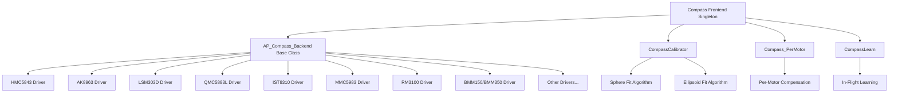

# AP_Compass

## Overview

The AP_Compass library provides ArduPilot's magnetometer (compass) subsystem, responsible for measuring the Earth's magnetic field to determine vehicle heading. This library implements a comprehensive frontend-backend architecture supporting multiple magnetometer sensors simultaneously, advanced calibration algorithms including hard-iron and soft-iron correction, motor interference compensation, automatic declination handling, and intelligent multi-compass fusion with health monitoring and failover capabilities.

The compass subsystem is critical for accurate heading estimation in GPS-denied environments, waypoint navigation, and attitude determination when combined with the AHRS (Attitude and Heading Reference System).

## Architecture

The AP_Compass library follows a frontend-backend design pattern where the Compass singleton frontend manages multiple backend drivers for different magnetometer hardware:



**Data Flow Pipeline:**

```mermaid
graph LR
    A[Raw Sensor Reading] --> B[rotate_field]
    B --> C[Sensor Frame → Body Frame]
    C --> D[publish_raw_field]
    D --> E[correct_field]
    E --> F[Hard Iron Correction]
    F --> G[Soft Iron Correction]
    G --> H[Motor Compensation]
    H --> I[publish_filtered_field]
    I --> J[Multi-Compass Fusion]
    J --> K[Primary Compass Selection]
    K --> L[calculate_heading]
    L --> M[Apply Declination]
    M --> N[True Heading Output]
```



## Key Components

### Compass Frontend (AP_Compass)

The main Compass class acts as the singleton frontend manager responsible for:
- **Backend Registration**: Detecting and registering magnetometer drivers during initialization
- **Multi-Compass Fusion**: Managing up to HAL_COMPASS_MAX_SENSORS (typically 3) compass instances with automatic primary selection based on health and priority
- **Calibration Management**: Coordinating calibration across all compass instances
- **Motor Compensation**: Applying real-time interference correction based on throttle, current, or per-motor PWM
- **Consistency Checking**: Monitoring angular difference between compasses to detect failures
- **Parameter Management**: Storing and loading calibration data (offsets, diagonals, off-diagonals, scale factors) via AP_Param
- **Health Monitoring**: Tracking sensor health, last update time, and automatic failover

**Source:** `libraries/AP_Compass/AP_Compass.h`, `libraries/AP_Compass/AP_Compass.cpp`

### Backend Drivers (AP_Compass_Backend)

Each magnetometer sensor type has a dedicated backend driver inheriting from AP_Compass_Backend:
- **Sensor Probing**: Auto-detection via I2C/SPI bus scanning and WHOAMI register verification
- **Initialization**: Loading factory calibration data (ASA registers, trim values, OTP)
- **Periodic Reading**: Scheduled callbacks to read sensor data at configured rates (typically 75-100Hz)
- **Coordinate Transformation**: Converting sensor frame measurements to board frame
- **Sample Accumulation**: Averaging multiple samples to reduce noise before publishing

**Source:** `libraries/AP_Compass/AP_Compass_Backend.h`, `libraries/AP_Compass/AP_Compass_Backend.cpp`

### CompassCalibrator

Implements sophisticated calibration algorithms for computing hard-iron and soft-iron corrections:

- **Sphere Fit**: Levenberg-Marquardt least squares optimization to find 3D offset (hard-iron) and radius
- **Ellipsoid Fit**: Extended LM to compute 3D offsets, 3D diagonal scaling (soft-iron), and 3D off-diagonal scaling
- **Sample Collection**: Accumulates 300 samples across diverse orientations for robust fitting
- **Fitness Metric**: Mean squared residuals in milligauss (default threshold: 16.0 mGauss)
- **Orientation Detection**: Automatic compass orientation detection and correction
- **Progress Reporting**: MAVLink status messages with completion percentage and orientation mask

**Source:** `libraries/AP_Compass/CompassCalibrator.h`, `libraries/AP_Compass/CompassCalibrator.cpp`, `libraries/AP_Compass/AP_Compass_Calibration.cpp`

### Compass_PerMotor

Per-motor interference compensation for multirotors:

- **Motor Mapping**: Identifies contribution of each motor's magnetic field to compass readings
- **Voltage Scaling**: Compensates for battery voltage effects on motor magnetic interference
- **Exponential Correction**: Applies non-linear scaling for ESC current effects
- **Real-Time Compensation**: Adjusts compass readings based on current PWM outputs to each motor
- **Calibration Procedure**: Step-by-step motor spool-up to measure individual motor field vectors

**Source:** `libraries/AP_Compass/Compass_PerMotor.h`, `libraries/AP_Compass/Compass_PerMotor.cpp`

### CompassLearn

In-flight offset learning using GPS velocity and magnetic field models:

- **Fixed-Yaw Calibration**: Rapid calibration using GPS velocity for yaw reference
- **Declination Tables**: Uses AP_Declination world magnetic model for field magnitude/direction
- **GSF Integration**: Gaussian Sum Filter for robust yaw estimation
- **Adaptive Learning**: Continuous offset adjustment during flight in benign magnetic conditions

**Source:** `libraries/AP_Compass/Compass_learn.h`, `libraries/AP_Compass/Compass_learn.cpp`

## Supported Magnetometer Chips

The AP_Compass library supports a wide variety of magnetometer sensors from different manufacturers:

### Honeywell / QST Magnetometers
- **HMC5843** (DEVTYPE_HMC5883_OLD = 0x01): Legacy 3-axis magnetometer, I2C interface
- **HMC5883L** (DEVTYPE_HMC5883 = 0x07): Industry standard 3-axis magnetometer, 160Hz max rate, I2C
- **QMC5883L** (DEVTYPE_QMC5883L = 0x0D): QST HMC5883L-compatible replacement, I2C
- **QMC5883P** (DEVTYPE_QMC5883P = 0x16): Improved QST variant with enhanced noise performance

### AKM (Asahi Kasei Microdevices) Magnetometers
- **AK8963** (DEVTYPE_AK8963 = 0x04): 3-axis magnetometer in MPU9250 9-DOF IMU, I2C/SPI, 14-bit/16-bit modes
- **AK09916** (DEVTYPE_AK09916 = 0x09): Magnetometer in ICM20948 9-DOF IMU, improved noise characteristics
- **AK09918** (DEVTYPE_AK09918 = 0x14): Standalone variant with low power consumption
- **AK09915** (DEVTYPE_AK09915 = 0x15): Automotive-grade variant

### STMicroelectronics Magnetometers
- **LSM303D** (DEVTYPE_LSM303D = 0x02): Combined accelerometer + magnetometer, I2C/SPI
- **LSM9DS1** (DEVTYPE_LSM9DS1 = 0x06): 9-DOF IMU with integrated magnetometer, I2C/SPI
- **LIS3MDL** (DEVTYPE_LIS3MDL = 0x08): High-performance 3-axis magnetometer, I2C/SPI, 16-bit resolution
- **IIS2MDC** (DEVTYPE_IIS2MDC = 0x18): Ultra-low-power 3-axis magnetometer

### Bosch Magnetometers
- **BMM150** (DEVTYPE_BMM150 = 0x05): Low-power geomagnetic sensor, typical in mobile applications
- **BMM350** (DEVTYPE_BMM350 = 0x17): Next-generation with enhanced performance and lower noise

### iSentek Magnetometers
- **IST8310** (DEVTYPE_IST8310 = 0x0A): High-sensitivity 3-axis magnetometer, I2C, 16-bit
- **IST8308** (DEVTYPE_IST8308 = 0x10): Compact variant with similar performance

### MEMSIC Magnetoresistive Sensors
- **MMC3416** (DEVTYPE_MMC3416 = 0x0C): Magnetoresistive technology, excellent offset stability
- **MMC5883** (DEVTYPE_MMC5XX3 = 0x13): High-precision 3-axis sensor
- **MMC5983** (DEVTYPE_MMC5983 = 0x13): Ultra-low noise variant, ideal for precision applications

### PNI Sensor Corporation
- **RM3100** (DEVTYPE_RM3100 = 0x11): High-precision magnetometer using resonant technology, extremely low noise, SPI

### Other Supported Sensors
- **MAG3110** (DEVTYPE_MAG3110 = 0x0E): Freescale/NXP 3-axis magnetometer
- **ICM20948** (DEVTYPE_ICM20948 = 0x0B): InvenSense 9-DOF IMU with AK09916 magnetometer

### Protocol-Based Compass Sources
- **DroneCAN/UAVCAN**: CAN bus magnetometers (DRIVER_UAVCAN = 11)
- **MSP Protocol**: Magnetometer data from MSP-compatible devices (DRIVER_MSP = 17)
- **External AHRS**: Compass from external attitude systems (DRIVER_EXTERNALAHRS = 18)
- **SITL Simulation**: Simulated magnetometer for Software-In-The-Loop testing (DEVTYPE_SITL = 0x0F)

**Driver Source Files:** `libraries/AP_Compass/AP_Compass_*.cpp` (individual driver implementations)

## Driver Detection and Initialization

### Initialization Sequence

The compass subsystem initializes through the following stages:

1. **Backend Probe Phase** (`_detect_backends()`):
   - Scans I2C and SPI buses for known magnetometer devices
   - Checks WHOAMI registers for device identification
   - Loads board-specific HAL compass definitions from hwdef
   - Probes DroneCAN bus for CAN magnetometers
   - Initializes MSP and External AHRS compass sources

2. **Backend Registration** (`register_compass()`):
   - Allocates compass instance number based on device ID
   - Stores device ID for persistent calibration association
   - Maintains priority list for multi-compass configurations
   - Assigns backend to instance slot

3. **Factory Calibration Loading**:
   - AK8963: Reads ASA (Adjustment Sensitivity) registers for factory trim
   - BMM150: Loads OTP (One-Time Programmable) trim data
   - Other sensors: Applies manufacturer-specific calibration data

4. **Parameter Loading** (`AP_Param`):
   - Restores saved offsets, diagonals, off-diagonals from EEPROM
   - Loads motor compensation factors
   - Applies saved rotation/orientation settings
   - Checks device ID consistency for calibration validity

5. **Primary Compass Selection**:
   - Prioritizes external compasses over internal (less interference)
   - Respects COMPASSx_USE parameter for manual priority override
   - Selects first healthy, configured compass as primary

**Auto-Detection:** The library automatically detects all connected magnetometers during initialization. External I2C compasses are probed on all available I2C buses at standard addresses.

**Source:** `libraries/AP_Compass/AP_Compass.cpp:init()`, `libraries/AP_Compass/AP_Compass.cpp:_detect_backends()`

## Calibration Algorithms

### Hard-Iron Calibration (Sphere Fit)

Hard-iron distortion is caused by permanently magnetized materials on the vehicle that create constant offset errors. The sphere fit algorithm computes 3D offsets that center the compass measurements:

**Algorithm:** Levenberg-Marquardt least squares optimization  
**Parameters:** 4 (offset_x, offset_y, offset_z, radius)  
**Samples Required:** 300 across diverse orientations  
**Fitness Threshold:** Default 16.0 mGauss RMS residual (configurable via COMPASS_CAL_FIT)

**Mathematical Model:**
```
|sample - offset| = radius  (for all samples)
```

The algorithm minimizes mean squared deviation from the ideal sphere, producing offsets that center the 3D point cloud and a radius representing local magnetic field strength.

### Soft-Iron Calibration (Ellipsoid Fit)

Soft-iron distortion is caused by ferromagnetic materials that distort the magnetic field, creating scale and non-orthogonality errors. The ellipsoid fit computes correction matrices:

**Algorithm:** Extended Levenberg-Marquardt optimization  
**Parameters:** 9 (offset_x, offset_y, offset_z, diag_x, diag_y, diag_z, offdiag_x, offdiag_y, offdiag_z)  
**Enabled:** Requires AP_COMPASS_DIAGONALS_ENABLED compile flag

**Correction Matrices:**
- **Offset Vector:** 3D hard-iron correction
- **Diagonal Matrix:** Per-axis scaling (soft-iron correction)
- **Off-Diagonal Matrix:** Non-orthogonality correction (cross-axis coupling)

**Correction Application:**
```
corrected = diag * (sample - offset) + offdiag
```

The algorithm fits a 3D ellipsoid to compass samples, computing a transformation matrix that maps the ellipsoid to a sphere.

### Fitness Metric

Calibration quality is assessed by the fitness value:
- **Units:** Milligauss (mGauss)
- **Calculation:** RMS (Root Mean Square) residual = sqrt(mean((|sample_corrected| - radius)²))
- **Good Calibration:** Fitness < 16.0 mGauss (configurable via COMPASS_CAL_FIT parameter)
- **Acceptance:** Calibration accepted only if fitness below threshold

### Sample Collection Requirements

For robust calibration, samples must cover diverse orientations:
- **Total Samples:** 300 minimum before fitting begins
- **Orientation Coverage:** Samples from 6 primary faces (up, down, left, right, forward, back)
- **Rotation Variety:** Intermediate orientations to capture full 3D field
- **Completion Mask:** MAVLink reporting shows which orientations are covered (bitmask)

**Progress Monitoring:** Ground stations display real-time completion percentage and which faces need more samples.

### Automatic Orientation Detection

The calibrator can automatically detect and correct compass mounting orientation:
- **Enabled:** COMPASS_ORIENT_AUTO parameter
- **Method:** Compares compass-derived roll/pitch with AHRS roll/pitch during calibration
- **Correction:** Automatically applies rotation matrix if orientation is incorrect
- **Confidence:** Reports orientation_confidence metric (0.0 to 1.0)

### Fixed-Yaw Calibration

Rapid calibration method using GPS velocity as heading reference:
- **Enabled:** COMPASS_LEARN = 3 (INFLIGHT) with GPS lock
- **Requirements:** Vehicle moving with good GPS velocity, benign magnetic environment
- **Speed:** Can complete calibration in seconds rather than minutes
- **Use Case:** In-flight compass failure recovery or pre-flight quick calibration

**Source:** `libraries/AP_Compass/CompassCalibrator.cpp`, `libraries/AP_Compass/AP_Compass_Calibration.cpp`

## External vs Internal Compass Priority

### Priority System

ArduPilot uses a sophisticated priority system to select the best compass:

1. **External Compass Priority**: External compasses are automatically prioritized over internal compasses because:
   - Greater distance from electrical interference sources (ESCs, power wires, motors)
   - Reduced magnetic distortion from ferromagnetic vehicle components
   - Better heading accuracy in electrically noisy environments

2. **Manual Priority Override**: COMPASSx_USE parameter allows manual priority control:
   - **COMPASS1_USE = 1**: Use this compass
   - **COMPASS1_USE = 0**: Do not use this compass
   - First compass with USE=1 becomes primary if healthy

3. **Health-Based Selection**: The system automatically selects the first healthy compass in priority order:
   - Checks sensor health (successful recent reads)
   - Validates data is within reasonable bounds
   - Monitors consistency with other compasses

4. **Device ID Matching**: Calibration data is tied to specific device IDs:
   - Prevents using calibration from wrong compass after hardware changes
   - Supports hot-swapping compasses without losing calibration
   - Warns if expected device ID doesn't match detected device

### Primary Compass Selection

The `_first_usable` compass is determined by:
- Scanning compasses in priority order
- Checking COMPASSx_USE parameter (must be 1)
- Verifying compass is healthy and returning valid data
- Ensuring compass is properly configured (has calibration)

**Failover:** If the primary compass fails health checks, the system automatically fails over to the next available compass in priority order.

### Consistency Checking

Multi-compass systems continuously check consistency:
- **Angular Difference**: Maximum allowed angular difference between compass headings (default: 60° for XY, 90° for XYZ)
- **Magnitude Difference**: Maximum difference in field strength (default: 200 mGauss)
- **Action on Inconsistency**: Logs warning, may trigger EKF innovation check failure, reduces confidence in magnetometer

**Source:** `libraries/AP_Compass/AP_Compass.cpp:consistent()`, `libraries/AP_Compass/AP_Compass.cpp:get_first_usable()`

## Motor Interference Compensation

Compass readings are significantly affected by magnetic fields generated by motors and ESCs. ArduPilot supports three compensation modes:

### Compensation Types

1. **Throttle-Based Compensation** (AP_COMPASS_MOT_COMP_THROTTLE = 0x01):
   - **Method:** Linear correction based on throttle percentage (0-100%)
   - **Compensation:** `offset = motor_compensation_factor * throttle`
   - **Use Case:** Simple fixed-wing or single-motor applications
   - **Calibration:** Automatic learning during flight by correlating compass errors with throttle

2. **Current-Based Compensation** (AP_COMPASS_MOT_COMP_CURRENT = 0x02):
   - **Method:** Linear correction based on battery current draw
   - **Compensation:** `offset = motor_compensation_factor * current`
   - **Use Case:** Applications with current sensor, more accurate than throttle
   - **Calibration:** Learns relationship between current and compass interference

3. **Per-Motor Compensation** (AP_COMPASS_MOT_COMP_PER_MOTOR = 0x03):
   - **Method:** Individual vector compensation for each motor based on PWM output
   - **Compensation:** `offset = sum(compensation[i] * scaled_pwm[i])` for i in motors
   - **Voltage Scaling:** Adjusts for battery voltage effects: `scaled_pwm = (pwm * voltage) ^ expo`
   - **Use Case:** Multirotors where motor positions create asymmetric magnetic fields
   - **Calibration:** Requires structured calibration procedure (motors spun individually)

### Per-Motor Calibration Procedure

The per-motor calibration measures the magnetic field contribution of each motor:

1. **Initialization** (`per_motor_calibration_start()`):
   - Record baseline magnetic field with motors off
   - Reset accumulation buffers for all motors

2. **Data Collection** (`per_motor_calibration_update()`):
   - Spin each motor individually through PWM range
   - Measure change in compass field vector relative to baseline
   - Accumulate samples: `field_sum[motor] += (current_field - base_field)`
   - Track output: `output_sum[motor] += scaled_output(motor)`

3. **Compensation Calculation** (`per_motor_calibration_end()`):
   - Compute average field per unit output: `compensation[i] = field_sum[i] / output_sum[i]`
   - Save compensation vectors to parameters
   - Apply compensation in real-time during flight

### Real-Time Compensation Application

During flight, compensation is applied in `Compass_PerMotor::compensate()`:
```
for each motor:
    scaled_pwm = (pwm_out[motor] * voltage)^expo
    total_offset += compensation[motor] * scaled_pwm
compass_reading -= total_offset
```

**Exponential Factor** (`MOT_COMP_EXPO`): Accounts for non-linear relationship between PWM and magnetic field strength. Typical value: 0.65

### Compensation Parameters

- **COMPASS_MOT_X/Y/Z**: Throttle/current compensation factors (mGauss per unit)
- **COMPASS_PMOT_EN**: Enable per-motor compensation
- **COMPASS_PMOT_EXP**: Exponential scaling factor for per-motor
- **COMPASS_PMOT1/2/3/4_X/Y/Z**: Per-motor compensation vectors

**Source:** `libraries/AP_Compass/Compass_PerMotor.cpp`, `libraries/AP_Compass/AP_Compass.cpp:_apply_motor_compensation()`

## Declination Handling

Magnetic declination is the angle between magnetic north (compass reading) and true north (geographic north pole). ArduPilot provides automatic and manual declination correction:

### Automatic Declination

Enabled by default (COMPASS_AUTODEC = 1):
- **Data Source:** WMM (World Magnetic Model) lookup tables in AP_Declination library
- **Input:** GPS latitude and longitude from initial position fix
- **Lookup:** Interpolates declination value from embedded magnetic field model
- **Application:** Applied automatically in `calculate_heading()` when computing true heading
- **Update:** Declination set once at first GPS lock via `try_set_initial_location()`

### Manual Declination

User can manually set declination (COMPASS_AUTODEC = 0):
- **Parameter:** COMPASS_DEC (in radians)
- **Use Case:** GPS-denied environments, static installations with known declination
- **Setting Method:** Via ground station or `set_declination()` call

### Declination Application

Declination is applied in the heading calculation:
```
magnetic_heading = atan2(mag_y, mag_x)  // in body frame, corrected for tilt
true_heading = magnetic_heading + declination
```

**Note:** Declination varies by location and changes over time. The WMM model is updated periodically (~every 5 years) to maintain accuracy.

**Source:** `libraries/AP_Compass/AP_Compass.cpp:calculate_heading()`, `libraries/AP_Compass/AP_Compass.cpp:set_declination()`, `libraries/AP_Declination/AP_Declination.cpp`

## Multi-Compass Fusion

### Sensor Fusion Strategy

ArduPilot does not blend readings from multiple compasses. Instead, it uses a **primary selection with failover** approach:

1. **Primary Compass**: The highest priority healthy compass is used exclusively for heading calculation
2. **Health Monitoring**: All compasses are continuously monitored for:
   - Recent successful reads (last_update_usec within timeout)
   - Reasonable field magnitude (within expected Earth field range 100-1000 mGauss)
   - Consistency with other compasses (angular difference thresholds)
3. **Automatic Failover**: If primary compass fails health checks, system switches to next healthy compass
4. **No Blending**: Only one compass reading is used at a time (simplifies error modes)

### Consistency Checking

The `Compass::consistent()` method verifies compass agreement:

**XY Plane Consistency:**
- Maximum angular difference between any two compasses: 60° (configurable via COMPASS_MAX_XY_ANG_DIFF)
- Maximum field magnitude difference: 200 mGauss (COMPASS_MAX_XY_LENGTH_DIFF)

**XYZ Full Vector Consistency:**
- Maximum 3D angular difference: 90° (COMPASS_MAX_XYZ_ANG_DIFF)

**Inconsistency Handling:**
- Logs warning message
- EKF may reduce magnetometer innovation weighting
- Pre-arm check may fail if compasses severely inconsistent

### Health Monitoring

Each compass instance maintains health status based on:
- **Update Rate**: Recent successful reads (updated within last second)
- **Field Magnitude**: Reading within Earth's magnetic field range (typically 200-600 mGauss depending on location)
- **Error Flags**: No I2C/SPI communication errors
- **Calibration Status**: Has valid calibration (offsets within reasonable bounds)

**Health Accessor:** `Compass::healthy(instance)` returns true if compass is functioning properly.

### Instance Management

The system supports up to HAL_COMPASS_MAX_SENSORS compass instances:
- **Typical Configuration**: 3 compasses maximum (internal + 2 external)
- **Instance Allocation**: Backends register with frontend during detection
- **Device ID Tracking**: Unique device ID associates calibration with physical sensor
- **Priority Array**: Separate priority ordering from detection order

**Source:** `libraries/AP_Compass/AP_Compass.cpp:get_first_usable()`, `libraries/AP_Compass/AP_Compass.cpp:consistent()`, `libraries/AP_Compass/AP_Compass.cpp:healthy()`

## Configuration Parameters

Key parameters for compass configuration (access via ground station or mission planner):

| Parameter | Description | Default | Range | Units |
|-----------|-------------|---------|-------|-------|
| COMPASS_ENABLE | Enable compass subsystem | 1 | 0-1 | bool |
| COMPASS_AUTODEC | Enable automatic declination | 1 | 0-1 | bool |
| COMPASS_DEC | Manual declination setting | 0.0 | -3.14 to 3.14 | radians |
| COMPASSx_USE | Use compass instance x for navigation | 1 | 0-1 | bool |
| COMPASSx_EXTERN | Compass x is external | auto | 0-1 | bool |
| COMPASSx_ORIENT | Compass x orientation | ROTATION_NONE | enum | rotation |
| COMPASSx_OFS_X/Y/Z | Hard-iron offsets | 0.0 | -32768 to 32767 | mGauss |
| COMPASSx_DIA_X/Y/Z | Diagonal soft-iron corrections | 1.0 | 0.5 to 1.5 | scale |
| COMPASSx_ODI_X/Y/Z | Off-diagonal soft-iron corrections | 0.0 | -1.0 to 1.0 | scale |
| COMPASSx_SCALE | Scale factor | 1.0 | 0.5 to 1.5 | scale |
| COMPASS_MOT_X/Y/Z | Motor compensation factors | 0.0 | -1000 to 1000 | mGauss/A or mGauss/% |
| COMPASS_MOTCT | Motor compensation type | 0 | 0-3 | enum |
| COMPASS_PMOT_EN | Enable per-motor compensation | 0 | 0-1 | bool |
| COMPASS_PMOT_EXP | Per-motor exponential factor | 0.65 | 0.0 to 1.0 | scale |
| COMPASS_PMOT1-4_X/Y/Z | Per-motor compensation vectors | 0.0 | -1000 to 1000 | mGauss |
| COMPASS_LEARN | Offset learning type | 0 | 0-3 | enum |
| COMPASS_CAL_FIT | Calibration fitness threshold | 16.0 | 4.0 to 32.0 | mGauss |
| COMPASS_OFFS_MAX | Maximum offset values | 850 | 500 to 1800 | mGauss |
| COMPASS_ORIENT_AUTO | Auto-detect orientation on calibration | 1 | 0-2 | enum |

**Parameter Notes:**
- Parameters are stored in EEPROM and persist across reboots
- Calibration parameters (offsets, diagonals, off-diagonals) are automatically saved after successful calibration
- Motor compensation parameters can be learned in-flight or calibrated on ground
- Device IDs (COMPASSx_DEVID) are automatically set and should not be manually modified

**Source:** `libraries/AP_Compass/AP_Compass.cpp:var_info[]`

## Safety Considerations

### Critical Compass Functions

The compass is essential for safe vehicle operation in many flight modes:
- **Waypoint Navigation**: Requires accurate heading for course following
- **Loiter Mode**: Uses heading for position hold in wind
- **Return-to-Launch**: Depends on heading for navigation back to home
- **Auto Missions**: All autonomous navigation depends on compass
- **GPS-Denied Flight**: Compass critical when GPS unavailable or degraded

### Failure Modes and Mitigation

**1. Compass Not Calibrated:**
- **Symptom:** Vehicle may not arm, or heading drifts significantly
- **Detection:** Pre-arm check: "PreArm: Compass not calibrated"
- **Mitigation:** Perform compass calibration before flight

**2. Compass Interference:**
- **Symptom:** Erratic heading, circling in Loiter, poor waypoint tracking
- **Detection:** High compass offsets (>600 mGauss), poor calibration fitness
- **Mitigation:** Move compass away from interference sources, use external compass, enable motor compensation

**3. Compass Inconsistency:**
- **Symptom:** Multiple compasses disagree significantly
- **Detection:** Pre-arm check: "PreArm: Compasses inconsistent", EKF compass innovations high
- **Mitigation:** Recalibrate compasses, check for magnetic interference, verify mounting orientation

**4. Wrong Compass Orientation:**
- **Symptom:** Vehicle rotates in wrong direction, won't maintain heading
- **Detection:** Calibration reports bad orientation, heading 180° off
- **Mitigation:** Set COMPASSx_ORIENT correctly, enable COMPASS_ORIENT_AUTO for auto-detection

**5. Compass Failure During Flight:**
- **Symptom:** Loss of heading, EKF warnings
- **Detection:** Compass health check fails, no recent updates
- **Mitigation:** Automatic failover to backup compass if available, EKF can continue with degraded performance using GPS velocity for heading

### Pre-Flight Checks

Compass-related pre-arm checks that must pass before arming:
- Compass is configured (has calibration)
- Compass health is good (recent successful reads)
- Multiple compasses are consistent (if more than one installed)
- Compass offsets are within reasonable bounds (< COMPASS_OFFS_MAX)
- Compass orientation is correct (if COMPASS_ORIENT_AUTO enabled)

### Safe Testing Procedures

**Ground Calibration:**
1. Perform calibration in magnetically clean area away from metal structures, vehicles, power lines
2. Rotate vehicle smoothly through all axes (full 3D rotation coverage)
3. Verify fitness value < 16.0 mGauss after calibration
4. Check that offsets are reasonable (typically < 300 mGauss for external, < 600 mGauss for internal)

**Motor Compensation Calibration:**
1. Secure vehicle to prevent movement
2. Remove propellers (safety critical)
3. Use ground station motor test function or automated per-motor calibration
4. Verify compass readings stabilize after calibration

**SITL Testing:**
- Use SITL simulation to verify compass configuration before hardware testing
- Test different compass failure scenarios in simulation
- Validate parameter changes in simulation first

**Source:** `libraries/AP_Compass/AP_Compass.cpp:configured()`, `libraries/AP_Arming/AP_Arming.cpp` (pre-arm compass checks)

## Usage Patterns

### Basic Compass Reading

```cpp
#include <AP_Compass/AP_Compass.h>

// Get compass singleton
Compass &compass = AP::compass();

// In vehicle setup:
compass.init();

// In main loop:
if (compass.read()) {
    // Get primary compass field
    const Vector3f& field = compass.get_field();
    
    // Get heading (requires DCM matrix from AHRS)
    float heading = compass.calculate_heading(ahrs.get_rotation_body_to_ned());
    
    // Check compass health
    if (!compass.healthy()) {
        // Handle compass failure
    }
}
```

### Multi-Compass Access

```cpp
// Get number of compasses
uint8_t num_compasses = compass.get_count();

// Access specific compass instance
for (uint8_t i = 0; i < num_compasses; i++) {
    const Vector3f& field_i = compass.get_field(i);
    float heading_i = compass.calculate_heading(dcm_matrix, i);
    bool healthy_i = compass.healthy(i);
    uint32_t last_update_ms = compass.last_update_ms(i);
}

// Check consistency between compasses
if (!compass.consistent()) {
    GCS_SEND_TEXT(MAV_SEVERITY_WARNING, "Compasses inconsistent");
}
```

### Calibration Integration

```cpp
#if COMPASS_CAL_ENABLED
// Start calibration on all compasses
bool success = compass.start_calibration_all(
    /*retry=*/false,
    /*autosave=*/true,
    /*delay_sec=*/0.0f,
    /*autoreboot=*/false
);

// In main loop during calibration:
if (compass.is_calibrating()) {
    compass.cal_update();
    
    // Send progress to ground station (done in GCS_MAVLink)
    // gcs().send_mag_cal_progress();
}

// Cancel calibration if needed:
compass.cancel_calibration_all();
#endif
```

### Motor Compensation

```cpp
// Set motor compensation type
compass.motor_compensation_type(AP_COMPASS_MOT_COMP_THROTTLE);

// Update throttle for compensation (in vehicle code)
compass.set_throttle(throttle_pct); // 0.0 to 1.0

// For per-motor compensation:
#if COMPASS_MOT_ENABLED
compass.per_motor_calibration_start();
// ... perform motor test sequence ...
compass.per_motor_calibration_update();
// ... after test complete ...
compass.per_motor_calibration_end();
#endif
```

### Offsets and Configuration

```cpp
// Get/set offsets
const Vector3f& offsets = compass.get_offsets(0); // compass instance 0
compass.set_and_save_offsets(0, Vector3f(100, -50, 25)); // in mGauss

// Set declination
compass.set_declination(radians(15.0), /*save_to_eeprom=*/true);

// Configure compass use
// (typically done via parameters, but can be done in code)
```

### Fixed-Yaw Calibration

```cpp
#if AP_COMPASS_CALIBRATION_FIXED_YAW_ENABLED
// Quick calibration using known yaw
bool cal_success = compass.mag_cal_fixed_yaw(
    yaw_deg,        // Vehicle yaw in degrees
    0xFF,           // Compass mask (all compasses)
    lat_deg,        // Current latitude
    lon_deg,        // Current longitude
    false           // force_use
);
#endif
```

## Testing

### Unit Testing

Compass unit tests verify calibration algorithms and math functions:
- **Location:** `libraries/AP_Compass/tests/`
- **Focus Areas:** CompassCalibrator sphere/ellipsoid fitting, rotation matrices, consistency checks

### SITL Testing

Software-In-The-Loop testing for compass functionality:

```bash
# Start SITL with simulated compass
sim_vehicle.py -v ArduCopter --console --map

# In SITL console, test compass:
# Calibrate compass
module load compassmot  # for motor compensation
accelcal                # includes compass calibration

# Simulate compass failure
param set SIM_MAG1_FAIL 1

# Test multi-compass configuration
param set SIM_MAG2_DEVID 97539  # Add second compass
param set COMPASS2_USE 1
reboot
```

### Hardware Testing

On actual hardware:

**1. Basic Compass Check:**
```bash
# Connect via MAVProxy
# Check compass parameters
param show COMPASS*

# Verify compass is detected
# Look for "Found compass" messages in boot log
```

**2. Calibration Test:**
- Use Mission Planner or QGroundControl compass calibration tool
- Rotate vehicle through all axes smoothly
- Verify fitness < 16.0 mGauss
- Check offsets are reasonable

**3. Motor Interference Test:**
- Note compass heading with motors off
- Slowly increase throttle
- Observe heading deviation
- If > 30° deviation, enable motor compensation

**4. Consistency Test (Multi-Compass):**
- Compare COMPASSx_ORIENT settings
- Verify all compasses show similar headings (within 10°)
- Check LOG data for compass consistency messages

### Compass Log Analysis

Analyze compass performance from dataflash logs:

**Important Log Messages:**
- **MAG:** Magnetometer readings (field_x/y/z, offsets, motor offsets, health)
- **EKF4:** EKF innovations (magN/E/D show compass vs EKF disagreement)
- **MAG_CAL:** Calibration progress and results

**Analysis Steps:**
1. Plot MAG.MagX/Y/Z over time - should be smooth, consistent
2. Check MAG.Health - should be 1 (healthy)
3. Compare MAG messages from multiple compasses for consistency
4. Review EKF4.magN/E/D innovations - large values indicate compass issues
5. Examine motor interference: plot MAG vs throttle, look for correlation

### Common Test Scenarios

**Scenario 1: New Hardware Integration**
- Verify compass auto-detection during init
- Confirm device ID is correctly set
- Perform full calibration and validate fitness

**Scenario 2: Compass Replacement**
- Verify old calibration is not applied to new device
- Check device ID mismatch warning
- Recalibrate and verify performance

**Scenario 3: Multi-Compass Failover**
- Artificially fail primary compass (disconnect or param set)
- Verify automatic failover to backup compass
- Check heading remains stable during transition

**Source:** `Tools/autotest/arducopter.py` (automated compass tests), `libraries/AP_Compass/examples/` (example code)

## Implementation Notes

### Design Decisions

**Frontend-Backend Pattern:**
- **Rationale:** Separates sensor-specific driver logic from common compass management, enabling easy addition of new sensor types without modifying core compass logic
- **Trade-off:** Slight overhead from virtual function calls, but gains in maintainability and modularity

**Primary Selection vs Fusion:**
- **Rationale:** Using single primary compass with failover is simpler and more predictable than blending multiple compasses, avoids complex sensor fusion error modes
- **Trade-off:** Doesn't leverage information from multiple sensors simultaneously, but in practice healthy compasses agree closely

**Calibration Algorithms:**
- **Sphere Fit:** Fast, sufficient for most applications with moderate soft-iron effects
- **Ellipsoid Fit:** More complex, required for vehicles with significant ferromagnetic distortion
- **Trade-off:** Ellipsoid fit requires more flash memory, computation time, but provides better accuracy

**Motor Compensation:**
- **Per-Motor Mode:** Most accurate for multirotors with asymmetric motor layout
- **Throttle/Current Mode:** Simpler, adequate for symmetric configurations or fixed-wing
- **Trade-off:** Per-motor requires dedicated calibration procedure, but significantly reduces interference

### Coordinate Frames

The compass subsystem uses multiple coordinate frames:

**Sensor Frame:** Raw magnetometer chip coordinate system (chip-specific, varies by manufacturer)

**Board Frame:** Aligned with autopilot board axes (after applying COMPASSx_ORIENT rotation)

**Body Frame:** Vehicle body axes (typically Forward-Right-Down for aircraft)
- X: Forward
- Y: Right
- Z: Down

**NED Frame (Navigation Frame):** North-East-Down earth-fixed frame
- X: North
- Y: East
- Z: Down (into earth)

**Transformations:**
1. Sensor → Board: Apply COMPASSx_ORIENT rotation
2. Board → Body: Apply board orientation rotation (typically ROTATION_NONE)
3. Body → NED: Apply DCM matrix from AHRS (tilt compensation)

**Heading Calculation:** Heading is computed in the NED frame after tilt compensation, representing angle from true north (after declination correction).

### Thread Safety

The compass subsystem is accessed from multiple threads:
- **Scheduler thread:** Backend drivers read sensors in periodic callbacks
- **Main thread:** Vehicle code reads compass for navigation
- **Calibration thread:** CompassCalibrator runs in separate thread during calibration

**Synchronization Mechanisms:**
- **Semaphore protection:** `WITH_SEMAPHORE(_sem)` protects shared state during updates
- **Atomic reads:** Frontend provides atomic access to latest field vector
- **Sample accumulation:** Backends accumulate multiple samples, frontend publishes averaged result

### Memory Constraints

Compass configuration for different platforms:
- **Full-size autopilots:** HAL_COMPASS_MAX_SENSORS = 3, full ellipsoid calibration enabled
- **AP_Periph (CAN nodes):** HAL_COMPASS_MAX_SENSORS = 1, reduced calibration features
- **ESP32:** Limited memory, may disable some advanced features via AP_COMPASS_*_ENABLED flags

### Known Limitations

1. **Soft-Iron Calibration:** Ellipsoid fit assumes static ferromagnetic distortion; doesn't account for dynamic distortion (e.g., from deployable landing gear)

2. **Motor Compensation:** Per-motor calibration is specific to vehicle configuration; must be redone if motors are repositioned or propellers changed

3. **Declination Updates:** Automatic declination uses initial GPS lock location; doesn't update for long-distance travel (would require periodic WMM lookups)

4. **Calibration Sample Distribution:** Automatic calibration quality depends on user achieving good 3D rotation coverage; poor coverage degrades accuracy

5. **Temperature Effects:** Current implementation doesn't compensate for temperature-dependent offset drift (some magnetometers have significant thermal sensitivity)

### Future Enhancements

Potential areas for improvement (not currently implemented):
- Temperature compensation using onboard or external temperature sensors
- Adaptive motor compensation learning during flight
- Automatic re-calibration triggers based on detected degradation
- Enhanced multi-compass fusion using weighted averaging
- Integration with magnetometer arrays for gradiometer-based interference rejection

## References

### Source Files

- **Frontend:** `libraries/AP_Compass/AP_Compass.h`, `libraries/AP_Compass/AP_Compass.cpp`
- **Backend Base:** `libraries/AP_Compass/AP_Compass_Backend.h`, `libraries/AP_Compass/AP_Compass_Backend.cpp`
- **Calibration:** `libraries/AP_Compass/CompassCalibrator.h`, `libraries/AP_Compass/CompassCalibrator.cpp`, `libraries/AP_Compass/AP_Compass_Calibration.cpp`
- **Motor Compensation:** `libraries/AP_Compass/Compass_PerMotor.h`, `libraries/AP_Compass/Compass_PerMotor.cpp`
- **In-Flight Learning:** `libraries/AP_Compass/Compass_learn.h`, `libraries/AP_Compass/Compass_learn.cpp`
- **Drivers:** `libraries/AP_Compass/AP_Compass_*.cpp` (HMC5843, AK8963, LSM303D, QMC5883L, IST8310, etc.)
- **Configuration:** `libraries/AP_Compass/AP_Compass_config.h`

### Related Modules

- **AP_AHRS:** Provides DCM matrix for tilt-compensated heading calculation
- **AP_Declination:** World Magnetic Model for automatic declination lookup
- **AP_HAL:** Hardware abstraction for I2C/SPI sensor access
- **AP_Param:** Parameter storage and management
- **AP_Math:** Vector and matrix math for coordinate transformations
- **GCS_MAVLink:** MAVLink protocol for calibration progress reporting
- **AP_NavEKF3:** Extended Kalman Filter uses compass for yaw estimation

### External Documentation

- **ArduPilot Wiki:** https://ardupilot.org/copter/docs/common-compass-calibration-in-mission-planner.html
- **Compass Setup Guide:** https://ardupilot.org/copter/docs/common-compass-setup-advanced.html
- **Motor Interference:** https://ardupilot.org/copter/docs/common-compass-setup-advanced.html#motor-interference-compensation
- **MAVLink Protocol:** https://mavlink.io/en/messages/common.html#MAG_CAL_REPORT

### Datasheet References

- **HMC5883L:** Honeywell 3-Axis Digital Compass IC
- **AK8963:** AKM 3-axis Electronic Compass
- **LSM303D:** STMicroelectronics Ultra-compact 3D accelerometer and 3D magnetometer
- **QMC5883L:** QST 3-Axis Magnetic Sensor
- **IST8310:** iSentek 3-Axis Magnetometer
- **BMM150:** Bosch Geomagnetic Sensor
- **RM3100:** PNI Geomagnetic Sensor
- **MMC5983MA:** MEMSIC 3-axis Magnetic Sensor

---

**Last Updated:** 2025-01-01  
**Maintainer:** ArduPilot Development Team  
**License:** GPLv3

