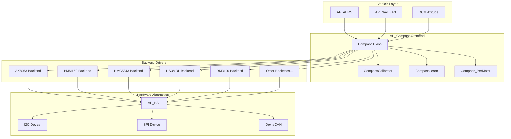
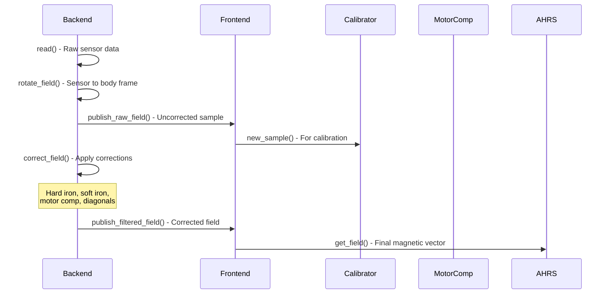
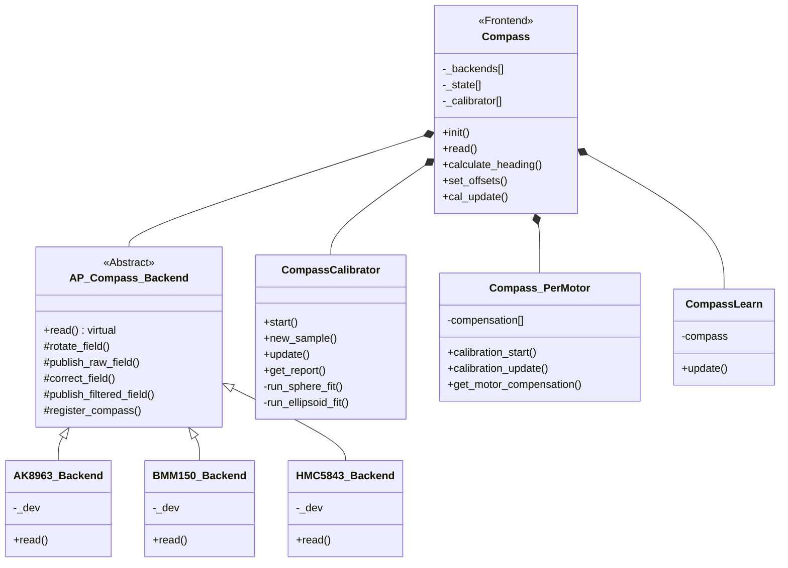
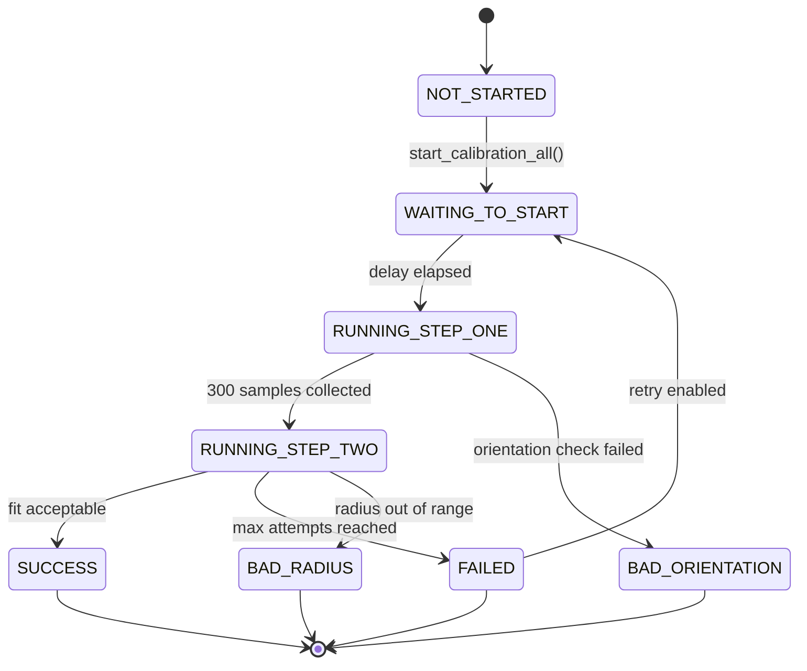
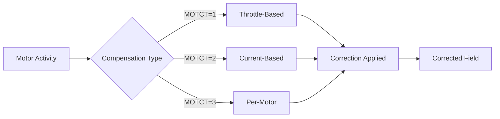
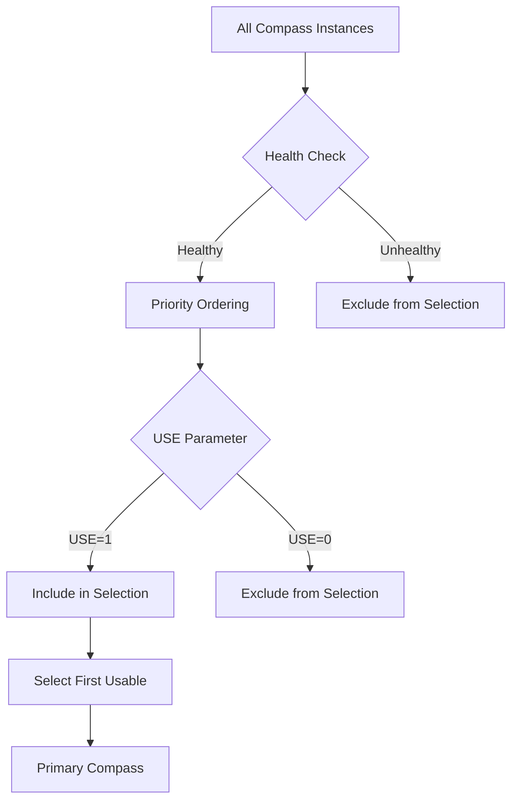
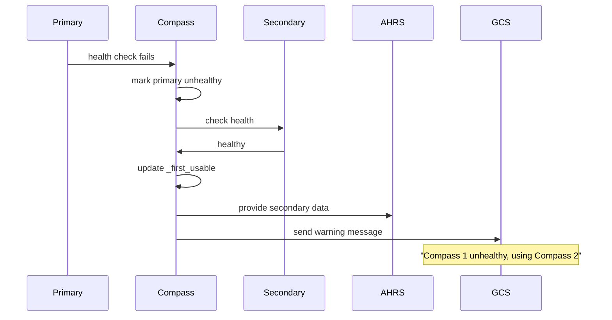

# AP_Compass Library


## Table of Contents
- [Overview](#overview)
- [Architecture](#architecture)
- [Supported Magnetometers](#supported-magnetometers)
- [Calibration System](#calibration-system)
- [Motor Interference Compensation](#motor-interference-compensation)
- [Declination Handling](#declination-handling)
- [Multiple Compass Support](#multiple-compass-support)
- [Health Monitoring](#health-monitoring)
- [API Reference](#api-reference)
- [Calibration Procedures](#calibration-procedures)
- [Configuration Parameters](#configuration-parameters)
- [Integration Examples](#integration-examples)
- [Troubleshooting](#troubleshooting)

## Overview

The AP_Compass library provides a comprehensive magnetometer management system for the ArduPilot autopilot software. It implements a frontend/backend architecture that supports multiple compass sensors with automatic detection, calibration, interference compensation, and health monitoring.

**Primary Responsibilities**:
- Unified interface for multiple magnetometer hardware backends
- Real-time magnetic field measurement and correction
- Sophisticated calibration algorithms (sphere and ellipsoid fitting)
- Motor interference compensation (throttle, current, and per-motor methods)
- Automatic magnetic declination calculation from GPS position
- Multi-compass redundancy with priority management
- Health monitoring and failure detection

**Source Files**: `libraries/AP_Compass/`

**Key Features**:
- Support for 20+ magnetometer chip types
- Simultaneous operation of up to 3 compass instances (configurable via `HAL_COMPASS_MAX_SENSORS`)
- Automatic sensor detection and registration
- In-flight offset learning capability
- MAVLink integration for remote calibration
- DroneCAN and external AHRS support

## Architecture

The AP_Compass library follows a frontend/backend design pattern that separates the hardware-independent interface from hardware-specific driver implementations.

### System Architecture



### Data Flow Pipeline

The compass measurement pipeline processes raw sensor data through multiple correction stages:



### Class Hierarchy



### Core Components

#### Frontend (`AP_Compass.h`, `AP_Compass.cpp`)
The `Compass` class provides the main interface for compass operations:
- **Initialization**: Detects and registers all available compass backends
- **Data Collection**: Reads and processes data from all registered compasses
- **Calibration Management**: Coordinates calibration processes
- **Priority Management**: Selects primary compass based on health and configuration
- **Parameter Storage**: Manages compass offsets, scaling, and configuration

#### Backend Base Class (`AP_Compass_Backend.h`, `AP_Compass_Backend.cpp`)
Abstract base class defining the interface for hardware-specific drivers:
- **Pure Virtual Methods**: `read()` must be implemented by each driver
- **Protected Helpers**: Field rotation, correction, and publishing utilities
- **Registration**: Device ID management and instance allocation
- **Error Handling**: Field validation and error counting

## Supported Magnetometers

The AP_Compass library supports a comprehensive range of magnetometer chips from multiple manufacturers. Each chip has a unique device type identifier used for calibration data persistence.

### Supported Sensor Chips

| Chip Model | Manufacturer | Bus Interface | DevType ID | Notes |
|-----------|--------------|---------------|------------|-------|
| **AK8963** | AsahiKasei (AKM) | I2C/SPI | 0x04 | Integrated in MPU9250 IMU |
| **AK09916** | AsahiKasei (AKM) | I2C/SPI | 0x09 | Integrated in ICM20948 IMU |
| **AK09915** | AsahiKasei (AKM) | I2C | 0x15 | Standalone magnetometer |
| **AK09918** | AsahiKasei (AKM) | I2C | 0x14 | Low-power variant |
| **BMM150** | Bosch | I2C/SPI | 0x05 | 3-axis geomagnetic sensor |
| **BMM350** | Bosch | I2C/SPI | 0x17 | Latest generation, low noise |
| **HMC5843** | Honeywell | I2C | 0x07 | Classic 3-axis compass |
| **IIS2MDC** | STMicroelectronics | I2C/SPI | 0x18 | Ultra-low-power magnetometer |
| **IST8308** | Isentek | I2C | 0x10 | 3-axis AMR sensor |
| **IST8310** | Isentek | I2C | 0x0A | High-sensitivity AMR sensor |
| **LIS3MDL** | STMicroelectronics | I2C/SPI | 0x08 | Ultra-low-power 3-axis |
| **LSM303D** | STMicroelectronics | I2C/SPI | 0x02 | Integrated accel+mag |
| **LSM9DS1** | STMicroelectronics | I2C/SPI | 0x06 | 9-axis IMU with mag |
| **MAG3110** | NXP/Freescale | I2C | 0x0E | Digital compass sensor |
| **MMC3416** | MEMSIC | I2C | 0x0C | AMR technology |
| **MMC5983** | MEMSIC | I2C/SPI | 0x13 | High-accuracy magnetometer |
| **QMC5883L** | QST Corporation | I2C | 0x0D | HMC5883 pin-compatible |
| **QMC5883P** | QST Corporation | I2C | 0x16 | Enhanced version |
| **RM3100** | PNI Sensor Corporation | I2C/SPI | 0x11 | Ultra-high sensitivity |
| **ICM20948** | TDK InvenSense | I2C/SPI | 0x0B | 9-axis IMU (includes AK09916) |

### Additional Sources

| Source Type | Description | Interface |
|------------|-------------|-----------|
| **DroneCAN** | CAN bus magnetometers | UAVCAN/DroneCAN protocol |
| **MSP** | MultiWii Serial Protocol | Serial (MSP) |
| **ExternalAHRS** | External AHRS systems | Various |
| **SITL** | Software-In-The-Loop simulation | Virtual (0x0F) |

### Sensor Characteristics

#### Communication Interfaces
- **I2C**: Most common interface, supports multiple devices on same bus
- **SPI**: Higher speed, lower latency, typically used in integrated IMUs
- **CAN**: DroneCAN nodes providing magnetometer data
- **Serial**: MSP-compatible external compasses

#### Detection Process
Source: `AP_Compass.cpp:_detect_backends()`

```cpp
// Detection occurs during initialization in priority order:
// 1. Board-specific internal compasses
// 2. IMU-integrated magnetometers (MPU9250, ICM20948)
// 3. External I2C compasses on standard addresses
// 4. SPI-connected compasses
// 5. DroneCAN magnetometer nodes
// 6. MSP/ExternalAHRS compasses
```

#### Driver Disable Mask
Individual driver types can be disabled using the `COMPASS_TYPEMASK` parameter to prevent loading specific backends:
- Bit 0: HMC5843
- Bit 1: LSM303D
- Bit 2: AK8963
- Bit 3: BMM150
- Bit 4: LSM9DS1
- Bit 5: LIS3MDL
- Bit 6: AK09916
- Bit 7: IST8310
- And so on for each driver type...

## Calibration System

The AP_Compass library implements sophisticated calibration algorithms to compensate for hard iron, soft iron, scale factor errors, and non-orthogonality effects.

### Calibration State Machine



### Calibration Algorithms

Source: `CompassCalibrator.cpp`, `AP_Compass_Calibration.cpp`

#### Hard Iron Calibration
**Purpose**: Compensate for constant magnetic field offsets caused by ferromagnetic materials in the vehicle frame.

**Algorithm**: The calibrator collects samples while the vehicle is rotated in all orientations, then calculates offsets that center the measured field values:

```
offset = (max_field + min_field) / 2
```

Initial offsets are calculated by averaging all samples:
```cpp
// Source: CompassCalibrator.cpp:calc_initial_offset()
void CompassCalibrator::calc_initial_offset() {
    Vector3f avg = Vector3f(0,0,0);
    for (uint16_t k = 0; k < _samples_collected; k++) {
        avg += _sample_buffer[k].get();
    }
    avg /= _samples_collected;
    _params.offset = avg;
}
```

#### Sphere Fit (Step One)
**Purpose**: Refine offsets assuming the Earth's magnetic field has constant magnitude (sphere model).

**Algorithm**: Levenberg-Marquardt optimization minimizing the variance of measured field magnitudes:

```
Minimize: Σ(|B_measured - offset| - radius)²
```

Parameters fitted: `[offset_x, offset_y, offset_z, radius]` (4 parameters)

```cpp
// Source: CompassCalibrator.cpp:run_sphere_fit()
// Jacobian for sphere fitting
void CompassCalibrator::calc_sphere_jacob(const Vector3f& sample, 
                                          const param_t& params, 
                                          float* ret) const {
    const Vector3f &offset = params.offset;
    const float &radius = params.radius;
    
    float A = (sample.x + offset.x);
    float B = (sample.y + offset.y);
    float C = (sample.z + offset.z);
    float length = (offset + sample).length();
    
    // Jacobian matrix elements
    ret[0] = -1.0f * ((-1.0f * radius / length) + 1.0f) * A;
    ret[1] = -1.0f * ((-1.0f * radius / length) + 1.0f) * B;
    ret[2] = -1.0f * ((-1.0f * radius / length) + 1.0f) * C;
    ret[3] = 1.0f;
}
```

Sample thinning occurs between steps to reduce computation:
```cpp
// Samples reduced from 300 to ~100 for ellipsoid fitting
void CompassCalibrator::thin_samples() {
    // Keep every 3rd sample to reduce computational load
}
```

#### Ellipsoid Fit (Step Two)
**Purpose**: Correct for soft iron effects and scale factor errors (ellipsoid model).

**Algorithm**: Extended Levenberg-Marquardt optimization with 9 parameters:

```
Parameters: [offset_x, offset_y, offset_z, 
             diag_x, diag_y, diag_z,
             offdiag_x, offdiag_y, offdiag_z]
```

The corrected field is computed as:
```
B_corrected = Diag * OffDiag * (B_measured - offset)

Where:
  Diag = diag(diag_x, diag_y, diag_z)
  OffDiag = [[1, offdiag_x, offdiag_y],
             [0, 1,         offdiag_z],
             [0, 0,         1        ]]
```

```cpp
// Source: CompassCalibrator.cpp:run_ellipsoid_fit()
void CompassCalibrator::calc_ellipsoid_jacob(const Vector3f& sample, 
                                             const param_t& params, 
                                             float* ret) const {
    const Vector3f &offset = params.offset;
    const Vector3f &diag = params.diag;
    const Vector3f &offdiag = params.offdiag;
    
    Matrix3f softiron(
        diag.x,     offdiag.x,  offdiag.y,
        offdiag.x,  diag.y,     offdiag.z,
        offdiag.y,  offdiag.z,  diag.z
    );
    
    Vector3f corrected = softiron * (sample + offset);
    // ... Jacobian computation
}
```

#### Fitness Metric
**Calculation**: Root Mean Square (RMS) of residuals in milligauss:

```cpp
// Source: CompassCalibrator.cpp:calc_mean_squared_residuals()
float CompassCalibrator::calc_mean_squared_residuals(const param_t& params) const {
    float sum = 0.0f;
    for (uint16_t i = 0; i < _samples_collected; i++) {
        Vector3f sample = _sample_buffer[i].get();
        float residual = calc_residual(sample, params);
        sum += sq(residual);
    }
    return safe_sqrt(sum / _samples_collected);
}
```

**Acceptance Threshold**: Default fitness < 16.0 mGauss (configurable via `COMPASS_CAL_FIT` parameter)

Source: `AP_Compass.h:38`
```cpp
#define AP_COMPASS_CALIBRATION_FITNESS_DEFAULT 16.0f
```

#### Levenberg-Marquardt Optimization
**Damping Parameter**: Automatically adjusted during iteration:
- Increased if fit worsens (more gradient descent behavior)
- Decreased if fit improves (more Gauss-Newton behavior)
- Initial λ = 1.0, adjusted by factors of 10

```cpp
// Sphere lambda adjustment
if (new_fitness < _fitness) {
    _sphere_lambda /= 10.0f;
} else {
    _sphere_lambda *= 10.0f;
}
```

### Automatic Orientation Detection

For external compasses, the calibrator can automatically determine the correct sensor orientation:

```cpp
// Source: CompassCalibrator.cpp:calculate_orientation()
// Tries all possible rotations and selects best match to Earth field
bool CompassCalibrator::calculate_orientation() {
    float best_confidence = 0.0f;
    Rotation best_rotation = _orig_orientation;
    
    // Test all rotation possibilities
    for (uint8_t n = 0; n < 26; n++) {
        Rotation r = auto_rotation_index(n);
        // Calculate earth field for this rotation
        // Select rotation with highest confidence
    }
    
    _orientation_solution = best_rotation;
    return true;
}
```

**Orientation Confidence**: Measures alignment with expected Earth field direction and magnitude.

### Fixed Yaw Calibration

When GPS position and accurate yaw are available, a faster calibration method can be used:

```cpp
// Source: AP_Compass_Calibration.cpp:mag_cal_fixed_yaw()
/**
 * @brief Fast compass calibration given known yaw angle
 * 
 * @details Uses vehicle attitude and known yaw to calculate expected
 *          Earth field vector, then solves for offsets directly.
 * 
 * @param[in] yaw_deg Known yaw angle in degrees
 * @param[in] compass_mask Bitmask of compasses to calibrate
 * @param[in] lat_deg Latitude for Earth field model
 * @param[in] lon_deg Longitude for Earth field model
 * 
 * @return true if calibration successful
 */
bool Compass::mag_cal_fixed_yaw(float yaw_deg, uint8_t compass_mask,
                                float lat_deg, float lon_deg,
                                bool force_use) {
    // Calculate expected Earth field from World Magnetic Model
    // Compare with measured field to extract offsets
}
```

This method is used by the **In-Flight Learning** feature.

### In-Flight Learning

Source: `Compass_learn.cpp`

**Purpose**: Automatically calibrate compass offsets during flight using the EKF's yaw estimate.

**Requirements**:
- `COMPASS_LEARN = 3` (InFlight-Learning)
- Vehicle armed and flying for >3 seconds
- Pitch angle < 50 degrees
- EKF GSF (Gaussian Sum Filter) yaw converged with variance < 5 degrees

```cpp
// Source: Compass_learn.cpp:update()
void CompassLearn::update(void) {
    // Wait for flight and stable attitude
    if (vehicle->get_time_flying_ms() < 3000) return;
    if (degrees(fabsf(ahrs.get_pitch_rad())) > 50) return;
    
    // Get GSF yaw estimate
    if (gsf->getYawData(yaw_rad, yaw_variance, &n_clips) &&
        yaw_variance < sq(radians(YAW_ACCURACY_THRESHOLD_DEG))) {
        // Perform fixed-yaw calibration
        compass.mag_cal_fixed_yaw(degrees(yaw_rad), mask, 0, 0, true);
    }
}
```

**Advantage**: No need for ground station or manual rotation; happens automatically during normal flight.

## Motor Interference Compensation

Electric motors create magnetic fields that interfere with compass readings. The AP_Compass library provides three compensation methods.

### Compensation Methods



### 1. Throttle-Based Compensation

**Configuration**: `COMPASS_MOTCT = 1`

**Algorithm**: Interference assumed proportional to throttle percentage:

```
B_corrected = B_measured - (MOT_X * throttle, MOT_Y * throttle, MOT_Z * throttle)
```

**Parameters**:
- `COMPASS_MOT_X`: Compensation factor for X-axis (mGauss per throttle unit)
- `COMPASS_MOT_Y`: Compensation factor for Y-axis
- `COMPASS_MOT_Z`: Compensation factor for Z-axis

**Calibration**: Performed during compass calibration routine with motor running at various throttle levels.

### 2. Current-Based Compensation

**Configuration**: `COMPASS_MOTCT = 2`

**Algorithm**: Interference assumed proportional to motor current:

```
B_corrected = B_measured - (MOT_X * current, MOT_Y * current, MOT_Z * current)
```

**Requirements**: Current sensor must be installed and configured (`BATT_MONITOR`).

**Advantage**: More accurate than throttle-based when current draw varies significantly with load.

### 3. Per-Motor Compensation

**Configuration**: `COMPASS_MOTCT = 3`

Source: `Compass_PerMotor.cpp`, `Compass_PerMotor.h`

**Algorithm**: Individual compensation for each motor with exponential power correction:

```
total_interference = Σ (motor_comp[i] * motor_output[i]^expo)
B_corrected = B_measured - total_interference
```

**Parameters**:
- `COMPASS_PMOT_EN`: Enable per-motor compensation (0=Disabled, 1=Enabled)
- `COMPASS_PMOT_EXP`: Exponential factor (default: 0.65)
- `COMPASS_PMOT1_X/Y/Z`: Compensation vector for motor 1
- `COMPASS_PMOT2_X/Y/Z`: Compensation vector for motor 2
- ...up to 12 motors

```cpp
// Source: Compass_PerMotor.cpp:calculate()
/**
 * @brief Calculate per-motor compass interference
 * 
 * @param[out] offset Output interference vector in milligauss
 */
void Compass_PerMotor::calculate(Vector3f &offset) {
    offset.zero();
    
    // Sum contributions from all motors
    for (uint8_t i = 0; i < num_motors; i++) {
        float output = SRV_Channels::get_output_norm(motor_function[i]);
        output = powf(output, expo);  // Apply exponential correction
        offset += compensation[i] * output;
    }
    
    // Scale by battery voltage
    offset *= voltage_scaling;
}
```

**Calibration Process**:
1. Start calibration: `compass.per_motor_calibration_start()`
2. Run motors individually at various power levels
3. System collects interference data for each motor
4. Calculate compensation vectors: `compass.per_motor_calibration_end()`

**Advantage**: Most accurate method for multirotors; compensates for different motor positions and wiring.

### Compensation Application

All compensation methods apply corrections in the backend `correct_field()` function:

```cpp
// Source: AP_Compass_Backend.cpp:correct_field()
void AP_Compass_Backend::correct_field(Vector3f &mag, uint8_t i) {
    // Apply motor compensation
    const Vector3f &motor_offset = _compass._get_state(Priority(i)).motor_offset;
    mag -= motor_offset;
    
    // Apply hard iron offsets
    const Vector3f &offset = _compass.get_offsets(i);
    mag -= offset;
    
    // Apply soft iron (diagonals and off-diagonals)
    // ...
}
```

## Declination Handling

Magnetic declination is the angle between magnetic north and true north, which varies by geographic location.

### World Magnetic Model Integration

Source: `AP_Declination/AP_Declination.cpp`

The AP_Compass library integrates with the World Magnetic Model (WMM) to automatically calculate declination:

```cpp
/**
 * @brief Calculate magnetic field parameters for location
 * 
 * @param[in] latitude_deg  Latitude in degrees
 * @param[in] longitude_deg Longitude in degrees  
 * @param[out] declination_deg Declination angle in degrees
 * @param[out] inclination_deg Inclination angle in degrees
 * @param[out] intensity_gauss Field intensity in gauss
 * 
 * @return true if calculation successful
 */
bool AP_Declination::get_mag_field_ef(float latitude_deg, 
                                      float longitude_deg,
                                      float &declination_deg,
                                      float &inclination_deg, 
                                      float &intensity_gauss);
```

### Automatic Declination

**Configuration**: `COMPASS_AUTODEC = 1` (Enabled by default)

**Process**:
1. Wait for GPS to acquire 3D fix
2. Extract latitude/longitude from GPS position
3. Query WMM for magnetic declination at location
4. Automatically set `COMPASS_DEC` parameter

```cpp
// Source: AP_Compass.cpp:try_set_initial_location()
void Compass::try_set_initial_location() {
    if (_auto_declination && !_initial_location_set) {
        const AP_GPS &gps = AP::gps();
        if (gps.status() >= AP_GPS::GPS_OK_FIX_3D) {
            // Get declination from WMM
            float declination_deg, inclination_deg, intensity;
            AP_Declination::get_mag_field_ef(
                gps.location().lat * 1.0e-7f,
                gps.location().lng * 1.0e-7f,
                declination_deg, inclination_deg, intensity
            );
            
            set_declination(radians(declination_deg), false);
            _initial_location_set = true;
        }
    }
}
```

### Manual Declination

**Configuration**: `COMPASS_AUTODEC = 0`

Users can manually set declination using the `COMPASS_DEC` parameter:

```cpp
// Units: radians
// Range: -3.142 to 3.142 (-180° to 180°)
// Positive: Magnetic north is east of true north
// Negative: Magnetic north is west of true north
```

### Heading Calculation with Declination

```cpp
// Source: AP_Compass.cpp:calculate_heading()
/**
 * @brief Calculate tilt-compensated heading
 * 
 * @param[in] dcm_matrix Current orientation rotation matrix
 * @param[in] i Compass instance
 * 
 * @return Heading in radians (0 = true north)
 */
float Compass::calculate_heading(const Matrix3f &dcm_matrix, uint8_t i) const {
    // Get magnetic field in body frame
    Vector3f field = get_field(i);
    
    // Rotate to earth frame
    Vector3f mag_ef = dcm_matrix * field;
    
    // Calculate heading from horizontal components
    float heading = atan2f(-mag_ef.y, mag_ef.x);
    
    // Apply declination correction
    heading += get_declination();
    
    // Wrap to [0, 2π]
    heading = wrap_2PI(heading);
    
    return heading;
}
```

## Multiple Compass Support

The AP_Compass library supports up to 3 simultaneous compass instances (configurable via `HAL_COMPASS_MAX_SENSORS`).

### Priority Management System



### Instance Selection

Source: `AP_Compass.cpp:read()`

```cpp
/**
 * @brief Read all compass instances and select primary
 * 
 * @return true if at least one compass read successfully
 */
bool Compass::read() {
    // Read all backend drivers
    for (uint8_t i = 0; i < _backend_count; i++) {
        _backends[i]->read();
    }
    
    // Update first usable compass index
    _first_usable = 0;
    for (uint8_t i = 0; i < _compass_count; i++) {
        if (_use_for_yaw[Priority(i)] && healthy(i)) {
            _first_usable = i;
            break;
        }
    }
    
    return healthy();
}
```

### Priority Ordering

Compasses are ordered by priority stored in the `COMPASS_PRIO{}_ID` parameters:

1. **Internal compasses**: Typically highest priority (board-integrated sensors)
2. **External GPS compasses**: Medium priority (GPS module magnetometers)
3. **External I2C compasses**: Configurable priority

**Priority List Management**:
```cpp
// Source: AP_Compass.cpp:_update_priority_list()
// Automatically assigns priorities based on:
// - Device ID matching stored preferences
// - Internal vs external classification
// - Detection order
```

### Device ID Tracking

Each compass has a unique device ID combining:
- **Bus type**: I2C, SPI, DroneCAN (bits 28-31)
- **Bus number**: Physical bus instance (bits 24-27)
- **Bus address**: I2C address or SPI CS (bits 16-23)
- **Device type**: Magnetometer model (bits 8-15)

```cpp
// Source: AP_HAL/Device.h
// Device ID format: 0xBBBBAAAADDDD0000
//   BBBB = Bus type and number
//   AAAA = Bus address
//   DD = Device type
```

### Compass Consistency Checking

```cpp
// Source: AP_Compass.cpp:consistent()
/**
 * @brief Check if all compasses agree in direction
 * 
 * @return true if compasses are consistent
 * 
 * @note Compares angle differences and magnitude ratios
 */
bool Compass::consistent() const {
    // Check pairwise consistency between compasses
    for (uint8_i = 0; i < _compass_count; i++) {
        for (uint8_t j = i+1; j < _compass_count; j++) {
            Vector3f field1 = get_field(i);
            Vector3f field2 = get_field(j);
            
            // Check angular difference
            float angle_diff = field1.angle(field2);
            if (angle_diff > AP_COMPASS_MAX_XYZ_ANG_DIFF) {
                return false;
            }
            
            // Check magnitude difference  
            float length_diff = fabsf(field1.length() - field2.length());
            if (length_diff > AP_COMPASS_MAX_XY_LENGTH_DIFF) {
                return false;
            }
        }
    }
    return true;
}
```

**Consistency Thresholds**:
- Maximum XYZ angle difference: 90 degrees
- Maximum XY angle difference: 60 degrees  
- Maximum length difference: 200 mGauss

## Health Monitoring

The compass health monitoring system detects sensor failures and prevents use of unreliable data.

### Health Status Factors

Source: `AP_Compass_Backend.cpp:field_ok()`, `AP_Compass.cpp:healthy()`

```cpp
/**
 * @brief Check if compass field reading is valid
 * 
 * @param[in] field Magnetic field vector in milligauss
 * 
 * @return true if field is within acceptable range
 * 
 * @note Uses mean filter to detect anomalies
 */
bool AP_Compass_Backend::field_ok(const Vector3f &field) {
    float length = field.length();
    
    // Initialize mean on first sample
    if (_mean_field_length <= 0) {
        _mean_field_length = length;
        return true;
    }
    
    // Check if length is within acceptable range of mean
    float filter_range = _compass.get_filter_range();  // Percentage
    if (filter_range > 0) {
        float lower = _mean_field_length * (1.0f - filter_range * 0.01f);
        float upper = _mean_field_length * (1.0f + filter_range * 0.01f);
        
        if (length < lower || length > upper) {
            _error_count++;
            return false;  // Field outside acceptable range
        }
    }
    
    // Update mean with low-pass filter
    _mean_field_length = 0.9f * _mean_field_length + 0.1f * length;
    return true;
}
```

### Health Criteria

A compass is considered **healthy** if:

1. **Recently updated**: Data received within timeout period
   ```cpp
   uint32_t time_since_update = AP_HAL::millis() - last_update_ms(i);
   if (time_since_update > 500) return false;  // 500ms timeout
   ```

2. **Field magnitude reasonable**: Within expected Earth field range (typically 150-650 mGauss)
   ```cpp
   float length = get_field(i).length();
   if (length < 100 || length > 2000) return false;
   ```

3. **Properly configured**: Offsets have been set (calibration completed)
   ```cpp
   bool configured(uint8_t i) {
       return get_offsets(i).length() > 0 || 
              _get_state(Priority(i)).dev_id == 0;
   }
   ```

4. **Low error rate**: Minimal rejected samples from `field_ok()` checks

### Unhealthy Compass Response

When primary compass becomes unhealthy:



**Failover Logic**:
```cpp
// Automatic failover to next healthy compass with USE=1
for (uint8_t i = 0; i < _compass_count; i++) {
    if (_use_for_yaw[Priority(i)] && healthy(i)) {
        _first_usable = i;
        break;
    }
}
```

### Health Status Reporting

```cpp
/**
 * @brief Get health status bitmask
 * 
 * @return Bitmask with bit N set if compass N is healthy
 */
uint8_t Compass::get_healthy_mask() const {
    uint8_t mask = 0;
    for (uint8_t i = 0; i < _compass_count; i++) {
        if (healthy(i)) {
            mask |= (1 << i);
        }
    }
    return mask;
}
```

Reported via MAVLink `SYS_STATUS` message field `sensors_health`.

## API Reference

### Initialization and Configuration

```cpp
/**
 * @brief Initialize the compass subsystem
 * 
 * @details Detects and initializes all available compass backends.
 *          Must be called during vehicle setup before use.
 * 
 * @note Called at main loop rate during initialization
 * @see _detect_backends()
 */
void Compass::init();
```

```cpp
/**
 * @brief Check if compass is available for use
 * 
 * @return true if compass is enabled and initialized
 */
bool Compass::available() const;
```

```cpp
/**
 * @brief Set board orientation for all compasses
 * 
 * @param[in] orientation Rotation enum (ROTATION_NONE, ROTATION_YAW_45, etc.)
 * 
 * @note Typically matches AHRS_ORIENTATION parameter
 */
void Compass::set_board_orientation(enum Rotation orientation);
```

### Reading Compass Data

```cpp
/**
 * @brief Read all compass backends and update field values
 * 
 * @return true if at least one compass read successfully
 * 
 * @note Should be called at main loop rate (typically 400Hz)
 * @thread_safety Thread-safe via semaphore
 */
bool Compass::read();
```

```cpp
/**
 * @brief Get magnetic field vector for primary compass
 * 
 * @return Magnetic field in milligauss (body frame)
 * 
 * @note Returns corrected field (offsets, motor comp applied)
 */
const Vector3f& Compass::get_field() const;
```

```cpp
/**
 * @brief Get magnetic field vector for specific compass
 * 
 * @param[in] i Compass instance index (0 to get_count()-1)
 * 
 * @return Magnetic field in milligauss (body frame)
 */
const Vector3f& Compass::get_field(uint8_t i) const;
```

```cpp
/**
 * @brief Calculate tilt-compensated heading
 * 
 * @param[in] dcm_matrix Current DCM rotation matrix from AHRS
 * @param[in] i Compass instance (optional, defaults to primary)
 * 
 * @return Heading in radians (0 = true north, clockwise positive)
 * 
 * @note Applies declination correction automatically
 */
float Compass::calculate_heading(const Matrix3f &dcm_matrix, uint8_t i) const;
```

### Calibration Control

```cpp
/**
 * @brief Start calibration on all enabled compasses
 * 
 * @param[in] retry Restart calibration on failure
 * @param[in] autosave Save calibration automatically on success
 * @param[in] delay_sec Delay before starting sample collection
 * @param[in] autoreboot Reboot vehicle after successful calibration
 * 
 * @return false if no compasses available to calibrate
 * 
 * @note Requires vehicle to be rotated through all orientations
 */
bool Compass::start_calibration_all(bool retry, bool autosave, 
                                    float delay_sec, bool autoreboot);
```

```cpp
/**
 * @brief Cancel ongoing calibration on all compasses
 */
void Compass::cancel_calibration_all();
```

```cpp
/**
 * @brief Check if calibration is currently running
 * 
 * @return true if any compass is calibrating
 */
bool Compass::is_calibrating() const;
```

```cpp
/**
 * @brief Update calibration state machine
 * 
 * @note Must be called regularly during calibration (main loop)
 * @timing Called at ~10Hz during calibration
 */
void Compass::cal_update();
```

### Offset and Compensation Management

```cpp
/**
 * @brief Set hard iron offset values
 * 
 * @param[in] i Compass instance
 * @param[in] offsets Offset vector in milligauss
 * 
 * @note Does not save to EEPROM; use set_and_save_offsets() to persist
 */
void Compass::set_offsets(uint8_t i, const Vector3f &offsets);
```

```cpp
/**
 * @brief Set and save hard iron offsets to EEPROM
 * 
 * @param[in] i Compass instance
 * @param[in] offsets Offset vector in milligauss
 */
void Compass::set_and_save_offsets(uint8_t i, const Vector3f &offsets);
```

```cpp
/**
 * @brief Get current hard iron offsets
 * 
 * @param[in] i Compass instance
 * 
 * @return Offset vector in milligauss
 */
const Vector3f& Compass::get_offsets(uint8_t i) const;
```

```cpp
/**
 * @brief Set motor compensation type
 * 
 * @param[in] comp_type 0=Disabled, 1=Throttle, 2=Current, 3=Per-Motor
 */
void Compass::motor_compensation_type(uint8_t comp_type);
```

```cpp
/**
 * @brief Set throttle for motor compensation
 * 
 * @param[in] thr_pct Throttle as percentage (0.0 to 1.0)
 * 
 * @note Only used when COMPASS_MOTCT = 1
 */
void Compass::set_throttle(float thr_pct);
```

### Declination Control

```cpp
/**
 * @brief Set magnetic declination manually
 * 
 * @param[in] radians Declination angle in radians
 * @param[in] save_to_eeprom true to persist to EEPROM
 * 
 * @note Positive = magnetic north is east of true north
 */
void Compass::set_declination(float radians, bool save_to_eeprom);
```

```cpp
/**
 * @brief Get current declination setting
 * 
 * @return Declination in radians
 */
float Compass::get_declination() const;
```

### Health and Status

```cpp
/**
 * @brief Check if specific compass is healthy
 * 
 * @param[in] i Compass instance
 * 
 * @return true if compass is providing valid data
 * 
 * @note Checks update time, field range, configuration
 */
bool Compass::healthy(uint8_t i) const;
```

```cpp
/**
 * @brief Check if primary compass is healthy
 * 
 * @return true if primary compass healthy
 */
bool Compass::healthy() const;
```

```cpp
/**
 * @brief Get health status bitmask for all compasses
 * 
 * @return Bitmask with bit N set if compass N is healthy
 */
uint8_t Compass::get_healthy_mask() const;
```

```cpp
/**
 * @brief Check if all compasses are pointing in same direction
 * 
 * @return true if compasses agree within tolerance
 * 
 * @note Compares angular difference and magnitude ratios
 */
bool Compass::consistent() const;
```

```cpp
/**
 * @brief Get number of registered compass instances
 * 
 * @return Compass count (0 to HAL_COMPASS_MAX_SENSORS)
 */
uint8_t Compass::get_count() const;
```

```cpp
/**
 * @brief Get timestamp of last compass update
 * 
 * @param[in] i Compass instance
 * 
 * @return Microseconds since boot
 */
uint32_t Compass::last_update_usec(uint8_t i) const;
```

### Singleton Access

```cpp
/**
 * @brief Get compass singleton instance
 * 
 * @return Pointer to global Compass object
 * 
 * @note Preferred access method: AP::compass()
 */
Compass& AP::compass();
```

## Calibration Procedures

### Standard Onboard Calibration

**Requirements**:
- Ground station with MAVLink connection
- Ability to rotate vehicle through all orientations
- Open area away from magnetic interference

**Procedure**:

1. **Prepare Vehicle**:
   - Remove all magnetic materials from vicinity (tools, batteries, etc.)
   - Position vehicle away from buildings, power lines, vehicles (>10m)
   - Ensure compass is securely mounted and wiring is tidy

2. **Start Calibration via Ground Station**:
   - In Mission Planner: CONFIG → Compass Calibration → Start
   - In QGroundControl: Vehicle Setup → Sensors → Compass → Calibrate
   - Via MAVLink: Send `MAV_CMD_DO_START_MAG_CAL` command

3. **Rotate Vehicle**:
   The calibrator monitors sample distribution across orientations:
   ```
   Required Orientations (completion mask):
   - Level (normal flying attitude)
   - Nose down
   - Nose up  
   - Left side down
   - Right side down
   - Upside down
   ```
   
   Rotate vehicle slowly and steadily through each orientation. Ground station displays completion percentage.

4. **Wait for Completion**:
   - Calibration requires 300 samples distributed across orientations
   - Takes 30-60 seconds with proper rotation
   - Progress displayed: 0-100%

5. **Review Results**:
   ```
   Acceptable Results:
   - Fitness < 16.0 mGauss (default threshold)
   - All compasses show similar offsets
   - Offsets < COMPASS_OFFS_MAX (default 1800 mGauss)
   ```
   
   If fitness too high or offsets extreme:
   - Check for magnetic interference sources
   - Ensure external compass is away from power wiring
   - Retry calibration

6. **Accept and Save**:
   - Ground station saves calibration automatically
   - Parameters updated: `COMPASS{n}_OFS_X/Y/Z`, `COMPASS{n}_DIA_X/Y/Z`, etc.

### Large Vehicle Calibration

For vehicles too large to rotate by hand:

**Method 1: Fixed Yaw Calibration**
```cpp
// Requires accurate GPS and yaw reference
COMPASS_LEARN = 0  // Disable learning
// Use mag_cal_fixed_yaw() with known heading
```

**Method 2: In-Flight Learning**
```
1. Set COMPASS_LEARN = 3 (InFlight)
2. Perform initial manual calibration (even if fitness high)
3. Fly vehicle normally for 5-10 minutes
4. System automatically refines offsets using EKF yaw
5. Offsets saved on disarm
```

### Motor Compensation Calibration

**Throttle/Current-Based** (`COMPASS_MOTCT = 1 or 2`):

1. Complete standard compass calibration first
2. Enable motor compensation: Set `COMPASS_MOTCT = 1` or `2`
3. Via ground station, start motor compensation calibration
4. Throttle up motors gradually: 0% → 50% → 100%
5. Hold each throttle level for 2-3 seconds
6. System calculates `COMPASS_MOT_X/Y/Z` parameters
7. Review and accept calibration

**Per-Motor** (`COMPASS_MOTCT = 3`):

1. Complete standard compass calibration
2. Set `COMPASS_MOTCT = 3`, `COMPASS_PMOT_EN = 1`
3. Start per-motor calibration: `compass.per_motor_calibration_start()`
4. Run each motor individually from 0-100% throttle
5. Collect interference data for each motor
6. Calculate compensation: `compass.per_motor_calibration_end()`
7. Review `COMPASS_PMOT{n}_X/Y/Z` parameters

### Verification

After calibration, verify:

```cpp
// Check offset magnitudes
COMPASS1_OFS_X/Y/Z: Should be < 600 mGauss typically
COMPASS1_DIA_X/Y/Z: Should be close to 1.0 (0.9 - 1.1)

// Check consistency
fly.compass_consistency: Should be true
compass.get_healthy_mask(): All bits set for installed compasses

// Test heading
- Compare compass heading with GPS heading
- Difference should be < 5 degrees in straight flight
- No jumps or erratic behavior during flight
```

## Configuration Parameters

### Primary Compass Parameters

| Parameter | Description | Default | Units | Range |
|-----------|-------------|---------|-------|-------|
| `COMPASS_ENABLE` | Enable compass subsystem | 1 | - | 0-1 |
| `COMPASS_AUTODEC` | Automatic declination from GPS | 1 | - | 0-1 |
| `COMPASS_DEC` | Manual declination | 0 | radians | -π to π |
| `COMPASS_LEARN` | Offset learning mode | 0 | - | 0=Off, 2=EKF, 3=InFlight |
| `COMPASS_OFFS_MAX` | Maximum acceptable offsets | 1800 | mGauss | 0-3000 |
| `COMPASS_CAL_FIT` | Calibration fitness threshold | 16.0 | mGauss | 4.0-100.0 |
| `COMPASS_AUTO_ROT` | Auto rotation during calibration | 2 | - | 0=Never, 1=Internal, 2=All |
| `COMPASS_TYPEMASK` | Disable specific driver types | 0 | bitmask | - |
| `COMPASS_FLTR_RNG` | Field range filter percentage | 0 | % | 0-100 |
| `COMPASS_OPTIONS` | Option bitmask | 0 | bitmask | - |

### Per-Instance Parameters (N = 1-3)

| Parameter | Description | Default | Units |
|-----------|-------------|---------|-------|
| `COMPASS{N}_USE` | Use for yaw calculation | 1 | 0-1 |
| `COMPASS{N}_ORIENT` | Sensor orientation | 0 | Rotation enum |
| `COMPASS{N}_EXTERN` | External compass flag | 0 | 0-1 |
| `COMPASS{N}_OFS_X/Y/Z` | Hard iron offsets | 0 | mGauss |
| `COMPASS{N}_DIA_X/Y/Z` | Soft iron diagonal | 1 | - |
| `COMPASS{N}_ODI_X/Y/Z` | Soft iron off-diagonal | 0 | - |
| `COMPASS{N}_SCALE` | Scale factor | 1 | - |
| `COMPASS{N}_ID` | Device ID | 0 | - |

### Motor Compensation Parameters

| Parameter | Description | Default | Units |
|-----------|-------------|---------|-------|
| `COMPASS_MOTCT` | Compensation type | 0 | 0-3 |
| `COMPASS_MOT_X/Y/Z` | Throttle/current compensation | 0 | mGauss |
| `COMPASS_PMOT_EN` | Per-motor enable | 0 | 0-1 |
| `COMPASS_PMOT_EXP` | Per-motor exponential | 0.65 | - |
| `COMPASS_PMOT{N}_X/Y/Z` | Per-motor compensation | 0 | mGauss |

### Priority Parameters

| Parameter | Description |
|-----------|-------------|
| `COMPASS_PRIO1_ID` | Highest priority compass device ID |
| `COMPASS_PRIO2_ID` | Second priority compass device ID |
| `COMPASS_PRIO3_ID` | Third priority compass device ID |

## Integration Examples

### Basic Usage in Vehicle Code

```cpp
// Source: ArduCopter/Copter.cpp (typical vehicle integration)

#include <AP_Compass/AP_Compass.h>

class Copter {
public:
    void setup() {
        // Initialize compass during vehicle setup
        compass.init();
        
        // Set board orientation to match AHRS
        compass.set_board_orientation(ahrs.get_board_orientation());
        
        // Enable logging
        compass.set_log_bit(MASK_LOG_COMPASS);
    }
    
    void loop() {
        // Read compass at main loop rate (400Hz)
        compass.read();
        
        // Check health for critical operations
        if (!compass.healthy()) {
            handle_compass_failure();
        }
        
        // Update AHRS with compass data
        ahrs.update_compass(&compass);
    }
    
    void update_heading() {
        // Get DCM matrix from AHRS
        Matrix3f dcm = ahrs.get_rotation_body_to_ned();
        
        // Calculate true heading with declination
        float heading = compass.calculate_heading(dcm);
        
        // Use heading for navigation
        navigate_to_target(heading);
    }
};
```

### Implementing a New Backend Driver

```cpp
// Source: libraries/AP_Compass/AP_Compass_NewSensor.h

#pragma once

#include "AP_Compass.h"
#include "AP_Compass_Backend.h"
#include <AP_HAL/I2CDevice.h>

/**
 * @class AP_Compass_NewSensor
 * @brief Backend driver for NewSensor magnetometer
 * 
 * @details Implements I2C communication with NewSensor chip.
 *          Supports single compass instance.
 */
class AP_Compass_NewSensor : public AP_Compass_Backend
{
public:
    /**
     * @brief Probe for NewSensor on I2C bus
     * 
     * @param[in] bus I2C bus number
     * @param[in] addr I2C device address
     * 
     * @return Pointer to new backend instance, or nullptr if not found
     */
    static AP_Compass_Backend *probe(uint8_t bus, uint8_t addr);
    
    /**
     * @brief Read magnetic field from sensor
     * 
     * @note Called at main loop rate by frontend
     */
    void read() override;
    
private:
    AP_Compass_NewSensor(AP_HAL::OwnPtr<AP_HAL::I2CDevice> dev);
    
    bool init();
    void timer();  // Called by I2C bus at regular intervals
    
    AP_HAL::OwnPtr<AP_HAL::I2CDevice> _dev;
    uint8_t _instance;  // Compass instance number
    
    Vector3f _accum;     // Accumulated samples
    uint32_t _accum_count;
};
```

```cpp
// Source: libraries/AP_Compass/AP_Compass_NewSensor.cpp

#include "AP_Compass_NewSensor.h"

// Sensor registers
#define REG_MAG_X_LSB  0x00
#define REG_MAG_X_MSB  0x01
// ... etc

#define NEWSENSOR_ADDR_DEFAULT  0x1E

AP_Compass_Backend *AP_Compass_NewSensor::probe(uint8_t bus, uint8_t addr)
{
    // Get I2C device handle
    AP_HAL::OwnPtr<AP_HAL::I2CDevice> dev;
    dev = hal.i2c_mgr->get_device(bus, addr);
    if (!dev) {
        return nullptr;
    }
    
    // Create backend instance
    AP_Compass_NewSensor *sensor = new AP_Compass_NewSensor(std::move(dev));
    if (!sensor || !sensor->init()) {
        delete sensor;
        return nullptr;
    }
    
    return sensor;
}

AP_Compass_NewSensor::AP_Compass_NewSensor(AP_HAL::OwnPtr<AP_HAL::I2CDevice> dev)
    : _dev(std::move(dev))
{
}

bool AP_Compass_NewSensor::init()
{
    // Lock I2C bus for configuration
    if (!_dev->get_semaphore()->take(HAL_SEMAPHORE_BLOCK_FOREVER)) {
        return false;
    }
    
    // Verify sensor ID
    uint8_t whoami;
    if (!_dev->read_registers(REG_WHOAMI, &whoami, 1) || whoami != EXPECTED_ID) {
        _dev->get_semaphore()->give();
        return false;
    }
    
    // Configure sensor (mode, rate, range)
    _dev->write_register(REG_CONFIG, 0x70);  // Example configuration
    
    _dev->get_semaphore()->give();
    
    // Register compass instance with frontend
    int32_t devid = AP_HAL::Device::make_bus_id(
        AP_HAL::Device::BUS_TYPE_I2C,
        _dev->bus_num(),
        _dev->get_bus_address(),
        DEVTYPE_NEWSENSOR
    );
    
    if (!register_compass(devid, _instance)) {
        return false;
    }
    
    // Set compass properties
    set_external(_instance, true);  // External I2C compass
    set_rotation(_instance, ROTATION_NONE);
    
    // Register periodic callback (e.g., 75Hz)
    _dev->register_periodic_callback(13333, 
        FUNCTOR_BIND_MEMBER(&AP_Compass_NewSensor::timer, void));
    
    return true;
}

void AP_Compass_NewSensor::timer()
{
    // Read raw magnetometer data
    uint8_t data[6];
    if (!_dev->read_registers(REG_MAG_X_LSB, data, sizeof(data))) {
        return;
    }
    
    // Convert to milligauss
    int16_t raw_x = (data[1] << 8) | data[0];
    int16_t raw_y = (data[3] << 8) | data[2];
    int16_t raw_z = (data[5] << 8) | data[4];
    
    Vector3f field(raw_x * SCALE_FACTOR, 
                   raw_y * SCALE_FACTOR,
                   raw_z * SCALE_FACTOR);
    
    // Accumulate sample (averaging)
    accumulate_sample(field, _instance);
}

void AP_Compass_NewSensor::read()
{
    // Drain accumulated samples and publish to frontend
    drain_accumulated_samples(_instance);
}
```

### Calibration Integration

```cpp
// Example: Triggering calibration from vehicle code

void Copter::compass_calibration_start()
{
    // Start calibration with retry on failure, autosave on success
    bool retry = true;
    bool autosave = true;
    float delay_sec = 0.5f;  // 0.5 second delay
    bool autoreboot = false;
    
    if (compass.start_calibration_all(retry, autosave, delay_sec, autoreboot)) {
        gcs().send_text(MAV_SEVERITY_INFO, "Compass calibration started");
        
        // Set flag to indicate calibration in progress
        ap.compass_cal_running = true;
    } else {
        gcs().send_text(MAV_SEVERITY_WARNING, "No compasses to calibrate");
    }
}

void Copter::compass_calibration_update()
{
    if (!ap.compass_cal_running) {
        return;
    }
    
    // Update calibration state machine
    compass.cal_update();
    
    // Check if completed
    if (!compass.is_calibrating()) {
        ap.compass_cal_running = false;
        
        // Report results via MAVLink
        gcs().send_text(MAV_SEVERITY_INFO, "Compass calibration complete");
        
        if (compass.compass_cal_requires_reboot()) {
            // Schedule reboot
            hal.scheduler->reboot(false);
        }
    }
}
```

### AHRS Integration

```cpp
// Example: How AHRS uses compass data

void AP_AHRS::update_compass(Compass *compass_ptr)
{
    if (!compass_ptr || !compass_ptr->healthy()) {
        // Fall back to GPS heading
        _flags.have_compass = false;
        return;
    }
    
    // Get magnetic field in body frame
    Vector3f field = compass_ptr->get_field();
    
    // Calculate heading with current DCM
    float mag_heading = compass_ptr->calculate_heading(get_rotation_body_to_ned());
    
    // Fuse compass heading into attitude estimate
    if (use_compass_for_yaw()) {
        correct_attitude_with_compass(mag_heading);
    }
    
    _flags.have_compass = true;
}
```

## Troubleshooting

### Common Issues and Solutions

#### Issue: "Compass not found" or "Compass: 0"

**Symptoms**: Ground station shows no compasses detected.

**Causes and Solutions**:

1. **Hardware not connected**:
   - Check physical connections (I2C, SPI)
   - Verify power supply to external compass
   - Test with multimeter: I2C should show ~3.3V on SDA/SCL when idle

2. **I2C address conflict**:
   - Multiple devices on same address
   - Check `COMPASS_TYPEMASK` - may be disabling the driver
   - Solution: Change jumpers on external compass or modify address

3. **Driver not compiled**:
   - Check `AP_Compass_config.h` for `AP_COMPASS_<type>_ENABLED`
   - May be disabled in board's hwdef.dat
   - Solution: Enable in configuration or use different board

4. **Boot order issue**:
   - Compass not ready at detection time
   - Solution: Add delay in initialization or enable runtime detection

#### Issue: "Bad Compass Health"

**Symptoms**: Red compass indicator in ground station, EKF warnings.

**Diagnostic Steps**:

```cpp
// Check via MAVLink console:
compass.healthy()        // Should return 1
compass.get_count()      // Should return number of compasses
compass.get_field()      // Check field magnitude (should be 150-650 mGauss typically)
compass.last_update_ms() // Should be recent (within 500ms)
```

**Common Causes**:

1. **Magnetic interference**:
   - Symptoms: Field magnitude too high (>700 mGauss) or fluctuating
   - Check proximity to:
     * Power distribution boards
     * High-current wiring
     * Speaker magnets
     * Metal structures
   - Solution: Relocate compass or use external compass on mast

2. **Uncalibrated compass**:
   - Symptoms: Heading incorrect, EKF rejects compass data
   - Check `COMPASS_OFS_X/Y/Z` parameters are non-zero
   - Solution: Perform onboard calibration

3. **Loose connection**:
   - Symptoms: Intermittent failures, update timeouts
   - Check cable connections
   - Verify I2C pullup resistors (should be 2.2kΩ - 4.7kΩ)

4. **Sensor failure**:
   - Symptoms: Field magnitude zero or constant
   - Test: Rotate vehicle, field should change
   - Solution: Replace compass module

#### Issue: "Inconsistent Compasses"

**Symptoms**: Warning message "Inconsistent Compasses", EKF failsafe.

**Diagnostic**:

```cpp
// Check compass consistency via MAVLink:
compass.consistent()         // Should return true
compass.get_field(0)         // Compare magnitudes
compass.get_field(1)
```

**Causes**:

1. **One compass near interference**:
   - Check which compass has unusual readings
   - Disable problematic compass: `COMPASS{N}_USE = 0`

2. **Different orientations**:
   - Verify `COMPASS{N}_ORIENT` parameters correct for each compass
   - Use compass calibration to auto-detect orientation

3. **Calibration mismatch**:
   - One compass calibrated, others not
   - Solution: Calibrate all compasses together

#### Issue: "Compass offsets too high"

**Symptoms**: Calibration fails with "offsets too high" error.

**Acceptable Offset Ranges**:
- Internal compass: < 300 mGauss typical
- External compass (away from interference): < 150 mGauss
- External compass (near frame): 200-600 mGauss

**If offsets > 600 mGauss**:

1. **Excessive magnetic interference**:
   - Relocate compass further from interference sources
   - Use compass mast or GPS+compass module on tall mast
   - Route power cables away from compass

2. **Hard iron in frame**:
   - Steel hardware near compass
   - Solution: Replace with aluminum or nylon hardware

3. **Increase tolerance** (NOT recommended for normal use):
   ```
   COMPASS_OFFS_MAX = 2500  // Allows higher offsets
   ```
   **Warning**: High offsets reduce compass accuracy and may indicate unreliable operation.

#### Issue: "Poor heading accuracy"

**Symptoms**: Heading drifts, doesn't match GPS, jumpy behavior.

**Checks**:

1. **Verify calibration quality**:
   - Fitness should be < 16.0 mGauss
   - Re-calibrate if fitness > 20.0 mGauss

2. **Check declination**:
   ```
   COMPASS_AUTODEC = 1  // Should be enabled
   COMPASS_DEC         // Check value matches location
   ```
   - Verify GPS has 3D fix during initialization
   - Manually set if needed: https://www.ngdc.noaa.gov/geomag/calculators/magcalc.shtml

3. **Motor interference**:
   - Compare heading on ground (motors off) vs hover
   - If > 10° difference, perform motor compensation calibration
   - Enable: `COMPASS_MOTCT = 1, 2, or 3`

4. **Soft iron effects**:
   - Check diagonal scaling: `COMPASS_DIA_X/Y/Z` should be 0.9-1.1
   - If outside range, soft iron from metal in frame
   - Solution: Use advanced calibration (ellipsoid fit)

5. **Vibration**:
   - High vibration can corrupt compass readings
   - Check IMU vibration levels (should be < 30 m/s²)
   - Improve vibration damping

#### Issue: "Compass disabled in EKF"

**Symptoms**: EKF not using compass data, `EKF_COMPASS_ACTIVE = 0`.

**Causes**:

1. **EKF detected inconsistency**:
   - Check `EKF_MAG_INNOV` (innovation should be < 0.5)
   - High innovation = compass disagrees with other sensors
   - Solution: Investigate compass accuracy

2. **EKF parameter settings**:
   ```
   EK3_MAG_USE = 0  // Check not disabled
   EK3_MAG_CAL = 3  // Use when earth field learned
   ```

3. **Pre-arm check failed**:
   - Ensure all pre-arm compass checks pass
   - Check arming failure messages

#### Issue: "Compass jumps or erratic"

**Symptoms**: Sudden heading changes, noisy readings.

**Causes**:

1. **Electrical noise on I2C bus**:
   - Add/check I2C pullup resistors
   - Shorten I2C cable length
   - Add ferrite bead on I2C cable
   - Use twisted pair or shielded cable

2. **Power supply noise**:
   - Check voltage stability (use oscilloscope)
   - Add capacitors near compass module
   - Use separate regulator for external compass

3. **Software I2C timing issues**:
   - High I2C bus load
   - Solution: Reduce I2C bus speed or use hardware I2C

### Debug Tools

#### Enable Compass Logging

```
LOG_BITMASK: Set bit for compass (typically bit 2)
```

Review logs for:
- `MAG` messages: Field values, health status
- `EKF4` messages: EKF compass innovations

#### MAVLink Console Commands

```
# List all compasses
compass.get_count()

# Check health
compass.healthy(0)
compass.healthy(1)

# View current field
compass.get_field(0)

# Check offsets
compass.get_offsets(0)

# Force calibration save
compass.force_save_calibration()
```

#### Test Procedure

1. **Static test** (motors off):
   - Rotate vehicle 360° in yaw
   - Heading should change smoothly 0-360°
   - Field magnitude should remain constant (±5%)

2. **Motor test** (armed, props off):
   - Run motors 0-100% throttle
   - Note heading change
   - Should be < 5° if motor comp working

3. **Flight test**:
   - Fly slow circles in both directions
   - Compare compass heading vs GPS heading
   - Should agree within 5° in steady flight

### Getting Help

If issues persist:

1. Collect data:
   - Post boot messages (console log)
   - Parameter file (.param)
   - Dataflash log (.BIN)
   - Ground station screenshots

2. Report on forums:
   - ArduPilot Discourse: https://discuss.ardupilot.org
   - Include vehicle type, autopilot board, compass model
   - Describe issue symptoms and troubleshooting steps tried

3. Check documentation:
   - Wiki: https://ardupilot.org/copter/docs/common-compass-setup-advanced.html
   - Developer documentation: https://ardupilot.org/dev/

---

## Contributing

Contributions to the AP_Compass library are welcome! Please follow the ArduPilot coding standards and testing procedures.

**Development Guidelines**:
- All public APIs must have Doxygen documentation
- New backends must inherit from `AP_Compass_Backend`
- Include example usage and hardware testing results
- Follow existing calibration and correction pipeline
- Add unit tests for calibration algorithms

**Source Repository**: https://github.com/ArduPilot/ardupilot

**License**: GPLv3 - See COPYING.txt

---

**Document Version**: 1.0  
**Last Updated**: 2024  
**Maintained by**: ArduPilot Development Team
