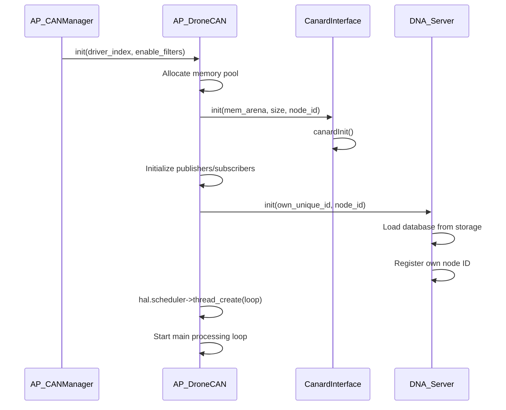
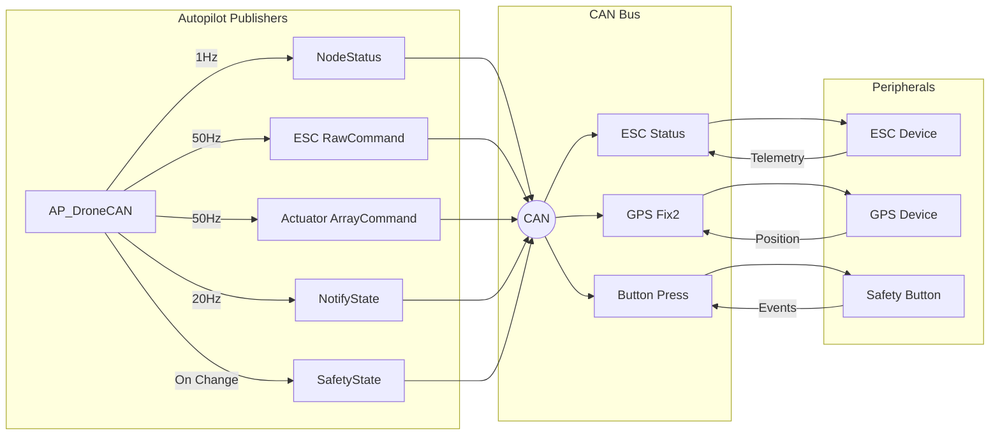
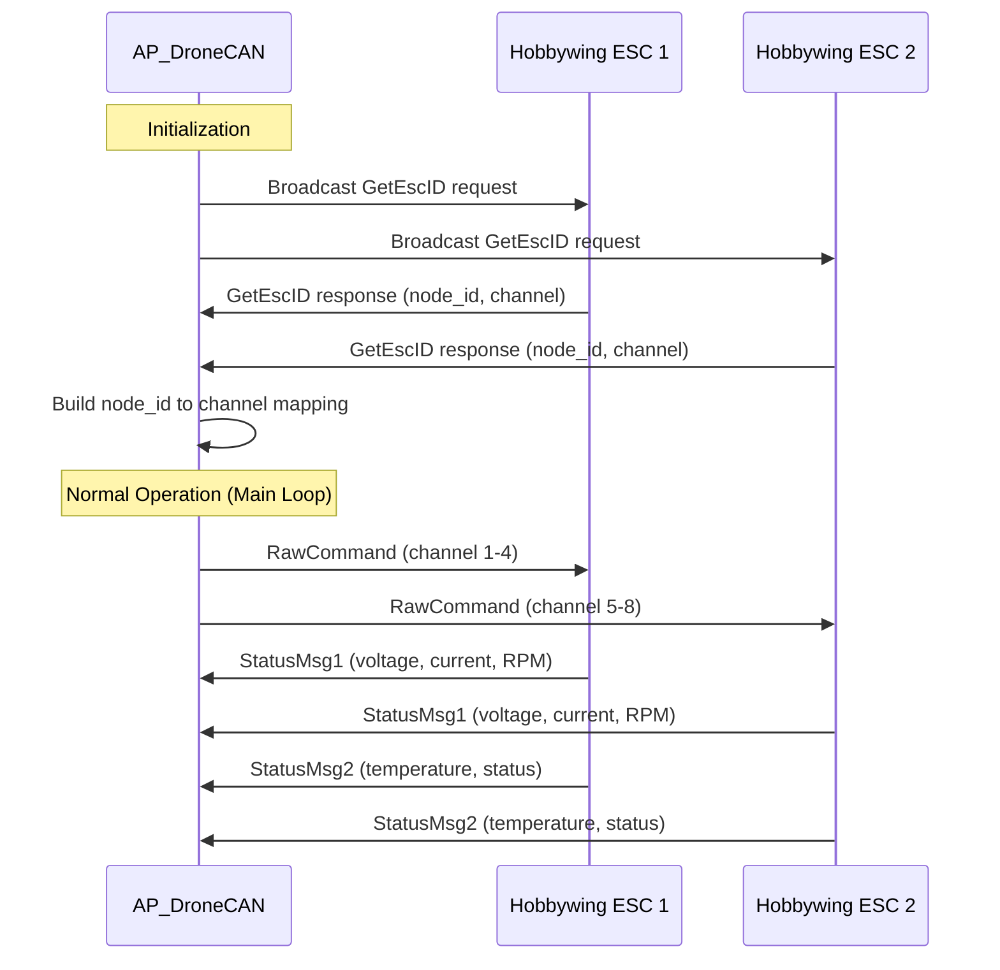
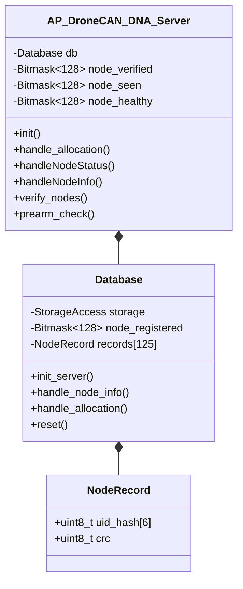
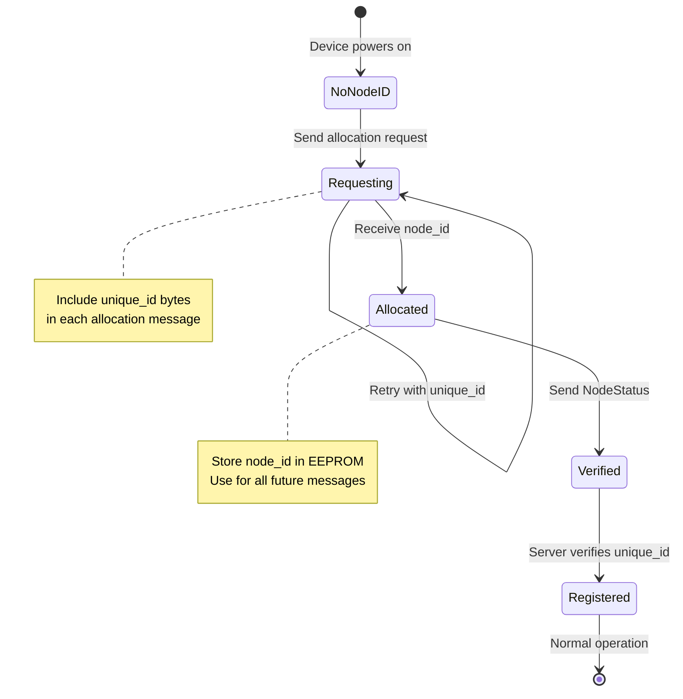
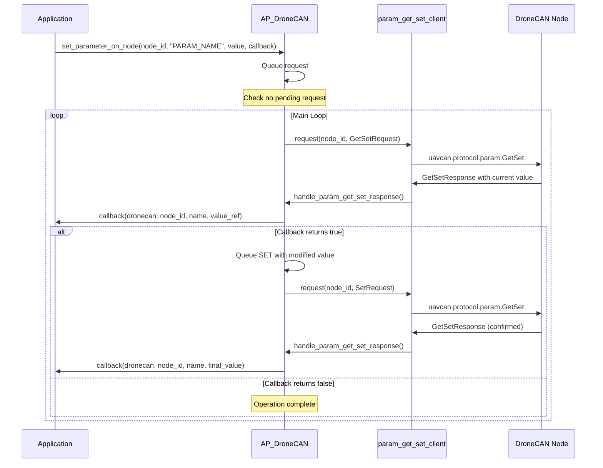
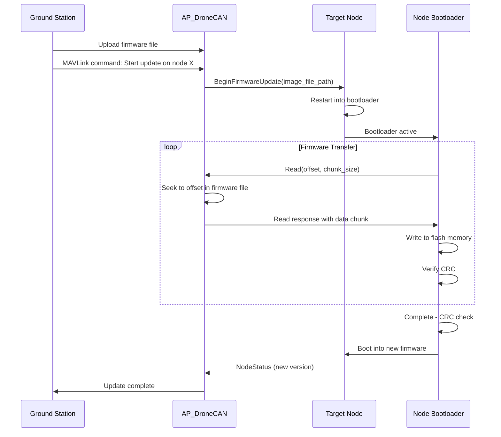

# AP_DroneCAN Library


## Table of Contents
- [Overview](#overview)
- [Node Architecture](#node-architecture)
- [Message Types](#message-types)
- [ESC Integration](#esc-integration)
- [GPS Integration and Dynamic Node Allocation](#gps-integration-and-dynamic-node-allocation)
- [Parameter Synchronization](#parameter-synchronization)
- [Firmware Update Protocol](#firmware-update-protocol)
- [Serial-over-CAN Tunneling](#serial-over-can-tunneling)
- [Configuration](#configuration)
- [Integration Examples](#integration-examples)
- [Troubleshooting](#troubleshooting)
- [API Reference](#api-reference)

## Overview

The AP_DroneCAN library provides ArduPilot's implementation of the DroneCAN (formerly UAVCAN v0) protocol, enabling reliable communication between the autopilot and CAN bus peripherals. This library implements a complete DroneCAN node that can act as both a bus master and peripheral device, supporting sensor input, actuator control, and advanced features like dynamic node allocation and firmware updates.

**Source Files**: `libraries/AP_DroneCAN/`

### Key Features

- **Multi-Interface Support**: Manages multiple CAN interfaces with configurable drivers
- **Dynamic Node Allocation (DNA)**: Automatic node ID assignment with persistent database
- **Comprehensive Actuator Control**: ESC commands, servo outputs, and vendor-specific protocols
- **Sensor Integration**: GPS, compass, barometer, airspeed, rangefinder, and more
- **Parameter Management**: Remote parameter get/set/save with callback support
- **Serial Tunneling**: UART-over-CAN for peripheral communication
- **Telemetry Collection**: ESC and servo telemetry aggregation
- **Safety Features**: Arming status broadcast, safety state management
- **Vendor Extensions**: Hobbywing ESC, Himark servo, Volz actuator support

### Supported Hardware

- **Autopilot Boards**: Any board with CAN peripheral support (see `AP_HAL_ChibiOS/hwdef/`)
- **ESCs**: Standard DroneCAN ESCs, Hobbywing DroneCAN ESCs
- **Servos**: DroneCAN actuators, Himark smart servos, Volz servos
- **Sensors**: DroneCAN GPS, compass, barometer, airspeed, rangefinder, optical flow
- **Peripherals**: LED controllers, buzzers, ADSB transceivers, power modules

## Node Architecture

### Class Hierarchy

The AP_DroneCAN library is built on a layered architecture integrating with ArduPilot's CAN manager and hardware abstraction layer.

```mermaid
classDiagram
    class AP_CANDriver {
        <<abstract>>
        +init()
        +add_interface()
        +prearm_check()
    }
    
    class AP_ESC_Telem_Backend {
        <<abstract>>
        +update_telem_data()
        +update_rpm()
    }
    
    class AP_DroneCAN {
        -CanardInterface canard_iface
        -AP_DroneCAN_DNA_Server _dna_server
        -AP_DroneCAN_Serial serial
        +init()
        +loop()
        +SRV_push_servos()
        +set_parameter_on_node()
        +send_reboot_request()
    }
    
    class CanardInterface {
        -CanardInstance canard
        -AP_HAL::CANIface* ifaces[]
        +broadcast()
        +request()
        +respond()
        +processTx()
        +processRx()
    }
    
    class AP_DroneCAN_DNA_Server {
        -Database db
        +handle_allocation()
        +handleNodeStatus()
        +verify_nodes()
    }
    
    class AP_DroneCAN_Serial {
        -Port ports[]
        +init()
        +update()
    }
    
    AP_CANDriver <|-- AP_DroneCAN
    AP_ESC_Telem_Backend <|-- AP_DroneCAN
    AP_DroneCAN *-- CanardInterface
    AP_DroneCAN *-- AP_DroneCAN_DNA_Server
    AP_DroneCAN *-- AP_DroneCAN_Serial
    CanardInterface *-- "Canard::Interface"
```

**Source**: `AP_DroneCAN.h:81-446`, `AP_Canard_iface.h:10-88`, `AP_DroneCAN_DNA_Server.h:17-163`

### Thread Model

AP_DroneCAN runs in its own dedicated thread with configurable stack size:

- **Main Thread**: `AP_DroneCAN::loop()` - Runs continuously at high priority
- **Stack Size**: 4096 bytes (8192 with CAN-FD support)
- **Synchronization**: Uses HAL_Semaphore for thread-safe access to shared resources
  - `SRV_sem`: Protects servo/ESC output configuration
  - `_param_sem`: Protects parameter request state
  - `_param_save_sem`: Protects parameter save state
  - Canard interface semaphores: `_sem_tx`, `_sem_rx`

**Source**: `AP_DroneCAN.cpp:79-82`

### CanardInterface Integration

The `CanardInterface` class wraps the libcanard library and provides ArduPilot-specific extensions:

1. **Memory Management**: Uses pre-allocated memory pool (default 8192 bytes, 16384 for CAN-FD)
2. **Multi-Interface**: Supports up to `HAL_NUM_CAN_IFACES` physical CAN interfaces
3. **Publisher/Subscriber Pattern**: Type-safe message handling via Canard::Publisher and Canard::Subscriber
4. **Service Client/Server**: Request/response pattern for RPC-style operations
5. **11-bit Auxiliary Drivers**: Support for non-DroneCAN CAN sensors on same bus

**Source**: `AP_Canard_iface.h:10-88`, `AP_DroneCAN.cpp:70-76`, `AP_DroneCAN.h:249`

### Initialization Sequence



**Source**: `AP_DroneCAN.cpp:276-345`

## Message Types

AP_DroneCAN implements a comprehensive set of DroneCAN message types for both receiving data from peripherals and broadcasting autopilot state.

### Publishers (Outgoing Messages)

The following messages are broadcast from the autopilot to the CAN bus:

#### Node Management
```cpp
// Source: AP_DroneCAN.h:310-312
Canard::Publisher<uavcan_protocol_NodeStatus> node_status;
Canard::Publisher<dronecan_protocol_CanStats> can_stats;
Canard::Publisher<dronecan_protocol_Stats> protocol_stats;
```

- **uavcan_protocol_NodeStatus**: Broadcast at 1 Hz, reports health, mode, uptime
- **dronecan_protocol_CanStats**: CAN bus statistics (optional, via OPTION bitmask)
- **dronecan_protocol_Stats**: Protocol statistics (optional, via OPTION bitmask)

#### Actuator Commands
```cpp
// Source: AP_DroneCAN.h:313-314, 320
Canard::Publisher<uavcan_equipment_actuator_ArrayCommand> act_out_array;
Canard::Publisher<uavcan_equipment_esc_RawCommand> esc_raw;
Canard::Publisher<com_himark_servo_ServoCmd> himark_out;
```

- **ArrayCommand**: Standard servo commands (PWM or actuator units)
- **RawCommand**: ESC throttle commands (0-8191 scale)
- **ServoCmd**: Himark vendor-specific servo protocol

#### Safety and Status
```cpp
// Source: AP_DroneCAN.h:315-317
Canard::Publisher<ardupilot_indication_SafetyState> safety_state;
Canard::Publisher<uavcan_equipment_safety_ArmingStatus> arming_status;
Canard::Publisher<ardupilot_indication_NotifyState> notify_state;
```

- **SafetyState**: Safety switch state (Armed/Disarmed)
- **ArmingStatus**: Vehicle arming status
- **NotifyState**: Vehicle state flags (initializing, armed, flying, etc.)

#### Indicators
```cpp
// Source: AP_DroneCAN.h:167-169
Canard::Publisher<uavcan_equipment_indication_LightsCommand> rgb_led;
Canard::Publisher<uavcan_equipment_indication_BeepCommand> buzzer;
Canard::Publisher<uavcan_equipment_gnss_RTCMStream> rtcm_stream;
```

#### GNSS (Optional - enabled via OPTION:5)
```cpp
// Source: AP_DroneCAN.h:324-327
Canard::Publisher<uavcan_equipment_gnss_Fix2> gnss_fix2;
Canard::Publisher<uavcan_equipment_gnss_Auxiliary> gnss_auxiliary;
Canard::Publisher<ardupilot_gnss_Heading> gnss_heading;
Canard::Publisher<ardupilot_gnss_Status> gnss_status;
```

**Source**: `AP_DroneCAN.cpp:276-278` (GNSS send functions)

#### Vendor-Specific Publishers
```cpp
// Hobbywing ESC (Source: AP_DroneCAN.h:400-401)
Canard::Publisher<com_hobbywing_esc_RawCommand> esc_hobbywing_raw;
Canard::Publisher<com_hobbywing_esc_GetEscID> esc_hobbywing_GetEscID;

// Relay Hardpoint (Source: AP_DroneCAN.h:181)
Canard::Publisher<uavcan_equipment_hardpoint_Command> relay_hardpoint;

// Xacti Camera Mount (Source: AP_DroneCAN.h:172-175)
Canard::Publisher<com_xacti_CopterAttStatus> xacti_copter_att_status;
Canard::Publisher<com_xacti_GimbalControlData> xacti_gimbal_control_data;
Canard::Publisher<com_xacti_GnssStatus> xacti_gnss_status;
```

### Subscribers (Incoming Messages)

The following messages are received from DroneCAN peripherals:

#### Safety and Control
```cpp
// Source: AP_DroneCAN.h:330-334
Canard::Subscriber<ardupilot_indication_Button> safety_button_listener;
Canard::Subscriber<ardupilot_equipment_trafficmonitor_TrafficReport> traffic_report_listener;
```

Handlers:
- `handle_button()`: Processes safety button presses - Source: `AP_DroneCAN.cpp:1301-1317`
- `handle_traffic_report()`: ADSB vehicle reports - Source: `AP_DroneCAN.cpp:1322-1384`

#### Telemetry
```cpp
// Source: AP_DroneCAN.h:337-346
Canard::Subscriber<uavcan_equipment_actuator_Status> actuator_status_listener;
Canard::Subscriber<uavcan_equipment_esc_Status> esc_status_listener;
Canard::Subscriber<uavcan_equipment_esc_StatusExtended> esc_status_extended_listener;
```

Handlers:
- `handle_actuator_status()`: Servo position, force, speed - Source: `AP_DroneCAN.cpp:1390-1410`
- `handle_ESC_status()`: ESC RPM, temperature, voltage, current - Source: `AP_DroneCAN.cpp:1472-1500`
- `handle_esc_ext_status()`: Extended ESC telemetry - Source: `AP_DroneCAN.cpp` (referenced)

#### Debugging
```cpp
// Source: AP_DroneCAN.h:349-350, 382-383
Canard::Subscriber<uavcan_protocol_debug_LogMessage> debug_listener;
Canard::Subscriber<dronecan_protocol_FlexDebug> FlexDebug_listener;
```

#### Vendor-Specific Subscribers
```cpp
// Himark Servo (Source: AP_DroneCAN.h:353-354)
Canard::Subscriber<com_himark_servo_ServoInfo> himark_servo_ServoInfo_cb_listener;

// Volz Servo (Source: AP_DroneCAN.h:357-358)
Canard::Subscriber<com_volz_servo_ActuatorStatus> volz_servo_ActuatorStatus_listener;

// Hobbywing ESC (Source: AP_DroneCAN.h:402-407)
Canard::Subscriber<com_hobbywing_esc_GetEscID> esc_hobbywing_GetEscID_listener;
Canard::Subscriber<com_hobbywing_esc_StatusMsg1> esc_hobbywing_StatusMSG1_listener;
Canard::Subscriber<com_hobbywing_esc_StatusMsg2> esc_hobbywing_StatusMSG2_listener;
```

### Service Clients

```cpp
// Source: AP_DroneCAN.h:362-371
Canard::Client<uavcan_protocol_param_GetSetResponse> param_get_set_client;
Canard::Client<uavcan_protocol_param_ExecuteOpcodeResponse> param_save_client;
Canard::Client<uavcan_protocol_RestartNodeResponse> restart_node_client;
```

Used for:
- Parameter get/set operations (with 100ms timeout)
- Parameter persistence (save to EEPROM)
- Node reboot requests

**Source**: `AP_DroneCAN.cpp:88`, `AP_DroneCAN.cpp:1666-1850`

### Service Servers

```cpp
// Source: AP_DroneCAN.h:377-378
Canard::Server<uavcan_protocol_GetNodeInfoRequest> node_info_server;
```

Responds to node info requests with hardware/software version and unique ID.

**Source**: `AP_DroneCAN.cpp` (handle_node_info_request handler)

### Message Flow Diagram



## ESC Integration

AP_DroneCAN provides comprehensive ESC control with support for standard and vendor-specific protocols.

### Standard ESC Protocol

#### RawCommand Message

The primary ESC control uses `uavcan_equipment_esc_RawCommand`:

```cpp
// Source: AP_DroneCAN.cpp:830-877
void AP_DroneCAN::SRV_send_esc(void)
{
    uavcan_equipment_esc_RawCommand esc_msg;
    
    // ESC offset allows efficient packing
    const uint8_t esc_offset = constrain_int16(_esc_offset.get(), 0, DRONECAN_SRV_NUMBER);
    
    // Pack up to 20 ESC commands per message
    for (uint8_t i = esc_offset; i < max_esc_num && k < 20; i++) {
        if (armed && ((((uint32_t) 1U) << i) & _ESC_armed_mask)) {
            esc_msg.cmd.data[k] = scale_esc_output(i);
        } else {
            esc_msg.cmd.data[k] = static_cast<unsigned>(0);
        }
        k++;
    }
    esc_msg.cmd.len = k;
    
    esc_raw.broadcast(esc_msg);
    canard_iface.processTx(true);  // Immediate transmission
}
```

**Key Features**:
- Commands scaled to 0-8191 range (13-bit)
- Immediate CAN bus transmission for minimal latency
- Safety interlocking with arming state
- Configurable ESC offset for efficient message packing
- Support for up to 32 ESC channels

**Parameters**:
- `CAN_Dx_UC_ESC_BM`: Bitmask selecting which outputs are ESCs (default: 0)
- `CAN_Dx_UC_ESC_OF`: ESC offset for message packing (default: 0)
- `CAN_Dx_UC_ESC_RV`: Reversible ESC bitmask for bidirectional control

### ESC Scaling and Reversible Support

```cpp
// Source: AP_DroneCAN.cpp (scale_esc_output function)
int16_t AP_DroneCAN::scale_esc_output(uint8_t idx)
{
    // Check if this ESC is reversible
    const bool reversible = ((uint32_t(1U) << idx) & uint32_t(_esc_rv.get())) != 0;
    
    if (reversible) {
        // Bidirectional: -8191 to +8191
        return constrain_int16(_SRV_conf[idx].pulse - 1500, -8191, 8191);
    } else {
        // Unidirectional: 0 to 8191
        return constrain_int16(_SRV_conf[idx].pulse - 1000, 0, 8191);
    }
}
```

### Hobbywing ESC Support

#### Overview

Hobbywing DroneCAN ESCs use a vendor-specific protocol with unique node ID mapping.

**Source**: `AP_DroneCAN.h:386-412`, `AP_DroneCAN.cpp:879-927`

#### Hobbywing Message Flow



#### Hobbywing ID Discovery

```cpp
// Source: AP_DroneCAN.cpp (hobbywing_ESC_update function)
void AP_DroneCAN::hobbywing_ESC_update()
{
    const uint32_t now_ms = AP_HAL::millis();
    const uint32_t timeout_ms = 2000;
    
    // Periodically request ESC IDs
    if (now_ms - hobbywing.last_GetId_send_ms > timeout_ms) {
        com_hobbywing_esc_GetEscID req {};
        esc_hobbywing_GetEscID.broadcast(req);
        hobbywing.last_GetId_send_ms = now_ms;
    }
}

// Handler stores node_id to channel mapping
void AP_DroneCAN::handle_hobbywing_GetEscID(const CanardRxTransfer& transfer, 
                                             const com_hobbywing_esc_GetEscID& msg)
{
    // Map this node to its throttle channel
    const uint8_t channel = msg.channel;
    if (channel < HOBBYWING_MAX_ESC) {
        hobbywing.thr_chan[channel] = transfer.source_node_id;
    }
}
```

**Source**: `AP_DroneCAN.cpp:397-411` (handler declarations), `AP_DroneCAN.cpp:879-927` (implementation)

#### Hobbywing Telemetry Processing

```cpp
// Source: AP_DroneCAN.cpp (handle_hobbywing_StatusMsg1 and StatusMsg2)
void AP_DroneCAN::handle_hobbywing_StatusMsg1(const CanardRxTransfer& transfer, 
                                                const com_hobbywing_esc_StatusMsg1& msg)
{
    uint8_t esc_index;
    if (!hobbywing_find_esc_index(transfer.source_node_id, esc_index)) {
        return;  // Unknown node
    }
    
    // StatusMsg1 provides: RPM, voltage, current
    TelemetryData t {
        .voltage = msg.voltage * 0.01f,
        .current = msg.current * 0.01f,
    };
    update_telem_data(esc_index, t, 
                     AP_ESC_Telem_Backend::TelemetryType::VOLTAGE | 
                     AP_ESC_Telem_Backend::TelemetryType::CURRENT);
    update_rpm(esc_index, msg.rpm);
}

void AP_DroneCAN::handle_hobbywing_StatusMsg2(const CanardRxTransfer& transfer, 
                                                const com_hobbywing_esc_StatusMsg2& msg)
{
    // StatusMsg2 provides: temperature, error codes
    TelemetryData t {
        .temperature_cdeg = int16_t(msg.temperature * 100)
    };
    update_telem_data(esc_index, t, 
                     AP_ESC_Telem_Backend::TelemetryType::TEMPERATURE);
}
```

**Source**: `AP_DroneCAN.cpp:404-411` (handler declarations)

#### Enabling Hobbywing Support

Set option bit in CAN_Dx_UC_OPTION parameter:

```cpp
// Source: AP_DroneCAN.h:143-154 (Options enum)
enum class Options : uint16_t {
    USE_HOBBYWING_ESC = (1U<<7),  // Enable Hobbywing protocol
    // ...
};
```

**Parameter**: `CAN_Dx_UC_OPTION` bit 7 = 1 (value 128)

### Himark Servo Support

Himark smart servos use vendor-specific commands and provide detailed telemetry.

**Source**: `AP_DroneCAN.h:194-196`, `AP_DroneCAN.cpp:800-828`

#### Himark Command Format

```cpp
// Source: AP_DroneCAN.cpp:800-828
void AP_DroneCAN::SRV_send_himark(void)
{
    com_himark_servo_ServoCmd msg {};
    
    // ServoCmd supports up to 17 servos
    for (uint8_t i = 0; i <= highest_to_send; i++) {
        if ((1U<<i) & _SRV_armed_mask) {
            // Pulse width minus 1000, range 0-1000
            const uint16_t pulse = constrain_int16(_SRV_conf[i].pulse - 1000, 0, 1000);
            msg.cmd.data[i] = pulse;
        }
    }
    msg.cmd.len = highest_to_send + 1;
    
    himark_out.broadcast(msg);
}
```

#### Himark Telemetry

```cpp
// Source: AP_DroneCAN.cpp:1412-1442
void AP_DroneCAN::handle_himark_servoinfo(const CanardRxTransfer& transfer, 
                                           const com_himark_servo_ServoInfo &msg)
{
    const AP_Servo_Telem::TelemetryData telem_data {
        .command_position = msg.pos_cmd * 0.01,      // Commanded position (degrees)
        .measured_position = msg.pos_sensor * 0.01,  // Actual position (degrees)
        .voltage = msg.voltage * 0.01,               // Supply voltage (V)
        .current = msg.current * 0.01,               // Current draw (A)
        .motor_temperature_cdeg = int16_t(((msg.motor_temp * 0.2) - 40) * 100),
        .pcb_temperature_cdeg = int16_t(((msg.pcb_temp * 0.2) - 40) * 100),
        .status_flags = msg.error_status,
        .present_types = /* All flags set */
    };
    
    servo_telem->update_telem_data(msg.servo_id, telem_data);
}
```

**Source**: `AP_DroneCAN.h:352-355`, `AP_DroneCAN.cpp:1412-1442`

### Standard ESC Telemetry

All standard DroneCAN ESCs provide status via `uavcan_equipment_esc_Status`:

```cpp
// Source: AP_DroneCAN.cpp:1472-1500
void AP_DroneCAN::handle_ESC_status(const CanardRxTransfer& transfer, 
                                     const uavcan_equipment_esc_Status& msg)
{
    const uint8_t esc_index = msg.esc_index + esc_offset;
    
    TelemetryData t {
        .temperature_cdeg = int16_t((KELVIN_TO_C(msg.temperature)) * 100),
        .voltage = msg.voltage,           // Volts
        .current = msg.current,           // Amps
        .power_percentage = msg.power_rating_pct,  // 0-100%
    };
    
    update_rpm(esc_index, msg.rpm, msg.error_count);
    update_telem_data(esc_index, t, telemetry_type_flags);
}
```

**Message Fields**:
- `esc_index`: ESC number (0-31)
- `rpm`: Motor RPM
- `voltage`: Input voltage (V)
- `current`: Current draw (A)
- `temperature`: Temperature (Kelvin)
- `power_rating_pct`: Power percentage (0-100)
- `error_count`: Cumulative error counter

### ESC Configuration Summary

| Feature | Parameter | Description |
|---------|-----------|-------------|
| ESC Selection | CAN_Dx_UC_ESC_BM | Bitmask of outputs to control as ESCs |
| Update Rate | Continuous | Commands sent whenever servos update |
| ESC Offset | CAN_Dx_UC_ESC_OF | Offset for message packing (0-18) |
| Reversible | CAN_Dx_UC_ESC_RV | Bitmask for bidirectional ESCs |
| Hobbywing | CAN_Dx_UC_OPTION bit 7 | Enable Hobbywing protocol |

**Source**: `AP_DroneCAN.cpp:98-163` (parameter definitions)

## GPS Integration and Dynamic Node Allocation

### DNA Server Overview

The Dynamic Node Allocation (DNA) Server enables plug-and-play operation by automatically assigning node IDs to new devices based on their unique hardware IDs.

**Source**: `AP_DroneCAN_DNA_Server.h:17-163`, `AP_DroneCAN_DNA_Server.cpp:1-200`

### DNA Server Architecture



### Node Allocation Protocol

#### Allocation State Machine



#### Allocation Request Handling

```cpp
// Source: AP_DroneCAN_DNA_Server.cpp:120-141
uint8_t AP_DroneCAN_DNA_Server::Database::handle_allocation(const uint8_t unique_id[])
{
    WITH_SEMAPHORE(sem);
    
    // Check if we've seen this unique_id before
    uint8_t resp_node_id = find_node_id(unique_id, 16);
    
    if (resp_node_id == 0) {
        // New device - find free node ID starting from MAX_NODE_ID
        resp_node_id = MAX_NODE_ID;  // 125
        while (resp_node_id > 0) {
            if (!node_registered.get(resp_node_id)) {
                break;  // Found free ID
            }
            resp_node_id--;
        }
        
        if (resp_node_id != 0) {
            create_registration(resp_node_id, unique_id, 16);
        }
    }
    
    return resp_node_id;  // 0 if allocation failed
}
```

**Algorithm**:
1. Check database for existing registration matching unique_id hash
2. If found, return previously assigned node_id
3. If new, search from node_id 125 down to 1 for free slot
4. Create registration mapping unique_id hash to node_id
5. Persist to storage with CRC protection

**Source**: `AP_DroneCAN_DNA_Server.cpp:120-141`

### Database Persistence

#### Storage Layout

```
Offset 0: Magic number (0xAC01) - 2 bytes
Offset 2: NodeRecord[1] - 7 bytes (6 byte hash + 1 byte CRC)
Offset 9: NodeRecord[2] - 7 bytes
...
Offset 877: NodeRecord[125] - 7 bytes
Total: 879 bytes
```

**Source**: `AP_DroneCAN_DNA_Server.cpp:37-40`

#### Unique ID Hashing

```cpp
// Source: AP_DroneCAN_DNA_Server.cpp:160-173
void AP_DroneCAN_DNA_Server::Database::compute_uid_hash(NodeRecord &record, 
                                                         const uint8_t unique_id[], 
                                                         uint8_t size) const
{
    // Use FNV-1a hash algorithm
    uint64_t hash = FNV_1_OFFSET_BASIS_64;
    hash_fnv_1a(size, unique_id, &hash);
    
    // XOR-folding to 56 bits (6 bytes + 1 byte)
    hash = (hash>>56) ^ (hash&(((uint64_t)1<<56)-1));
    
    // Store in record
    for (uint8_t i=0; i<6; i++) {
        record.uid_hash[i] = (hash >> (8*i)) & 0xff;
    }
}
```

**Note**: The 16-byte unique ID from devices is hashed to 6 bytes for storage efficiency.

**Source**: `AP_DroneCAN_DNA_Server.cpp:160-173`

### Node Verification

After allocation, the DNA server continuously monitors nodes to detect conflicts:

```cpp
// Source: AP_DroneCAN_DNA_Server.cpp (verify_nodes function)
void AP_DroneCAN_DNA_Server::verify_nodes()
{
    // Periodically request NodeInfo from each seen node
    for (uint8_t node_id = 1; node_id <= MAX_NODE_ID; node_id++) {
        if (node_seen.get(node_id) && !node_verified.get(node_id)) {
            // Request full node info including unique_id
            uavcan_protocol_GetNodeInfoRequest req {};
            node_info_client.request(node_id, req);
            break;  // One at a time
        }
    }
}

// Handler checks unique_id against database
void AP_DroneCAN_DNA_Server::handleNodeInfo(const CanardRxTransfer& transfer, 
                                             const uavcan_protocol_GetNodeInfoResponse& rsp)
{
    const bool is_duplicate = db.handle_node_info(transfer.source_node_id, 
                                                   rsp.hardware_version.unique_id);
    if (is_duplicate) {
        server_state = DUPLICATE_NODES;
        fault_node_id = transfer.source_node_id;
        // Fail pre-arm check
    } else {
        node_verified.set(transfer.source_node_id);
    }
}
```

**Source**: `AP_DroneCAN_DNA_Server.h:161-162` (function declarations), `AP_DroneCAN_DNA_Server.cpp:104-118` (handle_node_info)

### Pre-Arm Checks

```cpp
// Source: AP_DroneCAN_DNA_Server.cpp (prearm_check function)
bool AP_DroneCAN_DNA_Server::prearm_check(char* fail_msg, uint8_t fail_msg_len) const
{
    switch (server_state) {
    case DUPLICATE_NODES:
        snprintf(fail_msg, fail_msg_len, "Duplicate node ID %d", fault_node_id);
        return false;
        
    case NODE_STATUS_UNHEALTHY:
        snprintf(fail_msg, fail_msg_len, "Node %d unhealthy: %s", 
                 fault_node_id, fault_node_name);
        return false;
        
    case HEALTHY:
    default:
        return true;
    }
}
```

**Failure Modes**:
- Duplicate node IDs detected (same node_id, different unique_id)
- Node reporting unhealthy status
- DNA database option conflicts (via CAN_Dx_UC_OPTION bits 1 and 3)

**Source**: `AP_DroneCAN_DNA_Server.h:99-103` (ServerState enum), prearm_check function

### DNA Configuration Options

```cpp
// Source: AP_DroneCAN.h:143-154
enum class Options : uint16_t {
    DNA_CLEAR_DATABASE        = (1U<<0),  // Clear database on boot
    DNA_IGNORE_DUPLICATE_NODE = (1U<<1),  // Don't fail pre-arm on duplicates
    DNA_IGNORE_UNHEALTHY_NODE = (1U<<3),  // Don't fail pre-arm on unhealthy
    // ...
};
```

| Option | Bit | Purpose |
|--------|-----|---------|
| DNA_CLEAR_DATABASE | 0 | Reset allocation database on next boot |
| DNA_IGNORE_DUPLICATE_NODE | 1 | Allow duplicate node IDs (not recommended) |
| DNA_IGNORE_UNHEALTHY_NODE | 3 | Allow unhealthy nodes (for debugging) |

**Source**: `AP_DroneCAN.cpp:132-134` (OPTION parameter definition)

### GPS-Specific Integration

DroneCAN GPS devices are automatically detected and integrated:

```cpp
// GPS driver registration (in AP_GPS library)
// When GPS device sends Fix2 messages, AP_GPS_DroneCAN creates backend instance
// DNA server ensures GPS has stable node_id across reboots

// Optional: ArduPilot can also SEND GPS data to DroneCAN devices
// Enabled via CAN_Dx_UC_OPTION bit 5 (SEND_GNSS)
#if AP_DRONECAN_SEND_GPS
void AP_DroneCAN::gnss_send_fix()
{
    uavcan_equipment_gnss_Fix2 msg {};
    
    // Populate from AP_GPS library data
    const Location &loc = AP::gps().location();
    msg.latitude_deg_1e8 = loc.lat;
    msg.longitude_deg_1e8 = loc.lng;
    msg.height_msl_mm = loc.alt * 10;  // cm to mm
    // ... additional fields ...
    
    gnss_fix2.broadcast(msg);
}
#endif
```

**Source**: `AP_DroneCAN.h:274-285` (GNSS structures), `AP_DroneCAN.cpp:276-278` (GNSS functions)

## Parameter Synchronization

AP_DroneCAN provides a complete parameter management system for remote configuration of DroneCAN nodes.

### Parameter API Overview

The parameter API supports three data types:
- **Integer parameters**: int32_t (-2147483648 to 2147483647)
- **Float parameters**: IEEE 754 single precision
- **String parameters**: Up to 128 characters

**Source**: `AP_DroneCAN.h:107-140`

### Parameter Get/Set Operations

#### API Functions

```cpp
// Set parameter value on remote node
// Source: AP_DroneCAN.h:132-137
bool set_parameter_on_node(uint8_t node_id, const char *name, float value, ParamGetSetFloatCb *cb);
bool set_parameter_on_node(uint8_t node_id, const char *name, int32_t value, ParamGetSetIntCb *cb);
bool set_parameter_on_node(uint8_t node_id, const char *name, const string &value, ParamGetSetStringCb *cb);

// Get parameter value from remote node
bool get_parameter_on_node(uint8_t node_id, const char *name, ParamGetSetFloatCb *cb);
bool get_parameter_on_node(uint8_t node_id, const char *name, ParamGetSetIntCb *cb);
bool get_parameter_on_node(uint8_t node_id, const char *name, ParamGetSetStringCb *cb);
```

#### Callback Function Types

```cpp
// Source: AP_DroneCAN.h:107-110
FUNCTOR_TYPEDEF(ParamGetSetIntCb, bool, AP_DroneCAN*, const uint8_t, const char*, int32_t &);
FUNCTOR_TYPEDEF(ParamGetSetFloatCb, bool, AP_DroneCAN*, const uint8_t, const char*, float &);
FUNCTOR_TYPEDEF(ParamGetSetStringCb, bool, AP_DroneCAN*, const uint8_t, const char*, string &);
```

**Callback Return Value**:
- `true`: Modify the value reference and send SET request
- `false`: Operation complete, no further action

### Parameter Request Flow



**Source**: `AP_DroneCAN.cpp:1666-1850`

### Implementation Example

```cpp
// Source: AP_DroneCAN.cpp:1679-1698 (set float example)
bool AP_DroneCAN::set_parameter_on_node(uint8_t node_id, const char *name, 
                                         float value, ParamGetSetFloatCb *cb)
{
    WITH_SEMAPHORE(_param_sem);
    
    // Reject if previous operation still pending
    if (param_int_cb != nullptr ||
        param_float_cb != nullptr ||
        param_string_cb != nullptr) {
        return false;
    }
    
    // Prepare GetSet request
    param_getset_req.index = 0;  // 0 = lookup by name
    param_getset_req.name.len = strncpy_noterm(
        (char*)param_getset_req.name.data, name, 
        sizeof(param_getset_req.name.data)-1);
    param_getset_req.value.real_value = value;
    param_getset_req.value.union_tag = UAVCAN_PROTOCOL_PARAM_VALUE_REAL_VALUE;
    
    // Store callback and mark pending
    param_float_cb = cb;
    param_request_sent = false;
    param_request_sent_ms = AP_HAL::millis();
    param_request_node_id = node_id;
    
    return true;
}
```

### Response Handling

```cpp
// Source: AP_DroneCAN.cpp:1817-1850
void AP_DroneCAN::handle_param_get_set_response(const CanardRxTransfer& transfer, 
                                                 const uavcan_protocol_param_GetSetResponse& rsp)
{
    WITH_SEMAPHORE(_param_sem);
    
    if ((rsp.value.union_tag == UAVCAN_PROTOCOL_PARAM_VALUE_REAL_VALUE) && param_float_cb) {
        float val = rsp.value.real_value;
        
        // Invoke callback - returns true if value should be set
        if ((*param_float_cb)(this, transfer.source_node_id, (const char*)rsp.name.data, val)) {
            // Callback modified val - send SET request
            param_getset_req.index = 0;
            memcpy(param_getset_req.name.data, rsp.name.data, rsp.name.len);
            param_getset_req.value.real_value = val;
            param_getset_req.value.union_tag = UAVCAN_PROTOCOL_PARAM_VALUE_REAL_VALUE;
            param_request_sent = false;
            param_request_sent_ms = AP_HAL::millis();
            param_request_node_id = transfer.source_node_id;
            return;  // Will send SET on next loop
        }
    }
    
    // ... similar for integer and string types ...
    
    // Clear callback - operation complete
    param_int_cb = nullptr;
    param_float_cb = nullptr;
    param_string_cb = nullptr;
}
```

### Timeout Handling

```cpp
// Source: AP_DroneCAN.cpp:1642-1660
void AP_DroneCAN::check_parameter_callback_timeout()
{
    WITH_SEMAPHORE(_param_sem);
    
    if (!param_request_sent) {
        return;  // No active request
    }
    
    const uint32_t now_ms = AP_HAL::millis();
    if (now_ms - param_request_sent_ms > AP_DRONECAN_GETSET_TIMEOUT_MS) {
        // Timeout - clear callbacks
        param_request_sent_ms = 0;
        param_int_cb = nullptr;
        param_float_cb = nullptr;
        param_string_cb = nullptr;
    }
}
```

**Timeout Value**: 100ms (defined in `AP_DroneCAN.cpp:88`)

### Parameter Save Operation

```cpp
// Source: AP_DroneCAN.h:140
bool save_parameters_on_node(uint8_t node_id, ParamSaveCb *cb);

// Callback type
// Source: AP_DroneCAN.h:110
FUNCTOR_TYPEDEF(ParamSaveCb, void, AP_DroneCAN*, const uint8_t, bool);
```

The save operation instructs the remote node to persist parameters to EEPROM:

```cpp
// Save request uses ExecuteOpcode service
// Source: AP_DroneCAN.cpp (send_parameter_save_request)
void AP_DroneCAN::send_parameter_save_request()
{
    WITH_SEMAPHORE(_param_save_sem);
    
    if (param_save_request_sent) {
        return;
    }
    
    param_save_req.opcode = UAVCAN_PROTOCOL_PARAM_EXECUTEOPCODE_REQUEST_OPCODE_SAVE;
    param_save_client.request(param_save_request_node_id, param_save_req);
    param_save_request_sent = true;
}
```

**Source**: `AP_DroneCAN.h:229-232` (save state variables), `AP_DroneCAN.cpp:213-214` (save functions)

### Thread Safety

All parameter operations are protected by semaphores:

```cpp
// Source: AP_DroneCAN.h:225, 231
HAL_Semaphore _param_sem;        // Protects get/set operations
HAL_Semaphore _param_save_sem;   // Protects save operations
```

This ensures thread-safe access from:
- AP_DroneCAN main loop thread
- GCS command handlers
- Scripting API calls
- Other autopilot subsystems

## Firmware Update Protocol

AP_DroneCAN supports the standard DroneCAN firmware update protocol, enabling over-the-air updates of peripheral device firmware.

### Protocol Overview

The firmware update uses the `uavcan.protocol.file.*` services:
- **BeginFirmwareUpdate**: Initiate update process on target node
- **Read**: Serve firmware file chunks to updating node
- **GetInfo**: Provide firmware file metadata

### Update Flow



### Firmware File Service

While the AP_DroneCAN library contains the client infrastructure, the actual file serving is typically handled by the companion computer or GCS:

1. **File Storage**: Firmware images stored on SD card or companion computer
2. **File Server**: Responds to `uavcan.protocol.file.Read` requests
3. **Path Convention**: Firmware files follow naming convention `com.vendor.product_v1.0.bin`

**Note**: Direct firmware update initiation from ArduPilot is not implemented in the current codebase. Updates are typically initiated via MAVLink commands from ground control software.

**Source**: Standard DroneCAN specification (file services not implemented in viewed source files)

## Serial-over-CAN Tunneling

The AP_DroneCAN_Serial subsystem provides UART tunneling over the CAN bus, enabling transparent serial communication with remote devices.

**Source**: `AP_DroneCAN_serial.h`, `AP_DroneCAN_serial.cpp`

### Architecture

```mermaid
classDiagram
    class AP_DroneCAN_Serial {
        -Port ports[3]
        -Canard::Publisher~Targetted~ targetted
        +init(AP_DroneCAN*)
        +update()
    }
    
    class Port {
        <<RegisteredPort>>
        -ByteBuffer* readbuffer
        -ByteBuffer* writebuffer
        -uint8_t node
        -uint8_t idx
        +txspace()
        +_write()
        +_read()
        +_available()
    }
    
    AP_SerialManager ..> AP_DroneCAN_Serial : registers
    AP_DroneCAN_Serial *-- Port
    Port ..|> AP_SerialManager::RegisteredPort
```

**Source**: `AP_DroneCAN_serial.h:11-89`

### Port Configuration

Each serial port maps to a remote CAN node's UART:

```cpp
// Source: AP_DroneCAN_serial.h:30-31, AP_DroneCAN.cpp:188-217
AP_Int8 node;  // Remote CAN node ID (0-127)
AP_Int8 idx;   // Serial port index on remote node (0-100)
```

**Parameters**:
- `CAN_Dx_UC_SER_EN`: Enable serial-over-CAN (0=Disabled, 1=Enabled)
- `CAN_Dx_UC_S1_NOD`: Serial port 1 target node ID
- `CAN_Dx_UC_S1_IDX`: Serial port 1 index on remote node
- `CAN_Dx_UC_S2_NOD`: Serial port 2 target node ID
- `CAN_Dx_UC_S2_IDX`: Serial port 2 index on remote node
- `CAN_Dx_UC_S3_NOD`: Serial port 3 target node ID
- `CAN_Dx_UC_S3_IDX`: Serial port 3 index on remote node

**Source**: `AP_DroneCAN.cpp:180-217` (parameter definitions)

### Message Protocol

Serial data is encapsulated in `uavcan_tunnel_Targetted` messages:

```cpp
// Source: AP_DroneCAN_serial.h:83-86
static void handle_tunnel_targetted(AP_DroneCAN *dronecan,
                                     const CanardRxTransfer& transfer,
                                     const uavcan_tunnel_Targetted &msg);

Canard::Publisher<uavcan_tunnel_Targetted> *targetted;
```

**Message Structure**:
- `target_node`: Destination node ID
- `protocol.protocol`: Protocol type (serial = 0)
- `serial_id`: UART index on target node
- `baudrate`: Baud rate (optional, 0 = use default)
- `buffer`: Data payload (up to 120 bytes per message)

### Buffer Management

```cpp
// Source: AP_DroneCAN_serial.h:53-54
ByteBuffer *readbuffer;   // RX buffer (data from CAN)
ByteBuffer *writebuffer;  // TX buffer (data to CAN)
```

Buffer sizes configured via `_begin()` method when registering with serial manager.

### Usage Example

```cpp
// Application code
AP_HAL::UARTDriver *uart = hal.serial(SERIAL_CAN1);  // Get CAN serial port
if (uart) {
    uart->begin(57600);  // Configure baud rate
    uart->printf("Hello from CAN!\n");
    
    if (uart->available()) {
        char c = uart->read();
        // Process received character
    }
}
```

The serial port API is identical to standard UART, making it transparent to application code.

### Telemetry Statistics

```cpp
// Source: AP_DroneCAN_serial.h:62-64
uint32_t tx_stats_bytes;           // Total bytes transmitted
uint32_t rx_stats_bytes;           // Total bytes received
uint32_t rx_stats_dropped_bytes;   // Bytes dropped due to buffer full
```

Available via `hal.uart_stats` for monitoring link health.

**Source**: `AP_DroneCAN_serial.h:70-75` (stats getters)

### Flow Control

- **TX Rate Limiting**: Configurable via `last_send_ms` and message coalescing
- **RX Buffer Overflow**: Tracked in `rx_stats_dropped_bytes`
- **Latency**: `receive_time_constraint_us()` provides timing hints to applications

**Source**: `AP_DroneCAN_serial.h:45-51` (Port interface methods)

## Configuration

### CAN Manager Integration

AP_DroneCAN instances are created and managed by the AP_CANManager:

```cpp
// Parameters for first DroneCAN driver
CAN_D1_PROTOCOL = 1        // 1 = DroneCAN
CAN_D1_UC_NODE = 10        // This autopilot's node ID
CAN_D1_UC_ESC_BM = 15      // Control ESCs on outputs 1-4
CAN_D1_UC_SRV_BM = 240     // Control servos on outputs 5-8

// Parameters for second DroneCAN driver (optional)
CAN_D2_PROTOCOL = 1
CAN_D2_UC_NODE = 11
```

### Parameter Reference

#### Core Configuration

| Parameter | Type | Range | Default | Description |
|-----------|------|-------|---------|-------------|
| CAN_Dx_UC_NODE | INT8 | 1-125 | 10 | Node ID of this autopilot on DroneCAN network |
| CAN_Dx_UC_POOL | INT16 | 1024-16384 | 8192 | Memory pool size (bytes) for DroneCAN stack |
| CAN_Dx_UC_OPTION | BITMASK | 0-1023 | 0 | Option flags (see Options table below) |

**Source**: `AP_DroneCAN.cpp:99-156`

#### Actuator Configuration

| Parameter | Bitmask | Default | Description |
|-----------|---------|---------|-------------|
| CAN_Dx_UC_SRV_BM | 32-bit | 0 | Outputs to send as servo commands (bit 0 = output 1) |
| CAN_Dx_UC_ESC_BM | 32-bit | 0 | Outputs to send as ESC commands |
| CAN_Dx_UC_ESC_RV | 32-bit | 0 | Reversible ESC outputs (bidirectional control) |
| CAN_Dx_UC_SRV_RT | INT16 | 1-200 Hz | 50 | Servo command update rate |
| CAN_Dx_UC_ESC_OF | INT8 | 0-18 | 0 | ESC offset for message packing optimization |

**Source**: `AP_DroneCAN.cpp:106-163`

#### Status Broadcasting

| Parameter | Type | Range | Default | Description |
|-----------|------|-------|---------|-------------|
| CAN_Dx_UC_NTF_RT | INT16 | 1-200 Hz | 20 | NotifyState message broadcast rate |
| CAN_Dx_UC_RLY_RT | INT16 | 0-200 Hz | 0 | Relay/hardpoint command rate (0=disabled) |

**Source**: `AP_DroneCAN.cpp:136-172`

### Option Flags

| Bit | Name | Purpose |
|-----|------|---------|
| 0 | DNA_CLEAR_DATABASE | Clear dynamic allocation database on boot |
| 1 | DNA_IGNORE_DUPLICATE_NODE | Don't fail pre-arm on duplicate node IDs |
| 2 | CANFD_ENABLED | Enable CAN-FD support (requires compatible hardware) |
| 3 | DNA_IGNORE_UNHEALTHY_NODE | Don't fail pre-arm on unhealthy node status |
| 4 | USE_ACTUATOR_PWM | Send actuator commands as PWM instead of scaled units |
| 5 | SEND_GNSS | Broadcast GPS position to DroneCAN network |
| 6 | USE_HIMARK_SERVO | Use Himark vendor-specific servo protocol |
| 7 | USE_HOBBYWING_ESC | Use Hobbywing vendor-specific ESC protocol |
| 8 | ENABLE_STATS | Broadcast CAN statistics messages |
| 9 | ENABLE_FLEX_DEBUG | Enable FlexDebug message reception for scripting |

**Source**: `AP_DroneCAN.h:143-154`, `AP_DroneCAN.cpp:129-134`

### Typical Configurations

#### Quadcopter with DroneCAN ESCs

```
CAN_P1_DRIVER = 1           # First CAN driver
CAN_D1_PROTOCOL = 1         # DroneCAN protocol
CAN_D1_UC_NODE = 10         # Node ID
CAN_D1_UC_ESC_BM = 15       # ESCs on outputs 1-4
CAN_D1_UC_SRV_BM = 0        # No servos
CAN_D1_UC_OPTION = 0        # Standard options
```

#### Fixed-Wing with Servos and ESC

```
CAN_P1_DRIVER = 1
CAN_D1_PROTOCOL = 1
CAN_D1_UC_NODE = 10
CAN_D1_UC_ESC_BM = 1        # ESC on output 1
CAN_D1_UC_SRV_BM = 30       # Servos on outputs 2-5
CAN_D1_UC_SRV_RT = 50       # 50 Hz servo update
```

#### VTOL with Hobbywing ESCs

```
CAN_P1_DRIVER = 1
CAN_D1_PROTOCOL = 1
CAN_D1_UC_NODE = 10
CAN_D1_UC_ESC_BM = 255      # ESCs on outputs 1-8
CAN_D1_UC_OPTION = 128      # Bit 7 = Hobbywing protocol
```

#### Dual CAN Bus Configuration

```
# First bus - flight critical (ESCs, GPS)
CAN_P1_DRIVER = 1
CAN_D1_PROTOCOL = 1
CAN_D1_UC_NODE = 10
CAN_D1_UC_ESC_BM = 15

# Second bus - auxiliary (servos, peripherals)
CAN_P2_DRIVER = 2
CAN_D2_PROTOCOL = 1
CAN_D2_UC_NODE = 11
CAN_D2_UC_SRV_BM = 65280    # Servos on outputs 9-16
```

## Integration Examples

### Initializing DroneCAN from Vehicle Code

```cpp
// Source: AP_DroneCAN is initialized by AP_CANManager
// Vehicle code accesses via:

#include <AP_DroneCAN/AP_DroneCAN.h>

// Get DroneCAN instance (typically in vehicle setup)
AP_DroneCAN *dronecan = AP_DroneCAN::get_dronecan(0);  // Driver index 0
if (dronecan != nullptr) {
    // DroneCAN is available
}
```

### Sending Custom Messages

```cpp
// Create publisher in your class
class MyDriver {
    Canard::Publisher<my_custom_message> my_publisher;
    
public:
    MyDriver(CanardInterface &iface) : my_publisher(iface) {}
    
    void send_data() {
        my_custom_message msg {};
        msg.field1 = value1;
        msg.field2 = value2;
        
        my_publisher.broadcast(msg);
    }
};

// Instantiate in your driver
AP_DroneCAN *dronecan = AP_DroneCAN::get_dronecan(0);
MyDriver driver(dronecan->get_canard_iface());
```

**Source**: `AP_DroneCAN.h:165` (get_canard_iface method)

### Subscribing to Messages

```cpp
class MyDriver {
    // Callback function
    void handle_my_message(const CanardRxTransfer& transfer, const my_custom_message& msg) {
        // Process received message
        GCS_SEND_TEXT(MAV_SEVERITY_INFO, "Received from node %u", transfer.source_node_id);
    }
    
    // Callback wrapper
    Canard::ObjCallback<MyDriver, my_custom_message> my_cb{this, &MyDriver::handle_my_message};
    
    // Subscriber (driver_index specifies which CAN driver to use)
    Canard::Subscriber<my_custom_message> my_listener{my_cb, 0};
};
```

### Remote Parameter Configuration

```cpp
// Example: Configure ESC parameter on node 42

// Callback to handle response
bool esc_param_callback(AP_DroneCAN* dronecan, uint8_t node_id, 
                        const char* name, float &value)
{
    GCS_SEND_TEXT(MAV_SEVERITY_INFO, "ESC param %s = %.2f", name, value);
    
    // Modify value if needed
    if (value < 0.5f) {
        value = 0.5f;
        return true;  // Send SET request with new value
    }
    
    return false;  // Value OK, no change needed
}

// Initiate parameter get/set
AP_DroneCAN *dronecan = AP_DroneCAN::get_dronecan(0);
if (dronecan) {
    // Get current value
    dronecan->get_parameter_on_node(42, "esc_min_throttle", &esc_param_callback);
    
    // Or directly set value
    dronecan->set_parameter_on_node(42, "esc_min_throttle", 0.05f, &esc_param_callback);
}
```

**Source**: `AP_DroneCAN.h:132-140`, `AP_DroneCAN.cpp:1679-1850`

### LED Control

```cpp
// Source: AP_DroneCAN.h:118, AP_DroneCAN.cpp (led_write function)
AP_DroneCAN *dronecan = AP_DroneCAN::get_dronecan(0);
if (dronecan) {
    // Set LED at index 0 to red
    dronecan->led_write(0, 255, 0, 0);
    
    // Set LED at index 1 to green
    dronecan->led_write(1, 0, 255, 0);
    
    // Set LED at index 2 to blue
    dronecan->led_write(2, 0, 0, 255);
}
```

### Buzzer Control

```cpp
// Source: AP_DroneCAN.h:121, AP_DroneCAN.cpp (set_buzzer_tone function)
AP_DroneCAN *dronecan = AP_DroneCAN::get_dronecan(0);
if (dronecan) {
    // Play 1000 Hz tone for 0.5 seconds
    dronecan->set_buzzer_tone(1000.0f, 0.5f);
}
```

### Node Reboot

```cpp
// Source: AP_DroneCAN.h:127
// WARNING: This is NOT thread-safe - only call from DroneCAN thread context
AP_DroneCAN *dronecan = AP_DroneCAN::get_dronecan(0);
if (dronecan) {
    dronecan->send_reboot_request(42);  // Reboot node 42
}
```

### Accessing ESC Telemetry

```cpp
// AP_DroneCAN inherits from AP_ESC_Telem_Backend
// Telemetry is automatically populated and available via AP_ESC_Telem

#include <AP_ESC_Telem/AP_ESC_Telem.h>

AP_ESC_Telem &esc_telem = AP::esc_telem();
AP_ESC_Telem::TelemetryData telem;

if (esc_telem.get_telem_data(0, telem)) {
    // ESC 0 telemetry available
    float voltage = telem.voltage;
    float current = telem.current;
    float temperature = telem.temperature_cdeg / 100.0f;
    int32_t rpm = telem.rpm;
}
```

**Source**: `AP_DroneCAN.h:81` (inheritance from AP_ESC_Telem_Backend)

## Troubleshooting

### Common Issues

#### No CAN Devices Detected

**Symptoms**: No DroneCAN devices appear, CAN bus silent

**Checks**:
1. Verify CAN transceiver wiring (CANH, CANL, 120Ω termination resistors at both ends)
2. Check `CAN_P1_DRIVER` parameter is set to 1 or 2 (enabled)
3. Confirm `CAN_D1_PROTOCOL` is set to 1 (DroneCAN)
4. Verify `CAN_D1_UC_NODE` is valid (1-125) and unique on bus
5. Check power supply to CAN devices (typically 5V from autopilot)
6. Review boot messages for CAN initialization errors

**Diagnostic Commands**:
```
param show CAN*
can stats
```

#### Duplicate Node ID Error

**Symptoms**: Pre-arm check fails with "Duplicate node ID X"

**Cause**: Two devices claiming the same node ID with different unique IDs

**Solutions**:
1. Power cycle all CAN devices to trigger fresh node allocation
2. Check for devices with manually configured node IDs conflicting with DNA allocations
3. Set `CAN_Dx_UC_OPTION` bit 1 to ignore duplicates (temporary workaround only)
4. Clear DNA database: Set `CAN_Dx_UC_OPTION` bit 0, reboot, then clear bit 0

**Source**: `AP_DroneCAN_DNA_Server.cpp:104-118` (duplicate detection)

#### ESC Not Responding

**Symptoms**: Motor outputs not working via DroneCAN

**Checks**:
1. Verify `CAN_Dx_UC_ESC_BM` parameter includes desired output bits
2. Confirm ESC node is visible on CAN bus (check DNA database logs)
3. Check ESC node is receiving RawCommand messages (use SLCAN monitor)
4. Verify arming state - ESCs only respond when armed
5. Check safety switch state if configured
6. Confirm `SERVOx_FUNCTION` is set correctly for ESC outputs
7. Test with `CAN_Dx_UC_ESC_OF` = 0 (no offset)

**Parameter Verification**:
```
param show CAN_D1_UC_ESC_BM    # Should have bits set for your ESCs
param show SERVO1_FUNCTION     # Check servo function assignments
param show BRD_SAFETY_DEFLT    # Safety switch configuration
```

#### High CAN Bus Load

**Symptoms**: CAN errors, message drops, delayed responses

**Causes**:
- Too many devices on single bus
- Excessive update rates
- Statistics broadcasting enabled unnecessarily

**Solutions**:
1. Reduce servo update rate: `CAN_Dx_UC_SRV_RT` (default 50 Hz, try 20 Hz)
2. Disable statistics: Clear `CAN_Dx_UC_OPTION` bit 8
3. Disable GNSS broadcasting if not needed: Clear bit 5
4. Use dual CAN buses to split load
5. Disable FlexDebug: Clear bit 9

**Monitoring**:
```
can stats  # Shows tx/rx rates and errors
```

**Source**: `AP_DroneCAN.cpp:129-134` (OPTION parameter)

#### Hobbywing ESC Issues

**Symptoms**: Hobbywing ESCs not discovered or not responding

**Checks**:
1. Verify `CAN_Dx_UC_OPTION` bit 7 is set (value 128 or include 128 in bitmask)
2. Check GetEscID discovery messages are being sent (every 2 seconds)
3. Allow 5-10 seconds after power-on for ID discovery
4. Verify Hobbywing ESCs are running compatible firmware
5. Check that node IDs don't conflict with DNA allocated IDs

**Debug**:
- Enable CAN message logging to confirm GetEscID exchange
- Verify StatusMsg1 and StatusMsg2 are being received

**Source**: `AP_DroneCAN.h:386-412`, `AP_DroneCAN.cpp:879-927`

#### Serial-over-CAN Not Working

**Symptoms**: UART data not passing over CAN tunnel

**Checks**:
1. Verify `CAN_Dx_UC_SER_EN` = 1 (enabled)
2. Confirm `CAN_Dx_UC_S1_NOD` matches target node ID
3. Check `CAN_Dx_UC_S1_IDX` matches UART port on remote node
4. Verify remote node supports uavcan.tunnel.Targetted protocol
5. Check buffer sizes are adequate for data rate
6. Monitor `rx_stats_dropped_bytes` for buffer overruns

**Source**: `AP_DroneCAN_serial.h:19-89`, `AP_DroneCAN.cpp:180-217`

#### Parameter Set Fails

**Symptoms**: `set_parameter_on_node()` returns false

**Causes**:
- Previous parameter operation still pending
- Node not responding within 100ms timeout
- Parameter name doesn't exist on target node

**Solutions**:
1. Wait for previous operation to complete (check callback invoked)
2. Increase timeout if needed (modify `AP_DRONECAN_GETSET_TIMEOUT_MS`)
3. Verify parameter name spelling (case-sensitive)
4. Check target node is responding to GetNodeInfo
5. Ensure callback function doesn't block

**Source**: `AP_DroneCAN.cpp:88` (timeout), `AP_DroneCAN.cpp:1642-1850` (param operations)

### Debugging Tools

#### Enable CAN Logging

```cpp
// Add to vehicle startup or configure via parameters
// Enables verbose CAN protocol logging
#define DEBUG_DRONECAN 1
```

Produces logs like:
```
DroneCAN: Node 42 Status: health=OK mode=OPERATIONAL uptime=12345
DroneCAN: ESC 0 RPM=5432 V=14.8 I=12.3 T=45C
```

#### SLCAN Interface

Use SLCAN adapter to monitor raw CAN traffic:
1. Connect SLCAN adapter to CAN bus
2. Use candump or Busmaster to view messages
3. Decode with DroneCAN DSDL definitions

#### GCS MAVLink Commands

```
# View CAN statistics
can stats

# Show DNA database
can dna

# Test specific ESC
servo test <output_num> <pwm_value>
```

### Performance Monitoring

**Source**: `AP_DroneCAN.cpp:217` (logging function)

```cpp
// Logged data (check dataflash logs)
struct {
    uint32_t esc_send_count;    // ESC commands sent
    uint32_t srv_send_count;    // Servo commands sent
    uint32_t fail_send_count;   // Failed transmissions
} statistics;
```

**View in Logs**: Search for CAN-related log messages showing send counts and error rates.

## API Reference

### Main Class

```cpp
class AP_DroneCAN : public AP_CANDriver, public AP_ESC_Telem_Backend
```

**Source**: `AP_DroneCAN.h:81`

### Public Methods

#### Initialization

```cpp
void init(uint8_t driver_index, bool enable_filters) override;
bool add_interface(AP_HAL::CANIface* can_iface) override;
```

**Source**: `AP_DroneCAN.h:93-94`

#### Actuator Control

```cpp
void SRV_push_servos(void);
```
Updates all servo and ESC outputs. Called from vehicle code when servo positions change.

**Source**: `AP_DroneCAN.h:115`, `AP_DroneCAN.cpp:929-976`

#### Node Management

```cpp
static AP_DroneCAN* get_dronecan(uint8_t driver_index);
```
Retrieve DroneCAN instance by driver index (0-based). Returns nullptr if not initialized.

**Source**: `AP_DroneCAN.h:90`

```cpp
void send_node_status();
```
Manually trigger NodeStatus broadcast. Normally sent automatically at 1 Hz.

**Source**: `AP_DroneCAN.h:112`

#### Remote Parameter Access

```cpp
bool set_parameter_on_node(uint8_t node_id, const char *name, float value, ParamGetSetFloatCb *cb);
bool set_parameter_on_node(uint8_t node_id, const char *name, int32_t value, ParamGetSetIntCb *cb);
bool set_parameter_on_node(uint8_t node_id, const char *name, const string &value, ParamGetSetStringCb *cb);

bool get_parameter_on_node(uint8_t node_id, const char *name, ParamGetSetFloatCb *cb);
bool get_parameter_on_node(uint8_t node_id, const char *name, ParamGetSetIntCb *cb);
bool get_parameter_on_node(uint8_t node_id, const char *name, ParamGetSetStringCb *cb);

bool save_parameters_on_node(uint8_t node_id, ParamSaveCb *cb);
```

**Source**: `AP_DroneCAN.h:132-140`

#### Indicators

```cpp
bool led_write(uint8_t led_index, uint8_t red, uint8_t green, uint8_t blue);
void set_buzzer_tone(float frequency, float duration_s);
```

**Source**: `AP_DroneCAN.h:118, 121`

#### Node Control

```cpp
void send_reboot_request(uint8_t node_id);
```
⚠️ **Warning**: NOT thread-safe. Only call from DroneCAN thread context.

**Source**: `AP_DroneCAN.h:127`

#### Pre-Arm Checks

```cpp
bool prearm_check(char* fail_msg, uint8_t fail_msg_len) const;
```

**Source**: `AP_DroneCAN.h:91`

#### Interface Access

```cpp
CanardInterface& get_canard_iface();
uint8_t get_driver_index() const;
```

**Source**: `AP_DroneCAN.h:165, 102`

### DNA Server Methods

```cpp
class AP_DroneCAN_DNA_Server
{
public:
    bool init(uint8_t own_unique_id[], uint8_t own_unique_id_len, uint8_t node_id);
    bool prearm_check(char* fail_msg, uint8_t fail_msg_len) const;
    void verify_nodes();
};
```

**Source**: `AP_DroneCAN_DNA_Server.h:151-162`

### Serial Port Methods

```cpp
class AP_DroneCAN_Serial::Port : public AP_SerialManager::RegisteredPort
{
public:
    void init(void);
    uint32_t txspace() override;
    size_t _write(const uint8_t *buffer, size_t size) override;
    ssize_t _read(uint8_t *buffer, uint16_t count) override;
    uint32_t _available() override;
    bool _discard_input() override;
};
```

**Source**: `AP_DroneCAN_serial.h:25-66`

### Callback Types

```cpp
// Parameter callbacks
FUNCTOR_TYPEDEF(ParamGetSetIntCb, bool, AP_DroneCAN*, const uint8_t, const char*, int32_t &);
FUNCTOR_TYPEDEF(ParamGetSetFloatCb, bool, AP_DroneCAN*, const uint8_t, const char*, float &);
FUNCTOR_TYPEDEF(ParamGetSetStringCb, bool, AP_DroneCAN*, const uint8_t, const char*, string &);
FUNCTOR_TYPEDEF(ParamSaveCb, void, AP_DroneCAN*, const uint8_t, bool);
```

**Source**: `AP_DroneCAN.h:107-110`

### Configuration Options Enum

```cpp
enum class Options : uint16_t {
    DNA_CLEAR_DATABASE        = (1U<<0),
    DNA_IGNORE_DUPLICATE_NODE = (1U<<1),
    CANFD_ENABLED             = (1U<<2),
    DNA_IGNORE_UNHEALTHY_NODE = (1U<<3),
    USE_ACTUATOR_PWM          = (1U<<4),
    SEND_GNSS                 = (1U<<5),
    USE_HIMARK_SERVO          = (1U<<6),
    USE_HOBBYWING_ESC         = (1U<<7),
    ENABLE_STATS              = (1U<<8),
    ENABLE_FLEX_DEBUG         = (1U<<9),
};

bool option_is_set(Options option) const;
bool check_and_reset_option(Options option);
```

**Source**: `AP_DroneCAN.h:143-163`

---

## Additional Resources

- **DroneCAN Specification**: https://dronecan.github.io/
- **ArduPilot CAN Bus Documentation**: https://ardupilot.org/copter/docs/common-uavcan-setup-advanced.html
- **Hardware Compatibility**: https://ardupilot.org/copter/docs/common-uavcan-peripherals.html
- **libcanard Library**: https://github.com/dronecan/libcanard

## Contributing

When modifying AP_DroneCAN:
1. Maintain thread safety - use appropriate semaphores
2. Keep memory allocations within pool limits
3. Test with multiple CAN interface configurations
4. Verify DNA server behavior with device connect/disconnect scenarios
5. Check performance impact on main loop timing
6. Update documentation for any new message types or features

## License

This file is free software: you can redistribute it and/or modify it under the terms of the GNU General Public License as published by the Free Software Foundation, either version 3 of the License, or (at your option) any later version.

**Authors**: Eugene Shamaev, Siddharth Bharat Purohit

**Source**: `AP_DroneCAN.h:1-16`
