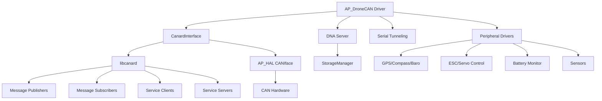

# AP_DroneCAN

## Overview

AP_DroneCAN is ArduPilot's implementation of the DroneCAN/UAVCAN v0 protocol for CAN bus communication with peripherals and sensors. It provides a robust, high-bandwidth communication layer enabling intelligent CAN devices (GPS modules, ESCs, servos, sensors, etc.) to communicate with the autopilot and with each other.

DroneCAN (formerly UAVCAN v0) is a lightweight protocol designed for reliable communication in aerospace and robotic applications. This implementation integrates the libcanard library with ArduPilot's Hardware Abstraction Layer (HAL) to support multiple CAN interfaces, dynamic node allocation, firmware updates over CAN, and comprehensive peripheral device support.

## Architecture

The AP_DroneCAN subsystem consists of several interconnected components:



**Component Relationships:**
- **AP_DroneCAN**: Main driver managing the protocol stack, thread execution, and message routing
- **CanardInterface**: Adapter layer between libcanard library and ArduPilot's AP_HAL CAN interface
- **DNA Server**: Dynamic Node Allocation server for automatic node ID assignment
- **Serial Tunneling**: UART-over-CAN protocol for serial communication with remote devices
- **Peripheral Drivers**: Device-specific handlers for sensors, actuators, and telemetry

## Key Components

### AP_DroneCAN Class

The main driver class that orchestrates all DroneCAN communication:

**Responsibilities:**
- Thread management: Runs a dedicated DroneCAN processing thread per CAN interface
- Message handling: Routes incoming and outgoing DroneCAN messages
- Peripheral integration: Interfaces with ArduPilot sensor and actuator subsystems
- Parameter management: Provides get/set/save parameter services for CAN devices
- ESC and servo control: Sends actuator commands and processes telemetry feedback
- Node status broadcasting: Publishes autopilot health and status information
- Safety state propagation: Distributes arming status and safety state to peripherals

**Thread Architecture:**
The AP_DroneCAN driver runs in its own thread (created per driver instance) to ensure real-time message processing without blocking the main vehicle control loop. Message transmission and reception are handled within this thread context, with semaphore protection for thread-safe access to shared data structures.

Source: `libraries/AP_DroneCAN/AP_DroneCAN.h`, `libraries/AP_DroneCAN/AP_DroneCAN.cpp`

### CanardInterface

Adapter layer that bridges libcanard (the core DroneCAN protocol implementation) with ArduPilot's HAL:

**Responsibilities:**
- Message queuing: Manages transmit and receive message queues
- Multi-interface support: Routes messages across multiple physical CAN interfaces (CAN1, CAN2)
- Frame-level I/O: Interfaces with AP_HAL::CANIface for hardware access
- Transfer management: Handles multi-frame transfer assembly and fragmentation
- Protocol statistics: Tracks message counts, errors, and bus utilization
- CANFD support: Optionally enables CAN Flexible Data rate when hardware supports it

**Key Methods:**
- `broadcast()`: Send broadcast messages to all nodes
- `request()`: Send service requests to specific nodes
- `respond()`: Reply to service requests
- `processTx()`: Transmit pending frames to hardware
- `processRx()`: Receive frames from hardware and assemble transfers

Source: `libraries/AP_DroneCAN/AP_Canard_iface.h`, `libraries/AP_DroneCAN/AP_Canard_iface.cpp`

### DNA Server & Database

The Dynamic Node Allocation (DNA) server automatically assigns node IDs to devices on the CAN bus:

**DNA Protocol Flow:**
1. New device boots without a node ID (anonymous mode)
2. Device broadcasts allocation request with its unique 128-bit hardware ID
3. DNA server receives request in multiple message fragments
4. Server checks database for existing registration matching the unique ID
5. If found, server re-assigns the same node ID; if new, allocates next available ID
6. Server broadcasts allocation response with assigned node ID
7. Device adopts the assigned node ID and begins normal operation
8. Server sends GetNodeInfo request to verify device identity
9. Registration is stored persistently in StorageManager for reboot survival

**Database Structure:**
- Persistent storage in EEPROM/Flash via StorageManager
- One NodeRecord per possible node ID (1-127)
- Each record contains: 6-byte hash of unique ID, CRC checksum
- Bitmask tracks which node IDs have valid registrations

**Duplicate Detection:**
The DNA server actively monitors for duplicate node IDs by:
- Tracking NodeStatus messages from all active nodes
- Periodically verifying unique IDs via GetNodeInfo service calls
- Detecting hash mismatches indicating duplicate IDs
- Triggering pre-arm check failures when duplicates are found
- Supporting database reset via CAN_Dx_UC_OPTION parameter

**Health Monitoring:**
- Monitors node health status from NodeStatus broadcasts
- Tracks verified vs. unverified nodes
- Optional pre-arm checks for unhealthy nodes (CAN_Dx_UC_OPTION:DNA_IGNORE_UNHEALTHY_NODE)

Source: `libraries/AP_DroneCAN/AP_DroneCAN_DNA_Server.h`, `libraries/AP_DroneCAN/AP_DroneCAN_DNA_Server.cpp`

### Serial Tunneling

AP_DroneCAN_Serial provides UART-over-CAN functionality, allowing serial devices to communicate through the CAN bus:

**Capabilities:**
- Up to 3 virtual serial ports per CAN interface
- Bidirectional data transfer using `uavcan_tunnel_Targetted` messages
- Per-port configuration: target node ID, protocol type, buffer sizes
- Statistics tracking: bytes transmitted, received, dropped
- Keepalive mechanism to detect connection loss
- Integration with ArduPilot's serial port registration system

**Use Cases:**
- Remote serial console access to CAN-connected devices
- GPS UART tunneling from remote nodes
- Telemetry radio connections through CAN
- Debug output capture from peripherals

**Configuration:**
- `CAN_Dx_SER_EN`: Enable serial tunneling (0=disabled, 1=enabled)
- `CAN_Dx_SER1_NOD`, `CAN_Dx_SER2_NOD`, `CAN_Dx_SER3_NOD`: Target node IDs
- `CAN_Dx_SER1_IDX`, `CAN_Dx_SER2_IDX`, `CAN_Dx_SER3_IDX`: Protocol index on remote node

Source: `libraries/AP_DroneCAN/AP_DroneCAN_serial.h`, `libraries/AP_DroneCAN/AP_DroneCAN_serial.cpp`

## DroneCAN Protocol Implementation

### Protocol Basics

DroneCAN (UAVCAN v0) defines three types of transfers:

1. **Message Broadcasts**: One-to-many data distribution (e.g., sensor readings, status updates)
   - No acknowledgment required
   - Priority-based transmission
   - Subscribed by interested nodes

2. **Service Requests**: One-to-one client-server communication with response
   - Request sent from client to specific server node
   - Server processes and sends response
   - Timeout mechanism for failed requests

3. **Service Responses**: Reply messages from service servers
   - Matched to requests via transfer ID
   - Include success/error status codes

### Transfer Priorities

DroneCAN supports 32 priority levels (0 = highest, 31 = lowest):

- **High Priority (0-7)**: Time-critical commands, emergency messages
- **Medium Priority (8-23)**: Normal sensor data, actuator commands
- **Low Priority (24-31)**: Diagnostic messages, parameter transfers, firmware updates

ArduPilot uses standard priority assignments:
- Actuator commands (ESC, servo): High priority
- Sensor data: Medium priority
- Parameter operations: Low priority

### Message Types Supported

**Standard UAVCAN Messages:**
- `uavcan.protocol.NodeStatus`: Node health and uptime
- `uavcan.protocol.GetNodeInfo`: Node identification and capabilities
- `uavcan.protocol.param.*`: Parameter get/set/save operations
- `uavcan.protocol.dynamic_node_id.Allocation`: DNA protocol
- `uavcan.protocol.RestartNode`: Remote reboot command
- `uavcan.equipment.actuator.*`: Servo/actuator commands and status
- `uavcan.equipment.esc.*`: ESC commands and telemetry
- `uavcan.equipment.gnss.*`: GPS/GNSS data
- `uavcan.equipment.indication.*`: Lights, buzzers, buttons

**ArduPilot-Specific Extensions:**
- `ardupilot.indication.Button`: Safety button press events
- `ardupilot.indication.SafetyState`: Autopilot arming/safety state
- `ardupilot.indication.NotifyState`: LED notification patterns
- `ardupilot.gnss.*`: Enhanced GPS data with yaw, status
- `ardupilot.equipment.trafficmonitor.TrafficReport`: ADSB traffic

**Vendor-Specific Messages:**
- `com.hobbywing.esc.*`: Hobbywing ESC protocol
- `com.himark.servo.*`: Himark servo protocol
- `com.volz.servo.*`: Volz servo protocol
- `com.xacti.*`: Xacti gimbal control

### CANFD Support

When enabled via `CAN_Dx_UC_OPTION` bit 2 (CANFD_ENABLED), the implementation supports:
- Extended payload sizes (up to 64 bytes per frame vs. 8 bytes in classic CAN)
- Higher bit rates for improved throughput
- Backward compatibility with classic CAN nodes on the same bus

## Node Implementation

### Node ID Configuration

ArduPilot acts as a DroneCAN node with configurable node ID:

- **Parameter**: `CAN_Dx_UC_NODE` (default: 10)
- **Valid Range**: 1-125 (0 = disabled, 126-127 reserved)
- **Recommendation**: Use different node IDs for multiple autopilots on same bus

### Node Initialization Sequence

1. Load parameters from storage
2. Initialize CanardInterface with memory pool
3. Set node ID from `CAN_Dx_UC_NODE` parameter
4. Initialize DNA server with own node ID and unique ID
5. Register message subscribers and publishers
6. Start DroneCAN processing thread
7. Begin periodic NodeStatus broadcasts

### NodeStatus Broadcasting

ArduPilot periodically broadcasts `uavcan.protocol.NodeStatus` at 1 Hz:

**Fields Populated:**
- `uptime_sec`: System uptime in seconds
- `health`: Node health status (OK, WARNING, ERROR, CRITICAL)
- `mode`: Operating mode (OPERATIONAL, INITIALIZATION, MAINTENANCE, etc.)
- `sub_mode`: Vehicle-specific sub-mode
- `vendor_specific_status_code`: ArduPilot-specific status

**Health Determination:**
- CRITICAL: Pre-arm check failures, sensor failures
- ERROR: GPS loss, EKF failure
- WARNING: Minor issues, degraded operation
- OK: Normal operation

### GetNodeInfo Service

ArduPilot responds to `uavcan.protocol.GetNodeInfo` requests with:

- **Software Version**: AP_DRONECAN_SW_VERS_MAJOR.MINOR (1.0)
- **Hardware Version**: AP_DRONECAN_HW_VERS_MAJOR.MINOR (1.0)
- **Unique ID**: 128-bit hardware identifier from autopilot board
- **Name**: Vehicle type string (e.g., "ArduCopter", "ArduPlane")
- **Certificates**: Empty (not used)

## Peripheral Support

AP_DroneCAN integrates with numerous ArduPilot subsystems to support DroneCAN peripherals:

### Sensor Support

**GPS/GNSS Receivers:**
- Message: `uavcan.equipment.gnss.Fix2`, `uavcan.equipment.gnss.Auxiliary`
- Driver: `AP_GPS_DroneCAN` (in AP_GPS library)
- Features: RTK corrections, dual GPS, heading from moving baseline
- Yaw support: Heading from dual-GPS systems via `ardupilot.gnss.Heading`

**Magnetometers (Compass):**
- Message: `uavcan.equipment.ahrs.MagneticFieldStrength2`
- Driver: `AP_Compass_DroneCAN` (in AP_Compass library)
- Features: Multi-compass support, automatic calibration offset application
- External compass detection and priority handling

**Barometers:**
- Message: `uavcan.equipment.air_data.StaticPressure`, `StaticTemperature`
- Driver: `AP_Baro_DroneCAN` (in AP_Baro library)
- Features: Multiple barometer support, temperature compensation

**Airspeed Sensors:**
- Message: `uavcan.equipment.air_data.RawAirData`
- Driver: `AP_Airspeed_DroneCAN` (in AP_Airspeed library)
- Features: Differential pressure, temperature, configuration via parameters

**Rangefinders (Distance Sensors):**
- Message: `uavcan.equipment.range_sensor.Measurement`
- Driver: `AP_RangeFinder_DroneCAN` (in AP_RangeFinder library)
- Features: Multiple rangefinder support, automatic sensor orientation detection

**Optical Flow Sensors:**
- Message: Custom optical flow messages
- Driver: `AP_OpticalFlow_DroneCAN` (in AP_OpticalFlow library)
- Features: Velocity estimation, quality metrics

**Temperature Sensors:**
- Message: `uavcan.equipment.device.Temperature`
- Driver: `AP_TemperatureSensor_DroneCAN` (in AP_TemperatureSensor library)

### Actuator Support

**Electronic Speed Controllers (ESCs):**
- Command Messages:
  - `uavcan.equipment.esc.RawCommand`: Standard ESC protocol (PWM values 0-8191)
  - `com.hobbywing.esc.RawCommand`: Hobbywing-specific protocol
- Telemetry Messages:
  - `uavcan.equipment.esc.Status`: Voltage, current, RPM, temperature
  - `uavcan.equipment.esc.StatusExtended`: Extended telemetry with power metrics
  - `com.hobbywing.esc.StatusMsg1/2`: Hobbywing telemetry
- Configuration:
  - `CAN_Dx_UC_ESC_BM`: Bitmask of outputs to send as ESC commands
  - `CAN_Dx_UC_ESC_OF`: Offset for ESC numbering (default: 0)
  - `CAN_Dx_UC_ESC_RV`: Reversible ESC bitmask for bidirectional control

**Servos:**
- Command Messages:
  - `uavcan.equipment.actuator.ArrayCommand`: Standard servo protocol (normalized -1.0 to 1.0)
  - `com.himark.servo.ServoCmd`: Himark-specific protocol
  - `com.volz.servo.ActuatorStatus`: Volz protocol
- Configuration:
  - `CAN_Dx_UC_SRV_BM`: Bitmask of outputs to send as servo commands
  - `CAN_Dx_UC_SRV_RT`: Servo update rate in Hz (default: 50 Hz)
  - `CAN_Dx_UC_OPTION`: USE_ACTUATOR_PWM (bit 4) to send PWM instead of normalized values
  - `CAN_Dx_UC_OPTION`: USE_HIMARK_SERVO (bit 6) for Himark protocol
- Feedback:
  - `uavcan.equipment.actuator.Status`: Position, velocity, force/torque feedback
  - `com.himark.servo.ServoInfo`: Himark servo telemetry
  - `com.volz.servo.ActuatorStatus`: Volz position and status

### Battery Monitors

- Message: `ardupilot.equipment.power.BatteryInfo`
- Driver: `AP_BattMonitor_DroneCAN` (in AP_BattMonitor library)
- Features:
  - Voltage, current, consumed capacity monitoring
  - State of charge estimation
  - Multiple battery support
  - Temperature monitoring

### RC Input

- Message: `uavcan.equipment.rc.RCInput`
- Driver: `AP_RCProtocol_DroneCAN` (in AP_RCProtocol library)
- Features: Multi-channel RC input over CAN, failsafe support

### Additional Peripherals

**Traffic Monitor (ADSB):**
- Message: `ardupilot.equipment.trafficmonitor.TrafficReport`
- Integration: Collision avoidance system
- Features: Position, velocity, callsign reporting

**EFI (Electronic Fuel Injection):**
- Message: Custom EFI messages
- Driver: EFI monitoring and control

**RPM Sensors:**
- Message: Custom RPM messages
- Features: Engine and rotor speed monitoring

**OpenDroneID (Remote ID):**
- Message: `dronecan.remoteid.*`
- Features: Remote identification broadcast for regulatory compliance

**LED Indicators:**
- Message: `uavcan.equipment.indication.LightsCommand`
- Features: RGB LED control for status indication on peripherals

**Buzzers:**
- Message: `uavcan.equipment.indication.BeepCommand`
- Features: Audible alerts on CAN-connected devices

## ESC and Servo Control

### Output Configuration

**ESC Bitmask (CAN_Dx_UC_ESC_BM):**
Defines which SRV_Channel outputs are sent as ESC commands:
- Bit 0 = SRV1, Bit 1 = SRV2, etc.
- Example: 0x0F (15 decimal) = First 4 channels as ESCs
- Supports up to 32 ESCs per CAN interface

**Servo Bitmask (CAN_Dx_UC_SRV_BM):**
Defines which SRV_Channel outputs are sent as servo commands:
- Separate from ESC bitmask, can use same or different channels
- Example: 0xF0 (240 decimal) = Channels 5-8 as servos

**ESC Offset (CAN_Dx_UC_ESC_OF):**
Allows efficient packing when using multiple CAN interfaces:
- Default: 0 (ESC IDs match servo channel numbers)
- Example: Set to 4 on second CAN interface to avoid conflict with first interface's ESCs
- Range: 0-31

### Command Modes

**Standard ESC Mode (RawCommand):**
- Message: `uavcan.equipment.esc.RawCommand`
- Range: 0-8191 (14-bit PWM)
- Mapping: ArduPilot servo output scaled to ESC range
- Suitable for most standard DroneCAN ESCs

**Actuator PWM Mode:**
- Enabled: `CAN_Dx_UC_OPTION` bit 4 (USE_ACTUATOR_PWM)
- Message: `uavcan.equipment.actuator.ArrayCommand` with PWM values
- Range: Typically 1000-2000 μs
- Use when peripherals expect PWM-style values instead of normalized

**Hobbywing ESC Mode:**
- Enabled: `CAN_Dx_UC_OPTION` bit 7 (USE_HOBBYWING_ESC)
- Message: `com.hobbywing.esc.RawCommand`
- Features: Hobbywing-specific features like configuration and telemetry
- Automatic ESC ID discovery via `com.hobbywing.esc.GetEscID` polling

**Himark Servo Mode:**
- Enabled: `CAN_Dx_UC_OPTION` bit 6 (USE_HIMARK_SERVO)
- Message: `com.himark.servo.ServoCmd`
- Features: Himark-specific protocol with position and velocity control

### Output Rate Control

**Servo Rate (CAN_Dx_UC_SRV_RT):**
- Default: 50 Hz
- Range: 1-200 Hz
- Note: Higher rates consume more bus bandwidth
- ESCs typically run at maximum update rate (not rate-limited)

### Reversible ESCs

**Configuration (CAN_Dx_UC_ESC_RV):**
- Bitmask indicating which ESCs support bidirectional control
- Enables negative throttle values for reverse operation
- Used in applications like rovers, boats, submarines
- Example: 0x03 = ESCs 1 and 2 are reversible

### Telemetry Feedback

**ESC Telemetry:**
The AP_DroneCAN driver integrates with `AP_ESC_Telem` backend to provide:
- RPM (motor speed)
- Voltage (input voltage to ESC)
- Current (ESC current draw)
- Temperature (ESC and motor temperature)
- Consumption (mAh used)
- Error counters

Telemetry data is logged to dataflash and available to GCS via MAVLink.

**Servo Telemetry:**
Integration with `AP_Servo_Telem` provides:
- Position feedback (actual servo position)
- Velocity (movement rate)
- Force/torque (load on servo)
- Voltage and current
- Temperature
- Error flags

## Firmware Updates Over CAN

AP_DroneCAN supports remote firmware updates for CAN-connected devices:

### Update Protocol

1. **Initiate Update:**
   - Send `uavcan.protocol.file.BeginFirmwareUpdate` service request to target node
   - Specify firmware source path and CRC
   - Node enters bootloader mode

2. **File Transfer:**
   - Use `uavcan.protocol.file.Read` service to transfer firmware blocks
   - Autopilot acts as file server
   - Node requests sequential blocks and writes to flash

3. **Verification:**
   - Node verifies firmware CRC
   - Successful: Node reboots into new firmware
   - Failed: Node remains in bootloader for retry

4. **Confirmation:**
   - Updated node rejoins network
   - DNA server re-verifies node identity
   - GetNodeInfo confirms new software version

### Safety Considerations

- **Vehicle State**: Firmware updates should only be performed when disarmed
- **Redundancy**: Do not update all ESCs simultaneously (update one at a time)
- **Verification**: Always verify node returns after update
- **Timeout**: Update process has timeout protection
- **Fallback**: Most devices support bootloader re-entry if update fails

Source: File transfer protocol in libcanard

## Parameter Synchronization

AP_DroneCAN provides remote parameter access for CAN-connected devices:

### Parameter Get/Set Protocol

**Getting Parameters:**
```cpp
// Callback function signature for float parameters
bool param_callback(AP_DroneCAN* dronecan, uint8_t node_id, const char* name, float &value) {
    // value contains the retrieved parameter value
    return true; // return true for success
}

// Request parameter from node ID 42
ParamGetSetFloatCb callback = FUNCTOR_BIND_MEMBER(&Class::param_callback, bool, AP_DroneCAN*, uint8_t, const char*, float&);
dronecan->get_parameter_on_node(42, "PARAM_NAME", &callback);
```

**Setting Parameters:**
```cpp
// Set parameter on node ID 42 to value 123.45
ParamGetSetFloatCb callback = FUNCTOR_BIND_MEMBER(&Class::param_callback, bool, AP_DroneCAN*, uint8_t, const char*, float&);
dronecan->set_parameter_on_node(42, "PARAM_NAME", 123.45f, &callback);
```

**Parameter Types Supported:**
- `int32_t`: Integer parameters
- `float`: Floating-point parameters
- `string`: String parameters (max 128 characters)

### Parameter Save Operation

After modifying parameters, persist them to non-volatile storage:

```cpp
// Callback for save completion
void save_callback(AP_DroneCAN* dronecan, uint8_t node_id, bool success) {
    if (success) {
        // Parameters saved successfully
    }
}

// Request parameter save on node ID 42
ParamSaveCb callback = FUNCTOR_BIND_MEMBER(&Class::save_callback, void, AP_DroneCAN*, uint8_t, bool);
dronecan->save_parameters_on_node(42, &callback);
```

### Callback Mechanism

**Asynchronous Operation:**
- Parameter requests are non-blocking
- Callbacks execute when response is received
- Timeout: 1000ms (1 second) default
- Only one pending request per node at a time

**Thread Safety:**
- Callbacks execute in DroneCAN thread context
- Semaphore protection prevents concurrent requests
- Avoid blocking operations in callback functions

**Error Handling:**
- Callback receives error indication if request times out
- Parameter name not found: callback receives error status
- Node offline: timeout triggers after 1 second

### Implementation Details

**Message Flow:**
1. Application calls `get_parameter_on_node()` or `set_parameter_on_node()`
2. Request queued with callback function pointer
3. DroneCAN thread sends `uavcan.protocol.param.GetSet` service request
4. Target node processes request and sends response
5. Response handler invokes callback with result
6. Callback executes in DroneCAN thread context

**Limitations:**
- One outstanding parameter request per node at a time
- Requests to same node queued sequentially
- Timeout detection via periodic checking in main loop

Source: `libraries/AP_DroneCAN/AP_DroneCAN.cpp` (parameter client implementation)

## CAN Bus Configuration

### Physical CAN Interfaces

ArduPilot supports multiple physical CAN interfaces depending on hardware:

**CAN1 and CAN2:**
- Most flight controllers provide 2 CAN interfaces
- Electrically isolated or shared ground depending on board
- Termination resistors (120Ω) required at both ends of each bus
- Maximum cable length: ~40m at 1 Mbps (longer at lower speeds)

### Baud Rate Selection

**Parameter: CAN_Dx_BITRATE**
- Default: 1000000 (1 Mbps)
- Common rates: 125000, 250000, 500000, 1000000 bps
- Recommendation: Use 1 Mbps for maximum throughput unless cable length requires lower rate
- All nodes on a bus must use the same baud rate

### Protocol Routing

**Parameter: CAN_Dx_PROTOCOL**
- 0: Disabled
- 1: DroneCAN/UAVCAN
- 4: PiccoloCAN
- 6: EFI_NWPMU
- 7: USD1 (CANFlight)
- 10: Scripting
- 11: Benewake
- 12: Scripting2

**Mixed Protocol Support:**
Multiple protocol drivers can coexist on the same physical CAN bus:
- Each driver filters messages by CAN ID ranges
- DroneCAN uses extended 29-bit CAN IDs
- Other protocols may use standard 11-bit IDs
- Careful configuration required to avoid conflicts

### Multi-Interface Configuration

**Dual CAN Setup Example:**
```
CAN_D1_PROTOCOL = 1  # DroneCAN on CAN1
CAN_D1_BITRATE = 1000000
CAN_D1_UC_NODE = 10  # This autopilot's node ID
CAN_D1_UC_ESC_BM = 15  # ESCs 1-4 on CAN1

CAN_D2_PROTOCOL = 1  # DroneCAN on CAN2
CAN_D2_BITRATE = 1000000
CAN_D2_UC_NODE = 10  # Same node ID (represents same autopilot)
CAN_D2_UC_ESC_BM = 240  # ESCs 5-8 on CAN2
CAN_D2_UC_ESC_OF = 4  # Offset ESC numbering to avoid conflict
```

**Benefits of Dual CAN:**
- Increased bandwidth (2x throughput)
- Redundancy for critical devices
- Physical separation of device types (e.g., sensors on CAN1, actuators on CAN2)
- Bus bandwidth management

### CANFD Configuration

**Enable CANFD:**
- Set `CAN_Dx_UC_OPTION` bit 2 (value 4): CANFD_ENABLED
- Requires hardware support for CANFD (H7 and newer processors)
- All nodes on bus must support CANFD or classic CAN fallback
- Benefits: Up to 64-byte payloads, higher bit rates in data phase

**CANFD vs Classic CAN:**
- Classic CAN: 8-byte max payload per frame
- CANFD: Up to 64 bytes per frame
- CANFD backward compatible: Classic CAN nodes can coexist on CANFD bus
- Not all DroneCAN devices support CANFD yet

### Node Density and Bandwidth

**Bus Utilization Guidelines:**
- Maximum theoretical nodes: 127 (node IDs 1-127)
- Practical limit: ~20-30 nodes depending on message rates
- Monitor bus utilization via CAN statistics logging
- High-rate messages (ESC commands at 400 Hz) consume significant bandwidth

**Bandwidth Calculation Example:**
At 1 Mbps with 400 Hz ESC updates to 8 motors:
- Each RawCommand message: ~50 bits (overhead + data)
- 8 ESCs × 400 Hz × 50 bits = 160,000 bps = 16% bus utilization
- Leaves bandwidth for sensors, telemetry, and other traffic

## Logging and Diagnostics

### Protocol Statistics Logging

**CAN Message (LOG_CAN):**
Logged periodically when `CAN_Dx_UC_OPTION` bit 8 (ENABLE_STATS) is set:

**Fields:**
- `TimeUS`: Timestamp in microseconds
- `I`: CAN interface number (1 or 2)
- `Tx`: Total transmitted frames
- `Rx`: Total received frames
- `TxE`: Transmit errors
- `RxE`: Receive errors
- `SCERR`: Stuff error count
- `FMTERR`: Format error count
- `ACKERR`: Acknowledgment error count
- `BER`: Bit error rate
- `CRCERR`: CRC error count
- `OOM`: Out-of-memory events in protocol stack

**Usage:**
- Monitor bus health and error rates
- Identify problematic nodes or wiring issues
- Detect bus overload conditions
- Troubleshoot communication failures

### DNA Database Logging

The DNA server logs node registrations and status:

**DNA Message Fields:**
- Node ID
- Unique ID hash
- Registration status
- Health status
- Last seen timestamp

**Use Cases:**
- Track which devices are connected
- Detect new or removed nodes
- Verify consistent node ID assignments
- Audit node health history

### Debug Message Handling

**uavcan.protocol.debug.LogMessage:**
DroneCAN nodes can send debug/log messages to autopilot:
- Message forwarded to ArduPilot logging system
- Appears in GCS console (Mission Planner, QGroundControl, MAVProxy)
- Severity levels: DEBUG, INFO, WARNING, ERROR
- Useful for peripheral firmware debugging

**Format:**
- Node ID identifies message source
- Text string contains debug information
- Logged to dataflash for post-flight analysis

### FlexDebug for Custom Logging

**dronecan.protocol.FlexDebug:**
When `CAN_Dx_UC_OPTION` bit 9 (ENABLE_FLEX_DEBUG) is set:

**Capabilities:**
- Custom debug messages with flexible format
- Accessible from Lua scripting via `get_FlexDebug()` API
- Message ID identifies debug data type
- Timestamp in microseconds
- Binary payload up to 64 bytes

**Scripting Example:**
```lua
-- Read FlexDebug from node 42, message ID 100
local timestamp, msg = dronecan:get_FlexDebug(42, 100)
if msg then
    -- Process custom debug data
end
```

### Error Counter Tracking

**CanardInterface Statistics:**
- OOM count: Out-of-memory failures during message processing
- Bad CRC count: Frames with CRC errors
- Transfer errors: Multi-frame transfer assembly failures
- Timeout count: Service request timeouts

**Monitoring:**
- Logged via protocol statistics
- High OOM count indicates insufficient memory pool size (`CAN_Dx_UC_POOL`)
- CRC errors indicate electrical noise or termination issues

## Thread Architecture

### DroneCAN Processing Thread

Each AP_DroneCAN driver instance runs in its own dedicated thread:

**Thread Properties:**
- Priority: High (above normal vehicle loops but below critical safety tasks)
- Stack size: Configurable per platform (typically 4-8 KB)
- Name: "dronecan_0", "dronecan_1", etc.

**Thread Responsibilities:**
1. Process received CAN frames and assemble transfers
2. Dispatch completed transfers to message subscribers
3. Transmit pending frames from message publishers
4. Handle service request/response matching
5. Execute DNA server operations
6. Send periodic broadcasts (NodeStatus, actuator commands)
7. Check for timeouts (parameter requests, service calls)

### Semaphore Usage for Thread Safety

**Critical Sections Protected:**
- `SRV_sem`: Servo output value access from main vehicle loop
- `_param_sem`: Parameter request queue access
- `_param_save_sem`: Parameter save request queue
- `_sem_tx`: Transmit queue manipulation in CanardInterface
- `_sem_rx`: Receive processing and subscriber callbacks

**Callback Context:**
- All message handlers execute in DroneCAN thread context
- Callbacks must be thread-safe if accessing shared data
- Use `WITH_SEMAPHORE()` for safe access to shared resources
- Avoid long-running operations in callbacks (blocks message processing)

### Message Processing Loop

**Main Loop (simplified):**
```cpp
void AP_DroneCAN::loop() {
    while (true) {
        // Process receive path: hardware → libcanard → subscribers
        canard_iface.processRx();
        
        // Send queued parameter requests
        send_parameter_request();
        send_parameter_save_request();
        
        // Periodic transmissions
        send_node_status();  // 1 Hz
        SRV_push_servos();   // At configured rate
        safety_state_send(); // When safety state changes
        notify_state_send(); // At configured rate
        
        #if AP_DRONECAN_SEND_GPS
        gnss_send_fix();     // When GPS updates
        #endif
        
        // Process transmit path: publishers → libcanard → hardware
        canard_iface.processTx(false);
        
        // Check for timeouts
        check_parameter_callback_timeout();
        
        // Periodic logging
        logging();
        
        // Small delay to yield to other threads
        hal.scheduler->delay_microseconds(1000);  // 1ms
    }
}
```

**Performance Considerations:**
- Loop rate: Typically ~1000 Hz (1ms per iteration)
- Tx/Rx processing time: <100 μs per iteration under normal load
- Actuator output: Rate-limited per `CAN_Dx_UC_SRV_RT` parameter
- NodeStatus: Fixed 1 Hz to comply with protocol specification

## Safety Considerations

### CAN Bus Timing and Priorities

**Real-Time Requirements:**
- ESC commands must be transmitted within 10ms deadline for smooth motor control
- High-priority messages preempt lower-priority traffic
- Bus overload can cause command delays and unstable flight
- Monitor bus utilization to ensure <70% average load

**Priority Assignment:**
- Critical: ESC/servo commands, safety state
- Important: Sensor data, NodeStatus
- Low: Parameters, debug messages, firmware updates

### Message Loss Handling

**Protocol Characteristics:**
- CAN provides frame-level arbitration but no application-level acknowledgment for broadcasts
- Service requests have response mechanism but broadcasts do not
- Lost messages are not automatically retransmitted

**Mitigation Strategies:**
- Actuator commands: Sent repeatedly at high rate (commands are stateless)
- Sensor data: Multiple readings provide redundancy
- Critical operations: Use service requests (request/response) instead of broadcasts
- Timeouts: Detect unresponsive nodes

### Duplicate Node Detection

**Risks of Duplicate Node IDs:**
- Message corruption: Both nodes respond to requests
- ESC control conflicts: Commands reach wrong ESCs
- Sensor data confusion: Cannot distinguish source
- Bus contention: Increased collisions and errors

**Detection Mechanisms:**
- DNA server monitors NodeStatus from all nodes
- Periodic GetNodeInfo verification checks unique IDs
- Hash mismatch indicates duplicate node ID
- Pre-arm check fails when duplicates detected

**Resolution:**
- Reset DNA database: `CAN_Dx_UC_OPTION` bit 0 (DNA_CLEAR_DATABASE)
- Power cycle devices in sequence to force re-allocation
- Manually configure node IDs if dynamic allocation problematic

### Pre-arm Checks

**Failures Triggering Pre-arm:**
- Duplicate node IDs detected
- DNA database inconsistencies
- Unhealthy nodes (if `CAN_Dx_UC_OPTION` bit 3 not set to ignore)
- Critical CAN peripherals not responding (GPS, compass if configured)

**Override Options:**
- `CAN_Dx_UC_OPTION` bit 1: DNA_IGNORE_DUPLICATE_NODE (use with caution!)
- `CAN_Dx_UC_OPTION` bit 3: DNA_IGNORE_UNHEALTHY_NODE
- Not recommended for flight operations

### Electrical Considerations

**Bus Termination:**
- Required: 120Ω resistors at both physical ends of bus
- Missing termination: Reflections, unreliable communication
- Double termination: Reduced signal amplitude, possible errors

**Cable Quality:**
- Use twisted pair cable for CAN-H and CAN-L
- Shielded cable recommended in electrically noisy environments
- Keep cable runs short when possible (reduce capacitance)
- Avoid running CAN cables parallel to high-power motor wires

**Grounding:**
- Common ground essential for reliable communication
- Star grounding preferred over daisy-chain
- Ground loops can cause noise and errors

### Firmware Update Risks

**Safety Protocol:**
- Only update firmware when vehicle disarmed
- Update one device at a time (maintain redundancy)
- Verify device returns after update before updating next
- Have physical access to device in case bootloader recovery needed
- Keep backup of working firmware

## Testing

### SITL Configuration

**Enabling DroneCAN in SITL:**

Software-in-the-loop simulation supports DroneCAN testing without physical hardware:

1. **Build SITL with DroneCAN:**
   ```bash
   ./waf configure --board sitl
   ./waf build --target bin/arducopter
   ```

2. **Launch SITL with CAN parameters:**
   ```bash
   sim_vehicle.py -v ArduCopter --console --map
   ```

3. **Configure DroneCAN in SITL:**
   ```
   param set CAN_D1_PROTOCOL 1     # Enable DroneCAN on CAN1
   param set CAN_D1_UC_NODE 10     # Set node ID
   param set CAN_D1_UC_ESC_BM 15   # ESCs on outputs 1-4
   param set CAN_D1_UC_SRV_BM 0    # No servos via CAN
   param fetch
   ```

4. **Restart SITL:**
   ```
   reboot
   ```

**SITL Limitations:**
- No physical CAN hardware simulation
- Limited device emulation (no actual sensor/ESC simulation)
- Useful for protocol logic testing, not hardware integration

### AP_Periph Testing

**AP_Periph Firmware:**
ArduPilot's peripheral firmware runs on small CAN-connected nodes:

**Building AP_Periph:**
```bash
./waf configure --board <periph_board>
./waf build --target bin/AP_Periph
```

**Supported Boards:**
- f103-GPS: STM32F103 GPS node
- f303-GPS: STM32F303 GPS node
- MatekGPS: Matek CAN GPS modules
- CUAV_GPS: CUAV CAN GPS modules
- Custom boards: Define in `AP_HAL_ChibiOS/hwdef/`

**AP_Periph Capabilities:**
- GPS receiver (ublox, NMEA)
- Magnetometer
- Barometer
- Airspeed sensor
- Rangefinder
- Battery monitor
- Buzzer/LED
- MSP peripherals

**Testing Workflow:**
1. Flash AP_Periph to hardware node
2. Connect to CAN bus with autopilot
3. Configure autopilot for DroneCAN (parameters above)
4. Device appears automatically via DNA
5. Verify sensor data in GCS

### DroneCAN Sniffer

**Example Sniffer Tool:**
`libraries/AP_DroneCAN/examples/DroneCAN_sniffer/DroneCAN_sniffer.cpp`

**Purpose:**
- Monitor all DroneCAN traffic on bus
- Decode and display message contents
- Analyze bus utilization and timing
- Debug communication issues

**Building the Sniffer:**
```bash
./waf configure --board <your_board>
./waf build --target examples/DroneCAN_sniffer
```

**Usage:**
1. Flash sniffer firmware to autopilot
2. Connect to CAN bus as passive observer
3. Open serial console to view traffic
4. Messages decoded and displayed in real-time

**Sniffer Output Example:**
```
NodeStatus: node=42 health=OK mode=OPERATIONAL uptime=1234
ESC Status: node=15 esc_idx=0 rpm=5000 voltage=12.3V current=5.2A
GPS Fix2: node=55 lat=37.12345 lon=-122.67890 alt=123.4m sats=12
```

### Hardware Testing

**Real CAN Bus Setup:**

**Minimum Hardware:**
- ArduPilot-compatible flight controller with CAN interfaces
- DroneCAN GPS or other peripheral device
- CAN cable with proper connectors
- 120Ω termination resistors (if not built into devices)

**Wiring:**
```
Autopilot CAN1 ─── GPS/Peripheral ─── Terminator
      │                                   │
      └─ CAN-H ─────────────────────────┘
      └─ CAN-L ─────────────────────────┘
      └─ GND ───────────────────────────┘
```

**Testing Steps:**
1. Power up autopilot and peripherals
2. Configure CAN parameters (see SITL section above)
3. Monitor GCS for device detection messages
4. Check DNA allocation in logs
5. Verify sensor data appearing in GCS
6. Test actuator control if applicable

**Troubleshooting:**
- No devices detected: Check wiring, termination, baud rate
- Intermittent communication: Check cable quality, shielding, grounding
- Duplicate node IDs: Reset DNA database, power cycle devices
- High error rate: Check termination, reduce cable length, lower baud rate

## Configuration Parameters

### Core DroneCAN Parameters

| Parameter | Description | Default | Range | Units |
|-----------|-------------|---------|-------|-------|
| `CAN_Dx_PROTOCOL` | Protocol selection (1=DroneCAN) | 0 | 0-12 | - |
| `CAN_Dx_BITRATE` | CAN bus bit rate | 1000000 | 125000-1000000 | bps |
| `CAN_Dx_UC_NODE` | This autopilot's node ID | 10 | 1-125 | - |
| `CAN_Dx_UC_ESC_BM` | ESC output bitmask | 0 | 0-0xFFFFFFFF | bitmask |
| `CAN_Dx_UC_ESC_OF` | ESC index offset | 0 | 0-31 | - |
| `CAN_Dx_UC_ESC_RV` | Reversible ESC bitmask | 0 | 0-0xFFFFFFFF | bitmask |
| `CAN_Dx_UC_SRV_BM` | Servo output bitmask | 0 | 0-0xFFFFFFFF | bitmask |
| `CAN_Dx_UC_SRV_RT` | Servo update rate | 50 | 1-200 | Hz |
| `CAN_Dx_UC_OPTION` | Option flags bitmask | 0 | 0-1023 | bitmask |
| `CAN_Dx_UC_NTF_RT` | Notify state rate | 1 | 0-200 | Hz |
| `CAN_Dx_UC_POOL` | Memory pool size | 16384 | 1024-32768 | bytes |

### Option Flags (CAN_Dx_UC_OPTION)

| Bit | Value | Flag | Description |
|-----|-------|------|-------------|
| 0 | 1 | DNA_CLEAR_DATABASE | Clear DNA database on boot (resets node assignments) |
| 1 | 2 | DNA_IGNORE_DUPLICATE_NODE | Ignore duplicate node ID pre-arm failures |
| 2 | 4 | CANFD_ENABLED | Enable CANFD (requires hardware support) |
| 3 | 8 | DNA_IGNORE_UNHEALTHY_NODE | Ignore unhealthy node pre-arm failures |
| 4 | 16 | USE_ACTUATOR_PWM | Send PWM values in actuator commands |
| 5 | 32 | SEND_GNSS | Send GPS/GNSS data to CAN bus |
| 6 | 64 | USE_HIMARK_SERVO | Use Himark servo protocol |
| 7 | 128 | USE_HOBBYWING_ESC | Use Hobbywing ESC protocol |
| 8 | 256 | ENABLE_STATS | Enable protocol statistics logging |
| 9 | 512 | ENABLE_FLEX_DEBUG | Enable FlexDebug message handling |

### Serial Tunneling Parameters

| Parameter | Description | Default | Range | Units |
|-----------|-------------|---------|-------|-------|
| `CAN_Dx_SER_EN` | Enable serial tunneling | 0 | 0-1 | - |
| `CAN_Dx_SER1_NOD` | Serial port 1 target node ID | 0 | 0-127 | - |
| `CAN_Dx_SER1_IDX` | Serial port 1 index on node | 0 | 0-255 | - |
| `CAN_Dx_SER2_NOD` | Serial port 2 target node ID | 0 | 0-127 | - |
| `CAN_Dx_SER2_IDX` | Serial port 2 index on node | 0 | 0-255 | - |
| `CAN_Dx_SER3_NOD` | Serial port 3 target node ID | 0 | 0-127 | - |
| `CAN_Dx_SER3_IDX` | Serial port 3 index on node | 0 | 0-255 | - |

Note: `Dx` represents the driver index (D1, D2, etc.)

## Usage Examples

### Example 1: Basic DroneCAN GPS Setup

**Scenario:** Connect a DroneCAN GPS to CAN1

**Configuration:**
```
CAN_D1_PROTOCOL = 1      # Enable DroneCAN
CAN_D1_BITRATE = 1000000 # 1 Mbps
CAN_D1_UC_NODE = 10      # Autopilot node ID
```

**Expected Behavior:**
- GPS device boots and requests node ID via DNA
- DNA server assigns node ID (typically 42-126 range for peripherals)
- GPS begins broadcasting Fix2 and Auxiliary messages
- ArduPilot GPS driver detects and processes GPS data
- GPS appears in GCS with position, satellite count, accuracy

### Example 2: DroneCAN ESC Control

**Scenario:** Control 4 ESCs via CAN1

**Configuration:**
```
CAN_D1_PROTOCOL = 1      # Enable DroneCAN
CAN_D1_BITRATE = 1000000
CAN_D1_UC_NODE = 10
CAN_D1_UC_ESC_BM = 15    # Bitmask: 0x0F = outputs 1-4
CAN_D1_UC_ESC_OF = 0     # No offset
```

**Expected Behavior:**
- Servo outputs 1-4 sent as ESC RawCommand messages
- ESCs respond with Status messages containing RPM, voltage, current
- Telemetry appears in GCS and logs
- Motor control identical to PWM ESCs from pilot perspective

### Example 3: Parameter Access from Code

**Scenario:** Read parameter from CAN device

```cpp
class MyDriver {
    AP_DroneCAN* dronecan;
    
    // Callback executed when parameter response received
    bool param_callback(AP_DroneCAN* dc, uint8_t node_id, const char* name, float &value) {
        gcs().send_text(MAV_SEVERITY_INFO, "Node %u param %s = %.2f", node_id, name, value);
        return true;
    }
    
    void request_param() {
        // Create callback functor
        AP_DroneCAN::ParamGetSetFloatCb cb = 
            FUNCTOR_BIND_MEMBER(&MyDriver::param_callback, bool, 
                                AP_DroneCAN*, uint8_t, const char*, float&);
        
        // Request parameter "MY_PARAM" from node 42
        if (!dronecan->get_parameter_on_node(42, "MY_PARAM", &cb)) {
            gcs().send_text(MAV_SEVERITY_WARNING, "Param request failed (busy?)");
        }
    }
};
```

### Example 4: Dual CAN with Redundant Sensors

**Scenario:** GPS on CAN1, compass and baro on CAN2 for redundancy

**Configuration:**
```
# CAN1 - Primary bus
CAN_D1_PROTOCOL = 1
CAN_D1_BITRATE = 1000000
CAN_D1_UC_NODE = 10

# CAN2 - Secondary bus
CAN_D2_PROTOCOL = 1
CAN_D2_BITRATE = 1000000
CAN_D2_UC_NODE = 10      # Same node ID OK (same autopilot)
```

**Expected Behavior:**
- GPS on CAN1 assigned node ID via DNA (e.g., 42)
- Compass on CAN2 assigned different node ID (e.g., 43)
- Both sensors operate independently
- ArduPilot blending algorithms handle redundancy
- Failure of one bus does not affect the other

### Example 5: LED Control

**Scenario:** Send RGB LED commands to peripheral

```cpp
void set_led_color(AP_DroneCAN* dronecan, uint8_t led_index, uint8_t r, uint8_t g, uint8_t b) {
    // AP_DroneCAN provides convenience method
    dronecan->led_write(led_index, r, g, b);
    
    // Internally publishes uavcan.equipment.indication.LightsCommand
    // with RGB values for specified LED index
}
```

## References

### Source Files

**Core Implementation:**
- `libraries/AP_DroneCAN/AP_DroneCAN.h` - Main driver class definition
- `libraries/AP_DroneCAN/AP_DroneCAN.cpp` - Main driver implementation
- `libraries/AP_DroneCAN/AP_Canard_iface.h` - CanardInterface definition
- `libraries/AP_DroneCAN/AP_Canard_iface.cpp` - Canard adapter implementation
- `libraries/AP_DroneCAN/AP_DroneCAN_DNA_Server.h` - DNA server definition
- `libraries/AP_DroneCAN/AP_DroneCAN_DNA_Server.cpp` - DNA server implementation
- `libraries/AP_DroneCAN/AP_DroneCAN_serial.h` - Serial tunneling definition
- `libraries/AP_DroneCAN/AP_DroneCAN_serial.cpp` - Serial tunneling implementation

**Examples:**
- `libraries/AP_DroneCAN/examples/DroneCAN_sniffer/DroneCAN_sniffer.cpp` - Traffic analysis tool

### Related ArduPilot Libraries

**Sensor Drivers:**
- `libraries/AP_GPS/AP_GPS_DroneCAN.cpp` - GPS receiver support
- `libraries/AP_Compass/AP_Compass_DroneCAN.cpp` - Magnetometer support
- `libraries/AP_Baro/AP_Baro_DroneCAN.cpp` - Barometer support
- `libraries/AP_Airspeed/AP_Airspeed_DroneCAN.cpp` - Airspeed sensor support
- `libraries/AP_RangeFinder/AP_RangeFinder_DroneCAN.cpp` - Rangefinder support
- `libraries/AP_OpticalFlow/AP_OpticalFlow_DroneCAN.cpp` - Optical flow support
- `libraries/AP_BattMonitor/AP_BattMonitor_DroneCAN.cpp` - Battery monitor support
- `libraries/AP_TemperatureSensor/AP_TemperatureSensor_DroneCAN.cpp` - Temperature sensor support

**HAL Integration:**
- `libraries/AP_HAL/CANIface.h` - CAN hardware interface definition
- `libraries/AP_CANManager/AP_CANManager.cpp` - CAN bus manager

**Peripheral Firmware:**
- `Tools/AP_Periph/` - Peripheral node firmware source
- `libraries/AP_HAL_ChibiOS/hwdef/*/` - Board definitions for AP_Periph targets

### External Documentation

**DroneCAN/UAVCAN Specification:**
- Website: https://dronecan.github.io/
- Specification: https://legacy.uavcan.org/Specification/ (UAVCAN v0)
- Message definitions: https://github.com/DroneCAN/DSDL
- Forums: https://discuss.ardupilot.org/c/development/can-bus/58

**libcanard Library:**
- Repository: https://github.com/DroneCAN/libcanard
- Documentation: https://github.com/DroneCAN/libcanard/tree/master/docs

**ArduPilot CAN Documentation:**
- Wiki: https://ardupilot.org/copter/docs/common-canbus-setup-advanced.html
- Developer docs: https://ardupilot.org/dev/docs/canbus.html

### Contributing

**Adding New Peripheral Support:**
1. Define message subscriber in AP_DroneCAN.h
2. Implement message handler in AP_DroneCAN.cpp
3. Create driver class in relevant subsystem (AP_GPS, AP_Compass, etc.)
4. Register message type with canard interface
5. Test with real hardware or AP_Periph

**Reporting Issues:**
- GitHub: https://github.com/ArduPilot/ardupilot/issues
- Forum: https://discuss.ardupilot.org/
- Include: Log files, parameters, hardware details, DroneCAN sniffer output

**Development Best Practices:**
- All message handlers execute in DroneCAN thread context
- Use semaphores for shared data access
- Avoid blocking operations in callbacks
- Test with DNA server and duplicate node scenarios
- Verify bus utilization under maximum load
- Document protocol-specific behavior


