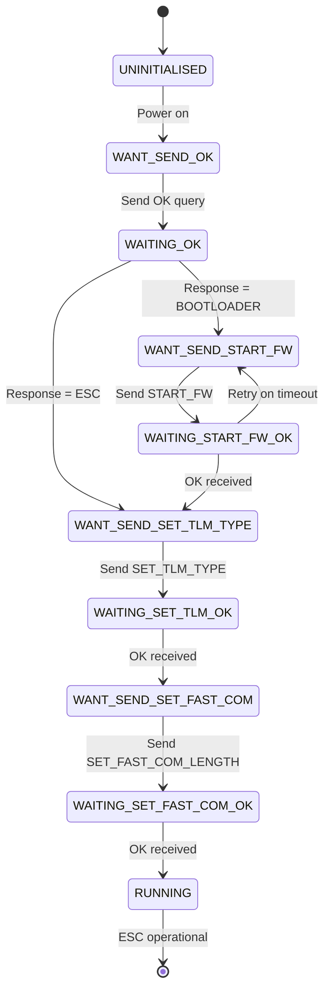

# FETtec OneWire

FETtec OneWire is an [ESC](https://en.wikipedia.org/wiki/Electronic_speed_control) communication protocol created by Felix Niessen (former Flyduino KISS developer) from [FETtec](https://fettec.net).
It is a (bidirectional) [digital full-duplex asynchronous serial communication protocol](https://en.wikipedia.org/wiki/Asynchronous_serial_communication) running at 500Kbit/s Baudrate. It requires three wire (RX, TX and GND) connection (albeit the name OneWire) regardless of the number of ESCs connected.
Unlike bidirectional-Dshot, the FETtec OneWire protocol does not need one DMA channel per ESC for bidirectional communication. 

For purchase, connection and configuration information please see the [ArduPilot FETtec OneWire wiki page](https://ardupilot.org/copter/docs/common-fettec-onewire.html).

## Features of this device driver

- use ArduPilot's coding guidelines and naming conventions
- control motor speed
- Use the AP_ESC_Telem base class to:
  - copy ESC telemetry data into MAVLink telemetry
  - save ESC telemetry data in dataflash logs
  - use RPM telemetry for dynamic notch filter frequencies
  - sum the current telemetry info from all ESCs and use it as virtual battery current monitor sensor
  - average the voltage telemetry info and use it as virtual battery voltage monitor sensor
  - average the temperature telemetry info and use it as virtual battery temperature monitor sensor
- Obey the safety switch. Keeps motors from turning
- Use `SERVO_FWT_MASK` to define which servo output should be routed to FETtec ESCs
- Use `SERVO_FWT_RVMASK` to define the rotation direction of the motors
  - `SERVO_FWT_RVMASK` changes only take effect when disarmed
- Can be compiled when `HAL_WITH_ESC_TELEM` is disabled. No telemetry data will be available but it saves a lot of memory
- pre-arm checks:
  - Check that UART is available
  - check that the desired motor channels parameter (`SERVO_FWT_MASK`) is valid
  - check that the desired motor poles parameter (`SERVO_FWT_POLES`) is valid
  - check that the all desired ESCs are found and configured
  - check that the ESCs are periodically sending telemetry data
- re-init and configure an ESC(s) if not armed (motors not spinning) when
  - telemetry communication with the ESC(s) is lost
- adds a serial simulator (--serial5=sim:fetteconewireesc) of FETtec OneWire ESCs
- adds autotest (using the simulator) to:
  - simulate telemetry voltage, current, temperature, RPM data using SITL internal variables
  - test the safety switch functionality
  - test ESC power outages
  - test `SERVO_FWT_MASK` parameter validation
  - fly a copter over a simulated serial link connection


## ArduPilot to ESC protocol

The FETtec OneWire protocol supports up to 24 ESCs without telemetry and up to 15 ESCs with telemetry.

There are two types of messages sent to the ESCs: **configuration messages** and **fast-throttle messages**.

### Protocol Command Reference

The following command types (MsgType) are used in the OneWire protocol:

| Command | ID | Direction | Purpose |
|---------|-----|-----------|---------|
| OK | 0x00 | ESC → Autopilot | Acknowledgment of successful command |
| BL_START_FW | 0x01 | Autopilot → ESC | Exit bootloader and start ESC firmware |
| SET_FAST_COM_LENGTH | 0x02 | Autopilot → ESC | Configure fast-throttle frame structure |
| REQ_TYPE | 0x03 | Autopilot → ESC | Request ESC type information |
| ESC_TYPE | 0x04 | ESC → Autopilot | ESC type response |
| REQ_SW_VER | 0x05 | Autopilot → ESC | Request firmware version |
| SW_VER | 0x06 | ESC → Autopilot | Firmware version response |
| REQ_SN | 0x07 | Autopilot → ESC | Request serial number |
| SN | 0x08 | ESC → Autopilot | Serial number response (12 bytes) |
| SET_TLM_TYPE | 0x09 | Autopilot → ESC | Configure telemetry mode |
| TLM | 0x0A | ESC → Autopilot | Telemetry data packet |
| BEEP | 0x0B | Autopilot → ESC | Emit audible beep tone |
| SET_LED_TMP_COLOR | 0x0C | Autopilot → ESC | Set RGB LED temporary color |

### Configuration message frame

Consists of six header bytes + variable payload + one checksum byte.

#### Frame Structure (Byte-level)

```
Byte 0:     frame_source - Source identifier
               0x01 = MASTER (autopilot)
               0x02 = ESC
               0x03 = BOOTLOADER
Byte 1:     esc_id - Target ESC ID (1-based, range 1-24)
Byte 2-3:   frame_type - Frame type identifier (16-bit, little-endian)
               Always 0x0000 for normal operation (bootloader compatibility)
Byte 4:     frame_length - Total frame length including all bytes from frame_source to checksum
Byte 5-N:   payload - Variable-length message payload
               First payload byte is always msgid (MsgType command ID)
               Followed by command-specific parameters
Byte N+1:   checksum - CRC-8 DVB-S2 checksum of all preceding bytes
```

**Example: SET_TLM_TYPE command (6-byte overhead + 2-byte payload)**
```
[0x01] [ESC_ID] [0x00] [0x00] [0x08] [0x09] [0x01] [CRC]
  │       │        │      │      │      │      │      └─ CRC-8 checksum
  │       │        │      │      │      │      └──────── Telemetry type (0x01 = full/alternative)
  │       │        │      │      │      └─────────────── SET_TLM_TYPE msgid (0x09)
  │       │        │      │      └────────────────────── Frame length (8 bytes total)
  │       │        │      └───────────────────────────── Frame type high byte
  │       │        └──────────────────────────────────── Frame type low byte
  │       └───────────────────────────────────────────── Target ESC ID (1-15)
  └───────────────────────────────────────────────────── Master source (0x01)
```

#### CRC-8 DVB-S2 Checksum Algorithm

The protocol uses CRC-8 with the DVB-S2 polynomial (same as DShot protocol):
- **Polynomial**: 0xD5 (x^8 + x^7 + x^6 + x^4 + x^2 + 1)
- **Initial value**: 0x00
- **Calculation**: Computed over all bytes from frame_source to last payload byte (excludes checksum itself)

**CRC Calculation Example** (pseudo-code):
```c
uint8_t crc = 0x00;
for (int i = 0; i < frame_length - 1; i++) {
    crc = crc8_dvb_update(crc, frame_buffer[i]);
}
frame_buffer[frame_length - 1] = crc;  // Append checksum
```

**Note**: Both transmitter and receiver must calculate CRC identically. Mismatched CRC indicates transmission error, and the receiver will discard the frame and increment its error counter.

### ESC Initialization State Machine

The driver follows a strict state machine for each ESC during initialization:



**State Descriptions**:
- **UNINITIALISED**: ESC power-on state, no communication established
- **WANT_SEND_OK**: Ready to query ESC firmware state
- **WAITING_OK**: Awaiting ESC response to determine bootloader vs firmware
- **WANT_SEND_START_FW**: Bootloader detected, ready to start ESC firmware
- **WAITING_START_FW_OK**: Awaiting firmware startup confirmation
- **WANT_SEND_SET_TLM_TYPE**: Ready to configure telemetry mode
- **WAITING_SET_TLM_OK**: Awaiting telemetry configuration confirmation
- **WANT_SEND_SET_FAST_COM**: Ready to configure fast-throttle frame
- **WAITING_SET_FAST_COM_OK**: Awaiting fast-throttle configuration confirmation
- **RUNNING**: ESC fully configured and operational, accepting fast-throttle commands

**Timeout Handling**: If no response is received within expected timeframe, the driver retries the command. Persistent failures will prevent arming.

### Configuration Command Details

#### 1. Firmware Detection: OK Query

**Purpose**: Determine if ESC is running bootloader or application firmware

**Command**: `PackedMessage<OK>` sent to each ESC
```
Frame: [0x01] [ESC_ID] [0x00] [0x00] [0x07] [0x00] [CRC]
```

**Expected Response**: `PackedMessage<OK>` with `frame_source` indicating firmware state
- `frame_source = 0x03` (BOOTLOADER): ESC is in bootloader, requires START_FW command
- `frame_source = 0x02` (ESC): ESC firmware is running, proceed to configuration

**Timing**: Wait up to 100ms for response before retry

#### 2. Firmware Startup: START_FW

**Purpose**: Command bootloader to exit and start ESC application firmware

**Command**: `PackedMessage<START_FW>` sent to ESC in bootloader state
```
Frame: [0x01] [ESC_ID] [0x00] [0x00] [0x07] [0x01] [CRC]
```

**Expected Response**: `PackedMessage<OK>` with `frame_source = 0x02` (ESC)

**Timing**: ESC firmware startup takes approximately 50-100ms. Wait for OK response before proceeding.

**Retry Logic**: If no response or incorrect `frame_source`, retry command up to 3 times.

#### 3. Telemetry Configuration: SET_TLM_TYPE

**Purpose**: Configure telemetry reporting mode

**Command**: `PackedMessage<SET_TLM_TYPE>` with telemetry type parameter
```
Frame: [0x01] [ESC_ID] [0x00] [0x00] [0x08] [0x09] [TLM_TYPE] [CRC]
```

**Parameters**:
- `TLM_TYPE = 0x01`: Full/Alternative telemetry mode (per-ESC complete telemetry packets)
- Other values: Reserved for future use

**Expected Response**: `PackedMessage<OK>` confirming configuration

**Effect**: ESC will respond to fast-throttle telemetry requests with complete `TLM` messages including voltage, current, RPM, temperature, consumption, and CRC error count.

#### 4. Fast-Throttle Configuration: SET_FAST_COM_LENGTH

**Purpose**: Inform each ESC of the fast-throttle frame structure based on total ESC count

**Command**: `PackedMessage<SET_FAST_COM_LENGTH>` with frame layout parameters
```
Frame: [0x01] [ESC_ID] [0x00] [0x00] [0x0A] [0x02] [BYTE_COUNT] [MIN_ESC_ID] [ESC_COUNT] [CRC]
```

**Parameters**:
- `BYTE_COUNT`: Total bytes in fast-throttle frame (excluding header and CRC)
  - Formula: `BYTE_COUNT = ceil((11 * ESC_COUNT) / 8)`
  - Example: 4 ESCs → 44 bits → 6 bytes
- `MIN_ESC_ID`: Lowest ESC ID in the system (typically 1)
- `ESC_COUNT`: Total number of ESCs connected

**Expected Response**: `PackedMessage<OK>` confirming configuration

**Effect**: ESC now knows how to parse fast-throttle frames and extract its specific 11-bit throttle value from the packed byte stream.

**Example Configuration for 4 ESCs (IDs 1-4)**:
```
SET_FAST_COM_LENGTH parameters:
  BYTE_COUNT = 6   (44 bits ÷ 8 = 5.5, rounded up to 6 bytes)
  MIN_ESC_ID = 1
  ESC_COUNT  = 4
```

#### 5. Static Information Requests (Optional)

When `HAL_AP_FETTEC_ONEWIRE_GET_STATIC_INFO` is enabled, the driver can query ESC static information:

**REQ_TYPE**: Request ESC type/model
```
Command:  [0x01] [ESC_ID] [0x00] [0x00] [0x07] [0x03] [CRC]
Response: [0x02] [ESC_ID] [0x00] [0x00] [0x08] [0x04] [TYPE] [CRC]
```

**REQ_SW_VER**: Request firmware version
```
Command:  [0x01] [ESC_ID] [0x00] [0x00] [0x07] [0x05] [CRC]
Response: [0x02] [ESC_ID] [0x00] [0x00] [0x09] [0x06] [VER] [SUBVER] [CRC]
```

**REQ_SN**: Request serial number
```
Command:  [0x01] [ESC_ID] [0x00] [0x00] [0x07] [0x07] [CRC]
Response: [0x02] [ESC_ID] [0x00] [0x00] [0x13] [0x08] [12-byte SN] [CRC]
```

**Use Cases**: Logging ESC inventory, firmware version verification, tracking specific hardware units

### Fast-Throttle Message Frame

Fast-throttle frames provide high-speed motor control with minimal overhead.

#### Frame Structure

```
Byte 0:     Frame header (0xAA for fast-throttle with telemetry request)
Byte 1:     Telemetry request ESC ID (5-bit) + first bits of throttle data
Bytes 2-N:  Packed 11-bit throttle values for all ESCs
Byte N+1:   CRC-8 DVB-S2 checksum
```

#### 11-Bit Throttle Value Encoding

Each ESC receives an 11-bit throttle value (range 0-2047) with the following mapping:

| Value Range | Motor Behavior | Notes |
|-------------|----------------|-------|
| 0 - 990 | **Reverse rotation** | 0 = maximum reverse, 990 = minimum reverse |
| 991 - 1009 | **Dead-band (stopped)** | No rotation, ESC idle |
| 1010 - 2047 | **Forward rotation** | 1010 = minimum forward, 2047 = maximum forward |

**Direction Convention**: Forward vs reverse depends on motor wiring. Use `SERVO_FWT_RVMASK` parameter to reverse individual motors in software.

#### 11-Bit Packing Algorithm

Throttle values are packed bit-efficiently to minimize frame length:

**Example: 4 ESCs with throttle values [1200, 1500, 1800, 1100]**

```
ESC1 (1200):  0 1 0 0 1 0 1 0 0 0 0  (11 bits)
ESC2 (1500):  0 1 0 1 1 1 0 1 1 1 0  (11 bits)
ESC3 (1800):  1 1 1 0 0 0 0 1 0 0 0  (11 bits)
ESC4 (1100):  0 1 0 0 0 1 0 0 1 0 0  (11 bits)

Bit stream (44 bits total):
01001010000 01011101110 11100001000 01000100100

Packed into bytes (6 bytes):
Byte 0: 01001010  (0x4A)
Byte 1: 00001011  (0x0B)
Byte 2: 11011101  (0xDD)
Byte 3: 11000010  (0xC2)
Byte 4: 00010000  (0x10)
Byte 5: 10010000  (0x90)  (last 4 bits are padding)
```

**Packing Formula**: For ESC at index `i`, its 11-bit value starts at bit position `i * 11` in the packed byte stream.

**Frame Length Calculation**:
- Total bits: `11 * ESC_COUNT`
- Total bytes: `ceil((11 * ESC_COUNT) / 8)`
- Complete frame: `2 (header + telem) + packed_bytes + 1 (CRC)`

**Examples**:
- 4 ESCs: 2 + 6 + 1 = **9 bytes** total
- 8 ESCs: 2 + 11 + 1 = **14 bytes** total
- 12 ESCs: 2 + 17 + 1 = **20 bytes** total

#### Telemetry Request Mechanism

The fast-throttle frame header specifies which ESC should respond with telemetry:

**Byte 0 (Header)**:
- `0xAA`: Request telemetry from ESC specified in Byte 1
- Other values: Reserved

**Byte 1 (Telemetry Request + Data)**:
- Bits 7-3: ESC ID to request telemetry from (5-bit, value 1-24)
- Bits 2-0: First 3 bits of first ESC's throttle value

**Round-Robin Telemetry**: The driver cycles through ESCs, requesting telemetry from one ESC per frame to distribute bandwidth.

**Synchronization**: All ESCs parse the complete frame before applying throttle values, ensuring synchronized motor updates.

If telemetry is requested, the specified ESC will respond immediately with a `TLM` message. ESCs respond in ID order to avoid collisions.

See *ESC to ArduPilot Protocol* section below for telemetry frame details.


### Timing and Update Rate Constraints

#### Fast-Throttle Frame Timing

Timing is critical for reliable ESC communication. Frame transmission time depends on ESC count and baud rate.

**Transmission Time Calculation** (at 500 Kbps full-duplex):

| ESC Count | Frame Size | TX Time | Telemetry RX Time | Total Cycle Time | Max Theoretical Rate |
|-----------|------------|---------|-------------------|------------------|---------------------|
| 4 ESCs | 9 bytes | 144 µs | ~50 µs | ~194 µs | ~5.1 kHz |
| 6 ESCs | 11 bytes | 176 µs | ~50 µs | ~226 µs | ~4.4 kHz |
| 8 ESCs | 14 bytes | 224 µs | ~50 µs | ~274 µs | ~3.6 kHz |
| 12 ESCs | 20 bytes | 320 µs | ~50 µs | ~370 µs | ~2.7 kHz |
| 15 ESCs | 23 bytes | 368 µs | ~50 µs | ~418 µs | ~2.4 kHz |

**Formula**: `TX_time = (frame_bytes * 10 bits/byte) / baud_rate`
- 10 bits/byte accounts for start bit and stop bit in serial transmission
- Example: 9 bytes * 10 / 500000 = 180 µs (plus ~10 µs processing overhead)

**Telemetry Response Time**: ESC telemetry response typically adds ~50 µs (13-byte TLM frame transmission from ESC at 500 Kbps)

#### Driver Update Rate Limits

The ArduPilot driver enforces safe timing through `_min_fast_throttle_period_us`:

**Minimum Period** (enforced by driver):
- Calculated based on ESC count to prevent bus saturation
- Includes safety margin for processing time and bus arbitration
- Typical values: 200-400 µs depending on configuration

**Actual Update Rates** (in ArduPilot):
- **Copter**: 400 Hz (~2500 µs period) - well below hardware limit
- **Plane/Rover/Sub**: 50 Hz (~20000 µs period) - very conservative

**Decimation**: At very high loop rates, the driver may decimate (skip) updates to maintain safe timing.

#### Critical Timing Requirement: 4 Hz Minimum

**⚠️ WARNING**: FETtec ESCs require **minimum 4 Hz** fast-throttle update rate (maximum 250 ms between frames).

**Failure to maintain 4 Hz**:
- ESCs will automatically disarm (stop) motors as safety failsafe
- Driver pre-arm checks will fail if update rate cannot be guaranteed
- Telemetry will be marked as stale

**Monitoring**: The driver tracks `_last_transmit_us` to ensure compliance with minimum update rate.

#### Half-Duplex Mode Timing (Optional)

When `HAL_AP_FETTEC_HALF_DUPLEX` is enabled:
- **Baud rate**: 2 Mbps (4x faster than full-duplex)
- **Frame timing**: Reduced by ~75%
- **Benefit**: Supports more ESCs or higher update rates
- **Limitation**: Not all ESC firmware versions support half-duplex mode

**Example (Half-Duplex)**: 8 ESCs at 2 Mbps → ~68 µs TX + ~12 µs RX = ~80 µs total → 12.5 kHz theoretical maximum

#### Frame Spacing

Minimum spacing between consecutive frames is enforced to allow:
- ESC processing time for previous command
- Bus settling time in half-duplex mode
- Telemetry response window

**Recommended Spacing**: `_min_fast_throttle_period_us` or greater, automatically managed by driver's `update()` function.

## ESC to ArduPilot protocol

### Telemetry Data Structure

OneWire ESC telemetry information is sent back to the autopilot in **TLM** messages.

#### TLM Message Frame Structure

The telemetry response is a `PackedMessage<TLM>` configuration frame:

```
Byte 0:     frame_source (0x02 = ESC)
Byte 1:     esc_id (ESC ID that sent this telemetry)
Byte 2-3:   frame_type (0x0000)
Byte 4:     frame_length (0x13 = 19 bytes total)
Byte 5:     msgid (0x0A = TLM)
Byte 6:     temperature (int8_t, centi-degrees Celsius)
Byte 7-8:   voltage (uint16_t, centi-Volts, little-endian)
Byte 9-10:  current (uint16_t, centi-Amperes, little-endian)
Byte 11-12: eRPM (int16_t, centi-RPM, little-endian)
Byte 13-14: consumption (uint16_t, milliampere-hours, little-endian)
Byte 15-16: tx_err_count (uint16_t, CRC error counter, little-endian)
Byte 17:    reserved (future use)
Byte 18:    checksum (CRC-8 DVB-S2)
```

**Frame Length**: 19 bytes (6-byte header + 13-byte payload + 1-byte CRC)

#### Telemetry Field Descriptions

| Field | Type | Scaling | Units | Range | Description |
|-------|------|---------|-------|-------|-------------|
| **temperature** | int8_t | × 100 | °C | -128 to +127 °C | ESC temperature, scaled by 100 |
| **voltage** | uint16_t | × 100 | V | 0 to 655.35 V | Input voltage, scaled by 100 |
| **current** | uint16_t | × 100 | A | 0 to 655.35 A | Current draw, scaled by 100 |
| **eRPM** | int16_t | × 100 | eRPM | -327.68k to +327.67k | Electrical RPM, scaled by 100 |
| **consumption_mah** | uint16_t | × 1 | mAh | 0 to 65535 mAh | Cumulative energy consumption |
| **tx_err_count** | uint16_t | × 1 | count | 0 to 65535 | CRC errors detected by ESC from autopilot TX |

#### Unit Conversion Examples

**Temperature** (centi-degrees Celsius):
```
Raw value: 45 → Actual temperature: 45 / 100 = 0.45°C
Raw value: 3527 (hex 0x0DDF) → 35.27°C
```

**Voltage** (centi-Volts):
```
Raw value: 1680 → Actual voltage: 1680 / 100 = 16.80 V
```

**Current** (centi-Amperes):
```
Raw value: 1250 → Actual current: 1250 / 100 = 12.50 A
```

**Electrical RPM to Propeller RPM Conversion**:
```
Raw value: 15000 → eRPM: 15000 / 100 = 150.00 eRPM (electrical revolutions per minute)
Propeller RPM = eRPM / (motor_pole_pairs)
Propeller RPM = eRPM / (SERVO_FWT_POLES / 2)

Example with 14-pole motor:
Propeller RPM = 150.00 / (14 / 2) = 150.00 / 7 = 21.43 RPM
```

**⚠️ Important**: eRPM is **electrical RPM**, not mechanical RPM. To get actual propeller/motor shaft RPM, divide by the number of pole pairs:
- `Pole Pairs = SERVO_FWT_POLES / 2`
- Common motor pole counts: 12, 14, 16, 20, 22, 24

**Power Consumption**:
```
Raw value: 2500 → 2500 mAh = 2.5 Ah consumed since ESC power-on
```

**CRC Error Counter (tx_err_count)**:
- Counts CRC errors **detected by the ESC** when receiving frames from the autopilot
- High error count indicates signal quality issues (EMI, loose connections, cable length)
- Separate from autopilot's receive CRC error counter (crc_rec_err_cnt)

### Telemetry Update Rate

**Update Frequency**: Telemetry is requested in round-robin fashion, one ESC per fast-throttle frame.

**Calculation**:
- If fast-throttle rate is 400 Hz and there are 4 ESCs
- Each ESC sends telemetry every 4 frames
- Individual ESC telemetry rate: 400 / 4 = **100 Hz per ESC**

**General Formula**: `ESC_telemetry_rate = fast_throttle_rate / ESC_count`

**Examples**:
- 400 Hz with 4 ESCs → 100 Hz per ESC
- 400 Hz with 8 ESCs → 50 Hz per ESC
- 50 Hz with 4 ESCs (Plane/Rover) → 12.5 Hz per ESC

### Telemetry Timeout and Staleness Detection

**Timeout Threshold**: If no telemetry is received from an ESC for more than **500 ms**, telemetry is marked as stale.

**Effects of Stale Telemetry**:
- Pre-arm check will fail, preventing arming
- Warning message sent to GCS
- RPM-based notch filtering disabled for that ESC
- Virtual battery monitor stops using that ESC's data

**Recovery**: Once telemetry resumes, ESC is automatically reintegrated.

### Full/Alternative Telemetry Mode

The telemetry mode is configured during initialization using `SET_TLM_TYPE` command:

**Mode 0x01 (Full/Alternative)**: Each ESC sends complete telemetry packet as `PackedMessage<TLM>` configuration frame
- **Frame overhead**: 6 bytes (header) + 1 byte (CRC) = 7 bytes overhead
- **Payload**: 13 bytes of telemetry data
- **Total**: 19 bytes per telemetry response
- **Includes**: All fields listed above, including CRC error counter from ESC

This is the only telemetry mode currently supported by the ArduPilot driver.

### Telemetry Processing Pipeline

1. **Request**: Fast-throttle frame sent with telemetry request for specific ESC_ID
2. **Response**: ESC transmits `TLM` message on serial bus
3. **Reception**: Driver receives and validates CRC via `read_data_from_uart()`
4. **Decoding**: `handle_message_telem()` extracts and scales telemetry fields
5. **Distribution**: Data forwarded to `AP_ESC_Telem` base class
6. **Logging**: Telemetry written to dataflash log (ESC, ESCN, ESCTn messages)
7. **MAVLink**: Telemetry streamed to ground station via ESC_STATUS messages
8. **Features**: Used for RPM notch filtering, virtual battery monitoring, performance analysis

**Source**: `libraries/AP_FETtecOneWire/AP_FETtecOneWire.cpp:handle_message_telem()`, `libraries/AP_FETtecOneWire/AP_FETtecOneWire.h:TLM` structure


## Protocol Modes: Fast-Throttle vs Configuration Messages

The OneWire protocol uses two distinct message formats optimized for different purposes:

### Configuration Messages (Standard Protocol)

**Purpose**: ESC discovery, configuration, and control commands

**Characteristics**:
- Full `PackedMessage<T>` frame structure
- 6-byte header overhead + variable payload + 1-byte CRC
- Bidirectional: Request/response pattern with acknowledgments
- Used during initialization and special commands (beep, LED control)

**Frame Overhead**: 7+ bytes per message

**Use Cases**:
- Bootloader detection and firmware startup
- Telemetry mode configuration
- Fast-throttle frame layout negotiation
- Static information queries (type, version, serial number)
- Beep and LED commands
- Firmware updates (via bootloader)

**Performance**: Lower throughput, higher reliability with explicit acknowledgments

**Example**: SET_TLM_TYPE command (8 bytes total)
```
[0x01][ESC_ID][0x00][0x00][0x08][0x09][0x01][CRC]
```

### Fast-Throttle Messages

**Purpose**: High-frequency motor speed control during flight

**Characteristics**:
- Minimal overhead: 2-byte header + packed throttle data + 1-byte CRC
- Bit-packed 11-bit throttle values for efficiency
- One-way: Autopilot → all ESCs simultaneously
- Optional telemetry response from one ESC per frame

**Frame Overhead**: 3 bytes + ceil((11 * ESC_COUNT) / 8) data bytes

**Use Cases**:
- Real-time motor control during armed operation
- Continuous 50-400 Hz updates
- Round-robin telemetry collection

**Performance**: High throughput, minimal latency, optimized for bandwidth

**Example**: 4 ESC throttle update (9 bytes total)
```
[0xAA][TLM_REQ + throttle_bits][6 bytes packed throttles][CRC]
```

### Protocol Mode Comparison

| Feature | Configuration Messages | Fast-Throttle Messages |
|---------|------------------------|------------------------|
| **Frame Overhead** | 7+ bytes | 3 bytes |
| **Direction** | Bidirectional | Primarily one-way |
| **Acknowledgment** | Yes (OK responses) | No (except telemetry) |
| **Update Rate** | Occasional (initialization) | Continuous (50-400 Hz) |
| **Latency** | Higher (wait for ACK) | Lower (immediate) |
| **Bandwidth Efficiency** | Lower | Higher |
| **Data Size** | Variable per command | Fixed per ESC count |
| **ESC Synchronization** | Sequential per ESC | Simultaneous all ESCs |
| **Use Phase** | Pre-armed configuration | Armed flight operations |
| **Retry Logic** | Built-in (wait for OK) | None (assume success) |

### Protocol Transition

**Initialization Phase** (Configuration Messages):
1. Discovery: Send OK queries to detect ESCs
2. Startup: Send START_FW if in bootloader
3. Configuration: Send SET_TLM_TYPE and SET_FAST_COM_LENGTH
4. Verification: Wait for OK acknowledgments
5. **Transition**: Once all ESCs in RUNNING state

**Operational Phase** (Fast-Throttle Messages):
1. Armed: Start sending continuous fast-throttle frames
2. Update: Maintain minimum 4 Hz (max 250 ms interval)
3. Telemetry: Collect ESC status in round-robin
4. Safety: Driver ensures timing constraints met

**Return to Configuration**: If telemetry lost or ESC becomes unresponsive, driver may return to configuration phase (when disarmed) to reinitialize.


## ESC Firmware Update Procedures

### Bootloader Detection

FETtec ESCs support field firmware updates via their built-in bootloader.

**Bootloader Entry**:
- ESC powers on in bootloader mode if:
  - New/unprogrammed ESC
  - Firmware update mode activated via FETtec configuration tool
  - Firmware corruption detected

**Detection Method**:
```
1. Send: PackedMessage<OK> to ESC
2. Receive: PackedMessage<OK> response
3. Check: frame_source field in response
   - frame_source = 0x03 (BOOTLOADER): ESC in bootloader mode
   - frame_source = 0x02 (ESC): Normal firmware running
```

### Firmware Startup from Bootloader

**Automatic Startup** (ArduPilot driver behavior):
```
1. Detect bootloader: frame_source = 0x03
2. Send: PackedMessage<START_FW> (msgid 0x01)
3. Wait: 50-100 ms for ESC firmware initialization
4. Receive: PackedMessage<OK> with frame_source = 0x02
5. Proceed: Continue with configuration sequence
```

**Manual Firmware Update** (Not implemented in ArduPilot driver):

The OneWire protocol supports firmware flashing via bootloader commands, but the ArduPilot driver does not currently implement firmware upload functionality.

**To update ESC firmware**:
1. Use **FETtec configuration tool** (Windows/Linux application from FETtec)
2. Connect ESC to computer via USB-to-UART adapter
3. Tool handles bootloader communication and firmware transfer
4. Firmware file: `.hex` or `.bin` format from FETtec

### Safety Considerations

**⚠️ WARNING: Do not attempt firmware updates during flight**

- Firmware updates require ESC to enter bootloader mode (motors stop)
- Update process takes several seconds
- Failed update may brick ESC (requires hardware recovery)
- Always test new firmware on bench before flight

**Best Practices**:
- Update firmware one ESC at a time
- Verify firmware compatibility with FETtec documentation
- Keep backup of working firmware version
- Test ESC functionality after update before installation on vehicle
- Never update firmware with propellers attached


## Error Codes and Troubleshooting

### Error Counters and Diagnostics

The driver tracks several error conditions for diagnostics:

#### CRC Error Counters

**crc_rec_err_cnt** (Autopilot receive errors):
- Counts CRC failures when autopilot receives messages from ESCs
- Tracked per ESC in driver internal counters
- High values indicate:
  - Poor signal quality from ESC to autopilot
  - Electromagnetic interference on RX line
  - Cable quality issues

**tx_err_count** (ESC receive errors):
- Reported by ESC in telemetry messages
- Counts CRC failures when ESC receives frames from autopilot
- High values indicate:
  - Poor signal quality from autopilot to ESC
  - Electromagnetic interference on TX line
  - Baud rate mismatch or timing issues

**Threshold**: Occasional errors (<1% of frames) are normal. Sustained error rates >5% indicate problems.

#### Driver Internal Counters

**_unknown_esc_message**:
- Counts messages received from unexpected ESC IDs
- Possible causes:
  - ESC ID misconfiguration (IDs not sequential starting from 1)
  - Multiple ESCs configured with same ID
  - Bit errors causing ID field corruption

**_message_invalid_in_state_count**:
- Counts unexpected message types for current ESC state
- Possible causes:
  - ESC firmware version mismatch
  - Protocol desynchronization
  - Missed configuration step

**_period_too_short**:
- Counts attempts to send fast-throttle frames faster than `_min_fast_throttle_period_us`
- Usually indicates driver timing logic error
- Should be zero in normal operation

### Pre-Arm Check Failures

The `pre_arm_check()` function validates ESC readiness. Common failure messages:

| Failure Message | Cause | Solution |
|-----------------|-------|----------|
| **"FETtec: UART not available"** | Serial port not configured or in use | Check `SERIALx_PROTOCOL` parameter, ensure port is set to ESC |
| **"FETtec: Invalid SERVO_FWT_MASK"** | No ESCs enabled in parameter | Set `SERVO_FWT_MASK` bits for desired servo outputs |
| **"FETtec: Invalid SERVO_FWT_POLES"** | Motor pole count parameter out of range | Set `SERVO_FWT_POLES` to motor's actual pole count (typically 12-24) |
| **"FETtec: ESC X not found"** | ESC not responding during initialization | Check wiring, ESC power, ESC ID configuration |
| **"FETtec: Telemetry timeout ESC X"** | No telemetry received for >500ms | Verify ESC functionality, check for loose connections |

### Troubleshooting Guide

#### Problem: ESC Not Responding

**Symptoms**: Pre-arm check fails with "ESC not found", no telemetry

**Checks**:
1. **Wiring**: Verify TX, RX, GND connections
   - Autopilot TX → ESC RX
   - Autopilot RX → ESC TX
   - Common ground between autopilot and ESC
2. **ESC Power**: Confirm ESC is powered (LED indicators)
3. **Baud Rate**: Verify serial port configured for 500000 baud (or 2000000 for half-duplex)
4. **ESC IDs**: Confirm ESC IDs are sequential starting from 1 (use FETtec tool)
5. **Protocol**: Ensure `SERIALx_PROTOCOL = 38` (ESC Telemetry)

**GCS Messages**: Check for driver initialization messages

#### Problem: High CRC Error Rate

**Symptoms**: Telemetry shows high `tx_err_count` or frequent CRC errors in logs

**Causes**:
- **Cable Length**: Serial cables >1 meter may cause signal degradation
- **Electromagnetic Interference**: Motors, ESCs, power wires near signal wires
- **Cable Quality**: Unshielded or non-twisted-pair cables
- **Baud Rate**: Signal integrity issues at 500 Kbps

**Solutions**:
1. **Shorten cables**: Keep UART connections <50 cm if possible
2. **Use twisted pair**: Twist TX/GND and RX/GND together
3. **Add shielding**: Use shielded cable with shield grounded at autopilot end only
4. **Separate signal from power**: Route UART cables away from motor/ESC power wires
5. **Add ferrite beads**: Place on UART cable near autopilot
6. **Check connectors**: Ensure solid connections, no intermittent contact
7. **Try half-duplex mode**: May improve signal quality at cost of compatibility

#### Problem: Telemetry Timeout

**Symptoms**: "Telemetry timeout" pre-arm failure after ESC was responding

**Checks**:
1. **SERVO_FWT_POLES**: Verify parameter matches actual motor pole count
   - Incorrect pole count doesn't prevent telemetry but may indicate config issues
2. **ESC Firmware**: Update to latest FETtec firmware version
3. **Timing**: Verify fast-throttle update rate meets 4 Hz minimum
4. **Intermittent Connection**: Check for loose wiring or connectors
5. **ESC Health**: ESC may have internal fault (test with FETtec tool)

#### Problem: Fast Throttle Period Too Short

**Symptoms**: `_period_too_short` counter increasing, motors erratic

**Causes**:
- Loop rate too high for ESC count
- Driver timing logic miscalculation
- Scheduler overload

**Solutions**:
1. **Reduce ESC Count**: Use fewer ESCs or disable telemetry to reduce overhead
2. **Check Scheduler**: Ensure main loop rate is appropriate (400 Hz for Copter)
3. **Firmware Update**: May be a driver bug, check for ArduPilot updates

#### Problem: Motors Not Spinning

**Symptoms**: ESCs respond, telemetry received, but motors don't spin

**Checks**:
1. **Safety Switch**: Press safety switch to arm (unless disabled)
2. **Arming**: Verify vehicle is armed (pre-arm checks pass)
3. **Output Enable**: Check `SERVO_FWT_MASK` includes desired motor outputs
4. **Motor Direction**: Verify `SERVO_FWT_RVMASK` if direction is wrong
5. **Throttle Values**: Check servo output values are >1010 (out of dead-band)
6. **ESC Calibration**: Ensure ESCs are calibrated with FETtec tool

### Diagnostic Logging

**Log Messages to Examine**:
- **ESC**: FETtec telemetry summary
- **ESCN**: Individual ESC telemetry (voltage, current, RPM, temp)
- **ESCTn**: ESC telemetry extended (consumption, error counters)

**GCS Messages**: Enable `MSG` logging and monitor for:
- "FETtec: ESC X initialized"
- "FETtec: Telemetry lost ESC X"
- "FETtec: High CRC error rate"

**Dataflash Log Analysis**:
```
1. Download log from autopilot
2. Open in MAVExplorer or Mission Planner
3. Plot ESC.RPM1-4 to verify motor response
4. Plot ESC.Volt, ESC.Curr for power monitoring
5. Check ESCN.Temp for overheating
6. Review ESCTn.TxErr for CRC error trends
```


## Wiring Guide

### Physical Connection

FETtec OneWire requires **three-wire connection** (despite the "OneWire" name):

```
Autopilot                    ESC Chain
┌──────────┐                ┌──────────┐      ┌──────────┐      ┌──────────┐
│          │                │ ESC ID=1 │      │ ESC ID=2 │      │ ESC ID=3 │
│  SERIALx │                │          │      │          │      │          │
│          │                │          │      │          │      │          │
│    TX ───┼────────────────┼── RX     │──────┼── RX     │──────┼── RX     │
│          │                │          │      │          │      │          │
│    RX ───┼────────────────┼── TX     │──────┼── TX     │──────┼── TX     │
│          │                │          │      │          │      │          │
│    GND ──┼────────────────┼── GND    │──────┼── GND    │──────┼── GND    │
│          │                │          │      │          │      │          │
└──────────┘                └──────────┘      └──────────┘      └──────────┘
                                 │                  │                  │
                            ESC Power          ESC Power          ESC Power
                            from Battery       from Battery       from Battery
```

**Key Points**:
- **TX (Transmit)**: Autopilot TX connects to ALL ESC RX pins (parallel)
- **RX (Receive)**: Autopilot RX connects to ALL ESC TX pins (parallel)
- **GND (Ground)**: Common ground for signal reference
- **Parallel Topology**: All ESCs share the same three-wire bus

### Multi-ESC Wiring Topology

**Series Connection** (typical for FETtec ESCs with pass-through connectors):
- Each ESC has signal input connector and pass-through output connector
- Daisy-chain: Autopilot → ESC1 → ESC2 → ESC3 → ... → ESCn
- Electrically equivalent to parallel, just easier to wire

**Parallel Connection** (using wiring harness):
- All ESC signal wires connect to single 3-wire harness
- Harness connects to autopilot UART
- Useful for non-adjacent ESC mounting locations

**Maximum ESC Count**:
- Without telemetry: Up to 24 ESCs
- With telemetry: Up to 15 ESCs (limited by `ESC_TELEM_MAX_ESCS`)

### Signal Integrity Considerations

**Cable Length**:
- **Recommended**: <50 cm total wire length
- **Maximum**: 1 meter (signal quality degrades beyond this)
- **Long runs**: Use twisted pair and shielded cable

**Cable Type**:
- **Minimum**: 26 AWG (0.13 mm²) stranded copper
- **Recommended**: Twisted pair (TX+GND twisted, RX+GND twisted)
- **Best**: Shielded twisted pair, shield grounded at autopilot end only

**Electromagnetic Interference (EMI)**:
- Route signal wires away from motor wires
- Route signal wires away from ESC power wires
- Route signal wires away from high-current battery connections
- Maintain >3 cm separation from noise sources

### Power Wiring

**⚠️ CRITICAL**: ESC power and signal ground must share common reference

**Separate Power and Signal**:
- ESC main power: Heavy gauge wire to battery (12V, 16V, etc.)
- Signal ground: Part of 3-wire UART connection
- **Ground reference**: ESC power negative must be common with signal GND

**Typical Configuration**:
```
Battery (+) ──┬── ESC1 Power (+)
              ├── ESC2 Power (+)
              └── ESC3 Power (+)

Battery (-) ──┬── ESC1 Power (-)  ─┬─ ESC1 Signal GND ──┐
              ├── ESC2 Power (-)  ─┼─ ESC2 Signal GND ──┼─ Autopilot GND
              └── ESC3 Power (-)  ─┴─ ESC3 Signal GND ──┘
```

### Connector Pinouts

**Common Autopilot Serial Connectors**:

**Pixhawk Standard UART** (6-pin JST-GH):
```
Pin 1: +5V (not used for FETtec)
Pin 2: TX (autopilot transmit)
Pin 3: RX (autopilot receive)
Pin 4: CTS (not used)
Pin 5: RTS (not used)
Pin 6: GND
```

**FETtec ESC Signal Connector** (3-pin):
```
Pin 1: GND (black or brown wire)
Pin 2: RX  (white or yellow wire)
Pin 3: TX  (orange or red wire)
```

**Connection**:
- Autopilot TX (Pin 2) → ESC RX (Pin 2)
- Autopilot RX (Pin 3) → ESC TX (Pin 3)
- Autopilot GND (Pin 6) → ESC GND (Pin 1)

### Configuration Parameters

After wiring is complete:

```
SERIALx_PROTOCOL = 38       (ESC Telemetry)
SERIALx_BAUD = 500          (500 Kbps, default)
SERVO_FWT_MASK = 15          (Example: ESCs on outputs 1-4 = 0b00001111 = 15)
SERVO_FWT_POLES = 14         (Example: 14-pole motors)
```

Replace `x` with your serial port number (e.g., `SERIAL5_PROTOCOL`).

### Testing Wiring

**Bench Test Procedure** (before flight):
1. Connect ESCs to autopilot (no propellers!)
2. Power autopilot and ESCs
3. Connect ground station (Mission Planner, QGroundControl)
4. Check "Messages" tab for "FETtec: ESC X initialized"
5. Verify telemetry: Check ESC voltage, current, temperature
6. Arm vehicle (safety switch): Motors should spin at idle
7. Test throttle: Gradually increase throttle, verify motor response
8. Disarm: Motors stop immediately
9. Check for error messages in log


## Testing Procedures

### SITL Testing (Software-in-the-Loop)

The driver includes a FETtec OneWire ESC simulator for safe testing without hardware.

#### Basic SITL Setup

**Start SITL with FETtec simulator**:
```bash
cd ArduPilot
./Tools/autotest/sim_vehicle.py -v Copter --console --map --serial5=sim:fetteconewireesc
```

**Parameters**:
- `--serial5=sim:fetteconewireesc`: Creates simulated ESCs on SERIAL5
- `-v Copter`: Vehicle type (Copter, Plane, Rover, Sub)
- `--console`: Opens MAVProxy console
- `--map`: Opens map view

**Configure Parameters** (in MAVProxy):
```
param set SERIAL5_PROTOCOL 38
param set SERIAL5_BAUD 500
param set SERVO_FWT_MASK 15
param set SERVO_FWT_POLES 14
```

**Verify Initialization**:
```
messages
# Look for: "FETtec: ESC X initialized"
```

#### Telemetry Monitoring

**View ESC Telemetry in SITL**:

**MAVProxy Commands**:
```
# Watch ESC RPM
watch ESC.RPM1
watch ESC.RPM2

# Watch voltage and current
watch ESC.Volt
watch ESC.Curr

# Watch temperature
watch ESC.Temp

# View all ESC telemetry
watch ESC
```

**Mission Planner**:
1. Open "Flight Data" screen
2. Right-click on HUD → "User Items"
3. Add custom fields: `ESC.RPM1`, `ESC.Volt`, `ESC.Curr`, etc.

**Expected Values in SITL**:
- Voltage: Simulated battery voltage (~12-16V)
- Current: Based on throttle demand
- RPM: Proportional to throttle
- Temperature: Simulated ESC temperature (~25-50°C)

#### Safety Switch Testing

**Test Safety Switch Functionality**:

```bash
# Start SITL
./Tools/autotest/sim_vehicle.py -v Copter --serial5=sim:fetteconewireesc

# In MAVProxy:
arm throttle           # Should fail: "Safety switch not pressed"
arm safetyon           # Simulate safety switch press
arm throttle           # Should succeed
disarm
```

**Verify**:
- Before safety switch: Motors do not spin even when armed
- After safety switch: Motors spin at idle when armed
- Telemetry received regardless of safety switch state

#### ESC Power Outage Testing

The simulator supports testing ESC power loss and recovery:

**Simulate ESC Failure** (requires SITL code access):
- Modify `libraries/SITL/SIM_FETtecOneWire.cpp` to inject failures
- Test driver recovery behavior
- Verify pre-arm checks block arming when ESC missing

#### SERVO_FWT_MASK Parameter Validation

**Test Invalid Mask**:
```
param set SERVO_FWT_MASK 0       # Invalid: no ESCs enabled
# Expected: Pre-arm check fails
```

**Test Valid Masks**:
```
param set SERVO_FWT_MASK 15      # ESCs on outputs 1-4
param set SERVO_FWT_MASK 240     # ESCs on outputs 5-8
param set SERVO_FWT_MASK 255     # ESCs on outputs 1-8
```

#### Flight Test in SITL

**Complete Test Flight**:
```bash
cd ArduPilot/Tools/autotest
./autotest.py Copter.FETtec    # Runs automated FETtec test

# Manual flight:
./sim_vehicle.py -v Copter --serial5=sim:fetteconewireesc
# In MAVProxy:
mode LOITER
arm throttle
rc 3 1600              # Increase throttle
# Observe RPM increase in telemetry
rc 3 1500              # Return to mid-throttle
disarm
```

### Bench Testing with Real ESCs

**⚠️ WARNING: Remove propellers before bench testing!**

#### Safe Bench Test Procedure

**Equipment**:
- Autopilot with FETtec driver
- FETtec OneWire ESCs (configured with IDs 1-N)
- Power supply or battery
- Ground station (laptop with Mission Planner/QGroundControl)
- Telemetry radio or USB connection

**Setup**:
1. **Remove ALL propellers** from motors
2. Connect ESCs to motors (verify motor direction later)
3. Wire ESC signal (TX, RX, GND) to autopilot UART
4. Power autopilot (USB or separate power)
5. Connect ground station

**Configuration**:
```
SERIAL5_PROTOCOL = 38
SERIAL5_BAUD = 500
SERVO_FWT_MASK = 15      # Adjust for your ESC count
SERVO_FWT_POLES = 14     # Match your motor pole count
```

**Test Sequence**:
1. **Power On**: Power autopilot and ESCs
2. **Check Initialization**: Watch GCS messages for "ESC X initialized"
3. **Verify Telemetry**: Check ESC voltage, current (should be ~0A), RPM (0), temperature
4. **Pre-Arm Checks**: Ensure all pre-arm checks pass
5. **Arm Vehicle**: Press safety switch (if enabled), then arm
6. **Observe Idle**: Motors should spin at low idle speed
7. **Increase Throttle**: Gradually increase throttle, verify motor response
8. **Check Telemetry**: RPM should increase, current should increase
9. **Disarm**: Motors stop immediately
10. **Repeat**: Test multiple arm/disarm cycles

**Success Criteria**:
- All ESCs detected during initialization
- Telemetry received continuously (voltage, current, RPM, temperature)
- Motors respond to throttle commands
- Low CRC error rate (<1%)
- No pre-arm failures

### Log Analysis

#### Key Log Messages

**Initialization Messages** (check in GCS "Messages" tab):
```
FETtec: ESC 1 initialized
FETtec: ESC 2 initialized
FETtec: ESC 3 initialized
FETtec: ESC 4 initialized
```

**Error Messages**:
```
FETtec: ESC X not found
FETtec: Telemetry timeout ESC X
FETtec: High CRC error rate ESC X
```

#### Dataflash Log Fields

**ESC** message (primary telemetry):
- `RPM1-4`: Motor RPM for ESCs 1-4
- `Volt`: Average ESC voltage
- `Curr`: Sum of ESC current
- `Temp`: Average ESC temperature

**ESCN** message (per-ESC detailed telemetry):
- `Instance`: ESC ID
- `RPM`: Individual ESC RPM
- `Volt`: Individual ESC voltage
- `Curr`: Individual ESC current
- `Temp`: Individual ESC temperature

**ESCTn** message (extended telemetry):
- `Instance`: ESC ID
- `Temp`: Temperature
- `MotTemp`: Motor temperature (if supported)
- `ErrCount`: Error counter
- `Consumption`: mAh consumed

#### Log Analysis Procedure

**Download Log**:
1. Connect to autopilot via USB or telemetry
2. Download dataflash log (`.bin` file)

**Analyze in Mission Planner**:
1. Open Mission Planner
2. Flight Data → Dataflash Logs → "Review a Log"
3. Select log file
4. Graph interesting fields:
   - Plot `ESC.RPM1`, `ESC.RPM2`, `ESC.RPM3`, `ESC.RPM4` vs time
   - Plot `ESC.Volt` and `ESC.Curr` for power analysis
   - Plot `ESCN.Temp` to check for overheating
   - Plot `ESCTn.ErrCount` to identify CRC error issues

**Analyze in MAVExplorer**:
```bash
MAVExplorer.py logfile.bin
# In MAVExplorer:
graph ESC.RPM1 ESC.RPM2 ESC.RPM3 ESC.RPM4
graph ESC.Volt ESC.Curr
graph ESCN.Temp
```

### Performance Verification

#### Update Rate Verification

**Check Fast-Throttle Rate**:
- Expected: 400 Hz for Copter, 50 Hz for Plane/Rover/Sub
- Verify in log: Count fast-throttle transmissions per second
- Warning: Rate below 4 Hz causes ESC auto-disarm

**Check Telemetry Rate**:
- Expected: `Update_rate / ESC_count` per ESC
- Example: 400 Hz ÷ 4 ESCs = 100 Hz telemetry per ESC
- Verify in log: Count telemetry messages per ESC per second

#### Timing Constraint Verification

**Monitor `_period_too_short` Counter**:
- Access via GCS or log analysis
- Should remain at 0 during normal operation
- Non-zero indicates timing violation

**Check for Telemetry Timeouts**:
- Review GCS messages for timeout warnings
- Check log for gaps in telemetry data
- Telemetry gaps >500 ms indicate communication problems


## Function Structure and Call Graph

The driver architecture centers around two public entry points that orchestrate all ESC communication.

### Public API Functions

**`update()`** - Main driver loop, called at scheduler rate (400 Hz for Copter, 50 Hz for Plane/Rover/Sub)
- Initializes UART on first call
- Reads and processes incoming ESC messages
- Sends configuration commands (initialization phase)
- Sends fast-throttle commands (operational phase)
- Manages per-ESC state machines

**`pre_arm_check(char *failure_msg, uint8_t failure_msg_len)`** - Pre-flight validation
- Verifies UART availability
- Validates `SERVO_FWT_MASK` parameter
- Validates `SERVO_FWT_POLES` parameter
- Confirms all configured ESCs are detected and initialized
- Checks telemetry is current (<500ms old)

### Detailed Call Graph

```
update()
│
├─ init()                                    [First call only]
│  └─ init_uart()                            - Configure serial port, set baud rate
│
├─ read_data_from_uart()                     [Every call - RX processing]
│  ├─ move_frame_source_in_receive_buffer()  - Shift data, find frame boundaries
│  │  └─ consume_bytes()                     - Remove processed bytes
│  ├─ consume_bytes()                        - Discard incomplete frames
│  └─ handle_message()                       ◄─ RX STATE MACHINE
│     ├─ buffer_contains_ok()                - Validate OK message format
│     └─ handle_message_telem()              - Extract and scale telemetry data
│        └─ AP_ESC_Telem::update_telem_data() - Forward to telemetry subsystem
│
├─ configure_escs()                          [While not armed - TX STATE MACHINE]
│  ├─ [State: UNINITIALISED]
│  │  └─ transition → WANT_SEND_OK
│  │
│  ├─ [State: WANT_SEND_OK]
│  │  ├─ transmit_config_request<OK>()      - Query ESC firmware state
│  │  │  └─ transmit()                       - Send to UART
│  │  └─ transition → WAITING_OK
│  │
│  ├─ [State: WAITING_OK]
│  │  ├─ If response: frame_source = BOOTLOADER
│  │  │  └─ transition → WANT_SEND_START_FW
│  │  └─ If response: frame_source = ESC
│  │     └─ transition → WANT_SEND_SET_TLM_TYPE
│  │
│  ├─ [State: WANT_SEND_START_FW]
│  │  ├─ transmit_config_request<START_FW>() - Start ESC firmware
│  │  │  └─ transmit()
│  │  └─ transition → WAITING_START_FW_OK
│  │
│  ├─ [State: WAITING_START_FW_OK]
│  │  ├─ If OK received
│  │  │  └─ transition → WANT_SEND_SET_TLM_TYPE
│  │  └─ If timeout
│  │     └─ retry → WANT_SEND_START_FW
│  │
│  ├─ [State: WANT_SEND_SET_TLM_TYPE]
│  │  ├─ transmit_config_request<SET_TLM_TYPE>() - Configure telemetry
│  │  │  └─ transmit()
│  │  └─ transition → WAITING_SET_TLM_OK
│  │
│  ├─ [State: WAITING_SET_TLM_OK]
│  │  └─ If OK received
│  │     └─ transition → WANT_SEND_SET_FAST_COM
│  │
│  ├─ [State: WANT_SEND_SET_FAST_COM]
│  │  ├─ transmit_config_request<SET_FAST_COM_LENGTH>() - Configure fast-throttle
│  │  │  └─ transmit()
│  │  └─ transition → WAITING_SET_FAST_COM_OK
│  │
│  ├─ [State: WAITING_SET_FAST_COM_OK]
│  │  └─ If OK received
│  │     └─ transition → RUNNING
│  │
│  └─ [State: RUNNING]
│     └─ ESC fully operational
│
└─ escs_set_values()                         [When armed - Operational phase]
   ├─ Check: all ESCs in RUNNING state
   ├─ Check: minimum period since last frame
   ├─ pack_fast_throttle_command()           - Encode 11-bit throttle values
   └─ transmit()                              - Send fast-throttle frame
      └─ Round-robin telemetry request

pre_arm_check(failure_msg, failure_msg_len)
├─ Check: UART initialized
├─ Check: SERVO_FWT_MASK valid (at least one bit set)
├─ Check: SERVO_FWT_POLES valid (even number, 2-254)
├─ Check: All configured ESCs in RUNNING state
└─ Check: Telemetry age < 500ms for each ESC
```

### State Machine Flow

The driver maintains a per-ESC state variable (`_escs[i]._state`) that governs the initialization sequence:

**Initialization Sequence** (configure_escs):
1. `UNINITIALISED` → `WANT_SEND_OK`
2. `WANT_SEND_OK` → `WAITING_OK`
3. `WAITING_OK` → `WANT_SEND_START_FW` (if bootloader) or `WANT_SEND_SET_TLM_TYPE` (if ESC firmware)
4. `WANT_SEND_START_FW` → `WAITING_START_FW_OK`
5. `WAITING_START_FW_OK` → `WANT_SEND_SET_TLM_TYPE`
6. `WANT_SEND_SET_TLM_TYPE` → `WAITING_SET_TLM_OK`
7. `WAITING_SET_TLM_OK` → `WANT_SEND_SET_FAST_COM`
8. `WANT_SEND_SET_FAST_COM` → `WAITING_SET_FAST_COM_OK`
9. `WAITING_SET_FAST_COM_OK` → `RUNNING`

**Operational State** (escs_set_values):
- All ESCs must be in `RUNNING` state before arming is allowed
- Fast-throttle frames sent continuously while armed
- Telemetry collected in round-robin fashion

**Error Recovery**:
- If telemetry lost while disarmed: Return ESC to `UNINITIALISED`, restart initialization
- If telemetry lost while armed: Continue operation, attempt recovery after disarm
- Timeout on configuration responses: Retry command up to 3 times

### Threading and Scheduler Integration

**Scheduler Context**:
- `update()` called from main scheduler task at vehicle loop rate
- UART I/O occurs in UART interrupt context (HAL layer)
- State transitions are atomic (single-threaded access to `_escs[i]._state`)

**Timing Control**:
- `_min_fast_throttle_period_us`: Minimum interval between fast-throttle frames
- `_last_transmit_us`: Timestamp of last transmission
- Decimation logic prevents bus saturation at high loop rates

**Concurrency**:
- No explicit locking required (single-threaded driver context)
- UART HAL provides thread-safe transmit/receive queues


## Device Driver Parameters

### SERVO_FTW_MASK - ESC Output Selection

**Purpose**: Defines which ArduPilot servo outputs are connected to FETtec OneWire ESCs

**Type**: Bitmask (32-bit integer)

**Range**: 0 to 2^32-1 (but practically limited to outputs 1-24)

**Default**: 0 (no ESCs enabled)

**Requires Reboot**: Yes

**Limitations**:
- When `HAL_WITH_ESC_TELEM` is enabled (default): Maximum 15 ESCs (outputs 1-15)
- Without telemetry: Maximum 24 ESCs
- ESC IDs in FETtec firmware must start at 1 and be contiguous

**Bitmask Encoding**:
- Bit 0 (value 1): Servo output 1
- Bit 1 (value 2): Servo output 2
- Bit 2 (value 4): Servo output 3
- Bit 3 (value 8): Servo output 4
- ... and so on

**Examples**:

| Configuration | SERVO_FTW_MASK Value | Binary Representation | ESCs Used |
|---------------|----------------------|-----------------------|-----------|
| Quadcopter (outputs 1-4) | 15 | 0b00000000001111 | Outputs 1, 2, 3, 4 |
| Hexacopter (outputs 1-6) | 63 | 0b00000000111111 | Outputs 1, 2, 3, 4, 5, 6 |
| Octocopter (outputs 1-8) | 255 | 0b00011111111 | Outputs 1, 2, 3, 4, 5, 6, 7, 8 |
| Octocopter (outputs 5-12) | 4080 | 0b111111110000 | Outputs 5, 6, 7, 8, 9, 10, 11, 12 |
| Custom (outputs 1,2,3,5,6,7) | 103 | 0b00001100111 | Outputs 1, 2, 3, 5, 6, 7 (skip 4) |

**Calculation**:
```
SERVO_FTW_MASK = 2^(output1-1) + 2^(output2-1) + ... + 2^(outputN-1)

Example: Outputs 1, 2, 3, 4
= 2^0 + 2^1 + 2^2 + 2^3
= 1 + 2 + 4 + 8
= 15
```

**ESC ID Mapping**:
- ESC IDs configured in FETtec firmware (via FETtec configuration tool) must start at 1
- ESC IDs must be contiguous: 1, 2, 3, 4, ... (no gaps)
- ArduPilot automatically maps servo outputs to ESC IDs based on `SERVO_FTW_MASK`

**Mapping Example**:
```
SERVO_FTW_MASK = 240 (outputs 5-8)
  Output 5 → ESC ID 1
  Output 6 → ESC ID 2
  Output 7 → ESC ID 3
  Output 8 → ESC ID 4

You do NOT need to reconfigure ESC IDs in FETtec firmware when changing output assignments
```

**Important Notes**:
- Must set at least one bit (non-zero) for driver to activate
- Gaps in output selection are allowed (e.g., outputs 1, 3, 5) but ESC IDs remain sequential (1, 2, 3)
- Changes require reboot to take effect
- Pre-arm check validates this parameter before allowing arming

### SERVO_FTW_RVMASK - Motor Rotation Reversal

**Purpose**: Reverses rotation direction for specific motors (software reversal)

**Type**: Bitmask (32-bit integer)

**Range**: 0 to 2^32-1

**Default**: 0 (no reversals)

**Requires Reboot**: No (takes effect immediately when disarmed)

**Visibility**: Only visible when `SERVO_FTW_MASK` has at least one bit set

**Use Cases**:
- Correct motor rotation without rewiring
- Change frame configuration without physical changes
- Adjust for incorrect motor wiring polarity

**Bitmask Encoding**: Same as `SERVO_FTW_MASK` (bit N controls output N+1)

**Examples**:

| Configuration | SERVO_FTW_RVMASK Value | Reversed Outputs |
|---------------|------------------------|------------------|
| No reversals | 0 | None |
| Reverse output 1 only | 1 | Output 1 |
| Reverse outputs 1 and 3 | 5 (0b0101) | Outputs 1, 3 |
| Reverse outputs 2 and 4 | 10 (0b1010) | Outputs 2, 4 |
| Reverse all quad motors | 15 (0b1111) | Outputs 1, 2, 3, 4 |

**Quadcopter Example** (X configuration):
```
Standard X-quad motor directions:
  1 (CW)    2 (CCW)
       \ /
        X
       / \
  4 (CCW)   3 (CW)

If all motors spin wrong direction:
  SERVO_FTW_RVMASK = 15 (reverse all)

If motors 1 and 3 need reversal:
  SERVO_FTW_RVMASK = 5 (0b0101)
```

**Application**:
- Changes take effect immediately when motors are disarmed
- No effect while motors are spinning (safety feature)
- Reversal implemented in throttle value mapping (1010-2047 ↔ 0-990)

### SERVO_FTW_POLES - Motor Pole Count

**Purpose**: Specifies number of electrical poles in motors for accurate RPM calculation

**Type**: Integer

**Range**: 2 to 254 (must be even number)

**Default**: 14

**Requires Reboot**: No (takes effect immediately)

**Visibility**: Only visible when `SERVO_FTW_MASK` has at least one bit set

**Common Motor Pole Counts**:

| Motor Size | Typical Poles | SERVO_FTW_POLES | Example Motors |
|------------|---------------|-----------------|----------------|
| 1102-1105 | 12 | 12 | Tiny Whoop, micro quads |
| 1306-1506 | 12 | 12 | 3-inch racing quads |
| 1806-2206 | 12 | 12 | 4-inch to 5-inch quads |
| 2207-2306 | 14 | 14 | 5-inch racing/freestyle |
| 2407-2507 | 14 | 14 | 5-inch long-range |
| 2806-2810 | 14-16 | 14 or 16 | 6-inch to 7-inch |
| 3508-4108 | 14-18 | 14 to 18 | 8-inch to 10-inch |
| Large outrunners | 18-24 | 18 to 24 | Fixed-wing, large copters |

**How to Determine Motor Poles**:
1. **Check motor specifications**: Manufacturer datasheet or product listing
2. **Count magnets**: Pole count = number of magnets on rotor bell
3. **Common convention**: MMSS motor size format doesn't indicate poles
   - Example: 2207 = 22mm diameter, 07mm height (no pole info)

**RPM Calculation**:
```
Electrical RPM (eRPM) from telemetry is NOT propeller RPM

Propeller RPM = eRPM / Pole_Pairs
Pole Pairs = SERVO_FTW_POLES / 2

Example with 14-pole motor:
  eRPM = 35000 (from telemetry)
  Pole Pairs = 14 / 2 = 7
  Propeller RPM = 35000 / 7 = 5000 RPM
```

**Why Pole Count Matters**:
- **Incorrect value**: RPM telemetry will be wrong by factor of (actual_poles / configured_poles)
- **RPM-based notch filter**: Requires accurate RPM for proper filtering
- **Performance monitoring**: Power efficiency analysis depends on accurate RPM
- **ESC health**: Detect bearing wear via RPM noise characteristics

**Validation**:
- Must be even number (motors always have pairs of poles)
- Pre-arm check verifies value is in valid range (2-254)
- If unsure, use default (14) and verify RPM telemetry matches expected values

### Serial Port Configuration

In addition to FETtec-specific parameters, the serial port must be configured:

**SERIALx_PROTOCOL** (where x is your port number):
- Value: **38** (ESC Telemetry)
- This enables the FETtec OneWire driver on the specified serial port

**SERIALx_BAUD**:
- Value: **500** (500 Kbps) for standard full-duplex mode
- Value: **2000** (2 Mbps) for half-duplex mode (if `HAL_AP_FETTEC_HALF_DUPLEX` enabled)

**Example Configuration** (using SERIAL5):
```
SERIAL5_PROTOCOL = 38
SERIAL5_BAUD = 500
SERVO_FTW_MASK = 15
SERVO_FTW_RVMASK = 0
SERVO_FTW_POLES = 14
```

**Finding Available Serial Ports**:
- Check autopilot hardware documentation
- Common ports: SERIAL1 (Telem1), SERIAL2 (Telem2), SERIAL4 (GPS2), SERIAL5 (User)
- Avoid using GPS or primary telemetry port for ESCs

### Parameter Change Workflow

**Initial Setup**:
1. Connect ESCs to serial port
2. Set `SERIALx_PROTOCOL = 38`
3. Set `SERIALx_BAUD = 500`
4. Set `SERVO_FTW_MASK` to match connected outputs
5. Set `SERVO_FTW_POLES` to motor pole count
6. **Reboot autopilot** (required for `SERVO_FTW_MASK`)
7. Verify initialization messages in GCS
8. Adjust `SERVO_FTW_RVMASK` if motor directions incorrect
9. Test on bench (no propellers!)

**Changing Output Assignment** (e.g., move from outputs 1-4 to 5-8):
1. Update `SERVO_FTW_MASK` (e.g., from 15 to 240)
2. **Reboot required**
3. Do NOT change ESC IDs in FETtec firmware
4. Verify initialization after reboot

**Changing Motor Direction**:
1. Update `SERVO_FTW_RVMASK` while disarmed
2. No reboot required
3. Test immediately (changes apply when armed)

## Extra features

### Read type, firmware version and serial number
To control this you must activate the code in the header file:
```C++
// Get static info from the ESCs (optional feature)
#ifndef HAL_AP_FETTEC_ONEWIRE_GET_STATIC_INFO
#define HAL_AP_FETTEC_ONEWIRE_GET_STATIC_INFO 1
#endif
```
Or just set the `HAL_AP_FETTEC_ONEWIRE_GET_STATIC_INFO` macro in the compiler toolchain.
After that you will be able to access this information in the `_escs[]` datastructure.

### Beep
To control this you must activate the code in the header file:
```C++
// provide beep support (optional feature)
#ifndef HAL_AP_FETTEC_ESC_BEEP
#define HAL_AP_FETTEC_ESC_BEEP 1
#endif
```

Or just set the `HAL_AP_FETTEC_ESC_BEEP` macro in the compiler toolchain.
After that you will be able to call the public function:

```C++
/**
    makes all connected ESCs beep
    @param beep_frequency a 8 bit value from 0-255. higher make a higher beep
*/
    void beep(const uint8_t beep_frequency);
```

### Multicolor RGB Led light
To control this you must activate the code in the header file:
```C++
// provide light support (optional feature)
#ifndef HAL_AP_FETTEC_ESC_LIGHT
#define HAL_AP_FETTEC_ESC_LIGHT 1
#endif
```

Or just set the `HAL_AP_FETTEC_ESC_LIGHT` macro in the compiler toolchain.
After that you will be able to call the public function:

```C++
/**
    makes all connected ESCs beep
    @param beep_frequency a 8 bit value from 0-255. higher make a higher beep
*/
    void beep(const uint8_t beep_frequency);

/**
    sets the racewire color for all ESCs
    @param r red brightness
    @param g green brightness
    @param b blue brightness
*/
    void led_color(const uint8_t r, const uint8_t g, const uint8_t b);
```

You need to call these functions on your own code according to your requirements.
