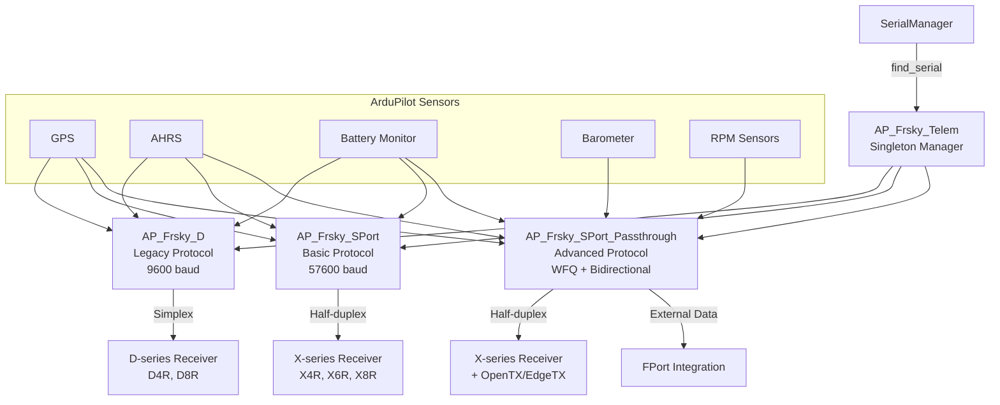
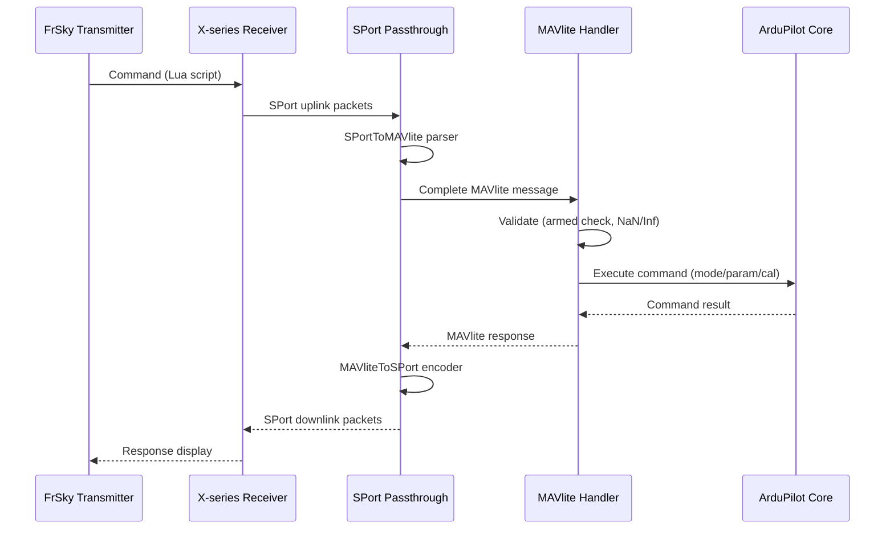
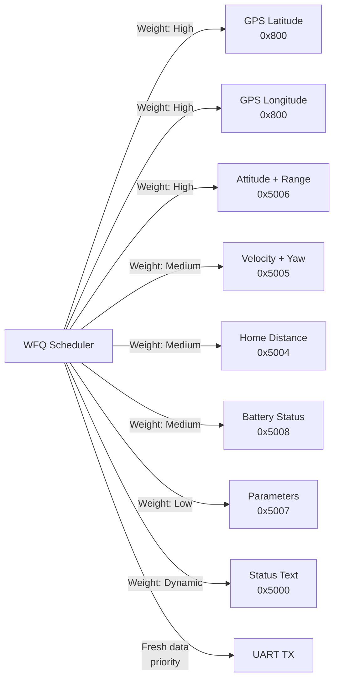

# AP_Frsky_Telem

## Overview

The AP_Frsky_Telem library provides real-time flight telemetry transmission from ArduPilot to FrSky receivers and OpenTX/EdgeTX radio transmitters. This subsystem enables pilots to monitor critical flight parameters (GPS position, altitude, battery status, attitude, flight mode, etc.) directly on their FrSky radio displays, with optional bidirectional communication for parameter adjustments and command execution from the transmitter.

The library supports three FrSky telemetry protocol variants optimized for different receiver generations and use cases, ranging from basic legacy support to advanced integration with OpenTX/EdgeTX telemetry scripts.

## Architecture

### Overall System Architecture



### Bidirectional MAVlite Communication Flow



### WFQ Scheduler Architecture (Passthrough)



## Key Components

### AP_Frsky_Telem
- **Purpose**: Main singleton manager orchestrating FrSky telemetry subsystem
- **Lifecycle**: Lazy initialization on first use, selects backend based on SerialManager configuration
- **Responsibilities**: 
  - Backend selection (D/SPort/Passthrough) based on configured serial protocol
  - External data interface for FPort integration
  - Singleton accessor for global telemetry access

### AP_Frsky_Backend
- **Purpose**: Abstract base class defining common interface and data structures
- **Key Features**:
  - Manages dedicated UART thread (1024 bytes stack, PRIORITY_RCIN, core 1 affinity)
  - Converts ArduPilot sensor state to FrSky telemetry formats
  - Common helper methods for GPS, altitude, battery, and RPM data formatting
- **Data Structure**: sport_packet_t union (8 bytes: sensor + frame + appid + data)

### Protocol Implementations

#### AP_Frsky_D (Legacy Protocol)
- **Target Receivers**: D-series (D4R, D8R)
- **Baud Rate**: 9600
- **Direction**: Simplex (transmit-only)
- **Framing**: START_STOP_D (0x5E) with byte-stuffing (0x5D + XOR 0x60)
- **Scheduling**: Time-based (200ms high-priority, 1000ms low-priority frames)
- **Data Format**: BP/AP pairs (Before Point / After Point for fractional values)

#### AP_Frsky_SPort (Basic Protocol)
- **Target Receivers**: X-series (X4R, X6R, X8R)
- **Baud Rate**: 57600
- **Direction**: Half-duplex poll-response
- **Framing**: 8-byte frames with FRAME_DLE (0x7D) escape and FRAME_XOR (0x20)
- **Scheduling**: Receiver-driven polling with sensor ID responses
- **Features**: External packet injection via sport_telemetry_push()

#### AP_Frsky_SPort_Passthrough (Advanced Protocol)
- **Target**: X-series receivers + OpenTX/EdgeTX radios
- **Extends**: AP_Frsky_SPort + AP_RCTelemetry
- **Key Features**:
  - Weighted Fair Queueing (WFQ) scheduler prioritizing fresh data
  - Rich telemetry set (attitude, home distance, terrain, wind, waypoints, status text)
  - Optional bidirectional support via MAVlite protocol
  - External data mode for FPort integration
  - OpenTX/EdgeTX Lua script compatibility

### Bidirectional Components (Conditional)

Compiled when `HAL_WITH_FRSKY_TELEM_BIDIRECTIONAL` enabled:

#### AP_Frsky_MAVlite_Message
- **Purpose**: Typed accessor wrapper for MAVlite message payload
- **Structure**: msgid (1 byte) + len (1 byte) + payload (up to 31 bytes)
- **Methods**: get/set for float, uint16, uint8, string with bounds checking

#### AP_Frsky_MAVlite_SPortToMAVlite
- **Purpose**: Uplink converter reconstructing MAVlite messages from SPort packet fragments
- **Algorithm**: Stateful parser with sequence number tracking and checksum validation
- **Output**: Complete MAVlite messages for command processing

#### AP_Frsky_MAVlite_MAVliteToSPort
- **Purpose**: Downlink converter fragmenting MAVlite responses into SPort packets
- **Algorithm**: Segments messages across multiple packets with sequence numbers
- **Queue**: ObjectBuffer_TS for thread-safe packet queueing

#### AP_Frsky_MAVliteMsgHandler
- **Purpose**: Transport-agnostic command processor
- **Capabilities**:
  - Parameter read/write (AP_Param integration)
  - Flight mode changes (AP::vehicle()->set_mode)
  - Barometer calibration
  - Geofence enable/disable
  - Autopilot reboot
- **Safety**: Enforces armed state checks, validates NaN/Inf parameters

## Protocol Specifications

### D Protocol Packet Format

```
START_STOP_D (0x5E) + DATA_ID + DATA_LOW + DATA_HIGH
```

**Byte Stuffing**: 
- Escape 0x5E and 0x5D using BYTESTUFF_D (0x5D) followed by (original_byte XOR 0x60)

**Example Sensors**:
- GPS_ALT_BP (0x01) + GPS_ALT_AP (0x09): Altitude in meters (BP = integer, AP = decimal)
- GPS_LAT_BP (0x13) + GPS_LAT_AP (0x1B) + GPS_LAT_NS (0x23): Latitude
- VFAS (0x39): Battery voltage

### SPort Protocol Packet Format

**8-byte frame structure**:
```
START (0x7E) + SENSOR_ID + FRAME_TYPE + APPID_LOW + APPID_HIGH + DATA[4] + CHECKSUM
```

**Byte Stuffing**:
- Escape 0x7E and 0x7D using FRAME_DLE (0x7D) followed by (original_byte XOR 0x20)

**Checksum Calculation**:
- Sum all bytes (excluding START), invert result (final checksum should sum to 0xFF)

**Frame Types**:
- SPORT_DATA_FRAME (0x10): Downlink telemetry data
- SPORT_UPLINK_FRAME (0x30): Uplink command (bidirectional)
- SPORT_UPLINK_FRAME_RW (0x31): Read/write uplink
- SPORT_DOWNLINK_FRAME (0x32): Bidirectional response

**Example Sensors**:
- ALT_ID (0x010F): Barometric altitude (cm)
- VARIO_ID (0x011F): Vertical speed (cm/s)
- GPS_LONG_LATI_FIRST_ID (0x0800): GPS coordinates
- VFAS_ID (0x021F): Battery voltage (0.01V)
- CURR_ID (0x020F): Current (0.1A)

### MAVlite Protocol Fragmentation

**Maximum Payload**: 31 bytes (7 float parameters + command ID + options)

**Packet Calculation**:
```
packets_required = 1 + ceil((payload_len - 2) / 5.0)
```

**First Packet** (6 data bytes):
```
SEQUENCE(0) + LEN + MSGID + PAYLOAD[0..2]
```

**Subsequent Packets** (6 data bytes):
```
SEQUENCE(n) + PAYLOAD[remaining]
```

**Final Packet** (may contain only checksum):
```
SEQUENCE(last) + CHECKSUM
```

**Queue Sizing**: SPORT_PACKET_QUEUE_LENGTH = 210 entries (30 messages × 7 packets/message max)

## Telemetry Data Selection

### Standard Sensors (All Protocols)

| Sensor | Unit | D Protocol | SPort | Passthrough |
|--------|------|-----------|-------|-------------|
| GPS Latitude | degrees | ✓ | ✓ | ✓ |
| GPS Longitude | degrees | ✓ | ✓ | ✓ |
| GPS Altitude | m | ✓ | ✓ | ✓ |
| GPS Speed | m/s | ✓ | ✓ | ✓ |
| GPS Heading | degrees | ✓ | ✓ | ✓ |
| Barometric Altitude | m | ✓ | ✓ | ✓ |
| Vertical Speed | m/s | - | ✓ | ✓ |
| Battery Voltage | V | ✓ | ✓ | ✓ |
| Battery Current | A | ✓ | ✓ | ✓ |
| Battery Capacity Used | mAh | - | ✓ | ✓ |
| Roll Angle | degrees | - | - | ✓ |
| Pitch Angle | degrees | - | - | ✓ |
| Yaw/Heading | degrees | ✓ | ✓ | ✓ |
| RPM Sensors | RPM | - | ✓ | ✓ |
| Fuel Level | % | ✓ | ✓ | - |

### Passthrough Extended Sensors

| Sensor | APP ID | Description | Update Rate |
|--------|--------|-------------|-------------|
| Attitude + Range | 0x5006 | Roll, pitch, rangefinder distance | High |
| Home Distance | 0x5004 | Distance and bearing to home | Medium |
| Velocity + Yaw | 0x5005 | Groundspeed and yaw angle | High |
| AP Status | 0x5001 | Armed, mode, failsafe flags | Medium |
| GPS Status | 0x5002 | Fix type, satellites, HDOP | Medium |
| Battery 1/2 | 0x5008 | Multi-battery support | Medium |
| Parameters | 0x5007 | Frame type, capacities, features | Low |
| RPM | 0x500A | RPM sensors 1 and 2 | Medium |
| Terrain Altitude | 0x500B | Terrain height difference | Low |
| Wind Speed/Dir | 0x500C | Wind vector | Low |
| Waypoint Info | 0x500D | Next waypoint distance/bearing | Medium |
| Status Text | 0x5000 | Flight messages (dynamic, chunked) | Event-driven |

### Passthrough Parameters (0x5007)

| Parameter | Description |
|-----------|-------------|
| FRAME_TYPE | Vehicle type identifier |
| BATT_FS_VOLTAGE | Battery failsafe voltage threshold |
| BATT_FS_CAPACITY | Battery failsafe capacity threshold |
| BATT_CAPACITY_1 | Battery 1 capacity (mAh) |
| BATT_CAPACITY_2 | Battery 2 capacity (mAh) |
| TELEMETRY_FEATURES | Feature flags (bidirectional, scripting) |

**Feature Flags**:
- Bit 0: BIDIR - Bidirectional telemetry available
- Bit 1: SCRIPTING - Lua scripting support available

## Integration with FrSky Transmitters

### OpenTX/EdgeTX Telemetry Scripts

Passthrough protocol is specifically designed for OpenTX/EdgeTX Lua scripts:

**Telemetry Screen Discovery**:
- Sensors auto-discovered based on APP IDs (0x5000-0x500D)
- Custom scripts decode bit-packed data fields
- Real-time display updates on radio screen

**Audio Alerts**:
- Configure voice alerts based on telemetry thresholds
- Battery voltage warnings
- GPS fix loss notifications
- Geofence breach alerts
- Flight mode change announcements

**Lua Scripting Access**:
- getValue("0x5001") - AP status
- getValue("0x5004") - Home distance
- getValue("0x5006") - Attitude
- Custom scripts can process and display any passthrough sensor

### Sensor Discovery and Display

**Automatic Discovery**:
1. Transmitter polls sensor IDs
2. ArduPilot responds with configured sensor ID (default 0x1B for passthrough)
3. Transmitter discovers all APP IDs transmitted by that sensor
4. Telemetry values auto-populate on telemetry screens

**Custom Display Configuration**:
- Assign sensors to telemetry screen slots
- Configure min/max ranges for bar graphs
- Set alert thresholds for audio warnings
- Create custom Lua widgets for advanced displays

## WFQ Scheduling (Passthrough)

### Weighted Fair Queueing Algorithm

The passthrough protocol uses WFQ to prioritize fresh, frequently-changing data over static data:

**Priority Classes**:
- **High Priority** (frequent updates): GPS position, attitude, velocity
- **Medium Priority** (moderate updates): Battery, home distance, status
- **Low Priority** (infrequent updates): Parameters, terrain, wind
- **Dynamic Priority** (event-driven): Status text messages

**Weight Adjustment**:
- Weights dynamically adjusted based on data freshness
- Stale data receives higher weight to ensure eventual transmission
- Fresh data transmitted more frequently
- Queue empty condition triggers immediate transmission

**Packet Type Weights** (approximate, tuned at runtime):
- TEXT: 30 (when message pending)
- GPS_LAT/LON: 550 (high freshness requirement)
- ATTITUDE: 500
- VEL_YAW: 500
- AP_STATUS: 250
- GPS_STATUS: 200
- HOME: 400
- BATT_1/2: 350
- PARAM: 50 (static data)
- TERRAIN/WIND/WAYPOINT: 100-200

## Bidirectional Telemetry (MAVlite)

### Supported Commands

#### Parameter Operations
- **Read Parameter**: Request parameter value by name or index
- **Write Parameter**: Update parameter value with validation
- **Safety**: Parameter writes rejected when vehicle armed
- **Validation**: NaN and Inf values rejected

#### Flight Mode Changes
- **Command**: MAV_CMD_DO_SET_MODE with mode number in param1
- **Execution**: Calls AP::vehicle()->set_mode(mode, ModeReason::FRSKY_COMMAND)
- **Response**: MAV_RESULT_ACCEPTED or error code
- **Safety**: Mode changes may be restricted based on vehicle state

#### Calibration Commands
- **Barometer Calibration**: Zero barometer at current altitude
- **Safety**: Only allowed when disarmed

#### Geofence Control
- **Enable/Disable**: Toggle geofence via MAV_CMD_DO_FENCE_ENABLE
- **Parameter**: param1 = 1 (enable) or 0 (disable)

#### System Commands
- **Reboot**: MAV_CMD_PREFLIGHT_REBOOT
- **Safety**: Requires vehicle disarmed
- **Action**: Triggers hal.scheduler->reboot()

### Safety Enforcement

**Armed State Checks**:
- hal.util->get_soft_armed() checked before executing most commands
- Parameter writes blocked when armed
- Calibration commands blocked when armed
- Mode changes may proceed (vehicle-dependent)

**Parameter Validation**:
- NaN detection using isnan()
- Infinity detection using isinf()
- Invalid values rejected with error response

**Queue Overflow Handling**:
- ObjectBuffer_TS provides thread-safe queueing
- Atomic queue operations prevent partial message transmission
- Returns false if insufficient queue space

## UART Configuration

### Serial Port Setup

FrSky telemetry requires a dedicated serial port configured in SerialManager:

**Protocol Types**:
- **4** = FrSky D (legacy)
- **10** = FrSky SPort/Passthrough

**Example Parameter Configuration**:

For D Protocol on Serial2:
```
SERIAL2_PROTOCOL = 4
SERIAL2_BAUD = 9
```

For SPort on Serial4:
```
SERIAL4_PROTOCOL = 10
SERIAL4_BAUD = 57
```

For Passthrough on Serial3:
```
SERIAL3_PROTOCOL = 10
SERIAL3_BAUD = 57
```

### Baud Rate Parameters

| SERIALn_BAUD Value | Actual Baud Rate | Protocol |
|--------------------|------------------|----------|
| 9 | 9600 | FrSky D |
| 57 | 57600 | FrSky SPort/Passthrough |

**Note**: SPort and Passthrough use the same baud rate (57600); protocol selection is automatic based on capabilities.

### Hardware Connection

**FrSky D**:
- Single-wire UART TX only (simplex)
- Connect autopilot TX to receiver "S.Port" or telemetry input

**FrSky SPort/Passthrough**:
- Single-wire half-duplex UART
- Requires hardware inversion circuit or inverting receiver
- Some flight controllers have built-in inversion (check hardware docs)
- Connect autopilot TX/RX (combined) to receiver "S.Port"

## Configuration Parameters

### AP_Frsky_Parameters

| Parameter | Type | Default | Description |
|-----------|------|---------|-------------|
| FRSKY_DNLINK_ID | Int8 | 0x1B | Downlink sensor ID for primary telemetry stream |
| FRSKY_UPLINK_ID | Int8 | 0x0D | Uplink sensor ID for receiving commands (bidirectional only) |
| FRSKY_DNLINK1_ID | Int8 | 0x34 | First additional downlink sensor ID (bidirectional only) |
| FRSKY_DNLINK2_ID | Int8 | 0x67 | Second additional downlink sensor ID (bidirectional only) |
| FRSKY_OPTIONS | Int8 | 0 | Feature flags bitmask |

### FRSKY_OPTIONS Bitmask

| Bit | Value | Description |
|-----|-------|-------------|
| 0 | 1 | EnableAirspeedAndGroundspeed: Alternate between airspeed (0x5005) and groundspeed |

### Sensor ID Selection

**Default IDs**:
- Downlink: 0x1B (decimal 27)
- Uplink: 0x0D (decimal 13)

**Custom IDs**:
- Valid range: 0x00 to 0xC6 (0-198 decimal)
- Must not conflict with other FrSky sensors on same receiver
- Physical ID calculation: logical_id = (physical_id * 2) + (physical_id / 10)

## Usage Patterns

### Basic Setup

**Minimum Configuration**:
1. Connect FrSky receiver telemetry port to autopilot UART
2. Configure serial port: `SERIALn_PROTOCOL = 10` (SPort/Passthrough)
3. Set baud rate: `SERIALn_BAUD = 57`
4. Reboot autopilot
5. Telemetry should auto-start and be discoverable on transmitter

**Verification**:
- Check transmitter telemetry discovery
- Verify GPS coordinates updating
- Confirm battery voltage display
- Test flight mode display

### External Data Mode (FPort Integration)

Passthrough can export telemetry data for external transport (e.g., FPort):

```cpp
// Initialize with external data mode
AP_Frsky_Telem frsky;
frsky.init(true);  // use_external_data = true

// Retrieve telemetry packets for external transmission
AP_Frsky_Backend::sport_packet_t packet_array[10];
uint8_t packet_count = 10;
if (AP_Frsky_Telem::get_telem_data(packet_array, packet_count, 10)) {
    // Forward packets to FPort or other transport
    for (uint8_t i = 0; i < packet_count; i++) {
        fport_send(packet_array[i].raw, 8);
    }
}
```

### Custom Telemetry Injection

External modules can inject custom telemetry into the SPort stream:

```cpp
// Get SPort singleton
AP_Frsky_SPort *sport = AP::frsky_sport();
if (sport != nullptr) {
    // Inject custom telemetry packet
    // sensor_id: 0x1B, frame: 0x10, appid: 0x5100 (custom), data: 12345
    sport->sport_telemetry_push(0x1B, 0x10, 0x5100, 12345);
}
```

**Thread Safety**: sport_telemetry_push() uses semaphore for thread-safe operation.

**Limitation**: Only one packet buffered; subsequent calls overwrite if not yet transmitted.

### Bidirectional Command Example

From OpenTX/EdgeTX Lua script:

```lua
-- Read parameter (e.g., WPNAV_SPEED)
local param_value = frsky.getParameter("WPNAV_SPEED")

-- Set parameter
frsky.setParameter("WPNAV_SPEED", 500)

-- Change flight mode to Auto (mode 3 for Copter)
frsky.setFlightMode(3)

-- Enable geofence
frsky.enableFence(true)
```

**Note**: Actual Lua API depends on OpenTX/EdgeTX telemetry script implementation.

## Testing

### SITL Configuration

Test FrSky telemetry in Software-In-The-Loop simulation:

```bash
# Launch SITL with FrSky SPort on TCP port
sim_vehicle.py -v ArduCopter --console --map

# In MAVProxy, configure FrSky telemetry
param set SERIAL2_PROTOCOL 10
param set SERIAL2_BAUD 57

# Restart to apply
reboot
```

**Telemetry Output**:
- SPort telemetry will be transmitted on configured serial port
- Use logic analyzer or serial monitor to verify packet format
- Can connect physical FrSky receiver to UART pins for full integration test

### Telemetry Verification

**Check Telemetry Stream**:
1. Connect serial monitor or logic analyzer to UART TX
2. Set baud rate: 57600 for SPort, 9600 for D protocol
3. Verify frames start with 0x7E (SPort) or 0x5E (D protocol)
4. Decode packets to verify sensor IDs and data

**Expected Packet Rate**:
- SPort: Approximately 12-15ms between packets (driven by WFQ scheduler)
- D Protocol: 200ms for high-priority, 1000ms for low-priority

**GPS Coordinate Verification**:
- Compare telemetry GPS position with actual SITL location
- Verify latitude/longitude format: DDDMM.MMMM with N/S/E/W indicator
- Check altitude values match barometric and GPS altitude

### Log Analysis for Debugging

**Enable Logging**:
```bash
# Check if logging enabled
param show LOG_BACKEND_TYPE

# Enable dataflash logging if needed
param set LOG_BACKEND_TYPE 1
```

**Relevant Log Messages**:
- **RFND**: Rangefinder data (used in passthrough attitude sensor)
- **GPS**: GPS position, altitude, speed (telemetry source)
- **BAT**: Battery voltage, current, capacity (telemetry source)
- **ATT**: Attitude (roll, pitch, yaw for passthrough)
- **POS**: Position estimates (navigation altitude)

**Log Replay**:
```bash
# Replay log to verify telemetry calculations
Tools/Replay/Replay logs/flight.BIN
```

**Debugging Checklist**:
1. Verify serial port configured correctly (protocol and baud)
2. Check backend selected properly (D vs SPort vs Passthrough)
3. Verify sensor reads successful (GPS fix, battery monitor detected)
4. Check thread creation successful (1024 byte stack available)
5. Monitor UART TX buffer for overflow

### Common Troubleshooting

| Issue | Possible Cause | Solution |
|-------|---------------|----------|
| No telemetry on transmitter | Wrong serial protocol | Set SERIALn_PROTOCOL = 4 or 10 |
| | Wrong baud rate | Set SERIALn_BAUD = 9 (D) or 57 (SPort) |
| | Hardware connection | Verify TX connected to receiver S.Port |
| | Inverted signal | Check if hardware inversion needed |
| Telemetry intermittent | UART buffer overflow | Check CPU load, reduce telemetry rate |
| | Thread stack overflow | Monitor thread usage (unlikely with 1024 bytes) |
| GPS not updating | No GPS fix | Verify GPS module connected and acquiring fix |
| | Wrong coordinate format | Check for proper DDDMM.MMMM encoding |
| Battery shows zero | Battery monitor not configured | Set BATT_MONITOR parameter |
| | No current sensor | Voltage-only telemetry normal |
| Bidirectional not working | Feature not compiled | Check HAL_WITH_FRSKY_TELEM_BIDIRECTIONAL |
| | Wrong sensor IDs | Verify FRSKY_UPLINK_ID matches transmitter |
| | Armed state | Commands rejected when armed (by design) |
| Status text garbled | Encoding issue | Verify 7-bit ASCII text |
| | Message too long | Limit to reasonable length (chunked transmission) |

### FrSky Radio Testing

**Sensor Discovery**:
1. Power on transmitter
2. Navigate to telemetry discovery screen
3. Power on model with ArduPilot
4. Wait for sensor auto-discovery (0x1B for passthrough)
5. Verify all expected APP IDs discovered (0x5000-0x500D)

**Telemetry Display**:
1. Configure telemetry screen with desired sensors
2. Verify real-time updates
3. Test audio alerts by triggering threshold conditions
4. Verify Lua scripts can access sensor data

**Bidirectional Testing**:
1. Install OpenTX/EdgeTX telemetry script with bidirectional support
2. Verify parameter read functionality
3. Test parameter write (ensure vehicle disarmed)
4. Test mode change command
5. Verify safety enforcement (commands blocked when armed)

## Safety Considerations

### Thread Safety

**Dedicated Telemetry Thread**:
- **Priority**: PRIORITY_RCIN (high priority for real-time response)
- **Core Affinity**: Core 1 (dedicated to telemetry processing)
- **Stack Size**: 1024 bytes (sufficient for protocol processing)
- **Isolation**: Runs independently from main flight control loop

**Concurrency Management**:
- HAL_Semaphore used for sport_telemetry_push() external injection
- ObjectBuffer_TS provides thread-safe queue operations for bidirectional
- WITH_SEMAPHORE pattern ensures atomic access to shared data

**Sensor Access**:
- All sensor reads (GPS, AHRS, battery, etc.) use thread-safe singleton accessors
- No direct manipulation of flight control state
- Read-only access to sensor data (except for commands via MAVlite handler)

### Armed State Restrictions

**Command Execution Safety**:
- **Parameter Writes**: BLOCKED when armed
  - Prevents in-flight parameter changes that could affect stability
  - hal.util->get_soft_armed() checked before execution
- **Calibration Commands**: BLOCKED when armed
  - Barometer calibration only allowed when disarmed
- **Mode Changes**: MAY PROCEED (vehicle-dependent)
  - Flight mode changes typically allowed in-flight
  - Vehicle code enforces mode transition safety
- **Geofence Control**: MAY PROCEED
  - Operator can enable/disable fence as needed

**Rationale**:
- Protects against accidental parameter modifications during flight
- Ensures calibration commands only run in safe conditions
- Allows essential operational commands (mode changes, fence) in-flight

### Parameter Validation

**Input Validation**:
```cpp
// NaN detection
if (isnan(param_value)) {
    return MAV_RESULT_FAILED;
}

// Infinity detection
if (isinf(param_value)) {
    return MAV_RESULT_FAILED;
}
```

**Validation Steps**:
1. Check for NaN (Not a Number) values
2. Check for Infinity values
3. Verify parameter exists (AP_Param::find)
4. Check armed state for write operations
5. Apply parameter type-specific validation

**Error Responses**:
- Invalid values return MAV_RESULT_FAILED
- AP_Param validation errors returned to transmitter
- Prevents corruption of flight parameters

### Queue Overflow Handling

**Bidirectional Queues**:
- **RX Queue**: SPORT_PACKET_QUEUE_LENGTH (210 entries)
- **TX Queue**: SPORT_PACKET_QUEUE_LENGTH (210 entries)
- **Capacity**: 30 max-length messages (7 packets each)

**Overflow Behavior**:
- ObjectBuffer_TS.push() returns false if queue full
- MAVliteToSPort.process() returns false on insufficient space
- Atomic operations: all packets for a message enqueued or none
- No partial message transmission

**Prevention**:
- Queue sized for worst-case message fragmentation
- TX queue processed rapidly by dedicated thread
- RX queue processed with priority to prevent backlog

### Timing Constraints

**UART Timing**:
- **SPort**: Receiver poll timeout ~3ms, must respond promptly
- **Thread Loop**: ~200ms nominal update rate
- **WFQ Scheduler**: Dynamic priority ensures fresh data transmission

**Constraint Enforcement**:
```cpp
// Check timing constraint before transmission
if (!_port->receive_time_constraint_us(micros64)) {
    return;  // Skip transmission if timing violated
}

// Check TX buffer space (worst-case byte stuffing)
if (_port->txspace() < 19) {
    return;  // Insufficient buffer space
}
```

**Stack Considerations**:
- 1024 byte thread stack sufficient for protocol processing
- No recursive function calls in telemetry thread
- Minimal local variable usage in hot paths

## Implementation Notes

### Singleton Pattern Lifecycle

**Creation**:
1. AP_Frsky_Telem constructor sets singleton pointer
2. init() called explicitly (lazy initialization)
3. Backend allocated with NEW_NOTHROW (graceful failure on OOM)

**Backend Selection Algorithm**:
```cpp
// Based on SerialManager configuration
AP_HAL::UARTDriver *port = serialmanager.find_serial(AP_SerialManager::SerialProtocol_FrSky_*);

if (protocol == SerialProtocol_FrSky_D) {
    _backend = NEW_NOTHROW AP_Frsky_D(port);
} else if (protocol == SerialProtocol_FrSky_SPort) {
    _backend = NEW_NOTHROW AP_Frsky_SPort(port);
} else if (protocol == SerialProtocol_FrSky_SPort_Passthrough) {
    _backend = NEW_NOTHROW AP_Frsky_SPort_Passthrough(port, use_external_data, &_frsky_parameters);
}
```

**Access Pattern**:
```cpp
// Global accessor
AP_Frsky_Telem *frsky = AP::frsky_telem();

// Null check required
if (frsky != nullptr) {
    frsky->queue_message(MAV_SEVERITY_INFO, "Status text");
}
```

**Destruction**:
- Destructor deletes backend pointer
- Backend destructor stops thread and releases UART
- Automatic cleanup on system shutdown

### Memory Allocation

**Heap Allocation**:
- Backend: NEW_NOTHROW (typically 100-500 bytes depending on variant)
- Parameters: AP_Frsky_Parameters object (dozens of bytes)
- Queues: ObjectBuffer_TS (210 × 8 bytes = 1680 bytes per queue, bidirectional only)

**Graceful Failure**:
```cpp
_backend = NEW_NOTHROW AP_Frsky_SPort_Passthrough(...);
if (_backend == nullptr) {
    return false;  // init() fails gracefully
}
```

**Memory Regions**:
- Main RAM allocation (no DSP_MEM_REGION or other specialized regions)
- Stack: 1024 bytes per telemetry thread (from heap via thread_create)

### Conditional Compilation

**Feature Flags** (AP_Frsky_config.h):

```cpp
// Base feature flag
#ifndef AP_FRSKY_TELEM_ENABLED
#define AP_FRSKY_TELEM_ENABLED 1
#endif

// Protocol-specific flags
#ifndef AP_FRSKY_D_TELEM_ENABLED
#define AP_FRSKY_D_TELEM_ENABLED AP_FRSKY_TELEM_ENABLED
#endif

#ifndef AP_FRSKY_SPORT_TELEM_ENABLED
#define AP_FRSKY_SPORT_TELEM_ENABLED AP_FRSKY_TELEM_ENABLED
#endif

#ifndef AP_FRSKY_SPORT_PASSTHROUGH_ENABLED
#define AP_FRSKY_SPORT_PASSTHROUGH_ENABLED AP_FRSKY_SPORT_TELEM_ENABLED
#endif

// Bidirectional feature
#ifndef HAL_WITH_FRSKY_TELEM_BIDIRECTIONAL
#define HAL_WITH_FRSKY_TELEM_BIDIRECTIONAL AP_FRSKY_SPORT_PASSTHROUGH_ENABLED
#endif
```

**Dependency Chain**:
- D and SPort protocols depend on AP_FRSKY_TELEM_ENABLED
- Passthrough depends on AP_FRSKY_SPORT_TELEM_ENABLED
- Bidirectional depends on AP_FRSKY_SPORT_PASSTHROUGH_ENABLED

**Binary Size Impact**:
- Disabling D protocol: ~5-10KB savings
- Disabling SPort: ~10-15KB savings
- Disabling bidirectional: ~15-20KB savings (MAVlite converters and handler)
- Disabling all FrSky: ~30-40KB total savings

**Board-Specific Overrides**:
- Memory-constrained boards can disable features in hwdef or build configuration
- Example: Disable bidirectional on boards with limited flash

### Data Format Encoding

**Coordinate Format** (DDDMM.MMMM):
```cpp
// Decimal degrees: -33.8688
// Formatted: 3352.1280 S

uint32_t format_gps(float dec) {
    uint32_t deg = abs(dec);
    uint32_t min = (abs(dec) - deg) * 60;
    uint32_t frac = ((abs(dec) - deg) * 60 - min) * 10000;
    return (deg * 100 + min) * 10000 + frac;
}
```

**Bit-Packed Fields** (Passthrough):
- Attitude sensor packs roll (int16), pitch (int16), range (uint16) into 32 bits
- GPS status packs fix type, satellite count, HDOP into 32 bits
- Efficient encoding maximizes data transmitted per packet

**Endianness**:
- Little-endian byte order for multi-byte fields (uint16_t, uint32_t, float)
- Matches ARM processor native byte order
- Automatic handling by typed accessors in AP_Frsky_MAVlite_Message

### Error Handling

**Serial Port Errors**:
- find_serial() returns nullptr if no configured port
- init() fails gracefully and returns false
- Backend remains nullptr, calls safely no-op

**Thread Creation Failure**:
- hal.scheduler->thread_create() failure handled
- init_serial_port() returns false
- Telemetry disabled but system continues

**Queue Full Conditions**:
- Bidirectional TX queue full: command response dropped
- Bidirectional RX queue full: uplink packet dropped
- External data queue full: telemetry packet dropped
- All failures return false to caller

**Sensor Unavailable**:
- GPS not available: GPS fields report zero/invalid
- Battery monitor not configured: battery fields report zero
- Rangefinder not available: range field reports zero
- Graceful degradation: remaining telemetry continues

## References

### Source Files

| File | Purpose |
|------|---------|
| AP_Frsky_Telem.h/cpp | Main singleton manager and backend selection |
| AP_Frsky_Backend.h/cpp | Abstract base class, common data structures and helpers |
| AP_Frsky_D.h/cpp | FrSky D protocol implementation (9600 baud, simplex) |
| AP_Frsky_SPort.h/cpp | FrSky SPort protocol implementation (57600 baud, half-duplex) |
| AP_Frsky_SPort_Passthrough.h/cpp | Advanced passthrough with WFQ and bidirectional |
| AP_Frsky_SPortParser.h | Low-level byte-stream parser and de-stuffer |
| AP_Frsky_MAVlite.h | MAVlite protocol constants and macros |
| AP_Frsky_MAVlite_Message.h/cpp | MAVlite message structure with typed accessors |
| AP_Frsky_MAVlite_SPortToMAVlite.h/cpp | Uplink converter (SPort → MAVlite) |
| AP_Frsky_MAVlite_MAVliteToSPort.h/cpp | Downlink converter (MAVlite → SPort) |
| AP_Frsky_MAVliteMsgHandler.h/cpp | Command processor for bidirectional telemetry |
| AP_Frsky_Parameters.h/cpp | Configuration parameter management |
| AP_Frsky_config.h | Compile-time feature flag configuration |

### Related ArduPilot Modules

| Module | Relationship |
|--------|-------------|
| AP_RCTelemetry | Base class providing WFQ scheduler for passthrough |
| AP_SerialManager | Serial port configuration and discovery |
| GCS_MAVLink | Similar telemetry system for MAVLink protocol |
| AP::ahrs() | Attitude and heading data source |
| AP::gps() | GPS position and velocity data source |
| AP::battery() | Battery voltage, current, capacity data source |
| AP::baro() | Barometric altitude data source |
| AP_Param | Parameter storage and management (bidirectional access) |
| AP::vehicle() | Vehicle control interface (mode changes) |

### External Documentation

**FrSky Protocol Specifications**:
- FrSky D Protocol: [FrSky Documentation](https://www.frsky-rc.com)
- FrSky SPort Protocol: Sensor Hub Protocol (search FrSky developer documentation)
- Sensor ID specifications: FrSky Sensor ID document

**OpenTX/EdgeTX Resources**:
- OpenTX User Manual: [https://www.open-tx.org/](https://www.open-tx.org/)
- EdgeTX Documentation: [https://edgetx.org/](https://edgetx.org/)
- Lua Scripting API: OpenTX/EdgeTX Lua reference
- ArduPilot Passthrough Scripts: [GitHub ArduPilot/OpenTX-PassthroughScripts](https://github.com/yaapu/FrskyTelemetryScript)

**ArduPilot Wiki**:
- Common FrSky Telemetry: [https://ardupilot.org/copter/docs/common-frsky-telemetry.html](https://ardupilot.org/copter/docs/common-frsky-telemetry.html)
- FrSky Passthrough: [https://ardupilot.org/copter/docs/common-frsky-passthrough.html](https://ardupilot.org/copter/docs/common-frsky-passthrough.html)
- FrSky Telemetry Setup: Wiki configuration guides

**Development Resources**:
- ArduPilot Contribution Guide: [https://ardupilot.org/dev/](https://ardupilot.org/dev/)
- Telemetry Protocol Development: Developer forum discussions
- FrSky Hardware Documentation: Receiver datasheets

---

## Quick Start Guide

### 1. Hardware Connection
- Connect FrSky receiver S.Port to autopilot UART TX (and RX for bidirectional)
- Verify signal inversion if required by hardware

### 2. Parameter Configuration
```
SERIAL2_PROTOCOL = 10    # FrSky SPort/Passthrough
SERIAL2_BAUD = 57        # 57600 baud
FRSKY_DNLINK_ID = 27     # Default sensor ID (0x1B)
FRSKY_OPTIONS = 0        # Default options
```

### 3. Verify Telemetry
- Power on autopilot
- Access transmitter telemetry discovery
- Verify sensors discovered (0x1B)
- Check GPS, battery, altitude updating

### 4. Configure Display
- Assign sensors to telemetry screens
- Set up audio alerts
- Install OpenTX/EdgeTX Lua scripts (optional)

### 5. Test Bidirectional (Optional)
- Ensure HAL_WITH_FRSKY_TELEM_BIDIRECTIONAL compiled
- Configure FRSKY_UPLINK_ID = 13
- Test parameter read from transmitter
- Verify safety enforcement (armed state)

---

**For questions, issues, or contributions**, refer to ArduPilot forums, GitHub issues, or developer Discord channel.
```

