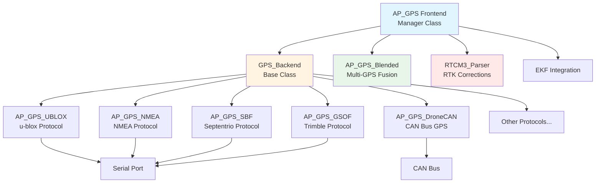
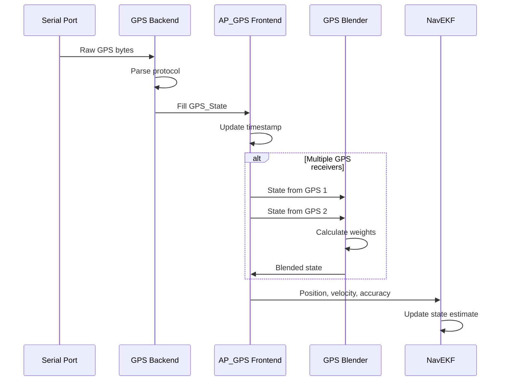
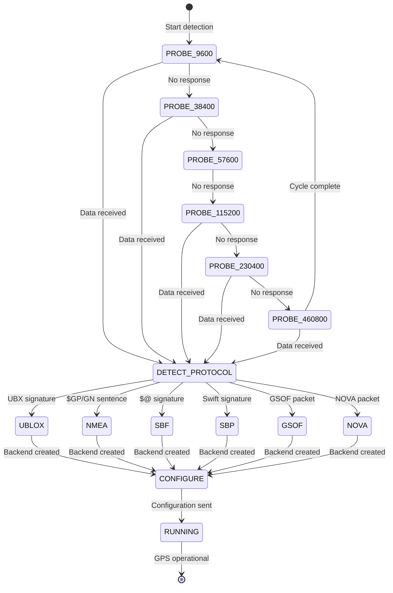
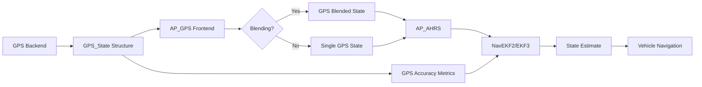

# AP_GPS - ArduPilot GPS Subsystem

## Overview

The AP_GPS library provides comprehensive GPS (Global Navigation Satellite System) support for ArduPilot autopilots. It implements a flexible frontend-backend architecture that supports multiple GPS receivers simultaneously, automatic protocol detection, GPS blending for improved accuracy, and Real-Time Kinematic (RTK) positioning for centimeter-level precision. The GPS subsystem interfaces with the Extended Kalman Filter (EKF) to provide accurate position, velocity, and timing information critical for autonomous navigation.

The library supports over a dozen GPS protocols including u-blox UBX, NMEA, Septentrio SBF, Trimble GSOF, Swift SBP, and DroneCAN, with automatic baud rate detection and configuration. Advanced features include GPS blending from multiple receivers using inverse-variance weighting, RTK support for both rover and base station modes, moving baseline RTK for GPS-based heading, and comprehensive accuracy metrics.

## Architecture

### Frontend-Backend Design

The AP_GPS library uses a frontend-backend architecture pattern that separates GPS protocol management (frontend) from protocol-specific parsing logic (backends):



**Frontend (AP_GPS class):**
- Manages up to GPS_MAX_RECEIVERS (typically 2) GPS instances
- Performs automatic protocol detection and baud rate probing
- Implements GPS blending algorithm for multi-receiver systems
- Handles receiver switching and failover logic
- Provides unified interface to EKF and vehicle code
- Manages RTCM3 correction data injection for RTK
- Singleton pattern for global access via `AP::gps()`

**Backend (GPS_Backend base class):**
- Abstract base class for protocol-specific implementations
- Pure virtual `read()` method for parsing GPS data
- Standardized interface for filling `GPS_State` structure
- Protocol-specific configuration and health monitoring
- RTCM injection support for RTK-capable receivers

### Component Relationships

The GPS subsystem integrates with several ArduPilot components:

- **AP_HAL::UARTDriver**: Serial communication with GPS receivers
- **AP_AHRS/EKF**: Primary consumer of GPS position, velocity, and accuracy data
- **GCS_MAVLink**: Streams GPS data to ground stations, handles RTCM injection
- **AP_Logger**: Records GPS data for post-flight analysis
- **AP_Arming**: Pre-arm checks for GPS fix quality
- **AP_CANManager/AP_DroneCAN**: CAN bus GPS communication

### Data Flow



## Supported GPS Protocols

The AP_GPS library supports a wide variety of GPS protocols and receivers, each implemented as a backend driver.

### u-blox UBX Protocol (Most Common)

**Implementation**: `AP_GPS_UBLOX`

u-blox GPS receivers are the most widely used in ArduPilot systems, offering excellent performance and RTK capability.

**Supported Models:**
- **M8 series** (NEO-M8N, NEO-M8P, ZED-F9P predecessor): Standard and RTK variants
- **F9 series** (ZED-F9P, ZED-F9R): Multi-band GNSS, RTK with moving baseline support
- **M10 series**: Latest generation with improved sensitivity

**Key Features:**
- Binary UBX protocol for efficient communication
- Auto-configuration with optimal message rates
- RTK rover and base station modes (M8P, F9P)
- Moving baseline RTK for dual GPS heading (F9P)
- Multi-GNSS support (GPS, GLONASS, Galileo, BeiDou)
- Configurable update rates (up to 10Hz for M8, 25Hz for F9)
- Comprehensive accuracy reporting (HDOP, position accuracy, velocity accuracy)

**Configuration:** Set `GPS_TYPE = 2` (Auto-detected) or `GPS_TYPE = 1` (Auto)

**Baud Rates:** 115200, 230400, 460800 bps (auto-detected and configured)

Source: `libraries/AP_GPS/AP_GPS_UBLOX.h`, `libraries/AP_GPS/AP_GPS_UBLOX.cpp`

### NMEA 0183 Protocol

**Implementation**: `AP_GPS_NMEA`

NMEA 0183 is a universal ASCII-based GPS protocol supported by virtually all GPS receivers. While less efficient than binary protocols, it provides broad compatibility.

**Supported Sentences:**
- **GGA**: Global Positioning System Fix Data
- **RMC**: Recommended Minimum Navigation Information
- **GNS**: GNSS Fix Data
- **VTG**: Track Made Good and Ground Speed
- **HDT**: Heading True
- **GLL**: Geographic Position - Latitude/Longitude

**Variants Supported:**
- **Standard NMEA**: Basic GPS receivers
- **Hemisphere NMEA** (`GPS_TYPE = 16`): Hemisphere GNSS receivers
- **AllyStar NMEA** (`GPS_TYPE = 20`): AllyStar receivers
- **Unicore NMEA** (`GPS_TYPE = 24`): Unicore receivers
- **Unicore Moving Base** (`GPS_TYPE = 25`): Dual-antenna heading

**Configuration:** Set `GPS_TYPE = 5`

**Typical Baud Rate:** 4800, 9600, 38400, 115200 bps

Source: `libraries/AP_GPS/AP_GPS_NMEA.cpp`

### Septentrio SBF Protocol

**Implementation**: `AP_GPS_SBF`

Septentrio receivers provide high-precision positioning with proprietary SBF (Septentrio Binary Format) protocol.

**Key Features:**
- Professional-grade accuracy and reliability
- Dual-antenna support for precise heading (`GPS_TYPE = 26`)
- Advanced multipath mitigation
- Raw measurement output for post-processing
- GNSS+ augmentation support

**Configuration:**
- Single antenna: `GPS_TYPE = 10`
- Dual antenna: `GPS_TYPE = 26`

Source: `libraries/AP_GPS/AP_GPS_SBF.cpp`

### Trimble GSOF Protocol

**Implementation**: `AP_GPS_GSOF`

Trimble's General Serial Output Format (GSOF) is used in professional surveying receivers.

**Key Features:**
- Surveying-grade accuracy
- Binary protocol optimized for high precision
- Compatible with Trimble BD9xx series and similar receivers

**Configuration:** Set `GPS_TYPE = 11`

Source: `libraries/AP_GPS/AP_GPS_GSOF.cpp`

### Swift Navigation SBP/SBP2 Protocols

**Implementation**: `AP_GPS_SBP`, `AP_GPS_SBP2`

Swift Navigation Piksi receivers use the Swift Binary Protocol for RTK positioning.

**Key Features:**
- Open-source RTK solution
- Low-cost centimeter-precision
- SBP (legacy) and SBP2 (current) protocol versions

**Configuration:**
- SBP: `GPS_TYPE = 8`
- SBP2: Auto-detected with modern Piksi firmware

Source: `libraries/AP_GPS/AP_GPS_SBP.cpp`, `libraries/AP_GPS/AP_GPS_SBP2.cpp`

### Novatel/Tersus/ComNav NOVA Protocol

**Implementation**: `AP_GPS_NOVA`

Binary protocol for Novatel, Tersus, and ComNav GNSS receivers.

**Key Features:**
- High-precision RTK receivers
- Binary protocol for efficient communication
- Multi-GNSS support

**Configuration:** Set `GPS_TYPE = 15`

Source: `libraries/AP_GPS/AP_GPS_NOVA.cpp`

### Emlid Reach ERB Protocol

**Implementation**: `AP_GPS_ERB`

Emlid Reach RTK receivers use the ERB (Emlid Reach Binary) protocol.

**Key Features:**
- Affordable RTK solution
- ReachView configuration via web interface
- Position streaming via ERB protocol

**Configuration:** Set `GPS_TYPE = 13`

Source: `libraries/AP_GPS/AP_GPS_ERB.cpp`

### DroneCAN/UAVCAN GPS

**Implementation**: `AP_GPS_DroneCAN`

GPS receivers connected via CAN bus using DroneCAN (UAVCAN v0/v1) protocol.

**Key Features:**
- Reliable CAN bus communication
- Integrated GPS+compass modules
- Reduced wiring complexity
- Support for multiple CAN GPS nodes
- RTK capable (DroneCAN RTK variants)

**Configuration:**
- Standard: `GPS_TYPE = 9`
- RTK Base: `GPS_TYPE = 22`
- RTK Rover: `GPS_TYPE = 23`

**Hardware:** Here3/Here4 CAN GPS, Zubax GNSS, Holybro DroneCAN GPS

Source: `libraries/AP_GPS/AP_GPS_DroneCAN.cpp`

### MAVLink GPS Injection

**Implementation**: `AP_GPS_MAV`

Receive GPS data via MAVLink protocol from companion computer or external system.

**Use Cases:**
- GPS forwarding from companion computer
- Integration with external navigation systems
- Simulation and testing

**Configuration:** Set `GPS_TYPE = 14`

**MAVLink Messages:**
- `GPS_INPUT`: Inject GPS position/velocity
- `GPS_RTCM_DATA`: Inject RTCM corrections

Source: `libraries/AP_GPS/AP_GPS_MAV.cpp`

### MSP GPS

**Implementation**: `AP_GPS_MSP`

GPS data received via MultiWii Serial Protocol (MSP), commonly used with flight controller integrations.

**Configuration:** Set `GPS_TYPE = 19`

**Use Case:** Integration with MSP-based systems (DJI FPV, etc.)

Source: `libraries/AP_GPS/AP_GPS_MSP.cpp`

### External AHRS GPS

**Implementation**: `AP_GPS_ExternalAHRS`

GPS data from external AHRS systems (VectorNav, MicroStrain, etc.).

**Configuration:** Set `GPS_TYPE = 21`

**Integration:** Used with AP_ExternalAHRS for systems providing combined GPS+IMU data

Source: `libraries/AP_GPS/AP_GPS_ExternalAHRS.cpp`

### SITL (Software In The Loop)

**Implementation**: `AP_GPS_SITL`

Simulated GPS for software-in-the-loop testing.

**Features:**
- Configurable accuracy and noise
- GPS failure simulation
- Multi-GPS simulation
- RTK simulation

**Configuration:** Automatically used in SITL, or set `GPS_TYPE = 100`

Source: `libraries/AP_GPS/AP_GPS_SITL.cpp`

## GPS Driver Detection and Auto-Configuration

The GPS subsystem implements sophisticated automatic detection to identify connected GPS receivers and configure them optimally.

### Auto-Detection Process

When `GPS_TYPE = 1` (AUTO), the system probes for GPS receivers:



### Baud Rate Probing

The detection algorithm probes the following baud rates in sequence:
- 9600 bps (NMEA default)
- 38400 bps
- 57600 bps
- 115200 bps (u-blox common)
- 230400 bps (u-blox high-speed)
- 460800 bps (u-blox maximum)

**Detection Window:** Each baud rate is tested for approximately 1.2 seconds before moving to the next rate.

### Protocol Detection Signatures

Each protocol has characteristic byte patterns or message formats:

| Protocol | Detection Signature | Detection Method |
|----------|---------------------|------------------|
| u-blox UBX | `0xB5 0x62` (sync chars) | Binary message header |
| NMEA | `$GP`, `$GN`, `$GL` | ASCII sentence start |
| SBF | `$@` or `0x24 0x40` | Septentrio sync bytes |
| GSOF | Trimble packet structure | Binary packet format |
| Swift SBP | `0x55` + message ID | Swift sync byte |
| NOVA | Novatel packet format | Binary packet structure |

### Backend Instantiation

Once a protocol is detected:

1. **Backend Creation**: Appropriate `GPS_Backend` subclass instantiated
2. **Configuration**: Backend sends optimal configuration to GPS
3. **State Update**: `GPS_State` structure populated from parsed data
4. **Health Monitoring**: Backend monitors connection and data quality

### Auto-Configuration

After detection, backends configure GPS receivers for optimal ArduPilot operation:

**u-blox Configuration:**
- Enable required UBX messages (NAV-PVT, NAV-STATUS, NAV-DOP, etc.)
- Set update rate based on `GPS_RATE_MS` parameter
- Configure GNSS constellations based on `GPS_GNSS_MODE`
- Set navigation mode (e.g., `GPS_ENGINE_AIRBORNE_4G`)
- Configure baud rate to 230400 bps if possible

**NMEA Configuration:**
- Minimal configuration (NMEA is read-only for most receivers)
- Parse standard sentences
- Estimate update rate from sentence timing

Source: `libraries/AP_GPS/AP_GPS.cpp:700-950` (detection state machine)

## RTK (Real-Time Kinematic) Support

RTK provides centimeter-level positioning accuracy by using carrier-phase measurements and correction data from a nearby base station.

### RTK Overview

**Accuracy Levels:**
- **Single/Standalone GPS**: 1-5 meter horizontal accuracy
- **DGPS (Differential GPS)**: 0.5-2 meter accuracy
- **RTK Float**: 10-50 cm accuracy (ambiguities not resolved)
- **RTK Fixed**: 1-5 cm horizontal accuracy (ambiguities resolved)

**RTK Fix Types** (from `GPS_Status` enum):
- `GPS_OK_FIX_3D` (3): Standard 3D fix
- `GPS_OK_FIX_3D_DGPS` (4): Differential corrections applied
- `GPS_OK_FIX_3D_RTK_FLOAT` (5): RTK with floating ambiguities
- `GPS_OK_FIX_3D_RTK_FIXED` (6): RTK with fixed ambiguities (best accuracy)

### RTK Roles

**Base Station Mode:**
- Fixed at known surveyed position
- Generates RTCM3 correction messages
- Broadcasts corrections to rover(s)
- Configuration: `GPS_TYPE = 17` (u-blox) or `GPS_TYPE = 22` (DroneCAN)

**Rover Mode:**
- Mobile receiver consuming corrections
- Computes precise position relative to base
- Requires corrections within ~10-20 km of base for best results
- Configuration: `GPS_TYPE = 18` (u-blox) or `GPS_TYPE = 23` (DroneCAN)

### RTCM3 Correction Injection

ArduPilot supports multiple methods for receiving RTCM3 corrections:

**1. MAVLink GPS_RTCM_DATA Messages:**
```
Ground Station → Telemetry Link → ArduPilot → GPS Receiver
```
Most common method using Mission Planner, QGroundControl, or MAVProxy to forward NTRIP corrections.

**2. Direct Serial Connection:**
```
Base Station GPS → Serial Cable → Rover GPS
```
Direct UART connection between base and rover GPS modules.

**3. Radio Telemetry:**
```
Base Station → Radio → Rover → GPS
```
Wireless link (e.g., SiK radio) carrying RTCM data.

**4. DroneCAN:**
```
Base GPS (CAN) → CAN Bus → Rover GPS (CAN)
```
Corrections distributed via CAN bus in DroneCAN RTK system.

**RTCM Message Support:**
- **RTCM3.2/3.3**: Standard correction messages
- **MSM4/MSM7**: Multi-Signal Messages for all GNSS constellations
- Handled by `RTCM3_Parser` class

### RTK Configuration Example (u-blox F9P)

**Base Station Setup:**
1. Set base position: Use survey-in or fixed position mode
2. Configure base to output RTCM messages
3. Connect base output to telemetry link or radio

**Rover Setup:**
1. Set `GPS_TYPE = 18` (UBLOX_RTK_ROVER) or leave as AUTO
2. Configure telemetry link to forward RTCM data
3. Verify RTCM data reception in GPS status

**Typical RTCM Messages:**
- 1005: Station coordinates
- 1077/1087/1097/1127: MSM7 messages (GPS/GLONASS/Galileo/BeiDou)
- 1230: GLONASS code-phase biases
- 4072: u-blox proprietary (optional)

### RTK Accuracy Metrics

The `GPS_State` structure provides RTK-specific data:

```cpp
uint32_t rtk_age_ms;               // Age of corrections (0 = no corrections)
uint8_t  rtk_num_sats;             // Satellites used for RTK
uint32_t rtk_accuracy;             // 3D baseline accuracy estimate
int32_t  rtk_baseline_x_mm;        // Baseline vector components (ECEF or NED)
int32_t  rtk_baseline_y_mm;
int32_t  rtk_baseline_z_mm;
```

**Quality Indicators:**
- **rtk_age_ms < 2000**: Corrections fresh (good)
- **rtk_age_ms > 5000**: Corrections stale (degraded)
- **rtk_num_sats ≥ 5**: Adequate satellite count for RTK
- **rtk_accuracy < 100**: High confidence in RTK solution

Source: `libraries/AP_GPS/AP_GPS.h:228-244` (RTK state fields)

## GPS Blending

GPS blending combines data from multiple receivers to improve accuracy and reliability beyond what a single receiver can provide.

### Purpose and Benefits

**Why Blend GPS Receivers?**
- **Improved Accuracy**: Inverse-variance weighting leverages best data from each receiver
- **Redundancy**: Failover if one receiver fails or loses fix
- **Multipath Mitigation**: Different antenna positions see different multipath
- **Robustness**: Reduces impact of single-receiver errors

### Blending Algorithm

The GPS blending algorithm uses **inverse-variance weighting** based on reported accuracy metrics:

**Weight Calculation:**
For each receiver `i`, the weight is inversely proportional to the variance (squared accuracy):

```
weight_i = 1 / (horizontal_accuracy_i² + vertical_accuracy_i² + speed_accuracy_i²)
normalized_weight_i = weight_i / sum(all_weights)
```

**Blended Position:**
```
blended_position = Σ(position_i × normalized_weight_i)
blended_velocity = Σ(velocity_i × normalized_weight_i)
```

**Accuracy Metrics Used** (configurable via `GPS_BLEND_MASK`):
- Bit 0 (1): Horizontal position accuracy
- Bit 1 (2): Vertical position accuracy
- Bit 2 (4): Speed accuracy

### Configuration

**Enable Blending:**

Set `GPS_BLEND_MASK` to select which accuracy metrics to use:
- `GPS_BLEND_MASK = 0`: Blending disabled
- `GPS_BLEND_MASK = 1`: Use horizontal position accuracy only
- `GPS_BLEND_MASK = 3`: Use horizontal + vertical accuracy
- `GPS_BLEND_MASK = 7`: Use all three metrics (recommended)

**Requirements:**
- Two GPS receivers configured (`GPS_TYPE` and `GPS_TYPE2`)
- Both receivers must have valid fix (≥ 3D fix)
- Both receivers must report accuracy metrics used in blend mask
- Update rate difference must be < 2× the slower receiver rate

### Health Monitoring

The blending algorithm monitors receiver health:

**Time Synchronization:**
- Uses oldest valid timestamp if receivers within 2× update interval
- Rejects blending if time difference too large (receiver lag)

**Accuracy Validation:**
- Checks for infinite or invalid accuracy values
- Falls back to single receiver if blending fails

**Switching Logic:**
- Primary GPS selection based on fix type and accuracy
- Automatic failover if primary loses fix
- Hysteresis to prevent rapid switching

### Blended GPS as Virtual Instance

When blending is active, a "blended" GPS instance is created:
- Reported as additional sensor in `num_sensors()` count
- Can be selected as primary GPS
- Provides smoother navigation in multi-GPS systems

Source: `libraries/AP_GPS/AP_GPS_Blended.cpp:17-160` (weight calculation)

## Moving Baseline RTK

Moving baseline RTK uses two GPS receivers on the same vehicle to compute precise heading, eliminating the need for a compass in many applications.

### Concept

**Configuration:**
- **Rover GPS**: Primary GPS at known offset from vehicle center
- **Base GPS**: Secondary GPS at different known offset from vehicle center
- **Baseline Vector**: Precise 3D vector between the two antennas
- **Heading Calculation**: Derived from baseline vector components

**Advantages Over Compass:**
- No magnetic interference from motors, batteries, or power lines
- No magnetic declination errors
- Drift-free (no compass calibration required)
- Centimeter-level heading accuracy

### Hardware Requirements

**Supported GPS Modules:**
- u-blox ZED-F9P (most common, dual F9P setup)
- Septentrio dual-antenna receivers (GPS_TYPE = 26)
- Unicore moving baseline NMEA (GPS_TYPE = 25)

**Physical Setup:**
- Minimum antenna separation: 30 cm (longer = better heading accuracy)
- Recommended separation: 50-100 cm
- Antennas must have clear sky view
- Rigid mounting (no flex between antennas)

### Configuration Steps

**1. Hardware Connection:**
- Connect both GPS modules to autopilot UARTs
- Configure GPS1 as rover, GPS2 as base (for u-blox)
- Or use single dual-antenna receiver (Septentrio)

**2. Parameter Configuration:**
```
GPS_TYPE = 1 or 18 (rover, will auto-detect moving baseline)
GPS_TYPE2 = 17 (base) or leave as AUTO
GPS1_POS_X/Y/Z = rover antenna offset from vehicle center (meters)
GPS2_POS_X/Y/Z = base antenna offset from vehicle center (meters)
```

**3. u-blox F9P Moving Baseline Setup:**
- Base F9P configured to output RTCM corrections
- Rover F9P receives corrections via UART crossover or MAVLink
- ArduPilot automatically configures moving baseline mode

**4. Verification:**
- Check GCS for "GPS yaw" indication
- Verify `gps_yaw` field in GPS_State structure
- Ensure RTK fixed status for best heading accuracy

### Heading Accuracy

**Expected Accuracy:**
- **1 meter baseline**: ±2-5 degrees heading accuracy
- **0.5 meter baseline**: ±3-7 degrees
- **Longer baseline**: Better accuracy (proportional to length)
- **RTK Fixed**: Best accuracy (sub-degree possible with long baseline)

**GPS_State Fields:**
```cpp
float gps_yaw;                    // GPS-derived heading in degrees
float gps_yaw_accuracy;           // Heading accuracy in degrees
bool  gps_yaw_configured;         // True if GPS provides yaw
bool  have_gps_yaw;               // True if yaw data available
float relPosHeading;              // Relative position heading (u-blox)
float accHeading;                 // Heading accuracy (u-blox)
```

Source: `libraries/AP_GPS/AP_GPS.h:202-244` (moving baseline fields)

## GPS Accuracy Metrics

The GPS subsystem provides comprehensive accuracy and quality metrics for navigation decision-making.

### Fix Types

The `GPS_Status` enum defines fix quality levels:

| Fix Type | Value | Description | Typical Accuracy |
|----------|-------|-------------|------------------|
| NO_GPS | 0 | No GPS detected | N/A |
| NO_FIX | 1 | GPS detected, no position fix | N/A |
| GPS_OK_FIX_2D | 2 | 2D fix (lat/lon only) | 5-15 m horizontal |
| GPS_OK_FIX_3D | 3 | 3D fix (lat/lon/alt) | 1-5 m horizontal |
| GPS_OK_FIX_3D_DGPS | 4 | Differential GPS corrections | 0.5-2 m |
| GPS_OK_FIX_3D_RTK_FLOAT | 5 | RTK with floating ambiguities | 10-50 cm |
| GPS_OK_FIX_3D_RTK_FIXED | 6 | RTK with fixed ambiguities | 1-5 cm |

Source: `libraries/AP_GPS/AP_GPS.h:149-157`

### DOP (Dilution of Precision) Values

DOP values indicate geometric quality of satellite constellation:

**DOP Types:**
- **HDOP**: Horizontal Dilution of Precision
- **VDOP**: Vertical Dilution of Precision
- **PDOP**: Position Dilution of Precision (3D)
- **GDOP**: Geometric Dilution of Precision (includes time)

**DOP Interpretation** (values scaled ×100 in GPS_State):
- **< 100** (< 1.0): Excellent geometry
- **100-200** (1.0-2.0): Good geometry
- **200-500** (2.0-5.0): Acceptable geometry
- **500-1000** (5.0-10.0): Fair geometry
- **> 1000** (> 10.0): Poor geometry

**Quality Thresholds:**
- **Navigation acceptable**: HDOP < 5.0 (500)
- **RTK fixed possible**: HDOP < 2.0 (200)
- **High precision work**: HDOP < 1.5 (150)

**GPS_State Fields:**
```cpp
uint16_t hdop;  // Horizontal DOP (scaled ×100)
uint16_t vdop;  // Vertical DOP (scaled ×100)
```

### Satellite Count

Number of satellites used in position solution:

**Requirements:**
- **Minimum for 3D fix**: 4 satellites
- **Good navigation**: 6+ satellites
- **RTK fixed**: 5+ satellites (common-view)
- **Optimal**: 10+ satellites (multi-GNSS)

**GPS_State Field:**
```cpp
uint8_t num_sats;  // Number of satellites in solution
```

### Position and Velocity Accuracy

Modern GPS receivers report estimated accuracy in meters:

**Horizontal Accuracy:**
- Estimated horizontal position error (1-sigma, ~68% confidence)
- Typical: 0.5-5 m for standard GPS, 0.01-0.05 m for RTK fixed

**Vertical Accuracy:**
- Estimated vertical position error (1-sigma)
- Typically 1.5-2× worse than horizontal accuracy

**Speed Accuracy:**
- Estimated velocity error in m/s (1-sigma)
- Typical: 0.1-0.5 m/s

**GPS_State Fields:**
```cpp
float horizontal_accuracy;      // meters (1-sigma)
float vertical_accuracy;        // meters (1-sigma)
float speed_accuracy;           // m/s (1-sigma)
bool  have_horizontal_accuracy; // true if reported
bool  have_vertical_accuracy;   // true if reported
bool  have_speed_accuracy;      // true if reported
```

**Covariance Type:**
Indicates how accuracy is determined:
- `UNKNOWN (0)`: No accuracy metrics available
- `APPROXIMATED (1)`: Estimated from DOP values
- `DIAGONAL_KNOWN (2)`: Receiver reports position variance
- `KNOWN (3)`: Full covariance matrix available

Source: `libraries/AP_GPS/AP_GPS.h:192-220` (GPS_State accuracy fields)

## GPS Parameters

The GPS subsystem is configured through a comprehensive set of parameters. Each GPS instance has its own parameter set.

### Primary GPS Parameters

| Parameter | Description | Default | Range | Units |
|-----------|-------------|---------|-------|-------|
| **GPS_TYPE** | GPS type for primary GPS | 1 (AUTO) | 0-26, 100 | - |
| **GPS_TYPE2** | GPS type for secondary GPS | 0 (NONE) | 0-26, 100 | - |
| **GPS_RATE_MS** | Target update rate | 200 | 50-200 | milliseconds |
| **GPS_RATE_MS2** | Secondary GPS update rate | 200 | 50-200 | milliseconds |

**GPS_TYPE Values:**
- 0 = None (disabled)
- 1 = AUTO (recommended, auto-detect)
- 2 = u-blox
- 5 = NMEA
- 8 = Swift SBP
- 9 = DroneCAN/UAVCAN
- 10 = Septentrio SBF
- 11 = Trimble GSOF
- 13 = Emlid ERB
- 14 = MAVLink
- 15 = NOVA
- 17 = u-blox RTK Base
- 18 = u-blox RTK Rover
- 19 = MSP
- 21 = External AHRS
- 22 = DroneCAN RTK Base
- 23 = DroneCAN RTK Rover
- 26 = Septentrio Dual Antenna
- 100 = SITL (simulation only)

### Antenna Position Offsets

GPS antenna offsets from vehicle center of gravity (required for accurate velocity/position):

| Parameter | Description | Default | Range | Units |
|-----------|-------------|---------|-------|-------|
| **GPS_POS1_X** | GPS1 X offset (forward) | 0.0 | -10 to 10 | meters |
| **GPS_POS1_Y** | GPS1 Y offset (right) | 0.0 | -10 to 10 | meters |
| **GPS_POS1_Z** | GPS1 Z offset (down) | 0.0 | -10 to 10 | meters |
| **GPS_POS2_X** | GPS2 X offset | 0.0 | -10 to 10 | meters |
| **GPS_POS2_Y** | GPS2 Y offset | 0.0 | -10 to 10 | meters |
| **GPS_POS2_Z** | GPS2 Z offset | 0.0 | -10 to 10 | meters |

**Coordinate Frame:** Offsets in vehicle body frame (X=forward, Y=right, Z=down in NED convention)

**Importance:** Critical for accurate velocity estimation and GPS yaw calculations in moving baseline setups.

### GPS Selection and Switching

| Parameter | Description | Default | Range |
|-----------|-------------|---------|-------|
| **GPS_AUTO_SWITCH** | Automatic GPS switching | 1 (Enabled) | 0-1 |
| **GPS_MIN_DGPS** | Minimum DGPS fix type to use GPS | 100 | 0-150 |
| **GPS_NAVFILTER** | Navigation filter mode | 8 (Airborne <4G) | 0-8 |

**GPS_AUTO_SWITCH:**
- 0 = Use only GPS1
- 1 = Automatically switch to GPS with best fix
- 2 = Blend both GPS (if GPS_BLEND_MASK set)

**GPS_MIN_DGPS:**
- Minimum accuracy to accept DGPS-level fix
- Lower = stricter, higher = more lenient
- Default 100 = 1.0 meter

### GPS Blending Configuration

| Parameter | Description | Default | Range |
|-----------|-------------|---------|-------|
| **GPS_BLEND_MASK** | GPS blending mask | 5 | 0-7 |

**GPS_BLEND_MASK Bits:**
- Bit 0 (1): Use horizontal position accuracy
- Bit 1 (2): Use vertical position accuracy
- Bit 2 (4): Use speed accuracy
- 0 = Blending disabled
- 7 = Use all three metrics (recommended)

### GNSS Constellation Selection

| Parameter | Description | Default | Range |
|-----------|-------------|---------|-------|
| **GPS_GNSS_MODE** | GNSS constellation | 0 (Default) | 0-5 |
| **GPS_GNSS_MODE2** | Secondary GPS GNSS mode | 0 | 0-5 |

**GPS_GNSS_MODE Values:**
- 0 = GPS receiver default configuration
- 1 = GPS + SBAS
- 2 = GPS + GLONASS
- 3 = GPS + GLONASS + Galileo (u-blox M8+)
- 4 = GPS + GLONASS + Galileo + BeiDou (u-blox F9)
- 5 = GPS + GLONASS + BeiDou

### Communication Parameters

| Parameter | Description | Default | Range |
|-----------|-------------|---------|-------|
| **GPS_COM_PORT** | Serial port for GPS1 | Varies | 0-6 |
| **GPS_COM_PORT2** | Serial port for GPS2 | Varies | 0-6 |
| **GPS_DELAY_MS** | GPS fix delay | 220 | 0-1000 |
| **GPS_DELAY_MS2** | GPS2 fix delay | 220 | 0-1000 |

**GPS_COM_PORT:**
- 0 = Default (auto-assigned)
- 1-6 = Specific UART/serial port

**GPS_DELAY_MS:**
- Estimated GPS processing delay from measurement to output
- Used by EKF for proper time alignment
- Default 220 ms appropriate for most GPS receivers

### DroneCAN GPS Parameters

For DroneCAN/UAVCAN GPS modules:

| Parameter | Description | Default | Range |
|-----------|-------------|---------|-------|
| **GPS_CAN_NODEID1** | Preferred CAN node ID for GPS1 | 0 (any) | 0-127 |
| **GPS_CAN_NODEID2** | Preferred CAN node ID for GPS2 | 0 (any) | 0-127 |

### Moving Baseline Parameters

For moving baseline RTK configuration, see GPS_POS offsets above. Additional MB-specific parameters defined in `MovingBase.h`:

- Baseline length and heading calculation
- Antenna phase center offsets
- Configuration specific to dual-GPS heading

## Testing GPS with SITL

SITL (Software In The Loop) provides comprehensive GPS simulation for testing without hardware.

### Basic GPS Testing

**Start SITL with default GPS:**
```bash
sim_vehicle.py -v ArduCopter --console --map
```

**Default SITL GPS:**
- Simulates u-blox GPS at 5 Hz update rate
- Starts at configurable home location
- Includes realistic noise and accuracy

### Simulating GPS Failures

**1. GPS Signal Loss:**
```
SERIAL5_PROTOCOL 1  # Disable GPS temporarily
```

**2. Degraded GPS (Poor HDOP):**
```python
param set SIM_GPS_HDOP 3.0  # Increase HDOP from default
```

**3. GPS Position Offset:**
```python
param set SIM_GPS_POS_X 5.0  # 5m offset in X
param set SIM_GPS_POS_Y 3.0  # 3m offset in Y
```

**4. GPS Fix Type:**
```python
param set SIM_GPS_TYPE 0  # 0=None, 1=NoFix, 3=3D, 5=RTK Float, 6=RTK Fixed
```

### Testing RTK in SITL

**Enable RTK Fixed simulation:**
```bash
sim_vehicle.py -v ArduCopter --console --map

# In MAVProxy console:
param set GPS_TYPE 1
param set SIM_GPS_TYPE 6  # RTK Fixed
reboot
```

**Verify RTK status:**
```
gps  # Show GPS status with fix type
```

### Dual GPS Testing

**Enable second GPS in SITL:**
```bash
sim_vehicle.py -v ArduCopter --console --map

# Configure dual GPS:
param set GPS_TYPE2 1
param set SIM_GPS2_ENABLE 1
param set SIM_GPS2_HDG 90  # Second GPS at different heading
reboot
```

**Verify dual GPS:**
```
gps  # Should show GPS1 and GPS2 status
```

### Testing GPS Blending

**Enable GPS blending in SITL:**
```python
param set GPS_TYPE 1
param set GPS_TYPE2 1
param set SIM_GPS2_ENABLE 1
param set GPS_AUTO_SWITCH 2  # Enable blending
param set GPS_BLEND_MASK 7  # Use all accuracy metrics
param set SIM_GPS2_POS_X 0.5  # Offset second GPS
reboot
```

**Monitor blending:**
- Check `num_sensors()` includes blended instance
- Observe smoother position estimates
- Compare with single-GPS performance

### Useful SITL GPS Commands

**MAVProxy GPS status:**
```
gps                    # Show all GPS status
gps raw                # Show raw GPS data
module load map        # Enable map module
module load console    # Enable console logging
```

**Parameter quick reference:**
```
param show GPS_*       # Show all GPS parameters
param show SIM_GPS*    # Show GPS simulation parameters
```

## Testing GPS with Hardware

Safe hardware testing procedures to verify GPS function without risking the vehicle.

### Initial Hardware Test

**1. Bench Test (Indoors):**
```
Connect GPS to autopilot
Power on system
Connect to ground station
Wait 1-2 minutes for GPS initialization
```

**Expected Results:**
- GPS detected and protocol identified (check messages)
- Status may show NO_FIX (normal indoors)
- Satellite count may be 0-4 (limited sky view)

**2. Outdoor Test (Stationary):**
```
Move vehicle outdoors with clear sky view
Wait 30-60 seconds for satellite acquisition
Verify GPS fix (GPS_OK_FIX_3D or better)
Check satellite count (should be 6+ satellites)
Check HDOP (should be < 2.0 for good geometry)
```

**Good GPS Lock Indicators:**
- Fix type: GPS_OK_FIX_3D or better
- Satellites: 8-15 visible
- HDOP: 0.7-1.5
- Position accuracy: < 3 meters
- Green GPS LED on autopilot (if equipped)

### Antenna Placement Guidelines

**Best Practices:**
- **Clear sky view**: Minimize obstructions above antenna
- **Ground plane**: Mount on metallic surface or use ground plane (improves multipath rejection)
- **Away from sources of interference**:
  - Video transmitters (especially 1.2 GHz): > 20 cm
  - Power cables and ESCs: > 10 cm
  - Carbon fiber: Can block signals, use spacer or external mount
- **Orientation**: Most antennas are omnidirectional, but check specifications
- **Multiple GPS**: Separate antennas by 30+ cm to avoid interference

### RTK Hardware Testing Steps

**Prerequisites:**
- RTK-capable GPS receivers (e.g., u-blox ZED-F9P)
- Base station with known position or NTRIP connection
- Clear sky view for both base and rover

**1. Base Station Setup:**
```
Connect base GPS to ground station computer or radio
Configure base position (survey-in or fixed)
Verify base is outputting RTCM messages
Check RTCM data rate (should be ~1 Hz minimum)
```

**2. Rover Configuration:**
```
Set GPS_TYPE = 18 or 1 (auto)
Connect rover to base corrections (telemetry, NTRIP, or direct)
Verify RTCM data reception in ground station
Monitor GPS status for RTK fix type progression:
  3D → DGPS → RTK Float → RTK Fixed (best)
```

**3. RTK Fix Validation:**
```
Wait for RTK Fixed status (may take 30 seconds to 5 minutes)
Check position stability (should be < 5 cm variation)
Verify rtk_age_ms < 2000 (corrections are fresh)
Check rtk_num_sats >= 5 (adequate satellites)
Walk vehicle around to verify RTK maintains fix
```

**Common RTK Issues:**
- **Stuck in Float**: Multipath, obstructions, or baseline too long (> 20 km)
- **No DGPS**: RTCM data not reaching rover, check data flow
- **Age increasing**: Corrections not updating, check base station
- **Frequent loss of fix**: Interference or antenna placement issue

### Moving Baseline Testing

**Hardware:** Dual u-blox ZED-F9P or Septentrio dual-antenna receiver

**1. Physical Setup:**
```
Mount two GPS antennas rigidly on vehicle
Separate antennas by 50-100 cm (longer = better heading accuracy)
Measure precise antenna separation and offsets from vehicle center
Record offsets for GPS_POS parameters
```

**2. Configuration:**
```
param set GPS_TYPE 1
param set GPS_TYPE2 1
param set GPS_POS1_X <rover_x>
param set GPS_POS1_Y <rover_y>
param set GPS_POS1_Z <rover_z>
param set GPS_POS2_X <base_x>
param set GPS_POS2_Y <base_y>
param set GPS_POS2_Z <base_z>
```

**3. Connection:**
For u-blox F9P moving baseline:
```
GPS2 (base) TX → GPS1 (rover) RX (UART2 on F9P)
Configure GPS2 to output RTCM on UART2
GPS1 configured as rover with moving baseline
```

**4. Verification:**
```
Wait for RTK Fixed on both GPS units
Check for "GPS heading" message in ground station
Verify gps_yaw updates when vehicle rotates
Compare GPS heading to compass heading
Expected accuracy: ±2-5° for 1m baseline
```

**5. Dynamic Test:**
```
Rotate vehicle 360° slowly
Verify GPS yaw follows rotation smoothly
Check that EKF uses GPS yaw (if configured)
Compare GPS heading stability to compass in magnetically noisy area
```

### Validation Procedures

**GPS Health Check:**
- Fix type appropriate for environment (3D or better outdoors)
- Satellite count stable and adequate (6+)
- HDOP stable and low (< 2.0)
- Position stable (not jumping around)
- Update rate matching GPS_RATE_MS parameter

**Pre-Flight GPS Check:**
- 3D fix or better required
- Minimum 6 satellites
- HDOP < 2.5
- EKF origin set (check EKF status)
- No GPS failsafe warnings
- Position on map matches known location

## Integration with EKF

The GPS subsystem provides primary position and velocity measurements to ArduPilot's Extended Kalman Filter (EKF).

### GPS Data Flow to EKF



### Data Provided to EKF

**Position Data:**
- Latitude, longitude (WGS84 datum)
- Altitude (MSL and ellipsoid height)
- Horizontal accuracy estimate
- Vertical accuracy estimate

**Velocity Data:**
- 3D velocity vector in NED frame (North, East, Down)
- Velocity accuracy estimate
- Vertical velocity flag (if available from GPS)

**Quality Metrics:**
- Fix type (2D/3D/DGPS/RTK)
- HDOP/VDOP
- Satellite count
- Covariance type

**Timing:**
- GPS time of week
- GPS week number
- System timestamp of measurement
- GPS delay (`GPS_DELAY_MS`)

### EKF Origin Setting

The EKF requires an origin point for local NED navigation:

**Origin Initialization:**
- Set when EKF first receives valid 3D GPS fix
- Altitude reference set from first GPS altitude
- Subsequent GPS measurements relative to this origin

**Origin Updates:**
- Generally fixed for flight duration
- Can be reset on mode changes (takeoff location, etc.)
- Blended GPS can affect origin if primary GPS switches

### GPS Switching Impact

When primary GPS switches (dual GPS systems):
- EKF may experience brief uncertainty increase
- Position estimate should remain continuous if both GPS aligned
- Velocity estimate typically smooth (EKF maintains state)
- Large position offset between GPS → EKF glitch recovery

**Mitigation:**
- GPS blending reduces switching discontinuities
- EKF innovation checks reject large GPS jumps
- GPS antenna offset compensation critical for smooth switching

### GPS Quality Requirements for EKF

**Minimum Requirements:**
- Fix type: `GPS_OK_FIX_3D` (3D fix)
- Satellites: 6 minimum
- HDOP: < 5.0 (EKF preference for < 2.5)

**Optimal Performance:**
- Fix type: `GPS_OK_FIX_3D_DGPS` or better (RTK for precision)
- Satellites: 10+ (multi-GNSS)
- HDOP: < 1.5
- Accuracy metrics reported and low (< 3m horizontal)

**EKF GPS Checks:**
- Innovation checks (measurement vs predicted difference)
- Consistency checks (GPS vs other sensors)
- Automatic GPS rejection if innovations too large
- Fallback to dead reckoning if GPS quality degrades

Source: `libraries/AP_AHRS/AP_AHRS.cpp` (EKF integration)

## Common Issues and Troubleshooting

### GPS Not Detected

**Symptoms:**
- "No GPS detected" message
- GPS status shows NO_GPS
- No GPS data in ground station

**Causes and Solutions:**

1. **Wrong UART/Serial Port:**
   - Check `SERIAL`n`_PROTOCOL` set to GPS (5) for GPS port
   - Verify physical connection to correct UART
   - Try different UART ports

2. **Incorrect Baud Rate:**
   - Most GPS default to 9600 or 38400 bps
   - Auto-detection tries multiple rates
   - Manually configure GPS baud rate if known

3. **Damaged GPS or Cable:**
   - Test GPS with another autopilot
   - Check cable continuity (TX, RX, GND, VCC)
   - Verify GPS LED indicates power and activity

4. **Incompatible GPS Type:**
   - Set `GPS_TYPE = 1` (AUTO) to force detection
   - Check if GPS protocol supported (see supported protocols)
   - Update to latest ArduPilot firmware for newer GPS support

### No GPS Fix

**Symptoms:**
- GPS detected but status stuck at NO_FIX
- Satellite count 0 or very low
- "Bad GPS" or "Need 3D Fix" pre-arm failure

**Causes and Solutions:**

1. **Insufficient Sky View:**
   - Move to location with clear view of sky
   - Avoid indoor testing (GPS requires outdoor satellite signals)
   - Remove obstructions (buildings, trees, vehicle structure)

2. **Inadequate Warm-Up Time:**
   - Cold start: Wait 30-90 seconds for satellite acquisition
   - Warm start: 10-30 seconds typical
   - Hot start: < 10 seconds (recent fix, same location)

3. **GPS Jamming or Interference:**
   - Move away from 2.4 GHz WiFi, 1.2/2.4/5.8 GHz video transmitters
   - Check for nearby radar, high-power RF sources
   - Test in different location to isolate interference

4. **Antenna Issues:**
   - Check antenna connection (U.FL/SMA connector secure)
   - Verify antenna not damaged
   - Ensure antenna oriented correctly (patch antennas have preferred orientation)
   - Add ground plane if using active antenna

5. **GPS Module Fault:**
   - Check GPS LED pattern (should blink when searching, solid when fixed)
   - Test GPS module separately with u-center (u-blox) or manufacturer tool
   - Replace GPS if confirmed faulty

### Poor GPS Accuracy

**Symptoms:**
- High HDOP (> 2.5)
- Position "wanders" by several meters
- Inconsistent position fixes
- "Bad GPS" warnings during flight

**Causes and Solutions:**

1. **Multipath Reflections:**
   - Mount GPS antenna away from metal surfaces causing reflections
   - Use ground plane to reduce multipath
   - Relocate antenna higher on vehicle
   - Use helical or survey-grade antenna for multipath rejection

2. **Poor Satellite Geometry:**
   - Check HDOP value (higher = worse geometry)
   - Enable more GNSS constellations (GPS_GNSS_MODE = 3 or 4)
   - Wait for better satellite positions (HDOP usually improves)
   - Move to location with more open sky

3. **Atmospheric Conditions:**
   - Ionospheric delays increase error (worse near equator, during solar storms)
   - No user solution except RTK or SBAS corrections

4. **GPS Configuration:**
   - Verify GPS_RATE_MS not too fast for GPS capability
   - Check GPS_NAVFILTER appropriate for vehicle type
   - Enable SBAS if available (GPS_GNSS_MODE = 1)

### RTK Won't Fix

**Symptoms:**
- GPS stuck in RTK Float or DGPS
- RTK Fixed achieved briefly then drops to Float
- rtk_age_ms increasing or very high

**Causes and Solutions:**

1. **Corrections Not Reaching Rover:**
   - Check RTCM data flow (telemetry link, NTRIP connection)
   - Verify rtk_age_ms < 2000 (corrections fresh)
   - Check base station is transmitting
   - Verify correct MAVLink routing for GPS_RTCM_DATA

2. **Baseline Too Long:**
   - RTK typically limited to ~20 km from base
   - Accuracy degrades with distance
   - Use closer base station or NTRIP server

3. **Obstructed Sky View:**
   - RTK requires good satellite visibility (both base and rover)
   - Multipath severely impacts RTK
   - Ensure antennas have clear 360° sky view

4. **Satellite Visibility Mismatch:**
   - Base and rover must see common satellites
   - Check both have similar satellite count
   - Enable same GNSS constellations on both
   - Verify both receivers same model (F9P to F9P)

5. **Incorrect Base Position:**
   - Base position must be accurate (survey-in or known coordinates)
   - Position error translates directly to rover position error
   - Re-survey base position if suspect

6. **RTCM Message Configuration:**
   - Ensure base sending MSM7 messages (1077/1087/1097/1127)
   - Check RTCM message rate (1 Hz typical, 5 Hz better)
   - Verify message types match rover expectations

### GPS Drift

**Symptoms:**
- Position slowly changes while stationary
- Position offset compared to known location
- EKF variance increasing

**Causes and Solutions:**

1. **Normal GPS Noise:**
   - 1-3 meter drift normal for standard GPS
   - Reduce with GPS blending or RTK
   - EKF filters most short-term drift

2. **GPS Time Sync Issues:**
   - Check GPS_DELAY_MS parameter appropriate
   - Verify GPS timestamp updating correctly
   - Ensure system clock synchronized

3. **Antenna Temperature Variation:**
   - Active antennas can drift with temperature changes
   - Use temperature-compensated antenna
   - Allow antenna to stabilize

4. **Satellite Constellation Changes:**
   - As satellites rise/set, position can shift slightly
   - Normal behavior, especially with poor geometry
   - Enable more constellations for stability

## Safety Considerations

GPS failures can have serious consequences for autonomous vehicles. Proper safety mechanisms are critical.

### Pre-Arm GPS Checks

ArduPilot performs comprehensive GPS checks before allowing arming:

**Required Conditions:**
- GPS fix type: Minimum 3D fix (configurable via `GPS_MIN_FIX`)
- Satellite count: Typically 6+ satellites
- HDOP threshold: Must meet EKF quality requirements
- EKF innovation: GPS measurements consistent with EKF state
- Position lock: EKF has established origin and position confidence

**Pre-Arm Failure Messages:**
- "PreArm: Need 3D Fix" - GPS doesn't have 3D lock
- "PreArm: Bad GPS Health" - GPS quality insufficient
- "PreArm: GPS HDOP too high" - Poor satellite geometry
- "PreArm: waiting for EKF origin" - EKF hasn't initialized

### GPS Failsafe

Automatic actions when GPS quality degrades or GPS lost during flight:

**GPS Failsafe Triggers:**
- GPS fix lost (status drops below minimum)
- GPS accuracy exceeds threshold
- EKF rejects GPS measurements (innovation check failure)
- GPS data stops updating (timeout)

**Failsafe Actions** (configurable):
- Land immediately (default for Copter)
- Return to launch (RTL)
- Continue mission with dead reckoning (if EKF confident)
- Switch to manual control mode

**Configuration:**
```
FS_EKF_ACTION: EKF failsafe action
FS_EKF_THRESH: EKF failsafe threshold
```

### GPS Jamming and Spoofing Detection

**Jamming Detection:**
- Sudden loss of satellites
- Increasing HDOP without satellite loss
- GPS fix degrades to NO_FIX
- Decreasing signal-to-noise ratio (if reported)

**Spoofing Detection:**
- Large position jump inconsistent with vehicle motion
- EKF innovation checks fail (GPS conflicts with IMU)
- Impossible velocity or acceleration
- Time discontinuity

**Mitigation:**
- EKF innovation checks provide primary defense
- Multi-sensor fusion (IMU, compass, optical flow) for redundancy
- GPS blending can identify spoofed GPS (one receiver affected)
- Monitor GPS health metrics continuously

**Best Practices:**
- Enable GPS failsafe
- Use multiple GPS receivers when possible
- Enable GPS blending for redundancy
- Regularly monitor GPS health in flight
- Plan for GPS-denied navigation (optical flow, terrain following)

## Source Code Reference

### Key Files

**Core GPS Management:**
- `AP_GPS.h` / `AP_GPS.cpp` - Frontend GPS manager class, multi-receiver logic, parameter definitions
- `GPS_Backend.h` / `GPS_Backend.cpp` - Abstract base class for all GPS backends
- `GPS_detect_state.h` - State machine for protocol detection

**Protocol Implementations:**
- `AP_GPS_UBLOX.h` / `AP_GPS_UBLOX.cpp` - u-blox UBX protocol (most common)
- `AP_GPS_NMEA.cpp` - NMEA 0183 parser
- `AP_GPS_SBF.cpp` - Septentrio SBF protocol
- `AP_GPS_GSOF.cpp` - Trimble GSOF protocol
- `AP_GPS_SBP.cpp` / `AP_GPS_SBP2.cpp` - Swift Navigation protocols
- `AP_GPS_NOVA.cpp` - Novatel/Tersus/ComNav protocol
- `AP_GPS_ERB.cpp` - Emlid Reach protocol
- `AP_GPS_DroneCAN.cpp` - CAN bus GPS via DroneCAN
- `AP_GPS_MAV.cpp` - MAVLink GPS injection
- `AP_GPS_MSP.cpp` - MSP protocol support
- `AP_GPS_ExternalAHRS.cpp` - External AHRS GPS integration
- `AP_GPS_SITL.cpp` - Simulation GPS

**Advanced Features:**
- `AP_GPS_Blended.h` / `AP_GPS_Blended.cpp` - Multi-GPS blending algorithm
- `RTCM3_Parser.h` / `RTCM3_Parser.cpp` - RTCM3 correction parser for RTK
- `MovingBase.h` / `MovingBase.cpp` - Moving baseline RTK configuration

**Configuration:**
- `AP_GPS_config.h` - Compile-time GPS feature configuration

**Examples:**
- `examples/` - Example code for GPS testing and integration

### Protocol Detection

Auto-detection state machine: `AP_GPS.cpp:700-950`

### GPS Blending

Weight calculation algorithm: `AP_GPS_Blended.cpp:17-160`

### RTK State Fields

RTK-specific GPS_State members: `AP_GPS.h:228-244`

## Coordinate Systems and Units

Consistent coordinate frames and units are critical for GPS integration.

### Position Representation

**Latitude/Longitude:**
- **Format**: Decimal degrees
- **Datum**: WGS84 ellipsoid
- **Range**: Latitude -90° to +90°, Longitude -180° to +180°
- **Precision**: Stored as int32_t scaled by 10^7 internally

**Altitude:**
- **MSL (Mean Sea Level)**: Altitude relative to EGM96/EGM2008 geoid
- **Ellipsoid Height**: Height above WGS84 ellipsoid
- **Units**: Meters or centimeters (context dependent)
- **Undulation**: Difference between MSL and ellipsoid height (stored if available)

### Velocity Representation

**Frame:** NED (North-East-Down) local tangent plane
- **X (North)**: Velocity component north in meters/second
- **Y (East)**: Velocity component east in meters/second
- **Z (Down)**: Velocity component down in meters/second (positive = descending)

**Ground Speed/Course:**
- **ground_speed**: Horizontal speed in meters/second
- **ground_course**: Track angle in degrees (0-360°, 0=North, 90=East)

### Accuracy Units

**Position Accuracy:**
- **horizontal_accuracy**: Meters (1-sigma, ~68% confidence level)
- **vertical_accuracy**: Meters (1-sigma)

**Velocity Accuracy:**
- **speed_accuracy**: Meters/second (1-sigma)

**DOP Values:**
- **HDOP/VDOP**: Scaled by 100 (value of 150 = 1.50 DOP)
- **Dimensionless** - Geometric factor multiplying user equivalent range error (UERE)

### Timing

**GPS Time:**
- **time_week**: GPS week number (weeks since January 6, 1980)
- **time_week_ms**: Milliseconds into current GPS week (0-604,799,999)
- **GPS Time vs UTC**: GPS time ahead of UTC by leap seconds (currently 18 seconds)

**System Time:**
- **last_gps_time_ms**: System timestamp (milliseconds since boot)
- Used for time synchronization and data fusion

### RTK Baseline

**Coordinate Systems:**
- **ECEF (Earth-Centered Earth-Fixed)**: X/Y/Z in meters from Earth center
- **NED (North-East-Down)**: Local tangent plane relative coordinates
- **rtk_baseline_coords_type**: 0 = ECEF, 1 = NED

**Units:**
- **rtk_baseline_x/y/z_mm**: Millimeters (baseline vector components)
- **rtk_accuracy**: Receiver-dependent, typically 0-9999 (units vary by receiver)

### Antenna Offsets

**Frame:** Vehicle body frame (Forward-Right-Down)
- **GPS_POS_X**: Forward offset from CG in meters (positive = ahead of CG)
- **GPS_POS_Y**: Right offset from CG in meters (positive = right of centerline)
- **GPS_POS_Z**: Down offset from CG in meters (positive = below CG)

**Importance:** Required for accurate velocity calculation and moving baseline heading.

## References

### Protocol Specifications

- **u-blox**: [u-blox Protocol Specifications](https://www.u-blox.com/en/docs)
- **NMEA 0183**: [NMEA 0183 Standard](https://www.nmea.org/content/STANDARDS/NMEA_0183_Standard)
- **RTCM 3.x**: [RTCM Standards](https://rtcm.myshopify.com/)
- **Septentrio SBF**: [Septentrio Documentation](https://www.septentrio.com/en/support/software/firmware)
- **Swift SBP**: [Swift Navigation Protocol](https://docs.swiftnav.com/)
- **DroneCAN**: [DroneCAN Specification](https://dronecan.github.io/)

### ArduPilot Documentation

- **ArduPilot GPS Wiki**: [ardupilot.org/copter/docs/common-gps](https://ardupilot.org/copter/docs/common-gps-how-they-work.html)
- **RTK Setup Guide**: [ardupilot.org/copter/docs/common-rtk-correction](https://ardupilot.org/copter/docs/common-rtk-correction.html)
- **Moving Baseline**: [ardupilot.org/copter/docs/common-gps-for-yaw](https://ardupilot.org/copter/docs/common-gps-for-yaw.html)

### Related ArduPilot Modules

- **AP_AHRS**: Attitude and Heading Reference System (EKF integration)
- **AP_NavEKF2/EKF3**: Extended Kalman Filters consuming GPS data
- **GCS_MAVLink**: MAVLink protocol for GPS data streaming and RTCM injection
- **AP_Arming**: Pre-arm GPS health checks
- **AP_Logger**: GPS data logging

---

**Last Updated**: 2025
**Maintainer**: ArduPilot Development Team
**License**: GPL-3.0
