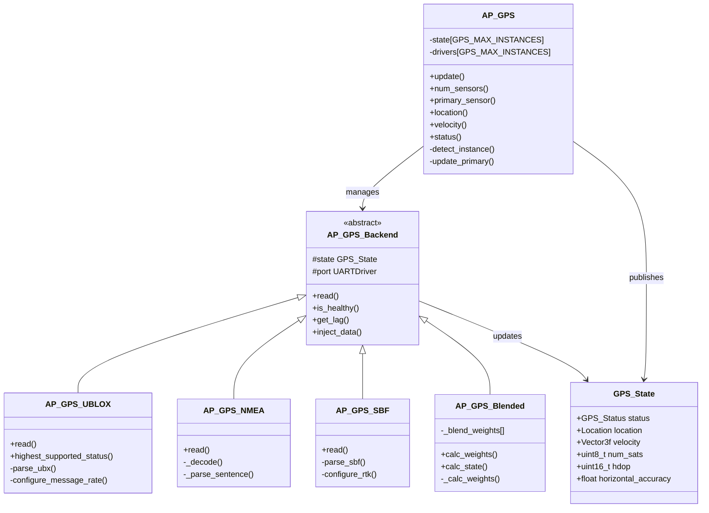
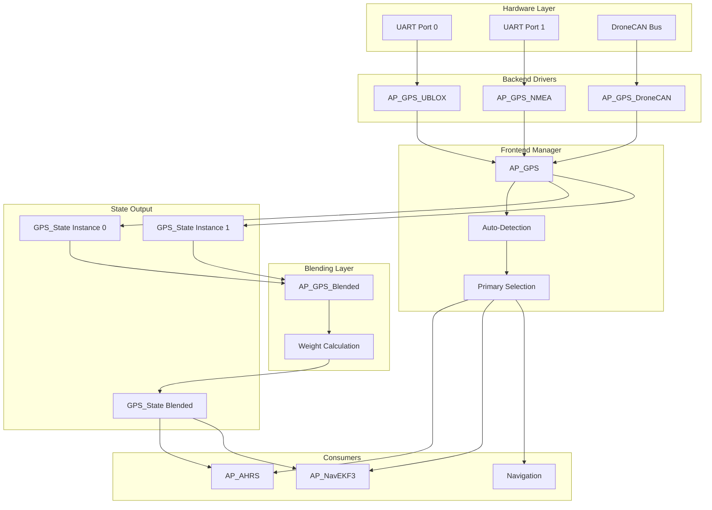
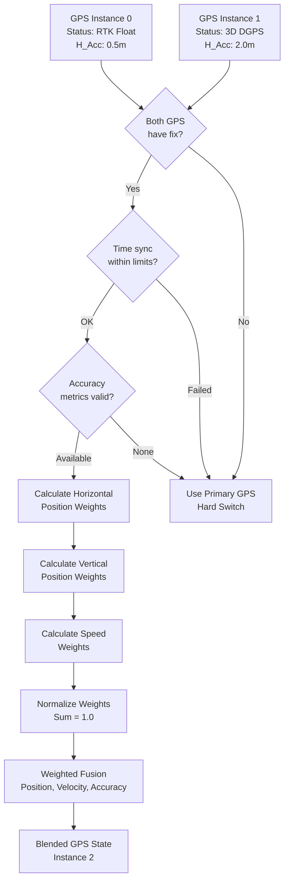
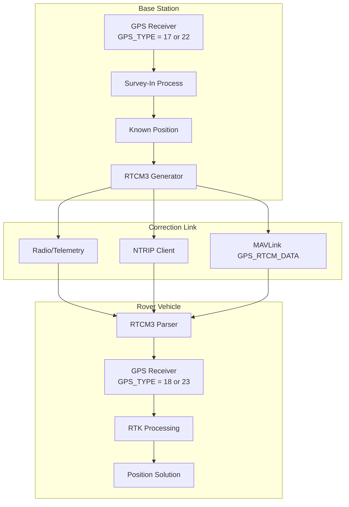

# AP_GPS Library


## Table of Contents
- [Overview](#overview)
- [Architecture](#architecture)
- [Supported GPS Protocols](#supported-gps-protocols)
- [API Reference](#api-reference)
- [GPS Blending Algorithm](#gps-blending-algorithm)
- [RTK Configuration](#rtk-configuration)
- [Driver Development](#driver-development)
- [Configuration Parameters](#configuration-parameters)
- [Integration Examples](#integration-examples)
- [Error Handling](#error-handling)
- [Testing](#testing)

## Overview

The AP_GPS library provides a unified interface for GPS/GNSS positioning across all ArduPilot vehicle types. It implements a hardware abstraction layer that supports multiple GPS receivers simultaneously, protocol auto-detection, RTK positioning, GPS blending, and comprehensive health monitoring.

**Source Files**: `/libraries/AP_GPS/`

### Key Features

- **Multi-Receiver Support**: Simultaneous operation of up to 2 physical GPS receivers plus 1 virtual blended instance
- **Protocol Auto-Detection**: Automatic identification and configuration of connected GPS receivers
- **RTK Positioning**: Support for both conventional RTK (base-to-rover) and moving baseline configurations
- **GPS Blending**: Inverse-variance weighted fusion of multiple GPS solutions for enhanced accuracy and reliability
- **RTCM3 Injection**: Real-time kinematic correction data streaming for precision positioning
- **Health Monitoring**: Comprehensive driver health checks, consistency validation, and automatic failover
- **Extensive Protocol Support**: 15+ GPS protocols including u-blox, NMEA, Septentrio SBF, Trimble GSOF, SwiftNav SBP, and DroneCAN

### Safety-Critical Role

The GPS subsystem is **safety-critical** for autonomous navigation, providing:
- Position estimation for navigation controllers
- Velocity measurements for state estimation fusion (EKF)
- Time synchronization for sensor fusion
- Yaw/heading from dual-antenna or moving baseline configurations

## Architecture

The AP_GPS library implements a frontend/backend architecture pattern for protocol abstraction and multi-receiver management.

### System Architecture



### Data Flow Architecture



### Component Responsibilities

**AP_GPS (Frontend)**
- **Source**: `AP_GPS.h`, `AP_GPS.cpp`
- Manages multiple GPS receiver instances (up to `GPS_MAX_RECEIVERS`)
- Performs protocol auto-detection on configured serial ports
- Selects primary GPS based on quality and availability
- Coordinates GPS blending when enabled
- Publishes unified GPS state to navigation subsystems
- Handles RTCM3 injection for RTK corrections

**AP_GPS_Backend (Base Class)**
- **Source**: `GPS_Backend.h`
- Defines common interface for all GPS drivers
- Provides utility functions for coordinate conversion
- Implements jitter correction for timestamp alignment
- Manages driver-specific lag compensation
- Handles message rate calculations

**Protocol-Specific Backends**
- Each backend implements protocol parsing and configuration
- Backends populate the shared `GPS_State` structure
- Responsible for health monitoring and error reporting

**AP_GPS_Blended**
- **Source**: `AP_GPS_Blended.h`, `AP_GPS_Blended.cpp`
- Computes inverse-variance weights from reported accuracies
- Fuses position, velocity, and accuracy estimates
- Acts as virtual GPS instance (highest instance number)
- Provides blended health status

## Supported GPS Protocols

The AP_GPS library supports a wide range of GPS/GNSS protocols through dedicated backend drivers.

### Protocol Support Matrix

| Protocol | GPS Type Value | Source Files | RTK Support | Moving Baseline | Auto-Detect | Notes |
|----------|----------------|--------------|-------------|-----------------|-------------|-------|
| **u-blox** | `GPS_TYPE_UBLOX` (2) | `AP_GPS_UBLOX.cpp/.h` | Yes (Float/Fixed) | Yes | Yes | Most common, full feature support |
| **u-blox RTK Base** | `GPS_TYPE_UBLOX_RTK_BASE` (17) | `AP_GPS_UBLOX.cpp` | Base station | Yes | No | Generates RTCM3 corrections |
| **u-blox RTK Rover** | `GPS_TYPE_UBLOX_RTK_ROVER` (18) | `AP_GPS_UBLOX.cpp` | Rover mode | Yes | No | Consumes RTCM3 corrections |
| **NMEA** | `GPS_TYPE_NMEA` (5) | `AP_GPS_NMEA.cpp/.h` | No | No | Yes | Generic NMEA-0183 |
| **Hemisphere NMEA** | `GPS_TYPE_HEMI` (16) | `AP_GPS_NMEA.cpp` | Yes (proprietary) | No | Yes | Hemisphere-specific extensions |
| **AllyStar NMEA** | `GPS_TYPE_ALLYSTAR` (20) | `AP_GPS_NMEA.cpp` | Vendor-specific | No | Yes | AllyStar chipset support |
| **Unicore NMEA** | `GPS_TYPE_UNICORE_NMEA` (24) | `AP_GPS_NMEA.cpp` | Vendor-specific | No | Yes | Unicore chipset support |
| **Unicore Moving Base** | `GPS_TYPE_UNICORE_MOVINGBASE_NMEA` (25) | `AP_GPS_NMEA.cpp` | Yes | Yes | No | Unicore moving baseline |
| **Septentrio SBF** | `GPS_TYPE_SBF` (10) | `AP_GPS_SBF.cpp/.h` | Yes (Float/Fixed) | No | Yes | High-end professional receivers |
| **Septentrio Dual Antenna** | `GPS_TYPE_SBF_DUAL_ANTENNA` (26) | `AP_GPS_SBF.cpp` | Yes | Yes | No | Dual-antenna heading |
| **Trimble GSOF** | `GPS_TYPE_GSOF` (11) | `AP_GPS_GSOF.cpp/.h` | Yes | No | Yes | Trimble proprietary format |
| **SwiftNav SBP** | `GPS_TYPE_SBP` (8) | `AP_GPS_SBP.cpp/.h` | Yes | No | Yes | SwiftNav Piksi |
| **SwiftNav SBP2** | Not in enum | `AP_GPS_SBP2.cpp/.h` | Yes | No | Yes | Updated SBP protocol |
| **NovAtel** | `GPS_TYPE_NOVA` (15) | `AP_GPS_NOVA.cpp/.h` | Yes | No | Yes | NovAtel OEM receivers |
| **SiRF** | `GPS_TYPE_SIRF` (6) | `AP_GPS_SIRF.cpp/.h` | No | No | Yes | Legacy SiRF binary |
| **EmlidReach (ERB)** | `GPS_TYPE_ERB` (13) | `AP_GPS_ERB.cpp/.h` | Yes | No | Yes | Emlid Reach RTK |
| **DroneCAN** | `GPS_TYPE_UAVCAN` (9) | `AP_GPS_DroneCAN.cpp/.h` | Yes | No | No | CAN bus GPS nodes |
| **DroneCAN RTK Base** | `GPS_TYPE_UAVCAN_RTK_BASE` (22) | `AP_GPS_DroneCAN.cpp` | Base station | Yes | No | CAN-based RTK base |
| **DroneCAN RTK Rover** | `GPS_TYPE_UAVCAN_RTK_ROVER` (23) | `AP_GPS_DroneCAN.cpp` | Rover mode | Yes | No | CAN-based RTK rover |
| **MAVLink** | `GPS_TYPE_MAV` (14) | `AP_GPS_MAV.cpp/.h` | Passthrough | No | No | GPS over MAVLink telemetry |
| **MSP** | `GPS_TYPE_MSP` (19) | `AP_GPS_MSP.cpp/.h` | Passthrough | No | No | MultiWii Serial Protocol |
| **External AHRS** | `GPS_TYPE_EXTERNAL_AHRS` (21) | `AP_GPS_ExternalAHRS.cpp/.h` | Passthrough | No | No | GPS from external AHRS |
| **HIL (Hardware-in-Loop)** | `GPS_TYPE_HIL` (7) | N/A (handled in AP_GPS) | Simulated | No | No | SITL/HIL simulation |
| **SITL** | `GPS_TYPE_SITL` (100) | `AP_GPS_SITL.cpp/.h` | Simulated | Yes | No | Software-in-loop testing |
| **AUTO** | `GPS_TYPE_AUTO` (1) | N/A | Depends on detected | Depends | Yes | Auto-detect protocol |
| **NONE** | `GPS_TYPE_NONE` (0) | N/A | N/A | N/A | N/A | GPS disabled |

### Protocol-Specific Features

#### u-blox (UBX Protocol)
- **Source**: `AP_GPS_UBLOX.cpp` (lines 94-100: initialization)
- **Message Format**: Binary UBX protocol with checksum verification
- **Supported Messages**:
  - NAV-PVT: Position, Velocity, Time solution
  - NAV-STATUS: Navigation status
  - NAV-DOP: Dilution of Precision
  - NAV-RELPOSNED: Relative positioning (moving baseline)
  - RXM-RTCM: RTCM correction status
- **Configuration**: Automatic rate configuration, navigation mode setting (portable/airborne)
- **RTK Modes**: Supports both conventional RTK and moving baseline
- **Special Features**: 
  - Survey-in for base station mode
  - RTCM3 message generation (base) and consumption (rover)
  - Dual-antenna yaw measurement

#### NMEA (NMEA-0183 Protocol)
- **Source**: `AP_GPS_NMEA.cpp` (lines 59-77: read loop, 82-100: decoder)
- **Message Format**: ASCII text sentences with checksum
- **Supported Sentences**:
  - GGA: Global Positioning System Fix Data
  - RMC: Recommended Minimum Specific GNSS Data
  - VTG: Course Over Ground and Ground Speed
  - GSA: GNSS DOP and Active Satellites
  - GSV: GNSS Satellites in View
  - HDT: Heading (vendor-specific)
- **Variants**: Standard NMEA, Hemisphere, AllyStar, Unicore extensions
- **Limitations**: Lower update rates, limited accuracy reporting

#### Septentrio SBF (Septentrio Binary Format)
- **Source**: `AP_GPS_SBF.cpp`
- **Message Format**: Proprietary binary format with CRC protection
- **Supported Messages**:
  - PVTGeodetic: Position, velocity, time
  - DOP: Dilution of precision
  - VelCovGeodetic: Velocity covariance
  - PosCovGeodetic: Position covariance
  - AttEuler/AttCovEuler: Dual-antenna attitude
- **Special Features**: Full covariance reporting, multi-constellation support
- **RTK Capability**: Professional-grade RTK with detailed quality metrics

#### Trimble GSOF (General Serial Output Format)
- **Source**: `AP_GPS_GSOF.cpp`
- **Message Format**: Trimble proprietary binary protocol
- **COM Port Configuration**: Requires specification of physical COM port (parameter `GPS_COM_PORT`)
- **Applications**: Survey-grade receivers, precision agriculture

#### DroneCAN (formerly UAVCAN)
- **Source**: `AP_GPS_DroneCAN.cpp`
- **Transport**: CAN bus instead of serial UART
- **Node Discovery**: Automatic detection via CAN node enumeration
- **Message Types**: 
  - uavcan.equipment.gnss.Fix: Position fix
  - uavcan.equipment.gnss.Fix2: Extended fix with RTK
  - uavcan.equipment.gnss.Auxiliary: Supplementary data
- **Advantages**: Electromagnetic noise immunity, simplified wiring, multi-device bus

#### RTCM3 Parser
- **Source**: `RTCM3_Parser.cpp` (lines 25-100: packet parsing, CRC verification)
- **Purpose**: Decode RTK correction streams for injection into receivers
- **Supported**: RTCM 3.x messages for multi-constellation corrections
- **Integration**: Used by moving baseline implementations
- **Fragmentation**: Handles fragmented RTCM packets from MAVLink (`GPS_RTCM_DATA`)

### Auto-Detection Process

**Source**: `AP_GPS.cpp` detection implementation

When `GPS_TYPE` is set to `AUTO` (1), the library attempts protocol detection:

1. **Baudrate Scanning**:  
   Source: `AP_GPS.cpp:79` - `_baudrates[] = {9600U, 115200U, 4800U, 19200U, 38400U, 57600U, 230400U, 460800U}`
   - Iterates through common baudrates
   - Sends initialization blobs to trigger responses

2. **Protocol Recognition**:
   - Examines incoming byte patterns
   - u-blox: Looks for UBX header bytes `0xB5 0x62`
   - NMEA: Detects `$` sentence start character
   - SiRF: Checks for SiRF binary header `0xA0 0xA2`
   - SBF: Identifies Septentrio sync bytes
   - Each backend provides detection state machine

3. **Driver Instantiation**:
   - Once protocol detected, instantiates appropriate backend
   - Backend performs further configuration
   - Reports detection to user via GCS message

4. **Timeout and Retry**:
   - Detection timeout: `GPS_TIMEOUT_MS` (4000ms, defined at line 74)
   - Baudrate change interval: `GPS_BAUD_TIME_MS` (1200ms, defined at line 73)
   - Retries indefinitely until GPS detected or type changed

## API Reference

### Frontend Class: AP_GPS

**Source**: `AP_GPS.h` (lines 51-814)

#### Singleton Access

```cpp
AP_GPS &gps = AP::gps();
```

Thread-safe access to the GPS subsystem singleton instance.

#### Initialization and Update

```cpp
/**
 * @brief Initialize GPS subsystem
 * @details Configures serial ports, initializes parameters, prepares for detection
 * @note Called once during vehicle startup
 * @see AP_GPS.cpp
 */
void init();

/**
 * @brief Main update function - must be called periodically
 * @details Reads data from all GPS instances, performs detection, updates state
 * @note Typically called at 10Hz or faster from main scheduler
 * @thread_safety This function is NOT thread-safe, call from main thread only
 * @see AP_GPS.cpp::update()
 */
void update();
```

#### Status and Health Queries

```cpp
/**
 * @brief Get GPS fix status for an instance
 * @param[in] instance GPS instance number (0-based)
 * @return GPS_Status enum value
 * @see GPS_Status enum (lines 149-157)
 */
GPS_Status status(uint8_t instance) const;
GPS_Status status() const;  // Primary instance

/**
 * @brief Check if GPS instance is healthy
 * @details Healthy = existing, updating >4Hz, driver-specific checks passing
 * @param[in] instance GPS instance number
 * @return true if healthy, false otherwise
 * @see AP_GPS.cpp::is_healthy()
 */
bool is_healthy(uint8_t instance) const;
bool is_healthy() const;  // Primary instance

/**
 * @brief Get number of active GPS sensors
 * @return Number of GPS instances with valid data
 * @note Includes blended GPS if active
 */
uint8_t num_sensors() const;

/**
 * @brief Get primary GPS instance index
 * @return Index of GPS being used for navigation (0-based)
 * @note May return blended instance if GPS_AUTO_SWITCH set to BLEND
 */
uint8_t primary_sensor() const;
```

#### Position and Velocity Accessors

```cpp
/**
 * @brief Get last GPS fix location
 * @param[in] instance GPS instance number
 * @return Location structure with lat/lng/alt
 * @see Location class in AP_Common
 */
const Location &location(uint8_t instance) const;
const Location &location() const;  // Primary instance

/**
 * @brief Get 3D velocity in NED frame
 * @param[in] instance GPS instance number
 * @return Vector3f with velocity in m/s (North, East, Down)
 * @units m/s
 */
const Vector3f &velocity(uint8_t instance) const;
const Vector3f &velocity() const;  // Primary instance

/**
 * @brief Get horizontal ground speed
 * @param[in] instance GPS instance number
 * @return Ground speed in m/s
 * @units m/s
 */
float ground_speed(uint8_t instance) const;
float ground_speed() const;  // Primary instance

/**
 * @brief Get ground course (heading over ground)
 * @param[in] instance GPS instance number
 * @return Course angle in degrees (0-360)
 * @units degrees
 */
float ground_course(uint8_t instance) const;
float ground_course() const;  // Primary instance
```

#### Accuracy and Quality Metrics

```cpp
/**
 * @brief Get horizontal position accuracy estimate
 * @param[in] instance GPS instance number
 * @param[out] hacc Horizontal accuracy in meters
 * @return true if accuracy available, false otherwise
 * @note Not all GPS types provide accuracy estimates
 * @see GPS_State::have_horizontal_accuracy (line 215)
 */
bool horizontal_accuracy(uint8_t instance, float &hacc) const;
bool horizontal_accuracy(float &hacc) const;  // Primary instance

/**
 * @brief Get vertical position accuracy estimate
 * @param[in] instance GPS instance number
 * @param[out] vacc Vertical accuracy in meters
 * @return true if accuracy available, false otherwise
 */
bool vertical_accuracy(uint8_t instance, float &vacc) const;
bool vertical_accuracy(float &vacc) const;  // Primary instance

/**
 * @brief Get speed accuracy estimate
 * @param[in] instance GPS instance number
 * @param[out] sacc Speed accuracy in m/s
 * @return true if accuracy available, false otherwise
 */
bool speed_accuracy(uint8_t instance, float &sacc) const;
bool speed_accuracy(float &sacc) const;  // Primary instance

/**
 * @brief Get horizontal dilution of precision
 * @param[in] instance GPS instance number
 * @return HDOP value scaled by 100 (e.g., 155 = 1.55 HDOP)
 * @note Lower values indicate better geometry
 */
uint16_t get_hdop(uint8_t instance) const;
uint16_t get_hdop() const;  // Primary instance

/**
 * @brief Get number of satellites used in solution
 * @param[in] instance GPS instance number
 * @return Number of satellites
 */
uint8_t num_sats(uint8_t instance) const;
uint8_t num_sats() const;  // Primary instance
```

#### Time and Timestamp Methods

```cpp
/**
 * @brief Get GPS time of week
 * @param[in] instance GPS instance number
 * @return Time of week in milliseconds
 * @units milliseconds
 */
uint32_t time_week_ms(uint8_t instance) const;
uint32_t time_week_ms() const;  // Primary instance

/**
 * @brief Get GPS week number
 * @param[in] instance GPS instance number
 * @return GPS week number since GPS epoch (1980-01-06)
 */
uint16_t time_week(uint8_t instance) const;
uint16_t time_week() const;  // Primary instance

/**
 * @brief Get system time of last GPS fix
 * @param[in] instance GPS instance number
 * @return System milliseconds when fix was received
 * @note Used to calculate position extrapolation
 */
uint32_t last_fix_time_ms(uint8_t instance) const;
uint32_t last_fix_time_ms() const;  // Primary instance

/**
 * @brief Convert GPS week/millisecond to Unix epoch
 * @param[in] gps_week GPS week number
 * @param[in] gps_ms Milliseconds into GPS week
 * @return Unix timestamp in milliseconds
 * @see UNIX_OFFSET_MSEC definition (line 38)
 */
static uint64_t istate_time_to_epoch_ms(uint16_t gps_week, uint32_t gps_ms);
```

#### RTK-Specific Methods

```cpp
/**
 * @brief Check if instance is configured as RTK base
 * @param[in] instance GPS instance number
 * @return true if base station, false otherwise
 */
bool is_rtk_base(uint8_t instance) const;

/**
 * @brief Check if instance is configured as RTK rover
 * @param[in] instance GPS instance number
 * @return true if rover, false otherwise
 */
bool is_rtk_rover(uint8_t instance) const;

/**
 * @brief Get GPS yaw from dual-antenna or moving baseline
 * @param[in] instance GPS instance number
 * @param[out] yaw_deg Yaw angle in degrees
 * @param[out] accuracy_deg Yaw accuracy in degrees
 * @param[out] time_ms Timestamp of yaw measurement
 * @return true if yaw available, false otherwise
 * @note Requires dual-antenna GPS or moving baseline configuration
 */
bool gps_yaw_deg(uint8_t instance, float &yaw_deg, float &accuracy_deg, uint32_t &time_ms) const;
bool gps_yaw_deg(float &yaw_deg, float &accuracy_deg, uint32_t &time_ms) const;

/**
 * @brief Inject RTCM correction data to GPS instances
 * @param[in] data Pointer to RTCM3 data buffer
 * @param[in] len Length of data in bytes
 * @details Distributes correction data to configured receivers
 * @see handle_gps_rtcm_fragment() for fragmented injection
 */
void inject_data(const uint8_t *data, uint16_t len);
```

#### Advanced Features

```cpp
/**
 * @brief Get antenna position offset in body frame
 * @param[in] instance GPS instance number
 * @return Vector3f with offset in meters (Forward, Right, Down)
 * @units meters
 * @note Set via GPS_POS_X/Y/Z parameters
 */
const Vector3f &get_antenna_offset(uint8_t instance) const;

/**
 * @brief Get GPS measurement lag
 * @param[in] instance GPS instance number
 * @param[out] lag_sec Lag time in seconds
 * @return true if lag known, false if using default
 * @note Used by EKF for timestamp correction
 */
bool get_lag(uint8_t instance, float &lag_sec) const;
bool get_lag(float &lag_sec) const;  // Primary instance

/**
 * @brief Get undulation (geoid height above ellipsoid)
 * @param[in] instance GPS instance number
 * @param[out] undulation Undulation in meters
 * @return true if undulation available, false otherwise
 * @note Positive means AMSL is above WGS84 ellipsoid
 */
bool get_undulation(uint8_t instance, float &undulation) const;
bool get_undulation(float &undulation) const;  // Primary instance

/**
 * @brief Pre-arm check for GPS readiness
 * @param[out] failure_msg Buffer for failure reason
 * @param[in] failure_msg_len Buffer length
 * @return true if ready to arm, false with message
 * @safety CRITICAL - prevents arming with unhealthy GPS
 */
bool pre_arm_checks(char failure_msg[], uint16_t failure_msg_len);

/**
 * @brief Check consistency between multiple GPS receivers
 * @param[out] distance Maximum separation distance in meters
 * @return true if all GPS consistent, false otherwise
 * @note Used for pre-arm validation with multiple receivers
 */
bool all_consistent(float &distance) const;
```

### Backend Base Class: AP_GPS_Backend

**Source**: `GPS_Backend.h` (lines 49-200)

GPS driver backends must inherit from this class and implement the `read()` method.

```cpp
class AP_GPS_Backend {
public:
    /**
     * @brief Backend constructor
     * @param[in] _gps Reference to frontend GPS object
     * @param[in] _params Reference to instance parameters
     * @param[in] _state Reference to instance state structure
     * @param[in] _port Pointer to UART driver (nullptr for non-serial GPS)
     */
    AP_GPS_Backend(AP_GPS &_gps, AP_GPS::Params &_params, 
                   AP_GPS::GPS_State &_state, AP_HAL::UARTDriver *_port);
    
    /**
     * @brief Read and process GPS data
     * @return true if valid packet received and state updated, false otherwise
     * @note Called repeatedly by frontend update() loop
     * @thread_safety Implementation must be thread-safe if backend uses interrupts
     */
    virtual bool read() = 0;
    
    /**
     * @brief Report highest fix quality supported by this GPS
     * @return GPS_Status enum value
     * @note Used to select best GPS when multiple available
     */
    virtual AP_GPS::GPS_Status highest_supported_status() { 
        return AP_GPS::GPS_OK_FIX_3D; 
    }
    
    /**
     * @brief Check if GPS is configured and ready
     * @return true if configuration complete, false if still configuring
     */
    virtual bool is_configured() const { return true; }
    
    /**
     * @brief Check if GPS backend is healthy
     * @return true if healthy, false otherwise
     * @note Override to add driver-specific health checks
     */
    virtual bool is_healthy() const { return true; }
    
    /**
     * @brief Get driver-specific measurement lag
     * @param[out] lag Lag time in seconds
     * @return true if confident in lag value, false for default
     * @note Default implementation returns 0.2 seconds (line 90)
     */
    virtual bool get_lag(float &lag) const { lag = 0.2f; return true; }
    
    /**
     * @brief Inject RTK correction data into GPS
     * @param[in] data Pointer to RTCM or proprietary correction data
     * @param[in] len Length of data in bytes
     * @note Override to support RTK corrections
     */
    virtual void inject_data(const uint8_t *data, uint16_t len);
    
    /**
     * @brief Get backend driver name
     * @return Const string with driver name
     */
    virtual const char *name() const = 0;
};
```

### GPS State Structure

**Source**: `AP_GPS.h` (lines 192-245)

The `GPS_State` structure contains all information from a GPS receiver:

```cpp
struct GPS_State {
    uint8_t instance;                    ///< Instance number of this GPS
    
    // Fix information
    GPS_Status status;                   ///< Current fix status
    Location location;                   ///< Last fix position (lat/lng/alt)
    Vector3f velocity;                   ///< 3D velocity in m/s (NED frame)
    float ground_speed;                  ///< Horizontal speed in m/s
    float ground_course;                 ///< Course over ground in degrees
    uint8_t num_sats;                    ///< Number of satellites used
    
    // Time information
    uint32_t time_week_ms;               ///< GPS time of week in milliseconds
    uint16_t time_week;                  ///< GPS week number
    uint32_t last_gps_time_ms;           ///< System time of last update
    
    // Quality metrics
    uint16_t hdop;                       ///< Horizontal DOP * 100
    uint16_t vdop;                       ///< Vertical DOP * 100
    float horizontal_accuracy;           ///< Horizontal position accuracy (m)
    float vertical_accuracy;             ///< Vertical position accuracy (m)
    float speed_accuracy;                ///< 3D velocity accuracy (m/s)
    bool have_horizontal_accuracy;       ///< Accuracy valid flag
    bool have_vertical_accuracy;         ///< Accuracy valid flag
    bool have_speed_accuracy;            ///< Accuracy valid flag
    bool have_vertical_velocity;         ///< Vertical velocity valid flag
    
    // RTK-specific fields
    uint32_t rtk_age_ms;                 ///< Age of RTK corrections (ms)
    uint8_t rtk_num_sats;                ///< Satellites used for RTK
    int32_t rtk_baseline_x_mm;           ///< Baseline ECEF X or NED North (mm)
    int32_t rtk_baseline_y_mm;           ///< Baseline ECEF Y or NED East (mm)
    int32_t rtk_baseline_z_mm;           ///< Baseline ECEF Z or NED Down (mm)
    uint32_t rtk_accuracy;               ///< RTK baseline accuracy estimate
    
    // Dual-antenna / moving baseline yaw
    float gps_yaw;                       ///< GPS-derived yaw in degrees
    float gps_yaw_accuracy;              ///< Yaw accuracy in degrees
    uint32_t gps_yaw_time_ms;            ///< Timestamp of yaw measurement
    bool gps_yaw_configured;             ///< GPS configured for yaw output
    bool have_gps_yaw;                   ///< Yaw currently available
    
    // Geoid information
    float undulation;                    ///< WGS84 height above AMSL (m)
    bool have_undulation;                ///< Undulation valid flag
};
```

### GPS Status Enumeration

**Source**: `AP_GPS.h` (lines 149-157)

```cpp
enum GPS_Status {
    NO_GPS = 0,                  ///< No GPS connected/detected
    NO_FIX = 1,                  ///< Receiving messages but no position lock
    GPS_OK_FIX_2D = 2,           ///< 2D position fix (no altitude)
    GPS_OK_FIX_3D = 3,           ///< 3D position fix
    GPS_OK_FIX_3D_DGPS = 4,      ///< 3D fix with DGPS/SBAS corrections
    GPS_OK_FIX_3D_RTK_FLOAT = 5, ///< 3D RTK float ambiguity solution
    GPS_OK_FIX_3D_RTK_FIXED = 6, ///< 3D RTK fixed ambiguity solution (cm-level)
};
```

**Note**: These values are aligned with MAVLink GPS_FIX_TYPE enumeration for seamless telemetry integration.

## GPS Blending Algorithm

**Source**: `AP_GPS_Blended.cpp` (lines 17-240)

GPS blending provides enhanced accuracy and reliability by fusing data from multiple GPS receivers using inverse-variance weighting based on reported accuracy metrics.

### Blending Architecture



### Inverse-Variance Weighting

**Mathematical Foundation**

Given N GPS receivers with reported accuracies σ₁, σ₂, ..., σₙ, the blend weight for receiver i is:

```
           σ₁² + σ₂² + ... + σₙ²
w_i = ──────────────────────────
                σᵢ²
```

After normalization (so Σw_i = 1.0):

```
                w_i
w_i_norm = ─────────────
           Σ(w_j) for j=1..N
```

**Implementation**: `AP_GPS_Blended.cpp::_calc_weights()` (lines 17-180)

### Blending Parameters

The blending algorithm uses a bitmask parameter `GPS_BLEND_MASK` to select which accuracy metrics to use:

| Bit | Mask Value | Metric | Source Field |
|-----|------------|--------|--------------|
| 0 | `BLEND_MASK_USE_HPOS_ACC` (1) | Horizontal Position Accuracy | `GPS_State::horizontal_accuracy` |
| 1 | `BLEND_MASK_USE_VPOS_ACC` (2) | Vertical Position Accuracy | `GPS_State::vertical_accuracy` |
| 2 | `BLEND_MASK_USE_SPD_ACC` (4) | Speed Accuracy | `GPS_State::speed_accuracy` |

**Default Configuration**: All metrics enabled (mask value = 7)

### Weight Calculation Process

**Source**: `AP_GPS_Blended.cpp` (lines 59-176)

#### Step 1: Horizontal Position Weights

```cpp
// Source: AP_GPS_Blended.cpp lines 76-88
float horizontal_accuracy_sum_sq = 0.0f;
for (uint8_t i=0; i<GPS_MAX_RECEIVERS; i++) {
    if (gps.state[i].status >= AP_GPS::GPS_OK_FIX_2D) {
        if (gps.state[i].have_horizontal_accuracy && 
            gps.state[i].horizontal_accuracy > 0.0f) {
            horizontal_accuracy_sum_sq += sq(gps.state[i].horizontal_accuracy);
        }
    }
}

// Calculate weights using inverse of variances
for (uint8_t i=0; i<GPS_MAX_RECEIVERS; i++) {
    if (gps.state[i].horizontal_accuracy >= 0.001f) {
        hpos_blend_weights[i] = horizontal_accuracy_sum_sq / 
                                sq(gps.state[i].horizontal_accuracy);
    }
}
```

- Requires both receivers to report `have_horizontal_accuracy = true`
- Uses squared accuracy (variance) for weighting
- Better accuracy (smaller σ) → higher weight
- If either GPS lacks accuracy reporting, horizontal blending disabled

#### Step 2: Vertical Position Weights

```cpp
// Source: AP_GPS_Blended.cpp lines 92-104
// Similar process for vertical accuracy
float vertical_accuracy_sum_sq = 0.0f;
for (uint8_t i=0; i<GPS_MAX_RECEIVERS; i++) {
    if (gps.state[i].status >= AP_GPS::GPS_OK_FIX_3D) {
        if (gps.state[i].have_vertical_accuracy && 
            gps.state[i].vertical_accuracy > 0.0f) {
            vertical_accuracy_sum_sq += sq(gps.state[i].vertical_accuracy);
        }
    }
}
```

- Requires 3D fix for vertical blending
- Independent weights for altitude

#### Step 3: Speed Weights

```cpp
// Source: AP_GPS_Blended.cpp lines 60-73
float speed_accuracy_sum_sq = 0.0f;
for (uint8_t i=0; i<GPS_MAX_RECEIVERS; i++) {
    if (gps.state[i].status >= AP_GPS::GPS_OK_FIX_3D) {
        if (gps.state[i].have_speed_accuracy && 
            gps.state[i].speed_accuracy > 0.0f) {
            speed_accuracy_sum_sq += sq(gps.state[i].speed_accuracy);
        }
    }
}
```

- Used for blending velocity vectors
- Separate from position weights

#### Step 4: Final Weight Computation

```cpp
// Source: AP_GPS_Blended.cpp lines 178-188
// Combine all weight types with equal contribution
for (uint8_t i=0; i<GPS_MAX_RECEIVERS; i++) {
    _blend_weights[i] = hpos_blend_weights[i] + 
                        vpos_blend_weights[i] + 
                        speed_blend_weights[i];
}

// Normalize so sum equals 1.0
float sum_of_all_weights = _blend_weights[0] + _blend_weights[1];
if (sum_of_all_weights > 0.0f) {
    for (uint8_t i=0; i<GPS_MAX_RECEIVERS; i++) {
        _blend_weights[i] = _blend_weights[i] / sum_of_all_weights;
    }
}
```

### State Fusion Process

**Source**: `AP_GPS_Blended.cpp::calc_state()`

Once weights are computed, GPS states are fused:

#### Position Blending

```cpp
// Blend latitude/longitude using weighted average
blended_location.lat = state[0].location.lat * _blend_weights[0] + 
                       state[1].location.lat * _blend_weights[1];

blended_location.lng = state[0].location.lng * _blend_weights[0] + 
                       state[1].location.lng * _blend_weights[1];

// Blend altitude similarly
blended_location.alt = state[0].location.alt * _blend_weights[0] + 
                       state[1].location.alt * _blend_weights[1];
```

#### Velocity Blending

```cpp
// Blend 3D velocity vectors
state.velocity.x = state[0].velocity.x * _blend_weights[0] + 
                   state[1].velocity.x * _blend_weights[1];
state.velocity.y = state[0].velocity.y * _blend_weights[0] + 
                   state[1].velocity.y * _blend_weights[1];
state.velocity.z = state[0].velocity.z * _blend_weights[0] + 
                   state[1].velocity.z * _blend_weights[1];
```

#### Accuracy Blending

```cpp
// Blend horizontal accuracy using inverse variance formula
if (sum_of_hpos_weights > 0.0f) {
    state.horizontal_accuracy = sqrtf(horizontal_accuracy_sum_sq / 
                                     sum_of_hpos_weights);
}
```

The blended accuracy is always better (lower) than either individual receiver.

### Timing Synchronization

**Source**: `AP_GPS_Blended.cpp` (lines 32-57)

For valid blending, GPS timestamps must be synchronized:

```cpp
uint32_t max_ms = 0;  // newest GPS message time
uint32_t min_ms = -1; // oldest GPS message time
uint32_t max_rate_ms = 0; // slowest GPS update rate

// Find time spread
for (uint8_t i=0; i<GPS_MAX_RECEIVERS; i++) {
    if (gps.state[i].last_gps_time_ms > max_ms) {
        max_ms = gps.state[i].last_gps_time_ms;
    }
    if (gps.state[i].last_gps_time_ms < min_ms) {
        min_ms = gps.state[i].last_gps_time_ms;
    }
    max_rate_ms = MAX(gps.get_rate_ms(i), max_rate_ms);
}

// Check timing consistency
if ((max_ms - min_ms) < (2 * max_rate_ms)) {
    // Times are synchronized - use oldest for blended timestamp
    state.last_gps_time_ms = min_ms;
} else {
    // Time delta too large - fail blending, use hard switch
    return false;
}
```

**Timing Requirements**:
- GPS message times must be within 2× the slowest update interval
- If GPS 1 updates at 5Hz (200ms) and GPS 2 at 10Hz (100ms), messages must be within 400ms
- Prevents blending stale data with fresh data

### Health Monitoring

**Source**: `AP_GPS_Blended.cpp` 

```cpp
uint8_t _blend_health_counter;  // 0 = healthy, 100 = very unhealthy

// Increment health counter on blending failures
if (!_calc_weights()) {
    _blend_health_counter += BLEND_COUNTER_FAILURE_INCREMENT;  // +10
    _blend_health_counter = MIN(_blend_health_counter, 100);
} else {
    // Decrement slowly on success
    if (_blend_health_counter > 0) {
        _blend_health_counter--;
    }
}

// Blended GPS considered healthy if counter < 50
bool is_healthy() const override {
    return (_blend_health_counter < 50);
}
```

**Health Implications**:
- Blending failure increments counter by 10
- Success decrements counter by 1
- Requires 5× more successes than failures to maintain health
- Unhealthy blend triggers fallback to primary GPS

### Fallback Behavior

When blending fails or becomes unhealthy:

1. **Primary Selection**: Uses `GPS_AUTO_SWITCH` parameter logic
2. **USE_BEST** mode: Selects GPS with best fix type and accuracy
3. **USE_PRIMARY_IF_3D_FIX** mode: Prefers configured primary if it has 3D fix
4. **Hard Switch**: No gradual transition, immediate switch to selected GPS

### Practical Example

**Scenario**: Dual u-blox M9N receivers, one with clear sky, one partially obstructed

```
GPS 0 (RTK Fixed):
  - horizontal_accuracy = 0.014 m (1.4 cm)
  - vertical_accuracy = 0.020 m (2 cm)
  - status = GPS_OK_FIX_3D_RTK_FIXED

GPS 1 (3D Fix):
  - horizontal_accuracy = 2.5 m
  - vertical_accuracy = 4.0 m
  - status = GPS_OK_FIX_3D

Horizontal Weight Calculation:
  sum_sq = (0.014)² + (2.5)² = 0.000196 + 6.25 = 6.250196
  
  w0 = 6.250196 / (0.014)² = 6.250196 / 0.000196 = 31,888
  w1 = 6.250196 / (2.5)²   = 6.250196 / 6.25     = 1.0
  
  sum = 31,888 + 1.0 = 31,889
  
  w0_normalized = 31,888 / 31,889 = 0.99997  (99.997%)
  w1_normalized = 1.0 / 31,889    = 0.00003  (0.003%)

Result: Blended solution almost entirely from GPS 0, with minimal (0.003%) contribution from GPS 1
```

The RTK receiver dominates the blend due to its vastly superior accuracy, but GPS 1 still contributes to redundancy validation.

### Configuration Parameters

| Parameter | Description | Default | Range |
|-----------|-------------|---------|-------|
| `GPS_AUTO_SWITCH` | Blending enable (value 2 = BLEND) | USE_BEST (1) | 0-4 |
| `GPS_BLEND_MASK` | Which metrics to use for blending | 7 (all) | 0-7 |

**Usage Example**:
```
GPS_AUTO_SWITCH = 2     # Enable blending
GPS_BLEND_MASK = 7      # Use H_Acc + V_Acc + Spd_Acc (default)
GPS_BLEND_MASK = 1      # Use only horizontal position accuracy
GPS_BLEND_MASK = 3      # Use horizontal + vertical position accuracy
```

## RTK Configuration

Real-Time Kinematic (RTK) positioning provides centimeter-level accuracy using differential corrections from a base station or NTRIP service.

### RTK Architecture



### RTK Operating Modes

#### 1. Conventional RTK (Fixed Base Station)

**Use Case**: Base station at known surveyed location, rover vehicle moves

**Base Configuration**:
```
GPS_TYPE = 17  (u-blox RTK Base)    or
GPS_TYPE = 22  (DroneCAN RTK Base)

GPS_AUTO_CONFIG = 1  # Let ArduPilot configure base mode
```

**Rover Configuration**:
```
GPS_TYPE = 18  (u-blox RTK Rover)   or
GPS_TYPE = 23  (DroneCAN RTK Rover)

GPS_AUTO_CONFIG = 1  # Let ArduPilot configure rover mode
```

**Base Station Survey-In Process**:
- Base GPS performs statistical survey to determine precise position
- Typical survey time: 60-300 seconds
- Accuracy requirement: < 2 meters for adequate RTK performance
- After survey, base generates RTCM3 corrections relative to surveyed position

#### 2. Moving Baseline RTK

**Source**: Enabled when `GPS_MOVING_BASELINE` is true (line 40-46 in AP_GPS.h)

**Use Case**: Two GPS receivers on same vehicle, no external base station required

**Applications**:
- **Yaw Determination**: Dual-antenna heading measurement
- **Improved Position**: Fused solution from both receivers
- **Redundancy**: Continued operation if one antenna obstructed

**Configuration Example**:
```
# Primary GPS (Rover)
GPS_TYPE = 18          # u-blox Moving Baseline Rover
GPS_POS_X = 0.0        # Rover antenna position
GPS_POS_Y = 0.0
GPS_POS_Z = 0.0

# Secondary GPS (Base)
GPS_TYPE2 = 17         # u-blox Moving Baseline Base
GPS2_POS_X = -0.5      # Base antenna 0.5m behind rover
GPS2_POS_Y = 0.0
GPS2_POS_Z = 0.0

# Moving baseline parameters
GPS_MB_TYPE = 1        # Enable moving baseline
```

**Moving Baseline Parameters**: (Source: MovingBase.cpp parameters)

| Parameter | Description | Default | Range |
|-----------|-------------|---------|-------|
| `GPS_MB_TYPE` | Moving baseline type | 0 (disabled) | 0-2 |
| `GPS_MB_OFS_X` | Baseline X offset (m) | 0.0 | -10 to 10 |
| `GPS_MB_OFS_Y` | Baseline Y offset (m) | 0.0 | -10 to 10 |
| `GPS_MB_OFS_Z` | Baseline Z offset (m) | 0.0 | -10 to 10 |

**Yaw Calculation**:
```cpp
// Source: GPS_Backend.h lines 160-161
bool calculate_moving_base_yaw(const float reported_heading_deg, 
                               const float reported_distance, 
                               const float reported_D);
```

Validates reported heading against expected baseline geometry:
- Compares GPS-reported baseline length to configured antenna separation
- Rejects solutions with excessive deviation (indicates poor fix quality)
- Updates `GPS_State::gps_yaw` and `GPS_State::gps_yaw_accuracy`

### RTCM3 Data Injection

**Source**: `RTCM3_Parser.cpp`

#### RTCM3 Packet Structure

```
[Preamble][Length ][    Payload     ][  CRC24  ]
   0xD3    10 bits   Variable length   24 bits
```

**Parser Implementation**: `RTCM3_Parser.cpp` (lines 24-99)

```cpp
class RTCM3_Parser {
public:
    /**
     * @brief Parse incoming RTCM3 byte stream
     * @param[in] byte Next byte from correction stream
     * @return true if complete packet assembled and validated
     */
    bool parse(uint8_t byte);
    
    /**
     * @brief Get validated packet data
     * @param[out] bytes Pointer to packet buffer
     * @return Length of packet, or 0 if no packet available
     */
    uint16_t get_len(const uint8_t *&bytes) const;
    
    /**
     * @brief Get RTCM message ID from packet
     * @return Message ID (e.g., 1005, 1077, 1127)
     */
    uint16_t get_id() const;
    
    /**
     * @brief Clear processed packet from buffer
     */
    void clear_packet();
};
```

#### RTCM3 Message Types

Common RTCM3 messages for multi-constellation RTK:

| Message ID | Description | Update Rate |
|------------|-------------|-------------|
| 1005 | Station coordinates (base position) | 1/10 Hz |
| 1077 | GPS MSM7 (full carrier phase/code) | 1 Hz |
| 1087 | GLONASS MSM7 | 1 Hz |
| 1097 | Galileo MSM7 | 1 Hz |
| 1127 | BeiDou MSM7 | 1 Hz |
| 1230 | GLONASS code-phase biases | 1/10 Hz |
| 4072 | Proprietary (u-blox, Trimble, etc.) | Variable |

**MSM7**: Multi-Signal Message type 7 (highest resolution observations)

### RTCM3 Injection Methods

#### Method 1: MAVLink GPS_RTCM_DATA Messages

**Source**: `AP_GPS.cpp::handle_gps_rtcm_fragment()`

Ground station sends RTCM corrections over telemetry link using `GPS_RTCM_DATA` MAVLink messages:

```cpp
/**
 * @brief Handle fragmented RTCM injection via MAVLink
 * @param[in] flags Bit field: [fragmented|fragment_id|sequence]
 * @param[in] data RTCM data fragment (up to 180 bytes)
 * @param[in] len Length of this fragment
 * @details Reassembles fragmented RTCM packets and injects into GPS
 */
void handle_gps_rtcm_fragment(uint8_t flags, const uint8_t *data, uint8_t len);
```

**Fragment Format** (source: lines 726-738):
- Bit 7: Fragmented (1) or single packet (0)
- Bits 6-5: Fragment number (0-3)
- Bits 4-0: Sequence number (0-31)

**Injection Target**:
```
GPS_INJECT_TO = 0   # Inject to GPS instance 0
GPS_INJECT_TO = 1   # Inject to GPS instance 1
GPS_INJECT_TO = 127 # Inject to all GPS instances (GPS_RTK_INJECT_TO_ALL)
```

#### Method 2: Serial RTCM Injection

Direct serial connection from base station to rover's secondary UART:

```
Base GPS UART2 TX --> Rover SERIAL port RX
```

**Configuration**:
```
SERIAL3_PROTOCOL = 35  # RTCM3 protocol
SERIAL3_BAUD = 115     # 115200 baud
GPS_INJECT_TO = 0      # Target GPS instance
```

ArduPilot forwards received RTCM data to specified GPS instance.

#### Method 3: DroneCAN RTK Injection

For CAN-connected GPS, RTCM injection over CAN bus:

```cpp
// RTCM data encapsulated in uavcan.equipment.gnss.RTCMStream messages
```

### RTK Status Monitoring

#### GPS_State RTK Fields

**Source**: `AP_GPS.h` (lines 227-244)

```cpp
struct GPS_State {
    // RTK-specific fields
    uint32_t rtk_time_week_ms;         ///< GPS Time of Week of last baseline (ms)
    uint16_t rtk_week_number;          ///< GPS Week Number of last baseline
    uint32_t rtk_age_ms;               ///< Age of corrections (ms)
                                       ///< 0 = no corrections
                                       ///< 0xFFFFFFFF = overflow
    uint8_t  rtk_num_sats;             ///< Satellites used for RTK solution
    uint8_t  rtk_baseline_coords_type; ///< 0=ECEF, 1=NED
    int32_t  rtk_baseline_x_mm;        ///< Baseline X/North (mm)
    int32_t  rtk_baseline_y_mm;        ///< Baseline Y/East (mm)
    int32_t  rtk_baseline_z_mm;        ///< Baseline Z/Down (mm)
    uint32_t rtk_accuracy;             ///< Baseline accuracy (receiver-dependent)
    int32_t  rtk_iar_num_hypotheses;   ///< Integer ambiguity hypotheses
};
```

#### RTK Health Indicators

**Good RTK Performance**:
- `status == GPS_OK_FIX_3D_RTK_FIXED` (best, cm-level accuracy)
- `rtk_age_ms < 10000` (corrections less than 10 seconds old)
- `rtk_num_sats >= 5` (sufficient satellite count)
- `rtk_accuracy < 100` (receiver reports good baseline quality)
- `horizontal_accuracy < 0.05` meters (5 cm accuracy)

**RTK Float vs. Fixed**:
- **Float**: `GPS_OK_FIX_3D_RTK_FLOAT`
  - Ambiguities partially resolved
  - Accuracy: decimeter-level (10-30 cm)
  - Transitional state during convergence
  
- **Fixed**: `GPS_OK_FIX_3D_RTK_FIXED`
  - Integer ambiguities fully resolved
  - Accuracy: centimeter-level (1-5 cm)
  - Stable operating state

**Float → Fixed Transition**:
- Requires sufficient correction age freshness
- Adequate satellite geometry (low HDOP)
- Stable signal tracking
- May take 30 seconds to several minutes

### RTK Correction Latency

**Lag Definitions**:
- **Measurement Lag**: GPS internal processing delay (typically 60-120 ms)
- **Transmission Lag**: Correction data link delay (10-1000+ ms depending on link)
- **Total RTK Lag**: Sum of measurement + transmission lag

**Source**: `GPS_Backend.h` (line 37-42)
```cpp
#define AP_GPS_MB_MIN_LAG 0.05f   // 50 ms minimum lag
#define AP_GPS_MB_MAX_LAG 0.25f   // 250 ms maximum lag
```

**EKF Handling**:
- Navigation filter compensates for GPS lag using `get_lag()` method
- Excessive correction age degrades RTK solution quality
- Monitor `rtk_age_ms` to detect link issues

### Troubleshooting RTK Issues

| Symptom | Possible Cause | Solution |
|---------|----------------|----------|
| Never reaches RTK Float | No RTCM corrections arriving | Check `rtk_age_ms`, verify injection path |
| Float but never Fixed | Poor baseline geometry | Increase antenna separation, verify positions |
| Fixed → Float oscillation | Multipath or interference | Relocate antennas, use ground planes |
| High `rtk_age_ms` | Correction link bandwidth limited | Reduce RTCM message rate or increase baud |
| `rtk_num_sats` too low | Obstructed sky view | Improve antenna placement |
| Base survey won't complete | Insufficient satellites | Wait for better constellation, check GPS time |

### RTK Best Practices

1. **Antenna Separation**: 
   - Minimum 30 cm for moving baseline yaw
   - Longer baseline improves yaw accuracy (ideal: 1-2 meters)

2. **Antenna Placement**:
   - Clear sky view (>160° cone)
   - Minimal multipath (reflective surfaces)
   - Ground planes for GPS L1/L2 antennas

3. **Correction Link**:
   - Bandwidth: minimum 300 bytes/second
   - Latency: target < 500 ms
   - Reliability: robust error correction

4. **Base Station**:
   - Stable mounting (no movement during operation)
   - Survey-in time: 180+ seconds for best results
   - Known coordinates preferred over survey-in for critical applications

5. **Monitoring**:
   - Log `GPS_RAW_INT` and `GPS_RTK` MAVLink messages
   - Watch `rtk_age_ms` in flight
   - Validate horizontal_accuracy matches expected RTK performance

## Driver Development

### Adding a New GPS Backend

To support a new GPS protocol, create a backend driver inheriting from `AP_GPS_Backend`.

#### Step 1: Create Backend Header

**File**: `libraries/AP_GPS/AP_GPS_NEWPROTOCOL.h`

```cpp
#pragma once

#include "AP_GPS_config.h"

#if AP_GPS_NEWPROTOCOL_ENABLED

#include "AP_GPS.h"
#include "GPS_Backend.h"

class AP_GPS_NEWPROTOCOL : public AP_GPS_Backend
{
public:
    AP_GPS_NEWPROTOCOL(AP_GPS &_gps, AP_GPS::Params &_params, 
                       AP_GPS::GPS_State &_state, AP_HAL::UARTDriver *_port);
    
    // Required: implement packet parsing
    bool read() override;
    
    // Optional: report capabilities
    AP_GPS::GPS_Status highest_supported_status() override {
        return AP_GPS::GPS_OK_FIX_3D_RTK_FIXED;  // if RTK supported
    }
    
    // Optional: configuration status
    bool is_configured() const override;
    
    // Required: driver identification
    const char *name() const override { return "NEWPROTOCOL"; }
    
private:
    // Protocol-specific parsing state
    enum parse_state {
        PARSE_STATE_SYNC,
        PARSE_STATE_HEADER,
        PARSE_STATE_PAYLOAD,
        PARSE_STATE_CHECKSUM
    } _parse_state;
    
    uint8_t _buffer[512];
    uint16_t _buffer_len;
    
    bool parse_packet();
    bool verify_checksum();
    void send_config();
};

#endif  // AP_GPS_NEWPROTOCOL_ENABLED
```

#### Step 2: Implement Backend Logic

**File**: `libraries/AP_GPS/AP_GPS_NEWPROTOCOL.cpp`

```cpp
#include "AP_GPS_NEWPROTOCOL.h"

#if AP_GPS_NEWPROTOCOL_ENABLED

#include <AP_Logger/AP_Logger.h>

AP_GPS_NEWPROTOCOL::AP_GPS_NEWPROTOCOL(AP_GPS &_gps, AP_GPS::Params &_params,
                                       AP_GPS::GPS_State &_state, 
                                       AP_HAL::UARTDriver *_port) :
    AP_GPS_Backend(_gps, _params, _state, _port),
    _parse_state(PARSE_STATE_SYNC),
    _buffer_len(0)
{
}

bool AP_GPS_NEWPROTOCOL::read()
{
    // Read available bytes from UART
    int16_t numc = port->available();
    
    for (int16_t i = 0; i < numc; i++) {
        uint8_t c = port->read();
        
        // State machine for packet parsing
        switch (_parse_state) {
        case PARSE_STATE_SYNC:
            if (c == PROTOCOL_SYNC_BYTE) {
                _buffer[0] = c;
                _buffer_len = 1;
                _parse_state = PARSE_STATE_HEADER;
            }
            break;
            
        case PARSE_STATE_HEADER:
            _buffer[_buffer_len++] = c;
            if (_buffer_len >= HEADER_SIZE) {
                _parse_state = PARSE_STATE_PAYLOAD;
            }
            break;
            
        case PARSE_STATE_PAYLOAD:
            _buffer[_buffer_len++] = c;
            if (_buffer_len >= expected_packet_length()) {
                _parse_state = PARSE_STATE_CHECKSUM;
            }
            break;
            
        case PARSE_STATE_CHECKSUM:
            _buffer[_buffer_len++] = c;
            if (verify_checksum()) {
                if (parse_packet()) {
                    _parse_state = PARSE_STATE_SYNC;
                    return true;  // Valid packet processed
                }
            }
            _parse_state = PARSE_STATE_SYNC;
            break;
        }
    }
    
    return false;  // No complete packet this iteration
}

bool AP_GPS_NEWPROTOCOL::parse_packet()
{
    // Extract message type from packet
    uint8_t msg_type = _buffer[MESSAGE_TYPE_OFFSET];
    
    switch (msg_type) {
    case MSG_TYPE_POSITION:
        // Parse position message
        int32_t lat_raw = get_int32(&_buffer[LAT_OFFSET]);
        int32_t lon_raw = get_int32(&_buffer[LON_OFFSET]);
        int32_t alt_raw = get_int32(&_buffer[ALT_OFFSET]);
        
        // Update GPS state
        state.location.lat = lat_raw;  // In 1e7 degrees
        state.location.lng = lon_raw;  // In 1e7 degrees
        state.location.alt = alt_raw;  // In centimeters
        
        state.status = AP_GPS::GPS_OK_FIX_3D;
        state.num_sats = _buffer[NUM_SATS_OFFSET];
        state.hdop = get_uint16(&_buffer[HDOP_OFFSET]);
        
        // Update timestamp
        state.last_gps_time_ms = AP_HAL::millis();
        
        return true;
        
    case MSG_TYPE_VELOCITY:
        // Parse velocity message
        int32_t vel_n = get_int32(&_buffer[VEL_N_OFFSET]);
        int32_t vel_e = get_int32(&_buffer[VEL_E_OFFSET]);
        int32_t vel_d = get_int32(&_buffer[VEL_D_OFFSET]);
        
        state.velocity.x = vel_n * 0.01f;  // Convert to m/s
        state.velocity.y = vel_e * 0.01f;
        state.velocity.z = vel_d * 0.01f;
        state.have_vertical_velocity = true;
        
        // Compute ground speed and course
        velocity_to_speed_course(state);
        
        return true;
    }
    
    return false;
}

#endif  // AP_GPS_NEWPROTOCOL_ENABLED
```

#### Step 3: Add Configuration Support

**File**: `libraries/AP_GPS/AP_GPS_config.h`

```cpp
#ifndef AP_GPS_NEWPROTOCOL_ENABLED
#define AP_GPS_NEWPROTOCOL_ENABLED AP_GPS_BACKEND_DEFAULT_ENABLED
#endif
```

#### Step 4: Integrate with Frontend

**File**: `libraries/AP_GPS/AP_GPS.h`

Add to `GPS_Type` enum:
```cpp
enum GPS_Type {
    // ... existing types ...
    GPS_TYPE_NEWPROTOCOL = 27,
};
```

**File**: `libraries/AP_GPS/AP_GPS.cpp`

Add to detection and instantiation logic:

```cpp
#if AP_GPS_NEWPROTOCOL_ENABLED
#include "AP_GPS_NEWPROTOCOL.h"
#endif

// In _detect_instance() function:
#if AP_GPS_NEWPROTOCOL_ENABLED
    if (params[instance].type == GPS_TYPE_NEWPROTOCOL) {
        return new AP_GPS_NEWPROTOCOL(*this, params[instance], 
                                      state[instance], _port[instance]);
    }
#endif
```

#### Step 5: Add Auto-Detection (Optional)

Implement detection state machine in `GPS_detect_state.h`:

```cpp
struct NEWPROTOCOL_detect_state {
    uint32_t last_packet_ms;
    uint8_t sync_count;
    
    bool is_detected() const {
        return sync_count >= 3 &&
               (AP_HAL::millis() - last_packet_ms) < 1000;
    }
};
```

Add detection logic to auto-detect in `AP_GPS.cpp`.

### Backend Development Guidelines

#### State Update Requirements

Always update these core fields when parsing position:
```cpp
state.location.lat = ...;     // Required
state.location.lng = ...;     // Required
state.location.alt = ...;     // Required
state.status = ...;            // Required (use appropriate GPS_Status)
state.num_sats = ...;          // Recommended
state.last_gps_time_ms = AP_HAL::millis();  // Required for timeout detection
```

For velocity updates:
```cpp
state.velocity.x = ...;        // North velocity (m/s)
state.velocity.y = ...;        // East velocity (m/s)
state.velocity.z = ...;        // Down velocity (m/s)
state.have_vertical_velocity = true;
velocity_to_speed_course(state);  // Computes ground_speed and ground_course
```

For accuracy reporting (if available):
```cpp
state.horizontal_accuracy = ...;    // meters
state.have_horizontal_accuracy = true;
state.vertical_accuracy = ...;      // meters
state.have_vertical_accuracy = true;
state.speed_accuracy = ...;         // m/s
state.have_speed_accuracy = true;
```

#### Timestamp Management

Use jitter correction for precise timing:

```cpp
// When you know the exact byte count of a message:
set_uart_timestamp(message_length);

// This adjusts timestamp based on UART baudrate and message size
// Accounts for serial transmission delay
```

For GPS time-of-week:
```cpp
state.time_week = gps_week;
state.time_week_ms = time_of_week_ms;

// Check for new integer time-of-week (helps detect GPS week rollovers)
check_new_itow(itow_ms, message_length);
```

#### Error Handling

```cpp
// Checksum failure - discard packet
if (!verify_checksum()) {
    // Don't update state
    return false;
}

// Out-of-range data - reject
if (state.num_sats > 50 || state.hdop == 0) {
    // Likely corrupted data
    return false;
}

// Log errors for debugging
GCS_SEND_TEXT(MAV_SEVERITY_WARNING, "GPS: checksum error");
```

#### Thread Safety

**Important**: `read()` is called from main thread, but some backends may use interrupts

```cpp
// If using DMA or interrupt-driven reception:
WITH_SEMAPHORE(gps.get_semaphore());  // Protect shared state
state.location.lat = new_value;
```

## Configuration Parameters

### Per-Instance Parameters

**Source**: `AP_GPS_Params.cpp` (lines 24-117)

Each GPS instance has its own parameter group (GPS_, GPS2_, etc.):

| Parameter | Description | Values | Default | Units |
|-----------|-------------|--------|---------|-------|
| **GPS_TYPE** | Protocol selection | 0=None, 1=AUTO, 2=UBLOX, 5=NMEA, 10=SBF, etc. | 1 (AUTO) | - |
| **GPS_GNSS_MODE** | Constellation selection bitmask | Bit 0=GPS, 1=SBAS, 2=Galileo, 3=Beidou, 4=IMES, 5=QZSS, 6=GLONASS | 0 (all) | - |
| **GPS_RATE_MS** | Update rate | 50-200 (5Hz-20Hz) | 200 (5Hz) | milliseconds |
| **GPS_POS_X** | Antenna X position (forward) | -5 to 5 | 0.0 | meters |
| **GPS_POS_Y** | Antenna Y position (right) | -5 to 5 | 0.0 | meters |
| **GPS_POS_Z** | Antenna Z position (down) | -5 to 5 | 0.0 | meters |
| **GPS_DELAY_MS** | Measurement lag override | 0-250 | 0 (auto) | milliseconds |
| **GPS_COM_PORT** | Physical COM port (SBF/GSOF) | 0-10 | 1 | - |

### Global Parameters

**Source**: `AP_GPS.cpp` parameter definitions

| Parameter | Description | Values | Default |
|-----------|-------------|--------|---------|
| **GPS_AUTO_SWITCH** | Primary GPS selection | 0=None, 1=UseBest, 2=Blend, 4=UsePrimaryIf3DFix | 1 (UseBest) |
| **GPS_BLEND_MASK** | Blending accuracy sources | Bit 0=H_Pos, 1=V_Pos, 2=Speed | 7 (all) |
| **GPS_NAVFILTER** | Navigation filter mode | 0=Portable, 2=Stationary, 4=Automotive, 6=Airborne1g, 7=Airborne2g, 8=Airborne4g | 8 (Airborne4g) |
| **GPS_SAVE_CFG** | Save config to GPS flash | 0=No, 1=Yes | 0 |
| **GPS_AUTO_CONFIG** | Auto-configure GPS | 0=Disable, 1=SerialOnly, 2=All | 1 |
| **GPS_MIN_ELEV** | Minimum satellite elevation | -100 to 90 degrees | -100 (disabled) |
| **GPS_INJECT_TO** | RTCM injection target | 0=Instance0, 1=Instance1, 127=All | 127 (all) |
| **GPS_SBP_LOGMASK** | SBP logging mask | Bitmask | 0 |
| **GPS_RAW_DATA** | Log raw GPS data | 0=Off, 1=Log | 0 |
| **GPS_SBAS_MODE** | SBAS configuration | 0=Disabled, 1=Enabled, 2=NoChange | 2 |
| **GPS_DRV_OPTIONS** | Driver-specific options | Bitmask | 0 |
| **GPS_PRIMARY** | Primary GPS selection | 0=First, 1=Second, 2=Blended | 0 |

### Driver Options Bitmask

**Source**: `AP_GPS.h` (lines 628-637)

| Bit | Option | Description |
|-----|--------|-------------|
| 0 | `UBX_MBUseUart2` | u-blox moving baseline uses UART2 |
| 1 | `SBF_UseBaseForYaw` | Septentrio use base for yaw |
| 2 | `UBX_Use115200` | Force u-blox to 115200 baud |
| 3 | `UAVCAN_MBUseDedicatedBus` | DroneCAN MB uses dedicated bus |
| 4 | `HeightEllipsoid` | Report ellipsoid height instead of AMSL |
| 5 | `GPSL5HealthOverride` | Override L5 signal health |
| 6 | `AlwaysRTCMDecode` | Always decode RTCM for logging |
| 7 | `DisableRTCMDecode` | Never decode RTCM |

**Example**:
```
GPS_DRV_OPTIONS = 4   # Use ellipsoid height (bit 2)
GPS_DRV_OPTIONS = 5   # Use ellipsoid + u-blox 115200 (bits 0 and 2)
```

### Moving Baseline Parameters

**Source**: `MovingBase.cpp` (parameters defined when `GPS_MOVING_BASELINE` enabled)

| Parameter | Description | Default | Range | Units |
|-----------|-------------|---------|-------|-------|
| **GPS_MB_TYPE** | Moving baseline type | 0 (disabled) | 0-2 | - |
| **GPS_MB_OFS_X** | Baseline X offset | 0.0 | -10 to 10 | meters |
| **GPS_MB_OFS_Y** | Baseline Y offset | 0.0 | -10 to 10 | meters |
| **GPS_MB_OFS_Z** | Baseline Z offset | 0.0 | -10 to 10 | meters |

### Parameter Configuration Examples

#### Example 1: Single u-blox M9N with RTK

```
GPS_TYPE = 2           # u-blox
GPS_RATE_MS = 100      # 10Hz update
GPS_AUTO_CONFIG = 1    # Auto-configure
GPS_GNSS_MODE = 0      # All constellations
GPS_INJECT_TO = 0      # Inject RTCM to GPS 0
```

#### Example 2: Dual GPS with Blending

```
# Primary GPS
GPS_TYPE = 2           # u-blox
GPS_POS_X = 0.15
GPS_POS_Y = 0.0
GPS_POS_Z = -0.05

# Secondary GPS
GPS_TYPE2 = 10         # Septentrio SBF
GPS2_POS_X = -0.10
GPS2_POS_Y = 0.0
GPS2_POS_Z = -0.05

# Blending
GPS_AUTO_SWITCH = 2    # Enable blending
GPS_BLEND_MASK = 7     # Use all accuracy metrics
```

#### Example 3: Moving Baseline for Yaw

```
# Rover GPS (primary)
GPS_TYPE = 18          # u-blox Moving Baseline Rover
GPS_POS_X = 0.25       # Front antenna
GPS_POS_Y = 0.0
GPS_POS_Z = 0.0

# Base GPS (secondary)
GPS_TYPE2 = 17         # u-blox Moving Baseline Base
GPS2_POS_X = -0.25     # Rear antenna (50cm baseline)
GPS2_POS_Y = 0.0
GPS2_POS_Z = 0.0

# Moving baseline config
GPS_MB_TYPE = 1        # Enable
GPS_DRV_OPTIONS = 1    # Use UART2 for corrections
```

## Integration Examples

### Example 1: Basic GPS Initialization and Reading

```cpp
// Vehicle setup() function
void Copter::setup()
{
    // ... other initialization ...
    
    // Initialize GPS subsystem
    gps.init();
    
    // ... continue setup ...
}

// Main loop - called at high rate (e.g., 400Hz)
void Copter::fast_loop()
{
    // Update GPS state (typically every loop iteration)
    gps.update();
    
    // Check if we have a valid fix
    if (gps.status() >= AP_GPS::GPS_OK_FIX_3D) {
        // GPS is providing 3D position
        use_gps_position();
    }
}

void Copter::use_gps_position()
{
    // Get current location
    const Location &gps_loc = gps.location();
    
    // Get velocity in NED frame
    const Vector3f &gps_vel = gps.velocity();
    
    // Get accuracy if available
    float hacc;
    if (gps.horizontal_accuracy(hacc)) {
        // Use accuracy information
        if (hacc > 5.0f) {
            // Position accuracy degraded, take action
            GCS_SEND_TEXT(MAV_SEVERITY_WARNING, "GPS accuracy: %.1fm", hacc);
        }
    }
    
    // Pass GPS data to navigation filter
    ahrs.writeGPS(gps_loc, gps_vel, gps.num_sats());
}
```

### Example 2: Multi-GPS Health Monitoring

```cpp
void Copter::check_gps_health()
{
    uint8_t num_gps = gps.num_sensors();
    
    for (uint8_t i = 0; i < num_gps; i++) {
        // Check individual GPS health
        if (!gps.is_healthy(i)) {
            GCS_SEND_TEXT(MAV_SEVERITY_WARNING, "GPS[%u] unhealthy", (unsigned)i);
            continue;
        }
        
        // Check fix quality
        AP_GPS::GPS_Status status = gps.status(i);
        if (status < AP_GPS::GPS_OK_FIX_3D) {
            GCS_SEND_TEXT(MAV_SEVERITY_INFO, "GPS[%u] no 3D fix", (unsigned)i);
        }
        
        // Check satellite count
        if (gps.num_sats(i) < 6) {
            GCS_SEND_TEXT(MAV_SEVERITY_WARNING, 
                         "GPS[%u] low sats: %u", (unsigned)i, (unsigned)gps.num_sats(i));
        }
        
        // Check HDOP
        uint16_t hdop = gps.get_hdop(i);
        if (hdop > 200) {  // HDOP > 2.0
            GCS_SEND_TEXT(MAV_SEVERITY_WARNING,
                         "GPS[%u] high HDOP: %.2f", (unsigned)i, hdop * 0.01f);
        }
    }
    
    // Check primary selection
    uint8_t primary = gps.primary_sensor();
    GCS_SEND_TEXT(MAV_SEVERITY_INFO, "Primary GPS: %u", (unsigned)primary);
}
```

### Example 3: RTK Status Monitoring

```cpp
void Copter::check_rtk_status()
{
    uint8_t primary = gps.primary_sensor();
    AP_GPS::GPS_Status status = gps.status(primary);
    
    // Check if RTK capable
    if (status >= AP_GPS::GPS_OK_FIX_3D_RTK_FLOAT) {
        // Get RTK state
        const AP_GPS::GPS_State &state = gps.state[primary];
        
        // Check correction age
        if (state.rtk_age_ms > 10000) {
            GCS_SEND_TEXT(MAV_SEVERITY_WARNING, 
                         "RTK corrections old: %u ms", (unsigned)state.rtk_age_ms);
        }
        
        // Report RTK status
        if (status == AP_GPS::GPS_OK_FIX_3D_RTK_FIXED) {
            // Fixed ambiguity - best accuracy
            float hacc;
            if (gps.horizontal_accuracy(hacc)) {
                GCS_SEND_TEXT(MAV_SEVERITY_INFO, 
                             "RTK Fixed: %.2fcm", hacc * 100.0f);
            }
        } else {
            // RTK Float
            GCS_SEND_TEXT(MAV_SEVERITY_INFO, "RTK Float");
        }
        
        // Report baseline
        if (state.rtk_baseline_coords_type == 1) {  // NED
            float baseline_m = sqrtf(sq(state.rtk_baseline_x_mm * 0.001f) +
                                    sq(state.rtk_baseline_y_mm * 0.001f) +
                                    sq(state.rtk_baseline_z_mm * 0.001f));
            GCS_SEND_TEXT(MAV_SEVERITY_INFO, "RTK baseline: %.2fm", baseline_m);
        }
    }
}
```

### Example 4: GPS Yaw for Heading Initialization

```cpp
bool Copter::try_gps_yaw_init()
{
    // Check if GPS provides yaw
    if (!gps.have_gps_yaw()) {
        return false;
    }
    
    // Get GPS yaw
    float yaw_deg, yaw_accuracy_deg;
    uint32_t yaw_time_ms;
    
    if (gps.gps_yaw_deg(yaw_deg, yaw_accuracy_deg, yaw_time_ms)) {
        // Check yaw age
        uint32_t age_ms = AP_HAL::millis() - yaw_time_ms;
        if (age_ms > 500) {
            // Yaw too old
            return false;
        }
        
        // Check yaw accuracy
        if (yaw_accuracy_deg > 10.0f) {
            // Insufficient accuracy for initialization
            GCS_SEND_TEXT(MAV_SEVERITY_WARNING, 
                         "GPS yaw accuracy: %.1f deg", yaw_accuracy_deg);
            return false;
        }
        
        // Use GPS yaw to initialize AHRS
        ahrs.set_gps_yaw_deg(yaw_deg, yaw_accuracy_deg);
        
        GCS_SEND_TEXT(MAV_SEVERITY_INFO, 
                     "Initialized yaw from GPS: %.1f deg", yaw_deg);
        return true;
    }
    
    return false;
}
```

### Example 5: Pre-Arm GPS Checks

```cpp
bool Copter::gps_pre_arm_checks(char *failure_msg, uint8_t failure_msg_len)
{
    // Check GPS is enabled
    if (gps.num_sensors() == 0) {
        hal.util->snprintf(failure_msg, failure_msg_len, "GPS not detected");
        return false;
    }
    
    // Check GPS has fix
    if (gps.status() < AP_GPS::GPS_OK_FIX_3D) {
        hal.util->snprintf(failure_msg, failure_msg_len, "GPS: Need 3D fix");
        return false;
    }
    
    // Check sufficient satellites
    if (gps.num_sats() < 6) {
        hal.util->snprintf(failure_msg, failure_msg_len, 
                          "GPS: Need 6+ sats (have %u)", (unsigned)gps.num_sats());
        return false;
    }
    
    // Check HDOP
    uint16_t hdop = gps.get_hdop();
    if (hdop > 250) {  // HDOP > 2.5
        hal.util->snprintf(failure_msg, failure_msg_len,
                          "GPS: HDOP too high (%.1f)", hdop * 0.01f);
        return false;
    }
    
    // Check accuracy if available
    float hacc;
    if (gps.horizontal_accuracy(hacc)) {
        if (hacc > 10.0f) {
            hal.util->snprintf(failure_msg, failure_msg_len,
                              "GPS: Accuracy %.1fm", hacc);
            return false;
        }
    }
    
    // Check GPS health
    if (!gps.is_healthy()) {
        hal.util->snprintf(failure_msg, failure_msg_len, "GPS unhealthy");
        return false;
    }
    
    // Multi-GPS consistency check
    if (gps.num_sensors() > 1) {
        float max_distance;
        if (!gps.all_consistent(max_distance)) {
            hal.util->snprintf(failure_msg, failure_msg_len,
                              "GPS inconsistent: %.1fm apart", max_distance);
            return false;
        }
    }
    
    // GPS-specific pre-arm checks
    if (!gps.pre_arm_checks(failure_msg, failure_msg_len)) {
        return false;
    }
    
    return true;
}
```

## Error Handling

### GPS Timeout Detection

**Source**: `AP_GPS.cpp`

GPS timeout threshold: `GPS_TIMEOUT_MS` = 4000ms (line 74)

```cpp
// Check GPS message age
uint32_t now = AP_HAL::millis();
uint32_t last_msg_ms = gps.last_message_time_ms();

if (now - last_msg_ms > GPS_TIMEOUT_MS) {
    // GPS has timed out - no messages for 4+ seconds
    // GPS frontend will automatically set status to NO_GPS
    handle_gps_loss();
}
```

### Invalid Data Detection

Backends validate received data before updating state:

```cpp
// Range validation
if (lat < -900000000 || lat > 900000000) {
    // Latitude out of range
    return false;
}

if (lon < -1800000000 || lon > 1800000000) {
    // Longitude out of range
    return false;
}

if (num_sats > 50) {
    // Unrealistic satellite count
    return false;
}

// Sanity checks
if (ground_speed > 500.0f) {  // 500 m/s = 1800 km/h
    // Unrealistic speed for most platforms
    return false;
}
```

### Checksum Failures

GPS protocols use checksums to detect corruption:

```cpp
// NMEA checksum validation
uint8_t calculated_checksum = 0;
for (uint8_t i = 1; i < sentence_len - 3; i++) {
    calculated_checksum ^= sentence[i];
}

uint8_t received_checksum = parse_hex(sentence[sentence_len - 2], 
                                      sentence[sentence_len - 1]);

if (calculated_checksum != received_checksum) {
    // Checksum mismatch - discard sentence
    GCS_SEND_TEXT(MAV_SEVERITY_DEBUG, "GPS: NMEA checksum error");
    return false;
}
```

### Multi-GPS Consistency Checking

**Source**: `AP_GPS.cpp::all_consistent()`

```cpp
bool all_consistent(float &distance) const {
    // Calculate maximum distance between any two GPS positions
    for (uint8_t i = 0; i < num_sensors(); i++) {
        for (uint8_t j = i + 1; j < num_sensors(); j++) {
            float dist = location_3d_diff_NED(state[i].location, 
                                              state[j].location).length();
            distance = MAX(distance, dist);
        }
    }
    
    // GPS considered consistent if within 50m
    const float consistency_threshold = 50.0f;
    return (distance < consistency_threshold);
}
```

Used in pre-arm checks to detect GPS with gross position errors.

### Failover to Secondary GPS

**Source**: `AP_GPS.cpp::update_primary()`

Primary GPS selection considers:
1. Fix quality (3D > 2D > No Fix)
2. RTK status (Fixed > Float > Standard)
3. Number of satellites
4. Horizontal accuracy (if available)
5. Health status

```cpp
void update_primary() {
    // Find best GPS based on quality metrics
    uint8_t best_instance = 0;
    AP_GPS::GPS_Status best_status = state[0].status;
    float best_accuracy = 9999.0f;
    
    for (uint8_t i = 1; i < num_instances; i++) {
        // Compare fix quality
        if (state[i].status > best_status) {
            best_instance = i;
            best_status = state[i].status;
        } else if (state[i].status == best_status) {
            // Same status - compare accuracy
            float accuracy;
            if (horizontal_accuracy(i, accuracy)) {
                if (accuracy < best_accuracy) {
                    best_instance = i;
                    best_accuracy = accuracy;
                }
            }
        }
    }
    
    // Switch primary if different and meets hysteresis
    if (best_instance != primary_instance) {
        uint32_t now = AP_HAL::millis();
        if (now - _last_instance_swap_ms > 20000) {  // 20 second hysteresis
            primary_instance = best_instance;
            _last_instance_swap_ms = now;
            GCS_SEND_TEXT(MAV_SEVERITY_INFO, "GPS: Primary switched to %u", 
                         (unsigned)primary_instance);
        }
    }
}
```

**Hysteresis**: 20-second delay prevents rapid switching between GPS receivers.

## Testing

### Unit Testing

GPS backends can be tested with simulated serial data:

```cpp
// Test NMEA parsing
void test_nmea_parser() {
    const char *test_sentence = "$GPGGA,123519,4807.038,N,01131.000,E,1,08,0.9,545.4,M,46.9,M,,*47\r\n";
    
    AP_GPS_NMEA gps;
    
    // Feed sentence byte-by-byte
    for (const char *p = test_sentence; *p; p++) {
        if (gps._decode(*p)) {
            // Sentence completed
            assert(gps.state.status == AP_GPS::GPS_OK_FIX_3D);
            assert(gps.state.num_sats == 8);
            // ... validate parsed data ...
        }
    }
}
```

### SITL Testing

**Source**: `AP_GPS_SITL.cpp`

Software-In-The-Loop provides simulated GPS data:

```bash
# Launch SITL with simulated GPS
sim_vehicle.py -v Copter --console --map

# Simulate GPS failure
param set SIM_GPS_DISABLE 1

# Simulate GPS glitch
param set SIM_GPS_GLITCH_X 100  # 100m offset

# Simulate RTK
param set SIM_GPS_TYPE 1  # Simulated u-blox
param set GPS_TYPE 2
param set SIM_GPS_ACC 0.01  # 1cm accuracy (simulates RTK fixed)

# Simulate dual GPS
param set SIM_GPS2_ENABLE 1
param set GPS_TYPE2 2
```

### Hardware Testing with Real GPS

#### Test 1: Basic Connectivity

```
# Connect GPS to serial port
# Set parameters:
GPS_TYPE = 1  # AUTO detect

# Monitor via MAVLink:
# - GPS_RAW_INT message should show increasing satellite count
# - Status should progress: NO_GPS → NO_FIX → GPS_OK_FIX_3D
```

#### Test 2: RTK Performance

```
# Setup RTK rover
GPS_TYPE = 18  # u-blox RTK Rover

# Inject RTCM corrections
# Monitor GPS_RTK message:
# - rtk_age_ms should be < 5000ms
# - Status should reach GPS_OK_FIX_3D_RTK_FIXED within 5 minutes (clear sky)
# - horizontal_accuracy should be < 0.05m (5cm)
```

#### Test 3: Moving Baseline

```
# Setup dual GPS for moving baseline
GPS_TYPE = 18   # Rover
GPS_TYPE2 = 17  # Base

# Verify yaw output:
# - GPS_RAW_INT.yaw should be populated (not 0 or 65535)
# - Rotate vehicle and verify yaw tracks heading
# - Yaw accuracy should be < 5 degrees with 1m baseline
```

### Validation Checklist

- [ ] GPS detection completes within 30 seconds
- [ ] Fix acquisition within 60 seconds (clear sky)
- [ ] Horizontal position accuracy reported correctly
- [ ] Velocity vector magnitude matches ground speed
- [ ] HDOP/VDOP values reasonable (< 2.0 for good conditions)
- [ ] RTK convergence to Fixed within 5 minutes
- [ ] RTK maintains Fixed during movement
- [ ] Moving baseline yaw accuracy < 2° with 1m+ baseline
- [ ] GPS blending selects best receiver
- [ ] Blending accuracy better than either individual GPS
- [ ] Failover to secondary GPS within 20 seconds of primary failure
- [ ] Pre-arm checks reject insufficient GPS quality
- [ ] No crashes or unexpected behavior during GPS loss

### Debugging Tools

**Enable GPS raw data logging**:
```
GPS_RAW_DATA = 1  # Logs all bytes to/from GPS
```
Logs written to SD card: `logs/gps_raw_*.dat`

**Enable GPS debug messages**:
```cpp
// In GPS backend source file, set:
#define UBLOX_DEBUGGING 1  // For u-blox driver
#define NMEA_DEBUGGING 1   // For NMEA driver
```
Recompile to see detailed parsing debug output on console.

**MAVLink GPS messages**:
- `GPS_RAW_INT`: Primary GPS state (1Hz)
- `GPS2_RAW`: Secondary GPS state (1Hz)
- `GPS_RTK`: RTK status and baseline (5Hz)
- `GPS_STATUS`: Satellite visibility and usage

**Mission Planner GPS View**:
- Flight Data → Quick → GPS → shows satellite constellation
- Flight Data → Status → GPS details panel

---

## Summary

The AP_GPS library provides enterprise-grade GPS integration for ArduPilot, with:

- **15+ protocol support** via modular backend architecture
- **Multi-receiver blending** using inverse-variance weighting for enhanced accuracy
- **RTK positioning** with conventional and moving baseline modes
- **Comprehensive health monitoring** and automatic failover
- **Safety-critical validation** for autonomous operations

For additional support, consult:
- ArduPilot GPS Configuration: https://ardupilot.org/copter/docs/common-gps-how-to.html
- RTK Setup Guide: https://ardupilot.org/copter/docs/common-gps-for-yaw.html
- Developer Documentation: https://ardupilot.org/dev/

