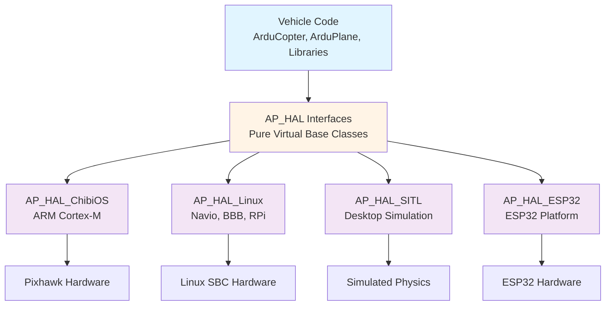
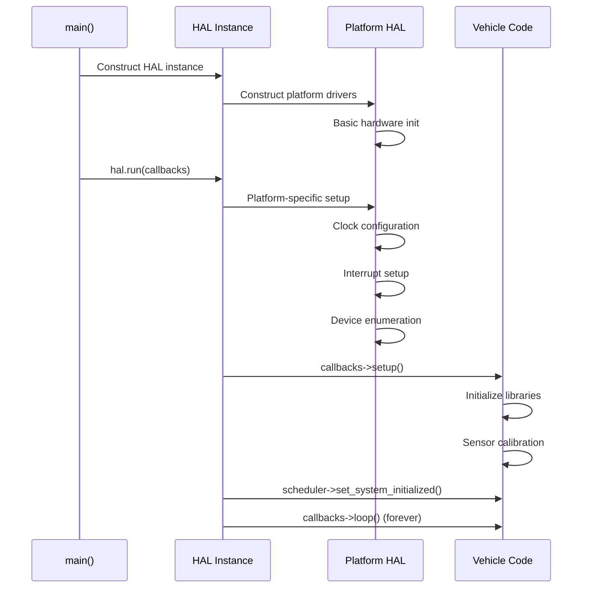

# AP_HAL - ArduPilot Hardware Abstraction Layer

## Overview

The ArduPilot Hardware Abstraction Layer (AP_HAL) provides a platform-independent interface to hardware services, enabling vehicle firmware to run on diverse hardware platforms without modification. This abstraction allows ArduPilot to support ARM microcontrollers, Linux-based flight controllers, simulation environments, and emerging platforms through a unified API.

**Key Capabilities**:
- Platform-independent device interfaces (UART, SPI, I2C, GPIO)
- Unified scheduler and timing services across platforms
- Hardware-agnostic storage and configuration management
- Cross-platform synchronization primitives
- Compile-time platform selection without runtime overhead

## Architecture

### Design Philosophy

The HAL follows these core principles:

- **Platform Independence**: Vehicle code compiles and runs on all supported platforms without #ifdef guards
- **Zero-Cost Abstraction**: Virtual function overhead is acceptable; platform selection happens at compile time
- **Interface Segregation**: Each hardware service has a focused, minimal interface
- **Single-Include Convenience**: Include `<AP_HAL/AP_HAL.h>` to access entire HAL
- **Compile-Time Selection**: Board and platform determined at build time via `waf --board` argument

### Architecture Diagram



### HAL Interface Contract

AP_HAL defines pure virtual base classes that platform implementations must fulfill:

| Interface | Purpose | Source File |
|-----------|---------|-------------|
| **UARTDriver** | Serial communication | `libraries/AP_HAL/UARTDriver.h` |
| **SPIDevice/SPIDeviceManager** | SPI bus access | `libraries/AP_HAL/SPIDevice.h` |
| **I2CDevice/I2CDeviceManager** | I2C bus access | `libraries/AP_HAL/I2CDevice.h` |
| **GPIO** | Digital I/O control | `libraries/AP_HAL/GPIO.h` |
| **Scheduler** | Task scheduling and timing | `libraries/AP_HAL/Scheduler.h` |
| **Storage** | Persistent storage (EEPROM/Flash) | `libraries/AP_HAL/Storage.h` |
| **Semaphores** | Thread synchronization | `libraries/AP_HAL/Semaphores.h` |
| **Util** | Platform utilities and system info | `libraries/AP_HAL/Util.h` |
| **AnalogIn** | Analog-to-digital conversion | `libraries/AP_HAL/AnalogIn.h` |
| **RCInput** | RC receiver input | `libraries/AP_HAL/RCInput.h` |
| **RCOutput** | PWM output to servos/ESCs | `libraries/AP_HAL/RCOutput.h` |
| **CANIface** | CAN bus interface | `libraries/AP_HAL/CANIface.h` |
| **Flash** | Flash memory interface | `libraries/AP_HAL/Flash.h` |
| **DSP** | Digital signal processing | `libraries/AP_HAL/DSP.h` |
| **OpticalFlow** | Optical flow sensor interface | `libraries/AP_HAL/OpticalFlow.h` |

## Core Device Abstractions

### UARTDriver - Serial Communication

**Purpose**: Provides buffered, asynchronous serial communication for telemetry, GPS, and debug console.

**Key Methods**:
```cpp
// Initialize UART with baud rate and buffer sizes
void begin(uint32_t baud, uint16_t rxSpace, uint16_t txSpace);

// Write data to UART (buffered, non-blocking)
size_t write(const uint8_t *buffer, size_t size);

// Read available data from UART
ssize_t read(uint8_t *buffer, uint16_t count);

// Check bytes available for reading
uint32_t available();

// Port locking for exclusive access
bool lock_port(uint32_t write_key, uint32_t read_key);
```

**Features**:
- **Buffered I/O**: Ring buffers for transmit and receive
- **Port Locking**: Exclusive access for passthrough protocols (MAVLink FTP, DroneCAN)
- **Flow Control**: Hardware (CTS/RTS) and software flow control
- **Parity/Stop Bits**: Configurable serial framing
- **DMA Support**: Platform-specific DMA acceleration
- **Options**: Pin inversion, half-duplex, pull-up/pull-down configuration

**Usage Pattern**:
```cpp
AP_HAL::UARTDriver* uart = hal.serial(1);  // SERIAL1
uart->begin(57600, 512, 512);  // 57600 baud, 512-byte buffers
uart->write((const uint8_t*)"Hello\n", 6);

uint8_t buffer[128];
ssize_t nbytes = uart->read(buffer, sizeof(buffer));
```

Source: `libraries/AP_HAL/UARTDriver.h`

### SPIDevice - Serial Peripheral Interface

**Purpose**: Provides access to SPI peripherals (IMUs, barometers, external flash) with device isolation and speed control.

**Key Methods**:
```cpp
// Set bus speed (high-speed or low-speed mode)
bool set_speed(Device::Speed speed);

// Transfer data (send and/or receive)
bool transfer(const uint8_t *send, uint32_t send_len,
              uint8_t *recv, uint32_t recv_len);

// Full-duplex transfer (simultaneous send and receive)
bool transfer_fullduplex(const uint8_t *send, uint8_t *recv, uint32_t len);

// Get semaphore for exclusive bus access
Semaphore *get_semaphore();

// Register periodic callback for sensor sampling
PeriodicHandle register_periodic_callback(uint32_t period_usec, PeriodicCb cb);
```

**Device Manager**:
```cpp
// Get SPI device by name (from board definition)
SPIDevice *get_device_ptr(const char *name);
```

**Features**:
- **Device Naming**: Platform-specific device names in board definitions
- **Speed Modes**: HIGH (>= 8MHz), LOW (<= 1MHz) for initialization
- **Automatic CS**: Chip select assertion/deassertion managed by HAL
- **DMA Support**: Zero-copy transfers on capable platforms
- **Bus Sharing**: Semaphore-protected multi-device access

**Usage Pattern**:
```cpp
AP_HAL::OwnPtr<AP_HAL::SPIDevice> dev = hal.spi->get_device("mpu6000");
if (!dev || !dev->get_semaphore()->take(HAL_SEMAPHORE_BLOCK_FOREVER)) {
    return false;
}
dev->set_speed(AP_HAL::Device::SPEED_HIGH);
uint8_t reg = 0x75;  // WHO_AM_I register
uint8_t val;
dev->transfer(&reg, 1, &val, 1);
dev->get_semaphore()->give();
```

Source: `libraries/AP_HAL/SPIDevice.h`

### I2CDevice - Inter-Integrated Circuit

**Purpose**: Provides access to I2C peripherals (magnetometers, airspeed sensors, external EEPROMs) with bus sharing and error recovery.

**Key Methods**:
```cpp
// Set bus speed (standard 100kHz, fast 400kHz, fast+ 1MHz)
bool set_speed(Device::Speed speed);

// Transfer data to/from I2C device
bool transfer(const uint8_t *send, uint32_t send_len,
              uint8_t *recv, uint32_t recv_len);

// Read multiple registers efficiently
bool read_registers_multiple(uint8_t first_reg, uint8_t *recv,
                             uint32_t recv_len, uint8_t times);

// Get semaphore for exclusive bus access
Semaphore *get_semaphore();

// Force split transfers (stop condition between send/receive)
void set_split_transfers(bool set);
```

**Device Manager**:
```cpp
// Get I2C device by bus and address
I2CDevice *get_device_ptr(uint8_t bus, uint8_t address,
                         uint32_t bus_clock=400000,
                         bool use_smbus=false,
                         uint32_t timeout_ms=4);
```

**Features**:
- **Bus Selection**: Multiple I2C buses on capable platforms
- **Address Resolution**: 7-bit and 10-bit addressing
- **Clock Stretching**: Slave-driven clock hold support
- **SMBus Protocol**: Packet error checking for SMBus devices
- **Timeout Protection**: Configurable I2C transaction timeouts

**Usage Pattern**:
```cpp
AP_HAL::OwnPtr<AP_HAL::I2CDevice> dev = hal.i2c_mgr->get_device(0, 0x1E);  // HMC5883L compass
if (!dev || !dev->get_semaphore()->take(HAL_SEMAPHORE_BLOCK_FOREVER)) {
    return false;
}
uint8_t reg = 0x0A;  // Identification register A
uint8_t id[3];
dev->transfer(&reg, 1, id, 3);
dev->get_semaphore()->give();
```

Source: `libraries/AP_HAL/I2CDevice.h`

### GPIO - General Purpose I/O

**Purpose**: Provides digital pin control for LEDs, buzzers, external triggers, and interrupt handling.

**Key Methods**:
```cpp
// Configure pin mode (input, output, alternate function)
void pinMode(uint8_t pin, uint8_t mode);

// Read digital pin state
uint8_t read(uint8_t pin);

// Write digital pin state
void write(uint8_t pin, uint8_t value);

// Toggle pin state
void toggle(uint8_t pin);

// Attach interrupt to pin
bool attach_interrupt(uint8_t pin, AP_HAL::Proc proc, INTERRUPT_TRIGGER_TYPE mode);
```

**Features**:
- **Platform Abstraction**: Unified pin numbering across platforms
- **Interrupt Support**: Rising, falling, or both-edge trigger detection
- **PWM Input**: PWMSource class for measuring RC input pulse widths
- **Safe Mode**: Invalid pin access returns false rather than crashing

**Usage Pattern**:
```cpp
hal.gpio->pinMode(HAL_GPIO_LED_ON, HAL_GPIO_OUTPUT);
hal.gpio->write(HAL_GPIO_LED_ON, 1);  // Turn on LED
hal.gpio->toggle(HAL_GPIO_LED_ON);    // Toggle LED state
```

Source: `libraries/AP_HAL/GPIO.h`

### Scheduler - Task Scheduling and Timing

**Purpose**: Provides cooperative multitasking, precise timing, and system initialization control.

**Key Methods**:
```cpp
// Delay execution
void delay(uint16_t ms);
void delay_microseconds(uint16_t us);

// Register periodic tasks
void register_timer_process(AP_HAL::MemberProc);
void register_io_process(AP_HAL::MemberProc);

// Register failsafe callback
void register_timer_failsafe(AP_HAL::Proc, uint32_t period_us);

// System initialization control
void set_system_initialized();
bool is_system_initialized();

// Reboot system
void reboot(bool hold_in_bootloader = false);

// Check if running in main thread
bool in_main_thread() const;

// Interrupt control (platform-specific)
void *disable_interrupts_save();
void restore_interrupts(void *state);
```

**Task Priority Levels**:
- **Main Loop**: Vehicle-specific control loop (typically 400Hz for copters)
- **Timer Tasks**: High-priority sensor sampling (register_timer_process)
- **IO Tasks**: Low-priority background tasks (register_io_process)
- **Failsafe**: Safety-critical monitoring (register_timer_failsafe)

**Usage Pattern**:
```cpp
void setup() {
    hal.scheduler->init();
    hal.scheduler->register_timer_process(FUNCTOR_BIND_MEMBER(&Class::update, void));
}

void loop() {
    hal.scheduler->delay(20);  // 50Hz main loop
}
```

Source: `libraries/AP_HAL/Scheduler.h`

### Storage - Persistent Configuration

**Purpose**: Provides EEPROM-like persistent storage for parameters, calibration data, and configuration.

**Key Methods**:
```cpp
// Initialize storage system
void init();

// Read bytes from storage
void read_block(void *dst, uint16_t src_offset, size_t size);

// Write bytes to storage
void write_block(uint16_t dst_offset, const void *src, size_t size);

// Check if storage is healthy
bool healthy();
```

**Features**:
- **Wear Leveling**: Automatic distribution of writes across flash sectors
- **Power-Safe Writes**: Atomic updates with rollback capability
- **Lazy Commit**: Deferred writes for efficiency
- **Board-Specific**: Flash, EEPROM, or file-backed storage depending on platform

**Usage Pattern**:
```cpp
// Typically used through AP_Param system, not directly
hal.storage->read_block(&value, offset, sizeof(value));
hal.storage->write_block(offset, &value, sizeof(value));
```

Source: `libraries/AP_HAL/Storage.h`

### Semaphores - Thread Synchronization

**Purpose**: Provides mutual exclusion for shared resources in multi-threaded environments.

**Key Methods**:
```cpp
// Acquire semaphore (blocking or non-blocking)
bool take(uint32_t timeout_ms);
bool take_nonblocking();

// Release semaphore
bool give();

// Get current owner
void *get_holder();
```

**Usage Patterns**:

**RAII-Style Protection**:
```cpp
WITH_SEMAPHORE(device->get_semaphore());
// Semaphore automatically acquired and released
device->transfer(...);
```

**Manual Control**:
```cpp
if (semaphore->take(100)) {  // 100ms timeout
    // Critical section
    semaphore->give();
}
```

**Features**:
- **Priority Inheritance**: Prevents priority inversion on RTOS platforms
- **Deadlock Detection**: Debug builds track semaphore holders
- **Timeout Support**: Configurable blocking with timeout

Source: `libraries/AP_HAL/Semaphores.h`

### Device - Generic Device Interface

**Purpose**: Common base class for SPI and I2C devices providing unified device lifecycle and callback registration.

**Key Methods**:
```cpp
// Set bus speed (device-specific interpretation)
virtual bool set_speed(Speed speed) = 0;

// Transfer data to/from device
virtual bool transfer(const uint8_t *send, uint32_t send_len,
                     uint8_t *recv, uint32_t recv_len) = 0;

// Read register (helper for common pattern)
bool read_registers(uint8_t first_reg, uint8_t *recv, uint32_t recv_len);

// Write register (helper for common pattern)
bool write_register(uint8_t reg, uint8_t val, bool checked=false);

// Get device semaphore
virtual Semaphore *get_semaphore() = 0;

// Register periodic callback for sensor sampling
virtual PeriodicHandle register_periodic_callback(uint32_t period_usec, PeriodicCb cb) = 0;
```

**Speed Enumeration**:
```cpp
enum Speed {
    SPEED_HIGH,    // Maximum supported speed
    SPEED_LOW      // Initialization/slow speed
};
```

**Periodic Callback Pattern**:
```cpp
// Sensor driver registers 1kHz sampling callback
dev->register_periodic_callback(1000, FUNCTOR_BIND_MEMBER(&Driver::timer, void));

void Driver::timer() {
    // Called every 1ms from timer context
    // Acquire data from sensor
}
```

Source: `libraries/AP_HAL/Device.h`

### Util - Platform Utilities

**Purpose**: Provides platform-specific utilities for memory management, system information, and safety state.

**Key Methods**:
```cpp
// System information
const char *get_system_id();
uint32_t available_memory();

// Safety state (for hardware safety switch)
enum safety_state get_safety_state();
void set_soft_armed(bool armed);

// Memory allocation with type tagging
void *malloc_type(size_t size, enum memory_type mem_type);

// Timing
uint64_t get_hw_rtc();  // Hardware real-time clock

// Persistent data
bool get_system_id_unformatted(uint8_t buf[], uint8_t &len);

// Command execution (SITL/Linux)
int perf_begin(const char *name);
void perf_end(int h);

// CRC computation
uint32_t crc32(const uint8_t *data, uint32_t len);

// Tone generation (buzzers)
bool toneAlarm_init();
void toneAlarm_set_buzzer_tone(float frequency, float volume, uint32_t duration_ms);
```

**Features**:
- **Memory Debugging**: Type-tagged allocations for debugging leaks
- **Performance Monitoring**: Timing harness for profiling
- **Safety Integration**: Hardware safety switch state reporting
- **Platform-Specific Extensions**: Each platform can add utilities

Source: `libraries/AP_HAL/Util.h`

### System Functions - Global Timing and Panic

**Purpose**: Provides global timing functions and system panic handler accessible without HAL instance.

**Key Functions**:
```cpp
// High-resolution timing (microsecond precision)
uint32_t AP_HAL::micros();
uint64_t AP_HAL::micros64();
uint16_t AP_HAL::micros16();  // Wraps every 65.5ms

// Millisecond timing
uint32_t AP_HAL::millis();
uint64_t AP_HAL::millis64();
uint16_t AP_HAL::millis16();  // Wraps every 65.5s

// System panic (never returns)
void AP_HAL::panic(const char *errormsg, ...) NORETURN;

// Timeout helpers (template-based, wrap-safe)
bool AP_HAL::timeout_expired(T past_time, S now, R timeout);
T AP_HAL::timeout_remaining(T past_time, S now, R timeout);
```

**Timeout Pattern** (wrap-safe comparison):
```cpp
uint32_t start_time = AP_HAL::millis();
// ... do work ...
if (AP_HAL::timeout_expired(start_time, AP_HAL::millis(), 5000)) {
    // 5 seconds have elapsed
}
```

**Panic Usage**:
```cpp
if (critical_error) {
    AP_HAL::panic("Critical hardware failure: %s", error_msg);
    // Never returns - system halts or reboots
}
```

Source: `libraries/AP_HAL/system.h`

## HAL Lifecycle and Initialization

### Startup Sequence

The HAL initialization follows a well-defined sequence that ensures hardware is ready before vehicle code executes:



### Main Entry Point

Each platform provides a `main()` function that constructs the HAL and invokes the vehicle code:

```cpp
// Platform-specific main (AP_HAL_ChibiOS, AP_HAL_Linux, etc.)
int main(int argc, char *argv[]) {
    // Construct platform HAL instance
    const AP_HAL::HAL& hal = AP_HAL::get_HAL();
    
    // Run vehicle code through callbacks
    hal.run(argc, argv, callbacks);
    
    return 0;  // Never reached
}
```

### Vehicle Callbacks

Vehicle code provides setup() and loop() callbacks:

```cpp
// ArduCopter/Copter.cpp (example)
void setup() {
    copter.init_ardupilot();  // Initialize all subsystems
}

void loop() {
    copter.scheduler.loop();  // Run scheduled tasks
}
```

### Initialization Stages

**Stage 1: Hardware Initialization**
- Clock tree configuration (PLL, dividers)
- GPIO alternate function mapping
- DMA controller setup
- Interrupt vector table configuration
- USB/Serial console initialization

**Stage 2: HAL Service Initialization**
- Storage system initialization (read parameter storage)
- Scheduler initialization (task queue setup)
- UART buffer allocation
- SPI/I2C bus initialization
- GPIO subsystem ready

**Stage 3: Vehicle Initialization** (`setup()` callback)
- Parameter loading from storage
- Sensor detection and calibration
- Library initialization (AHRS, GPS, etc.)
- GCS connection establishment
- Mode initialization

**Stage 4: System Ready** (`set_system_initialized()`)
- Arming checks enabled
- Failsafe monitoring active
- Main loop begins at configured rate

Source: Platform-specific `main()` in `AP_HAL_ChibiOS/system.cpp`, `AP_HAL_Linux/system.cpp`, etc.

## Platform Implementations

### AP_HAL_ChibiOS - ARM Cortex-M (Production Autopilots)

**Target Hardware**: Pixhawk, CubeOrange, Durandal, Kakute F7, MatekH743, and 150+ other ARM boards

**Features**:
- **RTOS**: ChibiOS real-time operating system for true preemptive multitasking
- **DMA**: Extensive DMA usage for UART, SPI, I2C zero-copy transfers
- **Interrupts**: Efficient nested interrupt handling
- **Flash Storage**: Internal flash with wear leveling for parameters
- **USB**: CDC-ACM virtual COM port for MAVLink
- **Hardware Timers**: 16+ timer channels for PWM output and input capture
- **Memory Protection**: MPU configuration for stack overflow detection

**Board Definition System**: Hardware described in `.hwdef` files defining:
- Pin mappings and alternate functions
- Device locations on SPI/I2C buses
- DMA stream assignments
- Bootloader configuration

**Documentation**: See `libraries/AP_HAL_ChibiOS/README.md`

### AP_HAL_Linux - Linux Single-Board Computers

**Target Hardware**: Raspberry Pi, BeagleBone, Navio2, Erle-Brain

**Features**:
- **Userspace**: Runs as userspace application (no kernel modules required)
- **sysfs**: Device access through Linux sysfs interfaces
- **Threads**: Pthreads for concurrent I/O
- **SD Card Storage**: File-based parameter storage
- **Network**: TCP/UDP MAVLink over Ethernet/WiFi
- **Heat Scheduler**: CPU thermal management

**Special Considerations**:
- Non-real-time Linux kernel introduces jitter
- Root or appropriate permissions required for GPIO/SPI/I2C
- Scheduler uses SCHED_FIFO for better latency

**Documentation**: See `libraries/AP_HAL_Linux/README.md`

### AP_HAL_SITL - Software-in-the-Loop Simulation

**Target Platform**: Developer workstations (Linux, macOS, Windows/WSL)

**Features**:
- **Physics Simulation**: Integrates with JSBSim, Gazebo, or built-in physics
- **Sensor Simulation**: Simulated IMU, GPS, barometer, compass, rangefinders
- **Network I/O**: UDP sockets for MAVLink and RC input
- **Time Control**: Adjustable simulation speed for faster testing
- **Crash-Safe**: Simulation can be paused/reset without hardware risk

**Usage**:
```bash
./Tools/autotest/sim_vehicle.py -v ArduCopter --console --map
```

**Documentation**: See `libraries/AP_HAL_SITL/README.md` and `Tools/autotest/README.md`

### AP_HAL_ESP32 - ESP32 IoT Platform

**Target Hardware**: ESP32, ESP32-S2, ESP32-S3 chips

**Features**:
- **WiFi**: Built-in 802.11 b/g/n for wireless telemetry
- **Bluetooth**: BLE support for configuration
- **Low Cost**: Sub-$10 hardware for educational/experimental use
- **FreeRTOS**: ESP-IDF RTOS integration
- **Limited Resources**: Reduced functionality compared to ARM platforms

**Limitations**:
- Fewer peripherals (limited number of UARTs, SPI buses)
- Lower CPU performance than ARM Cortex-M7
- Typically used for sub-scale or experimental platforms

**Documentation**: See `libraries/AP_HAL_ESP32/README.md`

### AP_HAL_Empty - Porting Template

**Purpose**: Minimal skeleton implementation for porting to new platforms

**Contents**:
- Stub implementations of all HAL interfaces
- Minimal main() entry point
- Documentation of required methods

**Use Case**: Starting point for new platform ports (QURT, Zephyr, etc.)

**Documentation**: See `libraries/AP_HAL_Empty/README.md`

## Singleton Accessor Pattern

### Global HAL Access

The HAL instance is globally accessible through the `hal` singleton:

```cpp
#include <AP_HAL/AP_HAL.h>

extern const AP_HAL::HAL& hal;

void my_function() {
    hal.console->printf("Hello from HAL!\n");
    uint32_t now = AP_HAL::millis();
}
```

### HAL Instance Creation

Each platform creates and exports its HAL instance:

```cpp
// AP_HAL_ChibiOS/HAL_ChibiOS_Class.cpp (example)
const AP_HAL::HAL& AP_HAL::get_HAL() {
    static const HAL_ChibiOS hal_chibios;
    return hal_chibios;
}
```

### Accessing HAL Services

All HAL services are accessed through the `hal` global:

```cpp
// UART access
hal.serial(0)->begin(115200);
hal.console->printf("Debug: %d\n", value);

// SPI device
auto dev = hal.spi->get_device("mpu6000");

// I2C device
auto dev = hal.i2c_mgr->get_device(0, 0x1E);

// GPIO
hal.gpio->pinMode(LED_PIN, HAL_GPIO_OUTPUT);
hal.gpio->write(LED_PIN, 1);

// Scheduler
hal.scheduler->delay(100);

// Storage
hal.storage->read_block(&data, offset, sizeof(data));

// Utilities
uint32_t free_mem = hal.util->available_memory();
```

### Thread Safety

HAL access from multiple threads requires proper synchronization:

```cpp
// Correct: Use device semaphore
WITH_SEMAPHORE(dev->get_semaphore());
dev->transfer(...);

// Incorrect: No synchronization
dev->transfer(...);  // Race condition if called from multiple threads
```

## Cross-Platform Development Patterns

### Writing Portable Code

**DO: Use HAL abstractions exclusively**
```cpp
// Correct - works on all platforms
hal.scheduler->delay(100);
uint32_t now = AP_HAL::millis();
```

**DON'T: Use platform-specific APIs**
```cpp
// Wrong - only works on ChibiOS
chThdSleepMilliseconds(100);  // Platform-specific call
```

### Conditional Compilation for Platform Differences

When platform-specific code is unavoidable, use feature flags defined in `AP_HAL_Boards.h`:

```cpp
#include <AP_HAL/AP_HAL.h>

#if CONFIG_HAL_BOARD == HAL_BOARD_CHIBIOS
    // ChibiOS-specific code
    extern "C" void port_specific_function();
    port_specific_function();
#elif CONFIG_HAL_BOARD == HAL_BOARD_LINUX
    // Linux-specific code
    system("modprobe spidev");
#elif CONFIG_HAL_BOARD == HAL_BOARD_SITL
    // Simulation-specific code
    sitl->set_wind_speed(10);
#endif
```

**Available Board Macros**:
- `HAL_BOARD_CHIBIOS` - ARM microcontrollers using ChibiOS
- `HAL_BOARD_LINUX` - Linux single-board computers
- `HAL_BOARD_SITL` - Software-in-the-loop simulation
- `HAL_BOARD_ESP32` - ESP32 family

**Feature Detection Macros**:
- `HAL_WITH_DSP` - DSP accelerator available
- `HAL_NUM_CAN_IFACES` - Number of CAN interfaces
- `HAL_HAVE_HARDWARE_DOUBLE` - Hardware double-precision FPU
- `HAL_MINIMIZE_FEATURES` - Reduced functionality build

### Device Detection Pattern

Sensor drivers should gracefully handle missing hardware:

```cpp
bool MyDriver::init() {
    auto dev = hal.spi->get_device("mydevice");
    if (!dev) {
        // Device not present on this board
        return false;
    }
    
    if (!dev->get_semaphore()->take(HAL_SEMAPHORE_BLOCK_FOREVER)) {
        return false;
    }
    
    uint8_t whoami;
    if (!dev->read_registers(WHOAMI_REG, &whoami, 1)) {
        dev->get_semaphore()->give();
        return false;  // Communication failure
    }
    
    dev->get_semaphore()->give();
    
    if (whoami != EXPECTED_WHOAMI) {
        return false;  // Wrong device or not responding
    }
    
    // Device successfully detected
    return true;
}
```

### Performance Considerations

**Minimize Virtual Function Overhead**:
Virtual function calls have overhead (~2-5 cycles). For performance-critical code:

```cpp
// Cache frequently-accessed pointers
AP_HAL::UARTDriver *uart = hal.serial(0);
for (int i = 0; i < 1000; i++) {
    uart->write(buffer[i]);  // Avoid hal.serial(0)->write() in loop
}
```

**Avoid Excessive Allocation**:
Some platforms have limited heap. Prefer static allocation:

```cpp
// Preferred: Static allocation
uint8_t buffer[256];

// Avoid: Dynamic allocation
uint8_t *buffer = new uint8_t[256];  // May fail on constrained platforms
```

**Use Semaphores Efficiently**:
```cpp
// Efficient: Single acquisition for multiple operations
WITH_SEMAPHORE(dev->get_semaphore());
dev->write_register(REG1, val1);
dev->write_register(REG2, val2);
dev->write_register(REG3, val3);

// Inefficient: Multiple acquisitions
dev->write_register(REG1, val1);  // Acquires/releases semaphore
dev->write_register(REG2, val2);  // Acquires/releases semaphore
dev->write_register(REG3, val3);  // Acquires/releases semaphore
```

### Timing Considerations

**Scheduler Rates Vary by Platform**:
- ChibiOS: Precise timing with hardware timers
- Linux: Subject to OS scheduling jitter (±1-10ms)
- SITL: Timing locked to simulation step

**Use Relative Timing**:
```cpp
// Correct: Relative timing
uint32_t start = AP_HAL::millis();
while (AP_HAL::millis() - start < timeout_ms) {
    // Wait with wraparound safety
}

// Incorrect: Absolute timing (breaks on wraparound)
uint32_t deadline = AP_HAL::millis() + timeout_ms;
while (AP_HAL::millis() < deadline) {  // Fails when millis() wraps
    // ...
}
```

## Porting to a New Platform

### Prerequisites

Before starting a HAL port:

1. **Understand Target Platform**:
   - Processor architecture (ARM Cortex-M, RISC-V, x86, etc.)
   - Available peripherals (UART, SPI, I2C, GPIO counts)
   - Memory constraints (RAM, Flash)
   - Operating system or bare-metal

2. **Development Tools**:
   - Cross-compiler toolchain
   - Debugger (JTAG/SWD for embedded targets)
   - Build system integration (waf)

3. **ArduPilot Knowledge**:
   - Familiarity with existing HAL implementations
   - Understanding of vehicle requirements
   - Build system operation

### Porting Steps

#### Step 1: Create HAL Directory Structure

```bash
mkdir -p libraries/AP_HAL_NEWPLATFORM
cd libraries/AP_HAL_NEWPLATFORM
```

**Required Files**:
- `HAL_NEWPLATFORM_Class.h` - Main HAL class declaration
- `HAL_NEWPLATFORM_Class.cpp` - HAL instance implementation
- `UARTDriver.h` / `UARTDriver.cpp` - Serial port implementation
- `SPIDevice.h` / `SPIDevice.cpp` - SPI bus implementation
- `I2CDevice.h` / `I2CDevice.cpp` - I2C bus implementation
- `GPIO.h` / `GPIO.cpp` - Digital I/O implementation
- `Scheduler.h` / `Scheduler.cpp` - Task scheduler implementation
- `Storage.h` / `Storage.cpp` - Persistent storage implementation
- `Util.h` / `Util.cpp` - Platform utilities
- `system.cpp` - main() entry point and startup code
- `Semaphores.h` / `Semaphores.cpp` - Synchronization primitives
- `AnalogIn.h` / `AnalogIn.cpp` - ADC implementation
- `RCInput.h` / `RCInput.cpp` - RC receiver input
- `RCOutput.h` / `RCOutput.cpp` - PWM output

#### Step 2: Define HAL Class

```cpp
// HAL_NEWPLATFORM_Class.h
#pragma once

#include <AP_HAL/AP_HAL.h>
#include "AP_HAL_NEWPLATFORM_Namespace.h"

class HAL_NEWPLATFORM : public AP_HAL::HAL {
public:
    HAL_NEWPLATFORM();
    void run(int argc, char* const argv[], Callbacks* callbacks) const override;
};

// Create HAL instance
const AP_HAL::HAL& AP_HAL::get_HAL();
```

#### Step 3: Implement Core Interfaces

Start with minimal implementations that compile:

**UARTDriver**: Implement buffered serial I/O
**Scheduler**: Provide delay(), micros(), millis()
**GPIO**: Basic digital I/O
**Storage**: Simple read/write to persistent memory

Use `AP_HAL_Empty` as a template for stub implementations.

#### Step 4: Implement Device Buses

**SPIDevice**: Blocking transfers initially, optimize with DMA later
**I2CDevice**: Implement I2C protocol with timeout protection

#### Step 5: Integrate with Build System

Add platform to `wscript` and create board definitions:

```python
# In Tools/ardupilotwaf/boards.py
class newplatform(Board):
    def configure_env(self, cfg, env):
        env.TOOLCHAIN = 'arm-none-eabi'  # or appropriate toolchain
        env.CFLAGS += ['-DCONFIG_HAL_BOARD=HAL_BOARD_NEWPLATFORM']
```

#### Step 6: Test Incrementally

**Test Harness**: Create minimal vehicle sketch to test each interface:

```cpp
// Test UART
void test_uart() {
    hal.console->printf("UART test\n");
    hal.scheduler->delay(100);
}

// Test GPIO
void test_gpio() {
    hal.gpio->pinMode(LED_PIN, HAL_GPIO_OUTPUT);
    for (int i = 0; i < 10; i++) {
        hal.gpio->toggle(LED_PIN);
        hal.scheduler->delay(500);
    }
}

// Test SPI
void test_spi() {
    auto dev = hal.spi->get_device("test");
    if (dev) {
        uint8_t tx = 0x55, rx;
        dev->transfer(&tx, 1, &rx, 1);
        hal.console->printf("SPI: sent 0x%02x, received 0x%02x\n", tx, rx);
    }
}
```

#### Step 7: Optimize and Harden

- Add DMA support for UART, SPI, I2C
- Implement interrupt-driven I/O
- Add thread safety (semaphores)
- Optimize memory allocation
- Profile and eliminate bottlenecks

### Porting Checklist

- [ ] HAL class created and instantiated
- [ ] main() entry point calls HAL::run()
- [ ] UART: Basic read/write working
- [ ] UART: Buffering implemented
- [ ] UART: Optional DMA acceleration
- [ ] Scheduler: delay() and delay_microseconds() working
- [ ] Scheduler: micros() and millis() implemented
- [ ] Scheduler: Periodic task registration working
- [ ] GPIO: pinMode(), read(), write() working
- [ ] GPIO: Interrupt attachment working
- [ ] SPI: Basic transfer() working
- [ ] SPI: Device manager implemented
- [ ] SPI: Semaphore protection working
- [ ] I2C: Basic transfer() working
- [ ] I2C: Multiple devices on same bus work
- [ ] Storage: read_block() and write_block() working
- [ ] Storage: Wear leveling implemented
- [ ] Semaphores: take() and give() working
- [ ] Semaphores: Thread-safe on platform
- [ ] AnalogIn: ADC channels readable
- [ ] RCInput: RC receiver protocol decoding
- [ ] RCOutput: PWM generation working
- [ ] Util: System ID and memory functions
- [ ] Build system integration complete
- [ ] Vehicle code compiles and links
- [ ] SITL-like testing infrastructure created

### Common Porting Pitfalls

**Timing Precision**: Ensure micros() is truly microsecond-accurate. Many RTOSes provide millisecond resolution only. Use hardware timers for precision timing.

**Interrupt Context**: Many HAL methods are called from interrupt context (e.g., UART RX). Ensure thread-safety and avoid blocking operations.

**Memory Constraints**: Embedded platforms have limited RAM. Profile memory usage and optimize buffer sizes.

**Endianness**: ARM is little-endian. Ensure multi-byte transfers to devices account for endianness.

**Synchronization**: RTOS platforms require proper semaphores. Single-threaded platforms can use interrupt disable/enable.

**Storage Atomicity**: Parameter storage must survive power loss mid-write. Implement double-buffering or journaling.

## Testing HAL Implementations

### Unit Testing

Platform-specific tests should verify each interface:

**Location**: `libraries/AP_HAL_PLATFORM/tests/`

**Example Test Structure**:
```cpp
// test_uart.cpp
#include <AP_HAL/AP_HAL.h>

extern const AP_HAL::HAL& hal;

void test_uart_loopback() {
    // Test assumes TX connected to RX
    hal.serial(0)->begin(115200, 128, 128);
    
    const char *test_msg = "Hello";
    hal.serial(0)->write((uint8_t*)test_msg, strlen(test_msg));
    hal.scheduler->delay(10);
    
    uint8_t buf[16];
    size_t nread = hal.serial(0)->read(buf, sizeof(buf));
    assert(nread == strlen(test_msg));
    assert(memcmp(buf, test_msg, nread) == 0);
}
```

### Integration Testing with SITL

Test HAL implementations against vehicle firmware in simulation:

```bash
# Build for SITL
./waf configure --board sitl
./waf copter

# Run with autotest
./Tools/autotest/autotest.py test.Copter
```

### Hardware Validation

**Bring-Up Tests**: Minimal programs to verify hardware functionality:

1. **LED Blink**: Verify GPIO output
2. **Console Echo**: Verify UART I/O
3. **SPI Loopback**: Verify SPI with MOSI->MISO connection
4. **I2C Scan**: Enumerate I2C devices
5. **Timer Precision**: Measure actual vs requested delays

**Sensor Tests**: Verify sensor drivers work on platform:

```bash
# Run sensor detection test
./waf configure --board=yourboard
./waf copter
# Load firmware and check console for sensor detection messages
```

### Performance Benchmarking

Measure HAL performance to identify bottlenecks:

```cpp
uint32_t start = AP_HAL::micros();
for (int i = 0; i < 1000; i++) {
    dev->transfer(tx_buf, 16, rx_buf, 16);
}
uint32_t elapsed = AP_HAL::micros() - start;
hal.console->printf("SPI: %u us per 16-byte transfer\n", elapsed / 1000);
```

**Target Performance**:
- UART write: < 10 µs overhead per byte
- SPI transfer: < 50 µs overhead per transaction
- I2C transfer: < 100 µs overhead per transaction
- GPIO write: < 1 µs
- Scheduler delay: ± 100 µs accuracy

### Compliance Testing

Verify HAL implementation meets ArduPilot requirements:

**Timing Tests**:
- micros() wraps correctly at 32-bit boundary
- millis() advances at correct rate (±1% over 60 seconds)
- Delays are accurate within specified tolerance

**Thread Safety Tests**:
- Concurrent SPI access from multiple threads
- UART writes from timer and main thread
- Storage writes during flight

**Stress Tests**:
- High-rate SPI transfers (1kHz sustained)
- Multiple simultaneous I2C transactions
- UART at maximum baud rate (921600+)

## Configuration and Build System

### Board Selection

Select target platform at configure time:

```bash
./waf configure --board=CubeOrange  # ChibiOS ARM board
./waf configure --board=linux       # Linux platform
./waf configure --board=sitl        # Simulation
./waf configure --board=esp32       # ESP32 platform
```

### Platform Feature Flags

Defined in `libraries/AP_HAL/AP_HAL_Boards.h`:

```cpp
#if CONFIG_HAL_BOARD == HAL_BOARD_CHIBIOS
  #define HAL_NUM_CAN_IFACES 2
  #define HAL_WITH_DSP 1
#elif CONFIG_HAL_BOARD == HAL_BOARD_LINUX
  #define HAL_NUM_CAN_IFACES 0
  #define HAL_WITH_DSP 0
#endif
```

### Board-Specific Configuration

ChibiOS boards use `.hwdef` files to define hardware:

**Example hwdef snippet**:
```
# MCU type
MCU STM32H7xx STM32H743xx

# Crystal frequency
OSCILLATOR_HZ 24000000

# SPI devices
SPIDEV mpu6000 SPI1 DEVID1 MPU6000_CS MODE3 1*MHZ 8*MHZ

# I2C buses
I2C_ORDER I2C1 I2C2

# UARTs
SERIAL_ORDER OTG1 USART1 USART2 USART3
```

**Documentation**: See `libraries/AP_HAL_ChibiOS/hwdef/README.md`

### Compiler and Linker Configuration

Platform-specific compiler flags in waf:

```python
# Example from AP_HAL_ChibiOS
env.CFLAGS += [
    '-mcpu=cortex-m7',
    '-mthumb',
    '-mfpu=fpv5-d16',
    '-mfloat-abi=hard',
]
```

## Common Usage Patterns

### Pattern: UART Communication

```cpp
void setup() {
    // Initialize UART1 (TELEM1) at 57600 baud
    hal.serial(1)->begin(57600, 512, 512);
}

void loop() {
    // Non-blocking read
    if (hal.serial(1)->available() > 0) {
        uint8_t byte;
        if (hal.serial(1)->read(byte)) {
            process_byte(byte);
        }
    }
    
    // Non-blocking write
    const char *msg = "Hello\n";
    hal.serial(1)->write((const uint8_t*)msg, strlen(msg));
}
```

### Pattern: SPI Sensor Access

```cpp
class MySensor {
    AP_HAL::OwnPtr<AP_HAL::SPIDevice> dev;
    
public:
    bool init() {
        dev = hal.spi->get_device("mysensor");
        if (!dev) return false;
        
        // Initialize sensor in low-speed mode
        WITH_SEMAPHORE(dev->get_semaphore());
        dev->set_speed(AP_HAL::Device::SPEED_LOW);
        dev->write_register(RESET_REG, 0x01);
        hal.scheduler->delay(10);
        
        // Switch to high-speed mode
        dev->set_speed(AP_HAL::Device::SPEED_HIGH);
        
        // Register 1kHz sampling callback
        dev->register_periodic_callback(1000, 
            FUNCTOR_BIND_MEMBER(&MySensor::timer, void));
        
        return true;
    }
    
    void timer() {
        // Called every 1ms from timer interrupt
        // Semaphore already acquired by HAL
        uint8_t data[6];
        dev->read_registers(DATA_REG, data, sizeof(data));
        process_data(data);
    }
};
```

### Pattern: I2C Device Access

```cpp
bool probe_device(uint8_t address) {
    auto dev = hal.i2c_mgr->get_device(0, address);
    if (!dev) return false;
    
    WITH_SEMAPHORE(dev->get_semaphore());
    
    // Try to read WHO_AM_I register
    uint8_t whoami;
    if (!dev->read_registers(0x00, &whoami, 1)) {
        return false;  // Device not responding
    }
    
    return true;  // Device found
}
```

### Pattern: GPIO Interrupt

```cpp
void setup_pwm_input() {
    // Attach interrupt to GPIO pin
    hal.gpio->attach_interrupt(
        PWM_INPUT_PIN,
        FUNCTOR_BIND_MEMBER(&Class::pwm_irq_handler, void, uint8_t, bool, uint32_t),
        AP_HAL::GPIO::INTERRUPT_BOTH
    );
}

void pwm_irq_handler(uint8_t pin, bool state, uint32_t timestamp) {
    // Called from interrupt context
    if (state) {
        // Rising edge - start of pulse
        pulse_start_us = timestamp;
    } else {
        // Falling edge - end of pulse
        pulse_width_us = timestamp - pulse_start_us;
    }
}
```

### Pattern: Periodic Task Registration

```cpp
void Copter::init_ardupilot() {
    // Register fast loop (400Hz)
    hal.scheduler->register_timer_process(
        FUNCTOR_BIND_MEMBER(&Copter::fast_loop, void));
    
    // Register slow tasks (50Hz)
    hal.scheduler->register_io_process(
        FUNCTOR_BIND_MEMBER(&Copter::fifty_hz_loop, void));
}
```

### Pattern: Safe Timeout Implementation

```cpp
bool wait_for_response(uint32_t timeout_ms) {
    uint32_t start = AP_HAL::millis();
    
    while (!response_received) {
        if (AP_HAL::timeout_expired(start, AP_HAL::millis(), timeout_ms)) {
            return false;  // Timeout
        }
        hal.scheduler->delay(1);
    }
    
    return true;  // Success
}
```

## Implementation Notes

### Memory Management

- HAL drivers use static allocation where possible
- Dynamic allocation uses `hal.util->malloc_type()` for debugging
- OwnPtr<> provides RAII-style ownership for devices

### Thread Safety

- All device access must acquire device semaphore
- UARTDriver has internal locking
- Storage operations are atomic
- Scheduler callbacks run in specific contexts (timer/IO/main)

### Performance Optimization

- DMA used extensively on ChibiOS for zero-copy I/O
- SPI transactions batched to reduce overhead
- UART buffering minimizes IRQ frequency
- GPIO operations inlined where possible

### Safety Features

- Watchdog timers on embedded platforms
- Hardware safety switch integration
- Panic handler for unrecoverable errors
- Stack overflow detection (MPU on ChibiOS)

## References

### Source Files

- **Core HAL definitions**: `libraries/AP_HAL/AP_HAL.h`
- **HAL class**: `libraries/AP_HAL/HAL.h`
- **Namespace**: `libraries/AP_HAL/AP_HAL_Namespace.h`
- **Board selection**: `libraries/AP_HAL/AP_HAL_Boards.h`
- **All interfaces**: `libraries/AP_HAL/*.h`

### Platform Implementations

- **ChibiOS (ARM)**: `libraries/AP_HAL_ChibiOS/README.md`
- **Linux**: `libraries/AP_HAL_Linux/README.md`
- **SITL**: `libraries/AP_HAL_SITL/README.md`
- **ESP32**: `libraries/AP_HAL_ESP32/README.md`
- **Empty (template)**: `libraries/AP_HAL_Empty/README.md`

### Related Documentation

- **Build system**: `BUILD.md`
- **Board definitions**: `libraries/AP_HAL_ChibiOS/hwdef/README.md`
- **Testing framework**: `Tools/autotest/README.md`
- **Developer documentation**: https://ardupilot.org/dev/

### Key Design Documents

- HAL design philosophy and rationale (external wiki)
- Platform porting guide (external wiki)
- Device driver development guide (external wiki)

## Contributing

When modifying HAL interfaces:

1. **Maintain Backward Compatibility**: Existing vehicle code must compile without changes
2. **Document New Methods**: Add Doxygen comments to all new public methods
3. **Update All Platforms**: Implement or stub new methods in all HAL implementations
4. **Test Across Platforms**: Verify changes work on ChibiOS, Linux, and SITL at minimum
5. **Performance Impact**: Profile changes to ensure no regression in critical paths

### Adding a New Interface

If adding a new HAL interface (e.g., for a new peripheral type):

1. Define pure virtual base class in `libraries/AP_HAL/`
2. Add to `HAL.h` class as public member
3. Implement in all platform HALs (or provide stub)
4. Update `HAL_PLATFORM_Class.cpp` constructor to initialize
5. Document in this README and platform-specific READMEs

## Glossary

- **HAL**: Hardware Abstraction Layer
- **DMA**: Direct Memory Access - hardware-based memory copying
- **RTOS**: Real-Time Operating System (ChibiOS on ARM platforms)
- **SITL**: Software In The Loop - simulation environment
- **SPI**: Serial Peripheral Interface - synchronous serial bus
- **I2C**: Inter-Integrated Circuit - multi-master serial bus
- **UART**: Universal Asynchronous Receiver-Transmitter - serial port
- **GPIO**: General Purpose Input/Output - digital pins
- **PWM**: Pulse Width Modulation - used for servo/ESC control
- **Semaphore**: Synchronization primitive for thread safety
- **ISR**: Interrupt Service Routine - interrupt handler
- **SBC**: Single Board Computer (Raspberry Pi, BeagleBone, etc.)

---

**Last Updated**: 2025-01-22  
**Maintainers**: ArduPilot Development Team  
**License**: GPLv3
