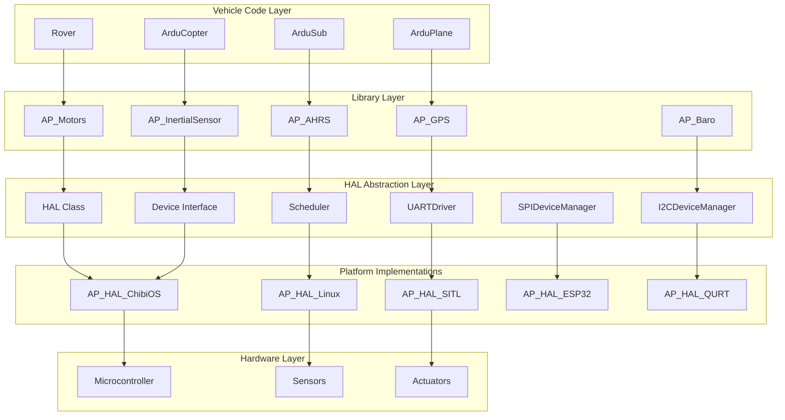
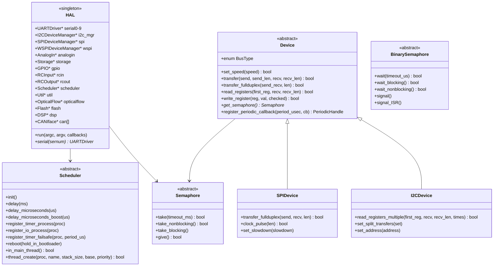

# AP_HAL - ArduPilot Hardware Abstraction Layer


## Table of Contents
- [Overview](#overview)
- [Architecture](#architecture)
- [Device Interfaces](#device-interfaces)
- [Scheduler & Threading](#scheduler--threading)
- [Platform Ports](#platform-ports)
- [API Reference](#api-reference)
- [Integration Examples](#integration-examples)
- [Testing](#testing)
- [Contributing](#contributing)

## Overview

The AP_HAL (ArduPilot Hardware Abstraction Layer) provides a unified interface for accessing hardware peripherals across different autopilot platforms. This abstraction enables ArduPilot vehicle code to run unchanged on multiple hardware platforms, from high-performance ARM Cortex-M7 flight controllers to Linux-based companion computers and Software-In-The-Loop (SITL) simulation environments.

**Source Files**: `/libraries/AP_HAL/`

### Key Features

- **Platform Independence**: Single codebase supports ChibiOS (ARM), Linux, ESP32, QURT (Snapdragon), SITL, and custom platforms
- **Unified Device Model**: Common abstractions for SPI, I2C, UART, GPIO, ADC, and CAN bus devices
- **Real-Time Scheduling**: Priority-based task scheduler with microsecond-precision timing
- **Thread Safety**: Semaphore and mutex primitives for safe concurrent access to shared resources
- **DMA Support**: Zero-copy device I/O with DMA-optimized transfer functions
- **Hot-Pluggable Devices**: Dynamic device registration and discovery

### Primary Responsibilities

1. **Hardware Access**: Provides standardized APIs for accessing MCU peripherals (UART, SPI, I2C, GPIO, ADC, PWM, CAN)
2. **Timing Services**: High-resolution delays, timers, and real-time scheduling
3. **Concurrency Control**: Semaphores and mutexes for thread-safe resource access
4. **Platform Initialization**: Board-specific startup and configuration
5. **Device Management**: Device driver registration and lifecycle management

## Architecture

### System Architecture



### HAL Class Hierarchy



### Core Components

**Source**: `/libraries/AP_HAL/HAL.h` (lines 21-161)

The `AP_HAL::HAL` class is the central component that aggregates all hardware interfaces:

- **Serial Ports**: 10 UART interfaces (`serial0` through `serial9`) for console, telemetry, GPS, and extension ports
- **Device Managers**: `I2CDeviceManager` and `SPIDeviceManager` for bus device access
- **Analog Input**: `AnalogIn` for ADC readings (battery voltage, current sensors)
- **Storage**: `Storage` for persistent parameter storage (EEPROM/Flash)
- **GPIO**: `GPIO` for digital I/O pins
- **RC I/O**: `RCInput` for receiver input, `RCOutput` for PWM/DShot servo/motor output
- **Scheduler**: `Scheduler` for real-time task management
- **Utility**: `Util` for platform-specific helpers (tone generation, LED control)
- **CAN Interfaces**: `CANIface` array for DroneCAN/UAVCAN communication

## Device Interfaces

### Device Abstraction Model

**Source**: `/libraries/AP_HAL/Device.h` (lines 33-407)

The `AP_HAL::Device` class provides a unified interface for communication with peripherals on different bus types:

#### Supported Bus Types

```cpp
enum BusType {
    BUS_TYPE_UNKNOWN = 0,
    BUS_TYPE_I2C     = 1,
    BUS_TYPE_SPI     = 2,
    BUS_TYPE_UAVCAN  = 3,
    BUS_TYPE_SITL    = 4,
    BUS_TYPE_MSP     = 5,
    BUS_TYPE_SERIAL  = 6,
    BUS_TYPE_WSPI    = 7,  // Wide SPI (Quad/Octo SPI)
};
```

#### Core Device Operations

**Transfer Operations** (Source: `/libraries/AP_HAL/Device.h:119-139`):

```cpp
// Half-duplex transfer: send then receive
virtual bool transfer(const uint8_t *send, uint32_t send_len,
                      uint8_t *recv, uint32_t recv_len) = 0;

// Full-duplex transfer (SPI): simultaneous send/receive
virtual bool transfer_fullduplex(uint8_t *send_recv, uint32_t len);
```

**Register Access Wrappers** (Source: `/libraries/AP_HAL/Device.h:163-171`):

```cpp
// Read multiple registers starting from first_reg
bool read_registers(uint8_t first_reg, uint8_t *recv, uint32_t recv_len);

// Write single register
bool write_register(uint8_t reg, uint8_t val, bool checked=false);
```

#### Periodic Callback System

**Source**: `/libraries/AP_HAL/Device.h:260-273`

Devices can register callbacks that execute periodically on a dedicated bus thread:

```cpp
// Register callback to run every period_usec microseconds
PeriodicHandle register_periodic_callback(uint32_t period_usec, PeriodicCb callback);

// Adjust callback period dynamically
bool adjust_periodic_callback(PeriodicHandle h, uint32_t period_usec);

// Cancel periodic callback
bool unregister_callback(PeriodicHandle h);
```

> **Note**: Periodic callbacks execute on the bus thread with the bus semaphore already held. No additional locking is required within the callback, and blocking operations should be avoided.

#### Register Checking

**Source**: `/libraries/AP_HAL/Device.h:218-241`

The HAL provides automatic register value verification for detecting sensor communication errors:

```cpp
// Setup checked register monitoring
bool setup_checked_registers(uint8_t num_regs, uint8_t frequency=10);

// Set expected value for a register
void set_checked_register(uint8_t reg, uint8_t val);

// Verify next register (call periodically)
bool check_next_register(void);
```

This feature reads back registers periodically to detect bit flips, bus errors, or device resets.

### SPI Device Interface

**Source**: `/libraries/AP_HAL/SPIDevice.h` (lines 27-75)

The `SPIDevice` class extends `Device` with SPI-specific functionality:

#### SPI-Specific Operations

```cpp
// Full-duplex transfer with separate send/receive buffers
virtual bool transfer_fullduplex(const uint8_t *send, uint8_t *recv, uint32_t len) = 0;

// Send clock pulses without asserting CS (for SD card initialization)
virtual bool clock_pulse(uint32_t len);

// Control CS line directly for unusual timing requirements
virtual bool set_chip_select(bool set);

// Slow down bus clock for debugging or marginal devices
virtual void set_slowdown(uint8_t slowdown);
```

#### Wide SPI Support

**Source**: `/libraries/AP_HAL/Device.h:52-59, 146-153`

For Quad/Octo SPI flash devices with execution-in-place (XIP) capability:

```cpp
struct CommandHeader {
    uint32_t cmd;    // Command phase data
    uint32_t cfg;    // Transfer configuration
    uint32_t addr;   // Address phase data
    uint32_t alt;    // Alternate phase data
    uint32_t dummy;  // Number of dummy cycles
};

virtual void set_cmd_header(const CommandHeader& cmd_hdr);
virtual bool enter_xip_mode(void** map_ptr);
virtual bool exit_xip_mode();
```

#### SPIDeviceManager

**Source**: `/libraries/AP_HAL/SPIDevice.h:77-85`

Device acquisition interface:

```cpp
class SPIDeviceManager {
public:
    // Get device by name (e.g., "mpu6000", "baro")
    virtual SPIDevice *get_device_ptr(const char *name) = 0;
    
    // Get device with automatic ownership management
    OwnPtr<SPIDevice> get_device(const char *name);
};
```

### I2C Device Interface

**Source**: `/libraries/AP_HAL/I2CDevice.h` (lines 27-69)

The `I2CDevice` class extends `Device` with I2C-specific functionality:

#### I2C-Specific Operations

```cpp
// Read same register multiple times (for FIFO draining)
virtual bool read_registers_multiple(uint8_t first_reg, uint8_t *recv,
                                     uint32_t recv_len, uint8_t times) = 0;

// Force separate write and read transactions (some devices require this)
virtual void set_split_transfers(bool set);

// Change device address dynamically (7-bit address)
virtual void set_address(uint8_t address) override;
```

#### I2CDeviceManager

**Source**: `/libraries/AP_HAL/I2CDevice.h:71-85`

Device acquisition interface:

```cpp
class I2CDeviceManager {
public:
    // Get I2C device with specified parameters
    virtual I2CDevice *get_device_ptr(uint8_t bus,         // I2C bus number
                                      uint8_t address,      // 7-bit I2C address
                                      uint32_t bus_clock=400000,  // Clock speed (Hz)
                                      bool use_smbus = false,     // SMBus mode
                                      uint32_t timeout_ms=4) = 0; // Transfer timeout
    
    // Get device with automatic ownership management
    OwnPtr<I2CDevice> get_device(uint8_t bus, uint8_t address);
};
```

### Device Usage Pattern

```cpp
// Example: Reading from an I2C sensor

// 1. Acquire device from manager
auto dev = hal.i2c_mgr->get_device(1, 0x68);  // Bus 1, address 0x68

// 2. Register periodic callback for automatic sampling
dev->register_periodic_callback(1000, FUNCTOR_BIND_MEMBER(&Sensor::read, void));

// 3. In callback, read registers (semaphore already held)
void Sensor::read() {
    uint8_t data[6];
    if (_dev->read_registers(0x3B, data, sizeof(data))) {
        // Process sensor data
    }
}

// 4. For one-time reads, acquire semaphore
{
    WITH_SEMAPHORE(_dev->get_semaphore());
    uint8_t whoami;
    _dev->read_registers(0x75, &whoami, 1);
}
```

## Scheduler & Threading

### Scheduler Interface

**Source**: `/libraries/AP_HAL/Scheduler.h` (lines 11-134)

The `AP_HAL::Scheduler` provides real-time task scheduling and timing services:

#### Timing Operations

```cpp
// Delay functions (Source: Scheduler.h:15-30)
virtual void delay(uint16_t ms) = 0;                        // Millisecond delay
virtual void delay_microseconds(uint16_t us) = 0;           // Microsecond delay
virtual void delay_microseconds_boost(uint16_t us);         // Boost main thread priority after delay

// Long operation notification (Source: Scheduler.h:38-44)
virtual void expect_delay_ms(uint32_t ms);                  // Notify watchdog of expected delay
virtual bool in_expected_delay(void) const;                 // Check if in expected delay period
```

#### Task Registration

**Source**: `/libraries/AP_HAL/Scheduler.h:60-67`

```cpp
// High-priority timer tasks (typically 1kHz, runs in timer interrupt context)
virtual void register_timer_process(AP_HAL::MemberProc) = 0;

// Low-priority I/O tasks (runs when main thread yields)
virtual void register_io_process(AP_HAL::MemberProc) = 0;

// Failsafe timer (watchdog callback)
virtual void register_timer_failsafe(AP_HAL::Proc, uint32_t period_us) = 0;
```

#### Thread Creation

**Source**: `/libraries/AP_HAL/Scheduler.h:104-127`

```cpp
enum priority_base {
    PRIORITY_BOOST,      // Highest priority (for main thread boost)
    PRIORITY_MAIN,       // Main loop thread
    PRIORITY_SPI,        // SPI bus thread
    PRIORITY_I2C,        // I2C bus thread
    PRIORITY_CAN,        // CAN interface thread
    PRIORITY_TIMER,      // Timer callback thread
    PRIORITY_RCOUT,      // RC output thread
    PRIORITY_LED,        // LED/notification thread
    PRIORITY_RCIN,       // RC input thread
    PRIORITY_IO,         // General I/O thread
    PRIORITY_UART,       // UART thread
    PRIORITY_STORAGE,    // Storage/filesystem thread
    PRIORITY_SCRIPTING,  // Lua scripting thread
    PRIORITY_NET,        // Network thread
};

// Create new thread with specified priority
virtual bool thread_create(AP_HAL::MemberProc proc,
                          const char *name,
                          uint32_t stack_size,
                          priority_base base,
                          int8_t priority) = 0;
```

#### System Control

```cpp
// Initialization and state management (Source: Scheduler.h:70-73)
virtual void set_system_initialized() = 0;
virtual bool is_system_initialized() = 0;
virtual void reboot(bool hold_in_bootloader = false) = 0;

// Thread context checking (Source: Scheduler.h:80)
virtual bool in_main_thread() const = 0;

// Critical sections (Source: Scheduler.h:89-94)
virtual void *disable_interrupts_save(void);
virtual void restore_interrupts(void *state);
```

### Semaphore Primitives

**Source**: `/libraries/AP_HAL/Semaphores.h` (lines 9-82)

#### Recursive Semaphore

```cpp
class Semaphore {
public:
    // Blocking take with timeout (milliseconds)
    virtual bool take(uint32_t timeout_ms) WARN_IF_UNUSED = 0;
    
    // Non-blocking take (returns immediately)
    virtual bool take_nonblocking() WARN_IF_UNUSED = 0;
    
    // Blocking take (waits forever)
    virtual void take_blocking();
    
    // Release semaphore
    virtual bool give() = 0;
};
```

> **Note**: All semaphores are recursive. A thread holding the semaphore can take it multiple times but must release it the same number of times.

#### Binary Semaphore

```cpp
class BinarySemaphore {
public:
    // Blocking wait with timeout (microseconds, not milliseconds!)
    virtual bool wait(uint32_t timeout_us) WARN_IF_UNUSED = 0;
    
    // Blocking wait (waits forever)
    virtual bool wait_blocking() = 0;
    
    // Non-blocking wait
    virtual bool wait_nonblocking();
    
    // Signal semaphore
    virtual void signal() = 0;
    
    // Signal from interrupt context
    virtual void signal_ISR();
};
```

#### WITH_SEMAPHORE Macro

**Source**: `/libraries/AP_HAL/Semaphores.h:42-56`

The preferred method for acquiring semaphores uses RAII for automatic release:

```cpp
// Example: Protecting shared data structure
void MyClass::update_data() {
    WITH_SEMAPHORE(_data_sem);
    
    // Semaphore automatically acquired here
    _shared_data.field1 = value1;
    _shared_data.field2 = value2;
    // Semaphore automatically released when exiting scope
}

// Equivalent to:
void MyClass::update_data() {
    WithSemaphore guard(_data_sem);
    _shared_data.field1 = value1;
    _shared_data.field2 = value2;
}
```

### Threading Best Practices

1. **Main Thread**: Runs vehicle update loop at configured rate (typically 400Hz for copters, 50-400Hz for planes)
2. **Timer Thread**: High-frequency tasks (attitude controller runs here on some platforms)
3. **Bus Threads**: Each SPI/I2C bus has dedicated thread running device periodic callbacks
4. **IO Thread**: Handles low-priority background tasks
5. **RC Threads**: Separate threads for RC input decoding and output generation

**Thread Safety Guidelines**:
- Always use `WITH_SEMAPHORE()` when accessing shared state
- Device periodic callbacks run with bus semaphore already held
- Timer callbacks should be short (<100µs) to avoid jitter
- Use `scheduler->in_main_thread()` to verify thread context when required

## Platform Ports

### Available HAL Implementations

ArduPilot supports six primary HAL implementations:

#### 1. AP_HAL_ChibiOS (ARM Microcontrollers)

**Path**: `/libraries/AP_HAL_ChibiOS/`
**Target Platforms**: STM32F4, STM32F7, STM32H7 flight controllers
**RTOS**: ChibiOS/RT real-time operating system
**Use Case**: Primary production autopilot hardware

**Key Features**:
- DMA-optimized SPI/I2C transfers
- Hardware timer PWM output with sub-microsecond resolution
- DShot and BDShot ESC protocols
- USB CDC virtual COM port
- SD card logging with wear leveling
- Bootloader with firmware upload over serial/USB
- Over 150 supported board configurations

**Board Configuration**: Hardware definitions in `/libraries/AP_HAL_ChibiOS/hwdef/[board]/`

**Thread Model**: ChibiOS provides priority-based preemptive multitasking with:
- Main thread: Vehicle loop (PRIORITY_MAIN)
- Bus threads: SPI/I2C device callbacks (PRIORITY_SPI, PRIORITY_I2C)
- Timer thread: Fast rate control loops (PRIORITY_TIMER)
- RCOUT thread: PWM generation (PRIORITY_RCOUT)
- RCIN thread: RC input decoding (PRIORITY_RCIN)
- IO thread: Background tasks (PRIORITY_IO)
- Storage thread: Parameter save operations (PRIORITY_STORAGE)

#### 2. AP_HAL_Linux (Linux-Based Systems)

**Path**: `/libraries/AP_HAL_Linux/`
**Target Platforms**: Raspberry Pi, BeagleBone, Intel Aero, companion computers
**Kernel**: Standard Linux kernel
**Use Case**: Educational platforms, research, companion computer integration

**Key Features**:
- Access to full Linux ecosystem (networking, filesystems, libraries)
- GPIO control via sysfs or memory-mapped I/O
- SPI/I2C via Linux kernel drivers
- RC input via shared memory or network
- Real-time scheduling with SCHED_FIFO threads
- Heat control for IMU temperature stabilization

**Supported Boards**: See `/libraries/AP_HAL_Boards.h` (lines 26-51) for Linux subtypes

#### 3. AP_HAL_SITL (Software-In-The-Loop Simulation)

**Path**: `/libraries/AP_HAL_SITL/`
**Target Platform**: Linux/macOS/Windows development machines
**Use Case**: Desktop simulation, automated testing, algorithm development

**Key Features**:
- Simulated sensors with configurable noise and drift
- Physics integration with JSBSim, Gazebo, Morse, AirSim
- Accelerated simulation (run faster than real-time)
- Network-based RC input and telemetry
- Simulated GPS with NMEA/UBX output
- Simulated IMU, barometer, compass, rangefinder, airspeed
- Simulated battery with realistic discharge curves

**Integration**: Connects to external physics simulators via UDP sockets

#### 4. AP_HAL_ESP32 (Espressif ESP32)

**Path**: `/libraries/AP_HAL_ESP32/`
**Target Platforms**: ESP32, ESP32-S3 microcontrollers
**RTOS**: FreeRTOS
**Use Case**: Low-cost autopilots, IoT integration, WiFi-enabled systems

**Key Features**:
- WiFi connectivity for telemetry and configuration
- Bluetooth support
- Dual-core CPU (one core for WiFi stack, one for flight control)
- Lower cost than STM32-based systems
- OTA (Over-The-Air) firmware updates

**Board Subtypes**: See `/libraries/AP_HAL_Boards.h` (lines 69-78)

#### 5. AP_HAL_QURT (Qualcomm Snapdragon)

**Path**: `/libraries/AP_HAL_QURT/`
**Target Platform**: Qualcomm Snapdragon Flight (QuRT RTOS on DSP)
**Use Case**: Vision-based navigation, advanced companion computer integration

**Key Features**:
- High-performance DSP for computer vision
- Tight integration with Linux companion computer
- Hardware video encoding/decoding
- Advanced camera support

#### 6. AP_HAL_Empty (Template/Porting Base)

**Path**: `/libraries/AP_HAL_Empty/`
**Use Case**: Template for porting ArduPilot to new platforms

**Contents**: Stub implementations of all HAL interfaces with no-op or minimal functionality

### Porting Guide

To port ArduPilot to a new platform, create a new HAL implementation:

**Step 1: Create HAL Directory**
```bash
mkdir libraries/AP_HAL_NewPlatform
```

**Step 2: Implement Core Interfaces**

Required interface implementations (refer to `AP_HAL_Empty` as template):

1. **HAL.cpp/HAL.h**: Main HAL singleton with all subsystems
2. **Scheduler.cpp/Scheduler.h**: Task scheduling and timing
3. **UARTDriver.cpp/UARTDriver.h**: Serial port driver
4. **SPIDevice.cpp/SPIDevice.h**: SPI device manager
5. **I2CDevice.cpp/I2CDevice.h**: I2C device manager
6. **Storage.cpp/Storage.h**: Parameter storage (EEPROM/Flash)
7. **GPIO.cpp/GPIO.h**: Digital I/O
8. **RCInput.cpp/RCInput.h**: RC receiver input
9. **RCOutput.cpp/RCOutput.h**: PWM/servo output
10. **AnalogIn.cpp/AnalogIn.h**: ADC input
11. **Util.cpp/Util.h**: Platform utilities

**Step 3: Register Platform**

Add board type to `/libraries/AP_HAL/AP_HAL_Boards.h`:
```cpp
#define HAL_BOARD_NEWPLATFORM  14
```

**Step 4: Build System Integration**

Create waf board configuration in `/Tools/ardupilotwaf/boards.py`:
```python
class newplatform(Board):
    def configure_env(self, env):
        env.BOARD = 'newplatform'
        env.AP_LIBRARIES += [
            'AP_HAL_NewPlatform',
        ]
```

**Step 5: Testing**

Verify implementation with HAL examples:
```bash
./waf configure --board=newplatform
./waf build --target=examples/HAL_Test
```

## API Reference

### Core HAL Interfaces

#### HAL Class

**Source**: `/libraries/AP_HAL/HAL.h:21-161`

```cpp
class AP_HAL::HAL {
public:
    // Serial port access (SERIAL0-SERIAL9 parameters)
    UARTDriver* serial(uint8_t sernum) const;
    
    // Main entry point (called by AP_HAL_MAIN macro)
    virtual void run(int argc, char * const argv[], Callbacks* callbacks) const = 0;
    
    // Public hardware interface pointers
    I2CDeviceManager* i2c_mgr;
    SPIDeviceManager* spi;
    WSPIDeviceManager* wspi;
    AnalogIn* analogin;
    Storage* storage;
    UARTDriver* console;
    GPIO* gpio;
    RCInput* rcin;
    RCOutput* rcout;
    Scheduler* scheduler;
    Util* util;
    OpticalFlow* opticalflow;
    Flash* flash;
    DSP* dsp;
    CANIface* can[HAL_NUM_CAN_IFACES];
};

// Global HAL instance
extern const HAL& hal;
```

#### Callbacks Interface

**Source**: `/libraries/AP_HAL/HAL.h:102-116`

Vehicle code implements these callbacks:

```cpp
struct Callbacks {
    virtual void setup() = 0;  // One-time initialization
    virtual void loop() = 0;   // Main loop (called repeatedly)
};
```

#### Main Entry Point

**Source**: `/libraries/AP_HAL/AP_HAL_Main.h:25-33`

```cpp
// Macro to define main() function
#define AP_HAL_MAIN() \
    AP_HAL::HAL::FunCallbacks callbacks(setup, loop); \
    extern "C" { \
    int AP_MAIN(int argc, char* const argv[]); \
    int AP_MAIN(int argc, char* const argv[]) { \
        hal.run(argc, argv, &callbacks); \
        return 0; \
    } \
    }
```

Usage in vehicle code:
```cpp
void setup();  // Declare setup function
void loop();   // Declare loop function

AP_HAL_MAIN();  // Generate main() function
```

### Device Manager APIs

#### Getting SPI Device

```cpp
// By device name (from hwdef)
auto dev = hal.spi->get_device("mpu6000");

// Or using raw pointer
AP_HAL::SPIDevice *dev_ptr = hal.spi->get_device_ptr("mpu6000");
```

#### Getting I2C Device

```cpp
// Bus 1, address 0x68, 400kHz, standard I2C, 4ms timeout
auto dev = hal.i2c_mgr->get_device(1, 0x68, 400000, false, 4);
```

### Utility Functions

#### Timing Helpers

```cpp
// Delay operations
hal.scheduler->delay(100);                    // 100ms delay
hal.scheduler->delay_microseconds(50);        // 50µs delay
hal.scheduler->delay_microseconds_boost(10);  // 10µs delay with priority boost

// Time since boot
uint32_t now_ms = AP_HAL::millis();
uint64_t now_us = AP_HAL::micros64();
```

#### Thread Context

```cpp
if (hal.scheduler->in_main_thread()) {
    // Safe to access main-thread-only data
}
```

#### Safety Macros

**Source**: `/libraries/AP_HAL/Scheduler.h:139-168`

```cpp
// Notify watchdog of expected delay
{
    EXPECT_DELAY_MS(5000);  // Expecting up to 5 second delay
    perform_long_operation();
    // Automatically cleared when exiting scope
}

// Detect unexpectedly long delays
void fast_function() {
    TIME_CHECK(10);  // Warn if function takes >10ms
    // Function implementation
    // Automatically checks duration when exiting scope
}
```

### Console Output

```cpp
// Printf to console UART
hal.console->printf("Sensor value: %f\n", sensor_reading);

// Platform-independent console macro
DEV_PRINTF("Debug message: %d\n", value);
```

## Integration Examples

### Example 1: Creating a Simple Sensor Driver

```cpp
// Source: Pattern used in /libraries/AP_InertialSensor/

#include <AP_HAL/AP_HAL.h>

extern const AP_HAL::HAL& hal;

class MySensor {
public:
    // Initialize sensor
    bool init() {
        // Get I2C device on bus 0, address 0x68
        _dev = hal.i2c_mgr->get_device(0, 0x68);
        if (!_dev) {
            return false;
        }
        
        // Verify sensor presence
        uint8_t whoami;
        if (!_dev->read_registers(0x75, &whoami, 1)) {
            return false;
        }
        if (whoami != EXPECTED_WHOAMI) {
            return false;
        }
        
        // Configure sensor
        _dev->write_register(0x6B, 0x00);  // Wake up
        _dev->write_register(0x1C, 0x18);  // ±16g range
        
        // Register periodic callback at 1kHz
        _dev->register_periodic_callback(1000,
            FUNCTOR_BIND_MEMBER(&MySensor::_timer, void));
        
        return true;
    }
    
    // Get latest reading
    bool get_data(float &x, float &y, float &z) {
        WITH_SEMAPHORE(_sem);
        x = _data[0];
        y = _data[1];
        z = _data[2];
        return _data_ready;
    }
    
private:
    AP_HAL::OwnPtr<AP_HAL::I2CDevice> _dev;
    AP_HAL::Semaphore _sem;
    float _data[3];
    bool _data_ready;
    
    // Periodic callback (runs on I2C bus thread)
    void _timer() {
        uint8_t buf[6];
        
        // Read sensor data (bus semaphore already held)
        if (!_dev->read_registers(0x3B, buf, 6)) {
            return;
        }
        
        // Convert to physical units
        int16_t raw_x = (buf[0] << 8) | buf[1];
        int16_t raw_y = (buf[2] << 8) | buf[3];
        int16_t raw_z = (buf[4] << 8) | buf[5];
        
        // Protect shared data
        WITH_SEMAPHORE(_sem);
        _data[0] = raw_x * (16.0f / 32768.0f);
        _data[1] = raw_y * (16.0f / 32768.0f);
        _data[2] = raw_z * (16.0f / 32768.0f);
        _data_ready = true;
    }
};
```

### Example 2: Using Scheduler for Background Tasks

```cpp
// Source: Pattern used in /ArduCopter/Copter.cpp

class MyVehicle {
public:
    void setup() {
        // Register timer task (high priority, runs at ~1kHz)
        hal.scheduler->register_timer_process(
            FUNCTOR_BIND_MEMBER(&MyVehicle::fast_loop, void));
        
        // Register IO task (low priority, runs when main thread yields)
        hal.scheduler->register_io_process(
            FUNCTOR_BIND_MEMBER(&MyVehicle::io_loop, void));
        
        // Register failsafe (watchdog, runs at 10Hz)
        hal.scheduler->register_timer_failsafe(
            FUNCTOR_BIND(&failsafe_check, void), 100000);
    }
    
    void loop() {
        // Main loop runs at configured rate (e.g., 400Hz)
        read_sensors();
        run_navigation();
        update_actuators();
        
        // Yield to IO tasks briefly
        hal.scheduler->delay_microseconds(50);
    }
    
private:
    void fast_loop() {
        // High-frequency control loops
        read_gyros();
        run_rate_controller();
    }
    
    void io_loop() {
        // Low-priority background tasks
        update_logging();
        process_mavlink();
    }
    
    static void failsafe_check() {
        // Watchdog callback
        check_for_failures();
    }
};
```

### Example 3: Creating a Custom Thread

```cpp
// Source: Pattern used in /libraries/AP_Scripting/

class MyFeature {
public:
    bool init() {
        // Create dedicated thread for this feature
        if (!hal.scheduler->thread_create(
                FUNCTOR_BIND_MEMBER(&MyFeature::thread_main, void),
                "MyFeature",              // Thread name
                8192,                     // Stack size (bytes)
                AP_HAL::Scheduler::PRIORITY_IO,  // Base priority
                0)) {                     // Priority offset
            return false;
        }
        return true;
    }
    
private:
    void thread_main() {
        while (true) {
            // Thread work
            process_data();
            
            // Yield to other threads
            hal.scheduler->delay(10);
        }
    }
};
```

### Example 4: DMA-Optimized SPI Transfer

```cpp
// Source: Pattern used in /libraries/AP_InertialSensor/AP_InertialSensor_Invensense.cpp

class FastSensor {
private:
    uint8_t _dma_buffer[16];  // Must be DMA-safe memory
    
    void _read_fifo() {
        // Setup for full-duplex DMA transfer
        _dma_buffer[0] = 0x3A | 0x80;  // Read bit set
        
        // Transfer 15 bytes: 1 dummy + 14 data
        // DMA engine handles transfer while CPU does other work
        _dev->transfer_fullduplex(_dma_buffer, 15);
        
        // Parse data (skip first dummy byte)
        int16_t ax = (int16_t)((_dma_buffer[1] << 8) | _dma_buffer[2]);
        int16_t ay = (int16_t)((_dma_buffer[3] << 8) | _dma_buffer[4]);
        int16_t az = (int16_t)((_dma_buffer[5] << 8) | _dma_buffer[6]);
        // ... process remaining data
    }
};
```

## Testing

### Hardware-In-The-Loop (HIL) Testing

ArduPilot supports HIL testing where vehicle code runs on actual hardware while sensor inputs come from simulation:

```bash
# Configure for HIL
./waf configure --board=fmuv5
./waf build --target=bin/arducopter

# Flash to hardware
./waf arducopter --upload

# Connect to simulator (via MAVLink)
# Vehicle receives simulated sensor data and outputs control values
```

### Software-In-The-Loop (SITL) Testing

**Build SITL**:
```bash
./waf configure --board=sitl
./waf build --target=bin/arducopter
```

**Run with built-in physics**:
```bash
cd ArduCopter
sim_vehicle.py -v ArduCopter --console --map
```

**Run with external simulator (Gazebo)**:
```bash
sim_vehicle.py -v ArduCopter -f gazebo-iris --console --map
```

**Automated Testing**: See `/Tools/autotest/` for comprehensive test suites covering:
- Flight mode transitions
- Failsafe behavior
- Navigation waypoints
- Sensor failure scenarios
- Communication protocol compliance

### HAL Unit Testing

Individual HAL components can be tested using examples:

```bash
# Build all HAL examples
./waf examples

# Test scheduler timing accuracy
./build/sitl/examples/Scheduler_test

# Test semaphore implementation
./build/sitl/examples/Semaphore_test

# Test device I/O
./build/sitl/examples/I2C_test
```

### Board Validation Checklist

When porting to new hardware, verify:

1. **Serial Console**: UART output via `hal.console->printf()`
2. **Timing Accuracy**: `delay_microseconds()` within 10µs tolerance
3. **Storage**: Parameter save/load from persistent storage
4. **I2C Bus**: Successfully probe I2C devices
5. **SPI Bus**: Successfully communicate with SPI sensors
6. **RC Input**: Decode RC receiver signals
7. **RC Output**: Generate PWM on servo/motor channels
8. **IMU Sampling**: Achieve target sample rate (typically 1kHz+)
9. **Thread Scheduling**: Verify priority levels and preemption
10. **Semaphore Correctness**: No deadlocks or race conditions

### Performance Benchmarking

```cpp
// Measure scheduler timing precision
void test_timing() {
    uint64_t start = AP_HAL::micros64();
    hal.scheduler->delay_microseconds(1000);
    uint64_t elapsed = AP_HAL::micros64() - start;
    hal.console->printf("Target: 1000us, Actual: %llu us\n", elapsed);
}

// Measure I2C transaction time
void test_i2c_speed() {
    uint64_t start = AP_HAL::micros64();
    _dev->read_registers(0x00, buffer, 6);
    uint64_t elapsed = AP_HAL::micros64() - start;
    hal.console->printf("I2C read time: %llu us\n", elapsed);
}
```

## Contributing

### Code Standards

- Follow [ArduPilot C++ style guide](https://ardupilot.org/dev/docs/styleguide.html)
- All public methods require Doxygen documentation
- Platform-specific code must be isolated to HAL implementation
- No blocking operations in timer callbacks or device periodic callbacks
- Use `WITH_SEMAPHORE()` for all shared resource access

### Submitting HAL Changes

1. **Test on Multiple Platforms**: Verify changes on at least ChibiOS and SITL
2. **Performance Impact**: Benchmark timing-critical changes
3. **Backward Compatibility**: Maintain API compatibility for existing code
4. **Documentation**: Update this README and Doxygen comments

### HAL Architecture Principles

**Source**: Design principles evident throughout HAL implementation

1. **Zero-Cost Abstraction**: HAL should not add performance overhead
2. **Platform Independence**: Vehicle code must not include platform-specific code
3. **Real-Time Guarantees**: Timing-critical operations must be deterministic
4. **Failure Isolation**: Hardware failures must not crash the system
5. **Testability**: All components must be unit-testable in SITL

### Adding New HAL Interfaces

When adding a new hardware capability:

1. Define abstract interface in `/libraries/AP_HAL/`
2. Add interface pointer to `HAL` class in `HAL.h`
3. Implement for ChibiOS (primary target)
4. Implement for SITL (for testing)
5. Implement stub for other platforms (Empty, Linux, ESP32, QURT)
6. Add unit tests and examples
7. Update this documentation

## References

### Key Source Files

- **HAL.h**: Main HAL class definition (`/libraries/AP_HAL/HAL.h`)
- **Device.h**: Device abstraction interface (`/libraries/AP_HAL/Device.h`)
- **Scheduler.h**: Task scheduler interface (`/libraries/AP_HAL/Scheduler.h`)
- **Semaphores.h**: Synchronization primitives (`/libraries/AP_HAL/Semaphores.h`)
- **AP_HAL_Boards.h**: Board type enumeration (`/libraries/AP_HAL/AP_HAL_Boards.h`)
- **AP_HAL_Main.h**: Main entry point macros (`/libraries/AP_HAL/AP_HAL_Main.h`)

### Related Documentation

- **ChibiOS Implementation**: `/libraries/AP_HAL_ChibiOS/README.md`
- **Board Porting**: `/libraries/AP_HAL/PORTING_GUIDE.md`
- **Device Drivers**: `/libraries/AP_InertialSensor/DRIVERS.md`
- **Build System**: `/BUILD_SYSTEM.md`

### External Resources

- [ArduPilot Developer Documentation](https://ardupilot.org/dev/)
- [HAL Design Discussion](https://ardupilot.org/dev/docs/apmcopter-programming-architecture.html)
- [ChibiOS Documentation](http://www.chibios.org/dokuwiki/doku.php)
- [MAVLink Protocol](https://mavlink.io/)

---

**Document Version**: 1.0  
**Last Updated**: 2024  
**Maintained By**: ArduPilot Development Team  
**Source Repository**: https://github.com/ArduPilot/ardupilot
