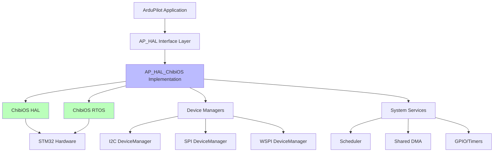
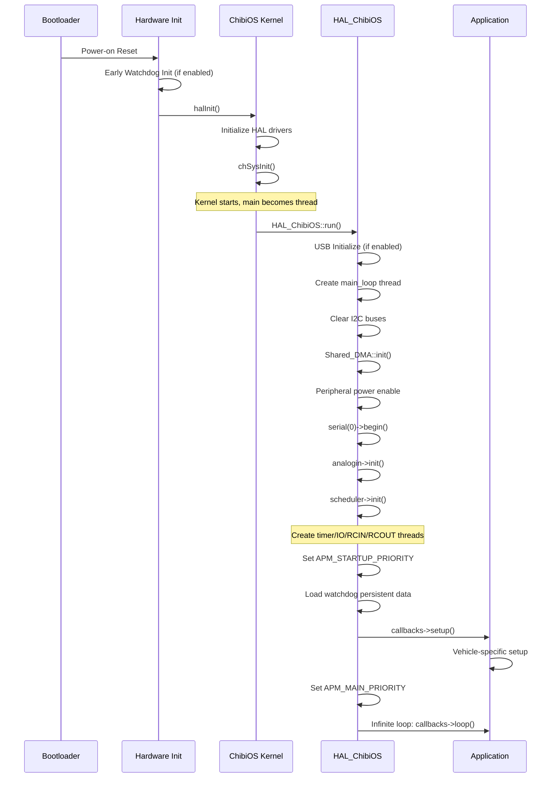
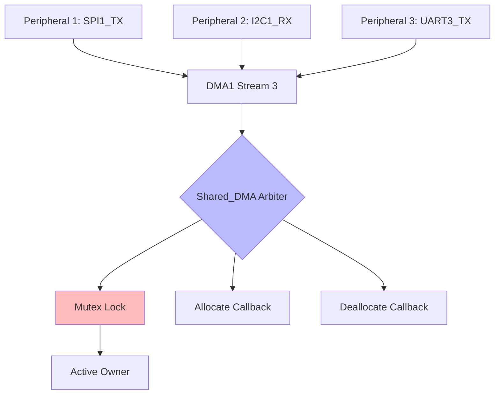
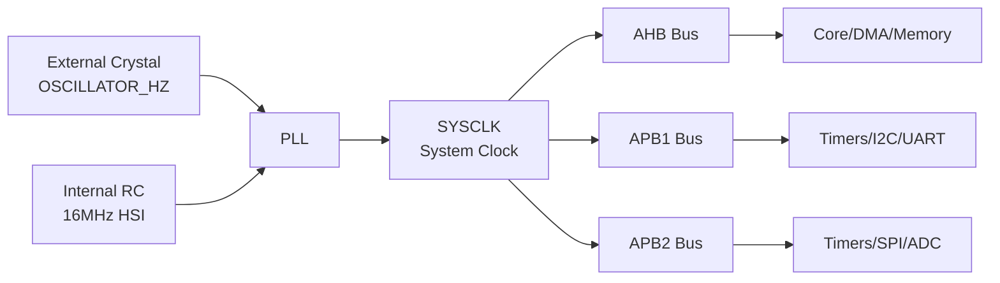
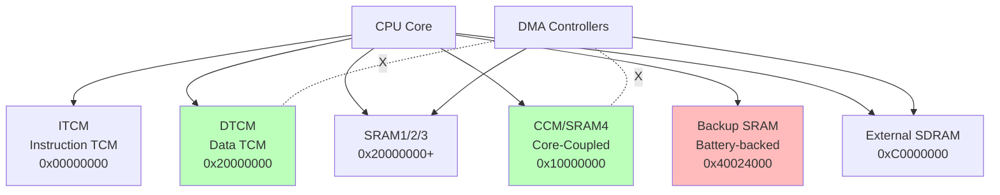
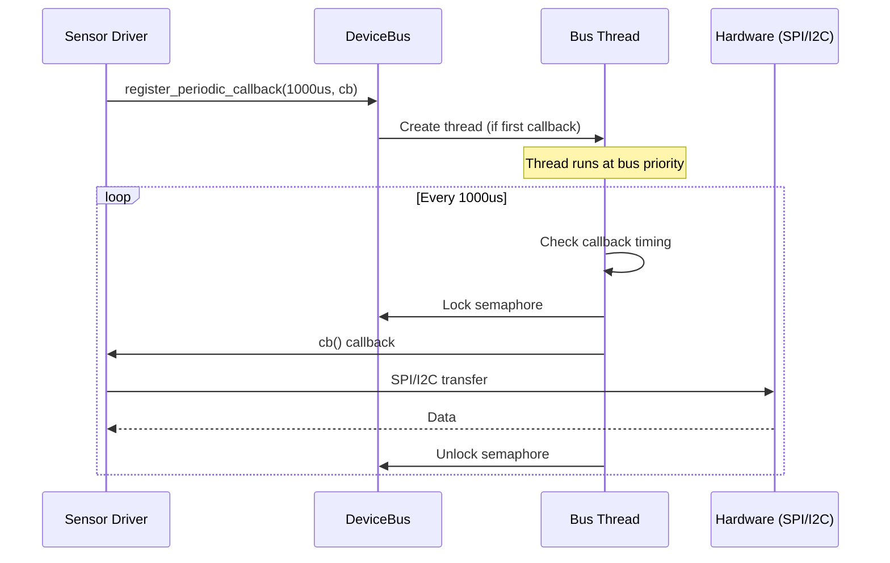

# AP_HAL_ChibiOS - ChibiOS Hardware Abstraction Layer

## Overview

The AP_HAL_ChibiOS library provides the ChibiOS/ARM implementation of the ArduPilot Hardware Abstraction Layer (HAL) for STM32 microcontrollers and other ARM Cortex-M platforms. This implementation binds the generic AP_HAL interfaces to ChibiOS RTOS services and STM32 peripheral drivers, enabling ArduPilot to run on a wide range of ARM-based flight controllers including STM32F4, F7, H7, G4, and L4 series.

This HAL implementation handles all platform-specific operations including:
- Board initialization and boot sequence management
- ChibiOS RTOS integration (threads, semaphores, mutexes)
- Interrupt handling and priority configuration
- DMA arbitration for high-speed peripherals
- Hardware timer management for PWM and input capture
- Memory region management (DTCM, ITCM, CCM, backup SRAM)
- USB, CAN, and Ethernet peripheral integration
- Device driver architecture with periodic callback scheduling

Source: libraries/AP_HAL_ChibiOS/HAL_ChibiOS_Class.cpp, Scheduler.cpp, Device.cpp, shared_dma.cpp

## Architecture

### High-Level System Architecture



### HAL Component Hierarchy

The ChibiOS HAL implementation provides concrete implementations of all AP_HAL abstract interfaces:

- **UARTDriver**: Serial port communication with DMA support
- **I2CDeviceManager**: I2C bus management with device registration
- **SPIDeviceManager**: SPI bus management with DMA and device selection
- **WSPIDeviceManager**: Wide SPI (Quad/Octo SPI) for external flash
- **AnalogIn**: ADC sampling for voltage/current monitoring
- **Storage**: Flash-based parameter and waypoint storage
- **GPIO**: Digital I/O pin control with interrupt support
- **RCInput**: RC receiver protocol decoding (PPM, SBUS, DSM, etc.)
- **RCOutput**: PWM/DShot output generation with DMA
- **Scheduler**: Multi-threaded task scheduling with ChibiOS
- **Util**: System utilities, timing, and safety state management
- **Flash**: Internal flash memory access for bootloader and firmware
- **CANIface**: CAN bus interface (bxCAN on F4/F7, FDCAN on G4/H7)
- **DSP**: Hardware DSP acceleration (H7 series)

Source: libraries/AP_HAL_ChibiOS/HAL_ChibiOS_Class.cpp:139-180

## Key Components

### HAL_ChibiOS Class

The main HAL class that instantiates and coordinates all HAL subsystems. It provides the entry point for the ArduPilot application through the `run()` method.

**Responsibilities**:
- Initialize ChibiOS kernel and HAL subsystems
- Create and manage device driver instances
- Start the main application loop
- Coordinate system-wide initialization sequence

Source: libraries/AP_HAL_ChibiOS/HAL_ChibiOS_Class.cpp:139-180

### Scheduler

The Scheduler class manages multi-threaded task execution using ChibiOS threads and synchronization primitives. It creates several dedicated threads at initialization:

**Thread Types**:
- **Main Thread** (APM_MAIN_PRIORITY): Runs setup() and loop() callbacks
- **Timer Thread** (APM_TIMER_PRIORITY): 1kHz high-priority timer callbacks
- **RCOUT Thread** (APM_RCOUT_PRIORITY): PWM output generation
- **RCIN Thread** (APM_RCIN_PRIORITY): RC input decoding
- **IO Thread** (APM_IO_PRIORITY): Low-priority I/O operations
- **Storage Thread**: Parameter/mission storage operations
- **Monitor Thread** (APM_MONITOR_PRIORITY): Watchdog and lockup detection

Source: libraries/AP_HAL_ChibiOS/Scheduler.cpp:102-150

### DeviceBus

The DeviceBus class provides the foundation for I2C, SPI, and WSPI device drivers. It manages periodic callback scheduling for sensor drivers, ensuring each device gets regular update cycles without blocking other operations.

**Key Features**:
- Per-bus thread with dedicated priority
- Periodic callback registration for sensor updates
- Semaphore-protected bus access to prevent conflicts
- DMA-safe bounce buffer management for cache coherency

Source: libraries/AP_HAL_ChibiOS/Device.cpp:37-150

### Shared_DMA

The Shared_DMA class arbitrates DMA stream allocation when multiple peripherals can use the same DMA stream. This is critical on STM32 MCUs where DMA streams are limited resources.

**Key Features**:
- Mutex-based DMA stream locking
- Automatic deallocation/reallocation when peripherals contend
- Contention statistics tracking
- Support for DMA_PRIORITY and DMA_NOSHARE hwdef directives

Source: libraries/AP_HAL_ChibiOS/shared_dma.cpp:25-150

## Board Initialization Sequence

The boot sequence progresses through multiple stages from bootloader to application:



### Detailed Boot Stages

#### Stage 1: Hardware Initialization (Pre-ChibiOS)
- Bootloader validates firmware and jumps to application
- Early watchdog initialization (HAL_EARLY_WATCHDOG_INIT)
- Clock tree and PLL configuration from hwdef OSCILLATOR_HZ
- Memory protection unit (MPU) setup if enabled

#### Stage 2: ChibiOS HAL Initialization
- `halInit()` configures ChibiOS device drivers
- Board-specific initialization from hwdef board.c
- USB initialization if HAL_USE_SERIAL_USB enabled
- STDOUT serial port configuration

Source: libraries/AP_HAL_ChibiOS/HAL_ChibiOS_Class.cpp:344-378

#### Stage 3: ChibiOS Kernel Initialization
- `chSysInit()` starts the RTOS kernel
- Main() function becomes a thread with NORMALPRIO
- Scheduler becomes active, context switching enabled

#### Stage 4: HAL Subsystem Initialization
- I2C bus clearing to recover stuck peripherals
- Shared_DMA::init() creates DMA stream mutexes
- Peripheral power enable via GPIO control
- Serial port initialization (SERIAL0_BAUD default 115200)
- ADC initialization for analog inputs
- Scheduler thread creation (timer, IO, RCIN, RCOUT)

Source: libraries/AP_HAL_ChibiOS/HAL_ChibiOS_Class.cpp:230-273, Scheduler.cpp:102-150

#### Stage 5: Application Initialization
- Thread priority reduced to APM_STARTUP_PRIORITY for setup
- Watchdog persistent data loaded if watchdog reset occurred
- Scheduler marks HAL as initialized
- Vehicle `setup()` callback executes
- Persistent parameters applied from storage
- Flash protection configured based on AP_BoardConfig
- Watchdog initialized if enabled (unless early init)
- System marked as initialized
- Thread priority raised to APM_MAIN_PRIORITY

Source: libraries/AP_HAL_ChibiOS/HAL_ChibiOS_Class.cpp:265-318

#### Stage 6: Main Loop Execution
- Infinite loop calling `callbacks->loop()` at main loop rate
- Scheduler delay (50μs) if INS hasn't boosted timing
- Watchdog patting on each iteration
- Optional memory protection enabled (AP_BOARDCONFIG_MCU_MEMPROTECT_ENABLED on H7)

Source: libraries/AP_HAL_ChibiOS/HAL_ChibiOS_Class.cpp:323-342

## Thread Priority Configuration

ChibiOS uses numeric thread priorities where higher numbers indicate higher priority. ArduPilot defines standard priorities in hwdef files:

| Thread | Priority Constant | Typical Value | Purpose |
|--------|------------------|---------------|---------|
| Monitor Thread | APM_MONITOR_PRIORITY | 250 | Watchdog and lockup detection |
| Timer Thread | APM_TIMER_PRIORITY | 178 | 1kHz timer callbacks |
| RCOUT Thread | APM_RCOUT_PRIORITY | 177 | PWM/DShot output generation |
| RCIN Thread | APM_RCIN_PRIORITY | 177 | RC input decoding |
| Main Thread | APM_MAIN_PRIORITY | 176 | Vehicle setup()/loop() |
| Main Startup | APM_STARTUP_PRIORITY | 60 | Reduced priority during setup |
| IO Thread | APM_IO_PRIORITY | 58 | Low-priority I/O operations |
| Storage Thread | APM_STORAGE_PRIORITY | 59 | Flash operations |
| UART Thread | APM_UART_PRIORITY | 57 | Serial port processing |
| SPI Priority | APM_SPI_PRIORITY | 181 | SPI device thread priority |
| I2C Priority | APM_I2C_PRIORITY | 178 | I2C device thread priority |
| CAN Priority | APM_CAN_PRIORITY | 179 | CAN interface thread priority |

**Priority Design Principles**:
- Sensor sampling (SPI/I2C threads) runs at high priority for timing accuracy
- Timer thread highest priority for precise control loop timing
- Main loop at high priority but below timer thread
- Startup priority much lower to avoid blocking during initialization
- I/O operations at lowest priority to avoid impacting flight control

Source: hwdef files, Scheduler.cpp:111-149

## Interrupt Handling

### Interrupt vs Thread Context

ChibiOS distinguishes between interrupt service routines (ISRs) and thread context:

**Interrupt Context (ISR)**:
- Cannot block or wait on semaphores
- Cannot allocate memory
- Must execute quickly (microseconds)
- Limited to hardware interrupt handlers
- Used for: GPIO edge detection, UART RX, timer capture, DMA completion

**Thread Context**:
- Can block on semaphores and mutexes
- Can allocate memory and call most HAL functions
- Scheduled by ChibiOS kernel
- Used for: sensor polling, protocol processing, parameter storage

### Interrupt Priority Levels

STM32 NVIC interrupt priorities (lower number = higher priority):

**Critical Interrupts** (Priority 0-3):
- Used sparingly for timing-critical operations
- Watchdog timer
- Hard fault handlers

**High Priority Interrupts** (Priority 4-7):
- DMA completion interrupts
- High-speed timer capture/compare
- Critical UART events

**Normal Priority Interrupts** (Priority 8-11):
- Standard peripheral interrupts
- GPIO edge detection
- Most timer interrupts
- Standard DMA transfers

**Low Priority Interrupts** (Priority 12-15):
- Non-critical events
- Background tasks
- Debug interfaces

Configuration is typically in hwdef board.c files and peripheral-specific driver initialization.

## DMA Configuration and Arbitration

### DMA Stream Architecture

STM32 microcontrollers have limited DMA streams (8 streams per DMA controller on F4/F7, 16 streams on H7). Multiple peripherals often require the same DMA stream, necessitating dynamic arbitration.



### Shared_DMA Mechanism

The Shared_DMA class provides dynamic DMA stream allocation:

**Allocation Process**:
1. Peripheral requests DMA stream via `lock()`
2. Shared_DMA checks if stream is locked by another peripheral
3. If locked by different owner, calls owner's `deallocate()` function
4. Calls new owner's `allocate()` function to configure DMA
5. Mutex granted to new owner
6. Peripheral performs DMA transfer
7. Peripheral calls `unlock()` when transfer complete

**Contention Handling**:
- First peripheral to request gets immediate access
- Second peripheral blocks on mutex until first releases
- Statistics tracked per stream for performance monitoring
- Contention can cause sensor timing jitter if excessive

Source: libraries/AP_HAL_ChibiOS/shared_dma.cpp:42-150

### DMA Bounce Buffers

DMA transfers on Cortex-M7 (F7/H7) require cache-coherent memory. DeviceBus provides bounce buffers in DMA-safe memory regions:

**Bounce Buffer Types**:
- **TX Bounce Buffer**: Ensures transmitted data is in DMA-visible memory
- **RX Bounce Buffer**: Ensures received data bypasses cache issues

**Memory Region Selection**:
- Standard SRAM: Default for most transfers
- AXI SRAM: Optional for H7 with `axi_sram` flag
- DTCM: Not DMA-accessible, avoided automatically

**Usage Pattern**:
```cpp
// Driver allocates bounce buffer at initialization
bouncebuffer_init(&bounce_buffer_tx, 10, false);
bouncebuffer_init(&bounce_buffer_rx, 10, false);

// Before DMA transfer, copy to bounce buffer
uint8_t *safe_buf = bouncebuffer_get(&bounce_buffer_tx, size);
memcpy(safe_buf, user_data, size);
// Perform DMA transfer from safe_buf
```

Source: libraries/AP_HAL_ChibiOS/Device.cpp:40-48

### hwdef DMA Directives

Hardware definition files control DMA stream assignment:

**DMA_PRIORITY**: Prefer this stream for a peripheral even if shared
```
# Give SPI1 priority on DMA stream even if I2C also needs it
DMA_PRIORITY SPI1* DMA1_Stream3
```

**DMA_NOSHARE**: Reserve stream exclusively for a peripheral
```
# Reserve DMA2_Stream7 exclusively for UART6 TX
DMA_NOSHARE USART6_TX DMA2_Stream7
```

These directives minimize contention for timing-critical peripherals like high-rate IMUs.

## Hardware Timer Usage

### Timer Allocation

STM32 timers serve multiple purposes in ArduPilot:

**PWM Output Generation**:
- Advanced timers (TIM1, TIM8) for motor output
- General-purpose timers (TIM2-TIM5, TIM9-TIM14) for servo output
- DMA-based DShot protocol generation using timer DMAR register
- Up to 16+ PWM channels depending on board

**RC Input Capture**:
- Timer input capture mode for PPM decoding
- DMA-based capture for SBUS/DSM timing measurement
- Separate timer channels for multiple protocols

**Timing Services**:
- Microsecond timing via high-frequency timer
- Periodic interrupts for system ticks
- Scheduler timing reference

### PWM Output Configuration

PWM output uses timer channels configured in hwdef files:

```
# Define PWM output on TIM1 channels 1-4
TIM1 CH1 PE9 TIM1_CH1 PWM(1) GPIO(50)
TIM1 CH2 PE11 TIM1_CH2 PWM(2) GPIO(51)
TIM1 CH3 PE13 TIM1_CH3 PWM(3) GPIO(52)
TIM1 CH4 PE14 TIM1_CH4 PWM(4) GPIO(53)
```

**Timer Features**:
- Frequency: Typically 400Hz (multirotors) to 50Hz (servos)
- Resolution: 16-bit (65535 steps) or 32-bit on advanced timers
- Synchronization: Multiple channels can be synchronized for ESC startup
- DShot: DMA-based digital protocol at 150kb/s to 1200kb/s

### DShot via DMA

DShot protocol generates a digital bit stream via timer+DMA:

**Implementation**:
1. Configure timer in PWM mode
2. Prepare DMA buffer with PWM duty cycles representing bits
3. Use timer DMAR (DMA request) to update PWM values from buffer
4. DMA transfers occur at DShot bit rate (e.g., 600kHz for DShot600)
5. Single DMA transfer generates entire DShot frame

**Advantages**:
- No CPU overhead during transmission
- Precise timing from hardware
- Can send to multiple ESCs simultaneously via grouped timers

## ChibiOS RTOS Integration

### Thread Management

ChibiOS threads are created using `chThdCreateStatic()` with statically allocated stack space:

```cpp
THD_WORKING_AREA(_timer_thread_wa, TIMER_THD_WA_SIZE);

_timer_thread_ctx = chThdCreateStatic(_timer_thread_wa,
                                     sizeof(_timer_thread_wa),
                                     APM_TIMER_PRIORITY,
                                     _timer_thread,
                                     this);
```

**Thread Lifecycle**:
1. Stack allocated at compile time (THD_WORKING_AREA macro)
2. Thread created during Scheduler::init()
3. Thread function runs infinite loop
4. Thread never terminates (embedded system pattern)

Source: libraries/AP_HAL_ChibiOS/Scheduler.cpp:116-123

### Synchronization Primitives

**Binary Semaphores**:
Used for thread notification and event signaling.
```cpp
binary_semaphore_t _timer_semaphore;
chBSemObjectInit(&_timer_semaphore, false);

// Signal from ISR or thread
chBSemSignal(&_timer_semaphore);

// Wait in thread
chBSemWait(&_timer_semaphore);
```

**Mutexes**:
Used for resource protection with priority inheritance.
```cpp
mutex_t _mutex;
chMtxObjectInit(&_mutex);

chMtxLock(&_mutex);
// Critical section
chMtxUnlock(&_mutex);
```

**WITH_SEMAPHORE Macro**:
ArduPilot provides RAII-style semaphore locking:
```cpp
WITH_SEMAPHORE(bus_semaphore);
// Automatically locked, released at scope exit
```

Source: libraries/AP_HAL_ChibiOS/Semaphores.h/.cpp

### Message Queues

ChibiOS message queues not heavily used in ArduPilot HAL. Most inter-thread communication uses:
- Shared memory with mutex protection
- Semaphore signaling for events
- Thread-safe ring buffers for data streams

### Scheduler Callbacks

The Scheduler provides callback registration for periodic tasks:

**Timer Process Callbacks** (High Priority, ~1kHz):
```cpp
hal.scheduler->register_timer_process(FUNCTOR_BIND_MEMBER(&Class::method, void));
```
Called from timer thread at APM_TIMER_PRIORITY.

**IO Process Callbacks** (Low Priority):
```cpp
hal.scheduler->register_io_process(FUNCTOR_BIND_MEMBER(&Class::method, void));
```
Called from IO thread at APM_IO_PRIORITY.

**Delay Functions**:
- `delay(ms)`: Yield CPU for milliseconds
- `delay_microseconds(us)`: Busy-wait or yield for microseconds
- `delay_microseconds_boost()`: Yield with timing credit for INS processing

## Clock Configuration and PLL Setup

### Clock Tree Overview

STM32 clock configuration varies by MCU family but follows a common pattern:



### MCU-Specific Clock Frequencies

| MCU Family | Max SYSCLK | AHB | APB1 | APB2 | Notes |
|------------|-----------|-----|------|------|-------|
| STM32F405/407 | 168 MHz | 168 MHz | 42 MHz | 84 MHz | Standard F4 |
| STM32F427/429 | 180 MHz | 180 MHz | 45 MHz | 90 MHz | High-perf F4 |
| STM32F745/746 | 216 MHz | 216 MHz | 54 MHz | 108 MHz | F7 series |
| STM32H743/753 | 480 MHz | 240 MHz | 120 MHz | 120 MHz | H7 dual-bank |
| STM32H750 | 480 MHz | 240 MHz | 120 MHz | 120 MHz | H7 minimal flash |
| STM32G474 | 170 MHz | 170 MHz | 170 MHz | 170 MHz | G4 series |
| STM32L496 | 80 MHz | 80 MHz | 80 MHz | 80 MHz | Ultra-low-power |

### hwdef Clock Configuration

Clock source defined in hwdef.dat:
```
# External crystal frequency
OSCILLATOR_HZ 8000000

# Or use internal RC oscillator
# OSCILLATOR_HZ 0
```

The bootloader and HAL initialization code configure PLL multipliers and dividers to achieve maximum performance within electrical specifications.

### Peripheral Clock Gating

ChibiOS HAL automatically enables peripheral clocks when devices are initialized. Manual clock control available via:
- `rccEnableXXX()` - Enable peripheral clock
- `rccDisableXXX()` - Disable peripheral clock (power saving)
- `rccResetXXX()` - Reset peripheral to default state

## Memory Region Usage

### STM32 Memory Architecture

Different STM32 families provide specialized memory regions with distinct characteristics:



### DTCM (Data Tightly-Coupled Memory)

**Available on**: F7, H7 series  
**Location**: 0x20000000 (overlaps SRAM1 address)  
**Size**: 64KB (F7), 128KB (H7)  

**Characteristics**:
- Zero wait-state access from CPU
- NOT accessible by DMA controllers
- Ideal for stack and frequently-accessed variables
- Used by default for .data and .bss sections

**Usage**:
```c
// Compiler places these in DTCM automatically
static uint8_t buffer[1024];
int32_t fast_variable;
```

### ITCM (Instruction Tightly-Coupled Memory)

**Available on**: F7, H7 series  
**Location**: 0x00000000  
**Size**: 16KB (F7), 64KB (H7)  

**Characteristics**:
- Zero wait-state instruction fetch
- Can be used for critical code paths
- Typically used for interrupt vectors and boot code

### CCM (Core-Coupled Memory)

**Available on**: F4, F7 series  
**Location**: 0x10000000  
**Size**: 64KB (F4), 16KB (F7)  

**Characteristics**:
- Fast access, but slower than TCM
- NOT accessible by DMA
- Good for non-DMA data structures

**Usage Example**:
```c
// Explicitly place in CCM with attribute
__attribute__((section(".ccmram"))) static uint8_t ccm_buffer[1024];
```

### Backup SRAM

**Available on**: Most STM32 families  
**Location**: 0x40024000 (F4/F7), varies by MCU  
**Size**: 4KB typical  

**Characteristics**:
- Battery-backed (retains data with VBAT)
- Survives resets and power loss (if VBAT connected)
- Used for watchdog persistent data
- Requires RTC domain access enable

**Usage**:
Watchdog reset information stored here:
```cpp
// Save data before watchdog reset
stm32_watchdog_save((uint32_t *)&persistent_data, size);

// Load after reset
if (stm32_was_watchdog_reset()) {
    stm32_watchdog_load((uint32_t *)&persistent_data, size);
}
```

Source: libraries/AP_HAL_ChibiOS/HAL_ChibiOS_Class.cpp:267-271

### DMA-Safe Memory Regions

For DMA transfers, use memory regions accessible by DMA controllers:

**F4/F7 DMA-Safe**:
- SRAM1/2/3 (standard SRAM)
- External SDRAM

**F4/F7 NOT DMA-Safe**:
- DTCM
- CCM

**H7 DMA-Safe (with cache management)**:
- AXI SRAM (D1 domain)
- SRAM1/2/3 (D2 domain)
- Requires cache flush/invalidate or non-cacheable memory

**H7 NOT DMA-Safe**:
- DTCM (though MDMA can access it)

### Memory Allocation Helpers

ArduPilot provides allocation functions that select appropriate memory:

```cpp
// Allocate DMA-safe memory
void *hal.util->malloc_type(size, AP_HAL::Util::MEM_DMA_SAFE);

// Allocate fast memory (TCM if available)
void *hal.util->malloc_type(size, AP_HAL::Util::MEM_FAST);

// Allocate memory in SDRAM
void *hal.util->malloc_type(size, AP_HAL::Util::MEM_SDRAM);
```

## Peripheral Integration

### USB CDC (Serial over USB)

USB implementation provides virtual serial port for ground station communication:

**Configuration**:
```
# hwdef.dat
USB_STRING_MANUFACTURER "ArduPilot"
USB_STRING_PRODUCT "MyBoard"
USB_SERIAL_NUMBER_PIN
```

**Features**:
- CDC ACM class device (appears as COM port)
- Multiple endpoints for data and control
- Automatic enumeration on USB connection
- Flow control via USB protocol

**Initialization**:
```cpp
#if HAL_USE_SERIAL_USB == TRUE
    usb_initialise();
#endif
```

Source: libraries/AP_HAL_ChibiOS/HAL_ChibiOS_Class.cpp:358-360

### CAN Bus Integration

Two different CAN peripheral types supported:

#### bxCAN (F4, F7, some H7)

**Features**:
- 2 CAN controllers (CAN1, CAN2)
- 28 filter banks shared between controllers
- 3 TX mailboxes, 2 RX FIFOs
- Hardware message filtering

**Configuration**:
```
# hwdef.dat
PA11 CAN1_RX CAN1
PA12 CAN1_TX CAN1
```

#### FDCAN (G4, most H7)

**Features**:
- CAN FD support (flexible data rate)
- 1-3 FDCAN controllers
- Improved filtering with up to 128 filters
- Message RAM for buffering

**Configuration**:
```
# hwdef.dat  
PD0 FDCAN1_RX FDCAN1
PD1 FDCAN1_TX FDCAN1
```

**Protocol Support**:
- DroneCAN (UAVCAN v0)
- Custom CAN protocols
- Multi-bus configurations

Source: CANIface.cpp, hwdef configurations

### Ethernet MAC

**Available on**: F4, F7, H7 series with Ethernet MAC  

**Features**:
- 10/100 Mbps operation
- MII or RMII PHY interface
- DMA-based packet transmission/reception
- IEEE 1588 PTP support (precision time protocol)

**Usage**:
- Network telemetry (MAVLink over UDP/TCP)
- Web server for configuration
- ROS2 DDS communication

**Configuration**:
```
# hwdef.dat - RMII interface example
PA1 ETH_RMII_REF_CLK ETH1
PA2 ETH_RMII_MDIO ETH1
PA7 ETH_RMII_CRS_DV ETH1
PC1 ETH_RMII_MDC ETH1
PC4 ETH_RMII_RXD0 ETH1
PC5 ETH_RMII_RXD1 ETH1
PG11 ETH_RMII_TX_EN ETH1
PG13 ETH_RMII_TXD0 ETH1
PG14 ETH_RMII_TXD1 ETH1
```

## DeviceBus Architecture

### Overview

The DeviceBus class provides a framework for managing SPI and I2C peripheral device drivers:



### Periodic Callback Registration

Device drivers register callbacks for periodic updates:

```cpp
// In sensor driver init():
AP_HAL::Device::PeriodicHandle handle = 
    dev->register_periodic_callback(1000, 
        FUNCTOR_BIND_MEMBER(&Driver::_update, void));
```

**Parameters**:
- `period_usec`: Callback interval in microseconds
- `cb`: Function to call periodically
- Returns: Handle for later unregistration

**Behavior**:
- First callback registration creates dedicated bus thread
- Thread priority determined by device type (SPI/I2C)
- All callbacks on same bus run in same thread
- Semaphore protects bus access across callbacks

Source: libraries/AP_HAL_ChibiOS/Device.cpp:104-150

### Thread Creation and Naming

Bus threads are named by type and bus number:
- "SPI1", "SPI2", etc. for SPI buses
- "I2C1", "I2C2", etc. for I2C buses

This aids debugging via thread monitoring and stack traces.

### Bounce Buffer Management

DeviceBus provides DMA-safe bounce buffers:

**Initialization**:
```cpp
bouncebuffer_init(&bounce_buffer_tx, 10, false);  // Standard SRAM
bouncebuffer_init(&bounce_buffer_rx, 10, true);   // AXI SRAM (H7)
```

**Usage Pattern**:
1. Driver calls `bouncebuffer_get()` to obtain DMA-safe buffer
2. Copy data into bounce buffer
3. Perform DMA transfer from bounce buffer
4. Copy received data out of bounce buffer

This ensures cache coherency on Cortex-M7 MCUs (F7/H7).

Source: libraries/AP_HAL_ChibiOS/Device.cpp:40-48

### Bus Semaphore Protection

Each DeviceBus has a semaphore to serialize access:

```cpp
WITH_SEMAPHORE(binfo->semaphore);
callback->cb();
```

This prevents multiple callbacks or external access from conflicting on the shared bus hardware.

## Testing with Physical Hardware

### Initial Board Bring-Up

#### Step 1: Serial Console Verification

Connect USB cable and verify serial port enumeration:

**Linux**:
```bash
dmesg | grep tty
# Should show: usb 1-1: cp210x converter now attached to ttyUSB0
# or: cdc_acm 1-1:1.0: ttyACM0: USB ACM device

# Connect with screen
screen /dev/ttyACM0 115200
```

**Expected Output**:
```
ArduPilot Ready
FW git-hash: abc123def
Build: Mar 15 2024 12:34:56
```

#### Step 2: Parameter Storage Test

```bash
# MAVProxy command line
param set TEST_VALUE 123.45
param fetch
param show TEST_VALUE
# Should show: TEST_VALUE = 123.450000

# Reboot and verify persistence
reboot
param show TEST_VALUE
# Should still show: TEST_VALUE = 123.450000
```

#### Step 3: Sensor Detection

```bash
# Check detected sensors
status

# Look for:
# IMU[0]: ICM-20602 (SPI)
# Baro[0]: BMP280 (I2C)
# Compass[0]: HMC5883L (I2C)
```

For detailed sensor information:
```bash
param show INS_
param show COMPASS_
param show BARO_
```

#### Step 4: GPIO Test

Test GPIO outputs (use caution with motors):

```bash
# Set relay pin high
relay 0 set 1
# Set relay pin low
relay 0 set 0
```

Test GPIO inputs:
```bash
# Read aux pin state
auxpin 50 get
```

#### Step 5: PWM Output Validation

**Safety First**: Remove propellers, disconnect ESC power, or use current-limited bench supply.

```bash
# Set motor test order (for identifying physical motors)
param set MOT_PWM_TYPE 0  # Normal PWM

# Enable servo outputs
arm throttle

# Test individual output channel (1-8)
servo 1 1500  # Neutral
servo 1 1100  # Low
servo 1 1900  # High

# Verify with oscilloscope or servo tester
```

**Expected PWM Characteristics**:
- Frequency: 50Hz (servos) or 400Hz (ESCs)
- Pulse width: 1000-2000μs range
- Neutral: 1500μs typically

#### Step 6: RC Input Validation

Connect RC receiver and verify signal decoding:

```bash
# Display raw RC channels
rc

# Expected output:
# RC1: 1500
# RC2: 1500
# RC3: 1000
# RC4: 1500
# ...
```

Move transmitter sticks and verify channel values update:
- Roll/Pitch: 1000-2000 range
- Throttle: 1000-2000 range
- Yaw: 1000-2000 range

#### Step 7: IMU Data Validation

```bash
# Display IMU data
imu

# Expected (stationary on level surface):
# IMU[0]: Accel: (0.0, 0.0, -9.8) m/s²
# IMU[0]: Gyro: (0.0, 0.0, 0.0) rad/s
```

Gently tilt/rotate board and verify values change appropriately.

#### Step 8: Compass Calibration Test

```bash
# Start compass calibration
compass calibrate

# Rotate vehicle in all orientations
# Watch for completion message

# Verify offsets learned
param show COMPASS_OFS_X
param show COMPASS_OFS_Y  
param show COMPASS_OFS_Z
# Should show non-zero values after calibration
```

### Hardware-Specific Tests

#### DMA Verification

Monitor DMA contention:
```bash
# Enable DMA contention logging
param set LOG_BITMASK 131071

# Fly or run SITL, then check logs
# Look for DMA messages indicating contention
```

Low contention (<5%) is ideal; high contention may cause sensor jitter.

#### Flash Memory Test

```bash
# Test parameter save/load cycles
param set TEST_FLASH 0
param save
reboot
param show TEST_FLASH

# Increment and repeat
param set TEST_FLASH 1
param save
reboot
# Verify parameter persists across reboots
```

#### Watchdog Test

**Warning**: This will reset the board!

```bash
# Enable watchdog
param set BRD_WATCHDOG 1
reboot

# Intentionally lock up system (developer testing only)
# Watchdog should reset within configured timeout
```

### SITL Hardware Emulation

Test ChibiOS HAL in simulation before hardware deployment:

```bash
# Build for SITL
./waf configure --board sitl
./waf copter

# Run SITL with simulated hardware
sim_vehicle.py -v ArduCopter --console --map

# In MAVProxy:
# Test commands as with real hardware
param set TEST_VALUE 123
servo 1 1500
rc 1 1500
```

SITL simulates sensor data but exercises the same HAL code paths.

## Implementation Notes

### Design Decisions

**Why ChibiOS RTOS?**
- Mature, well-tested real-time operating system
- Rich set of peripheral drivers for STM32
- Active development and community
- BSD-style licensing compatible with ArduPilot
- Excellent documentation and examples

**Thread vs Interrupt Architecture**:
- Most processing in threads for maintainability
- Threads can block, simplifying driver code
- Interrupt handlers kept minimal (signal semaphores)
- Priority-based scheduling ensures timing-critical tasks run first

**Shared_DMA Arbitration Strategy**:
- Dynamic allocation allows peripheral flexibility
- Mutex-based approach prevents race conditions
- Statistics tracking identifies contention issues
- Deallocate/allocate callbacks provide clean handoff

**Memory Region Usage**:
- DTCM for stack and frequently-accessed data (zero wait states)
- Standard SRAM for DMA buffers (DMA-accessible)
- Bounce buffers handle cache coherency on F7/H7
- Backup SRAM for watchdog persistent data across resets

**Device Thread Architecture**:
- Per-bus threads eliminate callback priority issues
- Semaphore protection prevents bus conflicts
- Periodic callbacks simplify sensor driver implementation
- Named threads aid debugging and monitoring

### Known Limitations

**DMA Stream Contention**:
- Limited DMA streams can cause contention between peripherals
- High contention increases sensor timing jitter
- Mitigation: Use DMA_PRIORITY and DMA_NOSHARE in hwdef
- Monitor contention statistics and adjust configuration

**Memory Constraints**:
- RAM limited on smaller STM32 variants (192KB on F405)
- Code size limited on minimal-flash variants (H750 has 128KB)
- External flash or SDRAM may be required for large applications
- Stack size must be carefully tuned for each thread

**Cache Coherency** (F7/H7):
- DMA requires cache-coherent memory or explicit cache management
- Bounce buffers add memory copies (performance cost)
- Non-cacheable memory regions reduce performance
- Careful driver implementation required

**Interrupt Priority Limits**:
- ChibiOS reserves some interrupt priorities for kernel
- Application interrupts must use available priority range
- Incorrect priority can cause kernel failures
- Priority configuration must match ChibiOS requirements

**Real-Time Constraints**:
- Thread priority inversions can occur with mutexes
- ChibiOS priority inheritance mitigates but doesn't eliminate
- Critical sections must be kept short
- Watchdog timeout requires consistent loop timing

**Hardware-Specific Issues**:
- Some STM32 revisions have silicon errata requiring workarounds
- UART/I2C peripherals may lock up under error conditions
- I2C bus clearing on boot works around stuck-peripheral issue
- Specific workarounds documented in board hwdef files

### Code Quality and Maintainability

**Naming Conventions**:
- ChibiOS HAL functions prefixed: `hal`, `ch` (ChibiOS kernel), `rcc`, `st` (ST HAL)
- ArduPilot HAL classes in `ChibiOS` namespace
- Thread names descriptive: "SPI1", "I2C2", "timer", "IO"
- Consistent with ChibiOS upstream conventions

**Error Handling**:
- NULL pointer checks on memory allocation
- Semaphore timeouts prevent indefinite blocking
- Watchdog catches system lockups
- Internal error reporting for anomalies

**Testing Strategy**:
- SITL provides software-based testing
- Hardware-in-the-loop (HITL) tests on real boards
- Continuous integration on multiple board targets
- Community testing across diverse hardware configurations

**Future Improvements**:
- ChibiOS version updates for new features
- Additional memory allocator optimizations
- Enhanced DMA contention mitigation
- Expanded hardware platform support (new STM32 series)

## Safety Considerations

**Flight-Critical Systems**:
- ChibiOS HAL runs all flight control code (attitude, navigation, motors)
- Thread timing jitter directly impacts control loop performance
- Watchdog provides last-resort protection against software failures
- Hardware failsafes (RC loss, battery low) implemented in vehicle code

**Watchdog Monitoring**:
- Watchdog timer must be patted regularly from main loop
- Timeout (typically 1-2 seconds) causes system reset
- Persistent data saved before reset for crash analysis
- Monitor thread detects software lockups and triggers watchdog

**Interrupt Priority Safety**:
- Critical interrupts (watchdog, hard fault) at highest priority
- Timing-sensitive interrupts (timers, DMA) at high priority
- Standard peripherals at normal priority
- Priority misconfiguration can cause kernel failures

**Memory Safety**:
- Stack overflow detection via thread canaries (if enabled)
- Memory allocation failures checked and reported
- DMA buffers validated for cache-coherent memory
- MPU can protect memory regions (H7 with AP_BOARDCONFIG_MCU_MEMPROTECT_ENABLED)

**DMA Safety**:
- Shared_DMA prevents simultaneous peripheral access
- DMA stream conflicts detected and arbitrated
- Cache management on F7/H7 prevents stale data
- Bounce buffers ensure DMA-safe memory usage

**Reset Recovery**:
- Watchdog reset detection preserves crash information
- Persistent data loaded from backup SRAM after reset
- Internal error reporting tracks reset causes
- Ground station notified of watchdog resets

**Parameter Storage**:
- Flash wear leveling protects against write exhaustion
- Parameter save operations verified for success
- Default parameters loaded if storage corrupted
- Critical parameters (calibration) protected from loss

**Testing Requirements**:
- All hardware changes tested on physical boards
- SITL testing before hardware deployment
- Sensor initialization verified during boot
- Servo outputs tested with load disconnected
- RC failsafe tested with transmitter off

**Hardware Protection**:
- Servo output limits prevent mechanical damage
- Battery monitoring prevents over-discharge
- Temperature monitoring (if available) prevents thermal damage
- Voltage monitoring prevents brownout-induced errors

## References

### Source Files

Primary ChibiOS HAL implementation files:
- `libraries/AP_HAL_ChibiOS/HAL_ChibiOS_Class.cpp` - Main HAL class and initialization
- `libraries/AP_HAL_ChibiOS/HAL_ChibiOS_Class.h` - HAL class definition
- `libraries/AP_HAL_ChibiOS/Scheduler.cpp` - Thread scheduling and priorities
- `libraries/AP_HAL_ChibiOS/Scheduler.h` - Scheduler interface
- `libraries/AP_HAL_ChibiOS/Device.cpp` - DeviceBus and periodic callbacks
- `libraries/AP_HAL_ChibiOS/Device.h` - DeviceBus interface
- `libraries/AP_HAL_ChibiOS/shared_dma.cpp` - DMA stream arbitration
- `libraries/AP_HAL_ChibiOS/shared_dma.h` - Shared_DMA interface

Peripheral driver implementations:
- `libraries/AP_HAL_ChibiOS/UARTDriver.cpp` - Serial port driver
- `libraries/AP_HAL_ChibiOS/SPIDevice.cpp` - SPI device driver
- `libraries/AP_HAL_ChibiOS/I2CDevice.cpp` - I2C device driver
- `libraries/AP_HAL_ChibiOS/AnalogIn.cpp` - ADC analog input
- `libraries/AP_HAL_ChibiOS/RCInput.cpp` - RC receiver input
- `libraries/AP_HAL_ChibiOS/RCOutput.cpp` - PWM/DShot output
- `libraries/AP_HAL_ChibiOS/Storage.cpp` - Flash parameter storage
- `libraries/AP_HAL_ChibiOS/GPIO.cpp` - Digital I/O control
- `libraries/AP_HAL_ChibiOS/Util.cpp` - System utilities
- `libraries/AP_HAL_ChibiOS/CANIface.cpp` - CAN bus interface

Hardware abstraction:
- `libraries/AP_HAL_ChibiOS/hwdef/` - Board hardware definitions
- `libraries/AP_HAL_ChibiOS/hwdef/README.md` - hwdef syntax guide
- `libraries/AP_HAL_ChibiOS/hwdef/common/` - Common initialization code

### Related Modules

- `libraries/AP_HAL/` - Generic HAL interface definitions
- `modules/ChibiOS/` - ChibiOS RTOS upstream source
- `libraries/AP_BoardConfig/` - Board configuration and safety settings
- `libraries/AP_InternalError/` - Internal error reporting system

### Hardware Documentation

STM32 Reference Manuals (ST Microelectronics):
- RM0090: STM32F405/407, STM32F415/417, STM32F427/437, STM32F429/439 Reference Manual
- RM0385: STM32F75xxx and STM32F74xxx Reference Manual
- RM0433: STM32H742, STM32H743/753 and STM32H750 Reference Manual
- RM0440: STM32G4 Series Reference Manual

ChibiOS Documentation:
- ChibiOS/RT Manual: https://www.chibios.org/dokuwiki/doku.php?id=chibios:documentation:start
- ChibiOS/HAL Manual: https://www.chibios.org/dokuwiki/doku.php?id=chibios:documentation:hal
- ChibiOS API Reference: Generated Doxygen documentation in modules/ChibiOS/

### External Resources

- ArduPilot Developer Wiki: https://ardupilot.org/dev/
- ChibiOS Official Site: https://www.chibios.org/
- STMicroelectronics: https://www.st.com/
- ARM Cortex-M Documentation: https://developer.arm.com/documentation/

### Build System

- `wscript` - Main build configuration
- `Tools/ardupilotwaf/` - Build system implementation
- Board selection: `./waf configure --board <boardname>`
- List boards: `./waf list_boards`

### Testing

- `Tools/autotest/` - Automated testing framework
- SITL simulation: `sim_vehicle.py -v ArduCopter`
- Hardware testing: See "Testing with Physical Hardware" section above

### Community

- ArduPilot Discourse Forum: https://discuss.ardupilot.org/
- ArduPilot Discord: https://ardupilot.org/discord
- GitHub Issues: https://github.com/ArduPilot/ardupilot/issues
- GitHub Pull Requests: https://github.com/ArduPilot/ardupilot/pulls

---

**Document Version**: 1.0  
**Last Updated**: 2024  
**Maintainer**: ArduPilot Development Team  
**License**: GNU General Public License v3.0
