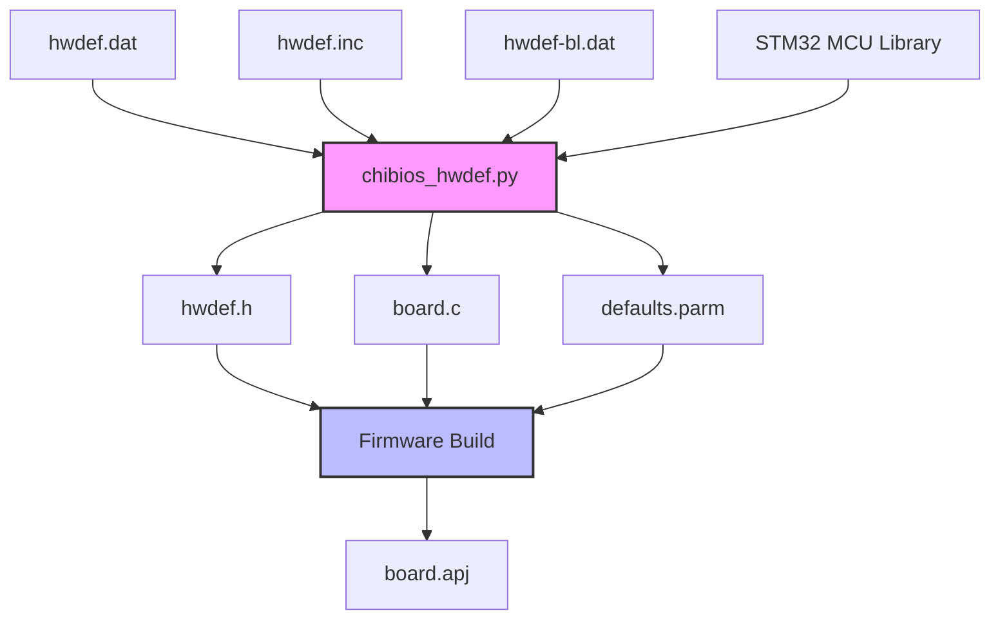

# ArduPilot ChibiOS Hardware Definition (hwdef) System

## Overview

The ArduPilot hwdef system provides a declarative, text-based configuration format for defining flight controller hardware specifications on ARM platforms running ChibiOS RTOS. This system replaces traditional C header file configurations with human-readable `.dat` files that are processed by the `chibios_hwdef.py` build script to generate board-specific initialization code.

**Purpose**: The hwdef system enables hardware manufacturers and developers to create new board support packages for ArduPilot without modifying core firmware code. By specifying MCU type, pin assignments, peripheral mappings, and feature flags in hwdef files, the build system automatically generates appropriate initialization code, pin configuration, and device drivers.

**Scope**: This system currently supports 150+ ARM-based flight controller boards across multiple STM32 families (F1, F3, F4, F7, G4, H7) and other ARM MCUs, making it the primary hardware abstraction mechanism for ArduPilot on ChibiOS platforms.

**File Types**:
- `hwdef.dat` - Main hardware definition for application firmware
- `hwdef-bl.dat` - Bootloader-specific hardware definition
- `hwdef.inc` - Shared configuration included by multiple hwdef files
- Board-specific `README.md` - End-user documentation for the board

**Build Integration**: During firmware compilation, the waf build system invokes `libraries/AP_HAL_ChibiOS/hwdef/scripts/chibios_hwdef.py` to parse hwdef files and generate:
- `hwdef.h` - C header with pin definitions and configuration macros
- `board.c` - ChibiOS board initialization code
- Pin configuration tables for GPIO, alternate functions, DMA
- Device driver initialization structures

## Architecture



**Processing Flow**:
1. Build system identifies target board (e.g., `--board CubeOrange`)
2. Loads `hwdef.dat` from `libraries/AP_HAL_ChibiOS/hwdef/<boardname>/`
3. Recursively processes `include` directives to merge configuration
4. Validates MCU type and loads corresponding STM32 pin library
5. Parses pin assignments and resolves alternate functions
6. Generates GPIO configuration registers (MODER, PUPDR, OSPEEDR, etc.)
7. Creates device driver configuration structures (UART, SPI, I2C, CAN)
8. Outputs generated C code to build directory

## hwdef.dat Directive Reference

### MCU Configuration

#### MCU - MCU Family and Type Selection

**Syntax**: `MCU <family> <specific_type>`

**Purpose**: Specifies the microcontroller family and exact part number. This directive must appear before any pin definitions as it determines available peripherals and alternate function mappings.

**Parameters**:
- `<family>`: MCU family identifier (STM32F1xx, STM32F3xx, STM32F4xx, STM32F7xx, STM32G4xx, STM32H7xx, CKS32F4xx)
- `<specific_type>`: Exact part number (e.g., STM32F405xx, STM32H743xx, STM32F767xx)

**Examples**:
```
MCU STM32H7xx STM32H743xx    # High-performance H7 with 2MB flash
MCU STM32F4xx STM32F405xx    # Mid-range F4 with 1MB flash
MCU STM32F7xx STM32F767xx    # F7 with Ethernet and 2MB flash
```

**Effect**: Loads MCU-specific library from `libraries/AP_HAL_ChibiOS/hwdef/scripts/` containing:
- Pin-to-peripheral alternate function mappings
- ADC channel assignments
- DMA stream allocations
- Flash and RAM memory maps

**Source**: `libraries/AP_HAL_ChibiOS/hwdef/scripts/chibios_hwdef.py:122-128`

---

#### FLASH_SIZE_KB - Flash Memory Size

**Syntax**: `FLASH_SIZE_KB <size>`

**Purpose**: Declares total internal flash memory in kilobytes. Used to calculate flash sectors and validate bootloader reservations.

**Parameters**:
- `<size>`: Flash size in KB (typical values: 512, 1024, 2048)

**Examples**:
```
FLASH_SIZE_KB 2048    # 2MB flash (H7, F7 high-end)
FLASH_SIZE_KB 1024    # 1MB flash (F4 standard)
FLASH_SIZE_KB 512     # 512KB flash (F4 reduced)
```

**Validation**: Build system verifies `FLASH_SIZE_KB` matches MCU datasheet specifications and is sufficient for firmware size plus bootloader reservations.

**Source**: `libraries/AP_HAL_ChibiOS/hwdef/CubeOrange/hwdef.inc:5`

---

#### OSCILLATOR_HZ - External Crystal Frequency

**Syntax**: `OSCILLATOR_HZ <frequency>`

**Purpose**: Specifies external high-speed oscillator (HSE) frequency in Hertz. Critical for correct PLL configuration and peripheral clock timing.

**Parameters**:
- `<frequency>`: HSE frequency in Hz (common values: 8000000, 16000000, 24000000, 25000000)

**Examples**:
```
OSCILLATOR_HZ 8000000     # 8 MHz crystal (very common)
OSCILLATOR_HZ 16000000    # 16 MHz crystal
OSCILLATOR_HZ 24000000    # 24 MHz crystal (H7 typical)
```

**Critical**: Incorrect oscillator frequency causes:
- Serial baud rate errors
- USB communication failure
- I2C/SPI timing violations
- Incorrect timer periods for PWM generation

**Source**: `libraries/AP_HAL_ChibiOS/hwdef/CubeOrange/hwdef.inc:7`

---

#### APJ_BOARD_ID - Board Identification Number

**Syntax**: `APJ_BOARD_ID <number>`

**Purpose**: Unique integer identifier for board type. Used by bootloader to prevent flashing incorrect firmware and by ground stations to identify hardware.

**Parameters**:
- `<number>`: Unique board ID (0-65535). Coordinate with ArduPilot dev team to obtain official ID.

**Examples**:
```
APJ_BOARD_ID 140    # CubeOrange official ID
APJ_BOARD_ID 50     # Pixhawk1 official ID
APJ_BOARD_ID 9      # Pixracer official ID
```

**Board ID Registry**: Official board IDs tracked at `https://github.com/ArduPilot/ardupilot/blob/master/Tools/scripts/board_list.py`

**Warning**: Never reuse an existing board ID. Bootloader will reject firmware with mismatched board IDs to prevent bricking hardware.

**Source**: `libraries/AP_HAL_ChibiOS/hwdef/CubeOrange/hwdef-bl.inc:13`

---

#### STM32_ST_USE_TIMER - System Tick Timer Selection

**Syntax**: `STM32_ST_USE_TIMER <timer>`

**Purpose**: Selects which hardware timer ChibiOS uses for system tick (scheduler timebase). Must not conflict with other timer usage.

**Parameters**:
- `<timer>`: Timer number (typically 2, 3, 4, 5, or 12)

**Examples**:
```
STM32_ST_USE_TIMER 5    # Use TIM5 for system tick
STM32_ST_USE_TIMER 12   # Use TIM12 (often available)
```

**Best Practices**:
- Avoid TIM1 and TIM8 (advanced timers needed for PWM)
- Avoid timers assigned to DSHOT outputs
- TIM5 commonly used as it's 32-bit on most MCUs

**Source**: `libraries/AP_HAL_ChibiOS/hwdef/CubeOrange/hwdef.inc:12`

---

### USB Configuration

#### USB Identifiers and Strings

**Directives**: `USB_VENDOR`, `USB_PRODUCT`, `USB_STRING_MANUFACTURER`, `USB_STRING_PRODUCT`, `USB_STRING_SERIAL`

**Purpose**: Configure USB device descriptor strings displayed when board connects to computer.

**Syntax**:
```
USB_VENDOR <vendor_id>                      # 16-bit hex vendor ID
USB_PRODUCT <product_id>                    # 16-bit hex product ID
USB_STRING_MANUFACTURER "Company Name"       # Manufacturer string
USB_STRING_PRODUCT "Board Name"             # Product name string
USB_STRING_SERIAL "%SERIAL%"                # Serial number (use %SERIAL% macro)
```

**Examples**:
```
USB_VENDOR 0x2DAE                            # ArduPilot vendor ID
USB_PRODUCT 0x1058                           # CubeOrange product ID
USB_STRING_MANUFACTURER "Hex/ProfiCNC"       # Manufacturer name
USB_STRING_PRODUCT "CubeOrange"              # Board name
USB_STRING_SERIAL "%SERIAL%"                 # Auto-populated from MCU unique ID
```

**Serial Number Macro**: `%SERIAL%` is replaced at runtime with STM32 96-bit unique device ID, ensuring each board has unique USB serial number for multi-board systems.

**Source**: `libraries/AP_HAL_ChibiOS/hwdef/CubeOrange/hwdef-bl.inc:15-19`

---

### Bootloader Configuration

#### BUILD_BOOTLOADER - Enable Bootloader Build

**Syntax**: `env BUILD_BOOTLOADER 1`

**Purpose**: Generates bootloader firmware build in addition to main application firmware.

**Usage**: Typically defined only in `hwdef-bl.dat` files.

**Example**:
```
env BUILD_BOOTLOADER 1
```

**Output**: Creates `bootloader.bin` and `bootloader.hex` files for programming via SWD/JTAG.

---

#### BUILD_APJ - Enable APJ Package Generation

**Syntax**: `env BUILD_APJ 1`

**Purpose**: Generates `.apj` (ArduPilot JSON) firmware package for bootloader-based updates.

**Example**:
```
env BUILD_APJ 1
```

**APJ Format**: JSON file containing:
- Board ID verification
- Firmware binary (base64 encoded)
- Git hash and build metadata
- Flash memory layout

**Source**: `libraries/AP_HAL_ChibiOS/hwdef/CubeOrange/hwdef.dat:9`

---

#### FLASH_BOOTLOADER_LOAD_KB - Bootloader Size Reservation

**Syntax**: `FLASH_BOOTLOADER_LOAD_KB <size>`

**Purpose**: Reserves flash sectors at beginning of memory for bootloader. Application firmware starts after this reservation.

**Parameters**:
- `<size>`: Bootloader flash reservation in KB (typical values: 64, 96, 128)

**Examples**:
```
FLASH_BOOTLOADER_LOAD_KB 128    # Reserve 128KB for bootloader (H7 typical)
FLASH_BOOTLOADER_LOAD_KB 64     # Reserve 64KB for bootloader (F4 typical)
```

**Critical**: Application and bootloader must agree on this value. Mismatch causes boot failure.

**Source**: `libraries/AP_HAL_ChibiOS/hwdef/CubeOrange/hwdef-bl.inc:11`

---

#### FLASH_RESERVE_START_KB - Application Start Address

**Syntax**: `FLASH_RESERVE_START_KB <size>`

**Purpose**: Sets starting address for application firmware in bootloader builds. Must match `FLASH_BOOTLOADER_LOAD_KB` in main firmware hwdef.

**Parameters**:
- `<size>`: Starting offset in KB (must equal bootloader size)

**Example**:
```
# In hwdef-bl.dat:
FLASH_BOOTLOADER_LOAD_KB 128
FLASH_RESERVE_START_KB 128

# In hwdef.dat:
FLASH_BOOTLOADER_LOAD_KB 128    # Must match!
```

**Validation**: Build system verifies consistency between bootloader and application memory maps.

**Source**: `libraries/AP_HAL_ChibiOS/hwdef/CubeOrange/hwdef-bl.inc:12`

---

#### ENABLE_DFU_BOOT - USB DFU Mode Support

**Syntax**: `ENABLE_DFU_BOOT 1`

**Purpose**: Enables USB Device Firmware Upgrade (DFU) mode in bootloader, allowing firmware update via standard USB DFU protocol without serial connection.

**Example**:
```
ENABLE_DFU_BOOT 1
```

**Usage**: When enabled, bootloader checks for DFU activation (button press or special magic value) and enters DFU mode if requested. Compatible with dfu-util and STM32CubeProgrammer.

---

### Peripheral Ordering

#### SERIAL_ORDER - UART Port Mapping

**Syntax**: `SERIAL_ORDER <uart_list>`

**Purpose**: Defines mapping from ArduPilot serial port numbers (SERIAL0, SERIAL1, etc.) to physical UART peripherals. Determines which UART appears as which parameter set (SERIAL1_*, SERIAL2_*, etc.).

**Parameters**:
- `<uart_list>`: Space-separated list of UART names in order (OTG1, USART1, USART2, USART3, UART4, UART5, USART6, UART7, UART8, EMPTY)
- Use `EMPTY` to skip a serial port number
- `OTG1` or `OTG2` for USB serial

**Examples**:
```
# CubeOrange bootloader serial order
SERIAL_ORDER OTG1 USART2 USART3 UART4

# Full application serial order
SERIAL_ORDER OTG1 USART2 EMPTY UART4 UART8 USART1

# Explanation:
# SERIAL0 = OTG1 (USB)
# SERIAL1 = USART2 (Telem1)
# SERIAL2 = (not available - EMPTY)
# SERIAL3 = UART4 (GPS1)
# SERIAL4 = UART8 (GPS2)
# SERIAL5 = USART1 (Telem2)
```

**Critical**: SERIAL_ORDER determines which UART is configured by which parameter set:
- SERIAL0_BAUD, SERIAL0_PROTOCOL configures first UART in list
- SERIAL1_BAUD, SERIAL1_PROTOCOL configures second UART in list
- And so on...

**Best Practices**:
- Put USB (OTG1) as SERIAL0 for MAVLink ground station connection
- Assign commonly used telemetry ports to low serial numbers
- Use EMPTY to preserve parameter compatibility across board variants

**Source**: `libraries/AP_HAL_ChibiOS/hwdef/CubeOrange/hwdef-bl.inc:27`, `libraries/AP_HAL_ChibiOS/hwdef/CubeOrange/hwdef.inc:18`

---

#### I2C_ORDER - I2C Bus Mapping

**Syntax**: `I2C_ORDER <i2c_list>`

**Purpose**: Defines mapping from ArduPilot I2C bus numbers to physical I2C peripherals. Determines which I2C bus is used for external sensors.

**Parameters**:
- `<i2c_list>`: Space-separated list of I2C peripheral names (I2C1, I2C2, I2C3, I2C4)

**Examples**:
```
I2C_ORDER I2C2 I2C1    # Internal I2C2, External I2C1
I2C_ORDER I2C1         # Single external I2C bus
```

**Usage**: First I2C bus in list becomes the primary external sensor bus. Additional buses are secondary external or internal.

**Source**: `libraries/AP_HAL_ChibiOS/hwdef/CubeOrange/hwdef.inc:19`

---

#### CAN_ORDER - CAN Bus Assignment

**Syntax**: `CAN_ORDER <can_list>`

**Purpose**: Specifies which CAN peripherals are available and their priority order for DroneCAN/UAVCAN communication.

**Parameters**:
- `<can_list>`: Space-separated list of CAN controller numbers (1, 2)

**Examples**:
```
CAN_ORDER 1 2    # Both CAN1 and CAN2 available
CAN_ORDER 1      # Only CAN1 available
CAN_ORDER 2 1    # CAN2 primary, CAN1 secondary
```

**Effect**: Determines CAN interface numbering in DroneCAN configuration (CAN_P1_DRIVER, CAN_P2_DRIVER, etc.).

**Source**: `libraries/AP_HAL_ChibiOS/hwdef/CubeOrange/hwdef.inc:30`

---

### Pin Configuration

#### Basic Pin Assignment Syntax

**General Format**: `P<port><pin> <function> [options]`

**Components**:
- `P<port><pin>`: STM32 pin identifier (e.g., PA0, PB12, PC9, PH3)
  - Port letter: A-K (varies by MCU)
  - Pin number: 0-15
- `<function>`: Pin function name or peripheral assignment
- `[options]`: Optional configuration flags

**Examples**:
```
PA0 UART4_TX UART4 NODMA       # TX pin for UART4, no DMA
PB12 SPI2_CS CS                # Chip select for SPI2
PC9 LED_BLUE OUTPUT LOW        # Blue LED, initially low
PH3 INPUT PULLUP               # Input with pullup resistor
```

---

#### GPIO Configuration Options

**Direction**:
- `INPUT`: Configure as input (high impedance)
- `OUTPUT`: Configure as output
- `ALT(<n>)`: Configure as alternate function <n> (for UART, SPI, I2C, etc.)

**Pull Resistors**:
- `PULLUP`: Enable internal pull-up resistor (~40kΩ)
- `PULLDOWN`: Enable internal pull-down resistor (~40kΩ)
- `FLOATING`: No pull resistor (default for inputs)

**Output Type**:
- `PUSHPULL`: Standard push-pull output (default)
- `OPENDRAIN`: Open-drain output (required for I2C, optional for others)

**Output Speed**:
- `SPEED_LOW`: Low speed (2-8 MHz) - reduces EMI
- `SPEED_MEDIUM`: Medium speed (25-50 MHz)
- `SPEED_HIGH`: High speed (50-100 MHz)
- `SPEED_VERYFAST`: Maximum speed (100-200 MHz) - use sparingly

**Initial State** (for outputs):
- `LOW`: Initialize output low (0V)
- `HIGH`: Initialize output high (3.3V)

**Example Combinations**:
```
PE3 LED_RED OUTPUT PUSHPULL LOW SPEED_LOW                    # LED output
PA13 TIM8_CH1N TIM8 PWM(1) GPIO(50) BIDIR PULLDOWN          # Bidirectional servo
PB8 I2C1_SCL I2C1 PULLUP OPENDRAIN                          # I2C clock
PA9 USART1_TX USART1 SPEED_HIGH                             # High-speed UART TX
```

---

#### UART Pin Assignments

**Syntax**: `P<pin> <UART><n>_<TX|RX|CTS|RTS> <peripheral> [options]`

**Components**:
- `<UART><n>_<TX|RX|CTS|RTS>`: Signal name (USART1_TX, UART4_RX, USART2_CTS, USART6_RTS)
- `<peripheral>`: UART peripheral name (USART1, USART2, UART4, UART5, etc.)
- `[options]`: NODMA to disable DMA, or DMA channel assignment

**Examples**:
```
# Basic UART with DMA
PD5 USART2_TX USART2
PD6 USART2_RX USART2

# UART without DMA (bootloader or low-speed)
PA0 UART4_TX UART4 NODMA
PA1 UART4_RX UART4 NODMA

# UART with hardware flow control
PB10 USART3_TX USART3
PB11 USART3_RX USART3
PB13 USART3_CTS USART3
PB14 USART3_RTS USART3
```

**DMA Allocation**: By default, TX and RX each get dedicated DMA streams. Use `NODMA` directive to disable for low-priority UARTs or bootloader where DMA is unavailable.

**Source**: `libraries/AP_HAL_ChibiOS/hwdef/CubeOrange/hwdef.inc:42-68`

---

#### SPI Pin Assignments

**Syntax**: `P<pin> SPI<n>_<SCK|MISO|MOSI> SPI<n>`

**Components**:
- `SPI<n>_<signal>`: SPI peripheral and signal (SPI1_SCK, SPI2_MISO, SPI4_MOSI)
- `SPI<n>`: SPI peripheral name

**Examples**:
```
# SPI1 for internal sensors
PA5 SPI1_SCK SPI1
PA6 SPI1_MISO SPI1
PA7 SPI1_MOSI SPI1

# SPI4 for external sensors
PE2 SPI4_SCK SPI4
PE5 SPI4_MISO SPI4
PE6 SPI4_MOSI SPI4
```

**Chip Select Lines**: CS (chip select) lines are GPIO outputs, not alternate functions:
```
PC1 IMU1_CS CS
PC2 IMU2_CS CS
PC15 FRAM_CS CS SPEED_VERYFAST
```

**CS Naming Convention**: Use descriptive names indicating which device the CS controls (IMU1_CS, BARO_CS, FRAM_CS, etc.).

**Source**: `libraries/AP_HAL_ChibiOS/hwdef/CubeOrange/hwdef.inc:70-94`

---

#### I2C Pin Assignments

**Syntax**: `P<pin> I2C<n>_<SCL|SDA> I2C<n>`

**Components**:
- `I2C<n>_<signal>`: I2C peripheral and signal (I2C1_SCL, I2C2_SDA)
- `I2C<n>`: I2C peripheral name

**Requirements**: I2C pins MUST be configured as OPENDRAIN with PULLUP (for proper I2C electrical characteristics):

**Examples**:
```
# External I2C bus
PB8 I2C1_SCL I2C1
PB9 I2C1_SDA I2C1

# Internal I2C bus
PF0 I2C2_SCL I2C2
PF1 I2C2_SDA I2C2
```

**Note**: External I2C buses typically have external pull-up resistors on PCB (2.2kΩ-4.7kΩ). Internal pull-ups provide additional support but are not sufficient alone for reliable operation at 400kHz.

**Source**: `libraries/AP_HAL_ChibiOS/hwdef/CubeOrange/hwdef.inc:96-99`

---

#### CAN Pin Assignments

**Syntax**: `P<pin> CAN<n>_<RX|TX> CAN<n>`

**Components**:
- `CAN<n>_<signal>`: CAN controller and signal (CAN1_RX, CAN2_TX)
- `CAN<n>`: CAN peripheral name

**Examples**:
```
# CAN1 bus
PD0 CAN1_RX CAN1
PD1 CAN1_TX CAN1

# CAN2 bus
PB12 CAN2_RX CAN2
PB13 CAN2_TX CAN2
```

**Termination and Transceivers**: CAN requires external transceiver ICs (e.g., TJA1051, SN65HVD230). Termination resistors (120Ω) may be switchable via GPIO:

```
PH10 CAN_TERM OUTPUT LOW    # CAN termination control (low=disabled)
```

**Source**: `libraries/AP_HAL_ChibiOS/hwdef/CubeOrange/hwdef.inc:101-104`

---

#### ADC Pin Assignments

**Syntax**: `P<pin> <name> ADC1 [SCALE(<factor>)]`

**Components**:
- `<name>`: Descriptive signal name (VDD_5V_SENS, CURRENT_SENS, RSSI_ADC, etc.)
- `ADC1`: ADC peripheral (usually ADC1; some MCUs have ADC2, ADC3)
- `SCALE(<factor>)`: Optional voltage divider scaling factor

**Examples**:
```
# Battery voltage sensing (divider: 10.1k / 1.5k = 6.73)
PA0 BATT_VOLTAGE_SENS ADC1 SCALE(1)

# Current sensing (voltage output from current sensor IC)
PA1 BATT_CURRENT_SENS ADC1 SCALE(1)

# 5V rail monitoring (divider: 2:1)
PC4 VDD_5V_SENS ADC1 SCALE(2)

# Analog RSSI input
PA4 RSSI_ADC ADC1

# Analog airspeed sensor
PC5 PRESSURE_SENS ADC1
```

**SCALE Factor**: Voltage divider ratio. Formula: `SCALE = (R1 + R2) / R2` where R1 is resistor to input, R2 is resistor to ground.

**ADC Resolution**: STM32 ADCs typically 12-bit (0-4095 counts = 0-3.3V). Scale factor converts to actual voltage.

**Source**: `libraries/AP_HAL_ChibiOS/hwdef/CubeOrange/hwdef.inc:106-115`

---

#### PWM Output Pin Assignments

**Syntax**: `P<pin> TIM<n>_CH<m> TIM<n> PWM(<output>) [GPIO(<n>)] [options]`

**Components**:
- `TIM<n>_CH<m>`: Timer channel (TIM1_CH1, TIM3_CH4, TIM8_CH2N, etc.)
- `TIM<n>`: Timer peripheral name
- `PWM(<output>)`: PWM output number (1-16)
- `GPIO(<n>)`: Optional GPIO number for digital output mode
- Options: BIDIR (bidirectional for DShot), PULLUP, PULLDOWN

**Examples**:
```
# Standard PWM outputs (servo/motor control)
PE14 TIM1_CH4 TIM1 PWM(1) GPIO(50)
PE13 TIM1_CH3 TIM1 PWM(2) GPIO(51)
PE11 TIM1_CH2 TIM1 PWM(3) GPIO(52)
PE9 TIM1_CH1 TIM1 PWM(4) GPIO(53)

# Bidirectional DShot outputs (telemetry-capable)
PD13 TIM4_CH2 TIM4 PWM(5) GPIO(54) BIDIR
PD14 TIM4_CH3 TIM4 PWM(6) GPIO(55) BIDIR

# Complementary outputs (TIM1_CH1N for advanced timers)
PA7 TIM1_CH1N TIM1 PWM(7) GPIO(56) BIDIR PULLDOWN
```

**PWM Numbering**: PWM(1) through PWM(16) map to ArduPilot SERVO1-SERVO16 parameters (SERVOx_FUNCTION, SERVOx_MIN, SERVOx_MAX).

**GPIO Numbers**: Optional GPIO() allows pin to be used as digital output when not in PWM mode. Useful for relay control or ESC passthrough.

**BIDIR Option**: Required for bidirectional DShot (DShot with telemetry). Enables both TX and RX on same pin through timer input capture.

**Timer Selection**: Use TIM1, TIM3, TIM4, TIM5, TIM8 for PWM. Avoid TIM2 if used for input capture or system functions.

**Source**: `libraries/AP_HAL_ChibiOS/hwdef/CubeOrange/hwdef.inc:117-173`

---

#### LED Pin Assignments

**Syntax**: `P<pin> LED_<name> OUTPUT <initial_state> [options]`

**Components**:
- `LED_<name>`: LED identifier (LED_RED, LED_BLUE, LED_ACTIVITY, LED_BOOTLOADER)
- `OUTPUT`: Always output mode
- `<initial_state>`: LOW (off) or HIGH (on) initial state
- Options: OPENDRAIN if LED has external pull-up

**Examples**:
```
# Active-high LEDs (LED lights when pin is HIGH)
PE3 LED_RED OUTPUT LOW
PE4 LED_BLUE OUTPUT LOW GPIO(90)
PE5 LED_GREEN OUTPUT LOW

# Active-low LED (LED lights when pin is LOW)
PC6 LED_ACTIVITY OUTPUT HIGH    # Start with LED off

# Bootloader LED
PE12 LED_BOOTLOADER OUTPUT LOW
```

**LED Electrical Configuration**:
- **Active-high**: MCU pin → resistor → LED → GND (initialize LOW)
- **Active-low**: 3.3V → resistor → LED → MCU pin (initialize HIGH)

**Special LED Names**:
- `LED_BOOTLOADER`: Flashes during bootloader mode
- `LED_ACTIVITY`: Driven by firmware for status indication
- `LED_RED`, `LED_BLUE`, `LED_GREEN`: RGB LED components

**Source**: `libraries/AP_HAL_ChibiOS/hwdef/CubeOrange/hwdef.inc:175-177`

---

#### Control Pin Assignments (Power, Reset, etc.)

**Examples**:
```
# Sensor power control
PE3 VDD_3V3_SENSORS_EN OUTPUT HIGH    # Enable 3.3V sensor rail

# Peripheral power control
PG4 VDD_5V_PERIPH_EN OUTPUT HIGH      # Enable 5V peripheral power
PG5 VDD_5V_HIPOWER_EN OUTPUT HIGH     # Enable 5V high-power rail

# IMU heater control (PWM for temperature regulation)
PE8 IMU_HEATER OUTPUT LOW GPIO(80)

# Buzzer/Speaker output
PD15 BUZZER OUTPUT LOW GPIO(81)

# Safety switch LED and button
PE10 LED_SAFETY OUTPUT LOW
PE12 SAFETY_IN INPUT PULLDOWN

# SD card detect
PD11 SDCARD_DETECT INPUT PULLUP

# SPI chip select for external devices
PC1 IMU1_CS CS                         # IMU chip select
PC2 IMU2_CS CS                         # Second IMU chip select
PD7 BARO_CS CS                         # Barometer chip select
PD10 FRAM_CS CS SPEED_VERYFAST         # FRAM chip select

# External interrupt inputs
PB0 IMU1_DRDY INPUT                    # IMU data ready interrupt
PB1 IMU2_DRDY INPUT                    # Second IMU data ready
```

**Power Control Best Practices**:
- Initialize power enable pins HIGH during boot (in hwdef) to power sensors early
- Use OUTPUT with explicit initial state
- Consider sequencing requirements (e.g., power 3.3V before 5V)

**Source**: `libraries/AP_HAL_ChibiOS/hwdef/CubeOrange/hwdef.inc:179-203`

---

### SPI Device Table (SPIDEV)

#### SPIDEV - SPI Device Definition

**Syntax**: `SPIDEV <name> SPI<n> DEVID<id> <CS_pin> MODE<m> <lowspeed>*1000000 <highspeed>*1000000`

**Purpose**: Defines an SPI device connected to an SPI bus, specifying chip select pin, SPI mode, and clock speeds. The hwdef system generates device tables that sensor drivers use to communicate with hardware.

**Parameters**:
- `<name>`: Device name (referenced by sensor drivers: imu_invensense, baro_ms56xx, etc.)
- `SPI<n>`: SPI bus number (SPI1, SPI2, SPI3, SPI4, SPI5, SPI6)
- `DEVID<id>`: Device ID number (1-10 typically) for driver identification
- `<CS_pin>`: Chip select GPIO pin name (must match pin definition elsewhere)
- `MODE<m>`: SPI mode (MODE0, MODE1, MODE2, MODE3)
  - MODE0: CPOL=0, CPHA=0 (clock idle low, sample on rising edge) - most common
  - MODE1: CPOL=0, CPHA=1 (clock idle low, sample on falling edge)
  - MODE2: CPOL=1, CPHA=0 (clock idle high, sample on falling edge)
  - MODE3: CPOL=1, CPHA=1 (clock idle high, sample on rising edge)
- `<lowspeed>*1000000`: Low-speed clock in Hz (for initialization)
- `<highspeed>*1000000`: High-speed clock in Hz (for normal operation)

**Examples**:
```
# IMU sensors (require high-speed SPI)
SPIDEV imu_invensense SPI1 DEVID1 IMU1_CS MODE3 1*1000000 8*1000000
SPIDEV imu_invensense2 SPI1 DEVID2 IMU2_CS MODE3 1*1000000 8*1000000
SPIDEV imu_invensense3 SPI1 DEVID3 IMU3_CS MODE3 1*1000000 8*1000000

# Barometer (moderate speed)
SPIDEV baro_ms56xx SPI1 DEVID4 BARO_CS MODE3 1*1000000 8*1000000

# Magnetometer (moderate speed)
SPIDEV isentek_mag SPI1 DEVID5 MAG_CS MODE0 1*1000000 8*1000000

# FRAM non-volatile storage (can run at very high speed)
SPIDEV ramtron SPI2 DEVID10 FRAM_CS MODE3 8*1000000 8*1000000
```

**Device Name Convention**: Use sensor driver name as device name:
- `imu_invensense`: Invensense IMUs (MPU6000, MPU9250, ICM20602, ICM20689, ICM42688)
- `imu_invensensev3`: Invensense V3 IMUs (ICM42605, ICM42688, IIM42652)
- `baro_ms56xx`: MS5611/MS5607 barometers
- `isentek_mag`: IST8310 magnetometer
- `ramtron`: FRAM non-volatile memory (MB85RS series)
- `sdcard`: SD card interface

**Speed Selection Guidelines**:
- **Low speed**: 1-2 MHz for initialization and sensor probing (conservative)
- **High speed**: 
  - IMUs: 8-20 MHz (check sensor datasheet maximum)
  - Barometers: 6-10 MHz
  - Magnetometers: 8-10 MHz
  - FRAM: Up to 40 MHz (MB85RS1MT)

**Multiple Devices per Bus**: Multiple SPIDEV entries can share same SPI bus with different CS pins:
```
SPIDEV imu1 SPI1 DEVID1 IMU1_CS MODE3 1*1000000 8*1000000
SPIDEV imu2 SPI1 DEVID2 IMU2_CS MODE3 1*1000000 8*1000000
SPIDEV baro SPI1 DEVID3 BARO_CS MODE3 1*1000000 8*1000000
```

**Source**: `libraries/AP_HAL_ChibiOS/hwdef/CubeOrange/hwdef.inc:205-214`

---

### DMA Configuration

#### DMA - DMA Stream Assignment

**Syntax**: `DMA_PRIORITY <peripheral> <priority>` or `DMA_NOSHARE <peripheral> <signal>`

**Purpose**: Controls DMA (Direct Memory Access) channel allocation for high-speed peripheral data transfers. Proper DMA configuration critical for high-speed UART, SPI, and ADC operation.

**DMA_PRIORITY Directive**:

**Syntax**: `DMA_PRIORITY <peripheral> <priority>`

**Parameters**:
- `<peripheral>`: Peripheral name (USART1, SPI1, ADC1, TIM1_UP, etc.)
- `<priority>`: DMA priority level (LOW, MEDIUM, HIGH, VERYHIGH)

**Examples**:
```
# High priority for IMU SPI (critical for attitude control)
DMA_PRIORITY SPI1* HIGH

# High priority for main telemetry UART
DMA_PRIORITY USART2* HIGH

# Medium priority for GPS UART
DMA_PRIORITY UART4* MEDIUM

# Low priority for secondary telemetry
DMA_PRIORITY USART6* LOW
```

**Wildcard Usage**: Asterisk (*) applies priority to all streams for that peripheral (TX and RX).

---

#### DMA_NOSHARE - Exclusive DMA Stream

**Syntax**: `DMA_NOSHARE <peripheral> <signal> <stream>`

**Purpose**: Prevents DMA stream sharing between peripherals. Use when stream conflicts occur or when guaranteed DMA access is required for critical peripherals.

**Parameters**:
- `<peripheral>`: Peripheral name (UART, SPI, I2C, ADC, TIM)
- `<signal>`: Signal direction (TX, RX, UP, etc.)
- `<stream>`: Optional explicit DMA stream assignment

**Examples**:
```
# Prevent SPI1 RX/TX from sharing DMA streams
DMA_NOSHARE SPI1_TX
DMA_NOSHARE SPI1_RX

# Dedicate DMA stream for UART8 (high-speed GPS)
DMA_NOSHARE UART8_RX
DMA_NOSHARE UART8_TX

# Prevent ADC1 from sharing streams
DMA_NOSHARE ADC1
```

**When to Use**:
- High-bandwidth sensors requiring guaranteed DMA access (IMU at 8kHz, fast GPS)
- Peripherals experiencing data loss or overrun errors
- When profiling shows DMA contention

---

#### DMA_MAP - Explicit DMA Stream Mapping

**Syntax**: `DMA_MAP <peripheral> <signal> <controller> <stream> <channel>`

**Purpose**: Manually assigns specific DMA stream and channel to a peripheral. Used to resolve hardware conflicts or optimize DMA usage.

**Parameters**:
- `<peripheral>`: Peripheral name
- `<signal>`: Signal direction (TX, RX, etc.)
- `<controller>`: DMA controller (DMA1 or DMA2)
- `<stream>`: Stream number (0-7 on STM32)
- `<channel>`: Channel/request number (varies by MCU family)

**Examples**:
```
# Explicit DMA mapping for UART4 RX (resolve conflict)
DMA_MAP UART4_RX DMA1 2 4

# Map SPI1_TX to specific stream
DMA_MAP SPI1_TX DMA2 3 3
```

**Usage**: Rarely needed; automatic DMA allocation usually sufficient. Use only to resolve build errors or conflicts identified in generated code.

**Source**: `libraries/AP_HAL_ChibiOS/hwdef/scripts/chibios_hwdef.py:2100-2300`

---

### Define Directives and Feature Flags

#### define - C Preprocessor Definitions

**Syntax**: `define <MACRO_NAME> <value>`

**Purpose**: Creates C preprocessor `#define` statements in generated `hwdef.h`. Used for feature flags, constants, and configuration values.

**Examples**:
```
# Hardware configuration
define HAL_STORAGE_SIZE 16384                   # Parameter storage size in bytes
define HAL_WITH_DSP 1                           # Enable DSP library support
define HAL_NUM_CAN_IFACES 2                     # Number of CAN interfaces

# Board capabilities
define BOARD_HAS_N_LEDS 3                       # RGB LED count
define HAL_HAVE_BOARD_VOLTAGE 1                 # Board has voltage monitoring
define HAL_HAVE_SERVO_VOLTAGE 1                 # Servo rail voltage monitoring

# Sensor configuration
define HAL_INS_DEFAULT HAL_INS_INVENSENSE       # Default IMU type
define HAL_BARO_DEFAULT HAL_BARO_MS5611         # Default barometer type
define HAL_COMPASS_DEFAULT HAL_COMPASS_NONE     # No internal compass

# Memory regions
define HAL_RAM0_START 0x20000000                # RAM start address
define HAL_RAM0_SIZE 512*1024                   # 512KB DTCM RAM

# USB configuration
define HAL_USB_VENDOR_ID 0x2DAE                 # USB vendor ID
define HAL_USB_PRODUCT_ID 0x1058                # USB product ID

# Feature enable/disable
define AP_AIRSPEED_ENABLED 1                    # Enable airspeed sensor support
define AP_OPTICALFLOW_ENABLED 0                 # Disable optical flow
```

**Common HAL Configuration Defines**:

**Storage and Memory**:
```
define HAL_STORAGE_SIZE <bytes>          # EEPROM emulation size (16384 typical)
define HAL_RAM0_START <address>          # RAM region start
define HAL_RAM0_SIZE <size>              # RAM region size
```

**CAN Bus**:
```
define HAL_NUM_CAN_IFACES <n>            # Number of CAN interfaces (0, 1, or 2)
define HAL_CANMANAGER_ENABLED <0|1>      # Enable CAN manager
```

**Bootloader**:
```
define HAL_FLASH_PROTECTION 1            # Enable flash write protection
define HAL_USE_EMPTY_IO 1                # No separate IO processor
```

**DSP and Performance**:
```
define HAL_WITH_DSP 1                    # Enable ARM CMSIS-DSP library
define HAL_EXPECTED_SYSCLOCK <hz>        # Expected system clock frequency
```

---

#### Feature Flag System (AP_*_ENABLED and HAL_*)

**Purpose**: Conditional compilation flags that enable/disable entire subsystems. Allows customizing firmware size and functionality per board.

**AP_*_ENABLED Flags** (Library Features):

**Sensor Subsystems**:
```
define AP_AIRSPEED_ENABLED 1             # Airspeed sensor support
define AP_OPTICALFLOW_ENABLED 0          # Optical flow (disable to save flash)
define AP_RANGEFINDER_ENABLED 1          # Distance sensors (lidar, sonar)
define AP_BEACON_ENABLED 0               # Beacon positioning (disable if not used)
define AP_VISUALODOM_ENABLED 0           # Visual odometry (T265, etc.)
define AP_GPS_ENABLED 1                  # GPS support (should always be 1)
```

**Peripheral Support**:
```
define AP_CAMERA_ENABLED 1               # Camera trigger and control
define AP_MOUNT_ENABLED 1                # Gimbal mount control
define AP_GRIPPER_ENABLED 0              # Gripper/payload release
define AP_PARACHUTE_ENABLED 1            # Parachute deployment
define AP_WINCH_ENABLED 0                # Winch control
define AP_LANDINGGEAR_ENABLED 0          # Landing gear retraction
```

**Advanced Navigation**:
```
define AP_TERRAIN_ENABLED 1              # Terrain following database
define AP_AVOIDANCE_ENABLED 1            # Obstacle avoidance (lidar-based)
define AP_OAPATHPLANNER_ENABLED 0        # Object avoidance path planning
define AP_FOLLOW_ENABLED 1               # Follow mode (track another vehicle)
define AP_SOARING_ENABLED 0              # Soaring/thermal detection
```

**Communication Protocols**:
```
define AP_SCRIPTING_ENABLED 1            # Lua scripting engine
define AP_DRONECAN_ENABLED 1             # DroneCAN/UAVCAN protocol
define AP_OPENDRONEID_ENABLED 1          # Remote ID (required in many regions)
define AP_RTC_ENABLED 1                  # Real-time clock support
```

**Motor and Control**:
```
define AP_BLHELI_ENABLED 1               # BLHeli passthrough and telemetry
define AP_FETTEC_ONEWIRE_ENABLED 0       # FETtec ESC protocol
define AP_KDECAN_ENABLED 0               # KDE-CAN ESC protocol
```

**HAL_* Feature Flags** (Hardware Abstraction):

**Hardware Interfaces**:
```
define HAL_WITH_IO_MCU 0                 # Separate IO coprocessor (Pixhawk style)
define HAL_QUADPLANE_ENABLED 1           # Quadplane firmware support
define HAL_GYROFFT_ENABLED 1             # Gyro FFT analysis for notch filters
define HAL_LOGGING_ENABLED 1             # Onboard logging to SD card
define HAL_EFI_ENABLED 0                 # Electronic fuel injection
define HAL_GENERATOR_ENABLED 0           # Generator monitoring
```

**Build Options**:
```
define HAL_MINIMIZE_FEATURES 0           # Minimal build (reduces flash usage)
define HAL_NO_GPIO_IRQ 1                 # Disable GPIO interrupts (bootloader)
define HAL_NO_RCIN_THREAD 0              # RC input in main thread vs separate thread
```

**Example Feature Configuration** (reducing flash usage):
```
# Disable unused subsystems to fit firmware in 1MB flash
define AP_OPTICALFLOW_ENABLED 0
define AP_BEACON_ENABLED 0
define AP_VISUALODOM_ENABLED 0
define AP_GRIPPER_ENABLED 0
define AP_WINCH_ENABLED 0
define AP_OAPATHPLANNER_ENABLED 0
define AP_SOARING_ENABLED 0
define HAL_GYROFFT_ENABLED 0
```

**Source**: `libraries/AP_HAL_ChibiOS/hwdef/CubeOrange/hwdef.inc:216-310`

---

### Default Parameters

#### env - Environment Variables and Default Parameters

**Syntax**: `env <VARIABLE> <value>`

**Purpose**: Sets build environment variables and generates default parameter files (`defaults.parm`) loaded on first boot.

**Build Environment Variables**:
```
env BUILD_ABIN True                      # Build ABIN for flash-from-bootloader
env BUILD_BOOTLOADER 1                   # Enable bootloader build
env BUILD_APJ 1                          # Generate APJ firmware package
```

**Default Parameters** (for `defaults.parm` generation):
```
env DEFAULT_PARAM1 <value>               # Set default parameter value
```

**Usage**: Default parameters are applied only on first boot when parameter storage is empty. They do not override user-configured parameters.

---

## Step-by-Step Board Creation Guide

### Prerequisites

**Required Information from Hardware Design**:
1. **MCU Specifications**:
   - Exact STM32 part number (e.g., STM32H743IIK6)
   - Flash size in KB
   - External oscillator frequency in Hz
   - System clock configuration

2. **Schematic Analysis**:
   - All GPIO pin assignments with net names
   - UART, SPI, I2C, CAN peripheral connections
   - ADC inputs with voltage divider ratios
   - PWM output timer channels
   - Power control GPIOs

3. **Component List**:
   - IMU sensors (I2C or SPI) with part numbers
   - Barometer model and interface
   - Magnetometer (if internal)
   - FRAM or EEPROM for parameter storage
   - External flash (if present)

4. **Board Identity**:
   - Unique board name
   - Manufacturer USB vendor ID
   - Obtain official APJ_BOARD_ID from ArduPilot team

**Required Tools**:
- STM32 datasheet for MCU (for alternate function tables)
- Board schematic in PDF or design files
- Text editor for hwdef files
- ArduPilot source code and build environment

---

### Step 1: Create Board Directory

**Create directory structure**:
```bash
cd ardupilot/libraries/AP_HAL_ChibiOS/hwdef
mkdir MyNewBoard
cd MyNewBoard
```

**Create initial files**:
```bash
touch hwdef.dat          # Main hardware definition
touch hwdef-bl.dat       # Bootloader hardware definition
touch README.md          # Board documentation for users
```

---

### Step 2: Create Bootloader Configuration (hwdef-bl.dat)

**Start with minimal bootloader configuration**:

```
# hwdef-bl.dat - Bootloader hardware definition for MyNewBoard

# MCU selection (MUST match your hardware exactly)
MCU STM32H7xx STM32H743xx

# Flash and oscillator
FLASH_SIZE_KB 2048
OSCILLATOR_HZ 24000000

# Board identification
APJ_BOARD_ID 9999                        # TEMPORARY - request official ID

# USB configuration
USB_VENDOR 0x2DAE                        # ArduPilot vendor ID
USB_PRODUCT 0x9999                       # Unique product ID
USB_STRING_MANUFACTURER "MyCompany"
USB_STRING_PRODUCT "MyNewBoard"
USB_STRING_SERIAL "%SERIAL%"

# Bootloader memory layout
FLASH_BOOTLOADER_LOAD_KB 128
FLASH_RESERVE_START_KB 128

# Build bootloader
env BUILD_BOOTLOADER 1

# System tick timer (avoid conflicts with PWM timers)
STM32_ST_USE_TIMER 5

# Serial ports for bootloader (minimal set for firmware upload)
SERIAL_ORDER OTG1 USART2

# Critical pins only (USB, status LED, serial for flashing)
PA11 OTG_FS_DM OTG1
PA12 OTG_FS_DP OTG1

# Bootloader status LED
PE3 LED_BOOTLOADER OUTPUT LOW

# Serial port for firmware upload (if no USB)
PD5 USART2_TX USART2 NODMA
PD6 USART2_RX USART2 NODMA

# Disable peripheral power on boot (safety)
PE3 VDD_3V3_SENSORS_EN OUTPUT LOW
```

---

### Step 3: Create Main Firmware Configuration (hwdef.dat)

**Basic firmware configuration**:

```
# hwdef.dat - Main firmware hardware definition for MyNewBoard

# MCU selection (MUST match hwdef-bl.dat)
MCU STM32H7xx STM32H743xx

# Flash and oscillator (MUST match hwdef-bl.dat)
FLASH_SIZE_KB 2048
OSCILLATOR_HZ 24000000

# Bootloader compatibility (MUST match hwdef-bl.dat)
FLASH_BOOTLOADER_LOAD_KB 128

# Board identification (MUST match hwdef-bl.dat)
APJ_BOARD_ID 9999

# USB configuration (should match hwdef-bl.dat)
USB_VENDOR 0x2DAE
USB_PRODUCT 0x9999
USB_STRING_MANUFACTURER "MyCompany"
USB_STRING_PRODUCT "MyNewBoard"
USB_STRING_SERIAL "%SERIAL%"

# System tick timer
STM32_ST_USE_TIMER 5

# Build APJ firmware package
env BUILD_APJ 1
env BUILD_ABIN True

# Serial port order (maps to SERIAL0-SERIALn parameters)
SERIAL_ORDER OTG1 USART2 USART3 UART4 UART8

# I2C bus order
I2C_ORDER I2C1 I2C2

# CAN bus configuration
CAN_ORDER 1 2
define HAL_NUM_CAN_IFACES 2

# Continue with pin definitions below...
```

---

### Step 4: Add Pin Definitions Systematically

**Recommended Order** (follow this sequence):

**A. USB Pins**:
```
PA11 OTG_FS_DM OTG1
PA12 OTG_FS_DP OTG1
```

**B. UART Pins** (all UARTs listed in SERIAL_ORDER):
```
# USART2 - Telem1
PD5 USART2_TX USART2
PD6 USART2_RX USART2
PD3 USART2_CTS USART2
PD4 USART2_RTS USART2

# USART3 - Telem2
PD8 USART3_TX USART3
PD9 USART3_RX USART3

# UART4 - GPS1
PA0 UART4_TX UART4
PA1 UART4_RX UART4

# UART8 - GPS2
PE1 UART8_TX UART8
PE0 UART8_RX UART8
```

**C. SPI Pins and Chip Selects**:
```
# SPI1 - Internal sensors
PA5 SPI1_SCK SPI1
PA6 SPI1_MISO SPI1
PA7 SPI1_MOSI SPI1

PC1 IMU1_CS CS
PC2 IMU2_CS CS
PD7 BARO_CS CS
PC15 FRAM_CS CS SPEED_VERYFAST

# SPI4 - External sensors
PE2 SPI4_SCK SPI4
PE5 SPI4_MISO SPI4
PE6 SPI4_MOSI SPI4
```

**D. SPIDEV Device Table** (maps sensors to SPI buses):
```
# Internal IMUs on SPI1
SPIDEV imu_invensense  SPI1 DEVID1 IMU1_CS MODE3 1*1000000 8*1000000
SPIDEV imu_invensense2 SPI1 DEVID2 IMU2_CS MODE3 1*1000000 8*1000000

# Barometer on SPI1
SPIDEV baro_ms56xx     SPI1 DEVID3 BARO_CS MODE3 1*1000000 8*1000000

# FRAM storage on SPI1
SPIDEV ramtron         SPI1 DEVID10 FRAM_CS MODE3 8*1000000 8*1000000

# External SPI on SPI4 (generic name for external sensors)
SPIDEV external        SPI4 DEVID4 PE4 MODE0 1*1000000 8*1000000
```

**E. I2C Pins**:
```
# I2C1 - External I2C
PB8 I2C1_SCL I2C1
PB9 I2C1_SDA I2C1

# I2C2 - Internal I2C
PF0 I2C2_SCL I2C2
PF1 I2C2_SDA I2C2
```

**F. CAN Pins**:
```
# CAN1
PD0 CAN1_RX CAN1
PD1 CAN1_TX CAN1

# CAN2
PB12 CAN2_RX CAN2
PB13 CAN2_TX CAN2
```

**G. ADC Inputs**:
```
PA0 BATT_VOLTAGE_SENS ADC1 SCALE(1)
PA1 BATT_CURRENT_SENS ADC1 SCALE(1)
PC4 VDD_5V_SENS ADC1 SCALE(2)
PA4 RSSI_ADC ADC1
```

**H. PWM Outputs**:
```
PE14 TIM1_CH4 TIM1 PWM(1) GPIO(50)
PE13 TIM1_CH3 TIM1 PWM(2) GPIO(51)
PE11 TIM1_CH2 TIM1 PWM(3) GPIO(52)
PE9  TIM1_CH1 TIM1 PWM(4) GPIO(53)
PD13 TIM4_CH2 TIM4 PWM(5) GPIO(54) BIDIR
PD14 TIM4_CH3 TIM4 PWM(6) GPIO(55) BIDIR
```

**I. LEDs and Status Indicators**:
```
PE3 LED_RED OUTPUT LOW
PE4 LED_BLUE OUTPUT LOW GPIO(90)
PE5 LED_GREEN OUTPUT LOW
```

**J. Power Control and Miscellaneous**:
```
PE3 VDD_3V3_SENSORS_EN OUTPUT HIGH
PG4 VDD_5V_PERIPH_EN OUTPUT HIGH
PE10 LED_SAFETY OUTPUT LOW
PE12 SAFETY_IN INPUT PULLDOWN
PD15 BUZZER OUTPUT LOW GPIO(81)
```

---

### Step 5: Add Feature Flags and Defines

**Essential Configuration**:
```
# Storage size
define HAL_STORAGE_SIZE 16384

# Board capabilities
define HAL_WITH_DSP 1
define HAL_NUM_CAN_IFACES 2

# Default sensor types
define HAL_INS_DEFAULT HAL_INS_INVENSENSE
define HAL_BARO_DEFAULT HAL_BARO_MS5611
define HAL_COMPASS_DEFAULT HAL_COMPASS_NONE

# Enable/disable features based on flash size
define AP_AIRSPEED_ENABLED 1
define AP_OPTICALFLOW_ENABLED 1
define AP_SCRIPTING_ENABLED 1
```

---

### Step 6: Build and Test

**Build bootloader**:
```bash
cd ardupilot
./waf configure --board=MyNewBoard
./waf bootloader
```

**Expected output**:
- `build/MyNewBoard/bootloader/bootloader.bin`
- No build errors related to pin conflicts

**Build main firmware** (try ArduCopter first):
```bash
./waf --target bin/arducopter
```

**Expected output**:
- `build/MyNewBoard/bin/arducopter.apj`
- Check firmware size fits in flash (< FLASH_SIZE_KB - FLASH_BOOTLOADER_LOAD_KB)

**Flash bootloader via SWD/JTAG**:
```bash
# Using OpenOCD (adjust for your debug probe)
openocd -f interface/stlink-v2.cfg -f target/stm32h7x.cfg \
  -c "program build/MyNewBoard/bootloader/bootloader.bin 0x08000000 verify reset exit"
```

**Flash firmware via bootloader**:
```bash
# Via USB or serial bootloader
./Tools/scripts/uploader.py --port /dev/ttyACM0 build/MyNewBoard/bin/arducopter.apj
```

---

### Step 7: Hardware Validation

**Power-on checks**:
1. LED lights up (bootloader LED or firmware status LED)
2. USB device enumerates correctly:
   ```bash
   lsusb | grep ArduPilot
   # Should show: Bus 001 Device 010: ID 2dae:9999 MyCompany MyNewBoard
   ```
3. Serial console responds:
   ```bash
   screen /dev/ttyACM0 115200
   # Should see MAVLink heartbeat messages
   ```

**Connect with ground station** (Mission Planner, QGroundControl, MAVProxy):
```bash
mavproxy.py --master=/dev/ttyACM0
```

**Verify sensors**:
```
# In MAVProxy console:
status
# Check IMU, baro, compass detection

param show INS_*
# Verify IMU parameters loaded

param show BARO*
# Verify barometer parameters
```

---

## Troubleshooting Common Issues

### Build Errors

#### Error: "Pin PA5 used multiple times"

**Cause**: Pin assigned to multiple functions in hwdef.

**Solution**: Search hwdef files for duplicate pin definitions:
```bash
grep "PA5" hwdef*.dat hwdef*.inc
```
Remove duplicate or conflicting assignments.

---

#### Error: "SPI device ... has no bus"

**Cause**: SPIDEV references SPI bus not defined in pin assignments.

**Solution**: Ensure SPI pins (SCK, MISO, MOSI) are defined:
```
PA5 SPI1_SCK SPI1
PA6 SPI1_MISO SPI1
PA7 SPI1_MOSI SPI1

# Then SPIDEV can reference SPI1:
SPIDEV imu SPI1 DEVID1 IMU1_CS MODE3 1*1000000 8*1000000
```

---

#### Error: "UART ... has no pins defined"

**Cause**: UART listed in SERIAL_ORDER but pins not assigned.

**Solution**: Either remove from SERIAL_ORDER or add pin definitions:
```
# If UART4 in SERIAL_ORDER, need:
PA0 UART4_TX UART4
PA1 UART4_RX UART4
```

---

#### Error: "DMA stream conflict"

**Cause**: Two peripherals trying to use same DMA stream.

**Solution**: Add DMA_NOSHARE to prevent sharing:
```
DMA_NOSHARE SPI1_TX
DMA_NOSHARE SPI1_RX
```

Or use DMA_MAP to explicitly assign streams (advanced).

---

#### Error: "Firmware too large for flash"

**Cause**: Compiled firmware exceeds available flash memory.

**Solutions**:
1. **Disable unused features**:
   ```
   define AP_OPTICALFLOW_ENABLED 0
   define AP_BEACON_ENABLED 0
   define HAL_GYROFFT_ENABLED 0
   ```

2. **Use smaller vehicle type** (ArduCopter typically smallest).

3. **Check bootloader reservation** - reduce if possible (minimum 64KB).

---

### Runtime Issues

#### Sensors not detected

**Symptom**: `status` command shows "IMU: NOT DETECTED" or "BARO: NOT DETECTED"

**Checks**:
1. **Verify power to sensors**:
   - Check VDD_3V3_SENSORS_EN pin state (should be HIGH)
   - Measure 3.3V on sensor power pins with multimeter

2. **Verify SPI communication**:
   - Check SPIDEV definition matches hardware
   - Verify chip select pin is correct
   - Confirm SPI MODE matches sensor datasheet
   - Check clock speeds are within sensor limits

3. **Check alternate functions**:
   - Use STM32 datasheet to confirm SPI alternate function numbers
   - Verify pin can provide SPI function (not all pins support all peripherals)

4. **Test with known-good configuration**:
   - Temporarily copy SPIDEV settings from similar board
   - Test with lowered SPI clock speeds (1MHz for both low and high)

---

#### USB not enumerating

**Symptom**: Computer doesn't detect USB device when plugged in.

**Checks**:
1. **Verify USB pins**:
   ```
   PA11 OTG_FS_DM OTG1
   PA12 OTG_FS_DP OTG1
   ```
   Confirm pins match schematic exactly.

2. **Check USB IDs**:
   - Verify USB_VENDOR and USB_PRODUCT are set
   - Ensure APJ_BOARD_ID matches between bootloader and firmware

3. **Test USB cable** - some cables are charge-only without data lines.

4. **Check USB power** - some boards require external 5V supply.

---

#### Serial ports not working

**Symptom**: No data on UART pins, or wrong baud rate.

**Checks**:
1. **Verify SERIAL_ORDER** matches intended mapping.

2. **Check UART parameters**:
   ```
   param show SERIAL1_*
   # SERIAL1_PROTOCOL should be 1 or 2 for MAVLink
   # SERIAL1_BAUD should match ground station (57600 or 115200 typical)
   ```

3. **Verify TX/RX not swapped** - common error. Test by swapping in hwdef if not working.

4. **Check oscillator frequency** - incorrect OSCILLATOR_HZ causes baud rate errors:
   - 10% baud error = communication fails
   - Double-check HSE crystal frequency on schematic

---

#### PWM outputs not generating signals

**Symptom**: No PWM on servo/motor outputs, or wrong frequency.

**Checks**:
1. **Verify timer channels** - check STM32 datasheet for timer alternate functions on pins.

2. **Check timer not used for system tick**:
   ```
   # If using TIM1 for PWM, STM32_ST_USE_TIMER must not be 1
   STM32_ST_USE_TIMER 5    # Use TIM5 instead
   ```

3. **Test with simple PWM**:
   ```
   # In MAVProxy or ground station, set servo output:
   param set SERVO1_FUNCTION 1    # RCPassThru
   rc 1 1500                      # Set channel 1 to 1500μs
   ```

4. **Verify GPIO numbers** don't conflict with other pins.

---

#### Parameters not saving

**Symptom**: Parameter changes revert after reboot.

**Checks**:
1. **Verify storage size**:
   ```
   define HAL_STORAGE_SIZE 16384
   ```

2. **Check FRAM or storage device**:
   - If using FRAM: verify SPIDEV ramtron entry
   - If using flash: verify flash chip SPIDEV entry
   - Test FRAM communication (should appear in boot messages)

3. **Check file system** if using SD card:
   - Ensure SD card properly formatted (FAT32)
   - Check SDCARD_DETECT pin if present

---

## Testing Procedures

### Pre-Flight Hardware Validation Checklist

**Before first flight, validate every subsystem**:

#### Power System Tests

**1. Measure voltages**:
```bash
# Connect to board via USB or telemetry
# In MAVProxy:
status

# Should report:
# - Board voltage (typically 5.0V-5.3V)
# - Servo rail voltage (if monitored)
# - Battery voltage (if connected)
```

**Manual measurement with multimeter**:
- 3.3V sensor power: Should be 3.25-3.35V
- 5V peripheral power: Should be 4.90-5.10V
- Servo power: Per your power module (5V or 6V typically)

**2. Power sequencing**:
- Boot with USB only - should work
- Boot with servo power only - should work  
- Boot with both - should work
- No magic smoke!

---

#### Sensor Detection Tests

**1. IMU (Inertial Measurement Unit)**:
```bash
# Check IMU detection
param show INS_*

# Should see:
# INS_ACC_BODYFIX = 0
# INS_ACCID = detected IMU ID
# INS_GYROFFS_X/Y/Z = gyro offsets

# Test accelerometer by tilting board - values should change
# Test gyroscope by rotating board - rates should change
```

**2. Barometer**:
```bash
param show BARO*

# Should detect barometer type
# Check altitude reading makes sense (within 100m of true altitude)

# Test: Cover barometer port, altitude should drop (pressure increases)
```

**3. Compass** (if internal):
```bash
param show COMPASS_*

# Should detect magnetometer
# COMPASS_EXTERNAL should be 0 for internal
# Test by moving magnets near board - heading should change
```

**4. GPS**:
```bash
# Connect GPS to configured UART
param show GPS_*

# Wait for fix (may take several minutes outdoors)
# Check GPS_TYPE auto-detected correctly
# Verify position matches actual location
```

---

#### Communication Tests

**1. USB Serial**:
```bash
# Should enumerate as /dev/ttyACM0 (Linux) or COMx (Windows)
# Connect with MAVProxy:
mavproxy.py --master=/dev/ttyACM0

# Should receive heartbeat and status messages
```

**2. UART Telemetry**:
```bash
# Configure UART for MAVLink:
param set SERIAL1_PROTOCOL 2    # MAVLink 2
param set SERIAL1_BAUD 57       # 57600 baud

# Connect telemetry radio to SERIAL1 pins
# Should communicate with ground station
```

**3. CAN Bus** (if applicable):
```bash
# Enable CAN:
param set CAN_P1_DRIVER 1       # Enable CAN1
param set CAN_D1_PROTOCOL 1     # DroneCAN

# Connect DroneCAN device (GPS, compass, ESC)
# Check device detection in parameters
```

---

#### PWM Output Tests

**SAFETY WARNING**: Remove propellers before testing PWM outputs!

**1. Test PWM generation**:
```bash
# Set output to test mode
param set SERVO1_FUNCTION 1     # RCPassThru
rc 1 1500                       # Set channel 1 to 1500μs

# Measure with oscilloscope or logic analyzer:
# - Frequency: 50Hz (20ms period) for standard PWM
# - Pulse width: 1500μs ± 10μs
# - Voltage: 0-3.3V or 0-5V depending on buffer
```

**2. Test all outputs sequentially**:
```bash
# Test SERVO1-SERVO8:
rc 1 1000    # Minimum
rc 1 1500    # Center
rc 1 2000    # Maximum

# Repeat for rc 2, rc 3, etc.
# Each should generate corresponding PWM
```

**3. Bidirectional DShot test** (if configured):
```bash
# Configure motor for DShot:
param set MOT_PWM_TYPE 4        # DShot150
param set SERVO1_FUNCTION 33    # Motor1

# Arm and test throttle
# Should see DShot output on scope (digital signal)
```

---

#### Storage Tests

**1. Parameter save/load**:
```bash
# Change a parameter
param set SYSID_THISMAV 99

# Reboot board
reboot

# Verify parameter persisted:
param show SYSID_THISMAV
# Should still be 99
```

**2. Log file creation** (if SD card or dataflash):
```bash
# Arm vehicle briefly (safe environment, no props)
# Disarm

# Check log created:
log list
# Should show recent log files

# Download and verify log readable:
log download latest /tmp/test.bin
```

---

### SITL (Software-In-The-Loop) Simulation Testing

**Not applicable for hardware-specific hwdef validation**, but firmware logic can be tested in SITL before hardware testing:

```bash
# Test firmware builds without hardware
sim_vehicle.py -v ArduCopter --console --map

# Useful for:
# - Parameter validation
# - Mode transition testing
# - Mission planning logic
# - Custom scripting
```

---

## Working Examples from Production Boards

### Example 1: Minimal Bootloader (from CubeOrange)

**Source**: `libraries/AP_HAL_ChibiOS/hwdef/CubeOrange/hwdef-bl.dat` and `hwdef-bl.inc`

**Key elements**:
```
# Minimal MCU configuration
MCU STM32H7xx STM32H743xx
FLASH_SIZE_KB 2048
OSCILLATOR_HZ 24000000

# Identity
APJ_BOARD_ID 140
USB_VENDOR 0x2DAE
USB_PRODUCT 0x1058

# Bootloader memory layout
FLASH_BOOTLOADER_LOAD_KB 128
FLASH_RESERVE_START_KB 128

# Minimal peripherals - just USB and one UART
SERIAL_ORDER OTG1 USART2 USART3 UART4

# Critical pins only
PA11 OTG_FS_DM OTG1
PA12 OTG_FS_DP OTG1

PD5 USART2_TX USART2 NODMA
PD6 USART2_RX USART2 NODMA

PE12 LED_BOOTLOADER OUTPUT LOW

# Safety - disable all power on boot
PE3 VDD_3V3_SENSORS_EN OUTPUT LOW
PG4 VDD_5V_PERIPH_EN OUTPUT LOW
```

**Lesson**: Bootloader should be minimal - only what's needed for firmware upload. No sensors, no SD card, no complex peripherals.

---

### Example 2: Complex SPIDEV Configuration (from CubeOrange)

**Source**: `libraries/AP_HAL_ChibiOS/hwdef/CubeOrange/hwdef.inc:205-214`

**Multiple IMUs with redundancy**:
```
# Three IMUs on SPI1 for redundancy
SPIDEV imu_invensense  SPI1 DEVID1 IMU1_CS MODE3 1*1000000 8*1000000
SPIDEV imu_invensense2 SPI1 DEVID2 IMU2_CS MODE3 1*1000000 8*1000000
SPIDEV imu_invensense3 SPI1 DEVID3 IMU3_CS MODE3 1*1000000 8*1000000

# Barometer and other sensors share bus
SPIDEV baro_ms56xx SPI1 DEVID4 BARO_CS MODE3 1*1000000 8*1000000

# FRAM for parameter storage - high speed
SPIDEV ramtron SPI2 DEVID10 FRAM_CS MODE3 8*1000000 8*1000000
```

**Lesson**: Multiple sensors can share SPI bus with different CS pins and device IDs. Different sensors can run at different speeds (FRAM at 8MHz continuously, IMUs at 8MHz but initialized at 1MHz).

---

### Example 3: Full UART Configuration with Flow Control

**Source**: `libraries/AP_HAL_ChibiOS/hwdef/CubeOrange/hwdef.inc:42-68`

**Comprehensive UART with CTS/RTS**:
```
# USART2 - Telemetry with full hardware flow control
PD5 USART2_TX USART2
PD6 USART2_RX USART2
PD3 USART2_CTS USART2
PD4 USART2_RTS USART2

# UART4 - GPS without flow control
PA0 UART4_TX UART4 NODMA
PA1 UART4_RX UART4 NODMA

# UART8 - Second GPS with DMA
PE1 UART8_TX UART8
PE0 UART8_RX UART8
```

**Lesson**: Telemetry UARTs benefit from hardware flow control and DMA. GPS UARTs can use NODMA to save DMA streams for higher-priority peripherals. Different UARTs configured differently based on requirements.

---

### Example 4: Bidirectional DShot PWM Outputs

**Source**: `libraries/AP_HAL_ChibiOS/hwdef/CubeOrange/hwdef.inc:117-173`

**DShot-capable timer configuration**:
```
# Standard PWM outputs on TIM1
PE14 TIM1_CH4 TIM1 PWM(1) GPIO(50)
PE13 TIM1_CH3 TIM1 PWM(2) GPIO(51)

# Bidirectional DShot on TIM4 (supports telemetry)
PD13 TIM4_CH2 TIM4 PWM(5) GPIO(54) BIDIR
PD14 TIM4_CH3 TIM4 PWM(6) GPIO(55) BIDIR

# Complementary outputs for advanced control
PA7 TIM1_CH1N TIM1 PWM(7) GPIO(56) BIDIR PULLDOWN
```

**Lesson**: BIDIR option required for DShot telemetry (ESC sends data back). Complementary outputs (CHxN) on advanced timers (TIM1, TIM8) provide additional PWM channels. GPIO() numbers allow pin to function as digital output when not in PWM mode.

---

## Additional Resources

### Official Documentation and Tools

**ArduPilot Documentation**:
- Developer wiki: https://ardupilot.org/dev/
- Hardware definition guide: https://ardupilot.org/dev/docs/building-the-code.html#hwdef
- Board list and IDs: https://github.com/ArduPilot/ardupilot/blob/master/Tools/scripts/board_list.py

**STM32 Resources**:
- STM32 datasheets: https://www.st.com/en/microcontrollers-microprocessors.html
- Reference manuals (RM) for peripheral descriptions
- Alternate function mapping tables in datasheets (critical for pin assignment)

**ChibiOS Documentation**:
- ChibiOS RTOS: http://www.chibios.org/
- HAL driver documentation for understanding peripheral configuration

**Build Tools**:
- hwdef parser script: `libraries/AP_HAL_ChibiOS/hwdef/scripts/chibios_hwdef.py`
- Build system: `libraries/AP_HAL_ChibiOS/hwdef/scripts/chibios_hwdef.py` (comprehensive comments in source)

### Community Support

**Forums**:
- ArduPilot Discuss: https://discuss.ardupilot.org/
- Hardware category for board bring-up questions

**Discord**:
- ArduPilot Discord server (invite link on ardupilot.org)

**GitHub**:
- Issue tracker: https://github.com/ArduPilot/ardupilot/issues
- Pull requests: Submit new boards for inclusion in main repository

### Best Practices Summary

1. **Start with bootloader** - get USB working first before complex peripherals
2. **Copy similar board** - use existing board as template (same MCU family)
3. **Verify incrementally** - add features one at a time, test after each addition
4. **Document thoroughly** - create README.md for your board with pinout tables
5. **Request official board ID** - contact ArduPilot dev team before public release
6. **Test exhaustively** - validate every pin, every peripheral before first flight
7. **Contribute back** - submit working hwdef to main repository for community benefit

### Troubleshooting Checklist Summary

**Build Issues**:
- [ ] MCU type matches schematic exactly
- [ ] Pin assignments don't conflict
- [ ] All peripherals in SERIAL_ORDER/I2C_ORDER have pins defined
- [ ] SPIDEV references valid SPI buses
- [ ] DMA streams don't conflict
- [ ] Firmware size fits in flash
- [ ] Bootloader and firmware agree on memory layout

**Runtime Issues**:
- [ ] Sensors powered correctly (check VDD_*_EN pins)
- [ ] Oscillator frequency correct (affects all timing)
- [ ] USB vendor/product IDs set
- [ ] Serial baud rates match ground station
- [ ] PWM timer not used for system tick
- [ ] Parameters save and persist across reboots
- [ ] All critical sensors detected at boot

---

**End of hwdef System Documentation**

For specific board examples, see individual board directories:
- `libraries/AP_HAL_ChibiOS/hwdef/CubeOrange/` - Comprehensive H7 example
- `libraries/AP_HAL_ChibiOS/hwdef/Pixhawk1/` - Classic F4 example
- `libraries/AP_HAL_ChibiOS/hwdef/Pixracer/` - Compact F4 example
- `libraries/AP_HAL_ChibiOS/hwdef/KakuteH7/` - Compact H7 example

For additional questions, consult ArduPilot community forums or developer Discord channel.
