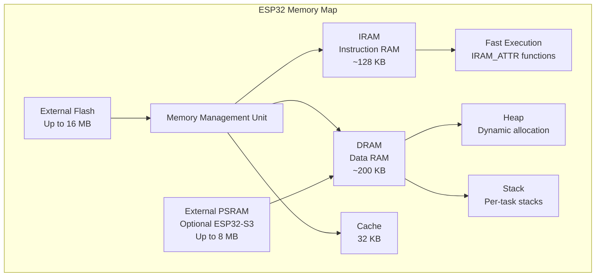
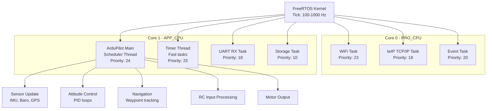
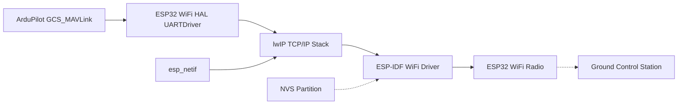
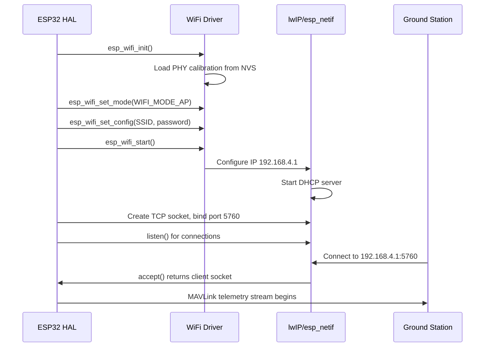
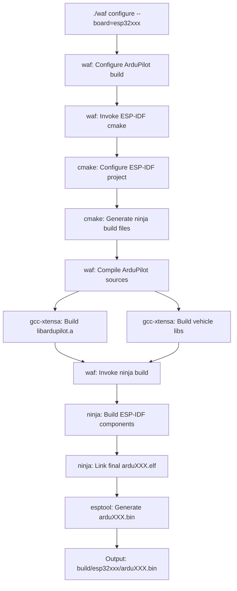

# ArduPilot ESP32 Hardware Abstraction Layer (HAL)

This directory contains the ESP32 platform implementation of the ArduPilot Hardware Abstraction Layer (HAL), enabling ArduPilot to run on Espressif ESP32, ESP32-S3, and ESP32-C3 microcontrollers.

## Table of Contents

- [Overview](#overview)
- [ESP32 Architecture](#esp32-architecture)
- [Peripheral Usage Patterns](#peripheral-usage-patterns)
- [WiFi Integration](#wifi-integration)
- [Bluetooth Integration](#bluetooth-integration)
- [ESP-IDF Integration and Build System](#esp-idf-integration-and-build-system)
- [Memory Constraints](#memory-constraints)
- [Board-Specific Setup](#board-specific-setup)
- [Building Instructions](#building-instructions)
- [Hardware Configuration](#hardware-configuration)
- [Troubleshooting](#troubleshooting)
- [Current Progress](#current-progress)

## Overview

The ESP32 HAL implementation provides ArduPilot with access to ESP32 hardware features through the standard AP_HAL interface. This enables running ArduPilot's flight control software on low-cost ESP32 development boards with integrated WiFi connectivity for telemetry.

**Key Features:**
- WiFi telemetry (TCP and UDP MAVLink)
- SPI and I2C sensor support
- PWM output for servo/motor control
- RC input (PPM)
- GPS via UART
- SD card storage
- Over-The-Air (OTA) firmware updates
- FreeRTOS-based scheduler
- Support for ESP32, ESP32-S3, and ESP32-C3 chip variants

**Primary Use Cases:**
- Low-cost autopilot prototyping
- WiFi-based ground control station connectivity
- Educational platforms for learning ArduPilot
- Fixed-wing and multicopter applications

## ESP32 Architecture

### Chip Variants

The ESP32 family includes several variants with different CPU architectures and capabilities:

| Chip | CPU Architecture | Cores | Clock Speed | SRAM | Key Features |
|------|------------------|-------|-------------|------|--------------|
| **ESP32** | Xtensa LX6 | 2 | Up to 240 MHz | 520 KB | WiFi + Bluetooth Classic + BLE, most mature |
| **ESP32-S3** | Xtensa LX7 | 2 | Up to 240 MHz | 512 KB | WiFi + BLE, AI acceleration, external PSRAM support |
| **ESP32-C3** | RISC-V | 1 | Up to 160 MHz | 400 KB | WiFi + BLE only, smaller footprint |

### CPU Architecture Details

**ESP32 / ESP32-S3 (Xtensa LX6/LX7):**
- 32-bit Harvard architecture with separate instruction and data buses
- Instruction cache (16 KB) and data cache (16 KB) per core
- Dual-core configurations allow task partitioning (e.g., WiFi on one core, flight control on the other)
- Core affinity can be configured in FreeRTOS tasks (see `xTaskCreatePinnedToCore`)
- Hardware floating-point unit (FPU) for efficient math operations

**ESP32-C3 (RISC-V):**
- 32-bit single-core RISC-V architecture
- Lower power consumption than dual-core variants
- Suitable for simpler applications with reduced computational requirements

### Memory Architecture

ESP32 devices use a complex memory architecture with multiple regions:



**Memory Regions:**

1. **IRAM (Instruction RAM)**:
   - Limited size (~128 KB usable)
   - Code executed from IRAM runs faster and is required for interrupt handlers
   - Functions must be marked with `IRAM_ATTR` to be placed in IRAM
   - **Critical:** Running out of IRAM causes linker errors

2. **DRAM (Data RAM)**:
   - ~200 KB available for heap and stack
   - Used for dynamic memory allocation via `malloc()` / `new`
   - Shared between all FreeRTOS tasks

3. **External Flash**:
   - Typically 4 MB or 16 MB
   - Used for code storage (execute-in-place via cache)
   - Contains firmware, parameter storage partition, and SD filesystem

4. **PSRAM (External SRAM)**:
   - Available on some ESP32-S3 boards
   - Up to 8 MB additional RAM
   - Slower than internal DRAM but useful for large buffers
   - Configured via `CONFIG_SPIRAM_SUPPORT` in sdkconfig

**Memory Map Summary:**

| Address Range | Region | Purpose |
|---------------|--------|---------|
| 0x4000_0000 - 0x4006_0000 | IRAM | Fast instruction execution |
| 0x3FFB_0000 - 0x3FFF_0000 | DRAM | Data and heap |
| 0x3F40_0000 - 0x3F80_0000 | Flash Cache | Code execution from flash |
| 0x5000_0000 - 0x5080_0000 | RTC Fast Memory | Deep sleep retention |

### Clock Configuration

- **CPU Clock**: Typically 240 MHz for ESP32/ESP32-S3, 160 MHz for ESP32-C3
- **APB Clock**: 80 MHz (peripheral bus - UART, SPI, I2C, timers)
- **WiFi requires**: 80 MHz APB clock minimum
- Clock configuration managed by ESP-IDF in `sdkconfig`

### Dual-Core Considerations (ESP32, ESP32-S3)

**Core Affinity Strategies:**
- **Core 0 (PRO_CPU)**: Typically runs WiFi stack and protocol processing
- **Core 1 (APP_CPU)**: Can be dedicated to ArduPilot scheduler and flight control
- Scheduler tasks can be pinned to specific cores for deterministic timing
- Shared resources (SPI, I2C) require proper semaphore protection between cores

**FreeRTOS Integration:**
- ArduPilot scheduler runs as FreeRTOS tasks
- Tick rate configured to support main loop timing (typically 400 Hz for copter)
- Interrupt priorities must respect FreeRTOS constraints (ISRs use `IRAM_ATTR`)

### FreeRTOS Task Architecture



**Task Priorities:**
- Higher number = higher priority
- Timer thread (25): Fastest periodic tasks (IMU reads, attitude control inner loop)
- Main scheduler (24): Medium rate tasks (navigation, mode logic)
- WiFi (23): Network stack processing
- UART (18): Serial data processing
- Storage (10): Background parameter saves, logging

**Task Pinning Strategy:**
- Network stack pinned to Core 0 (reduces contention with flight control)
- Flight-critical tasks pinned to Core 1 (deterministic timing)
- Unpinned tasks can float between cores (lower priority utility tasks)

## Peripheral Usage Patterns

This section documents how the ESP32 HAL interfaces with hardware peripherals.

### I2C (Inter-Integrated Circuit)

The ESP32 HAL supports both software bit-bang and hardware I2C implementations:

**Software I2C (`i2c_sw.c`):**
- Bit-banged I2C implementation using GPIO
- Useful for boards where hardware I2C pins are unavailable
- Lower performance but more flexible pin selection
- Default pins: GPIO12 (SCL), GPIO13 (SDA)

**Hardware I2C (ESP-IDF `i2c_driver.h`):**
- Uses ESP32 hardware I2C peripheral (I2C0 or I2C1)
- Supports clock stretching and multi-master mode
- Typical configuration: 400 kHz fast mode
- Example devices: External compass (HMC5883L, LIS3MDL), airspeed sensors

**I2C Device Probing:**
- Devices probed during HAL initialization
- 7-bit addressing mode
- Timeout handling for device detection failures

### SPI (Serial Peripheral Interface)

**SPI Bus Architecture:**
- ESP32 provides VSPI (SPI3) and HSPI (SPI2) peripherals
- ArduPilot uses VSPI for sensor communication
- DMA support for efficient large transfers (e.g., SD card)

**SPI Device Registration Pattern:**
```
1. Device probe: Check device ID via SPI read
2. Device initialization: Configure registers
3. Register periodic callback: Scheduler calls update() at fixed rate
4. Update method: Read sensor data via SPI transaction
```

**SPI Configuration:**
- Mode 0 or Mode 3 depending on device
- Clock speeds: Up to 20 MHz for sensors, 40 MHz for SD card
- Chip select (CS) lines managed per device

**Default SPI Pin Mapping:**
- MOSI: GPIO23
- MISO: GPIO19
- SCK: GPIO18
- CS lines: Device-specific (e.g., GPIO5 for BMP280, GPIO26 for MPU9250)

**Example SPI Devices:**
- IMU: MPU9250, ICM-20xxx series
- Barometer: BMP280, MS5611
- SD Card: FAT32 filesystem

### UART (Universal Asynchronous Receiver/Transmitter)

**UART Driver Architecture:**
- ESP-IDF UART driver with hardware FIFO buffering
- Supports up to 3 hardware UARTs (UART0, UART1, UART2)
- DMA-based for efficient CPU usage

**UART Assignments:**
- **UART0**: Console/USB (GPIO1 TX, GPIO3 RX) - Serial0 in ArduPilot
  - Boot messages, hal.console output, MAVLink telemetry option
- **UART1**: GPS (GPIO17 TX, GPIO16 RX) - Serial1 in ArduPilot
- **UART2**: Available for additional peripherals

**Buffer Configuration:**
- RX buffer: 256 bytes hardware FIFO + software ring buffer
- TX buffer: 256 bytes
- Hardware flow control (RTS/CTS) available on UART1/UART2

### GPIO (General Purpose Input/Output)

**GPIO Matrix Flexibility:**
- ESP32 GPIO matrix allows routing most peripherals to any GPIO pin
- Defined in hwdef or board-specific configuration
- Input/output modes, pull-up/pull-down resistors configurable

**GPIO Usage:**
- RC input (PPM): GPIO4
- PWM output (MCPWM): GPIO25, 27, 33, 32, 22, 21 (6 channels)
- I2C: GPIO12, GPIO13
- LED/status indicators: Configurable

**Interrupt Handling:**
- GPIO interrupts can be attached to any pin
- ISR must be in IRAM (use `IRAM_ATTR` attribute)
- Typical use: RC input edge detection, encoder inputs

### PWM Output (Motor Control PWM)

**MCPWM Peripheral:**
- ESP32 Motor Control PWM (MCPWM) peripheral generates servo PWM signals
- Two MCPWM units, each with 3 timer/operator pairs = 6 PWM channels
- Resolution: 16-bit timer, typical 50 Hz servo update rate
- Pulse width range: 1000-2000 µs (configurable per channel)

**PWM Configuration:**
- Timer prescaler set for microsecond precision
- Deadtime insertion disabled for servo control
- Continuous mode for constant PWM output

**Channel Assignment (Default):**
- Servo 1: GPIO25 (Aileron)
- Servo 2: GPIO27 (Elevator)
- Servo 3: GPIO33 (Throttle)
- Servo 4: GPIO32 (Rudder)
- Servo 5: GPIO22 (Aux)
- Servo 6: GPIO21 (Aux)

**Limitations:**
- 6 channels maximum (due to MCPWM peripheral limits)
- Additional channels would require LEDC peripheral (LED Controller, PWM alternative)

### RC Input

**PPM (Pulse Position Modulation) Input:**
- Single-wire RC receiver protocol
- Connected to GPIO4 by default
- Edge-triggered interrupt captures pulse timing
- Decodes up to 8 channels from PPM frame

**Implementation:**
- ISR reads timer value on each pulse edge
- Pulse width decoded to channel values (1000-2000 µs)
- Timeout detection for signal loss failsafe

### SD Card

**SDMMC Peripheral:**
- 4-bit SDIO mode for high-speed access
- FAT32 filesystem via ESP-IDF VFS (Virtual File System)

**Pin Mapping:**
- D0: GPIO2
- CLK: GPIO14
- CMD: GPIO15
- Additional data lines for 4-bit mode

**Usage:**
- ArduPilot logging (log files written to SD)
- Parameter storage backup
- Firmware file storage for OTA updates

### Analog Input (ADC)

**ADC Peripheral:**
- 12-bit SAR ADC
- Two ADC units (ADC1, ADC2)
- Note: ADC2 pins unusable when WiFi is active

**ADC Pin Options (ADC1 only for WiFi compatibility):**
- GPIO35, GPIO34, GPIO39, GPIO36 (ADC1_CH7, CH6, CH3, CH0)

**Typical Usage:**
- Battery voltage monitoring (BATT_VOLT_PIN)
- Battery current sensing (BATT_CURR_PIN)
- RSSI analog input (RSSI_ANA_PIN)
- Analog airspeed sensor (ARSPD_PIN)

**ADC Configuration:**
- Attenuation: 11 dB (measures 0-3.3V range)
- Calibration: ESP32 ADC calibration curves applied
- Averaging: Multiple samples averaged for noise reduction

## WiFi Integration

The ESP32 HAL provides WiFi connectivity for MAVLink telemetry, enabling wireless communication with ground control stations.

### WiFi Modes

**SoftAP (Software Access Point) Mode:**
- ESP32 acts as a WiFi access point
- Ground station connects directly to ESP32
- **Default Configuration:**
  - SSID: `ardupilot` (configurable)
  - Password: `ardupilot123` (WPA2)
  - Channel: 11 (2.4 GHz)
  - IP Address: `192.168.4.1`
  - DHCP Server: Assigns `192.168.4.x` addresses to clients
- **Use Case:** Direct connection without existing WiFi infrastructure

**Station Mode (Client Mode):**
- ESP32 connects to an existing WiFi network
- Obtains IP address via DHCP from router
- Ground station connects to ESP32's IP on the local network
- **Use Case:** Integration with existing network infrastructure

**Configuration:**
- WiFi credentials configured via `sdkconfig` or runtime parameters
- Mode selection typically compile-time choice

### MAVLink Over WiFi

**Protocol Options (Compile-Time Selection):**

**TCP Mode:**
- Port: **5760** (MAVLink standard)
- Connection-oriented, reliable delivery
- Ground station initiates connection to ESP32 IP:5760
- Single client connection at a time
- **Advantages:** Guaranteed packet delivery, flow control
- **Disadvantages:** Higher latency, single client limit

**UDP Mode:**
- Port: **14550** (MAVLink standard)
- Connectionless, broadcast-capable
- **Limitations:** Current implementation does not auto-stream to connected clients
- Requires ground station to initiate communication first
- **Advantages:** Lower latency, potential multi-client support
- **Disadvantages:** No delivery guarantee, packet loss possible

**Performance Characteristics:**
- Typical latency: 20-50 ms
- Throughput: ~500 kbit/s effective for telemetry
- Parameter loading over WiFi can be slow (see Troubleshooting)

### WiFi Driver Architecture



**Component Details:**
- **UARTDriver abstraction**: WiFi connection appears as a serial port to ArduPilot
- **lwIP stack**: Lightweight TCP/IP implementation (part of ESP-IDF)
- **esp_netif**: Network interface abstraction layer
- **WiFi driver**: Handles PHY, MAC, and RF control
- **NVS (Non-Volatile Storage)**: Stores WiFi calibration data and credentials

### WiFi Configuration

**NVS Partition Requirement:**
- WiFi requires NVS partition for PHY calibration data
- Partition defined in `partitions.csv`: `nvs, data, nvs, 0x9000, 0x6000`
- Automatically initialized during WiFi startup

**Connection Sequence:**



### WiFi and Flight Control Coexistence

**Dual-Core Task Distribution:**
- WiFi stack typically runs on Core 0 (PRO_CPU)
- ArduPilot scheduler runs on Core 1 (APP_CPU)
- Minimizes WiFi processing impact on flight control timing

**Timing Considerations:**
- WiFi can cause brief CPU stalls (RF calibration, beacon transmission)
- Main loop jitter typically <5% with WiFi active
- Critical control loops should avoid blocking on WiFi I/O

## Bluetooth Integration

### Bluetooth Capabilities by Chip

| Chip | Bluetooth Classic | BLE (Bluetooth Low Energy) | Typical Use Cases |
|------|-------------------|----------------------------|-------------------|
| **ESP32** | ✅ Yes | ✅ Yes | Full Bluetooth audio, SPP telemetry, BLE sensors |
| **ESP32-S3** | ❌ No | ✅ Yes | BLE telemetry, BLE sensors, lower power |
| **ESP32-C3** | ❌ No | ✅ Yes | BLE telemetry, BLE sensors, compact size |

### Bluetooth Protocols

**Bluetooth Classic (ESP32 only):**
- **SPP (Serial Port Profile)**: Could provide wireless serial telemetry (alternative to WiFi)
- **A2DP**: Audio streaming (not applicable to ArduPilot)
- Higher power consumption than BLE

**BLE (Bluetooth Low Energy):**
- Lower power consumption
- Shorter range than Bluetooth Classic (~50m vs ~100m)
- Could support BLE UART service for telemetry
- Potential for BLE sensor peripherals (e.g., external GPS, rangefinders)

### Current Implementation Status

**⚠️ Note:** Bluetooth telemetry is **not currently implemented** in the ESP32 HAL, but the architecture supports it.

**Potential Implementation Approach:**
1. Use ESP-IDF Bluetooth stack (`esp_bt.h`, `esp_gap_ble_api.h`)
2. Implement BLE UART service (Nordic UART Service UUID)
3. Map BLE characteristic read/write to ArduPilot UARTDriver
4. Configure as Serial2 or Serial3 in ArduPilot

**Bluetooth and WiFi Coexistence:**
- ESP32 supports simultaneous WiFi and Bluetooth operation
- Both share the same 2.4 GHz radio with time-division multiplexing
- Coexistence automatically managed by ESP-IDF
- **Performance Impact:** Simultaneous use reduces WiFi throughput by ~20-30%

**Resource Considerations:**
- Bluetooth stack requires ~40 KB DRAM
- BLE has lower memory footprint than Bluetooth Classic
- Additional IRAM requirements for BT interrupt handlers

### Future Development Potential

- **BLE Telemetry**: Low-power alternative to WiFi for short-range operations
- **BLE Configuration**: Mobile app for parameter configuration without WiFi
- **BLE Sensor Network**: Connect external BLE sensors (GPS, rangefinders, IMUs)
- **Bluetooth Classic SPP**: Traditional serial Bluetooth for legacy ground stations

## ESP-IDF Integration and Build System

### Build System Architecture

The ESP32 HAL integrates with the ESP-IDF (Espressif IoT Development Framework) build system via ArduPilot's waf build system. This creates a hybrid build process:



### Build Phases

**Phase 1: waf configure**
- Detects ESP-IDF toolchain (xtensa-esp32-elf-gcc or riscv32-esp-elf-gcc)
- Validates ESP-IDF version (currently v5.3 required)
- Configures board-specific parameters from hwdef
- Generates ESP-IDF cmake project structure

**Phase 2: ArduPilot Library Compilation**
- Compiles ArduPilot libraries to `.o` object files
- Archives into `libardupilot.a` and `libArduVehicle_libs.a`
- Uses ESP32 HAL headers for platform abstraction

**Phase 3: ESP-IDF Component Build**
- Invokes ESP-IDF cmake/ninja build system
- Compiles ESP-IDF components (FreeRTOS, lwIP, WiFi driver, etc.)
- Links ArduPilot libraries against ESP-IDF

**Phase 4: Final Linking**
- Links all object files into single `.elf` binary
- Applies ESP32 linker script (defines memory regions)
- Resolves symbols across ArduPilot and ESP-IDF

**Phase 5: Binary Generation**
- Strips debug symbols to create `.bin` file
- Generates partition table binary
- Generates bootloader binary
- Prepares files for flashing

### ESP-IDF Version Requirements

**Current Version:** ESP-IDF v5.3 (release/v5.3 branch)

**Installation:**
```bash
cd ardupilot
./Tools/scripts/esp32_get_idf.sh  # Clones ESP-IDF to modules/esp_idf
cd modules/esp_idf
./install.sh                       # Installs toolchain
source ./export.sh                 # Sets up environment variables
```

**Version Compatibility:**
- ESP-IDF v5.x series required (v5.3 tested)
- Older v4.x versions not supported
- Newer v5.x versions may work but are untested

### Configuration Management: sdkconfig

**sdkconfig** is the ESP-IDF configuration file (analogous to Linux .config):

**Configuration Hierarchy:**
1. **sdkconfig.defaults** (checked into git): Default configuration template
2. **sdkconfig** (generated, in build dir): Active configuration
3. **menuconfig changes**: Runtime modifications via `ninja menuconfig`

**sdkconfig.defaults Location:**
- `libraries/AP_HAL_ESP32/sdkconfig.defaults`

**Key Configuration Options:**
- `CONFIG_ESP32_DEFAULT_CPU_FREQ_240`: CPU frequency
- `CONFIG_FREERTOS_HZ`: FreeRTOS tick rate
- `CONFIG_SPIRAM_SUPPORT`: External PSRAM enable
- `CONFIG_TASK_WDT_TIMEOUT_S`: Watchdog timeout
- WiFi buffer sizes, UART settings, flash size, etc.

**Modifying Configuration:**
```bash
cd build/esp32buzz/esp-idf_build
ninja menuconfig
# Navigate UI, make changes, save
# To persist changes:
ninja save-defconfig
cp defconfig ../../../libraries/AP_HAL_ESP32/sdkconfig.defaults
```

**Automatic Regeneration:**
- sdkconfig is deleted and regenerated if sdkconfig.defaults is modified
- sdkconfig is regenerated if manually deleted
- Prevents stale configuration issues

### Partition Table Configuration

ESP32 flash is divided into partitions defined in `partitions.csv`:

**Default Partition Layout:**

| Label | Type | SubType | Offset | Size | Purpose |
|-------|------|---------|--------|------|---------|
| nvs | data | nvs | 0x9000 | 24 KB | WiFi calibration data, credentials |
| phy_init | data | phy | 0xF000 | 4 KB | RF PHY initialization data |
| factory | app | factory | 0x10000 | 3 MB | Main ArduPilot firmware |
| storage | data | 0x45 | 0x310000 | 256 KB | ArduPilot parameter storage (AP_Param) |
| coredump | data | coredump | 0x350000 | 64 KB | Core dump storage for crash analysis |

**OTA (Over-The-Air) Update Layout (Alternative):**

For OTA support, partition table includes two app partitions:

| Label | Type | SubType | Offset | Size |
|-------|------|---------|--------|------|
| otadata | data | ota | 0xD000 | 8 KB |
| ota_0 | app | ota_0 | 0x10000 | 1.5 MB |
| ota_1 | app | ota_1 | 0x190000 | 1.5 MB |

- System boots from `ota_0` or `ota_1` based on otadata
- New firmware written to inactive partition, then swapped
- Rollback on boot failure to previous partition

**Partition Table File:** `libraries/AP_HAL_ESP32/partitions.csv`

### component.mk and CMakeLists.txt Integration

**ArduPilot as ESP-IDF Component:**
- ArduPilot libraries exposed as ESP-IDF "components"
- `CMakeLists.txt` in HAL directory defines component
- Links prebuilt `.a` archives into ESP-IDF build

**Key CMakeLists.txt Content:**
```cmake
idf_component_register(
    SRCS "dummy.c"  # Placeholder source
    INCLUDE_DIRS "."
    PRIV_REQUIRES ...
)

target_link_libraries(${COMPONENT_LIB} INTERFACE
    ${CMAKE_CURRENT_SOURCE_DIR}/../../build/esp32xxx/libardupilot.a
    ${CMAKE_CURRENT_SOURCE_DIR}/../../build/esp32xxx/libArduVehicle_libs.a
)
```

### Build System Environment Variables

**Key Variables:**
- `IDF_PATH`: Path to ESP-IDF installation (set by `export.sh`)
- `ESPPORT`: Serial port for flashing (e.g., `/dev/ttyUSB0`)
- `ESPBAUD`: Baud rate for flashing (921600 recommended)
- `ESPTOOL_PORT`, `ESPTOOL_BAUD`: Alternative names for port/baud

**Build Directory Structure:**
```
build/
  esp32buzz/                    # Board-specific build
    ardupilot.elf               # Unstripped binary with symbols
    ardupilot.bin               # Firmware for flashing
    libardupilot.a              # ArduPilot libraries archive
    libArduVehicle_libs.a       # Vehicle libraries archive
    esp-idf_build/              # ESP-IDF build artifacts
      bootloader/
        bootloader.bin          # Bootloader binary
      partition_table/
        partition-table.bin     # Partition table binary
      compile_commands.json     # For IDE integration
      sdkconfig                 # Active ESP-IDF configuration
```

### Flashing Process

**Flashing via waf:**
```bash
ESPBAUD=921600 ./waf plane --upload
```

**What happens:**
1. waf invokes esptool.py (ESP-IDF flashing utility)
2. Bootloader flashed to 0x1000
3. Partition table flashed to 0x8000
4. Firmware flashed to 0x10000
5. Optional: OTA data, NVS initialized

**Manual Flashing (Advanced):**
```bash
cd build/esp32buzz/esp-idf_build
ninja flash  # Flashes via ESP-IDF
ninja monitor  # Opens serial monitor
```

**Flash Files Required for Distribution:**
- `bootloader/bootloader.bin` @ 0x1000
- `partition_table/partition-table.bin` @ 0x8000
- `ardupilot.bin` @ 0x10000

## Memory Constraints

ESP32 memory is limited and carefully managed. Understanding memory constraints is critical for successful ArduPilot ESP32 development.

### IRAM Constraints

**IRAM (Instruction RAM) Limitations:**
- **Available Size:** ~128 KB usable for code
- **Purpose:** Fast execution, required for ISRs (Interrupt Service Routines)
- **Attribute:** `IRAM_ATTR` function attribute places code in IRAM

**When IRAM is Required:**
- All interrupt service routines (ISRs)
- Flash cache-disabled critical sections
- Frequently-called performance-critical functions (optional optimization)

**IRAM Exhaustion Symptoms:**
```
ld: region `iram0_0_seg' overflowed by XXXXX bytes
```

**Solutions for IRAM Shortage:**
1. **Remove IRAM_ATTR** from non-critical functions
2. **Reduce ISR code size**: Move logic out of ISR to task context
3. **Use IRAM selectively**: Only mark truly critical code
4. **Disable features**: Remove unused ArduPilot features to reduce code size

**Example IRAM Usage:**
```cpp
// Correct: ISR must be in IRAM
void IRAM_ATTR rc_input_isr() {
    // Minimal processing
    timer_value = read_timer();
    signal_task();  // Defer processing to task
}

// Incorrect: Large function doesn't need IRAM
void IRAM_ATTR process_sensor_data() {  // Remove IRAM_ATTR
    // 50 lines of code...
}
```

### DRAM Constraints

**DRAM (Data RAM) Limitations:**
- **Available:** ~200-250 KB for heap + stacks
- **Shared by:** All FreeRTOS tasks, dynamic allocations, static variables
- **Fragmentation:** Repeated malloc/free can fragment heap

**Heap Management:**
- ArduPilot uses `hal.util->malloc_type()` for typed allocations
- FreeRTOS `pvPortMalloc()` underlying allocator
- No garbage collection - manual memory management

**Monitoring Heap Usage:**
```cpp
#include <esp_heap_caps.h>

// Check free DRAM heap
size_t free_heap = heap_caps_get_free_size(MALLOC_CAP_8BIT);
printf("Free heap: %u bytes\n", free_heap);

// Detailed heap info
heap_caps_print_heap_info(MALLOC_CAP_8BIT);
```

**Typical DRAM Usage:**
- ArduPilot vehicle: ~100-150 KB
- ESP-IDF (WiFi, FreeRTOS): ~50-80 KB
- **Remaining for heap:** ~50-100 KB
- **⚠️ Warning:** <20 KB free heap may cause instability

### Flash Partitioning

**Flash Memory Layout (4 MB typical):**

```
0x000000  +------------------+
          | Reserved         | (Bootloader ROM)
0x001000  +------------------+
          | Bootloader       | 28 KB (secondary bootloader)
0x008000  +------------------+
          | Partition Table  | 4 KB
0x009000  +------------------+
          | NVS              | 24 KB (WiFi calibration)
0x00F000  +------------------+
          | PHY Init         | 4 KB
0x010000  +------------------+
          | Application      | 3 MB (ArduPilot firmware)
0x310000  +------------------+
          | Storage          | 256 KB (parameters)
0x350000  +------------------+
          | Coredump         | 64 KB (crash dumps)
0x360000  +------------------+
          | Free / Future    | ~640 KB
0x400000  +------------------+ (4 MB end)
```

**Partition Sizes:**
- **Bootloader:** Fixed size, ESP-IDF provided
- **Application:** Largest partition, typical 3 MB for ArduPilot
- **Storage:** ArduPilot parameter storage (AP_Param FlashStorage)
- **Coredump:** Crash dump for post-mortem debugging

**Expanding Flash:**
- Some boards support 8 MB or 16 MB flash
- Adjust partition table in `partitions.csv`
- Configure flash size in `sdkconfig`: `CONFIG_ESPTOOLPY_FLASHSIZE_XMIB`

### PSRAM / External SRAM (ESP32-S3)

**PSRAM Advantages:**
- **Capacity:** Up to 8 MB additional RAM
- **Use Cases:** Large buffers (logs, sensor data), image processing

**PSRAM Limitations:**
- **Speed:** ~40 MB/s vs ~320 MB/s for internal DRAM
- **Latency:** Higher latency than internal RAM
- **Not DMA-capable:** Cannot be used for DMA buffers (SPI, I2C)

**Configuration:**
- Enable in `sdkconfig`: `CONFIG_SPIRAM_SUPPORT=y`
- Allocate with: `heap_caps_malloc(size, MALLOC_CAP_SPIRAM)`
- **Not enabled by default** in ArduPilot ESP32 builds

**Automatic PSRAM Usage (if enabled):**
- Large `malloc()` requests may automatically use PSRAM
- Configure threshold via `CONFIG_SPIRAM_MALLOC_ALWAYSINTERNAL`

### Stack Size Configuration

**FreeRTOS Task Stacks:**
- Each task has dedicated stack in DRAM
- Stack overflow causes crash (watchdog trigger)
- Configured per-task in `Scheduler.cpp`

**Typical Stack Sizes (see `Scheduler.h`):**
- Main scheduler task: 8-12 KB
- WiFi task: 4 KB
- Idle task: 2 KB
- **Total:** ~20-30 KB for stacks

**Monitoring Stack Usage:**
```cpp
UBaseType_t high_water = uxTaskGetStackHighWaterMark(NULL);
printf("Stack free: %u bytes\n", high_water * 4);
```

**Stack Overflow Symptoms:**
- Random crashes
- Watchdog timeout
- Guru Meditation Error (stack corruption)

### Memory Debugging Tips

**Detecting Memory Leaks:**
```cpp
// At strategic points:
size_t free_start = heap_caps_get_free_size(MALLOC_CAP_8BIT);
// ... run code ...
size_t free_end = heap_caps_get_free_size(MALLOC_CAP_8BIT);
printf("Memory delta: %d bytes\n", (int)(free_end - free_start));
```

**Heap Profiling:**
- Enable `CONFIG_HEAP_TRACING` in menuconfig
- Use `heap_trace_start()` and `heap_trace_stop()`
- Dump heap allocations with `heap_trace_dump()`

**Flash Size Detection:**
- Boot log shows detected flash size
- Verify matches actual hardware
- Mismatch causes partition read errors

**Common Memory Errors:**
- **Out of IRAM:** Linker error, reduce `IRAM_ATTR` usage
- **Out of DRAM:** Crash, reduce heap usage or static buffers
- **Stack overflow:** Watchdog, increase task stack size
- **Flash overflow:** Linker error, reduce firmware size or increase app partition

**@warning Memory Safety:**
Always check `malloc()` return values for NULL. ESP32 has limited memory and allocations can fail, especially during WiFi initialization or parameter loading. Failing to check can cause immediate crashes.

## Board-Specific Setup

### Supported Boards

ArduPilot ESP32 HAL supports several board targets configured via `--board=` flag:

| Board Target | Chip | Description |
|--------------|------|-------------|
| `esp32buzz` | ESP32 | Original development board, full feature set |
| `esp32diy` | ESP32 | DIY board configuration, customizable pinout |
| `esp32-s3-devkit` | ESP32-S3 | ESP32-S3 DevKit boards, enhanced performance |
| `esp32-c3-devkit` | ESP32-C3 | ESP32-C3 DevKit boards, RISC-V, compact |

### Generic ESP32 DevKit Setup

**ESP32-WROOM-32 Development Boards:**
- Most common ESP32 board (e.g., ESP32 DevKit V1, NodeMCU-32S)
- 4 MB flash, 520 KB SRAM
- Dual-core Xtensa LX6 @ 240 MHz
- Integrated WiFi + Bluetooth

**Pin Mapping (Default):**
See [Hardware Configuration](#hardware-configuration) section for complete pinout tables.

**Board Selection:**
```bash
./waf configure --board=esp32diy
./waf copter  # or plane, rover
```

**Prerequisites:**
- USB-to-UART driver installed (CP2102, CH340, FTDI)
- User added to `dialout` group (Linux): `sudo usermod -a -G dialout $USER`
- Sufficient USB power (500 mA minimum)

### ESP32-S3 Board Setup

**ESP32-S3-DevKitC-1 / ESP32-S3-WROOM:**
- Enhanced ESP32 with Xtensa LX7 cores
- Optional external PSRAM (2 MB, 8 MB variants)
- USB OTG support (native USB, not UART bridge)
- Better AI/signal processing performance

**Key Differences from ESP32:**
- GPIO matrix changes (consult ESP32-S3 datasheet)
- USB-Serial-JTAG built-in (no external UART chip)
- Bluetooth Classic not supported (BLE only)
- PSRAM recommended for ArduPilot (8 MB ideal)

**Board Selection:**
```bash
./waf configure --board=esp32-s3-devkit
./waf copter
```

**Flashing Notes:**
- ESP32-S3 has native USB: `/dev/ttyACM0` (not ttyUSB)
- May require holding BOOT button during flashing
- First flash may need slower baud: `ESPBAUD=115200`

### ESP32-C3 Board Setup

**ESP32-C3-DevKitM-1 / ESP32-C3-MINI:**
- Single-core RISC-V @ 160 MHz
- 4 MB flash, 400 KB SRAM
- Smaller footprint, lower power
- BLE only (no Bluetooth Classic)

**Limitations for ArduPilot:**
- **Single core:** WiFi shares CPU with flight control (more jitter)
- **Lower performance:** 160 MHz vs 240 MHz
- **Less RAM:** May limit feature set
- **Best for:** Simple fixed-wing or educational use

**Board Selection:**
```bash
./waf configure --board=esp32-c3-devkit
./waf plane  # Recommended vehicle type
```

### Custom Board Definitions

**hwdef System:**
ArduPilot ESP32 uses hwdef files (similar to ChibiOS) for custom boards:

**Creating Custom Board:**
1. Copy existing board directory: `libraries/AP_HAL_ESP32/boards/esp32xxx/`
2. Modify `hwdef.h`: Define GPIO pins, peripherals, features
3. Adjust `sdkconfig.defaults`: ESP-IDF configuration
4. Update `boards.py`: Register new board name

**hwdef.h Key Definitions:**
```cpp
#define HAL_ESP32_WIFI_SSID "my-drone"
#define HAL_ESP32_WIFI_PASSWORD "my-password"

#define HAL_ESP32_RCIN_PIN 4
#define HAL_ESP32_RCOUT_PINS {25, 27, 33, 32, 22, 21}

#define HAL_ESP32_I2C_SCL 12
#define HAL_ESP32_I2C_SDA 13

#define HAL_ESP32_SPI_MOSI 23
#define HAL_ESP32_SPI_MISO 19
#define HAL_ESP32_SPI_SCK  18
```

**Board Compilation:**
```bash
./waf configure --board=my-custom-board
./waf copter
```

**Hwdef Documentation:**
Detailed hwdef syntax: `libraries/AP_HAL_ChibiOS/hwdef/README.md` (similar concepts apply)

### Pin Mapping Considerations

**GPIO Constraints:**
- **Input-only pins:** GPIO34, 35, 36, 39 (no pull-up, no output)
- **Strapping pins:** GPIO0, 2, 5, 12, 15 (affect boot mode, use carefully)
- **ADC2 pins:** Unavailable when WiFi active (use ADC1: GPIO32-39)
- **Flash pins:** GPIO6-11 (reserved for SPI flash, do NOT use)

**Recommended GPIO Assignments:**
- **PWM outputs:** GPIO25, 27, 33, 32, 22, 21 (MCPWM capable)
- **I2C:** GPIO12, 13 (avoid strapping conflicts)
- **SPI:** GPIO18, 19, 23 (VSPI)
- **UART:** GPIO16, 17 (UART1 for GPS)
- **RC Input:** GPIO4 (interrupt-capable, not strapping)
- **Analog:** GPIO34, 35, 36, 39 (ADC1, input-only)

### Power Supply Requirements

**Voltage:**
- ESP32: 3.0-3.6V (typ. 3.3V)
- 5V via USB or voltage regulator
- **Do NOT apply >3.6V to GPIO pins** (damage risk)

**Current:**
- Idle: ~80 mA
- WiFi active: ~200-300 mA
- Peak (TX burst): ~400 mA
- **Recommendation:** 500 mA capable supply with decoupling capacitors

**Brown-Out Detection:**
- ESP32 has built-in brown-out detector (BOR)
- Triggers at ~2.8V, resets chip
- Add 100µF capacitor near ESP32 if power unstable

## Building Instructions

### Prerequisites

**Development Environment:**
- **Linux Required:** Build currently tested on Linux (Ubuntu 20.04+, Arch Linux)
- **Python 3:** Version 3.7 or newer
- **Git:** For repository management
- **Disk Space:** ~5 GB for toolchain, ESP-IDF, and build artifacts

**Hardware:**
- ESP32, ESP32-S3, or ESP32-C3 development board
- USB cable (data-capable, not charge-only)
- Stable 5V USB power supply (500 mA minimum)

### Step 1: Install ArduPilot Prerequisites

Clone ArduPilot repository:
```bash
git clone https://github.com/ardupilot/ardupilot.git
cd ardupilot
git submodule update --init --recursive
```

Install ArduPilot dependencies:
```bash
# For Ubuntu/Debian:
Tools/environment_install/install-prereqs-ubuntu.sh

# For Arch Linux:
Tools/environment_install/install-prereqs-arch.sh
```

### Step 2: Install ESP-IDF Dependencies

Install ESP-IDF system dependencies:

```bash
# Ubuntu/Debian:
sudo apt-get install git wget flex bison gperf cmake ninja-build ccache \
    libffi-dev libssl-dev dfu-util python3 python3-pip python3-setuptools

# Arch Linux:
sudo pacman -S --needed gcc git make flex bison gperf python-pip cmake \
    ninja ccache dfu-util libusb
```

Reference: [ESP-IDF Linux Setup Guide](https://docs.espressif.com/projects/esp-idf/en/latest/esp32/get-started/linux-setup.html)

### Step 3: Install ESP-IDF Toolchain

ArduPilot uses ESP-IDF v5.3 as a git submodule:

```bash
cd ardupilot

# Clone ESP-IDF to modules/esp_idf (if not already present)
./Tools/scripts/esp32_get_idf.sh

# Install ESP32 toolchain (xtensa-esp32-elf-gcc and others)
cd modules/esp_idf
./install.sh

# Set up ESP-IDF environment variables
unset IDF_PATH  # Clear any conflicting IDF_PATH
source ./export.sh

cd ../../..
```

**⚠️ Important:** The `source ./export.sh` command must be run in every new terminal session before building. It sets critical environment variables like `IDF_PATH` and adds the toolchain to `PATH`.

**Verify Installation:**
```bash
xtensa-esp32-elf-gcc --version  # Should show ESP32 GCC version
echo $IDF_PATH  # Should show path to modules/esp_idf
```

### Step 4: Configure ArduPilot Build

First run a plain configure to initialize the build system:
```bash
cd ardupilot

# REQUIRED: Run plain configure first
./waf configure

# Then configure for your target board
./waf configure --board=esp32buzz
# Or for other boards:
# ./waf configure --board=esp32diy
# ./waf configure --board=esp32-s3-devkit
# ./waf configure --board=esp32-c3-devkit

# Optional: Add --debug for debug symbols
# ./waf configure --board=esp32buzz --debug
```

### Step 5: Compile ArduPilot

Build your desired vehicle type:

```bash
# For fixed-wing:
./waf plane

# For multicopter:
./waf copter

# For ground vehicle:
./waf rover

# For submarine:
./waf sub
```

**⚠️ Note:** Do NOT use `./waf build` command - it does not work correctly for ESP32 targets. Always use `./waf <vehicle>` (plane, copter, rover, sub).

**Build Output Location:**
- Firmware binary: `build/<board>/arduXXX.bin`
- ELF file (with symbols): `build/<board>/arduXXX.elf`
- Bootloader: `build/<board>/esp-idf_build/bootloader/bootloader.bin`
- Partition table: `build/<board>/esp-idf_build/partition_table/partition-table.bin`

### Step 6: Flash Firmware

**Recommended flashing method via waf:**

```bash
ESPBAUD=921600 ./waf plane --upload
```

**If port auto-detection fails, specify manually:**
```bash
ESPPORT=/dev/ttyUSB0 ESPBAUD=921600 ./waf plane --upload
```

**Common Serial Ports:**
- Linux: `/dev/ttyUSB0`, `/dev/ttyACM0` (ESP32-S3)
- macOS: `/dev/cu.usbserial-XXXX`
- Windows: `COM3`, `COM4`, etc.

**Troubleshooting Flashing:**
- **Permission denied:** Add user to dialout group: `sudo usermod -a -G dialout $USER` (logout/login required)
- **Chip not detected:** Hold BOOT button during flashing
- **Slow flashing:** Reduce baud: `ESPBAUD=115200`
- **Fails at 2000000 baud:** Use `ESPBAUD=921600` or `ESPBAUD=460800`

### Alternative: Manual ESP-IDF Flashing

For advanced users, flash directly via ESP-IDF tools:

```bash
# Set up ESP-IDF environment
cd ardupilot
source modules/esp_idf/export.sh

# Navigate to ESP-IDF build directory
cd build/esp32buzz/esp-idf_build

# Flash using ninja
ninja flash

# Open serial monitor
ninja monitor
```

**Manual esptool flashing:**
```bash
ESPTOOL_PORT=/dev/ttyUSB0  # Set port
ESPTOOL_BAUD=921600        # Set baud rate

# Use ninja flash with environment variables
ninja flash
```

**For distribution/deployment**, you need three files:
```bash
build/<board>/esp-idf_build/bootloader/bootloader.bin        @ 0x1000
build/<board>/esp-idf_build/partition_table/partition-table.bin @ 0x8000
build/<board>/esp-idf_build/arduXXX.bin                      @ 0x10000
```

Consult `build/<board>/esp-idf_build/flash_project_args` for exact flash addresses and arguments after building.

### Step 7: Connect and Verify

After flashing, connect a serial terminal to view boot messages:

```bash
# Using screen:
screen /dev/ttyUSB0 115200

# Using minicom:
minicom -D /dev/ttyUSB0 -b 115200

# Using ESP-IDF monitor (recommended - supports color output):
cd build/esp32buzz/esp-idf_build
ninja monitor
```

**Expected Boot Sequence:**
1. ESP-IDF bootloader messages
2. Partition table listing
3. ArduPilot initialization messages
4. WiFi AP start message: `mode : softAP (24:0a:c4:xx:xx:xx)`
5. Sensor probe results
6. ArduPilot ready

**Connect Ground Control Station:**
- WiFi SSID: `ardupilot` (default)
- WiFi Password: `ardupilot123`
- Connect to ESP32 IP: `192.168.4.1`
- TCP Port: `5760` or UDP Port: `14550`

### Build Tips and Troubleshooting

**Common Build Issues:**

**Issue:** `ninja: error: loading 'build.ninja': No such file or directory`
- **Solution:** Run plain `./waf configure` first, THEN `./waf configure --board=xxx`

**Issue:** `CONFIG_xxx is not defined` compiler warnings
```
in expansion of macro 'configSUPPORT_STATIC_ALLOCATION'
warning: "CONFIG_SUPPORT_STATIC_ALLOCATION" is not defined
```
- **Cause:** sdkconfig file is out of sync with ESP-IDF version
- **Solution:** Regenerate sdkconfig using menuconfig

**How to regenerate sdkconfig:**
```bash
cd build/esp32buzz/esp-idf_build  # Replace esp32buzz with your board
ninja menuconfig

# In menuconfig UI:
# 1. Use arrow keys to navigate
# 2. Press TAB to reach bottom buttons
# 3. Select [Save] and press ENTER
# 4. Press TAB, then ENTER on [OK] to confirm write
# 5. Press ENTER to dismiss "configuration written" dialog
# 6. Press TAB, then ENTER on [Exit] to quit

# Return to ardupilot root
cd ../../..
```

**Making sdkconfig changes permanent:**
- Temporary changes: Edit sdkconfig directly (in build dir)
- Permanent changes (commit to git):
  1. Run `ninja menuconfig` and make changes
  2. Run `ninja save-defconfig` to generate defconfig file
  3. Copy defconfig to `libraries/AP_HAL_ESP32/sdkconfig.defaults`

**Automatic regeneration:**
- sdkconfig is deleted and regenerated if sdkconfig.defaults is modified
- sdkconfig is regenerated if manually deleted
- Prevents stale configuration issues

**ESP-IDF Version:**
- ArduPilot uses **ESP-IDF v5.3** (release/v5.3 branch)
- Located at: `modules/esp_idf`
- Reference: [ESP-IDF Documentation](https://docs.espressif.com/projects/esp-idf/en/latest/get-started/)

### Build System Overview

**How ArduPilot Compiles on ESP32:**

1. **waf configure**: Configures ESP-IDF cmake and retrieves ESP-IDF include paths
2. **waf compile**: Compiles all ArduPilot sources into:
   - `libardupilot.a` - Core ArduPilot libraries
   - `libArduVehicle_libs.a` - Vehicle-specific libraries (e.g., libArduCopter_libs.a)
3. **cmake execution**: waf invokes ESP-IDF cmake to compile ESP-IDF components (FreeRTOS, lwIP, WiFi driver, etc.)
4. **Linking**: cmake links final `arduXXX.elf` binary against ArduPilot libraries and ESP-IDF
5. **Binary generation**: cmake generates stripped `arduXXX.bin` firmware file

**Build artifacts:**
- `arduXXX.elf` - ELF binary with all symbols (for debugging)
- `arduXXX.bin` - Stripped binary for flashing
- `bootloader/bootloader.bin` - ESP32 secondary bootloader
- `partition_table/partition-table.bin` - Flash partition definitions

## Hardware Configuration

This section documents the default pin assignments for ESP32 HAL. Pin mappings are defined in board-specific hwdef files and can be customized per board.

**⚠️ Important:** Default pinouts are for reference. Actual pin assignments depend on the board target (esp32buzz, esp32diy, etc.). Consult your board's hwdef file for exact mappings.

### UART Connections

**UART0 - Console / USB / MAVLink Telemetry (Serial0):**

Internally connected on most development boards via USB-to-UART bridge chip (CP2102, CH340, FTDI).

| ESP32 Pin | CP2102 Function | Purpose |
|-----------|-----------------|---------|
| GPIO3 (RX0) | UART_TX | Receive from USB |
| GPIO1 (TX0) | UART_RX | Transmit to USB |

**Usage:**
- Boot messages from ESP-IDF bootloader
- ArduPilot console output (`hal.console->printf`)
- Optional MAVLink telemetry (Serial0)
- Serial terminal: 115200 baud, 8N1, software flow control

**UART1 - GPS (Serial1):**

| ESP32 | CP2102 |
| ---   | ---    |
| GPIO3 | UART_TX |  AKA UART0_RX |
| GPIO1 | UART_RX |  AKA UART0_TX |

### GPS aka serial1/uart1:

| ESP32 Pin | GPS Module | Purpose |
|-----------|------------|---------|
| GPIO17 (TX1) | GPS RX | Transmit to GPS |
| GPIO16 (RX1) | GPS TX | Receive from GPS |
| GND | GND | Ground |
| 5V | VCC | Power supply |

**Supported GPS:**
- u-blox series (M8N, M9N, etc.) - recommended
- NMEA-compatible GPS modules
- RTK GPS modules (for precision positioning)

**Configuration:**
- Baud rate: Auto-detected (typically 9600 or 38400)
- Protocol: Auto-detected (u-blox binary, NMEA)
- ArduPilot parameter: `SERIAL1_PROTOCOL = 5` (GPS)

### RC Input (PPM)

**PPM (Pulse Position Modulation) Receiver:**

| ESP32 Pin | RC Receiver | Purpose |
|-----------|-------------|---------|
| GPIO4 | PPM Signal Out | RC pulse train input |
| GND | GND | Ground |
| 5V | VCC | Power supply (if needed) |

**Supported Protocols:**
- PPM (Pulse Position Modulation) - 8 channels
- **Note:** Other protocols (SBUS, DSM, CRSF) require additional implementation

**Configuration:**
- Interrupt-driven edge detection on GPIO4
- Channel decode range: 1000-2000 μs
- Failsafe: Triggered on signal loss timeout (>300ms)

**⚠️ Hardware Note:** GPIO4 is used as it's interrupt-capable and not a strapping pin.

### I2C Connection

**I2C Bus (External Sensors):**

| ESP32 Pin | I2C Device | Purpose |
|-----------|------------|---------|
| GPIO12 | SCL | I2C Clock |
| GPIO13 | SDA | I2C Data |
| GND | GND | Ground |
| 5V or 3.3V | VCC | Power supply (check device voltage) |

**Typical I2C Devices:**
- External compass modules (HMC5883L, QMC5883L, LIS3MDL)
- Digital airspeed sensors (MS4525, MS5525)
- External barometers (BMP280, MS5611)
- I2C GPS modules with integrated compass

**I2C Configuration:**
- Speed: 400 kHz (Fast Mode)
- Software or hardware I2C (configurable)
- Pull-up resistors: Usually included on sensor breakout boards (4.7kΩ typical)

**Compass Configuration (I2C):**

For GPS modules with integrated I2C compass (e.g., Ublox M8N with HMC5883L or LIS3MDL):

```
COMPASS_ENABLE=1      # Enable compass subsystem
COMPASS_EXTERNAL=1    # Use external compass (not internal/SPI)
COMPASS_EXTERN2=1     # Enable second external compass (if present)
COMPASS_EXTERN3=1     # Enable third external compass (if present)
```

**Tested Compasses:**
- HMC5883L (3-axis magnetometer)
- LIS3MDL (3-axis magnetometer)
- QMC5883L (HMC5883L compatible)

### PWM Servo Outputs

**RC Servo / Motor Outputs (MCPWM):**

| Header Label | ESP32 Pin | ArduPilot | Typical Use |
|--------------|-----------|-----------|-------------|
| Servo1 | GPIO25 | SERVO_OUT1 | Aileron (plane) / Motor1 (copter) |
| Servo2 | GPIO27 | SERVO_OUT2 | Elevator (plane) / Motor2 (copter) |
| Servo3 | GPIO33 | SERVO_OUT3 | Throttle (plane) / Motor3 (copter) |
| Servo4 | GPIO32 | SERVO_OUT4 | Rudder (plane) / Motor4 (copter) |
| Servo5 | GPIO22 | SERVO_OUT5 | Aux channel / Motor5 (copter) |
| Servo6 | GPIO21 | SERVO_OUT6 | Aux channel / Motor6 (copter) |

**PWM Characteristics:**
- Update rate: 50 Hz (servo) or 400 Hz (motor) configurable
- Pulse width: 1000-2000 μs
- Resolution: ~1 μs (16-bit timer)
- Channels: 6 maximum (MCPWM peripheral limitation)

**Servo Function Configuration:**

Configure `SERVOx_FUNCTION` parameters to assign outputs:

**Fixed-Wing Example:**
```
SERVO1_FUNCTION=4   # Aileron
SERVO2_FUNCTION=19  # Elevator  
SERVO3_FUNCTION=70  # Throttle
SERVO4_FUNCTION=21  # Rudder
SERVO5_FUNCTION=4   # Aileron (second, if dual aileron servos)
SERVO6_FUNCTION=0   # Disabled (or other function)
```

**Multicopter Example (Quad X):**
```
SERVO1_FUNCTION=33  # Motor1 (front-right CCW)
SERVO2_FUNCTION=34  # Motor2 (rear-left CCW)
SERVO3_FUNCTION=35  # Motor3 (front-left CW)
SERVO4_FUNCTION=36  # Motor4 (rear-right CW)
```

**⚠️ Important:** No PWM output will occur until `SERVOx_FUNCTION` is set to a non-zero value for each channel. Default is 0 (disabled).

**Note on GPIO12:** GPIO12 is used for I2C (SCL) by default. If RTC source is not required, GPIO12 and GPIO13 can be reclaimed for PWM output. Current default uses them for I2C instead.

### Analog Inputs (ADC)

**ADC Configuration:**

ESP32 provides two analog input pin mapping options defined by `HAL_ESP32_ADC_PINS`.

**Option 1: Sequential Pin Numbering (`HAL_ESP32_ADC_PINS_OPTION1`):**

| ESP32 Pin | ArduPilot PIN | ADC Channel | Typical Use |
|-----------|---------------|-------------|-------------|
| GPIO35 | 1 | ADC1_CH7 | Battery Voltage (BATT_VOLT_PIN) |
| GPIO34 | 2 | ADC1_CH6 | Battery Current (BATT_CURR_PIN) |
| GPIO39 | 3 | ADC1_CH3 | RSSI (RSSI_ANA_PIN) |
| GPIO36 | 4 | ADC1_CH0 | Analog Airspeed (ARSPD_PIN) |

**ArduPilot Parameter Configuration (Option 1):**
```
BATT_VOLT_PIN=1    # GPIO35 for battery voltage
BATT_CURR_PIN=2    # GPIO34 for battery current
RSSI_ANA_PIN=3     # GPIO39 for RSSI
ARSPD_PIN=4        # GPIO36 for analog airspeed sensor
```

**Option 2: GPIO Number Mapping (`HAL_ESP32_ADC_PINS_OPTION2`):**
| ESP32   | AnalogIn  |
| ---     | ---       |
| GPIO35  | 1         |
| GPIO34  | 2         |
| GPIO39  | 3         |
| GPIO36  | 4         |
| GND     | GND       |

eg, set ardupilot params like this:
RSSI_ANA_PIN  = 3  - and it will attempt to read the adc value on GPIO39 for rssi data
BATT_CURR_PIN = 2  - and it will attempt to read the adc value on GPIO34 for battery current
BATT_VOLT_PIN = 1  - and it will attempt to read the adc value on GPIO35 for  battery voltage
ARSPD_PIN =     4  - and it will attempt to read the adc value on GPIO36 for analog airspeed data


if HAL_ESP32_ADC_PINS == HAL_ESP32_ADC_PINS_OPTION2:
| ESP32 Pin | ArduPilot PIN | ADC Channel | Typical Use |
|-----------|---------------|-------------|-------------|
| GPIO35 | 35 | ADC1_CH7 | Battery Voltage (BATT_VOLT_PIN) |
| GPIO34 | 34 | ADC1_CH6 | Battery Current (BATT_CURR_PIN) |
| GPIO39 | 39 | ADC1_CH3 | RSSI (RSSI_ANA_PIN) |
| GPIO36 | 36 | ADC1_CH0 | Analog Airspeed (ARSPD_PIN) |

**ArduPilot Parameter Configuration (Option 2):**
```
BATT_VOLT_PIN=35   # GPIO35 for battery voltage
BATT_CURR_PIN=34   # GPIO34 for battery current
RSSI_ANA_PIN=39    # GPIO39 for RSSI
ARSPD_PIN=36       # GPIO36 for analog airspeed sensor
```

**ADC Characteristics:**
- Resolution: 12-bit (0-4095)
- Input voltage range: 0-3.3V (max 3.6V absolute maximum)
- Attenuation: Configurable (0dB, 2.5dB, 6dB, 11dB) for different voltage ranges
- Channels: 8 channels on ADC1 (GPIO32-39)

**⚠️ Voltage Divider Required:**
Battery voltage monitoring requires external voltage divider to scale battery voltage (e.g., 16.8V for 4S LiPo) down to 0-3.3V range.

**Example Voltage Divider (for 4S LiPo):**
- Ratio: 5.7:1 (47kΩ and 10kΩ resistors)
- Configure with `BATT_VOLT_MULT` parameter

**Note on ADC2:** ADC2 channels (GPIO0, 2, 4, 12-15, 25-27) are **NOT usable** when WiFi is active (hardware limitation).

### SPI Devices

**SPI Bus (Sensors):**

Default SPI configuration for sensor connections (e.g., GY-91 10DOF board with MPU9250 + BMP280):

| ESP32 Pin | SPI Function | Purpose |
|-----------|--------------|---------|
| GPIO18 | SCK (SCLK) | SPI Clock |
| GPIO23 | MOSI (SDA) | Master Out Slave In |
| GPIO19 | MISO (SDO/SAO) | Master In Slave Out |
| GPIO5 | CS1 (NCS) | Chip Select - MPU9250 / IMU |
| GPIO26 | CS2 (CSB) | Chip Select - BMP280 / Barometer |
| GND | GND | Ground |
| 3.3V or 5V | VIN/VCC | Power supply |

**SPI Configuration:**
- Bus speed: Up to 20 MHz (sensor dependent)
- Mode: SPI Mode 0 or 3 (sensor dependent)
- DMA: Supported for high-speed transfers
- Multiple devices: Share SCK/MOSI/MISO, use separate CS pins

**Supported SPI Sensors:**
- IMUs: MPU6000, MPU9250, ICM20689, BMI088
- Barometers: BMP280, MS5611, LPS25H
- Magnetometers: AK8963 (integrated in MPU9250)

**GY-91 10DOF Board Example:**

The GY-91 combines MPU9250 (IMU + magnetometer) and BMP280 (barometer) on one breakout board.

| ESP32 Pin | GY-91 Pin | Device |
|-----------|-----------|--------|
| GPIO18 | SCL | SPI Clock (both) |
| GPIO23 | SDA | MOSI (both) |
| GPIO19 | SDO/SAO | MISO (both) |
| GPIO5 | NCS | CS for MPU9250 |
| GPIO26 | CSB | CS for BMP280 |
| GND | GND | Ground |
| 5V | VIN | Power (onboard 3.3V LDO) |
| 3.3V | 3V3 | Power out from LDO (optional connection) |

**⚠️ Power Note:** GY-91 has onboard 3.3V LDO. Can power from 5V on VIN, and 3V3 pin provides regulated 3.3V output. Alternatively, power directly from 3.3V.

### SD Card

**SD Card (SDMMC Interface):**

ESP32 supports SD card access via SDMMC interface (SD 1-bit or 4-bit mode).

| ESP32 Pin | SD Card Pin | Function |
|-----------|-------------|----------|
| GPIO2 | D0 (Pin 7) | Data 0 |
| GPIO14 | CLK (Pin 5) | Clock |
| GPIO15 | CMD (Pin 2) | Command |
| GND | VSS1 (Pin 3) and VSS2 (Pin 6) | Ground |
| 3.3V | VCC (Pin 4) | Power |

**SD Card Configuration:**
- Mode: 1-bit SDMMC (uses D0 data line only)
- Speed: Default speed (25 MHz) or high speed (50 MHz)
- File system: FAT16/FAT32
- Voltage: 3.3V (check SD card voltage compatibility)

**SD Card Usage in ArduPilot:**
- Onboard logging (dataflash logs)
- Terrain data storage
- Firmware storage for OTA updates
- Parameter backup/restore

**⚠️ Known Issue:** SD card mounts successfully but ArduPilot logging to SD may have issues. Logging is functional but may require troubleshooting.

**⚠️ Pull-up Resistors:** Most SD card breakout boards include pull-up resistors on CMD and DATA lines. If using raw SD card socket, add 10kΩ pull-ups on CMD, D0, D1, D2, D3 lines.

### JTAG Debugger

**JTAG Interface (Hardware Debugging):**

For in-circuit debugging with OpenOCD and GDB. Tested hardware: TIAO USB Multi Protocol Adapter (20-pin JTAG).

| ESP32 Pin | JTAG 20-Pin | Function |
|-----------|-------------|----------|
| GPIO12 | TDI (Pin 5) | Test Data In |
| GPIO13 | TCK/SWCLK (Pin 9) | Test Clock |
| GPIO14 | TMS/SWDIO (Pin 7) | Test Mode Select |
| GPIO15 | TDO/SWO (Pin 13) | Test Data Out |
| EN (RESET) | TRST (Pin 3) | Reset |
| GND | GND (Pins 4, 6, 8) | Ground |
| 3.3V | VCC (Pin 1) | Power reference (optional) |

**JTAG Configuration:**
- Interface: IEEE 1149.1 JTAG
- OpenOCD support: ESP32 target configuration
- Power: Power ESP32 via USB, not JTAG (or configure appropriately)

**Using JTAG Debugger:**

1. **Install OpenOCD with ESP32 support:**
   ```bash
   # OpenOCD is included in ESP-IDF
   source modules/esp_idf/export.sh
   ```

2. **Connect JTAG adapter** to ESP32 using pinout above

3. **Launch OpenOCD:**
   ```bash
   openocd -f interface/ftdi/tumpa.cfg -f target/esp32.cfg
   ```

4. **Connect GDB in another terminal:**
   ```bash
   xtensa-esp32-elf-gdb build/esp32buzz/bin/arducopter.elf
   (gdb) target remote :3333
   (gdb) monitor reset halt
   (gdb) break setup
   (gdb) continue
   ```

**JTAG Debug Features:**
- Single-step execution
- Breakpoints and watchpoints
- Variable inspection
- Stack trace analysis
- Flash programming
- Real-time debugging of both CPU cores

**⚠️ Pin Conflict Warning:** GPIO12-15 are used for JTAG debugging. If these pins are configured for other peripherals, JTAG won't work. Reconfigure pins if debugging is needed.

## Troubleshooting

This section provides solutions to common issues encountered when building, flashing, or running ArduPilot on ESP32.

### Build Issues

#### Issue: `CONFIG_*` Undefined Errors

**Symptoms:**
```
error: 'CONFIG_SUPPORT_STATIC_ALLOCATION' is not defined
warning: "CONFIG_FREERTOS_HZ" is not defined
```

**Cause:** The `sdkconfig` file is out of sync with ESP-IDF or missing.

**Solution:**
1. Delete the existing sdkconfig:
   ```bash
   rm build/esp32buzz/esp-idf_build/sdkconfig
   ```

2. Rebuild to regenerate:
   ```bash
   ./waf configure --board=esp32buzz
   ./waf copter  # or plane/rover
   ```

3. Alternatively, regenerate via menuconfig:
   ```bash
   cd build/esp32buzz/esp-idf_build
   ninja menuconfig
   # Navigate to [Save] → [OK] → [Exit]
   cd ../../..
   ```

**Prevention:** Ensure you're using ESP-IDF v5.3 as specified in the build instructions.

#### Issue: `ninja: error: loading 'build.ninja': No such file or directory`

**Symptoms:**
```
ninja: error: loading 'build.ninja': No such file or directory
```

**Cause:** Build system not configured, or configured with wrong board.

**Solution:**
1. Run a plain configure first:
   ```bash
   ./waf configure
   ```

2. Then configure with your board:
   ```bash
   ./waf configure --board=esp32buzz
   ```

**Note:** This is expected behavior. The first `./waf configure` initializes the build system, then board-specific configure sets up ESP-IDF.

#### Issue: ESP-IDF Version Mismatch

**Symptoms:**
```
CMake Error: ESP-IDF version mismatch
Expected v5.3, found v4.4
```

**Cause:** Wrong ESP-IDF version checked out in `modules/esp_idf`.

**Solution:**
1. Update ESP-IDF submodule to correct version:
   ```bash
   cd modules/esp_idf
   git fetch
   git checkout release/v5.3
   ./install.sh
   cd ../..
   ```

2. Clean build and reconfigure:
   ```bash
   ./waf clean
   ./waf configure --board=esp32buzz
   ```

#### Issue: Out of IRAM

**Symptoms:**
```
region `iram0_0_seg' overflowed by XXXX bytes
IRAM overflow
```

**Cause:** Too much code marked with `IRAM_ATTR` (code that runs from instruction RAM). IRAM is limited (~128KB on ESP32).

**Solution:**
1. Review code for unnecessary `IRAM_ATTR` usage
2. Move non-ISR functions from IRAM to flash
3. Enable compiler optimization (`-Os` for size)
4. Reduce feature flags in sdkconfig to disable unused components

**Note:** ISR (Interrupt Service Routine) code **must** be in IRAM. Only mark ISR functions and critical timing-sensitive code with `IRAM_ATTR`.

### Flash Issues

#### Issue: Flash Detection Errors

**Symptoms:**
```
A fatal error occurred: Failed to connect to ESP32: Timed out waiting for packet header
```

**Cause:** ESP32 not in bootloader mode, wrong serial port, or insufficient power.

**Solution:**
1. **Check connections:**
   - USB cable properly connected
   - ESP32 powered (LED should be on)
   - Correct serial port (check `dmesg` for `/dev/ttyUSBx` or `/dev/ttyACMx`)

2. **Manual bootloader mode:**
   - Hold BOOT button
   - Press and release RESET button
   - Release BOOT button
   - Retry flash command

3. **Check permissions:**
   ```bash
   sudo usermod -a -G dialout $USER
   # Log out and back in for group changes to take effect
   ```

4. **Try lower baud rate:**
   ```bash
   ESPBAUD=115200 ./waf plane --upload
   ```

5. **Check power supply:**
   - USB port may provide insufficient current
   - Try powered USB hub or external 5V supply

#### Issue: Slow Flash Speeds

**Symptoms:** Flashing takes several minutes instead of seconds.

**Cause:** Baud rate too low or USB connection issues.

**Solution:**
1. **Increase baud rate:**
   ```bash
   ESPBAUD=921600 ./waf plane --upload  # Fast, reliable
   ESPBAUD=2000000 ./waf plane --upload  # Faster, may be unstable
   ```

2. **Check USB cable quality:** Use short (<1m) high-quality USB cable

3. **Try different USB port:** USB 2.0 ports often more reliable than USB 3.0

#### Issue: Partition Table Errors

**Symptoms:**
```
E (XXX) esp_partition: Failed to find partition
E (XXX) boot: OTA data partition not found
```

**Cause:** Incorrect partition table or partition table not flashed.

**Solution:**
1. **Reflash complete firmware:**
   ```bash
   cd build/esp32buzz/esp-idf_build
   source ../../../modules/esp_idf/export.sh
   ninja flash
   ```

2. **Check partition table file:** Verify `partitions.csv` is correct for your board

3. **Erase flash completely and reflash:**
   ```bash
   esptool.py --port /dev/ttyUSB0 erase_flash
   ./waf plane --upload
   ```

### Runtime Issues

#### Issue: Guru Meditation Error / Crash

**Symptoms:**
```
Guru Meditation Error: Core 0 panic'ed (LoadProhibited)
Core 0 register dump:
...
```

**Cause:** Memory access violation, stack overflow, or uninitialized pointer.

**Solution:**
1. **Analyze coredump:**
   - Copy base64-encoded core dump from serial output
   - Save to file (e.g., `core.txt`) without START/END marker lines
   
   ```bash
   cp build/esp32buzz/bin/arduplane.elf .
   espcoredump.py dbg_corefile arduplane.elf -c core.txt -t b64
   ```

2. **In GDB, analyze crash:**
   ```
   (gdb) bt              # Backtrace of crash location
   (gdb) thread apply all bt full  # All threads
   (gdb) info locals    # Local variables
   (gdb) print varname  # Inspect specific variable
   ```

3. **Common causes:**
   - **Stack overflow:** Increase task stack size in `HAL_ESP32_Class.cpp`
   - **NULL pointer:** Check pointer initialization before use
   - **Heap exhaustion:** Monitor heap with `heap_caps_get_free_size()`
   - **Interrupt issue:** Verify ISR code is in IRAM and minimal

#### Issue: Watchdog Timeout

**Symptoms:**
```
Task watchdog got triggered. The following tasks did not reset the watchdog in time:
 - IDLE0 (CPU 0)
E (XXXX) task_wdt: Tasks currently running:
```

**Cause:** Task blocking for too long without yielding to FreeRTOS scheduler.

**Solution:**
1. **Identify blocking code:**
   - Check for long loops without `delay()` or `vTaskDelay()`
   - Check for blocking I/O or sensor reads
   - Check for excessive `WITH_SEMAPHORE` lock duration

2. **Add task yields:**
   ```cpp
   // In long-running loops:
   vTaskDelay(1);  // Yield to other tasks
   ```

3. **Increase watchdog timeout (not recommended):**
   ```bash
   cd build/esp32buzz/esp-idf_build
   ninja menuconfig
   # Component config → ESP System Settings → Task Watchdog timeout (seconds)
   ```

4. **Disable watchdog for debugging (not for flight):**
   ```bash
   # In menuconfig: Component config → ESP System Settings → Uncheck "Initialize Task Watchdog"
   ```

#### Issue: Brown-out Detector Reset

**Symptoms:**
```
rst:0x10 (RTCWDT_RTC_RESET),boot:0x13 (SPI_FAST_FLASH_BOOT)
Brownout detector was triggered
```

**Cause:** Supply voltage dropped below brown-out threshold (~2.43V).

**Solution:**
1. **Improve power supply:**
   - Use quality 5V power supply with sufficient current (>1A)
   - Add bulk capacitor (470µF-1000µF) near ESP32 VIN
   - Add ceramic capacitor (100nF) near ESP32 VCC pin

2. **Reduce power consumption:**
   - Disable peripherals when not needed
   - Reduce WiFi transmit power in sdkconfig
   - Lower CPU frequency (not recommended for flight)

3. **Check wiring:**
   - Ensure solid ground connection
   - Check for voltage drop in power wiring
   - Use appropriate wire gauge for current

#### Issue: WiFi Connection Failures

**Symptoms:**
- Cannot connect to ArduPilot WiFi AP
- WiFi AP not visible
- Connection drops frequently

**Cause:** NVS partition issues, WiFi configuration, or antenna problems.

**Solution:**
1. **Check WiFi credentials:**
   - Default SSID: `ardupilot`
   - Default password: `ardupilot`
   - Default IP: `192.168.4.1`
   - Default port: TCP 5760 or UDP 14550 (compile-time option)

2. **Verify NVS partition:**
   ```bash
   # Check partition table includes nvs
   cat build/esp32buzz/esp-idf_build/partition_table/partition-table.bin
   ```

3. **Erase NVS and reflash:**
   ```bash
   esptool.py --port /dev/ttyUSB0 erase_region 0x9000 0x6000
   ./waf plane --upload
   ```

4. **Check WiFi channel:** Some channels may be restricted by region
   - Try channel 6 (widely supported)
   - Configure in `HAL_ESP32_Class.cpp` or sdkconfig

5. **Antenna issues:**
   - ESP32 modules with onboard PCB antenna: Ensure antenna area is clear
   - ESP32 with U.FL connector: Connect external antenna

6. **Check logs for WiFi errors:**
   - Connect serial terminal to UART0 (115200 baud)
   - Look for WiFi initialization errors

#### Issue: Slow WiFi MAVLink / Parameter Loading

**Symptoms:**
- MAVLink messages delayed
- Parameter download takes minutes
- Mission upload extremely slow

**Cause:** WiFi implementation not optimized, buffer sizes, TCP vs UDP selection.

**Solution:**
1. **Use UDP instead of TCP:**
   - UDP typically faster for MAVLink telemetry
   - Recompile with UDP enabled (check build flags)

2. **Reduce MAVLink stream rates in GCS:**
   - Lower stream rates for less critical messages
   - Use `SR0_*` parameters to adjust rates

3. **Known issue:** WiFi performance is functional but not yet optimized
   - Community contributions welcome to improve WiFi driver
   - Consider using UART telemetry for critical applications

### Sensor Issues

#### Issue: Sensor Not Detected

**Symptoms:**
```
Sensor failure: INS: unable to initialise driver
Sensor failure: Compass not detected
```

**Cause:** Incorrect wiring, wrong I2C/SPI pins, power issues, or unsupported sensor.

**Solution:**
1. **Verify wiring:**
   - Check I2C: GPIO12=SCL, GPIO13=SDA
   - Check SPI: GPIO18=SCK, GPIO23=MOSI, GPIO19=MISO, GPIO5/26=CS
   - Check power: 3.3V or 5V as required by sensor
   - Check ground connection

2. **Test I2C sensors:**
   ```bash
   # Use ESP-IDF i2c_tools example to scan bus
   cd modules/esp_idf/examples/peripherals/i2c/i2c_tools
   # Build and flash i2c_tools
   # Use i2cdetect command to see devices
   ```

3. **Check sensor compatibility:**
   - Review `AP_InertialSensor`, `AP_Compass`, `AP_Baro` for supported sensors
   - Some sensors require specific compile-time flags

4. **Enable debug logging:**
   - Increase log level in sdkconfig
   - Check sensor probe messages on serial console

#### Issue: GPS Not Detected

**Symptoms:**
```
GPS: No GPS detected
No GPS fix
```

**Cause:** Incorrect UART pins, wrong baud rate, incompatible GPS protocol.

**Solution:**
1. **Verify GPS wiring:**
   - ESP32 GPIO17 (TX1) → GPS RX
   - ESP32 GPIO16 (RX1) → GPS TX
   - Power: 3.3V or 5V (check GPS module voltage)

2. **Configure GPS serial port:**
   ```
   SERIAL1_PROTOCOL=5  # GPS protocol
   SERIAL1_BAUD=38400  # or 9600, auto-detect
   ```

3. **Test GPS separately:**
   - Connect GPS to USB-UART adapter
   - Use u-center (u-blox) or GPS test tool to verify GPS works
   - Check GPS has clear sky view for satellite lock

4. **Check GPS LED:** Most GPS modules have LED indicating fix status

### No PWM Output on Servos

**Symptoms:** Servo outputs don't move, no PWM signal measured.

**Cause:** `SERVOx_FUNCTION` not configured.

**Solution:**
1. **Configure servo functions:**
   ```
   SERVO1_FUNCTION=4   # Aileron (or appropriate function)
   SERVO2_FUNCTION=19  # Elevator
   SERVO3_FUNCTION=70  # Throttle
   SERVO4_FUNCTION=21  # Rudder
   ```

2. **Verify arming:**
   - Vehicle must be armed for motor outputs
   - Throttle outputs active when armed
   - Check arming checks: `ARMING_CHECK` parameter

3. **Test with servo tester mode:**
   - Use mission planner servo test function
   - Verify PWM signal with oscilloscope or logic analyzer

### Debugging Tools and Techniques

#### Enable Detailed Logging

**Serial Console Logging:**
```bash
# In menuconfig:
# Component config → Log output → Default log verbosity → Debug
cd build/esp32buzz/esp-idf_build
ninja menuconfig
```

**ArduPilot Debug Logging:**
- Set `LOG_BACKEND_TYPE` to enable console logging
- Use `hal.console->printf()` for debug messages

#### Memory Debugging

**Check heap usage:**
```cpp
#include "esp_heap_caps.h"
size_t free_heap = heap_caps_get_free_size(MALLOC_CAP_8BIT);
hal.console->printf("Free heap: %u bytes\n", free_heap);
```

**Stack overflow detection:**
- FreeRTOS stack watermark: `uxTaskGetStackHighWaterMark()`
- Enable stack overflow detection in menuconfig

#### Performance Profiling

**Task CPU usage:**
```bash
# In menuconfig: Enable FreeRTOS runtime stats
# Use vTaskGetRunTimeStats() to get per-task CPU time
```

**Timing measurements:**
```cpp
uint64_t start = AP_HAL::micros64();
// ... code to measure ...
uint64_t elapsed = AP_HAL::micros64() - start;
hal.console->printf("Elapsed: %llu us\n", elapsed);
```

### Getting Help

If you continue to experience issues after trying these solutions:

1. **Check serial console output:** Most issues print diagnostic messages
2. **Search ArduPilot forums:** [discuss.ardupilot.org](https://discuss.ardupilot.org)
3. **Check ESP32 HAL GitHub issues:** Search existing and closed issues
4. **Provide detailed information when asking for help:**
   - ESP32 board model and chip variant
   - ArduPilot version and commit hash
   - ESP-IDF version
   - Complete build command and output
   - Serial console output (especially boot messages)
   - Core dump if crash occurred
   - Steps to reproduce the issue

## Advanced Topics

### Analyzing Core Dumps

When ESP32 crashes with a Guru Meditation error, it outputs a base64-encoded core dump to the serial console. This can be analyzed with GDB for detailed debugging.

**Steps to Analyze Core Dump:**

1. **Capture coredump from serial output:**
   
   Save the base64-encoded core dump between these markers to a file (e.g., `core.txt`):
   ```
   ================= CORE DUMP START =================
   <body of base64-encoded core dump - save this part only>
   ================= CORE DUMP END ===================
   ```
   
   **Important:** Do NOT include the START/END marker lines in the file.

2. **Create core.txt file:**
   ```bash
   cat > core.txt
   # Paste the base64-encoded coredump here
   # Press Ctrl-D when done
   ```

3. **Load coredump in GDB:**
   ```bash
   cp build/esp32buzz/bin/arduplane.elf .
   espcoredump.py dbg_corefile arduplane.elf -c core.txt -t b64
   ```

4. **Analyze crash in GDB:**

   GDB opens automatically. Useful commands:
   
   ```
   (gdb) bt
   # Short for 'backtrace' - shows call stack of crashed thread
   
   (gdb) thread apply all bt full
   # Backtrace of all threads with full variable information
   
   (gdb) info var
   # Lists all global and static variable names
   
   (gdb) info locals
   # Lists local variables in current stack frame
   
   (gdb) info args
   # Lists arguments of current stack frame with values
   
   (gdb) print varname
   # Prints value of specific variable
   
   (gdb) ptype varname
   # Shows type information for variable
   
   (gdb) select-frame 5
   # Switch to different stack frame for inspection
   
   (gdb) list
   # Show source code at current location (if available)
   ```

5. **Exit GDB:**
   ```
   (gdb) quit
   # Or press Ctrl-C
   ```

**Coredump Configuration:**

Ensure coredump partition is defined in partition table (`partitions.csv`):
```
coredump, data, coredump, 0x350000, 0x10000
```

Enable coredump in sdkconfig:
```bash
cd build/esp32buzz/esp-idf_build
ninja menuconfig
# Component config → Core dump → Data destination → Flash
# Component config → Core dump → Core dump data format → ELF format
```

### Storage Partition Management

**Backing up and restoring ArduPilot parameters from flash storage partition.**

**Note:** Generally not needed as parameters can be managed via MAVLink (Mission Planner, QGroundControl, etc.).

1. **Determine storage partition location:**
   ```bash
   parttool.py --partition-table-file build/esp32buzz/esp-idf_build/partition_table/partition-table.csv \
               get_partition_info --partition-name storage
   # Output example: 0x3e0000 0x20000 (offset, size)
   ```

2. **Backup storage partition to file:**
   ```bash
   esptool.py --port /dev/ttyUSB0 read_flash 0x3e0000 0x20000 storage_backup.bin
   ```

3. **Restore storage partition from backup:**
   ```bash
   esptool.py --chip esp32 --port /dev/ttyUSB0 --baud 921600 \
              --before default_reset --after hard_reset \
              write_flash -z --flash_mode dio --flash_freq 80m --flash_size detect \
              0x3e0000 storage_backup.bin
   ```

**Use Cases:**
- Transferring parameter configuration between identical boards
- Backing up tuned parameters before firmware update
- Recovering from parameter corruption

### Example Boot Log

**Typical ESP32 boot sequence output on serial console (UART0, 115200 baud):**

This example shows a successful boot sequence including:
- ESP32 ROM bootloader initialization
- Second-stage bootloader from ESP-IDF
- Partition table enumeration
- Application loading and execution
- FreeRTOS scheduler startup on both CPU cores
- WiFi driver initialization (SoftAP mode)
- ArduPilot sensor initialization

```
[22:51:20:226] ets Jun  8 2016 00:22:57
[22:51:20:228]
[22:51:20:228] rst:0x1 (POWERON_RESET),boot:0x13 (SPI_FAST_FLASH_BOOT)
[22:51:20:234] configsip: 0, SPIWP:0xee
[22:51:20:236] clk_drv:0x00,q_drv:0x00,d_drv:0x00,cs0_drv:0x00,hd_drv:0x00,wp_drv:0x00
[22:51:20:242] mode:DIO, clock div:1
[22:51:20:244] load:0x3fff0018,len:4
[22:51:20:248] load:0x3fff001c,len:6784
[22:51:20:248] ho 0 tail 12 room 4
[22:51:20:252] load:0x40078000,len:12116
[22:51:20:252] load:0x40080400,len:7420
[22:51:20:255] entry 0x40080784
[22:51:20:260] <0x1b>[0;32mI (30) boot: ESP-IDF v3.3-beta2-152-geed94b87e 2nd stage bootloader<0x1b>[0m
[22:51:20:267] <0x1b>[0;32mI (30) boot: compile time 21:12:33<0x1b>[0m
[22:51:20:269] <0x1b>[0;32mI (40) boot: Enabling RNG early entropy source...<0x1b>[0m
[22:51:20:275] <0x1b>[0;32mI (40) qio_mode: Enabling QIO for flash chip WinBond<0x1b>[0m
[22:51:20:281] <0x1b>[0;32mI (41) boot: SPI Speed      : 80MHz<0x1b>[0m
[22:51:20:286] <0x1b>[0;32mI (46) boot: SPI Mode       : QIO<0x1b>[0m
[22:51:20:290] <0x1b>[0;32mI (50) boot: SPI Flash Size : 4MB<0x1b>[0m
[22:51:20:294] <0x1b>[0;32mI (54) boot: Partition Table:<0x1b>[0m
[22:51:20:297] <0x1b>[0;32mI (57) boot: ## Label            Usage          Type ST Offset   Length<0x1b>[0m
[22:51:20:303] <0x1b>[0;32mI (65) boot:  0 nvs              WiFi data        01 02 00009000 00006000<0x1b>[0m
[22:51:20:309] <0x1b>[0;32mI (72) boot:  1 phy_init         RF data          01 01 0000f000 00001000<0x1b>[0m
[22:51:20:317] <0x1b>[0;32mI (79) boot:  2 factory          factory app      00 00 00010000 00300000<0x1b>[0m
[22:51:20:324] <0x1b>[0;32mI (87) boot:  3 storage          unknown          45 00 00310000 00040000<0x1b>[0m
[22:51:20:334] <0x1b>[0;32mI (94) boot:  4 coredump         Unknown data     01 03 00350000 00010000<0x1b>[0m
[22:51:20:339] <0x1b>[0;32mI (102) boot: End of partition table<0x1b>[0m
[22:51:20:343] <0x1b>[0;32mI (106) esp_image: segment 0: paddr=0x00010020 vaddr=0x3f400020 size=0x367d4 (223188) map<0x1b>[0m
[22:51:20:400] <0x1b>[0;32mI (174) esp_image: segment 1: paddr=0x000467fc vaddr=0x3ffb0000 size=0x030fc ( 12540) load<0x1b>[0m
[22:51:20:409] <0x1b>[0;32mI (178) esp_image: segment 2: paddr=0x00049900 vaddr=0x40080000 size=0x00400 (  1024) load<0x1b>[0m
[22:51:20:418] <0x1b>[0;32mI (181) esp_image: segment 3: paddr=0x00049d08 vaddr=0x40080400 size=0x06308 ( 25352) load<0x1b>[0m
[22:51:20:427] <0x1b>[0;32mI (198) esp_image: segment 4: paddr=0x00050018 vaddr=0x400d0018 size=0x128738 (1214264) map<0x1b>[0m
[22:51:20:746] <0x1b>[0;32mI (520) esp_image: segment 5: paddr=0x00178758 vaddr=0x40086708 size=0x0b3fc ( 46076) load<0x1b>[0m
[22:51:20:771] <0x1b>[0;32mI (545) boot: Loaded app from partition at offset 0x10000<0x1b>[0m
[22:51:20:778] <0x1b>[0;32mI (546) boot: Disabling RNG early entropy source...<0x1b>[0m
[22:51:20:788] <0x1b>[0;32mI (546) cpu_start: Pro cpu up.<0x1b>[0m
[22:51:20:788] <0x1b>[0;32mI (550) cpu_start: Application information:<0x1b>[0m
[22:51:20:796] <0x1b>[0;32mI (554) cpu_start: Project name:     arduplane<0x1b>[0m
[22:51:20:802] <0x1b>[0;32mI (560) cpu_start: App version:      APMrover2-3.1.0-10435-g68525424<0x1b>[0m
[22:51:20:806] <0x1b>[0;32mI (567) cpu_start: Compile time:     Apr  5 2019 22:41:05<0x1b>[0m
[22:51:20:811] <0x1b>[0;32mI (573) cpu_start: ELF file SHA256:  3fcbd70b13aca47c...<0x1b>[0m
[22:51:20:816] <0x1b>[0;32mI (579) cpu_start: ESP-IDF:          v3.3-beta2-152-geed94b87e<0x1b>[0m
[22:51:20:822] <0x1b>[0;32mI (585) cpu_start: Starting app cpu, entry point is 0x400811d4<0x1b>[0m
[22:51:20:829] <0x1b>[0;32mI (0) cpu_start: App cpu up.<0x1b>[0m
[22:51:20:833] <0x1b>[0;32mI (596) heap_init: Initializing. RAM available for dynamic allocation:<0x1b>[0m
[22:51:20:840] <0x1b>[0;32mI (602) heap_init: At 3FFAE6E0 len 00001920 (6 KiB): DRAM<0x1b>[0m
[22:51:20:846] <0x1b>[0;32mI (609) heap_init: At 3FFC1FF8 len 0001E008 (120 KiB): DRAM<0x1b>[0m
[22:51:20:852] <0x1b>[0;32mI (615) heap_init: At 3FFE0440 len 00003AE0 (14 KiB): D/IRAM<0x1b>[0m
[22:51:20:858] <0x1b>[0;32mI (621) heap_init: At 3FFE4350 len 0001BCB0 (111 KiB): D/IRAM<0x1b>[0m
[22:51:20:865] <0x1b>[0;32mI (628) heap_init: At 40091B04 len 0000E4FC (57 KiB): IRAM<0x1b>[0m
[22:51:20:871] <0x1b>[0;32mI (634) cpu_start: Pro cpu start user code<0x1b>[0m
[22:51:20:880] <0x1b>[0;32mI (206) cpu_start: Starting scheduler on PRO CPU.<0x1b>[0m
[22:51:20:885] <0x1b>[0;32mI (0) cpu_start: Starting scheduler on APP CPU.<0x1b>[0m
[22:51:20:904] I (21) wifi: wifi driver task: 3ffce8ec, prio:23, stack:3584, core=0
[22:51:20:910] I (253) wifi: wifi firmware version: 9b1a13b
[22:51:20:915] I (253) wifi: config NVS flash: disabled
[22:51:20:922] I (255) wifi: config nano formating: disabled
[22:51:20:923] <0x1b>[0;32mI (259) system_api: Base MAC address is not set, read default base MAC address from BLK0 of EFUSE<0x1b>[0m
[22:51:20:931] <0x1b>[0;32mI (269) system_api: Base MAC address is not set, read default base MAC address from BLK0 of EFUSE<0x1b>[0m
[22:51:20:941] I (279) wifi: Init dynamic tx buffer num: 16
[22:51:20:946] I (282) wifi: Init data frame dynamic rx buffer num: 16
[22:51:20:951] I (287) wifi: Init management frame dynamic rx buffer num: 16
[22:51:20:955] I (293) wifi: Init management short buffer num: 32
[22:51:20:960] I (297) wifi: Init static rx buffer size: 1600
[22:51:20:964] I (301) wifi: Init static rx buffer num: 2
[22:51:20:969] I (305) wifi: Init dynamic rx buffer num: 16
[22:51:21:701] <0x1b>[0;32mI (1049) phy: phy_version: 4100, 6fa5e27, Jan 25 2019, 17:02:06, 0, 0<0x1b>[0m
[22:51:21:710] I (1050) wifi: mode : softAP (24:0a:c4:32:48:f5)
[22:51:21:712] I (1051) wifi: Init max length of beacon: 752/752
[22:51:21:716] I (1054) wifi: Init max length of beacon: 752/752
[22:51:22:023] spi device constructed SPI:BMP280:0:2
[22:51:22:041] MS4525: no sensor found
[22:51:22:044] spi device constructed SPI:MPU9250:0:1
[22:51:23:878] Sensor failure: INS: unable to initialise driver
[22:51:26:878] Sensor failure: INS: unable to initialise driver
```

**Boot Sequence Breakdown:**

1. **ESP32 ROM Bootloader** (`ets Jun 8 2016`): First-stage bootloader in ROM
2. **Reset Cause** (`rst:0x1 POWERON_RESET`): Power-on reset detected
3. **Flash Configuration**: SPI flash mode (DIO), frequency (80MHz), size detection
4. **Second-Stage Bootloader**: ESP-IDF bootloader loads from flash
5. **Partition Table**: Lists all flash partitions (nvs, phy_init, factory app, storage, coredump)
6. **Application Loading**: Segments loaded into IRAM/DRAM from flash
7. **Dual-Core Startup**: PRO CPU starts first, then APP CPU
8. **Heap Initialization**: Shows available RAM in different memory regions
9. **FreeRTOS Scheduler**: Starts on both cores
10. **WiFi Initialization**: Driver loads, configures SoftAP mode with MAC address
11. **ArduPilot Initialization**: Sensor drivers probe and initialize

**Note:** "Sensor failure: INS: unable to initialise driver" indicates no IMU sensor detected on SPI bus in this example (hardware not connected).

## References

- **ESP-IDF Documentation**: [https://docs.espressif.com/projects/esp-idf/en/v5.3/](https://docs.espressif.com/projects/esp-idf/en/v5.3/)
- **ESP32 Technical Reference**: [https://www.espressif.com/sites/default/files/documentation/esp32_technical_reference_manual_en.pdf](https://www.espressif.com/sites/default/files/documentation/esp32_technical_reference_manual_en.pdf)
- **ArduPilot Documentation**: [https://ardupilot.org/dev/](https://ardupilot.org/dev/)
- **ArduPilot Discord**: Join for community support and discussions
- **Source Code**: `libraries/AP_HAL_ESP32/` - ESP32 HAL implementation files
