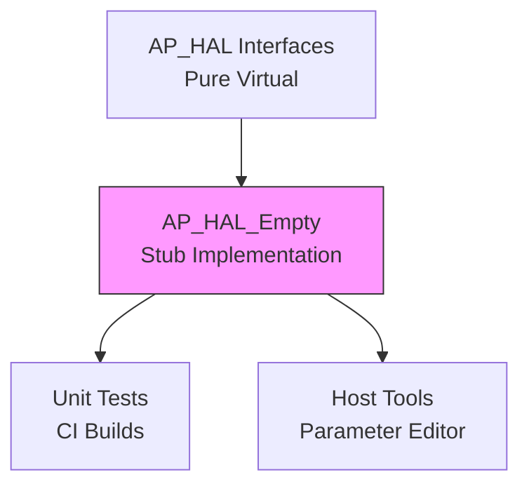

# AP_HAL_Empty - Hardware Abstraction Layer Template

Template/stub HAL implementation demonstrating minimal interface compliance for porting ArduPilot to new platforms. Provides compile-time substitutes enabling hardwareless builds (CI, unit tests, host tools).

## Architecture Overview

AP_HAL_Empty implements complete HAL interface surface with intentionally minimal, deterministic, largely no-op implementations. Used for:
- **Porting template**: Starting point for new platform HAL implementations
- **CI/testing**: Enables building without platform-specific dependencies
- **Documentation**: Reference showing required interface methods
- **Host builds**: Tools and utilities that don't need actual hardware

Key characteristics:
- All virtual methods implemented (compiles/links without errors)
- Minimal dependencies (only AP_HAL headers)
- Deterministic behavior (returns fixed sentinel values)
- No actual hardware interaction
- Thread-unsafe by design (single-threaded host use)



## Stub Pattern Implementation

Each HAL interface implemented with minimal logic:

### Pattern 1: No-Op Methods
Methods that would perform hardware I/O simply return immediately:
```cpp
class Empty::GPIO : public AP_HAL::GPIO {
public:
    void init() override {}  // No initialization needed
    void pinMode(uint8_t pin, uint8_t output) override {}  // No-op
    void write(uint8_t pin, uint8_t value) override {}  // No-op
};
```

**Source**: libraries/AP_HAL_Empty/GPIO.h

### Pattern 2: Deterministic Return Values
Methods returning data provide fixed sentinel values for predictable testing:
```cpp
class Empty::AnalogSource : public AP_HAL::AnalogSource {
    float _v;  // Fixed value: 1.11
public:
    AnalogSource(float v) : _v(v) {}
    float read_average() override { return _v; }  // Returns 1.11
    float voltage_average() override { 
        return 5.0f * _v / 1024.0f;  // Deterministic scaling
    }
};
```

Constants chosen for easy debugging (1.11, 5.0, 1024.0).

**Source**: libraries/AP_HAL_Empty/AnalogIn.cpp:5-27

### Pattern 3: Minimal State Storage
Some classes maintain minimal state for read-back consistency:
```cpp
class Empty::RCOutput : public AP_HAL::RCOutput {
    uint16_t _value[16];  // In-memory buffer
public:
    void write(uint8_t ch, uint16_t period_us) override {
        if (ch < 16) _value[ch] = period_us;  // Store
    }
    uint16_t read(uint8_t ch) override {
        return (ch < 16) ? _value[ch] : 900;  // Read back
    }
};
```

**Source**: libraries/AP_HAL_Empty/RCOutput.cpp:21-34

### Pattern 4: Trivial Synchronization
Semaphores use simple boolean flag (no actual blocking):
```cpp
class Empty::Semaphore : public AP_HAL::Semaphore {
    bool _taken;
public:
    bool give() override { _taken = false; return true; }
    bool take(uint32_t timeout_ms) override { 
        _taken = true; 
        return true;  // Always succeeds immediately
    }
};
```

**Source**: libraries/AP_HAL_Empty/Semaphores.cpp

⚠️ **Warning**: Not thread-safe - unsuitable for multi-threaded use.

## Porting Checklist

Use AP_HAL_Empty as template when porting ArduPilot to new platforms:

### Phase 1: Setup and Planning

- [ ] **Study Target Platform**
  - MCU architecture (ARM Cortex-M4/M7, RISC-V, x86, etc.)
  - Available peripherals (UART, SPI, I2C, GPIO, timers, DMA)
  - RTOS requirements (ChibiOS, FreeRTOS, bare metal, Linux)
  - Memory constraints (Flash, RAM, cache)
  - Development toolchain (gcc, clang, vendor tools)

- [ ] **Review Existing HAL Implementations**
  - AP_HAL_ChibiOS: Comprehensive ARM Cortex-M reference
  - AP_HAL_Linux: Linux-based flight controllers
  - AP_HAL_SITL: Desktop simulation example
  - AP_HAL_ESP32: Resource-constrained embedded platform

- [ ] **Define Board Configuration**
  - Pin assignments for peripherals
  - Clock frequencies and timing requirements
  - DMA channel allocations
  - Interrupt priorities
  - Memory layout (code, data, heap, stack)

### Phase 2: Directory Structure

- [ ] **Create Platform Directory**: `libraries/AP_HAL_NewPlatform/`
- [ ] **Copy Template Files** from AP_HAL_Empty:
  ```
  AP_HAL_NewPlatform.h           # Public umbrella header
  AP_HAL_NewPlatform_Namespace.h # Forward declarations
  AP_HAL_NewPlatform_Private.h   # Internal umbrella
  HAL_NewPlatform_Class.h/cpp    # Main HAL class implementation
  ```
- [ ] **Create Interface Implementation Files**:
  ```
  UARTDriver.h/cpp      # Serial ports
  GPIO.h/cpp            # Digital I/O
  SPIDevice.h/cpp       # SPI bus
  I2CDevice.h/cpp       # I2C bus
  Storage.h/cpp         # Parameter persistence
  Scheduler.h/cpp       # Task scheduling
  Semaphores.h/cpp      # Synchronization
  RCInput.h/cpp         # RC receiver
  RCOutput.h/cpp        # Motor/servo PWM
  AnalogIn.h/cpp        # ADC
  Util.h/cpp            # Utilities
  ```

### Phase 3: Required Methods Implementation

For each HAL interface, implement all pure virtual methods. Use AP_HAL_Empty as reference for method signatures:

#### Critical Interfaces (Implement First)

1. **Scheduler** - Task timing and delays
   - `delay()`, `delay_microseconds()` - Blocking delays
   - `millis()`, `micros()` - Time since boot
   - `register_timer_process()` - High-priority callbacks
   - `register_io_process()` - Background I/O threads

2. **UARTDriver** - Serial communication
   - `begin()` - Initialize UART with baud rate
   - `write()`, `read()` - Buffered I/O
   - `available()`, `txspace()` - Buffer status
   - Implement ring buffers for TX/RX

3. **GPIO** - Digital I/O
   - `pinMode()`, `read()`, `write()` - Basic pin operations
   - Interrupt support for PWM input (optional initially)

4. **Storage** - Parameter persistence
   - `read_block()`, `write_block()` - Block access
   - Implement in flash, FRAM, or EEPROM
   - Wear leveling recommended for flash

5. **Semaphore** - Thread synchronization
   - `take()`, `give()` - Mutex operations
   - Must be thread-safe and support priority inheritance
   - Consider using RTOS primitives

#### Secondary Interfaces (Implement as Needed)

6. **SPIDevice / I2CDevice** - Bus protocols
   - `transfer()` - Data exchange
   - `get_semaphore()` - Bus locking
   - DMA support for performance

7. **RCOutput** - Motor control
   - PWM timer configuration
   - DShot protocol support (optional advanced feature)

8. **AnalogIn** - Voltage monitoring
   - ADC configuration and sampling
   - Averaging and calibration

### Phase 4: Platform-Specific Considerations

#### Memory Management
```cpp
// Implement Util::malloc_type() for memory regions
void* Util::malloc_type(size_t size, AP_HAL::Util::Memory_Type mem_type) {
    switch (mem_type) {
        case Memory_Type::MEM_FAST:
            // Allocate from fast CCM/TCM if available
            return ccm_malloc(size);
        case Memory_Type::MEM_DMA_SAFE:
            // Allocate from DMA-accessible RAM
            return dma_malloc(size);
        default:
            return malloc(size);
    }
}
```

#### Initialization Sequence
```cpp
void HAL_NewPlatform::run(int argc, char* const* argv, Callbacks* callbacks) const {
    // 1. Early hardware init (clocks, watchdog)
    platform_early_init();
    
    // 2. Initialize core peripherals
    scheduler->init();
    uartDriver->begin(115200);
    storage->init();
    
    // 3. Set system initialized flag
    scheduler->set_system_initialized();
    
    // 4. Call firmware setup
    callbacks->setup();
    
    // 5. Enter main loop
    for (;;) {
        callbacks->loop();
        scheduler->delay_microseconds(100);  // Or yield to RTOS
    }
}
```

**Source**: libraries/AP_HAL_Empty/HAL_Empty_Class.cpp:53-68

#### Interrupt Handling
- Register interrupt handlers during init
- Keep ISRs short, defer work to scheduler tasks
- Use binary semaphores to signal data ready
- Disable interrupts during critical sections:
```cpp
void critical_section() {
    scheduler->interrupt_disable();
    // Critical code
    scheduler->interrupt_enable();
}
```

### Phase 5: Build System Integration

- [ ] **Add Board Definition** to `AP_HAL/AP_HAL_Boards.h`:
  ```cpp
  #define HAL_BOARD_NEWPLATFORM 10  // Choose unused number
  
  #if CONFIG_HAL_BOARD == HAL_BOARD_NEWPLATFORM
  #include <AP_HAL_NewPlatform/AP_HAL_NewPlatform.h>
  #define HAL_BOARD_NAME "NewPlatform"
  // Define capabilities: HAL_WITH_DSP, HAL_NUM_CAN_IFACES, etc.
  #endif
  ```

- [ ] **Add Build Target** to `wscript`:
  ```python
  def configure(cfg):
      cfg.env.BOARD = 'newplatform'
      cfg.env.TOOLCHAIN = 'arm-none-eabi'  # Or appropriate toolchain
      
  def build(bld):
      bld.ap_stlib(
          name='AP_HAL_NewPlatform',
          ap_vehicle='AP_HAL_NewPlatform',
          ap_libraries=[...],
      )
  ```

- [ ] **Test Build**:
  ```bash
  ./waf configure --board=newplatform
  ./waf copter
  ```

### Phase 6: Testing Strategy

#### Unit Testing
- Start with simple test: blink LED via GPIO
- Verify timing: measure actual delay() duration
- Test UART loopback (TX connected to RX)
- Validate storage read/write persistence across reboots

#### Integration Testing
- Build minimal vehicle firmware (ArduCopter recommended)
- Test with hardware safety switches disabled
- Monitor serial console output
- Verify parameter storage and loading
- Test sensor initialization (even if no actual sensors)

#### SITL Comparison
- Compare behavior against AP_HAL_SITL
- Use same test sequences
- Validate timing consistency

#### Stress Testing
- Long-duration stability test
- Memory leak detection (monitor available_memory())
- High-frequency sensor polling
- Maximum UART throughput

## Testing New HAL Implementations

### Minimal Test Application

Create a simple test to validate basic HAL functionality:

```cpp
// test_hal.cpp
#include <AP_HAL/AP_HAL.h>

class TestCallbacks : public AP_HAL::HAL::Callbacks {
public:
    void setup() override {
        hal.console->printf("HAL Test Starting\n");
        
        // Test GPIO
        hal.gpio->pinMode(LED_PIN, HAL_GPIO_OUTPUT);
        
        // Test timing
        uint32_t start = AP_HAL::millis();
        hal.scheduler->delay(1000);
        uint32_t elapsed = AP_HAL::millis() - start;
        hal.console->printf("Delay test: %u ms\n", (unsigned)elapsed);
        
        // Test storage
        uint8_t test_data[16] = {1,2,3,4,5,6,7,8,9,10,11,12,13,14,15,16};
        hal.storage->write_block(0, test_data, 16);
        
        uint8_t read_data[16];
        hal.storage->read_block(read_data, 0, 16);
        
        bool storage_ok = (memcmp(test_data, read_data, 16) == 0);
        hal.console->printf("Storage test: %s\n", storage_ok ? "PASS" : "FAIL");
    }
    
    void loop() override {
        // Blink LED
        static bool led_state = false;
        hal.gpio->write(LED_PIN, led_state);
        led_state = !led_state;
        
        hal.scheduler->delay(500);
        hal.console->printf(".");
    }
};

TestCallbacks test_callbacks;
AP_HAL_MAIN_CALLBACKS(&test_callbacks);
```

### Compliance Test Suite

ArduPilot includes HAL compliance tests in `libraries/AP_HAL/tests/`. Run these to validate interface correctness.

## Platform-Specific Implementation Notes

### Timing Precision Requirements

- `micros()`: ±10µs accuracy required for flight control
- `millis()`: ±1ms accuracy sufficient
- Recommend using hardware timer with DWT cycle counter (ARM Cortex-M)
- Example 32-bit microsecond timer wraps every 71.6 minutes - handle wrap:
```cpp
uint32_t delta_time(uint32_t start_us, uint32_t end_us) {
    return end_us - start_us;  // Unsigned arithmetic handles wrap correctly
}
```

### UART Buffer Sizing

- Minimum: 128 bytes TX/RX per port
- Recommended: 512-1024 bytes for MAVLink/GPS ports
- Use DMA for background transfers to reduce CPU load

### Storage Wear Leveling

Flash memory has limited erase cycles (10K-100K). Implement wear leveling:
- Rotate storage regions
- Write-through cache: immediate RAM update, deferred flash write
- Batch multiple parameter changes into single write cycle

### Thread Safety

If using RTOS:
- All HAL operations must be thread-safe
- Use mutexes for shared resources (buses, buffers)
- Consider interrupt priority for real-time guarantees
- Scheduler must support priority inheritance to prevent priority inversion

### DMA Configuration

For high-performance SPI/UART:
- Configure DMA streams/channels during init
- Use double-buffering for continuous sensor reads
- Handle DMA completion via interrupts, signal semaphore
- Ensure buffers in DMA-accessible memory (not CCM on STM32)

## Common Porting Pitfalls

### ❌ Incorrect Include Order
**Problem**: Circular dependencies or missing symbols
**Solution**: Follow include pattern from AP_HAL_Empty:
```cpp
#include <AP_HAL/AP_HAL.h>  // Always include AP_HAL.h first
#include "AP_HAL_NewPlatform.h"  // Then platform header
```

### ❌ Forgetting Semaphore Locking
**Problem**: Bus conflicts, corrupted sensor data
**Solution**: Always use WITH_SEMAPHORE macro:
```cpp
bool transfer() {
    WITH_SEMAPHORE(_spi_sem);  // Auto-unlock on scope exit
    // SPI operations
}
```

### ❌ Blocking in ISR Context
**Problem**: System hangs, timing corruption
**Solution**: Keep ISRs minimal, defer to scheduler:
```cpp
void uart_irq_handler() {
    // Minimal: Read data, store in buffer
    rx_buffer[rx_head++] = UART->DR;
    // Notify background thread via semaphore
    rx_sem.signal_event();
}
```

### ❌ Incorrect Memory Regions
**Problem**: DMA failures, hard faults
**Solution**: Verify memory type requirements:
```cpp
// DMA buffer must be in DMA-accessible RAM
uint8_t *dma_buffer = (uint8_t*)hal.util->malloc_type(512, Memory_Type::MEM_DMA_SAFE);
```

### ❌ Missing Virtual Override
**Problem**: Pure virtual call crash at runtime
**Solution**: Implement ALL pure virtual methods from base class, even if no-op:
```cpp
class NewPlatform::Util : public AP_HAL::Util {
public:
    // Must implement, even if returns 0
    uint32_t available_memory() override { return 0; }
};
```

## Maintenance and Debugging

### Debug Output
Use hal.console for debug messages:
```cpp
hal.console->printf("Debug: sensor init failed: %d\n", error_code);
```

### Watchdog Integration
Implement software watchdog in Util class:
```cpp
void Util::set_watchdog_armed(bool armed) {
    if (armed) {
        watchdog_enable(5000);  // 5 second timeout
    } else {
        watchdog_disable();
    }
}
```
Feed watchdog in main loop to detect hangs.

### Performance Profiling
Monitor timing budget consumption:
```cpp
uint32_t start = AP_HAL::micros();
// Task execution
uint32_t elapsed = AP_HAL::micros() - start;
if (elapsed > TASK_BUDGET_US) {
    hal.console->printf("WARN: Task overrun: %u us\n", (unsigned)elapsed);
}
```

## References to Complete HAL Implementations

### AP_HAL_ChibiOS (Recommended Reference)
**Location**: `libraries/AP_HAL_ChibiOS/`
**Description**: Most comprehensive and actively maintained HAL implementation
**Features**:
- Supports 150+ ARM Cortex-M based boards
- ChibiOS RTOS integration
- Full DMA support for SPI/UART
- DShot/OneShot ESC protocols
- CAN bus (DroneCAN/UAVCAN)
- Hardware DSP/FFT

**Key files to study**:
- `HAL_ChibiOS_Class.cpp`: Initialization sequence
- `UARTDriver.cpp`: DMA-based serial with ring buffers
- `SPIDevice.cpp`: DMA SPI with semaphore locking
- `Scheduler.cpp`: Task scheduling and timing
- `hwdef/*/hwdef.dat`: Board configuration system

**Strengths**: Production-quality, feature-complete, well-tested
**Use when**: Porting to ARM Cortex-M MCU with RTOS

### AP_HAL_Linux
**Location**: `libraries/AP_HAL_Linux/`
**Description**: Linux-based flight controller support
**Features**:
- Uses Linux kernel drivers (spidev, i2c-dev, /dev/ttyX)
- Multi-threading with pthreads
- File-based storage
- Supports Navio, BeagleBone Blue, Raspberry Pi

**Key files to study**:
- `Scheduler.cpp`: pthread-based task scheduling
- `SPIDevice.cpp`: Linux spidev interface
- `Storage.cpp`: File-based parameter storage

**Strengths**: Leverages OS services, simpler than bare-metal
**Use when**: Porting to Linux-based SBC or custom Linux hardware

### AP_HAL_SITL
**Location**: `libraries/AP_HAL_SITL/`
**Description**: Software-In-The-Loop simulation
**Features**:
- Desktop simulation (Linux/macOS/Windows)
- Simulated sensors with noise injection
- UDP networking for GCS/simulator communication
- File-based storage in user directory

**Key files to study**:
- `HAL_SITL_Class.cpp`: Simulation main loop
- `Scheduler.cpp`: Desktop timing (usleep-based)
- `SITL_State.cpp`: Sensor simulation

**Strengths**: Debugging-friendly, detailed simulation
**Use when**: Understanding HAL concepts without hardware

### AP_HAL_ESP32
**Location**: `libraries/AP_HAL_ESP32/`
**Description**: ESP32 platform support
**Features**:
- ESP-IDF integration
- WiFi connectivity
- FreeRTOS task scheduling
- Resource-constrained optimizations

**Key files to study**:
- `HAL_ESP32_Class.cpp`: ESP-IDF initialization
- `Scheduler.cpp`: FreeRTOS task management
- `WiFiDriver.cpp`: Network UART over WiFi

**Strengths**: Low-cost, WiFi-enabled, good for IoT applications
**Use when**: Porting to resource-constrained embedded Linux or RTOS

## Summary

AP_HAL_Empty serves as:
1. **Porting template**: Copy structure, replace stubs with real implementations
2. **Reference documentation**: Shows all required interface methods
3. **Testing tool**: Enables hardwareless builds for CI and host tools

**Next steps for porters**:
1. Study this README and AP_HAL_Empty source code
2. Review appropriate complete HAL implementation (ChibiOS for embedded, Linux for SBC)
3. Follow porting checklist systematically
4. Start with minimal functionality (UART console, timing, GPIO LED blink)
5. Incrementally add capabilities
6. Test thoroughly before flight

**Getting help**:
- ArduPilot Discord: #hardware-development channel
- Discuss forum: https://discuss.ardupilot.org/c/development-team/hal-development
- GitHub issues: For specific porting questions

---

*For architecture details, see libraries/AP_HAL/README.md*
*For interface documentation, see generated Doxygen docs*
