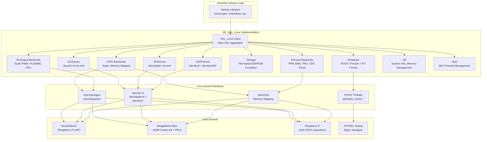
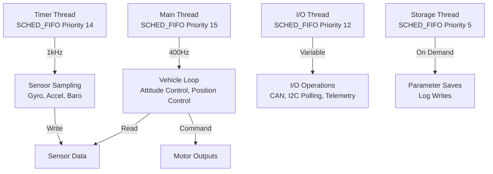
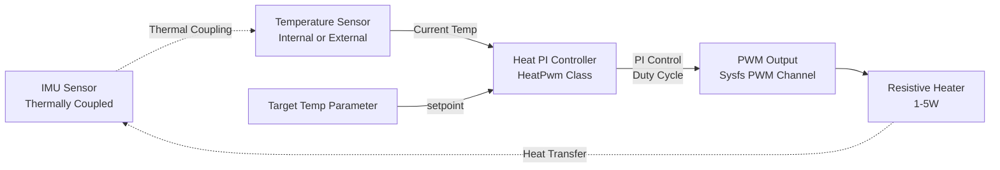
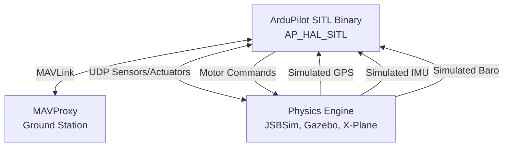

# AP_HAL_Linux - Linux Hardware Abstraction Layer Implementation

## Overview

AP_HAL_Linux provides the Linux implementation of the ArduPilot Hardware Abstraction Layer, enabling ArduPilot to run on Linux-based flight controllers and single-board computers. This HAL implementation leverages Linux kernel interfaces (sysfs, /dev files, POSIX APIs) to access hardware peripherals, avoiding the need for custom kernel modules while maintaining portability across different Linux-based boards.

## Architecture

### Design Philosophy

The Linux HAL bridges ArduPilot's hardware-independent code with Linux userspace APIs:

- **Kernel Interface Abstraction**: Uses standard Linux APIs (sysfs GPIO, i2c-dev, spidev, POSIX threads)
- **Portability**: Works on any Linux system with appropriate kernel modules enabled
- **Real-Time Capabilities**: Leverages SCHED_FIFO scheduling and memory locking for deterministic performance
- **Minimal Dependencies**: Requires only standard Linux kernel interfaces and POSIX libraries
- **Board-Specific Customization**: Per-board files handle pin mapping and hardware quirks

### Linux HAL Architecture Diagram



### Key Components

#### HAL_Linux_Class (HAL_Linux_Class.h/cpp)
Main HAL aggregator that instantiates and manages all Linux-specific drivers. Implements signal handlers for clean shutdown on SIGTERM/SIGINT.

#### Scheduler (Scheduler.h/cpp, Thread.h/cpp)
- **POSIX Threads**: Uses pthreads for parallel execution
- **Real-Time Scheduling**: SCHED_FIFO policy with priorities for time-critical tasks
- **CPU Affinity**: Pins threads to specific cores when advantageous
- **Timer Callbacks**: High-resolution timers via timerfd or POSIX timers
- **I/O Threads**: Separate threads for sensor polling, CAN, logging

#### GPIO Implementations (GPIO*.h/cpp)
Multiple GPIO backend strategies:
- **GPIO_Sysfs**: Standard sysfs interface (/sys/class/gpio/) - portable but slower
- **GPIO_RPI_BCM/RP1**: Direct memory-mapped GPIO for Raspberry Pi (fast, board-specific)
- **GPIO_BBB**: BeagleBone Black memory-mapped GPIO
- **GPIO_Navio/Navio2**: Navio-specific pin mappings
- **GPIO_Navigator/PilotPi**: Custom board mappings

#### Bus Drivers

##### I2CDevice (I2CDevice.h/cpp)
- Interface: Linux i2c-dev kernel module (/dev/i2c-N)
- Operations: ioctl(I2C_RDWR) for combined transactions
- Features: Periodic polling via PollerThread, checked register integrity
- Typical devices: IMUs, magnetometers, barometers, external I2C peripherals

##### SPIDevice (SPIDevice.h/cpp)
- Interface: Linux spidev kernel module (/dev/spidevX.Y)
- Operations: ioctl(SPI_IOC_MESSAGE) for full-duplex transfers
- Features: Per-device speed/mode configuration, chip select management
- Board descriptors: SPIDesc tables define device→bus→CS mapping
- Typical devices: High-speed IMUs, barometers, external flash memory

##### UARTDriver (UARTDriver.h/cpp)
- Interface: Standard Linux serial devices (/dev/ttyS*, /dev/ttyUSB*, /dev/ttyAMA*)
- Configuration: termios for baud rate, flow control, blocking behavior
- Buffering: Ring buffers for TX/RX to handle latency
- Typical uses: Telemetry, GPS, companion computers, peripheral serial devices

#### RC Input/Output

##### RCInput Backends (RCInput*.h/cpp)
- **RCInput_RPI**: Raspberry Pi DMA-based PPM decode
- **RCInput_PRU/AioPRU**: BeagleBone PRU-based RC input
- **RCInput_UDP**: SITL-style UDP RC input
- **RCInput_RCProtocol**: Serial protocol decode (SBUS, DSM, CRSF)
- **RCInput_Multi**: Aggregates multiple input sources

##### RCOutput Backends (RCOutput*.h/cpp)
- **RCOutput_Sysfs**: Sysfs PWM interface (/sys/class/pwm/)
- **RCOutput_PCA9685**: I2C PWM controller (common on many boards)
- **RCOutput_PRU**: BeagleBone PRU high-speed PWM
- **RCOutput_Bebop**: Parrot Bebop I2C BLDC motor control
- **RCOutput_AeroIO**: Intel Aero I/O board SPI interface

#### Storage (Storage.h/cpp)
- Implementation: File-based parameter storage
- Location: Configurable (typically /var/APM/eeprom.bin)
- Features: Dirty-block tracking for efficient writes, atomic file updates
- Size: Fixed at compile time (default 4KB-16KB depending on vehicle)

#### Peripheral Drivers

##### Heat Management (Heat.h, Heat_Pwm.h/cpp)
- **Purpose**: IMU thermal stability for precision navigation
- **Implementation**: PI controller with sysfs PWM heater output
- **Configuration**: Tunable Kp/Ki gains, target temperature parameter
- **Use Case**: Indoor navigation, surveying where IMU bias stability critical

##### Analog Input (AnalogIn*.h/cpp)
- **AnalogIn_IIO**: Industrial I/O subsystem interface
- **AnalogIn_ADS1115**: I2C ADC for boards without built-in ADC
- **AnalogIn_Navio2**: Navio2-specific ADC access

##### Video/Camera (VideoIn.h/cpp, CameraSensor*.h/cpp)
- **VideoIn**: V4L2 (Video4Linux2) camera capture
- **OpticalFlow_Onboard**: Optical flow processing from onboard camera
- **CameraSensor_Mt9v117**: MT9V117 camera sensor driver with binary patches

##### CAN (CANSocketIface.h/cpp)
- **Implementation**: SocketCAN Linux interface
- **Features**: Standard and extended CAN frames, filtering, timestamps
- **Use Case**: DroneCAN/UAVCAN peripherals, ESC telemetry

#### Synchronization Primitives

##### Thread (Thread.h/cpp)
- **pthread_t** wrappers with real-time scheduling support
- **set_realtime_priority()**: Applies SCHED_FIFO policy
- **Stack size configuration**: Platform-specific defaults with overrides

##### Semaphores (Semaphores.h/cpp)
- **pthread_mutex_t** + **pthread_cond_t** for locking
- **Recursive mutexes**: Support nested locking from same thread
- **Timeout support**: Bounded waiting to prevent deadlocks

##### Poller/PollerThread (Poller.h/cpp, PollerThread.h/cpp)
- **epoll-based** event multiplexing for scalable I/O
- **timerfd integration** for periodic device polling
- **Shared polling threads** reduce thread count for many devices

## Supported Boards

### Navio and Navio2 (Raspberry Pi HAT)

**Hardware**: Raspberry Pi add-on board with sensors and I/O
- **CPU**: Raspberry Pi 3/4 (ARM Cortex-A53/A72)
- **Sensors**: MPU9250 IMU, MS5611 barometer, U-Blox GPS
- **I/O**: 14 PWM outputs via PCA9685, PPM/SBUS input
- **Peripherals**: RGB LED (PCA9685), ADC for power monitoring

**Pin Mapping**: `GPIO_Navio.cpp`, `GPIO_Navio2.cpp`
**RC Input**: `RCInput_RPI.cpp` (DMA-based PPM/PCM decode)
**RC Output**: `RCOutput_PCA9685.cpp` (I2C PWM chip)
**Build Target**: `./waf configure --board=navio2` or `--board=navio`

**Key Features**:
- Memory-mapped GPIO for fast digital I/O (GPIO_RPI_BCM.cpp on older Pi, GPIO_RPI_RP1.cpp on Pi 5)
- Hardware PWM via Raspberry Pi PWM peripheral
- Requires raspbian/raspberry-pi-os with specific kernel modules enabled

### BeagleBone Blue

**Hardware**: BeagleBoard.org educational robotics controller
- **CPU**: AM3358 ARM Cortex-A8 + 2× PRU (Programmable Real-time Units)
- **Sensors**: MPU9250 IMU, BMP280 barometer
- **I/O**: 8 motor outputs, 4 servo outputs, DSM RC input
- **Peripherals**: 4 DC motor drivers, 4 ADC channels, WiFi/Bluetooth

**Pin Mapping**: `GPIO_BBB.cpp`
**RC Input**: `RCInput_PRU.cpp` or `RCInput_AioPRU.cpp` (PRU-based decode)
**RC Output**: `RCOutput_PRU.cpp` or `RCOutput_AioPRU.cpp` (PRU-generated PWM)
**Build Target**: `./waf configure --board=blue`

**Key Features**:
- **PRU (Programmable Real-time Unit)**: Dedicated 200MHz microcontrollers for deterministic I/O
- PRU handles PPM/PWM decoding and generation with sub-microsecond precision
- Memory-mapped GPIO via /dev/mem for fast access

### Raspberry Pi (Standalone with Accessories)

**Hardware**: Raspberry Pi with GPIO expanders and external sensors
- **CPU**: Raspberry Pi 2/3/4/5 (ARMv7/ARMv8)
- **Sensors**: External via I2C/SPI (IMU, barometer, compass)
- **I/O**: GPIO pins for basic digital I/O, external PWM controllers

**Pin Mapping**: `GPIO_RPI.cpp`, `GPIO_RPI_BCM.cpp` (older Pi), `GPIO_RPI_RP1.cpp` (Pi 5)
**RC Input**: `RCInput_RPI.cpp` (DMA PPM) or `RCInput_RCProtocol.cpp` (serial protocols)
**RC Output**: `RCOutput_Sysfs.cpp` (sysfs PWM) or `RCOutput_PCA9685.cpp` (I2C PWM)
**Build Target**: `./waf configure --board=pxfmini` or `--board=raspilot`

**Key Features**:
- **DMA-based PPM**: Uses Pi's DMA controller for precise pulse measurement
- **Memory-mapped GPIO**: Direct register access for fast digital I/O (BCM GPIO on Pi 1-4, RP1 on Pi 5)
- **Hardware PWM**: Limited hardware PWM channels (typically 2), sysfs or PCA9685 for more channels

### PXFMini (Erle Robotics)

**Hardware**: Raspberry Pi shield with sensors and I/O
- **CPU**: Raspberry Pi 2/3
- **Sensors**: MPU9250 IMU, MS5611 barometer
- **I/O**: PCA9685 PWM controller

**Build Target**: `./waf configure --board=pxfmini`

### Intel Aero

**Hardware**: Intel Aero Compute Board (discontinued but supported)
- **CPU**: Intel Atom x7-Z8750 (quad-core x86)
- **Sensors**: BMI160 IMU, integrated GPS
- **I/O**: Custom FPGA-based I/O board (AeroIO)

**Pin Mapping**: `GPIO_Aero.cpp`
**RC Output**: `RCOutput_AeroIO.cpp` (SPI to FPGA I/O board)
**Build Target**: `./waf configure --board=aero`

### Parrot Bebop/Disco

**Hardware**: Parrot consumer drones (Bebop 1/2, Disco fixed-wing)
- **CPU**: Parrot P7 dual-core ARM Cortex-A9
- **Sensors**: MPU6050 IMU, MS5607 barometer, AKM8963 magnetometer
- **I/O**: Custom I2C BLDC motor controllers

**Pin Mapping**: `GPIO_Bebop.cpp`, `GPIO_Disco.cpp`
**RC Output**: `RCOutput_Bebop.cpp` (I2C motor control), `RCOutput_Disco.cpp` (wrapper)
**Build Target**: `./waf configure --board=bebop` or `--board=disco`

**Key Features**:
- **I2C BLDC control**: Direct I2C communication with Parrot's brushless motor controllers
- **Integrated camera**: MT9V117 camera sensor driver (CameraSensor_Mt9v117.cpp)

### Blue Robotics Navigator

**Hardware**: Blue Robotics Navigator flight controller for ROVs/AUVs
- **CPU**: Raspberry Pi Compute Module 4
- **Sensors**: ICM20602/ICM20689 IMU, MS5837 barometer/depth sensor
- **I/O**: PCA9685 PWM controller, GPIO expanders

**Pin Mapping**: `GPIO_Navigator.cpp`
**Build Target**: `./waf configure --board=navigator`

### Edge (emlid Edge)

**Hardware**: Emlid Edge autopilot
- **CPU**: Intel Edison (dual-core Atom)
- **Sensors**: MPU9250 IMU, MS5611 barometer

**Pin Mapping**: `GPIO_Edge.cpp`
**Build Target**: `./waf configure --board=edge`

### PilotPi

**Hardware**: Generic Raspberry Pi-based autopilot
- **CPU**: Raspberry Pi 4
- **Sensors**: External sensors via I2C/SPI

**Pin Mapping**: `GPIO_PilotPi.cpp`
**Build Target**: `./waf configure --board=pilotpi`

## Linux Kernel Interfaces and Dependencies

### Required Kernel Modules

The Linux HAL requires specific kernel modules and kernel configuration:

#### GPIO Support
- **CONFIG_GPIO_SYSFS**: Sysfs GPIO interface (/sys/class/gpio/)
- **CONFIG_GPIO_BCM2835**: Raspberry Pi GPIO driver (for BCM-based Pi boards)
- **CONFIG_GPIO_GENERIC**: Generic memory-mapped GPIO
- Module: `gpio_generic.ko` (usually built-in)

#### I2C Support
- **CONFIG_I2C_CHARDEV**: I2C character device support
- **CONFIG_I2C_BCM2835**: Raspberry Pi I2C driver
- **CONFIG_I2C_OMAP**: BeagleBone I2C driver
- Module: `i2c-dev.ko`
- Device files: `/dev/i2c-0`, `/dev/i2c-1`, etc.

#### SPI Support
- **CONFIG_SPI_SPIDEV**: SPI character device support
- **CONFIG_SPI_BCM2835**: Raspberry Pi SPI driver
- **CONFIG_SPI_OMAP2_MCSPI**: BeagleBone SPI driver
- Module: `spidev.ko`
- Device files: `/dev/spidev0.0`, `/dev/spidev0.1`, etc.

#### PWM Support
- **CONFIG_PWM_SYSFS**: Sysfs PWM interface (/sys/class/pwm/)
- **CONFIG_PWM_BCM2835**: Raspberry Pi PWM
- **CONFIG_PWM_TIECAP/TIEHRPWM**: BeagleBone PWM
- Module: `pwm-bcm2835.ko` or `pwm-tiecap.ko`

#### CAN Support
- **CONFIG_CAN**: Controller Area Network support
- **CONFIG_CAN_RAW**: Raw CAN protocol (SocketCAN)
- Modules: `can.ko`, `can-raw.ko`, `vcan.ko` (virtual CAN for testing)
- Interface: SocketCAN (socket(AF_CAN, SOCK_RAW, CAN_RAW))

#### Video Support (for optical flow)
- **CONFIG_VIDEO_V4L2**: Video4Linux2 API
- **CONFIG_VIDEO_BCM2835**: Raspberry Pi camera
- Device files: `/dev/video0`, `/dev/video1`, etc.

#### Serial Support
- Always available (built-in kernel support)
- Devices: `/dev/ttyS*` (hardware serial), `/dev/ttyUSB*` (USB serial), `/dev/ttyAMA*` (ARM serial)

#### Real-Time Support (Optional but Recommended)
- **CONFIG_PREEMPT** or **CONFIG_PREEMPT_RT**: Preemptible kernel for better real-time performance
- **CONFIG_HIGH_RES_TIMERS**: High-resolution timer support
- **CONFIG_NO_HZ_FULL**: Tickless kernel for reduced latency on dedicated cores

### Sysfs Device Access Patterns

#### GPIO via Sysfs

Standard sysfs GPIO workflow implemented in GPIO_Sysfs.cpp:

```bash
# Export GPIO 23 for use
echo 23 > /sys/class/gpio/export

# Set direction to output
echo out > /sys/class/gpio/gpio23/direction

# Write value (1 = high)
echo 1 > /sys/class/gpio/gpio23/value

# Read value
cat /sys/class/gpio/gpio23/value

# Unexport when done
echo 23 > /sys/class/gpio/unexport
```

**Performance**: ~10-50μs per operation (kernel syscall overhead)
**Use case**: LEDs, relays, switches (not timing-critical)
**Alternative**: Memory-mapped GPIO (GPIO_RPI_BCM, GPIO_BBB) for microsecond-level performance

#### PWM via Sysfs

Sysfs PWM workflow implemented in PWM_Sysfs.cpp:

```bash
# Export PWM chip 0, channel 0
echo 0 > /sys/class/pwm/pwmchip0/export

# Set period (nanoseconds): 20ms = 50Hz
echo 20000000 > /sys/class/pwm/pwmchip0/pwm0/period

# Set duty cycle (nanoseconds): 1.5ms pulse
echo 1500000 > /sys/class/pwm/pwmchip0/pwm0/duty_cycle

# Enable PWM output
echo 1 > /sys/class/pwm/pwmchip0/pwm0/enable
```

**Performance**: Suitable for servo/motor control (not cycle-by-cycle timing)
**Resolution**: Typically 1μs or better depending on hardware PWM timer
**Alternatives**: PRU-based PWM (BeagleBone), PCA9685 I2C PWM chip

#### I2C via i2c-dev ioctl

I2C device access via ioctl (I2CDevice.cpp):

```cpp
// Open I2C bus
int fd = open("/dev/i2c-1", O_RDWR);

// Set slave address
ioctl(fd, I2C_SLAVE, device_address);

// Combined write-then-read transaction
struct i2c_msg msgs[2] = {
    { .addr = device_address, .flags = 0, .len = 1, .buf = &reg_addr },
    { .addr = device_address, .flags = I2C_M_RD, .len = length, .buf = data }
};
struct i2c_rdwr_ioctl_data msgset = { .msgs = msgs, .nmsgs = 2 };
ioctl(fd, I2C_RDWR, &msgset);
```

**Advantages**: Kernel handles clock stretching, arbitration, error recovery
**Performance**: ~100-400μs per transaction at 400kHz I2C
**Concurrent access**: Kernel serializes access from multiple processes

#### SPI via spidev ioctl

SPI device access via ioctl (SPIDevice.cpp):

```cpp
// Open SPI device
int fd = open("/dev/spidev0.0", O_RDWR);

// Configure SPI mode and speed
uint8_t mode = SPI_MODE_0;  // CPOL=0, CPHA=0
uint32_t speed = 1000000;   // 1 MHz
ioctl(fd, SPI_IOC_WR_MODE, &mode);
ioctl(fd, SPI_IOC_WR_MAX_SPEED_HZ, &speed);

// Full-duplex transfer
struct spi_ioc_transfer xfer = {
    .tx_buf = (unsigned long)tx_buffer,
    .rx_buf = (unsigned long)rx_buffer,
    .len = length,
    .speed_hz = speed,
    .bits_per_word = 8
};
ioctl(fd, SPI_IOC_MESSAGE(1), &xfer);
```

**Advantages**: Kernel manages chip select, handles DMA if available
**Performance**: ~10-50μs overhead + transfer time (fast for sensor reads)
**Concurrent access**: Kernel prevents bus conflicts with locking

### Memory-Mapped I/O (Alternative to Sysfs)

For performance-critical GPIO/PWM, some boards use direct memory mapping:

```cpp
// Open /dev/mem for physical memory access
int fd = open("/dev/mem", O_RDWR | O_SYNC);

// Map GPIO register region
volatile uint32_t *gpio_base = (uint32_t*)mmap(
    NULL, 4096, PROT_READ | PROT_WRITE, MAP_SHARED,
    fd, BCM2835_GPIO_BASE
);

// Direct register write (nanosecond latency)
*gpio_base |= (1 << pin_number);  // Set pin high
```

**Performance**: Sub-microsecond GPIO operations
**Boards**: Raspberry Pi (GPIO_RPI_BCM.cpp), BeagleBone (GPIO_BBB.cpp)
**Drawbacks**: Board-specific register addresses, requires root or capabilities

### /dev/mem vs Sysfs Trade-offs

| Aspect | Sysfs | /dev/mem Memory-Mapped |
|--------|-------|------------------------|
| Portability | High (works on any Linux board) | Low (board-specific addresses) |
| Performance | Moderate (10-50μs per operation) | Excellent (sub-μs) |
| Safety | Safe (kernel validates operations) | Dangerous (can crash system if wrong) |
| Permissions | Standard user with GPIO group | Root or CAP_SYS_RAWIO capability |
| Typical Use | LEDs, switches, relays | Fast PWM decode, timing-critical I/O |

## Scheduling on Linux

### Real-Time Scheduling Strategy

The Linux HAL uses POSIX real-time scheduling to minimize latency for flight-critical tasks:

#### Scheduling Policies (Scheduler.cpp, Thread.cpp)

```cpp
// Set thread to real-time scheduling
struct sched_param param;
param.sched_priority = priority;  // 1-99 (higher = more urgent)
pthread_setschedparam(thread, SCHED_FIFO, &param);
```

**SCHED_FIFO** (First-In-First-Out real-time scheduling):
- Thread runs until it voluntarily yields or higher-priority thread preempts
- Used for time-critical tasks: main control loop, sensor polling
- Requires root or CAP_SYS_NICE capability

**Typical ArduPilot Thread Priorities**:
- **Priority 15**: Main vehicle loop (400Hz copter, 50Hz plane)
- **Priority 14**: IMU sampling (1kHz-8kHz)
- **Priority 13**: Fast sensor polling (gyro, accel)
- **Priority 12**: I/O threads (CAN, logging)
- **Priority 1-10**: Background tasks (telemetry, GPS, parameter saves)

#### CPU Affinity

Pin threads to specific CPU cores to reduce cache misses and context switches:

```cpp
cpu_set_t cpuset;
CPU_ZERO(&cpuset);
CPU_SET(core_number, &cpuset);
pthread_setaffinity_np(thread, sizeof(cpuset), &cpuset);
```

**Strategy**:
- **Core 0**: Main loop and critical sensors (minimize migrations)
- **Core 1+**: Background I/O, telemetry, logging
- **Core isolation**: Use Linux kernel `isolcpus` boot parameter to reserve core for ArduPilot

**Example kernel command line**:
```
isolcpus=0 nohz_full=0 rcu_nocbs=0
```
Isolates CPU core 0 from Linux scheduler, reduces timer interrupts on that core.

#### Memory Locking (mlockall)

Prevent paging of real-time process memory to avoid unpredictable latency:

```cpp
// Lock all current and future pages in RAM
mlockall(MCL_CURRENT | MCL_FUTURE);
```

**Purpose**: Ensure page faults don't cause millisecond-scale delays during flight
**Requirement**: Sufficient RAM to hold entire process without swapping
**Typical memory usage**: 50-150MB for ArduPilot vehicle process

#### Scheduler Task Architecture



**Thread Types**:
1. **Main Thread**: Vehicle control loop, runs at configured loop rate
2. **Timer Threads**: High-frequency sensor sampling (IMU, baro)
3. **I/O Threads**: Device polling (I2C sensors, CAN), telemetry processing
4. **Storage Thread**: Parameter and log file writes (background)

#### Comparison with ChibiOS (Embedded RTOS)

| Aspect | ChibiOS (Embedded) | Linux HAL |
|--------|-------------------|-----------|
| Scheduling | Deterministic RTOS scheduler | Linux scheduler with RT patches |
| Latency | <1μs context switch | 10-100μs (depends on kernel config) |
| Jitter | <10μs (predictable) | 50-500μs (depends on system load) |
| Memory | Static allocation | Dynamic with mlockall |
| Suitable for | Precision flight control | Research, dev platforms, non-critical |

**Recommendation**: Linux HAL best for development, testing, and applications where ~100μs latency acceptable.

## Heat Scheduler Integration for Thermal Management

### IMU Temperature Stability

Gyroscope and accelerometer bias drift with temperature changes degrading navigation accuracy:
- **Gyro bias drift**: 0.01-0.1 °/s per °C (depending on sensor quality)
- **Accel bias drift**: 1-10 mg per °C
- **Impact**: Position error accumulates over time due to bias integration

**Solution**: Maintain IMU at stable elevated temperature (45-65°C) using resistive heater.

### Heat Scheduler Architecture



### Implementation (Heat_Pwm.cpp)

**PI Control Algorithm**:
```cpp
// Called at 10-100Hz from scheduler
void HeatPwm::set_imu_temp(float current) {
    float error = *_target - current;
    _sum_error += error * dt;  // Integral term
    
    float output = _Kp * error + _Ki * _sum_error;
    output = constrain(output, 0.0f, 100.0f);  // 0-100% duty cycle
    
    uint32_t duty_ns = (_period_ns * output) / 100;
    _pwm->set_duty_cycle(duty_ns);
}
```

**Tuning Guidelines**:
- **Kp** (Proportional gain): Start with 10-50, higher for faster response
- **Ki** (Integral gain): Start with 0.1-5.0, eliminates steady-state error
- **Target temperature**: 50-60°C typical (above maximum ambient, below sensor limit)
- **PWM frequency**: 1kHz typical (balances switching losses vs smoothness)

**Configuration Parameters**:
```
INS_HEATER_ENABLE    1          # Enable IMU heater
INS_HEATER_TARGET    50         # Target temperature (°C)
INS_HEATER_KP        50.0       # Proportional gain
INS_HEATER_KI        0.5        # Integral gain
```

**Hardware Requirements**:
- Resistive heater (film heater or power resistor) thermally coupled to IMU
- PWM channel (sysfs PWM or GPIO-based software PWM)
- Temperature sensor (IMU internal thermometer or external thermistor)
- Power budget: 1-5W continuous (consider battery impact)

**Performance**:
- **Settling time**: Typically 2-5 minutes from cold start to stable temperature
- **Stability**: ±0.5°C once settled (depends on PI tuning and thermal design)
- **Benefit**: 5-10× reduction in navigation drift for indoor/long-duration flights

## Memory Management

### mlock for Real-Time Pages

Prevent virtual memory paging to eliminate unbounded latency:

```cpp
// In Scheduler::init()
if (mlockall(MCL_CURRENT | MCL_FUTURE) != 0) {
    AP::logger().Write_Error(LogErrorSubsystem::CPU,
                              LogErrorCode::FAILED_TO_LOCK_MEMORY);
}
```

**MCL_CURRENT**: Lock all currently mapped pages
**MCL_FUTURE**: Lock pages mapped in the future (stack growth, dynamic allocation)

**Why mlock matters**:
- **Without mlock**: Page fault during flight can take 1-10ms (disk I/O)
- **With mlock**: All pages resident in RAM, no page faults
- **Critical for**: Real-time main loop, sensor polling

**Memory requirements**:
- Typical vehicle process: 50-150MB resident
- Ensure sufficient RAM available (2GB+ recommended for development)

### Memory Allocation Regions

Linux HAL uses standard malloc but can benefit from NUMA awareness on multi-socket systems:

```cpp
void* Util::malloc_type(size_t size, AP_HAL::Util::Memory_Type mem_type) {
    // Linux: All types use standard malloc
    // (no special memory regions like ChibiOS CCM/DTCM)
    return malloc(size);
}
```

**Note**: Unlike embedded HAL (ChibiOS), Linux doesn't have distinct memory regions (CCM, DTCM, DMA-safe). All memory is DMA-capable and uniformly accessible.

## Device Tree and Hardware Detection

### Device Tree Basics

Linux uses Device Tree to describe hardware topology to kernel:

```
/boot/config.txt (Raspberry Pi)
/boot/uEnv.txt (BeagleBone)
```

**Example Device Tree entries**:
```
# Enable I2C bus 1 on Raspberry Pi
dtparam=i2c_arm=on

# Enable hardware PWM
dtoverlay=pwm-2chan

# Enable SPI
dtparam=spi=on
```

**ArduPilot HAL doesn't parse Device Tree directly** - it relies on kernel drivers to expose devices via standard interfaces (/ dev/i2c-*, /dev/spidev*, /sys/class/gpio).

### Hardware Detection Strategy

**Board Identification** (Util.cpp):
```cpp
const char* Util::get_custom_log_directory() {
    // Detect board from /proc/device-tree/model or similar
    if (access("/sys/firmware/devicetree/base/model", R_OK) == 0) {
        // Read device-tree model string
        // Parse to identify Raspberry Pi vs BeagleBone vs other
    }
}
```

**Sensor Probing** (I2CDevice.cpp, SPIDevice.cpp):
- I2C sensors: Read WHO_AM_I register to detect sensor model
- SPI sensors: Similar WHO_AM_I read with chip select
- Auto-detection: HAL probes common I2C/SPI addresses during init

**Pin Mapping**: Board-specific GPIO tables map virtual pin numbers to kernel GPIO numbers:
```cpp
// In GPIO_Navio2.cpp
const unsigned GPIO_Sysfs::pin_table[] = {
    [NAVIO2_GPIO_LED]   = 27,  // Kernel GPIO 27 maps to LED
    [NAVIO2_GPIO_PWR]   = 17,  // etc.
    // ...
};
```

## Testing with Linux Boards and SITL

### Hardware Testing on Linux Boards

#### 1. Build for Target Board

```bash
./waf configure --board=navio2
./waf copter
```

Produces binary: `build/navio2/bin/arducopter`

#### 2. Deploy to Board

```bash
# Copy to board via SCP
scp build/navio2/bin/arducopter pi@navio2.local:/home/pi/

# SSH to board
ssh pi@navio2.local

# Run ArduPilot (requires root for real-time scheduling)
sudo ./arducopter -A udp:192.168.1.100:14550
```

**Command-line arguments**:
- `-A <connection>`: Telemetry connection (serial device, UDP, TCP)
- `-B <connection>`: Secondary telemetry
- `-C <connection>`: Tertiary telemetry
- `--daemon`: Run as background daemon
- `--log-directory <path>`: Custom log location

#### 3. Connect Ground Station

```bash
# On development PC, run MAVProxy
mavproxy.py --master=udp:0.0.0.0:14550 --console --map
```

#### 4. Verify Sensors

```
MAVProxy> status
# Check: GPS, IMU, Compass, Barometer health

MAVProxy> graph IMU.GyrX IMU.GyrY IMU.GyrZ
# Real-time gyro plot

MAVProxy> param show INS_*
# Check IMU parameters
```

#### 5. Safety Testing

**Ground tests** before flight:
1. **Sensor calibration**: Accel, compass, level
2. **RC input check**: Verify all channels respond
3. **Motor test**: `mot_1`, `mot_2`, etc. commands in MAVProxy
4. **Failsafe test**: Disconnect RC, verify RTL or Land
5. **Arming checks**: `arm throttle` - verify all pre-arm checks pass

**NEVER arm motors** with propellers attached during initial testing!

### SITL (Software-In-The-Loop) Testing on Linux

SITL simulates ArduPilot running on a Linux system but with simulated sensors/physics:

#### 1. Build SITL

```bash
./waf configure --board=sitl
./waf copter
```

#### 2. Run SITL Simulation

```bash
# Basic SITL with MAVProxy
sim_vehicle.py -v Copter --console --map

# SITL with JSBSim physics
sim_vehicle.py -v Plane --console --map --aircraft=Rascal

# SITL with Gazebo
sim_vehicle.py -v Copter --console --map -f gazebo-iris
```

#### 3. SITL Architecture



**SITL Features**:
- **Perfect sensors**: No noise (add with SIM_* parameters)
- **Replay logs**: `--model=jsbsim --speedup=10` for fast log replay
- **Parameter tuning**: Test parameter changes without hardware risk
- **Automated testing**: `Tools/autotest/autotest.py` runs full test suite

#### 4. SITL vs Real Hardware Differences

| Aspect | SITL | Real Linux Board |
|--------|------|------------------|
| Sensors | Simulated (perfect or with added noise) | Real hardware (noisy, biased) |
| Timing | Software timers (can speed up/slow down) | Real-time (fixed) |
| Physics | Simulated dynamics | Real vehicle dynamics |
| Safety | No crash risk | Crash risk with real hardware |
| Use Case | Development, algorithm testing, CI/CD | Final validation, tuning, flight |

#### 5. Common SITL Test Scenarios

```bash
# AUTO mission test
sim_vehicle.py -v Copter --console --map
# In MAVProxy:
wp load Tools/autotest/Generic_Missions/CMAC-circuit.txt
mode auto
arm throttle
# Watch mission execute

# Failsafe test
# Simulate RC loss:
param set SIM_RC_FAIL 1
# Verify RTL engages

# Wind test
param set SIM_WIND_SPD 10  # 10 m/s wind
param set SIM_WIND_DIR 45  # From NE
# Verify position hold compensates

# GPS glitch test
param set SIM_GPS_GLITCH_X 10  # 10m offset
# Verify EKF rejects glitch
```

### Performance Benchmarking

#### Latency Measurement

```bash
# Enable scheduler performance logging
param set SCHED_LOOP_RATE 400  # 400Hz main loop
param set LOG_BITMASK 131071   # Log everything

# Fly/drive, then analyze logs
# Download .bin log file

# Analyze with pymavlink
mavlogdump.py --type PM flight.bin | grep Sched
# Look at PM.NLon (main loop overruns) and PM.NLoop (loop rate)
```

**Target metrics**:
- **Main loop overruns**: <1% (PM.NLon / PM.NLoop)
- **IMU sample rate**: Consistent with configured rate (e.g., 1000Hz)
- **Loop jitter**: <100μs standard deviation

#### CPU Usage

```bash
# On Linux board during flight
top -p $(pgrep arducopter)
# Note CPU% (should be <80% to have headroom)

# More detailed profiling
perf record -p $(pgrep arducopter) -g -- sleep 10
perf report
# Identifies hot code paths
```

### Troubleshooting Common Issues

#### Issue: GPIO Permission Denied

**Symptom**: `Failed to export GPIO: Permission denied`

**Solution**:
```bash
# Add user to gpio group
sudo usermod -a -G gpio $USER
sudo reboot

# Or run as root (not recommended for production)
sudo ./arducopter ...
```

#### Issue: I2C Device Not Found

**Symptom**: `Failed to get I2C device` or `IMU not found`

**Debug**:
```bash
# List I2C buses
ls /dev/i2c-*

# Scan I2C bus 1 for devices
i2cdetect -y 1
# Look for sensor addresses (e.g., 0x68 for MPU9250)

# Check kernel module loaded
lsmod | grep i2c_dev
# If not: sudo modprobe i2c-dev

# Check device tree enabled
# Raspberry Pi: /boot/config.txt should have dtparam=i2c_arm=on
```

#### Issue: SPI Transfer Failed

**Symptom**: `SPI transfer error` or bad sensor data

**Debug**:
```bash
# Check spidev devices exist
ls /dev/spidev*

# Verify SPI enabled in device tree
# Raspberry Pi: /boot/config.txt should have dtparam=spi=on

# Test SPI with spidev_test utility
spidev_test -D /dev/spidev0.0 -v
```

#### Issue: Poor Real-Time Performance

**Symptom**: High loop overruns, timing jitter

**Solutions**:
```bash
# 1. Disable unnecessary services
sudo systemctl disable bluetooth
sudo systemctl disable wifi
# etc.

# 2. Use real-time kernel (if available)
uname -a  # Check for -rt in kernel version

# 3. Add kernel boot parameters
# Edit /boot/cmdline.txt (RPi) or /boot/grub/grub.cfg
# Add: isolcpus=0 nohz_full=0 rcu_nocbs=0

# 4. Increase process priority
sudo chrt -f 99 ./arducopter ...

# 5. Check CPU governor
cat /sys/devices/system/cpu/cpu0/cpufreq/scaling_governor
# Should be "performance", not "powersave"
sudo cpufreq-set -g performance
```

## Configuration Examples

### Example: Navio2 on Raspberry Pi 4

**Hardware setup**:
- Raspberry Pi 4 (4GB RAM)
- Navio2 HAT
- GPS, telemetry radio

**Software setup**:
```bash
# On Raspberry Pi OS
sudo apt-get update
sudo apt-get install libiio-dev libiio-utils

# Build ArduPilot
git clone https://github.com/ArduPilot/ardupilot.git
cd ardupilot
git submodule update --init --recursive
./waf configure --board=navio2
./waf copter

# Deploy
cp build/navio2/bin/arducopter /home/pi/
```

**systemd service** (/etc/systemd/system/arducopter.service):
```ini
[Unit]
Description=ArduCopter on Navio2
After=network.target

[Service]
Type=simple
User=root
ExecStart=/home/pi/arducopter -A udp:192.168.1.100:14550
Restart=on-failure

[Install]
WantedBy=multi-user.target
```

Enable autostart:
```bash
sudo systemctl enable arducopter
sudo systemctl start arducopter
```

### Example: BeagleBone Blue Rover

**Hardware setup**:
- BeagleBone Blue
- GPS module on UART
- RC receiver on PRU input

**Build**:
```bash
./waf configure --board=blue
./waf rover
```

**Run**:
```bash
sudo ./build/blue/bin/ardurover -A /dev/ttyO1:57600
```

**PRU firmware**: BeagleBone Blue requires PRU firmware for RC input/output:
```bash
# PRU firmware typically loaded automatically
# Check: ls /lib/firmware/am335x-pru*
```

## References

### Source Files

**Core HAL implementation**:
- `HAL_Linux_Class.h/cpp`: Main HAL class and initialization
- `Scheduler.h/cpp`: POSIX thread-based scheduler
- `Thread.h/cpp`: Thread creation and real-time priority

**Bus drivers**:
- `GPIO_Sysfs.h/cpp`: Generic sysfs GPIO
- `GPIO_RPI_BCM.h/cpp`: Raspberry Pi memory-mapped GPIO (BCM2835/6/7)
- `GPIO_RPI_RP1.h/cpp`: Raspberry Pi 5 RP1 GPIO
- `GPIO_BBB.h/cpp`: BeagleBone Black memory-mapped GPIO
- `I2CDevice.h/cpp`: I2C via i2c-dev ioctl
- `SPIDevice.h/cpp`: SPI via spidev ioctl
- `UARTDriver.h/cpp`: Serial port access

**Board-specific**:
- `GPIO_Navio.cpp`, `GPIO_Navio2.cpp`: Navio pin mappings
- `GPIO_Navigator.cpp`: Navigator pin mappings
- `GPIO_PilotPi.cpp`: PilotPi pin mappings
- `RCOutput_PCA9685.h/cpp`: PCA9685 I2C PWM chip
- `RCOutput_PRU.h/cpp`: BeagleBone PRU PWM
- `RCInput_RPI.h/cpp`: Raspberry Pi DMA PPM decode

**Peripherals**:
- `Heat.h`, `Heat_Pwm.h/cpp`: IMU heater control
- `Storage.h/cpp`: File-based parameter storage
- `CANSocketIface.h/cpp`: SocketCAN interface
- `VideoIn.h/cpp`: V4L2 video capture
- `OpticalFlow_Onboard.h/cpp`: On-board optical flow

### Related Documentation

- **AP_HAL Interface Documentation**: libraries/AP_HAL/README.md
- **Build System**: BUILD.md (repository root)
- **Parameter System**: libraries/AP_Param/README.md
- **Autotest Framework**: Tools/autotest/README.md

### External Resources

- **Linux Device Drivers (LDD3)**: Classic reference for kernel interfaces
- **BeagleBone PRU Documentation**: https://beagleboard.org/pru
- **Raspberry Pi Documentation**: https://www.raspberrypi.org/documentation/
- **sysfs GPIO Documentation**: https://www.kernel.org/doc/Documentation/gpio/sysfs.txt
- **i2c-dev Documentation**: https://www.kernel.org/doc/Documentation/i2c/dev-interface
- **spidev Documentation**: https://www.kernel.org/doc/Documentation/spi/spidev
- **Real-Time Linux (PREEMPT_RT)**: https://wiki.linuxfoundation.org/realtime/start

### Community Support

- **ArduPilot Discourse**: https://discuss.ardupilot.org/ (forums)
- **Discord**: https://ardupilot.org/discord (real-time chat)
- **GitHub Issues**: https://github.com/ArduPilot/ardupilot/issues

## Summary

AP_HAL_Linux enables ArduPilot to run on diverse Linux-based flight controllers by abstracting hardware access through standard Linux kernel interfaces. While not as deterministic as embedded RTOS platforms, Linux HAL provides excellent development and prototyping capabilities with the flexibility of a full Linux environment. Real-time scheduling, memory locking, and optimized board-specific drivers (memory-mapped GPIO, PRU-based I/O) bring Linux HAL performance close to embedded platforms for many applications.

**Use Linux HAL for**:
- Development and algorithm testing
- Research platforms requiring Linux tools/libraries
- Large multirotors and ground vehicles (less timing-critical)
- Educational platforms (BeagleBone Blue)
- Custom integrations requiring Linux ecosystem

**Prefer embedded HAL (ChibiOS) for**:
- Safety-critical crewed aircraft
- High-performance racing multirotors
- Maximum reliability and determinism
- Battery-constrained applications
- Commercial certified applications
