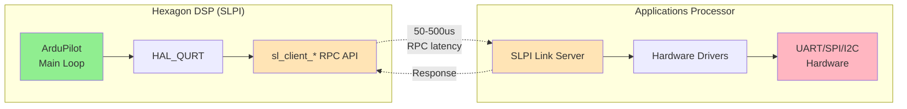
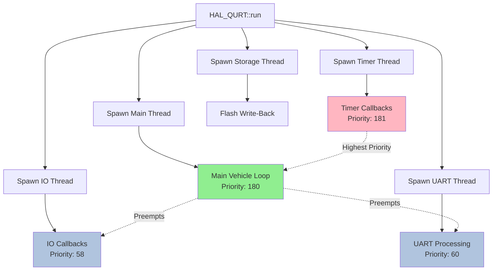
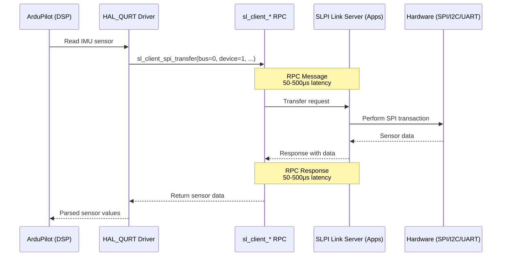

# AP_HAL_QURT

## Overview

AP_HAL_QURT is the Hardware Abstraction Layer (HAL) implementation for ArduPilot running on Qualcomm Hexagon DSP processors. This HAL enables ArduPilot to execute on the SLPI (Sensor Low Power Island) subsystem of Qualcomm Snapdragon platforms, leveraging the power-efficient DSP for real-time sensor processing and flight control while offloading less time-critical tasks to the applications processor.

Supported platforms include Snapdragon Flight, VOXL, and VOXL2, all featuring Hexagon DSP architectures with QURT Real-Time Operating System.

## Qualcomm Hexagon DSP Architecture

### DSP Processor Types

Qualcomm Snapdragon platforms feature multiple specialized DSP processors:

- **ADSP (Audio DSP)**: Optimized for audio processing workloads
- **cDSP (Compute DSP)**: General compute acceleration for signal processing
- **SLPI (Sensor Low Power Island)**: Low-power subsystem for sensor fusion and real-time control

**ArduPilot executes on the SLPI**, taking advantage of its real-time characteristics, low power consumption, and sensor processing capabilities.

### Memory Architecture

The Hexagon DSP operates with constrained memory resources:

- **Total DSP RAM**: ~32MB total memory allocation
- **Available Heap**: ~10-20MB after code, stack, and system overhead
- **Memory Model**: Unified memory architecture with limited caching
- **Constraints**: All dynamic allocations compete for this limited heap

This limited memory requires careful resource management, minimal dynamic allocation, and efficient buffer sizing throughout ArduPilot.

### CPU Capabilities

The Hexagon instruction set provides:

- **Vector Extensions**: HVX (Hexagon Vector eXtensions) for parallel data processing
- **DSP Instructions**: Specialized instructions for signal processing workloads
- **Threading**: POSIX pthread support via QURT RTOS
- **Timing**: Microsecond-accurate hardware timers via `qurt_timer_sleep()`

### Power Efficiency

The SLPI DSP architecture enables power-efficient operation:

- **Low-Power Sensor Processing**: DSP handles high-frequency sensor polling and fusion with minimal power draw
- **Applications Processor Offload**: Heavy computation and I/O delegated to apps processor when appropriate
- **Sleep States**: DSP can enter low-power states between tasks

### Inter-Processor Architecture



**Key Architectural Points**:
- DSP has **no direct hardware access** - all peripheral operations (UART, SPI, I2C) go through RPC to the apps processor
- RPC adds **50-500μs latency** per hardware operation
- Apps processor runs SLPI Link server that bridges RPC calls to actual hardware
- This architecture isolates the real-time DSP from hardware I/O complexity

## QURT RTOS Integration

### QURT Real-Time Operating System

QURT (Qualcomm Real-Time) is a proprietary RTOS designed for Hexagon DSP processors, providing:

- **POSIX Thread Support**: Standard pthread API with Hexagon-specific extensions
- **Real-Time Scheduling**: Priority-based preemptive scheduling
- **Synchronization Primitives**: Mutexes, condition variables, semaphores
- **High-Precision Timing**: `qurt_timer_sleep()` for microsecond-accurate delays

### Threading Model

AP_HAL_QURT uses pthreads as its threading foundation with QURT extensions:

**Thread Priority Constants** (defined in `Scheduler.h`):
- `APM_TIMER_PRIORITY = 181`: Timer callback thread (highest priority for real-time requirements)
- `APM_MAIN_PRIORITY = 180`: Main vehicle control loop thread
- `APM_UART_PRIORITY = 60`: UART I/O processing thread
- `APM_IO_PRIORITY = 58`: General I/O operations thread

**Priority Semantics**: On QURT, **higher numeric values = higher priority** (opposite of Linux nice values). This ensures timer callbacks always preempt lower-priority tasks to meet real-time deadlines.

### Thread Stack Requirements

Hexagon DSP imposes specific stack requirements:

- **Alignment**: All stacks must be **8-byte aligned**
- **Default Sizes**: 8KB-32KB per thread depending on usage
- **Memory Impact**: Each thread consumes precious DSP RAM for its stack
- **Overflow Detection**: Limited - stack overflow can silently corrupt memory

Careful stack sizing is critical due to DSP memory constraints.

### Semaphore Primitives

AP_HAL_QURT implements two semaphore types:

**QURT::Semaphore** (Recursive Mutex):
- Backed by `pthread_mutex` with `PTHREAD_MUTEX_RECURSIVE` attribute
- Same thread can acquire multiple times without deadlock
- Used throughout HAL for protecting shared state (buffers, device access)
- Overhead: ~1-10μs per acquire/release

**QURT::BinarySemaphore** (Condition Variable):
- Backed by `pthread_cond` + `pthread_mutex` + pending flag
- Binary signaling (only two states: signaled/not signaled)
- Used for event notification and thread synchronization
- More efficient than recursive mutex for simple signaling

### Scheduler Architecture

The QURT Scheduler spawns separate threads for different workload types:



**Thread Responsibilities**:
- **Main Thread**: Runs vehicle `setup()` and `loop()` at 400Hz
- **Timer Thread**: Executes registered timer callbacks (attitude control, navigation updates)
- **IO Thread**: Handles lower-priority I/O operations
- **UART Thread**: Processes UART receive/transmit buffers
- **Storage Thread**: Incrementally flushes dirty storage lines to flash

## Key Components and Architecture

### HAL_QURT_Class

**Purpose**: Main HAL singleton that initializes and provides access to all platform drivers.

**Source**: `libraries/AP_HAL_QURT/HAL_QURT_Class.{h,cpp}`

**Responsibilities**:
- Instantiates static driver instances (Scheduler, Storage, UART, SPI, I2C, etc.)
- Wires drivers together into HAL structure
- Spawns main thread and starts scheduler
- Registers fatal error handlers

**Key Methods**:
- `run()`: Entry point that initializes HAL and starts execution
- `start_main_thread()`: Creates pthread for main vehicle loop
- `main_thread()`: Main vehicle execution thread function

### Scheduler

**Purpose**: pthread-based task scheduler with QURT timer integration.

**Source**: `libraries/AP_HAL_QURT/Scheduler.{h,cpp}`

**Architecture**:
- Uses `qurt_timer_sleep()` for microsecond-accurate delays
- Maintains separate threads for timer, IO, UART, and storage tasks
- Priority-based scheduling ensures real-time callbacks meet deadlines

**Key Methods**:
- `delay(ms)`, `delay_microseconds(us)`: Blocking delays with CPU yield
- `register_timer_process()`: Register high-frequency callbacks (400-1000Hz)
- `register_io_process()`: Register lower-priority I/O callbacks
- `thread_create()`: Spawn new pthread with specified priority and stack size

**Thread Safety**: All callback registration protected by semaphores.

### UARTDriver

**Purpose**: Serial communication using sl_client_uart RPC and qurt_rpc framing.

**Source**: `libraries/AP_HAL_QURT/UARTDriver.{h,cpp}`

**Driver Variants**:
- **UARTDriver_Console**: Debug console output (routes to HAP_PRINTF/logcat)
- **UARTDriver_MAVLinkUDP**: MAVLink-over-UDP with qurt_rpc framing
- **UARTDriver_Local**: Standard serial UART for GPS, telemetry radios

**Architecture**:
- Circular RX/TX buffers with semaphore protection
- `_timer_tick()` called periodically to flush TX and poll RX
- All hardware access via `sl_client_uart_*` RPC (adds 50-500μs latency)

**Buffer Management**: 1KB-4KB buffers per UART (limited by DSP memory)

### SPIDevice / I2CDevice

**Purpose**: Sensor bus drivers using sl_client RPC to apps processor.

**Source**: 
- `libraries/AP_HAL_QURT/SPIDevice.{h,cpp}`
- `libraries/AP_HAL_QURT/I2CDevice.{h,cpp}`

**Architecture**:
- Each bus (SPI0, SPI1, I2C0, I2C1) is a `DeviceBus` with dedicated thread
- Devices register periodic callbacks for sensor polling
- Bus thread executes callbacks sequentially while holding bus semaphore
- All transfers via `sl_client_spi_transfer` or `sl_client_i2c_transfer` RPC

**Performance Characteristics**:
- RPC latency: 50-500μs per transfer
- Not suitable for very high-rate polling (>1kHz)
- Batch operations recommended to minimize RPC overhead

### RCInput / RCOutput

**Purpose**: RC receiver input and ESC/servo control.

**Source**: 
- `libraries/AP_HAL_QURT/RCInput.{h,cpp}`
- `libraries/AP_HAL_QURT/RCOutput.{h,cpp}`

**RCInput Architecture**:
- Buffers up to 18 RC channels (RC_INPUT_MAX_CHANNELS)
- `_timer_tick()` polls AP::RC at ~100Hz for new channel data
- Mutex-protected for thread-safe access
- Polling-based (no interrupt-driven RC input on QURT)

**RCOutput Architecture**:
- Controls motors/servos via framed UART protocol to ESC controller board
- Protocol uses Modbus CRC framing with version discovery
- `_timer_tick()` sends PWM commands (1000-2000μs) and polls ESC telemetry
- Integrates with `AP_ESC_Telem_Backend` for telemetry data (RPM, voltage, current, temperature)

**Telemetry Structures**:
- `esc_response_v2`: Per-channel ESC telemetry
- `esc_power_status`: System power monitoring

### Storage

**Purpose**: Emulated EEPROM using RAM buffer with write-back to flash.

**Source**: `libraries/AP_HAL_QURT/Storage.{h,cpp}`

**Architecture**:
- In-memory buffer (QURT_STORAGE_SIZE, typically 4KB-16KB)
- Divided into lines (QURT_STORAGE_LINE_SIZE, typically 512 bytes)
- Dirty bit tracking per line
- `_timer_tick()` incrementally flushes one dirty line per call

**Write-Back Strategy**:
- Writes update RAM immediately (fast)
- Dirty lines flushed to flash over time (spreads flash writes)
- `flush()` forces immediate write-back of all dirty lines
- Wear leveling through batched writes

**Safety Considerations**:
- Recent writes only in RAM may be lost on power failure
- Critical parameters should call `flush()` after updates

### AnalogIn

**Purpose**: Analog input channels (voltage, current) from ESC telemetry.

**Source**: `libraries/AP_HAL_QURT/AnalogIn.{h,cpp}`

**Architecture**:
- Does **not** access ADC hardware directly
- Reads voltage/current from `RCOutput` ESC telemetry
- ESC controller board has ADC hardware and reports via UART telemetry

**Limitations**:
- Limited to telemetry-provided channels (typically voltage, current)
- Update rate limited by ESC telemetry rate (10-100Hz)
- Cannot add arbitrary analog channels without ESC firmware changes

### Thread / PeriodicThread

**Purpose**: pthread wrappers with stack management for Hexagon DSP.

**Source**: `libraries/AP_HAL_QURT/Thread.{h,cpp}`

**Thread Class**:
- Simplified pthread creation with automatic 8-byte stack alignment
- Configurable stack size and priority
- Methods: `set_stack_size()`, `start()`, `join()`, `is_current_thread()`

**PeriodicThread Class**:
- Executes callback at fixed intervals using `qurt_timer_sleep()`
- Pattern: `while(running) { callback(); qurt_timer_sleep(period); }`
- Provides microsecond-accurate periodic execution

### DeviceBus

**Purpose**: Base class for per-bus callback scheduling infrastructure.

**Source**: `libraries/AP_HAL_QURT/DeviceBus.{h,cpp}`

**Architecture**:
- Each bus spawns single thread (HAL_QURT_DEVICE_STACK_SIZE = 8192 bytes)
- Maintains list of `PeriodicCb` entries with requested periods
- Thread sleeps until next callback due, executes callback, updates `next_usec`
- Bus semaphore held during callback execution (prevents concurrent bus access)

**Scheduling Algorithm**:
- Calculates next wakeup time from all registered callbacks
- Uses `qurt_timer_sleep()` for microsecond-accurate sleep
- Executes all due callbacks sequentially
- Updates `next_usec` by period to maintain consistent rate

## Inter-Processor Communication (IPC)

### SLPI Link Architecture

The SLPI Link provides the foundation for DSP-to-apps processor communication:

**Communication Model**:
- **DSP Side**: ArduPilot calls `sl_client_*` functions
- **Apps Processor Side**: SLPI Link server receives RPC, executes hardware operation, returns result
- **Protocol**: Custom RPC protocol with message framing (see `ap_host/src/protocol.h`)

**Source**: `libraries/AP_HAL_QURT/interface.h` (DSP-side API declarations)

### sl_client_* RPC API

The `sl_client_*` family of functions provides hardware peripheral access:

**UART Operations**:
- `sl_client_uart_open(device)`: Open UART device, returns handle
- `sl_client_uart_read(handle, buffer, len)`: Read from UART
- `sl_client_uart_write(handle, buffer, len)`: Write to UART
- `sl_client_uart_close(handle)`: Close UART

**SPI Operations**:
- `sl_client_spi_transfer(bus, device, send, recv, len)`: Full-duplex SPI transfer

**I2C Operations**:
- `sl_client_i2c_transfer(bus, address, send, send_len, recv, recv_len)`: Combined write/read

**Characteristics**:
- All functions are **synchronous** (block until RPC completes)
- Return values indicate success/failure
- Handles must be properly managed (open/close to avoid leaks on apps processor)

### RPC Latency Characteristics

**Typical Latency**: 50-500μs roundtrip overhead

**Factors Affecting Latency**:
- IPC (Inter-Processor Communication) load
- Apps processor scheduling
- Transfer size (larger transfers take longer)
- Protocol overhead (message framing, CRC, etc.)

**Performance Implications**:
- Not suitable for hard real-time operations requiring <50μs response
- Batch operations when possible to amortize RPC overhead
- Cache frequently-accessed values to avoid repeated RPC

### RPC Protocol Details

**Message Format**: See `ap_host/src/protocol.h` for `qurt_rpc_msg` wire format

**Protocol Features**:
- Command IDs for each operation type
- Parameter marshaling for function arguments
- CRC or checksum for data integrity
- Asynchronous notifications for events (e.g., RC input updates)

### Typical RPC Flow Diagram



### Hardware Access Model

**Critical Constraint**: The Hexagon DSP has **no direct peripheral access**. All hardware operations must go through the apps processor:

- **Memory-Mapped I/O**: Not available on DSP
- **Interrupts**: Hardware interrupts not routed to DSP
- **DMA**: No direct DMA access from DSP to peripherals

This architecture isolates the DSP from hardware complexity but adds latency to all I/O operations.

### Performance Optimization Strategies

**Batch Operations**:
```cpp
// Bad: Multiple RPC calls
for (int i = 0; i < 10; i++) {
    read_register(0x10 + i);  // 10 RPC calls, ~5ms total
}

// Good: Single batched transfer
uint8_t regs[10];
read_registers(0x10, regs, 10);  // 1 RPC call, ~500μs
```

**Cache Static Values**:
```cpp
// Bad: Read chip ID every time
uint8_t id = device.read_register(WHO_AM_I);  // RPC every call

// Good: Read once, cache result
static uint8_t chip_id = device.read_register(WHO_AM_I);  // RPC once
```

**Increase Callback Periods**:
```cpp
// May not need 1kHz for all sensors
device.register_periodic_callback(1000, callback);  // 1kHz - high RPC rate

// 400Hz often sufficient for IMU
device.register_periodic_callback(2500, callback);  // 400Hz - lower RPC rate
```

## Build Configuration

### Cross-Compilation Setup

Building ArduPilot for QURT/Hexagon requires the Qualcomm Hexagon SDK.

**Required Tools**:
- **Hexagon SDK**: Qualcomm's development kit for Hexagon DSP
- **hexagon-clang**: LLVM-based compiler for Hexagon
- **hexagon-link**: Linker for Hexagon binaries
- **hexagon-sim**: Simulator for testing (limited usefulness for ArduPilot)

**Environment Variables**:
```bash
export HEXAGON_SDK_ROOT=/path/to/Hexagon_SDK
export HEXAGON_TOOLS_ROOT=$HEXAGON_SDK_ROOT/tools/HEXAGON_Tools
export PATH=$HEXAGON_TOOLS_ROOT/bin:$PATH
```

**Hexagon SDK Installation**:
1. Download Hexagon SDK from Qualcomm Developer Network (requires registration)
2. Extract and install following Qualcomm's instructions
3. Configure environment variables in `.bashrc` or `.profile`
4. Verify installation: `hexagon-clang --version`

### Building for Snapdragon Platforms

#### Snapdragon Flight

Snapdragon Flight is the older platform based on Snapdragon 801.

**Configure**:
```bash
./waf configure --board=sdcf
```

**Build**:
```bash
./waf copter    # For multicopter
./waf plane     # For fixed-wing
./waf rover     # For ground vehicle
```

**Output**:
- Binary location: `build/sdcf/bin/arducopter`
- This is a DSP SLPI executable, not an apps processor executable

#### VOXL / VOXL2

VOXL and VOXL2 are current platforms based on Snapdragon 820/865.

**Configure**:
```bash
./waf configure --board=qurt
```

**Build**:
```bash
./waf copter    # Build for VOXL platform
```

**Packaging** (creates .deb package):
```bash
cd libraries/AP_HAL_QURT/packaging
./make_package.sh
```

**Output**:
- Binary: `build/qurt/bin/arducopter`
- Package: `.deb` file for installation on VOXL

### Installation and Deployment

#### Using install.sh Script

The provided script automates deployment to VOXL via SSH:

```bash
./libraries/AP_HAL_QURT/install.sh
```

**What it does**:
- Uses `rsync` to copy built binary to VOXL over network
- Deploys to `/usr/bin/voxl-ardupilot` on target
- Restarts the voxl-ardupilot service

**Requirements**:
- VOXL connected via network (WiFi or USB network)
- SSH access configured
- Sufficient space on VOXL

#### Manual Installation

**Copy Binary**:
```bash
adb push build/qurt/bin/arducopter /usr/bin/voxl-ardupilot
# Or via SSH:
scp build/qurt/bin/arducopter root@voxl:/usr/bin/voxl-ardupilot
```

**Set Permissions**:
```bash
adb shell chmod +x /usr/bin/voxl-ardupilot
```

**Service Management**:
```bash
# Restart service
adb shell systemctl restart voxl-ardupilot

# Check status
adb shell systemctl status voxl-ardupilot

# Enable on boot
adb shell systemctl enable voxl-ardupilot
```

#### Viewing Logs

**Using logcat** (QURT uses Android-style logging):
```bash
adb shell logcat -s ArduPilot
```

**Filtering by severity**:
```bash
adb shell logcat -s ArduPilot:I    # Info and above
adb shell logcat -s ArduPilot:W    # Warnings and errors
adb shell logcat -s ArduPilot:E    # Errors only
```

**Continuous monitoring**:
```bash
adb shell logcat -s ArduPilot | grep "loop_time"  # Monitor scheduler timing
```

## Performance Optimization

### DSP CPU Budget Management

The Hexagon DSP has limited compute resources that must be carefully managed.

**Target Main Loop Rate**: 400Hz (2.5ms period)

**Typical CPU Budget Allocation**:
- **Main Loop**: ~1.0ms (vehicle control, mode logic)
- **Timer Callbacks**: ~1.0ms (attitude control, navigation updates)
- **IO Callbacks**: ~0.5ms (sensor reads, telemetry)
- **Overhead**: ~0.5ms (scheduling, RPC, context switches)
- **Total**: ~3.0ms (leaves margin for 2.5ms target)

**Monitoring Performance**:
```bash
# Watch scheduler timing in logs
adb shell logcat -s ArduPilot | grep "loop_time_us"
```

**Target**: `loop_time_us` should consistently be ~2500μs (400Hz)

**Symptoms of CPU Overload**:
- `loop_time_us` exceeds 2500μs consistently
- Attitude estimation warnings
- EKF innovation failures
- Poor control response

**Solutions**:
- Reduce sensor polling rates (e.g., 1kHz → 400Hz)
- Optimize callback execution time
- Disable unused features
- Profile with timing instrumentation

### Memory Optimization

DSP memory is severely constrained (~10-20MB available heap).

**Strategies**:

**Minimize Dynamic Allocation**:
```cpp
// Bad: Heap allocation
float *buffer = new float[1000];  // Consumes precious heap

// Good: Stack allocation for small arrays
float buffer[100];  // Stack (if < ~4KB)

// Good: Static allocation for globals
static float global_buffer[1000];  // BSS segment
```

**Tune Thread Stack Sizes**:
```cpp
// Default stacks may be oversized
thread.set_stack_size(8192);   // 8KB minimum
thread.set_stack_size(16384);  // 16KB for deeper call stacks
thread.set_stack_size(32768);  // 32KB for very deep stacks (rare)
```

**Monitor Available Memory**:
```cpp
uint32_t free_mem = hal.util->available_memory();
if (free_mem < 1*1024*1024) {  // Less than 1MB free
    gcs().send_text(MAV_SEVERITY_WARNING, "Low DSP memory: %u KB", free_mem/1024);
}
```

**Storage Buffer Sizing**:
- Balance parameter storage needs vs RAM consumption
- Typical: 4KB-16KB for QURT_STORAGE_SIZE
- Larger = more parameters, more RAM usage

### RPC Optimization

Minimize RPC calls to reduce latency overhead.

**Batch SPI/I2C Transfers**:
```cpp
// Bad: 6 RPC calls
uint8_t val1 = read_reg(0x00);  // RPC #1
uint8_t val2 = read_reg(0x01);  // RPC #2
uint8_t val3 = read_reg(0x02);  // RPC #3
// ...

// Good: 1 RPC call
uint8_t vals[6];
read_regs(0x00, vals, 6);  // Single RPC, reads regs 0x00-0x05
```

**Increase Device Callback Periods**:
```cpp
// 1kHz rarely necessary
device.register_periodic_callback(1000, cb);  // 1ms = 1kHz

// 400Hz often sufficient, reduces RPC by 60%
device.register_periodic_callback(2500, cb);  // 2.5ms = 400Hz
```

**Cache Frequently-Accessed Values**:
```cpp
// Bad: Read chip ID every loop
uint8_t chip_id = device.read_register(WHO_AM_I);  // RPC every call

// Good: Cache on first read
static uint8_t cached_chip_id = 0;
if (cached_chip_id == 0) {
    cached_chip_id = device.read_register(WHO_AM_I);  // RPC once
}
```

### Timing Optimization

**Prioritize Critical Threads**:
- Timer callbacks at APM_TIMER_PRIORITY (181) - highest
- Main loop at APM_MAIN_PRIORITY (180)
- IO/UART at lower priorities

This ensures real-time callbacks always execute on time.

**Minimize Critical Sections**:
```cpp
// Bad: Long semaphore hold
WITH_SEMAPHORE(sem);
do_lots_of_work();  // Blocks other threads

// Good: Minimize semaphore scope
{
    WITH_SEMAPHORE(sem);
    copy_data();  // Fast, <10μs
}
do_lots_of_work();  // Outside semaphore
```

**Target**: Keep semaphore hold times <10μs to avoid blocking other threads.

**Avoid Blocking in Timer Callbacks**:
```cpp
// Bad: Blocking operation in timer callback
void timer_callback() {
    device.transfer(...);  // May take 500μs (RPC)
    process_data();        // Blocks timer thread
}

// Good: Defer to IO thread
void timer_callback() {
    flag_data_ready = true;  // Fast signal
}

void io_callback() {
    if (flag_data_ready) {
        device.transfer(...);  // OK in IO thread
        process_data();
    }
}
```

**Use qurt_timer_sleep for Accuracy**:
```cpp
// Less accurate
usleep(1000);  // May have significant jitter

// More accurate on QURT
qurt_timer_sleep(1000);  // <10μs jitter for delays >100μs
```

## Testing Procedures

### SITL Simulation

**Limitation**: QURT HAL requires actual Hexagon hardware - SITL is **not applicable**.

**Alternative Workflow**:
1. Develop and test algorithms using HAL_SITL on desktop
2. Port to QURT HAL
3. Test on actual Snapdragon hardware (VOXL/Snapdragon Flight)

SITL can validate control algorithms and mission logic, but HAL-specific behavior must be tested on hardware.

### Hardware Testing on VOXL

#### Initial Setup

**1. Connect to VOXL**:
```bash
# Via USB (if adb configured)
adb devices

# Via network (if SSH configured)
ssh root@<VOXL_IP>
```

**2. Install ArduPilot**:
```bash
# Using adb
adb push build/qurt/bin/arducopter /usr/bin/voxl-ardupilot
adb shell chmod +x /usr/bin/voxl-ardupilot

# Or via install script
./libraries/AP_HAL_QURT/install.sh
```

**3. Configure Parameters**:
```bash
# Connect with MAVProxy
mavproxy.py --master=udp:<VOXL_IP>:14550

# Or Mission Planner
# Connect via UDP, port 14550, IP: <VOXL_IP>
```

#### Testing Checklist

**Boot and HAL Initialization**:
```bash
adb shell logcat -s ArduPilot | grep "main_thread"
```
- [ ] Look for: `HAL_QURT: main_thread started`
- [ ] Verify no crash/restart loops
- [ ] Check for initialization error messages

**Scheduler Timing**:
```bash
adb shell logcat -s ArduPilot | grep "loop_time"
```
- [ ] Verify `loop_time_us` around 2500μs (400Hz target)
- [ ] No consistent overruns (>3000μs)
- [ ] Stable timing without large jitter

**Sensor Detection**:
```bash
adb shell logcat -s ArduPilot | grep -E "IMU|Baro|Compass"
```
- [ ] IMU detected and initialized
- [ ] Barometer detected (if present)
- [ ] Compass detected (if present)
- [ ] No repeated detection failures

**RC Input**:
```bash
# In MAVProxy
rc list
```
- [ ] RC channels showing expected values (1000-2000μs)
- [ ] Values update when moving transmitter sticks
- [ ] No stuck or frozen channels

**Motor Output**:
```bash
# In MAVProxy (CAUTION: Motors may spin!)
arm throttle
rc 3 1200  # Slight throttle
```
- [ ] Arming successful (passes pre-arm checks)
- [ ] Motors respond to throttle commands
- [ ] ESC telemetry visible in logs (if supported)

**MAVLink Communication**:
- [ ] Mission Planner connects via UDP <VOXL_IP>:14550
- [ ] Telemetry data updating (attitude, position, battery)
- [ ] Commands from GCS working (mode changes, arm/disarm)
- [ ] No dropped connections or timeouts

**Parameter Storage**:
```bash
# Set a parameter
param set PARAM_NAME value

# Reboot
adb shell systemctl restart voxl-ardupilot

# Check parameter persisted
param show PARAM_NAME
```
- [ ] Parameter changes persist across reboot
- [ ] No storage errors in logs
- [ ] Flush operations completing successfully

**ESC Telemetry** (if supported):
```bash
adb shell logcat -s ArduPilot | grep -E "RPM|ESC|voltage|current"
```
- [ ] RPM values showing for spinning motors
- [ ] Voltage readings reasonable
- [ ] Current readings reasonable
- [ ] Temperature readings (if available)

#### Common Issues and Debugging

**No Sensor Detection**:
- **Symptoms**: Sensors not found, IMU/baro/compass missing
- **Check**: SPI/I2C RPC communication working
- **Verify**: Apps processor services running (`ps aux | grep slpi`)
- **Solution**: Restart SLPI Link server, check hardware connections

**High loop_time_us**:
- **Symptoms**: `loop_time_us` consistently >3000μs
- **Cause**: CPU overload from callbacks or RPC latency
- **Solutions**:
  - Reduce sensor polling rates
  - Optimize callback execution time
  - Disable unused features (logging, extra sensors)
  - Check for blocking operations in timer callbacks

**MAVLink Dropout**:
- **Symptoms**: Ground station loses connection periodically
- **Check**: Network stability, WiFi signal strength
- **Solutions**:
  - Use wired network if possible
  - Increase MAVLink stream rates to compensate
  - Check for CPU overload (affects UART processing)

**Motor Not Spinning**:
- **Symptoms**: Arming succeeds but motors don't spin
- **Check**: Safety switch state (`param show BRD_SAFETY_MASK`)
- **Verify**: Arming checks passed (`arm check`)
- **Check**: ESC protocol matches ESC firmware
- **Solution**: Verify PWM range, check ESC controller communication

**Crash on Startup**:
- **Symptoms**: ArduPilot crashes immediately after launch
- **Check**: DSP memory usage
- **Verify**: Sufficient free heap (`logcat` for OOM messages)
- **Solution**:
  - Reduce buffer sizes (STORAGE, UART buffers)
  - Reduce thread stack sizes
  - Disable unused features to free memory

### Performance Testing

**Monitor CPU Usage on Apps Processor**:
```bash
adb shell top | grep voxl-ardupilot
```

**Monitor DSP Load** (in ArduPilot logs):
```bash
adb shell logcat -s ArduPilot | grep "CPU:"
```

**Measure RPC Latency**:

Add timing instrumentation around `sl_client_*` calls:
```cpp
uint64_t start = AP_HAL::micros64();
sl_client_spi_transfer(...);
uint64_t duration = AP_HAL::micros64() - start;
printf("SPI RPC took %u us\n", (unsigned)duration);
```

**Profile Callbacks**:

Add timing to device callbacks:
```cpp
void sensor_callback() {
    uint64_t start = AP_HAL::micros64();
    
    // Sensor operations
    device.transfer(...);
    process_data();
    
    uint64_t duration = AP_HAL::micros64() - start;
    if (duration > period_usec / 2) {  // Using >50% of period
        printf("WARNING: Callback taking %u us (period: %u us)\n", 
               (unsigned)duration, (unsigned)period_usec);
    }
}
```

**Target**: Callbacks should use <50% of their period to leave margin for jitter.

**Memory Leak Detection**:

Monitor `available_memory()` over extended flight:
```cpp
static uint32_t last_mem = 0;
uint32_t mem = hal.util->available_memory();
if (last_mem > 0 && mem < last_mem - 100*1024) {  // Lost >100KB
    gcs().send_text(MAV_SEVERITY_WARNING, "Memory decreased: %u KB", mem/1024);
}
last_mem = mem;
```

## Safety Considerations

### Real-Time Constraints

⚠️ **WARNING**: Timer callbacks must complete within their period to maintain real-time operation.

**Consequences of Violations**:
- Attitude estimation drift (EKF failures)
- Control loop instability
- Failsafe triggers
- Potential loss of vehicle control

**Guidelines**:
- Timer callbacks: <1ms total execution time
- Main loop: <2ms per iteration (400Hz target)
- Use `loop_time_us` logging to monitor

⚠️ **WARNING**: Long blocking operations can cause attitude estimation drift.

Avoid blocking operations in timer callbacks:
- File I/O
- Network operations
- Long RPC calls
- Complex computation

Defer to IO thread or main loop if operation may take >100μs.

⚠️ **WARNING**: Missed timer ticks trigger failsafe warnings.

If scheduler cannot maintain loop rate:
- EKF issues failsafe warnings
- Vehicle may enter failsafe mode (RTL, Land)
- Log shows `Scheduler: missed timer tick` messages

### Memory Safety

⚠️ **WARNING**: DSP memory is very limited - out-of-memory causes crash.

**Total Available Heap**: ~10-20MB

**Memory Allocation Failures**:
- `new` returns `nullptr` (check before use!)
- System may crash without warning
- No recovery mechanism

**Guidelines**:
- Minimize dynamic allocation
- Prefer stack/static allocation when possible
- Monitor `available_memory()` regularly
- Keep at least 1-2MB free for margin

⚠️ **WARNING**: Stack overflow corrupts memory without detection.

**Hexagon DSP has limited stack overflow detection**:
- Stack corruption can silently overwrite adjacent memory
- Symptoms: random crashes, data corruption, strange behavior
- Very difficult to debug

**Guidelines**:
- Size stacks conservatively (8KB minimum, 16-32KB typical)
- Avoid deep recursion
- Avoid large stack arrays
- Profile worst-case stack usage

⚠️ **WARNING**: Each thread consumes 8KB-32KB stack from limited DSP RAM.

**Thread Count Impact**:
- 10 threads × 16KB = 160KB of heap consumed just for stacks
- Every thread reduces available heap
- Tune stack sizes to minimum required

### Hardware Safety

⚠️ **WARNING**: Motors can spin if safety checks are bypassed.

**Safety System**:
- Software arming checks prevent unexpected motor spin
- Safety switch (if present) provides hardware interlock
- `BRD_SAFETY_MASK` configures safety behavior

**Critical Parameters**:
- `BRD_SAFETY_MASK`: Channels affected by safety switch
- `ARMING_CHECK`: Pre-arm checks (DO NOT disable without understanding risks)

⚠️ **WARNING**: Incorrect PWM range can damage servos.

**PWM Range Configuration**:
- Typical: 1000-2000μs
- Some servos: 900-2100μs
- Digital servos: May have different ranges

**Verify Before Flight**:
- Test servo range with low throttle
- Ensure servos don't bind at endpoints
- Check for mechanical limits

⚠️ **WARNING**: ESC protocol must match actual ESC firmware.

**Protocol Mismatch**:
- Motors may not arm
- Erratic motor behavior
- Potential damage to ESCs

**Verify**:
- ESC controller board firmware version
- Protocol compatibility
- Telemetry format (esc_response_v2)

⚠️ **WARNING**: Power failure during storage flush loses recent parameter changes.

**Storage Write-Back**:
- Parameters written to RAM immediately (fast)
- Flushed to flash incrementally (slow)
- Power loss before flush = parameter loss

**Critical Parameters**:
- Call `storage->flush()` after critical parameter changes
- Or wait ~10-30 seconds for automatic flush
- Better: change parameters on ground, not in flight

## References

### Source Files

All AP_HAL_QURT source code located in:
- `libraries/AP_HAL_QURT/*.{h,cpp}`

**Key Files**:
- `HAL_QURT_Class.{h,cpp}`: Main HAL singleton and initialization
- `Scheduler.{h,cpp}`: Thread-based task scheduler
- `UARTDriver.{h,cpp}`: Serial communication with RPC
- `SPIDevice.{h,cpp}`, `I2CDevice.{h,cpp}`: Sensor bus drivers
- `RCInput.{h,cpp}`, `RCOutput.{h,cpp}`: RC and motor control
- `Storage.{h,cpp}`: Parameter storage emulation
- `Thread.{h,cpp}`: pthread wrappers
- `Semaphores.{h,cpp}`: Synchronization primitives
- `interface.h`: SLPI Link RPC API definitions

### Protocol Documentation

- **SLPI Link Protocol**: `libraries/AP_HAL_QURT/ap_host/src/protocol.h`
  - Defines `qurt_rpc_msg` wire format
  - Command IDs and parameter marshaling
  - Used for DSP ↔ Apps processor communication

### Build and Packaging

- **Packaging Scripts**: `libraries/AP_HAL_QURT/packaging/`
  - `make_package.sh`: Creates .deb package for VOXL
  - Requires dpkg-deb and git
  
- **Installation Script**: `libraries/AP_HAL_QURT/install.sh`
  - Automated rsync deployment to VOXL over SSH
  - Restarts voxl-ardupilot service

### Related Modules

- [**AP_HAL**](../AP_HAL/README.md): Hardware Abstraction Layer interface definitions
  - All HAL drivers implement AP_HAL abstract classes
  - Defines contracts for Scheduler, UARTDriver, SPIDevice, etc.

- [**AP_HAL_ChibiOS**](../AP_HAL_ChibiOS/README.md): ARM/ChibiOS HAL implementation
  - Comparison point for ARM platform HAL
  - Shows how native hardware access differs from QURT's RPC model

### External Documentation

**Qualcomm Documentation** (requires Qualcomm Developer Network account):
- **Hexagon SDK Documentation**: Programming guide, API reference, optimization guide
- **QURT RTOS API Reference**: pthread extensions, qurt_timer API, DSP-specific functions
- **SLPI Architecture Guide**: Sensor Low Power Island subsystem documentation

**VOXL Platform Documentation**:
- **ModalAI VOXL Docs**: https://docs.modalai.com/
  - VOXL hardware specifications
  - Software platform overview
  - Development guides and tutorials
  - Troubleshooting and support

**ArduPilot Developer Documentation**:
- **ArduPilot Dev Wiki**: https://ardupilot.org/dev/
  - General ArduPilot development
  - HAL architecture overview
  - Porting guide (for understanding HAL requirements)

## Known Limitations

### No Filesystem Access from DSP

**Limitation**: Hexagon DSP has no filesystem access.

**Impacts**:
- No SD card logging from DSP
- Parameters must use storage emulation (flash-backed RAM)
- Log files must be generated on apps processor (if supported)

**Workarounds**:
- Use MAVLink telemetry logging on ground station
- Apps processor can handle file operations if needed

### Limited Networking

**Limitation**: Networking support is restricted.

**Available**:
- UDP MAVLink (primary communication method)
- Port 14550 default for GCS communication

**Not Available**:
- TCP connections
- Raw sockets
- Complex networking protocols

**Implications**:
- Ground station communication via UDP only
- No web server or REST APIs on DSP

### All Hardware Access via RPC

**Limitation**: Every hardware operation incurs RPC latency.

**Latency**: 50-500μs per operation

**Impacts**:
- Not suitable for ultra-high-rate operations (>1kHz)
- Batch operations required for efficiency
- Timing jitter from RPC variability

**Cannot Be Avoided**: Architectural constraint of SLPI platform

### Memory Constraints

**Limitation**: DSP has only ~10-20MB available heap.

**Impacts**:
- Limited buffer sizes
- Thread count constrained by stack memory
- Complex features may not fit
- Careful memory management required

**Cannot Be Expanded**: Hardware limitation of DSP

### No Direct ADC Access

**Limitation**: DSP cannot read ADC hardware directly.

**Available**:
- Voltage/current via ESC telemetry (RCOutput)
- Apps processor can read ADC and forward via RPC (if implemented)

**Not Available**:
- Arbitrary analog pin reads
- High-rate ADC sampling
- Custom analog sensor integration (without ESC firmware changes)

**Workaround**: Use ESC controller board as ADC provider

### Thread Count Limited by Memory

**Limitation**: Each thread consumes 8KB-32KB for stack.

**Impact on Thread Budget**:
- 20 threads × 16KB = 320KB (significant on 10-20MB heap)
- More threads = less heap for other uses
- Thread creation may fail if memory exhausted

**Guidelines**:
- Keep thread count minimal
- Use thread pools or callback systems instead of per-task threads
- Tune stack sizes to minimum required

---

**Document Version**: 1.0  
**Last Updated**: 2025  
**Platform Support**: Snapdragon Flight, VOXL, VOXL2  
**ArduPilot Compatibility**: Master branch

