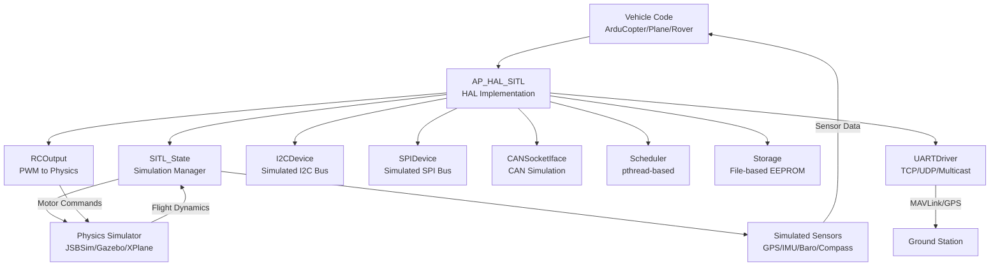

# AP_HAL_SITL

## Overview

AP_HAL_SITL is the Software-In-The-Loop (SITL) Hardware Abstraction Layer implementation for ArduPilot. It enables running ArduPilot autopilot firmware on a host operating system (Linux, macOS, Windows) without physical hardware, providing comprehensive simulation capabilities for development, testing, and validation. SITL allows developers to test flight control algorithms, sensor fusion, navigation logic, and mission planning in a safe, reproducible environment before deploying to actual vehicles.

## Architecture

SITL provides a complete HAL implementation that replaces hardware-specific drivers with simulated equivalents, integrating with external physics simulators to create realistic flight dynamics.



## Key Components

### HAL_SITL_Class

**Purpose**: Main HAL instance that provides all hardware abstractions for SITL simulation.

**Lifecycle**: 
- Initialization: Constructs all HAL component instances (UART drivers, I2C/SPI managers, scheduler, storage)
- run() method: Main simulation loop that processes callbacks and maintains simulation timing
- Reboot support: Can restart simulation via execv() to test watchdog and parameter changes

**Key Features**:
- Instantiates 10 UART drivers for serial ports (configurable via command-line)
- Provides I2C and SPI device managers with ioctl-based simulation
- Implements watchdog timer simulation with persistent data across reboots
- Signal handling for graceful shutdown (SIGTERM, SIGINT, SIGHUP, SIGQUIT)
- Stack NaN filling for detecting uninitialized memory without valgrind

**Source**: libraries/AP_HAL_SITL/HAL_SITL_Class.cpp

### SITL_State

**Purpose**: Core simulation state manager that bridges ArduPilot vehicle code with physics simulators.

**Responsibilities**:
- Physics simulator integration (JSBSim, Gazebo, XPlane, FlightGear, RealFlight, airsim)
- Sensor data simulation (GPS, IMU, compass, barometer, rangefinder, optical flow, airspeed)
- RC input simulation from external simulators or MAVProxy joystick
- Actuator output relay to physics simulator
- Simulated peripheral devices (buzzer, sprayer, gripper, parachute, precision landing, I2C devices)
- Clock management with configurable speedup factors

**Integration Pattern**:
- Receives flight dynamics state from physics simulator via UDP or shared memory
- Converts physics data to sensor measurements with configurable noise and drift
- Sends motor/servo commands back to physics simulator for actuator simulation
- Maintains simulation time synchronized with vehicle code execution

**Source**: libraries/AP_HAL_SITL/SITL_State.cpp, SITL_State_common.cpp

### UARTDriver

**Purpose**: Serial port simulation supporting multiple transport protocols for testing telemetry, GPS, and peripheral communication.

**Supported Transports**:
- **TCP Listen**: `tcp:PORT:wait` - Accept GCS connections on specified port
- **TCP Client**: `tcpclient:HOST:PORT` - Connect to external TCP server
- **UDP Client**: `udpclient:HOST:PORT` - Send/receive UDP packets to GCS
- **Multicast**: `mcast:GROUP:PORT` - Multicast networking for multi-vehicle sim
- **UART**: `uart:/dev/ttyUSB0:BAUD` - Real serial port passthrough
- **File**: `file:/path/to/file` - Replay or log serial data to file
- **GPS Simulation**: `GPS1`, `GPS2` - Simulated GPS receivers with configurable accuracy
- **Simulated Devices**: `sim:DeviceType:params` - Particle sensors, VectorNav, etc.

**Configuration**: Serial port paths configured via command-line arguments (`--serial0 tcp:5760:wait`)

**Source**: libraries/AP_HAL_SITL/UARTDriver.cpp

### I2CDevice and SPIDevice

**Purpose**: Simulate I2C and SPI bus communication for testing sensor drivers without hardware.

**Implementation**:
- I2C: Uses ioctl-style interface to SITL::SIM.i2c_ioctl() for device emulation
- SPI: Similar ioctl interface for SPI device simulation
- Supports multiple buses (configurable via NUM_SITL_I2C_BUSES)
- Periodic callback registration for sensor data updates
- Semaphore protection for thread-safe bus access

**Use Cases**:
- Test I2C compass, barometer, or IMU drivers
- Validate SPI sensor protocols
- Simulate bus errors and device failures
- Test multi-device bus arbitration

**Source**: libraries/AP_HAL_SITL/I2CDevice.cpp, SPIDevice.cpp

### CANSocketIface

**Purpose**: CAN bus simulation using UDP multicast or Linux SocketCAN interface.

**Modes**:
- **Multicast CAN**: UDP multicast for multi-process CAN bus simulation
- **SocketCAN**: Linux kernel CAN interface (vcan0, can0) for integration with real CAN tools

**Applications**:
- Test DroneCAN/UAVCAN peripheral communication
- Simulate CAN ESCs, GPS+compass, airspeed sensors
- Multi-vehicle CAN bus testing
- Integration with third-party CAN analysis tools (candump, cansniffer)

**Source**: libraries/AP_HAL_SITL/CANSocketIface.cpp

### Scheduler

**Purpose**: Task scheduling using pthread threads with timing control.

**Features**:
- Main thread runs vehicle setup() and loop()
- Timer callbacks executed at specified frequencies
- I/O process callbacks for background tasks
- Interrupt disable/enable simulation for atomic operations
- Thread stack checking for overflow detection (configurable)
- UBSAN error logging for undefined behavior detection

**Timing Control**:
- Simulated time with configurable speedup (default 1x, can run faster/slower)
- Clock stopping for deterministic debugging
- Timer event synchronization with physics sim update rate

**Source**: libraries/AP_HAL_SITL/Scheduler.cpp

### Storage

**Purpose**: Non-volatile parameter storage emulation using host filesystem.

**Implementation**:
- Parameters stored in `eeprom.bin` file in simulation directory
- Supports AP_Param system for parameter persistence
- Emulates EEPROM read/write with file I/O
- Preserves parameters across simulation restarts

**Testing**:
- Validate parameter save/load logic
- Test parameter migration and defaults
- Verify parameter erase functionality

**Source**: libraries/AP_HAL_SITL/Storage.cpp

### RCOutput

**Purpose**: Motor and servo output simulation, sending PWM commands to physics simulator.

**Behavior**:
- Captures PWM values (1000-2000µs) from vehicle code
- Relays outputs to SITL_State for physics simulator consumption
- Implements safety switch simulation (disarms outputs when safety off)
- Supports corked output for atomic multi-channel updates
- Configurable output rate (50Hz for servos, 400Hz for multicopter motors)

**Integration**: Physics simulator reads PWM values and applies them to simulated motors/servos

**Source**: libraries/AP_HAL_SITL/RCOutput.cpp

### Sensor Simulation

SITL simulates a comprehensive sensor suite with configurable noise, drift, and failure modes:

- **GPS**: Position, velocity, heading with configurable accuracy, satellite count, HDOP
- **IMU**: Accelerometer and gyroscope with noise, bias, scale factors, and thermal drift
- **Compass**: Magnetometer with declination, motor interference, and offsets
- **Barometer**: Pressure altitude with temperature compensation and drift
- **Rangefinder**: Lidar, sonar, or radar distance sensors with beam patterns
- **Optical Flow**: Simulated PX4Flow or other flow sensors
- **Airspeed**: Differential pressure sensor for fixed-wing
- **Battery**: Voltage, current, remaining capacity simulation
- **Wind**: 3D wind field affecting vehicle dynamics

## SITL Environment Setup

### Prerequisites

**Linux (Recommended)**:
```bash
# Ubuntu/Debian
sudo apt-get update
sudo apt-get install git gcc g++ make cmake python3 python3-pip python3-dev
sudo apt-get install python3-empy python3-numpy python3-pexpect

# Install MAVProxy
pip3 install --user MAVProxy
```

**macOS**:
```bash
# Install Xcode Command Line Tools
xcode-select --install

# Install Python dependencies
pip3 install MAVProxy pymavlink
```

**Windows (WSL2)**:
Use Windows Subsystem for Linux 2 with Ubuntu and follow Linux instructions.

### Build ArduPilot SITL

```bash
# Clone repository
git clone https://github.com/ArduPilot/ardupilot.git
cd ardupilot

# Initialize submodules
git submodule update --init --recursive

# Build for SITL
./waf configure --board sitl
./waf copter  # or plane, rover, sub, blimp, antennatracker

# Verify build
./build/sitl/bin/arducopter --help
```

## Running SITL

### Basic Usage

**Using sim_vehicle.py** (Recommended):
```bash
# Run default SITL (Copter at CMAC field)
Tools/autotest/sim_vehicle.py -v ArduCopter

# Run with console and map
Tools/autotest/sim_vehicle.py -v ArduCopter --console --map

# Run different vehicle
Tools/autotest/sim_vehicle.py -v ArduPlane
Tools/autotest/sim_vehicle.py -v Rover
Tools/autotest/sim_vehicle.py -v ArduSub

# Custom start location (lat,lon,alt,heading)
Tools/autotest/sim_vehicle.py -v ArduCopter -L KSFO  # San Francisco Airport
```

**Direct Execution**:
```bash
# Run arducopter SITL directly
./build/sitl/bin/arducopter --model quad --home -35.363261,149.165230,584,353

# Specify serial ports
./build/sitl/bin/arducopter --model quad \
    --serial0 tcp:5760:wait \
    --serial1 udpclient:127.0.0.1:14550
```

### Command-Line Options

| Option | Description | Example |
|--------|-------------|---------|
| `--model MODEL` | Vehicle frame type | `--model quad`, `--model plane`, `--model rover` |
| `--home LAT,LON,ALT,HDG` | Starting position | `--home -35.363,149.165,584,353` |
| `--speedup N` | Simulation speed multiplier | `--speedup 5` (5x real-time) |
| `--rate N` | Physics update rate (Hz) | `--rate 400` (default varies by vehicle) |
| `--serial0 PATH` | Serial port 0 config | `--serial0 tcp:5760:wait` |
| `--defaults FILE` | Load default parameters | `--defaults copter.parm` |
| `-w` | Wipe parameters | `-w` (start fresh) |
| `-I N` | Instance number | `-I 1` (for multi-vehicle) |

## Physics Simulation Integration

SITL supports multiple physics simulators with varying levels of fidelity:

### JSBSim (Recommended for Fixed-Wing)

**Features**: High-fidelity aerodynamics, detailed aircraft models, wind/weather simulation

**Setup**:
```bash
# Install JSBSim
sudo apt-get install jsbsim

# Run with JSBSim
Tools/autotest/sim_vehicle.py -v ArduPlane -f jsbsim --console --map

# Available JSBSim models
# plane (Rascal 110), quadplane, plane-3d (3D aerobatics)
```

**Use Case**: Realistic fixed-wing testing, TECS tuning, aerobatic maneuvers

### Gazebo (Best for Multi-Vehicle and Sensors)

**Features**: 3D visualization, sensor simulation (lidar, camera, sonar), ROS integration

**Setup**:
```bash
# Install Gazebo Garden
sudo apt-get install gazebo

# Run with Gazebo
Tools/autotest/sim_vehicle.py -v ArduCopter -f gazebo-iris --console
```

**Use Case**: Vision-based navigation, obstacle avoidance, swarm testing

### X-Plane (Commercial Grade)

**Features**: Professional flight simulator with excellent graphics and physics

**Setup**: Requires X-Plane 10 or 11 license and ArduPilot plugin

**Use Case**: High-fidelity visualization, pilot training integration

### FlightGear (Open Source Visualization)

**Features**: 3D visualization with global scenery, network protocol support

**Use Case**: Visual flight simulation, public demos

### RealFlight (Commercial RC Simulator)

**Features**: Accurate multicopter and airplane physics, realistic graphics

**Setup**: Requires RealFlight license and JSON network interface

**Use Case**: Realistic multicopter simulation, proximity sensor testing

### Built-in Simulators (Default)

**Features**: Fast, lightweight physics models built into SITL

**Models**:
- Multicopters: quad, hexa, octa, Y6, X8, dodeca-hexa
- Fixed-wing: plane, glider
- Ground vehicles: rover, balancebot
- Marine: boat, sailboat
- Underwater: submarine
- VTOL: quadplane (various tilt configurations)

**Use Case**: Rapid development, automated testing, no external dependencies

## Sensor Simulation

### GPS Simulation

**Configuration Parameters** (via SITL module):
- `SIM_GPS_TYPE`: GPS type (1=UBLOX, 5=NMEA, 9=SBF)
- `SIM_GPS_GLITCH_*`: GPS glitch injection
- `SIM_GPS_NOISE`: GPS position noise (meters)
- `SIM_GPS_DELAY_MS`: GPS update delay
- `SIM_GPS_NUMSATS`: Number of visible satellites

**Testing Scenarios**:
```bash
# Test GPS failure
param set SIM_GPS_DISABLE 1

# Inject GPS glitch
param set SIM_GPS_GLITCH_X 50  # 50m offset
param set SIM_GPS_GLITCH_START 10  # at 10 seconds
param set SIM_GPS_GLITCH_DURATION 5  # for 5 seconds

# Test poor GPS accuracy
param set SIM_GPS_HDOP 250  # High HDOP (poor accuracy)
param set SIM_GPS_NUMSATS 4  # Minimum satellite count
```

### IMU Simulation

**Noise and Bias Parameters**:
- `SIM_ACC_RND`: Accelerometer noise (m/s²)
- `SIM_GYR_RND`: Gyroscope noise (rad/s)
- `SIM_ACC_BIAS_*`: Accelerometer bias per axis
- `SIM_GYR_BIAS_*`: Gyroscope bias per axis
- `SIM_DRIFT_SPEED`: Thermal drift rate
- `SIM_DRIFT_TIME`: Drift time constant

### Compass Simulation

**Magnetic Field Configuration**:
- `SIM_MAG_ANOMALY`: Magnetic anomaly (heading error in degrees)
- `SIM_MAG_OFS_*`: Compass offset per axis
- `SIM_MAG_MOT_*`: Motor interference coefficients
- `SIM_MAG_DELAY`: Compass update delay

### Barometer Simulation

**Pressure Sensing**:
- `SIM_BARO_DRIFT`: Barometer drift rate (Pa/s)
- `SIM_BARO_NOISE`: Pressure noise (Pa)
- `SIM_BARO_DELAY`: Barometer update delay
- `SIM_BARO_GLITCH_*`: Pressure glitch injection

### Rangefinder Simulation

**Distance Sensor Types**:
- Downward-facing lidar for terrain following
- 360° proximity sensors for obstacle avoidance
- Beam pattern simulation (cone angle, resolution)

**Parameters**:
- `SIM_SONAR_SCALE`: Rangefinder scale factor
- `SIM_SONAR_NOISE`: Distance measurement noise (m)
- `SIM_SONAR_GLITCH_*`: Rangefinder glitch injection

## Networking Simulation

### MAVLink Connections

**Default Ports**:
- TCP 5760: Primary GCS connection (use `--serial0 tcp:5760:wait`)
- UDP 14550: Additional GCS (use `--serial1 udpclient:127.0.0.1:14550`)
- UDP 14551: Extra GCS/companion computer

**Ground Station Connection**:
```bash
# MAVProxy
mavproxy.py --master=tcp:127.0.0.1:5760 --console --map

# Mission Planner (Windows)
# Connect to TCP, localhost, port 5760

# QGroundControl
# Auto-detects UDP 14550
```

### Multi-Vehicle Simulation

**Instance-Based Networking**:
```bash
# Vehicle 1 (instance 0)
sim_vehicle.py -v ArduCopter -I 0 --out 127.0.0.1:14550

# Vehicle 2 (instance 1) - ports auto-offset by 10
sim_vehicle.py -v ArduCopter -I 1 --out 127.0.0.1:14560

# Vehicle 3 (instance 2)
sim_vehicle.py -v ArduCopter -I 2 --out 127.0.0.1:14570
```

**Port Calculation**: Base port + (instance * 10)
- Instance 0: TCP 5760, UDP 5501, 5502, 5503
- Instance 1: TCP 5770, UDP 5511, 5512, 5513
- Instance 2: TCP 5780, UDP 5521, 5522, 5523

### DDS/ROS2 Integration

**Enable DDS**:
```bash
# Run SITL with DDS enabled
sim_vehicle.py -v ArduCopter --enable-dds

# Connect ROS2 nodes
ros2 topic list  # Should see ArduPilot topics
ros2 topic echo /ap/geopose/filtered
```

## UART/I2C/SPI Simulation

### UART Device Simulation

**Simulated Serial Devices**:
- GPS receivers (UBLOX, NMEA, SBF, GSOF)
- Lidar rangefinders (Lightware, Leddar, TeraRanger)
- Optical flow sensors (PX4Flow)
- Companion computers (mavlink, serial protocol)
- VectorNav IMU/GPS
- Particle sensors (SDS021, PMSA003)

**Example**:
```bash
# Simulate VectorNav on Serial3
--serial3 sim:VectorNav:
```

### I2C Device Simulation

**Simulated I2C Devices**:
- Magnetometers (HMC5883, QMC5883L)
- Barometers (MS5611, BMP280)
- I2C rangefinders (MaxBotix I2CXL)

**Testing**: Driver code works unchanged; I2CDevice routes to SITL::SIM.i2c_ioctl()

### SPI Device Simulation

**Simulated SPI Devices**:
- IMU sensors (MPU6000, ICM20689)
- Barometers (MS5611 SPI variant)

**Testing**: SPIDevice implementation provides ioctl interface to simulated sensors

## Debugging with SITL

### GDB Debugging

**Basic GDB**:
```bash
# Run SITL under GDB
gdb --args ./build/sitl/bin/arducopter --model quad

# Common GDB commands
(gdb) break main
(gdb) run
(gdb) backtrace
(gdb) print variable_name
(gdb) continue
```

**Debug with sim_vehicle.py**:
```bash
# Run with GDB
sim_vehicle.py -v ArduCopter --gdb

# Run with GDB server (remote debugging)
sim_vehicle.py -v ArduCopter --gdbserver
```

### Valgrind Memory Checking

**Detect Memory Leaks**:
```bash
# Run with valgrind
valgrind --leak-check=full --track-origins=yes \
    ./build/sitl/bin/arducopter --model quad 2>&1 | tee valgrind.log
```

**Common Issues Detected**:
- Memory leaks from missing delete/free
- Use of uninitialized memory
- Invalid read/write operations
- Double-free errors

### AddressSanitizer (ASAN)

**Build with ASAN**:
```bash
# Configure with ASAN
./waf configure --board sitl --enable-sanitizer

# Rebuild
./waf copter

# Run - ASAN will detect memory errors automatically
sim_vehicle.py -v ArduCopter
```

**Detects**:
- Buffer overflows
- Use-after-free
- Stack overflow
- Memory leaks

### Performance Profiling

**gprof Profiling**:
```bash
# Build with profiling
CXXFLAGS="-pg" ./waf configure --board sitl
./waf copter

# Run SITL (generates gmon.out)
./build/sitl/bin/arducopter --model quad
# ... fly for a while, then exit

# Generate report
gprof ./build/sitl/bin/arducopter gmon.out > analysis.txt
```

**perf Profiling** (Linux):
```bash
# Record performance data
perf record -g ./build/sitl/bin/arducopter --model quad

# View report
perf report
```

### Stack Overflow Detection

**Built-in Stack Checking**:
- SITL fills stack with NaN values every 10 loops
- Detects use of uninitialized stack variables
- Lower overhead than valgrind
- Configurable via SITL_STACK_CHECKING_ENABLED

**Enable/Disable**:
```cpp
// In Scheduler.cpp
#define SITL_STACK_CHECKING_ENABLED 1  // Enable
#define SITL_STACK_CHECKING_ENABLED 0  // Disable
```

### UBSAN (Undefined Behavior Sanitizer)

**Build with UBSAN**:
```bash
# Configure with UBSAN
./waf configure --board sitl --enable-ubsan

# Run SITL - errors logged to ubsan.log
UBSAN_LOG_PATH=ubsan.log sim_vehicle.py -v ArduCopter
```

**Detects**:
- Integer overflow
- Division by zero
- Invalid type casts
- Null pointer dereference
- Array bounds violations

## Testing Strategies

### Rapid Development Workflow

**1. Code → Build → Test → Debug Cycle**:
```bash
# Edit code in your IDE
vim libraries/AC_AttitudeControl/AC_AttitudeControl.cpp

# Incremental build (fast)
./waf copter

# Run SITL immediately
sim_vehicle.py -v ArduCopter --console

# In MAVProxy console, test changes:
arm throttle
mode guided
takeoff 10
# ... test your changes

# If issues found, attach debugger:
# (in another terminal)
gdb -p $(pgrep arducopter)
```

**2. Automated Testing**:
```bash
# Run specific autotest
Tools/autotest/autotest.py build.ArduCopter fly.ArduCopter.Hover

# Run all Copter tests
Tools/autotest/autotest.py build.ArduCopter test.ArduCopter

# Run specific test
Tools/autotest/autotest.py fly.ArduCopter.AltitudeHold
```

### Parameter Tuning

**Save/Load Parameters**:
```bash
# Save current parameters
param download copter_params.parm

# Load parameters
param load copter_params.parm

# Set single parameter
param set PSC_POSXY_P 1.5
param set PSC_POSZ_P 2.0

# Write to EEPROM
param write
```

**Parameter Testing**:
- Iterate quickly with `param set` without restarting
- Test edge cases by setting extreme values
- Use default params with `-w` flag to start fresh
- Save good configurations for regression testing

### Sensor Failure Testing

**Inject Sensor Failures**:
```bash
# Disable GPS mid-flight
param set SIM_GPS_DISABLE 1

# Fail specific IMU
param set SIM_IMU1_ENABLE 0

# Inject compass error
param set SIM_MAG_ANOMALY 45  # 45° heading error

# Create wind disturbance
param set SIM_WIND_SPD 15  # 15 m/s wind
param set SIM_WIND_DIR 90  # From east
```

### Failsafe Testing

**Test Failsafe Scenarios**:
```bash
# Battery failsafe
param set SIM_BATT_VOLTAGE 10.5  # Below critical threshold

# RC loss failsafe
rc 3 1000  # Throttle low
# (wait for RC_OPTIONS to trigger failsafe)

# GCS failsafe
# Disconnect GCS and wait for timeout

# EKF failsafe
param set SIM_GPS_GLITCH_X 200  # Large GPS error
# (wait for EKF to declare failure)
```

### Mission Testing

**Automated Mission Execution**:
```bash
# Upload mission
wp load missions/test_mission.txt

# Start mission
mode auto

# Monitor progress
wp list  # Show waypoints
wp status  # Current waypoint
```

**Mission Validation**:
- Test different mission commands (TAKEOFF, WAYPOINT, LAND, RTL, LOITER_TIME)
- Validate fence interactions during missions
- Test rally point selection
- Verify conditional commands (DO_JUMP, DO_SET_SERVO)

### Performance Testing

**Speedup Testing**:
```bash
# Run at 5x speed for long missions
sim_vehicle.py -v ArduCopter --speedup 5

# Run at 0.1x speed for detailed debugging
sim_vehicle.py -v ArduCopter --speedup 0.1
```

**Benefits**:
- Faster testing of long missions (hours → minutes)
- Slow motion debugging of fast events
- Accelerated log generation for analysis

### Multi-Vehicle Swarm Testing

**Swarm Setup**:
```bash
# Terminal 1: Vehicle 1
sim_vehicle.py -v ArduCopter -I 0 -L CMAC

# Terminal 2: Vehicle 2  
sim_vehicle.py -v ArduCopter -I 1 -L CMAC --offset 10,0,0,0

# Terminal 3: Vehicle 3
sim_vehicle.py -v ArduCopter -I 2 -L CMAC --offset 0,10,0,0

# Connect GCS to all vehicles
mavproxy.py --master=tcp:127.0.0.1:5760 \
            --master=tcp:127.0.0.1:5770 \
            --master=tcp:127.0.0.1:5780
```

**Swarm Testing Use Cases**:
- Formation flying
- Collision avoidance
- Leader-follower
- Coordinated missions

## Configuration Parameters

### Core SITL Parameters

| Parameter | Description | Default | Units |
|-----------|-------------|---------|-------|
| `SIM_SPEEDUP` | Simulation speed multiplier | 1 | - |
| `SIM_RATE_HZ` | Physics update rate | 400 | Hz |
| `SIM_DRIFT_SPEED` | IMU drift rate | 0.05 | various |
| `SIM_DRIFT_TIME` | Drift time constant | 5 | s |
| `SIM_ENGINE_MUL` | Engine power multiplier | 1.0 | - |
| `SIM_WIND_SPD` | Wind speed | 0 | m/s |
| `SIM_WIND_DIR` | Wind direction | 0 | deg |
| `SIM_WIND_TURB` | Wind turbulence | 0 | m/s |
| `SIM_TERRAIN` | Enable terrain | 1 | boolean |
| `SIM_SONAR_SCALE` | Rangefinder scale | 1.0 | - |

### GPS Parameters

| Parameter | Description | Default | Units |
|-----------|-------------|---------|-------|
| `SIM_GPS_DISABLE` | Disable GPS | 0 | boolean |
| `SIM_GPS_DELAY_MS` | GPS update delay | 100 | ms |
| `SIM_GPS_TYPE` | GPS type (1=UBLOX, 5=NMEA) | 1 | - |
| `SIM_GPS_BYTELOSS` | GPS byte loss percentage | 0 | % |
| `SIM_GPS_NUMSATS` | Number of satellites | 10 | - |
| `SIM_GPS_GLITCH_X` | GPS glitch X offset | 0 | m |
| `SIM_GPS_GLITCH_Y` | GPS glitch Y offset | 0 | m |
| `SIM_GPS_GLITCH_Z` | GPS glitch Z offset | 0 | m |
| `SIM_GPS_HZ` | GPS update rate | 5 | Hz |

### IMU Parameters

| Parameter | Description | Default | Units |
|-----------|-------------|---------|-------|
| `SIM_ACC_RND` | Accelerometer noise | 0.5 | m/s² |
| `SIM_GYR_RND` | Gyroscope noise | 0.02 | rad/s |
| `SIM_ACC_BIAS_X/Y/Z` | Accel bias per axis | 0 | m/s² |
| `SIM_GYR_BIAS_X/Y/Z` | Gyro bias per axis | 0 | rad/s |
| `SIM_ACC2_*` | Second IMU parameters | varies | various |
| `SIM_GYR2_*` | Second gyro parameters | varies | various |

### Sensor Enable/Disable

| Parameter | Description | Default |
|-----------|-------------|---------|
| `SIM_IMU_COUNT` | Number of IMUs | 2 |
| `SIM_BARO_COUNT` | Number of barometers | 2 |
| `SIM_MAG_COUNT` | Number of magnetometers | 2 |
| `SIM_GPS_DISABLE` | Disable all GPS | 0 |
| `SIM_BARO_DISABLE` | Disable all baros | 0 |
| `SIM_MAG_DISABLE` | Disable all compasses | 0 |

## Common Use Cases

### Use Case 1: Test New Flight Mode

**Objective**: Develop and test a custom flight mode without risking hardware.

**Workflow**:
```bash
# 1. Create new mode files
cp libraries/AC_AttitudeControl/mode.cpp ArduCopter/mode_custom.cpp

# 2. Edit mode logic
vim ArduCopter/mode_custom.cpp
# ... implement mode logic

# 3. Add to build system
vim ArduCopter/mode.h  # Add mode declaration

# 4. Build SITL
./waf copter

# 5. Test in SITL
sim_vehicle.py -v ArduCopter --console

# 6. In MAVProxy, activate mode
mode CUSTOM

# 7. Observe behavior, tune parameters
# 8. Iterate: edit code → rebuild → test
```

**Benefits**: Safe testing, fast iteration, easy debugging, repeatable scenarios.

### Use Case 2: GPS Denial Testing

**Objective**: Validate EKF and navigation behavior when GPS fails.

**Procedure**:
```bash
# Start SITL
sim_vehicle.py -v ArduCopter --console --map

# Arm and takeoff
arm throttle
mode guided
takeoff 20

# Switch to position hold (requires GPS)
mode loiter

# Disable GPS mid-flight
param set SIM_GPS_DISABLE 1

# Observe EKF behavior
# - Should switch to non-GPS mode (e.g., optical flow if enabled)
# - May trigger EKF failsafe

# Re-enable GPS
param set SIM_GPS_DISABLE 0

# Verify GPS re-acquisition
# Verify EKF recovery
```

**Validation**: Check logs for EKF innovations, GPS status changes, mode transitions.

### Use Case 3: Automated Test Development

**Objective**: Create repeatable integration test for CI/CD.

**Test Script** (Python):
```python
# In Tools/autotest/arducopter.py

def MyCustomTest(self):
    """Test custom functionality"""
    self.takeoff(10)
    self.change_mode('LOITER')
    self.wait_groundspeed(0, 1)  # Stationary
    
    # Test specific behavior
    self.set_parameter('MY_PARAM', 1.5)
    self.wait_altitude(15, 17)  # Climb to 15-17m
    
    self.do_RTL()
    self.wait_disarmed()
```

**Run Test**:
```bash
Tools/autotest/autotest.py fly.ArduCopter.MyCustomTest
```

### Use Case 4: Performance Optimization

**Objective**: Profile and optimize CPU-intensive code.

**Process**:
```bash
# Build with profiling
CXXFLAGS="-pg" ./waf configure --board sitl
./waf copter

# Run representative mission
sim_vehicle.py -v ArduCopter
# ... fly realistic scenario for 5-10 minutes
# ... exit cleanly

# Analyze profile
gprof ./build/sitl/bin/arducopter gmon.out > profile.txt

# Identify hotspots
grep -A 10 "time seconds" profile.txt

# Optimize identified functions
# Rebuild and re-profile to verify improvement
```

### Use Case 5: Sensor Calibration Algorithm Testing

**Objective**: Test compass or accelerometer calibration without physical rotation.

**Simulated Calibration**:
```bash
# Start SITL
sim_vehicle.py -v ArduCopter

# Initiate compass calibration
# (via GCS or MAVProxy: accelcal, compassmot, etc.)

# SITL simulates vehicle rotation
# Calibration algorithm runs normally
# Verify calibration quality

# For accel calibration:
# SITL simulates 6-position accel cal automatically
```

**Advantages**: Test calibration algorithms without manual vehicle rotation.

## Known Limitations

**@warning** SITL has several limitations compared to real hardware:

1. **Perfect Timing**: SITL runs with perfect clock synchronization; real hardware has clock drift and jitter.

2. **No Real I/O Delays**: UART, I2C, SPI operations are instantaneous; real hardware has I/O latency.

3. **Simplified Physics**: Built-in physics models are approximations; they don't capture all real-world dynamics (ground effect, rotor wash interaction, aerodynamic coupling).

4. **No Hardware Faults**: SITL doesn't simulate brown-outs, voltage sags, EMI, vibration-induced sensor errors, or hardware failures (unless explicitly configured).

5. **Different Code Paths**: Some HAL code paths differ from real hardware (e.g., ChibiOS interrupt handlers vs pthread scheduling).

6. **Memory Model**: Host computer has abundant memory; embedded targets are constrained. Memory issues may not appear in SITL.

7. **Floating Point Differences**: SITL uses x86/x64 FPU; ARM targets use different FPU or software emulation, potentially causing numerical differences.

8. **Sensor Noise**: Simulated sensor noise is statistical; real sensor noise has complex patterns (1/f noise, temperature dependence, cross-axis coupling).

9. **No Real RF Environment**: RF communication (RC, telemetry) is simulated over TCP/UDP; real RF has range limits, interference, multipath.

10. **Watchdog Differences**: SITL watchdog uses SIGALRM and execv(); real hardware has dedicated watchdog timers with different behavior.

**Best Practice**: Always validate on real hardware after SITL testing. Use SITL for algorithm development and initial testing, then progressively test on bench, tethered flight, and free flight.

## References

### Source Files
- **Core Implementation**: libraries/AP_HAL_SITL/HAL_SITL_Class.cpp
- **Simulation State**: libraries/AP_HAL_SITL/SITL_State.cpp, SITL_State_common.cpp
- **Serial Ports**: libraries/AP_HAL_SITL/UARTDriver.cpp
- **I2C/SPI**: libraries/AP_HAL_SITL/I2CDevice.cpp, SPIDevice.cpp
- **CAN**: libraries/AP_HAL_SITL/CANSocketIface.cpp
- **Scheduler**: libraries/AP_HAL_SITL/Scheduler.cpp
- **Storage**: libraries/AP_HAL_SITL/Storage.cpp
- **RC Output**: libraries/AP_HAL_SITL/RCOutput.cpp
- **System**: libraries/AP_HAL_SITL/system.cpp

### Related Modules
- **SITL Core**: libraries/SITL/ - Physics models and sensor simulation
- **HAL Interface**: libraries/AP_HAL/ - Hardware abstraction layer interface
- **Test Framework**: Tools/autotest/ - Automated testing infrastructure
- **Build System**: wscript, Tools/ardupilotwaf/ - SITL build configuration

### External Documentation
- **ArduPilot SITL Guide**: https://ardupilot.org/dev/docs/sitl-simulator-software-in-the-loop.html
- **MAVProxy Documentation**: https://ardupilot.org/mavproxy/
- **MAVLink Protocol**: https://mavlink.io/en/
- **Gazebo Integration**: https://ardupilot.org/dev/docs/sitl-with-gazebo.html
- **JSBSim**: http://jsbsim.sourceforge.net/

### Development Resources
- **Contributing Guide**: CONTRIBUTING.md in repository root
- **Build Instructions**: BUILD.md in repository root
- **Forums**: https://discuss.ardupilot.org/
- **Discord**: https://ardupilot.org/discord
