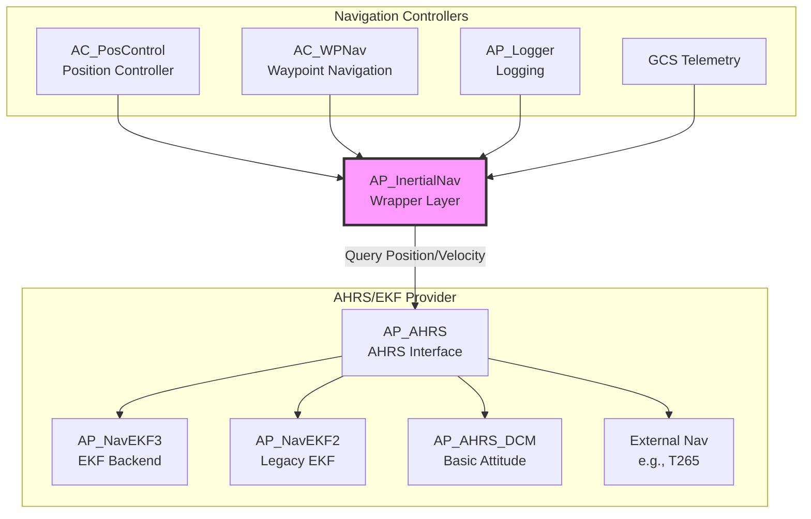
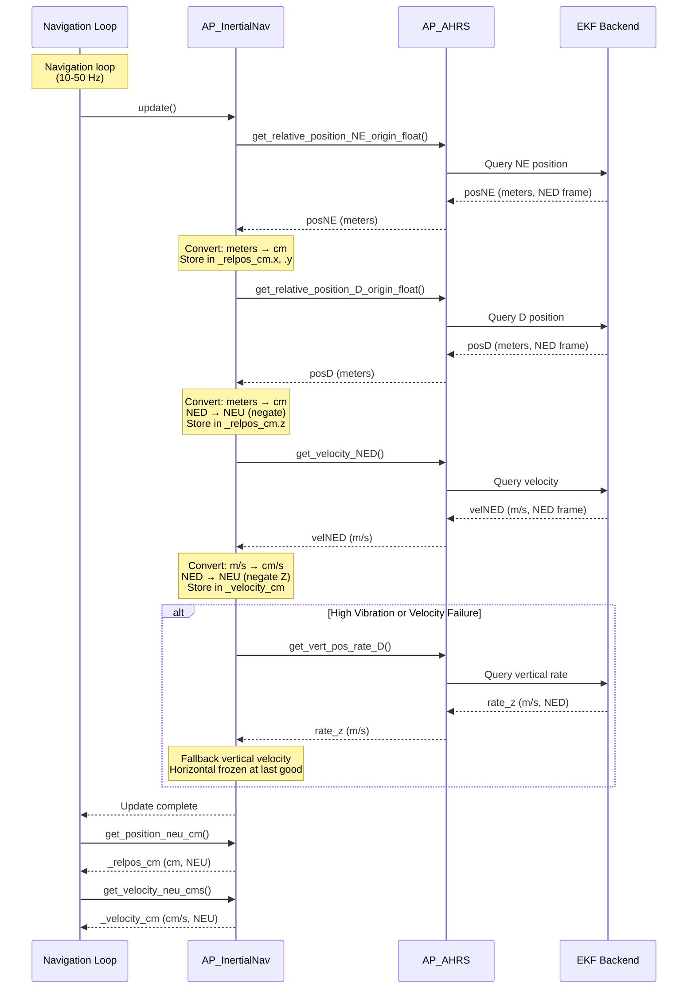

# AP_InertialNav

## Overview

AP_InertialNav is a lightweight wrapper providing normalized inertial navigation outputs (coordinate frames and units) from AHRS/EKF backends. It serves as the stable API layer for position and velocity queries used throughout ArduPilot, abstracting the underlying EKF implementation details and providing consistent NEU (North-East-Up) coordinate frame outputs in centimeters.

## Architecture



### Data Flow



## Key Components

### AP_InertialNav Class

- **Purpose**: Normalize AHRS/EKF position and velocity outputs for consistent consumption by navigation controllers
- **Lifecycle**: Constructor → update() calls at navigation rate → accessor queries
- **Thread Safety**: Uses AHRS semaphore protection internally (via AP_AHRS calls)
- **Hardware Dependencies**: None (pure software wrapper)
- **Memory Footprint**: 24 bytes (2× Vector3f: _relpos_cm and _velocity_cm)

**Key Responsibilities**:
1. Query position and velocity from AP_AHRS interface
2. Transform NED (North-East-Down) frame to NEU (North-East-Up) frame
3. Convert meters to centimeters and m/s to cm/s
4. Provide fallback vertical velocity during high vibration or EKF velocity failures
5. Expose const reference accessors for efficient querying

## Component Interactions

### Update Workflow

The `update()` method is called at navigation loop rate (typically 10-50 Hz) and performs the following operations:

1. **Query Horizontal Position (NE)**:
   - Calls `_ahrs_ekf.get_relative_position_NE_origin_float(posNE)`
   - Receives position in meters, NED frame
   - Converts to centimeters: `_relpos_cm.x = posNE.x * 100`
   - Stores in internal `_relpos_cm` vector

2. **Query Vertical Position (D)**:
   - Calls `_ahrs_ekf.get_relative_position_D_origin_float(posD)`
   - Receives Down position in meters, NED frame
   - Converts to Up position in centimeters: `_relpos_cm.z = -posD * 100`
   - Negation transforms NED to NEU (Down → Up positive)

3. **Query 3D Velocity**:
   - Calls `_ahrs_ekf.get_velocity_NED(velNED)`
   - Receives velocity in m/s, NED frame
   - Converts to cm/s: `_velocity_cm = velNED * 100`
   - Negates Z component: `_velocity_cm.z = -_velocity_cm.z` (NED → NEU)

4. **Fallback Vertical Velocity**:
   - Triggered if `high_vibes` parameter is true OR `get_velocity_NED()` fails
   - Calls `_ahrs_ekf.get_vert_pos_rate_D(rate_z)` for alternate vertical rate estimate
   - Converts and negates: `_velocity_cm.z = -rate_z * 100`
   - **Critical**: Horizontal velocity remains frozen at last good value on failure

5. **Accessor Queries**:
   - All get_* methods return const references to `_relpos_cm` or `_velocity_cm`
   - No computation in accessors—data prepared in update()
   - Efficient for high-frequency queries (no vector copies)

**Source**: libraries/AP_InertialNav/AP_InertialNav.cpp:14-46

## Usage Patterns

### Common Operations

#### Initialization

```cpp
#include <AP_InertialNav/AP_InertialNav.h>

// Constructor requires reference to AP_AHRS instance
AP_AHRS &ahrs = AP::ahrs();
AP_InertialNav inertial_nav(ahrs);
```

#### Regular Update (in main navigation loop)

```cpp
// Called at navigation loop rate (typically 10-50 Hz)
void Copter::update_navigation()
{
    // Normal update
    inertial_nav.update();
    
    // During high vibration events (disables horizontal velocity, uses fallback vertical)
    if (detect_high_vibration()) {
        inertial_nav.update(true);
    }
}
```

#### Position Queries

```cpp
// Get 3D position (NEU frame, centimeters)
const Vector3f& pos_neu_cm = inertial_nav.get_position_neu_cm();
float north_cm = pos_neu_cm.x;
float east_cm = pos_neu_cm.y;
float up_cm = pos_neu_cm.z;  // Positive altitude above origin

// Get horizontal position only (2D)
const Vector2f& pos_xy_cm = inertial_nav.get_position_xy_cm();

// Get vertical position (z-up convention)
float altitude_cm = inertial_nav.get_position_z_up_cm();
```

#### Velocity Queries

```cpp
// Get 3D velocity (NEU frame, cm/s)
const Vector3f& vel_neu_cms = inertial_nav.get_velocity_neu_cms();
float vel_north_cms = vel_neu_cms.x;
float vel_east_cms = vel_neu_cms.y;
float climb_rate_cms = vel_neu_cms.z;  // Positive climbing

// Get horizontal velocity only (2D)
const Vector2f& vel_xy_cms = inertial_nav.get_velocity_xy_cms();

// Get horizontal speed (magnitude)
float ground_speed_cms = inertial_nav.get_speed_xy_cms();

// Get vertical velocity (z-up convention)
float vertical_velocity_cms = inertial_nav.get_velocity_z_up_cms();
```

### Typical Usage in Position Controllers

```cpp
// Example from AC_PosControl position controller
void AC_PosControl::update_xy_controller()
{
    // Get current position and velocity from inertial nav
    const Vector3f& curr_pos_cm = inertial_nav.get_position_neu_cm();
    const Vector3f& curr_vel_cms = inertial_nav.get_velocity_neu_cms();
    
    // Calculate position error
    Vector3f pos_error_cm = target_pos_cm - curr_pos_cm;
    
    // Calculate velocity error
    Vector3f vel_error_cms = target_vel_cms - curr_vel_cms;
    
    // Feed to PID controllers...
}
```

## Integration Guide

### Using AP_InertialNav in Navigation Controllers

Typical integration pattern for position and velocity control:

1. **Initialization**: Construct AP_InertialNav once with reference to AP_AHRS singleton
2. **Main Loop**: Call `update()` in navigation loop before position controller execution
3. **Position Control**: Query position via `get_position_neu_cm()` for error calculation
4. **Velocity Control**: Query velocity via `get_velocity_neu_cms()` for damping and feed-forward
5. **Altitude Control**: Query vertical position/velocity separately via z-specific accessors

**Best Practices**:
- Always call `update()` before querying position/velocity within same loop iteration
- Check EKF health status via AP_AHRS interface, not through AP_InertialNav
- Use const references returned by accessors—avoid copying Vector3f
- For high-vibration scenarios (detected via IMU metrics), pass `true` to `update(high_vibes)`

### Coordinate Frame Transformations

Understanding coordinate frame conventions is critical for correct usage:

| Frame | Description | Usage in ArduPilot |
|-------|-------------|-------------------|
| **NED** | North-East-Down | AHRS/EKF internal representation, sensor fusion, GPS coordinates |
| **NEU** | North-East-Up | ArduPilot position controllers, altitude hold, navigation commands |

**Input from AHRS/EKF**: 
- Position: NED frame in **meters**
- Velocity: NED frame in **m/s**
- Vertical axis: **Down positive** (increasing D = descending)

**Output from AP_InertialNav**:
- Position: NEU frame in **centimeters**
- Velocity: NEU frame in **cm/s**
- Vertical axis: **Up positive** (increasing Z = climbing)

**Transformation Applied**:
```cpp
// Horizontal (North and East): Direct conversion with unit scaling
_relpos_cm.x = posNE.x * 100;  // North (meters → cm)
_relpos_cm.y = posNE.y * 100;  // East (meters → cm)

// Vertical: Negation for frame conversion + unit scaling
_relpos_cm.z = -posD * 100;    // Down → Up (meters → cm, NED → NEU)

// Velocity transformation (similar pattern)
_velocity_cm = velNED * 100;         // Scale to cm/s
_velocity_cm.z = -_velocity_cm.z;    // Negate Z (NED → NEU)
```

**Why NEU for Controllers**: 
- Positive altitude aligns with pilot intuition (up is positive)
- Simplifies climb rate logic (positive = climbing, negative = descending)
- Matches mission planner altitude conventions
- Historical ArduPilot convention from early altitude controllers

### Unit Conversions

AP_InertialNav standardizes all outputs to centimeter precision:

| Quantity | EKF Output | AP_InertialNav Output | Conversion Factor |
|----------|------------|----------------------|-------------------|
| Position | meters (m) | centimeters (cm) | ×100 |
| Velocity | meters/second (m/s) | centimeters/second (cm/s) | ×100 |

**Rationale for Centimeters**:
1. **Precision without floating-point issues**: Centimeter integer representation avoids sub-millimeter floating-point noise
2. **Legacy compatibility**: Early ArduPilot position controllers used centimeter integers
3. **Sufficient precision**: 1 cm resolution adequate for multicopter position control
4. **Avoids overflow**: int32_t cm representation supports ±21 km range (sufficient for typical missions)

**Usage Note**: Modern ArduPilot uses float internally, so cm units are a legacy convention maintained for API consistency. Controllers convert back to meters internally for physics calculations.

## Configuration Parameters

**Note**: AP_InertialNav has no configuration parameters of its own. It is a pure wrapper around AHRS/EKF outputs.

**Related Configuration**:
- **AP_AHRS parameters**: Control EKF selection, sensor fusion, and alignment
  - `AHRS_EKF_TYPE`: Select EKF backend (2=EKF2, 3=EKF3, 11=ExternalNav)
  - `AHRS_GPS_USE`: GPS usage for position estimation
  - See [AP_AHRS documentation](../AP_AHRS/README.md)

- **EKF2/EKF3 parameters**: Control state estimation, sensor fusion, and tuning
  - `EKF3_ENABLE`: Enable/disable EKF3
  - `EKF3_IMU_MASK`: Select IMUs for fusion
  - `EKF3_GPS_TYPE`: GPS aiding configuration
  - `EKF3_ALT_SOURCE`: Altitude source selection
  - See [AP_NavEKF3 documentation](../AP_NavEKF3/README.md)

**No Direct Tuning**: AP_InertialNav output quality depends entirely on AHRS/EKF configuration and sensor quality.

## Safety Considerations

### Critical Path

AP_InertialNav is in the **critical navigation path** for all flight modes requiring position or velocity feedback:

- **Position Hold (Loiter)**: Depends on accurate position for station-keeping
- **Altitude Hold**: Depends on accurate vertical position and velocity
- **Guided Mode**: GPS-guided flight relies on position accuracy
- **Auto Missions**: Waypoint navigation requires continuous position updates
- **RTL (Return to Launch)**: Position used for navigation back to home
- **Land Mode**: Vertical velocity used for descent rate control

**Impact of Failures**:
- **Position loss**: Vehicle may drift, fail to hold station, or deviate from waypoints
- **Velocity loss**: Reduced damping, potential oscillations, or overshoot
- **Stale data**: Controllers act on outdated information, leading to instability

### Failsafe Behavior

AP_InertialNav implements graceful degradation during sensor or EKF failures:

| Failure Mode | AP_InertialNav Behavior | Controller Impact |
|--------------|-------------------------|-------------------|
| **Normal operation** | Full 3D position and velocity from EKF | Optimal performance |
| **Velocity NED failure** | Horizontal velocity frozen at last good value; vertical from fallback | Reduced horizontal damping, vertical control maintained |
| **High vibration** | Switch to fallback vertical velocity (`get_vert_pos_rate_D`) | Protects against accelerometer noise in climb rate |
| **Complete EKF failure** | Position and velocity not updated (stale) | Controllers use outdated data—potential instability |

**Fallback Vertical Velocity**:
- Triggered by `high_vibes=true` parameter or `get_velocity_NED()` failure
- Uses `AP_AHRS::get_vert_pos_rate_D()` which may derive from:
  - Barometer rate of change (primary fallback)
  - Range finder rate of change (if available and in range)
  - GPS vertical velocity (if GPS healthy)
- **Why**: Accelerometer-derived vertical velocity unreliable during high vibration

**Horizontal Velocity Freeze**:
- On velocity failure, `_velocity_cm.x` and `_velocity_cm.y` retain last good values
- Prevents spurious horizontal accelerations from bad velocity estimates
- Allows position hold to maintain rough station-keeping even without fresh velocity

### Error Handling

**AP_InertialNav does NOT perform internal error detection**. It relies entirely on AHRS/EKF health status.

**Critical Limitation**: AP_InertialNav returns stale data if AHRS stops updating. It has no age checking or validity flags.

**Responsibility**: Consuming code (position controllers, flight modes) MUST:
1. Check EKF health via `AP_AHRS::healthy()` or `AP_AHRS::get_filter_status()`
2. Monitor EKF innovation levels via `AP_AHRS::get_variances()`
3. Implement mode-specific failsafes (e.g., switch to stabilize if position unhealthy)
4. Do NOT assume AP_InertialNav outputs are current or valid

**Example Health Check**:
```cpp
// Before using inertial nav outputs for critical control
if (!ahrs.healthy() || !ahrs.have_inertial_nav()) {
    // EKF unhealthy—switch to non-position mode
    set_mode(Mode::STABILIZE);
    return;
}

// Safe to use inertial nav outputs
const Vector3f& pos = inertial_nav.get_position_neu_cm();
```

### Testing Requirements

Safe testing procedures to validate AP_InertialNav integration:

1. **SITL Testing First**: Always test in Software-In-The-Loop before hardware
2. **EKF Health Monitoring**: Continuously monitor EKF status flags and innovation levels
3. **Position Consistency**: Compare inertial nav position with GPS coordinates
4. **Velocity Validation**: Check velocity against GPS ground speed and barometer climb rate
5. **Coordinate Frame Verification**: Ensure NEU vs NED convention correctly applied (positive altitude = climbing)
6. **High Vibration Simulation**: Test fallback behavior by inducing simulated vibration
7. **GPS Denial**: Test EKF degradation with GPS disabled (should fallback gracefully)

**Never**:
- Trust position outputs without checking EKF health
- Assume centimeter precision in real-world (GPS provides ~meter accuracy)
- Ignore large position jumps (indicates EKF reset or GPS glitch)

## Testing

### Unit Testing

**Current Status**: No dedicated unit tests for AP_InertialNav.

**Rationale**: AP_InertialNav is a thin wrapper with minimal logic. Testing focuses on integration with AHRS/EKF backends.

**Integration Testing**: Vehicle-level tests in `Tools/autotest/` validate position control using AP_InertialNav indirectly.

**Future**: Consider unit tests for:
- Coordinate frame transformation correctness (NED → NEU)
- Unit conversion accuracy (meters → centimeters)
- Fallback behavior during simulated failures

### SITL Testing

Software-In-The-Loop simulation provides comprehensive testing environment:

```bash
# Start SITL simulation for Copter
sim_vehicle.py -v Copter --console --map

# Enable detailed position logging
STABILIZE> param set LOG_DISARMED 1

# Arm and takeoff to test inertial nav in flight
STABILIZE> mode GUIDED
GUIDED> arm throttle
GUIDED> takeoff 10

# Monitor inertial nav outputs in console
# POS messages show inertial nav position
# Watch map for position accuracy

# Test position hold (uses inertial nav heavily)
GUIDED> mode LOITER
# Observe station-keeping performance

# Test GPS denial (EKF degradation scenario)
LOITER> param set SIM_GPS_DISABLE 1
# Monitor position drift without GPS updates
# Inertial nav continues outputting EKF dead-reckoning estimates

# Re-enable GPS and observe recovery
LOITER> param set SIM_GPS_DISABLE 0

# Test high vibration scenario
LOITER> param set SIM_VIB_MOT_MAX 100
# AP_InertialNav should switch to fallback vertical velocity
# Monitor log for vertical velocity source changes

# Land and disarm
LOITER> mode LAND
```

**Key Observations**:
- Position updates smooth and consistent in POS log messages
- No large position jumps during normal flight
- Graceful degradation during GPS denial
- Vertical velocity switches to fallback during high vibration

### Hardware Testing

Real-world validation on flight hardware:

1. **Bench Test with GPS Lock**:
   - Power up vehicle outdoors with clear sky view
   - Wait for GPS 3D fix and EKF origin set
   - Verify inertial nav reports position near (0, 0) initially
   - Move vehicle and observe position changes in ground station

2. **Flight Test in Stable Hover**:
   - Takeoff and hover in LOITER mode
   - Monitor position drift over 5-10 minutes
   - Acceptable drift: <2 meters in light wind
   - Excessive drift indicates EKF tuning issues or sensor problems

3. **Log Analysis Post-Flight**:
   - Download dataflash log
   - Analyze POS messages for position accuracy
   - Compare with GPS.Lat, GPS.Lng
   - Check for position jumps or discontinuities

4. **Vibration Testing**:
   - Review IMU.Vibe log messages
   - High vibration (>30 m/s/s) may trigger fallback vertical velocity
   - Verify smooth altitude hold despite vibration

### Log Analysis for Debugging

Use MAVExplorer or similar tools to analyze dataflash logs:

```bash
# Download log from vehicle
# Open in MAVExplorer

# Plot inertial nav position vs GPS position
graph POS.PN POS.PE GPS.Lat GPS.Lng

# Check for position drift over time
# POS.PN and POS.PE should track GPS closely

# Analyze velocity estimates
graph POS.VN POS.VE POS.VD

# Compare with GPS velocity
graph GPS.Spd GPS.GCrs

# Check for velocity discontinuities
# Sudden jumps indicate EKF issues or sensor glitches

# Monitor EKF health
graph EKF3.Flags

# Check innovation levels (should be low)
graph EKF3.IVN EKF3.IVE EKF3.IVD

# Correlate poor inertial nav performance with EKF health
# High innovations or status flags indicate EKF struggling
```

**Common Issues Detected via Logs**:
- **Position drift**: EKF tuning issues, poor GPS accuracy, magnetic interference
- **Velocity jumps**: Accelerometer calibration, vibration, EKF resets
- **Altitude wander**: Barometer drift, temperature changes, EKF vertical velocity issues
- **Coordinate frame errors**: NEU vs NED confusion (altitude sign flipped)

## Implementation Notes

### Design Decisions

**Why separate from AP_AHRS?**
- **Stable API**: Controllers query consistent NEU/cm interface regardless of EKF backend changes
- **Coordinate/Unit Normalization**: Single location for NED→NEU and m→cm conversions
- **Simplified Consumer Code**: Controllers don't need frame/unit conversion logic
- **Historical**: Predates current AHRS/EKF architecture; maintained for compatibility

**Why NEU frame?**
- **Controller Convention**: ArduPilot position controllers historically used NEU (up positive)
- **Pilot Intuition**: Positive altitude matches climbing (easier to understand)
- **Mission Planner**: Altitude commands are positive-up convention

**Why centimeters?**
- **Precision**: Centimeter resolution adequate for position control, avoids floating-point noise
- **Legacy Compatibility**: Early ArduPilot used integer centimeters for memory efficiency
- **API Consistency**: Maintained for backward compatibility despite modern float usage

**Why const reference returns?**
- **Efficiency**: Avoids Vector3f copies on every query
- **High Frequency**: Position queries occur at loop rate (400 Hz attitude, 50 Hz navigation)
- **Read-Only**: Consumers should not modify internal state

**Why frozen horizontal velocity on failure?**
- **Safety**: Prevents spurious horizontal commands from invalid velocity estimates
- **Position Hold**: Allows rough station-keeping even without fresh velocity updates
- **Stability**: Zero velocity change better than random/noisy velocity during EKF outages

### Trade-offs

**Simplicity vs Features**:
- **Chosen**: Minimal API, direct passthrough with conversions
- **Rejected**: Filtering, prediction, smoothing, validity flags
- **Rationale**: Complexity belongs in EKF; keep wrapper thin and fast

**Efficiency vs Safety**:
- **Chosen**: No internal validation, health checks, or age tracking
- **Rejected**: Stale data detection, automatic failsafe triggers
- **Rationale**: Controllers know context better; avoid duplicate health checks

**Flexibility vs Consistency**:
- **Chosen**: Fixed NEU frame, centimeter units—no configuration options
- **Rejected**: Configurable coordinate frames or unit systems
- **Rationale**: ArduPilot codebase assumes NEU/cm; configurability would complicate all consumers

### Performance Characteristics

| Metric | Value | Notes |
|--------|-------|-------|
| **CPU Usage** | Negligible (<0.1% at 50 Hz) | Simple arithmetic conversions only |
| **Memory** | 24 bytes | Two Vector3f (3 floats × 4 bytes × 2) |
| **Update Rate** | 10-50 Hz | Navigation loop rate (vehicle-specific) |
| **Latency** | <1 ms | Direct AHRS query + conversion |
| **Thread Safety** | Via AHRS semaphore | AP_AHRS handles locking internally |

**Optimization**: Returns const references avoid vector copies (12-byte copy per query eliminated).

**Scalability**: Zero impact from multiple consumers—shared read-only state.

### Known Limitations

1. **No Internal Health Monitoring**: 
   - Does not track EKF health or innovation levels
   - Does not detect stale data or failed updates
   - Consumers MUST check AP_AHRS health independently

2. **No Historical Buffering**: 
   - Only current position/velocity available
   - No access to previous states or time history
   - Cannot query position at specific past timestamp

3. **No Prediction or Extrapolation**: 
   - Returns most recent EKF output without prediction
   - No compensation for time delays or latency
   - Consumers must implement own prediction if needed

4. **Stale Data Risk**: 
   - If EKF stops updating, AP_InertialNav returns last received values
   - No age field or timestamp to detect staleness
   - Can lead to control instability if EKF fails silently

5. **No Coordinate Frame Configurability**: 
   - Hardcoded NEU output frame
   - If consumer needs NED, must negate Z externally
   - No support for body frame or other conventions

6. **Fallback Limitations**: 
   - Horizontal velocity frozen during failure (not zero, not predicted)
   - Fallback vertical velocity quality depends on barometer/rangefinder
   - No smooth transition between normal and fallback modes

### Accelerometer Integration

**Important**: Accelerometer integration occurs in the **EKF** (AP_NavEKF2/AP_NavEKF3), **not** in AP_InertialNav.

AP_InertialNav simply queries already-integrated position and velocity estimates from the EKF. The EKF performs:

1. **IMU Integration**: Integrate accelerometer and gyroscope measurements
2. **Sensor Fusion**: Fuse IMU with GPS, barometer, magnetometer, rangefinder, optical flow
3. **Bias Estimation**: Estimate and correct accelerometer and gyroscope biases
4. **State Prediction**: Predict position, velocity, attitude using IMU between GPS updates
5. **Measurement Updates**: Correct predictions when GPS or other sensors provide measurements

AP_InertialNav retrieves the final EKF state estimates (position and velocity) and transforms them to the NEU frame with centimeter units.

**For accelerometer integration details**, see:
- [AP_NavEKF3 documentation](../AP_NavEKF3/README.md) - Primary EKF implementation
- [AP_InertialSensor documentation](../AP_InertialSensor/README.md) - IMU data acquisition

**Source**: AP_InertialNav is a consumer of EKF outputs, not a contributor to state estimation.

### EKF Backend Integration

AP_InertialNav queries position and velocity through the **AP_AHRS** interface, which abstracts the underlying EKF backend:

| Backend | Description | Position Source | Velocity Source |
|---------|-------------|----------------|-----------------|
| **EKF3** | Primary 24-state Extended Kalman Filter | IMU + GPS + Baro + others | IMU integration + GPS |
| **EKF2** | Legacy single-core EKF | IMU + GPS + Baro | IMU integration + GPS |
| **DCM** | Basic attitude-only (no position) | Returns false (no position) | Returns false (no velocity) |
| **External** | External navigation (e.g., Intel T265) | External system | External system |
| **SIM** | SITL simulation (perfect nav) | Simulated truth | Simulated truth |

**Backend Selection**: Configured via `AHRS_EKF_TYPE` parameter (managed by AP_AHRS).

**AP_InertialNav Behavior**:
- Queries `AP_AHRS::get_relative_position_NE_origin_float()` and `get_relative_position_D_origin_float()`
- If queries return `false` (backend doesn't support position), `_relpos_cm` not updated (stale)
- Queries `AP_AHRS::get_velocity_NED()`
- If query returns `false` or `high_vibes=true`, uses fallback `get_vert_pos_rate_D()`

**Transparency**: AP_InertialNav consumers are unaware of backend selection—consistent API regardless of EKF choice.

**Source**: libraries/AP_InertialNav/AP_InertialNav.cpp:14-46

## References

- **Source files**: 
  - `libraries/AP_InertialNav/AP_InertialNav.h` - Class declaration and API
  - `libraries/AP_InertialNav/AP_InertialNav.cpp` - Implementation with frame/unit conversions

- **Related modules**: 
  - [AP_AHRS](../AP_AHRS/README.md) - AHRS interface and EKF backend selection
  - [AP_NavEKF3](../AP_NavEKF3/README.md) - Primary Extended Kalman Filter backend
  - [AP_NavEKF2](../AP_NavEKF2/README.md) - Legacy EKF backend
  - [AC_PosControl](../AC_PosControl/README.md) - Position controller (primary consumer)
  - [AC_WPNav](../AC_WPNav/README.md) - Waypoint navigation (primary consumer)

- **External documentation**: 
  - [ArduPilot Navigation Code Overview](https://ardupilot.org/dev/docs/apmcopter-code-overview.html#navigation-code)
  - [EKF Tuning Guide](https://ardupilot.org/copter/docs/common-tuning-filters-ekf.html)
  - [Coordinate Frames in ArduPilot](https://ardupilot.org/dev/docs/copter-adding-new-flight-mode.html#coordinate-frames)

**Source Analysis**: libraries/AP_InertialNav/AP_InertialNav.h:1-79, libraries/AP_InertialNav/AP_InertialNav.cpp:1-119
