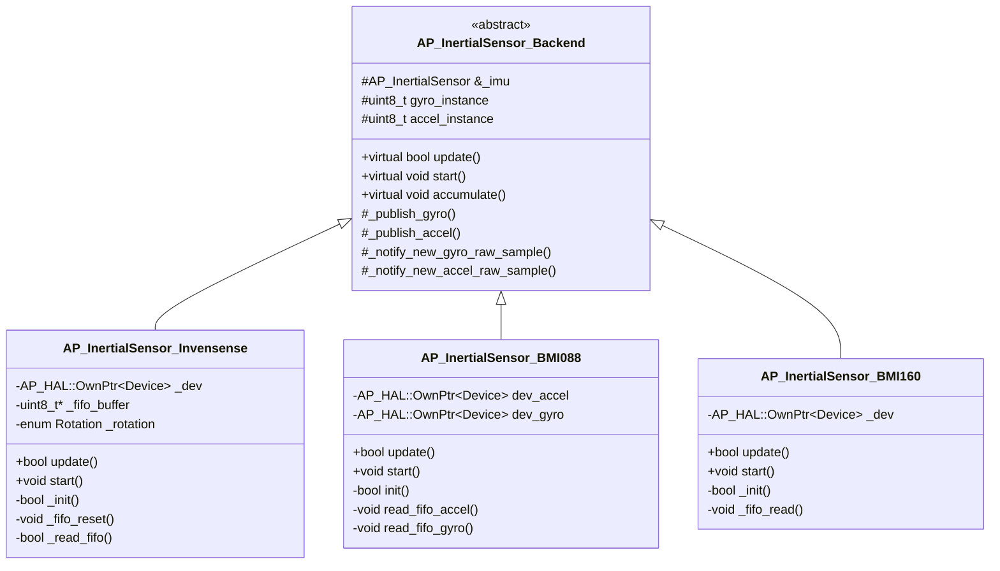
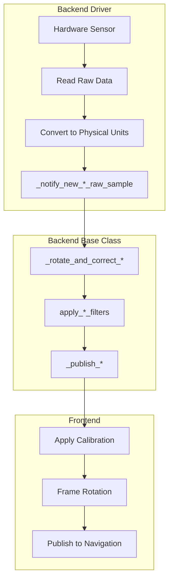
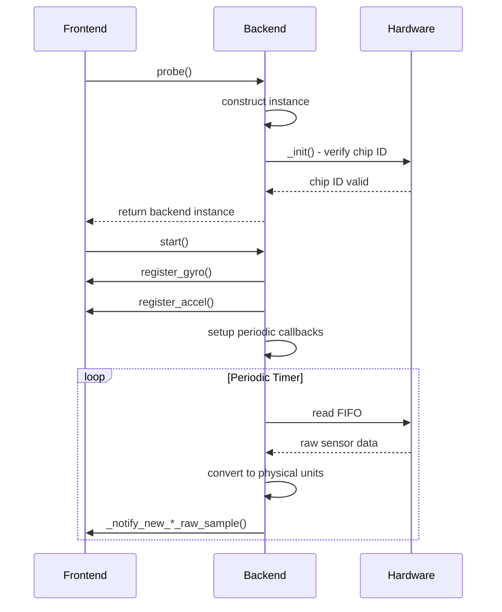

# AP_InertialSensor Driver Development Guide


## Table of Contents
- [Overview](#overview)
- [Driver Architecture](#driver-architecture)
- [Implementing a New Sensor Driver](#implementing-a-new-sensor-driver)
- [Backend Registration and Lifecycle](#backend-registration-and-lifecycle)
- [Sensor Probe and Detection Patterns](#sensor-probe-and-detection-patterns)
- [FIFO Management Strategies](#fifo-management-strategies)
- [Sample Rate Management](#sample-rate-management)
- [Error Handling and Recovery](#error-handling-and-recovery)
- [Example Implementations](#example-implementations)
- [Thread Safety and Timing](#thread-safety-and-timing)
- [Testing and Validation](#testing-and-validation)
- [Common Pitfalls and Debugging](#common-pitfalls-and-debugging)
- [Best Practices](#best-practices)

---

## Overview

This guide provides comprehensive information for developing new IMU sensor backends for the AP_InertialSensor library. The AP_InertialSensor system provides a unified interface for inertial measurement units (gyroscopes and accelerometers) across different vehicle types in ArduPilot.

**Purpose**: Enable developers to add support for new IMU sensors while maintaining consistency, performance, and safety standards.

**Target Audience**: Developers adding new IMU hardware support or optimizing existing drivers.

**Source Files**:
- `/libraries/AP_InertialSensor/AP_InertialSensor_Backend.h` - Base class interface
- `/libraries/AP_InertialSensor/AP_InertialSensor_Backend.cpp` - Core backend functionality
- `/libraries/AP_InertialSensor/AP_InertialSensor_Invensense.cpp` - FIFO-based reference implementation
- `/libraries/AP_InertialSensor/AP_InertialSensor_BMI088.cpp` - Dual-device implementation
- `/libraries/AP_InertialSensor/AP_InertialSensor_BMI160.cpp` - Combined sensor implementation

---

## Driver Architecture

### Backend Pattern

The AP_InertialSensor library uses a **backend pattern** where each sensor type implements a concrete class derived from `AP_InertialSensor_Backend`. This abstraction allows the frontend to work with multiple sensor types uniformly.



### Key Responsibilities

**Backend Driver Responsibilities**:
1. **Hardware Communication**: Manage I2C/SPI communication with the physical sensor
2. **Data Acquisition**: Read raw sensor data from registers or FIFO
3. **Data Conversion**: Convert raw register values to physical units
4. **Sample Timing**: Provide accurate timestamps for sensor samples
5. **Error Detection**: Detect and report communication errors, data validity issues
6. **Configuration**: Configure sensor operating modes, ranges, and filters

**Frontend Responsibilities** (handled by `AP_InertialSensor`):
1. **Instance Management**: Track multiple sensor instances
2. **Calibration**: Apply offsets, scaling, and temperature compensation
3. **Filtering**: Apply notch filters, low-pass filters
4. **Frame Rotation**: Convert sensor frame to body frame
5. **Health Monitoring**: Track error counts, select primary sensor
6. **Data Publishing**: Provide filtered data to navigation systems

### Data Flow Pipeline



**Critical Data Flow Functions**:

Source: `/libraries/AP_InertialSensor/AP_InertialSensor_Backend.h:189,203`

```cpp
// Notify backend of new gyro sample (backend calls this)
void _notify_new_gyro_raw_sample(uint8_t instance, const Vector3f &gyro, 
                                 uint64_t sample_us=0);

// Notify backend of new accel sample (backend calls this)
void _notify_new_accel_raw_sample(uint8_t instance, const Vector3f &accel, 
                                  uint64_t sample_us=0, bool fsync_set=false);
```

---

## Implementing a New Sensor Driver

### Step-by-Step Implementation Guide

#### Step 1: Create Driver Header File

Create a header file `AP_InertialSensor_YourSensor.h` in `/libraries/AP_InertialSensor/`:

```cpp
/**
 * @file AP_InertialSensor_YourSensor.h
 * @brief Driver for YourSensor IMU
 * 
 * @details This driver supports YourSensor series IMUs with
 *          I2C and SPI interfaces, including FIFO buffering.
 */
#pragma once

#include <AP_HAL/AP_HAL.h>
#include "AP_InertialSensor.h"
#include "AP_InertialSensor_Backend.h"

class AP_InertialSensor_YourSensor : public AP_InertialSensor_Backend
{
public:
    /**
     * @brief Constructor
     * @param imu Reference to main InertialSensor object
     * @param dev Hardware device interface (I2C or SPI)
     * @param rotation Sensor orientation relative to board
     */
    AP_InertialSensor_YourSensor(AP_InertialSensor &imu,
                                 AP_HAL::OwnPtr<AP_HAL::Device> dev,
                                 enum Rotation rotation);
    
    virtual ~AP_InertialSensor_YourSensor();

    /**
     * @brief Probe for sensor on I2C bus
     * @return Backend instance if found, nullptr otherwise
     */
    static AP_InertialSensor_Backend *probe(AP_InertialSensor &imu,
                                            AP_HAL::OwnPtr<AP_HAL::I2CDevice> dev,
                                            enum Rotation rotation);
    
    /**
     * @brief Probe for sensor on SPI bus  
     * @return Backend instance if found, nullptr otherwise
     */
    static AP_InertialSensor_Backend *probe(AP_InertialSensor &imu,
                                            AP_HAL::OwnPtr<AP_HAL::SPIDevice> dev,
                                            enum Rotation rotation);

    /**
     * @brief Update sensor data - called by frontend at loop rate
     * @return true if update successful
     * @note For FIFO sensors, typically returns true without reading
     */
    bool update() override;

    /**
     * @brief Start sensor operation - register instances and setup callbacks
     * @note Called once during system initialization
     */
    void start() override;

private:
    /**
     * @brief Initialize hardware and verify sensor ID
     * @return true if initialization successful
     */
    bool _init();
    
    /**
     * @brief Read and process FIFO data
     * @note Called from periodic timer callback
     */
    void _read_fifo();
    
    /**
     * @brief Reset FIFO to recover from errors
     * @param log_error Whether to log this reset
     */
    void _fifo_reset(bool log_error);
    
    /**
     * @brief Configure sensor registers for desired operating mode
     * @return true if configuration successful
     */
    bool _configure_sensor();

    // Device handle (I2C or SPI)
    AP_HAL::OwnPtr<AP_HAL::Device> _dev;
    
    // Sensor rotation relative to board
    enum Rotation _rotation;
    
    // FIFO buffer for bulk reads
    uint8_t *_fifo_buffer;
    
    // Conversion scales from raw to physical units
    float _accel_scale;
    float _gyro_scale;
    
    // Periodic callback handle for FIFO reads
    AP_HAL::Device::PeriodicHandle _periodic_handle;
};
```

#### Step 2: Implement Probe Functions

The probe function is the entry point for sensor detection. It attempts to communicate with the sensor and verify its identity.

**Source**: `/libraries/AP_InertialSensor/AP_InertialSensor_Invensense.cpp:105-125`

```cpp
AP_InertialSensor_Backend *AP_InertialSensor_YourSensor::probe(
    AP_InertialSensor &imu,
    AP_HAL::OwnPtr<AP_HAL::I2CDevice> dev,
    enum Rotation rotation)
{
    if (!dev) {
        return nullptr;
    }
    
    // Create sensor instance
    AP_InertialSensor_YourSensor *sensor =
        NEW_NOTHROW AP_InertialSensor_YourSensor(imu, std::move(dev), rotation);
    
    if (!sensor || !sensor->_init()) {
        delete sensor;
        return nullptr;
    }
    
    // Set unique device ID for this backend
    sensor->_id = HAL_INS_YOURSENSOR_I2C;
    
    return sensor;
}

AP_InertialSensor_Backend *AP_InertialSensor_YourSensor::probe(
    AP_InertialSensor &imu,
    AP_HAL::OwnPtr<AP_HAL::SPIDevice> dev,
    enum Rotation rotation)
{
    if (!dev) {
        return nullptr;
    }
    
    // Configure SPI read flag (typically bit 7)
    dev->set_read_flag(0x80);
    
    AP_InertialSensor_YourSensor *sensor =
        NEW_NOTHROW AP_InertialSensor_YourSensor(imu, std::move(dev), rotation);
    
    if (!sensor || !sensor->_init()) {
        delete sensor;
        return nullptr;
    }
    
    sensor->_id = HAL_INS_YOURSENSOR_SPI;
    
    return sensor;
}
```

#### Step 3: Implement Initialization

**Source**: `/libraries/AP_InertialSensor/AP_InertialSensor_Invensense.cpp:155-165`

```cpp
bool AP_InertialSensor_YourSensor::_init()
{
    // Acquire device semaphore for exclusive access
    WITH_SEMAPHORE(_dev->get_semaphore());
    
    // Start with low-speed communication for initialization
    _dev->set_speed(AP_HAL::Device::SPEED_LOW);
    
    // Read and verify chip ID
    uint8_t chip_id = 0;
    if (!_dev->read_registers(REG_CHIP_ID, &chip_id, 1)) {
        return false;
    }
    
    if (chip_id != EXPECTED_CHIP_ID) {
        // Wrong sensor or communication failure
        return false;
    }
    
    // Perform soft reset
    _dev->write_register(REG_SOFT_RESET, 0xB6);
    hal.scheduler->delay(50);  // Wait for reset to complete
    
    // Switch to high-speed communication
    _dev->set_speed(AP_HAL::Device::SPEED_HIGH);
    
    return true;
}
```

#### Step 4: Implement start() Method

The `start()` method is called once during system initialization to register sensor instances and setup periodic callbacks.

**Source**: `/libraries/AP_InertialSensor/AP_InertialSensor_Invensense.cpp:220-322`

```cpp
void AP_InertialSensor_YourSensor::start()
{
    WITH_SEMAPHORE(_dev->get_semaphore());
    
    // Define sensor sample rates (Hz)
    const uint16_t accel_rate_hz = 1000;
    const uint16_t gyro_rate_hz = 1000;
    
    // Register gyro and accel instances with the frontend
    // This allocates instance numbers and device IDs
    if (!_imu.register_gyro(gyro_instance, gyro_rate_hz, 
                           _dev->get_bus_id_devtype(DEVTYPE_INS_YOURSENSOR)) ||
        !_imu.register_accel(accel_instance, accel_rate_hz,
                            _dev->get_bus_id_devtype(DEVTYPE_INS_YOURSENSOR))) {
        return;
    }
    
    // Apply sensor rotation
    set_gyro_orientation(gyro_instance, _rotation);
    set_accel_orientation(accel_instance, _rotation);
    
    // Configure sensor operating mode
    if (!_configure_sensor()) {
        return;
    }
    
    // Allocate DMA-safe FIFO buffer
    _fifo_buffer = (uint8_t *)hal.util->malloc_type(FIFO_BUFFER_SIZE, 
                                                    AP_HAL::Util::MEM_DMA_SAFE);
    if (_fifo_buffer == nullptr) {
        return;
    }
    
    // Setup periodic callback to read FIFO
    // Callback rate should be faster than FIFO fill rate
    const uint32_t poll_period_us = 1000;  // 1ms = 1kHz
    _periodic_handle = _dev->register_periodic_callback(
        poll_period_us,
        FUNCTOR_BIND_MEMBER(&AP_InertialSensor_YourSensor::_read_fifo, void));
}
```

#### Step 5: Implement update() Method

For FIFO-based sensors, `update()` typically does minimal work since data processing happens in the periodic callback.

**Source**: `/libraries/AP_InertialSensor/AP_InertialSensor_Backend.h:54`

```cpp
bool AP_InertialSensor_YourSensor::update()
{
    // For FIFO sensors, actual work is done in _read_fifo callback
    // This just needs to return true to indicate sensor is alive
    return true;
}
```

---

## Backend Registration and Lifecycle

### Device Types and Identification

Each sensor backend must register with a unique device type identifier defined in `AP_InertialSensor_Backend.h`.

**Source**: `/libraries/AP_InertialSensor/AP_InertialSensor_Backend.h:118-155`

```cpp
enum DevTypes {
    DEVTYPE_BMI160       = 0x09,
    DEVTYPE_GYR_MPU6000  = 0x21,
    DEVTYPE_INS_ICM20789 = 0x27,
    DEVTYPE_INS_BMI088   = 0x2B,
    // ... add your sensor type here
};
```

> **Important**: If a driver change would invalidate existing calibration data, you **must** use a new device type ID. This ensures users are prompted to recalibrate.

### Registration Sequence

The registration process connects a backend instance to the frontend and allocates resources:

1. **Construct Backend**: `probe()` creates backend instance
2. **Initialize Hardware**: `_init()` verifies sensor communication
3. **Call start()**: Frontend calls `start()` during system init
4. **Register Instances**: Backend calls `register_gyro()` and `register_accel()`
5. **Setup Callbacks**: Backend registers periodic timer callbacks
6. **Begin Data Flow**: Callbacks start reading and publishing sensor data



### Instance Management

Each physical sensor registers separate gyro and accel instances with the frontend:

**Source**: `/libraries/AP_InertialSensor/AP_InertialSensor_Invensense.cpp:319-322`

```cpp
// Register instances and store instance numbers
if (!_imu.register_gyro(gyro_instance, 1000, _dev->get_bus_id_devtype(gdev)) ||
    !_imu.register_accel(accel_instance, 1000, _dev->get_bus_id_devtype(adev))) {
    return;  // Registration failed
}

// Instance numbers are now valid and can be used for publishing
set_gyro_orientation(gyro_instance, _rotation);
set_accel_orientation(accel_instance, _rotation);
```

---

## Sensor Probe and Detection Patterns

### Chip ID Verification

Most sensors have a read-only chip ID register that should be verified during initialization:

**Source**: `/libraries/AP_InertialSensor/AP_InertialSensor_BMI160.cpp:36-37`

```cpp
#define BMI160_REG_CHIPID 0x00
#define BMI160_CHIPID 0xD1

bool verify_chip_id() {
    uint8_t chip_id = 0;
    if (!_dev->read_registers(BMI160_REG_CHIPID, &chip_id, 1)) {
        return false;  // Communication failure
    }
    
    if (chip_id != BMI160_CHIPID) {
        return false;  // Wrong sensor
    }
    
    return true;  // Correct sensor found
}
```

### Soft Reset Sequence

Sensors should be reset to a known state during initialization:

**Source**: `/libraries/AP_InertialSensor/AP_InertialSensor_BMI160.cpp:60-64,69-75`

```cpp
#define BMI160_REG_CMD 0x7E
#define BMI160_CMD_SOFTRESET 0xB6
#define BMI160_POWERUP_DELAY_MSEC 10
#define BMI160_SOFTRESET_DELAY_MSEC 100

// Perform soft reset
_dev->write_register(BMI160_REG_CMD, BMI160_CMD_SOFTRESET);

// Wait for sensor to complete reset and stabilize
hal.scheduler->delay(BMI160_SOFTRESET_DELAY_MSEC);
```

> **Note**: Different sensors require different reset delay times. Consult the datasheet for appropriate timing.

### Power Mode Configuration

Many sensors support multiple power modes. Ensure sensor is in normal/active mode:

**Source**: `/libraries/AP_InertialSensor/AP_InertialSensor_BMI160.cpp:61-62,76-80`

```cpp
#define BMI160_CMD_ACCEL_NORMAL_POWER_MODE 0x11
#define BMI160_CMD_GYRO_NORMAL_POWER_MODE 0x15
#define BMI160_ACCEL_NORMAL_POWER_MODE_DELAY_MSEC 4
#define BMI160_GYRO_NORMAL_POWER_MODE_DELAY_MSEC 81

// Enable accelerometer
_dev->write_register(BMI160_REG_CMD, BMI160_CMD_ACCEL_NORMAL_POWER_MODE);
hal.scheduler->delay(BMI160_ACCEL_NORMAL_POWER_MODE_DELAY_MSEC);

// Enable gyroscope (longer delay required)
_dev->write_register(BMI160_REG_CMD, BMI160_CMD_GYRO_NORMAL_POWER_MODE);
hal.scheduler->delay(BMI160_GYRO_NORMAL_POWER_MODE_DELAY_MSEC);
```

### Range and Resolution Configuration

Configure sensor full-scale ranges based on application requirements:

**Source**: `/libraries/AP_InertialSensor/AP_InertialSensor_Invensense.cpp:340-368`

```cpp
// Gyro scale 2000°/s (provides best resolution for typical rates)
_register_write(MPUREG_GYRO_CONFIG, BITS_GYRO_FS_2000DPS, true);
hal.scheduler->delay(1);

// Accel scale 16g (provides good range for high-g maneuvers)
_register_write(MPUREG_ACCEL_CONFIG, 3<<3, true);
_accel_scale = GRAVITY_MSS / 2048.f;  // LSB per g
_gyro_scale = (radians(1) / 16.4f);   // LSB per deg/s

// Set clip limit for accelerometer saturation detection
_clip_limit = (16.0f - 0.5f) * GRAVITY_MSS;
```

**Range Selection Guidelines**:
- **Gyro**: 2000°/s is typical for most applications. Higher rates may need 4000°/s
- **Accel**: 16g minimum recommended. Use 24g or 32g for aggressive aerobatic flight

---

## FIFO Management Strategies

### Why Use FIFO?

FIFO (First-In-First-Out) buffers allow sensors to store multiple samples between reads, providing several advantages:

1. **Reduced CPU Load**: Bulk reads are more efficient than reading each sample individually
2. **Consistent Timing**: Hardware timestamps samples at precise intervals
3. **Reduced Sample Loss**: Buffering prevents data loss during temporary CPU load spikes
4. **Better Filtering**: More samples enable higher-quality digital filtering

### FIFO Configuration

**Source**: `/libraries/AP_InertialSensor/AP_InertialSensor_Invensense.cpp:187-199`

```cpp
void AP_InertialSensor_Invensense::_fifo_reset(bool log_error)
{
    // Get current user control register state
    uint8_t user_ctrl = _last_stat_user_ctrl;
    user_ctrl &= ~(BIT_USER_CTRL_FIFO_RESET | BIT_USER_CTRL_FIFO_EN);
    
    _dev->set_speed(AP_HAL::Device::SPEED_LOW);
    
    // Disable FIFO and sources
    _register_write(MPUREG_FIFO_EN, 0);
    _register_write(MPUREG_USER_CTRL, user_ctrl);
    
    // Reset FIFO  
    _register_write(MPUREG_USER_CTRL, user_ctrl | BIT_USER_CTRL_FIFO_RESET);
    
    // Re-enable FIFO
    _register_write(MPUREG_USER_CTRL, user_ctrl | BIT_USER_CTRL_FIFO_EN);
    
    // Enable gyro, accel, and temperature data in FIFO
    _register_write(MPUREG_FIFO_EN, BIT_XG_FIFO_EN | BIT_YG_FIFO_EN |
                    BIT_ZG_FIFO_EN | BIT_ACCEL_FIFO_EN | BIT_TEMP_FIFO_EN, true);
    
    hal.scheduler->delay_microseconds(1);
    _dev->set_speed(AP_HAL::Device::SPEED_HIGH);
    
    // Notify frontend to discard rate tracking
    notify_accel_fifo_reset(accel_instance);
    notify_gyro_fifo_reset(gyro_instance);
}
```

### FIFO Reading Pattern

**Source**: `/libraries/AP_InertialSensor/AP_InertialSensor_BMI088.cpp:101-117`

```cpp
void AP_InertialSensor_YourSensor::_read_fifo()
{
    // Read FIFO length register
    uint8_t fifo_len_regs[2];
    if (!_dev->read_registers(REG_FIFO_LENGTH, fifo_len_regs, 2)) {
        // Communication error - increment error counter
        _inc_gyro_error_count(gyro_instance);
        _inc_accel_error_count(accel_instance);
        return;
    }
    
    // Calculate number of bytes available
    uint16_t fifo_bytes = (fifo_len_regs[1] << 8) | fifo_len_regs[0];
    
    // Validate FIFO length
    if (fifo_bytes == 0) {
        return;  // No data available
    }
    
    if (fifo_bytes > MAX_FIFO_SIZE) {
        // FIFO overflow - reset and recover
        _fifo_reset(true);
        return;
    }
    
    // Read FIFO data in bulk
    if (!_dev->read_registers(REG_FIFO_DATA, _fifo_buffer, fifo_bytes)) {
        _inc_gyro_error_count(gyro_instance);
        _inc_accel_error_count(accel_instance);
        return;
    }
    
    // Parse and process samples from buffer
    _process_fifo_samples(_fifo_buffer, fifo_bytes);
}
```

### FIFO Sample Parsing

Each sensor has a specific FIFO frame format. Parse carefully to extract samples:

**Source**: `/libraries/AP_InertialSensor/AP_InertialSensor_Invensense.cpp:73,76`

```cpp
#define MPU_SAMPLE_SIZE 14  // bytes per FIFO frame
#define int16_val(v, idx) ((int16_t)(((uint16_t)v[2*idx] << 8) | v[2*idx+1]))

void _process_fifo_samples(uint8_t *buffer, uint16_t bytes)
{
    const uint16_t num_samples = bytes / MPU_SAMPLE_SIZE;
    
    for (uint16_t i = 0; i < num_samples; i++) {
        uint8_t *sample = &buffer[i * MPU_SAMPLE_SIZE];
        
        // Parse accelerometer (3 axes, 2 bytes each, big-endian)
        Vector3f accel(int16_val(sample, 0),   // X
                      int16_val(sample, 1),   // Y
                      int16_val(sample, 2));  // Z
        
        // Parse temperature (2 bytes)
        int16_t temp_raw = int16_val(sample, 3);
        float temperature = temp_zero + temp_raw * temp_sensitivity;
        
        // Parse gyroscope (3 axes, 2 bytes each)
        Vector3f gyro(int16_val(sample, 4),    // X
                     int16_val(sample, 5),    // Y
                     int16_val(sample, 6));   // Z
        
        // Convert to physical units
        accel *= _accel_scale;
        gyro *= _gyro_scale;
        
        // Publish to frontend (timestamp 0 for FIFO sensors)
        _notify_new_accel_raw_sample(accel_instance, accel, 0);
        _notify_new_gyro_raw_sample(gyro_instance, gyro, 0);
        
        // Temperature updates are less frequent
        if ((i % 10) == 0) {
            _publish_temperature(accel_instance, temperature);
        }
    }
}
```

### FIFO Error Recovery

Implement robust error recovery to handle FIFO overflows and communication errors:

**Source**: `/libraries/AP_InertialSensor/AP_InertialSensor_Invensense.cpp:167-203`

```cpp
void _handle_fifo_error()
{
    uint32_t now = AP_HAL::millis();
    
    // Track reset frequency for error detection
    if (now - last_reset_ms < 10000) {
        reset_count++;
        if (reset_count == 10) {
            // 10 resets within 10 seconds indicates serious problem
            INTERNAL_ERROR(AP_InternalError::error_t::imu_reset);
            reset_count = 0;
        }
    } else {
        // Reset counter if last reset was >10s ago
        reset_count = 1;
    }
    last_reset_ms = now;
    
    // Perform FIFO reset
    _fifo_reset(true);
}
```

---

## Sample Rate Management

### Raw Sample Rate vs Backend Rate

Understanding the distinction between raw sensor sample rate and backend polling rate is critical:

- **Raw Sample Rate**: Hardware sampling frequency (e.g., accelerometer samples at 1600 Hz)
- **Backend Rate**: How often driver reads FIFO (e.g., poll every 1 ms = 1000 Hz)  
- **Frontend Loop Rate**: Main loop frequency where data is consumed (typically 400 Hz)

**Source**: `/libraries/AP_InertialSensor/AP_InertialSensor_Backend.h:106-108`

```cpp
// Override this if backend polling rate differs from sample rate
virtual uint16_t get_gyro_backend_rate_hz() const {
    return _gyro_raw_sample_rate(gyro_instance);
}
```

### Setting Sample Rates

Configure and report sample rates during `start()`:

**Source**: `/libraries/AP_InertialSensor/AP_InertialSensor_Invensense.cpp:328-329`

```cpp
// Set backend's actual polling rates
_set_accel_raw_sample_rate(accel_instance, _accel_backend_rate_hz);
_set_gyro_raw_sample_rate(gyro_instance, _gyro_backend_rate_hz);
```

### Oversampling Configuration

If the backend performs oversampling (averaging multiple hardware samples), inform the frontend:

**Source**: `/libraries/AP_InertialSensor/AP_InertialSensor_Backend.cpp:46-56`

```cpp
// Set the amount of oversampling a gyro is doing
void _set_gyro_oversampling(uint8_t instance, uint8_t n)
{
    _imu._gyro_over_sampling[instance] = n;
}

// Set the amount of oversampling an accel is doing
void _set_accel_oversampling(uint8_t instance, uint8_t n)
{
    _imu._accel_over_sampling[instance] = n;
}
```

### Dynamic Sample Rate Tracking

For FIFO sensors, the frontend automatically tracks actual sample rate by measuring timing:

**Source**: `/libraries/AP_InertialSensor/AP_InertialSensor_Backend.cpp:67-102`

```cpp
/**
 * @brief Update observed sensor rate for FIFO sensors
 * 
 * @details FIFO sensors produce samples at a fixed rate, but the clock in the
 *          sensor may vary slightly from the system clock. This slowly adjusts
 *          the rate to the observed rate.
 * 
 * @param[in,out] count Sample counter
 * @param[in,out] start_us Timestamp of rate measurement start
 * @param[in,out] rate_hz Current estimated sample rate (updated)
 * 
 * @note Called automatically by _notify_new_*_raw_sample()
 */
void AP_InertialSensor_Backend::_update_sensor_rate(uint16_t &count, 
                                                    uint32_t &start_us, 
                                                    float &rate_hz) const
{
    uint32_t now = AP_HAL::micros();
    
    if (start_us == 0) {
        // Initialize tracking
        count = 0;
        start_us = now;
    } else {
        count++;
        
        // Update rate estimate every second
        if (now - start_us > 1000000UL) {
            float observed_rate_hz = count * 1.0e6f / (now - start_us);
            
            // Filter parameters depend on convergence state
            float filter_constant = 0.98f;
            float upper_limit = 1.05f;
            float lower_limit = 0.95f;
            
            if (sensors_converging()) {
                // Converge quickly for first 30s, then more slowly
                filter_constant = 0.8f;
                upper_limit = 2.0f;
                lower_limit = 0.5f;
            }
            
            // Clamp and filter observed rate
            observed_rate_hz = constrain_float(observed_rate_hz, 
                                              rate_hz * lower_limit, 
                                              rate_hz * upper_limit);
            rate_hz = filter_constant * rate_hz + 
                     (1 - filter_constant) * observed_rate_hz;
            
            // Reset for next measurement period
            count = 0;
            start_us = now;
        }
    }
}
```

---

## Error Handling and Recovery

### Communication Error Detection

Always check return values from hardware operations and increment error counters:

**Source**: `/libraries/AP_InertialSensor/AP_InertialSensor_Backend.h:272,275`

```cpp
// Increment accelerometer error count
void _inc_accel_error_count(uint8_t instance) __RAMFUNC__;

// Increment gyro error count  
void _inc_gyro_error_count(uint8_t instance) __RAMFUNC__;
```

Example usage:

```cpp
if (!_dev->read_registers(REG_DATA, buffer, length)) {
    // Read failed - increment error counters
    _inc_gyro_error_count(gyro_instance);
    _inc_accel_error_count(accel_instance);
    return false;
}
```

### Sensor Health Monitoring

The frontend tracks error counts and can disable unhealthy sensors or switch to backup sensors. Proper error reporting is critical for system reliability.

### Register Verification

Some sensors exhibit bugs where register values change unexpectedly. Implement register checking:

**Source**: `/libraries/AP_InertialSensor/AP_InertialSensor_Backend.h:357`

```cpp
// Log an unexpected change in a register for an IMU
void log_register_change(uint32_t bus_id, const AP_HAL::Device::checkreg &reg) __RAMFUNC__;
```

**Source**: `/libraries/AP_InertialSensor/AP_InertialSensor_Invensense.cpp:392-400`

```cpp
if (_enable_offset_checking) {
    /*
     * There is a bug in at least the ICM-20602 where the
     * MPUREG_ACC_OFF_Y_H changes at runtime, which adds an offset
     * on the Y accelerometer. To prevent this we read the factory
     * cal values of the sensor at startup and write them back as
     * checked register values. Then we rely on the register
     * checking code to detect the change and fix it.
     */
    // ... implementation
}
```

### Error Recovery Strategies

1. **FIFO Reset**: For FIFO overflow or parsing errors
2. **Sensor Reset**: For persistent communication failures
3. **Rate Limit Resets**: Avoid reset storms (track reset frequency)
4. **Internal Error Reporting**: Use `INTERNAL_ERROR()` for serious issues

---

## Example Implementations

### Example 1: Invensense MPU Family (FIFO-based, Single Device)

The Invensense driver demonstrates classic FIFO-based operation with a combined accel+gyro sensor on a single I2C or SPI bus.

**Key Features**:
- FIFO buffering for efficiency
- Support for multiple sensor variants (MPU6000, MPU9250, ICM20608, ICM20602, ICM20689)
- Temperature compensation
- Register checking for sensor bugs
- Fast FIFO reset for error recovery

**Source**: `/libraries/AP_InertialSensor/AP_InertialSensor_Invensense.cpp`

**Probe Pattern**:
```cpp
// Detect sensor variant by reading WHO_AM_I register
uint8_t whoami = _register_read(MPUREG_WHOAMI);
switch (whoami) {
    case MPU_WHOAMI_6000:
        _mpu_type = Invensense_MPU6000;
        break;
    case MPU_WHOAMI_MPU9250:
    case MPU_WHOAMI_MPU9255:
        _mpu_type = Invensense_MPU9250;
        break;
    case MPU_WHOAMI_20608:
        _mpu_type = Invensense_ICM20608;
        break;
    // ... more variants
}
```

**FIFO Configuration**:
```cpp
// Enable FIFO for gyro X/Y/Z, accel X/Y/Z, and temperature
_register_write(MPUREG_FIFO_EN, BIT_XG_FIFO_EN | BIT_YG_FIFO_EN |
                BIT_ZG_FIFO_EN | BIT_ACCEL_FIFO_EN | BIT_TEMP_FIFO_EN, true);
```

### Example 2: Bosch BMI088 (Dual Device, Separate Accel/Gyro)

The BMI088 is unique in having separate accelerometer and gyroscope devices with independent I2C/SPI buses.

**Key Features**:
- Separate device handles for accel and gyro
- Independent FIFO management
- Different sample rates (accel 1600 Hz, gyro 2000 Hz)
- Separate periodic callbacks

**Source**: `/libraries/AP_InertialSensor/AP_InertialSensor_BMI088.cpp`

**Dual-Device Setup**:
```cpp
AP_InertialSensor_BMI088::AP_InertialSensor_BMI088(
    AP_InertialSensor &imu,
    AP_HAL::OwnPtr<AP_HAL::Device> _dev_accel,  // Separate accel device
    AP_HAL::OwnPtr<AP_HAL::Device> _dev_gyro,   // Separate gyro device
    enum Rotation _rotation)
    : AP_InertialSensor_Backend(imu)
    , dev_accel(std::move(_dev_accel))
    , dev_gyro(std::move(_dev_gyro))
    , rotation(_rotation)
{
}
```

**Separate Callbacks**:
```cpp
void AP_InertialSensor_BMI088::start()
{
    // ... register instances ...
    
    // Setup separate callbacks at different rates
    accel_periodic_handle = dev_accel->register_periodic_callback(
        ACCEL_BACKEND_PERIOD_US,
        FUNCTOR_BIND_MEMBER(&AP_InertialSensor_BMI088::read_fifo_accel, void));
    
    gyro_periodic_handle = dev_gyro->register_periodic_callback(
        GYRO_BACKEND_PERIOD_US,
        FUNCTOR_BIND_MEMBER(&AP_InertialSensor_BMI088::read_fifo_gyro, void));
}
```

**SPI Read Quirk**:
```cpp
// BMI088 accelerometer requires discarding first byte on SPI reads
bool AP_InertialSensor_BMI088::read_accel_registers(uint8_t reg, 
                                                    uint8_t *data, 
                                                    uint8_t len)
{
    if (dev_accel->bus_type() != AP_HAL::Device::BUS_TYPE_SPI) {
        // I2C - normal read
        return dev_accel->read_registers(reg, data, len);
    }
    
    // SPI - need extra dummy byte
    uint8_t b[len+2];
    b[0] = reg | 0x80;
    memset(&b[1], 0, len+1);
    
    if (!dev_accel->transfer_fullduplex(b, len+2)) {
        return false;
    }
    
    memcpy(data, &b[2], len);  // Skip first returned byte
    return true;
}
```

### Example 3: Bosch BMI160 (Combined Sensor, High Integration)

The BMI160 demonstrates a highly integrated sensor with advanced FIFO features.

**Key Features**:
- Combined accel+gyro with interleaved FIFO
- Water mark interrupts for efficient FIFO reading
- 1600 Hz sample rate
- Low power modes

**Source**: `/libraries/AP_InertialSensor/AP_InertialSensor_BMI160.cpp`

**FIFO Frame Parsing**:
```cpp
struct PACKED RawData {
    struct {
        le16_t x;  // Little-endian 16-bit values
        le16_t y;
        le16_t z;
    } gyro;
    struct {
        le16_t x;
        le16_t y;
        le16_t z;
    } accel;
};

void _fifo_read()
{
    // Read FIFO length
    uint8_t len_buf[2];
    _dev->read_registers(BMI160_REG_FIFO_LENGTH, len_buf, 2);
    uint16_t fifo_count = len_buf[0] | (len_buf[1] << 8);
    
    // Read FIFO data
    uint8_t data[fifo_count];
    _dev->read_registers(BMI160_REG_FIFO_DATA, data, fifo_count);
    
    // Parse frames
    const uint16_t frame_size = sizeof(RawData);
    for (uint16_t i = 0; i + frame_size <= fifo_count; i += frame_size) {
        RawData *frame = (RawData *)&data[i];
        
        // Extract and convert (handles endianness)
        Vector3f accel(le16toh(frame->accel.x),
                      le16toh(frame->accel.y),
                      le16toh(frame->accel.z));
        
        Vector3f gyro(le16toh(frame->gyro.x),
                     le16toh(frame->gyro.y),
                     le16toh(frame->gyro.z));
        
        // Scale and publish
        accel *= _accel_scale;
        gyro *= _gyro_scale;
        
        _notify_new_accel_raw_sample(accel_instance, accel, 0);
        _notify_new_gyro_raw_sample(gyro_instance, gyro, 0);
    }
}
```

---

## Thread Safety and Timing

### Semaphore Usage

All hardware access must be protected by the device semaphore to prevent concurrent access:

**Source**: `/libraries/AP_InertialSensor/AP_InertialSensor_Backend.h:162`

```cpp
// Semaphore for access to shared frontend data
HAL_Semaphore _sem;
```

**Correct Pattern**:
```cpp
bool some_hardware_operation()
{
    // Acquire semaphore for exclusive access
    WITH_SEMAPHORE(_dev->get_semaphore());
    
    // Now safe to access hardware
    _dev->write_register(REG_CONFIG, value);
    uint8_t result;
    _dev->read_registers(REG_STATUS, &result, 1);
    
    return true;
    // Semaphore automatically released when scope exits
}
```

### Timing Constraints

IMU drivers operate under strict real-time constraints:

**Source**: `/libraries/AP_InertialSensor/AP_InertialSensor_BMI088.cpp:59-63`

```cpp
#define ACCEL_BACKEND_SAMPLE_RATE   1600
#define GYRO_BACKEND_SAMPLE_RATE    2000

const uint32_t ACCEL_BACKEND_PERIOD_US = 1000000UL / ACCEL_BACKEND_SAMPLE_RATE;
const uint32_t GYRO_BACKEND_PERIOD_US = 1000000UL / GYRO_BACKEND_SAMPLE_RATE;
```

**Guidelines**:
- FIFO read callbacks should complete in < 200 µs
- Minimize work in periodic callbacks
- Avoid memory allocation in time-critical paths
- Use DMA-safe buffers allocated at startup

### RAMFUNC Annotation

Time-critical functions should use `__RAMFUNC__` to ensure they execute from RAM instead of flash:

**Source**: `/libraries/AP_InertialSensor/AP_InertialSensor_Backend.h:173,177,189,203`

```cpp
void _rotate_and_correct_accel(uint8_t instance, Vector3f &accel) __RAMFUNC__;
void _publish_gyro(uint8_t instance, const Vector3f &gyro) __RAMFUNC__;
void _notify_new_gyro_raw_sample(uint8_t instance, const Vector3f &gyro, 
                                 uint64_t sample_us=0) __RAMFUNC__;
void _notify_new_accel_raw_sample(uint8_t instance, const Vector3f &accel, 
                                  uint64_t sample_us=0, bool fsync_set=false) __RAMFUNC__;
```

> **Note**: Only mark functions that are truly time-critical. Overuse can waste limited RAM resources.

---

## Testing and Validation

### Unit Testing

Create unit tests in `/libraries/AP_InertialSensor/tests/`:

```cpp
#include <AP_gtest.h>
#include "../AP_InertialSensor_YourSensor.h"

TEST(AP_InertialSensor_YourSensor, ScaleConversion)
{
    // Test raw value to physical unit conversion
    const float accel_scale = GRAVITY_MSS / 2048.0f;  // 16g range
    const int16_t raw_1g = 2048;
    
    float accel_mss = raw_1g * accel_scale;
    
    EXPECT_FLOAT_EQ(accel_mss, GRAVITY_MSS);
}

TEST(AP_InertialSensor_YourSensor, FIFOParsing)
{
    // Test FIFO frame parsing
    uint8_t fifo_data[14] = {
        0x00, 0x10,  // Accel X
        0x00, 0x20,  // Accel Y  
        0x00, 0x30,  // Accel Z
        0x00, 0x00,  // Temperature
        0x00, 0x40,  // Gyro X
        0x00, 0x50,  // Gyro Y
        0x00, 0x60,  // Gyro Z
    };
    
    // Parse and verify
    Vector3f accel, gyro;
    parse_fifo_frame(fifo_data, accel, gyro);
    
    EXPECT_EQ(int16_val(fifo_data, 0), 16);
    EXPECT_EQ(int16_val(fifo_data, 1), 32);
}
```

### SITL Testing

Test your driver in Software-In-The-Loop simulation:

```bash
# Build SITL with your new driver
./waf configure --board sitl
./waf copter

# Run with external sensor simulation
sim_vehicle.py -v ArduCopter --console --map --add-param-file=your_sensor.parm
```

### Hardware Testing

Validate on actual hardware:

```bash
# Build for target board
./waf configure --board your_board
./waf copter

# Flash to hardware
./waf copter --upload
```

**Validation Checklist**:
- [ ] Sensor detected and initialized successfully
- [ ] Sample rates match expected values (check `INS_LOG_BAT_MASK`)
- [ ] No FIFO overflow errors in normal operation
- [ ] Error counts remain near zero
- [ ] Vibration levels reasonable (< 30 m/s² typically)
- [ ] Temperature readings sensible
- [ ] Accel/gyro data responds correctly to movement
- [ ] No register change warnings (if using register checking)
- [ ] Passes pre-arm checks
- [ ] Stable flight performance

### Autotest Integration

Add test cases to `/Tools/autotest/arducopter.py`:

```python
def test_your_sensor(self):
    """Test YourSensor IMU driver"""
    self.context_push()
    
    # Set parameters to use your sensor
    self.set_parameters({
        'INS_USE': 1,
        'INS_USE2': 0,
        'INS_USE3': 0,
    })
    
    # Verify sensor is detected
    self.wait_statustext('IMU.*YourSensor', check_context=True, regex=True)
    
    # Verify healthy data
    self.wait_ready_to_arm()
    
    # Flight test
    self.takeoff(10)
    self.set_rc(2, 1600)  # Pitch forward
    self.delay_sim_time(5)
    self.set_rc(2, 1500)
    self.land_and_disarm()
    
    self.context_pop()
```

---

## Common Pitfalls and Debugging

### Pitfall 1: Incorrect Scale Factors

**Problem**: Sensor data appears scaled incorrectly (e.g., 1g reads as 2g).

**Solution**: Verify scale factor calculations match datasheet. Account for register configuration:

```cpp
// WRONG: Assuming 16g range but configured for 8g
_register_write(ACCEL_CONFIG, 0x02);  // Actually selects 8g
_accel_scale = GRAVITY_MSS / 2048.0f; // Scale for 16g - WRONG!

// CORRECT: Match scale to actual configuration
_register_write(ACCEL_CONFIG, 0x02);  // 8g range
_accel_scale = GRAVITY_MSS / 4096.0f; // Scale for 8g - CORRECT
```

### Pitfall 2: Endianness Issues

**Problem**: Sensor values are byte-swapped or incorrect.

**Solution**: Check whether sensor uses big-endian or little-endian format:

```cpp
// Big-endian (MSB first) - common in Invensense sensors
int16_t value = (data[0] << 8) | data[1];

// Little-endian (LSB first) - common in Bosch sensors  
int16_t value = data[0] | (data[1] << 8);
// OR use helper:
int16_t value = le16toh(*(le16_t*)data);  // Handles endianness portably
```

### Pitfall 3: FIFO Overflow Not Detected

**Problem**: Driver doesn't notice FIFO overflows, resulting in data corruption.

**Solution**: Always validate FIFO length and reset if suspicious:

```cpp
uint16_t fifo_bytes = read_fifo_length();

// Validate against known FIFO size
if (fifo_bytes > MAX_FIFO_SIZE) {
    // Overflow detected - reset FIFO
    _fifo_reset(true);
    return;
}

// Also check for unrealistic values
if (fifo_bytes % SAMPLE_SIZE != 0) {
    // Not a multiple of frame size - corrupted
    _fifo_reset(true);
    return;
}
```

### Pitfall 4: Missing Semaphore Protection

**Problem**: Intermittent communication failures or corrupted data.

**Solution**: Always use semaphore when accessing hardware:

```cpp
// WRONG: No semaphore
void read_sensor() {
    _dev->read_registers(REG_DATA, buffer, length);  // UNSAFE!
}

// CORRECT: Protected by semaphore
void read_sensor() {
    WITH_SEMAPHORE(_dev->get_semaphore());
    _dev->read_registers(REG_DATA, buffer, length);  // Safe
}
```

### Pitfall 5: Incorrect Sample Timing

**Problem**: Sample rate tracking shows incorrect frequency or high jitter.

**Solution**: Use correct timestamp parameter:

```cpp
// FIFO sensors: Use 0 for timestamp (frontend calculates from FIFO rate)
_notify_new_gyro_raw_sample(gyro_instance, gyro, 0);

// Non-FIFO sensors: Provide actual sample timestamp in microseconds
uint64_t now_us = AP_HAL::micros64();
_notify_new_gyro_raw_sample(gyro_instance, gyro, now_us);
```

### Pitfall 6: Memory Allocation in Callbacks

**Problem**: System crashes or performance issues during flight.

**Solution**: Allocate buffers during `start()`, not in periodic callbacks:

```cpp
// WRONG: Allocating in callback
void read_fifo() {
    uint8_t buffer[256];  // Stack allocation - risky if buffer is large
    uint8_t *heap_buf = new uint8_t[256];  // Heap allocation - FORBIDDEN in callback!
}

// CORRECT: Pre-allocate in start()
void start() {
    _fifo_buffer = (uint8_t *)hal.util->malloc_type(256, AP_HAL::Util::MEM_DMA_SAFE);
}

void read_fifo() {
    // Use pre-allocated buffer
    _dev->read_registers(REG_FIFO, _fifo_buffer, fifo_length);
}
```

### Debugging Tips

1. **Enable Debug Logging**: Use `debug()` macro for development builds:
```cpp
#define debug(fmt, args ...)  do {printf("YourSensor: " fmt "\n", ## args); } while(0)
```

2. **Monitor Error Counters**: Check error counts in telemetry or logs:
```bash
# In MAVProxy console:
param show INS*ERR*
```

3. **Enable Raw IMU Logging**: Capture raw sensor data for analysis:
```bash
param set INS_LOG_BAT_MASK 1  # Log IMU data
param set LOG_BITMASK 524288  # Enable IMU_RAW logging
```

4. **Check Register State**: For debugging sensor configuration issues:
```cpp
void dump_registers() {
    for (uint8_t reg = 0; reg < 128; reg++) {
        uint8_t value;
        _dev->read_registers(reg, &value, 1);
        printf("REG[0x%02X] = 0x%02X\n", reg, value);
    }
}
```

5. **Verify Device Detection**: Check boot messages for sensor detection:
```
IMU: Found YourSensor on SPI bus 1
INS: YourSensor: ID=0x3B devtype=0x45
```

---

## Best Practices

### 1. Follow Existing Patterns

Study and emulate successful existing drivers (Invensense, BMI088, BMI160). Consistency makes code more maintainable.

### 2. Comprehensive Error Handling

Always check return values and increment error counters. The frontend relies on accurate error reporting for sensor health monitoring.

### 3. Optimize for Performance

- Minimize work in periodic callbacks
- Use DMA-safe buffers for bulk transfers
- Batch register operations when possible
- Consider using `__RAMFUNC__` for time-critical functions

### 4. Document Sensor Quirks

Many sensors have undocumented behaviors or bugs. Document these in code comments:

**Source**: `/libraries/AP_InertialSensor/AP_InertialSensor_Invensense.cpp:250-254`

```cpp
// ICM20602 has a bug where sometimes the data gets a huge offset
// this seems to be fixed by doing a quick FIFO reset via USR_CTRL reg
_enable_fast_fifo_reset = true;
_enable_offset_checking = true;
```

### 5. Sensor-Specific Calibration

Some sensors benefit from sensor-specific calibration. Consider implementing:
- Temperature compensation tables
- Factory trim value preservation
- Sensor-specific scaling adjustments

### 6. Power Management

Ensure sensor is in correct power mode:
- Disable low-power modes during initialization
- Verify sensor is in normal/active mode before use
- Configure wake-up timing appropriately

### 7. Test on Multiple Boards

Validate your driver on different hardware platforms:
- Different autopilot boards (Pixhawk, Cube, etc.)
- I2C and SPI variants
- Different sensor revisions (if applicable)

### 8. Contribute Back

Submit your driver to ArduPilot mainline:
- Follow ArduPilot coding style guidelines
- Include comprehensive commit message
- Add hardware def (hwdef) entries for boards using your sensor
- Update documentation

---

## Conclusion

Implementing a robust IMU driver requires attention to detail, understanding of hardware behavior, and careful integration with the ArduPilot sensor framework. This guide provides the foundation, but always:

- **Read the sensor datasheet thoroughly**
- **Study existing driver implementations**
- **Test extensively before deployment**
- **Document unusual behaviors and workarounds**

For additional help:
- ArduPilot Discord: https://ardupilot.org/discord
- Developer forum: https://discuss.ardupilot.org/c/development-team
- GitHub issues: https://github.com/ArduPilot/ardupilot/issues

---

**Document Version**: 1.0  
**Last Updated**: 2024  
**Maintainer**: ArduPilot Development Team

