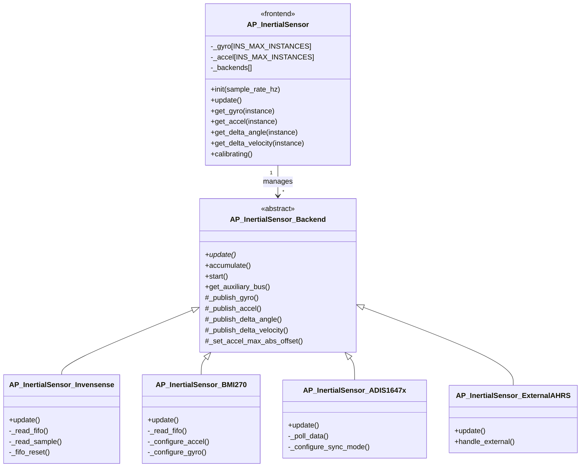
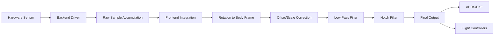

# AP_InertialSensor Library


## Table of Contents
- [Overview](#overview)
- [Architecture](#architecture)
- [Supported Sensors](#supported-sensors)
- [Calibration](#calibration)
- [Filtering and Sampling](#filtering-and-sampling)
- [Integration Guide](#integration-guide)
- [Configuration Parameters](#configuration-parameters)
- [Testing](#testing)
- [Performance Considerations](#performance-considerations)
- [Contributing](#contributing)

## Overview

The AP_InertialSensor library provides a unified interface for Inertial Measurement Unit (IMU) sensors across all ArduPilot vehicle types. It serves as the foundational sensor subsystem that delivers calibrated gyroscope and accelerometer data to the attitude estimation (AHRS) and Extended Kalman Filter (EKF) systems.

**Source Files**: `libraries/AP_InertialSensor/`

### Primary Responsibilities

- **Multi-Sensor Management**: Support for up to 3 independent IMU instances with automatic failover
- **Hardware Abstraction**: Backend driver architecture supporting 20+ sensor families
- **Real-Time Filtering**: Configurable low-pass and notch filters for vibration rejection
- **Sensor Calibration**: Automated gyroscope and accelerometer calibration procedures
- **Health Monitoring**: Continuous sensor health checks with consistency verification
- **Delta Angle/Velocity**: High-resolution delta angle and delta velocity integration
- **Vibration Analysis**: Real-time vibration level computation and clipping detection
- **Temperature Compensation**: Optional temperature calibration for drift compensation

### Key Features

- **Sample Rate Agnostic**: Handles sensors with varying sample rates (400Hz to 8kHz+)
- **Sensor Fusion**: Combines multiple IMUs for improved accuracy and reliability
- **Dynamic Notch Filtering**: FFT-based harmonic notch filters for propeller noise rejection
- **Batch Sampling**: High-rate logging support for flight dynamics analysis
- **Fast Sampling**: Optional oversampling for improved resolution on capable hardware
- **Position Offset Correction**: Compensates for IMU placement relative to vehicle CG

## Architecture

### System Design

The AP_InertialSensor library implements a frontend-backend architecture pattern where the frontend (AP_InertialSensor class) provides a consistent API to vehicle code, while backends (AP_InertialSensor_Backend subclasses) handle hardware-specific communication and data collection.

**Source**: `libraries/AP_InertialSensor/AP_InertialSensor.h:43-50`



### Data Flow Pipeline



### Backend Registration

Backends are automatically detected and registered during the `detect_backends()` phase at system initialization. Each backend driver probes for its specific hardware using SPI or I2C communication.

**Source**: `libraries/AP_InertialSensor/AP_InertialSensor.cpp:268`

The registration process:
1. Backend calls `register_gyro()` and `register_accel()` to obtain instance numbers
2. Frontend allocates instance slots (up to `INS_MAX_INSTANCES`)
3. Backend configures hardware and starts data collection
4. Backend publishes samples via `_publish_gyro()` and `_publish_accel()`

## Supported Sensors

### Invensense Family

**MPU6000/6500** - 6-axis IMU, SPI interface, 8kHz gyro sampling  
**Source**: `libraries/AP_InertialSensor/AP_InertialSensor_Invensense.cpp`
- Gyro Range: ±2000 deg/s
- Accel Range: ±16g
- FIFO: 1024 bytes
- Applications: Most autopilot boards (Pixhawk, Cube)

**MPU9250** - 9-axis IMU with integrated magnetometer  
**Source**: `libraries/AP_InertialSensor/AP_InertialSensor_Invensense.cpp`
- Gyro Range: ±2000 deg/s
- Accel Range: ±16g
- FIFO: 512 bytes
- Applications: Legacy autopilot boards

**ICM-20602/20608/20689** - Enhanced MPU successors  
**Source**: `libraries/AP_InertialSensor/AP_InertialSensor_Invensensev2.cpp`
- Gyro Range: ±2000 deg/s
- Accel Range: ±30g (20602: ±16g)
- Improved temperature stability
- Applications: Modern autopilots

**ICM-42688/42605/40605/40609** - Latest generation, ultra-low noise  
**Source**: `libraries/AP_InertialSensor/AP_InertialSensor_Invensensev3.cpp`
- Gyro Range: ±2000 deg/s
- Accel Range: ±16g
- Ultra-low gyro noise: 2.8 mdps/√Hz (42688)
- 2048 byte FIFO
- Applications: High-performance autopilots

**IIM-42652** - Automotive-grade 6-axis IMU  
**Source**: `libraries/AP_InertialSensor/AP_InertialSensor_Invensensev3.cpp`

### Bosch Family

**BMI055** - Separate gyro and accel chips for isolation  
**Source**: `libraries/AP_InertialSensor/AP_InertialSensor_BMI055.cpp`
- Gyro Range: ±2000 deg/s
- Accel Range: ±16g
- Separate gyro/accel reduces cross-talk
- Applications: CubePilot Orange, some H7 boards

**BMI088** - Enhanced BMI055 with improved performance  
**Source**: `libraries/AP_InertialSensor/AP_InertialSensor_BMI088.cpp`
- Gyro Range: ±2000 deg/s
- Accel Range: ±24g
- Better vibration rejection
- Applications: Modern autopilots requiring isolation

**BMI085** - Industrial-grade variant  
**Source**: `libraries/AP_InertialSensor/AP_InertialSensor_BMI088.cpp`
- Wider temperature range (-40 to +105°C)
- Applications: Industrial and automotive

**BMI160** - Integrated 6-axis IMU  
**Source**: `libraries/AP_InertialSensor/AP_InertialSensor_BMI160.cpp`
- Gyro Range: ±2000 deg/s
- Accel Range: ±16g
- 1024 byte FIFO
- Low power consumption

**BMI270** - AI-enhanced IMU with on-chip filtering  
**Source**: `libraries/AP_InertialSensor/AP_InertialSensor_BMI270.cpp`
- Gyro Range: ±2000 deg/s
- Accel Range: ±16g
- Integrated motion detection
- Advanced FIFO with compression
- Applications: Latest autopilot designs

### STMicroelectronics Family

**LSM9DS0** - 9-axis IMU (gyro, accel, mag)  
**Source**: `libraries/AP_InertialSensor/AP_InertialSensor_LSM9DS0.cpp`
- Legacy sensor, limited current use

**LSM9DS1** - Improved 9-axis IMU  
**Source**: `libraries/AP_InertialSensor/AP_InertialSensor_LSM9DS1.cpp`
- Gyro Range: ±2000 deg/s
- Accel Range: ±16g
- Applications: Some Pixhawk variants

### Analog Devices Family

**ADIS16470/ADIS16475/ADIS16477** - Tactical-grade MEMS IMU  
**Source**: `libraries/AP_InertialSensor/AP_InertialSensor_ADIS1647x.cpp`
- Gyro Range: ±2000 deg/s (16477: ±125 deg/s high precision)
- Accel Range: ±40g
- Factory-calibrated
- Exceptional bias stability: 0.5 deg/hr (16477)
- Integrated delta angle/velocity
- Applications: Professional UAVs, surveying, mapping

### Murata Family

**SCHA63T** - Automotive-grade dual-sensor IMU  
**Source**: `libraries/AP_InertialSensor/AP_InertialSensor_SCHA63T.cpp`
- Dual redundant sensors per axis
- Built-in self-diagnostics
- Gyro Range: ±125/±300 deg/s
- Accel Range: ±2g
- ASIL-D functional safety rating
- Applications: Safety-critical applications, commercial UAVs

### Special Backend Types

**SITL (Software In The Loop)** - Simulated sensor for testing  
**Source**: `libraries/AP_InertialSensor/AP_InertialSensor_SITL.cpp`
- Injects physics-based sensor data during simulation
- Configurable noise and bias

**External AHRS** - Receives IMU data from external attitude systems  
**Source**: `libraries/AP_InertialSensor/AP_InertialSensor_ExternalAHRS.cpp`
- Supports MicroStrain, VectorNav, Lord Microstrain protocols
- Pre-filtered sensor data

## Calibration

### Gyroscope Calibration

Gyroscope calibration removes the sensor bias offset when the vehicle is stationary. This is critical for accurate attitude estimation as gyro bias directly integrates into attitude error.

**Source**: `libraries/AP_InertialSensor/AP_InertialSensor.cpp:_init_gyro()`

#### Startup Calibration

Automatic gyroscope calibration runs at every boot unless disabled via `INS_GYR_CAL=0`.

**Procedure**:
1. Vehicle must remain completely stationary for 3 seconds
2. System collects 100+ samples per gyro axis
3. Average offset computed and stored in memory (not persistent)
4. Calibration fails if movement detected (variance > 0.5 deg/s)

**Source**: `libraries/AP_InertialSensor/AP_InertialSensor.cpp:_calibrate_gyro()`

> **Warning**: Gyroscope calibration must occur in a vibration-free environment. Calibrating on a moving surface (vehicle, boat) will introduce bias errors.

#### Manual Calibration

Gyroscope calibration can be triggered via GCS:
- MAVLink command: `MAV_CMD_PREFLIGHT_CALIBRATION` with param1=1
- Mission Planner: Initial Setup > Mandatory Hardware > Accel Calibration > Calibrate Gyros

```cpp
// Example: Triggering gyro calibration programmatically
// Source: libraries/AP_InertialSensor/AP_InertialSensor.cpp:calibrate_gyros()
AP_InertialSensor &ins = AP::ins();
if (ins.calibrate_gyros()) {
    gcs().send_text(MAV_SEVERITY_INFO, "Gyro calibration successful");
} else {
    gcs().send_text(MAV_SEVERITY_ERROR, "Gyro calibration failed - vehicle moving");
}
```

### Accelerometer Calibration

Accelerometer calibration corrects for scale factors and offsets across all three axes. Unlike gyros, accelerometers cannot calibrate to "zero" since they always measure gravity (9.81 m/s²).

**Source**: `libraries/AP_InertialSensor/AP_InertialSensor.cpp` + `libraries/AP_AccelCal/`

#### Simple Accelerometer Calibration

Six-position calibration using vehicle level and inverted positions.

**Procedure**:
1. Place vehicle level → capture +Z gravity
2. Place on left side → capture +Y gravity
3. Place on right side → capture -Y gravity
4. Place nose down → capture +X gravity
5. Place nose up → capture -X gravity
6. Place inverted → capture -Z gravity

Each position requires 4 seconds of stable data. The calibration algorithm (Gauss-Newton least squares) computes offsets and scale factors.

**Source**: `libraries/AP_AccelCal/` (Gauss-Newton algorithm)

> **Note**: Original implementation based on Rolfe Schmidt's calibration method:  
> http://chionophilous.wordpress.com/2011/10/24/accelerometer-calibration-iv-1-implementing-gauss-newton-on-an-atmega/

#### Accel Calibration via GCS

Initiated through Ground Control Station:
- Mission Planner: Initial Setup > Mandatory Hardware > Accel Calibration > Calibrate Accel
- QGroundControl: Vehicle Setup > Sensors > Accelerometer

The GCS guides the user through each position and provides real-time feedback.

### Temperature Calibration

Optional temperature compensation learns how sensor bias changes with temperature. This is particularly important for gyroscopes in applications with wide temperature swings.

**Source**: `libraries/AP_InertialSensor/AP_InertialSensor_tempcal.h`

**Enable**: Set `INS_TCAL_ENABLE=1` and perform flights across expected temperature range.

The system records bias vs temperature and fits polynomial corrections. Calibration data persists in parameters (`INS_TCN*` family).

## Filtering and Sampling

### Sample Rate Hierarchy

The INS library manages multiple sampling layers:

```
┌─────────────────────────────────────────────┐
│  Hardware Sample Rate (backend-specific)    │
│  ICM42688: 8kHz, BMI270: 6.4kHz, etc.      │
└──────────────────┬──────────────────────────┘
                   │
                   ▼
┌─────────────────────────────────────────────┐
│  Backend Sampling (with FIFO)               │
│  Accumulate samples, delta angle/velocity   │
└──────────────────┬──────────────────────────┘
                   │
                   ▼
┌─────────────────────────────────────────────┐
│  Frontend Update Rate                       │
│  Typically matches main loop: 400Hz         │
└──────────────────┬──────────────────────────┘
                   │
                   ▼
┌─────────────────────────────────────────────┐
│  Filtered Output to AHRS/EKF               │
└─────────────────────────────────────────────┘
```

### Low-Pass Filtering

Configurable 2nd-order low-pass filters remove high-frequency vibration noise before AHRS processing.

**Parameters**:
- `INS_GYRO_FILTER`: Gyro filter cutoff frequency (Hz) - Default: 20Hz for copters, 4Hz for rovers
- `INS_ACCEL_FILTER`: Accel filter cutoff frequency (Hz) - Default: 20Hz for copters, 10Hz for rovers

**Source**: `libraries/AP_InertialSensor/AP_InertialSensor.cpp` + `libraries/Filter/LowPassFilter.h`

> **Tuning Guidance**: Lower cutoff frequencies provide better noise rejection but increase phase lag. For copters, values of 15-30Hz balance noise rejection with control responsiveness. Planes can use lower values (10-20Hz).

### Harmonic Notch Filtering

Dynamic notch filters target propeller vibration harmonics that vary with throttle. This is especially critical for copters where propeller RPM creates narrow-band vibration peaks.

**Source**: `libraries/Filter/HarmonicNotchFilter.h`

**Configuration** (Example for quadcopter):
```
INS_HNTCH_ENABLE=1         # Enable harmonic notch
INS_HNTCH_MODE=1           # Throttle-based tracking
INS_HNTCH_FREQ=80          # Base frequency at hover throttle (Hz)
INS_HNTCH_REF=0.35         # Reference throttle (hover throttle)
INS_HNTCH_BW=40            # Bandwidth (Hz)
INS_HNTCH_HMNCS=3          # Track 1st and 2nd harmonics (binary: 0b11)
```

The notch filter automatically adjusts its center frequency based on current throttle:
```
notch_freq = INS_HNTCH_FREQ * sqrt(throttle / INS_HNTCH_REF)
```

**Source**: `libraries/AP_InertialSensor/AP_InertialSensor.cpp:setup_throttle_gyro_harmonic_notch()`

**Alternative Tracking Modes**:
- Mode 2: ESC telemetry-based (uses actual motor RPM)
- Mode 3: FFT-based (uses gyro FFT to detect vibration peaks)
- Mode 5: Throttle and RPM hybrid

> **Performance Note**: Harmonic notch filters on gyro data typically reduce vibration-induced attitude errors by 50-80% in multi-rotor applications.

### Fast Sampling

On capable hardware (STM32F7/H7), fast sampling mode enables backend oversampling for improved resolution and noise characteristics.

**Parameter**: `INS_FAST_SAMPLE=1`

**Source**: `libraries/AP_InertialSensor/AP_InertialSensor.cpp`

When enabled, backends sample at their maximum rate (e.g., 8kHz) and average down to the frontend rate (400Hz), effectively providing 20x oversampling. This reduces quantization noise and improves signal-to-noise ratio.

### Delta Angle and Delta Velocity

High-performance sensors (ADIS series) and fast-sampling backends provide integrated delta angle (gyro) and delta velocity (accel) over precise time intervals.

**Source**: `libraries/AP_InertialSensor/AP_InertialSensor.h:118-127`

**Advantages**:
- Eliminates sample timing jitter
- Improves integration accuracy for EKF
- Reduces computational load

```cpp
// Example: Retrieving delta angle
Vector3f delta_angle;
float delta_angle_dt;
if (ins.get_delta_angle(delta_angle, delta_angle_dt)) {
    // delta_angle is integrated gyro (radians) over delta_angle_dt (seconds)
    Vector3f angular_rate = delta_angle / delta_angle_dt;
}
```

**Source**: `libraries/AP_InertialSensor/AP_InertialSensor_Backend.cpp:_publish_delta_angle()`

## Integration Guide

### Basic Initialization

```cpp
// Source: libraries/AP_InertialSensor/examples/INS_generic/INS_generic.cpp:45
#include <AP_InertialSensor/AP_InertialSensor.h>

// Global instance
AP_InertialSensor ins;

void setup() {
    // Initialize IMU at 400Hz update rate
    ins.init(400);
    
    // Display detected sensors
    hal.console->printf("Accels detected: %u\n", ins.get_accel_count());
    hal.console->printf("Gyros detected: %u\n", ins.get_gyro_count());
}

void loop() {
    // Wait for new sample
    ins.wait_for_sample();
    
    // Update processed sensor data
    ins.update();
    
    // Read primary gyro (rad/s)
    const Vector3f &gyro = ins.get_gyro();
    
    // Read primary accelerometer (m/s²)
    const Vector3f &accel = ins.get_accel();
    
    // Process data...
}
```

### Multi-IMU Access

```cpp
// Access specific IMU instance
uint8_t imu_count = ins.get_gyro_count();
for (uint8_t i = 0; i < imu_count; i++) {
    if (ins.get_gyro_health(i)) {
        Vector3f gyro = ins.get_gyro(i);
        Vector3f accel = ins.get_accel(i);
        
        // Check for consistency with other IMUs
        // (ins.gyros_consistent() performs this internally)
    }
}

// Get first healthy IMU
uint8_t primary_gyro = ins.get_first_usable_gyro();
uint8_t primary_accel = ins.get_first_usable_accel();
```

**Source**: `libraries/AP_InertialSensor/AP_InertialSensor.h:137-153`

### Health Monitoring

```cpp
// Check overall health
if (!ins.healthy()) {
    gcs().send_text(MAV_SEVERITY_CRITICAL, "IMU FAILURE");
    // Trigger failsafe
}

// Check individual sensor health
if (!ins.get_gyro_health(0)) {
    // Primary gyro unhealthy, system should use backup
}

// Verify all gyros calibrated
if (!ins.gyro_calibrated_ok_all()) {
    // Prevent arming
}

// Check sensor consistency (detects sensor failures)
if (!ins.gyros_consistent(50)) {  // 50 = threshold in radians*100
    // Gyros disagree beyond acceptable threshold
}
```

**Source**: `libraries/AP_InertialSensor/AP_InertialSensor.h:137-153`

### Vibration Monitoring

```cpp
// Retrieve vibration levels (m/s²)
Vector3f vibe = ins.get_vibration_levels();

// Typical acceptable levels:
// - Multicopters: < 30 m/s²
// - Fixed wing: < 15 m/s²
// - Helicopters: < 60 m/s²

if (vibe.length() > 30.0f) {
    gcs().send_text(MAV_SEVERITY_WARNING, "High vibration: %.1f m/s²", vibe.length());
}

// Check for accelerometer clipping (saturation)
uint32_t clip_count = ins.get_accel_clip_count(0);
if (clip_count > 0) {
    // Accel saturated - severe vibration or impact
}
```

**Source**: `libraries/AP_InertialSensor/AP_InertialSensor.h:256-260`

### Vehicle Integration Pattern

Typical integration in ArduPilot vehicles (e.g., ArduCopter):

```cpp
// Source: ArduCopter/Copter.h (scheduler tasks)
const AP_Scheduler::Task Copter::scheduler_tasks[] = {
    SCHED_TASK(read_radio,              400,    75,   1),  // Read RC
    SCHED_TASK(fast_loop,               400,    75,   1),  // IMU update + attitude control
    SCHED_TASK(update_GPS,               50,   100,   2),  // GPS update
    // ...
};

void Copter::fast_loop() {
    // Update INS - this calls backend drivers and applies filtering
    ins.update();
    
    // Update attitude estimate
    ahrs.update();
    
    // Run attitude controllers
    attitude_control->update();
}
```

**Source**: ArduCopter main loop integration

## Configuration Parameters

### Primary Parameters

| Parameter | Description | Default | Range | Units |
|-----------|-------------|---------|-------|-------|
| `INS_GYRO_FILTER` | Gyro low-pass filter cutoff | 20 (copter), 4 (rover) | 0-256 | Hz |
| `INS_ACCEL_FILTER` | Accel low-pass filter cutoff | 20 (copter), 10 (rover) | 0-256 | Hz |
| `INS_GYR_CAL` | Gyro calibration on startup | 1 (enabled) | 0-1 | boolean |
| `INS_FAST_SAMPLE` | Enable fast sampling | 1 (F7/H7 boards) | 0-1 | boolean |
| `INS_USE` | Use first IMU for estimation | 1 | 0-1 | boolean |
| `INS_USE2` | Use second IMU for estimation | 1 | 0-1 | boolean |
| `INS_USE3` | Use third IMU for estimation | 1 | 0-1 | boolean |

**Source**: `libraries/AP_InertialSensor/AP_InertialSensor.cpp:var_info[]`

### Harmonic Notch Parameters

| Parameter | Description | Default | Range | Units |
|-----------|-------------|---------|-------|-------|
| `INS_HNTCH_ENABLE` | Enable harmonic notch filter | 0 | 0-1 | boolean |
| `INS_HNTCH_FREQ` | Center frequency at hover | 80 | 10-500 | Hz |
| `INS_HNTCH_BW` | Bandwidth | 40 | 5-250 | Hz |
| `INS_HNTCH_ATT` | Attenuation | 40 | 5-50 | dB |
| `INS_HNTCH_REF` | Reference throttle value | 0.35 | 0.1-0.9 | 0-1 |
| `INS_HNTCH_MODE` | Tracking mode | 1 | 0-5 | enum |
| `INS_HNTCH_HMNCS` | Harmonics bitmask | 3 | 0-255 | bitmask |

**Harmonic Bitmask** (`INS_HNTCH_HMNCS`):
- Bit 0 (1): Track 1st harmonic (base frequency)
- Bit 1 (2): Track 2nd harmonic (2x base)
- Bit 2 (4): Track 3rd harmonic (3x base)
- Bit 3 (8): Track 4th harmonic (4x base)

Common values:
- `3` = 1st and 2nd harmonics (most common)
- `7` = 1st, 2nd, 3rd harmonics (aggressive filtering)

### Per-Instance Parameters

Each IMU instance (1-3) has individual calibration parameters:

| Parameter | Description | Range | Units |
|-----------|-------------|-------|-------|
| `INS_ACCOFFS_X/Y/Z` | Accelerometer offsets | -3.5 to 3.5 | m/s² |
| `INS_ACCSCAL_X/Y/Z` | Accelerometer scale factors | 0.8 to 1.2 | ratio |
| `INS_ACC_ID` | Accelerometer device ID | - | - |
| `INS_GYR_ID` | Gyroscope device ID | - | - |
| `INS_POS_X/Y/Z` | IMU position offset from CG | -5 to 5 | meters |
| `INS_ACC_CALTEMP` | Calibration temperature | -300 to 200 | °C |
| `INS_GYR_CALTEMP` | Gyro calibration temperature | -300 to 200 | °C |

**Source**: `libraries/AP_InertialSensor/AP_InertialSensor_Params.cpp:var_info[]`

> **Note**: The `_2` and `_3` suffix variants exist for IMU instances 2 and 3 (e.g., `INS2_ACCOFFS_X`, `INS3_ACCOFFS_X`).

### Position Offset Importance

The `INS_POS_X/Y/Z` parameters compensate for IMU placement away from the vehicle's center of gravity. When the vehicle rotates, an IMU offset from CG experiences centripetal acceleration, which corrupts the navigation velocity estimate if not corrected.

**Correction Formula**:
```
accel_corrected = accel_measured - (angular_rate × (angular_rate × position_offset))
```

**Source**: EKF integration compensates using these offsets

## Testing

### Unit Tests

Limited unit tests exist for core integration functions:

```bash
# Build and run INS example
./waf configure --board sitl
./waf build --target examples/INS_generic
./build/sitl/examples/INS_generic
```

**Source**: `libraries/AP_InertialSensor/examples/INS_generic/`

### SITL Testing

Software-In-The-Loop simulation provides comprehensive IMU testing with physics-based sensor models:

```bash
# Launch SITL with default copter
sim_vehicle.py -v ArduCopter --console --map

# Enable IMU logging
param set LOG_BITMASK 524287

# Inject sensor failures for testing
param set SIM_IMU_COUNT 3         # Simulate 3 IMUs
param set SIM_ACC1_FAIL_TIME 60   # Fail first IMU after 60 seconds
param set SIM_GYR2_FAIL_TIME 120  # Fail second gyro after 120 seconds
```

**SITL IMU Parameters**:
- `SIM_ACC_RND`: Accelerometer noise (m/s²)
- `SIM_GYR_RND`: Gyro noise (rad/s)
- `SIM_ACC_BIAS`: Accelerometer bias drift
- `SIM_GYR_BIAS`: Gyro bias drift
- `SIM_DRIFT_SPEED`: Bias drift rate
- `SIM_DRIFT_TIME`: Correlation time for drift

**Source**: `libraries/AP_InertialSensor/AP_InertialSensor_SITL.cpp`

### Hardware Validation

#### Motor Test Vibration Check

```bash
# Connect via MAVProxy
module load graph

# Arm and set throttle to hover
arm throttle
rc 3 1500

# Graph vibration levels
graph INS.VibeX INS.VibeY INS.VibeZ

# Acceptable: < 30 m/s² for copters
```

#### In-Flight IMU Logging

Enable comprehensive IMU logging:

```
LOG_BITMASK = 524287   # Enable all logging
INS_LOG_BAT_MASK = 7   # Log all IMU instances in batch mode
INS_LOG_BAT_OPT = 4    # Post-flight download
```

Analyze logs with MAVExplorer:

```bash
mavexplorer.py flight.bin
graph IMU.GyrX IMU2.GyrX IMU3.GyrX  # Compare gyro axes
graph ACC1.AccX ACC2.AccX ACC3.AccX  # Compare accels
```

**Key Log Messages**:
- `IMU`: Filtered IMU data at loop rate
- `IMT`: IMU timing and sensor rates
- `IMU*`: Raw sensor data (if LOG_RAW enabled)
- `VIBE`: Vibration levels
- `IMT`: IMU timing information

**Source**: `libraries/AP_InertialSensor/AP_InertialSensor.cpp:Write_IMU()`

### Calibration Verification

After accelerometer calibration, verify results:

```cpp
// Expected results post-calibration
// When vehicle level, should read approximately:
// AccelX ≈ 0 m/s²
// AccelY ≈ 0 m/s²
// AccelZ ≈ -9.81 m/s² (NED frame, gravity points down)

Vector3f accel = ins.get_accel();
float gravity_error = fabsf(accel.z + GRAVITY_MSS);

if (gravity_error > 0.5f) {
    // Calibration suspect, should read ~9.81 m/s² on Z-axis when level
}
```

## Performance Considerations

### Computational Cost

**CPU Usage** (typical STM32H7 @480MHz):
- Backend sample collection: 5-10 µs per sample
- Frontend integration (400Hz): 15-25 µs
- Low-pass filtering: 8 µs per axis per filter
- Harmonic notch (2 harmonics): 25 µs per axis
- Total INS per loop iteration: ~150-200 µs

**Memory Usage**:
- Frontend state: ~2.5 KB per IMU instance
- Backend state: 1-3 KB per backend
- FIFO buffers: 512-2048 bytes per backend
- Batch sampling buffers: 16-64 KB (if enabled)

**Source**: Profiling data from typical H7 autopilots

### Real-Time Constraints

The INS update must complete within the main loop timeslice:
- 400Hz loop = 2.5ms per iteration
- INS budget: typically 200-300 µs (8-12% of loop)

> **Warning**: Enabling excessive notch filters (e.g., 4+ harmonics) or overly aggressive logging can cause main loop overruns, degrading attitude control performance.

### Sensor Selection Guidance

**For Racing/Acrobatic Copters**:
- Prefer Invensense ICM-42688 (ultra-low noise)
- Enable fast sampling (`INS_FAST_SAMPLE=1`)
- Use harmonic notch with RPM telemetry
- Minimize filter delays (`INS_GYRO_FILTER=25-40Hz`)

**For Survey/Mapping**:
- Consider ADIS16470/16477 (tactical-grade stability)
- Enable temperature calibration for long flights
- Conservative filtering acceptable (`INS_GYRO_FILTER=15-20Hz`)

**For Safety-Critical Commercial**:
- Use redundant IMUs (3x preferred)
- Select different sensor families (e.g., Invensense + Bosch BMI)
- Consider SCHA63T for automotive-grade reliability
- Enable all health monitoring and consistency checks

**For Cost-Sensitive Applications**:
- BMI270 offers good performance/cost ratio
- MPU6000 still viable for basic applications
- Prioritize vibration isolation over sensor quality

## Contributing

### Adding a New IMU Backend

1. **Create driver files**:
   ```
   libraries/AP_InertialSensor/AP_InertialSensor_NEWSENSOR.h
   libraries/AP_InertialSensor/AP_InertialSensor_NEWSENSOR.cpp
   ```

2. **Inherit from AP_InertialSensor_Backend**:
   ```cpp
   class AP_InertialSensor_NEWSENSOR : public AP_InertialSensor_Backend {
   public:
       AP_InertialSensor_NEWSENSOR(AP_InertialSensor &imu, AP_HAL::Device *dev);
       bool update() override;
       void start() override;
   private:
       void _read_sample();
       AP_HAL::Device *_dev;
   };
   ```

3. **Implement detection and probe**:
   ```cpp
   // In AP_InertialSensor.cpp:detect_backends()
   #if AP_INERTIALSENSOR_NEWSENSOR_ENABLED
       _add_backend(AP_InertialSensor_NEWSENSOR::probe(*this, hal.spi->get_device("newsensor")));
   #endif
   ```

4. **Register gyro and accel instances**:
   ```cpp
   bool AP_InertialSensor_NEWSENSOR::_init() {
       register_gyro(_gyro_instance, 1000, _dev->get_device_id());
       register_accel(_accel_instance, 1000, _dev->get_device_id());
   }
   ```

5. **Publish samples**:
   ```cpp
   void AP_InertialSensor_NEWSENSOR::_read_sample() {
       Vector3f gyro, accel;
       // ... read from hardware ...
       
       _publish_gyro(_gyro_instance, gyro);
       _publish_accel(_accel_instance, accel);
   }
   ```

6. **Add DevType enum**:
   ```cpp
   // In AP_InertialSensor_Backend.h
   enum DevTypes {
       // ...
       DEVTYPE_INS_NEWSENSOR = 0x40,
   };
   ```

**Source**: `libraries/AP_InertialSensor/AP_InertialSensor_Backend.h:118-150`

### Submitting Changes

- Follow ArduPilot coding standards (see `CONTRIBUTING.md`)
- Include SITL test results showing sensor detection and data flow
- Document sensor specifications and tuning recommendations
- Add hardware description to this README

---

**Maintainers**: ArduPilot Development Team  
**License**: GPLv3  
**Last Updated**: 2024

