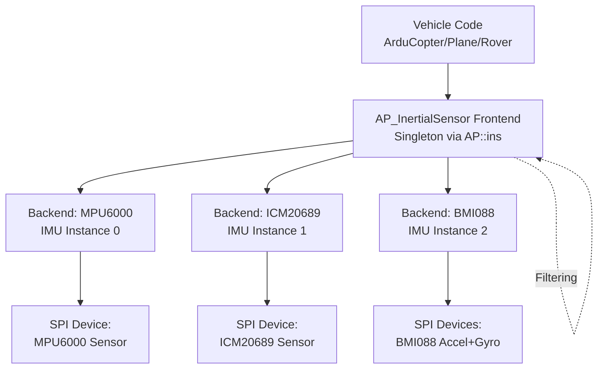
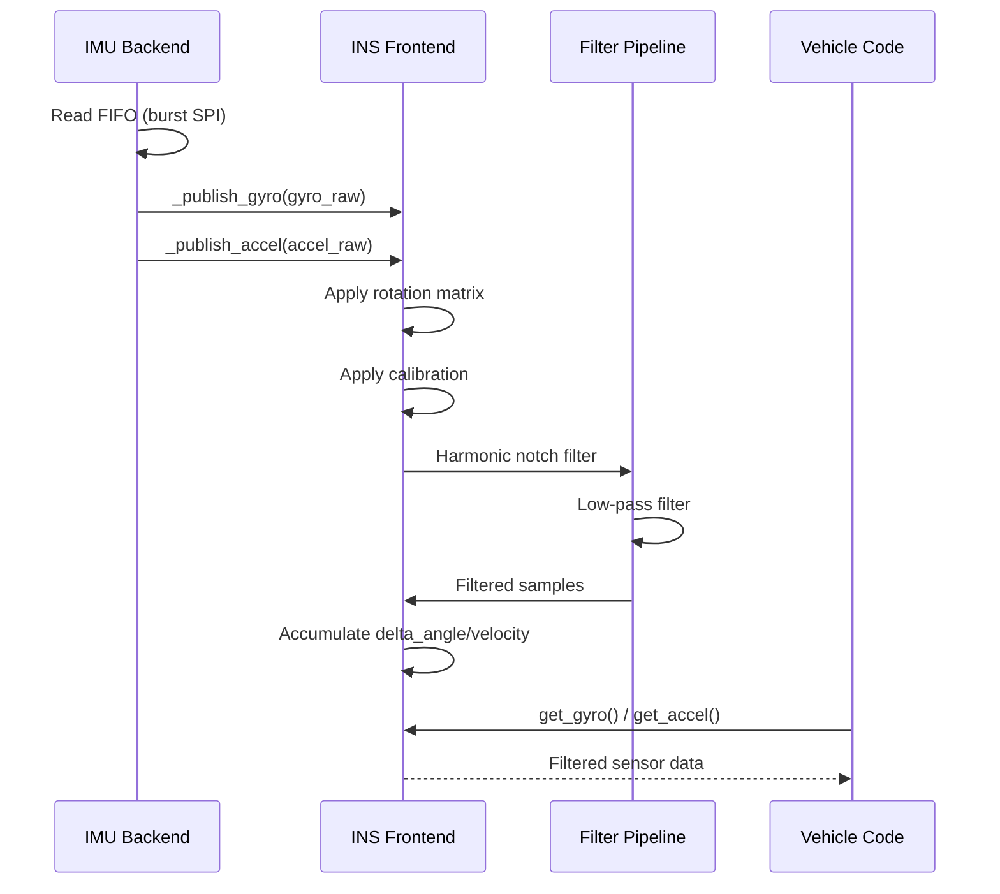

# AP_InertialSensor - Inertial Measurement Unit Subsystem

## Overview

The AP_InertialSensor library provides ArduPilot's central interface to gyroscopes and accelerometers (collectively called IMUs - Inertial Measurement Units). This subsystem manages sensor detection, initialization, calibration, data acquisition, filtering, and health monitoring for up to 3 independent IMU sensors simultaneously.

**Key Responsibilities:**
- Auto-detection and initialization of IMU hardware (MPU, ICM, BMI, ADIS series)
- Multi-IMU sensor fusion and redundancy management
- Gyroscope bias calibration and accelerometer 6-point calibration
- Advanced filtering: Harmonic notch filters for vibration rejection, configurable low-pass filters
- Delta angle and delta velocity accumulation for precise attitude estimation
- Health monitoring: Consistency checking, clipping detection, vibration metrics
- High-rate sample buffering for FFT-based dynamic notch filtering
- Binary logging for post-flight analysis

## Architecture

### System Overview



### Component Responsibilities

**Frontend (AP_InertialSensor class)**:
- **Singleton Management**: Accessed via `AP::ins()` throughout vehicle code
- **Backend Registration**: Backends register gyro/accel instances during probe
- **Data Aggregation**: Collects data from all backend instances
- **Sensor Selection**: Determines primary IMU based on health and consistency
- **Filtering Pipeline**: Applies notch filters and low-pass filters to all sensors
- **Calibration Storage**: Manages persistent calibration parameters via AP_Param
- **Health Monitoring**: Tracks per-sensor health flags and cross-checks consistency
- **Logging**: Generates IMU, IMT, VIBE log messages

**Backend (AP_InertialSensor_Backend subclasses)**:
- **Hardware Detection**: probe() static method scans I2C/SPI for sensor
- **Sensor Configuration**: Configures ODR, range, filters, FIFO
- **Data Acquisition**: Reads raw samples via FIFO burst or register polling
- **Data Publication**: Calls _publish_gyro/_publish_accel with raw measurements
- **Rotation Application**: Applies board rotation matrix to sensor data
- **Auxiliary Bus**: Exports I2C master for external sensors (magnetometer)

### Data Flow Sequence



## Driver Lifecycle: probe → detect → init → register_periodic_callback → update

All IMU backends follow a standard lifecycle:

### 1. Probe Phase (Static Factory)

```cpp
AP_InertialSensor_Backend *probe(AP_InertialSensor &imu, 
                                  AP_HAL::OwnPtr<AP_HAL::SPIDevice> dev,
                                  enum Rotation rotation);
```

**Purpose**: Detect sensor presence on specified bus
**Execution Context**: Main thread during AP_InertialSensor::init()
**Actions**:
- Attempt communication with sensor (read WHO_AM_I register)
- Verify chip ID matches expected value
- Return nullptr if sensor not present, backend instance if found

**Example (MPU6000)**:
```cpp
// Probe SPI device
uint8_t whoami = dev->read_register(MPUREG_WHOAMI);
if (whoami != MPU6000_WHOAMI && whoami != MPU6000_WHOAMI_MPU6050) {
    return nullptr;  // Not an MPU6000
}
// Create backend instance
return NEW_NOTHROW AP_InertialSensor_Invensense(imu, std::move(dev), rotation);
```

### 2. Detect Phase (Instance Registration)

Called immediately after backend construction:

```cpp
bool register_gyro(uint8_t &instance, uint16_t raw_sample_rate_hz, uint32_t id);
bool register_accel(uint8_t &instance, uint16_t raw_sample_rate_hz, uint32_t id);
```

**Purpose**: Allocate gyro/accel instance numbers with frontend
**Actions**:
- Frontend assigns next available instance number (0-2)
- Backend stores instance number for future _publish calls
- Frontend initializes data structures for this sensor

### 3. Init Phase (Sensor Configuration)

```cpp
virtual void start() = 0;
```

**Purpose**: Configure sensor hardware registers
**Execution Context**: Main thread after all backends probed
**Actions**:
- Reset sensor to known state
- Configure output data rate (ODR)
- Set measurement ranges (±2000 deg/s gyro, ±16g accel typical)
- Configure digital low-pass filter (DLPF)
- Enable FIFO if supported
- Set interrupt pin if used

**Example (ICM20689)**:
```cpp
void AP_InertialSensor_Invensensev2::start() {
    // Soft reset
    _dev->write_register(MPUREG_PWR_MGMT_1, BIT_H_RESET);
    hal.scheduler->delay(100);
    
    // Configure gyro: ±2000 deg/s, DLPF 41Hz
    _dev->write_register(MPUREG_GYRO_CONFIG, BITS_GYRO_FS_2000DPS);
    
    // Configure accel: ±16g, DLPF 42Hz  
    _dev->write_register(MPUREG_ACCEL_CONFIG, BITS_ACCEL_FS_16G);
    
    // Enable FIFO for gyro+accel+temp
    _dev->write_register(MPUREG_FIFO_EN, 
                        BIT_XG_FIFO_EN | BIT_YG_FIFO_EN | BIT_ZG_FIFO_EN |
                        BIT_ACCEL_FIFO_EN | BIT_TEMP_FIFO_EN);
}
```

### 4. Register Periodic Callback Phase

```cpp
dev->register_periodic_callback(period_usec, 
                                FUNCTOR_BIND_MEMBER(&Class::_poll_data, void));
```

**Purpose**: Schedule background sensor polling on I/O thread
**Period**: Typically 1000µs (1kHz) for fast sensors, 20000µs (50Hz) for slow
**Execution Context**: I/O thread (high priority, separate from main loop)
**Actions**:
- HAL scheduler calls callback at specified rate
- Callback reads sensor FIFO or registers
- Minimal processing to avoid blocking other I/O operations

**Example**:
```cpp
// Register 1kHz callback for sensor polling
_dev->register_periodic_callback(1000, 
    FUNCTOR_BIND_MEMBER(&AP_InertialSensor_BMI088::_poll_data, void));
```

### 5. Update Phase (Data Publication)

```cpp
virtual bool update() = 0;
```

**Purpose**: Process accumulated samples and publish to frontend
**Execution Context**: Main thread via AP_InertialSensor::periodic() at loop rate
**Frequency**: Vehicle loop rate (400Hz copter, 50Hz plane typical)
**Actions**:
- Transfer samples from I/O thread circular buffer to update
- Apply coning/sculling corrections
- Call _publish_gyro/_publish_accel for each sample
- Return true if new data published

**Example (Simplified)**:
```cpp
bool AP_InertialSensor_Invensense::update() {
    WITH_SEMAPHORE(_sem);  // Lock I/O thread buffer
    
    while (!_fifo_buffer.empty()) {
        FIFOData sample = _fifo_buffer.pop();
        
        Vector3f gyro(sample.gyro_x, sample.gyro_y, sample.gyro_z);
        Vector3f accel(sample.accel_x, sample.accel_y, sample.accel_z);
        
        // Publish to frontend (applies rotation, calibration, filtering)
        _publish_gyro(_gyro_instance, gyro);
        _publish_accel(_accel_instance, accel);
    }
    return true;
}
```

## Supported IMU Chips

### InvenSense/TDK Family (Most Common)

| Chip | Interface | Gyro Range | Accel Range | Sample Rate | Notes |
|------|-----------|------------|-------------|-------------|-------|
| **MPU6000** | SPI | ±2000°/s | ±16g | 1kHz | Most common in Pixhawk 1 |
| **MPU6050** | I2C | ±2000°/s | ±16g | 1kHz | I2C variant, higher latency |
| **MPU9250** | SPI/I2C | ±2000°/s | ±16g | 1kHz | Includes AK8963 magnetometer |
| **ICM-20602** | SPI | ±2000°/s | ±16g | 1kHz | Lower noise than MPU6000 |
| **ICM-20689** | SPI | ±2000°/s | ±16g | 1kHz | Pixhawk 4 primary IMU |
| **ICM-20948** | SPI/I2C | ±2000°/s | ±16g | 1.125kHz | 9-axis with AK09916 mag |
| **ICM-42688** | SPI | ±2000°/s | ±16g | Up to 32kHz | 20-bit high-res mode |
| **ICM-42605** | SPI | ±2000°/s | ±16g | Up to 12kHz | Latest generation |
| **IIM-42652** | SPI | ±2000°/s | ±16g | Up to 12kHz | Industrial grade |

### Bosch Family (Dual-Die Design)

| Chip | Interface | Gyro Range | Accel Range | Sample Rate | Notes |
|------|-----------|------------|-------------|-------------|-------|
| **BMI055** | SPI (2 CS) | ±2000°/s | ±16g | 2kHz/1.6kHz | Separate accel/gyro chips |
| **BMI088** | SPI (2 CS) | ±2000°/s | ±24g | 2kHz/1.6kHz | Automotive grade, better vibration immunity |
| **BMI160** | SPI/I2C | ±2000°/s | ±16g | 1.6kHz | Single chip, low power |
| **BMI270** | SPI | ±2000°/s | ±16g | 1.6kHz | AI features, config file upload |

### Analog Devices (Tactical Grade)

| Chip | Interface | Gyro Range | Accel Range | Sample Rate | Notes |
|------|-----------|------------|-------------|-------------|-------|
| **ADIS16470** | SPI | ±2000°/s | ±40g | 2kHz | Tactical MEMS, burst read |
| **ADIS16475** | SPI | ±2000°/s | ±40g | 2kHz | Enhanced specifications |
| **ADIS16477** | SPI | ±2000°/s | ±40g | 2kHz | Highest performance |

### Other Manufacturers

| Chip | Interface | Gyro Range | Accel Range | Sample Rate | Notes |
|------|-----------|------------|-------------|-------------|-------|
| **LSM9DS0** | I2C (2 addr) | ±2000°/s | ±16g | 760Hz | ST 9-DOF, legacy |
| **LSM9DS1** | SPI/I2C | ±2000°/s | ±16g | 952Hz | ST 9-DOF with FIFO |
| **SCHA63T** | SPI | ±125/±300°/s | ±4.5g | 1kHz | Murata automotive, dual-redundant |
| **L3G4200D** | I2C | ±2000°/s | N/A | 800Hz | ST gyro-only, Linux HAL |

## Sensor Fusion and Health Monitoring

### Multi-IMU Configuration

ArduPilot supports up to 3 independent IMUs simultaneously (INS_MAX_INSTANCES=3):

**Primary Use Selection**:
```cpp
uint8_t _first_usable_gyro;   // Index of primary gyro (0-2)
uint8_t _first_usable_accel;  // Index of primary accel (0-2)
```

**Selection Criteria** (in priority order):
1. INS_USE/INS_USE2/INS_USE3 parameters (user can disable specific IMUs)
2. Sensor health flags (unhealthy sensors excluded)
3. Consistency with other IMUs (outliers flagged)
4. Registration order (first registered is default primary)

### Health Monitoring

**Per-Sensor Health Flags**:
```cpp
bool get_gyro_health(uint8_t instance);   // Individual gyro health
bool get_accel_health(uint8_t instance);  // Individual accel health
bool get_gyro_health_all();               // All gyros healthy
bool get_accel_health_all();              // All accels healthy
```

**Health Failure Conditions**:
- Sensor not responding (I2C NAK, SPI no data)
- Consecutive sample failures (FIFO empty, register read timeout)
- Data stuck at same value (sensor frozen)
- Clipping detected (saturation at ±full scale)
- Temperature out of operating range

### Consistency Checking

**Gyro Consistency**:
```cpp
bool gyros_consistent(uint8_t threshold);  // threshold in mrad/s
```

Compares gyro readings across all healthy IMUs. Flags inconsistency if angular rate difference exceeds threshold (default 50 mrad/s = 2.86°/s).

**Accelerometer Consistency**:
```cpp
bool accels_consistent(float accel_error_threshold);  // threshold in m/s²
```

Compares accel magnitude across IMUs. Flags inconsistency if difference exceeds threshold (default 0.3 m/s²).

**Consistency Failures Indicate**:
- Sensor calibration error (offset/scale incorrect)
- Sensor malfunction or damage
- Extreme vibration affecting one sensor differently
- Temperature drift beyond compensation range

### Vibration Monitoring

```cpp
void Write_Vibration() const;  // Logs RMS vibration levels
```

**Tracked Metrics**:
- RMS acceleration per axis (m/s²) - indicates vibration severity
- Clipping count - number of samples at ±full scale (saturation)
- Average clipping percentage

**Vibration Thresholds**:
- <5 m/s² RMS: Excellent (minimal vibration)
- 5-15 m/s² RMS: Acceptable (minor filtering needed)
- 15-30 m/s² RMS: Marginal (notch filters essential)
- >30 m/s² RMS: Excessive (mechanical issues, likely clipping)

**Clipping Impact**:
- Clipped samples saturate at ±16g (or ±2000°/s)
- Information loss during clipping degrades attitude estimation
- Repeated clipping indicates insufficient anti-vibration mounting

## Calibration Procedures

### 1. Gyroscope Calibration

**When**: Automatically during init() if INS_GYR_CAL=1 (default)
**Duration**: 1-3 seconds
**Requirement**: Vehicle must be completely stationary

**Process**:
1. Collect 1 second of gyro samples (1000 samples at 1kHz)
2. Calculate mean of each axis (X, Y, Z)
3. Store as gyro offset: `_gyro_offset[instance] = mean_gyro`
4. Subtract offset from all subsequent gyro readings

**Manual Trigger**:
```cpp
void init_gyro();  // Re-calibrate gyros (vehicle must be still)
```

**Verification**:
- Gyro readings should be near zero when stationary (<0.01 rad/s typical)
- Check via MAVLink SCALED_IMU message or Mission Planner IMU graph

### 2. Accelerometer 6-Point Calibration

**When**: Via ground station (Mission Planner, QGroundControl)
**Duration**: 5-10 minutes
**Requirement**: User manually orients vehicle in 6 positions

**Positions** (Level = horizontal, perpendicular to gravity):
1. Level
2. Left side down
3. Right side down
4. Nose down
5. Nose up
6. On back (upside down)

**Process** (AP_AccelCal integration):
1. User initiates calibration via GCS command
2. For each position:
   - Hold vehicle steady for 2-4 seconds
   - System averages accelerometer readings
   - Confirm via GCS before moving to next position
3. After all 6 positions collected:
   - Gauss-Newton least-squares optimization calculates:
     - Offset: Zero-g bias per axis (m/s²)
     - Scale: Gain error correction per axis
     - Off-diagonal: Cross-axis coupling (advanced)
4. Offsets and scales stored in AP_Param:
   - INS_ACC{1,2,3}OFFS_X/Y/Z: Offset per axis
   - INS_ACC{1,2,3}SCAL_X/Y/Z: Scale factor per axis

**Applied Correction**:
```cpp
accel_corrected = (accel_raw - offset) * scale
```

**Verification**:
- In level position, Z-axis should read -9.81 m/s² (gravity down)
- X and Y axes should read ~0 m/s² when level
- Magnitude sqrt(X²+Y²+Z²) should equal 9.81 m/s² in all orientations

### 3. Temperature Calibration (Optional)

**Enabled**: `HAL_INS_TEMPERATURE_CAL_ENABLE` (compile-time flag)
**Purpose**: Compensate for temperature-dependent bias drift
**When**: Continuous learning during flight

**Algorithm**:
1. Record sensor measurements and temperature simultaneously
2. After collecting data across temperature range (e.g., 20°C to 60°C):
3. Fit 3rd-order polynomial: `offset(T) = c0 + c1*T + c2*T² + c3*T³`
4. Store polynomial coefficients in persistent storage
5. Apply temperature-dependent correction at runtime

**Applicability**:
- Most beneficial for gyroscopes (larger temperature drift)
- Less critical for accelerometers (smaller temperature coefficient)
- Important for tactical-grade IMUs (ADIS series)

## Filtering Architecture

### Filter Pipeline Sequence

```
Raw Sensor → Rotation → Calibration → Harmonic Notch → Low-Pass → Output
```

All filters applied by frontend automatically after backend publishes data.

### 1. Harmonic Notch Filter (Vibration Rejection)

**Purpose**: Reject propeller/motor vibration at fundamental frequency and harmonics
**Enabled**: INS_HNTCH_ENABLE=1
**Type**: Multiple cascaded notch filters (biquad IIR)

**Configuration Parameters**:
- **INS_HNTCH_FREQ**: Center frequency (Hz) - tracks throttle or ESC RPM
- **INS_HNTCH_BW**: Bandwidth (Hz) - notch width (default 20Hz)
- **INS_HNTCH_ATT**: Attenuation (dB) - depth of notch (default 40dB)
- **INS_HNTCH_HMNCS**: Harmonics bitmask (1=fundamental, 2=2x, 4=4x, etc.)
- **INS_HNTCH_REF**: Reference value for throttle-based tracking
- **INS_HNTCH_MODE**: Tracking mode (1=throttle, 2=RPM, 3=FFT)
- **INS_HNTCH_OPTS**: Options (per-motor notches, double-notch)

**Operating Modes**:

**Mode 1: Throttle-Based**
```
notch_freq = INS_HNTCH_FREQ * sqrt(throttle / INS_HNTCH_REF)
```
Assumes motor RPM proportional to sqrt(throttle). Simple but less accurate.

**Mode 2: ESC RPM Telemetry**
```
notch_freq = average_rpm / 60 * num_poles / 2
```
Uses ESC telemetry for actual motor RPM. Most accurate but requires BLHeli telemetry.

**Mode 3: FFT Dynamic Tracking**
Requires `HAL_GYROFFT_ENABLED`:
- Performs real-time FFT on gyro data (typically 400-1000Hz window)
- Identifies peak frequency in spectrum
- Adjusts notch filter center frequency dynamically
- Adapts to changing vibration frequencies

**Harmonics**:
Typical propeller vibration spectrum:
- Fundamental: Blade pass frequency (RPM * num_blades / 60)
- 2nd harmonic: 2× fundamental
- 3rd harmonic: 3× fundamental
- 4th harmonic: 4× fundamental (often strongest)

Example for 6000 RPM motor with 2-blade prop:
- Fundamental: 6000/60 * 2 = 200Hz
- Harmonics: 400Hz, 600Hz, 800Hz

**Multi-Motor Notches** (INS_HNTCH_OPTS bit 0):
Creates independent notch per motor for differential RPM tracking (e.g., X-configuration quad with 4 motors each at slightly different RPM).

**Filter Count**:
```
num_filters = num_motors * num_harmonics * (double_notch ? 2 : 1)
```

Typical quad with 4 harmonics (1,2,3,4) and double-notch: 4×4×2 = 32 filters per axis = 96 total filters.

### 2. Low-Pass Filter

**Gyro Filter**:
- **Parameter**: INS_GYRO_FILTER (Hz)
- **Default**: 40Hz (copter), 20Hz (plane)
- **Type**: 2nd-order Butterworth low-pass
- **Purpose**: Remove high-frequency noise above control bandwidth

**Accel Filter**:
- **Parameter**: INS_ACCEL_FILTER (Hz)
- **Default**: 20Hz (copter), 10Hz (plane)
- **Type**: 2nd-order Butterworth low-pass
- **Purpose**: Remove high-frequency noise and vibration

**Cutoff Frequency Selection**:
- **Too Low**: Adds phase lag, degrades control response, oscillations
- **Too High**: Passes noise into EKF, degrades attitude estimation
- **Rule of Thumb**: Set to 0.4-0.5× vehicle natural frequency

Example for 280mm racing quad (natural freq ~80Hz):
```
INS_GYRO_FILTER = 40Hz  (half of natural frequency)
```

**Phase Lag Impact**:
2nd-order Butterworth at cutoff frequency adds ~90° phase lag:
- 40Hz filter at 400Hz loop: 1/4 loop delay
- Critical for high-performance copters
- Planes less sensitive due to lower bandwidth

### 3. Downsampling Filter

Reduces sample rate from sensor native rate (1-2kHz) to vehicle loop rate (50-400Hz):
- Averaging window prevents aliasing
- Maintains nyquist criterion (sample > 2× signal bandwidth)

## Sample Rates and Scheduling

### Sample Rate Hierarchy

```
Sensor Native Rate (1-2kHz internal to IMU chip)
        ↓
Backend Polling Rate (1-2kHz periodic callback on I/O thread)
        ↓  
FIFO Accumulation (100-500 samples buffered)
        ↓
Frontend Update Rate (Vehicle loop rate: 50-400Hz main thread)
        ↓
Vehicle Loop Rate (Control/nav/GCS: 50-400Hz)
```

### Backend Scheduling (I/O Thread)

**Periodic Callback**:
```cpp
dev->register_periodic_callback(1000,  // 1ms = 1kHz
    FUNCTOR_BIND_MEMBER(&IMU::poll, void));
```

**Execution Context**:
- Runs on HAL I/O thread (separate from main loop)
- High priority (preempts lower-priority I/O)
- Must complete quickly (<100µs typical)

**Polling Actions**:
1. Check FIFO watermark or data-ready flag
2. Burst-read FIFO contents via SPI
3. Parse packets into gyro/accel samples
4. Store in circular buffer with semaphore protection
5. Return immediately (no heavy processing)

### Frontend Scheduling (Main Thread)

**Update Trigger**:
```cpp
void AP_InertialSensor::periodic() {
    // Called at vehicle loop rate (e.g., 400Hz for copter)
    for (auto backend : backends) {
        backend->update();  // Publish accumulated samples
    }
    update();  // Apply filtering, calculate delta angle/velocity
}
```

**Execution Context**:
- Main scheduler thread
- Called every loop iteration (2.5ms for 400Hz copter)
- More time available for computation (filtering, consistency checks)

**Update Actions**:
1. Lock I/O thread circular buffer (semaphore)
2. Transfer all accumulated samples since last update
3. Apply backend processing (rotation, initial filtering)
4. Call frontend update() which applies:
   - Harmonic notch filters
   - Low-pass filters
   - Downsampling to loop rate
   - Delta angle/velocity accumulation
5. Unlock buffer
6. Return control to main loop

### Fast Sample Window (FFT Support)

**Enabled**: `HAL_GYROFFT_ENABLED` (platforms with sufficient RAM)
**Purpose**: High-rate gyro samples for real-time frequency analysis

**Architecture**:
```cpp
FloatBuffer _gyro_window[INS_MAX_INSTANCES][3];  // Per-axis ring buffers
```

**Configuration**:
- **INS_FAST_SAMPLE**: Window size in samples (default 32, max 512)
- **Buffer Size**: window_size × 3 axes × sizeof(float) = 512×3×4 = 6KB per IMU

**Data Flow**:
1. Backend publishes raw gyro sample at full rate (1-2kHz)
2. Frontend stores copy in fast sample buffer before filtering
3. AP_GyroFFT reads buffer, performs FFT at configured rate (10-100Hz)
4. Identified peak frequencies fed to dynamic notch filter
5. Notch filter frequency updated in real-time

**Memory Trade-off**:
- Larger window: Better frequency resolution (freq_resolution = sample_rate / window_size)
- Smaller window: Less RAM, faster FFT computation
- Typical: 256 samples at 1kHz = 256ms window = 4Hz resolution

## Coordinate Frames and Units

### Coordinate Frame Convention

**Body Frame** (NED: North-East-Down):
```
     X (forward, nose)
     ↑
     |
     *----→ Y (right, starboard wing)
    /
   /
  ↓ Z (down, belly)
```

**All IMU data expressed in body frame**:
- Gyro X: Roll rate (rotation about longitudinal axis)
- Gyro Y: Pitch rate (rotation about lateral axis)
- Gyro Z: Yaw rate (rotation about vertical axis)
- Accel X: Forward/backward acceleration
- Accel Y: Left/right acceleration
- Accel Z: Up/down acceleration (gravity appears as -9.81 m/s² when level)

**Rotation Matrix Application**:
```cpp
Vector3f rotated = rotation_matrix * raw_sensor_data;
```

Rotation matrix accounts for:
- Physical sensor orientation on board (0°, 90°, 180°, 270° about Z)
- Sensor chip orientation relative to board PCB
- Vehicle-specific mounting (configured via AHRS_ORIENTATION parameter)

### Unit Conventions

**Gyroscope Units**:
- **Internal**: rad/s (radians per second)
- **Raw sensor**: Typically LSB with scale factor (e.g., 16.4 LSB per deg/s for MPU6000 ±2000°/s range)
- **Conversion**: `gyro_rad_s = raw_lsb / scale_factor * (π/180)`
- **get_gyro()**: Returns Vector3f in rad/s

**Accelerometer Units**:
- **Internal**: m/s² (meters per second squared)
- **Raw sensor**: Typically LSB with scale factor (e.g., 2048 LSB per g for MPU6000 ±16g range)
- **Conversion**: `accel_m_s2 = raw_lsb / scale_factor * 9.80665`
- **get_accel()**: Returns Vector3f in m/s²

**Delta Angle/Velocity Units**:
```cpp
bool get_delta_angle(uint8_t i, Vector3f &delta_angle, float &delta_angle_dt);
bool get_delta_velocity(uint8_t i, Vector3f &delta_velocity, float &delta_velocity_dt);
```
- **delta_angle**: Radians - integrated gyro over delta_angle_dt interval
- **delta_velocity**: m/s - integrated accel over delta_velocity_dt interval  
- **delta_time**: Seconds - integration period (typically 0.0025s for 400Hz loop)

**Temperature Units**:
```cpp
float get_temperature(uint8_t instance);
```
- **Returns**: Degrees Celsius (°C)
- **Typical range**: -40°C to +85°C operating, 25°C nominal

## Testing IMU Drivers

### Hardware Testing (Physical IMU)

**1. Initial Detection Test**:
```bash
# Build for target board
./waf configure --board=Pixhawk4
./waf copter

# Flash and monitor console output
# Should see "IMU: MPU6000 found on SPI bus 1"
```

**2. Raw IMU Data Verification**:

Via Mission Planner:
- Connect via MAVLink
- Ctrl+F → "MAVLink Inspector"
- Select SCALED_IMU message
- Verify gyro readings near zero when stationary
- Verify accel Z ≈ -1000 millig when level (≈ -9.81 m/s²)

Via MAVProxy:
```bash
mavproxy.py --master=/dev/ttyACM0
module load graph
graph SCALED_IMU.xgyro SCALED_IMU.ygyro SCALED_IMU.zgyro
```

**3. Vibration Check**:

Enable IMU logging (set LOG_BITMASK bit for IMU):
```
param set LOG_BITMASK 131071  # Enable all logging including IMU
```

Analyze post-flight log:
```bash
python Tools/autotest/logger_metadata/parse.py <logfile.bin>
# Check VIBE message: VibeX, VibeY, VibeZ (should be <10 m/s² RMS)
```

Or via Mission Planner:
- Load dataflash log
- Graph → VIBE.VibeX/Y/Z
- Check clipping: VIBE.Clip0/1/2 (should be <1% for healthy vehicle)

**4. Consistency Test (Multi-IMU)**:

```bash
# Enable all 3 IMUs
param set INS_USE 1
param set INS_USE2 1  
param set INS_USE3 1

# Check consistency in flight log
# IMU.GyrX should match IMU2.GyrX within ~0.05 rad/s
# IMU.AccX should match IMU2.AccX within ~0.3 m/s²
```

**5. Temperature Calibration Validation**:

Heat/cool board through temperature range while logging:
```
param set INS_TCAL_ENABLE 1  # Enable temp cal learning
# Operate through temperature range (20°C to 60°C)
# Check learned coefficients: INS_TCAL{1,2,3}_*
```

### SITL Testing (Simulated IMU)

**1. Basic SITL Startup**:
```bash
cd ~/ardupilot
Tools/autotest/sim_vehicle.py -v ArduCopter --console --map
# Should see "SITL IMU: using sensor configuration"
```

**2. View Simulated IMU Data**:
```bash
# In MAVProxy console
watch SCALED_IMU
# or
graph SCALED_IMU.xgyro SCALED_IMU.ygyro SCALED_IMU.zgyro
```

**3. Inject Sensor Faults** (via SITL parameters):
```bash
# Add gyro noise
param set SIM_GYR_RND 0.1  # 0.1 rad/s noise

# Add accel vibration
param set SIM_ACC_RND 0.5  # 0.5 m/s² vibration

# Simulate sensor failure
param set SIM_IMUT1_DISABLE 1  # Disable IMU 1

# Add bias
param set SIM_GYR_BIAS_X 0.05  # 0.05 rad/s bias on X axis
```

**4. Automated Test Suite**:
```bash
# Run IMU-specific autotests
cd Tools/autotest
python autotest.py build.Copter test.Copter.INS
```

Tests validate:
- IMU detection and initialization
- Gyro calibration accuracy
- Accel calibration accuracy
- Multi-IMU consistency
- Filter performance
- Temperature compensation

**5. Replay Log in SITL**:
```bash
# Test specific scenario from real flight
python Tools/Replay/Replay.py <logfile.bin>
# Replays IMU data through EKF for algorithm development
```

### Common Testing Scenarios

**Scenario 1: Verify New IMU Driver**
```bash
# 1. Probe detection
# Console should show "IMU: <ChipName> found on SPI/I2C"

# 2. Sample rate verification  
# Enable IMU_FAST logging
param set LOG_BITMASK 131071
# Fly brief flight
# Analyze log: IMT.N should equal configured sample count per update

# 3. Health monitoring
# Graph IMU.GH (gyro healthy), IMU.AH (accel healthy)
# Should remain 1.0 throughout flight
```

**Scenario 2: Tune Notch Filter**
```bash
# 1. Log FFT data with default filters
param set INS_LOG_BAT_OPT 2  # Enable FFT logging

# 2. Analyze log to identify primary vibration frequency
# Mission Planner: FFT graph shows peak at propeller blade-pass freq

# 3. Configure harmonic notch
param set INS_HNTCH_ENABLE 1
param set INS_HNTCH_FREQ <peak_frequency>
param set INS_HNTCH_BW 20
param set INS_HNTCH_ATT 40
param set INS_HNTCH_HMNCS 15  # 1+2+4+8 = harmonics 1,2,3,4

# 4. Re-test and verify reduced vibration in FFT graph
```

## Integration with Other Subsystems

**AP_AHRS (Attitude/Heading Reference)**:
- Consumes get_gyro(), get_accel(), get_delta_angle(), get_delta_velocity()
- Uses delta integrals for DCM or feeds raw samples to EKF

**AP_NavEKF2/EKF3 (Extended Kalman Filter)**:
- Fuses IMU data with GPS, barometer, magnetometer
- Requires consistent high-rate IMU samples (400Hz typical)
- Sensitive to IMU timing jitter and sample rate variation

**AC_AttitudeControl (Control Loops)**:
- Reads get_gyro() for rate control feedback
- Gyro filter cutoff affects control loop stability

**AP_Logger (Binary Logging)**:
- Logs IMU, IMU2, IMU3 messages (filtered data)
- Logs IMT message (timing and sample counts)
- Logs VIBE message (vibration metrics)

**AP_Scheduler (Task Scheduling)**:
- Calls AP_InertialSensor::periodic() at main loop rate
- IMU update typically scheduled as highest-priority task

## References

- **Source Files**: `libraries/AP_InertialSensor/*.{h,cpp}`
- **Related Libraries**: 
  - `AP_HAL/` - Hardware abstraction for SPI/I2C access
  - `AP_Math/` - Vector/matrix operations, rotation matrices
  - `Filter/` - Low-pass and notch filter implementations
  - `AP_AccelCal/` - 6-point accelerometer calibration
- **Hardware Datasheets**: Consult sensor manufacturer datasheets for register maps and electrical specifications
- **ArduPilot Wiki**: https://ardupilot.org/dev/docs/apmcopter-adding-a-new-imu.html
