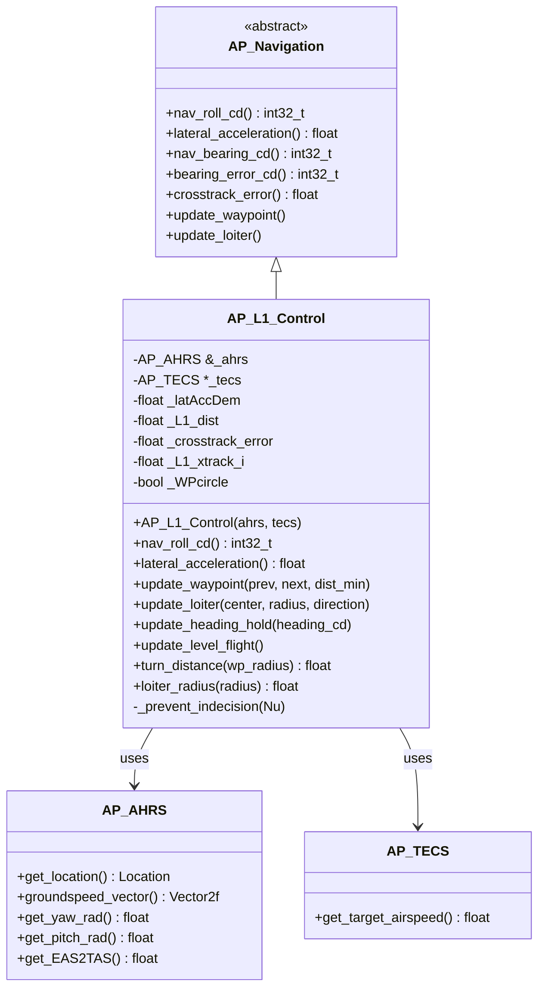
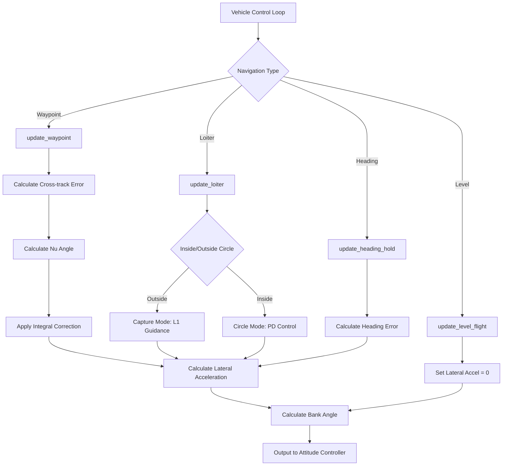
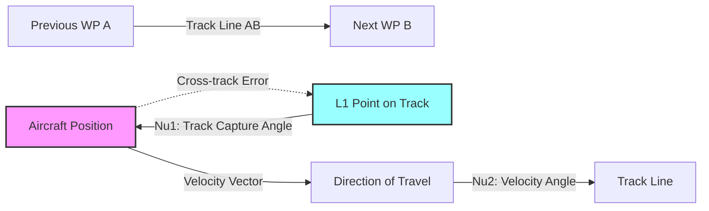
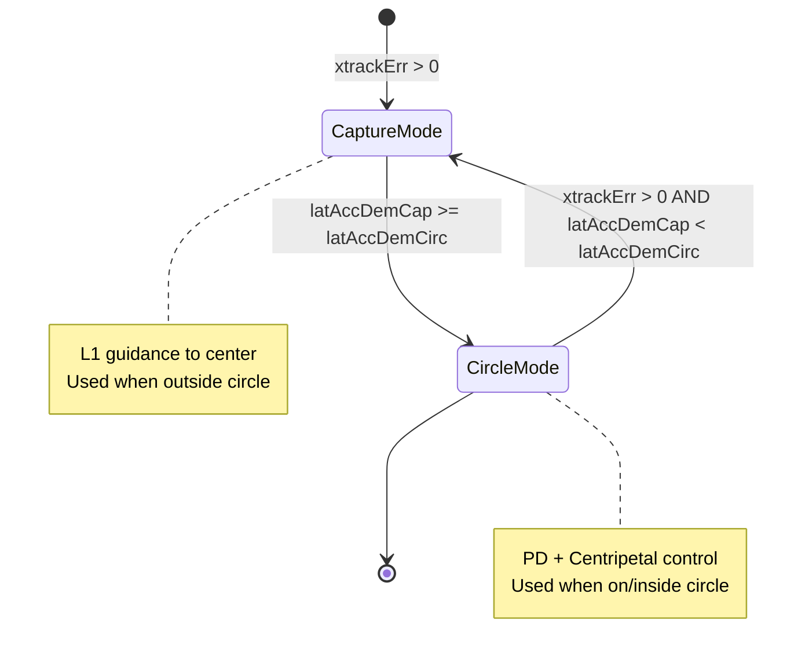
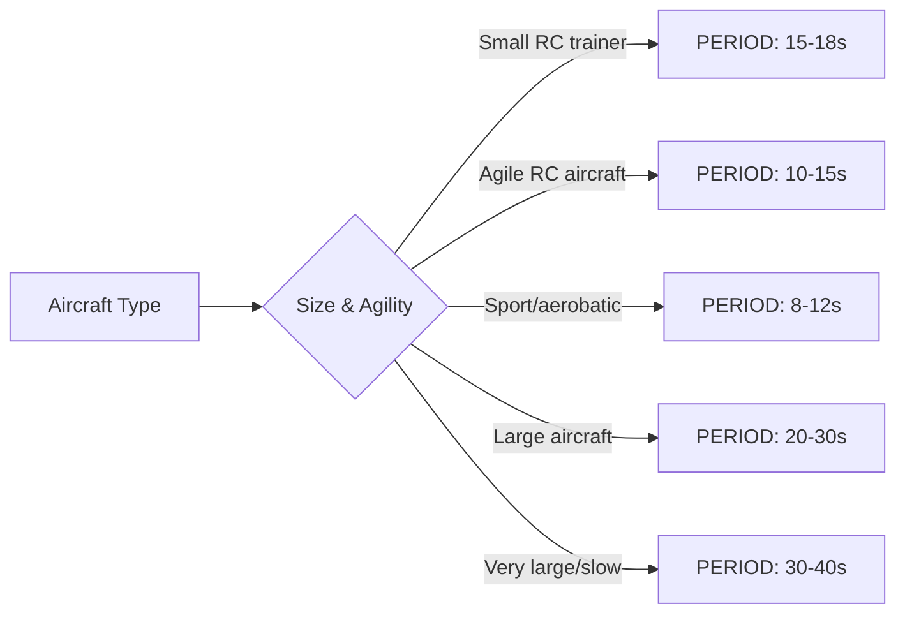
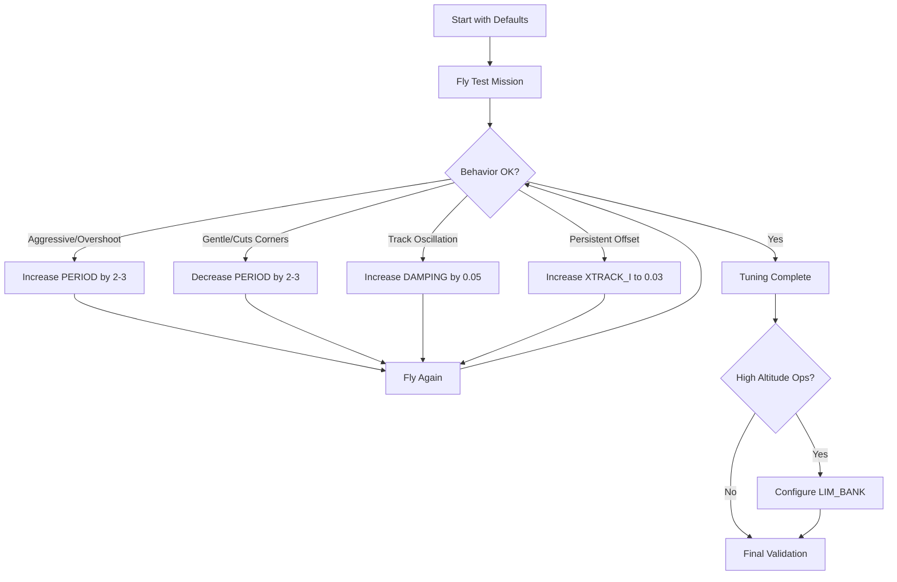

# AP_L1_Control Library


## Table of Contents
- [Overview](#overview)
- [Theoretical Foundation](#theoretical-foundation)
- [Architecture](#architecture)
- [Path Following Algorithms](#path-following-algorithms)
- [Configuration Parameters](#configuration-parameters)
- [API Reference](#api-reference)
- [Tuning Guide](#tuning-guide)
- [Integration Examples](#integration-examples)
- [Testing](#testing)

## Overview

The **AP_L1_Control** library implements the L1 navigation guidance algorithm for fixed-wing aircraft trajectory control. L1 control provides robust, predictable path following with explicit control over tracking loop frequency and damping characteristics.

**Source Files**: `libraries/AP_L1_Control/`
- `AP_L1_Control.h` - Class definition and public interface
- `AP_L1_Control.cpp` - Algorithm implementation

### Key Features

- **Waypoint Navigation**: Smooth path following between waypoints with controlled track capture
- **Loiter Control**: Circular orbit patterns with altitude-compensated radius
- **Heading Hold**: Maintain specified heading with coordinated turns
- **Cross-track Error Correction**: Integral feedback ensures convergence to desired path
- **Altitude Compensation**: Automatic radius scaling for thin air at high altitude
- **Turn Coordination**: Physics-based bank angle commands accounting for pitch attitude

### Original Research

Based on the paper:
> S. Park, J. Deyst, and J. P. How, "A New Nonlinear Guidance Logic for Trajectory Tracking,"  
> Proceedings of the AIAA Guidance, Navigation and Control Conference, Aug 2004. AIAA-2004-4900.

**ArduPilot Modifications** (Brandon Jones 2013, Paul Riseborough 2013):
- PD control for circle tracking enabling loiter radius < L1 length
- Explicit frequency and damping control
- Explicit track capture angle control
- Integral cross-track error correction (2015+)

---

## Theoretical Foundation

### L1 Guidance Law

The L1 control algorithm calculates lateral acceleration commands to guide the aircraft toward a virtual reference point (L1 point) ahead of the vehicle on the desired path. The lateral acceleration demand is:

```
latAccDem = K_L1 * V² / L1_dist * sin(Nu)
```

Where:
- `K_L1` = 4 * ζ² (damping gain, where ζ is the damping ratio)
- `V` = groundspeed (m/s)
- `L1_dist` = L1 tracking distance (m)
- `Nu` = angle between velocity vector and desired track (radians)

### L1 Distance Calculation

The L1 tracking distance is dynamically calculated based on the configured period and current groundspeed:

```
L1_dist = (1/π) * ζ * T * V
```

Where:
- `ζ` = damping ratio (NAVL1_DAMPING parameter)
- `T` = period in seconds (NAVL1_PERIOD parameter)
- `V` = groundspeed (m/s)

**Source**: `AP_L1_Control.cpp:257`
```cpp
_L1_dist = MAX(0.3183099f * _L1_damping * _L1_period * groundSpeed, dist_min);
```

**Note**: The constant 0.3183099 ≈ 1/π

### Bank Angle Calculation

The required bank angle to achieve the lateral acceleration is derived from the equations of balanced spiral flight:

```
φ = arctan(latAccDem / (g * cos(θ)))
```

Where:
- `φ` = bank angle (radians)
- `latAccDem` = lateral acceleration demand (m/s²)
- `g` = gravitational acceleration (9.80665 m/s²)
- `θ` = pitch angle, constrained to ±60° to avoid division issues

**Source**: `AP_L1_Control.cpp:79-95`
```cpp
// Equations of balanced spiral:
// liftForce * cos(roll) = gravityForce * cos(pitch)
// liftForce * sin(roll) = gravityForce * lateralAcceleration / gravityAcceleration
float pitchLimL1 = radians(60);
float pitchL1 = constrain_float(_ahrs.get_pitch_rad(),-pitchLimL1,pitchLimL1);
ret = degrees(atanf(_latAccDem * (1.0f/(GRAVITY_MSS * cosf(pitchL1))))) * 100.0f;
```

**Safety**: Bank angle output is constrained to ±90 degrees (±9000 centidegrees)

---

## Architecture

### Class Hierarchy



### Control Flow



### Component Dependencies

**Source**: `AP_L1_Control.h:16-20`

The L1 controller depends on:
- **AP_AHRS**: Attitude and heading reference for aircraft state
- **AP_TECS**: Total energy control system for airspeed management
- **AP_Param**: Parameter storage and management
- **AP_Math**: Vector mathematics and coordinate transformations
- **AP_Navigation**: Base class interface definition
- **AP_Common**: Location class for waypoint handling

---

## Path Following Algorithms

### Waypoint Navigation (`update_waypoint`)

**Source**: `AP_L1_Control.cpp:206-347`

The waypoint navigation algorithm guides the aircraft along a straight line from a previous waypoint to the next waypoint. The algorithm has three distinct modes:

#### 1. Behind Previous Waypoint (WP A)

When the aircraft is more than L1 distance behind the previous waypoint and in a ±135° arc behind it:

```cpp
// Source: AP_L1_Control.cpp:284-291
if (WP_A_dist > _L1_dist && alongTrackDist/MAX(WP_A_dist, 1.0f) < -0.7071f)
{
    // Fly directly to WP A
    Vector2f A_air_unit = (A_air).normalized();
    xtrackVel = _groundspeed_vector % (-A_air_unit);
    ltrackVel = _groundspeed_vector * (-A_air_unit);
    Nu = atan2f(xtrackVel,ltrackVel);
}
```

**Purpose**: Prevents excessive cross-track errors when far behind the track line.

#### 2. Beyond Next Waypoint (WP B)

When the aircraft has passed the next waypoint by more than 3 seconds of groundspeed:

```cpp
// Source: AP_L1_Control.cpp:292-300
else if (alongTrackDist > AB_length + groundSpeed*3) {
    // Fly directly to WP B
    const Vector2f B_air = next_WP.get_distance_NE(_current_loc);
    Vector2f B_air_unit = (B_air).normalized();
    Nu = atan2f(xtrackVel,ltrackVel);
}
```

**Purpose**: Continues guiding toward the target even after overshooting.

#### 3. Normal Track Following

When between waypoints, the algorithm uses L1 guidance with cross-track error correction:



**Nu Angle Calculation**:

```cpp
// Source: AP_L1_Control.cpp:301-329
// Nu2: Angle of velocity vector relative to track line
xtrackVel = _groundspeed_vector % AB;  // Cross-track velocity
ltrackVel = _groundspeed_vector * AB;  // Along-track velocity
float Nu2 = atan2f(xtrackVel, ltrackVel);

// Nu1: Angle to L1 reference point based on cross-track error
float sine_Nu1 = _crosstrack_error / MAX(_L1_dist, 0.1f);
sine_Nu1 = constrain_float(sine_Nu1, -0.7071f, 0.7071f);  // ±45° limit
float Nu1 = asinf(sine_Nu1);

// Add integral correction to converge to zero cross-track error
Nu1 += _L1_xtrack_i;

// Total Nu angle
Nu = Nu1 + Nu2;
```

**Cross-track Error Integrator**:

The integrator accumulates error when the aircraft is nearly aligned with the track (within 5° of Nu1):

```cpp
// Source: AP_L1_Control.cpp:316-324
if (_L1_xtrack_i_gain > 0 && fabsf(Nu1) < radians(5)) {
    _L1_xtrack_i += Nu1 * _L1_xtrack_i_gain * dt;
    _L1_xtrack_i = constrain_float(_L1_xtrack_i, -0.1f, 0.1f);
}
```

**Indecision Prevention**:

To prevent oscillation when pointing away from the target:

```cpp
// Source: AP_L1_Control.cpp:190-203
void AP_L1_Control::_prevent_indecision(float &Nu)
{
    const float Nu_limit = 0.9f*M_PI;  // ~162 degrees
    if (fabsf(Nu) > Nu_limit &&
        fabsf(_last_Nu) > Nu_limit &&
        labs(wrap_180_cd(_target_bearing_cd - get_yaw_sensor())) > 12000 &&
        Nu * _last_Nu < 0.0f) {
        // Oscillating in turn decision - use previous Nu
        Nu = _last_Nu;
    }
}
```

**Final Lateral Acceleration**:

```cpp
// Source: AP_L1_Control.cpp:336-338
Nu = constrain_float(Nu, -1.5708f, +1.5708f);  // ±90° limit
_latAccDem = K_L1 * groundSpeed * groundSpeed / _L1_dist * sinf(Nu);
```

### Loiter Control (`update_loiter`)

**Source**: `AP_L1_Control.cpp:350-486`

The loiter controller maintains a circular orbit around a center waypoint. It uses two distinct control modes with seamless transitions:

#### Mode Switching Logic



#### 1. Capture Mode (Outside Circle)

When outside the loiter circle, use L1 guidance to fly toward the center:

```cpp
// Source: AP_L1_Control.cpp:408-419
// Calculate Nu to capture center_WP
float xtrackVelCap = A_air_unit % _groundspeed_vector;
float ltrackVelCap = -(_groundspeed_vector * A_air_unit);
float Nu = atan2f(xtrackVelCap, ltrackVelCap);

Nu = constrain_float(Nu, -M_PI_2, M_PI_2);

// L1 lateral acceleration demand
float latAccDemCap = K_L1 * groundSpeed * groundSpeed / _L1_dist * sinf(Nu);
```

#### 2. Circle Mode (On Circle)

When on or inside the circle, use PD control plus centripetal acceleration:

```cpp
// Source: AP_L1_Control.cpp:360-443
// Control gains for PD loop
float omega = (6.2832f / _L1_period);  // 2π / period
float Kx = omega * omega;               // Position gain
float Kv = 2.0f * _L1_damping * omega;  // Velocity gain

// Radial errors
float xtrackVelCirc = -ltrackVelCap;           // Radial velocity
float xtrackErrCirc = A_air.length() - radius; // Distance from circle

// PD correction
float latAccDemCircPD = (xtrackErrCirc * Kx + xtrackVelCirc * Kv);

// Centripetal acceleration
float velTangent = xtrackVelCap * float(loiter_direction);
float latAccDemCircCtr = velTangent * velTangent / MAX((0.5f * radius), (radius + xtrackErrCirc));

// Total lateral acceleration
float latAccDemCirc = loiter_direction * (latAccDemCircPD + latAccDemCircCtr);
```

**PD Control Limiting**:

Prevent the PD controller from commanding turns in the wrong direction when traveling the wrong way around the circle:

```cpp
// Source: AP_L1_Control.cpp:434-437
if (ltrackVelCap < 0.0f && velTangent < 0.0f) {
    latAccDemCircPD = MAX(latAccDemCircPD, 0.0f);
}
```

#### Altitude Compensation

The loiter radius is scaled based on the equivalent airspeed to true airspeed ratio (EAS2TAS) to maintain achievable bank angles at altitude:

```cpp
// Source: AP_L1_Control.cpp:148-178
float AP_L1_Control::loiter_radius(const float radius) const
{
    float sanitized_bank_limit = constrain_float(_loiter_bank_limit, 0.0f, 89.0f);
    float lateral_accel_sea_level = tanf(radians(sanitized_bank_limit)) * GRAVITY_MSS;
    float nominal_velocity_sea_level = _tecs->get_target_airspeed();
    float eas2tas_sq = sq(_ahrs.get_EAS2TAS());
    
    if (is_zero(sanitized_bank_limit) || /* other checks */) {
        // Simple altitude scaling
        return radius * eas2tas_sq;
    } else {
        // Calculate radius that maintains bank angle limit
        float sea_level_radius = sq(nominal_velocity_sea_level) / lateral_accel_sea_level;
        return MAX(sea_level_radius * eas2tas_sq, radius);
    }
}
```

**Physics**: At higher altitude, TAS increases relative to EAS, requiring a larger radius to maintain the same bank angle for a given turn rate.

#### Reached Target Logic

The loiter controller sets `_WPcircle = true` when the aircraft is on the circle and in circle mode. This status is preserved for 200ms even if temporarily displaced:

```cpp
// Source: AP_L1_Control.cpp:458-469
if (_WPcircle &&
    _last_loiter.reached_loiter_target_ms != 0 &&
    now_ms - _last_loiter.reached_loiter_target_ms < 200U &&
    loiter_direction == _last_loiter.direction &&
    is_equal(radius_unscaled, _last_loiter.radius) &&
    center_WP.same_loc_as(_last_loiter.center_WP)) {
    // Same location, within 200ms, keep the _WPcircle status
    _last_loiter.reached_loiter_target_ms = now_ms;
}
```

### Heading Hold (`update_heading_hold`)

**Source**: `AP_L1_Control.cpp:489-529`

Maintains a specified heading with coordinated turns. The L1 distance is dynamically adjusted to maintain constant tracking loop frequency:

```cpp
// Source: AP_L1_Control.cpp:492-514
// Normalized frequency for tracking loop
const float omegaA = 4.4428f / _L1_period;  // sqrt(2)*π / period

// Calculate heading error
Nu_cd = navigation_heading_cd - wrap_180_cd(_ahrs.yaw_sensor);
Nu = cd_to_rad(Nu_cd);

// Adjust L1 distance for constant frequency
_L1_dist = groundSpeed / omegaA;
float VomegaA = groundSpeed * omegaA;

// Limit Nu to ±π/2
Nu = constrain_float(Nu, -M_PI_2, M_PI_2);

// Calculate lateral acceleration demand
_latAccDem = 2.0f * sinf(Nu) * VomegaA;
```

**Note**: Cross-track error is zero in heading hold mode since there is no defined path, only a heading target.

### Level Flight (`update_level_flight`)

**Source**: `AP_L1_Control.cpp:531-547`

Maintains wings-level flight on the current heading:

```cpp
// Source: AP_L1_Control.cpp:534-544
// Use current heading as target
_target_bearing_cd = _ahrs.yaw_sensor;
_nav_bearing = _ahrs.get_yaw_rad();

// Zero errors and demands
_bearing_error = 0;
_crosstrack_error = 0;
_latAccDem = 0;
_WPcircle = false;
```

**Use Case**: Useful for manual control modes where the pilot manages heading, but the autopilot maintains wings-level flight.

### Turn Distance Calculation

**Source**: `AP_L1_Control.cpp:124-146`

Calculates the distance before a waypoint where the aircraft should begin turning:

```cpp
// Source: AP_L1_Control.cpp:124-128
float AP_L1_Control::turn_distance(float wp_radius) const
{
    wp_radius *= sq(_ahrs.get_EAS2TAS());
    return MIN(wp_radius, _L1_dist);
}
```

**With Turn Angle** (for mission legs that don't require 90° turns):

```cpp
// Source: AP_L1_Control.cpp:138-146
float AP_L1_Control::turn_distance(float wp_radius, float turn_angle) const
{
    float distance_90 = turn_distance(wp_radius);
    turn_angle = fabsf(turn_angle);
    if (turn_angle >= 90) {
        return distance_90;
    }
    // Linear interpolation for angles < 90°
    return distance_90 * turn_angle / 90.0f;
}
```

**Purpose**: Allows straight-ahead mission legs to avoid thinking they've reached the waypoint early, critical for camera triggers and precise payload delivery.

---

## Configuration Parameters

### NAVL1_PERIOD

**Source**: `AP_L1_Control.cpp:8-15`

```cpp
// @Param: PERIOD
// @DisplayName: L1 control period
// @Description: Period in seconds of L1 tracking loop. This parameter is the primary 
//               control for aggressiveness of turns in auto mode. This needs to be 
//               larger for less responsive airframes.
// @Units: s
// @Range: 1 60
// @Increment: 1
// @User: Standard
AP_GROUPINFO("PERIOD", 0, AP_L1_Control, _L1_period, 17),
```

**Default**: 17 seconds  
**Range**: 1-60 seconds  
**Type**: Standard user parameter

#### Description

The period parameter controls the time constant of the L1 tracking loop, which directly affects turn aggressiveness and path following behavior.

#### Effects

- **Lower values** (10-15s): More aggressive turns, tighter path tracking, suitable for agile aircraft
- **Higher values** (20-30s): Gentler turns, wider path tracking, suitable for large/slow aircraft
- **Very low values** (<10s): Risk of overcorrection and potential stall in aggressive maneuvers

#### Tuning Guidelines

1. **Start with default**: 17 seconds is conservative for most aircraft
2. **Agile RC aircraft**: Try 12-15 seconds
3. **Very agile aircraft**: Can use 10 seconds or slightly lower
4. **Large airframes**: May need 20-25 seconds
5. **Sluggish response**: May need 25-30+ seconds

**Warning**: Change in small increments (1-2 seconds). Values that are too small can lead to radical turns and stall risk.

#### Relationship to L1 Distance

```
L1_dist = (1/π) * NAVL1_DAMPING * NAVL1_PERIOD * groundspeed
```

At 15 m/s groundspeed with default damping (0.75):
- Period = 10s → L1_dist ≈ 35.8m
- Period = 17s → L1_dist ≈ 60.9m  
- Period = 25s → L1_dist ≈ 89.5m

### NAVL1_DAMPING

**Source**: `AP_L1_Control.cpp:17-23`

```cpp
// @Param: DAMPING
// @DisplayName: L1 control damping ratio
// @Description: Damping ratio for L1 control. Increase this in increments of 0.05 
//               if you are getting overshoot in path tracking.
// @Range: 0.6 1.0
// @Increment: 0.05
// @User: Advanced
AP_GROUPINFO("DAMPING", 1, AP_L1_Control, _L1_damping, 0.75f),
```

**Default**: 0.75  
**Range**: 0.6-1.0  
**Type**: Advanced parameter

#### Description

The damping ratio controls how quickly the aircraft approaches the desired path and whether it overshoots.

#### Effects

- **ζ < 0.7**: Underdamped, faster approach but may overshoot
- **ζ = 0.707**: Critically damped (fastest approach without overshoot)
- **ζ = 0.75**: Slightly overdamped, smooth approach (default)
- **ζ > 0.85**: Heavily overdamped, very slow approach

#### Tuning Guidelines

1. **Start with default**: 0.75 works well for most aircraft
2. **If overshooting**: Increase in 0.05 increments up to 0.85
3. **If too sluggish**: Decrease in 0.05 increments down to 0.65
4. **Rarely need**: Values below 0.7 or above 0.85

#### Classical Control Theory

The damping ratio in the L1 control gain calculation:

```
K_L1 = 4 * ζ²
```

At default ζ = 0.75:
- K_L1 = 4 * 0.75² = 2.25

### NAVL1_XTRACK_I

**Source**: `AP_L1_Control.cpp:25-31`

```cpp
// @Param: XTRACK_I
// @DisplayName: L1 control crosstrack integrator gain
// @Description: Crosstrack error integrator gain. This gain is applied to the 
//               crosstrack error to ensure it converges to zero. Set to zero to 
//               disable. Smaller values converge slower, higher values will cause 
//               crosstrack error oscillation.
// @Range: 0 0.1
// @Increment: 0.01
// @User: Advanced
AP_GROUPINFO("XTRACK_I", 2, AP_L1_Control, _L1_xtrack_i_gain, 0.02),
```

**Default**: 0.02  
**Range**: 0-0.1  
**Type**: Advanced parameter

#### Description

Integral gain for cross-track error correction. Ensures the aircraft converges exactly to the desired path rather than maintaining a small steady-state offset.

#### Effects

- **Zero**: No integral correction, may maintain small cross-track offset in wind
- **Low values** (0.01-0.03): Slow convergence, very stable
- **Higher values** (0.05-0.1): Faster convergence, may cause oscillation

#### Implementation Details

The integrator only accumulates when nearly aligned with the track:

```cpp
// Source: AP_L1_Control.cpp:319-324
if (fabsf(Nu1) < radians(5)) {  // Within 5° of track alignment
    _L1_xtrack_i += Nu1 * _L1_xtrack_i_gain * dt;
    _L1_xtrack_i = constrain_float(_L1_xtrack_i, -0.1f, 0.1f);
}
```

**Integrator Reset**: Automatically resets when the gain parameter changes or is set to zero.

#### Tuning Guidelines

1. **Default is good**: 0.02 works for most situations
2. **Persistent offset**: Increase to 0.03-0.04
3. **Oscillation**: Reduce to 0.01 or disable (set to 0)
4. **High winds**: May need slightly higher gain (0.03-0.05)

### NAVL1_LIM_BANK

**Source**: `AP_L1_Control.cpp:33-39`

```cpp
// @Param: LIM_BANK
// @DisplayName: Loiter Radius Bank Angle Limit
// @Description: The sealevel bank angle limit for a continuous loiter. (Used to 
//               calculate airframe loading limits at higher altitudes). Setting to 0 
//               will instead just scale the loiter radius directly
// @Units: deg
// @Range: 0 89
// @User: Advanced
AP_GROUPINFO("LIM_BANK", 3, AP_L1_Control, _loiter_bank_limit, 0.0f),
```

**Default**: 0 degrees (disabled)  
**Range**: 0-89 degrees  
**Type**: Advanced parameter

#### Description

Limits the bank angle used for calculating altitude-compensated loiter radius. When set, maintains safe structural loads at altitude.

#### Effects

- **0**: Simple altitude scaling (radius × EAS2TAS²)
- **Non-zero**: Calculates radius to maintain specified bank angle limit at altitude

#### Physics

At sea level, the required radius for a given bank angle and airspeed:

```
r = V² / (g * tan(φ))
```

Where:
- r = turn radius (m)
- V = true airspeed (m/s)
- g = 9.80665 m/s²
- φ = bank angle (radians)

At altitude, this radius is scaled by EAS2TAS² to maintain the same aerodynamic forces.

#### Tuning Guidelines

1. **Most users**: Leave at 0 (default)
2. **High altitude operations**: Set to maximum comfortable bank angle (e.g., 35-45°)
3. **Structural limits**: Set to protect airframe from excessive g-forces
4. **Never exceed**: Aircraft's maximum structural bank angle

**Example**: For an aircraft with 45° bank limit flying at 15 m/s sea level:
```
r = 15² / (9.807 * tan(45°)) = 22.9m minimum radius
```

---

## API Reference

### Constructor

```cpp
AP_L1_Control(AP_AHRS &ahrs, const AP_TECS *tecs)
```

**Source**: `AP_L1_Control.h:24-29`

Creates an L1 controller instance with references to the attitude system and total energy controller.

**Parameters**:
- `ahrs`: Reference to AP_AHRS instance for aircraft state
- `tecs`: Pointer to AP_TECS instance for airspeed management (used in loiter radius calculation)

**Example**:
```cpp
AP_L1_Control l1_controller(ahrs, &tecs);
```

### Navigation Update Methods

#### `update_waypoint()`

```cpp
void update_waypoint(const Location &prev_WP, const Location &next_WP, float dist_min = 0.0f)
```

**Source**: `AP_L1_Control.cpp:206`

Updates L1 controller for waypoint-to-waypoint navigation along a straight path.

**Parameters**:
- `prev_WP`: Previous waypoint (defines start of path segment)
- `next_WP`: Next waypoint (defines end of path segment)
- `dist_min`: Minimum L1 distance in meters (optional, default 0)

**Updates**:
- `_latAccDem`: Lateral acceleration demand
- `_crosstrack_error`: Distance from desired path
- `_nav_bearing`: Bearing to L1 reference point
- `_target_bearing_cd`: Bearing to next waypoint
- `_WPcircle`: Set to false (not circling)

**Call Rate**: Main navigation loop (typically 10-50 Hz)

**Example**:
```cpp
Location prev_wp = /* previous waypoint */;
Location next_wp = /* next waypoint */;
l1_controller.update_waypoint(prev_wp, next_wp);
```

#### `update_loiter()`

```cpp
void update_loiter(const Location &center_WP, float radius, int8_t loiter_direction)
```

**Source**: `AP_L1_Control.cpp:350`

Updates L1 controller for circular loiter patterns.

**Parameters**:
- `center_WP`: Center point of loiter circle
- `radius`: Desired loiter radius in meters (will be altitude-compensated)
- `loiter_direction`: +1 for clockwise, -1 for counter-clockwise

**Updates**:
- `_latAccDem`: Lateral acceleration demand
- `_crosstrack_error`: Radial distance from circle
- `_nav_bearing`: Bearing to circle center
- `_WPcircle`: True when on the circle

**Call Rate**: Main navigation loop (typically 10-50 Hz)

**Example**:
```cpp
Location loiter_center = /* center location */;
float loiter_radius_m = 75.0f;
int8_t direction = 1;  // Clockwise
l1_controller.update_loiter(loiter_center, loiter_radius_m, direction);
```

#### `update_heading_hold()`

```cpp
void update_heading_hold(int32_t navigation_heading_cd)
```

**Source**: `AP_L1_Control.cpp:490`

Updates L1 controller to maintain a specific heading.

**Parameters**:
- `navigation_heading_cd`: Target heading in centidegrees (0-36000)

**Updates**:
- `_latAccDem`: Lateral acceleration demand
- `_nav_bearing`: Target heading in radians
- `_target_bearing_cd`: Target heading in centidegrees
- `_crosstrack_error`: Set to zero

**Call Rate**: Main navigation loop

**Example**:
```cpp
int32_t target_heading_cd = 9000;  // 90° (East)
l1_controller.update_heading_hold(target_heading_cd);
```

#### `update_level_flight()`

```cpp
void update_level_flight(void)
```

**Source**: `AP_L1_Control.cpp:532`

Updates L1 controller for wings-level flight on current heading.

**Updates**:
- `_latAccDem`: Set to zero (no lateral acceleration)
- `_nav_bearing`: Current heading
- `_target_bearing_cd`: Current heading
- All errors set to zero

**Call Rate**: Main navigation loop

**Example**:
```cpp
l1_controller.update_level_flight();
```

### Output Methods

#### `nav_roll_cd()`

```cpp
int32_t nav_roll_cd(void) const override
```

**Source**: `AP_L1_Control.cpp:79`

Returns the commanded bank angle required to achieve the lateral acceleration from the last update.

**Returns**: Bank angle in centidegrees (±9000 max)

**Formula**:
```cpp
roll = atan(latAccDem / (g * cos(pitch))) * 100.0
```

**Constraints**:
- Pitch limited to ±60° for calculation stability
- Output limited to ±9000 centidegrees (±90°)

**Example**:
```cpp
int32_t roll_command_cd = l1_controller.nav_roll_cd();
attitude_controller.set_roll_target(roll_command_cd);
```

#### `lateral_acceleration()`

```cpp
float lateral_acceleration(void) const override
```

**Source**: `AP_L1_Control.cpp:101`

Returns the lateral acceleration demand in m/s².

**Returns**: Lateral acceleration in m/s² (positive = right turn)

**Example**:
```cpp
float lat_accel = l1_controller.lateral_acceleration();
```

#### `nav_bearing_cd()`

```cpp
int32_t nav_bearing_cd(void) const override
```

**Source**: `AP_L1_Control.cpp:106`

Returns the bearing to the L1 reference point.

**Returns**: Bearing in centidegrees (wrapped to ±18000)

**Example**:
```cpp
int32_t l1_bearing = l1_controller.nav_bearing_cd();
```

#### `bearing_error_cd()`

```cpp
int32_t bearing_error_cd(void) const override
```

**Source**: `AP_L1_Control.cpp:111`

Returns the bearing error (difference between current heading and desired track).

**Returns**: Bearing error in centidegrees (positive = left of track)

**Example**:
```cpp
int32_t tracking_error = l1_controller.bearing_error_cd();
```

#### `target_bearing_cd()`

```cpp
int32_t target_bearing_cd(void) const override
```

**Source**: `AP_L1_Control.cpp:116`

Returns the bearing to the target waypoint.

**Returns**: Bearing in centidegrees (wrapped to ±18000)

**Example**:
```cpp
int32_t waypoint_bearing = l1_controller.target_bearing_cd();
```

#### `crosstrack_error()`

```cpp
float crosstrack_error(void) const override
```

**Source**: `AP_L1_Control.h:45`

Returns the perpendicular distance from the desired path.

**Returns**: Cross-track error in meters (positive = right of track)

**Example**:
```cpp
float xte = l1_controller.crosstrack_error();
gcs().send_text(MAV_SEVERITY_INFO, "XTE: %.1fm", xte);
```

#### `crosstrack_error_integrator()`

```cpp
float crosstrack_error_integrator(void) const override
```

**Source**: `AP_L1_Control.h:46`

Returns the accumulated integral of cross-track error.

**Returns**: Integrator value in radians

**Example**:
```cpp
float xte_i = l1_controller.crosstrack_error_integrator();
```

### Utility Methods

#### `turn_distance()`

```cpp
float turn_distance(float wp_radius) const override
float turn_distance(float wp_radius, float turn_angle) const override
```

**Source**: `AP_L1_Control.cpp:124, 138`

Calculates the distance before a waypoint to begin turning.

**Parameters**:
- `wp_radius`: Waypoint acceptance radius in meters
- `turn_angle`: Angle of turn in degrees (optional)

**Returns**: Turn anticipation distance in meters

**Example**:
```cpp
float wp_radius = 50.0f;
float turn_dist = l1_controller.turn_distance(wp_radius);

// For a 45° turn
float turn_dist_45 = l1_controller.turn_distance(wp_radius, 45.0f);
```

#### `loiter_radius()`

```cpp
float loiter_radius(const float radius) const override
```

**Source**: `AP_L1_Control.cpp:148`

Returns the altitude-compensated loiter radius.

**Parameters**:
- `radius`: Desired sea-level radius in meters

**Returns**: Actual radius to use in meters (scaled for altitude)

**Example**:
```cpp
float desired_radius = 75.0f;
float actual_radius = l1_controller.loiter_radius(desired_radius);
```

#### `reached_loiter_target()`

```cpp
bool reached_loiter_target(void) override
```

**Source**: `AP_L1_Control.cpp:180`

Checks if the aircraft has reached the loiter circle.

**Returns**: `true` if on the loiter circle, `false` otherwise

**Example**:
```cpp
if (l1_controller.reached_loiter_target()) {
    // Execute loiter actions (e.g., start camera survey)
}
```

#### `set_reverse()`

```cpp
void set_reverse(bool reverse) override
```

**Source**: `AP_L1_Control.h:73`

Enables reverse flight mode (used for tailsitters or reverse thrust).

**Parameters**:
- `reverse`: `true` to enable reverse mode, `false` for normal

**Effect**: Wraps yaw by 180° in all calculations

**Example**:
```cpp
l1_controller.set_reverse(true);  // Enable reverse flight
```

#### `data_is_stale()` / `set_data_is_stale()`

```cpp
bool data_is_stale(void) const override
void set_data_is_stale(void) override
```

**Source**: `AP_L1_Control.h:63-68`

Checks or marks if navigation data is stale (e.g., GPS loss).

**Example**:
```cpp
if (l1_controller.data_is_stale()) {
    // Handle navigation data loss
    gcs().send_text(MAV_SEVERITY_WARNING, "Nav data stale");
}
```

#### `set_default_period()`

```cpp
void set_default_period(float period)
```

**Source**: `AP_L1_Control.h:59`

Sets the default value for NAVL1_PERIOD parameter (vehicle-specific tuning).

**Parameters**:
- `period`: Default period in seconds

**Example**:
```cpp
// For an agile aircraft, use shorter period
l1_controller.set_default_period(12.0f);
```

---

## Tuning Guide

### Initial Setup

1. **Start with defaults**: 
   - NAVL1_PERIOD = 17
   - NAVL1_DAMPING = 0.75
   - NAVL1_XTRACK_I = 0.02
   - NAVL1_LIM_BANK = 0

2. **Verify basic navigation**: Fly a simple auto mission with straight legs and loiters

3. **Observe behavior**: Record telemetry for cross-track error and bank angle

### Tuning NAVL1_PERIOD

#### Symptoms and Solutions

| Symptom | Diagnosis | Solution |
|---------|-----------|----------|
| Turns too aggressive, overshoots | Period too short | Increase by 2-3 seconds |
| Oscillates around track | Period too short OR damping too low | Increase period first |
| Turns too gentle, cuts corners | Period too long | Decrease by 2-3 seconds |
| Large cross-track errors | Period too long | Decrease period |
| Struggles to reach loiter | Period too long | Decrease period |

#### Step-by-Step Process

1. **Fly a rectangular pattern** with waypoints 200-500m apart
2. **Observe corner turns**: Should be smooth and predictable
3. **Check straight legs**: Should track line without oscillation
4. **Adjust period**:
   - If overshooting turns: Increase by 2
   - If not turning aggressively enough: Decrease by 2
5. **Repeat** until turns are smooth and tracking is tight

#### Airframe-Specific Guidelines



**Examples**:
- **Bixler/Skywalker**: 15-17 seconds
- **Mini Talon**: 12-15 seconds
- **Large flying wing**: 18-22 seconds
- **Full-scale Cessna equivalent**: 25-35 seconds

### Tuning NAVL1_DAMPING

#### When to Adjust

Only adjust damping if you observe **overshoot** or **sluggish response** after period is properly tuned.

#### Symptoms and Solutions

| Symptom | Diagnosis | Solution |
|---------|-----------|----------|
| Overshoots track line | Underdamped | Increase by 0.05 |
| Oscillates in S-curves | Underdamped | Increase by 0.05 |
| Very slow to reach track | Overdamped | Decrease by 0.05 |
| Doesn't correct in wind | Overdamped | Decrease by 0.05 |

#### Practical Test

1. **Offset from track**: Manually fly 50-100m off a mission leg
2. **Engage auto**: Switch to AUTO mode
3. **Observe approach**: 
   - **Good**: Smooth curve to track, no overshoot
   - **Underdamped**: Crosses track line, oscillates
   - **Overdamped**: Very slow approach to track

### Tuning NAVL1_XTRACK_I

#### When to Adjust

Only adjust if you observe **persistent cross-track offset** during straight flight.

#### Symptoms and Solutions

| Symptom | Diagnosis | Solution |
|---------|-----------|----------|
| Consistent offset left/right | Need integral correction | Increase to 0.03-0.04 |
| Oscillates on straight legs | Too much integral gain | Decrease to 0.01 or 0 |
| Offset in strong wind | Insufficient integral | Increase to 0.04-0.06 |
| Track wanders slowly | Integral may help | Increase to 0.03 |

#### Important Notes

- **Integrator is limited**: Maximum ±0.1 radians (±5.7°)
- **Only active when aligned**: Within 5° of desired track
- **Resets on parameter change**: Allows easy tuning
- **Not a substitute for proper period tuning**

### Advanced: NAVL1_LIM_BANK

#### When to Use

Only configure if:
- Flying at high altitude (>2000m ASL)
- Aircraft has structural bank angle limits
- Want consistent loiter behavior across altitude range

#### Configuration

1. **Determine maximum safe bank angle** for continuous turns (typically 35-50°)
2. **Set NAVL1_LIM_BANK** to this value
3. **Test loiter at altitude**: Radius should increase automatically
4. **Verify bank angle**: Should not exceed limit

#### Physics Example

Aircraft with 40° bank limit at altitude:

| Altitude (m ASL) | EAS2TAS | Radius Scaling |
|------------------|---------|----------------|
| 0 (sea level) | 1.0 | 1.0× |
| 1000 | 1.07 | 1.14× |
| 2000 | 1.14 | 1.30× |
| 3000 | 1.21 | 1.46× |
| 4000 | 1.29 | 1.66× |

**Without LIM_BANK**: Simple EAS2TAS² scaling  
**With LIM_BANK**: Ensures bank angle never exceeds 40° in turns

### Troubleshooting Common Issues

#### Aircraft Won't Reach Track

**Possible Causes**:
1. NAVL1_PERIOD too long
2. Wind stronger than expected
3. Airspeed too low
4. Bank angle limits too restrictive

**Solutions**:
```
1. Reduce NAVL1_PERIOD by 3-5 seconds
2. Increase cruise airspeed
3. Check ROLL_LIMIT_DEG parameter
4. Verify servo throws are adequate
```

#### Oscillates on Straight Legs

**Possible Causes**:
1. NAVL1_PERIOD too short
2. NAVL1_DAMPING too low
3. NAVL1_XTRACK_I too high
4. Roll rate too high (external to L1)

**Solutions**:
```
1. Increase NAVL1_PERIOD by 2-3 seconds
2. Increase NAVL1_DAMPING by 0.05
3. Reduce or disable NAVL1_XTRACK_I
4. Check roll rate controller tuning
```

#### Loiters Keep Expanding

**Possible Causes**:
1. Airspeed higher than target
2. Wind pushing aircraft outward
3. NAVL1_PERIOD too long

**Solutions**:
```
1. Verify TECS tuning (AP_TECS library)
2. Check wind estimation
3. Reduce NAVL1_PERIOD slightly
```

#### Cuts Corners on Waypoints

**Possible Causes**:
1. NAVL1_PERIOD too long (L1_dist too large)
2. Waypoint radius too small
3. Groundspeed too high

**Solutions**:
```
1. Reduce NAVL1_PERIOD
2. Increase waypoint acceptance radius
3. Reduce cruise speed for mission
```

### Tuning Workflow Summary



---

## Integration Examples

### Basic ArduPlane Integration

**Source**: ArduPlane usage of AP_L1_Control

#### Initialization

```cpp
// In Plane class definition (Plane.h)
AP_L1_Control l1_controller{ahrs, &TECS_controller};

// During setup (Plane.cpp)
void Plane::startup_ground(void)
{
    // Set vehicle-specific L1 period default
    l1_controller.set_default_period(16.0f);
}
```

#### Waypoint Navigation

```cpp
// In navigation loop (mode_auto.cpp)
void ModeAuto::update_navigation()
{
    // Get waypoints from mission
    Location prev_wp, next_wp;
    mission.get_current_nav_wp(prev_wp);
    mission.get_next_nav_wp(next_wp);
    
    // Update L1 controller
    plane.l1_controller.update_waypoint(prev_wp, next_wp);
    
    // Get navigation commands
    int32_t nav_roll = plane.l1_controller.nav_roll_cd();
    
    // Send to attitude controller
    plane.attitude_controller.set_roll_target(nav_roll);
}
```

#### Loiter Mode

```cpp
// In loiter mode (mode_loiter.cpp)
void ModeLoiter::update()
{
    // Get loiter parameters
    Location loiter_center = plane.next_WP_loc;
    float loiter_radius = fabsf(plane.g.loiter_radius);
    int8_t loiter_direction = (plane.g.loiter_radius < 0) ? -1 : 1;
    
    // Update L1 controller for loiter
    plane.l1_controller.update_loiter(loiter_center, loiter_radius, loiter_direction);
    
    // Check if reached
    if (plane.l1_controller.reached_loiter_target()) {
        // Execute loiter actions
        plane.do_loiter_actions();
    }
    
    // Get navigation commands
    int32_t nav_roll = plane.l1_controller.nav_roll_cd();
    plane.attitude_controller.set_roll_target(nav_roll);
}
```

#### Heading Hold Mode (CRUISE/FBWB)

```cpp
// In cruise mode (mode_cruise.cpp)
void ModeCruise::update()
{
    // Hold current or desired heading
    int32_t target_heading = plane.g.heading_hold_cd;
    
    // Update L1 for heading hold
    plane.l1_controller.update_heading_hold(target_heading);
    
    // Get navigation commands
    int32_t nav_roll = plane.l1_controller.nav_roll_cd();
    plane.attitude_controller.set_roll_target(nav_roll);
}
```

### Handling GPS Loss

```cpp
// In failsafe handler
void Plane::check_gps_navigation()
{
    if (gps.status() < AP_GPS::GPS_OK_FIX_3D) {
        // Mark L1 data as stale
        l1_controller.set_data_is_stale();
        
        // Switch to attitude hold or other non-GPS mode
        set_mode(mode_fbwa, ModeReason::GPS_LOSS);
    }
}

// In navigation update
void Plane::update_navigation()
{
    if (l1_controller.data_is_stale()) {
        // Don't use L1 outputs, maintain last commands
        return;
    }
    
    // Normal L1 navigation
    // ...
}
```

### Telemetry Integration

```cpp
// Send L1 status to ground station
void Plane::send_nav_controller_output()
{
    int32_t nav_roll_cd = l1_controller.nav_roll_cd();
    int32_t nav_bearing_cd = l1_controller.nav_bearing_cd();
    int32_t target_bearing_cd = l1_controller.target_bearing_cd();
    float wp_distance = get_distance(current_loc, next_WP_loc);
    float xtrack_error = l1_controller.crosstrack_error();
    
    // Send MAVLink NAV_CONTROLLER_OUTPUT message
    mavlink_msg_nav_controller_output_send(
        chan,
        nav_roll_cd / 100,  // Convert to degrees
        0,  // nav_pitch (not used by L1)
        nav_bearing_cd / 100,
        target_bearing_cd / 100,
        wp_distance,
        0,  // altitude error (handled separately)
        0,  // airspeed error (handled by TECS)
        xtrack_error
    );
}
```

### Turn Distance for Waypoint Acceptance

```cpp
// Determine when approaching waypoint
bool Plane::reached_waypoint()
{
    Location current_loc;
    if (!ahrs.get_location(current_loc)) {
        return false;
    }
    
    float wp_distance = get_distance(current_loc, next_WP_loc);
    
    // Get turn distance based on waypoint radius
    float turn_dist = l1_controller.turn_distance(g.waypoint_radius);
    
    // Waypoint reached when within turn distance
    return (wp_distance <= turn_dist);
}
```

---

## Testing

### Unit Testing

The AP_L1_Control library can be tested with ArduPilot's SITL (Software In The Loop) simulator.

#### SITL Setup

```bash
# Navigate to ArduPlane directory
cd ArduPlane

# Launch SITL with default aircraft
sim_vehicle.py -v ArduPlane --console --map

# Or with specific aircraft model
sim_vehicle.py -v ArduPlane -f quadplane --console --map
```

#### Test Mission

Create a test mission (`test_l1.txt`) with various navigation challenges:

```
QGC WPL 110
0	1	0	16	0	0	0	0	-35.363261	149.165230	584.000000	1
1	0	3	22	0.00000000	0.00000000	0.00000000	0.00000000	-35.363261	149.165230	100.000000	1
2	0	3	16	0.00000000	0.00000000	0.00000000	0.00000000	-35.363261	149.175230	100.000000	1
3	0	3	16	0.00000000	0.00000000	0.00000000	0.00000000	-35.373261	149.175230	100.000000	1
4	0	3	16	0.00000000	0.00000000	0.00000000	0.00000000	-35.373261	149.165230	100.000000	1
5	0	3	16	0.00000000	0.00000000	0.00000000	0.00000000	-35.363261	149.165230	100.000000	1
6	0	3	18	4.00000000	0.00000000	0.00000000	0.00000000	-35.368261	149.170230	100.000000	1
7	0	3	16	0.00000000	0.00000000	0.00000000	0.00000000	-35.363261	149.165230	50.000000	1
8	0	3	20	0.00000000	0.00000000	0.00000000	0.00000000	-35.363261	149.165230	0.000000	1
```

**Mission includes**:
- Takeoff (command 22)
- Rectangular pattern (waypoints 2-5)
- Loiter (command 18)
- Return to launch
- Landing (command 20 and 21)

#### Load and Execute

```python
# In MAVProxy console
wp load test_l1.txt
arm throttle
mode AUTO
```

#### Monitor Performance

```python
# Display L1 parameters
param show NAVL1_*

# Watch cross-track error
watch XTRACK

# Graph navigation performance
graph NAV_CONTROLLER_OUTPUT.nav_roll
graph NAV_CONTROLLER_OUTPUT.xtrack_error
graph NAV_CONTROLLER_OUTPUT.nav_bearing
```

### Parameter Sweep Testing

Test parameter sensitivity:

```python
# Test different periods
param set NAVL1_PERIOD 10
mode AUTO
# Observe behavior

param set NAVL1_PERIOD 15
mode RTL
mode AUTO
# Compare behavior

param set NAVL1_PERIOD 20
mode RTL
mode AUTO
# Compare behavior
```

### Validation Checklist

- [ ] **Straight line tracking**: Cross-track error < 5m in calm conditions
- [ ] **Corner turns**: Smooth 90° turns without overshoot
- [ ] **Loiter entry**: Captures loiter circle within 1-2 orbits
- [ ] **Loiter stability**: Maintains orbit without expanding/contracting
- [ ] **Heading hold**: Maintains heading within ±5° in calm conditions
- [ ] **Wind handling**: Corrects for wind, maintains track
- [ ] **Altitude changes**: Navigation unaffected by climbs/descents
- [ ] **Speed changes**: Adapts L1 distance appropriately
- [ ] **Waypoint approach**: Begins turn at appropriate distance
- [ ] **Reverse flight**: (If applicable) Functions in reverse mode

### Dataflash Log Analysis

After test flights, analyze dataflash logs:

```bash
# Download log
mavproxy.py --master=/dev/ttyUSB0 --cmd="log list; log download latest"

# Convert to CSV or analyze with MAVExplorer
mavlogdump.py --types=CTUN,NTUN 00000001.BIN > flight_data.csv
```

**Key log messages**:
- **NTUN**: Navigation controller output
  - `WpDist`: Distance to waypoint
  - `Xtrack`: Cross-track error
  - `NavRoll`: L1 commanded roll
  - `TargBrg`: Bearing to target
  - `NavBrg`: Bearing to L1 point

- **CTUN**: Control tuning
  - `NavRoll`: Commanded roll (should match NTUN.NavRoll)
  - `Roll`: Actual roll
  - `RollErr`: Roll error

### Automated Testing

The ArduPilot autotest framework includes L1 controller tests:

```bash
# Run ArduPlane autotests
cd Tools/autotest
./autotest.py --vehicle ArduPlane

# Run specific L1-related tests
./autotest.py --vehicle ArduPlane -e test_mission

# Run with specific SITL model
./autotest.py --vehicle ArduPlane --model plane --speedup=1
```

### Hardware Testing Procedure

1. **Ground testing**:
   - Verify parameter loading
   - Check telemetry output
   - Simulate GPS movement (if possible)

2. **Initial flight**:
   - Take off in manual mode
   - Switch to AUTO on simple waypoint mission
   - Observe basic tracking

3. **Progressive testing**:
   - Increase mission complexity
   - Test different wind conditions
   - Verify loiter stability
   - Test altitude changes

4. **Tuning flights**:
   - Adjust NAVL1_PERIOD based on observations
   - Fine-tune damping if needed
   - Enable integral correction if persistent offset observed

5. **Validation flight**:
   - Execute complex mission
   - Verify all navigation modes
   - Confirm performance meets requirements

---

## Contributing

### Reporting Issues

If you encounter issues with L1 control:

1. **Check tuning first**: Most issues are solved by proper parameter tuning
2. **Gather data**: Collect dataflash logs showing the problem
3. **Document conditions**: Wind, altitude, airspeed, aircraft type
4. **Report**: Open an issue on [ArduPilot GitHub](https://github.com/ArduPilot/ardupilot/issues)

### Code Contributions

Improvements to AP_L1_Control are welcome:

1. **Fork** the ArduPilot repository
2. **Create branch** for your changes
3. **Test thoroughly** in SITL and hardware
4. **Submit pull request** with detailed description
5. **Include test results** demonstrating improvement

### Documentation

Help improve this documentation:

- Clarify confusing sections
- Add practical examples
- Document edge cases
- Contribute tuning data for specific airframes

---

## References

### Academic Papers

1. **Park, S., Deyst, J., and How, J. P.** (2004). "A New Nonlinear Guidance Logic for Trajectory Tracking." *AIAA Guidance, Navigation, and Control Conference*, AIAA-2004-4900.
   - Original L1 control algorithm paper
   - Theoretical foundation and mathematical derivation

2. **Park, S.** (2004). "Avionics and Control System Development for Mid-Air Rendezvous of Two Unmanned Aerial Vehicles." *MS Thesis, MIT*.
   - Extended discussion of L1 implementation
   - Practical considerations for UAV applications

### ArduPilot Resources

- **ArduPilot Wiki**: https://ardupilot.org/plane/docs/navigation-tuning.html
- **Discourse Forum**: https://discuss.ardupilot.org/c/arduplane
- **GitHub Repository**: https://github.com/ArduPilot/ardupilot
- **Parameter Documentation**: https://ardupilot.org/plane/docs/parameters.html

### Related Libraries

- **AP_Navigation**: Base class for navigation controllers
- **AP_TECS**: Total Energy Control System for speed/altitude management  
- **AP_AHRS**: Attitude and Heading Reference System
- **AC_AttitudeControl**: Attitude controller (used by copter/quadplane)

### Historical Context

- **Original implementation**: Brandon Jones (2013)
- **Major modifications**: Paul Riseborough (2013)
  - Explicit period and damping control
  - PD loiter control
  - Track capture angle limiting
- **Integral cross-track**: Community contribution (2015+)
- **Bank angle calculation fix**: Andrew Tridgell (2023) - Issue #24319

---

## Appendix: Mathematical Derivations

### L1 Distance Formula

Starting from the L1 guidance law frequency requirement:

The natural frequency of the L1 control loop is:
```
ω = V / L1_dist
```

For a desired period T:
```
T = 2π / ω
ω = 2π / T
```

Substituting:
```
2π / T = V / L1_dist
L1_dist = V * T / (2π)
L1_dist = V * T * (1 / 2π)
L1_dist ≈ V * T * 0.1591
```

With damping factor ζ included:
```
L1_dist = ζ * V * T / π
L1_dist ≈ ζ * V * T * 0.3183
```

### Lateral Acceleration from Nu Angle

From the guidance law, lateral acceleration is:
```
a_lat = K_L1 * V² / L1_dist * sin(Nu)
```

Where K_L1 relates to damping:
```
K_L1 = 4 * ζ²
```

For default ζ = 0.75:
```
K_L1 = 4 * (0.75)² = 2.25
```

### Bank Angle from Lateral Acceleration

From coordinated turn physics:

In a coordinated turn, the horizontal component of lift provides centripetal acceleration:
```
L * sin(φ) = m * a_lat
```

The vertical component supports weight:
```
L * cos(φ) * cos(θ) = m * g
```

Dividing these equations:
```
tan(φ) = a_lat / (g * cos(θ))
φ = atan(a_lat / (g * cos(θ)))
```

Where:
- φ = bank angle
- θ = pitch angle
- a_lat = lateral acceleration
- g = gravitational acceleration (9.80665 m/s²)

### Turn Radius

From circular motion:
```
a_lat = V² / r
r = V² / a_lat
```

For a given bank angle:
```
a_lat = g * tan(φ)
r = V² / (g * tan(φ))
```

---

**Document Version**: 1.0  
**Last Updated**: 2024  
**Maintainer**: ArduPilot Development Team  
**License**: GPLv3

For questions or support, visit the [ArduPilot Discourse Forum](https://discuss.ardupilot.org/).


