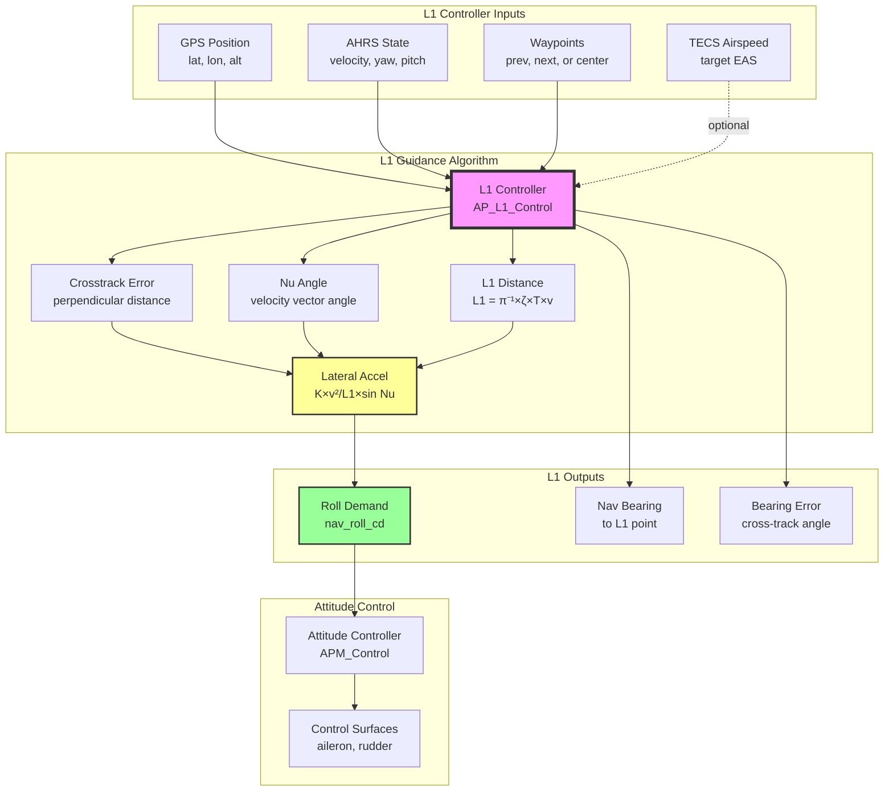
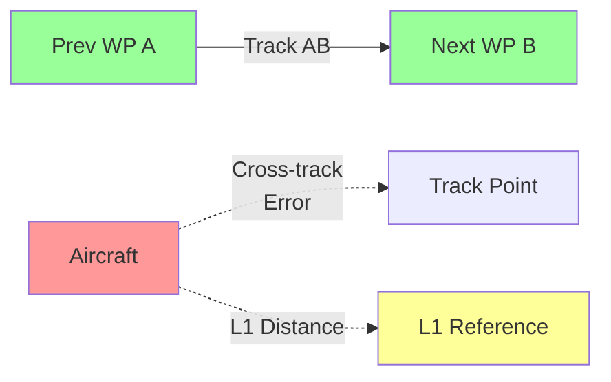

# AP_L1_Control

## Overview

The AP_L1_Control library implements the L1 nonlinear guidance law for fixed-wing aircraft lateral navigation in ArduPilot. L1 guidance provides robust trajectory tracking by computing lateral acceleration commands that drive the aircraft toward a virtual "L1 reference point" on the desired path. This approach decouples trajectory tracking from vehicle dynamics, enabling consistent navigation performance across different aircraft types and flight conditions.

The L1 controller handles waypoint-to-waypoint navigation, loiter circles, heading hold, and level flight guidance. It integrates with the AP_Navigation interface to provide standardized lateral navigation for ArduPlane's mission execution and flight mode implementations.

**Key Capabilities**:
- Waypoint-to-waypoint path following with cross-track error minimization
- Circular loiter navigation with configurable radius and direction
- Heading hold and level flight modes
- Automatic compensation for wind and groundspeed variations
- Altitude-scaled loiter radius for high-altitude flight
- Seamless mode transitions between capture and circle tracking

## Architecture



### Component Interactions

1. **Mission Controller** → **L1 Controller**: Provides waypoint pairs (prev, next) or loiter center point
2. **AHRS** → **L1 Controller**: Provides current position, groundspeed vector, yaw, pitch
3. **TECS** → **L1 Controller**: Provides target airspeed for altitude-scaled loiter radius (optional)
4. **L1 Controller** → **Attitude Controller**: Outputs roll angle demand (nav_roll_cd)
5. **L1 Controller** → **Telemetry**: Provides navigation bearing, crosstrack error for ground station display

The L1 controller updates at the navigation loop rate (typically 10Hz) and produces outputs consumed immediately by the attitude controller and telemetry system.

## L1 Algorithm Mathematical Foundations

The L1 guidance law is based on the paper by Park, Deyst, and How (AIAA 2004): "A New Nonlinear Guidance Logic for Trajectory Tracking."

### Core Concept: L1 Reference Point

The L1 guidance law computes a virtual reference point on the desired path at distance **L1** from the aircraft. The lateral acceleration command drives the aircraft toward this reference point, ensuring convergence to the desired trajectory.

**Key Insight**: By controlling the distance to the L1 reference point, we can control the frequency and damping of the tracking response, making the guidance law easily tunable with just two parameters (period and damping).

### L1 Distance Calculation

The L1 distance adapts to groundspeed to maintain a constant tracking loop natural frequency:

```
L1 = (ζ × T × v) / π
```

Where:
- **ζ** (zeta) = damping ratio (NAVL1_DAMPING parameter, default 0.75)
- **T** = tracking loop period (NAVL1_PERIOD parameter, default 17s)
- **v** = groundspeed (m/s from AHRS)
- **π** = pi (3.14159...)

**Physical Interpretation**: L1 distance is the look-ahead distance. Larger L1 means gentler turns and smoother tracking. Smaller L1 means tighter turns and more aggressive tracking.

### Lateral Acceleration Command

The lateral acceleration command follows from the L1 geometry:

```
a_lat = (K_L1 × v²) / L1 × sin(Nu)
```

Where:
- **a_lat** = lateral acceleration demand (m/s², positive to right)
- **K_L1** = L1 gain = 4×ζ² (ensures critically damped or overdamped response)
- **v** = groundspeed (m/s)
- **Nu** = angle between velocity vector and desired track direction (radians)

**Physical Interpretation**: This formula computes the centripetal acceleration needed to follow a circular arc from current position to the L1 reference point. The sin(Nu) term provides proportional feedback on angular error.

### Roll Angle Conversion

Lateral acceleration is converted to roll angle using coordinated turn kinematics:

```
φ = atan(a_lat / (g × cos(θ)))
```

Where:
- **φ** (phi) = roll angle (radians, converted to centidegrees for output)
- **a_lat** = lateral acceleration demand (m/s²)
- **g** = gravitational acceleration (9.80665 m/s²)
- **θ** (theta) = pitch angle (radians from AHRS, constrained to ±60°)

**Note**: Pitch constraint prevents division by near-zero when near vertical attitudes. Roll output clamped to ±9000 centidegrees (±90°) for safety.

## Key Components

### AP_L1_Control Class

**Purpose**: Main L1 guidance controller implementing AP_Navigation interface

**Lifecycle**:
1. **Initialization**: Constructor receives AHRS and TECS references, loads parameters
2. **Update Cycle**: One of update_waypoint(), update_loiter(), update_heading_hold(), or update_level_flight() called at ~10Hz
3. **Output Retrieval**: Attitude controller calls nav_roll_cd() and lateral_acceleration() immediately after update
4. **Telemetry**: Ground station queries nav_bearing_cd(), bearing_error_cd(), crosstrack_error()

**Thread Safety**: Not thread-safe. Must be called from navigation task/thread only.

**Hardware Dependencies**: Requires functional GPS for position and AHRS for attitude/velocity.

### Waypoint Navigation Mode

**Algorithm** (update_waypoint method):

1. Calculate L1 distance based on groundspeed: `L1 = 0.3183099 × ζ × T × v`
2. Determine vehicle position relative to track segment (prev_WP to next_WP)
3. Calculate cross-track error (perpendicular distance from desired track)
4. Compute three possible navigation scenarios:
   - **Behind start**: If >L1 distance behind prev_WP, fly direct to prev_WP
   - **Past end**: If >3 seconds past next_WP, fly direct to next_WP
   - **On track**: Normal L1 guidance along track segment
5. Calculate Nu angle (velocity vector relative to desired path)
6. Apply crosstrack integrator correction (optional, NAVL1_XTRACK_I parameter)
7. Compute lateral acceleration: `a_lat = K_L1 × v² / L1 × sin(Nu)`
8. Convert to roll demand: `φ = atan(a_lat / (g × cos(pitch)))`

**Crosstrack Error Handling**:
- **Proportional**: Nu angle provides instant correction proportional to cross-track error
- **Integral**: Optional integrator (NAVL1_XTRACK_I) eliminates steady-state error
- **Capture Angle Limiting**: Limits Nu1 sine to ±0.7071 (±45° capture angle)

**Indecision Prevention**: If oscillating near 180° from target while moving away, locks to previous turn direction to prevent hunting.

Source: libraries/AP_L1_Control/AP_L1_Control.cpp:206-347

### Loiter Navigation Mode

**Algorithm** (update_loiter method):

The loiter controller uses a hybrid approach switching between "capture" and "circle" modes:

**Capture Mode** (outside loiter radius):
- Uses L1 guidance law to fly toward loiter center
- Same algorithm as waypoint navigation, targeting center point
- Transitions to circle mode when lateral demands cross over

**Circle Mode** (established on loiter circle):
- **PD Controller**: Corrects radial position/velocity errors
  - Position error: `xtrack_err = current_radius - target_radius`
  - Velocity error: `radial_velocity` (outbound positive)
  - Correction: `a_lat_PD = Kx × xtrack_err + Kv × radial_velocity`
- **Centripetal Acceleration**: Maintains circular path
  - Formula: `a_lat_centripetal = v_tangent² / radius`
- **Total Demand**: `a_lat_total = a_lat_PD + a_lat_centripetal`

**PD Gains**:
- `ω = 2π / T` (natural frequency from NAVL1_PERIOD)
- `Kx = ω²` (position gain)
- `Kv = 2 × ζ × ω` (velocity gain, ζ from NAVL1_DAMPING)

**Altitude Scaling**: Loiter radius automatically scales with `(EAS/TAS)²` to maintain constant load factor at altitude.

Source: libraries/AP_L1_Control/AP_L1_Control.cpp:350-486

### Heading Hold Mode

**Purpose**: Maintain a fixed heading without tracking a specific path.

**Algorithm**: Simplified L1 control driving bearing error to zero with first-order response characterized by NAVL1_PERIOD.

### Level Flight Mode

**Purpose**: Wings-level flight on current heading with zero lateral acceleration demand.

## Waypoint Tracking and Path Following

### Track Segment Geometry



**Key Distances**:
- **Along-track distance**: Projection of aircraft position onto track AB
- **Cross-track error**: Perpendicular distance from track (positive = right of track)
- **L1 distance**: Look-ahead distance computed from speed and period

### Nu Angle Calculation

The Nu angle is the sum of two components:

```
Nu = Nu1 + Nu2
```

**Nu1** (geometric angle to L1 point):
```
sin(Nu1) = crosstrack_error / L1
Nu1 = asin(constrain(sin(Nu1), -0.7071, 0.7071))
```
- Limited to ±45° to control capture angle

**Nu2** (velocity vector angle):
```
Nu2 = atan2(v_crosstrack, v_alongtrack)
```
- Provides rate feedback for smooth convergence

**Integrator Correction**:
```
Nu1 += L1_xtrack_i
```
- Accumulates small corrections when Nu1 < 5°
- Clipped to ±0.1 radians to prevent wind-up

### Wind Compensation

The L1 controller inherently compensates for wind through groundspeed vector usage:

1. **Groundspeed Vector**: `v_ground = AHRS.groundspeed_vector()` includes wind effect
2. **L1 Distance**: Scales with groundspeed (headwind = smaller L1, tailwind = larger L1)
3. **Nu Calculation**: Uses groundspeed components relative to track, not airspeed
4. **Result**: Aircraft automatically crabs into wind to maintain track

**No explicit wind estimation required** - the feedback loop handles wind as a disturbance.

## Ground Speed and Wind Compensation

### Groundspeed-Dependent L1 Distance

The L1 distance continuously adapts to groundspeed:

- **Fast groundspeed** (tailwind): Larger L1 → gentler turns, longer look-ahead
- **Slow groundspeed** (headwind): Smaller L1 → tighter turns, shorter look-ahead
- **Stationary**: Minimum L1 distance used (dist_min parameter, default derived from period)

This adaptation maintains constant loop dynamics (period/damping) regardless of wind conditions.

### Low Groundspeed Handling

When groundspeed < 0.1 m/s or moving backwards:
- Uses compass heading to create synthetic 0.1 m/s groundspeed vector
- Prevents division by zero in calculations
- Enables navigation before GPS velocity lock

### Altitude-Scaled Loiter Radius

High-altitude flight requires larger loiter radius due to increased true airspeed:

```
radius_scaled = radius × (TAS/EAS)² = radius × ρ₀/ρ
```

Where:
- **TAS** = True Airspeed
- **EAS** = Equivalent Airspeed (from TECS)
- **ρ₀/ρ** = air density ratio (sea level / current altitude)

**Bank Angle Limiting** (NAVL1_LIM_BANK parameter):
If set > 0, limits loiter radius to maintain bank angle below limit at altitude:
```
radius_min = (v_EAS)² / (g × tan(bank_limit))
radius_actual = max(radius_scaled, radius_min)
```

This prevents excessive wing loading at high altitude with tight turns.

Source: libraries/AP_L1_Control/AP_L1_Control.cpp:148-178

## L1 Tuning Parameters

### NAVL1_PERIOD

| Parameter | Type | Default | Range | Units |
|-----------|------|---------|-------|-------|
| NAVL1_PERIOD | Float | 17 | 1-60 | seconds |

**Description**: Period in seconds of L1 tracking loop. This parameter is the primary control for aggressiveness of turns in auto mode.

**Physical Meaning**: Time constant for path convergence. Smaller period = tighter turns, faster convergence. Larger period = gentler turns, slower convergence.

**Tuning Guidance**:
- **Large aircraft** (trainer, glider): 20-25s for gentle turns
- **Medium aircraft** (standard RC plane): 15-20s (default 17s works well)
- **Small agile aircraft** (sport plane, racing): 10-15s for responsive tracking
- **Very agile aircraft**: As low as 10s, but risk of stalling if too small

**Tuning Procedure**:
1. Start with default (17s)
2. Fly waypoint mission and observe turns
3. If turns too gentle: decrease by 2s increments
4. If overshoot or oscillation: increase by 2s increments
5. If excessive bank or stall: increase significantly (risk of too-small value)

**Warning**: A value much too small (5-10s below optimal) can cause very aggressive turns and stall risk.

### NAVL1_DAMPING

| Parameter | Type | Default | Range | Units |
|-----------|------|---------|-------|-------|
| NAVL1_DAMPING | Float | 0.75 | 0.6-1.0 | dimensionless |

**Description**: Damping ratio for L1 control. Controls oscillation damping in path tracking.

**Physical Meaning**: ζ (zeta) in control theory. Values:
- **ζ < 1.0**: Underdamped (oscillatory approach to path)
- **ζ = 1.0**: Critically damped (fastest non-oscillatory convergence)
- **ζ > 1.0**: Overdamped (slow, sluggish convergence)

**Tuning Guidance**:
- **Default 0.75**: Slightly underdamped for good response
- **Overshoot observed**: Increase in 0.05 increments up to 0.85
- **Sluggish response**: Decrease toward 0.70
- **Rarely need**: Below 0.70 or above 0.85

### NAVL1_XTRACK_I

| Parameter | Type | Default | Range | Units |
|-----------|------|---------|-------|-------|
| NAVL1_XTRACK_I | Float | 0.02 | 0-0.1 | dimensionless |

**Description**: Crosstrack error integrator gain. Ensures crosstrack error converges to zero in steady flight.

**Purpose**: Eliminates steady-state crosstrack error caused by:
- Steady crosswind
- AHRS trim errors (IMU alignment offset)
- Asymmetric aircraft (unbalanced weight distribution)

**Tuning Guidance**:
- **Set to 0**: Disable integrator (pure proportional L1 control)
- **0.01-0.03**: Normal range for good convergence
- **Too high** (>0.05): Causes crosstrack oscillation
- **Too low** (<0.01): Slow convergence to zero error

**Default 0.02**: Good starting point for most aircraft.

**Note**: Integrator only accumulates when Nu1 < 5° (nearly on track) to prevent wind-up during large corrections.

Source: libraries/AP_L1_Control/AP_L1_Control.cpp:316-324

### NAVL1_LIM_BANK

| Parameter | Type | Default | Range | Units |
|-----------|------|---------|-------|-------|
| NAVL1_LIM_BANK | Float | 0 | 0-89 | degrees |

**Description**: Sea-level bank angle limit for continuous loiter, used to calculate airframe loading limits at high altitude.

**Purpose**: Prevents excessive wing loading during loiter at altitude by enforcing minimum loiter radius.

**Behavior**:
- **0 (default)**: Loiter radius scales directly with `(TAS/EAS)²`
- **>0**: Enforces minimum radius to keep bank angle below limit

**Calculation** (when >0):
```
radius_min = v_EAS² / (g × tan(NAVL1_LIM_BANK))
radius_actual = max(radius_commanded × EAS2TAS², radius_min)
```

**Tuning Guidance**:
- **High altitude flight**: Set to desired max continuous bank angle (e.g., 30-45°)
- **Low altitude only**: Leave at 0 for simple altitude scaling
- **Structural limit**: Consult aircraft design for safe continuous load factor

Source: libraries/AP_L1_Control/AP_L1_Control.cpp:148-178

## Integration with AP_Navigation and TECS

### AP_Navigation Interface Implementation

AP_L1_Control implements the AP_Navigation pure virtual interface, providing standardized navigation control for ArduPlane.

**Required Interface Methods**:

| Method | Return Type | Purpose |
|--------|-------------|---------|
| `nav_roll_cd()` | int32_t | Roll angle demand in centidegrees |
| `lateral_acceleration()` | float | Lateral acceleration demand in m/s² |
| `nav_bearing_cd()` | int32_t | Bearing to L1 reference point (centidegrees) |
| `bearing_error_cd()` | int32_t | Angular error from desired path (centidegrees) |
| `target_bearing_cd()` | int32_t | Bearing to target waypoint (centidegrees) |
| `crosstrack_error()` | float | Perpendicular distance from path (meters) |
| `turn_distance()` | float | Lead distance for waypoint turns (meters) |
| `loiter_radius()` | float | Altitude-adjusted loiter radius (meters) |
| `reached_loiter_target()` | bool | True when established on loiter circle |

**Update Methods** (called by flight modes):

| Method | Purpose |
|--------|---------|
| `update_waypoint(prev, next, dist_min)` | Track between two waypoints |
| `update_loiter(center, radius, direction)` | Fly circular loiter |
| `update_heading_hold(heading_cd)` | Maintain fixed heading |
| `update_level_flight()` | Wings-level flight |

**Typical Call Sequence**:
```cpp
// Navigation update (10Hz in ArduPlane)
l1_controller.update_waypoint(prev_WP, next_WP);

// Attitude controller immediately queries result
int32_t roll_demand = l1_controller.nav_roll_cd();
attitude_controller.set_roll_demand(roll_demand);

// Telemetry retrieves navigation state
float xtrack = l1_controller.crosstrack_error();
int32_t nav_bearing = l1_controller.nav_bearing_cd();
```

Source: libraries/AP_Navigation/AP_Navigation.h, libraries/AP_L1_Control/AP_L1_Control.h

### TECS Integration

**AP_TECS Pointer**: Optional reference to Total Energy Control System for airspeed/altitude control.

**Usage**: TECS provides target equivalent airspeed (EAS) for altitude-scaled loiter radius calculation.

**Integration Points**:

1. **Loiter Radius Calculation**:
```cpp
float nominal_velocity = tecs->get_target_airspeed(); // EAS in m/s
float radius_min = v² / (g × tan(bank_limit));
```

2. **Altitude Scaling**:
```cpp
float eas2tas_sq = sq(ahrs.get_EAS2TAS());
float radius_scaled = radius × eas2tas_sq;
```

**Null TECS Handling**: If TECS pointer is null, loiter radius falls back to simple EAS2TAS scaling without bank angle limiting.

**Why EAS/TAS Matters**:
- **TAS** (True Airspeed): Actual speed through air, increases with altitude
- **EAS** (Equivalent Airspeed): Airspeed corrected for density, determines dynamic pressure and lift
- **Load Factor**: `n = v² / (r × g × tan(φ))` uses TAS for actual radius flown
- **Constant EAS**: Maintains same dynamic pressure (wing loading) at any altitude

Source: libraries/AP_L1_Control/AP_L1_Control.cpp:154-157

## Usage Patterns

### Common Operation: Waypoint Mission

```cpp
// Example: ArduPlane AUTO mode waypoint tracking

#include <AP_L1_Control/AP_L1_Control.h>
#include <AP_AHRS/AP_AHRS.h>

// Initialization (once)
AP_AHRS ahrs;
AP_TECS tecs;
AP_L1_Control l1_controller(ahrs, &tecs);

// Set tuning parameters (optional, can use defaults)
l1_controller.set_default_period(18.0f); // 18 second period for gentle turns

// Navigation loop (10Hz)
void update_navigation() {
    // Get current mission segment waypoints
    Location prev_WP = mission.get_prev_waypoint();
    Location next_WP = mission.get_next_waypoint();
    
    // Update L1 guidance
    l1_controller.update_waypoint(prev_WP, next_WP);
    
    // Get roll demand for attitude controller
    int32_t nav_roll = l1_controller.nav_roll_cd();
    
    // Pass to attitude controller
    plane.nav_roll_cd = nav_roll;
    
    // Telemetry reporting
    float xtrack_error = l1_controller.crosstrack_error();
    int32_t nav_bearing = l1_controller.nav_bearing_cd();
    
    // Check if approaching waypoint
    float turn_dist = l1_controller.turn_distance(WP_RADIUS);
    if (distance_to_next_WP < turn_dist) {
        // Advance to next waypoint
        mission.advance_waypoint();
    }
}
```

### Common Operation: Loiter Circle

```cpp
// Example: LOITER mode circular flight

void update_loiter() {
    // Define loiter parameters
    Location loiter_center = home_location;
    float loiter_radius = 80.0f; // meters
    int8_t loiter_direction = 1; // 1=clockwise, -1=counter-clockwise
    
    // Update L1 loiter guidance
    l1_controller.update_loiter(loiter_center, loiter_radius, loiter_direction);
    
    // Check if established on loiter
    if (l1_controller.reached_loiter_target()) {
        // On circular path - loiter established
        gcs().send_text(MAV_SEVERITY_INFO, "Loiter established");
    }
    
    // Get roll demand
    int32_t nav_roll = l1_controller.nav_roll_cd();
    plane.nav_roll_cd = nav_roll;
    
    // Report crosstrack (radial error from circle)
    float radial_error = l1_controller.crosstrack_error(); // meters from circle
}
```

### Common Operation: Return to Launch (RTL)

```cpp
// Example: RTL mode - fly direct to home

void update_rtl() {
    Location current_loc;
    ahrs.get_location(current_loc);
    
    Location prev_WP = current_loc; // Start from current position
    Location next_WP = home_location; // Target is home
    
    // Track direct to home
    l1_controller.update_waypoint(prev_WP, next_WP);
    
    int32_t nav_roll = l1_controller.nav_roll_cd();
    plane.nav_roll_cd = nav_roll;
    
    // Check if within landing radius
    float distance_to_home = current_loc.get_distance(home_location);
    if (distance_to_home < RTL_RADIUS) {
        // Transition to landing approach
        set_mode(LAND);
    }
}
```

### Advanced: Custom Period for Different Flight Phases

```cpp
// Example: Aggressive navigation for racing, gentle for mapping

void set_navigation_aggressiveness(FlightPhase phase) {
    switch (phase) {
        case PHASE_RACING:
            l1_controller.set_default_period(12.0f); // Aggressive
            break;
        case PHASE_MAPPING:
            l1_controller.set_default_period(22.0f); // Gentle, smooth
            break;
        case PHASE_NORMAL:
        default:
            l1_controller.set_default_period(17.0f); // Default
            break;
    }
}
```

## Configuration and Parameters

### Parameter Loading

Parameters are loaded automatically via AP_Param system:

```cpp
// In AP_L1_Control constructor
AP_Param::setup_object_defaults(this, var_info);
```

**Parameter Storage**: Persistent in EEPROM/flash, configurable via ground station (Mission Planner, QGroundControl, MAVProxy).

### Parameter Group

All L1 parameters use `NAVL1_` prefix:

| Parameter | Storage | MAVLink Access | Runtime Change |
|-----------|---------|----------------|----------------|
| NAVL1_PERIOD | AP_Float | Yes | Yes |
| NAVL1_DAMPING | AP_Float | Yes | Yes |
| NAVL1_XTRACK_I | AP_Float | Yes | Yes |
| NAVL1_LIM_BANK | AP_Float | Yes | Yes |

**Runtime Changes**: All parameters can be changed during flight via MAVLink, taking effect on next navigation update cycle (10Hz).

### Default Values

Defaults are suitable for typical RC fixed-wing aircraft:
- NAVL1_PERIOD = 17s (moderate turn aggression)
- NAVL1_DAMPING = 0.75 (slightly underdamped, good response)
- NAVL1_XTRACK_I = 0.02 (small integrator for crosswind correction)
- NAVL1_LIM_BANK = 0° (disabled, simple altitude scaling)

### Ground Station Configuration

**Mission Planner**:
1. CONFIG → Full Parameter List
2. Search for "NAVL1"
3. Adjust parameters, click "Write Params"

**MAVProxy**:
```
param set NAVL1_PERIOD 15
param set NAVL1_DAMPING 0.80
```

**QGroundControl**:
1. Vehicle Setup → Parameters
2. Search "NAVL1"
3. Adjust and apply

## Testing with Plane SITL

### SITL Setup

**Launch ArduPlane SITL**:
```bash
cd ArduPilot
sim_vehicle.py -v ArduPlane --console --map
```

This starts:
- ArduPlane firmware in software simulation
- MAVProxy ground station console
- Map display showing aircraft position

### Basic Waypoint Navigation Test

**1. Create Simple Mission**:
```
# In MAVProxy console
wp clear
wp load ArduPlane/Tools/autotest/Generic_Missions/CMAC-circuit.txt
```

Or manually:
```
wp clear
wp add 28.5 -80.5 100 16  # Takeoff
wp add 28.51 -80.5 100 16 # North waypoint
wp add 28.51 -80.49 100 16 # Northeast corner
wp add 28.5 -80.49 100 16 # East waypoint
wp add 28.5 -80.5 50 21   # RTL and land
```

**2. Verify L1 Parameters**:
```
param show NAVL1_*
```

**3. Arm and Start Mission**:
```
mode FBWA        # Manual takeoff
arm throttle
rc 3 1800        # Throttle up
# Wait for altitude
mode AUTO        # Start mission
```

**4. Monitor L1 Performance**:
```
watch ATTITUDE   # Roll angle (nav_roll_cd output)
watch VFR_HUD    # Groundspeed, heading
watch NAV_CONTROLLER_OUTPUT  # L1 specific data
```

### Loiter Navigation Test

**Test Loiter Capture and Tracking**:
```bash
# In MAVProxy
mode LOITER

# Observe:
# - Aircraft flies toward loiter center
# - Transitions to circular path
# - Maintains constant radius
```

**Monitor Loiter Metrics**:
```
# NAV_CONTROLLER_OUTPUT message fields:
# - nav_bearing: Bearing to L1 reference point
# - target_bearing: Bearing to loiter center
# - wp_dist: Radial distance from circle
# - xtrack_error: Crosstrack (radial error)
```

### L1 Parameter Tuning Test

**Test Period Adjustment**:
```bash
# Aggressive turns (tighter tracking)
param set NAVL1_PERIOD 12
mode AUTO
# Observe: Tighter turns at waypoints, more responsive

# Gentle turns (smoother tracking)
param set NAVL1_PERIOD 22
mode AUTO  
# Observe: Wider turns, gentler approach to track

# Reset to default
param set NAVL1_PERIOD 17
```

**Test Damping Adjustment**:
```bash
# Increase damping (reduce overshoot)
param set NAVL1_DAMPING 0.85
mode AUTO
# Observe: Less oscillation in crosstrack

# Decrease damping (faster response)
param set NAVL1_DAMPING 0.70
mode AUTO
# Observe: Slight overshoot but faster convergence
```

**Test Crosstrack Integrator**:
```bash
# Disable integrator
param set NAVL1_XTRACK_I 0
mode AUTO
# Observe: Steady-state crosstrack error with crosswind

# Enable integrator
param set NAVL1_XTRACK_I 0.02
mode AUTO
# Observe: Crosstrack error converges to zero over time
```

### Simulated Wind Testing

**Enable Wind in SITL**:
```bash
param set SIM_WIND_SPD 15.0  # 15 m/s wind speed
param set SIM_WIND_DIR 45    # 45° wind direction (NE)
mode AUTO
```

**Observe L1 Wind Compensation**:
- Aircraft automatically crabs into wind
- Groundspeed vector maintains track
- L1 distance adapts to groundspeed changes
- No manual wind compensation needed

### Advanced: Log Analysis

**Enable L1-Specific Logging** (default enabled):
```
param set LOG_BITMASK 393214  # Includes NAV
```

**Fly Test Mission**, then download logs and analyze in Mission Planner:
1. Download Log → Select latest .bin file
2. Graph → Select:
   - `NTUN.NavRoll` - Commanded roll from L1
   - `ATT.Roll` - Actual roll achieved
   - `NTUN.XTrack` - Crosstrack error over time
   - `NTUN.NavBearing` - L1 bearing vs. target bearing
3. Verify:
   - Crosstrack converges to near-zero
   - Roll commands are smooth (no oscillation)
   - Bearing error reduces approaching waypoints

### Debugging L1 Issues

**Problem: Excessive Overshoot**:
```
param set NAVL1_DAMPING 0.80  # Increase damping
param set NAVL1_PERIOD 20     # Increase period (gentler)
```

**Problem: Slow Convergence**:
```
param set NAVL1_PERIOD 14      # Decrease period (more aggressive)
param set NAVL1_XTRACK_I 0.03  # Increase integrator gain
```

**Problem: Oscillation on Track**:
```
param set NAVL1_DAMPING 0.85   # Increase damping
param set NAVL1_XTRACK_I 0.01  # Reduce integrator gain
```

## Safety Considerations

### Flight-Critical Warnings

**⚠️ NAVL1_PERIOD Too Small**: Setting NAVL1_PERIOD significantly below optimal (e.g., 5-8s for aircraft needing 15s) can cause:
- Excessive bank angles exceeding aircraft structural limits
- High-G turns causing stall or loss of control
- Pilot-induced oscillation if manually overriding

**Recommendation**: Tune conservatively. Start with default (17s) and decrease in small 2s increments while monitoring bank angle and tracking performance.

**⚠️ GPS Loss During Navigation**: If GPS fails during L1-guided flight:
- L1 controller detects position unavailable (`_data_is_stale = true`)
- Holds last navigation commands (roll demand frozen)
- Flight mode should transition to manual control or GPS failsafe mode
- **Do NOT** rely on L1 guidance without valid GPS position

**⚠️ Low Airspeed with Aggressive Tuning**: Combination of low airspeed and tight L1 tuning risks:
- Stall during turn entry (high bank + low speed)
- Insufficient control authority for commanded roll
- **Solution**: Ensure adequate airspeed margin above stall, or tune L1 less aggressively (higher period)

**⚠️ High Altitude Loiter Without Bank Limiting**: At high altitude without NAVL1_LIM_BANK configured:
- Loiter radius scales with altitude-squared `(TAS/EAS)²`
- May require bank angles exceeding aircraft structural limits
- **Solution**: Set NAVL1_LIM_BANK to maximum continuous bank angle for aircraft (typically 30-45°)

### Failsafe Behavior

**GPS Failure**:
- `_data_is_stale` flag set true
- Last valid navigation commands maintained
- Flight mode should engage GPS failsafe (typically RTL with last known position or LAND)

**AHRS Failure**:
- L1 controller cannot compute groundspeed or attitude
- No roll demand updates
- Flight mode should engage AHRS failsafe (manual control)

**Waypoint Invalid**:
- If waypoint distance calculation fails (e.g., identical prev/next waypoints)
- L1 uses fallback: tracks toward next waypoint using current position as prev
- Logs warning but continues navigation

### Error Handling

**Division by Zero Protection**:
- **L1 Distance**: Minimum value enforced (0.1m)
- **Groundspeed**: Minimum 0.1 m/s synthetic vector used when stationary
- **Pitch Angle**: Constrained to ±60° preventing cos(pitch) → 0

**Numeric Limits**:
- **Roll Output**: Clamped to ±9000 centidegrees (±90°)
- **Nu Angle**: Clamped to ±π/2 preventing reverse tracking
- **Integrator**: Clamped to ±0.1 radians preventing wind-up

**Indecision Prevention**: Special logic prevents oscillation when turning away from target (see _prevent_indecision method).

Source: libraries/AP_L1_Control/AP_L1_Control.cpp:190-203, 90-94

### Testing Requirements

**Ground Testing**:
1. **Parameter Validation**: Verify NAVL1 parameters loaded correctly
2. **SITL Simulation**: Test in Software-in-the-Loop before real flight
3. **Mission Preview**: Load and verify mission waypoints before flight

**First Flight Testing**:
1. **FBWA Mode First**: Verify basic attitude control before AUTO
2. **Simple Mission**: Start with straight legs, gentle turns
3. **Altitude Margin**: Maintain sufficient altitude for recovery (>100m AGL recommended)
4. **Visual Monitoring**: Observe aircraft behavior, ready to switch to manual
5. **Progressive Tuning**: Start conservative (period=20s), tune more aggressive only if needed

**Flight Test Checklist**:
- [ ] GPS lock with HDOP < 2.0
- [ ] AHRS initialized and stable
- [ ] Compass calibrated
- [ ] NAVL1 parameters reviewed
- [ ] Mission validated (no impossible turns or obstacles)
- [ ] Failsafe modes configured (GPS_FS, RTL)
- [ ] Pilot ready to assume manual control
- [ ] Telemetry link confirmed

## Implementation Notes

### Design Decisions

**Why L1 Over PID for Path Tracking?**
- **Decouples Guidance from Vehicle Dynamics**: L1 computes desired lateral acceleration independent of aircraft type
- **Consistent Performance Across Aircraft**: Same L1 parameters work for fast/slow, large/small aircraft
- **Mathematical Predictability**: Period and damping directly control tracking frequency and overshoot
- **Single Look-Ahead Point**: Simpler than full path-following MPC approaches
- **Proven in Literature**: Based on peer-reviewed guidance research (Park, Deyst, How 2004)

**Why Hybrid Capture/Circle for Loiter?**
- **L1 Alone Insufficient**: Pure L1 cannot maintain stable circle smaller than L1 distance
- **PD Controller for Circle**: Position/velocity feedback naturally maintains circular path
- **Seamless Transition**: Switchover occurs when lateral acceleration demands cross over
- **Altitude Independence**: PD gains scale from period/damping for consistent response

**Integrator Trade-offs**:
- **Why Optional**: Pure L1 is proportional control; integral term not theoretically required
- **Why Added**: Real aircraft have systematic offsets (AHRS trim, asymmetry, steady winds)
- **Why Small Gain**: Large integrator causes oscillation; small gain (0.02) sufficient for slow convergence
- **Why Only Near Zero Error**: Prevents wind-up during large corrections

### Known Limitations

**Minimum Loiter Radius**:
- L1 cannot track loiter circles smaller than approximately L1_dist
- Workaround: Hybrid capture/circle algorithm using PD control
- Impact: Very small loiter radius requires smaller NAVL1_PERIOD (more aggressive)

**Reverse Flight Not Supported**:
- L1 assumes aircraft moves forward (velocity vector aligned with nose)
- Backwards flight detection resets groundspeed to 0.1 m/s forward synthetic vector
- Impact: Cannot navigate while flying backwards (e.g., aerobatic tail-first flight)

**Vertical Guidance Not Provided**:
- L1 computes only lateral (roll) commands, not longitudinal (pitch/throttle)
- Altitude/airspeed control requires separate controller (TECS)
- Impact: L1 integrates with TECS but does not replace it

**GPS Dependency**:
- L1 requires continuous valid GPS position and velocity
- No GPS-denied navigation mode (e.g., optical flow, dead reckoning)
- Impact: GPS loss immediately degrades navigation to open-loop

**Fixed-Wing Specific**:
- L1 designed for lateral acceleration control via roll (fixed-wing aircraft)
- Not suitable for multirotor position control (different kinematics)
- Impact: ArduCopter uses AC_WPNav and AC_PosControl instead

### Future Enhancements

Potential improvements identified but not yet implemented:

- **Path Smoothing**: Integrate Dubins path or Bezier curves for smoother waypoint connections
- **Dynamic Period Adjustment**: Automatically tune NAVL1_PERIOD based on aircraft performance
- **3D Guidance**: Extend L1 to vertical plane for combined lateral+longitudinal guidance
- **GPS-Denied Modes**: Integrate with optical flow or visual-inertial odometry for indoor/GPS-denied flight
- **Adaptive Integrator**: Vary NAVL1_XTRACK_I gain based on flight phase or convergence rate

## References

### Source Code

- **AP_L1_Control.h**: libraries/AP_L1_Control/AP_L1_Control.h (class definition, interface)
- **AP_L1_Control.cpp**: libraries/AP_L1_Control/AP_L1_Control.cpp (implementation)
- **AP_Navigation.h**: libraries/AP_Navigation/AP_Navigation.h (interface specification)

### Related Modules

- **AP_AHRS**: Provides attitude, position, velocity estimates for L1 guidance
- **AP_TECS**: Total Energy Control System for airspeed/altitude (integrates with L1 for loiter scaling)
- **APM_Control**: Fixed-wing attitude controller consuming L1 roll demands
- **AP_Mission**: Mission management providing waypoints to L1 controller
- **ArduPlane**: Vehicle code implementing navigation modes using L1

### External Documentation

- **L1 Guidance Theory**: Park, S., Deyst, J., and How, J. P., "A New Nonlinear Guidance Logic for Trajectory Tracking," AIAA Guidance, Navigation and Control Conference, August 2004, AIAA-2004-4900.
- **ArduPilot Wiki**: https://ardupilot.org/plane/docs/navigation-tuning.html
- **Parameter Reference**: https://ardupilot.org/plane/docs/parameters.html#navl1-parameters

### Academic References

- Park, Deyst, and How (2004): "A New Nonlinear Guidance Logic for Trajectory Tracking"
- Traditional PID path tracking vs. L1 guidance comparisons in fixed-wing UAV literature
- Coordinated turn kinematics: Anderson, "Fundamentals of Aerodynamics"

---

**Last Updated**: 2025 (Initial comprehensive documentation)  
**Maintainer**: ArduPilot Development Team  
**Status**: Production - Used in all ArduPlane flight modes requiring lateral navigation
